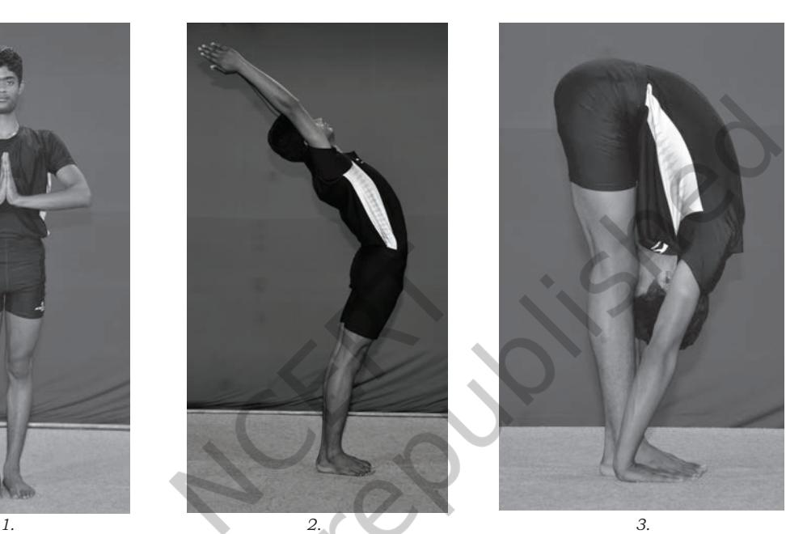
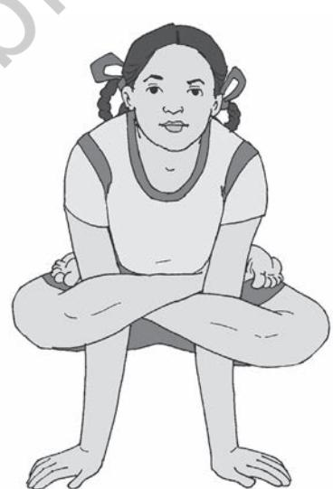

# **9.1 Introduction**

Development of personality is an important issue. Personality starts developing since birth, but it assumes great importance during adolescence, when reorganisation of personality takes place.

Personality is a very common term which is used in our day-to-day life. It tells us what type of person one is. We know that each person generally behaves consistently in most of the situations. The examples of this consistency can be seen in a person who remains friendly or a person who is generally kind or helpful in most situations. Such a consistent pattern of behaviour is termed as personality. It can be called as the sum total of behaviour that includes attitudes, emotions, thoughts, habits and traits. This pattern of behaviour is characteristic to an individual.

There are various dimensions of personality. These dimensions are related to physical, emotional, intellectual, social and spiritual aspects of our behaviour. For a holistic personality development, yoga plays an important role.

### **9.2 Yoga and Personality Development**

Yogic practices are found effective for development of all dimensions of personality.

Let us talk about the yogic practices that influences development of different dimensions of personality.

**Yoga and Physical Dimension of Personality:** Physical dimension is related to our body. It means that all organs and systems of our body should be properly developed and function. It implies a healthy body without any disease. Yogic practices like *asana*, *pranayama*, and *bandha* play a beneficial role in physical development of children. There is a series of *asanas*  and *pranayamas* which help to improve the functioning of the body.

**Yoga and Emotional Dimension of Personality:** Yogic practices are effective for development of emotional dimension related to our feelings, attitudes and emotions. There are two kinds of emotions : positive and negative. For example love, kindness are positive emotions, while anger and fear (exam phobia) are

negative emotions. Similarly, our feelings and attitudes may be positive and negative. For emotional development, positive feelings, attitudes and emotions should be developed and negative ones should be controlled, as the negative attitudes and emotions work as a mental block for the development of personality. Yoga plays a critical role in development of positive emotions. It brings emotional stability. It helps to control negative emotions. Yogic practices such as *yama*, *niyama*, *asana, pranayama, pratyahara* and meditation help in emotional management. For example, the principle of non-violence will protect us from negative emotions and develop positive feelings of love and kindness. Similarly, other principles of *yama* and *niyama* will help to develop positive emotions and attitudes in our personal and social life and therefore help in the management of emotions.

**Yoga and Intellectual Dimension of Personality:** Intellectual development is related to the development of our mental abilities and processes such as critical thinking, memory, perception, decision making, imagination, creativity, etc. Development of this dimension is very important as it enables us to learn new things and acquire knowledge and skills. Yogic practices such as *asana, pranayama, dharana, dhyana* (meditation) help to develop concentration, memory and thereby help in intellectual development.

**Yoga and Social Dimension of Personality:** Primary socialisation, probably the most important aspect of the personality development takes place during infancy, usually within the family. By responding to the approval and disapproval of parents and grandparents and imitating their examples, the child learns the language and many of the basic behaviour patterns of her/his society. The process of socialisation is not limited to childhood, but continues throughout life and teach the growing child and adolescent about the norms and rules of the society in which she/he lives . Some key elements of this process include respect for others, listening carefully to other persons, being interested in them, and voicing your thoughts and feelings politely, honestly and clearly so that you can be easily heard and understood. Principles of *yama* include these key elements and are very important as these help us in the betterment of our relationships with our friends, parents, teachers and others.

**Yoga and Spiritual Dimension of Personality:** This dimension is related to the development of values. It is also concerned with self-actualisation which is related to recognising one's potential and developing them to the maximum. Proper

Chapter-9 Yoga.indd 120 08-11-2016 11:41:56 AM

development of this dimension helps the person to realise one's true identity. For spiritual development, *yama, niyama, pratyahara* and *dhyana* (meditation) are helpful. *Yama* and *niyama* help to develop our moral values while *pranayama*, and meditation help us to realise our true self. Introspection is very effective for the development of 'self'.

#### *Yama* **(Restraint) and** *Niyama* **(Observance)**

*Yama* and *Niyama* are principles which need to be adopted always in our day-to-day life. These can be considered as the universal codes of conduct that help us in following high standards in our personal and social life. Principles of *yama*  are concerned with one's social life; while the principles of *niyama* are concerned with one's personal life. *Yama* and *niyama* are part of *Ashtanga yoga*.

The five principles of *yama* are: *Ahimsa* (non-violence), *Satya* (truthfulness); *Asteya* (non-stealing); *Brahmcharya* (abstinence) and *Aparigraha* (non-collectiveness).

The five principles of *niyama* are: *Shaucha* (cleanliness); *Santosha* (satisfaction); *Tapas* (austerity); *Swadhyaya*  (study of good literature and knowing about the 'self') and *Ishwarpranidhana* (dedication to the God/Supreme power).

### **9.3 Yogic Practices for Personality Development**

In the following section, we will discuss some yogic practices which contribute to the development of various dimensions of personality.

We begin with *Surya Namaskara*. Prepare the body by performing yogic micro practices.

### **9.3.1** *Surya Namaskara* **(Sun Salutation)**

*Surya* means 'sun' and namaskara means 'salutation' or 'bowing down'. It consist of 12 postures. The regular practice of *surya namaskara* helps improve blood circulation throughout the body and maintain health, and thereby helps one to remain disease-free. Postures practised during *surya namaskara* act as a good link between warm-ups and asanas. *Surya namaskara*  should preferably be done at the time of sunrise. It can be done any time on an empty stomach. However, morning is considered to be the best time for it. Adolescents should start doing *surya namaskara* daily to have healthy body and mind.

Chapter-9 Yoga.indd 121 08-11-2016 11:41:56 AM

#### **Let us perform** *surya namaskar* **by following the steps given below:**

- 1. Stand erect with legs together and hands by the sides of the body. Bring both the arms to the chest with palms together in the prayer posture *(Namaskarasana)*.
- 2. Inhaling, raise both the arms above the head. Stretching bend the trunk backwards *(Hastottanasana).*

3. Exhaling, bend the trunk forward and place the hands on the floor besides the feet and forehead near the knees *(Padahastasana)*.

4. Inhaling, stretch the right leg backward and bend the left leg at the knee. Tilt the head backward and, look up while arching the spine *(Ashwasanchalanasana).*

5. Stretch the left foot backward by the side of right foot, lower your head and move buttocks upwards. Keep arms and legs straight and heels on the floor *(Parvatasana).*

6. Lower the knees, chest and chin to the floor. Keep the hips slightly up. The toes, knees, chest, hands and chin should be touching the floor *(Ashtanga namaskara)*.

7. Lower the hips. Raise the head and torso up to the navel region. Bend the head backwards *(Bhujangasana)*.

Chapter-9 Yoga.indd 122 08-11-2016 11:41:59 AM

- 8. Lower the head and trunk to the floor, now raising the buttocks and straightening the arms, bring feet towards the head. Head should be between the arms. Come to the postion 5 *(Parvatasana).*
- 9. By bending the left leg, bring it to the front between the hands. Take the right leg behind with knee touching the floor. Keep palms on both the sides of the left foot and head tilted backward and back arched. Look up *(Ashwasanchalanasana).*
- 10. Exhaling, bring the right leg forward and keep it by the side of left leg. Keep the hands on the floor on sides of the feet and head near the knees *(Padahastasana).*

*8.* 

*9. 10.* 

Chapter-9 Yoga.indd 123 08-11-2016 11:42:01 AM

- 11. Inhaling, raise both the arms above the head and bend the trunk backwards *(Hastottanasana).*
- 12. Come to the erect and straight position. Join both palms in prayer posture *(Namaskarasana).*

#### **Benefits**

- • It helps to increase strength, endurance and flexibility.
- • It regulates all the systems of the body.
- • It improves concentration.
- • It helps in removing excess fat.
- • It helps in constipation and improve blood circulation in the body.
- • It energises the body.
- • It helps in increasing the height of the growing children and toning up the body.
- • It revitalises the body and refreshes the mind.
- • It stretches abdominal organs and improves digestion.

#### **Limitation**

One should avoid practising *surya namaskara* in case of high blood pressure, fever, heart diseases, hernia, slipped disk, intestinal tuberculosis and sciatica.

### **9.4 Asanas**

We all know that *asanas* are beneficial for our physical and mental development. You have also learnt so many *asanas* in previous classes. Now, we will discuss some more a*sanas* in this section.

Chapter-9 Yoga.indd 124 08-11-2016 11:42:01 AM

### **9.4.1** *Tadasana* **(Palm tree posture)**

*Tada* in Sanskrit means 'palm tree'. This is called *Tadasana*  because in this *asana* the student stands straight like a palm tree. Hence, it has been named *Tadasana*.

#### **Let us perform** *Tadasana* **by following the steps given below:**

- 1. Stand erect, feet together, hands by the side of the thighs. Keep the back straight and gaze in front.
- 2. Stretch the arms upward, keep them straight and parallel with each other in vertical position, with the palms facing inward.
- 3. Slowly raise the heels as much as you can and stand on toes. Stretch body up as much as possible. Maintain the position for 5-10 seconds.
- 4. To come back, bring the heels on the floor first. Slowly bring down the hands by the side of the thighs and relax.

Chapter-9 Yoga.indd 125 08-11-2016 11:42:02 AM

### **Remember the following points:**

|  |  |  | Dos |  |  | Don'ts |  |
| --- | --- | --- | --- | --- | --- | --- | --- |
| • | The | inner | upper | arms | should | • Do not bend forward | or |
|  | be touching the respective |  |  |  |  | backward. |  |
|  | ears. |  |  |  |  |  |  |
| • | Stretch the |  | arms | and | fingers |  |  |
|  | fully. |  |  |  |  |  |  |
| • | Keep | the | head, | neck | and the |  |  |
|  |  |  | body in one straight line. |  |  |  |  |

#### **Benefits**

- • It gives vertical stretch to whole body muscles.
- • It strengthens thighs, knees and ankles.
- • It helps improve height of the children.
- • This posture plays an important role in increasing one's self-awareness.
- • It helps to remove laziness and lethargy.

#### **Limitation**

- • Those having complaints of vertigo should not practise this *asana*.
# **9.4.2** *Katichakrasana* **(Lumber Twist Posture)**

*Kati* in Sanskrit means 'waist' and *chakra* means 'wheel'. In this *asana*, the waist is moved towards right side and left

side. The movements of the waist along with arms look like a wheel. Hence, it is called *Katichakrasana*.

### **Let us perform** *Katichakrasana* **by following the steps given below:**

- 1. Stand erect on the ground with feet 12 inches apart.
- 2. Now, keep the arms out-stretched in front of the body with palms facing each other at the shoulder level.
- 3. While inhaling, swing the arms slowly towards right side of your body.
- 4. Twist your body from the waist to the right and take your arms back as far as possible.
- 5. While swinging towards right side, keep the right arm straight and left arm bent.
- 6. Repeat the practice twisting toward left side as well.

Chapter-9 Yoga.indd 126 08-11-2016 11:42:03 AM

### **Remember the following points:**

|  | Dos |  |  |  |  |  |  |  | Don'ts |  |  |  |
| --- | --- | --- | --- | --- | --- | --- | --- | --- | --- | --- | --- | --- |
| • | Right is | hand |  | kept | straight | • | Don't | bend | forward | or |  |  |
|  | while twisting to the right |  |  |  |  |  | backward. |  |  |  |  |  |
|  | and vice versa. |  | Don't |  |  | • |  |  | the lower | part | move | of |
| • | Fingers | should |  | be | stretched |  | the body. |  |  |  |  |  |
|  | out. | Inhale |  | while | twisting | • | Do not | jerk | the body. |  |  |  |
|  | towards back |  |  | and | exhale |  |  |  |  |  |  |  |
|  | while coming to the normal |  |  |  |  |  |  |  |  |  |  |  |
|  | position. |  |  |  |  |  |  |  |  |  |  |  |
| • In | the position | final |  |  | of asana |  |  |  |  |  |  |  |
|  | gaze behind. |  |  |  |  |  |  |  |  |  |  |  |

### **Benefits**

- • It helps in making slim.
- • It relieves constipation and makes the lumber region strong.
- • It is good for respiratory ailments. Tuberculosis of lungs can be prevented.
- • It strengthens shoulders, neck, arms, abdomen, back and thighs.

#### **Limitation**

- • Do not practise it if suffering from chronic spinal pain or injury.
### **9.4.3** *Simhasana* **(Lion Posture)**

In Sanskrit *Simha* means 'lion'. In this *asana*, the face with open mouth and tongue stretched out towards the chin resembles the fierce look of a lion, hence, it is called *Simhasana*.

### **Let us perform** *Simhasana* **by following the steps given below:**

- 1. Sit in *Vajrasana* with palms on the respective knees.
- 2. Keep the knees apart.
- 3. Place both the heels upwards under perineum.
- 4. Place both the palms on the respective knees widely spreading out the fingers.
- 5. Lean forward and place the palms on the floor between the knees.
- 6. Open the mouth and stretch out the tongue as much as possible and gaze at *bhrumadhya* (centre of eyebrows).
- 7. Release the *bhrumadhya* dristi and relax your eyes.
- 8. Come to *Vajrasana* by placing the palms on the respective knees and relax.

Chapter-9 Yoga.indd 127 08-11-2016 11:42:03 AM

### **Remember the following points:**

|  |  |  | Dos |  |  |  |  |  |  | Don'ts |  |  |
| --- | --- | --- | --- | --- | --- | --- | --- | --- | --- | --- | --- | --- |
| • | The | knee | should | rest |  | on the | • | Do | not | protrude | the | tongue |
|  | ground. |  |  |  |  |  |  |  | beyond the capacity. |  |  |  |
| • | Sit on | the | heels. |  |  |  |  |  |  |  |  |  |
| • | The | buttocks | are | to | be | lifted |  |  |  |  |  |  |
|  | up. |  |  |  |  |  |  |  |  |  |  |  |
| • | The | fingers | should | be |  | spread |  |  |  |  |  |  |
|  |  |  | out in imitation of the lion's |  |  |  |  |  |  |  |  |  |
|  | paws. |  |  |  |  |  |  |  |  |  |  |  |

#### **Benefits**

- • It is beneficial for the muscles of the face and neck.
- • The tongue becomes more elastic and healthier.
- • Salivary glands become strong.
- • It regulates functioning of thyroid.
- • It helps in reducing dullness and depression and improves slurring of speech.

#### **Limitation**

- • Do not practise if suffering from backache, arthritis of hip and knee, throat problems and pain in jaws.
## **9.4.4** *Mandukasana* **(Frog Posture)**

*Manduka*, a Sanskrit word means 'frog'. In this *asana*, the final posture resembles the shape of a frog. Hence, it is named *Mandukasana*.

### **Let us perform** *Mandukasana* **by following the steps given below:**

- 1. Sit in *Vajrasana*.
- 2. Make the fists with thumbs inside and put them near navel and press the navel area.

- 3. Exhale slowly, lean forward from the
- waist, lower the chest, so that it rests on the thighs.
- 4. Keep the head and neck raised and gaze in front.
- 5. Maintain the position comfortably for 5-10 seconds.
- 6. To release the posture, come back to the sitting position by raising the trunk; remove your fists from the navel area and sit in *Vajrasana*.

Chapter-9 Yoga.indd 128 08-11-2016 11:42:04 AM

### **Remember the following points:**

|  | Dos |  |  |  |  | Don'ts |  |  |  |  |  |  |
| --- | --- | --- | --- | --- | --- | --- | --- | --- | --- | --- | --- | --- |
| • | Keep | the | head | and | neck | • | Do | not | lean | beyond | the |  |
|  | raised in final position. |  |  |  |  | capacity. |  |  |  |  |  |  |
| • | Look | in the | front. |  |  | • | Do | not | jerk | the | body | while |
| • | Put | pressure | on | the | navel | leaning forward. |  |  |  |  |  |  |
|  | area. |  |  |  |  |  |  |  |  |  |  |  |

#### **Benefits**

- • This *asana* is beneficial for the people having heavy bellies, thighs or hips.
- • It eliminates gases from the abdomen.
- • It benefits people suffering from constipation, diabetes and digestive disorders.

#### **Limitation**

- • Person with slipped disc, lumber spondylitis or any other major disease of the spine should not practise this *asana*.
### **9.4.5** *Uttana-mandukasana*

### **(Stretched up Frog Posture)**

*Uttana* means 'upright' or 'stretched up' and *manduka*  means 'frog'. In final position of this *asana*, the body looks like a stretched up or upright frog, hence, it is called *Uttana-mandukasana.*

### **Let us perform** *Uttana-mandukasana* **by following the steps given below:**

- 1. Sit in *Vajrasana*.
- 2. Keep both the knees wide apart to such an extent that toes of both the feet touch each other. The head, neck and trunk are kept erect. The eyes are either closed or kept open.
- 3. Raise the arms above the head, fold them and take them behind.
- 4. Place the right palm below left shoulder and left palm below right shoulder.
- 5. Maintain this position comfortably for 5-10 seconds.
- 6. To come back, remove the arms one by one, bring the knees together and come to *Vajrasana*.

Chapter-9 Yoga.indd 129 08-11-2016 11:42:05 AM

### **Remember the following points:**

|  | Dos |  |  |  |  |  |  |  |  | Don'ts |
| --- | --- | --- | --- | --- | --- | --- | --- | --- | --- | --- |
| • | The | head | is | surrounded | by | • | Do | not | bend | the arms. |
|  | the elbows. |  |  |  |  | • | Do | not | lean | forward. |
| • | Keep erect. | the |  | spine and | neck |  |  |  |  |  |

#### **Benefits**

- • It helps in reducing backache.
- • It improves the blood circulation in the chest and abdomen.
- • It tones the abdominal and shoulder muscles.
- • It improves the functioning of lungs by improving the movements of diaphragm.

#### **Limitation**

- • Those suffering from chronic knee pain and piles should avoid this *asana*.
### **9.4.6** *Kukkutasana* **(Cockerel Posture)**

This is called *Kukkutasana* because this asana imitates the posture of a cock. This is a balancing posture, therefore, it should be practised with caution. Before taking up this practice, one must have sufficient practice of *Padmasana*.

### **Let us perform** *Kukkutasana* **by following the steps given below:**

- 1. Sit in *Padmasana*. Keep your hand on side.
- 2. Now insert the arms between calves and thighs until the palms reach the floor.

- 3. Inhaling, lift the body up as high as possible in the air. Support and balance the body on the hands. Keep the neck and head straight.
- 4. Maintain the position with normal breath comfortably for 5-10 seconds.
- 5. To release the posture, exhaling lower the body and bring it to the floor. Take the inserted arms out and sit in *Padmasana*.

Chapter-9 Yoga.indd 130 08-11-2016 11:42:07 AM

### **Remember the following points:**

|  | Dos |  |  |  |  |  |  | Don'ts |  |  |
| --- | --- | --- | --- | --- | --- | --- | --- | --- | --- | --- |
| • | Keep the | head | straight | and | • | Do | not | bend | forward. |  |
|  | eyes on fixed in front. |  |  |  | • | Do | not | bring | the fingers |  |
| • | Keep palms | apart |  | firmly on |  | close. |  |  |  |  |
|  | the ground |  | while | fingers | • | Do | not | bend | the head | or |
|  | pointing forward. |  |  |  |  | neck. |  |  |  |  |
| • | Body should | be | balanced | on |  |  |  |  |  |  |
|  | the arms. |  |  |  |  |  |  |  |  |  |
| • | Hold the | back | straight. |  |  |  |  |  |  |  |

#### **Benefits**

- • This posture helps to strengthen the shoulder, arms and elbows.
- • This posture also helps to develop a sense of balance and stability.
- • This makes the body strong.

#### **Limitation**

- • People suffering from heart disease or high blood pressure should not practise this *asana*.
### **9.4.7** *Akarna Dhanurasana*

### **(Bow and Arrow Posture)**

*Akarna* means 'ear' and *Dhanur*  means 'bow'. In this *asana*, the posture resembles like a 'bow'. In this posture, hand is pulled up to ear like pulling a bow and arrow. Hence, this is called *Akarna Dhanurasana*.

### **Let us perform** *Akarna Dhanurasana* **by following the steps given below:**

1. Sit and stretch out both the legs in front. Keep both the arms by the side of the body. Palms should be resting on the ground, fingers together pointing forward.

- 2. Catch hold of the right big toe by the hook of the index finger and thumb of the left hand.
- 3. Make the hook with the help of index finger and thumb of right hand. Clasp the big toe of the left leg.
- 4. Bend the right leg at knee. Pull the feet by the toe, so as it reaches up to the left ear.
- 5. Maintain the position for 5 to 10 seconds.

Chapter-9 Yoga.indd 131 08-11-2016 11:42:08 AM

- 6. To come back, lower the right foot, release the hand and keep it by the side. Now bring the left leg on the floor. Release the right hand and keep it by the side of the body.
(Do it from other side changing the position of legs and hands.)

**Remember the following points:**

|  |  |  | Dos |  |  |  |  |  | Don'ts |
| --- | --- | --- | --- | --- | --- | --- | --- | --- | --- |
| • | Keep | the | trunk |  | and |  | head • | Do | not jerk or strain. |
|  | erect. |  |  |  |  |  | • | In | the beginning do not pull |
| • | While | bending |  | the |  | leg, | the |  | the foot up to ear. |
|  |  |  | arms should be straight. |  |  |  |  |  |  |
| • | Pull | the | foot | up | to | ear | as |  |  |
|  |  | much as you can. |  |  |  |  |  |  |  |

#### **Benefits**

- • This *asana* is beneficial in constipation and indigestion.
- • It strengthens the abdominal muscles, muscles of arms and legs.
- • It makes the legs supple.

#### **Limitation**

- • Do not practise, if suffering from spinal complaints, dislocation of hip joints and sciatica.
### **9.4.8** *Matsyasana* **(Fish Posture)**

In Sanskrit, *Matsya* means 'fish'. In final posture of this *asana*,

the body takes shape of a floating fish. The folded legs resemble the tail of a fish, hence, it is called *Matsyasana*. This *asana* should be performed under the supervision of an expert.

### **Let us perform**  *Matsyasana* **by following the steps given below:**

- 1. Sit in *Padmasana*.
- 2. Lie on the back with support of the elbows.
- 3. Lift the neck and chest slightly up; the back should be arched and raised from the ground.
- 4. Bend the head backward and place the crown of the head on floor.

Chapter-9 Yoga.indd 132 08-11-2016 11:42:09 AM

- 5. Make hooks with the index fingers of both hands; and clasp the big toes with hooks of opposite hands.
- 6. Maintain the position for 10-15 seconds or as long as comfortable.
- 7. To come back, release the toes; place hands on the ground; raise head up with the support of hands. Sit with the help of the elbows.

#### **Remember the following points:**

|  | Dos |  |  |  |  |  | Don'ts |  |  |  |  |  |
| --- | --- | --- | --- | --- | --- | --- | --- | --- | --- | --- | --- | --- |
| • | Try | to make | the |  | maximum |  | • the | Do not | allow |  | knees | to |
|  | arch of the spine. |  |  |  |  |  | come up from the ground |  |  |  |  |  |
| • | Keep | the | arms | bent | at | the | while arching the back. |  |  |  |  |  |
|  | elbows. |  |  |  |  |  | • | While | leaning | backward, |  | do |
| • | The | crown | of | head |  | must |  | not strain. |  |  |  |  |
|  | touch the floor. |  |  |  |  |  |  |  |  |  |  |  |
| • | The | knees | must | touch |  | the |  |  |  |  |  |  |
|  | ground. |  |  |  |  |  |  |  |  |  |  |  |

#### **Benefits**

- • It improves blood supply to the brain.
- • It regulates the functioning of thyroid gland and improves immune system.
- • It alleviates backache and cervical spondylitis.
- • It divert the blood from the legs to the pelvic region and helps to increase the tone of the abdominal muscles.
- • It is beneficial in lungs and respiratory disorders.

#### **Limitation**

- • Avoid practising this *asana* in case of vertigo, cardiovascular diseases, hernia, arthritis, knee and ankle and spinal problems.
### **9.4.9** *Bhujangasana* **(Cobra Posture)**

*Bhujangasana* comprises two wordsbhujanga and *asana*. In Sanskrit, *bhujanga* means cobra (snake) and *asana* means posture. In the final position of this *asana*, the body resembles the shape of a hooded snake, hence the posture is called *Bhujangasana*.

### **Let us perform** *Bhujangasana* **by following the steps given below:**

- 1. Lie prone on the ground with forehead touching the floor; legs together, hands by the side of thighs.

Chapter-9 Yoga.indd 133 08-11-2016 11:42:09 AM

- 2. Fold the hands at elbows and place the palms by the side of the shoulders, thumbs under armpits, with tip of the fingers not crossing the shoulder line.
- 3. Inhaling, slowly raise the head, neck and shoulders. Shoulders should be shrugged backwards.
- 4. Raise the trunk up to the navel region. Raise the chin as high as possible.

- 5. Eyes should be kept gazing upward.
- 6. Maintain the position for 5 -10 seconds or as long as comfortable.
- 7. To come back, bring down the upper part of navel region, chest, shoulders, chin and head.
- 8. Place the forehead on the ground and arms along the body, hands by sides of the thighs. Relax.

#### **Remember the following points:**

|  |  | Dos |  |  |  |  |  | Don'ts |  |  |  |
| --- | --- | --- | --- | --- | --- | --- | --- | --- | --- | --- | --- |
| • | Put | minimum | weight | on | • Do |  | not | give | jerk | to | lift the |
|  | hands. |  |  |  |  | body. |  |  |  |  |  |
| • | Distribute | weight | on the | back. | • Do |  | not | allow | the |  | elbows to |
|  | The trunk should be |  |  | raised |  | spread out. |  |  |  |  |  |
|  | up to the navel only. |  |  |  | • Do |  | not | raise |  | the | region |
| • | While | raising, |  | shoulders |  |  |  | beyond the navel region. |  |  |  |
|  | should | be |  | shrugged |  |  |  |  |  |  |  |
|  | backwards. |  |  |  |  |  |  |  |  |  |  |

#### **Benefits**

- • It affects the spinal column and makes it flexible.
- • It solves digestive complaints.
- • It increases intra-abdominal pressure benefiting the internal organs especially the liver and kidneys.
- • It relaxes both body and mind.

#### **Limitation**

Those suffering from hernia, peptic ulcer, intestinal tuberculosis and acute abdominal pain should avoid this practice.

Chapter-9 Yoga.indd 134 08-11-2016 11:42:10 AM

# **9.4.10** *Makarasana* **(Crocodile Posture)**

The posture is called *Makarasana* as the body resembles the shape of *makara*, which in Sanskrit means 'crocodile'. *Makarasana* is a relaxing *asana* to body and mind and is very beneficial for reducing stress.

### **Let us perform** *Makarasana* **by following the steps given below:**

- 1. Lie down on your stomach.
- 2. Keep the legs at a comfortable distance with heels inside and toes pointing outward.
- 3. Fold arms at elbows, and keep them under the head.
- 4. Place the head on the cushion of the arms, close the eyes and relax.
- 5. To come back bring the arms along the body and legs together.

### **Remember the following points:**

|  | Dos |  |  |  |  |  | Don'ts |  |  |  |  |
| --- | --- | --- | --- | --- | --- | --- | --- | --- | --- | --- | --- |
| • | Both |  | elbows | can | be kept |  | • press | Do | not | the | chest |
|  | slightly |  | apart |  | if | found | hard on the ground so that |  |  |  |  |
|  | difficult to put one above the |  |  |  |  |  | breathing | the |  |  | becomes |
|  | other. |  |  |  |  |  | uncomfortable. |  |  |  |  |
| • | Do | a | deeper |  | abdominal |  | • bring | Do | not | the | feet |
|  | breathing. |  |  |  |  |  |  | together. |  |  |  |

### **Benefits**

- • Traditionally it is a relaxing posture.
- • It is beneficial in almost all psychosomatic disorders.
- • It is beneficial for respiratory organs, as well as digestive organs.

#### **Limitations**

- • Those having complaint of obesity and cardiac problems should avoid this practice.
### **9.4.11** *Shalabhasana* **(Locust Posture)**

This *asana* is named after the locust. In Sanskrit *Shalabha* refers to 'locust' and *asana* means 'posture'. In the final posture of this *asana*, body resembles a locust.

Chapter-9 Yoga.indd 135 08-11-2016 11:42:11 AM

#### **Let us perform** *Shalabhasana* **by following the steps given below:**

- 1. Lie flat on the stomach, legs together, hands by the side of the thighs, palms facing downward and heels together. Chest and forehead should be placed on the ground.
- 2. Place both palms under the thighs.
- 3. Stretch the chin slightly forward and keep it on the floor.
- 4. Inhaling and pressing the palms on the ground, raise both the legs upward as high as possible.

- 5. Maintain the position with normal breathing for few seconds.
- 6. To come back, slowly bring down the legs to the floor. Take out the hands from the thighs. Lie flat on the stomach, legs together, hands by the side of the thighs and palms facing downward.

#### **Remember the following points:**

|  | Dos |  |  |  |  |  | Don'ts |  |  |
| --- | --- | --- | --- | --- | --- | --- | --- | --- | --- |
| • | Use | the | hand | to | balance • | Jerk and |  | unbearable | strains |
|  |  |  | and also to control the body |  |  | should be avoided. |  |  |  |
|  | weight. |  |  |  | • | Do not | rush | through | the |
| • | While | lifting | the | leg, | contract |  | exercise and do not push |  |  |
|  |  |  | the lower dorsal muscles and |  |  |  | yourself too much. |  |  |
|  |  |  | press the abdomen on the |  | • | Do not put | too | much | pressure |
|  | floor. |  |  |  |  | on the hands. |  |  |  |
| • | Legs | should | be |  | outstretched |  |  |  |  |
|  | and straight. |  |  |  |  |  |  |  |  |

#### **Benefits**

- *• Shalabhasana* stimulates the autonomic nervous system especially the parasympathetic system.
- • It strengthens the lower back and pelvic organs.
- • It gives relief in the conditions of mild sciatica, backache and non-serious slip disk.

Chapter-9 Yoga.indd 136 08-11-2016 11:42:11 AM

- • It is a good exercise for the legs, thighs, hips, buttocks, the lower abdomen, diaphragm and wrists.
- • It improves blood circulation in the pelvic region.
- • It helps to reduce excessive fat formed around the knees, the thighs, the waist and the abdomen and thereby improves physical appearance and positive body image.
- • It helps to regulate the functioning of liver.
- • It is beneficial to increase elasticity and flexibility of spine.

#### **Limitation**

- • People suffering from high blood pressure, asthma and cardiac diseases, weak lungs, hernia, peptic ulcers and intestinal tuberculosis should avoid practising this *asana*.
### **9.4.12** *Dhanurasana* **(Bow Posture)**

In Sanskrit *Dhanur* means 'bow'. This is called the bow posture because in this posture the body resembles a bow with its string attached to it. The trunk and the thighs represent the bow, whereas the hands and legs take the place of the string.

#### **Let us perform** *Dhanurasana* **by following the steps given below:**

- 1. Lie down in prone position.
- 2. Exhaling, slowly bend the legs backwards at the knees.
- 3. Hold the toes or ankles firmly with hands as per your capacity.
- 4. Inhaling, raise thighs, head and chest as high as possible. Stretch and bring the toes or ankles towards head. Look upward. Maintain the position comfortably for 5-10 seconds.
- 5. To come back, release the arms and keep them beside the body. Straighten the legs. Bring the legs, head, shoulders and chest slowly on the floor and relax in starting position.

Chapter-9 Yoga.indd 137 08-11-2016 11:42:12 AM

#### **Remember the following points:**

|  | Dos |  |  |  |  |  |  | Don'ts |  |  |  |  |  |
| --- | --- | --- | --- | --- | --- | --- | --- | --- | --- | --- | --- | --- | --- |
| • | Balance |  | the weight | of | body | on | • | Do jerk | not | or | strain, | take | the |
|  | lower abdominal region. |  |  |  |  |  |  | position slowly. |  |  |  |  |  |
| • | Arch | the | back, | as | much | as | • | assuming | While |  | the | posture, |  |
|  | possible. |  |  |  |  |  |  | do not lean over to a side. |  |  |  |  |  |
| • | Keep | the | chest | close | to | the | • | Do bend | not | or | spread | out | the |
|  | floor. |  |  |  |  |  |  | elbows, while maintaining |  |  |  |  |  |
| • | The |  | arms | should |  | be |  | the posture. |  |  |  |  |  |
|  | straight. |  |  |  |  |  |  |  |  |  |  |  |  |

#### **Benefits**

- *• Dhanurasana* is a good exercise for joint of the shoulders, knees, ankles and entire backbone.
- • It is beneficial for management of diabetes mellitus as it massages the liver and pancreas.
- • It helps to reduce excess fat around the belly, waist and hips.
- • It strengthens the ligaments, muscles and nerves in the back, arms, legs, shoulders, neck and abdomen.
- • It stimulates and regulates thyroid and adrenal glands.
- • It helps in reducing backache pain.
- • It is good for the conditions of hunched back and drooping shoulders.

#### **Limitation**

- • Person with high blood pressure, hernia, peptic ulcer, appendicitis, colitis slipped disc, lumber spondylitis should not practise this *asana*.
### **9.4.13** *Sarvangasana* **(Shoulder Stand Posture)**

*Sarvangasana* comprises three words: *sarva, anga* and *asana*. In Sanskrit, *sarva* means 'whole' and *anga* means 'parts of the body' and *asana* means 'posture'. The posture is called *Sarvangasana,* because it influences the whole body.

#### **Let us perform** *Sarvang-asana* **by following the steps given below:**

- 1. Lie on the back with the hands along the thighs, palms resting on the ground.
- 2. Pushing down on hands slowly raise both the legs up to 300. Hold the position for few seconds.
- 3. Slowly, raise the legs further up to 600 and maintain the position for few seconds.
- 4. Raise the legs further up to 900 and maintain the position for few seconds.

Chapter-9 Yoga.indd 138 08-11-2016 11:42:13 AM

- 5. Bend the arms at the elbow and place the hands at the hips. Now, cupping the buttocks with hands raise the buttocks. Raise legs, abdomen and chest up vertically in a straight line with the trunk. Place the palms on your back to support the back.
- 6. Push the chest forward so that it presses firmly against the chin. Keep the elbows close to each other.
- 7. Maintain the position comfortably for 5-10 seconds.
- 8. To come back, lower the spine very slowly along the floor. Lower the buttocks with hands supporting the back and bring the buttocks on the ground. Bring the legs up to 900 and stop there. Place the hands firmly on the ground close to the body. Lower the legs still up to 600 and 300 and then slowly on the ground and relax.

#### **Remember the following points:**

|  | Dos |  |  |  |  | Don'ts |  |  |  |  |  |
| --- | --- | --- | --- | --- | --- | --- | --- | --- | --- | --- | --- |
| • | Movements of the |  |  | legs | should | • bending the | Avoid |  |  | legs. |  |
|  | be very slow, stopping at |  |  |  |  | • | Avoid | jerky |  | action | in |
|  | different angles. |  |  |  |  |  |  |  | assuming the final position |  |  |
| • In | position, | the | final |  | keep the |  |  | or returning from it. |  |  |  |
|  | legs vertical in a straight line |  |  |  |  |  |  |  |  |  |  |
|  | with the trunk. |  |  |  |  |  |  |  |  |  |  |
| • | Support back |  | the | with | your |  |  |  |  |  |  |
|  | hands. |  |  |  |  |  |  |  |  |  |  |

Chapter-9 Yoga.indd 139 08-11-2016 11:42:13 AM

#### **Benefits**

- • It regulates the thyroid function.
- • It helps in increasing the circulation of blood to the brain.
- • It strengthens the neck region.
- • It helps in managing problems related to endocrine glands.

#### **Limitation**

- • Those suffering from high blood pressure, epilepsy, pain in neck and lumber region, excessive obesity and cardiovascular complaint should not practise it.
### **9.4.14** *Halasana*

*Hala* in Sanskrit and Hindi means 'plough'. In the final position of this *asana*, the body resembles the shape of a plough. As plough makes the hard ground soft, in this *asana* the veins are stretched which reduces the stiffness of the body.

**Let us perform** *Halasana* **by following the steps given below:**

1. Lie in supine position, legs together and arms beside the body.

- 2. Keeping the knees straight, raise the legs up to 30°.
- 3. Raise the legs further up to 60°.
- 4. Raise the legs still further up to 90°, keeping them vertical and straight.

Chapter-9 Yoga.indd 140 08-11-2016 11:42:14 AM

- 5. Pressing the arms raise the trunk by lowering the legs over the head, the toes touching the ground. Push the legs a little beyond the head.
- 6. Keep the arm straight on floor. Maintain the position for 5-10 seconds.
- 7. To come back, remove the arms, slowly lower the back and buttocks to the ground, bring the legs to 900 position. Lower the legs to starting position.

#### **Remember the following points:**

|  |  |  | Dos |  |  |  |  |  |  | Don'ts |  |  |
| --- | --- | --- | --- | --- | --- | --- | --- | --- | --- | --- | --- | --- |
| • | Go | to | the | different |  | stages | • | Avoid of | giving | any | type | jerk |
|  | slowly and retain them for |  |  |  |  |  |  |  | to the body. |  |  |  |
|  | some time. |  |  |  |  |  | • | Do not support | withdraw |  | the |  |
| • | Give | the | support | of | the | hands |  | of the hand at the back until |  |  |  |  |
|  | to the back while raising the |  |  |  |  |  |  | the legs touch the ground. |  |  |  |  |
|  | trunk. |  |  |  |  |  |  |  |  |  |  |  |
| • | Keep |  | the | knees |  | straight | • | Do not to touch | force | the | legs |  |
|  | through all the stages of the |  |  |  |  |  |  | the ground, if it is difficult. |  |  |  |  |
|  | asana. |  |  |  |  |  |  |  |  |  |  |  |
| • | Balance |  | weight | on | hands | and |  |  |  |  |  |  |
|  | shoulders. |  |  |  |  |  |  |  |  |  |  |  |

#### **Benefits**

- • It gives good exercise to the thyroid gland/parathyroid gland.
- • It gives a good stretch to the spinal column and back deep muscles, making the spine strong and healthy.
- • It helps in increasing the height of children.
- • It alleviates problem of dyspepsia and constipation is removed.

#### **Limitation**

- • Practice of this asana should be avoided in case of stiffness in spine, cervical spondylities, hernia, high blood pressure and slipped disc.
### **9.4.15** *Shavasana* **(Corpse Posture)**

In Sanskrit, *Shava* means a 'dead body'. In this posture the body resembles like a dead body, hence, this *asana* is called *Shavasana*. As the name suggests, this *asana* takes the person away from tension; reduces stress and is relaxing to the body and the mind.

Chapter-9 Yoga.indd 141 08-11-2016 11:42:15 AM

### **Let us perform** *Shavasana* **by following the steps given below:**

- 1. Lie flat in supine position.
- 2. Keep the legs straight with feet at 8-12 inches apart. Keep heels inside and toes outside.
- 3. Keep the palms facing upward slightly away from the body with fingers in a semi-flexed position.
- 4. Take deep breath and simultaneously close the eyes. Feel complete relaxation in your body. Try to relax all parts of your body.
- 5. Breathe normally and concentrate on the flow of breath.
- 6. To come back, open your eyes and come to the starting position.

#### **Remember the following points:**

|  |  | Dos |  |  |  |  |  |  | Don'ts |  |  |
| --- | --- | --- | --- | --- | --- | --- | --- | --- | --- | --- | --- |
| • | Withdraw | attention |  | from | • | Do | not | tense | the | muscles | of |
|  | external surroundings. |  |  |  |  | body. |  |  |  |  |  |
| • | All parts of | body | should | be | • | Try | not | to | sleep. |  |  |
|  | relaxed. |  |  |  |  |  |  |  |  |  |  |
| • | Try to be aware | of the | internal |  |  |  |  |  |  |  |  |
|  | happenings. |  |  |  |  |  |  |  |  |  |  |

#### **Benefits**

- • It removes stress and tension.
- • It is useful to reduce high blood pressure.
- • It relaxes the body and mind.
- • It removes fatigue from the body.
- • It is beneficial in the cases of insomnia as it helps to induce sleep.

#### **Limitation**

- • Do not practise if suffering from low blood pressure.
### **9.5 Kriya**

### **9.5.1** *Kapalabhati* **(Frontal Brain Cleansing)**

*Kapalabhati* is considered a *Kriya* (cleansing practice) which cleanses the frontal brain. In Sanskrit, *Kapala* means 'skull' and bhati means 'shine'. *Kapalabhati* helps to improve the functions of the organs located in the skull.

#### **Let us perform** *Kapalabhati* **by following the steps given below:**

- 1. Sit straight in any meditative pose like *Padmasana* or *Vajrasana.*
- 2. Take deep breath through the nostrils.

Chapter-9 Yoga.indd 142 08-11-2016 11:42:15 AM

- 3. Exhale forcefully in such a way that the lower abdomen is contracted to expel out the air. Inhale spontaneously and passively without making any efforts. Do not make effort to inhale. Air will enter the body through the passive inhalation. This is one stroke of Kapalabhati. Begin with 20 strokes at a time. This is one round. One can practise one to three rounds in a practical session. Gradually increase the strokes in one round.
#### **Remember the following points:**

|  | Dos |  |  |  |  |  |  | Don'ts |  |  |  |
| --- | --- | --- | --- | --- | --- | --- | --- | --- | --- | --- | --- |
| • | Inhalation | should | be | passive | • | Do | not | move |  | the | chest |
|  | and short, while exhalation |  |  |  |  | or |  | shoulders |  |  | during |
|  | should be forceful. |  |  |  |  |  | exhalation. |  |  |  |  |
| • | Kapalabhati |  | should | be | • | Do | not | contract | or | distort | the |
|  | practised | after | asana | but |  | face. |  |  |  |  |  |
|  | before meditation. |  |  |  |  |  |  |  |  |  |  |

#### **Benefits**

- • It stimulates the nerves in the abdominal region, tones up the abdominal muscles and improves digestion.
- *• Kapalabhati* expels more carbon-dioxide and other waste gases from the lungs than the normal breathing.
- • It improves heart and lungs capacity and therefore good for bronchial/asthma.
- • It improves blood circulation throughout the body.
- • It energises the body and removes lethargy.

#### **Limitation**

- • Those suffering from cardio-vascular problems, high blood pressure, hernia, vertigo and gastric ulcer complaints, should avoid practising *kapalabhati.*
### **9.5.2** *Agnisara*

It is considered as a *Kriya* in yogic practices. The meaning of *Agnisara* is to increase the gastric fire. In Sanskrit *agni* means 'fire' and *sara* means 'essence'. This *kriya* regulates the essence of fire which is supposed to be located in the navel region. This practice regulates the functioning of abdominal organs.

### **Let us perform** *Agnisara* **by following the steps given below:**

- 1. Stand erect with the feet apart from each other.
- 2. Keep the hands on thighs above the knee. Exhale completely.
- 3. Bend the knees and the upper part forward.

Chapter-9 Yoga.indd 143 08-11-2016 11:42:15 AM

- 4. Contract and expand the abdominal muscles rapidly for as long as comfortable while retaining the breath out side.
- 5. Then slowly breathe in. Repeat the practice 2-3 times.

**Remember the following points:**

|  | Dos |  |  |  |  |  |  |  | Don'ts |  |  |  |
| --- | --- | --- | --- | --- | --- | --- | --- | --- | --- | --- | --- | --- |
| • | It | is | advisable | to | practise | it | • | Avoid | slightest | inhalatory |  |  |
|  | on an empty stomach. |  |  |  |  |  |  | effort. |  |  |  |  |
| • | Do |  | practise for | two | or | three | • | Do | not | practise | it | after |
|  | times. |  |  |  |  |  |  | meals. |  |  |  |  |

### **Benefits**

- • It strengthens the abdominal muscles and nerves.
- • It improves the gastric fire and stimulates appetite.
- • It alleviates constipation and sluggishness of liver.
- • It alleviates dullness and depression.

### **Limitation**

- • Person suffering from high blood pressure, heart disease, peptic ulcers or chronic diarrohoea should not perform this *kriya.*
# **9.6 Pranayama**

*Prana* refers to the 'universal life force' and *ayama* means to 'regulate'. *Prana* is the vital energy without which the body would not survive. *Pranayama* relates to breathing techniques which help to increase breathing capacity. Some common *pranayamas* include *anuloma-viloma, bhastrika, ujjayi, sheetali,* etc.

# **9.6.1** *Anuloma-viloma Pranayama*  **(Alternate Nostril Breathing)**

The *Anuloma* means 'towards' and *Viloma* means 'reverse'. It is called *Anuloma-viloma* because alternate nostrils are used for each inhalation and exhalation. One inhales through the left nostril and then exhales through the right nostril , then the order is reversed by inhaling through the right nostril, and exhaling through the left nostril. This *pranayama* is called *Nadi-shodhana pranayama* also, if it is performed with *kumbhaka* (holding the breath).

### **Let us perform** *Anuloma-viloma* **by following the steps given below:**

- 1. Sit in the position of *Padmasana* or in any other comfortable meditative posture.
Chapter-9 Yoga.indd 144 08-11-2016 11:42:15 AM

- 2. Keep the body erect and place the hands on the respective knees.
- 3. Raise the right hand and place the right thumb on the right nostril and close it.
- 4. Inhale slowly through the left nostril.
- 5. Close the left nostril by the ring finger and the little finger and exhale slowly through the right nostril.
- 6. Again inhale through the right nostril.
- 7. Close the right nostril with thumb and exhale through the left nostril. This is one round of *Anuloma-viloma.*
- 8. Repeat it 10 times.

#### **Remember the following points:**

|  | Dos |  |  |  |  |  |  |  |  | Don'ts |  |  |  |
| --- | --- | --- | --- | --- | --- | --- | --- | --- | --- | --- | --- | --- | --- |
| • | Inhale | the | air | slowly |  | without |  | • | Avoid | producing | sound |  | from |
|  | bulging the abdomen. |  |  |  |  |  |  |  | the nose. |  |  |  |  |
| • Keep |  | the | ratio | of | 1:1 | or | 1:2 | • | Do not | press | hard | on the |  |
|  |  |  | between the inhalation and |  |  |  |  |  | nostrils. |  |  |  |  |
|  | the exhalation. |  |  |  |  |  |  | • | Avoid | retaining |  |  | breath |
|  |  |  |  |  |  |  |  |  | (kumbhaka) |  | in |  | the |
|  |  |  |  |  |  |  |  |  | beginning. |  |  |  |  |

#### **Benefits**

- • It calms down the mind and improves concentration.
- • It improves functioning of all cells of the body by providing them sufficient oxygenated blood.
- • It purifies the blood.
- • It improves blood supply to brain.
- • It helps to regulate blood pressure.
- • It helps in managing stress by reducing anxiety.
- • It is beneficial in many diseases such as asthma, high or low blood pressure, insomnia, chronic pain, endocrine imbalances, heart-problems, hyperactivity, etc.

#### **Limitation**

- • In the beginning, retention of breath should be avoided.
### **9.6.2** *Bhastrika Pranayama*

The word *Bhastrika* has been taken from a Sanskrit word *'bhastra'* which means a pair of 'bellows'. In this *pranayama,*  the action of a *bhastra* or bellows are imitated. In this pranayama, inhalation and exhalation are done forcefully in rapid succession. Just as a blacksmith blows in and out the bellows forcefully in rapid succession, dilating and contracting it, similarly breath is taken in and out by dilating and contracting the stomach in forced and rapid succession.

Chapter-9 Yoga.indd 145 08-11-2016 11:42:16 AM

#### **Let us perform** *Bhastrika Pranayama* **by following the steps given below:**

- 1. Sit in *Padmasana, Ardhapadmasana* or in any other meditative posture. Keep the body erect.
- 2. Slowly inhale through the nostrils.
- 3. Then exhale quickly and forcefully through the nostrils.
- 4. Immediately inhale with force.
- 5. Continue this forceful rapid exhalation and inhalation counting up to ten breaths.
- 6. At the end of the tenth breath, the final exhalation is followed by a deep inhalation and slow exhalation. This is one round of *Bhastrika pranayama.*
- 7. Take few normal breaths after this round before starting another round.
- 8. Complete three rounds of *Bhastrika pranayama*.
- 9. There may be variations in the technique of *Bhastrika pranayama.*

#### **Remember the following points:**

|  | Dos |  |  |  |  |  |  | Don'ts |  |  |  |
| --- | --- | --- | --- | --- | --- | --- | --- | --- | --- | --- | --- |
| • | Sit | straight | and open | the | • | Do not |  | go | beyond |  | the |
|  | chest for proper strokes. |  |  |  |  | capacity. |  |  |  |  |  |
| • | Lungs, |  | diaphragm | and | • | Chest | and | shoulders |  | should |  |
|  | stomach |  | should | move |  | not move. |  |  |  |  |  |
|  | with | each | inhalation | and | • | Do not |  | practise it in |  | extremely |  |
|  | exhalation. |  |  |  |  | hot conditions. |  |  |  |  |  |
| • | Bhastrika |  | pranayama |  |  |  |  |  |  |  |  |
|  |  |  | should be performed after |  |  |  |  |  |  |  |  |
|  | asana | and | nadishodhana |  |  |  |  |  |  |  |  |
|  | pranayama. |  |  |  |  |  |  |  |  |  |  |

#### **Benefits**

- • It increases gastric fire and improves appetite.
- • It destroys phlegm.
- • It is beneficial in case of asthma.

#### **Limitation**

- *• Bhastrika pranayama* should not be practised during ear infection. Person suffering from heart problems, high blood pressure, vertigo, stomach ulcers should not practise this *pranayama.*
Chapter-9 Yoga.indd 146 08-11-2016 11:42:16 AM

### **9.7 Bandha**

### **9.7.1** *Uddiyana Bandha*

In Sanskrit, *uddiyana* means 'raising up' and *bandha* means 'contraction' of any part of the body. This may be called *uddiyana* because it raises the diaphragm up. In this *bandha*, the diaphragm is made to fly up from its original position and held very high in the thoracic cavity.

This *bandha* exercises the diaphragm and the ribs. It can be practised either in sitting or in standing position.

### **Let us perform** *Uddiyana Bandha* **by following the steps given below:**

- 1. Sit in *Padmasana, Vajrasana* or *Sukhasana.* Keep the hands on knees.
- 2. Exhale through the mouth emptying the lungs as much as possible. Hold the breath outside and press down the knees with palms.
- 3. Form a pit in the abdomen. For making the pit, contract the abdominal muscles inward towards the spine and upwards (abdominal lock). Hold the breath outside with abdominal lock for as long as comfortable.
- 4. To come back, gradually release the abdominal lock, come slowly to the starting position and start inhaling slowly.

(Repeat it 3-4 times.)

#### **Remember the following points:**

|  | Dos |  |  | Don'ts |  |  |  |  |  |  |  |
| --- | --- | --- | --- | --- | --- | --- | --- | --- | --- | --- | --- |
| • | Have | the | deepest possible | • the | Avoid | allowing |  | air |  | to | flow |
|  | exhalation. |  |  | into the lungs during the |  |  |  |  |  |  |  |
| • | Keep front | the | abdominal |  | practice. |  |  |  |  |  |  |
|  |  |  | muscles completely relaxed | • should | A beginner |  |  |  | not |  | make |
|  | and expand the chest. |  |  |  |  |  | more than three attempts a |  |  |  |  |
| • | Practise |  | Uddiyana only on an |  | day. |  |  |  |  |  |  |
|  | empty stomach. |  |  |  |  |  |  |  |  |  |  |
| • | Perform |  | uddiyana bandha |  |  |  |  |  |  |  |  |
|  | with external breath retention |  |  |  |  |  |  |  |  |  |  |
|  | only. |  |  |  |  |  |  |  |  |  |  |

#### **Benefits**

- • It increases the respiratory efficiency.
- • It Improves blood circulation in the thoracic and abdominal region.
- • It tones up the abdominal muscles.
- • It is beneficial in the conditions of constipation, indigestion and diabetes mellitus.

Chapter-9 Yoga.indd 147 08-11-2016 11:42:16 AM

#### **Limitation**

- • Person suffering from hernia, high blood pressure, heart disease, intestinal ulcers should not practise this.
### **9.8 Dhyana (Meditation)**

Meditation is a yogic practice by which mind becomes still and relaxed. We all know that our mind always remains active and never takes rest. All kinds of thoughts and emotions negatively affect it and as a result minds becomes disturbed. In order to pacify and relax the mind, it is to be stilled. This can be done by taking the mind away from the external things.

For pacifying and relaxing the mind, meditation is a very effective practice. It relaxes body and mind both and refuels them with energy. Several researches indicate that meditation improves the functioning of brain.

There are several techniques of meditation. They vary in the methodology but the goal of all techniques is same, i.e., reaching an inner calm and a higher level of awareness. All techniques of meditation involve focussing on a single point which could be breath, a *mantra*, a word or an object. In the beginning, focussing of the mind is difficult; therefore a beginner can start meditating for a few minutes only and later on can increase its duration.

#### **Let us practice** *meditation* **by following the steps given below:**

- 1. Sit in *Padmasana, Sukhasana* or in any meditative comfortable posture. Place your hands in *Jnana mudra*  on your respective knees. Keep your spine erect. Close your eyes gently.
- 2. Breathe normally.

Chapter-9 Yoga.indd 148 08-11-2016 11:42:16 AM

- 3. Focus your attention on the breath. Go inside yourself and observe your breathing. Concentrate on inhalation and exhalation. During the practice, your mind may wander here and there. Try to concentrate on your breath only. Breathe normally.
- 4. Now you can focus on the space between the eyebrows with closed eyes. Remain in this position for five minutes.
- 5. To come back, bring your consciousness very slowly back to the external surroundings.
- 6. Cup the eyes with the hands and blink the eyes for a few seconds so that sudden exposure to light does not irritate them. Slowly open your eyes and remove the hands. Slowly externalise yourself.

Meditation can be performed in different forms. For example, instead of breath, one may focus on sound also. For this, slowly produce the sound, keep on reducing its volume till it comes to a barely audible note. Then stay calm and concentrate on the tip of the nose or the space between the eyebrows with closed eyes.

#### **Benefits**

- • It gives deeper relaxation.
- • It lowers heart rate and blood pressure.
- • It slows respiratory rate.
- • It helps to reduce stress.
- • It helps in managing emotions.

### **Introspection**

In addition to above yogic practices, you can practise introspection for personality development. Introspection means inner inspection or self observation. It also means looking within. Introspection is an important method by which a person becomes aware about the self. This practice makes us aware about our strengths and weaknesses. Introspection can be done anytime.

You can practise introspection before going to bed.

### **Let us practise introspection by following the steps given below:**

- 1. Sit in *Padmasana* or any other comfortable meditation pose.
- 2. Close your eyes.
- 3. Observe your breaths. Focus your mind on your breath only. Many unwanted thoughts may come to your mind and disturb you but try to focus on breath only.

Chapter-9 Yoga.indd 149 08-11-2016 11:42:16 AM

- 4. Now think about the day that has just passed. Think on the following:
	- • How did you spend your day?
	- • Did you waste your time on unnecessary activities?
	- • How did you behave with others?
	- • What kind of thoughts you had during the day?
- 5. Analyse your behaviour. If you find mistakes in your behaviour then make a resolve not to repeat them again.
- 6. Make a plan for the next day. Fix your targets for the next day and plan accordingly to achieve them.
- 7. Now, stop thinking and focus on your breath. Now gently open your eyes and relax.

# **Assessment**

#### **Answer the following questions**

- 1. Mention various dimensions of personality.
- 2. Which yogic practice is useful for developing physical dimension of personality?
- 3. Which practice can help you develop emotional control?
- 4. Write two advantages of *asana*?
- 5. What are benefits of *Kapalabhati*?
- 6. Which practices would you like to perform to develop interpersonal relationships?
- 7. What are the benefits of *Bhastrika*?
- 8. Write the names of *asana* which derive their name from living and non-living objects.
- 9. Mention the importance of introspection.
- 10. Write the technique of meditation.
- 11. Write a short note on *pranayama*.
- 12. Which yogic practices are related to the behaviour and need to be adopted irrespective of time and place.

### **Project**

- • Prepare a chart of five *asana* which have been named after animals.
- • Collect stories related to the principles of *Yama* and *niyama* and prepare a folder.
- • Prepare a chart on the changes you have experienced in various dimensions of personality.

Chapter-9 Yoga.indd 150 08-11-2016 11:42:16 AM

