**CHAPTER TEN**

# **THERMAL PROPERTIES OF MATTER**

# **10.1 INTRODUCTION**

| 10.1 | Introduction |
| --- | --- |
| 10.2 | Temperature and heat |
| 10.3 | Measurement of |
|  | temperature |
| 10.4 | Ideal-gas equation and |
|  | absolute temperature |
| 10.5 | Thermal expansion |
| 10.6 | Specific heat capacity |
| 10.7 | Calorimetry |
| 10.8 | Change of state |
| 10.9 | Heat transfer |
|  | 10.10 Newton's law of cooling |
|  | Summary |
|  | Points to ponder |
|  | Exercises |
|  | Additional Exercises |

We all have common sense notions of heat and temperature. Temperature is a measure of 'hotness' of a body. A kettle with boiling water is hotter than a box containing ice. In physics, we need to define the notion of heat, temperature, etc., more carefully. In this chapter, you will learn what heat is and how it is measured, and study the various proceses by which heat flows from one body to another. Along the way, you will find out why blacksmiths heat the iron ring before fitting on the rim of a wooden wheel of a horse cart and why the wind at the beach often reverses direction after the sun goes down. You will also learn what happens when water boils or freezes, and its temperature does not change during these processes even though a great deal of heat is flowing into or out of it.

# **10.2 TEMPERATURE AND HEAT**

We can begin studying thermal properties of matter with definitions of temperature and heat. Temperature is a relative measure, or indication of hotness or coldness. A hot utensil is said to have a high temperature, and ice cube to have a low temperature. An object that has a higher temperature than another object is said to be hotter. Note that hot and cold are relative terms, like tall and short. We can perceive temperature by touch. However, this temperature sense is somewhat unreliable and its range is too limited to be useful for scientific purposes.

We know from experience that a glass of ice-cold water left on a table on a hot summer day eventually warms up whereas a cup of hot tea on the same table cools down. It means that when the temperature of body, ice-cold water or hot tea in this case, and its surrounding medium are different, heat transfer takes place between the system and the surrounding medium, until the body and the surrounding medium are at the same temperature. We also know that in the case of glass tumbler of ice-cold water, heat flows from the environment to

the glass tumbler, whereas in the case of hot tea, it flows from the cup of hot tea to the environment. So, we can say that **heat is the form of energy transferred between two (or more) systems or a system and its surroundings by virtue of temperature difference.** The SI unit of heat energy transferred is expressed in joule (J) while SI unit of temperature is Kelvin (K), and degree Celsius ( oC) is a commonly used unit of temperature. When an object is heated, many changes may take place. Its temperature may rise, it may expand or change state. We will study the effect of heat on different bodies in later sections.

#### **10.3 MEASUREMENT OF TEMPERATURE**

A measure of temperature is obtained using a thermometer. Many physical properties of materials change sufficiently with temperature. Some such properties are used as the basis for constructing thermometers. The commonly used property is variation of the volume of a liquid with temperature. For example, in common liquid–in–glass thermometers, mercury, alcohol etc., are used whose volume varies linearly with temperature over a wide range.

 Thermometers are calibrated so that a numerical value may be assigned to a given temperature in an appropriate scale. For the definition of any standard scale, two fixed reference points are needed. Since all substances change dimensions with temperature, an absolute reference for expansion is not available. However, the necessary fixed points may be correlated to the physical phenomena that always occur at the same temperature. The ice point and the steam point of water are two convenient fixed points and are known as the freezing and boiling points, respectively. These two points are the temperatures at which pure water freezes and boils under standard pressure. The two familiar temperature scales are the Fahrenheit temperature scale and the Celsius temperature scale. The ice and steam point have values 32 °F and 212 °F, respectively, on the Fahrenheit scale and 0 °C and 100 °C on the Celsius scale. On the Fahrenheit scale, there are 180 equal intervals between two reference points, and on the Celsius scale, there are 100.

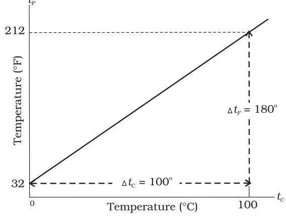

**Fig. 10.1** *A plot of Fahrenheit temperature (t*F ) *versus Celsius temperature (t*c ).

 A relationship for converting between the two scales may be obtained from a graph of Fahrenheit temperature (*t* F ) versus celsius temperature (*t* C ) in a straight line (Fig. 10.1), whose equation is

$\frac{t_{\rm F}-32}{180}=\frac{t_{\rm C}}{100}$ (10.1)

## **10.4 IDEAL-GAS EQUATION AND ABSOLUTE TEMPERATURE**

Liquid-in-glass thermometers show different readings for temperatures other than the fixed points because of differing expansion properties. A thermometer that uses a gas, however, gives the same readings regardless of which gas is used. Experiments show that all gases at low densities exhibit same expansion behaviour. The variables that describe the behaviour of a given quantity (mass) of gas are pressure, volume, and temperature (*P, V*, and *T* )(where *T* = *t* + 273.15; *t* is the temperature in °C). When temperature is held constant, the pressure and volume of a quantity of gas are related as *PV* = constant. This relationship is known as Boyle's law, after Robert Boyle (1627–1691), the English Chemist who discovered it. When the pressure is held constant, the volume of a quantity of the gas is related to the temperature as *V/T* = constant. This relationship is known as Charles' law, after French scientist Jacques Charles (1747– 1823). Low-density gases obey these laws, which may be combined into a single

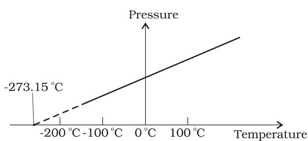

**Fig. 10.2** *Pressure versus temperature of a low density gas kept at constant volume.*

relationship. Notice that since *PV* = constant and *V/T* = constant for a given quantity of gas, then *PV*/*T* should also be a constant. This relationship is known as ideal gas law. It can be written in a more general form that applies not just to a given quantity of a single gas but to any quantity of any low-density gas and is known as **ideal-gas equation**:

$${\frac{P V}{T}}=\mu R$$

or *PV* = µ*RT* (10.2) µis the number of moles in the sample of

where, gas and *R* is called universal gas constant: *R* = 8.31 J mol–1 K–1

In Eq. 10.2, we have learnt that the pressure and volume are directly proportional to temperature : *PV* ∝ *T*. This relationship allows a gas to be used to measure temperature in a constant volume gas thermometer. Holding the volume of a gas constant, it gives *P* ∝*T*. Thus, with a constant-volume gas thermometer, temperature is read in terms of pressure. A plot of pressure versus temperature gives a straight line in this case, as shown in Fig. 10.2.

However, measurements on real gases deviate from the values predicted by the ideal gas law at low temperature. But the relationship is linear over a large temperature range, and it looks as though the pressure might reach zero with decreasing temperature if the gas continued to be a gas. The absolute minimum temperature for an ideal gas, therefore, inferred by extrapolating the straight line to the axis, as in Fig. 10.3. This temperature is found to be – 273.15 °C and is designated as **absolute zero**. Absolute zero is the foundation of the Kelvin temperature scale or absolute scale temperature

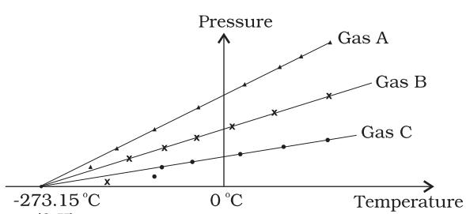

named after the British scientist Lord Kelvin. On this scale, – 273.15 °C is taken as the zero point, that is 0 K (Fig. 10.4).

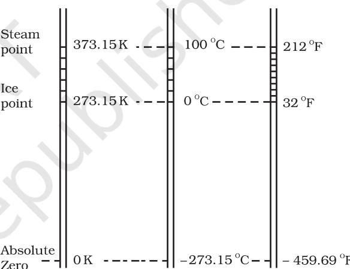

**Fig. 10.4** *Comparision of the Kelvin, Celsius and Fahrenheit temperature scales.*

The size of unit in Kelvin and Celsius temperature scales is the same. So, temperature on these scales are related by

$T=t_{\rm c}+273.15$ (10.3)

### **10.5 THERMAL EXPANSION**

You may have observed that sometimes sealed bottles with metallic lids are so tightly screwed that one has to put the lid in hot water for some time to open it. This would allow the metallic lid to expand, thereby loosening it to unscrew easily. In case of liquids, you may have observed that mercury in a thermometer rises, when the thermometer is put in slightly warm water. If we take out the thermometer from the warm water the level of mercury falls again. Similarly, in case of gases, a balloon partially inflated in a cool room may expand to full size when placed in warm water. On the other hand, a fully inflated balloon when immersed in cold water would start shrinking due to contraction of the air inside.

It is our common experience that most substances expand on heating and contract on cooling. A change in the temperature of a body causes change in its dimensions. The increase in the dimensions of a body due to the increase in its temperature is called thermal expansion. The expansion in length is called **linear expansion**. The expansion in area is called **area expansion**. The expansion in volume is called **volume expansion** (Fig. 10.5).

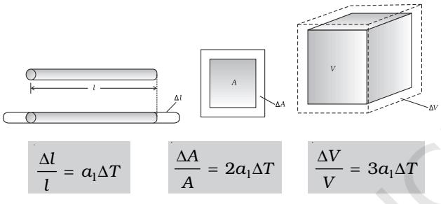

(a) Linear expansion (b) Area expansion (c) Volume expansion

#### **Fig. 10.5** *Thermal Expansion.*

If the substance is in the form of a long rod, then for small change in temperature, ∆*T*, the fractional change in length, ∆*l/l*, is directly proportional to ∆*T*.

(10.4)

where α1 is known as the **coefficient of linear expansion** (or linear expansivity) and is characteristic of the material of the rod. In Table 10.1, typical average values of the coefficient of linear expansion for some material in the temperature range 0 °C to 100°C are given. From this Table, compare the value of αl for glass and copper. We find that copper expands about five times more than glass for the same rise in temperature. Normally, metals expand more and have relatively high values of αl .

#### **Table 10.1 Values of coefficient of linear expansion for some material**

| Material | α (10–5 K–1) l |
| --- | --- |
| Aluminium | 2.5 |
| Brass | 1.8 |
| Iron | 1.2 |
| Copper | 1.7 |
| Silver | 1.9 |
| Gold | 1.4 |
| Glass (pyrex) | 0.32 |
| Lead | 0.29 |

Similarly, we consider the fractional change

in volume, ∆*V V* , of a substance for temperature

change ∆*T* and define the **coefficient of volume expansion (or volume expansivity)**, as

$$\alpha_{\rm v}=\left(\frac{\Delta V}{V}\right)\frac{1}{\Delta T}\tag{10.5}$$

Here α V is also a characteristic of the substance but is not strictly a constant. It depends in general on temperature (Fig 10.6). It is seen that αV becomes constant only at a high temperature.

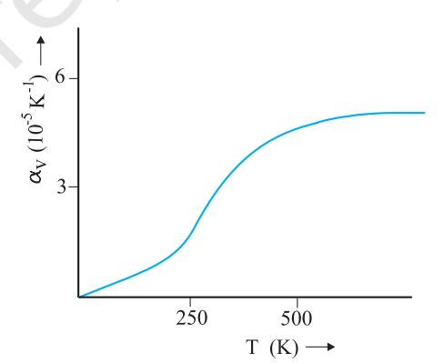

**Fig. 10.6** *Coefficient of volume expansion of copper as a function of temperature.*

Table 10.2 gives the values of coefficient of volume expansion of some common substances in the temperature range 0–100 °C. You can see that thermal expansion of these substances (solids and liquids) is rather small, with material, like pyrex glass and invar (a special iron-nickel alloy) having particularly low values of αV . From this Table we find that the value of αv for alcohol (ethanol) is more than mercury and expands more than mercury for the same rise in temperature.

#### **Table 10.2 Values of coefficient of volume expansion for some substances**

| Material | αv ( K–1) |
| --- | --- |
| Aluminium | 7 × 10–5 |
| Brass | 6 × 10–5 |
| Iron | 3.55 × 10–5 |
| Paraffin | 58.8 × 10–5 |
| Glass (ordinary) | 2.5 × 10–5 |
| Glass (pyrex) | 1 × 10–5 |
| Hard rubber | 2.4 × 10–4 |
| Invar | 2 × 10–6 |
| Mercury | 18.2 × 10–5 |
| Water | 20.7 × 10–5 |
| Alcohol (ethanol) | 110 × 10–5 |

Water exhibits an anomalous behaviour; it contracts on heating between 0 °C and 4 °C. The volume of a given amount of water decreases as it is cooled from room temperature, until its temperature reaches 4 °C, [Fig. 10.7(a)]. Below 4 °C, the volume increases, and therefore, the density decreases [Fig. 10.7(b)].

This means that water has the maximum density at 4°C. This property has an important environmental effect: bodies of water, such as lakes and ponds, freeze at the top first. As a lake cools toward 4 °C, water near the surface loses energy to the atmosphere, becomes denser, and sinks; the warmer, less dense water near the bottom rises. However, once the colder water on top reaches temperature below 4 °C, it becomes less dense and remains at the surface, where it freezes. If water did not have this property, lakes and ponds would freeze from the bottom up, which would destroy much of their animal and plant life.

Gases, at ordinary temperature, expand more than solids and liquids. For liquids, the coefficient of volume expansion is relatively independent of the temperature. However, for gases it is dependent on temperature. For an ideal gas, the coefficient of volume expansion at constant pressure can be found from the ideal gas equation:

$PV=\mu RT$  
  
At constant pressure  
  
$PV=\mu RT$  
  
$\mu$\(\

i.e., $\alpha_{v}=\frac{1}{T}$ for ideal gas (10.6)

At 0 °C, αv = 3.7 × 10–3 K–1, which is much larger than that for solids and liquids. Equation (10.6) shows the temperature dependence of αv ; it decreases with increasing temperature. For a gas at room temperature and constant pressure, αv is about 3300 × 10–6 K–1, as

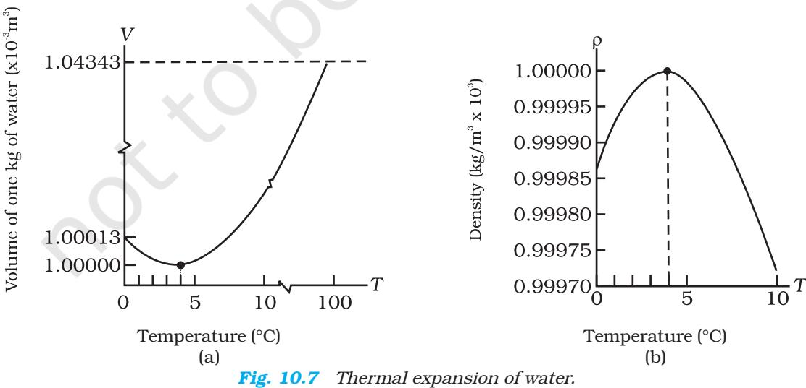

2024-25

much as order(s) of magnitude larger than the coefficient of volume expansion of typical liquids.

There is a simple relation between the coefficient of volume expansion (αv ) and coefficient of linear expansion (αl ). Imagine a cube of length, *l*, that expands equally in all directions, when its temperature increases by ∆*T*. We have

∆*l* = αl *l* ∆*T* so, ∆*V* = (*l+*∆*l*) 3

 – *l* 3 ≃ 3*l* 2 ∆*l* (10.7) In Equation (10.7), terms in (∆*l*) 2 and (∆*l*) 3 have

been neglected since ∆*l* is small compared to *l*. So

$\Delta V=\frac{3V\Delta l}{l}=3V\alpha_{l}\ \Delta T$ (10.8)

which gives

⊳

$\alpha_{\rm v}=3\alpha_{\rm i}$ (10.9)

What happens by preventing the thermal expansion of a rod by fixing its ends rigidly? Clearly, the rod acquires a compressive strain due to the external forces provided by the rigid support at the ends. The corresponding stress set up in the rod is called **thermal stress**. For example, consider a steel rail of length 5 m and area of cross-section 40 cm2 that is prevented from expanding while the temperature rises by 10 °C. The coefficient of linear expansion of steel is αl(steel) = 1.2 × 10–5 K–1. Thus, the compressive

$${\mathrm{strain~is~}}{\frac{\Delta l}{l}}=\alpha_{\mathrm{[stcel]}}\Delta T=1.2\times10^{5\times}10{\mathrm{=1.2\times10^{-4}}}.$$

Youngs modulus of steel is *Y* (steel) = 2 × 1011 N m–2 . Therefore, the thermal stress developed is

$$\Delta FA=Y_{\rm steel}\left(\frac{\Delta l}{l}\right)=2.4\times10^{7} N m{}^{-2}, which $$

corresponds to an external force of

$\Lambda F=AY_{\rm steel}\left(\frac{\Lambda l}{l}\right)=2.4\times10^{7}\times40\times10^{4}\simeq10^{5}$N. If

two such steel rails, fixed at their outer ends, are in contact at their inner ends, a force of this magnitude can easily bend the rails.

 **Example 10.1** Show that the coefficient of area expansion, (∆*A/A*)/∆*T*, of a rectangular sheet of the solid is twice its linear expansivity, αl .

**Answer**

#### **Fig. 10.8**

Consider a rectangular sheet of the solid material of length *a* and breadth *b* (Fig. 10.8 ). When the temperature increases by ∆*T*, *a* increases by ∆*a* = αl *a*∆*T* and *b* increases by ∆*b* = α*b* ∆*T*. From Fig. 10.8, the increase in area

l ∆*A* = ∆*A*1 +∆*A*2 + ∆*A*3

  
  
**A4 = a Ab + b Aa + (A4) (Ab)**

$$aab\Delta T+ba\Delta T+(a)^{2}ab(\Delta T)^{2}$$

$a_{1}\,ab\,AT(2+a_{1}\,AT)=a_{1}\,A\,AT(2+a_{1}\,AT)$

Since αl ≃ 10–5 K–1, from Table 10.1, the product αl ∆*T* for fractional temperature is small in comparision with 2 and may be neglected. Hence,

$\left(\begin{array}{c}\mbox{\small{\bf A}}\\ \mbox{\small{\bf A}}\end{array}\right)\frac{1}{\mbox{\small{\bf A}}}=2a_{1}$

 **Example 10.2** A blacksmith fixes iron ring on the rim of the wooden wheel of a horse cart. The diameter of the rim and the iron ring are 5.243 m and 5.231 m, respectively at 27 °C. To what temperature should the ring be heated so as to fit the rim of the wheel?

### **Answer**

⊳

Given,  
$\begin{array}{l}{T}_{1}=27\phantom{\rule{0.2em}{0ex}}\text{°}\text{C}\\ {L}_{\text{T1}}=5.231\phantom{\rule{0.2em}{0ex}}\text{m}\\ {L}_{\text{T2}}=5.243\phantom{\rule{0.2em}{0ex}}\text{m}\end{array}$  
  
So,  
  
$\begin{array}{l}{L}_{\text{T2}}={L}_{\text{T1}}\left[1+\alpha,\mathcal{C}\right]\\ {L}_{\text{T1}}={L}_{\text{T2}}\left[1+\alpha,\mathcal{C}\right]\end{array}$

$$L_{\rm r_{2}}=L_{\rm r_{1}}[1+\alpha_{1}(T_{2}-T_{1})]

5.243 m = 5.231 m [1+1.2010^{-5} K{}^{-1}(T_{2}-27{}^{\circ}C)]

or T_{2}=218{}^{\circ}C.

$$

#### **10.6 SPECIFIC HEAT CAPACITY**

Take some water in a vessel and start heating it on a burner. Soon you will notice that bubbles begin to move upward. As the temperature is raised the motion of water particles increases till it becomes turbulent as water starts boiling. What are the factors on which the quantity of heat required to raise the temperature of a substance depend? In order to answer this question in the first step, heat a given quantity of water to raise its temperature by, say 20 °C and note the time taken. Again take the same amount of water and raise its temperature by 40 °C using the same source of heat. Note the time taken by using a stopwatch. You will find it takes about twice the time and therefore, double the quantity of heat required raising twice the temperature of same amount of water.

In the second step, now suppose you take double the amount of water and heat it, using the same heating arrangement, to raise the temperature by 20 °C, you will find the time taken is again twice that required in the first step.

In the third step, in place of water, now heat the same quantity of some oil, say mustard oil, and raise the temperature again by 20 °C. Now note the time by the same stopwatch. You will find the time taken will be shorter and therefore, the quantity of heat required would be less than that required by the same amount of water for the same rise in temperature.

The above observations show that the quantity of heat required to warm a given substance depends on its mass, *m*, the change in temperature, ∆*T* and the nature of substance. The change in temperature of a substance, when a given quantity of heat is absorbed or rejected by it, is characterised by a quantity called the **heat capacity** of that substance. We define heat capacity, *S* of a substance as

  
  
**S=$\frac{\Delta\mathcal{G}}{\Delta T}$** (10.10)

where ∆*Q* is the amount of heat supplied to the substance to change its temperature from *T* to *T* + ∆*T*.

You have observed that if equal amount of heat is added to equal masses of different substances, the resulting temperature changes will not be the same. It implies that every substance has a unique value for the amount of heat absorbed or given off to change the temperature of unit mass of it by one unit. This quantity is referred to as the **specific heat capacity** of the substance.

If ∆*Q* stands for the amount of heat absorbed or given off by a substance of mass *m* when it undergoes a temperature change ∆*T*, then the specific heat capacity, of that substance is given by

  
  
**S=$\frac{\bf S}{m}$=$\frac{1}{m}\frac{\bf\Delta Q}{\bf\Delta T}$** (10.11)

The **specific heat capacity** is the property of the substance which determines the change in the temperature of the substance (undergoing no phase change) when a given quantity of heat is absorbed (or given off) by it. It is defined as the amount of heat per unit mass absorbed or given off by the substance to change its temperature by one unit. It depends on the nature of the substance and its temperature. The SI unit of specific heat capacity is J kg–1 K–1 .

If the amount of substance is specified in terms of moles µ, instead of mass *m* in kg, we can define heat capacity per mole of the substance by

$$\mu\mu\Delta\mu\Delta\mu\Delta\mu\Delta\mu\Delta\mu\Delta\mu\Delta\mu\Delta\mu\Delta\mu\Delta\mu\Delta\mu\Delta\mu\Delta\mu\Delta\mu\Delta\mu\Delta\mu\Delta\mu\Delta\mu\Delta\mu\Delta\mu\Delta\mu\Delta\mu\Delta\mu\Delta\mu\Delta\mu\Delta\mu\Delta\mu\Delta\mu\Delta\mu\Delta\mu\Delta\mu\Delta\mu\Delta\mu\Delta\mu\Delta\mu\Delta\mu\Delta\mu\Delta\mu\Delta\mu\Delta\mu\Delta\mu\Delta\mu\Delta\mu\Delta\mu\Delta\$$

where *C* is known as **molar specific heat capacity** of the substance. Like *S*, *C* also depends on the nature of the substance and its temperature. The SI unit of molar specific heat capacity is J mol–1 K–1 .

However, in connection with specific heat capacity of gases, additional conditions may be needed to define *C*. In this case, heat transfer can be achieved by keeping either pressure or volume constant. If the gas is held under constant pressure during the heat transfer, then it is called the **molar specific heat capacity at constant pressure** and is denoted by *C*p . On the other hand, if the volume of the gas is maintained during the heat transfer, then the corresponding molar specific heat capacity is called **molar specific heat capacity at constant volume** and is denoted by *C*v . For details see Chapter 11. Table 10.3 lists measured specific heat capacity of some substances at atmospheric pressure and ordinary temperature while Table 10.4 lists molar specific heat capacities of some gases. From Table 10.3 you can note that water

| Substance | Specific heat capacity | Substance | Specific heat capacity |
| --- | --- | --- | --- |
|  | (J kg–1 K–1) |  | (J kg–1 K–1) |
| Aluminium | 900.0 | Ice | 2060 |
| Carbon | 506.5 | Glass | 840 |
| Copper | 386.4 | Iron | 450 |
| Lead | 127.7 | Kerosene | 2118 |
| Silver | 236.1 | Edible oil | 1965 |
| Tungesten | 134.4 | Mercury | 140 |
| Water | 4186.0 |  |  |

**Table 10.3 Specific heat capacity of some substances at room temperature and atmospheric pressure**

has the highest specific heat capacity compared to other substances. For this reason water is also used as a coolant in automobile radiators, as well as, a heater in hot water bags. Owing to its high specific heat capacity, water warms up more slowly than land during summer, and consequently wind from the sea has a cooling effect. Now, you can tell why in desert areas, the earth surface warms up quickly during the day and cools quickly at night.

| Table 10.4 | Molar specific heat capacities of |
| --- | --- |
|  | some gases |

| Gas | Cp (J mol–1K–1) | Cv (J mol–1K–1) |
| --- | --- | --- |
| He | 20.8 | 12.5 |
| H2 | 28.8 | 20.4 |
| N2 | 29.1 | 20.8 |
| O2 | 29.4 | 21.1 |
| CO2 | 37.0 | 28.5 |

### **10.7 CALORIMETRY**

A system is said to be isolated if no exchange or transfer of heat occurs between the system and its surroundings. When different parts of an isolated system are at different temperature, a quantity of heat transfers from the part at higher temperature to the part at lower temperature. The heat lost by the part at higher temperature is equal to the heat gained by the part at lower temperature.

Calorimetry means measurement of heat. When a body at higher temperature is brought in contact with another body at lower temperature, the heat lost by the hot body is equal to the heat gained by the colder body, provided no heat is allowed to escape to the surroundings. A device in which heat measurement can be done is called a **calorimeter**. It consists of a metallic vessel and stirrer of the same material, like copper or aluminium. The vessel is kept inside a wooden jacket, which contains heat insulating material, like glass wool etc. The outer jacket acts as a heat shield and reduces the heat loss from the inner vessel. There is an opening in the outer jacket through which a mercury thermometer can be inserted into the calorimeter (Fig. 10.20). The following example provides a method by which the specific heat capacity of a given solid can be determinated by using the principle, heat gained is equal to the heat lost.

⊳ **Example 10.3** A sphere of 0.047 kg aluminium is placed for sufficient time in a vessel containing boiling water, so that the sphere is at 100 °C. It is then immediately transfered to 0.14 kg copper calorimeter containing 0.25 kg water at 20 °C. The temperature of water rises and attains a steady state at 23 °C. Calculate the specific heat capacity of aluminium.

**Answer** In solving this example, we shall use the fact that at a steady state, heat given by an aluminium sphere will be equal to the heat absorbed by the water and calorimeter.

Mass of aluminium sphere (*m*1 ) = 0.047 kg Initial temperatureofaluminiumsphere=100 °C Final temperature = 23 °C

Change in temperature (∆*T*)=(100 °C-23°C)= 77 °C Let specific heat capacity of aluminium be *s*Al.

The amount of heat lost by the aluminium sphere = ∆ = × × ° *m s T* 1 *Al* 0.047kg 77 C *sAl* Mass of water (*m*2 ) = 0.25 kg Mass of calorimeter (*m*3 ) = 0.14 kg Initial temperature of water and calorimeter=20 °C Final temperature of the mixture = 23 °C Change in temperature (∆*T*2 ) = 23 °C – 20 °C = 3 °C Specific heat capacity of water (*s*w ) = 4.18 × 103 J kg–1 K–1 Specific heat capacity of copper calorimeter = 0.386 × 103 J kg–1 K–1

The amount of heat gained by water and calorimeter = *m*2 *s*w ∆*T*2 + *m*3 *s*cu ∆*T*2

= (*m*2 *s*w + *m*3 *s*cu ) (∆*T*2 )

= (0.25 kg × 4.18 × 103 J kg–1 K–1 + 0.14 kg ×

0.386 × 103 J kg–1 K–1) (23 °C – 20 °C)

In the steady state heat lost by the aluminium sphere = heat gained by water + heat gained by calorimeter.

So, 0.047 kg × *s*Al × 77 °C = (0.25 kg × 4.18 × 103 J kg–1 K–1+ 0.14 kg × 0.386 × 103 J kg–1 K–1)(3 °C) *sAl* = 0.911 kJ kg –1 K–1 ⊳

#### **10.8 CHANGE OF STATE**

Matter normally exists in three states: solid, liquid and gas. A transition from one of these states to another is called a change of state. Two common changes of states are solid to liquid and liquid to gas (and, vice versa). These changes can occur when the exchange of heat takes place between the substance and its surroundings. To study the change of state on heating or cooling, let us perform the following activity.

Take some cubes of ice in a beaker. Note the temperature of ice. Start heating it slowly on a constant heat source. Note the temperature after every minute. Continuously stir the mixture of water and ice. Draw a graph between temperature and time (Fig. 10.9). You will observe no change in the temperature as long as there is ice in the beaker. In the above process, the temperature of the system does not change even though heat is being continuously supplied. The heat supplied is being utilised in changing the state from solid (ice) to liquid (water).

**Fig. 10.9** *A plot of temperature versus time showing the changes in the state of ice on heating (not to scale).*

The change of state from solid to liquid is called **melting** or fusion and from liquid to solid is called **freezing**. It is observed that the temperature remains constant until the entire amount of the solid substance melts. That is, **both the solid and the liquid states of the substance coexist in thermal equilibrium during the change of states from solid to liquid.** The temperature at which the solid and the liquid states of the substance is in thermal equilibrium with each other is called its **melting point**. It is characteristic of the substance. It also depends on pressure. The melting point of a substance at standard atomspheric pressure is called its **normal melting point**. Let us do the following activity to understand the process of melting of ice.

Take a slab of ice. Take a metallic wire and fix two blocks, say 5 kg each, at its ends. Put the wire over the slab as shown in Fig. 10.10. You will observe that the wire passes through the ice slab. This happens due to the fact that just below the wire, ice melts at lower temperature due to increase in pressure. When the wire has passed, water above the wire freezes again. Thus, the wire passes through the slab and the slab does not split. This phenomenon of refreezing is called **regelation**. Skating is possible on snow due to the formation of water under the skates. Water is formed due to the increase of pressure and it acts as a lubricant.

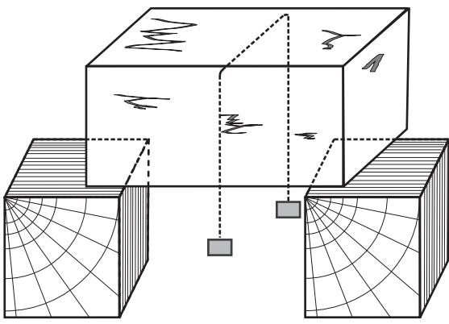

#### **Fig. 10.10**

After the whole of ice gets converted into water and as we continue further heating, we shall see that temperature begins to rise (Fig.10.9). The temperature keeps on rising till it reaches nearly 100 °C when it again becomes steady. The heat supplied is now being utilised to change water from liquid state to vapour or gaseous state.

The change of state from liquid to vapour (or gas) is called **vaporisation**. It is observed that the temperature remains constant until the entire amount of the liquid is converted into vapour. That is, both the liquid and vapour states of the substance coexist in thermal equilibrium, during the change of state from liquid to vapour. The temperature at which the liquid and the vapour states of the substance coexist is called its **boiling point**. Let us do the following activity to understand the process of boiling of water.

Take a round-bottom flask, more than half filled with water. Keep it over a burner and fix a

#### **Triple Point**

The temperature of a substance remains constant during its change of state (phase change). A graph between the temperature *T* and the Pressure *P* of the substance is called a phase diagram or *P* – *T* diagram. The following figure shows the phase diagram of water and CO2 . Such a phase diagram divides the *P* – *T* plane into a solid-region, the vapour-region and the liquid-region. The regions are separated by the curves such as sublimation curve (BO), **fusion curve** (AO) and **vaporisation curve** (CO). The points on **sublimation curve** represent states in which solid and vapour phases coexist. The point on the sublimation curve BO represent states in which the solid and vapour phases co-exist. Points on the fusion curve AO represent states in which solid and liquid phase coexist. Points on the vapourisation curve CO represent states in which the liquid and vapour phases coexist. The temperature and pressure at which the fusion curve, the vaporisation curve and the sublimation curve meet and all the three phases of a substance coexist is called the **triple point** of the substance. For example the triple point of water is represented by the temperature 273.16 K and pressure 6.11×10–3 Pa.

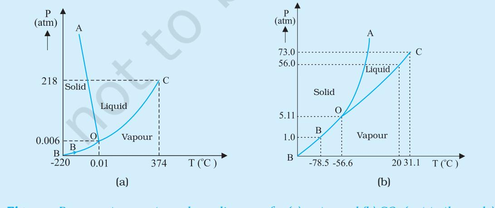

**Figure :** *Pressure-temperature phase diagrams for (a) water and (b) CO*2  *(not to the scale).* thermometer and steam outlet through the cork of the flask (Fig. 10.11). As water gets heated in the flask, note first that the air, which was dissolved in the water, will come out as small bubbles. Later, bubbles of steam will form at the bottom but as they rise to the cooler water near the top, they condense and disappear. Finally, as the temperature of the entire mass of the water reaches 100 °C, bubbles of steam reach the surface and boiling is said to occur. The steam in the flask may not be visible but as it comes out of the flask, it condenses as tiny droplets of water, giving a foggy appearance.

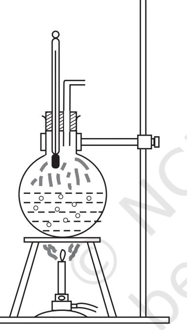

**Fig. 10.11** *Boiling process.*

If now the steam outlet is closed for a few seconds to increase the pressure in the flask, you will notice that boiling stops. More heat would be required to raise the temperature (depending on the increase in pressure) before boiling begins again. Thus boiling point increases with increase in pressure.

Let us now remove the burner. Allow water to cool to about 80 °C. Remove the thermometer and steam outlet. Close the flask with the airtight cork. Keep the flask turned upside down on the stand. Pour ice-cold water on the flask. Water vapours in the flask condense reducing the pressure on the water surface inside the flask. Water begins to boil again, now at a lower temperature. Thus boiling point decreases with decrease in pressure.

This explains why cooking is difficult on hills. At high altitudes, atmospheric pressure is lower, reducing the boiling point of water as compared to that at sea level. On the other hand, boiling point is increased inside a pressure cooker by increasing the pressure. Hence cooking is faster. The boiling point of a substance at standard atmospheric pressure is called its **normal boiling point**.

However, all substances do not pass through the three states: solid-liquid-gas. There are certain substances which normally pass from the solid to the vapour state directly and vice versa. The change from solid state to vapour state without passing through the liquid state is called **sublimation**, and the substance is said to sublime. Dry ice (solid CO2 ) sublimes, so also iodine. During the sublimation process both the solid and vapour states of a substance coexist in thermal equilibrium.

### **10.8.1 Latent Heat**

In Section 10.8, we have learnt that certain amount of heat energy is transferred between a substance and its surroundings when it undergoes a change of state. The amount of heat per unit mass transferred during change of state of the substance is called latent heat of the substance for the process. For example, if heat is added to a given quantity of ice at –10 °C, the temperature of ice increases until it reaches its melting point (0 °C). At this temperature, the addition of more heat does not increase the temperature but causes the ice to melt, or changes its state. Once the entire ice melts, adding more heat will cause the temperature of the water to rise. A similar situation occurs during liquid gas change of state at the boiling point. Adding more heat to boiling water causes vaporisation, without increase in temperature.

| Substance | Melting | Lf | Boiling | Lv |
| --- | --- | --- | --- | --- |
|  | Point ( C) | (105J kg–1) | Point ( C) | (105J kg–1) |
| Ethanol | –114 | 1.0 | 78 | 8.5 |
| Gold | 1063 | 0.645 | 2660 | 15.8 |
| Lead | 328 | 0.25 | 1744 | 8.67 |
| Mercury | –39 | 0.12 | 357 | 2.7 |
| Nitrogen | –210 | 0.26 | –196 | 2.0 |
| Oxygen | –219 | 0.14 | –183 | 2.1 |
| Water | 0 | 3.33 | 100 | 22.6 |

**Table 10.5 Temperatures of the change of state and latent heats for various substances at 1 atm pressure**

The heat required during a change of state depends upon the heat of transformation and the mass of the substance undergoing a change of state. Thus, if mass *m* of a substance undergoes a change from one state to the other, then the quantity of heat required is given by

$\begin{array}{c}\mbox{\small$\cal Q$}=m\,L\\ \mbox{or}\quad L=\mbox{\small$\cal Q$}/m\end{array}$ (10.13)

where *L* is known as latent heat and is a characteristic of the substance. Its SI unit is J kg–1. The value of *L* also depends on the pressure. Its value is usually quoted at standard atmospheric pressure. The latent heat for a solidliquid state change is called the **latent heat of fusion** (*L*f ), and that for a liquid-gas state change is called the **latent heat of vaporisation** (*L*v ). These are often referred to as the heat of fusion and the heat of vaporisation. A plot of temperature versus heat for a quantity of water is shown in Fig. 10.12. The latent heats of some substances, their freezing and boiling points, are given in Table 10.5.

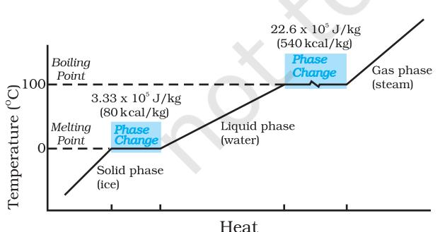

**Fig. 10.12** *Temperature versus heat for water at 1 atm pressure (not to scale).*

Note that when heat is added (or removed) during a change of state, the temperature remains constant. Note in Fig. 10.12 that the slopes of the phase lines are not all the same, which indicate that specific heats of the various states are not equal. For water, the latent heat of fusion and vaporisation are *L*f = 3.33 × 105 J kg–1 and *L*v = 22.6 × 105 J kg–1 , respectively. That is, 3.33 × 105 J of heat is needed to melt 1 kg ice at 0 °C, and 22.6 × 105 J of heat is needed to convert 1 kg water into steam at 100°C. So, steam at 100°C carries 22.6 × 105 J kg–1 more heat than water at 100 °C. This is why burns from steam are usually more serious than those from boiling water.

**Example 10.4** When 0.15 kg of ice at 0 °C is mixed with 0.30 kg of water at 50°C in a container, the resulting temperature is 6.7 °C. Calculate the heat of fusion of ice. (*s*water = 4186 J kg–1 K–1)

#### **Answer**

⊳

Heat lost by water = *ms*w (θf –θi )w = (0.30 kg)(4186 J kg–1 K–1) (50.0 °C – 6.7 °C) = 54376.14 J Heat required to melt ice = *m*2 *L*f = (0.15 kg) *L*f Heat required to raise temperature of ice water to final temperature = *m*I *s*w (θf –θi ) I = (0.15 kg) (4186 J kg–1 K –1) (6.7 °C – 0°C) = 4206.93 J Heat lost = heat gained 54376.14 J = (0.15 kg) *L*f + 4206.93 J *L*f = 3.34×105 J kg–1 . ⊳ ⊳ **Example 10.5** Calculate the heat required to convert 3 kg of ice at –12 °C kept in a calorimeter to steam at 100 °C at atmospheric pressure. Given specific heat capacity of ice = 2100 J kg–1 K–1, specific heat capacity of water = 4186 J kg– 1 K–1, latent heat of fusion of ice = 3.35 × 105 J kg–1 and latent heat of steam = 2.256 ×106 J kg–1 .

**Answer** We have Mass of the ice, *m* = 3 kg specific heat capacity of ice, *s*ice = 2100 J kg–1 K–1 specific heat capacity of water, *s*water = 4186 J kg–1 K–1 latent heat of fusion of ice, *L*f ice = 3.35 × 105 J kg–1 latent heat of steam, *L*steam = 2.256 × 106 J kg–1

- 
Now, *Q* = heat required to convert 3 kg of ice at –12 °C to steam at 100 °C,

- *Q*1 = heat required to convert ice at –12 °C to ice at 0 °C.
	- = *m s*ice ∆*T*1 = (3 kg) (2100 J kg–1. K–1) [0–(–12)]°C = 75600 J
- *Q*2 = heat required to melt ice at 0 °C to water at 0 °C
	- *= m L*f ice = (3 kg) (3.35 × 105 J kg–1) = 1005000 J
- *Q*3 = heat required to convert water at 0 °C to water at 100 °C.
	- *= ms*w ∆*T*2 = (3kg) (4186J kg–1 K–1) (100 °C)
	- = 1255800 J
- *Q*4 = heat required to convert water at 100 °C to steam at 100 °C.
	- *= m L*steam = (3 kg) (2.256 ×106 J kg–1)
	- = 6768000 J
- 
- So, *Q* = *Q*1 + *Q*2 + *Q*3 + *Q*4 = 75600J + 1005000 J + 1255800 J + 6768000 J = 9.1×106 J ⊳

### **10.9 HEAT TRANSFER**

We have seen that heat is energy transfer from one system to another or from one part of a system to another part, arising due to temperature difference. What are the different ways by which this energy transfer takes place? There are three distinct modes of heat transfer: conduction, convection and radiation (Fig. 10.13).

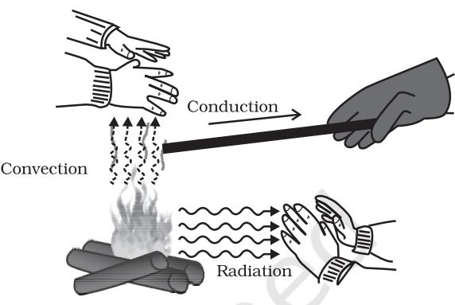

**Fig. 10.13** *Heating by conduction, convection and radiation.*

### **10.9.1 Conduction**

Conduction is the mechanism of transfer of heat between two adjacent parts of a body because of their temperature difference. Suppose, one end of a metallic rod is put in a flame, the other end of the rod will soon be so hot that you cannot hold it by your bare hands. Here, heat transfer takes place by conduction from the hot end of the rod through its different parts to the other end. Gases are poor thermal conductors, while liquids have conductivities intermediate between solids and gases.

Heat conduction may be described quantitatively as the time rate of heat flow in a material for a given temperature difference. Consider a metallic bar of length *L* and uniform cross-section *A* with its two ends maintained at different temperatures. This can be done, for example, by putting the ends in thermal contact with large reservoirs at temperatures, say, *T*C and *T*D , respectively (Fig. 10.14). Let us assume the ideal condition that the sides of the bar are fully insulated so that no heat is exchanged between the sides and the surroundings.

After sometime, a steady state is reached; the temperature of the bar decreases uniformly with distance from *T*C to *T*D ; (*T*C >*T*D ). The reservoir at C supplies heat at a constant rate, which transfers through the bar and is given out at the same rate to the reservoir at D. It is found

**Fig. 10.14** *Steady state heat flow by conduction in a bar with its two ends maintained at temperatures T*C  *and T*D ; *(T*C  *> T*D *).*

experimentally that in this steady state, the rate of flow of heat (or heat current) *H* is proportional to the temperature difference (*T*C – *T*D ) and the area of cross-section *A* and is inversely proportional to the length *L* :

$$H=KA\frac{T_{C}-T_{D}}{L} (10.14)$$

The constant of proportionality *K* is called the **thermal conductivity** of the material. The greater the value of *K* for a material, the more rapidly will it conduct heat. The SI unit of *K* is J s–1 m–1 K–1 or W m–1 K–1. The thermal conductivities of various substances are listed in Table 10.6. These values vary slightly with temperature, but can be considered to be constant over a normal temperature range.

Compare the relatively large thermal conductivities of good thermal conductors and, metals, with the relatively small thermal conductivities of some good thermal insulators, such as wood and glass wool. You may have noticed that some cooking pots have copper coating on the bottom. Being a good conductor of heat, copper promotes the distribution of heat over the bottom of a pot for uniform cooking. Plastic foams, on the other hand, are good insulators, mainly because they contain pockets of air. Recall that gases are poor conductors, and note the low thermal conductivity of air in the Table 10.5. Heat retention and transfer are important in many other applications. Houses made of concrete roofs get very hot during summer days because thermal conductivity of concrete (though much smaller than that of a metal) is still not small enough. Therefore, people, usually, prefer to give a layer of earth or foam insulation on the ceiling so that heat transfer is prohibited and keeps the room cooler. In some situations, heat transfer is critical. In a nuclear reactor, for example, elaborate heat transfer systems need to be installed so that the enormous energy produced by nuclear fission in the core transits out sufficiently fast, thus preventing the core from overheating.

# **Table 10.6 Thermal conductivities of some material**

| Material | Thermal conductivity |
| --- | --- |
|  | (J s–1 m–1 K–1 ) |
| Metals |  |
| Silver | 406 |
| Copper | 385 |
| Aluminium | 205 |
| Brass | 109 |
| Steel | 50.2 |
| Lead | 34.7 |
| Mercury | 8.3 |
| Non-metals |  |
| Insulating brick | 0.15 |
| Concrete | 0.8 |
| Body fat | 0.20 |
| Felt | 0.04 |
| Glass | 0.8 |
| Ice | 1.6 |
| Glass wool | 0.04 |
| Wood | 0.12 |
| Water | 0.8 |
| Gases |  |
| Air | 0.024 |
| Argon | 0.016 |
| Hydrogen | 0.14 |

⊳ **Example 10.6** What is the temperature of the steel-copper junction in the steady state of the system shown in Fig. 10.15. Length of the steel rod = 15.0 cm, length of the copper rod = 10.0 cm, temperature of the furnace = 300 °C, temperature of the other end = 0 °C. The area of cross section of the steel rod is twice that of the copper rod. (Thermal conductivity of steel = 50.2 J s–1 m–1 K–1; and of copper = 385 J s–1m–1 K–1).

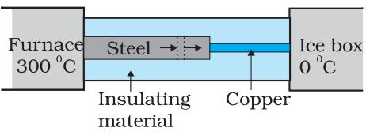

**Fig. 10.15**

**Answer** The insulating material around the rods reduces heat loss from the sides of the rods. Therefore, heat flows only along the length of the rods. Consider any cross section of the rod. In the steady state, heat flowing into the element must equal the heat flowing out of it; otherwise there would be a net gain or loss of heat by the element and its temperature would not be steady. Thus in the steady state, rate of heat flowing across a cross section of the rod is the same at every point along the length of the combined steel-copper rod. Let *T* be the temperature of the steel-copper junction in the steady state. Then,

$${\frac{K_{1}\;A_{1}\left(300-T\right)}{L_{1}}}={\frac{K_{2}\;A_{2}\left(T-0\right)}{L_{2}}}$$

where 1 and 2 refer to the steel and copper rod respectively. For *A*1 = 2 *A*2 , *L*1 = 15.0 cm, *L*2 = 10.0 cm, *K*1 = 50.2 J s–1 m–1 K –1 , *K*2 = 385 J s –1 m–1 K –1, we have

$\frac{50.2\times2\left(300-T\right)}{15}=\frac{385T}{10}$  
  
which gives $T=44.4^{\circ}C$

⊳ **Example 10.7** An iron bar (*L*1 = 0.1 m, *A*1 = 0.02 m2 , *K*1 = 79 W m–1 K–1) and a brass bar (*L*2 = 0.1 m, *A*2 = 0.02 m2 , *K*2 = 109 W m–1K–1) are soldered end to end as shown in Fig. 10.16. The free ends of the iron bar and brass bar are maintained at 373 K and 273 K respectively. Obtain expressions for and hence compute (i) the temperature of the junction of the two bars, (ii) the equivalent thermal conductivity of the compound bar, and (iii) the heat current through the compound bar.

#### **Answer**

Given, *L*1 = *L*2 = *L* = 0.1 m, *A*1 = *A*2 = *A*= 0.02 m2 *K*1 = 79 W m–1 K–1 , *K*2 = 109 W m–1 K–1 , *T*1 = 373 K, and *T*2 = 273 K.

Under steady state condition, the heat current (*H*1 ) through iron bar is equal to the heat current (*H*2 ) through brass bar.

So, $H=H_{1}=H_{2}$  
  
$\begin{array}{c}\mbox{\rm{\small$\frac{\mbox{\rm{K}}_{1}A_{1}\left(T_{1}-T_{0}\right)}{L_{1}}$}}=\frac{\mbox{\rm{K}}_{2}A_{2}\left(T_{0}-T_{2}\right)}{L_{2}}\\ \mbox{\rm{\small$\frac{\mbox{\rm{K}}_{1}A_{1}\left(T_{1}-T_{0}\right)}{L_{1}}$}}=\frac{\mbox{\rm{K}}_{2}A_{2}\left(T_{0}-T_{2}\right)}{L_{2}}\end{array}$

For *A*1 = *A*2 = *A* and *L*1 = *L*2 = *L*, this equation leads to

*K*1 (*T*1 – *T*0 ) = *K*2 (*T*0 – *T*2 )

Thus, the junction temperature *T*0 of the two bars is

$$T_{0}={\frac{\left(K_{1}T_{1}+K_{2}T_{2}\right)}{\left(K_{1}+K_{2}\right)}}$$

Using this equation, the heat current H through either bar is

$H=\frac{K_{1}A(T_{1}-T_{0})}{L}=\frac{K_{2}A(T_{0}-T_{2})}{L}$  
  
$L$  
  
$=\left(\frac{K_{1}K_{2}}{K_{1}+K_{2}}\right)\frac{A(T_{1}-T_{0})}{L}=\frac{A(T_{1}-T_{2})}{L}$

Using these equations, the heat current *H*′ through the compound bar of length *L*1 + *L*2 = 2*L* and the equivalent thermal conductivity *K*′, of the compound bar are given by

( 1 2 – ) 2 *K A T T H H L* ′ ′ = = 1 2 1 2 2 =′ + *K K K K K* (i) ( ) ( ) 1 1 2 2 0 1 2 *K T K T T K K* + = + ( )( ) ( )( ) –1 –1 –1 –1 –1 –1 –1 –1 79 m K 373K 109 W m K 273K 79 W m K 109 W m K *W* + = + = 315 K (ii) 1 2 1 2 2 = *K K K K K* ′ + = –1 –1 –1 –1 –1 –1 –1 –1 2×(79 W m K ) ×(109 W m K ) 79 W m K +109 W m K

= 91.6 W m–1 K–1

(iii) $H^{\prime}=H=\frac{K^{\prime}\ A\ \left(T_{1}-T_{2}\right)}{2\ L}$  
  
$\left(91.6\ W\ m^{-1}\ K^{-1}\right)\times\left(0.02\ m^{2}\right)\times\left(373\ K-273\ K\right)$  
  
$2\times\left(0.1\ m\right)$  
  
$=916.1\ W$

### **10.9.2 Convection**

Convection is a mode of heat transfer by actual motion of matter. It is possible only in fluids. Convection can be natural or forced. In natural convection, gravity plays an important part. When a fluid is heated from below, the hot part expands and, therefore, becomes less dense. Because of buoyancy, it rises and the upper colder part replaces it. This again gets heated, rises up and is replaced by the relatively colder part of the fluid. The process goes on. This mode of heat transfer is evidently different from conduction. Convection involves bulk transport of different parts of the fluid.

 In forced convection, material is forced to move by a pump or by some other physical means. The common examples of forced convection systems are forced-air heating systems in home, the human circulatory system, and the cooling system of an automobile engine. In the human body, the heart acts as the pump that circulates blood through different parts of the body, transferring heat by forced convection and maintaining it at a uniform temperature.

Natural convection is responsible for many familiar phenomena. During the day, the ground heats up more quickly than large bodies of water do. This occurs both because water has a greater specific heat capacity and because mixing currents disperse the absorbed heat throughout the great volume of water. The air in contact with the warm ground is heated by conduction. It expands, becoming less dense than the surrounding cooler air. As a result, the warm air rises (air currents) and the other air moves (winds) to fill the space-creating a sea breeze near a large body of water. Cooler air descends, and a thermal convection cycle is set up, which transfers heat away from the land. At night, the ground loses its heat more quickly, and the water surface is warmer than the land. As a result, the cycle is reveresed (Fig. 10.17).

The other example of natural convection is the steady surface wind on the earth blowing in from north-east towards the equator, the so-called trade wind. A resonable explanation is as follows: the equatorial and polar regions of the earth receive unequal solar heat. Air at the earth's surface near the equator is hot, while the air in the upper atmosphere of the poles is cool. In the absence of any other factor, a convection current would be set up, with the air at the equatorial surface rising and moving out towards the poles, descending and streaming in towards the equator. The rotation of the earth, however, modifies this convection current. Because of this, air close to the equator has an eastward speed of 1600 km/h, while it is zero close to the poles. As a result, the air descends not at the poles but at 30° N (North) latitude and returns to the equator. This is called **trade wind**.

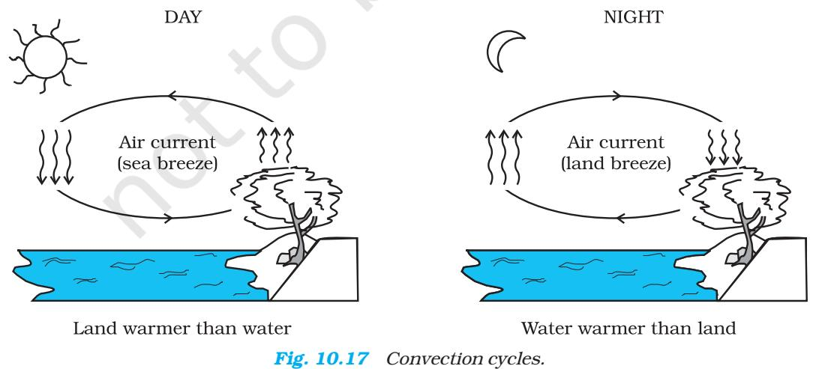

#### **10.9.3 Radiation**

Conduction and convection require some material as a transport medium. These modes of heat transfer cannot operate between bodies separated by a distance in vacuum. But the earth does receive heat from the Sun across a huge distance. Similarly, we quickly feel the warmth of the fire nearby even though air conducts poorly and before convection takes some time to set in. The third mechanism for heat transfer needs no medium; it is called radiation and the energy so transferred by electromagnetic waves is called radiant energy. In an electromagnetic wave, electric and magnetic fields oscillate in space and time. Like any wave, electromagnetic waves can have different wavelengths and can travel in vacuum with the same speed, namely the speed of light i.e., 3 × 108 m s–1 . You will learn these matters in more detail later, but you now know why heat transfer by radiation does not need any medium and why it is so fast. This is how heat is transferred to the earth from the Sun through empty space. All bodies emit radiant energy, whether they are solid, liquid or gas. The electromagnetic radiation emitted by a body by virtue of its temperature, like radiation by a red hot iron or light from a filament lamp is called thermal radiation.

When this thermal radiation falls on other bodies, it is partly reflected and partly absorbed. The amount of heat that a body can absorb by radiation depends on the colour of the body.

We find that black bodies absorb and emit radiant energy better than bodies of lighter colours. This fact finds many applications in our daily life. We wear white or light coloured clothes in summer, so that they absorb the least heat from the Sun. However, during winter, we use dark coloured clothes, which absorb heat from the sun and keep our body warm. The bottoms of utensils for cooking food are blackened so that they absorb maximum heat from fire and transfer it to the vegetables to be cooked.

Similarly, a Dewar flask or thermos bottle is a device to minimise heat transfer between the contents of the bottle and outside. It consists of a double-walled glass vessel with the inner and outer walls coated with silver. Radiation from the inner wall is reflected back to the contents of the bottle. The outer wall similarly reflects back any incoming radiation. The space between the walls is evacuted to reduce conduction and convection losses and the flask is supported on an insulator, like cork. The device is, therefore, useful for preventing hot contents (like, milk) from getting cold, or alternatively, to store cold contents (like, ice).

### **10.9.4 Blackbody Radiation**

We have so far not mentioned the wavelength content of thermal radiation. The important thing about thermal radiation at any temperature is that it is not of one (or a few) wavelength(s) but has a continuous spectrum from the small to the long wavelengths. The energy content of radiation, however, varies for different wavelengths. Figure 10.18 gives the experimental curves for radiation energy per unit area per unit wavelength emitted by a blackbody versus wavelength for different temperatures.

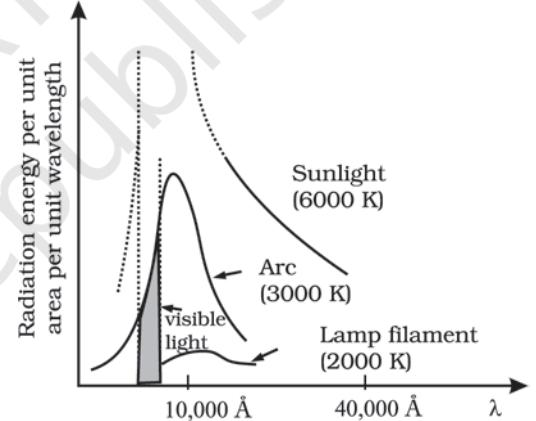

**Fig. 10.18:** *Energy emitted versus wavelength for a blackbody at different temperatures*

Notice that the wavelength λ*m* for which energy is the maximum decreases with increasing temperature. The relation between λ*m* and *T* is given by what is known as **Wien's Displacement Law**:

$\lambda_{m}\ T=$ constant (10.15)

The value of the constant (Wien's constant) is 2.9 × 10–3 m K. This law explains why the colour of a piece of iron heated in a hot flame first becomes dull red, then reddish yellow, and finally white hot. Wien's law is useful for estimating the surface temperatures of celestial bodies like, the moon, Sun and other stars. Light from the moon is found to have a maximum intensity near the wavelength 14 µm. By Wien's law, the surface of the moon is estimated to have a temperature of 200 K. Solar radiation has a maximum at λ*m* = 4753 Å. This corresponds to *T* = 6060 K. Remember, this is the temperature of the surface of the sun, not its interior.

The most significant feature of the blackbody radiation curves in Fig. 10.18 is that they are *universal*. They depend only on the temperature and not on the size, shape or material of the blackbody. Attempts to explain blackbody radiation theoretically, at the beginning of the twentieth century, spurred the quantum revolution in physics, as you will learn in later courses.

Energy can be transferred by radiation over large distances, without a medium (i.e., in vacuum). The total electromagnetic energy radiated by a body at absolute temperature *T* is proportional to its size, its ability to radiate (called emissivity) and most importantly to its temperature. For a body, which is a perfect radiator, the energy emitted per unit time (*H*) is given by

$H=A\sigma T^{4}$ (10.16)

where *A* is the area and *T* is the absolute temperature of the body. This relation obtained experimentally by Stefan and later proved theoretically by Boltzmann is known as **Stefan-Boltzmann law** and the constant σ is called Stefan-Boltzmann constant. Its value in SI units is 5.67 × 10–8 W m–2 K–4. Most bodies emit only a fraction of the rate given by Eq. 10.16. A substance like lamp black comes close to the limit. One, therefore, defines a dimensionless fraction *e* called *emissivity* and writes,

$H=Ae\sigma T^{4}$  
  
(10.17)

Here, *e* = 1 for a perfect radiator. For a tungsten lamp, for example, *e* is about 0.4. Thus, a tungsten lamp at a temperature of 3000 K and a surface area of 0.3 cm2 radiates at the rate *H* = 0.3 × 10–4 × 0.4 × 5.67 × 10–8 × (3000)4 = 60 W.

A body at temperature *T*, with surroundings at temperatures *T*s , emits, as well as, receives energy. For a perfect radiator, the net rate of loss of radiant energy is

$$H=\sigma A\;(T^{4}-T_{s}^{4})$$

For a body with emissivity *e*, the relation modifies to

$H=e\sigma\,A\,(T^{4}-T_{s}^{4})$ (10.18)

As an example, let us estimate the heat radiated by our bodies. Suppose the surface area of a person's body is about 1.9 m2 and the room temperature is 22 °C. The internal body temperature, as we know, is about 37 °C. The skin temperature may be 28°°C (say). The emissivity of the skin is about 0.97 for the relevant region of electromagnetic radiation. The rate of heat loss is:

$H=5.67\times10^{-8}\times1.9\times0.97\times\{(301)^{4}-(295)^{4}\}$  
  
$=66.4$ W 

which is more than half the rate of energy production by the body at rest (120 W). To prevent this heat loss effectively (better than ordinary clothing), modern arctic clothing has an additional thin shiny metallic layer next to the skin, which reflects the body's radiation.

#### **10.10 NEWTON'S LAW OF COOLING**

We all know that hot water or milk when left on a table begins to cool, gradually. Ultimately it attains the temperature of the surroundings. To study how slow or fast a given body can cool on exchanging heat with its surroundings, let us perform the following activity.

Take some water, say 300 mL, in a calorimeter with a stirrer and cover it with a two-holed lid. Fix the stirrer through one hole and fix a thermometer through another hole in the lid and make sure that the bulb of thermometer is immersed in the water. Note the reading of the thermometer. This reading *T*1 is the temperature of the surroundings. Heat the water kept in the calorimeter till it attains a temperature, say 40 °C above room temperature (i.e., temperature of the surroundings). Then, stop heating the water by removing the heat source. Start the stop-watch and note the reading of the thermometer after a fixed interval of time, say after every one minute of stirring gently with the stirrer. Continue to note the temperature (*T*2 ) of water till it attains a temperature about 5 °C above that of the surroundings. Then, plot a graph by taking each value of temperature ∆*T* = *T*2 – *T*1 along y-axis and the coresponding value of *t* along x-axis (Fig. 10.19).

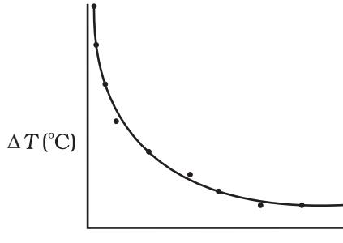

**Fig. 10.19** *Curve showing cooling of hot water with time.*

From the graph you can infer how the cooling of hot water depends on the difference of its temperature from that of the surroundings. You will also notice that initially the rate of cooling is higher and decreases as the temperature of the body falls.

The above activity shows that a hot body loses heat to its surroundings in the form of heat radiation. The rate of loss of heat depends on the difference in temperature between the body and its surroundings. Newton was the first to study, in a systematic manner, the relation between the heat lost by a body in a given enclosure and its temperature.

According to Newton's law of cooling, the rate of loss of heat, – d*Q*/d*t* of the body is directly proportional to the difference of temperature ∆*T* = (*T*2 *–T*1 ) of the body and the surroundings. The law holds good only for small difference of temperature. Also, the loss of heat by radiation depends upon the nature of the surface of the body and the area of the exposed surface. We can write

$\frac{d\mathcal{G}}{dt}$=$k(T_{2}-T_{1})$ (10.19)

where *k* is a positive constant depending upon the area and nature of the surface of the body. Suppose a body of mass *m* and specific heat capacity *s* is at temperature *T*2 . Let *T*1 be the temperature of the surroundings. If the temperature falls by a small amount d*T*2 in time d*t*, then the amount of heat lost is

d*Q* = *ms* d*T*2

∴ Rate of loss of heat is given by

$$\frac{d\mathcal{Q}}{dt}=m\frac{dT_{2}}{dt} (10.20)$$

From Eqs. (10.15) and (10.16) we have

$-m\,s\,\frac{dT_{2}}{dt}=k\,(T_{2}-T_{1})$  
  
$\frac{dT_{2}}{T_{2}-T_{1}}=-\frac{k}{ms}\,dt=-\,K\,dt$ (10.21)

where *K* = *k/m s* On integrating,

$\log_{\rm e}\left(T_{2}-T_{1}\right)=-\,K\,t+c$ (10.22)

or $T_{2}=T_{1}+C^{\prime}\,{\rm e}^{-Kt}$; where $C^{\prime}={\rm e}^{c}$ (10.23)

Equation (10.23) enables you to calculate the time of cooling of a body through a particular range of temperature.

For small temperature differences, the rate of cooling, due to conduction, convection, and radiation combined, is proportional to the difference in temperature. It is a valid approximation in the transfer of heat from a radiator to a room, the loss of heat through the wall of a room, or the cooling of a cup of tea on the table.

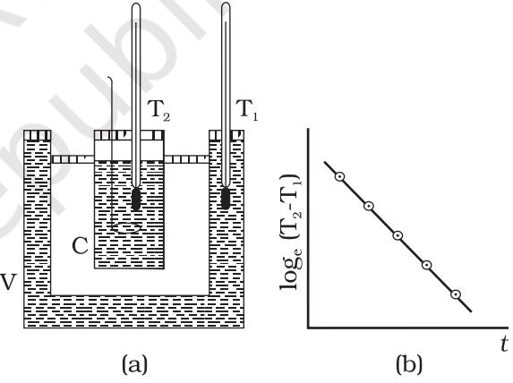

**Fig. 10.20** *Verification of Newton's Law of cooling.*

Newton's law of cooling can be verified with the help of the experimental set-up shown in Fig. 10.20(a). The set-up consists of a doublewalled vessel (V) containing water between the two walls. A copper calorimeter (C) containing hot water is placed inside the double-walled vessel. Two thermometers through the corks are used to note the temperatures *T*2 of water in calorimeter and *T*1 of hot water in between the double walls, respectively. Temperature of hot water in the calorimeter is noted after equal intervals of time. A graph is plotted between loge (*T*2 –*T*1 ) [or *l*n(*T*2 –*T*1 )] and time (*t*). The nature of the graph is observed to be a straight line having a negative slope as shown in Fig. 10.20(b). This is in support of Eq. 10.22.

⊳ **Example 10.8** A pan filled with hot food cools from 94 °C to 86 °C in 2 minutes when the room temperature is at 20 °C. How long will it take to cool from 71 °C to 69 °C?

**Answer** The average temperature of 94 °C and 86 °C is 90 °C, which is 70 °C above the room temperature. Under these conditions the pan cools 8 °C in 2 minutes.

Using Eq. (10.21), we have

Change in temperature Time = ∆ *K T*

$${\frac{8\,\mathrm{{}^{\circ}C}}{2{\mathrm{~min}}}}=K(70\,\mathrm{{}^{\circ}C})$$

The average of 69 °C and 71 °C is 70 °C, which is 50 °C above room temperature. *K* is the same for this situation as for the original.

$${\frac{2\,\mathrm{{}^{\circ}\!\mathrm{C}}}{\mathrm{Time}}}\,=K\left(50\,\mathrm{{}^{\circ}\!\mathrm{C}}\right)$$

When we divide above two equations, we have

$${\frac{8\ {\mathrm{°C/2\,min}}}{2\ {\mathrm{°C/time}}}}={\frac{K\ (70\ {\mathrm{°C}})}{K\ (50\ {\mathrm{°C}})}}$$

$${\mathrm{Time}}=0.7{\mathrm{~min}}$$

= 42 s ⊳

#### **SUMMARY**

- 1. Heat is a form of energy that flows between a body and its surrounding medium by virtue of temperature difference between them. The degree of hotness of the body is quantitatively represented by temperature.
- 2. A temperature-measuring device (thermometer) makes use of some measurable property (called thermometric property) that changes with temperature. Different thermometers lead to different temperature scales. To construct a temperature scale, two fixed points are chosen and assigned some arbitrary values of temperature. The two numbers fix the origin of the scale and the size of its unit.
- 3. The Celsius temperature (*t*C ) and the Farenheit temperare (*t* F )are related by

$$t_{\mathrm{{F}}}=(9/5)\ t_{\mathrm{{c}}}+32\ ,$$

- 4. The ideal gas equation connecting pressure (*P*), volume (*V*) and absolute temperature (*T*) is :
#### *PV* = µ*RT*

where µis the number of moles and *R* is the universal gas constant.

*t*

- 5. In the absolute temperature scale, the zero of the scale corresponds to the temperature where every substance in nature has the least possible molecular activity. The Kelvin absolute temperature scale (*T* ) has the same unit size as the Celsius scale (*T*c ), but differs in the origin :

$$T_{\mathrm{c}}\ \ =\ T-273.15$$

- 6. The coefficient of linear expansion (α*l* ) and volume expansion (αv ) are defined by the relations :

$${\frac{\Delta l}{l}}=\alpha_{l}\Delta T$$
  

$$\cdot{\frac{\Delta V}{V}}=\alpha_{V}\Delta T$$

where ∆*l* and ∆*V* denote the change in length *l* and volume *V* for a change of temperature ∆*T*. The relation between them is :

$$\alpha_{_\mathrm{v}}\ =\ 3\ \alpha_{_\mathrm{l}}$$

- 7. The specific heat capacity of a substance is defined by

$$\mathbf{s}={\frac{1}{m}}{\frac{\Delta Q}{\Delta T}}$$

where *m* is the mass of the substance and ∆*Q* is the heat required to change its temperature by ∆*T*. The molar specific heat capacity of a substance is defined by

$$C={\frac{1}{\mu}}{\frac{\Delta Q}{\Delta T}}$$

where µis the number of moles of the substance.

- 8. The latent heat of fusion (*L*f ) is the heat per unit mass required to change a substance from solid into liquid at the same temperature and pressure. The latent heat of vaporisation (*L*v ) is the heat per unit mass required to change a substance from liquid to the vapour state without change in the temperature and pressure.
- 9. The three modes of heat transfer are conduction, convection and radiation.
- 10. In conduction, heat is transferred between neighbouring parts of a body through molecular collisions, without any flow of matter. For a bar of length *L* and uniform cross section *A* with its ends maintained at temperatures *TC* and *TD* , the rate of flow of heat *H* is :

$$H=K\;A\,{\frac{T_{C}-T_{D}}{L}}$$

where *K* is the thermal conductivity of the material of the bar.

- 11. Newton's Law of Cooling says that the rate of cooling of a body is proportional to the excess temperature of the body over the surroundings :

$${\frac{\mathrm{d}{\boldsymbol{Q}}}{\mathrm{d}t}}=-\,k\left(T_{2}-T_{1}\right)$$

Where *T*1 is the temperature of the surrounding medium and *T*2 is the temperature of the body.

| Quantity | Symbol | Dimensions | Unit | Remark |
| --- | --- | --- | --- | --- |
| Amount of substance | μ | [mol] | mol |  |
| Celsius temperature | tc | (K) | °C |  |
| Kelvin absolute temperature | T | (K) | K | t = T- 273.15 |
| Co-efficient of linear expansion | Q1 | IK-1 | K-1 |  |
| Co-efficient of volume | Oly | IK-1 | K-1 | ax = 3 a1 |
| expansion |  |  |  |  |
| Heat supplied to a system | △○ | [ML2 T -2] | J | Q is not a state |
|  |  |  |  | variable |
| Specific heat capacity | S | IL2 T -2 K-1 | J kg 1 K-1 |  |
| Thermal Conductivity | K | [M LT 3K'1 | J s K | H = - KA dT |

#### **POINTS TO PONDER**

- 1. The relation connecting Kelvin temperature (*T* ) and the Celsius temperature *t* c
$T\:=\:\:t_{\text{c}}+273.15$  
. 

and the assignment *T* = 273.16 K for the triple point of water are exact relations (by choice). With this choice, the Celsius temperature of the melting point of water and boiling point of water (both at 1 atm pressure) are very close to, but not exactly equal to 0 °C and 100 °C respectively. In the original Celsius scale, these latter fixed points were exactly at 0 °C and 100 °C (by choice), but now the triple point of water is the preferred choice for the fixed point, because it has a unique temperature.

- 2. A liquid in equilibrium with vapour has the same pressure and temperature throughout the system; the two phases in equilibrium differ in their molar volume (i.e. density). This is true for a system with any number of phases in equilibrium.
- 3. Heat transfer always involves temperature difference between two systems or two parts of the same system. Any energy transfer that does not involve temperature difference in some way is not heat.
- 4. Convection involves flow of matter *within a fluid* due to unequal temperatures of its parts. A hot bar placed under a running tap loses heat by conduction between the surface of the bar and water and not by convection within water.

#### **EXERCISES**

- **10.1** The triple points of neon and carbon dioxide are 24.57 K and 216.55 K respectively. Express these temperatures on the Celsius and Fahrenheit scales.
- **10.2** Two absolute scales *A* and *B* have triple points of water defined to be 200 A and 350 B. What is the relation between *T*A and *T*B ?
- **10.3** The electrical resistance in ohms of a certain thermometer varies with temperature according to the approximate law :

*R* = *R*o [1 + α(*T* – *T*o )]

The resistance is 101.6 Ω at the triple-point of water 273.16 K, and 165.5 Ω at the normal melting point of lead (600.5 K). What is the temperature when the resistance is 123.4 Ω ?

- **10.4** Answer the following :
	- (a) The triple-point of water is a standard fixed point in modern thermometry. Why ? What is wrong in taking the melting point of ice and the boiling point of water as standard fixed points (as was originally done in the Celsius scale) ?
	- (b) There were two fixed points in the original Celsius scale as mentioned above which were assigned the number 0 °C and 100 °C respectively. On the absolute scale, one of the fixed points is the triple-point of water, which on the Kelvin absolute scale is assigned the number 273.16 K. What is the other fixed point on this (Kelvin) scale ?
	- (c) The absolute temperature (Kelvin scale) *T* is related to the temperature *t*c on the Celsius scale by

$$t_{\mathrm{c}}=T-273.15$$

Why do we have 273.15 in this relation, and not 273.16 ?

- (d) What is the temperature of the triple-point of water on an absolute scale whose unit interval size is equal to that of the Fahrenheit scale ?
- **10.5** Two ideal gas thermometers *A* and *B* use oxygen and hydrogen respectively. The following observations are made :

| Temperature | Pressure |  | Pressure |
| --- | --- | --- | --- |
|  | thermometer A |  | thermometer B |
| Triple-point of water | 1.250 × 105 | Pa | 0.200 × 105 Pa |
| Normal melting point | 1.797 × 105 | Pa | 0.287 × 105 Pa |
| of sulphur |  |  |  |

- (a) What is the absolute temperature of normal melting point of sulphur as read by thermometers *A* and *B* ?
- (b) What do you think is the reason behind the slight difference in answers of thermometers *A* and *B* ? (The thermometers are not faulty). What further procedure is needed in the experiment to reduce the discrepancy between the two readings ?
- **10.6** A steel tape 1m long is correctly calibrated for a temperature of 27.0 °C. The length of a steel rod measured by this tape is found to be 63.0 cm on a hot day when the temperature is 45.0 °C. What is the actual length of the steel rod on that day ? What is the length of the same steel rod on a day when the temperature is 27.0 °C ? Coefficient of linear expansion of steel = 1.20 × 10–5 K–1 .
- **10.7** A large steel wheel is to be fitted on to a shaft of the same material. At 27 °C, the outer diameter of the shaft is 8.70 cm and the diameter of the central hole in the wheel is 8.69 cm. The shaft is cooled using 'dry ice'. At what temperature of the shaft does the wheel slip on the shaft? Assume coefficient of linear expansion of the steel to be constant over the required temperature range :

αsteel = 1.20 × 10–5 K–1 .

- **10.8** A hole is drilled in a copper sheet. The diameter of the hole is 4.24 cm at 27.0 °C. What is the change in the diameter of the hole when the sheet is heated to 227 °C? Coefficient of linear expansion of copper = 1.70 × 10–5 K–1 .
- **10.9** A brass wire 1.8 m long at 27 °C is held taut with little tension between two rigid supports. If the wire is cooled to a temperature of –39 °C, what is the tension developed in the wire, if its diameter is 2.0 mm ? Co-efficient of linear expansion of brass = 2.0 × 10–5 K–1; Young's modulus of brass = 0.91 × 1011 Pa.
- **10.10** A brass rod of length 50 cm and diameter 3.0 mm is joined to a steel rod of the same length and diameter. What is the change in length of the combined rod at 250 °C, if the original lengths are at 40.0 °C? Is there a 'thermal stress' developed at the junction ? The ends of the rod are free to expand (Co-efficient of linear expansion of brass = 2.0 × 10–5 K–1, steel = 1.2 × 10–5 K–1 ).
- **10.11** The coefficient of volume expansion of glycerine is 49 × 10–5 K–1. What is the fractional change in its density for a 30 °C rise in temperature ?
- **10.12** A 10 kW drilling machine is used to drill a bore in a small aluminium block of mass 8.0 kg. How much is the rise in temperature of the block in 2.5 minutes, assuming 50% of power is used up in heating the machine itself or lost to the surroundings. Specific heat of aluminium = 0.91 J g–1 K–1 .
- **10.13** A copper block of mass 2.5 kg is heated in a furnace to a temperature of 500 °C and then placed on a large ice block. What is the maximum amount of ice that can melt? (Specific heat of copper = 0.39 J g–1 K–1; heat of fusion of water = 335 J g–1 ).
- **10.14** In an experiment on the specific heat of a metal, a 0.20 kg block of the metal at 150 °C is dropped in a copper calorimeter (of water equivalent 0.025 kg) containing 150 cm3 of water at 27 °C. The final temperature is 40 °C. Compute the specific heat of the metal. If heat losses to the surroundings are not negligible, is your answer greater or smaller than the actual value for specific heat of the metal ?
- **10.15** Given below are observations on molar specific heats at room temperature of some common gases.

| Gas | Molar specific heat (Cv ) (cal mo1–1 K–1) |
| --- | --- |
| Hydrogen | 4.87 |
| Nitrogen | 4.97 |
| Oxygen | 5.02 |
| Nitric oxide | 4.99 |
| Carbon monoxide | 5.01 |
| Chlorine | 6.17 |

The measured molar specific heats of these gases are markedly different from those for monatomic gases. Typically, molar specific heat of a monatomic gas is 2.92 cal/mol K. Explain this difference. What can you infer from the somewhat larger (than the rest) value for chlorine ?

- **10.16** A child running a temperature of 101°F is given an antipyrin (i.e. a medicine that lowers fever) which causes an increase in the rate of evaporation of sweat from his body. If the fever is brought down to 98 °F in 20 minutes, what is the average rate of extra evaporation caused, by the drug. Assume the evaporation mechanism to be the only way by which heat is lost. The mass of the child is 30 kg. The specific heat of human body is approximately the same as that of water, and latent heat of evaporation of water at that temperature is about 580 cal g–1 .
- **10.17** A 'thermacole' icebox is a cheap and an efficient method for storing small quantities of cooked food in summer in particular. A cubical icebox of side 30 cm has a thickness of 5.0 cm. If 4.0 kg of ice is put in the box, estimate the amount of ice remaining after 6 h. The outside temperature is 45 °C, and co-efficient of thermal conductivity of thermacole is 0.01 J s–1 m–1 K–1. [Heat of fusion of water = 335 × 103 J kg–1]
- **10.18** A brass boiler has a base area of 0.15 m2 and thickness 1.0 cm. It boils water at the rate of 6.0 kg/min when placed on a gas stove. Estimate the temperature of the part of the flame in contact with the boiler. Thermal conductivity of brass = 109 J s–1 m–1 K–1 ; Heat of vaporisation of water = 2256 × 103 J kg–1 .
- **10.19** Explain why :
	- (a) a body with large reflectivity is a poor emitter
	- (b) a brass tumbler feels much colder than a wooden tray on a chilly day
	- (c) an optical pyrometer (for measuring high temperatures) calibrated for an ideal black body radiation gives too low a value for the temperature of a red hot iron piece in the open, but gives a correct value for the temperature when the same piece is in the furnace
	- (d) the earth without its atmosphere would be inhospitably cold
	- (e) heating systems based on circulation of steam are more efficient in warming a building than those based on circulation of hot water
- **10.20** A body cools from 80 °C to 50 °C in 5 minutes. Calculate the time it takes to cool from 60 °C to 30 °C. The temperature of the surroundings is 20 °C.

