# **CHAPTER ELEVEN**

# **THERMODYNAMICS**

# **11.1 INTRODUCTION**

| 11.1 | Introduction |
| --- | --- |
| 11.2 | Thermal equilibrium |
| 11.3 | Zeroth law of |
|  | Thermodynamics |
| 11.4 | Heat, internal energy and |
|  | work |
| 11.5 | First law of |
|  | thermodynamics |
| 11.6 | Specific heat capacity |
| 11.7 | Thermodynamic state |
|  | variables and equation of |
|  | state |
| 11.8 | Thermodynamic processes |
| 11.9 | Second law of |
|  | thermodynamics |
| 11.10 | Reversible and irreversible |
|  | processes |
| 11.11 | Carnot engine |
|  | Summary |
|  | Points to ponder |
|  | Exercises |

In previous chapter we have studied thermal properties of matter. In this chapter we shall study laws that govern thermal energy. We shall study the processes where work is converted into heat and vice versa. In winter, when we rub our palms together, we feel warmer; here work done in rubbing produces the 'heat'. Conversely, in a steam engine, the 'heat' of the steam is used to do useful work in moving the pistons, which in turn rotate the wheels of the train.

In physics, we need to define the notions of heat, temperature, work, etc. more carefully. Historically, it took a long time to arrive at the proper concept of 'heat'. Before the modern picture, heat was regarded as a fine invisible fluid filling in the pores of a substance. On contact between a hot body and a cold body, the fluid (called caloric) flowed from the colder to the hotter body ! This is similar to what happens when a horizontal pipe connects two tanks containing water up to different heights. The flow continues until the levels of water in the two tanks are the same. Likewise, in the 'caloric' picture of heat, heat flows until the 'caloric levels' (i.e., the temperatures) equalise.

In time, the picture of heat as a fluid was discarded in favour of the modern concept of heat as a form of energy. An important experiment in this connection was due to Benjamin Thomson (also known as Count Rumford) in 1798. He observed that boring of a brass cannon generated a lot of heat, indeed enough to boil water. More significantly, the amount of heat produced depended on the work done (by the horses employed for turning the drill) but not on the sharpness of the drill. In the caloric picture, a sharper drill would scoop out more heat fluid from the pores; but this was not observed. A most natural explanation of the observations was that heat was a form of energy and the experiment demonstrated conversion of energy from one form to another–from work to heat.

Thermodynamics is the branch of physics that deals with the concepts of heat and temperature and the inter-conversion of heat and other forms of energy. Thermodynamics is a macroscopic science. It deals with bulk systems and does not go into the molecular constitution of matter. In fact, its concepts and laws were formulated in the nineteenth century before the molecular picture of matter was firmly established. Thermodynamic description involves relatively few macroscopic variables of the system, which are suggested by common sense and can be usually measured directly. A microscopic description of a gas, for example, would involve specifying the co-ordinates and velocities of the huge number of molecules constituting the gas. The description in kinetic theory of gases is not so detailed but it does involve molecular distribution of velocities. Thermodynamic description of a gas, on the other hand, avoids the molecular description altogether. Instead, the state of a gas in thermodynamics is specified by macroscopic variables such as pressure, volume, temperature, mass and composition that are felt by our sense perceptions and are measurable*****.

The distinction between mechanics and thermodynamics is worth bearing in mind. In mechanics, our interest is in the motion of particles or bodies under the action of forces and torques. Thermodynamics is not concerned with the motion of the system as a whole. It is concerned with the internal macroscopic state of the body. When a bullet is fired from a gun, what changes is the mechanical state of the bullet (its kinetic energy, in particular), not its temperature. When the bullet pierces a wood and stops, the kinetic energy of the bullet gets converted into heat, changing the temperature of the bullet and the surrounding layers of wood. Temperature is related to the energy of the internal (disordered) motion of the bullet, not to the motion of the bullet as a whole.

# **11.2 THERMAL EQUILIBRIUM**

Equilibrium in mechanics means that the net external force and torque on a system are zero. The term 'equilibrium' in thermodynamics appears in a different context : we say the state of a system is an equilibrium state if the macroscopic variables that characterise the system do not change in time. For example, a gas inside a closed rigid container, completely insulated from its surroundings, with fixed values of pressure, volume, temperature, mass and composition that do not change with time, is in a state of thermodynamic equilibrium.

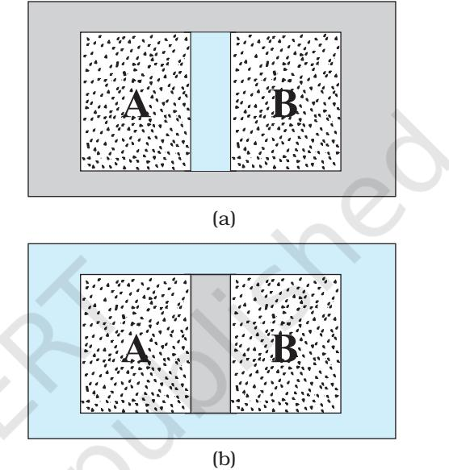

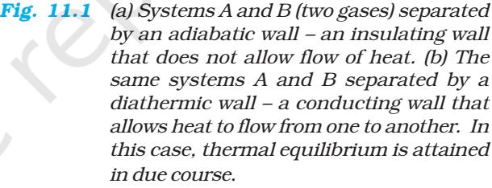

In general, whether or not a system is in a state of equilibrium depends on the surroundings and the nature of the wall that separates the system from the surroundings. Consider two gases *A* and *B* occupying two different containers. We know experimentally that pressure and volume of a given mass of gas can be chosen to be its two independent variables. Let the pressure and volume of the gases be (*PA* , V*A* ) and (*PB* , *VB* ) respectively. Suppose first that the two systems are put in proximity but are separated by an

<b>* *Thermodynamics may also involve other variables that are not so obvious to our senses e.g. entropy, enthalpy, etc., and they are all macroscopic variables. However, a thermodynamic state is specified by five state variables viz., pressure, volume, temperature, internal energy and entropy. Entropy is a measure of disorderness in the system. Enthalpy is a measure of total heat content of the system.*

**adiabatic wall** – an insulating wall (can be movable) that does not allow flow of energy (heat) from one to another. The systems are insulated from the rest of the surroundings also by similar adiabatic walls. The situation is shown schematically in Fig. 11.1 (a). In this case, it is found that any possible pair of values (*PA* , *VA* ) will be in equilibrium with any possible pair of values (*PB* , *VB* ). Next, suppose that the adiabatic wall is replaced by a **diathermic wall** – a conducting wall that allows energy flow (heat) from one to another. It is then found that the macroscopic variables of the systems *A* and *B* change spontaneously until both the systems attain equilibrium states. After that there is no change in their states. The situation is shown in Fig. 11.1(b). The pressure and volume variables of the two gases change to (*PB* ′, *VB* ′) and (*PA* ′, *VA* ′) such that the new states of *A* and *B* are in equilibrium with each other*****. There is no more energy flow from one to another. We then say that the system *A* is in thermal equilibrium with the system *B*.

What characterises the situation of thermal equilibrium between two systems ? You can guess the answer from your experience. In thermal equilibrium, the temperatures of the two systems are equal. We shall see how does one arrive at the concept of temperature in thermodynamics? The Zeroth law of thermodynamics provides the clue.

# **11.3 ZEROTH LAW OF THERMODYNAMICS**

Imagine two systems *A* and *B*, separated by an adiabatic wall, while each is in contact with a third system *C*, via a conducting wall [Fig. 11.2(a)]. The states of the systems (i.e., their macroscopic variables) will change until both *A* and *B* come to thermal equilibrium with *C*. After this is achieved, suppose that the adiabatic wall between *A* and *B* is replaced by a conducting wall and *C* is insulated from *A* and *B* by an adiabatic wall [Fig.11.2(b)]. It is found that the states of *A* and *B* change no further i.e. they are found **to be in thermal equilibrium with each other**. This observation forms the basis of the **Zeroth Law of Thermodynamics**, which states that **'two systems in thermal equilibrium with a third system separately are in thermal equilibrium with each other'**. R.H. Fowler formulated this law in 1931 long after the first and second Laws of thermodynamics were stated and so numbered.

The Zeroth Law clearly suggests that when two systems *A* and *B,* are in thermal equilibrium, there must be a physical quantity that has the same value for both. This thermodynamic variable whose value is equal for two systems in thermal equilibrium is called temperature (*T* ). Thus, if *A* and *B* are separately in equilibrium with *C*, *TA* = *TC* and *TB* = *TC*. This implies that *TA* = *TB* i.e. the systems *A* and *B* are also in thermal equilibrium.

We have arrived at the concept of temperature formally via the Zeroth Law. The next question is : how to assign numerical values to temperatures of different bodies ? In other words, how do we construct a scale of temperature ? Thermometry deals with this basic question to which we turn in the next section.

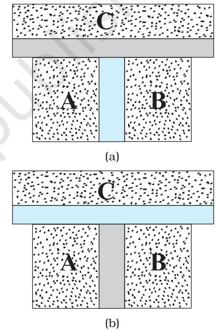

- **Fig. 11.2** *(a) Systems A and B are separated by an adiabatic wall, while each is in contact with a third system C via a conducting wall. (b) The adiabatic wall between A and B is replaced by a conducting wall, while C is insulated from A and B by an adiabatic wall.*
<b>* *Both the variables need not change. It depends on the constraints. For instance, if the gases are in containers of fixed volume, only the pressures of the gases would change to achieve thermal equilibrium.*

## **11.4 HEAT, INTERNAL ENERGY AND WORK**

The Zeroth Law of Thermodynamics led us to the concept of temperature that agrees with our commonsense notion. Temperature is a marker of the 'hotness' of a body. It determines the direction of flow of heat when two bodies are placed in thermal contact. Heat flows from the body at a higher temperature to the one at lower temperature. The flow stops when the temperatures equalise; the two bodies are then in thermal equilibrium. We saw in some detail how to construct temperature scales to assign temperatures to different bodies. We now describe the concepts of heat and other relevant quantities like internal energy and work.

The concept of internal energy of a system is not difficult to understand. We know that every bulk system consists of a large number of molecules. Internal energy is simply the sum of the kinetic energies and potential energies of these molecules. We remarked earlier that in thermodynamics, the kinetic energy of the system, as a whole, is not relevant. Internal energy is thus, the sum of molecular kinetic and potential energies in the frame of reference relative to which the centre of mass of the system is at rest. Thus, it includes only the (disordered) energy associated with the random motion of molecules of the system. We denote the internal energy of a system by *U*.

Though we have invoked the molecular picture to understand the meaning of internal energy, as far as thermodynamics is concerned, *U* is simply a macroscopic variable of the system. The important thing about internal energy is that it depends only on the state of the system, not on how that state was achieved. Internal energy *U* of a system is an example of a thermodynamic 'state variable' – its value depends only on the given state of the system, not on history i.e. not on the 'path' taken to arrive at that state. Thus, the internal energy of a given mass of gas depends on its state described by specific values of pressure, volume and temperature. It does not depend on how this state of the gas came about. Pressure, volume, temperature, and internal energy are thermodynamic state variables of the system (gas) (see section 11.7). If we neglect the small intermolecular forces in a gas, the internal energy of a gas is just the sum of kinetic energies associated with various random motions of its molecules. We will see in the next chapter that in a gas this motion is not only translational (i.e. motion from one point to another in the volume of the container); it also includes rotational and vibrational motion of the molecules (Fig. 11.3).

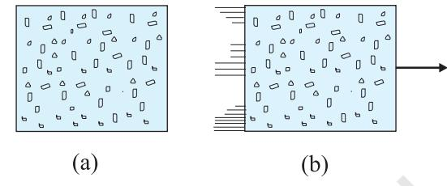

- **Fig. 11.3** *(a) Internal energy U of a gas is the sum of the kinetic and potential energies of its molecules when the box is at rest. Kinetic energy due to various types of motion (translational, rotational, vibrational) is to be included in U. (b) If the same box is moving as a whole with some velocity, the kinetic energy of the box is not to be included in U*.
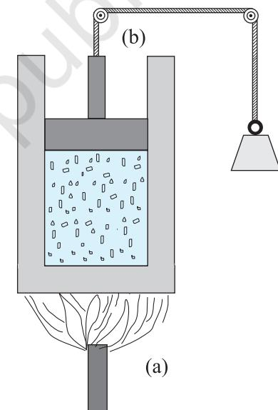

- **Fig. 11.4** *Heat and work are two distinct modes of energy transfer to a system that results in change in its internal energy. (a) Heat is energy transfer due to temperature difference between the system and the surroundings. (b) Work is energy transfer brought about by means (e.g. moving the piston by raising or lowering some weight connected to it) that do not involve such a temperature difference.*
What are the ways of changing internal energy of a system ? Consider again, for simplicity, the system to be a certain mass of gas contained in a cylinder with a movable piston as shown in Fig. 11.4. Experience shows there are two ways of changing the state of the gas (and hence its internal energy). One way is to put the cylinder in contact with a body at a higher temperature than that of the gas. The temperature difference will cause a flow of energy (heat) from the hotter body to the gas, thus increasing the internal energy of the gas. The other way is to push the piston down i.e. to do work on the system, which again results in increasing the internal energy of the gas. Of course, both these things could happen in the reverse direction. With surroundings at a lower temperature, heat would flow from the gas to the surroundings. Likewise, the gas could push the piston up and do work on the surroundings. In short, heat and work are two different modes of altering the state of a thermodynamic system and changing its internal energy.

The notion of heat should be carefully distinguished from the notion of internal energy. Heat is certainly energy, but it is the energy in transit. This is not just a play of words. The distinction is of basic significance. The state of a thermodynamic system is characterised by its internal energy, not heat. A statement like **'a gas in a given state has a certain amount of heat'** is as meaningless as the statement that **'a gas in a given state has a certain amount of work'**.In contrast, **'a gas in a given state has a certain amount of internal energy'** is a perfectly meaningful statement. Similarly, the statements **'a certain amount of heat is supplied to the system' or 'a certain amount of work was done by the system'** are perfectly meaningful.

To summarise, heat and work in thermodynamics are not state variables. They are modes of energy transfer to a system resulting in change in its internal energy, which, as already mentioned, is a state variable.

In ordinary language, we often confuse heat with internal energy. The distinction between them is sometimes ignored in elementary physics books. For proper understanding of thermodynamics, however, the distinction is crucial.

# **11.5 FIRST LAW OF THERMODYNAMICS**

We have seen that the internal energy *U* of a system can change through two modes of energy transfer : heat and work. Let

- ∆*Q* = Heat supplied *to* the system *by* the surroundings
- ∆*W* = Work done *by* the system *on* the surroundings

∆*U* = Change in internal energy of the system The general principle of conservation of energy then implies that

$\Lambda Q=\Lambda U+\Lambda W$ (11.1)

i.e. the energy (∆*Q*) supplied to the system goes in partly to increase the internal energy of the system (∆*U*) and the rest in work on the environment (∆*W*). Equation (11.1) is known as the **First Law of Thermodynamics**. It is simply the general law of conservation of energy applied to any system in which the energy transfer from or to the surroundings is taken into account.

Let us put Eq. (11.1) in the alternative form

$\Lambda g-\Lambda W=\Lambda U$ (11.2)

Now, the system may go from an initial state to the final state in a number of ways. For example, to change the state of a gas from (*P*1 , *V*1 ) to (*P*2 , *V*2 ), we can first change the volume of the gas from *V*1 to *V*2 , keeping its pressure constant i.e. we can first go the state (*P*1 , *V*2 ) and then change the pressure of the gas from *P*1 to *P*2 , keeping volume constant, to take the gas to (*P*2 , *V*2 ). Alternatively, we can first keep the volume constant and then keep the pressure constant. Since *U* is a state variable, ∆*U* depends only on the initial and final states and not on the path taken by the gas to go from one to the other. However, ∆*Q* and ∆*W* will, in general, depend on the path taken to go from the initial to final states. From the First Law of Thermodynamics, Eq. (11.2), it is clear that the combination ∆*Q* – ∆*W*, is however, path independent. This shows that if a system is taken through a process in which ∆*U* = 0 (for example, isothermal expansion of an ideal gas, see section 11.8),

∆*Q* = ∆*W*

i.e., heat supplied to the system is used up entirely by the system in doing work on the environment.

If the system is a gas in a cylinder with a movable piston, the gas in moving the piston does work. Since force is pressure times area, and area times displacement is volume, work done by the system against a constant pressure *P* is

$$\Delta W=P\Delta V$$

where ∆*V* is the change in volume of the gas. Thus, for this case, Eq. (11.1) gives

$\Lambda Q=\Lambda U+P\Lambda V$ (11.3)

As an application of Eq. (11.3), consider the change in internal energy for 1 g of water when we go from its liquid to vapour phase. The measured latent heat of water is 2256 J/g. i.e., for 1 g of water ∆*Q* = 2256 J. At atmospheric pressure, 1 g of water has a volume 1 cm3 in liquid phase and 1671 cm3 in vapour phase.

Therefore,

∆*W* =*P* (*V* g –*V*l ) = 1.013 ×105 × (1671 × 10–6) =169.2 J

Equation (11.3) then gives

∆*U* = 2256 – 169.2 = 2086.8 J

We see that most of the heat goes to increase the internal energy of water in transition from the liquid to the vapour phase.

# **11.6 SPECIFIC HEAT CAPACITY**

Suppose an amount of heat ∆*Q* supplied to a substance changes its temperature from *T* to *T* + ∆*T*. We define heat capacity of a substance (see Chapter 10) to be

$\mathbf{S}=\frac{\mathbf{A}\mathbf{Q}}{\mathbf{A}T}$ (11.4)

We expect ∆*Q* and, therefore, heat capacity *S* to be proportional to the mass of the substance. Further, it could also depend on the temperature, i.e., a different amount of heat may be needed for a unit rise in temperature at different temperatures. To define a constant characteristic of the substance and independent of its amount, we divide *S* by the mass of the substance *m* in kg :

$\mathbf{S}=\frac{\mathbf{S}}{m}=\left(\frac{1}{m}\right)\frac{\mathbf{A}\mathbf{S}}{\mathbf{A}T}$ (11.5)

*s* is known as the specific heat capacity of the substance. It depends on the nature of the substance and its temperature. The unit of specific heat capacity is J kg–1 K–1 .

If the amount of substance is specified in terms of moles µ (instead of mass *m* in kg ), we can define heat capacity per mole of the substance by

$C=\frac{S}{\mu}=\frac{1}{\mu}\frac{\Delta Q}{\Delta T}$ (11.6)

*C* is known as molar specific heat capacity of the substance. Like *s*, *C* is independent of the amount of substance. *C* depends on the nature of the substance, its temperature and the conditions under which heat is supplied. The unit of *C* is J mo1 –1 K–1. As we shall see later (in connection with specific heat capacity of gases), additional conditions may be needed to define *C* or *s*. The idea in defining *C* is that simple predictions can be made in regard to molar specific heat capacities.

Table 11.1 lists measured specific and molar heat capacities of solids at atmospheric pressure and ordinary room temperature.

We will see in Chapter 12 that predictions of specific heats of gases generally agree with experiment. We can use the same law of equipartition of energy that we use there to predict molar specific heat capacities of solids (See Section 12.5 and 12.6). Consider a solid of *N* atoms, each vibrating about its mean position. An oscillator in one dimension has average energy of 2 × ½ *kB T* = *kB T*. In three dimensions, the average energy is 3 *kB T*. For a mole of a solid, the total energy is

$$U=3\ k_{B}T\times N_{A}=3\ R T\ (\because k_{B}T\times N_{A}=R)$$

Now, at constant pressure, ∆*Q* = ∆*U* + *P* ∆*V* ≅ ∆*U*, since for a solid ∆*V* is negligible. Therefore,

$C=\frac{\Delta\mathcal{Q}}{\Delta T}=\frac{\Delta U}{\Delta T}=3R$ (11.7)

  
  
**Table 11.1**: **Specific and molar heat capacities of some solids at room temperature and atmospheric pressure**

| Speci"c K ) –1 –1 (J kg | heat –v | Molar speci"c heat (J mol K ) –1 –1 |
| --- | --- | --- |
| Substance |  |  |

 As Table 11.1 shows, the experimentally measured values which generally agrees with predicted value 3R at ordinary temperatures. (Carbon is an exception.) The agreement is known to break down at low temperatures.

### **Specific heat capacity of water**

The old unit of heat was calorie. One calorie was earlier defined to be the amount of heat required to raise the temperature of 1g of water by 1 C. With more precise measurements, it was found that the specific heat of water varies slightly with temperature. Figure 11.5 shows this variation in the temperature range 0 to 100 °C.

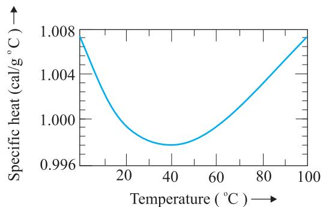

**Fig. 11.5** *Variation of specific heat capacity of water with temperature.*

For a precise definition of calorie, it was, therefore, necessary to specify the unit temperature interval. One calorie is defined to be the amount of heat required to raise the temperature of 1g of water from 14.5 °C to 15.5 °C. Since heat is just a form of energy, it is preferable to use the unit joule, J. In SI units, the specific heat capacity of water is 4186 J kg–1 K –1 i.e. 4.186 J g–1 K –1 . The so called mechanical equivalent of heat defined as the amount of work needed to produce 1 cal of heat is in fact just a conversion factor between two different units of energy : calorie to joule. Since in SI units, we use the unit joule for heat, work or any other form of energy, the term mechanical equivalent is now superfluous and need not be used.

As already remarked, the specific heat capacity depends on the process or the conditions under which heat capacity transfer takes place. For gases, for example, we can define two specific heats : **specific heat capacity at constant volume and specific heat capacity at constant pressure**. For an ideal gas, we have a simple relation.

$C_{p}=C_{v}=R$ (11.8)

where *Cp* and *Cv* are molar specific heat capacities of an ideal gas at constant pressure and volume respectively and *R* is the universal gas constant. To prove the relation, we begin with Eq. (11.3) for 1 mole of the gas :

$$\Delta Q\,=\Delta U+P\,\Delta V$$

If ∆*Q* is absorbed at constant volume, ∆*V* = 0

$$C_{\rm v}=\left(\frac{\Delta Q}{\Delta T}\right)_{\rm v}=\left(\frac{\Delta U}{\Delta T}\right)_{\rm v}=\left(\frac{\Delta U}{\Delta T}\right)_{\rm v}\tag{11.9}$$

where the subscript v is dropped in the last step, since *U* of an ideal gas depends only on temperature. (The subscript denotes the quantity kept fixed.) If, on the other hand, ∆*Q* is absorbed at constant pressure,

$\left(\frac{\Delta\mathrm{U}}{\Delta\mathrm{T}}\right)_{\mathrm{p}}=\left(\frac{\Delta\mathrm{U}}{\Delta\mathrm{T}}\right)_{\mathrm{p}}+\mathrm{P}\left(\frac{\Delta\mathrm{V}}{\Delta\mathrm{T}}\right)_{\mathrm{p}}$ (11.10)

The subscript *p* can be dropped from the first term since *U* of an ideal gas depends only on *T*. Now, for a mole of an ideal gas

*PV* = *RT*

which gives

$P\left(\frac{\Delta V}{\Delta T}\right)_{\rm p}=R$ (11.11)

Equations (11.9) to (11.11) give the desired relation, Eq. (11.8).

# **11.7THERMODYNAMIC STATE VARIABLES AND EQUATION OF STATE**

Every **equilibrium state** of a thermodynamic system is completely described by specific values of some macroscopic variables, also called state variables. For example, an equilibrium state of a gas is completely specified by the values of pressure, volume, temperature, and mass (and composition if there is a mixture of gases). A thermodynamic system is not always in equilibrium. For example, a gas allowed to expand freely against vacuum is not an equilibrium state [Fig. 11.6(a)]. During the rapid expansion, pressure of the gas may not be uniform throughout. Similarly, a mixture of gases undergoing an explosive chemical reaction (e.g. a mixture of petrol vapour and air when ignited by a spark) is not an equilibrium state; again its temperature and pressure are not uniform [Fig. 11.6(b)]. Eventually, the gas attains a uniform temperature and pressure and comes to thermal and mechanical equilibrium with its surroundings.

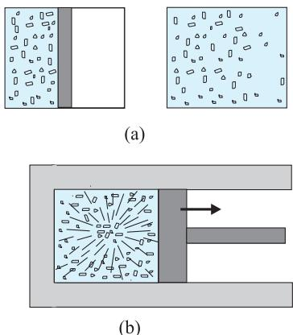

- **Fig. 11.6** *(a) The partition in the box is suddenly removed leading to free expansion of the gas. (b) A mixture of gases undergoing an explosive chemical reaction. In both situations, the gas is not in equilibrium and cannot be described by state variables.*
In short, thermodynamic state variables describe equilibrium states of systems. The various state variables are not necessarily independent. The connection between the state variables is called the equation of state. For example, for an ideal gas, the equation of state is the ideal gas relation

#### *P V* = µ *R T*

For a fixed amount of the gas i.e. given µ*,* there are thus, only two independent variables, say *P* and *V* or *T* and *V*. The pressure-volume curve for a fixed temperature is called an **isotherm**. Real gases may have more complicated equations of state.

The thermodynamic state variables are of two kinds: **extensive** and **intensive**. Extensive variables indicate the 'size' of the system. Intensive variables such as pressure and temperature do not. To decide which variable is extensive and which intensive, think of a relevant system in equilibrium, and imagine that it is divided into two equal parts. The variables that remain unchanged for each part are intensive. The variables whose values get halved in each part are extensive. It is easily seen, for example, that internal energy *U*, volume *V*, total mass *M* are extensive variables. Pressure *P*, temperature *T*, and density ρ are intensive variables. It is a good practice to check the consistency of thermodynamic equations using this classification of variables. For example, in the equation

$$\Delta Q=\Delta U+P\Delta V$$

quantities on both sides are extensive*****. (The product of an intensive variable like *P* and an extensive quantity ∆*V* is extensive.)

# **11.8 THERMODYNAMIC PROCESSES**

# **11.8.1 Quasi-static process**

Consider a gas in thermal and mechanical equilibrium with its surroundings. The pressure of the gas in that case equals the external pressure and its temperature is the same as that of its surroundings. Suppose that the external pressure is suddenly reduced (say by lifting the weight on the movable piston in the container). The piston will accelerate outward. During the process, the gas passes through states that are not equilibrium states. The nonequilibrium states do not have well-defined pressure and temperature. In the same way, if a finite temperature difference exists between the gas and its surroundings, there will be a rapid exchange of heat during which the gas will pass through non-equilibrium states. In due course, the gas will settle to an equilibrium state with well-defined temperature and pressure equal to those of the surroundings. The free expansion of a gas in vacuum and a mixture of gases undergoing an explosive chemical reaction, mentioned in section 11.7 are also examples where the system goes through nonequilibrium states.

Non-equilibrium states of a system are difficult to deal with. It is, therefore, convenient to imagine an idealised process in which at every stage the system is an equilibrium state. Such a

<b>* *As emphasised earlier, Q is not a state variable. However,* ∆*Q is clearly proportional to the total mass of system and hence is extensive.*

process is, in principle, infinitely slow, hence the name quasi-static (meaning nearly static). The system changes its variables (*P*, *T*, *V* ) so slowly that it remains in thermal and mechanical equilibrium with its surroundings throughout. In a quasi-static process, at every stage, the difference in the pressure of the system and the external pressure is infinitesimally small. The same is true of the temperature difference between the system and its surroundings (Fig.11.7). To take a gas from the state (*P*, *T* ) to another state (*P* ′, *T* ′ ) via a quasi-static process, we change the external pressure by a very small amount, allow the system to equalise its pressure with that of the surroundings and continue the process infinitely slowly until the system achieves the pressure *P* ′. Similarly, to change the temperature, we introduce an infinitesimal temperature difference between the system and the surrounding reservoirs and by choosing reservoirs of progressively different temperatures *T* to *T* ′, the system achieves the temperature *T* ′.

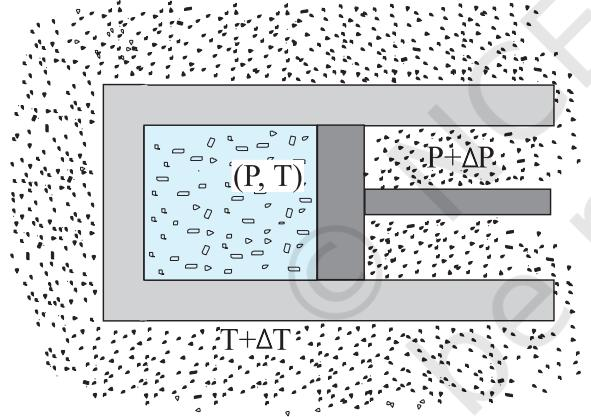

**Fig. 11.7** *In a quasi-static process, the temperature of the surrounding reservoir and the external pressure differ only infinitesimally from the temperature and pressure of the system.*

A quasi-static process is obviously a hypothetical construct. In practice, processes that are sufficiently slow and do not involve accelerated motion of the piston, large temperature gradient, etc., are reasonably approximation to an ideal quasi-static process. We shall from now on deal with quasi-static processes only, except when stated otherwise.

A process in which the temperature of the system is kept fixed throughout is called an **isothermal process**. The expansion of a gas in a metallic cylinder placed in a large reservoir of fixed temperature is an example of an isothermal process. (Heat transferred from the reservoir to the system does not materially affect the temperature of the reservoir, because of its very large heat capacity.) In **isobaric processes** the pressure is constant while in **isochoric processes** the volume is constant. Finally, if the system is insulated from the surroundings and no heat flows between the system and the surroundings, the process is **adiabatic**. The definitions of these special processes are summarised in Table. 11.2

# **Table 11.2 Some special thermodynamic processes**

| Type of processes | Feature |
| --- | --- |
| Isothermal | Temperature constant |
| Isobaric | Pressure constant |
| Isochoric | Volume constant |
| Adiabatic | No heat flow between |
|  | the system and the |
|  | surroundings (ΔΩ = 0) |

We now consider these processes in some detail :

# **11.8.2 Isothermal process**

For an isothermal process (*T* fixed), the ideal gas equation gives

*PV* = constant

i.e., pressure of a given mass of gas varies inversely as its volume. This is nothing but Boyle's Law.

Suppose an ideal gas goes isothermally (at temperature *T* ) from its initial state (*P*1 , *V*1 ) to the final state (*P*2 , *V* 2 ). At any intermediate stage with pressure *P* and volume change from *V* to *V* + ∆*V* (∆*V* small)

$$\Delta W=P\,\Delta\,V$$

Taking (∆*V* → 0) and summing the quantity ∆*W* over the entire process,

$W=\int\limits^{V_{2}}P\;\mathrm{d}V$  
  
$V_{1}$  
  
$=\mu\,RT\int\limits^{V_{2}}\frac{\mathrm{d}V}{V}=\mu RT\;\;\ln\frac{V_{2}}{V_{1}}$ (11.12)

where in the second step we have made use of the ideal gas equation *PV* = µ *RT* and taken the constants out of the integral. For an ideal gas, internal energy depends only on temperature. Thus, there is no change in the internal energy of an ideal gas in an isothermal process. The First Law of Thermodynamics then implies that heat supplied to the gas equals the work done by the gas : *Q* = *W*. Note from Eq. (11.12) that for *V*2 > *V*1 , *W* > 0; and for *V*2 < *V*1 , *W* < 0. That is, in an isothermal expansion, the gas absorbs heat and does work while in an isothermal compression, work is done on the gas by the environment and heat is released.

### **11.8.3 Adiabatic process**

In an adiabatic process, the system is insulated from the surroundings and heat absorbed or released is zero. From Eq. (11.1), we see that work done by the gas results in decrease in its internal energy (and hence its temperature for an ideal gas). We quote without proof (the result that you will learn in higher courses) that for an adiabatic process of an ideal gas.

$P\,V^{\prime}=$ const (11.13)

where γ is the ratio of specific heats (ordinary or molar) at constant pressure and at constant volume.

$$\gamma={\frac{C_{p}}{C_{v}}}$$

Thus if an ideal gas undergoes a change in its state adiabatically from (*P*1 , *V*1 ) to (*P*2 , *V*2 ) :

$$P_{1}V_{1}^{\prime}=P_{2}V_{2}^{\prime}$$

Figure11.8 shows the *P*-*V* curves of an ideal gas for two adiabatic processes connecting two isotherms.

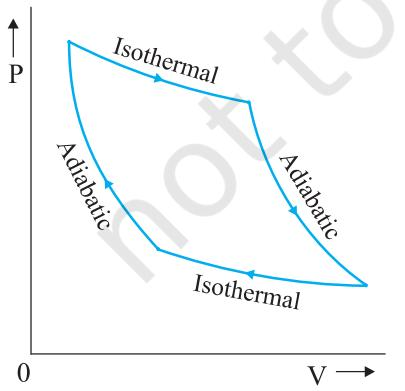

**Fig. 11.8** *P-V curves for isothermal and adiabatic processes of an ideal gas.*

We can calculate, as before, the work done in an adiabatic change of an ideal gas from the state (*P*1 , *V*1 , *T*1 ) to the state (*P*2 , *V*2 , *T*2 ).

$W=\int\limits_{1}^{V_{2}}P\;\mathrm{d}V$  
  
$V_{1}$  
  
$=constant\times\int\limits_{1}^{V_{2}}\frac{\mathrm{d}V}{V^{\gamma}}=constant\times\frac{V^{-\gamma+1}}{1-\gamma}\left|\begin{array}{c}V_{2}\\ V_{1}\end{array}\right.$  
  
$\frac{constant}{(1-\gamma)}\;\times\;\left[\frac{1}{V_{2}^{\gamma-1}}\;-\;\frac{1}{V_{1}^{\gamma-1}}\right]$ (11.15)

From Eq. (11.14), the constant is *P*1*V*1 γ or *P*2*V*2 γ

$$W=\frac{1}{1-\gamma}\left[\frac{P_{2}V_{2}^{\gamma}}{V_{2}^{\gamma-1}}-\frac{P_{1}V_{1}^{\gamma}}{V_{1}^{\gamma-1}}\right]$$
 
$$=\frac{1}{1-\gamma}\left[P_{2}V_{2}-P_{1}V_{1}\right]=\frac{\mu RT_{1}-T_{2}}{\gamma-1}\tag{11.16}$$

As expected, if work is done by the gas in an adiabatic process (*W* > 0), from Eq. (11.16), *T*2 < *T*1 . On the other hand, if work is done on the gas (*W* < 0), we get *T*2 > *T*1 i.e., the temperature of the gas rises.

#### **11.8.4 Isochoric process**

In an isochoric process, *V* is constant. No work is done on or by the gas. From Eq. (11.1), the heat absorbed by the gas goes entirely to change its internal energy and its temperature. The change in temperature for a given amount of heat is determined by the specific heat of the gas at constant volume.

#### **11.8.5 Isobaric process**

In an isobaric process, *P* is fixed. Work done by the gas is

$W=P(V_{2}-V_{1})=\mu\,R(T_{2}-T_{1})$ (11.17)

Since temperature changes, so does internal energy. The heat absorbed goes partly to increase internal energy and partly to do work. The change in temperature for a given amount of heat is determined by the specific heat of the gas at constant pressure.

### **11.8.6 Cyclic process**

In a cyclic process, the system returns to its initial state. Since internal energy is a state variable, ∆*U* = 0 for a cyclic process. From Eq. (11.1), the total heat absorbed equals the work done by the system.

# **11.9 SECOND LAW OF THERMODYNAMICS**

The First Law of Thermodynamics is the principle of conservation of energy. Common experience shows that there are many conceivable processes that are perfectly allowed by the First Law and yet are never observed. For example, nobody has ever seen a book lying on a table jumping to a height by itself. But such a thing would be possible if the principle of conservation of energy were the only restriction. The table could cool spontaneously, converting some of its internal energy into an equal amount of mechanical energy of the book, which would then hop to a height with potential energy equal to the mechanical energy it acquired. But this never happens. Clearly, some additional basic principle of nature forbids the above, even though it satisfies the energy conservation principle. This principle, which disallows many phenomena consistent with the First Law of Thermodynamics is known as the Second Law of Thermodynamics.

The Second Law of Thermodynamics gives a fundamental limitation to the efficiency of a heat engine and the co-efficient of performance of a refrigerator. In simple terms, it says that efficiency of a heat engine can never be unity. For a refrigerator, the Second Law says that the co-efficient of performance can never be infinite. The following two statements, one due to Kelvin and Planck denying the possibility of a perfect heat engine, and another due to Clausius denying the possibility of a perfect refrigerator or heat pump, are a concise summary of these observations.

## **Kelvin-Planck statement**

No process is possible whose sole result is the absorption of heat from a reservoir and the complete conversion of the heat into work.

## **Clausius statement**

No process is possible whose sole result is the transfer of heat from a colder object to a hotter object.

It can be proved that the two statements above are completely equivalent.

# **11.10 REVERSIBLE AND IRREVERSIBLE PROCESSES**

Imagine some process in which a thermodynamic system goes from an initial state *i* to a final state *f*. During the process the system absorbs heat *Q* from the surroundings and performs work *W* on it. Can we reverse this process and bring both the system and surroundings to their initial states with no other effect anywhere ? Experience suggests that for most processes in nature this is not possible. The spontaneous processes of nature are irreversible. Several examples can be cited. The base of a vessel on an oven is hotter than its other parts. When the vessel is removed, heat is transferred from the base to the other parts, bringing the vessel to a uniform temperature (which in due course cools to the temperature of the surroundings). The process cannot be reversed; a part of the vessel will not get cooler spontaneously and warm up the base. It will violate the Second Law of Thermodynamics, if it did. The free expansion of a gas is irreversible. The combustion reaction of a mixture of petrol and air ignited by a spark cannot be reversed. Cooking gas leaking from a gas cylinder in the kitchen diffuses to the entire room. The diffusion process will not spontaneously reverse and bring the gas back to the cylinder. The stirring of a liquid in thermal contact with a reservoir will convert the work done into heat, increasing the internal energy of the reservoir. The process cannot be reversed exactly; otherwise it would amount to conversion of heat entirely into work, violating the Second Law of Thermodynamics. Irreversibility is a rule rather an exception in nature.

Irreversibility arises mainly from two causes: one, many processes (like a free expansion, or an explosive chemical reaction) take the system to non-equilibrium states; two, most processes involve friction, viscosity and other dissipative effects (e.g., a moving body coming to a stop and losing its mechanical energy as heat to the floor and the body; a rotating blade in a liquid coming to a stop due to viscosity and losing its mechanical energy with corresponding gain in the internal energy of the liquid). Since dissipative effects are present everywhere and can be minimised but not fully eliminated, most processes that we deal with are irreversible.

A thermodynamic process (state *i* → state *f* ) is reversible if the process can be turned back such that both the system and the surroundings return to their original states, with no other change anywhere else in the universe. From the preceding discussion, a reversible process is an idealised notion. A process is reversible only if it is quasi-static (system in equilibrium with the surroundings at every stage) and there are no dissipative effects. For example, a quasi-static isothermal expansion of an ideal gas in a cylinder fitted with a frictionless movable piston is a reversible process.

Why is reversibility such a basic concept in thermodynamics ? As we have seen, one of the concerns of thermodynamics is the efficiency with which heat can be converted into work. The Second Law of Thermodynamics rules out the possibility of a perfect heat engine with 100% efficiency. But what is the highest efficiency possible for a heat engine working between two reservoirs at temperatures *T*1 and *T*2 ? It turns out that a heat engine based on idealised reversible processes achieves the highest efficiency possible. All other engines involving irreversibility in any way (as would be the case for practical engines) have lower than this limiting efficiency.

# **11.11 CARNOT ENGINE**

Suppose we have a hot reservoir at temperature *T*1 and a cold reservoir at temperature *T*2 . What is the maximum efficiency possible for a heat engine operating between the two reservoirs and what cycle of processes should be adopted to achieve the maximum efficiency ? Sadi Carnot, a French engineer, first considered this question in 1824. Interestingly, Carnot arrived at the correct answer, even though the basic concepts of heat and thermodynamics had yet to be firmly established.

We expect the ideal engine operating between two temperatures to be a reversible engine. Irreversibility is associated with dissipative effects, as remarked in the preceding section, and lowers efficiency. A process is reversible if it is quasi-static and non-dissipative. We have seen that a process is not quasi-static if it involves finite temperature difference between the system and the reservoir. This implies that in a reversible heat engine operating between two temperatures, heat should be absorbed (from the hot reservoir) isothermally and released (to the cold reservoir) isothermally. We thus have identified two steps of the reversible heat engine : isothermal process at temperature *T*1 absorbing heat *Q*1 from the hot reservoir, and another isothermal process at temperature *T*2 releasing heat *Q*2 to the cold reservoir. To complete a cycle, we need to take the system from temperature *T*1 to *T*2 and then back from temperature *T*2 to *T*1 . Which processes should we employ for this purpose that are reversible? A little reflection shows that we can only adopt reversible adiabatic processes for these purposes, which involve no heat flow from any reservoir. If we employ any other process that is not adiabatic, say an isochoric process, to take the system from one temperature to another, we shall need a series of reservoirs in the temperature range *T*2 to *T*1 to ensure that at each stage the process is quasi-static. (Remember again that for a process to be quasi-static and reversible, there should be no finite temperature difference between the system and the reservoir.) But we are considering a reversible engine that operates between only two temperatures. Thus adiabatic processes must bring about the temperature change in the system from *T*1 to *T*2 and *T*2 to *T*1 in this engine.

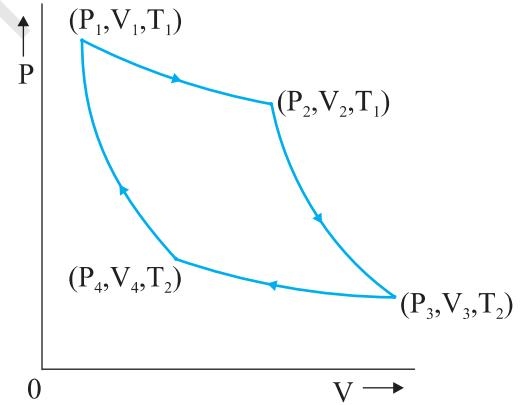

**Fig. 11.9** *Carnot cycle for a heat engine with an ideal gas as the working substance.*

A reversible heat engine operating between two temperatures is called a Carnot engine. We have just argued that such an engine must have the following sequence of steps constituting one cycle, called the Carnot cycle, shown in Fig. 11.9. We have taken the working substance of the Carnot engine to be an ideal gas.

#### (a) *Step* 1 → 2 Isothermal expansion of the gas taking its state from (*P*1 , *V*1 , *T*1 ) to (*P*2 , *V*2 , *T*1 ).

The heat absorbed by the gas (*Q*1 ) from the reservoir at temperature *T*1 is given by Eq. (11.12). This is also the work done (*W*1 → 2) by the gas on the environment.

*W*1 → 2 = *Q*1 = µ *R T*1 ln *V V 2 1* (11.18)

- (b) *Step* 2 → 3 Adiabatic expansion of the gas from (*P*2 , *V*2 , *T*1 ) to (*P*3 , *V*3 , *T*2 ) Work done by the gas, using Eq. (11.16), is
*W R T T 2 3* → = ( ) − − *µ* 1 2 *γ* 1 (11.19)

- (c) *Step* 3 → 4 Isothermal compression of the gas from (*P*3 , *V*3 , *T*2 ) to (*P*4 , *V*4 , *T*2 ).
Heat released (*Q*2 ) by the gas to the reservoir at temperature *T*2 is given by Eq. (11.12). This is also the work done (*W*3 → 4) on the gas by the environment.

$W_{3\to4}=Q_{2}=\mu RT_{2}\ln\left(\frac{V_{3}}{V_{4}}\right)$

- (d) *Step* 4 → 1 Adiabatic compression of the gas from (*P*4 , *V*4 , *T*2 ) to (*P*1 ,*V*1 , *T*1 ).
Work done on the gas, [using Eq.(11.16), is

$W_{4\to1}=\mu R\left(\frac{T_{1}-T_{2}}{\gamma-1}\right)$

From Eqs. (11.18) to (11.21) total work done by the gas in one complete cycle is

$W=W_{1}\to2+W_{2}\to3-W_{3}\to4-W_{4}\to1$  
  
$=\mu\,RT_{1}\,\ln\left(\frac{V_{2}}{V_{1}}\right)-\mu\,RT_{2}\,\,\ln\left(\frac{V_{3}}{V_{4}}\right)$ (11.22)

The efficiency ηof the Carnot engine is

$$\eta=\frac{W}{Q_{1}}=1-\frac{Q_{2}}{Q_{1}}$$

$$=1-\left(\frac{T_{2}}{T_{1}}\right)\frac{\text{In}\left(\frac{V_{3}}{V_{4}}\right)}{\text{In}\left(\frac{V_{2}}{V_{1}}\right)}\tag{11.23}$$

Now since step 2 → 3 is an adiabatic process,

$$T_{1}\;V_{2}^{\;\gamma-1}=T_{2}\;V_{3}^{\;\gamma-1}$$
  
  
i.e. $\frac{V_{2}}{V_{3}}=\left(\frac{T_{2}}{T_{1}}\right)^{1/(\gamma-1)}$ (11.24)

Similarly, since step 4 → 1 is an adiabatic process

$$T_{2}V_{4}^{\gamma-1}=T_{1}V_{1}^{\gamma-1}

\frac{V_{1}}{V_{4}}=\left(\frac{T_{2}}{T_{1}}\right)^{1/\gamma-1}

(11.25)$$

From Eqs. (11.24) and (11.25),

$V_{3}=\frac{V_{2}}{V_{4}}=\frac{V_{2}}{V_{1}}$ (11.26)

Using Eq. (11.26) in Eq. (11.23), we get

$\eta=1-\frac{T_{2}}{T_{1}}$ (Carnot engine) (11.27)

We have already seen that a Carnot engine is a reversible engine. Indeed it is the only reversible engine possible that works between two reservoirs at different temperatures. Each step of the Carnot cycle given in Fig. 11.9 can be reversed. This will amount to taking heat *Q*2 from the cold reservoir at *T*2 , doing work *W* on the system, and transferring heat *Q*1 to the hot reservoir. This will be a reversible refrigerator.

We next establish the important result (sometimes called Carnot's theorem) that (a) working between two given temperatures *T*1 and *T*2 of the hot and cold reservoirs respectively, no engine can have efficiency more than that of the Carnot engine and (b) the efficiency of the Carnot engine is independent of the nature of the working substance.

To prove the result (a), imagine a reversible (Carnot) engine *R* and an irreversible engine *I* working between the same source (hot reservoir) and sink (cold reservoir). Let us couple the engines, *I* and *R*, in such a way so that *I* acts like a heat engine and *R* acts as a refrigerator. Let *I* absorb heat *Q*1 from the source, deliver work *W* ′ and release the heat *Q*1 - *W*′ to the sink. We arrange so that *R* returns the same heat *Q*1 to the source, taking heat *Q*2 from the sink and requiring work *W* = *Q*1 – *Q*2 to be done on it. Now suppose ηR < ηI i.e. if *R* were to act as an engine it would give less work output

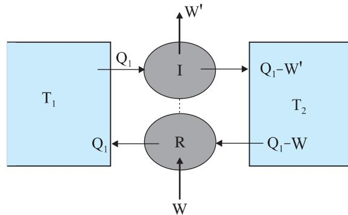

- **Fig. 11.10** *An irreversible engine (I) coupled to a reversible refrigerator (R). If W* ′ *> W, this would amount to extraction of heat W*′ *– W from the sink and its full conversion to work, in contradiction with the Second Law of Thermodynamics.*
than that of *I* i.e. *W* < *W* ′ for a given *Q*1 . With *R* acting like a refrigerator, this would mean *Q*2 = *Q*1 – *W* > *Q*1 – *W* ′. Thus, on the whole, the coupled *I*-*R* system extracts heat (*Q*1 – *W)* – (*Q*1 – *W* ′) = (*W* ′ – *W* ) from the cold reservoir and delivers the same amount of work in one cycle, without any change in the source or anywhere else. This is clearly against the Kelvin-Planck statement of the Second Law of Thermodynamics. Hence the assertion ηI > ηR is wrong. No engine can have efficiency greater than that of the Carnot engine. A similar argument can be constructed to show that a reversible engine with one particular substance cannot be more efficient than the one using another substance. The maximum efficiency of a Carnot engine given by Eq. (11.27) is independent of the nature of the system performing the Carnot cycle of operations. Thus we are justified in using an ideal gas as a system in the calculation of efficiency η of a Carnot engine. The ideal gas has a simple equation of state, which allows us to readily calculate η, but the final result for η, [Eq. (11.27)], is true for any Carnot engine.

This final remark shows that in a Carnot cycle,

$\theta_{1}=\frac{T_{1}}{T_{2}}$ (11.28)

is a universal relation independent of the nature of the system. Here *Q*1 and *Q*2 are respectively, the heat absorbed and released isothermally (from the hot and to the cold reservoirs) in a Carnot engine. Equation (11.28), can, therefore, be used as a relation to define a truly universal thermodynamic temperature scale that is independent of any particular properties of the system used in the Carnot cycle. Of course, for an ideal gas as a working substance, this universal temperature is the same as the ideal gas temperature introduced in section 11.9.

### **SUMMARY**

- 1. The zeroth law of thermodynamics states that '*two systems in thermal equilibrium with a third system separately are in thermal equilibrium with each other*'. The Zeroth Law leads to the concept of temperature.
- 2. Internal energy of a system is the sum of kinetic energies and potential energies of the molecular constituents of the system. It does not include the over-all kinetic energy of the system. Heat and work are two modes of energy transfer to the system. Heat is the energy transfer arising due to temperature difference between the system and the surroundings. Work is energy transfer brought about by other means, such as moving the piston of a cylinder containing the gas, by raising or lowering some weight connected to it.

- 3. The first law of thermodynamics is the general law of conservation of energy applied to any system in which energy transfer from or to the surroundings (through heat and work) is taken into account. It states that

$$\Delta Q\ =\Delta U\ +\ \Delta W$$

where ∆*Q* is the heat supplied to the system, ∆*W* is the work done by the system and ∆*U* is the change in internal energy of the system.

- 4. The specific heat capacity of a substance is defined by

$$\mathbf{s}={\frac{1}{m}}{\frac{\Delta Q}{\Delta T}}$$

where *m* is the mass of the substance and ∆*Q* is the heat required to change its temperature by ∆*T*. The molar specific heat capacity of a substance is defined by

$$C={\frac{1}{\mu}}{\frac{\Delta Q}{\Delta T}}$$

where µ is the number of moles of the substance. For a solid, the law of equipartition of energy gives

*C* = 3 *R*

which generally agrees with experiment at ordinary temperatures.

Calorie is the old unit of heat. 1 calorie is the amount of heat required to raise the temperature of 1 g of water from 14.5 °C to 15.5 °C. 1 cal = 4.186 J.

- 5. For an ideal gas, the molar specific heat capacities at constant pressure and volume satisfy the relation

$$C_{p}-C_{v}=R$$

where *R* is the universal gas constant.

- 6. Equilibrium states of a thermodynamic system are described by state variables. The value of a state variable depends only on the particular state, not on the path used to arrive at that state. Examples of state variables are pressure (*P* ), volume (*V* ), temperature (*T* ), and mass (*m* ). Heat and work are not state variables. An Equation of State (like the ideal gas equation *PV* = µ *RT* ) is a relation connecting different state variables.
- 7. A quasi-static process is an infinitely slow process such that the system remains in thermal and mechanical equilibrium with the surroundings throughout. In a quasi-static process, the pressure and temperature of the environment can differ from those of the system only infinitesimally.
- 8. In an isothermal expansion of an ideal gas from volume *V*1 to *V*2 at temperature *T* the heat absorbed (*Q*) equals the work done (*W* ) by the gas, each given by

$$\begin{array}{l l l l}{{Q}}&{{=}}&{{W=}}&{{\mu\;R\;T\;\;\ln\;\left(\frac{V_{2}}{V_{1}}\right)}}\end{array}$$

- 9. In an adiabatic process of an ideal gas
*PV* γ = constant

where

Work done by an ideal gas in an adiabatic change of state from $\{P_1,\ V_1,\ T_1\}$ to $\{P_2,\ V_2,\ T_2\}$ is _____________.  

*p v C C* γ=

$$W={\frac{\mu\,R\left(T_{1}-T_{2}\right)}{\gamma-1}}$$

- 10. The second law of thermodynamics disallows some processes consistent with the First Law of Thermodynamics. It states
### *Kelvin-Planck statement*

No process is possible whose sole result is the absorption of heat from a reservoir and complete conversion of the heat into work.

### *Clausius statement*

No process is possible whose sole result is the transfer of heat from a colder object to a hotter object.

Put simply, the Second Law implies that no heat engine can have efficiency η equal to 1 or no refrigerator can have co-efficient of performance α equal to infinity.

- 11. A process is reversible if it can be reversed such that both the system and the surroundings return to their original states, with no other change anywhere else in the universe. Spontaneous processes of nature are irreversible. The idealised reversible process is a quasi-static process with no dissipative factors such as friction, viscosity, etc.
- 12. Carnot engine is a reversible engine operating between two temperatures *T*1 (source) and *T*2 (sink). The Carnot cycle consists of two isothermal processes connected by two adiabatic processes. The efficiency of a Carnot engine is given by

$$\eta=1-{\frac{T_{2}}{T_{1}}}\qquad\qquad\qquad{\mathrm{(Carnot~engine)}}$$

No engine operating between two temperatures can have efficiency greater than that of the Carnot engine.

- 13. If Q > 0, heat is added to the system
	- If Q < 0, heat is removed to the system
	- If W > 0, Work is done by the system
	- If W < 0, Work is done on the system

| Quantity | Symbol | Dimensions | Unit | Remark |
| --- | --- | --- | --- | --- |
| Co-efficienty of volume expansion | α v | [K–1] | K–1 | αv = 3 α1 |
| Heat supplied to a system | ∆Q | [ML2 T –2] | J | Q is not a state variable |
| Specific heat capacity | s | [L2 T –2 K–1] | J kg–1 K–1 |  |
| Thermal Conductivity | K | [MLT–3 K–1] | J s–1 K–1 | d t H = – KA d x |

# **POINTS TO PONDER**

- 1. Temperature of a body is related to its average internal energy, not to the kinetic energy of motion of its centre of mass. A bullet fired from a gun is not at a higher temperature because of its high speed.
- 2. Equilibrium in thermodynamics refers to the situation when macroscopic variables describing the thermodynamic state of a system do not depend on time. Equilibrium of a system in mechanics means the net external force and torque on the system are zero.
- 3. In a state of thermodynamic equilibrium, the microscopic constituents of a system are not in equilibrium (in the sense of mechanics).
- 4. Heat capacity, in general, depends on the process the system goes through when heat is supplied.
- 5. In isothermal quasi-static processes, heat is absorbed or given out by the system even though at every stage the gas has the same temperature as that of the surrounding reservoir. This is possible because of the infinitesimal difference in temperature between the system and the reservoir.

### **EXERCISES**

- **11.1** A geyser heats water flowing at the rate of 3.0 litres per minute from 27 °C to 77 °C. If the geyser operates on a gas burner, what is the rate of consumption of the fuel if its heat of combustion is 4.0 × 104 J/g ?
- **11.2** What amount of heat must be supplied to 2.0 × 10–2 kg of nitrogen (at room temperature) to raise its temperature by 45 °C at constant pressure ? (Molecular mass of N2 = 28; *R* = 8.3 J mol–1 K–1.)
- **11.3** Explain why
	- (a) Two bodies at different temperatures *T*1 and *T*2 if brought in thermal contact do not necessarily settle to the mean temperature (*T*1 + *T*2 )/2.
	- (b) The coolant in a chemical or a nuclear plant (i.e., the liquid used to prevent the different parts of a plant from getting too hot) should have high specific heat.
	- (c) Air pressure in a car tyre increases during driving.
	- (d) The climate of a harbour town is more temperate than that of a town in a desert at the same latitude.
- **11.4** A cylinder with a movable piston contains 3 moles of hydrogen at standard temperature and pressure. The walls of the cylinder are made of a heat insulator, and the piston is insulated by having a pile of sand on it. By what factor does the pressure of the gas increase if the gas is compressed to half its original volume ?
- **11.5** In changing the state of a gas adiabatically from an equilibrium state *A* to another equilibrium state *B*, an amount of work equal to 22.3 J is done on the system. If the gas is taken from state *A* to *B* via a process in which the net heat absorbed by the system is 9.35 cal, how much is the net work done by the system in the latter case ? (Take 1 cal = 4.19 J)
- **11.6** Two cylinders *A* and *B* of equal capacity are connected to each other via a stopcock. *A* contains a gas at standard temperature and pressure. *B* is completely evacuated. The entire system is thermally insulated. The stopcock is suddenly opened. Answer the following :
	- (a) What is the final pressure of the gas in *A* and *B* ?
	- (b) What is the change in internal energy of the gas ?
	- (c) What is the change in the temperature of the gas ?
	- (d) Do the intermediate states of the system (before settling to the final equilibrium state) lie on its *P-V-T* surface ?
- **11.7** An electric heater supplies heat to a system at a rate of 100W. If system performs work at a rate of 75 joules per second. At what rate is the internal energy increasing?

- **11.8** A thermodynamic system is taken from an original state to an intermediate state by the linear process shown in Fig. (11.13)
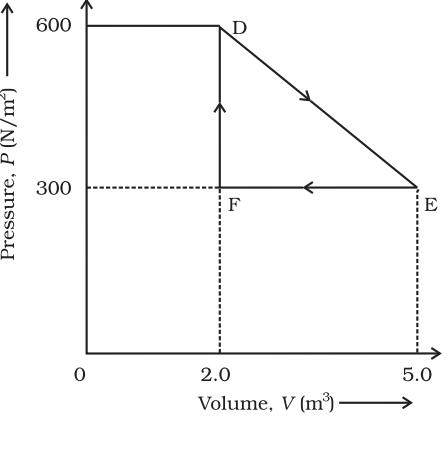

#### **Fig. 11.11**

Its volume is then reduced to the original value from E to F by an isobaric process. Calculate the total work done by the gas from D to E to F

