# **CHAPTER FOURTEEN**

# **WAVES**

# **14.1 INTRODUCTION**

| 14.1 | Introduction |
| --- | --- |
| 14.2 | Transverse and |
|  | longitudinal waves |
| 14.3 | Displacement relation in a |
|  | progressive wave |
| 14.4 | The speed of a travelling |
|  | wave |
| 14.5 | The principle of |
|  | superposition of waves |
| 14.6 | Reflection of waves |
| 14.7 | Beats |
|  | Summary |
|  | Points to ponder |
|  | Exercises |

In the previous Chapter, we studied the motion of objects oscillating in isolation. What happens in a system, which is a collection of such objects? A material medium provides such an example. Here, elastic forces bind the constituents to each other and, therefore, the motion of one affects that of the other. If you drop a little pebble in a pond of still water, the water surface gets disturbed. The disturbance does not remain confined to one place, but propagates outward along a circle. If you continue dropping pebbles in the pond, you see circles rapidly moving outward from the point where the water surface is disturbed. It gives a feeling as if the water is moving outward from the point of disturbance. If you put some cork pieces on the disturbed surface, it is seen that the cork pieces move up and down but do not move away from the centre of disturbance. This shows that the water mass does not flow outward with the circles, but rather a moving disturbance is created. Similarly, when we speak, the sound moves outward from us, without any flow of air from one part of the medium to another. The disturbances produced in air are much less obvious and only our ears or a microphone can detect them. These patterns, which move without the actual physical transfer or flow of matter as a whole, are called **waves***.* In this Chapter, we will study such waves.

Waves transport energy and the pattern of disturbance has information that propagate from one point to another. All our communications essentially depend on transmission of signals through waves. Speech means production of sound waves in air and hearing amounts to their detection. Often, communication involves different kinds of waves. For example, sound waves may be first converted into an electric current signal which in turn may generate an electromagnetic wave that may be transmitted by an optical cable or via a satellite. Detection of the original signal will usually involve these steps in reverse order.

Not all waves require a medium for their propagation. We know that light waves can travel through vacuum. The light emitted by stars, which are hundreds of light years away, reaches us through inter-stellar space, which is practically a vacuum.

The most familiar type of waves such as waves on a string, water waves, sound waves, seismic waves, etc. is the so-called mechanical waves. These waves require a medium for propagation, they cannot propagate through vacuum. They involve oscillations of constituent particles and depend on the elastic properties of the medium. The electromagnetic waves that you will learn in Class XII are a different type of wave. Electromagnetic waves do not necessarily require a medium - they can travel through vacuum. Light, radiowaves, X-rays, are all electromagnetic waves. In vacuum, all electromagnetic waves have the same speed c, whose value is :

$c=299$, 792, 458 ms${}^{-1}$.  
  

A third kind of wave is the so-called Matter waves. They are associated with constituents of matter : electrons, protons, neutrons, atoms and molecules. They arise in quantum mechanical description of nature that you will learn in your later studies. Though conceptually more abstract than mechanical or electro-magnetic waves, they have already found applications in several devices basic to modern technology; matter waves associated with electrons are employed in electron microscopes.

In this chapter we will study mechanical waves, which require a material medium for their propagation.

The aesthetic influence of waves on art and literature is seen from very early times; yet the first scientific analysis of wave motion dates back to the seventeenth century. Some of the famous scientists associated with the physics of wave motion are Christiaan Huygens (1629-1695), Robert Hooke and Isaac Newton. The understanding of physics of waves followed the physics of oscillations of masses tied to springs and physics of the simple pendulum. Waves in elastic media are intimately connected with harmonic oscillations. (Stretched strings, coiled springs, air, etc., are examples of elastic media). We shall illustrate this connection through simple examples.

Consider a collection of springs connected to one another as shown in Fig. 14.1. If the spring at one end is pulled suddenly and released, the disturbance travels to the other end. What has

happened? The first spring is disturbed from its equilibrium length. Since the second spring is connected to the first, it is also stretched or compressed, and so on. The disturbance moves from one end to the other; but each spring only executes small oscillations about its equilibrium position. As a practical example of this situation, consider a stationary train at a railway station. Different bogies of the train are coupled to each other through a spring coupling. When an engine is attached at one end, it gives a push to the bogie next to it; this push is transmitted from one bogie to another without the entire train being bodily displaced.

Now let us consider the propagation of sound waves in air. As the wave passes through air, it compresses or expands a small region of air. This causes a change in the density of that region, say δρ, this change induces a change in pressure, δ*p*, in that region. Pressure is force per unit area, so there is a **restoring force proportional** to the disturbance, just like in a spring. In this case, the quantity similar to extension or compression of the spring is the change in density. If a region is compressed, the molecules in that region are packed together, and they tend to move out to the adjoining region, thereby increasing the density or creating compression in the adjoining region. Consequently, the air in the first region undergoes rarefaction. If a region is comparatively rarefied the surrounding air will rush in making the rarefaction move to the adjoining region. Thus, the compression or rarefaction moves from one region to another, making the propagation of a disturbance possible in air.

In solids, similar arguments can be made. In a crystalline solid, atoms or group of atoms are arranged in a periodic lattice. In these, each atom or group of atoms is in equilibrium, due to forces from the surrounding atoms. Displacing one atom, keeping the others fixed, leads to restoring forces, exactly as in a spring. So we can think of atoms in a lattice as end points, with springs between pairs of them.

In the subsequent sections of this chapter we are going to discuss various characteristic properties of waves.

# **14.2 TRANSVERSE AND LONGITUDINAL WAVES**

We have seen that motion of mechanical waves involves oscillations of constituents of the medium. If the constituents of the medium oscillate perpendicular to the direction of wave propagation, we call the wave a transverse wave. If they oscillate along the direction of wave propagation, we call the wave a longitudinal wave.

Fig.14.2 shows the propagation of a single pulse along a string, resulting from a single up and down jerk. If the string is very long compared

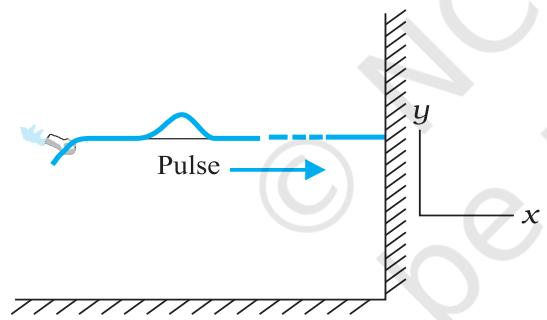

**Fig. 14.2** *When a pulse travels along the length of a stretched string (x-direction), the elements of the string oscillate up and down (ydirection)*

to the size of the pulse, the pulse will damp out before it reaches the other end and reflection from that end may be ignored. Fig. 14.3 shows a similar situation, but this time the external agent gives a continuous periodic sinusoidal up and down jerk to one end of the string. The resulting disturbance on the string is then a sinusoidal wave. In either case the elements of the string oscillate about their equilibrium mean

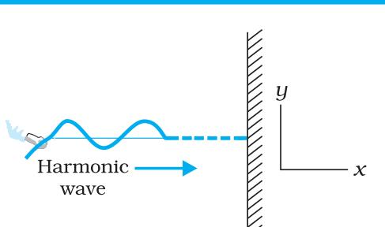

*direction of wave propagation.*

position as the pulse or wave passes through them. The oscillations are normal to the direction of wave motion along the string, so this is an example of transverse wave.

We can look at a wave in two ways. We can fix an instant of time and picture the wave in space. This will give us the shape of the wave as a whole in space at a given instant. Another way is to fix a location i.e. fix our attention on a particular element of string and see its oscillatory motion in time.

Fig. 14.4 describes the situation for longitudinal waves in the most familiar example of the propagation of sound waves. A long pipe filled with air has a piston at one end. A single sudden push forward and pull back of the piston will generate a pulse of condensations (higher density) and rarefactions (lower density) in the medium (air). If the push-pull of the piston is continuous and periodic (sinusoidal), a

**Fig. 14.4** *Longitudinal waves (sound) generated in a pipe filled with air by moving the piston up and down. A volume element of air oscillates in the direction parallel to the direction of wave propagation.*

sinusoidal wave will be generated propagating in air along the length of the pipe. This is clearly an example of longitudinal waves.

The waves considered above, transverse or longitudinal, are travelling or progressive waves since they travel from one part of the medium to another. The material medium as a whole does not move, as already noted. A stream, for example, constitutes motion of water as a whole. In a water wave, it is the disturbance that moves, not water as a whole. Likewise a wind (motion of air as a whole) should not be confused with a sound wave which is a propagation of disturbance (in pressure density) in air, without the motion of air medium as a whole.

In transverse waves, the particle motion is normal to the direction of propagation of the wave. Therefore, as the wave propagates, each element of the medium undergoes a shearing strain. Transverse waves can, therefore, be propagated only in those media, which can sustain shearing stress, such as solids and not in fluids. Fluids, as well as, solids can sustain compressive strain; therefore, longitudinal waves can be propagated in all elastic media. For example, in medium like steel, both transverse and longitudinal waves can propagate, while air can sustain only longitudinal waves. The waves on the surface of water are of two kinds: **capillary waves** and **gravity waves**. The former are ripples of fairly short wavelength—not more than a few centimetre—and the restoring force that produces them is the surface tension of water. Gravity waves have wavelengths typically ranging from several metres to several hundred meters. The restoring force that produces these waves is the pull of gravity, which tends to keep the water surface at its lowest level. The oscillations of the particles in these waves are not confined to the surface only, but extend with diminishing amplitude to the very bottom. The particle motion in water waves involves a complicated motion—they not only move up and down but also back and forth. The waves in an ocean are the combination of both longitudinal and transverse waves.

It is found that, generally, transverse and longitudinal waves travel with different speed in the same medium.

**Example 14.1** Given below are some examples of wave motion. State in each case if the wave motion is transverse, longitudinal or a combination of both:

- (a) Motion of a kink in a longitudinal spring produced by displacing one end of the spring sideways.
- (b) Waves produced in a cylinder containing a liquid by moving its piston back and forth.
- (c) Waves produced by a motorboat sailing in water.
- (d) Ultrasonic waves in air produced by a vibrating quartz crystal.

#### **Answer**

u

- (a) Transverse and longitudinal
- (b) Longitudinal
- (c) Transverse and longitudinal
- (d) Longitudinal ⊳

# **14.3 DISPLACEMENT RELATION IN A PROGRESSIVE WAVE**

For mathematical description of a travelling wave, we need a function of both position *x* and time *t*. Such a function at every instant should give the shape of the wave at that instant. Also, at every given location, it should describe the motion of the constituent of the medium at that location. If we wish to describe a sinusoidal travelling wave (such as the one shown in Fig. 14.3) the corresponding function must also be sinusoidal. For convenience, we shall take the wave to be transverse so that if the position of the constituents of the medium is denoted by *x*, the displacement from the equilibrium position may be denoted by *y*. A sinusoidal travelling wave is then described by:

$y(x,t)=a\sin(kx-\omega t+\phi)$ (14.2)

The term φ in the argument of sine function means equivalently that we are considering a linear combination of sine and cosine functions:

*y x t A kx t B kx t* ( , ) sin( ) cos( ) = − + − ω ω (14.3) From Equations (14.2) and (14.3),

$${\dot{\mathbf{\nabla}}}\mathbf{\dot{\nabla}}\mathbf{a}={\sqrt{A^{2}+B^{2}}}\ {\mathrm{~and~}}\ {\dot{\mathbf{\nabla}}}\mathbf{\dot{\phi}}=\tan^{-1}\left({\frac{\mathbf{B}}{\mathbf{A}}}\right)$$

To understand why Equation (14.2) represents a sinusoidal travelling wave, take a fixed instant, say *t* = *t* 0 . Then, the argument of the sine function in Equation (14.2) is simply *kx* + constant. Thus, the shape of the wave (at any fixed instant) as a function of *x* is a sine wave. Similarly, take a fixed location, say *x* = *x*0 . Then, the argument of the sine function in Equation (14.2) is constant -ω*t*. The displacement *y*, at a fixed location, thus, varies sinusoidally with time. That is, the constituents of the medium at different positions execute simple harmonic motion. Finally, as *t* increases, *x* must increase in the positive direction to keep *kx* – ω*t* + φ constant. Thus, Eq. (14.2) represents a sinusiodal (harmonic) wave travelling along the positive direction of the *x*-axis. On the other hand, a function

$y(x,t)=a\sin(kx+\omega t+\phi)$ (14.4)

represents a wave travelling in the negative direction of *x*-axis. Fig. (14.5) gives the names of the various physical quantities appearing in Eq. (14.2) that we now interpret.

| y(x,t) |  | : | displacement as a function of |
| --- | --- | --- | --- |
|  |  |  | position x and time t |
| a |  | : | amplitude of a wave |
| ω |  | : | angular frequency of the wave |
| k |  | : | angular wave number |
| kx– ω | t+ φ | : | initial phase angle (a+x = 0, t = 0) |

**Fig. 14.5** *The meaning of standard symbols in Eq. (14.2)*

 Fig. 14.6 shows the plots of Eq. (14.2) for different values of time differing by equal intervals of time. In a wave, the crest is the point of maximum positive displacement, the trough is the point of maximum negative displacement. To see how a wave travels, we can fix attention on a crest and see how it progresses with time. In the figure, this is shown by a cross (×) on the crest. In the same manner, we can see the motion of a particular constituent of the medium at a fixed location, say at the origin of the *x*-axis. This is shown by a solid dot (•). The plots of Fig. 14.6 show that with time, the solid dot (•) at the origin moves periodically, i.e., the particle at the origin oscillates about its mean position as the wave progresses. This is true for any other location also. We also see that during the time the solid dot (•) has completed one full oscillation, the crest has moved further by a certain distance.

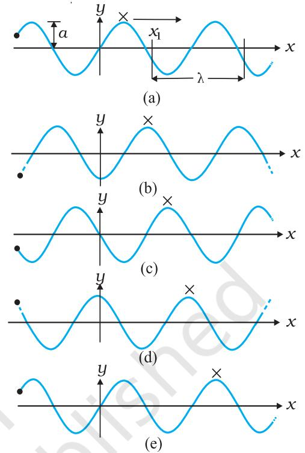

**Fig. 14.6** *A harmonic wave progressing along the positive direction of x-axis at different times.*

Using the plots of Fig. 14.6, we now define the various quantities of Eq. (14.2).

#### **14.3.1 Amplitude and Phase**

In Eq. (14.2), since the sine function varies between 1 and –1, the displacement *y* (*x,t*) varies between *a* and –*a*. We can take *a* to be a positive constant, without any loss of generality. Then, *a* represents the maximum displacement of the constituents of the medium from their equilibrium position. Note that the displacement *y* may be positive or negative, but *a* is positive. It is called the **amplitude** of the wave.

The quantity (*kx* – ω*t* + φ) appearing as the argument of the sine function in Eq. (14.2) is called the phase of the wave. Given the amplitude *a*, the phase determines the displacement of the wave at any position and at any instant. Clearly φ is the phase at *x* = 0 and *t* = 0. Hence, φ is called the initial phase angle. By suitable choice of origin on the *x*-axis and the intial time, it is possible to have φ = 0. Thus there is no loss of generality in dropping φ, i.e., in taking Eq. (14.2) with φ= 0.

#### **14.3.2 Wavelength and Angular Wave Number**

The minimum distance between two points having the same phase is called the wavelength of the wave, usually denoted by λ. For simplicity, we can choose points of the same phase to be crests or troughs. The wavelength is then the distance between two consecutive crests or troughs in a wave. Taking φ = 0 in Eq. (14.2), the displacement at *t* = 0 is given by

$y(x,0)=a\sin kx$ (14.5)

Since the sine function repeats its value after every 2π change in angle,

$$\sin k x=\sin(k x+2n\pi)=\sin k{\bigg(}x+{\frac{2n\pi}{k}}{\bigg)}$$

That is the displacements at points *x* and at

$$x+{\frac{2n\pi}{k}}$$

are the same, where *n*=1,2,3,... The 1east distance between points with the same displacement (at any given instant of time) is obtained by taking *n* = 1. λ is then given by

$\lambda=\frac{2\pi}{\kappa}$ or $\kappa=\frac{2\pi}{\lambda}$ (14.6)

*k* is the angular wave number or propagation constant; its SI unit is radian per metre or

1 *rad m*− ***

# **14.3.3 Period, Angular Frequency and Frequency**

Fig. 14.7 shows again a sinusoidal plot. It describes not the shape of the wave at a certain instant but the displacement of an element (at any fixed location) of the medium as a function of time. We may for, simplicity, take Eq. (14.2) with φ = 0 and monitor the motion of the element say at *x* = 0 . We then get

$$y(0,t)=a\sin(-a t)$$
 
$$\cdot=-a\sin a t$$

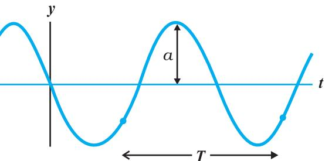

Now, the period of oscillation of the wave is the time it takes for an element to complete one full oscillation. That is

$$\begin{array}{c}{{-a\sin\omega t=-a\sin\omega(t+\mathrm{T})}}\\ {{\stackrel{ ̇}{=}-a\sin(\omega t+\omega\mathrm{T})}}\end{array}$$

Since sine function repeats after every 2π,

$\omega$T = 2$\pi$ or $\omega$ = 2$\pi$ (14.7)

ω is called the angular frequency of the wave. Its SI unit is rad *s* –1. The frequency ν is the number of oscillations per second. Therefore,

$\nu=\frac{1}{2\pi}$ (14.8)

ν is usually measured in hertz.

In the discussion above, reference has always been made to a wave travelling along a string or a transverse wave. In a longitudinal wave, the displacement of an element of the medium is parallel to the direction of propagation of the wave. In Eq. (14.2), the displacement function for a longitudinal wave is written as,

$s(x,\,t)=a\sin\left(kx-\omega\,t+\phi\right)$ (14.9)

where *s*(*x, t*) is the displacement of an element of the medium in the direction of propagation of the wave at position *x* and time *t.* In Eq. (14.9), *a* is the displacement amplitude; other quantities have the same meaning as in case of a transverse wave except that the displacement function *y* (*x, t*) is to be replaced by the function *s* (*x, t*)*.*

* <i>Here again, 'radian' could be dropped and the units could be written merely as m*–1. Thus, k represents 2*π *times the number of waves (or the total phase difference) that can be accommodated per unit length, with SI units m–1 .*

u **Example 14.2** A wave travelling along a string is described by,

*y(x, t)* = 0.005 sin (80.0 *x* – 3.0 *t)*,

in which the numerical constants are in SI units (0.005 m, 80.0 rad m–1, and 3.0 rad s–1). Calculate (a) the amplitude, (b) the wavelength, and (c) the period and frequency of the wave. Also, calculate the displacement *y* of the wave at a distance *x =* 30.0 cm and time *t =* 20 s ?

**Answer** On comparing this displacement equation with Eq. (14.2),

$$y\left(x,\,t\right)=a\,\sin\,\left(k x-\omega t\right),$$

we find

- (a) the amplitude of the wave is 0.005 m = 5 mm.
- (b) the angular wave number *k* and angular frequency ωare

*k =* 80.0 m–1 and ω *=* 3.0 s–1

We, then, relate the wavelength λ to *k* through Eq*.* (14.6),

$$\lambda=2\pi/k$$
 
$$\cdot$$
 
$$={\frac{2\pi}{80.0\mathrm{~m}^{-1}}}$$

$=\;7.85\text{cm}$  
  
. 

- (c) Now, we relate *T* to ωby the relation

$$T=2\pi/\omega$$
 
$$\cdot$$
 
$$=\frac{2\pi}{3.0\mathrm{~s}^{-1}}$$

= 2.09 s

and frequency, *v =* 1*/T =* 0.48 Hz

The displacement *y* at *x =* 30.0 cm and time *t =* 20 s is given by

- *y =* (0.005 m) sin (80.0 × 0.3 3.0 × 20)
- = (0.005 m) sin (–36 + 12π)
	- = (0.005 m) sin (1.699)
- = (0.005 m) sin (970 ) j 5 mm ⊳

#### **14.4 THE SPEED OF A TRAVELLING WAVE**

To determine the speed of propagation of a travelling wave, we can fix our attention on any particular point on the wave (characterised by some value of the phase) and see how that point moves in time. It is convenient to look at the motion of the crest of the wave. Fig. 14.8 gives the shape of the wave at two instants of time, which differ by a small time internal ∆*t*. The entire wave pattern is seen to shift to the right (positive direction of *x*-axis) by a distance ∆*x*. In particular, the crest shown by a dot (• ) moves a

- **Fig. 14.8** *Progression of a harmonic wave from time t to t +* ∆*t. where* ∆*t is a small interval. The wave pattern as a whole shifts to the right. The crest of the wave (or a point with any fixed phase) moves right by the distance* ∆*x in time* ∆*t.*
distance ∆*x* in time ∆*t*. The speed of the wave is then ∆*x/*∆*t*. We can put the dot (• ) on a point with any other phase. It will move with the same speed *v* (otherwise the wave pattern will not remain fixed). The motion of a fixed phase point on the wave is given by

$kx-\omega t=$ constant (14.10)

Thus, as time *t* changes, the position *x* of the fixed phase point must change so that the phase remains constant. Thus,

> *kx –* ω*t* = *k*(*x*+∆*x*) – ω(*t*+∆*t*)

or *k* ∆*x* – ω ∆*t* =0

Taking ∆*x,* ∆*t* vanishingly small, this gives

$dx=\frac{\omega}{k}=v$ (14.11)

Relating ω to *T* and *k* to λ, we get

$\upsilon$=$\frac{2\pi\nu}{2\pi/\lambda}$=$\lambda\nu$=$\frac{\lambda}{T}$ (14.12)

Eq. (14.12), a general relation for all progressive waves, shows that in the time required for one full oscillation by any constituent of the medium, the wave pattern travels a distance equal to the wavelength of the wave. It should be noted that the speed of a mechanical wave is determined by the inertial (linear mass density for strings, mass density in general) and elastic properties (Young's modulus for linear media/ shear modulus, bulk modulus) of the medium. The medium determines the speed; Eq. (14.12) then relates wavelength to frequency for the given speed. Of course, as remarked earlier, the medium can support both transverse and longitudinal waves, which will have different speeds in the same medium. Later in this chapter, we shall obtain specific expressions for the speed of mechanical waves in some media.

# **14.4.1 Speed of a Transverse Wave on Stretched String**

The speed of a mechanical wave is determined by the restoring force setup in the medium when it is disturbed and the inertial properties (mass density) of the medium. The speed is expected to be directly related to the former and inversely to the latter. For waves on a string, the restoring force is provided by the tension *T* in the string. The inertial property will in this case be linear mass density µ, which is mass *m* of the string divided by its length *L*. Using Newton's Laws of Motion, an exact formula for the wave speed on a string can be derived, but this derivation is outside the scope of this book. We shall, therefore, use dimensional analysis. We already know that dimensional analysis alone can never yield the exact formula. The overall dimensionless constant is always left undetermined by dimensional analysis.

The dimension of µ is [*ML*–1] and that of *T* is like force, namely [*MLT* –2]. We need to combine these dimensions to get the dimension of speed *v* [*LT*–1]. Simple inspection shows that the quantity T/µ has the relevant dimension

$${\frac{\left[M L T^{-2}\right]}{\left[M L\right]}}=\left[L^{2}T^{-2}\right]$$

Thus if *T* and µ are assumed to be the only relevant physical quantities,

$V=C\sqrt{\frac{T}{\mu}}$ (14.13)

where *C* is the undetermined constant of dimensional analysis. In the exact formula, it turms out, C=1. The speed of transverse waves on a stretched string is given by

$V=\sqrt{\frac{T}{\mu}}$ (14.14)

Note the important point that the speed *v* depends only on the properties of the medium *T* and µ(*T* is a property of the stretched string arising due to an external force). It does not depend on wavelength or frequency of the wave itself. In higher studies, you will come across waves whose speed is not independent of frequency of the wave. Of the two parameters λand ν the source of disturbance determines the frequency of the wave generated. Given the speed of the wave in the medium and the frequency Eq. (14.12) then fixes the wavelength

$\lambda=\frac{\upsilon}{\nu}$ (14.15)

u **Example 14.3** A steel wire 0.72 m long has a mass of 5.0 ×10–3 kg. If the wire is under a tension of 60 N, what is the speed of transverse waves on the wire ?

**Answer**Mass per unit length of the wire,

$$\mu={\frac{5.0\times10^{-3}\ \mathrm{kg}}{0.72\,\mathrm{m}}}$$
  

$$=6.9\times10^{-3}\ \mathrm{kg\ m^{-1}}$$

Tension, *T* = 60 N The speed of wave on the wire is given by

$\nu=\sqrt{\mu}=\sqrt{6.9\times10^{-3}\rm kg\,m^{-1}}=93\,\rm m\,s^{-1}$

# **14.4.2 Speed of a Longitudinal Wave (Speed of Sound)**

In a longitudinal wave, the constituents of the medium oscillate forward and backward in the direction of propagation of the wave. We have already seen that the sound waves travel in the form of compressions and rarefactions of small volume elements of air. The elastic property that determines the stress under compressional strain is the bulk modulus of the medium defined by (see Chapter 8)

$B=-\frac{\Delta P}{\Delta V/V}$ (14.16)

Here, the change in pressure ∆*P* produces a volumetric strain *V V* ∆ . *B* has the same dimension as pressure and given in SI units in terms of pascal *(Pa)*. The inertial property relevant for the propagation of wave is the mass density ρ, with dimensions [ML–3]. Simple inspection reveals that quantity *B*/ρ has the relevant dimension:

$$\frac{\left[M L^{-2}T^{-2}\right]}{\left[M L^{-3}\right]}=\left[L^{2}T^{-2}\right]\tag{14.17}$$

Thus, if *B* and ρ are considered to be the only relevant physical quantities,

$V=C\sqrt{\frac{B}{\rho}}$ (14.18)

where, as before, *C* is the undetermined constant from dimensional analysis. The exact derivation shows that *C*=1. Thus, the general formula for longitudinal waves in a medium is:

$V=\sqrt{B}$ (14.19)

For a linear medium, like a solid bar, the lateral expansion of the bar is negligible and we may consider it to be only under longitudinal strain. In that case, the relevant modulus of elasticity is Young's modulus, which has the same dimension as the Bulk modulus. Dimensional analysis for this case is the same as before and yields a relation like Eq. (14.18), with an undetermined *C*, which the exact derivation shows to be unity. Thus, the speed of longitudinal waves in a solid bar is given by

$V=\sqrt{\frac{Y}{\rho}}$ (14.20)

where Y is the Young's modulus of the material of the bar. Table 14.1 gives the speed of sound in some media.

| Table 14.1 Speed of Sound in some Media |
| --- |

| Medium | Speed (m s") |
| --- | --- |
| Gases |  |
| Air (0 °C) | 331 |
| Air (20°C) | 343 |
| Helium | 965 |
| Hydrogen | 1284 |
| Liquids |  |
| Water (0 °C) | 1402 |
| Water (20 °C) | 1482 |
| Seawater | 1522 |
| Solids |  |
| Aluminium | 6420 |
| Copper | 3560 |
| Steel | 5941 |
| Granite | 6000 |
| Vulcanised |  |
| Rubber | 54 |

 Liquids and solids generally have higher speed of sound than gases. [Note for solids, the speed being referred to is the speed of longitudinal waves in the solid]. This happens because they are much more difficult to compress than gases and so have much higher values of bulk modulus. Now, see Eq. (14.19). Solids and liquids have higher mass densities *(* ρ *)* than gases. But the corresponding increase in both the modulus *(B)* of solids and liquids is much higher. This is the reason why the sound waves travel faster in solids and liquids.

We can estimate the speed of sound in a gas in the ideal gas approximation. For an ideal gas, the pressure *P*, volume *V* and temperature T are related by (see Chapter 10).

$\mathrm{PV}=\mathit{Nk}_{B}T$ (14.21)

where *N* is the number of molecules in volume *V*, *kB* is the Boltzmann constant and *T* the temperature of the gas (in Kelvin). Therefore, for an isothermal change it follows from Eq.(14.21) that

$$V\Delta P+P\Delta V=0$$

* [16] A. A. K.  
  

Hence, substituting in Eq. (14.16), we have *B* = *P*

Therefore, from Eq. (14.19) the speed of a longitudinal wave in an ideal gas is given by,

$V=\sqrt{P}$ (14.22)

This relation was first given by Newton and is known as Newton's formula.

**Answer** We know that 1 mole of any gas occupies 22.4 litres at STP. Therefore, density of air at STP is:

- ρ *o* = (mass of one mole of air)/ (volume of one mole of air at STP)
3 3 3 29.0 10 kg 22.4 10 m − − × = × = 1.29 kg m*–*3

According to Newton's formula for the speed of sound in a medium, we get for the speed of sound in air at STP,

$\upsilon=\left[\frac{1.01\times10^{5}\;\mathrm{N}\;\mathrm{m}^{-2}}{1.29\;\mathrm{kg}\;\mathrm{m}^{-3}}\right]^{1/2}=280\;\mathrm{m}\;\mathrm{s}^{-1}$ (14.23)

The result shown in Eq.(14.23) is about 15% smaller as compared to the experimental value of 331 m s–1 as given in Table 14.1. Where did we go wrong ? If we examine the basic assumption made by Newton that the pressure variations in a medium during propagation of sound are isothermal, we find that this is not correct. It was pointed out by Laplace that the pressure variations in the propagation of sound waves are so fast that there is little time for the heat flow to maintain constant temperature. These variations, therefore, are adiabatic and not isothermal. For adiabatic processes the ideal gas satisfies the relation (see Section 11.8),

*PV* γ = constant

$$\begin{array}{l l}{{\mathrm{i.e.}}}&{{\Delta(P V^{\gamma})\ =0}}\\ {{\mathrm{or}}}&{{\qquad P\gamma\ V^{\gamma\ -l}\ \Delta V+\ V}}\end{array}$$

where γ is the ratio of two specific heats, Cp /Cv .

γ ∆*P* = 0

Thus, for an ideal gas the adiabatic bulk modulus is given by,

$$\begin{array}{r l}{B_{_{a d}}={}-{\frac{\Delta P}{\Delta V/V}}}\\ {={}\ \gamma P}\end{array}$$

 The speed of sound is, therefore, from Eq. (14.19), given by,

$\nu=\sqrt{\nu}$\(\nu=\sqrt{\nu}  
  

This modification of Newton's formula is referred to as the **Laplace correction**. For air γ = 7/5. Now using Eq. (14.24) to estimate the speed of sound in air at STP, we get a value 331.3 m s–1 , which agrees with the measured speed.

# **14.5 THE PRINCIPLE OF SUPERPOSITION OF WAVES**

What happens when two wave pulses travelling in opposite directions cross each other (Fig. 14.9)? It turns out that wave pulses continue to retain their identities after they have crossed. However, during the time they overlap, the wave pattern is different from either of the

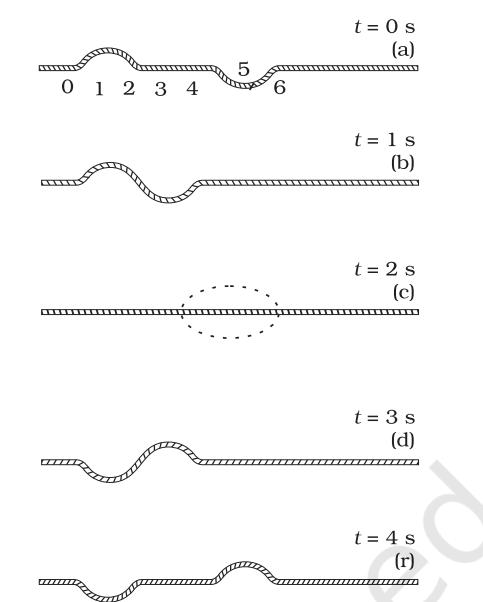

pulses. Figure 14.9 shows the situation when two pulses of equal and opposite shapes move towards each other. When the pulses overlap, the resultant displacement is the algebraic sum of the displacement due to each pulse. This is known as the principle of superposition of waves. According to this principle, each pulse moves as if others are not present. The constituents of the medium, therefore, suffer displacments due to both and since the displacements can be positive and negative, the net displacement is an algebraic sum of the two. Fig. 14.9 gives graphs of the wave shape at different times. Note the dramatic effect in the graph (c); the displacements due to the two pulses have exactly cancelled each other and there is zero displacement throughout.

 To put the principle of superposition mathematically, let *y*1 (*x*,*t*) and *y*2 (*x*,*t*) be the displacements due to two wave disturbances in the medium. If the waves arrive in a region simultaneously, and therefore, overlap, the net displacement *y* (*x*,*t*) is given by

$y(x,\,t)=y_{1}(x,\,t)+y_{2}(x,\,t)$ (14.25)

If we have two or more waves moving in the medium the resultant waveform is the sum of wave functions of individual waves. That is, if the wave functions of the moving waves are

$$\begin{array}{c}{{Y_{1}=f_{1}(\mathbf{x}–\nu t),}}\\ {{\ }}\\ {{Y_{2}=f_{2}(\mathbf{x}–\nu t),}}\\ {{\ }}\\ {{\ }}\\ {{\ }}\\ {{\ }}\\ {{\ }}\\ {{Y_{n}=f_{n}\left(\mathbf{x}–\nu t\right)}}\end{array}$$

*n*

then the wav e function describing the disturbance in the medium is

$y=f_{1}(x-vt)+f_{2}(x-vt)+...+f_{n}(x-vt)$  
  
$\cdot$  
  
$=\sum\limits_{i=1}^{n}f_{i}\left(x-vt\right)$  
  
(14.26)

The principle of superposition is basic to the phenomenon of interference.

For simplicity, consider two harmonic travelling waves on a stretched string, both with the same ω (angular frequency) and *k* (wave number), and, therefore, the same wavelength λ. Their wave speed will be identical. Let us further assume that their amplitudes are equal and they are both travelling in the positive direction of *x*-axis. The waves only differ in their initial phase. According to Eq. (14.2), the two waves are described by the functions:

$y_{1}(x,\,t)=a$ sin $(kx-\omega t)$ (14.27)

and *y*2 (*x, t)* = *a* sin (*kx –* ω*t +* φ) (14.28)

The net displacement is then, by the principle of superposition, given by

$y$ ($x$, $t$) = $a$ sin ($kx-\omega\,\dot{t}$) + $a$ sin ($kx-\omega\,\dot{t}$ + $\phi$) (14.29) 
$$=a\Bigg{[}2\sin\Bigg{[}\frac{\left(kx-\omega\,\dot{t}\right)+\left(kx-\omega\,\dot{t}+\phi\right)}{2}\Bigg{]}\cos\frac{\phi}{2}\Bigg{]}$$
 (14.30)

where we have used the familiar trignometric identity for sin sin *A B* + . We then have

$$y(x,t)=2a\ \cos\frac{\phi}{2}\ \sin\left(kx-\omega t+\frac{\phi}{2}\right)\tag{14.31}$$

Eq. (14.31) is also a harmonic travelling wave in the positive direction of *x*-axis, with the same frequency and wavelength. However, its initial phase angle is 2 φ . The significant thing is that its amplitude is a function of the phase difference

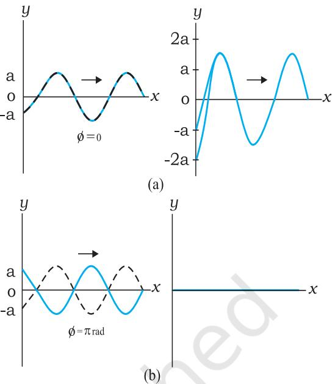

φ between the constituent two waves:

*A*(φ) *=* 2*a* cos ½φ (14.32) For φ = 0, when the waves are in phase,

$y(x,t)=2a\ \sin\left(kx-at\right)$ (14.33)

i.e., the resultant wave has amplitude 2a, the largest possible value for *A*. For φ π = , the waves are completely, out of phase and the resultant wave has zero displacement everywhere at all times

$y$ ($x$, $t$) = 0 (14.34)

Eq. (14.33) refers to the so-called constructive interference of the two waves where the amplitudes add up in the resultant wave. Eq. (14.34) is the case of destructive intereference where the amplitudes subtract out in the resultant wave. Fig. 14.10 shows these two cases of interference of waves arising from the principle of superposition.

#### **14.6 REFLECTION OF WAVES**

So far we considered waves propagating in an unbounded medium. What happens if a pulse or a wave meets a boundary? If the boundary is rigid, the pulse or wave gets reflected. The phenomenon of echo is an example of reflection by a rigid boundary. If the boundary is not completely rigid or is an interface between two different elastic media, the situation is some what complicated. A part of the incident wave is reflected and a part is transmitted into the second medium. If a wave is incident obliquely on the boundary between two different media the transmitted wave is called the **refracted wave***.* The incident and refracted waves obey Snell's law of refraction, and the incident and reflected waves obey the usual laws of reflection.

Fig. 14.11 shows a pulse travelling along a stretched string and being reflected by the boundary. Assuming there is no absorption of energy by the boundary, the reflected wave has the same shape as the incident pulse but it suffers a phase change of π or 1800 on reflection. This is because the boundary is rigid and the disturbance must have zero displacement at all times at the boundary. By the principle of superposition, this is possible only if the reflected and incident waves differ by a phase of π, so that the resultant displacement is zero. This reasoning is based on boundary condition on a rigid wall. We can arrive at the same conclusion dynamically also. As the pulse arrives at the wall, it exerts a force on the wall. By Newton's Third Law, the wall exerts an equal and opposite force on the string generating a reflected pulse that differs by a phase of π.

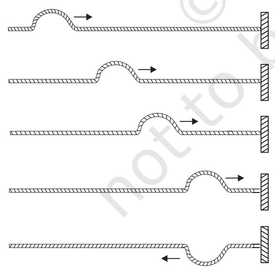

**Fig. 14.11** *Reflection of a pulse meeting a rigid boundary.*

If on the other hand, the boundary point is not rigid but completely free to move (such as in the case of a string tied to a freely moving ring on a rod), the reflected pulse has the same phase and amplitude (assuming no energy dissipation) as the incident pulse. The net maximum displacement at the boundary is then twice the amplitude of each pulse. An example of non- rigid boundary is the open end of an organ pipe.

To summarise, a travelling wave or pulse suffers a phase change of π on reflection at a rigid boundary and no phase change on reflection at an open boundary. To put this mathematically, let the incident travelling wave be

$$y_{2}\left(x,t\right)=a\sin\left(k x-a t\right)$$

At a rigid boundary, the reflected wave is given by

$\Psi(x,t)=a$ sin ($kx-at+\pi$).  
  

 = – *a* sin (*kx –* ω*t*) (14.35) At an open boundary, the reflected wave is given by

$y_{i}(x,t)=a\sin\left(kx-\omega t+0\right)$.  
  
$=a\sin\left(kx-\omega t\right)$ (14.36)

Clearly, at the rigid boundary, 2 = + = 0 *r y y y* at all times.

# **14.6.1 Standing Waves and Normal Modes**

We considered above reflection at one boundary. But there are familiar situations (a string fixed at either end or an air column in a pipe with either end closed) in which reflection takes place at two or more boundaries. In a string, for example, a wave travelling in one direction will get reflected at one end, which in turn will travel and get reflected from the other end. This will go on until there is a steady wave pattern set up on the string. Such wave patterns are called standing waves or stationary waves. To see this mathematically, consider a wave travelling along the positive direction of *x*-axis and a reflected wave of the same amplitude and wavelength in the negative direction of x-axis. From Eqs. (14.2) and (14.4), with φ = 0, we get:

$$y_{1}(x,\,t)=a\,\sin\,(k x-\omega\,t)$$

$$y_{2}(x,\,t)=a\,\sin\,(k x+\omega\,t)$$

The resultant wave on the string is, according to the principle of superposition:

$$y(x,\,t)=\,y_{1}(x,\,t)+y_{2}(x,\,t)$$

$=a$ [sin ($kx-\omega t$) + sin ($kx+\omega t$)]  
  
Using the familiar trigonometric identity  
  
Sin (A+B) + Sin (A-B) = 2 sin A cosB we get,

$y(x,\,t)=2a\sin\,kx\cos\,\omega t$ (14.37)

Note the important difference in the wave pattern described by Eq. (14.37) from that described by Eq. (14.2) or Eq. (14.4). The terms kx and ω*t* appear separately, not in the combination *kx* ω*t*. The amplitude of this wave is 2*a* sin *kx*. Thus, in this wave pattern, the amplitude varies from point-to-point, but each element of the string oscillates with the same angular frequency ω or time period. There is no phase difference between oscillations of different elements of the wave. The string as a whole vibrates in phase with differing amplitudes at different points. The wave pattern is neither moving to the right nor to the left. Hence, they are called standing or stationary waves. The amplitude is fixed at a given location but, as remarked earlier, it is different at different locations. The points at which the amplitude is zero (i.e., where there is no motion at all) are **nodes**; the points at which the amplitude is the largest are called **antinodes.** Fig. 14.12 shows a stationary wave pattern resulting from superposition of two travelling waves in opposite directions.

The most significant feature of stationary waves is that the boundary conditions constrain the possible wavelengths or frequencies of vibration of the system. The system cannot oscillate with any arbitrary frequency (contrast this with a harmonic travelling wave), but is characterised by a set of natural frequencies or **normal modes** of oscillation. Let us determine these normal modes for a stretched string fixed at both ends.

First, from Eq. (14.37), the positions of nodes (where the amplitude is zero) are given by sin *kx* = 0 .

which implies

$$k x=n\pi;\;\;n=0,1,2,3,\ldots$$

Since, $k=2\pi/4$, we get 

$x=\frac{n\lambda}{2}$ : $n=0$, $1$, $2$, $3$,... (14.38)

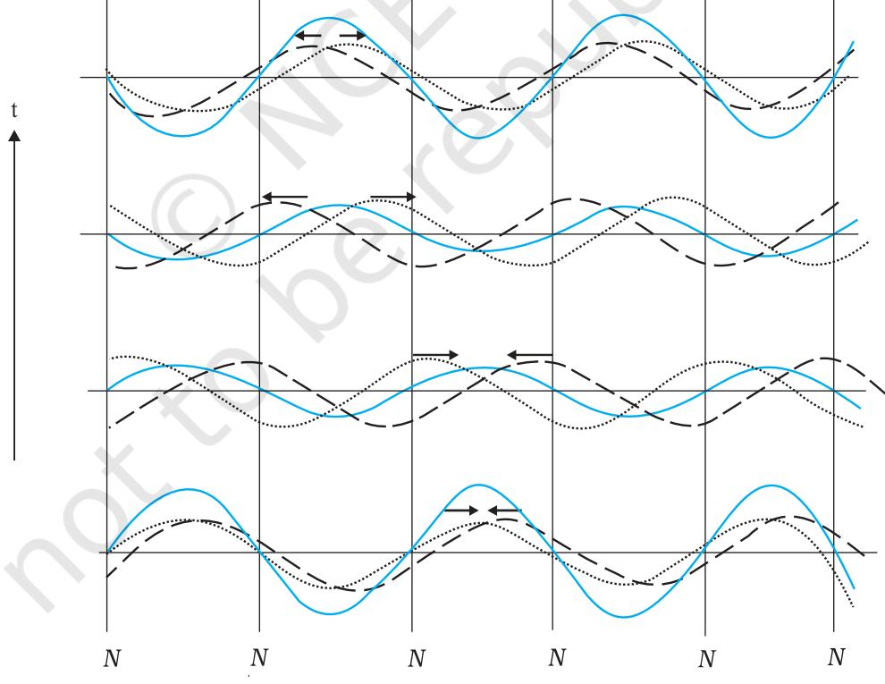

**Fig. 14.12** *Stationary waves arising from superposition of two harmonic waves travelling in opposite directions. Note that the positions of zero displacement (nodes) remain fixed at all times.*

Clearly, the distance between any two successive nodes is λ 2 *.*  In the same way, the positions of antinodes (where the amplitude is the largest) are given by the largest value of sin *kx* :

sin *k x* = 1 which implies

> *kx* = (*n* + ½) π; *n =* 0, 1, 2, 3, ...

With *k =* 2π*/*λ, we get

$x=(n+\frac{1}{2})\frac{\lambda}{2}$ ; $n=0$, $1$, $2$, $3$,... (14.39)

Again the distance between any two consecutive

antinodes is 2 λ . Eq. (14.38) can be applied to the case of a stretched string of length *L* fixed at both ends. Taking one end to be at *x* = 0, the boundary conditions are that *x* = 0 and *x* = *L* are positions of nodes. The *x* = 0 condition is already satisfied. The *x* = *L* node condition requires that the length *L* is related to λ by

$$L=n\,\frac{\lambda}{2}\,;\quad n=1,2,3,\dots\quad\quad(14.40)$$

Thus, the possible wavelengths of stationary waves are constrained by the relation

$$\lambda=\frac{2L}{n}\,;\;\;\;n=1,\,2,\,3,\,...\;\;\;(14.41)^{-1}$$

with corresponding frequencies

*v* = 2L *nv ,* for *n =* 1, 2, 3, (14.42)

We have thus obtained the natural frequencies - the normal modes of oscillation of the system. The lowest possible natural frequency of a system is called its **fundamental mode** or the **first harmonic**. For the stretched string fixed at either end

it is given by *v* = *v* 2*L* , corresponding

speed of wave determined by the properties of the medium. The *n* = 2 frequency is called the second harmonic; *n* = 3 is the third harmonic and so on. We can label the various harmonics by the symbol ν*n* ( *n* = 1, 2, ...).

Fig. 14.13 shows the first six harmonics of a stretched string fixed at either end. A string need not vibrate in one of these modes only. Generally, the vibration of a string will be a superposition of different modes; some modes may be more strongly excited and some less. Musical instruments like sitar or violin are based on this principle. Where the string is plucked or bowed, determines which modes are more prominent than others.

Let us next consider normal modes of oscillation of an air column with one end closed

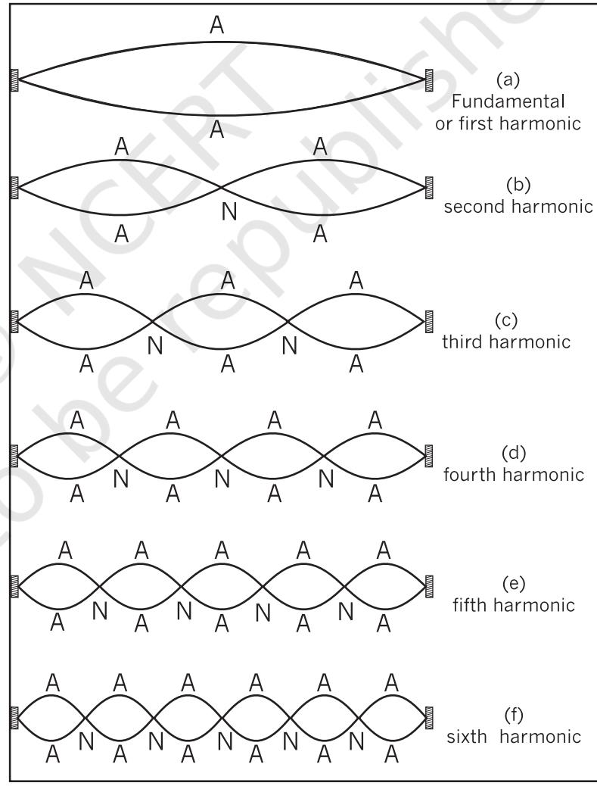

**Fig. 14.13** *The first six harmonics of vibrations of a stretched string fixed at both ends.*

and the other open. A glass tube partially filled with water illustrates this system. The end in contact with water is a node, while the open end is an antinode. At the node the pressure changes are the largest, while the displacement is minimum (zero). At the open end - the antinode, it is just the other way - least pressure change and maximum amplitude of displacement. Taking the end in contact with water to be *x* = 0, the node condition (Eq. 14.38) is already satisfied. If the other end *x* = *L* is an antinode, Eq. (14.39) gives

$$L=\ \left(n+{\frac{1}{2}}\right)^{\cdot}{\frac{\lambda}{2}}\,,{\mathrm{~for~}}n=0,\,1,\,2,\,3,\,....$$

The possible wavelengths are then restricted by the relation :

$\lambda=\frac{2L}{(n+1/2)}$, for $n=0$, $1$, $2$, $3$,... (14.43)

The normal modes – the natural frequencies – of the system are

$\nu=\left(n+\frac{1}{2}\right)\frac{\nu}{2L}$ ; $n=0$, $1$, $2$, $3$,... (14.44)

The fundamental frequency corresponds to *n* = 0,

and is given by *v* 4*L* . The higher frequencies are **odd harmonics**, i.e., odd multiples of the

fundamental frequency : 3 *v* 4*L* , 5 *v* 4*L* , etc. Fig. 14.14 shows the first six odd harmonics of air column with one end closed and the other open. For a pipe open at both ends, each end is an antinode. It is then easily seen that an open air column at both ends generates all harmonics (See Fig. 14.15).

The systems above, strings and air columns, can also undergo forced oscillations (Chapter 13). If the external frequency is close to one of the natural frequencies, the system shows **resonance**.

Normal modes of a circular membrane rigidly clamped to the circumference as in a tabla are determined by the boundary condition that no point on the circumference of the membrane vibrates. Estimation of the frequencies of normal modes of this system is more complex. This problem involves wave propagation in two dimensions. However, the underlying physics is the same.

u **Example 14.5** A pipe, 30.0 cm long, is open at both ends. Which harmonic mode of the pipe resonates a 1.1 kHz source? Will resonance with the same source be observed if one end of the pipe is closed ? Take the speed of sound in air as 330 m s–1 .

**Answer** The first harmonic frequency is given by

$\mathbf{v}_{1}=\frac{\mathbf{v}}{\mathbf{i}_{1}}=\frac{\mathbf{v}}{\mathbf{i}_{1}}$ (open pipe)

where *L* is the length of the pipe. The frequency of its *n*th harmonic is:

$\nu_{n}=\frac{\nu_{n}}{2L}$, for $n=1,2,3,...$ (open pipe)

First few modes of an open pipe are shown in Fig. 14.15.

For *L* = 30.0 cm, *v* = 330 m s–1 ,

$$v_{\mathrm{n}}={\frac{n{\mathrm{~330~(m~s^{-1})}}}{\mathrm{0.6~(m)}}}=550{\mathrm{~n~s^{-1})}}$$

Clearly, a source of frequency 1.1 kHz will resonate at *v*2 , i.e. the **second harmonic***.*

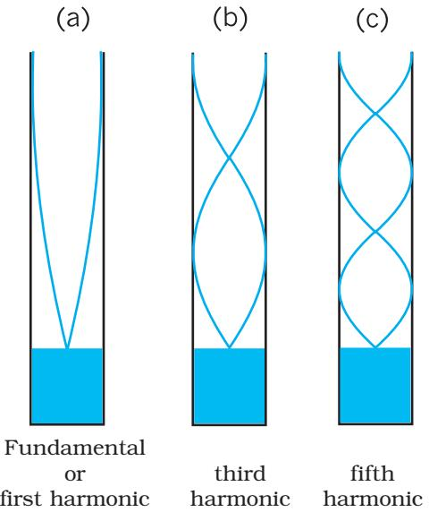

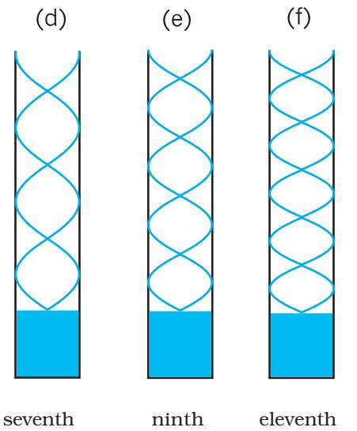

**Fig. 14.14** *Normal modes of an air column open at one end and closed at the other end. Only the odd harmonics are seen to be possible.*

Now if one end of the pipe is closed (Fig. 14.15), it follows from Eq. (14.15) that the fundamental frequency is

$$\mathrm{v}_{\mathrm{\scriptsize~I}}=\mathrm{~\frac{v}{\lambda_{1}}=\frac{v}{4L}~(p i p e\ c l o s e d\ a t o n e\ e n d))}$$

and only the odd numbered harmonics are present :

$$\mathrm{v}_{\!_{3}}={\frac{3v}{4L}}\,,\,\,\,\mathrm{v}_{\!_{5}}={\frac{5v}{4L}}\,,\,{\mathrm{and~so~on.}}$$

For *L* = 30 cm and *v* = 330 m s–1, the fundamental frequency of the pipe closed at one end is 275 Hz and the source frequency corresponds to its fourth harmonic. Since this harmonic is not a possible mode, no resonance will be observed with the source, the moment one end is closed. ⊳

#### **14.7 BEATS**

'Beats' is an interesting phenomenon arising from interference of waves. When two harmonic sound waves of close (but not equal) frequencies are heard at the same time, we hear a sound of similar frequency (the average of two close frequencies), but we hear something else also. We hear audibly distinct waxing and waning of the intensity of the sound, with a frequency equal to the difference in the two close frequencies. Artists use this phenomenon often

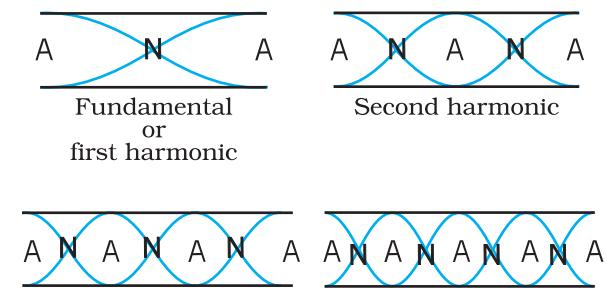

while tuning their instruments with each other. They go on tuning until their sensitive ears do not detect any beats.

To see this mathematically, let us consider two harmonic sound waves of nearly equal angular frequency ω1 and ω2 and fix the location to be x = 0 for convenience. Eq. (14.2) with a suitable choice of phase (φ = π/2 for each) and, assuming equal amplitudes, gives

 *s*1 = *a* cos ω1 *t* and *s*2 = *a* cos ω2 *t* (14.45) Here we have replaced the symbol y by *s*, since we are referring to longitudinal not transverse displacement. Let ω1 be the (slightly) greater of the two frequencies. The resultant displacement is, by the principle of superposition,

*s* = *s*1  *+ s*2 = *a* (cosω1 *t +* cos ω2 *t*) Using the familiar trignometric identity for cos A + cosB, we get

$$=\ 2\ a\ \cos\frac{\left(\omega_{1}-\omega_{2}\right)t}{2}\ \cos\frac{\left(\omega_{1}+\omega_{2}\right)t}{2}\tag{14.46}$$

which may be written as :

*s =* [2 *a* cos ω*b t* ] cos ω*a t* (14.47)

If |ω1 *–* ω2 | <<ω1 , ω2 , ω*a >>* ω*b* , th where

$$\omega_{b}={\frac{\left(\omega_{1}-\omega_{2}\right)}{2}}{\mathrm{~and~}}\omega_{a}={\frac{\left(\omega_{1}+\omega_{2}\right)}{2}}$$

Now if we assume |ω1 *–* ω2 | <<ω1 , which means ω*a >>* ω*b* , we can interpret Eq. (14.47) as follows. The resultant wave is oscillating with the average angular frequency ωa ; however its amplitude is **not** constant in time, unlike a pure harmonic wave. The amplitude is the largest when the term *cos* ω*b t* takes its limit +1 or –1. In other words, the intensity of the resultant wave waxes and wanes with a frequency which is 2ωb = ω1 –

# **Musical Pillars**

Temples often have some pillars portraying human figures playing musical instruments, but seldom do these pillars themselves produce music. At the Nellaiappar temple in Tamil Nadu, gentle taps on a cluster of pillars carved out of a single piece of rock produce the basic notes of Indian classical music, viz. Sa, Re, Ga, Ma, Pa, Dha, Ni, Sa. Vibrations of these pillars depend on elasticity of the stone used, its density and shape.

Musical pillars are categorised into three types: The first is called the **Shruti Pillar**, as it can produce the basic notes — the "swaras". The second type is the **Gana Thoongal**, which generates the basic tunes that make up the "ragas". The third variety is the **Laya Thoongal** pillars that produce "taal" (beats) when tapped. The pillars at the Nellaiappar temple are a combination of the Shruti and Laya types.

Archaeologists date the Nelliappar temple to the 7th century and claim it was built by successive rulers of the Pandyan dynasty.

The musical pillars of Nelliappar and several other temples in southern India like those at Hampi (picture), Kanyakumari, and Thiruvananthapuram are unique to the country and have no parallel in any other part of the world.

ω2 . Since ω *=* 2πν, the beat frequency ν*beat*, is given by

ν*beat* = ν1 – ν2 (14.48) Fig. 14.16 illustrates the phenomenon of beats for two harmonic waves of frequencies 11 Hz and 9 Hz. The amplitude of the resultant wave shows beats at a frequency of 2 Hz.

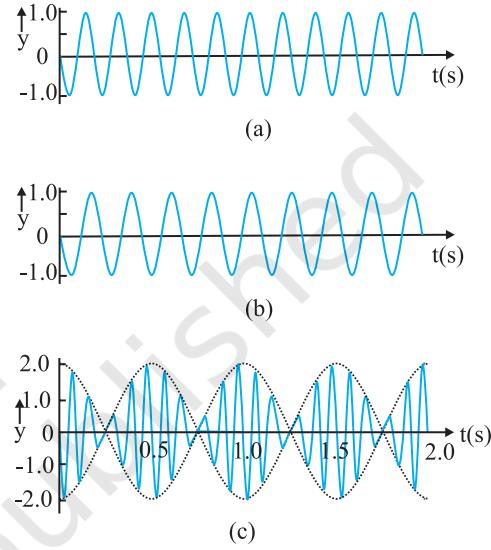

- **Fig. 14.16** *Superposition of two harmonic waves, one of frequency 11 Hz (a), and the other of frequency 9Hz (b), giving rise to beats of frequency 2 Hz, as shown in (c).*
u **Example 14.6** Two sitar strings A and B playing the note '*Dha*' are slightly out of tune and produce beats of frequency 5 Hz. The tension of the string B is slightly increased and the beat frequency is found to decrease to 3 Hz. What is the original frequency of B if the frequency of A is 427 Hz ?

**Answer** Increase in the tension of a string increases its frequency. If the original frequency of B (ν*B* ) were greater than that of A (ν*A* ), further increase in ν *B* should have resulted in an increase in the beat frequency. But the beat frequency is found to decrease. This shows that ν*B* < ν*A* . Since ν*A* – ν*B* = 5 Hz, and ν*A* = 427 Hz, we get ν*B* = 422 Hz. ⊳

#### **SUMMARY**

- 1. *Mechanical waves* can exist in material media and are governed by Newton's Laws.
- 2. *Transverse waves* are waves in which the particles of the medium oscillate perpendicular to the direction of wave propagation.
- 3. *Longitudinal waves* are waves in which the particles of the medium oscillate along the direction of wave propagation.
- 4. *Progressive wave* is a wave that moves from one point of medium to another.
- 5. *The displacement* in a sinusoidal wave propagating in the positive x direction is given by

*y* (*x*, *t*) *= a sin* (*kx* – ω*t* + φ)

where *a is the* amplitude of the wave, *k* is the angular wave number*,* ω *is the* angular frequency*,* (*kx* – ω*t* + φ) *is the* phase*, and* φ *is the* phase constant or phase angle*.*

- 6. *Wavelength* λ of a progressive wave is the distance between two consecutive points of the same phase at a given time. In a stationary wave, it is twice the distance between two consecutive nodes or antinodes.
- 7. *Period T* of oscillation of a wave is defined as the time any element of the medium takes to move through one complete oscillation. It is related to the *angular frequency* ω through the relation

* [14] M. C.  
  

- 8. *Frequency v* of a wave is defined as 1/*T* and is related to angular frequency by

$$V={\frac{\omega}{2\pi}}$$

- 9. *Speed* of a progressive wave is given by k T *v* ω λ = = = λν
- 10. *The speed of a transverse wave* on a stretched string is set by the properties of the string. The speed on a string with tension *T* and linear mass density µis

$$v={\sqrt{\frac{T}{\mu}}}$$

- 11. *Sound waves* are longitudinal mechanical waves that can travel through solids, liquids, or gases. The speed *v* of sound wave in a fluid having *bulk modulus B* and density ρis

$$v=\left|{\frac{B}{\rho}}\right|$$

The speed of longitudinal waves in a metallic bar is

$$\mathbf{v}={\sqrt{\frac{Y}{\rho}}}$$

For gases, since *B =* γ*P*, the speed of sound is

$$v={\sqrt{\frac{\gamma P}{\rho}}}$$

- 12. When two or more waves traverse simultaneously in the same medium, the displacement of any element of the medium is the algebraic sum of the displacements due to each wave. This is known as the *principle of superposition* of waves

$$y=\sum_{i=1}^{n}f_{i}(x\ -\ v t)$$

- 13. Two sinusoidal waves on the same string exhibit *interference*, adding or cancelling according to the principle of superposition. If the two are travelling in the same direction and have the same amplitude *a* and frequency but differ in phase by a *phase constant* φ, the result is a single wave with the same frequency ω :

$$y\left(x,\;t\right)\ =\left[2a\cos{\frac{1}{2}}\phi\right]\,\sin\left(k x-a t\ +{\frac{1}{2}}\phi\right)$$

If φ = 0 or an integral multiple of 2π, the waves are exactly in phase and the interference is constructive; if φ= π, they are exactly out of phase and the interference is destructive.

- 14. A travelling wave, at a rigid boundary or a closed end, is reflected with a phase reversal but the reflection at an open boundary takes place without any phase change.
For an incident wave

$\Psi_{1}(x,t)=a$ sin (kx - $\omega$)

the reflected wave at a rigid boundary is

$y_{r}(x,\,d)=-\,a$ sin (kx + _out_)  
  
For reflection at an open boundary 

$\Psi_{r}(x,t)=a$ sin (kx + _out_)

- 15. The interference of two identical waves moving in opposite directions produces *standing waves.* For a string with fixed ends, the standing wave is given by
$\nu$ (k, $\delta$) = [2a sin kx ] cos _at_

Standing waves are characterised by fixed locations of zero displacement called *nodes* and fixed locations of maximum displacements called *antinodes.* The separation between two consecutive nodes or antinodes is λ/2.

A stretched string of length *L* fixed at both the ends vibrates with frequencies given by

*v* , 2 = *n v L n* = 1, 2, 3, ...

The set of frequencies given by the above relation are called the *normal modes* of oscillation of the system. The oscillation mode with lowest frequency is called the *fundamental mode* or the *first harmonic.* The *second harmonic* is the oscillation mode with *n* = 2 and so on.

A pipe of length *L* with one end closed and other end open (such as air columns) vibrates with frequencies given by

$$v=\left(n+1/2\right)\ {\frac{\mathbf{\mu}}{2\mathbf{L}}}\,,\qquad n=0,\ 1,\ 2,\ 3,\ \ldots$$

The set of frequencies represented by the above relation are the *normal modes* of oscillation of such a system. The lowest frequency given by *v/*4*L* is the fundamental mode or the first harmonic.

- 16. A string of length *L* fixed at both ends or an air column closed at one end and open at the other end or open at both the ends, vibrates with certain frequencies called their normal modes. Each of these frequencies is a *resonant frequency* of the system.
- 17. *Beats* arise when two waves having slightly different frequencies, ν*1* and ν*2* and comparable amplitudes, are superposed. The beat frequency is

ν*beat* = ν1 ~ ν2

| Physical quantity   Symbol |  |  | Dimensions   Unit   Remarks |  |
| --- | --- | --- | --- | --- |
| Wavelength | 2 | [L] | m | Distance between two consecutive points with the same phase. |
| Propagation constant | k | IL-1 | n-l | 2 π |
| Wave speed | U | ILT-1 | m s | U = V2 |
| Beat frequency | V bea | IT-11 | S-I | Difference of two close frequencies of superposing waves. |

#### **POINTS TO PONDER**

- 1. A wave is not motion of matter as a whole in a medium. A wind is different from the sound wave in air. The former involves motion of air from one place to the other. The latter involves compressions and rarefactions of layers of air.
- 2. In a wave, energy and *not the matter* is transferred from one point to the other.
- 3. In a mechanical wave, energy transfer takes place because of the coupling through elastic forces between neighbouring oscillating parts of the medium.
- 4. Transverse waves can propagate only in medium with shear modulus of elasticity, Longitudinal waves need bulk modulus of elasticity and are therefore, possible in all media, solids, liquids and gases.
- 5. In a harmonic progressive wave of a given frequency, all particles have the same amplitude but different phases at a given instant of time. In a stationary wave, all particles between two nodes have the same phase at a given instant but have different amplitudes.
- 6. Relative to an observer at rest in a medium the speed of a mechanical wave in that medium (*v*) depends only on elastic and other properties (such as mass density) of the medium. It does not depend on the velocity of the source.

#### **EXERCISES**

- **14.1** A string of mass 2.50 kg is under a tension of 200 N. The length of the stretched string is 20.0 m. If the transverse jerk is struck at one end of the string, how long does the disturbance take to reach the other end?
- **14.2** A stone dropped from the top of a tower of height 300 m splashes into the water of a pond near the base of the tower. When is the splash heard at the top given that the speed of sound in air is 340 m s–1 ? (*g* = 9.8 m s–2)
- **14.3** A steel wire has a length of 12.0 m and a mass of 2.10 kg. What should be the tension in the wire so that speed of a transverse wave on the wire equals the speed of sound in dry air at 20 °C = 343 m s–1 .

**14.4** Use the formula *v P* = γ ρ to explain why the speed of sound in air

- (a) is independent of pressure,
- (b) increases with temperature,
- (c) increases with humidity.
- **14.5** You have learnt that a travelling wave in one dimension is represented by a function *y* = *f (x, t)* where *x* and *t* must appear in the combination *x – v t* or *x + v t*, i.e. *y = f (x ± v t)*. Is the converse true? Examine if the following functions for *y* can possibly represent a travelling wave :
	- (a) (*x vt* ) 2
	- (b) log [(*x* + *vt*)/*x*0 ]

(c) 1/(*x* + *vt*)

- **14.6** A bat emits ultrasonic sound of frequency 1000 kHz in air. If the sound meets a water surface, what is the wavelength of (a) the reflected sound, (b) the transmitted sound? Speed of sound in air is 340 m s –1 and in water 1486 m s–1 .
- **14.7** A hospital uses an ultrasonic scanner to locate tumours in a tissue. What is the wavelength of sound in the tissue in which the speed of sound is 1.7 km s–1 ? The operating frequency of the scanner is 4.2 MHz.
- **14.8** A transverse harmonic wave on a string is described by

 *y(x, t) =* 3.0 sin (36 t + 0.018 *x* + π/4)

where *x* and *y* are in cm and *t* in s. The positive direction of *x* is from left to right.

- (a) Is this a travelling wave or a stationary wave ?
If it is travelling, what are the speed and direction of its propagation ?

- (b) What are its amplitude and frequency ?
- (c) What is the initial phase at the origin ?
- (d) What is the least distance between two successive crests in the wave ?
- **14.9** For the wave described in Exercise 14.8, plot the displacement (*y*) versus (*t*) graphs for *x =* 0, 2 and 4 cm. What are the shapes of these graphs? In which aspects does the oscillatory motion in travelling wave differ from one point to another: amplitude, frequency or phase ?
- **14.10** For the travelling harmonic wave

*y*(*x, t*) = 2.0 cos 2π(10*t* – 0.0080 *x* + 0.35)

where *x* and *y* are in cm and *t* in s. Calculate the phase difference between oscillatory motion of two points separated by a distance of

- (a) 4 m,
- (b) 0.5 m,
- (c) λ/2,
- (d) 3λ/4
- **14.11** The transverse displacement of a string (clamped at its both ends) is given by

$$y(x,\ t)=0.06\ \mathrm{sin}\left({\frac{2\pi}{3}}x\right)\ \mathrm{cos}\ (120\ \pi t)$$

where *x* and *y* are in m and *t* in s. The length of the string is 1.5 m and its mass is 3.0 ×10–2 kg.

Answer the following :

- (a) Does the function represent a travelling wave or a stationary wave?
- (b) Interpret the wave as a superposition of two waves travelling in opposite directions. What is the wavelength, frequency, and speed of each wave ?
- (c) Determine the tension in the string.
- **14.12** (i) For the wave on a string described in Exercise 15.11, do all the points on the string oscillate with the same (a) frequency, (b) phase, (c) amplitude? Explain your answers. (ii) What is the amplitude of a point 0.375 m away from one end?
- **14.13** Given below are some functions of *x* and *t* to represent the displacement (transverse or longitudinal) of an elastic wave. State which of these represent (i) a travelling wave, (ii) a stationary wave or (iii) none at all:
	- (a) *y* = 2 cos (3*x*) sin (10*t*)
	- (b) *y x vt* = − 2
	- (c) *y* = 3 sin (5*x* 0.5*t*) + 4 cos (5*x* 0.5*t*)
	- (d) *y* = cos *x* sin *t* + cos 2*x* sin 2*t*
- **14.14** A wire stretched between two rigid supports vibrates in its fundamental mode with a frequency of 45 Hz. The mass of the wire is 3.5 × 10–2 kg and its linear mass density is 4.0 × 10–2 kg m–1. What is (a) the speed of a transverse wave on the string, and (b) the tension in the string?
- **14.15** A metre-long tube open at one end, with a movable piston at the other end, shows resonance with a fixed frequency source (a tuning fork of frequency 340 Hz) when the tube length is 25.5 cm or 79.3 cm. Estimate the speed of sound in air at the temperature of the experiment. The edge effects may be neglected.
- **14.16** A steel rod 100 cm long is clamped at its middle. The fundamental frequency of longitudinal vibrations of the rod are given to be 2.53 kHz. What is the speed of sound in steel?
- **14.17** A pipe 20 cm long is closed at one end. Which harmonic mode of the pipe is resonantly excited by a 430 Hz source ? Will the same source be in resonance with the pipe if both ends are open? (speed of sound in air is 340 m s–1).
- **14.18** Two sitar strings A and B playing the note '*Ga*' are slightly out of tune and produce beats of frequency 6 Hz. The tension in the string A is slightly reduced and the beat frequency is found to reduce to 3 Hz. If the original frequency of A is 324 Hz, what is the frequency of B?
- **14.19** Explain why (or how):
	- (a) in a sound wave, a displacement node is a pressure antinode and vice versa,
	- (b) bats can ascertain distances, directions, nature, and sizes of the obstacles without any "eyes",
	- (c) a violin note and sitar note may have the same frequency, yet we can distinguish between the two notes,
	- (d) solids can support both longitudinal and transverse waves, but only longitudinal waves can propagate in gases, and
	- (e) the shape of a pulse gets distorted during propagation in a dispersive medium.

