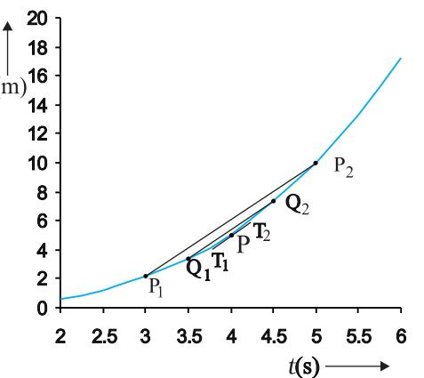
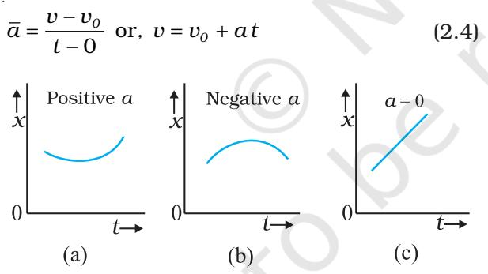
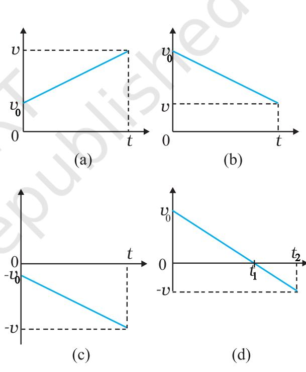
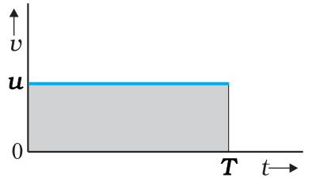
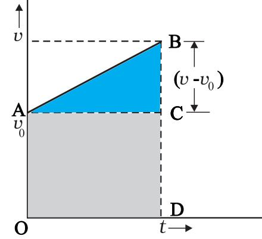
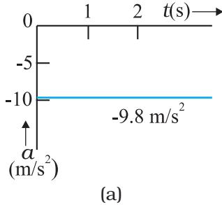
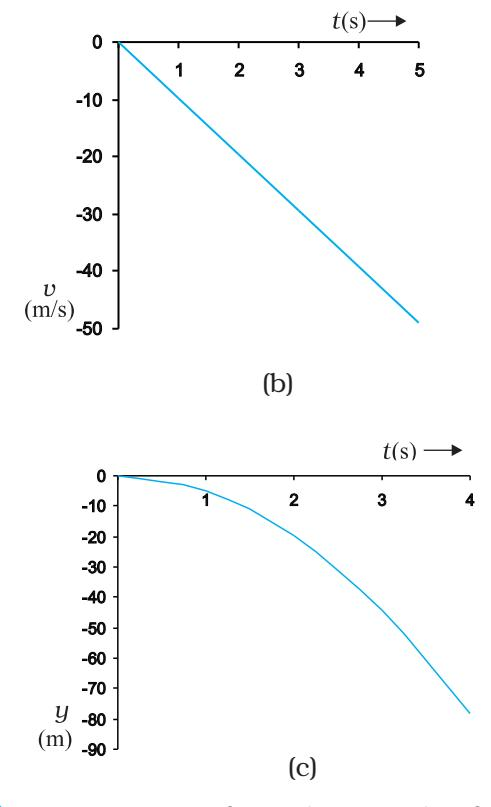
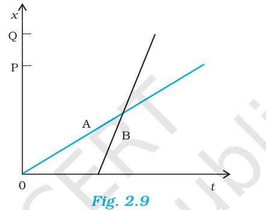
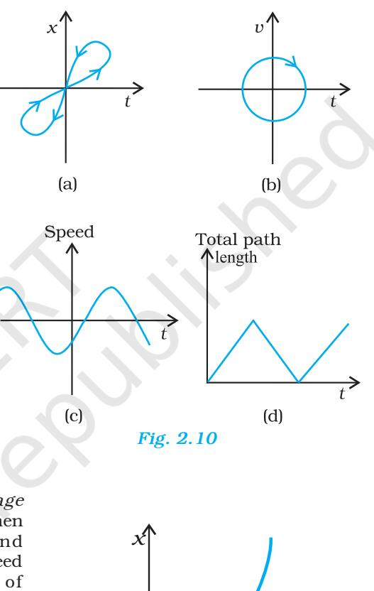
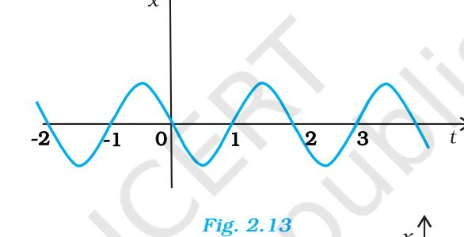

**CHAPTER TWO**

**MOTION IN A STRAIGHT LINE**

- **2.1** Introduction
- **2.2** Instantaneous velocity and speed
- **2.3** Acceleration
- **2.4** Kinematic equations for uniformly accelerated motion
- **2.5** Relative velocity

Summary Points to ponder Exercises

### **2.1 INTRODUCTION**

Motion is common to everything in the universe. We walk, run and ride a bicycle. Even when we are sleeping, air moves into and out of our lungs and blood flows in arteries and veins. We see leaves falling from trees and water flowing down a dam. Automobiles and planes carry people from one place to the other. The earth rotates once every twenty-four hours and revolves round the sun once in a year. The sun itself is in motion in the Milky Way, which is again moving within its local group of galaxies.

Motion is change in position of an object with time. How does the position change with time ? In this chapter, we shall learn how to describe motion. For this, we develop the concepts of velocity and acceleration. We shall confine ourselves to the study of motion of objects along a straight line, also known as **rectilinear motion**. For the case of rectilinear motion with uniform acceleration, a set of simple equations can be obtained. Finally, to understand the relative nature of motion, we introduce the concept of relative velocity.

In our discussions, we shall treat the objects in motion as point objects. This approximation is valid so far as the size of the object is much smaller than the distance it moves in a reasonable duration of time. In a good number of situations in real-life, the size of objects can be neglected and they can be considered as point-like objects without much error.

In **Kinematics**, we study ways to describe motion without going into the causes of motion. What causes motion described in this chapter and the next chapter forms the subject matter of Chapter 4.

# **2.2 INSTANTANEOUS VELOCITY AND SPEED**

The average velocity tells us how fast an object has been moving over a given time interval but does not tell us how fast it moves at different instants of time during that interval. For this, we define **instantaneous velocity** or simply velocity *v* at an instant *t*.

The velocity at an instant is defined as the limit of the average velocity as the time interval ∆*t* becomes infinitesimally small. In other words,

$\omega=\lim\limits_{\Delta t\to0\ \Delta t}$ (2.1a)

$\begin{array}{l}\mbox{\bf d}x\\ \mbox{\bf d}t\end{array}$ (2.1b)

where the symbol *lim* ∆*t*→*0* stands for the operation of taking limit as ∆*t*g0 of the quantity on its right. In the language of calculus, the quantity on the right hand side of Eq. (2.1a) is the differential coefficient of *x* with respect to *t* and

is denoted by d d *x t* (see Appendix 2.1). It is the rate of change of position with respect to time, at that instant.

We can use Eq. (2.1a) for obtaining the value of velocity at an instant either **graphically** or **numerically**. Suppose that we want to obtain graphically the value of velocity at time *t* = 4 s (point P) for the motion of the car represented in Fig.2.1 calculation. Let us take ∆*t* = 2 s centred at *t* = 4 s. Then, by the definition of the average velocity, the slope of line P1P2 ( Fig. 2.1) gives the value of average velocity over the interval 3 s to 5 s.

**Fig. 2.1** *Determining velocity from position-time graph. Velocity at t =* 4 s *is the slope of the tangent to the graph at that instant*.

Now, we decrease the value of ∆*t* from 2 s to 1 s. Then line P1P2 becomes Q1Q2 and its slope gives the value of the average velocity over the interval 3.5 s to 4.5 s. In the limit ∆*t* → 0, the line P1 P2 becomes tangent to the positiontime curve at the point P and the velocity at *t* = 4 s is given by the slope of the tangent at that point. **It is difficult to show this process graphically. But if we use numerical method to obtain the value of the velocity, the meaning of the limiting process becomes clear**. For the graph shown in Fig. 2.1, *x* = 0.08 *t* 3 . Table 2.1 gives the value of ∆*x*/∆*t* calculated for ∆*t* equal to 2.0 s, 1.0 s, 0.5 s, 0.1 s and 0.01 s centred at *t* = 4.0 s. The second and third columns give the

value of *t* 1 = *t t 2* − ∆ and *t t t 2 2* = + ∆ and the fourth and the fifth columns give the

| At (s) | (s) | (g) | x(t,) (m) | x(t.) (m) | △x (m) | Ax / At (m s") |
| --- | --- | --- | --- | --- | --- | --- |
| 2.0 | 3.0 | 5.0 | 2.16 | 10.0 | 7.84 | 3.92 |
| 1.0 | 3.5 | 4.5 | 3.43 | 7.29 | 3.86 | 3.86 |
| 0.5 | 3.75 | 4.25 | 4.21875 | 6.14125 | 1.9225 | 3.845 |
| 0.1 | 3.95 | 4.05 | 4.93039 | 5.31441 | 0.38402 | 3.8402 |
| 0.01 | 3.995 | 4.005 | 5.100824 | 5.139224 | 0.0384 | 3.8400 |

#### **Table 2.1 Limiting value of**  ∆ ∆ *x t*  **at t = 4 s**

corresponding values of *x*, i.e. *x* (*t* 1 ) = 0.08 *t* 1 3

and *x* (*t* 2 ) = 0.08 *t* 2 3 . The sixth column lists the difference ∆*x* = *x* (*t* 2 ) – *x* (*t* 1 ) and the last column gives the ratio of ∆*x* and ∆*t*, i.e. the average velocity corresponding to the value of ∆*t* listed in the first column.

We see from Table 2.1 that as we decrease the value of ∆*t* from 2.0 s to 0.010 s, the value of the average velocity approaches the limiting value 3.84 m s–1 which is the value of velocity at

$t=4.0$ s, i.e. the value of $\frac{dx}{dt}$ at $t=4.0$ s. In this,

manner, we can calculate velocity at each instant for motion of the car.

The graphical method for the determination of the instantaneous velocity is always not a convenient method. For this, we must carefully plot the position–time graph and calculate the value of average velocity as ∆*t* becomes smaller and smaller. It is easier to calculate the value of velocity at different instants if we have data of positions at different instants or exact expression for the position as a function of time. Then, we calculate ∆*x*/∆*t* from the data for decreasing the value of ∆*t* and find the limiting value as we have done in Table 2.1 or use differential calculus for the given expression and

calculate *dx dt* at different instants as done in the following example.

⊳ **Example 2.1** *The position of an object moving along x-axis is given by x = a + bt*2 *where a =* 8.5 m*, b =* 2.5 m s–2 *and t is measured in seconds. What is its velocity at t =* 0 s *and t =* 2.0 s*. What is the average velocity between t =* 2.0 s *and t =* 4.0 s ?

**Answer** In notation of differential calculus, the velocity is

$v=\frac{dx}{dt}=\frac{d}{dt}\big{(}a+bt^{2}\big{)}=2b\ t=5.0\ t\ m\ s^{-1}$  
  
At $t=0$ s, $v=0$ m s${}^{-1}$ and at $t=2.0$ s, $v=10$ m s${}^{-1}$.  
  

$$A v e r a g e\,v e l o c i t y={\frac{x\left(4.0\right)-x\left(2.0\right)}{4.0-2.0}}$$

16 – – 4 6.0 2.0 *a b a b b* + = = × -1 = × 6.0 2.5 =15 m s ⊳

**Note that for uniform motion, velocity is the same as the average velocity at all instants**.

**Instantaneous speed** or simply speed is the magnitude of velocity. For example, a velocity of + 24.0 m s–1 and a velocity of – 24.0 m s–1 both have an associated speed of 24.0 m s-1. It should be noted that though average speed over a finite interval of time is greater or equal to the magnitude of the average velocity, instantaneous speed at an instant is equal to the magnitude of the instantaneous velocity at that instant. Why so ?

# **2.3 ACCELERATION**

The velocity of an object, in general, changes during its course of motion. How to describe this change? Should it be described as the rate of change in velocity **with distance** or **with time** ? This was a problem even in Galileo's time. It was first thought that this change could be described by the rate of change of velocity with distance. But, through his studies of motion of freely falling objects and motion of objects on an inclined plane, Galileo concluded that the rate of change of velocity with time is a constant of motion for all objects in free fall. On the other hand, the change in velocity with distance is not constant – it decreases with the increasing distance of fall. This led to the concept of acceleration as the rate of change of velocity with time.

 The average acceleration *a* over a time interval is defined as the change of velocity divided by the time interval :

$${\overline{{a}}}={\frac{v_{2}-v_{1}}{t_{2}-t_{1}}}={\frac{\Delta v}{\Delta t}}\qquad\qquad(2.2)$$

where *v*2 and *v*1 are the instantaneous velocities or simply velocities at time *t*2 and *t*1 . It is the average change of velocity per unit time. The SI unit of acceleration is m s–2 .

On a plot of velocity versus time, the average acceleration is the slope of the straight line connecting the points corresponding to (*v*2 *, t*2 ) and (*v*1 *, t*1 ).

*Instantaneous acceleration* is defined in the same way as the instantaneous velocity :

$a=\lim\limits_{\Delta t\to0}\frac{\Delta v}{\Delta t}=\frac{\mathrm{d}v}{\mathrm{d}t}$ (2.3)

The acceleration at an instant is the slope of the tangent to the *v–t* curve at that instant.

Since velocity is a quantity having both magnitude and direction, a change in velocity may involve either or both of these factors. Acceleration, therefore, may result from a change in speed (magnitude), a change in direction or changes in both. Like velocity, acceleration can also be positive, negative or zero. Position-time graphs for motion with positive, negative and zero acceleration are shown in Figs. 2.4 (a), (b) and (c), respectively. Note that the graph curves upward for positive acceleration; downward for negative acceleration and it is a straight line for zero acceleration.

Although acceleration can vary with time, our study in this chapter will be restricted to motion with constant acceleration. In this case, the average acceleration equals the constant value of acceleration during the interval. If the velocity of an object is *v o* at *t* = 0 and *v* at time *t*, we have

**Fig. 2.2** *Position-time graph for motion with (a) positive acceleration; (b) negative acceleration, and (c) zero acceleration*.

Let us see how velocity-time graph looks like for some simple cases. Fig. 2.3 shows velocitytime graph for motion with constant acceleration for the following cases :

- (a) An object is moving in a positive direction with a positive acceleration.
- (b) An object is moving in positive direction with a negative acceleration.
- (c) An object is moving in negative direction with a negative acceleration.
- (d) An object is moving in positive direction till time *t1 ,* and then turns back with the same negative acceleration.

An interesting feature of a velocity-time graph for any moving object is that **the area under the curve represents the displacement over a given time interval**. A general proof of this statement requires use of calculus. We can, however, see that it is true for the simple case of an object moving with constant velocity *u*. Its velocity-time graph is as shown in Fig. 2.4.

- **Fig. 2.3** *Velocity–time graph for motions with constant acceleration. (a) Motion in positive direction with positive acceleration, (b) Motion in positive direction with negative acceleration, (c) Motion in negative direction with negative acceleration, (d) Motion of an object with negative acceleration that changes direction at time t1 . Between times 0 to t 1 , it moves in positive x - direction and between t1 and t2 it moves in the opposite direction*.

*Fig. 2.4 Area under v–t curve equals displacement of the object over a given time interval*.

The *v-t* curve is a straight line parallel to the time axis and the area under it between *t* = 0 and *t* = *T* is the area of the rectangle of height *u* and base *T*. Therefore, area = *u* × *T* = *uT* which is the displacement in this time interval. How come in this case an area is equal to a distance? Think! Note the dimensions of quantities on the two coordinate axes, and you will arrive at the answer.

Note that the *x-t, v-t,* and *a-t* graphs shown in several figures in this chapter have sharp kinks at some points implying that the functions are not differentiable at these points. In any realistic situation, the functions will be differentiable at all points and the graphs will be smooth.

What this means physically is that acceleration and velocity cannot change values abruptly at an instant. Changes are always continuous.

# 2.4 KINEMATIC E**Q**UATIONS FOR UNIFORMLY ACCELERATED MOTION

For uniformly accelerated motion, we can derive some simple equations that relate displacement (*x*), time taken (*t*), initial velocity (*v0* ), final velocity (*v*) and acceleration (*a*). Equation (2.4) already obtained gives a relation between final and initial velocities *v* and *v0* of an object moving with uniform acceleration *a* :

$\upsilon=\upsilon_{0}+at$ (2.4)

This relation is graphically represented in Fig. 2.5. The area under this curve is :

Area between instants 0 and *t* = Area of triangle ABC + Area of rectangle OACD

$$={\frac{1}{2}}(v{-}v_{o})t+v_{o}t$$

*Fig. 2.5 Area under v-t curve for an object with uniform acceleration*.

As explained in the previous section, the area under *v-t* curve represents the displacement. Therefore, the displacement *x* of the object is :

$\mathbf{x}=\frac{1}{2}(\mathbf{v}-\mathbf{v}_{0})t+\mathbf{v}_{0}t$ (2.5)

But *v v a t* − = *0*

Therefore, 2 0 1 2 *x a t + v t* =

$\chi=\upsilon_{0}t+\frac{1}{2}at^{2}$ (2.6)

Equation (2.5) can also be written as

$\chi=\frac{\upsilon+\upsilon_{0}}{2}t=\upsilon\,t$ (2.7a)

where,

or,

$\upsilon=\frac{\upsilon+\upsilon_{0}}{2}$ (constant acceleration only) (2.7b)

Equations (2.7a) and (2.7b) mean that the object has undergone displacement *x* with an average velocity equal to the arithmetic average of the initial and final velocities.

From Eq. (2.4), *t =* (*v – v0* )*/a*. Substituting this in Eq. (2.7a), we get

$$\chi=\overline{v}\;t=\left(\frac{v+v_{0}}{2}\right)\left(\frac{v-v_{0}}{a}\right)=\frac{v^{2}-v_{0}^{2}}{2a}$$
  
  

$$v^{2}=v_{0}^{2}+2ax\tag{2.8}$$

This equation can also be obtained by substituting the value of *t* from Eq. (2.4) into Eq. (2.6). Thus, we have obtained three important equations :

$\upsilon=\upsilon_{0}+at$  
  
$\chi=\upsilon_{0}t+\frac{1}{2}at^{2}$  
  
$\upsilon^{2}=\upsilon_{0}^{2}+2ax$ (2.9a)

connecting five quantities *v*0 *, v, a, t* and *x*. These are kinematic equations of rectilinear motion for constant acceleration.

The set of Eq. (2.9a) were obtained by assuming that at *t* = 0, the position of the particle, *x* is 0. We can obtain a more general equation if we take the position coordinate at *t* = 0 as nonzero, say *x*0 . Then Eqs. (2.9a) are modified (replacing *x* by *x* – *x*0 ) to :

$\upsilon=\upsilon_{0}+at$  
  
$\chi=\chi_{0}+\upsilon_{0}t+\frac{1}{2}at^{2}$ (2.9b)

$\omega^{2}=\omega_{0}^{2}+2a(x-x_{0})$ (2.9c)

⊳ *Example 2.2* Obtain equations of motion for constant acceleration using method of calculus.

*Answer* By definition

d d *v a t* =

 d*v = a* d*t* Integrating both sides

$\int_{0}^{t}\mathrm{d}t$  
  
$=a\int_{0}^{t}\mathrm{d}t$  
  
$(a$ is 

constant)

$$v-v_{0}=a t$$

*v*

*v v at* = + 0

Further,

d*x = v* d*t*

Integrating both sides

$$\int\mathbf{\nabla}^{x}\mathbf{d}x=\int\mathbf{\nabla}_{0}^{t}v\ \mathbf{d}t$$

d d *x*

*t* =

$$\begin{array}{r l}{\mathbf{\tau}=\int\mathbf{\tau}_{0}^{t}(v_{0}+a t)\ \mathrm{d}t}\\ {\mathbf{\tau}=}\\ {\mathbf{\tau}\mathbf{\tau}\mathbf{\tau}\mathbf{\tau}\mathbf{\tau}+\mathbf{\tau}\mathbf{\tau}\mathbf{\tau}\mathbf{\tau}\mathbf{\tau}\mathbf{\tau}}\\ {\mathbf{\tau}\mathbf{\tau}\mathbf{\tau}\mathbf{\tau}\mathbf{\tau}}\\ {\mathbf{\tau}\mathbf{\tau}\mathbf{\tau}\mathbf{\tau}}\\ {\mathbf{\tau}\mathbf{\tau}\mathbf{\tau}}\\ {\mathbf{\tau}\mathbf{\tau}\mathbf{\tau}}\\ {\mathbf{\tau}\mathbf{\tau}\mathbf{\tau}}\end{array}$$

We can write

$$a={\frac{\mathrm{d}v}{\mathrm{d}t}}={\frac{\mathrm{d}v}{\mathrm{d}x}}\ {\frac{\mathrm{d}x}{\mathrm{d}t}}=v{\frac{\mathrm{d}v}{\mathrm{d}x}}$$

$${\mathrm{or,}}v\,\mathrm{d}v=a\,\mathrm{d}x$$

Integrating both sides,

$\int_{\bf n_{0}}^{\bf n}\,\bf u\,\bf u=\int_{\bf x_{0}}^{\bf x}\,\bf a\,\bf x$  
  
$\bf u^{2}-u_{0}^{2}$  
  
$\bf u^{2}-u_{0}^{2}$  

*The advantage of this method is that it can be used for motion with non-uniform acceleration also.*

Now, we shall use these equations to some important cases. ⊳

⊳ *Example 2.3* A ball is thrown vertically upwards with a velocity of 20 m s–1 from the top of a multistorey building. The height of the point from where the ball is thrown is 25.0 m from the ground. (a) How high will the ball rise ? and (b) how long will it be before the ball hits the ground? Take g = 10 m s–2 .

*Answer* (a) Let us take the *y*-axis in the vertically upward direction with zero at the ground, as shown in Fig. 2.6.

Now $\upsilon_{o}=+$ 20 m s${}^{-1}$,  
  
$a=-g=-10$ m s${}^{-2}$,  
  
$\upsilon=0$ m s${}^{-1}$

If the ball rises to height *y* from the point of launch, then using the equation

> ( 0 ) *2 2 v v 2 a y – y* = + *0*

we get

0 = (20)2 + 2(–10)(*y – y*0 )

Solving, we get, (*y – y*0 ) = 20 m.

(b) We can solve this part of the problem in two ways. Note carefully the methods used.

#### *Fig. 2.6*

*FIRST METHOD* : In the first method, we split the path in two parts : the upward motion (A to B) and the downward motion (B to C) and calculate the corresponding time taken *t* 1 and *t* . Since the velocity at B is zero, we have :

2 *v* = *v*o  *+ at* 0 = 20 – 10*t* Or, *t* 1 = 2 s

This is the time in going from *A* to *B*. From *B*, or the point of the maximum height, the ball falls freely under the acceleration due to gravity. The ball is moving in negative *y* direction. We use equation

1

$$y=y_{0}+v_{0}t+{\frac{1}{2}}\,a t^{2}$$
  
  
We have, $y_{0}=45\,$m, $y=0$, $v_{0}=0$, $a=-\,g=-10\,$m s${}^{-2}$  
  
0 = 45 + (12) (-10) $t_{2}^{2}$

Solving, we get t2 = 3 s

Therefore, the total time taken by the ball before it hits the ground = *t* 1 *+ t* 2 = 2 s + 3 s = 5 s.

*SECOND METHOD* : The total time taken can also be calculated by noting the coordinates of initial and final positions of the ball with respect to the origin chosen and using equation

$$\begin{array}{r l}{y=y_{0}+v_{0}t+{\frac{1}{2}}a t^{2}}\\ {{\mathrm{Now}}\quad}&{{}y_{0}=25{\mathrm{~m}}\quad}\\ {v_{o}=20{\mathrm{~m~s^{-1}}},\quad a=-10{\mathrm{m~s^{-2}}},\quad t=\ ?}\end{array}$$

0 = 25 +20 *t* + (½) (-10) *t* 2 Or, 5*t* 2 – 20*t* – 25 = 0

Solving this quadratic equation for *t*, we get

$$t={\bf5}{\bf s}$$

⊳

Note that the second method is better since we do not have to worry about the path of the motion as the motion is under constant acceleration.

 *Example 2.4* Free-fall : Discuss the motion of an object under free fall. Neglect air resistance.

*Answer* An object released near the surface of the Earth is accelerated downward under the influence of the force of gravity. The magnitude of acceleration due to gravity is represented by *g*. If air resistance is neglected, the object is said to be in free fall*.* If the height through which the object falls is small compared to the earth's radius, *g* can be taken to be constant, equal to 9.8 m s–2. Free fall is thus a case of motion with uniform acceleration.

We assume that the motion is in *y*-direction, more correctly in –*y-*direction because we choose upward direction as positive. Since the acceleration due to gravity is always downward, it is in the negative direction and we have

*a* = – *g* = – 9.8 m s–2

The object is released from rest at *y* = 0. Therefore, *v0* = 0 and the equations of motion become:

$$\begin{array}{r l r l}{v=}&{{}0-g\,t}&{{}=-9.8\,\,t}&{{}{\mathrm{m~s^{-1}}}}\\ {y=}&{{}0-{\frac{1}{12}}\,\,g\,t^{2}}&{{}=-4.9\,\,t^{2}}&{{}{\mathrm{m}}}\\ {v^{2}=0-2\,\,g\,y}&{{}=-19.6\,\,y}&{{}{\mathrm{m^{2}~s^{-2}}}}\end{array}$$

These equations give the velocity and the distance travelled as a function of time and also the variation of velocity with distance. The variation of acceleration, velocity, and distance, with time have been plotted in Fig. 2.7(a), (b) and (c).

⊳

*Fig. 2.7 Motion of an object under free fall. (a) Variation of acceleration with time. (b) Variation of velocity with time. (c) Variation of distance with time* ⊳

⊳ *Example 2.5* Galileo's law of odd numbers : *"The distances traversed, during equal intervals of time, by a body falling from rest, stand to one another in the same ratio as the odd numbers beginning with unity* [*namely,* 1: 3: 5: 7…...]." Prove it.

*Answer* Let us divide the time interval of motion of an object under free fall into many equal intervals τ and find out the distances traversed during successive intervals of time. Since initial velocity is zero, we have

$$y=-\,{\frac{1}{2}}\,g t^{2}$$

Using this equation, we can calculate the position of the object after different time intervals, 0, τ, 2τ, 3τ… which are given in second column of Table 2.2. If we take (–1/2) *g*τ 2 as *y0* — the position coordinate after first time interval τ, then third column gives the positions in the unit of *yo* . The fourth column gives the distances traversed in successive τs. We find that the distances are in the simple ratio 1: 3: 5: 7: 9: 11… as shown in the last column. This law was established by Galileo Galilei (1564-1642) who was the first to make quantitative studies of free fall. ⊳

*Example 2.6* Stopping distance of vehicles : When brakes are applied to a moving vehicle, the distance it travels before stopping is called stopping distance. It is an important factor for road safety and depends on the initial velocity (*v*0 ) and the braking capacity, or deceleration, –*a* that is caused by the braking. Derive an expression for stopping distance of a vehicle in terms of *v*o and*a*. 

*Answer* Let the distance travelled by the vehicle before it stops be *ds* . Then, using equation of motion *v* 2  *= v*o 2  *+* 2 *ax*, and noting that *v* = 0, we have the stopping distance

$$d_{s}={\frac{-v_{0}^{2}}{2a}}$$

⊳

Thus, the stopping distance is proportional to the square of the initial velocity. Doubling the

| 14 | U | y in terms of | Distance | Ratio of |
| --- | --- | --- | --- | --- |
|  |  | y, [=( - ½) g t"] | traversed in successive | distances traversed |
|  |  |  | intervals |  |
| 0 | 0 | 0 |  |  |
| رپ | -(1/2) g t- | yo | yo | 1 |
| 2 τ | -4(1/2) g t | 4 ya | 3 y。 | 3 |
| 3 τ | -9(1/2) g t2 | 9 y。 | 5 y" | 5 |
| 4 τ | -16(1/2) g t | 16 y" | 7 y。 | 7 |
| 5 τ | -25(1/2) g τ | 25 y | 9 yo | 9 |
| 6 τ | -36(1/2) g t | 36 y。 | 11 y" | 11 |

Table 2.2

⊳

initial velocity increases the stopping distance by a factor of 4 (for the same deceleration).

For the car of a particular make, the braking distance was found to be 10 m, 20 m, 34 m and 50 m corresponding to velocities of 11, 15, 20 and 25 m/s which are nearly consistent with the above formula.

Stopping distance is an important factor considered in setting speed limits, for example, in school zones. ⊳

 **Example 2.7 Reaction time :** When a situation demands our immediate action, it takes some time before we really respond. Reaction time is the time a person takes to observe, think and act. For example, if a person is driving and suddenly a boy appears on the road, then the time elapsed before he slams the brakes of the car is the reaction time. Reaction time depends on complexity of the situation and on an individual.

You can measure your reaction time by a simple experiment. Take a ruler and ask your friend to drop it vertically through the gap between your thumb and forefinger (Fig. 2.8). After you catch it, find the distance *d* travelled by the ruler. In a particular case, *d* was found to be 21.0 cm. Estimate reaction time.

**Fig. 2.8** *Measuring the reaction time.*

**Answer** The ruler drops under free fall. Therefore, *vo* = 0, and *a* = – *g* = –9.8 m s–2. The distance travelled *d* and the reaction time *t r* are related by

$$\mathbf{\partial}_{\mu}\mathbf{\partial}_{\nu}=\mathbf{\partial}_{\mu}\mathbf{\partial}_{\nu}\mathbf{\partial}_{\mu}$$

Or,

Given *d* = 21.0 cm and *g* = 9.8 m s–2 the reaction time is

$t_{r}=\sqrt{\frac{2\times0.21}{9.8}}$ s = 0.2 s.  
  

# **SUMMARY**

- 1. An object is said to be in *motion* if its position changes with time. The position of the object can be specified with reference to a conveniently chosen origin. For motion in a straight line, position to the right of the origin is taken as positive and to the left as negative.
The average speed of an object is greater or equal to the magnitude of the average velocity over a given time interval.

- 2. *Instantaneous velocity* or simply velocity is defined as the limit of the average velocity as the time interval ∆*t* becomes infinitesimally small :

$${\boldsymbol{v}}=\operatorname*{lim}_{\Delta t\to0}{\boldsymbol{v}}=\operatorname*{lim}_{\Delta t\to0}{\frac{\Delta x}{\Delta t}}={\frac{\mathrm{d}x}{\mathrm{d}t}}$$

The velocity at a particular instant is equal to the slope of the tangent drawn on position-time graph at that instant.

- 3. *Average acceleration* is the change in velocity divided by the time interval during which the change occurs :

$${\frac{1}{a}}={\frac{\Delta v}{\Delta t}}$$

- 4. *Instantaneous acceleration* is defined as the limit of the average acceleration as the time interval ∆*t* goes to zero :

$$a=\operatorname*{lim}_{\Delta t\to0}{\overline{{a}}}=\operatorname*{lim}_{\Delta t\to0}{\frac{\Delta v}{\Delta t}}={\frac{\mathrm{d}v}{\mathrm{d}t}}$$

The acceleration of an object at a particular time is the slope of the velocity-time graph at that instant of time. For uniform motion, acceleration is zero and the *x-t* graph is a straight line inclined to the time axis and the *v-t* graph is a straight line parallel to the time axis. For motion with uniform acceleration, *x-t* graph is a parabola while the *v-t* graph is a straight line inclined to the time axis.

- 5. The area under the velocity-time curve between times *t* 1 and *t* 2 is equal to the displacement of the object during that interval of time.
- 6. For objects in uniformly accelerated rectilinear motion, the five quantities, displacement *x*, time taken *t*, initial velocity *v*0 , final velocity *v* and acceleration *a* are related by a set of simple equations called *kinematic equations of motion :*

 *v = v0 + at x v t 1 2 at 0 2* = +  *v v 2ax 2 0 2* = +

if the position of the object at time *t* = 0 is 0. If the particle starts at *x = x0 , x* in above equations is replaced by (*x – x0* ).

| Physical | Symbol | Dimensions | Unit | Remarks |
| --- | --- | --- | --- | --- |
| quantity |  |  |  |  |
| Path length |  | [L] | m |  |
| Displacement | △x | (L) | m | = X2 - X1 |
|  |  |  |  | In one dimension, its sign |
|  |  |  |  | indicates the direction. |
| Velocity |  | [LT+] | m s7 |  |
| (a) Average |  |  |  | Vx |
|  | U |  |  | l |
|  |  |  |  | At |
| (b) Instantaneous |  |  |  | Ax dx lim |
|  | U |  |  | II At → 0 Δt d t |
|  |  |  |  | In one dimension, its sign |
|  |  |  |  | indicates the direction. |

| Speed |  | [LT-1] | m s¯¹ |  |
| --- | --- | --- | --- | --- |
| (a) Average |  |  |  | Path length |
|  |  |  |  | Time interval |
| (b) Instantaneous |  |  |  | dx |
|  |  |  | = |  |
| Acceleration |  | [LT2] | m s-2 |  |
| (a) Average | a |  |  | Av - Δt |
| (b) Instantaneous | a |  |  | dv △υ lim |
|  |  |  |  | ll At → 0 Δt dt |
|  |  |  |  | In one dimension, its sign |
|  |  |  |  | indicates the direction. |

### **POINTS TO PONDER**

- 1. The origin and the positive direction of an axis are a matter of choice. You should first specify this choice before you assign signs to quantities like displacement, velocity and acceleration.
- 2. If a particle is speeding up, acceleration is in the direction of velocity; if its speed is decreasing, acceleration is in the direction opposite to that of the velocity. This statement is independent of the choice of the origin and the axis.
- 3. The sign of acceleration does not tell us whether the particle's speed is increasing or decreasing. The sign of acceleration (as mentioned in point 3) depends on the choice of the positive direction of the axis. For example, if the vertically upward direction is chosen to be the positive direction of the axis, the acceleration due to gravity is negative. If a particle is falling under gravity, this acceleration, though negative, results in increase in speed. For a particle thrown upward, the same negative acceleration (of gravity) results in decrease in speed.
- 4. The zero velocity of a particle at any instant does not necessarily imply zero acceleration at that instant. A particle may be momentarily at rest and yet have non-zero acceleration. For example, a particle thrown up has zero velocity at its uppermost point but the acceleration at that instant continues to be the acceleration due to gravity.
- 5. In the kinematic equations of motion [Eq. (2.9)], the various quantities are algebraic, i.e. they may be positive or negative. The equations are applicable in all situations (for one dimensional motion with constant acceleration) provided the values of different quantities are substituted in the equations with proper signs.
- 6. The definitions of instantaneous velocity and acceleration (Eqs. (2.1) and (2.3)) are exact and are always correct while the kinematic equations (Eq. (2.9)) are true only for motion in which the magnitude and the direction of acceleration are constant during the course of motion.

### **EXERCISES**

- **2.1** In which of the following examples of motion, can the body be considered approximately a point object:
	- (a) a railway carriage moving without jerks between two stations.
	- (b) a monkey sitting on top of a man cycling smoothly on a circular track.
	- (c) a spinning cricket ball that turns sharply on hitting the ground.
	- (d) a tumbling beaker that has slipped off the edge of a table.
- **2.2** The position-time (*x-t*) graphs for two children A and B returning from their school O to their homes P and Q respectively are shown in Fig. 2.9. Choose the correct entries in the brackets below ;
	- (a) (A/B) lives closer to the school than (B/A)
	- (b) (A/B) starts from the school earlier than (B/A)
	- (c) (A/B) walks faster than (B/A)
	- (d) A and B reach home at the (same/different) time
	- (e) (A/B) overtakes (B/A) on the road (once/twice).

- **2.3** A woman starts from her home at 9.00 am, walks with a speed of 5 km h–1 on a straight road up to her office 2.5 km away, stays at the office up to 5.00 pm, and returns home by an auto with a speed of 25 km h–1. Choose suitable scales and plot the *x*-*t* graph of her motion.
- **2.4** A drunkard walking in a narrow lane takes 5 steps forward and 3 steps backward, followed again by 5 steps forward and 3 steps backward, and so on. Each step is 1 m long and requires 1 s. Plot the *x*-*t* graph of his motion. Determine graphically and otherwise how long the drunkard takes to fall in a pit 13 m away from the start.
- **2.5** A car moving along a straight highway with speed of 126 km h–1 is brought to a stop within a distance of 200 m. What is the retardation of the car (assumed uniform), and how long does it take for the car to stop ?

**2.6** A player throws a ball upwards with an initial speed of 29.4 m s–1 .

- (a) What is the direction of acceleration during the upward motion of the ball ?
- (b) What are the velocity and acceleration of the ball at the highest point of its motion ?
- (c) Choose the *x* = 0 m and *t* = 0 s to be the location and time of the ball at its highest point, vertically downward direction to be the positive direction of *x*-axis, and give the signs of position, velocity and acceleration of the ball during its upward, and downward motion.
- (d) To what height does the ball rise and after how long does the ball return to the player's hands ? (Take *g* = 9.8 m s–2 and neglect air resistance).
- **2.7** Read each statement below carefully and state with reasons and examples, if it is true or false ;
- A particle in one-dimensional motion
	- (a) with zero speed at an instant may have non-zero acceleration at that instant
	- (b) with zero speed may have non-zero velocity,
	- (c) with constant speed must have zero acceleration,
	- (d) with positive value of acceleration *must* be speeding up.
- **2.8** A ball is dropped from a height of 90 m on a floor. At each collision with the floor, the ball loses one tenth of its speed. Plot the speed-time graph of its motion between *t* = 0 to 12 s.
- **2.9** Explain clearly, with examples, the distinction between :
	- (a) magnitude of displacement (sometimes called distance) over an interval of time, and the total length of path covered by a particle over the same interval;
		- (b) magnitude of average velocity over an interval of time, and the average speed over the same interval. [Average speed of a particle over an interval of time is defined as the total path length divided by the time interval]. Show in both (a)

and (b) that the second quantity is either greater than or equal to the first. When is the equality sign true ? [For simplicity, consider one-dimensional motion only].

- **2.10** A man walks on a straight road from his home to a market 2.5 km away with a speed of 5 km h–1. Finding the market closed, he instantly turns and walks back home with a speed of 7.5 km h–1. What is the
	- (a) magnitude of average velocity, and
	- (b) average speed of the man over the interval of time (i) 0 to 30 min, (ii) 0 to 50 min, (iii) 0 to 40 min ? [Note: You will appreciate from this exercise why it is better to define average speed as total path length divided by time, and not as magnitude of average velocity. You would not like to tell the tired man on his return home that his average speed was zero !]
- **2.11** In Exercises 2.9 and 2.10, we have carefully distinguished between *average* speed and magnitude of *average* velocity. No such distinction is necessary when we consider instantaneous speed and magnitude of velocity. The instantaneous speed is always equal to the magnitude of instantaneous velocity. Why?
- **2.12** Look at the graphs (a) to (d) (Fig. 2.10) carefully and state, with reasons, which of these *cannot* possibly represent one-dimensional motion of a particle.
- **2.13** Figure 2.11shows the *x-t* plot of onedimensional motion of a particle. Is it correct to say from the graph that the particle moves in a straight line for *t* < 0 and on a parabolic path for *t* >0 ? If not, suggest a suitable physical context for this graph.
- **2.14** A police van moving on a highway with a speed of 30 km h–1 fires a bullet at a thief's car speeding away in the same direction with a speed of 192 km h–1. If the muzzle speed of the bullet is 150 m s–1, with what speed does the bullet hit the thief's car ? (Note: Obtain that speed which is relevant for damaging the thief's car).

 **Fig. 2.11**

- **2.16** Figure 2.13 gives the *x-t* plot of a particle executing one-dimensional simple harmonic motion. (You will learn about this motion in more detail in Chapter13). Give the signs of position, velocity and acceleration variables of the particle at *t* = 0.3 s, 1.2 s, – 1.2 s.

- **2.17** Figure 2.14 gives the *x-t* plot of a particle in one-dimensional motion. Three different equal intervals of time are shown. In which interval is the average speed greatest, and in which is it the least ? Give the sign of average velocity for each interval.
- **2.18** Figure 2.15 gives a speed-time graph of a particle in motion along a constant direction. Three equal intervals of time are shown. In which interval is the average acceleration greatest in magnitude? In which interval is the average speed greatest ? Choosing the positive direction as the constant direction of motion, give the signs of v and a in the three intervals. What are the accelerations at the points A, B, C and D ?

**Fig. 2.14**

**Fig. 2.15**

