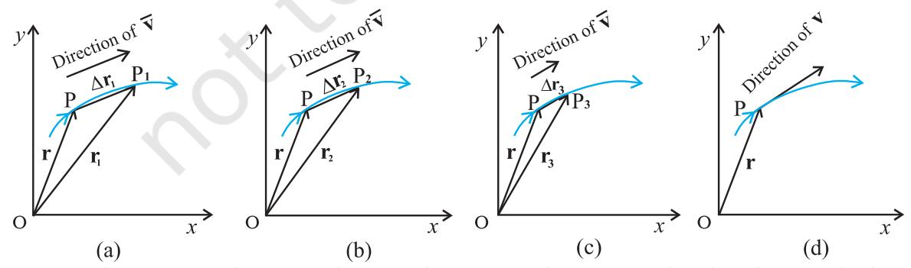
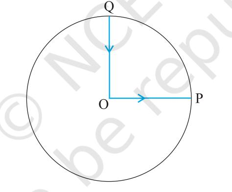

# MOTION IN A PLANE

- 3.1 Introduction
- 3.2 Scalars and vectors
- 3.3 Multiplication of vectors by real numbers
- 3.4 Addition and subtraction of vectors — graphical method
- 3.5 Resolution of vectors
- 3.6 Vector addition analytical method
- 3.7 Motion in a plane
- 3.8 Motion in a plane with constant acceleration
- 3.9 Projectile motion
- 3.10 Uniform circular motion

Summary Points to ponder Exercises

# 3.1 INTRODUCTION

In the last chapter we developed the concepts of position, displacement, velocity and acceleration that are needed to describe the motion of an object along a straight line. We found that the directional aspect of these quantities can be taken care of by + and – signs, as in one dimension only two directions are possible. But in order to describe motion of an object in two dimensions (a plane) or three dimensions (space), we need to use vectors to describe the abovementioned physical quantities. Therefore, it is first necessary to learn the language of vectors. What is a vector ? How to add, subtract and multiply vectors ? What is the result of multiplying a vector by a real number ? We shall learn this to enable us to use vectors for defining velocity and acceleration in a plane. We then discuss motion of an object in a plane. As a simple case of motion in a plane, we shall discuss motion with constant acceleration and treat in detail the projectile motion. Circular motion is a familiar class of motion that has a special significance in daily-life situations. We shall discuss uniform circular motion in some detail.

The equations developed in this chapter for motion in a plane can be easily extended to the case of three dimensions.

# 3.2 SCALARS AND VECTORS

In physics, we can classify quantities as scalars or vectors. Basically, the difference is that a direction is associated with a vector but not with a scalar. A scalar quantity is a quantity with magnitude only. It is specified completely by a single number, along with the proper unit. Examples are : the distance between two points, mass of an object, the temperature of a body and the time at which a certain event happened. The rules for combining scalars are the rules of ordinary algebra. Scalars can be added, subtracted, multiplied and divided just as the ordinary numbers*****. For example, if the length and breadth of a rectangle are 1.0 m and 0.5 m respectively, then its perimeter is the sum of the lengths of the four sides, 1.0 m + 0.5 m +1.0 m + 0.5 m = 3.0 m. The length of each side is a scalar and the perimeter is also a scalar. Take another example: the maximum and minimum temperatures on a particular day are 35.6 °C and 24.2 °C respectively. Then, the difference between the two temperatures is 11.4 °C. Similarly, if a uniform solid cube of aluminium of side 10 cm has a mass of 2.7 kg, then its volume is 10–3 m3 (a scalar) and its density is 2.7×103 kg m–3 (a scalar).

A **vector** quantity is a quantity that has both a magnitude and a direction and obeys the **triangle law of addition** or equivalently the **parallelogram law of addition**. So, a vector is specified by giving its magnitude by a number and its direction. Some physical quantities that are represented by vectors are displacement, velocity, acceleration and force.

To represent a vector, we use a bold face type in this book. Thus, a velocity vector can be represented by a symbol **v**. Since bold face is difficult to produce, when written by hand, a vector is often represented by an arrow placed over a letter, say r *v* . Thus, both **v** and r *v* represent the velocity vector. The magnitude of a vector is often called its absolute value, indicated by |**v**| = *v*. Thus, a vector is represented by a bold face, e.g. by **A, a, p, q, r, ... x, y**, with respective magnitudes denoted by light face *A, a, p, q, r, ... x, y*.

# **3.2.1 Position and Displacement Vectors**

To describe the position of an object moving in a plane, we need to choose a convenient point, say O as origin. Let P and P′ be the positions of the object at time *t* and *t*′, respectively [Fig. 3.1(a)]. We join O and P by a straight line. Then, **OP** is the position vector of the object at time *t*. An arrow is marked at the head of this line. It is represented by a symbol **r**, i.e. **OP** = **r**. Point P′ is represented by another position vector, **OP**′ denoted by **r**′. The length of the vector **r** represents the magnitude of the vector and its direction is the direction in which P lies as seen from O. If the object moves from P to P′, the vector **PP**′ (with tail at P and tip at P′) is called the **displacement vector** corresponding to motion from point P (at time *t*) to point P′ (at time *t*′).

**Fig. 3.1** (a) *Position and displacement vectors.* (b) *Displacement vector* **PQ** *and different courses of motion.*

It is important to note that displacement vector is the straight line joining the initial and final positions and does not depend on the actual path undertaken by the object between the two positions. For example, in Fig. 3.1(b), given the initial and final positions as P and Q, the displacement vector is the same **PQ** for different paths of journey, say PABCQ, PDQ, and PBEFQ. Therefore, the **magnitude of displacement is either less or equal to the path length of an object between two points***.* This fact was emphasised in the previous chapter also while discussing motion along a straight line.

#### **3.2.2 Equality of Vectors**

Two vectors **A** and **B** are said to be equal if, and only if, they have the same magnitude and the same direction.******

Figure 3.2(a) shows two equal vectors **A** and **B**. We can easily check their equality. Shift **B** parallel to itself until its tail Q coincides with that of *A*, i.e. Q coincides with O. Then, since their tips S and P also coincide, the two vectors are said to be equal. In general, equality is indicated

<b>* *Addition and subtraction of scalars make sense only for quantities with same units. However, you can multiply and divide scalars of different units.*

<b>** *In our study, vectors do not have fixed locations. So displacing a vector parallel to itself leaves the vector unchanged. Such vectors are called f*ree vectors. *However, in some physical applications, location or line of application of a vector is important. Such vectors are called* localised vectors.

*Fig. 3.2* (a) *Two equal vectors* A *and* B*.* (b) *Two vectors* A′ *and* B′ *are unequal though they are of the same length*.

as A = B. Note that in Fig. 3.2(b), vectors A′ and B′ have the same magnitude but they are not equal because they have different directions. Even if we shift B′ parallel to itself so that its tail Q′ coincides with the tail O′ of A′, the tip S′ of B′ does not coincide with the tip P′ of A′.

# 3.3 MULTIPLICATION OF VECTORS BY REAL NUMBERS

Multiplying a vector A with a positive number λ gives a vector whose magnitude is changed by the factor λ but the direction is the same as that of A :

$$\left|\,\lambda\,\mathbf{A}\,\right|=\lambda\,\left|\,\mathbf{A}\,\right|\,{\mathrm{~if~}}\lambda>0.$$

For example, if A is multiplied by 2, the resultant vector 2A is in the same direction as A and has a magnitude twice of |A| as shown in Fig. 3.3(a).

Multiplying a vector A by a negative number −λ gives another vector whose direction is opposite to the direction of A and whose magnitude is λ times |A|.

Multiplying a given vector A by negative numbers, say –1 and –1.5, gives vectors as shown in Fig 3.3(b).

The factor λ by which a vector A is multiplied could be a scalar having its own physical dimension. Then, the dimension of λ A is the product of the dimensions of λ and A. For example, if we multiply a constant velocity vector by duration (of time), we get a displacement vector.

# 3.4 ADDITION AND SUBTRACTION OF VECTORS — GRAPHICAL METHOD

As mentioned in section 4.2, vectors, by definition, obey the triangle law or equivalently, the parallelogram law of addition. We shall now describe this law of addition using the graphical method. Let us consider two vectors A and B that lie in a plane as shown in Fig. 3.4(a). The lengths of the line segments representing these vectors are proportional to the magnitude of the vectors. To find the sum A + B, we place vector B so that its tail is at the head of the vector A, as in Fig. 3.4(b). Then, we join the tail of A to the head of B. This line OQ represents a vector R, that is, the sum of the vectors A and B. Since, in this procedure of vector addition, vectors are

*Fig. 3.4* (a) *Vectors* A *and* B*.* (b) *Vectors* A *and* B *added graphically.* (c) *Vectors* B *and* A *added graphically.* (d) *Illustrating the associative law of vector addition.*

arranged head to tail, this graphical method is called the head-to-tail method. The two vectors and their resultant form three sides of a triangle, so this method is also known as triangle method of vector addition. If we find the resultant of B + A as in Fig. 3.4(c), the same vector R is obtained. Thus, vector addition is commutative:

  
  
**A + B = B + A**

The addition of vectors also obeys the associative law as illustrated in Fig. 3.4(d). The result of adding vectors A and B first and then adding vector C is the same as the result of adding B and C first and then adding vector A :

(A + B) + C = A + (B + C) (3.2)

What is the result of adding two equal and opposite vectors ? Consider two vectors A and –A shown in Fig. 3.3(b). Their sum is A + (–A). Since the magnitudes of the two vectors are the same, but the directions are opposite, the resultant vector has zero magnitude and is represented by 0 called a null vector or a zero vector :

  
  
**A - A = 0** **[**0**] = 0** **[**3.3**]**

Since the magnitude of a null vector is zero, its direction cannot be specified.

The null vector also results when we multiply a vector A by the number zero. The main properties of 0 are :

What is the physical meaning of a zero vector? Consider the position and displacement vectors in a plane as shown in Fig. 3.1(a). Now suppose that an object which is at P at time *t*, moves to P′ and then comes back to P. Then, what is its displacement? Since the initial and final positions coincide, the displacement is a "null vector".

Subtraction of vectors can be defined in terms of addition of vectors. We define the difference of two vectors A and B as the sum of two vectors A and –B :

  
  
**A - B = A + (-B)**

It is shown in Fig 3.5. The vector –B is added to vector A to get R2 = (A – B). The vector R1 = A + B is also shown in the same figure for comparison. We can also use the parallelogram method to find the sum of two vectors. Suppose we have two vectors A and B. To add these vectors, we bring their tails to a common origin O as shown in Fig. 3.6(a). Then we draw a line from the head of A parallel to B and another line from the head of B parallel to A to complete a parallelogram OQSP. Now we join the point of the intersection of these two lines to the origin O. The resultant vector R is directed from the common origin O along the diagonal (OS) of the parallelogram [Fig. 3.6(b)]. In Fig.3.6(c), the triangle law is used to obtain the resultant of A and B and we see that the two methods yield the same result. Thus, the two methods are ⊳

**Fig. 3.6** (a) *Two vectors* **A** *and* **B** *with their tails brought to a common origin.* (b) *The sum* **A** + **B** *obtained using the parallelogram method.* (c) *The parallelogram method of vector addition is equivalent to the triangle method.*

 **Example 3.1** Rain is falling vertically with a speed of 35 m s–1. Winds starts blowing after sometime with a speed of 12 m s–1 in east to west direction. In which direction should a boy waiting at a bus stop hold his umbrella ?

**Answer** The velocity of the rain and the wind are represented by the vectors **vr** and **vw** in Fig. 3.7 and are in the direction specified by the problem. Using the rule of vector addition, we see that the resultant of **vr** and **vw** is **R** as shown in the figure. The magnitude of **R** is

$$R={\sqrt{v_{r}^{2}+v_{w}^{2}}}={\sqrt{{35}^{2}+{12}^{2}}}\ \mathrm{m}\ \mathrm{s}^{-1}=37\ \mathrm{m}\ \mathrm{s}^{-1}$$

The direction θ that *R* makes with the vertical is given by

$$\tan\theta={\frac{v_{w}}{v_{r}}}={\frac{12}{35}}=0.343$$

Or, θ = tan ( ) = ° *- .* 1 0 343 19

Therefore, the boy should hold his umbrella in the vertical plane at an angle of about 19o with the vertical towards the east. ⊳

#### **3.5 RESOLUTION OF VECTORS**

Let **a** and **b** be any two non-zero vectors in a plane with different directions and let **A** be another vector in the same plane (Fig. 3.8). **A** can be expressed as a sum of two vectors — one obtained by multiplying **a** by a real number and the other obtained by multiplying **b** by another real number. To see this, let O and P be the tail and head of the vector **A**. Then, through O, draw a straight line parallel to **a**, and through P, a straight line parallel to **b**. Let them intersect at Q. Then, we have

A = OP = OQ + QP (3.6)

But since **OQ** is parallel to **a**, and **QP** is parallel to **b**, we can write :

  
  
**OQ = $\lambda$ a, and QP = $\mu$ b** (3.7)

where λand *µ* are real numbers.

Therefore, **A** = λ**a** + *µ* **b** (3.8)

We say that **A** has been resolved into two component vectors λ **a** and µ**b** along **a** and **b** respectively. Using this method one can resolve a given vector into two component vectors along a set of two vectors – all the three lie in the same plane. It is convenient to resolve a general vector along the axes of a rectangular coordinate system using vectors of unit magnitude. These are called unit vectors that we discuss now. A unit vector is a vector of unit magnitude and points in a particular direction. It has no dimension and unit. It is used to specify a direction only. Unit vectors along the *x*-, *y-* and *z*-axes of a rectangular coordinate system are

denoted by ɵ i, ɵ j and kˆ , respectively, as shown in Fig. 3.9(a).

Since these are unit vectors, we have

  
  
**i** = |j| = |k| = 1 (3.9)

These unit vectors are perpendicular to each other. In this text, they are printed in bold face with a cap (^) to distinguish them from other vectors. Since we are dealing with motion in two dimensions in this chapter, we require use of only two unit vectors. If we multiply a unit vector,

say nˆ by a scalar, the result is a vector

λ= λnˆ . In general, a vector A can be written as

  
  
**A = |A| $\bf\hat{n}$**  
  
**(3.10)**

where nˆ is a unit vector along A.

We can now resolve a vector A in terms of component vectors that lie along unit vectors

i ˆ and ɵ j. Consider a vector A that lies in *x-y* plane as shown in Fig. 3.9(b). We draw lines from the head of A perpendicular to the coordinate axes as in Fig. 3.9(b), and get vectors A1 and A2

such that A1 + A2 = A. Since A1 is parallel to ɵ i and A2 is parallel to ɵ j, we have :

$\bf A_{1}=A_{x}\bf\hat{i}$, $\bf A_{2}=A_{y}\bf\hat{j}$ (3.11)

where *Ax*  and *Ay* are real numbers.

Thus, $\bf A=A_{x}\bf\hat{i}+A_{y}\bf\hat{j}$ (3.12)

This is represented in Fig. 3.9(c). The quantities *Ax*  and *Ay*  are called *x-*, and *y-* components of the vector A. Note that *Ax* is itself not a vector, but

*Ax* ɵ i is a vector, and so is *Ay*  ɵ j. Using simple trigonometry, we can express *Ax*  and *Ay* in terms of the magnitude of A and the angle θ it makes with the *x*-axis :

$A_{x}=A$ cos $\theta$  
  
$A_{y}=A$ sin $\theta$

As is clear from Eq. (3.13), a component of a vector can be positive, negative or zero depending on the value of θ.

Now, we have two ways to specify a vector A in a plane. It can be specified by :

- (i) its magnitude *A* and the direction θ it makes with the *x*-axis; or
- (ii) its components *Ax* and *Ay*

If A and θ are given, *Ax*  and *Ay*  can be obtained using Eq. (3.13). If *Ax*  and *Ay*  are given, *A* and θcan be obtained as follows :

$$\begin{array}{l}\mbox{A_{x}^{2}+A_{y}^{2}=A^{2}\cos^{2}\theta+A^{2}\sin^{2}\theta}\\ \mbox{=A^{2}}\\ \mbox{Or,}\hskip28.452756pt\mbox{A=\sqrt{A_{x}^{2}+A_{y}^{2}}}\end{array}\tag{3.14}$$

And $\tan\theta$= $\frac{A_{y}}{A_{x}}$, $\theta$= $\tan^{-1}\frac{A_{y}}{A_{x}}$ (3.15)

*Fig. 3.9* (a) *Unit vectors* ɵ i *,*  ɵ j and ɵk *lie along the x-, y-, and z-axes.* (b) *A vector* A *is resolved into its components Ax and Ay along x-, and y- axes.* (c) A1  *and* A2 *expressed in terms of* ɵ i *and* ɵ j*.*

So far we have considered a vector lying in an *x-y* plane. The same procedure can be used to resolve a general vector A into three components along *x-*, *y-,* and *z*-axes in three dimensions. If α, β, and γ are the angles* between A and the *x*-, *y*-, and *z*-axes, respectively [Fig. 3.9(d)], we have

*Fig. 3.9* (d) *A vector* A *resolved into components along x-, y-, and z-axes*

$\mathbf{A_{x}=A\cos\alpha,\ A_{y}=A\cos\beta,\ A_{z}=A\cos\gamma\ (3.16a)}$  
  
In general, we have 

ˆ ˆ ˆ A i j k = + + *A A A x y z* (3.16b)

The magnitude of vector $\mathbf{A}$ is  
  

$$\mathbf{A}=\sqrt{\mathbf{A}_{x}^{2}+\mathbf{A}_{y}^{2}+\mathbf{A}_{z}^{2}}\tag{3.16c}$$

A position vector r can be expressed as

$\mathbf{r}=x\,\hat{\mathbf{i}}+y\,\hat{\mathbf{j}}+z\,\hat{\mathbf{k}}$ (8.17)

where *x, y*, and *z* are the components of r along *x-, y-, z-*axes, respectively.

# 3.6 VECTOR ADDITION – ANALYTICAL METHOD

Although the graphical method of adding vectors helps us in visualising the vectors and the resultant vector, it is sometimes tedious and has limited accuracy. It is much easier to add vectors by combining their respective components. Consider two vectors A and B in *x*-*y* plane with components *Ax* , *Ay* and *Bx* , *By* :

$\mathbf{A}=A_{x}\mathbf{i}+A_{y}\mathbf{j}$ (3.18)

$${\dot{\mathbf{B}}}=B_{x}{\hat{\mathbf{i}}}+B_{y}{\hat{\mathbf{j}}}$$

Let R be their sum. We have

$\mathbf{R}=\mathbf{A}+\mathbf{B}$  
  

$$=\left(A_{x}\hat{\mathbf{i}}+A_{y}\hat{\mathbf{j}}\right)+\left(B_{x}\hat{\mathbf{i}}+B_{y}\hat{\mathbf{j}}\right)\tag{3.19a}$$

Since vectors obey the commutative and associative laws, we can arrange and regroup the vectors in Eq. (3.19a) as convenient to us :

$\mathbf{R}=\left(A_{x}+B_{x}\right)\mathbf{i}+\left(A_{y}+B_{y}\right)\mathbf{j}$ (3.19b)

Since ${\bf R}=R_{x}\hat{\bf i}+R_{y}\hat{\bf j}$ (3.20)

we have, *R A B , R A B x x x y y y* = + = + (3.21)

Thus, each component of the resultant vector R is the sum of the corresponding components of A and B.

In three dimensions, we have

$\mathbf{A}=A_{x}\hat{\mathbf{i}}+A_{y}\hat{\mathbf{j}}+A_{z}\hat{\mathbf{k}}$  
  
$\mathbf{B}=B_{x}\hat{\mathbf{i}}+B_{y}\hat{\mathbf{j}}+B_{z}\hat{\mathbf{k}}$  
  
$\mathbf{R}=\mathbf{A}+\mathbf{B}=R_{x}\hat{\mathbf{i}}+R_{y}\hat{\mathbf{j}}+R_{z}\hat{\mathbf{k}}$

with $R_{x}=A_{x}+B_{x}$  
  
$R_{y}=A_{y}+B_{y}$  
  
$R_{z}=A_{z}+B_{z}$

This method can be extended to addition and subtraction of any number of vectors. For example, if vectors a, b and c are given as

$\mathbf{a}=a_{x}\hat{\mathbf{i}}+a_{y}\hat{\mathbf{j}}+a_{z}\hat{\mathbf{k}}$  
  
$\mathbf{b}=b_{x}\hat{\mathbf{i}}+b_{y}\hat{\mathbf{j}}+b_{z}\hat{\mathbf{k}}$  
  
$\mathbf{c}=c_{x}\hat{\mathbf{i}}+c_{y}\hat{\mathbf{j}}+c_{z}\hat{\mathbf{k}}$ (3.23a)

then, a vector T = a + b – c has components :

$T_{x}=a_{x}+b_{x}-c_{x}$  
  
$T_{y}=a_{y}+b_{y}-c_{y}$  
  
$T_{z}=a_{z}+b_{z}-c_{z}$.  
  

⊳ *Example 3.2* Find the magnitude and direction of the resultant of two vectors A and B in terms of their magnitudes and angle θbetween them.

* <i>Note that angles α*,* β*, and* γ *are angles in space. They are between pairs of lines, which are not coplanar.*

*Answer* Let OP and O**Q** represent the two vectors A and B making an angle θ (Fig. 3.10). Then, using the parallelogram method of vector addition, OS represents the resultant vector R :

R = A + B

*SN* is normal to *OP* and *PM* is normal to *OS*. From the geometry of the figure,

> *OS2* = *ON2* + *SN2*

- but *ON* = *OP* + *PN* = *A* + *B* cos θ *SN* = *B* sin θ *OS2* = (*A* + *B* cos θ) 2 + (*B* sin θ) 2
or, *R2* = *A2* + *B2* + 2*AB* cos

$R=\sqrt{A^{2}+B^{2}+2AB\cos\theta}$ (3.24a)

In ∆ OSN, *SN* = *OS* sinα = *R* sinα, and in ∆ PSN, *SN* = *PS* sin θ = *B* sin θ

Therefore, *R* sin α = *B* sin θ

or, $\frac{R}{\sin\theta}=\frac{B}{\sin\alpha}$ (3.24b)

Similarly,

PM = $A$ sin $\alpha$ = $B$ sin $\beta$

or, $\frac{A}{\sin\beta}=\frac{B}{\sin\alpha}$ (3.24c)

Combining Eqs. (3.24b) and (3.24c), we get

*R A* sin sin sin θ β α = = B (3.24d)

θ

Using Eq. (3.24d), we get:

$\sin\alpha=\sin\theta$ (3.24e)

where *R* is given by Eq. (3.24a).

or, $\tan\alpha=\frac{\text{SN}}{\text{OP}+\text{PN}}=\frac{\text{Bsin}\,\theta}{\text{A}+\text{Bcos}\,\theta}$ (3.24f)

Equation (3.24a) gives the magnitude of the resultant and Eqs. (3.24e) and (3.24f) its direction. Equation (3.24a) is known as the Law of cosines and Eq. (3.24d) as the Law of sines. ⊳

*Answer* The vector vb representing the velocity of the motorboat and the vector vc representing the water current are shown in Fig. 3.11 in directions specified by the problem. Using the parallelogram method of addition, the resultant R is obtained in the direction shown in the figure.

We can obtain the magnitude of R using the Law of cosine :

$R=\sqrt{v_{\rm b}^{2}+v_{\rm c}^{2}+2v_{\rm b}v_{\rm c}\cos120^{\circ}}$  
  
$=\sqrt{25^{2}+10^{2}+2\times25\times10(-1/2)}\equiv22$ km/h  
  
To obtain the direction, we apply the Law of sines.  
  

*R vc* sin sin θ φ = or, sin φ θ = *v R c* sin = 10 sin120 21.8 10 3 2 21.8 0.397 × = × ≅ - φ ≅ 23.4-⊳

#### 3.7 MOTION IN A PLANE

In this section we shall see how to describe motion in two dimensions using vectors.

The position vector r of a particle P located in a plane with reference to the origin of an *x-y* reference frame (Fig. 3.12) is given by

r i j = + *x y* ɵ ɵ

where *x* and *y* are components of r along *x*-, and *y*- axes or simply they are the coordinates of the object.

(b) *Fig. 3.12* (a) *Position vector* r*.* (b) *Displacement* ∆r *and average velocity* v *of a particle.*

Suppose a particle moves along the curve shown by the thick line and is at P at time *t* and P′ at time *t*′ [Fig. 3.12(b)]. Then, the displacement is :

∆r = r′ – r (3.25) and is directed from P to P′.

We can write Eq. (3.25) in a component form:

$$\begin{array}{r l}{{\hat{\mathbf{r}}}}&{{}=\left(x^{\prime}{\hat{\mathbf{i}}}+y^{\prime}{\hat{\mathbf{j}}}\right)-\left(x{\hat{\mathbf{i}}}+\mathbf{y}\ {\hat{\mathbf{j}}}\right)}\\ {\ }&{{}{\hat{\mathbf{i}}}\Delta x+{\hat{\mathbf{j}}}\Delta y}\end{array}$$

where $\Delta x=x^{\prime}-x$, $\Delta y=y^{\prime}-y$ (3.26)

# Velocity

Or,

The average velocity (v) of an object is the ratio of the displacement and the corresponding time interval :

$$\begin{array}{c}\includegraphics[width=140.0pt]{fig1}\end{array}$$

Since v r = ∆ ∆*t* , the direction of the average velocity

is the same as that of ∆r (Fig. 3.12). The velocity (instantaneous velocity) is given by the limiting value of the average velocity as the time interval approaches zero :

$\mathbf{v}=\lim\limits_{\Delta t\to0}\frac{\Delta\mathbf{r}}{\Delta t}=\frac{\mathrm{d}\mathbf{r}}{\mathrm{d}t}$ (3.28)

The meaning of the limiting process can be easily understood with the help of Fig 3.13(a) to (d). In these figures, the thick line represents the path of an object, which is at P at time *t*. P1 , P2 and P3 represent the positions of the object after times ∆*t* 1 ,∆*t* 2 , and ∆*t* 3 . ∆r1 , ∆r2 , and ∆r3 are the displacements of the object in times ∆*t* 1 , ∆*t* 2 , and

∆*t* 3 , respectively. The direction of the average velocity v is shown in figures (a), (b) and (c) for three decreasing values of ∆*t*, i.e. ∆*t* 1 ,∆*t* 2 , and ∆*t* 3 , (∆*t* 1 > ∆*t* 2 > ∆*t* 3 ). As ∆*t* → 0, ∆**r** → 0 and is along the tangent to the path [Fig. 3.13(d)]. Therefore, **the direction of velocity at any point on the path of an object is tangential to the path at that point and is in the direction of motion**.

We can express **v** in a component form :

$$\mathbf{v}=\frac{\mathrm{d}\mathbf{r}}{\mathrm{d}t}$$
 
$$\cdot$$
 
$$=\lim_{\Delta t\to0}\left(\frac{\Delta x}{\Delta t}\hat{\mathbf{i}}+\frac{\Delta y}{\Delta t}\hat{\mathbf{j}}\right)\tag{3.29}$$
 
$$=\hat{\mathbf{i}}\lim_{\Delta t\to0}\frac{\Delta x}{\Delta t}+\hat{\mathbf{j}}\lim_{\Delta t\to0}\frac{\Delta y}{\Delta t}$$
 
$$\cdot$$
 
$$\mathbf{v}=\hat{\mathbf{i}}\frac{\mathrm{d}x}{\mathrm{d}t}+\hat{\mathbf{j}}\frac{\mathrm{d}y}{\mathrm{d}t}=v_{x}\hat{\mathbf{i}}+v_{y}\hat{\mathbf{j}}.$$
 
$$\cdot$$
 
$$\mathbf{v}_{x}=\frac{\mathrm{d}x}{\mathrm{d}t},v_{y}=\frac{\mathrm{d}y}{\mathrm{d}t}\tag{3.30a}$$

So, if the expressions for the coordinates *x* and *y* are known as functions of time, we can use these equations to find *vx* and *vy* .

The magnitude of **v** is then

$\upsilon=\sqrt{\upsilon_{x}^{2}+\upsilon_{y}^{2}}$ (3.30b)

and the direction of **v** is given by the angle θ :

$\tan\theta=\frac{\upsilon_{y}}{\upsilon_{x}}$, $\theta=\tan^{-1}\left(\frac{\upsilon_{y}}{\upsilon_{x}}\right)$

*vx , vy* and angle θ are shown in Fig. 3.14 for a velocity vector **v** at point **p**.

#### **Acceleration**

The **average acceleration****a** of an object for a time interval ∆*t* moving in *x-y* plane is the change in velocity divided by the time interval :

$$\mathbf{a}=\frac{\Delta\mathbf{v}}{\Delta t}=\frac{\Delta\mathbf{v}_{x}\mathbf{i}+\mathbf{v}_{y}\mathbf{j}}{\Delta t}=\frac{\Delta\mathbf{v}_{x}\mathbf{i}+\frac{\Delta\mathbf{v}_{y}}{\Delta t}\mathbf{j}}{\Delta t}\tag{3.31a}$$

Or, $\dot{\bf a}=a_{x}\dot{\bf i}+a_{y}\dot{\bf j}$. (3.31b)

* *In terms of x and y, ax and ay can be expressed as*

$a_{x}=\frac{d}{dt}\left(\frac{dx}{dt}\right)=\frac{d^{2}x}{dt^{2}}$, $a_{y}=\frac{d}{dt}\left(\frac{dy}{dt}\right)=\frac{d^{2}y}{dt^{2}}$.  
  

**Fig. 3.14** *The components vx and vy of velocity* **v** *and the angle* θ *it makes with x-axis. Note that vx = v* cos θ**,** *vy = v* sin θ.

The **acceleration** (instantaneous acceleration) is the limiting value of the average acceleration as the time interval approaches zero :

* [10] M. C. Gonzalez-Garcia, M. C. Gonzalez-Garcia, M.  
  

Since ∆ ∆ ∆ *v* = + *v v , x y* ɵ ɵ i j we have

$${\bf a}={\bf i}\,\,l t m\,\,{\frac{\Delta v_{x}}{\Delta t\to0\,\,\,\Delta t}}+{\bf j}\,\,l t m\,\,{\frac{\Delta v_{y}}{\Delta t\to0\,\,\,\Delta t}}$$

Or, $\dot{\bf a}=a_{x}\dot{\bf i}+a_{y}\dot{\bf j}$ (3.32b)

where, *a v t , a v t x x y y* = = d d d d (3.32c)*

As in the case of velocity, we can understand graphically the limiting process used in defining acceleration on a graph showing the path of the object's motion. This is shown in Figs. 3.15(a) to (d). P represents the position of the object at time *t* and P1 , P2 , P3 positions after time ∆*t* 1 , ∆*t* 2 , ∆*t* 3 , respectively (∆*t* 1 > ∆*t* 2 >∆*t* 3 ). The velocity vectors at points P, P1 , P2 , P3 are also shown in Figs. 3.15 (a), (b) and (c). In each case of ∆*t*, ∆**v** is obtained using the triangle law of vector addition. By definition, the direction of average acceleration is the same as that of ∆**v**. We see that as ∆*t* decreases, the direction of ∆**v** changes and consequently, the direction of the acceleration changes. Finally, in the limit ∆*t* g0 [Fig. 3.15(d)], the average acceleration becomes the instantaneous acceleration and has the direction as shown.

*Fig. 3.15 The average acceleration for three time intervals* (a) ∆*t1 ,* (b) ∆*t2 , and* (c) ∆*t3 , (*∆*t1>* ∆*t2>* ∆*t3 ).* (d) *In the limit* ∆*t* g*0, the average acceleration becomes the acceleration.*

Note that in one dimension, the velocity and the acceleration of an object are always along the same straight line (either in the same direction or in the opposite direction). However, for motion in two or three dimensions, velocity and acceleration vectors may have any angle between 0° and 180° between them.

  
  
**Example 3.4** The position of a particle is given by

 **r i j k** = + + 3.0*t* ˆ . ˆ . 2 0 5 0 ˆ 2 *t*

where *t* is in seconds and the coefficients have the proper units for r to be in metres. (a) Find v(*t*) and a(*t*) of the particle. (b) Find the magnitude and direction of v(*t*) at *t* = 1.0 s.

*Answer*

$\mathbf{v}(t)=\frac{\mathrm{dr}}{\mathrm{dt}}=\frac{\mathrm{d}}{\mathrm{dt}}\left(3.0\ t\dot{\mathbf{i}}+2.0t^{2}\dot{\mathbf{j}}+5.0\dot{\mathbf{k}}\right)$  
  
$\mathbf{i}=3.0\dot{\mathbf{i}}+4.0\dot{\mathbf{j}}$  
  
$\mathbf{a}\ (t)=\frac{\mathrm{dv}}{\mathrm{dt}}=+4.0\dot{\mathbf{j}}$  
  
$\mathbf{d}t$  
  
$\mathbf{a}=4.0\ \mathrm{m}\ \mathrm{s}^{-2}$ along $y$- direction 

$${\mathrm{At~}}\ t=1.0{\mathrm{~s}},{\mathrm{~}}{\bf{v}}=3.0{\hat{\bf{i}}}+4.0{\hat{\bf{j}}}$$

It's magnitude is 2 2 -1 *v* = 3 4 5.0 m s + = and direction is

$\theta=\tan^{-1}\left(\frac{\upsilon_{y}}{\upsilon_{x}}\right)=\tan^{-1}\left(\frac{4}{3}\right)=53^{\circ}$ with $x$-axis.  
  

# 3.8 MOTION IN A PLANE WITH CONSTANT ACCELERATION

Suppose that an object is moving in *x-y* plane and its acceleration a is constant. Over an interval of time, the average acceleration will equal this constant value. Now, let the velocity of the object be v0 at time *t* = 0 and v at time *t*. Then, by definition

$$\mathbf{a}=\frac{\mathbf{v}-\mathbf{v}_{0}}{t-0}=\frac{\mathbf{v}-\mathbf{v}_{0}}{t}$$
  
  
Or, $\mathbf{v}=\mathbf{v}_{0}+\mathbf{a}t$ (3.33a)

In terms of components :

$\upsilon_{x}=\upsilon_{\alpha x}+a_{x}t$  
  
$\upsilon_{y}=\upsilon_{\alpha y}+a_{y}t$  
  
(3.33b)

Let us now find how the position r changes with time. We follow the method used in the onedimensional case. Let ro and r be the position vectors of the particle at time 0 and *t* and let the velocities at these instants be vo and v. Then, over this time interval *t*, the average velocity is (vo + v)/2. The displacement is the average velocity multiplied by the time interval :

$\mathbf{r-r_{0}=\left(\frac{\mathbf{v+v_{0}}}{2}\right)t=\left(\frac{\left(\mathbf{v_{0}+at}\right)+\mathbf{v_{0}}}{2}\right)t}$.  
  
$\mathbf{=v_{0}t+\frac{1}{2}at^{2}}$

Or, $\bf r=r_{0}+v_{0}t+\frac{1}{2}at^{2}$ (3.34a)

It can be easily verified that the derivative of Eq. (3.34a), i.e. d d r *t* gives Eq.(3.33a) and it also satisfies the condition that at *t*=0, **r** = **ro** . Equation (3.34a) can be written in component form as

$\chi=\chi_{0}+\upsilon_{\alpha\!x}t+\frac{1}{2}a_{x}t^{2}$  
  
$\chi=\chi_{0}+\upsilon_{\alpha\!x}t+\frac{1}{2}a_{x}t^{2}$  
  
$\chi=\chi_{0}+\upsilon_{\alpha\!x}t+\frac{1}{2}a_{x}t^{2}$  
  
$\chi=\chi_{0}+\upsilon_{\alpha\!x}t+\frac{1}{2}a_{x}t^{2}$  
  
$\chi=\chi_{0}+\upsilon_{\alpha\!x}t+\frac{1}{2}a_{x}t^{2}$  

One immediate interpretation of Eq.(3.34b) is that the motions in *x*- and *y-*directions can be treated independently of each other. That is, **motion in a plane (two-dimensions) can be treated as two separate simultaneous one-dimensional motions with constant acceleration along two perpendicular directions**.This is an important result and is useful in analysing motion of objects in two dimensions*.* A similar result holds for three dimensions. The choice of perpendicular directions is convenient in many physical situations, as we shall see in section 3.9 for projectile motion.

⊳ **Example 3.5** A particle starts from origin at *t* = 0 with a velocity 5.0 **î** m/s and moves in *x*-*y* plane under action of a force which produces a constant acceleration of (3.0**i** ɵ+2.0**j** ɵ ) m/s 2 . (a) What is the *y*-coordinate of the particle at the instant its *x*-coordinate is 84 m ? (b) What is the speed of the particle at this time ?

**Answer** From Eq. (3.34a) for **r0** = 0, the position of the particle is given by

$$\mathbf{r}\left(t\right)=\mathbf{v_{0}}t+{\frac{1}{2}}\mathbf{a}t^{2}$$
 
$$=5.0\mathbf{\hat{i}}\,t+(1/2){\left(3.0\mathbf{\hat{i}}+2.0\mathbf{\hat{j}}\right)\,t^{2}}$$

( ) 2 ˆ ˆ2 = + + 5.0 1.5 1.0 *t t t* i j Therefore, ( ) 2 *x t t t* = + 5.0 1.5 ( ) 2 *y t t* = +1.0 Given *x* (*t*) = 84 m, *t* = ? 5.0 *t* + 1.5 *t* 2 = 84 ⇒ *t* = 6 s At *t* = 6 s, *y* = 1.0 (6)2 = 36.0 m Now, the velocity ( ) d 5.0 3.0 2.0 ˆ ˆ d *t t t* = = + + r v i j At *t* = 6 s, v i j = + 23. ɵ ɵ 0 12.0 speed 2 2 1 23 12 26 m s− = = + ≅ v . ⊳

# **3.9 PROJECTILE MOTION**

As an application of the ideas developed in the previous sections, we consider the motion of a projectile. An object that is in flight after being thrown or projected is called a **projectile**. Such a projectile might be a football, a cricket ball, a baseball or any other object. The motion of a projectile may be thought of as the result of two separate, simultaneously occurring components of motions. One component is along a horizontal direction without any acceleration and the other along the vertical direction with constant acceleration due to the force of gravity. It was Galileo who first stated this independency of the horizontal and the vertical components of projectile motion in his **Dialogue on the great world systems** (1632).

In our discussion, we shall assume that the air resistance has negligible effect on the motion of the projectile. Suppose that the projectile is launched with velocity **v**o that makes an angle θo with the *x*-axis as shown in Fig. 3.16.

After the object has been projected, the acceleration acting on it is that due to gravity which is directed vertically downward:

$\bf a=-g\bf j$  
  
Or, $a_{x}=0$, $a_{y}=-g$ (3.35)

The components of initial velocity **vo** are :

$V_{\alpha\!x}=V_{\alpha}$cos $\theta_{\alpha}$  
  
$V_{\alpha\!y}=V_{\alpha}$sin $\theta_{\alpha}$

**Fig 3.16** *Motion of an object projected with velocity* **v***o at angle* θ*0* .

If we take the initial position to be the origin of the reference frame as shown in Fig. 3.16, we have :

$$X_{o}=0,\,Y_{o}=0$$

Then, Eq.(3.34b) becomes :

*x* = *vox t* = (*vo* cos θ*o*  ) *t* and *y* = (*vo* sin θ) *t* – ( ½ )*g t*2 (3.37)

*o*

The components of velocity at time *t* can be obtained using Eq.(3.33b) :

$V_{x}=V_{ax}=V_{o}\cos\theta_{o}$  
  
$V_{y}=V_{o}\sin\theta_{o}-g\,t$ (3.38)

Equation (3.37) gives the *x*-, and *y*-coordinates of the position of a projectile at time *t* in terms of two parameters — initial speed *v*o and projection angle θo *.* Notice that the choice of mutually perpendicular *x*-, and *y*-directions for the analysis of the projectile motion has resulted in a simplification. One of the components of velocity, i.e. *x*-component remains constant throughout the motion and only the *y*- component changes, like an object in free fall in vertical direction. This is shown graphically at few instants in Fig. 3.17. Note that at the point of maximum height, *vy* = 0 and therefore,

$$\theta=\tan^{\cdot1}{\frac{v_{y}}{v_{x}}}=0$$

# **Equation of path of a projectile**

What is the shape of the path followed by the projectile? This can be seen by eliminating the time between the expressions for *x* and *y* as given in Eq. (3.37). We obtain:

$$y=\left(\tan\,\theta_{\circ}\right)x-{\frac{g}{2\,\left(v_{\circ}\cos\theta_{\circ}\right)^{2}}}x^{2}\qquad(3.39)$$

Now, since *g*, θo and *v*o are constants, Eq. (3.39) is of the form *y = a x + b x*2 , in which *a* and *b* are constants. This is the equation of a parabola, i.e. the path of the projectile is a parabola (Fig. 3.17).

**Fig. 3.17** *The path of a projectile is a parabola.*

#### **Time of maximum height**

How much time does the projectile take to reach the maximum height ? Let this time be denoted by *tm* . Since at this point, *vy =* 0, we have from Eq. (3.38):

$V_{y}=V_{o}\sin\theta_{o}-g\ t_{m}=0$  
  
Or, $t_{m}=V_{o}\sin\theta_{o}/g$ (3.40a)

The total time *Tf* during which the projectile is in flight can be obtained by putting *y* = 0 in Eq. (3.37). We get :

$T_{f}=2$ ($v_{o}$ sin $\theta_{o}$)/g (3.40b)

*Tf* is known as the **time of flight** of the projectile. We note that *Tf* = 2 *tm*  , which is expected because of the symmetry of the parabolic path.

#### **Maximum height of a projectile**

The maximum height *hm* reached by the projectile can be calculated by substituting *t = tm* in Eq. (3.37) :

$$y=h_{m}=\left(v_{0}\sin\theta_{0}\right)\left(\frac{v_{0}\sin\theta_{0}}{g}\right)-\frac{g}{2}\left(\frac{v_{0}\sin\theta_{0}}{g}\right)^{2}$$
  
  

$$\cdot$$
  
  

$$h_{m}=\frac{\left(v_{0}\sin\theta_{0}\right)^{2}}{2g}\tag{3.41}$$

#### **Horizontal range of a projectile**

The horizontal distance travelled by a projectile from its initial position (*x = y =* 0*)* to the position where it passes *y* = 0 during its fall is called the **horizontal** **range**, *R*. It is the distance travelled during the time of flight *Tf* . Therefore, the range *R* is

$R=(v_{o}\cos\ \theta_{o})\ (T_{f})$  
  
$=(v_{o}\cos\ \theta_{o})\ (2\ v_{o}\sin\ \theta_{o})/g$  
  
$\cdot$  
  
Or, $R=\frac{v_{0}^{2}\ \sin2\theta_{0}}{g}$ (3.42a)

Equation (3.42a) shows that for a given projection velocity *v*o , *R* is maximum when sin 2θ0 is maximum, i.e., when θ0 = 450 .

The maximum horizontal range is, therefore,

$R_{m}=\frac{\upsilon_{0}^{2}}{g}$ (3.42b)

**Example 3.6** Galileo, in his book **Two new sciences,** stated that "for elevations which exceed or fall short of 45° by equal amounts, the ranges are equal". Prove this statement.

**Answer** For a projectile launched with velocity **vo** at an angle θo , the range is given by

$$R={\frac{v_{o}^{2}\sin2\theta_{0}}{g}}$$

Now, for angles, (45° + α) and ( 45° – α), 2θo is (90° + 2α) and ( 90° – 2α) , respectively. The values of sin (90° + 2α) and sin (90° – 2α) are the same, equal to that of cos 2α. Therefore, ranges are equal for elevations which exceed or fall short of 45° by equal amounts α. ⊳

⊳ **Example 3.7** A hiker stands on the edge of a cliff 490 m above the ground and throws a stone horizontally with an initial speed of 15 m s-1. Neglecting air resistance, find the time taken by the stone to reach the ground, and the speed with which it hits the ground. (Take *g* = 9.8 m s-2 ).

**Answer** We choose the origin of the *x*-,and *y*axis at the edge of the cliff and *t* = 0 s at the instant the stone is thrown. Choose the positive direction of *x*-axis to be along the initial velocity and the positive direction of *y*-axis to be the vertically upward direction. The *x*-, and *y*components of the motion can be treated independently. The equations of motion are :

$$x\,(t)\ =X_{o}+V_{\alpha\alpha}\,t$$

*y (t) = yo + voy t +*(1/2) *a y t2* Here, *x*o  *= y*o = 0, *v*oy = 0, *a y = –g* = –9.8 m s-2 *, v*ox = 15 m s-1 .

The stone hits the ground when *y(t)* = – 490 m. – 490 m = –(1/2)(9.8) *t* 2 .

This gives *t* =10 s.

The velocity components are *vx = vox*  and *vy = voy – g t*

so that when the stone hits the ground :

$$\begin{array}{l l}{{V_{o x}=15\mathrm{~m}\mathrm{~s}^{-1}}}\\ {{V_{o y}=0-9.8}}&{{10=-98\mathrm{~m}\mathrm{~s}^{-1}}}\end{array}$$

Therefore, the speed of the stone is

$${\sqrt{v_{x}^{2}+v_{y}^{2}}}={\sqrt{15^{2}+98^{2}}}=99{\textrm{m s}}^{-1}$$

⊳ **Example 3.8** A cricket ball is thrown at a speed of 28 m s–1 in a direction 30° above the horizontal. Calculate (a) the maximum height, (b) the time taken by the ball to return to the same level, and (c) the distance from the thrower to the point where the ball returns to the same level.

  
  
**Answer** (a) The maximum height is given by 

( ) ( ) ( ) 2 2 o sin 28sin 30 m 2 2 9.8 *0 m v h g* θ ° = = = × × = 14 14 2 9.8 10.0 m

(b) The time taken to return to the same level is *Tf* = (2 *v*o sin θo )/*g* = (2× 28 × sin 30° )/9.8 = 28/9.8 s = 2.9 s

(c) The distance from the thrower to the point where the ball returns to the same level is

$$R{=}\frac{\left(v_{\mathrm{o}}^{2}\mathrm{sin}\,2\theta_{\mathrm{o}}\right)}{g}=\frac{28\times28\times\sin60^{o}}{9.8}=69\ \mathrm{m}\qquad\triangleleft$$

#### **3.10 UNIFORM CIRCULAR MOTION**

When an object follows a circular path at a constant speed, the motion of the object is called **uniform circular motion**. The word "uniform" refers to the speed, which is uniform (constant) throughout the motion. Suppose an object is moving with uniform speed *v* in a circle of radius *R* as shown in Fig. 3.18. Since the velocity of the object is changing continuously in direction, the object undergoes acceleration. Let us find the magnitude and the direction of this acceleration.

⊳

*Fig. 3.18 Velocity and acceleration of an object in uniform circular motion. The time interval* ∆*t decreases from (a) to (c) where it is zero. The acceleration is directed, at each point of the path, towards the centre of the circle.*

Let r and r′ be the position vectors and v and v′ the velocities of the object when it is at point *P* and *P*′ as shown in Fig. 3.18(a). By definition, velocity at a point is along the tangent at that point in the direction of motion. The velocity vectors v and v′ are as shown in Fig. 3.18(a1). ∆v is obtained in Fig. 3.18 (a2) using the triangle law of vector addition. Since the path is circular, v is perpendicular to r and so is v′ to r′. Therefore, ∆v is perpendicular to ∆r. Since

average acceleration is along ∆v a v = ∆ ∆*t*

$$\Delta\mathbf{v}\,\left[{\boldsymbol{\frac{\mathbf{a}}{\mathbf{a}}}}={\frac{\Delta\mathbf{v}}{\Delta t}}\right],{\mathrm{~the}}$$

average acceleration a is perpendicular to ∆r. If we place ∆v on the line that bisects the angle between r and r′, we see that it is directed towards the centre of the circle. Figure 3.18(b) shows the same quantities for smaller time interval. ∆v and hence a is again directed towards the centre. In Fig. 3.18(c), ∆*t*é 0 and the average acceleration becomes the instantaneous acceleration. It is directed towards the centre*. Thus, we find that the acceleration of an object in uniform circular motion is always directed towards the centre of the circle. Let us now find the magnitude of the acceleration.

The magnitude of a is, by definition, given by

$$\mathbf{a}|=\operatorname*{det}{\stackrel{l i m}{\to}}0\,{\frac{|\Delta\mathbf{v}|}{\Delta t}}$$

Let the angle between position vectors r and

r′ be ∆θ. Since the velocity vectors v and v′ are always perpendicular to the position vectors, the angle between them is also ∆θ . Therefore, the triangle CPP′ formed by the position vectors and the triangle GHI formed by the velocity vectors v, v′ and ∆v are similar (Fig. 3.18a). Therefore, the ratio of the base-length to side-length for one of the triangles is equal to that of the other triangle. That is :

∆ v ∆ r *v R* = Or, ∆ ∆ v r = *v R*

Therefore,

$$|\mathbf{a}|=\operatorname*{lim}_{\Delta t\ \to\ 0}{\frac{|\Delta\mathbf{v}|}{\Delta t}}=\operatorname*{lim}_{\Delta t\ \to\ 0}{\frac{v|\Delta\mathbf{r}|}{\operatorname{R}\Delta t}}={\frac{v}{\operatorname{R}\Delta t}}\operatorname*{lim}_{\Delta t\ \to\ 0}{\frac{|\Delta\mathbf{r}|}{\Delta t}}$$

If ∆t is small, ∆θ will also be small and then arc *PP*′can be approximately taken to be|∆r|:

∆ ∆ r ≅ *v t* ∆ ∆ r *t* ≅ *v* Or, ∆ ∆ *t 0* ∆*t v* → = r *lim*

Therefore, the centripetal acceleration *ac* is :

* <i>In the limit ∆*t*é*0,* ∆r *becomes perpendicular to* r*. In this limit* ∆v→ 0 *and is consequently also perpendicular to* V*. Therefore, the acceleration is directed towards the centre, at each point of the circular path.*

$$a_{c}\ =\ \ \left(\frac{v}{R}\right)v=v^{a}/R\tag{3.43}$$

Thus, the acceleration of an object moving with speed *v* in a circle of radius *R* has a magnitude *v 2 /R* and is always **directed towards the centre**. This is why this acceleration is called **centripetal acceleration** (a term proposed by Newton). A thorough analysis of centripetal acceleration was first published in 1673 by the Dutch scientist Christiaan Huygens (1629-1695) but it was probably known to Newton also some years earlier. "Centripetal" comes from a Greek term which means 'centre-seeking'. Since *v* and *R* are constant, the magnitude of the centripetal acceleration is also constant. However, the direction changes pointing always towards the centre. Therefore, a centripetal acceleration is not a constant vector.

We have another way of describing the velocity and the acceleration of an object in uniform circular motion. As the object moves from P to P′ in time ∆*t* (= *t*′ – *t*), the line CP (Fig. 3.18) turns through an angle ∆θ as shown in the figure. ∆θ is called angular distance. We define the angular speed ω (Greek letter omega) as the time rate of change of angular displacement :

$\omega=\frac{\Delta\theta}{\Delta t}$ (3.44)

Now, if the distance travelled by the object during the time ∆*t* is ∆s, i.e. *PP*′is ∆*s*, then :

$$v={\frac{\Delta\mathbf{s}}{\Delta t}}$$

but ∆*s* = *R* ∆θ. Therefore :

$\upsilon=R\frac{\Delta\theta}{\Delta t}=R\;\omega$  
  
$\upsilon=R\;\omega$  
  
(3.45)

We can express centripetal acceleration *ac* in terms of angular speed :

$$\begin{array}{l}\includegraphics[width=140.0pt]{28.45}\end{array}$$

The time taken by an object to make one revolution is known as its time period *T* and the number of revolution made in one second is called its frequency ν (=1/*T*). However, during this time the distance moved by the object is *s* = 2π*R*.

Therefore, $v$= 2$\pi$R/ T=2$\pi$Rv (3.47) In terms of frequency v, we have 

$\omega=2\pi$  
  
$\nu=2\pi$R  
  
$a_{c}=4\pi^{2}\,\nu^{2}R$  
  
(3.48)

⊳ **Example 3.9** An insect trapped in a circular groove of radius 12 cm moves along the groove steadily and completes 7 revolutions in 100 s. (a) What is the angular speed, and the linear speed of the motion? (b) Is the acceleration vector a constant vector ? What is its magnitude ?

**Answer** This is an example of uniform circular motion. Here *R* = 12 cm. The angular speed ω is given by

$\omega=2\pi/T=2\pi/100=0.44$ rad/s.  
  

The linear speed *v* is :

*v* =ω *R* = 0.44 s-1 × 12 cm = 5.3 cm s-1

The direction of velocity **v** is along the tangent to the circle at every point. The acceleration is directed towards the centre of the circle. Since this direction changes continuously, acceleration here is *not* a constant vector. However, the magnitude of acceleration is constant:

$$a=\omega^{2}R=(0.44 s{}^{-1})^{2} (12 cm)

= 2.3 cm s{}^{-2}$$

#### SUMMARY

- 1. *Scalar quantities* are quantities with magnitudes only. Examples are distance, speed, mass and temperature.
- 2. *Vector quantities* are quantities with magnitude and direction both. Examples are displacement, velocity and acceleration. They obey special rules of vector algebra.
- 3. A vector A multiplied by a real number λ is also a vector, whose magnitude is λ times the magnitude of the vector A and whose direction is the same or opposite depending upon whether λ is positive or negative.
- 4. Two vectors A and B may be *added graphically* using *head-to-tail method* or *parallelogram method*.
- 5. Vector addition is *commutative* :

* [16] A. A. K.  
  

It also obeys the *associative law* :

(A + B) + C = A + (B + C)

- 6. A *null* or *zero vector* is a vector with zero magnitude. Since the magnitude is zero, we don't have to specify its direction. It has the properties :
A + 0 = A λ0 = 0 0 A = 0

- 7. The *subtraction* of vector B from A is defined as the sum of A and –B :

$$\mathbf{A}-\mathbf{B}=\mathbf{A}+(-\mathbf{B})$$

- 8. A vector A can be *resolved* into component along two given vectors a and b lying in the same plane :

$$\mathbf{A}={\lambda}\,\mathbf{a}+{\mu}\,\mathbf{b}$$

where λ and µ are real numbers.

- 9. A *unit vector* associated with a vector A has magnitude 1 and is along the vector A:

$$\hat{\mathbf{n}}={\frac{\mathbf{A}}{|\mathbf{A}|}}$$

The unit vectors ɵ ɵ ɵ i, j, k are vectors of unit magnitude and point in the direction of the *x-, y*-, and *z-*axes, respectively in a right-handed coordinate system.

10. A vector A can be expressed as

$$\mathbf{i}\mathbf{A}=A_{x}{\hat{\mathbf{i}}}+A_{y}{\hat{\mathbf{j}}}$$

where *Ax* , *Ay* are its components along *x-*, and *y -*axes. If vector A makes an angle θ

with the *x*-axis, then *Ax* = *A* cos θ, *Ay* =*A* sin θ and 2 2 , tan = . *y x y x A A A A A* = = + A θ

- 11. Vectors can be conveniently added using *analytical method*. If sum of two vectors A and B, that lie in *x-y* plane, is R, then :
R i j = + *R R x y* ɵ ɵ , where, *Rx = Ax + Bx ,* and *Ry = Ay + By*

- 12. The *position vector* of an object in *x-y* plane is given by r = i j *x y* ɵ ɵ + and the *displacement* from position r to position r' is given by
∆r = r′− r = ( ) ( ) *x x y y* ′ − + ′ − ɵ ɵ i j = ∆ + ∆ *x y* ɵ ɵ i j

- 13. If an object undergoes a displacement ∆r in time ∆*t*, its *average velocity* is given by ∆ r
v = ∆ *t* . The *velocity* of an object at time *t* is the limiting value of the average velocity as ∆*t* tends to zero :

$\mathbf{v}=\Delta t\mathop{\to}\limits_{\Delta t}\frac{\Delta\mathbf{r}}{\partial t}=\frac{\mathrm{d}\mathbf{r}}{\mathrm{d}t}$. It can be written in unit vector notation as : $\mathbf{v}=v_{x}\mathbf{i}+v_{y}\mathbf{j}+v_{z}\mathbf{k}$ where $v_{x}=\frac{\mathrm{d}x}{\mathrm{d}t},v_{y}=\frac{\mathrm{d}y}{\mathrm{d}t},v_{z}=\frac{\mathrm{d}z}{\mathrm{d}t}$

 where *t t t vx y z* d d d When position of an object is plotted on a coordinate system, **v** is always tangent to the curve representing the path of the object.

- 14. If the velocity of an object changes from **v** to **v**′in time ∆*t*, then its *average acceleration* is given by: a v v' v = − = ∆
∆ *t* ∆*t*

The *acceleration* **a** at any time *t* is the limiting value of a as ∆*t* é0 :

$$\mathbf{a}=\operatorname*{lim}_{\Delta t\,\to\,0}{\frac{\Delta\mathbf{v}}{\Delta t}}={\frac{\mathrm{d}\mathbf{v}}{\mathrm{d}t}}$$

In component form, we have : a i j k = + + *a a a x y z* ɵ ɵ ɵ

where, $a_{x}=\frac{dv_{x}}{dt}$, $a_{y}=\frac{dv_{y}}{dt}$, $a_{z}=\frac{dv_{z}}{dt}$

- 15. If an object is moving in a plane with constant acceleration 2 2 *a a a* = + a = *x y* and its position vector at time *t* = 0 is **r**o , then at any other time *t*, it will be at a point given by:

$$\mathbf{r}=\mathbf{r_{o}}+\mathbf{v_{o}}t+{\frac{1}{2}}\mathbf{a}t^{2}$$

and its velocity is given by :

**v** = **vo**  + **a** *t* where **vo** is the velocity at time *t* = 0 In component form :

$\chi=\chi_{o}+\nu_{\alpha}\,t+\frac{1}{2}\,a_{\chi}t^{2}$  
  
$\chi=\chi_{o}+\nu_{\alpha}\,t+\frac{1}{2}\,a_{\chi}t^{2}$  
  
$\chi=\chi_{o}+\nu_{\alpha}\,t+\frac{1}{2}\,a_{\chi}t^{2}$  

*v v a t y oy y* = +

*Motion in a plane can be treated as superposition of two separate simultaneous onedimensional motions along two perpendicular directions*

- 16. An object that is in flight after being projected is called a *projectile*. If an object is projected with initial velocity **vo** making an angle θo with *x-*axis and if we assume its initial position to coincide with the origin of the coordinate system, then the position and velocity of the projectile at time *t* are given by :
$\mathbf{x}=(v_{o}\cos\ \theta_{o})\ t$  
  
$\mathbf{y}=(v_{o}\sin\ \theta_{o})\ t-(1/2)\ g\ t^{2}$  
  
$v_{x}=v_{ox}=v_{o}\cos\ \theta_{o}$  
  
$v_{y}=v_{o}\sin\ \theta_{o}-g\ t$  
  
The path of a projectile is _parabolic_ and is given by $\mathbf{x}$.  
  

$$y=\left(\tan\theta_{0}\right)x-{\frac{g x^{2}}{2\left(v_{o}\cos\theta_{o}\right)^{2}}}$$

The *maximum height* that a projectile attains is :

$$h_{\mathrm{m}}={\frac{\left(v_{o}\ \sin\theta_{o}\right)^{2}}{2g}}$$

The *time* taken to reach this height is :

$$i_{m}={\frac{v_{o}\sin\theta_{o}}{g}}$$

*t*

The horizontal distance travelled by a projectile from its initial position to the position it passes *y* = 0 during its fall is called the *range*, *R* of the projectile. It is :

$$R={\frac{v_{o}^{2}}{g}}\sin2\theta_{o}$$

- 17. When an object follows a circular path at constant speed, the motion of the object is called *uniform circular motion*. The magnitude of its acceleration is *ac* = *v 2 /R*. The direction of *ac* is always towards the centre of the circle.
The angular speed ω, is the rate of change of angular distance. It is related to velocity *v* by *v* = ω *R*. The acceleration is *ac* = ω 2*R*.

If *T* is the time period of revolution of the object in circular motion and ν is its frequency, we have ω = 2π ν, *v* = 2πνR, *ac* = 4π 2ν 2*R*

| Physical | Symbol | Dimensions | Unit | Remark |
| --- | --- | --- | --- | --- |
| Quantity |  |  |  |  |
| Position vector | r | [L] | m | Vector. It may be denoted by |
|  |  |  |  | any other symbol as well. |
| Displacement | Ar | [L] | m | - do - |
| Velocity |  | [LT-] | m s 4 |  |
| (a) Average | P |  |  | Ar |
|  |  |  |  | >II At , vector |
|  |  |  |  | dr |
| Instantaneous (b) | V |  |  | = ,vector |
|  |  |  |  | dt |
| Acceleration |  | [LT-2] | m s |  |
| (a) Average | ਬ |  |  | VV |
|  |  |  |  | =- , vector |
|  |  |  |  | △t |
|  |  |  |  | dv |
| (b) Instantaneous | இ |  |  | = = , vector |
|  |  |  |  | dt |
| Projectile motion |  |  |  |  |
| (a) Time of max. | t m | [T] | S | Un sinto = |
| height |  |  |  |  |
|  |  |  |  | g |
| (b) Max. height | hm | [L] | m | (vo sinto)- |
|  |  |  |  | 2g |
| (c) Horizontal range | R | [L] | m | v |
|  |  |  |  | g |
| Circular motion |  |  |  |  |
| (a) Angular speed |  | [L-1] | rad/s | Δ θ U |
|  | 3 |  |  | = II - |
|  |  |  |  | △t r |
| (b) Centripetal |  |  |  | U2 |
| acceleration | a | [LT-2] | m s 2 | = = |
|  |  |  |  | r |

#### POINTS TO PONDER

- 1. The path length traversed by an object between two points is, in general, not the same as the magnitude of displacement. The displacement depends only on the end points; the path length (as the name implies) depends on the actual path. The two quantities are equal only if the object does not change its direction during the course of motion. In all other cases, the path length is greater than the magnitude of displacement.
- 2. In view of point 1 above, the average speed of an object is greater than or equal to the magnitude of the average velocity over a given time interval. The two are equal only if the path length is equal to the magnitude of displacement.
- 3. The vector equations (3.33a) and (3.34a) do not involve any choice of axes. Of course, you can always resolve them along any two independent axes.
- 4. The kinematic equations for uniform acceleration do not apply to the case of uniform circular motion since in this case the magnitude of acceleration is constant but its direction is changing.
- 5. An object subjected to two velocities v1 and v2 has a resultant velocity v = v1 + v2 . Take care to distinguish it from velocity of object 1 relative to velocity of object 2 : v12= v1 − v2 . Here v1 and v2 are velocities with reference to some common reference frame.
- 6. The resultant acceleration of an object in circular motion is towards the centre only if the speed is constant.
- 7. The shape of the trajectory of the motion of an object is not determined by the acceleration alone but also depends on the initial conditions of motion ( initial position and initial velocity). For example, the trajectory of an object moving under the same acceleration due to gravity can be a straight line or a parabola depending on the initial conditions.

#### EXERCISES

- 3.1 State, for each of the following physical quantities, if it is a scalar or a vector : volume, mass, speed, acceleration, density, number of moles, velocity, angular frequency, displacement, angular velocity.
- 3.2 Pick out the two scalar quantities in the following list : force, angular momentum, work, current, linear momentum, electric field, average velocity, magnetic moment, relative velocity.
- 3.3 Pick out the only vector quantity in the following list : Temperature, pressure, impulse, time, power, total path length, energy, gravitational potential, coefficient of friction, charge.

3.4 State with reasons, whether the following algebraic operations with scalar and vector physical quantities are meaningful : (a) adding any two scalars, (b) adding a scalar to a vector of the same dimensions , (c) multiplying any vector by any scalar, (d) multiplying any two scalars, (e) adding any two vectors, (f) adding a component of a vector to the same vector.

- 3.5 Read each statement below carefully and state with reasons, if it is true or false : (a) The magnitude of a vector is always a scalar, (b) each component of a vector is always a scalar, (c) the total path length is always equal to the magnitude of the displacement vector of a particle. (d) the average speed of a particle (defined as total path length divided by the time taken to cover the path) is either greater or equal to the magnitude of average velocity of the particle over the same interval of time, (e) Three vectors not lying in a plane can never add up to give a null vector.
- 3.6 Establish the following vector inequalities geometrically or otherwise :
	- (a) |a+b| < |a| + |b|
	- (b) |a+b| > ||a| −|b||
- (c) |**a**−**b**| < |**a**| + |**b**|
- (d) |**a**−**b**| > ||**a**| − |**b**||

When does the equality sign above apply?

- **3.7** Given **a** + **b** + **c** + **d** = **0**, which of the following statements are correct :
(a) **a**, **b**, **c**, and **d** must each be a null vector,

- (b) The magnitude of (**a** + **c**) equals the magnitude of ( **b** + **d**),
- (c) The magnitude of **a** can never be greater than the sum of the magnitudes of **b**, **c**, and **d**,
- (d) **b** + **c** must lie in the plane of **a** and **d** if **a** and **d** are not collinear, and in the line of **a** and **d**, if they are collinear ?
- **3.8** Three girls skating on a circular ice ground of radius 200 m start from a point *P* on the edge of the ground and reach a point Q diametrically opposite to *P* following different paths as shown in Fig. 3.19. What is the magnitude of the displacement vector for each ? For which girl is this equal to the actual length of path skate ?

- **3.9** A cyclist starts from the centre *O* of a circular park of radius 1 km, reaches the edge *P* of the park, then cycles along the circumference, and returns to the centre along QO as shown in Fig. 3.20. If the round trip takes 10 min, what is the (a) net displacement, (b) average velocity, and (c) average speed of the cyclist ?

#### **Fig. 3.20**

- **3.10** On an open ground, a motorist follows a track that turns to his left by an angle of 600 after every 500 m. Starting from a given turn, specify the displacement of the motorist at the third, sixth and eighth turn. Compare the magnitude of the displacement with the total path length covered by the motorist in each case.
- **3.11** A passenger arriving in a new town wishes to go from the station to a hotel located 10 km away on a straight road from the station. A dishonest cabman takes him along a circuitous path 23 km long and reaches the hotel in 28 min. What is (a) the average speed of the taxi, (b) the magnitude of average velocity ? Are the two equal ?
- **3.12** The ceiling of a long hall is 25 m high. What is the maximum horizontal distance that a ball thrown with a speed of 40 m s-1 can go without hitting the ceiling of the hall ?
- **3.13** A cricketer can throw a ball to a maximum horizontal distance of 100 m. How much high above the ground can the cricketer throw the same ball ?
- 3.14 A stone tied to the end of a string 80 cm long is whirled in a horizontal circle with a constant speed. If the stone makes 14 revolutions in 25 s, what is the magnitude and direction of acceleration of the stone ?
- 3.15 An aircraft executes a horizontal loop of radius 1.00 km with a steady speed of 900 km/h. Compare its centripetal acceleration with the acceleration due to gravity.

3.16 Read each statement below carefully and state, with reasons, if it is true or false :

- (a) The net acceleration of a particle in circular motion is *always* along the radius of the circle towards the centre
- (b) The velocity vector of a particle at a point is *always* along the tangent to the path of the particle at that point
- (c) The acceleration vector of a particle in *uniform* circular motion averaged over one cycle is a null vector
- 3.17 The position of a particle is given by

# ˆ ˆ ˆ 2 r i j k = − + 3.0 2.0 4.0 m *t t*

where *t* is in seconds and the coefficients have the proper units for r to be in metres.

- (a) Find the v and a of the particle? (b) What is the magnitude and direction of velocity of the particle at *t* = 2.0 s ?
- 3.18 A particle starts from the origin at *t* = 0 s with a velocity of 10.0 jɵ m/s and moves in

the *x-y* plane with a constant acceleration of (8.0 2.0 ) ɵ ɵ i j + m s-2. (a) At what time is the *x*- coordinate of the particle 16 m? What is the *y*-coordinate of the particle at that time? (b) What is the speed of the particle at the time ?

- 3.19 ɵ i and ɵ j are unit vectors along *x*- and *y*- axis respectively. What is the magnitude and direction of the vectors ɵ ɵ i j + , and ɵ ɵ i j − ? What are the components of a vector
A= 2 ɵ ɵ i j + 3 along the directions of ɵ ɵ i j + and ɵ ɵ i j − ? [You may use graphical method] 3.20 For any arbitrary motion in space, which of the following relations are true :

(a) vaverage = (1/2) (v (*t* 1 ) + v (*t* 2 ))

- (b) v average = [r(*t* 2 ) - r(*t* 1 ) ] /(*t* 2 – *t*
1 (c) v (*t*) = v (0) + a *t* (d) r (*t*) = r (0) + v (0) *t* + (1/2) a *t*

* [e]**a** average =[**v**(t_1) **v**(t_1) **]/(t_2 - t_1)

- (The 'average' stands for average of the quantity over the time interval *t* 1 to *t* 2 )
)

2

- 3.21 Read each statement below carefully and state, with reasons and examples, if it is true or false :
A scalar quantity is one that

(a) is conserved in a process

- (b) can never take negative values
- (c) must be dimensionless
- (d) does not vary from one point to another in space
- (e) has the same value for observers with different orientations of axes.
- 3.22 An aircraft is flying at a height of 3400 m above the ground. If the angle subtended at a ground observation point by the aircraft positions 10.0 s a part is 30°, wat is the speed of the aircraft ?

