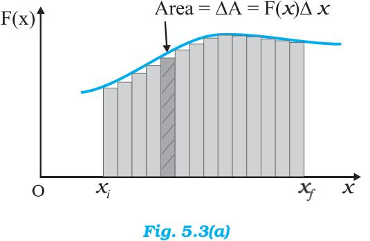
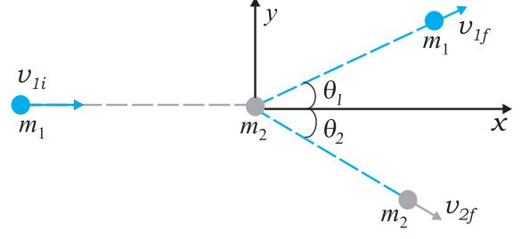

## **CHAPTER FIVE**

# **WORK, ENERGY AND POWER**

- **5.1** Introduction
- **5.2** Notions of work and kinetic energy : The work-energy theorem
- **5.3** Work
- **5.4** Kinetic energy
- **5.5** Work done by a variable force
- **5.6** The work-energy theorem for a variable force
- **5.7** The concept of potential energy
- **5.8** The conservation of mechanical energy
- **5.9** The potential energy of a spring
- **5.10** Power
- **5.11** Collisions
	- Summary Points to ponder Exercises

## **5.1 INTRODUCTION**

The terms 'work', 'energy' and 'power' are frequently used in everyday language. A farmer ploughing the field, a construction worker carrying bricks, a student studying for a competitive examination, an artist painting a beautiful landscape, all are said to be working. In physics, however, the word 'Work' covers a definite and precise meaning. Somebody who has the capacity to work for 14-16 hours a day is said to have a large stamina or energy. We admire a long distance runner for her stamina or energy. Energy is thus our capacity to do work. In Physics too, the term 'energy' is related to work in this sense, but as said above the term 'work' itself is defined much more precisely. The word 'power' is used in everyday life with different shades of meaning. In karate or boxing we talk of 'powerful' punches. These are delivered at a great speed. This shade of meaning is close to the meaning of the word 'power' used in physics. We shall find that there is at best a loose correlation between the physical definitions and the physiological pictures these terms generate in our minds. The aim of this chapter is to develop an understanding of these three physical quantities. Before we proceed to this task, we need to develop a mathematical prerequisite, namely the scalar product of two vectors.

## **5.1.1 The Scalar Product**

We have learnt about vectors and their use in Chapter 3. Physical quantities like displacement, velocity, acceleration, force etc. are vectors. We have also learnt how vectors are added or subtracted. We now need to know how vectors are multiplied. There are two ways of multiplying vectors which we shall come across : one way known as the scalar product gives a scalar from two vectors and the other known as the vector product produces a new vector from two vectors. We shall look at the vector product in Chapter 6. Here we take up the scalar product of two vectors. The scalar product or dot product of any two vectors **A** and **B**, denoted as **A.B** (read A dot B) is defined as

  
  
**A$\cdot$B = $A\,B$**cos $\theta$ (5.1a)

where θ is the angle between the two vectors as shown in Fig. 5.1(a). Since *A, B* and cos θ are scalars, the dot product of A and B is a scalar quantity. Each vector, A and B, has a direction but their scalar product does not have a direction.

From Eq. (5.1a), we have

$$\begin{array}{r l}{\mathbf{A}{\cdot}\mathbf{B}}&{{}=A\left(B\cos\,\theta\right)}\\ {}&{{}=B\left(A\,\cos\,\theta\right)}\end{array}$$

Geometrically, *B* cos θ is the projection of B onto A in Fig.5.1 (b) and *A* cos θ is the projection of A onto B in Fig. 5.1 (c). So, A.B is the product of the magnitude of A and the component of B along A. Alternatively, it is the product of the magnitude of B and the component of A along B.

Equation (5.1a) shows that the scalar product follows the commutative law :

A.B = B.A

Scalar product obeys the distributive law:

$$\mathbf{A}\cdot(\mathbf{B}+\mathbf{C})=\mathbf{A}\cdot\mathbf{B}+\mathbf{A}\cdot\mathbf{C}$$

Further, A. (λ B) = λ (A.B)

where λ is a real number.

The proofs of the above equations are left to you as an exercise.

For unit vectors ɵ ɵ ɵ i, j,k we have

$$\begin{array}{l}{{\hat{\mathbf{i}}\cdot\hat{\mathbf{i}}=\hat{\mathbf{j}}\cdot\hat{\mathbf{j}}=\hat{\mathbf{k}}\cdot\hat{\mathbf{k}}=1}}\\ {{\hat{\mathbf{i}}\cdot\hat{\mathbf{j}}=\hat{\mathbf{j}}\cdot\hat{\mathbf{k}}=\hat{\mathbf{k}}\cdot\hat{\mathbf{i}}=0}}\end{array}$$

Given two vectors

$$\begin{array}{l}{{\mathbf{\hat{A}}=A_{x}{\hat{\mathbf{i}}}+A_{y}{\hat{\mathbf{j}}}+A_{z}{\hat{\mathbf{k}}}}}\\ {{\mathbf{\hat{\imath}}}}\\ {{\mathbf{B}=B_{x}{\hat{\mathbf{i}}}+B_{y}{\hat{\mathbf{j}}}+B_{z}{\hat{\mathbf{k}}}}}\end{array}$$

their scalar product is

$$\mathbf{A}\mathbf{\cdot}\mathbf{B}=\left(A_{x}{\hat{\mathbf{i}}}+A_{y}{\hat{\mathbf{j}}}+A_{z}{\hat{\mathbf{k}}}\right)\mathbf{\cdot}\left(B_{x}{\hat{\mathbf{i}}}+B_{y}{\hat{\mathbf{j}}}+B_{z}{\hat{\mathbf{k}}}\right)$$

$=A_{x}B_{x}+A_{y}B_{y}+A_{z}B_{z}$ (5.1b)

From the definition of scalar product and (Eq. 5.1b) we have :

(i) **A.A** = $A_{x}A_{x}+A_{y}A_{y}+A_{z}A_{z}$  
  
Or, $A^{2}=A_{x}^{2}+A_{y}^{2}+A_{z}^{2}$ (5.1c)  
  
**A.A** = $A_{x}A_{x}+A_{y}A_{y}+A_{z}A_{z}$  
  
**(5.1c)**

since A.A = |A ||A| cos 0 = *A2* . (ii) A.B = 0, if A and B are perpendicular.

- *Example 5.1* Find the angle between force F = (3 +4 -5 ) ˆ ˆ ˆ i j k unit and displacement d = (5 + 4 +3 ) ˆ ˆ ˆ i j k unit. Also find the projection of F on d. *Answer* F.d = *F d F d F d x x y y z z* + + u
= 3 (5) + 4 (4) + (- 5) (3) = 16 unit  
  
Hence F.d = F.d $\cos\theta$ = 16 unit  
  
Now F.F = F${}^{2}$ = F${}^{2}$ + F${}^{2}$ + F${}^{2}$  
  
= 9 + 16 + 25  
  
= 50 unit  
  
and d.d = d${}^{2}$ = d${}^{2}$ + d${}^{2}$ + d${}^{2}$  
  
= 25 + 16 + 9  
  
= 50 unit  
  
. $\cos\theta$ = $\frac{16}{\sqrt{50}\sqrt{50}}$ = $\frac{16}{50}$ = 0.32,

$$\dot{\theta}=\cos^{-1}\ 0.32$$

*Fig. 5.1* (a) *The scalar product of two vectors* A *and* B *is a scalar :* A.B *= A B* cos θ*.* (b) *B* cos θ *is the projection of* B *onto* A. (c) *A cos* θ*is the projection of* A *onto* B*.*

## 5.2 NOTIONS OF WORK AND KINETIC ENERGY: THE WORK-ENERGY THEOREM

The following relation for rectilinear motion under constant acceleration *a* has been encountered in Chapter 3,

$\omega^{2}-\omega^{2}=2$ as 

where *u* and *v* are the initial and final speeds and *s* the distance traversed. Multiplying both sides by *m*/*2*, we have

$${\frac{1}{2}}m v^{2}-{\frac{1}{2}}m u^{2}=m a s=F s\qquad\qquad(5.2a)$$

where the last step follows from Newton's Second Law. We can generalise Eq. (5.2) to three dimensions by employing vectors

> *v* 2 − *u*2 = 2 a.d

Here a and d are acceleration and displacement vectors of the object respectively.

Once again multiplying both sides by *m*/*2* , we obtain

$${\frac{1}{2}}m v^{2}-{\frac{1}{2}}m u^{2}=m\ \mathbf{a.d}=\mathbf{F.d}\qquad{\mathrm{(5.2b)}}$$

The above equation provides a motivation for the definitions of work and kinetic energy. The left side of the equation is the difference in the quantity 'half the mass times the square of the speed' from its initial value to its final value. We call each of these quantities the 'kinetic energy', denoted by *K*. The right side is a product of the displacement and the component of the force along the displacement. This quantity is called 'work' and is denoted by *W.* Eq. (5.2b) is then

$K_{f}-K_{i}=W$

where *Ki* and *Kf* are respectively the initial and final kinetic energies of the object. Work refers to the force and the displacement over which it acts. Work is done by a force on the body over a certain displacement.

Equation (5.2) is also a special case of the work-energy (WE) theorem : The change in kinetic energy of a particle is equal to the work done on it by the net force. We shall generalise the above derivation to a varying force in a later section.

⊳ *Example 5.2* It is well known that a raindrop falls under the influence of the downward gravitational force and the opposing resistive force. The latter is known to be proportional to the speed of the drop but is otherwise undetermined. Consider a drop of mass 1.00 g falling from a height 1.00 km. It hits the ground with a speed of 50.0 m s-1. (a) What is the work done by the gravitational force ? What is the work done by the unknown resistive force?

*Answer* (a) The change in kinetic energy of the drop is

$$\begin{array}{l}{{\Delta K=\frac{1}{2}m\,v^{2}-0}}\\ {{\therefore}}\\ {{=\frac{1}{2}\times10^{\cdot3}\times50\times50}}\\ {{=1.25\,\mathrm{J}}}\end{array}$$

where we have assumed that the drop is initially at rest.

Assuming that *g* is a constant with a value 10 m/s2 , the work done by the gravitational force is,

$$\begin{array}{r l}{W_{g}=m g h}\\ {=10^{3}\times10\times10^{3}}\\ {=10.0\mathrm{J}}\end{array}$$

(b) From the work-energy theorem

* [16] A. A. K.  
  

where *Wr* is the work done by the resistive force on the raindrop. Thus

$$\begin{array}{l}{{W_{r}=\Delta\tilde{K}-W_{g}}}\\ {{\ \ \ =1.25-10}}\\ {{\ \ \ =-8.75\,\mathrm{J}}}\end{array}$$

is negative. ⊳

### 5.3 WORK

As seen earlier, work is related to force and the displacement over which it acts. Consider a constant force F acting on an object of mass *m*. The object undergoes a displacement d in the positive *x*-direction as shown in Fig. 5.2.

*Fig. 5.2 An object undergoes a displacement* d *under the influence of the force* F.

The work done by the force is defined to be the product of component of the force in the direction of the displacement and the magnitude of this displacement. Thus

$W=(F\cos\ \theta)d=F.d$ (5.4)

We see that if there is no displacement, there is no work done even if the force is large. Thus, when you push hard against a rigid brick wall, the force you exert on the wall does no work. Yet your muscles are alternatively contracting and relaxing and internal energy is being used up and you do get tired. Thus, the meaning of work in physics is different from its usage in everyday language.

No work is done if :

- (i) the displacement is zero as seen in the example above. A weightlifter holding a 150 kg mass steadily on his shoulder for 30 s does no work on the load during this time.
- (ii) the force is zero. A block moving on a smooth horizontal table is not acted upon by a horizontal force (since there is no friction), but may undergo a large displacement.
- (iii) the force and displacement are mutually perpendicular. This is so since, for θ = π/2 rad (= 90o ), cos (π/2) = 0. For the block moving on a smooth horizontal table, the gravitational force *mg* does no work since it acts at right angles to the displacement. If we assume that the moon's orbits around the earth is perfectly circular then the earth's gravitational force does no work. The moon's instantaneous displacement is tangential while the earth's force is radially inwards and θ= π/2.

Work can be both positive and negative. If θ is between 0o and 90o , cos θ in Eq. (5.4) is positive. If θ is between 90o and 180o , cos θ is negative. In many examples the frictional force opposes displacement and θ = 180o . Then the work done by friction is negative (cos 180o = –1).

From Eq. (5.4) it is clear that work and energy have the same dimensions, [ML2T –2]. The SI unit of these is joule (J), named after the famous British physicist James Prescott Joule (1811-1869). Since work and energy are so widely used as physical concepts, alternative units abound and some of these are listed in Table 5.1.

#### Table 5.1 Alternative Units of Work/Energy in J

| erg | 10 J |
| --- | --- |
| electron volt (eV) | 1.6×10-19 J |
| calorie (cal) | 4.186 J |
| kilowatt hour (kWh) | 3.6×10° J |

 *Example 5.3* A cyclist comes to a skidding stop in 10 m. During this process, the force on the cycle due to the road is 200 N and is directly opposed to the motion. (a) How much work does the road do on the cycle ? (b) How much work does the cycle do on the road ?

*Answer* Work done on the cycle by the road is the work done by the stopping (frictional) force on the cycle due to the road.

- (a) The stopping force and the displacement make an angle of 180o (π rad) with each other. Thus, work done by the road,

$$W_{r}=F d\cos\theta$$

⊳

 = 200 × 10 × cos π

= – 2000 J

It is this negative work that brings the cycle to a halt in accordance with WE theorem.

- (b) From Newton's Third Law an equal and opposite force acts on the road due to the cycle. Its magnitude is 200 N. However, the road undergoes no displacement. Thus, work done by cycle on the road is zero. ⊳
The lesson of Example 5.3 is that though the force on a body A exerted by the body B is always equal and opposite to that on B by A (Newton's Third Law); the work done on A by B is not necessarily equal and opposite to the work done on B by A.

## 5.4 KINETIC ENERGY

As noted earlier, if an object of mass *m* has velocity v, its kinetic energy *K* is

$K=\frac{1}{2}m\,\mathbf{v.v}=\frac{1}{2}m^{2}$ (5.5)

Kinetic energy is a scalar quantity. The kinetic energy of an object is a measure of the work an

| Object | Mass (kg) | Speed (m s 1) | K (J) |
| --- | --- | --- | --- |
| Car | 2000 | 25 | 6.3×10- |
| Running athlete | 70 | 10 | 3.5×10- |
| Bullet | 5×10-2 | 200 | 105 |
| Stone dropped from 10 m | 1 | 14 | 102 |
| Rain drop at terminal speed | 3.5×10-5 | 9 | 1.4×10 |
| Air molecule | = 10-26 | 500 | ~ 10-21 |

Table 5.2 Typical kinetic energies (*K*)

object can do by the virtue of its motion. This notion has been intuitively known for a long time. The kinetic energy of a fast flowing stream has been used to grind corn. Sailing ships employ the kinetic energy of the wind. Table 5.2 lists the kinetic energies for various objects.

⊳ *Example 5.4* In a ballistics demonstration a police officer fires a bullet of mass 50.0 g with speed 200 m s-1 (see Table 5.2) on soft plywood of thickness 2.00 cm. The bullet emerges with only 10% of its initial kinetic energy. What is the emergent speed of the bullet ?

*Answer* The initial kinetic energy of the bullet is *mv2*/2 = 1000 J. It has a final kinetic energy of 0.1×1000 = 100 J. If *vf* is the emergent speed of the bullet,

$$\begin{array}{l}{{\frac{1}{-m w_{f}^{2}}=100\mathrm{~J}}}\\ {{2}}\\ {{\cdot}}\\ {{v_{f}=\sqrt{\frac{2\times100\mathrm{~J}}{0.05\mathrm{kg}}}}}\end{array}$$

= 63.2 m s–1

The speed is reduced by approximately 68% (not 90%). ⊳

## 5.5 WORK DONE BY A VARIABLE FORCE

A constant force is rare. It is the variable force, which is more commonly encountered. Fig. 5.3 is a plot of a varying force in one dimension.

If the displacement ∆*x* is small, we can take the force *F* (*x*) as approximately constant and the work done is then

∆*W* =*F* (*x*) ∆*x*

This is illustrated in Fig. 5.3(a). Adding successive rectangular areas in Fig. 5.3(a) we get the total work done as

$W\equiv\sum_{x_{i}}F(x)\Delta x$  
  
$x_{i}$

where the summation is from the initial position *xi* to the final position *xf* .

If the displacements are allowed to approach zero, then the number of terms in the sum increases without limit, but the sum approaches a definite value equal to the area under the curve in Fig. 5.3(b). Then the work done is

$W=\lim\limits_{\Delta x\to O\sum\limits_{x_{i}}F(x)\Delta x}$  
  
$=\int\limits_{x_{i}}F(x)\;\mathrm{d}x$ (5.7)

where '*lim*' stands for the limit of the sum when ∆*x* tends to zero. Thus, for a varying force the work done can be expressed as a definite integral of force over displacement (see also Appendix 3.1).

*Fig. 5.3 (a) The shaded rectangle represents the work done by the varying force F*(*x*)*, over the small displacement* ∆*x,* ∆*W = F*(*x*) ∆*x. (b) adding the areas of all the rectangles we find that for* ∆*x* → 0*, the area under the curve is exactly equal to the work done by F*(*x*)*.*

⊳ *Example 5.5* A woman pushes a trunk on a railway platform which has a rough surface. She applies a force of 100 N over a distance of 10 m. Thereafter, she gets progressively tired and her applied force reduces linearly with distance to 50 N. The total distance through which the trunk has been moved is 20 m. Plot the force applied by the woman and the frictional force, which is 50 N versus displacement. Calculate the work done by the two forces over 20 m.

*Fig. 5.4 Plot of the force F applied by the woman and the opposing frictional force f* versus displacement*.*

The plot of the applied force is shown in Fig. 5.4. At *x* = 20 m, *F* = 50 N (≠ 0). We are given that the frictional force *f* is |f|= 50 N. It opposes motion and acts in a direction opposite to F. It is therefore, shown on the negative side of the force axis.

The work done by the woman is

*WF* → area of the rectangle ABCD + area of the trapezium CEID

$W_{F}=100\times10+\frac{1}{2}(100+50)\times10$  
  
$=1000+750$  
  
$=1750$ J 

The work done by the frictional force is

$W_{f}\to$ area of the rectangle AGHI (see , 1) (1)

$$W_{f}=\{-50\}\times20$$

= − 1000 J

The area on the negative side of the force axis has a negative sign. ⊳

## 5.6 THE WORK-ENERGY THEOREM FOR A VARIABLE FORCE

We are now familiar with the concepts of work and kinetic energy to prove the work-energy theorem for a variable force. We confine ourselves to one dimension. The time rate of change of kinetic energy is

$${\frac{\mathrm{d}K}{\mathrm{d}t}}={\frac{\mathrm{d}}{\mathrm{d}t}}{\left({\frac{1}{2}}m\,v^{2}\right)}$$
  

$$\cdot$$
  

$$=m{\frac{\mathrm{d}v}{\mathrm{d}t}}v$$
  

$$\cdot$$

= *v F* (from Newton's Second Law)

$$=F{\frac{\mathrm{d}\chi}{\mathrm{d}t}}$$

Thus d*K = F*d*x*

Integrating from the initial position (*x i* ) to final position ( *x f* ), we have

$$\int\limits_{K_{i}}^{K_{f}}\mathrm{d}K=\int\limits_{x_{i}}^{x_{f}}F\mathrm{d}x$$

where, *Ki* and *K f* are the initial and final kinetic energies corresponding to *x i* and *x* f .

or $K_{f}-K_{i}=\int\limits_{x_{i}}^{x_{f}}Fdx$ (5.8a)

From Eq. (5.7), it follows that

$K_{f}-K_{i}=W$ (5.8b)

Thus, the WE theorem is proved for a variable force.

While the WE theorem is useful in a variety of problems, it does not, in general, incorporate the complete dynamical information of Newton's second law. It is an integral form of Newton's second law. Newton's second law is a relation between acceleration and force at any instant of time. Work-energy theorem involves an integral over an interval of time. In this sense, the temporal (time) information contained in the statement of Newton's second law is 'integrated over' and is ⊳

not available explicitly. Another observation is that Newton's second law for two or three dimensions is in vector form whereas the work-energy theorem is in scalar form. In the scalar form, information with respect to directions contained in Newton's second law is not present.

 **Example 5.6** A block of mass *m* = 1 kg, moving on a horizontal surface with speed *vi* = 2 m s–1 enters a rough patch ranging from *x* = 0.10 m to *x* = 2.01 m. The retarding force *Fr* on the block in this range is inversely proportional to *x* over this range,

$$F_{r}={\frac{-\kappa}{x}}{\mathrm{~for~}}0.1<x<2.01{\mathrm{~m}}$$

= 0 for *x <* 0.1m and *x* > 2.01 m where *k = 0.5* J. What is the final kinetic energy and speed *vf* of the block as it crosses this patch ?

**Answer** From Eq. (5.8a)

$\mathbf{K}_{f}=\mathbf{K}_{i}+\int\limits_{0.1}\frac{(-k)}{x}\,\mathrm{d}x$  
  
$\mathbf{=}\frac{1}{2}\,\mathrm{m}\mathbf{w}_{i}^{2}-k\,\mathrm{ln}\,(x)\big{|}_{0.1}^{2.01}$  
  
$\mathbf{=}\frac{1}{2}\,\mathrm{m}\mathbf{w}_{i}^{2}-k\,\mathrm{ln}\,(2.01/0.1)$  
  
$\mathbf{=}2-0.5\,\mathrm{ln}\,(20.1)$  
  
$\mathbf{=}2-1.5\,\mathrm{=}0.5\,\mathrm{J}$  
  
$\mathbf{v}_{f}=\sqrt{2\mathbf{K}_{f}/m}=1\,\mathrm{m}\,\mathrm{s}^{-1}$

Here, note that ln is a symbol for the natural logarithm to the base *e* and not the logarithm to the base 10 [ln X = loge X = 2.303 log10 X]. ⊳

#### **5.7 THE CONCEPT OF POTENTIAL ENERGY**

The word potential suggests possibility or capacity for action. The term potential energy brings to one's mind 'stored' energy. A stretched bow-string possesses potential energy. When it is released, the arrow flies off at a great speed. The earth's crust is not uniform, but has discontinuities and dislocations that are called fault lines. These fault lines in the earth's crust are like 'compressed springs'. They possess a large amount of potential energy. An earthquake results when these fault lines readjust. Thus, potential energy is the 'stored energy' by virtue of the position or configuration of a body. The body left to itself releases this stored energy in the form of kinetic energy. Let us make our notion of potential energy more concrete.

The gravitational force on a ball of mass *m* is *mg* . *g* may be treated as a constant near the earth surface. By 'near' we imply that the height *h* of the ball above the earth's surface is very small compared to the earth's radius *RE* (*h <<RE* ) so that we can ignore the variation of *g* near the earth's surface*****. In what follows we have taken the upward direction to be positive. Let us raise the ball up to a height *h*. The work done by the external agency against the gravitational force is *mgh*. This work gets stored as potential energy. Gravitational potential energy of an object, as a function of the height *h*, is denoted by *V*(*h*) and it is the negative of work done by the gravitational force in raising the object to that height.

$$\mathbf{\Delta}(V(h)=m g h)$$

If *h* is taken as a variable, it is easily seen that the gravitational force *F* equals the negative of the derivative of *V*(*h*) with respect to *h*. Thus,

$$F=-\frac{\mathrm{d}}{\mathrm{d}h}\,V(h)=-m\,g$$

The negative sign indicates that the gravitational force is downward. When released, the ball comes down with an increasing speed. Just before it hits the ground, its speed is given by the kinematic relation,

> *v 2* = 2*gh*

This equation can be written as

$${\frac{1}{2}}\,m\;\nu^{2}=m\;g\;h$$

which shows that the gravitational potential energy of the object at height *h*, when the object is released, manifests itself as kinetic energy of the object on reaching the ground.

Physically, the notion of potential energy is applicable only to the class of forces where work done against the force gets 'stored up' as energy. When external constraints are removed, it manifests itself as kinetic energy. Mathematically, (for simplicity, in one dimension) the potential

<b>* *The variation of g with height is discussed in Chapter 7 on Gravitation.*

energy *V*(*x*) is defined if the force *F*(*x*) can be written as

$$F(x)=-{\frac{\mathrm{d}V}{\mathrm{d}x}}$$

This implies that

$$\int\limits_{x_{i}}^{x_{f}}F(x)\mathrm{d}x=-\int\limits_{V_{i}}^{V_{f}}\mathrm{d}V=V_{i}-V_{f}$$

The work done by a conservative force such as gravity depends on the initial and final positions only. In the previous chapter we have worked on examples dealing with inclined planes. If an object of mass *m* is released from rest, from the top of a smooth (frictionless) inclined plane of height *h,* its speed at the bottom is 2*gh* irrespective of the angle of inclination. Thus, at the bottom of the inclined plane it acquires a kinetic energy, *mgh*. If the work done or the kinetic energy did depend on other factors such as the velocity or the particular path taken by the object, the force would be called nonconservative.

The dimensions of potential energy are [ML2T –2] and the unit is joule (J), the same as kinetic energy or work. To reiterate, the change in potential energy, for a conservative force, ∆*V* is equal to the negative of the work done by the force

$\Delta V=-F(x)\ \Delta x$ (5.9)

In the example of the falling ball considered in this section we saw how potential energy was converted to kinetic energy. This hints at an important principle of conservation in mechanics, which we now proceed to examine.

## 5.8 THE CONSERVATION OF MECHANICAL ENERGY

For simplicity we demonstrate this important principle for one-dimensional motion. Suppose that a body undergoes displacement ∆*x* under the action of a conservative force *F*. Then from the WE theorem we have,

∆*K = F*(*x*) ∆*x*

If the force is conservative, the potential energy function *V*(*x*) can be defined such that

$-\Delta V=F(x)\ \Delta x$  
  
The above equations imply that  
  
$\Delta K+\Delta V=0$  
  
$\Delta(K+V)=0$ (5.10)

which means that *K + V,* the sum of the kinetic and potential energies of the body is a constant. Over the whole path, *xi* to *xf ,* this means that

*Ki* + *V*(*xi* ) = *Kf* + *V*(*xf* ) (5.11) The quantity *K* +*V*(*x*), is called the total mechanical energy of the system. Individually the kinetic energy *K* and the potential energy *V*(*x*) may vary from point to point, but the sum is a constant. The aptness of the term 'conservative force' is now clear.

Let us consider some of the definitions of a conservative force.

- l A force *F*(*x*) is conservative if it can be derived from a scalar quantity *V*(*x*) by the relation given by Eq. (5.9). The three-dimensional generalisation requires the use of a vector derivative, which is outside the scope of this book.
- l The work done by the conservative force depends only on the end points. This can be seen from the relation,

$W=K_{f}=K_{i}=V(K_{i})=V(K_{f})$

which depends on the end points.

- l A third definition states that the work done by this force in a closed path is zero. This is once again apparent from Eq. (5.11) since *xi* = *xf .*
Thus, the principle of conservation of total mechanical energy can be stated as

## The total mechanical energy of a system is conserved if the forces, doing work on it, are conservative.

The above discussion can be made more concrete by considering the example of the gravitational force once again and that of the spring force in the next section. Fig. 5.5 depicts a ball of mass *m* being dropped from a cliff of height *H*.

*Fig. 5.5 The conversion of potential energy to kinetic energy for a ball of mass m dropped from a height H.*

The total mechanical energies *E*0 , *Eh* , and *EH* of the ball at the indicated heights zero (ground level), *h* and *H*, are

$E_{H}=$ mgH (5.11 a)

$$E_{h}=m g h+{\frac{1}{2}}m w_{h}^{2}~~~~~~~~~~~~~~~~~~~~~~~(5.11~\mathrm{b})$$

$E_{o}=(1/2)\,mv_{f}^{2}$ (5.11 c)

The constant force is a special case of a spatially dependent force *F*(*x*). Hence, the mechanical energy is conserved. Thus

*EH = E0* or, 1 2 *2 mgH mv* = *f v gH f* = 2

a result that was obtained in section 5.7 for a freely falling body.

Further,

*EH = Eh* which implies,

$\omega_{\rm h}^{2}=2g(H-h)$ (5.11 d)

and is a familiar result from kinematics.

At the height *H*, the energy is purely potential. It is partially converted to kinetic at height *h* and is fully kinetic at ground level. This illustrates the conservation of mechanical energy.

⊳ **Example 5.7** A bob of mass *m* is suspended by a light string of length *L* . It is imparted a horizontal velocity *vo* at the lowest point A such that it completes a semi-circular trajectory in the vertical plane with the string becoming slack only on reaching the topmost point, C. This is shown in Fig. 5.6. Obtain an expression for (i) *vo* ; (ii) the speeds at points B and C; (iii) the ratio of the kinetic energies (*KB /KC* ) at B and C. Comment on the nature of the trajectory of the bob after it reaches the point C.

**Answer** (i) There are two external forces on the bob : gravity and the tension (*T* ) in the string. The latter does no work since the displacement of the bob is always normal to the string. The potential energy of the bob is thus associated with the gravitational force only. The total mechanical energy *E* of the system is conserved. We take the potential energy of the system to be zero at the lowest point *A*. Thus, at *A* :

$$E=\frac{1}{2}\,m\!w_{0}^{2}\tag{5.12}$$
  
  
$T_{A}-\,m\!g=\frac{m\!w_{0}^{2}}{L}$ [Newton's Second Law]

where *TA* is the tension in the string at A. At the highest point C, the string slackens, as the tension in the string (*TC* ) becomes zero. Thus, at C

$\mathbf{E=\frac{1}{2}\,mv_{c}^{2}+2\,mgl}$ (5.13)

*L mv mg 2 c* = [Newton's Second Law] (5.14)

where *vC* is the speed at C. From Eqs. (5.13) and (5.14)

$$E={\frac{5}{2}}m g L$$

Equating this to the energy at A

*2 0*

$${\frac{5}{2}}m g L={\frac{m}{2}}v$$

or, *v gL 0* = 5

(ii) It is clear from Eq. (5.14)

$$v_{C}={\sqrt{g L}}$$

At B, the energy is

$$E={\frac{1}{2}}m w_{B}^{2}+m g L$$

Equating this to the energy at A and employing the result from (i), namely *gLv 2 0* = 5 ,

$$\frac{1}{2}m v_{B}^{2}+m g L=\frac{1}{2}m v_{o}^{2}$$
  
  

$$\cdot$$
  
  

$$=\frac{5}{2}m\,g\,L$$

$$\therefore v_{B}={\sqrt{3g L}}$$

(iii) The ratio of the kinetic energies at B and C is :

$${\frac{K_{B}}{K_{C}}}={\frac{{\frac{1}{2}}m v_{B}^{2}}{{\frac{1}{2}}m v_{C}^{2}}}={\frac{3}{1}}$$

At point C, the string becomes slack and the velocity of the bob is horizontal and to the left. If the connecting string is cut at this instant, the bob will execute a projectile motion with horizontal projection akin to a rock kicked horizontally from the edge of a cliff. Otherwise the bob will continue on its circular path and complete the revolution. ⊳

#### 5.9 THE POTENTIAL ENERGY OF A SPRING

The spring force is an example of a variable force which is conservative. Fig. 5.7 shows a block attached to a spring and resting on a smooth horizontal surface. The other end of the spring is attached to a rigid wall. The spring is light and may be treated as massless. In an ideal spring, the spring force *Fs* is proportional to *x* where *x* is the displacement of the block from the equilibrium position. The displacement could be either positive [Fig. 5.7(b)] or negative [Fig. 5.7(c)]. This force law for the spring is called Hooke's law and is mathematically stated as

$$F_{s}=\,-\,k\alpha$$

The constant *k* is called the spring constant. Its unit is N m-1. The spring is said to be stiff if *k* is large and soft if *k* is small.

Suppose that we pull the block outwards as in Fig. 5.7(b). If the extension is *xm* , the work done by the spring force is

This expression may also be obtained by considering the area of the triangle as in Fig. 5.7(d). Note that the work done by the external pulling force *F* is positive since it overcomes the spring force.

$W=+\frac{k\,x_{m}^{2}}{2}$ (5.16)

- *Fig. 5.7 Illustration of the spring force with a block attached to the free end of the spring. (a) The spring force Fs is zero when the displacement x from the equilibrium position is zero. (b) For the stretched spring x > 0 and Fs < 0 (c) For the compressed spring x < 0 and Fs > 0.(d) The plot of Fs versus x. The area of the shaded triangle represents the work done by the spring force. Due to the opposing signs of Fs and x, this work done is negative, W kx / s m 2* = − 2*.*
The same is true when the spring is compressed with a displacement *xc* (< 0). The spring force does work 2/ *2 s* −= *kxW c* while the external force *F* does work + *kxc 2* / 2. If the block is moved from an initial displacement *xi* to a final displacement *xf* , the work done by the spring force *Ws* is

$$W_{s}=-\int\limits_{x_{i}}^{x_{f}}k\,x\,dx\qquad=\frac{k\,x_{i}^{2}}{2}\quad-\quad\frac{k\,x_{f}^{2}}{2}\tag{5.17}$$

Thus the work done by the spring force depends only on the end points. Specifically, if the block is pulled from *xi* and allowed to return to *xi* ;

$$W_{\rm s}=-\int\limits_{x_{i}}^{x_{i}}k\,x\,{\rm d}x\qquad=\frac{k\,x_{i}^{2}}{2}\quad-\quad\frac{k\,x_{i}^{2}}{2}$$
  
  

$$=0\tag{5.18}$$
  
  
The second one has the second one has the second one.  
  

The work done by the spring force in a cyclic process is zero. We have explicitly demonstrated that the spring force (i) is position dependent only as first stated by Hooke, (*Fs =* − *kx*); (ii) does work which only depends on the initial and final positions, e.g. Eq. (5.17). Thus, the spring force is a conservative force*.*

We define the potential energy *V*(*x*) of the spring to be zero when block and spring system is in the equilibrium position. For an extension (or compression) *x* the above analysis suggests that

$V(x)=\frac{kx^{2}}{2}$ (5.19)

You may easily verify that − d*V/*d*x =* − *k x*, the spring force. If the block of mass *m* in Fig. 5.7 is extended to *xm* and released from rest, then its total mechanical energy at any arbitrary point *x*, where *x* lies between *– xm*  and *+ xm*, will be given by

$$\stackrel{\cdot}{\frac{1}{2}}\!k\,x_{m}^{2}\!=\!\!\frac{1}{2}\!k\,x^{2}\!+\!\frac{1}{2}m\,v^{2}$$

where we have invoked the conservation of mechanical energy. This suggests that the speed and the kinetic energy will be maximum at the equilibrium position, *x =* 0, i.e.,

$$\frac{1}{2}m\,v_{m}^{2}=\frac{1}{2}k\,x_{m}^{2}$$

where *vm* is the maximum speed.

$$\mathrm{or}\qquad v_{m}=\sqrt{\frac{k}{m}}\;x_{m}$$

Note that *k/m* has the dimensions of [T-2] and our equation is dimensionally correct. The kinetic energy gets converted to potential energy and vice versa, however, the total mechanical energy remains constant. This is graphically depicted in Fig. 5.8.

*Fig. 5.8 Parabolic plots of the potential energy V and kinetic energy K of a block attached to a spring obeying Hooke's law. The two plots are complementary, one decreasing as the other increases. The total mechanical energy E = K + V remains constant.*

⊳ *Example 5.8* To simulate car accidents, auto manufacturers study the collisions of moving cars with mounted springs of different spring constants. Consider a typical simulation with a car of mass 1000 kg moving with a speed 18.0 km/h on a smooth road and colliding with a horizontally mounted spring of spring constant 5.25 × 10 3 N m–1 . What is the maximum compression of the spring ?

*Answer* At maximum compression the kinetic energy of the car is converted entirely into the potential energy of the spring.

The kinetic energy of the moving car is

$$K=\frac{1}{2}m v^{2}$$
.
$$=\frac{1}{2}\times10^{3}\times5\times5$$
  

$$K\,=1.25\times10^{4}\,\mathrm{J}$$

where we have converted 18 km h–1 to 5 m s–1 [It is useful to remember that 36 km h–1 = 10 m s–1]. At maximum compression *xm* , the potential energy *V* of the spring is equal to the kinetic energy *K* of the moving car from the principle of conservation of mechanical energy.

$$V={\frac{1}{2}}k\,x_{m}^{2}$$

$$\mathrm{=1.25\times10^{4}\;J}$$

We obtain

$$x_{m}=2.00\;\mathrm{m}$$

We note that we have idealised the situation. The spring is considered to be massless. The surface has been considered to possess negligible friction. ⊳

We conclude this section by making a few remarks on conservative forces.

- (i) Information on time is absent from the above discussions. In the example considered above, we can calculate the compression, but not the time over which the compression occurs. A solution of Newton's Second Law for this system is required for temporal information.
- (ii) Not all forces are conservative. Friction, for example, is a non-conservative force. The principle of conservation of energy will have to be modified in this case. This is illustrated in Example 5.9.
- (iii) The zero of the potential energy is arbitrary. It is set according to convenience. For the spring force we took *V*(*x*) = 0, at *x* = 0, i.e. the unstretched spring had zero potential energy. For the constant gravitational force *mg*, we took *V =* 0 on the earth's surface. In a later chapter we shall see that for the force due to the universal law of gravitation, the zero is best defined at an infinite distance from the gravitational source. However, once the zero of the potential energy is fixed in a given discussion, it must be consistently adhered to throughout the discussion. You cannot change horses in midstream !

⊳ *Example 5.9* Consider Example 5.8 taking the coefficient of friction, µ, to be 0.5 and calculate the maximum compression of the spring.

*Answer* In presence of friction, both the spring force and the frictional force act so as to oppose the compression of the spring as shown in Fig. 5.9.

We invoke the work-energy theorem, rather than the conservation of mechanical energy.

The change in kinetic energy is

*Fig. 5.9 The forces acting on the car.*

$$\Delta K\ =K_{f}-K_{i}=0-{\frac{1}{2}}m\,v^{2}$$

The work done by the net force is

$$W=-\,\frac{1}{2}\,k x_{m}^{2}-\mu m\,g\,x_{m}$$

Equating we have

$${\frac{1}{2}}m\,v^{2}={\frac{1}{2}}\,k\,x_{m}^{2}+\mu m\,g\,x_{m}$$

Now µ*mg* = 0.5 × 103 × 10 = 5 × 103 N (taking *g* =10.0 m s -2). After rearranging the above equation we obtain the following quadratic equation in the unknown *xm* .

$\kappa_{m}^{2}+2\mu m\ g\kappa_{m}-m\,\omega^{2}=0$  
  
$\kappa_{m}=\frac{-\mu\ m\ g+\left[\mu^{2}m^{2}g^{2}+m\,\kappa\,\omega^{2}\right]^{1/2}}{\kappa}$

where we take the positive square root since *xm* is positive. Putting in numerical values we obtain

$$x_{m}=1.35\;\mathrm{m}$$

which, as expected, is less than the result in Example 5.8.

If the two forces on the body consist of a conservative force *Fc* and a non-conservative force *Fnc* , the conservation of mechanical energy formula will have to be modified. By the WE theorem

(*Fc + Fnc* ) ∆*x =* ∆*K* But *Fc* ∆*x =* − ∆*V* Hence, ∆(*K + V*) *= Fnc* ∆*E = Fnc* 

where *E* is the total mechanical energy. Over the path this assumes the form

∆*x*

∆*x*

$$E_{f}-E_{i}\,=W_{\mathrm{nc}}$$

where *Wnc* is the total work done by the non-conservative forces over the path. Note that unlike the conservative force, *Wnc*  depends on the particular path *i* to *f.* ⊳

#### 5.10 POWER

Often it is interesting to know not only the work done on an object, but also the rate at which this work is done. We say a person is physically fit if he not only climbs four floors of a building but climbs them fast. Power is defined as the time rate at which work is done or energy is transferred.

The average power of a force is defined as the ratio of the work, *W*, to the total time *t* taken

$$P_{a v}={\frac{W}{t}}$$

The instantaneous power is defined as the limiting value of the average power as time interval approaches zero,

$P=\frac{\mathrm{d}W}{\mathrm{d}t}$ (5.20)

The work *dW* done by a force F for a displacement *d*r is d*W* = F.*d*r. The instantaneous power can also be expressed as

$P=\mathbf{F}.\frac{\mathrm{d}r}{\mathrm{d}t}$  
  
$=\mathbf{F}.\mathbf{v}$

where v is the instantaneous velocity when the force is F.

Power, like work and energy, is a scalar quantity. Its dimensions are [ML2T –3 ]. In the SI, its unit is called a watt (W). The watt is 1 J s–1 . The unit of power is named after James Watt, one of the innovators of the steam engine in the eighteenth century.

There is another unit of power, namely the horse-power (hp)

## 1 hp *=* 746 W

This unit is still used to describe the output of automobiles, motorbikes, etc.

We encounter the unit watt when we buy electrical goods such as bulbs, heaters and refrigerators. A 100 watt bulb which is on for 10 hours uses 1 kilowatt hour (kWh) of energy.

100 (watt) × 10 (hour)

- = 1000 watt hour
- =1 kilowatt hour (kWh)
- = 103 (W) × 3600 (s) = 3.6 × 106 J

Our electricity bills carry the energy consumption in units of kWh. Note that kWh is a unit of energy and not of power.

*Example 5.10* An elevator can carry a maximum load of 1800 kg (elevator + passengers) is moving up with a constant speed of 2 m s–1 . The frictional force opposing the motion is 4000 N. Determine the minimum power delivered by the motor to the elevator in watts as well as in horse power. u

*Answer* The downward force on the elevator is

$F=m\,g+F_{f}=(1800\times10)+4000=22000$ N.  
  

The motor must supply enough power to balance this force. Hence,

*P =* F. v *=* 22000 × 2 *=* 44000 W *=* 59 hp ⊳

#### 5.11 COLLISIONS

In physics we study motion (change in position). At the same time, we try to discover physical quantities, which do not change in a physical process. The laws of momentum and energy conservation are typical examples. In this section we shall apply these laws to a commonly encountered phenomena, namely collisions. Several games such as billiards, marbles or carrom involve collisions.We shall study the collision of two masses in an idealised form.

Consider two masses *m1* and *m2* . The particle *m1* is moving with speed *v1i* , the subscript '*i*' implying initial. We can cosider *m2* to be at rest. No loss of generality is involved in making such a selection. In this situation the mass *m1* collides with the stationary mass *m2* and this is depicted in Fig. 5.10.

*Fig. 5.10 Collision of mass m1 , with a stationary mass m2 .*

The masses *m*1 and *m*2 fly-off in different directions. We shall see that there are relationships, which connect the masses, the velocities and the angles.

## **5.11.1 Elastic and Inelastic Collisions**

In all collisions the total linear momentum is conserved; the initial momentum of the system is equal to the final momentum of the system. One can argue this as follows. When two objects collide, the mutual impulsive forces acting over the collision time ∆*t* cause a change in their respective momenta :

$$\begin{array}{l}{{\Delta\mathbf{p}_{1}=\mathbf{F}_{_{12}}\ \Delta t}}\\ {{\Delta\mathbf{p}_{2}=\mathbf{F}_{_{21}}\ \Delta t}}\end{array}$$

where **F**12 is the force exerted on the first particle by the second particle. **F**21 is likewise the force exerted on the second particle by the first particle. Now from Newton's third law, **F**12 = − **F**21. This implies

$$\Delta\mathbf{p}_{1}+\Delta\mathbf{p}_{2}=\mathbf{\nabla}\mathbf{0}$$

The above conclusion is true even though the forces vary in a complex fashion during the collision time ∆*t*. Since the third law is true at every instant, the total impulse on the first object is equal and opposite to that on the second.

On the other hand, the total kinetic energy of the system is not necessarily conserved. The impact and deformation during collision may generate heat and sound. Part of the initial kinetic energy is transformed into other forms of energy. A useful way to visualise the deformation during collision is in terms of a 'compressed spring'. If the 'spring' connecting the two masses regains its original shape without loss in energy, then the initial kinetic energy is equal to the final kinetic energy but the kinetic energy during the collision time ∆*t* is not constant. Such a collision is called an **elastic collision**. On the other hand the deformation may not be relieved and the two bodies could move together after the collision. A collision in which the two particles move together after the collision is called a **completely inelastic collision**. The intermediate case where the deformation is partly relieved and some of the initial kinetic energy is lost is more common and is appropriately called an **inelastic collision**.

#### **5.11.2 Collisions in One Dimension**

Consider first a **completely inelastic collision** in one dimension. Then, in Fig. 5.10,

$$\begin{array}{l}{{\theta_{_1}=\theta_{_2}=0}}\\ {{m_{_1}v_{_{1t}}=(m_{_1}+m_{_2})v_{_f}\;\;\mathrm{(momentum~conservation)}}}\\ {{.}}\end{array}$$

$\upsilon_{f}=\frac{m_{1}}{m_{1}+m_{2}}\upsilon_{1i}$ (5.22)

The loss in kinetic energy on collision is

$$\Delta K=\frac{1}{2}m_{1}v_{1i}^{2}-\frac{1}{2}(m_{1}+m_{2})v_{f}^{2}$$
  
  

$$=\frac{1}{2}m_{1}v_{1i}^{2}-\frac{1}{2}\frac{m_{1}^{2}}{m_{1}+m_{2}}v_{1i}^{2}\quad\mbox{[using Eq.(5.22)]}$$
  
  

$$=\frac{1}{2}m_{1}v_{1i}^{2}\left[1-\frac{m_{1}}{m_{1}+m_{2}}\right]$$
  
  

$$=\frac{1}{2}\frac{m_{1}m_{2}}{m_{1}+m_{2}}v_{1i}^{2}$$

which is a positive quantity as expected.

Consider next an elastic collision*.* Using the above nomenclature with θ 1 *=* θ 2 *=* 0, the momentum and kinetic energy conservation equations are

$m_{1}V_{1i}=m_{1}V_{1i}\neq m_{2}V_{2i}$ (5.23)

$m_{1}v_{1i}^{2}=m_{1}v_{1f}^{2}+m_{2}v_{2f}^{2}$ (5.24)

From Eqs. (5.23) and (5.24) it follows that,

$$m_{1}\bar{v}_{1i}(v_{2f}-v_{1i})=m_{1}v_{1f}(v_{2f}-v_{1f})$$
  
  
or,  
  

$$v_{2f}(v_{1i}-v_{1f})=v_{1i}^{2}-v_{1f}^{2}$$
  
  

$$=(v_{1i}-v_{1f})(v_{1i}+v_{1f})$$
  
  
Hence, $v_{1i}-v_{1i}+v_{1f}$ (5.25)

Hence, $\cdot\cdot\,\upsilon_{2f}=\upsilon_{1t}+\upsilon_{1f}$ (5.25)

Substituting this in Eq. (5.23), we obtain

$$v_{1_{f}}=\frac{(m_{1}-m_{2})}{m_{1}+m_{2}}v_{1_{i}}\tag{5.26}$$

and $\upsilon_{2f}=\frac{2m_{1}\upsilon_{1i}}{m_{1}+m_{2}}$ (5.27)

Thus, the 'unknowns' {*v*1*f* , *v2f*} are obtained in terms of the 'knowns' {*m*1 , *m*2 , *v*1*i* }. Special cases of our analysis are interesting.

**Case I :** If the two masses are equal

$$\begin{array}{l l}{{V_{1f}=0}}\\ {{V_{2f}=}}&{{V_{1f}}}\end{array}$$

The first mass comes to rest and pushes off the second mass with its initial speed on collision.

  
  
**Case II :** If one mass dominates, e.g. $m_{2}>>m_{1}$, $V_{1f}\simeq-\,V_{1f}\qquad V_{2f}\simeq0$

The heavier mass is undisturbed while the lighter mass reverses its velocity.

⊳

**Example 5.11 Slowing down of neutrons**: In a nuclear reactor a neutron of high speed (typically 107 m s–1) must be slowed to 103 m s–1 so that it can have a high probability of interacting with isotope 92 235U and causing it to fission. Show that a neutron can lose most of its kinetic energy in an elastic collision with a light nuclei like deuterium or carbon which has a mass of only a few times the neutron mass. The material making up the light nuclei, usually heavy water (D2O) or graphite, is called a moderator.

**Answer** The initial kinetic energy of the neutron is

$$K_{1i}={\frac{1}{2}}m_{1}v_{1i}^{2}$$

while its final kinetic energy from Eq. (5.26)

$$\begin{array}{r l}{K_{1f}={\frac{1}{2}}m_{1}v_{1f}^{2}}&{{}={\frac{1}{2}}m_{1}\left({\frac{m_{1}-m_{2}}{m_{1}+m_{2}}}\right)^{2}v_{1i}^{2}}\end{array}$$

The fractional kinetic energy lost is

$$f_{1}={\frac{K_{1f}}{K_{1i}}}=\left({\frac{m_{1}-m_{2}}{m_{1}+m_{2}}}\right)^{2}$$

while the fractional kinetic energy gained by the moderating nuclei *K2f* /*K1i* is

$$\begin{array}{c}{{f_{2}=I-f_{1}\,(\mathrm{elastic\collision})}}\\ {{\cdot}}\\ {{=\frac{4m_{1}m_{2}}{\left(m_{1}+m_{2}\right)^{2}}}}\end{array}$$

One can also verify this result by substituting from Eq. (5.27).

For deuterium *m2 =* 2*m*1 and we obtain *f* 1  *=* 1/9 while *f 2 =* 8/9. Almost 90% of the neutron's energy is transferred to deuterium. For carbon *f* 1  *=* 71.6% and *f* 2 *=* 28.4%. In practice, however, this number is smaller since head-on collisions are rare. ⊳

If the initial velocities and final velocities of both the bodies are along the same straight line, then it is called a one-dimensional collision, or **head-on collision.** In the case of small spherical bodies, this is possible if the direction of travel of body 1 passes through the centre of body 2 which is at rest. In general, the collision is twodimensional, where the initial velocities and the final velocities lie in a plane.

### **5.11.3 Collisions in Two Dimensions**

Fig. 5.10 also depicts the collision of a moving mass *m*1 with the stationary mass *m*2 . Linear momentum is conserved in such a collision. Since momentum is a vector this implies three equations for the three directions {*x, y, z*}. Consider the plane determined by the final velocity directions of *m*1 and *m*2 and choose it to be the *x-y* plane. The conservation of the *z*-component of the linear momentum implies that the entire collision is in the *x-y* plane. The *x*- and *y-*component equations are

$m_{1}v_{1}=m_{1}v_{1}\cos\theta_{1}+m_{2}v_{2}\cos\theta_{2}$ (5.28)

$\theta_{1}=m_{1}v_{1f}$ sin $\theta_{1}-m_{2}v_{2f}$ sin $\theta_{2}$ (5.29)

One knows {*m*1 *, m*2 *, v*1*i* } in most situations. There are thus four unknowns {*v*1*f , v*2*f ,* θ1 *and* θ2 }, and only two equations. If θ 1 *=* θ 2 *=* 0, we regain Eq. (5.23) for one dimensional collision.

If, further the collision is elastic,

$$\frac{1}{2}m_{1}{\upsilon_{1}}^{2}=\frac{1}{2}m_{1}{\upsilon_{1}}^{2}+\frac{1}{2}m_{2}{\upsilon_{2}}^{2}\tag{5.30}$$

We obtain an additional equation. That still leaves us one equation short. At least one of the four unknowns, say θ 1 , must be made known for the problem to be solvable. For example, θ1 can be determined by moving a detector in an angular fashion from the *x* to the *y* axis. Given {*m*1 , *m*2 , *v1i* , θ1 } we can determine {*v1f , v2f ,* θ*2* } from Eqs. (5.28)-(5.30).

- ⊳ **Example 5.12** Consider the collision depicted in Fig. 5.10 to be between two billiard balls with equal masses *m1 = m2* . The first ball is called the cue while the second ball is called the target. The billiard player wants to 'sink' the target ball in a corner pocket, which is at an angle θ2 *=* 37 . Assume that the collision is elastic and that friction and rotational motion are not important. Obtain θ 1 .
**Answer** From momentum conservation, since the masses are equal

$\mathbf{V_{1i}=V_{1f}+V_{2f}}$  
  
or  
  
$\mathbf{v_{1f}}^{2}=\left(\mathbf{v_{1f}+v_{2f}}\right)\cdot\left(\mathbf{v_{1f}+v_{2f}}\right)$  
  
$\mathbf{v_{1f}}^{2}+\mathbf{v_{2f}}^{2}+2\mathbf{v_{1f}}\cdot\mathbf{v_{2f}}$

$$=\left\{\begin{array}{l}{{v_{1f}}^{2}+{v_{2f}}^{2}+2v_{1f}v_{2f}\cos\ \left(\theta_{1}+37^{\circ}\right)}\end{array}\right\}\tag{5.31}$$

Since the collision is elastic and *m1 = m2* it follows from conservation of kinetic energy that

$\upsilon_{1i}^{2}=\upsilon_{1f}^{2}+\upsilon_{2f}^{2}$ (5.32)

Comparing Eqs. (5.31) and (5.32), we get

$$\begin{array}{c}{{\cos\,(\theta_{1}+37^{\circ})=0}}\\ {{\theta_{1}+37^{\circ}=90^{\circ}}}\end{array}$$

Thus, θ1 *=* 53°

This proves the following result : when two equal masses undergo a glancing elastic collision with one of them at rest, after the collision, they will move at right angles to each other. ⊳

The matter simplifies greatly if we consider spherical masses with smooth surfaces, and assume that collision takes place only when the bodies touch each other. This is what happens in the games of marbles, carrom and billiards.

In our everyday world, collisions take place only when two bodies touch each other. But consider a comet coming from far distances to the sun, or alpha particle coming towards a nucleus and going away in some direction. Here we have to deal with forces involving action at a distance. Such an event is called scattering. The velocities and directions in which the two particles go away depend on their initial velocities as well as the type of interaction between them, their masses, shapes and sizes.

#### SUMMARY

- 1. The *work-energy theorem* states that the change in kinetic energy of a body is the work done by the net force on the body.
- *Kf - Ki = Wnet* 2. A force is *conservative* if (i) work done by it on an object is path independent and depends only on the end points {*xi , xj* }, or (ii) the work done by the force is zero for an arbitrary closed path taken by the object such that it returns to its initial position.
- 3. For a conservative force in one dimension, we may define a *potential energy* function *V*(*x*) such that

$\left(\begin{array}{c}\mbox{\rm d}V(x)\\ \mbox{\rm d}x\end{array}\right)$  
  
$\left(\begin{array}{c}\mbox{\rm d}V(x)\\ \mbox{\rm d}x\end{array}\right)$  

- 4. The principle of conservation of mechanical energy states that the total mechanical energy of a body remains constant if the only forces that act on the body are conservative.
- 5. The *gravitational potential energy* of a particle of mass *m* at a height *x* about the earth's surface is

$$V(x)=m\;g\;x$$

where the variation of g with height is ignored.

*x*

*i*

d

- 5. The elastic potential energy of a spring of force constant *k* and extension *x* is

$$\quad V(x)={\frac{1}{2}}\;k\;x^{2}$$

- 7. The scalar or dot product of two vectors A and B is written as A.B and is a scalar quantity given by :A.B = *AB* cos θ, where θ is the angle between A and B. It can be positive, negative or zero depending upon the value of θ. The scalar product of two vectors can be interpreted as the product of magnitude of one vector and component of the other vector along the first vector. For unit vectors :
$\mathbf{i}\cdot\mathbf{i}=\mathbf{j}\cdot\mathbf{j}=\mathbf{k}\cdot\mathbf{k}=1$ and $\mathbf{i}\cdot\mathbf{j}=\mathbf{j}\cdot\mathbf{k}=\mathbf{k}\cdot\mathbf{i}=0$

Scalar products obey the commutative and the distributive laws.

or

| Physical Quantity | Symbol | Dimensions | Units | Remarks |
| --- | --- | --- | --- | --- |
| Work | W | [ML2T-2] | J | W = F.d |
| Kinetic energy | K | [ML2T-2] | J | 【= = mv2 |
| Potential energy | V(x) | IML2T-21 | J | dV(x) F(x) = - |
|  |  |  |  | d x |
| Mechanical energy | E | [ML2T-2] | J | E = K + V |
| Spring constant | k | [MT-2] | N m - | F = - kx |
|  |  |  |  | (x) = - kx² |
| Power | P | [ML-T-3] | W | P = F.v |
|  |  |  |  | d W P = |
|  |  |  |  | d t |

#### POINTS TO PONDER

- 1. The phrase 'calculate the work done' is incomplete. We should refer (or imply clearly by context) to the work done by a specific force or a group of forces on a given body over a certain displacement.
- 2. Work done is a scalar quantity. It can be positive or negative unlike mass and kinetic energy which are positive scalar quantities. The work done by the friction or viscous force on a moving body is negative.
- 3. For two bodies, the sum of the mutual forces exerted between them is zero from Newton's Third Law,

$$\mathbf{F_{12}}+\mathbf{F_{21}}=\mathbf{0}$$

But the sum of the work done by the two forces need not *always cancel, i.e.*

$$W_{12}+W_{21}\neq\ 0$$

However, it *may sometimes be true.*

- 4. The work done by a force can be calculated sometimes even if the exact nature of the force is not known. This is clear from Example 5.2 where the WE theorem is used in such a situation.
- 5. The WE theorem is not independent of Newton's Second Law. The WE theorem may be viewed as a scalar form of the Second Law. The principle of conservation of mechanical energy may be viewed as a consequence of the WE theorem for conservative forces.
- 5. The WE theorem holds in all inertial frames. It can also be extended to noninertial frames provided we include the pseudoforces in the calculation of the net force acting on the body under consideration.
- 7. The potential energy of a body subjected to a conservative force is always undetermined upto a constant. For example, the point where the potential energy is zero is a matter of choice. For the gravitational potential energy *m*g*h*, the zero of the potential energy is chosen to be the ground. For the spring potential energy *kx2/*2 , the zero of the potential energy is the equilibrium position of the oscillating mass.
- 8. Every force encountered in mechanics does not have an associated potential energy. For example, work done by friction over a closed path is not zero and no potential energy can be associated with friction.
- 9. During a collision : (a) the total linear momentum is conserved at each instant of the collision ; (b) the kinetic energy conservation (even if the collision is elastic) applies after the collision is over and does not hold at every instant of the collision. In fact the two colliding objects are deformed and may be momentarily at rest with respect to each other.

#### EXERCISES

- 5.1 The sign of work done by a force on a body is important to understand. State carefully if the following quantities are positive or negative:
	- (a) work done by a man in lifting a bucket out of a well by means of a rope tied to the bucket.
	- (b) work done by gravitational force in the above case,
	- (c) work done by friction on a body sliding down an inclined plane,
	- (d) work done by an applied force on a body moving on a rough horizontal plane with uniform velocity,
	- (e) work done by the resistive force of air on a vibrating pendulum in bringing it to rest.
- 5.2 A body of mass 2 kg initially at rest moves under the action of an applied horizontal force of 7 N on a table with coefficient of kinetic friction = 0.1. Compute the
	- (a) work done by the applied force in 10 s,
	- (b) work done by friction in 10 s,
	- (c) work done by the net force on the body in 10 s,
	- (d) change in kinetic energy of the body in 10 s,

and interpret your results.

- 5.3 Given in Fig. 5.11 are examples of some potential energy functions in one dimension. The total energy of the particle is indicated by a cross on the ordinate axis. In each case, specify the regions, if any, in which the particle cannot be found for the given energy. Also, indicate the minimum total energy the particle must have in each case. Think of simple physical contexts for which these potential energy shapes are relevant.

*Fig. 5.11*

- 5.4 The potential energy function for a particle executing linear simple harmonic motion is given by *V*(*x*) *= kx2/*2, where *k* is the force constant of the oscillator. For *k =* 0.5 N m-1 , the graph of *V*(*x*) versus *x* is shown in Fig. 5.12. Show that a particle of total energy 1 J moving under this potential must 'turn back' when it reaches *x* = ± 2 m.
- 5.5 Answer the following :
	- (a) The casing of a rocket in flight burns up due to friction. At whose expense is the heat energy required for burning obtained? The rocket or the atmosphere?
	- (b) Comets move around the sun in highly elliptical orbits. The gravitational force on the comet due to the sun is not normal to the comet's velocity

in general. Yet the work done by the gravitational force over every complete orbit of the comet is zero. Why ?

- (c) An artificial satellite orbiting the earth in very thin atmosphere loses its energy gradually due to dissipation against atmospheric resistance, however small. Why then does its speed increase progressively as it comes closer and closer to the earth ?
- (d) In Fig. 5.13(i) the man walks 2 m carrying a mass of 15 kg on his hands. In Fig. 5.13(ii), he walks the same distance pulling the rope behind him. The rope goes over a pulley, and a mass of 15 kg hangs at its other end. In which case is the work done greater ?
- 5.6 Underline the correct alternative :
	- (a) When a conservative force does positive work on a body, the potential energy of the body increases/decreases/remains unaltered.
	- (b) Work done by a body against friction always results in a loss of its kinetic/potential energy.
	- (c) The rate of change of total momentum of a many-particle system is proportional to the external force/sum of the internal forces on the system.
	- (d) In an inelastic collision of two bodies, the quantities which do not change after the collision are the total kinetic energy/total linear momentum/total energy of the system of two bodies.
- 5.7 State if each of the following statements is true or false. Give reasons for your answer.
	- (a) In an elastic collision of two bodies, the momentum and energy of each body is conserved.
	- (b) Total energy of a system is always conserved, no matter what internal and external forces on the body are present.
	- (c) Work done in the motion of a body over a closed loop is zero for every force in nature.
	- (d) In an inelastic collision, the final kinetic energy is always less than the initial kinetic energy of the system.
- 5.8 Answer carefully, with reasons :
	- (a) In an elastic collision of two billiard balls, is the total kinetic energy conserved during the short time of collision of the balls (i.e. when they are in contact) ?
	- (b) Is the total linear momentum conserved during the short time of an elastic collision of two balls ?
- (c) What are the answers to (a) and (b) for an inelastic collision ?
- (d) If the potential energy of two billiard balls depends only on the separation distance between their centres, is the collision elastic or inelastic ? (Note, we are talking here of potential energy corresponding to the force during collision, not gravitational potential energy).
- 5.9 A body is initially at rest. It undergoes one-dimensional motion with constant acceleration. The power delivered to it at time *t* is proportional to (i) *t 2*

*1/2* (ii) *t* (iii) *t 3/2* (iv) *t*

- 5.10 A body is moving unidirectionally under the influence of a source of constant power. Its displacement in time *t* is proportional to (i) *t 1/2* (ii) *t* (iii) *t 3/2* (iv) *t 2*
- 5.11 A body constrained to move along the z-axis of a coordinate system is subject to a constant force F given by

$$\mathbf{F}=-{\hat{\mathbf{i}}}+2\ {\hat{\mathbf{j}}}+3\ {\hat{\mathbf{k}}}\ \mathbf{N}$$

where k ,j ,i ˆ ˆ ˆ are unit vectors along the *x*-, *y*- and *z*-axis of the system respectively. What is the work done by this force in moving the body a distance of 4 m along the *z*-axis ?

- 5.12 An electron and a proton are detected in a cosmic ray experiment, the first with kinetic energy 10 keV, and the second with 100 keV. Which is faster, the electron or the proton ? Obtain the ratio of their speeds. (electron mass = 9.11×10-31 kg, proton mass = 1.67×10–27 kg, 1 eV = 1.60 ×10–19 J).
- 5.13 A rain drop of radius 2 mm falls from a height of 500 m above the ground. It falls with decreasing acceleration (due to viscous resistance of the air) until at half its original height, it attains its maximum (terminal) speed, and moves with uniform speed thereafter. What is the work done by the gravitational force on the drop in the first and second half of its journey ? What is the work done by the resistive force in the entire journey if its speed on reaching the ground is 10 m s–1 ?
- 5.14 A molecule in a gas container hits a horizontal wall with speed 200 m s–1 and angle 30° with the normal, and rebounds with the same speed. Is momentum conserved in the collision ? Is the collision elastic or inelastic ?
- 5.15 A pump on the ground floor of a building can pump up water to fill a tank of volume 30 m3 in 15 min. If the tank is 40 m above the ground, and the efficiency of the pump is 30%, how much electric power is consumed by the pump ?
- 5.16 Two identical ball bearings in contact with each other and resting on a frictionless table are hit head-on by another ball bearing of the same mass moving initially with a speed *V*. If the collision is elastic, which of the following (Fig. 5.14) is a possible result after collision ?

*Fig. 5.14*

- 5.17 The bob A of a pendulum released from 30o to the vertical hits another bob B of the same mass at rest on a table as shown in Fig. 5.15. How high does the bob A rise after the collision ? Neglect the size of the bobs and assume the collision to be elastic.
- 5.18 The bob of a pendulum is released from a horizontal position. If the length of the pendulum is 1.5 m, what is the speed with which the bob arrives at the lowermost point, given that it dissipated 5% of its initial energy against air resistance ?
- 5.19 A trolley of mass 300 kg carrying a sandbag of 25 kg is moving uniformly with a speed of 27 km/h on a frictionless track. After a while, sand starts leaking out of a hole on the floor of the trolley at the rate of

0.05 kg s–1. What is the speed of the trolley after the entire sand bag is empty ? 5.20 A body of mass 0.5 kg travels in a straight line with velocity *v* =*a x* 3/2 where *a =* 5 m–1/2 s–1 . What is the work done by the net force during its displacement from *x* = 0 to *x* = 2 m ?

- 5.21 The blades of a windmill sweep out a circle of area *A*. (a) If the wind flows at a velocity *v* perpendicular to the circle, what is the mass of the air passing through it in time *t* ? (b) What is the kinetic energy of the air ? (c) Assume that the windmill converts 25% of the wind's energy into electrical energy, and that *A* = 30 m2 , *v* = 36 km/h and the density of air is 1.2 kg m–3. What is the electrical power produced ?
- 5.22 A person trying to lose weight (dieter) lifts a 10 kg mass, one thousand times, to a height of 0.5 m each time. Assume that the potential energy lost each time she lowers the mass is dissipated. (a) How much work does she do against the gravitational force ? (b) Fat supplies 3.8 × 107J of energy per kilogram which is converted to mechanical energy with a 20% efficiency rate. How much fat will the dieter use up?
- 5.23 A family uses 8 kW of power. (a) Direct solar energy is incident on the horizontal surface at an average rate of 200 W per square meter. If 20% of this energy can be converted to useful electrical energy, how large an area is needed to supply 8 kW? (b) Compare this area to that of the roof of a typical house.

