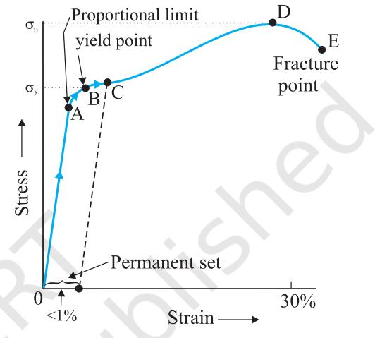
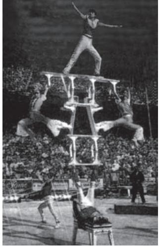
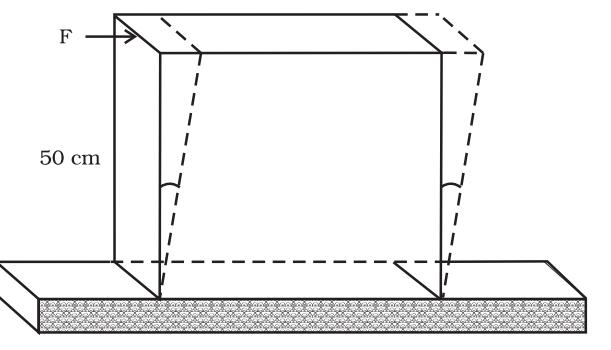
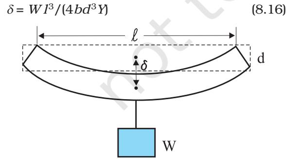
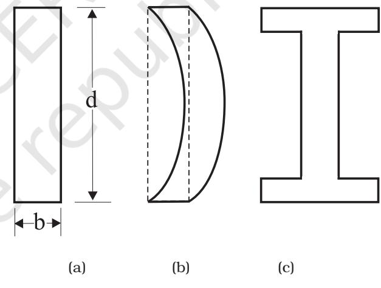
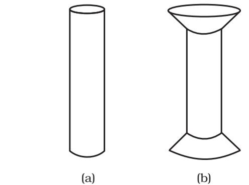
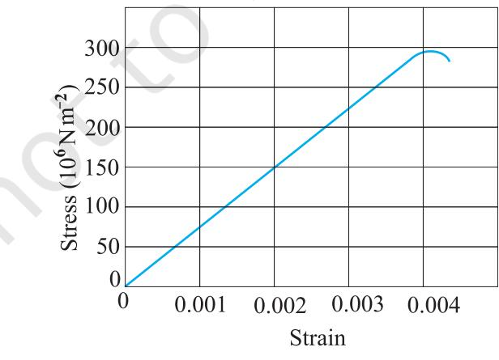
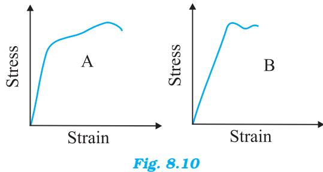
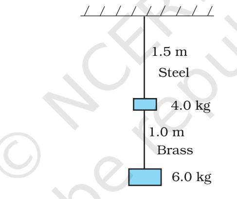

**CHAPTER EIGHT**

# **MECHANICAL PROPERTIES OF SOLIDS**

- **8.1** Introduction
- **8.2** Stress and strain
- **8.3** Hooke's law
- **8.4** Stress-strain curve
- **8.5** Elastic moduli
- **8.6** Applications of elastic behaviour of materials

Summary Points to ponder Exercises

# **8.1 INTRODUCTION**

In Chapter 6, we studied the rotation of the bodies and then realised that the motion of a body depends on how mass is distributed within the body. We restricted ourselves to simpler situations of rigid bodies. A rigid body generally means a hard solid object having a definite shape and size. But in reality, bodies can be stretched, compressed and bent. Even the appreciably rigid steel bar can be deformed when a sufficiently large external force is applied on it. This means that solid bodies are not perfectly rigid.

A solid has definite shape and size. In order to change (or deform) the shape or size of a body, a force is required. If you stretch a helical spring by gently pulling its ends, the length of the spring increases slightly. When you leave the ends of the spring, it regains its original size and shape. The property of a body, by virtue of which it tends to regain its original size and shape when the applied force is removed, is known as **elasticity** and the deformation caused is known as **elastic** deformation. However, if you apply force to a lump of putty or mud, they have no gross tendency to regain their previous shape, and they get permanently deformed. Such substances are called **plastic** and this property is called **plasticity.** Putty and mud are close to ideal plastics.

 The elastic behaviour of materials plays an important role in engineering design. For example, while designing a building, knowledge of elastic properties of materials like steel, concrete etc. is essential. The same is true in the design of bridges, automobiles, ropeways etc. One could also ask — Can we design an aeroplane which is very light but sufficiently strong? Can we design an artificial limb which is lighter but stronger? Why does a railway track have a particular shape like **I**? Why is glass brittle while brass is not? Answers to such questions begin with the study of how relatively simple kinds of loads or forces act to deform different solids bodies. In this chapter, we shall study the elastic behaviour and mechanical properties of solids which would answer many such questions.

#### **8.2 STRESS AND STRAIN**

When forces are applied on a body in such a manner that the body is still in static equilibrium, it is deformed to a small or large extent depending upon the nature of the material of the body and the magnitude of the deforming force. The deformation may not be noticeable visually in many materials but it is there. When a body is subjected to a deforming force, a restoring force is developed in the body. This restoring force is equal in magnitude but opposite in direction to the applied force. The restoring force per unit area is known as **stress.** If *F* is the force applied normal to the cross–section and *A* is the area of cross section of the body,

Magnitude of the stress = *F***/***A* (8.1) The SI unit of stress is N m–2 or pascal (Pa) and its dimensional formula is [ ML–1T –2 ].

There are three ways in which a solid may change its dimensions when an external force acts on it. These are shown in Fig. 8.1. In Fig.8.1(a), a cylinder is stretched by two equal forces applied normal to its cross-sectional area. The restoring force per unit area in this case is called **tensile stress**. If the cylinder is compressed under the action of applied forces, the restoring force per unit area is known as **compressive stress**. Tensile or compressive stress can also be termed as longitudinal stress.

In both the cases, there is a change in the length of the cylinder. The change in the length ∆*L* to the original length *L* of the body (cylinder in this case) is known as **longitudinal strain**.

Longitudinal strain $=\frac{\Delta L}{L}$ (8.2)

However, if two equal and opposite deforming forces are applied parallel to the cross-sectional area of the cylinder, as shown in Fig. 8.1(b), there is relative displacement between the opposite faces of the cylinder. The restoring force per unit area developed due to the applied tangential force is known as **tangential** or **shearing stress**.

As a result of applied tangential force, there is a relative displacement ∆*x* between opposite faces of the cylinder as shown in the Fig. 8.1(b). The strain so produced is known as **shearing strain** and it is defined as the ratio of relative displacement of the faces ∆*x* to the length of the cylinder *L*.

Shenaring strain = $\frac{\Delta x}{L}$ = tan $\theta$ (8.3)

where θ is the angular displacement of the cylinder from the vertical (original position of the cylinder). Usually θ is very small, tan θ is nearly equal to angle θ, (if θ = 10°, for example, there is only 1% difference between θ and tan θ).

It can also be visualised, when a book is pressed with the hand and pushed horizontally, as shown in Fig. 8.2 (c).

Thus, shearing strain = tan θ ≈ θ(8.4)

In Fig. 8.1 (d), a solid sphere placed in the fluid under high pressure is compressed uniformly on all sides. The force applied by the fluid acts in perpendicular direction at each point of the surface and the body is said to be under hydraulic compression. This leads to decrease

**Fig. 8.1** *(a) A cylindrical body under tensile stress elongates by* ∆*L (b) Shearing stress on a cylinder deforming it by an angle* θ *(c) A body subjected to shearing stress (d) A solid body under a stress normal to the surface at every point (hydraulic stress). The volumetric strain is* ∆*V/V, but there is no change in shape.*

in its volume without any change of its geometrical shape.

The body develops internal restoring forces that are equal and opposite to the forces applied by the fluid (the body restores its original shape and size when taken out from the fluid). The internal restoring force per unit area in this case is known as **hydraulic stress** and in magnitude is equal to the hydraulic pressure (applied force per unit area).

The strain produced by a hydraulic pressure is called **volume strain** and is defined as the ratio of change in volume (∆*V*) to the original volume (*V* ).

Volume strain = $\frac{\Delta V}{V}$ (8.5)

Since the strain is a ratio of change in dimension to the original dimension, it has no units or dimensional formula.

### **8.3 HOOKE'S LAW**

Stress and strain take different forms in the situations depicted in the Fig. (8.1). For small deformations the stress and strain are proportional to each other. This is known as Hooke's law.

Thus,

stress ∝ strain

stress = *k* × strain (8.6) where *k* is the proportionality constant and is known as modulus of elasticity.

Hooke's law is an empirical law and is found to be valid for most materials. However, there are some materials which do not exhibit this linear relationship.

#### **8.4 STRESS-STRAIN CURVE**

The relation between the stress and the strain for a given material under tensile stress can be found experimentally. In a standard test of tensile properties, a test cylinder or a wire is stretched by an applied force. The fractional change in length (the strain) and the applied force needed to cause the strain are recorded. The applied force is gradually increased in steps and the change in length is noted. A graph is plotted between the stress (which is equal in magnitude to the applied force per unit area) and the strain produced. A typical graph for a metal is shown in Fig. 8.2. Analogous graphs for compression and shear stress may also be obtained. The stress-strain curves vary from material to material. These curves help us to understand how a given material deforms with increasing loads. From the graph, we can see that in the region between O to A, the curve is linear. In this region, Hooke's law is obeyed. The body regains its original dimensions when the applied force is removed. In this region, the solid behaves as an elastic body.

**Fig. 8.2** *A typical stress-strain curve for a metal.*

In the region from A to B, stress and strain are not proportional. Nevertheless, the body still returns to its original dimension when the load is removed. The point B in the curve is known as **yield point** (also known as **elastic limit**) and the corresponding stress is known as **yield strength** (σ *y* ) of the material.

If the load is increased further, the stress developed exceeds the yield strength and strain increases rapidly even for a small change in the stress. The portion of the curve between B and D shows this. When the load is removed, say at some point C between B and D, the body does not regain its original dimension. In this case, even when the stress is zero, the strain is not zero. The material is said to have a **permanent set**. The deformation is said to be **plastic deformation**. The point D on the graph is the **ultimate tensile strength** (σ*u* ) of the material. Beyond this point, additional strain is produced even by a reduced applied force and fracture occurs at point E. If the ultimate strength and fracture points D and E are close, the material is said to be **brittle**. If they are far apart, the material is said to be **ductile**.

As stated earlier, the stress-strain behaviour varies from material to material. For example, rubber can be pulled to several times its original length and still returns to its original shape. Fig. 8.3 shows stress-strain curve for the elastic tissue of aorta, present in the heart. Note that although elastic region is very large, the material does not obey Hooke's law over most of the region. Secondly, there is no well defined plastic region. Substances like tissue of aorta, rubber etc. which can be stretched to cause large strains are called **elastomers**.

## **8.5 ELASTIC MODULI**

The proportional region within the elastic limit of the stress-strain curve (region OA in Fig. 8.2) is of great importance for structural and manufacturing engineering designs. The ratio of stress and strain, called **modulus of elasticity**, is found to be a characteristic of the material.

### **8.5.1 Young's Modulus**

Experimental observation show that for a given material, the magnitude of the strain produced is same whether the stress is tensile or compressive. The ratio of tensile (or compressive) stress (σ) to the longitudinal strain (ε) is defined as **Young's modulus** and is denoted by the symbol *Y*.

$Y=\frac{\sigma}{\epsilon}$ (8.7)

From Eqs. (8.1) and (8.2), we have

$Y=(F/A)/(\Delta L/D)$  
  
$=(F\times L)/(A\times\Delta L)$ (8.8)

Since strain is a dimensionless quantity, the unit of Young's modulus is the same as that of stress *i.e.*, N m–2 or Pascal (Pa). Table 8.1 gives the values of Young's moduli and yield strengths of some material.

From the data given in Table 8.1, it is noticed that for metals Young's moduli are large.

| Substance | Density p (kg m ") | Young's modulus Y (10°N m2) | Ultimate strength, | Yield strength o (106 N m2) |
| --- | --- | --- | --- | --- |
|  |  |  | σ. (10° N m2) |  |
| Aluminium | 2710 | 70 | 110 | 95 |
| Copper | 8890 | 110 | 400 | 200 |
| Iron (wrought) | 7800-7900 | 190 | 330 | 170 |
| Steel | 7860 | 200 | 400 | 250 |
| Glass# | 2190 | 65 | 50 |  |
| Concrete | 2320 | 30 | 40 | - |
| Wood# | 525 | 13 | 50 | - |
| Bone# | 1900 | 9.4 | 170 | - |
| Polystyrene | 1050 | 3 | 48 |  |

#### **Table 8.1 Young's moduli and yield strenghs of some material**

# *Substance tested under compression*

Therefore, these materials require a large force to produce small change in length. To increase the length of a thin steel wire of 0.1 cm2 crosssectional area by 0.1%, a force of 2000 N is required. The force required to produce the same strain in aluminium, brass and copper wires having the same cross-sectional area are 690 N, 900 N and 1100 N respectively. It means that steel is more elastic than copper, brass and aluminium. It is for this reason that steel is preferred in heavy-duty machines and in structural designs. Wood, bone, concrete and glass have rather small Young's moduli.

- u **Example 8.1** A structural steel rod has a radius of 10 mm and a length of 1.0 m. A 100 kN force stretches it along its length. Calculate (a) stress, (b) elongation, and (c) strain on the rod. Young's modulus, of structural steel is 2.0 × 1011 N m-2 .
**Answer** We assume that the rod is held by a clamp at one end, and the force *F* is applied at the other end, parallel to the length of the rod. Then the stress on the rod is given by

$\begin{array}{c}\text{Stress}=\dfrac{F}{A}=\dfrac{F}{2}\\ \text{}=\dfrac{100\times10^{3}\,\text{N}}{3.14\times\left(10^{-2}\,\text{m}\right)^{2}}\\ \text{}=3.18\times10^{8}\,\text{N m}^{-2}\\ \text{}\Delta L=\dfrac{\left(F/A\right)L}{Y}\\ \text{}=\dfrac{\left(3.18\times10^{8}\,\text{N m}^{-2}\right)\left(1\text{m}\right)}{2\times10^{11}\,\text{N m}^{-2}}\\ \text{}=1.59\times10^{-3}\,\text{m}\\ \text{}=1.59\,\text{mm}\end{array}$  
  
The strain is given by  
  
$\begin{array}{c}\text{Strain}=\Delta L/L\\ \text{}=(1.59\times10^{-3}\,\text{m})/(1\text{m})\end{array}$

= 1.59 × 10–3

u

**Example 8.2** A copper wire of length 2.2 m and a steel wire of length 1.6 m, both of diameter 3.0 mm, are connected end to end. When stretched by a load, the net elongation is found to be 0.70 mm. Obtain the load applied.

= 0.16 % ⊳

**Answer** The copper and steel wires are under a tensile stress because they have the same tension (equal to the load *W*) and the same area of cross-section *A*. From Eq. (8.7) we have stress = strain × Young's modulus. Therefore

*W/A = Yc* × (∆*Lc* /*Lc* ) = *Ys* × (∆*Ls* /*Ls* ) where the subscripts *c* and *s* refer to copper and stainless steel respectively. Or,

∆*Lc* /∆*Ls* = (*Ys /Yc* ) × (*Lc /Ls* ) Given *Lc* = 2.2 m, *Ls* = 1.6 m, From Table 9.1 *Yc* = 1.1 × 1011 N.m–2, and = 2.0 × 1011 N.m–2 .

$Y_{s}=2.0\times10^{11}$ N.m${}^{-2}$.  
  
$\Delta L_{c}/\Delta L_{s}=(2.0\times10^{11}/1.1\times10^{11})\times(2.2/1.6)=2.5$.  
  
The total elongation is given to be 

$\Delta L_{c}+\Delta L_{s}=7.0\times10^{-4}$ m.  
  

Solving the above equations,

∆*Lc* = 5.0 × 10-4 m, and ∆*Ls* = 2.0 × 10-4 m. Therefore

- *W* = (*A* × *Yc* × ∆*Lc* )/*Lc*
- = π (1.5 × 10-3) 2 × [(5.0 × 10-4 × 1.1 × 1011)/2.2] = 1.8 × 102 N ⊳

u**Example 8.3** In a human pyramid in a circus, the entire weight of the balanced group is supported by the legs of a performer who is lying on his back (as shown in Fig. 8.4). The combined mass of all the persons performing the act, and the tables, plaques etc. involved is 280 kg. The mass of the performer lying on his back at the bottom of the pyramid is 60 kg. Each thighbone (femur) of this performer has a length of 50 cm and an effective radius of 2.0 cm. Determine the amount by which each thighbone gets compressed under the extra load.

**Fig. 8.4** *Human pyramid in a circus.*

**Answer** Total mass of all the performers, tables, plaques etc. = 280 kg Mass of the performer = 60 kg Mass supported by the legs of the performer at the bottom of the pyramid = 280 – 60 = 220 kg Weight of this supported mass = 220 kg wt. = 220 × 9.8 N = 2156 N. Weight supported by each thighbone of the performer = ½ (2156) N = 1078 N. From Table 9.1, the Young's modulus for bone is given by

.

*Y* = 9.4 × 109 N m–2

Length of each thighbone *L* = 0.5 m

the radius of thighbone = 2.0 cm Thus the cross-sectional area of the thighbone

*A* = π × (2 × 10-2) 2 m2 = 1.26 × 10-3 m2 . Using Eq. (9.8), the compression in each thighbone (∆*L*) can be computed as

- ∆*L* = [(*F* × *L*)/(*Y* × *A*)]
= [(1078 $\times$ 0.5)/(9.4 $\times$ 10${}^{9}$ $\times$ 1.26 $\times$ 10${}^{3}$)] = 4.55 $\times$ 10${}^{-5}$ m or 4.55 $\times$ 10${}^{-3}$ cm.  
  

This is a very small change! The fractional decrease in the thighbone is ∆*L/L* = 0.000091 or 0.0091%. ⊳

# **8.5.2 Shear Modulus**

The ratio of shearing stress to the corresponding shearing strain is called the *shear modulus* of the material and is represented by *G*. It is also called the *modulus of rigidity*.

> *G* = shearing stress (σs )/shearing strain

$G=(F/A)/(\Delta x/L)$  
  
$=(F\times L)/(A\times\Delta x)$  
  
Similarly, from Eq. (9.4)

$$G\ =(F/A)/\theta\qquad\Longleftrightarrow$$

$=F/(A\times\theta)$ (8.11)

The shearing stress σs can also be expressed as σs = *G* × θ(8.12)

SI unit of shear modulus is N m–2 or Pa. The shear moduli of a few common materials are given in Table 9.2. It can be seen that shear modulus (or modulus of rigidity) is generally less than Young's modulus (from Table 9.1). For most materials *G* ≈ *Y*/3.

#### **Table 8.2 Shear moduli (G) of some common materials**

| Material | G (109 Nm–2 or GPa) |
| --- | --- |
| Aluminium | 25 |
| Brass | 36 |
| Copper | 42 |
| Glass | 23 |
| Iron | 70 |
| Lead | 5.6 |
| Nickel | 77 |
| Steel | 84 |
| Tungsten | 150 |
| Wood | 10 |

u **Example 8.4** A square lead slab of side 50 cm and thickness 10 cm is subject to a shearing force (on its narrow face) of 9.0 × 104 N. The lower edge is riveted to the floor. How much will the upper edge be displaced?

**Answer** The lead slab is fixed and the force is applied parallel to the narrow face as shown in Fig. 8.6. The area of the face parallel to which this force is applied is

 *A* = 50 cm × 10 cm

= 0.5 m × 0.1 m

= 0.05 m2

Therefore, the stress applied is = (9.4 × 104 N/0.05 m2 ) = 1.80 × 106 N.m–2

#### **Fig. 8.5**

We know that shearing strain = (∆*x*/*L)=* Stress /*G.* Therefore the displacement ∆*x* = (Stress × *L*)/*G* = (1.8 × 106 N m–2 × 0.5m)/(5.6 × 109 N m–2) = 1.6 × 10–4 m = 0.16 mm ⊳

## **8.5.3 Bulk Modulus**

In Section (8.3), we have seen that when a body is submerged in a fluid, it undergoes a hydraulic stress (equal in magnitude to the hydraulic pressure). This leads to the decrease in the volume of the body thus producing a strain called volume strain [Eq. (8.5)]. The ratio of hydraulic stress to the corresponding hydraulic strain is called *bulk modulus*. It is denoted by symbol *B*.

$B=-\,p/(\Delta V/V)$ (8.12)

The negative sign indicates the fact that with an increase in pressure, a decrease in volume occurs. That is, if *p* is positive, ∆*V* is negative. Thus for a system in equilibrium, the value of bulk modulus *B* is always positive. SI unit of bulk modulus is the same as that of pressure *i.e.*, N m–2 or Pa. The bulk moduli of a few common materials are given in Table 8.3.

The reciprocal of the bulk modulus is called *compressibility* and is denoted by *k*. It is defined as the fractional change in volume per unit increase in pressure.

$k=(1/B)=-(1/\Delta p)\times(\Delta V/V)$ (8.13)

It can be seen from the data given in Table 8.3 that the bulk moduli for solids are much larger than for liquids, which are again much larger than the bulk modulus for gases (air).

| Table 8.3 | Bulk moduli | (B) of some common |
| --- | --- | --- |
|  | Materials |  |

| Material | B (109 N m–2 or GPa) |
| --- | --- |
| Solids |  |
| Aluminium | 72 |
| Brass | 61 |
| Copper | 140 |
| Glass | 37 |
| Iron | 100 |
| Nickel | 260 |
| Steel | 160 |
| Liquids |  |
| Water | 2.2 |
| Ethanol | 0.9 |
| Carbon disulphide | 1.56 |
| Glycerine | 4.76 |
| Mercury | 25 |
| Gases |  |
| Air (at STP) | 1.0 × 10–4 |

| Type of | Stress | Strain | Change in |  | Elastic | Name of | State of |
| --- | --- | --- | --- | --- | --- | --- | --- |
| stress |  |  | shape volume |  | Modulus | Modulus | Matter |
| Tensile or | Two equal and opposite forces | Elongation or compression | Yes | No | Y = (F×L)/ Young's (A×∆L) | modulus | Solid |
| compressive | perpendicular to | parallel to force |  |  |  |  |  |
| (σ = F/A) | opposite faces | direction (∆L/L) |  |  |  |  |  |
|  |  | (longitudinal strain) |  |  |  |  |  |
| Shearing | Two equal and | θ Pure shear, | Yes | No | θ G = F/(A× ) | Shear | Solid |
| (σs = F/A) | opposite forces |  |  |  |  | modulus |  |
|  | parallel to oppoiste |  |  |  |  | or modulus |  |
|  | surfaces forces |  |  |  |  | of rigidity |  |
|  | in each case such |  |  |  |  |  |  |
|  | that total force and |  |  |  |  |  |  |
|  | total torque on the |  |  |  |  |  |  |
|  | body vanishes |  |  |  |  |  |  |
| Hydraulic | Forces perpendicular | Volume change | No | Yes | B = –p/(∆V/V) Bulk |  | Solid, liquid |
|  | everywhere to the | (compression or |  |  |  | modulus | and gas |
|  | surface, force per | elongation) |  |  |  |  |  |
|  | unit area (pressure) | (∆V/V) |  |  |  |  |  |
|  | same everywhere. |  |  |  |  |  |  |

| Table 8.4 Stress, strain and various elastic moduli |
| --- |

u

Thus, solids are the least compressible, whereas, gases are the most compressible. Gases are about a million times more compressible than solids! Gases have large compressibilities, which vary with pressure and temperature. The incompressibility of the solids is primarily due to the tight coupling between the neighbouring atoms. The molecules in liquids are also bound with their neighbours but not as strong as in solids. Molecules in gases are very poorly coupled to their neighbours.

Table 8.4 shows the various types of stress, strain, elastic moduli, and the applicable state of matter at a glance.

**Example 8.5** The average depth of Indian Ocean is about 3000 m. Calculate the fractional compression, ∆*V/V***,** of water at the bottom of the ocean, given that the bulk modulus of water is 2.2 × 109 N m–2. (Take *g* = 10 m s–2)

**Answer** The pressure exerted by a 3000 m column of water on the bottom layer

*p* = *h*ρ *g* = 3000 m × 1000 kg m–3 × 10 m s–2 = 3 × 107 kg m–1 s-2 = 3 × 107 N m–2 Fractional compression ∆*V/V*, is

∆*V/V* = stress/*B =* (3 × 107 N m-2)/(2.2 × 109 N m–2 ) = 1.36 × 10-2 or 1.36 % ⊳

# **8.5.4 POISSON'S RATIO**

The strain perpendicular to the applied force is called **lateral strain**. Simon Poisson pointed out that within the elastic limit, lateral strain is directly proportional to the longitudinal strain. The ratio of the lateral strain to the longitudinal strain in a stretched wire is called **Poisson's ratio.** If the original diameter of the wire is *d* and the contraction of the diameter under stress is ∆*d*, the lateral strain is ∆*d*/*d*. If the original length of the wire is *L* and the elongation under stress is ∆*L*, the longitudinal strain is ∆*L/L*. Poisson's ratio is then (∆*d*/*d*)/(∆*L/L*) or (∆*d/*∆*L*)

× (*L/d*). Poisson's ratio is a ratio of two strains; it is a pure number and has no dimensions or units. Its value depends only on the nature of material. For steels the value is between 0.28 and 0.30, and for aluminium alloys it is about 0.33.

# **8.5.5 Elastic Potential Energy in a Stretched Wire**

When a wire is put under a tensile stress, work is done against the inter-atomic forces. This work is stored in the wire in the form of elastic potential energy. When a wire of original length *L* and area of cross-section *A* is subjected to a deforming force *F* along the length of the wire, let the length of the wire be elongated by *l*. Then from Eq. (8.8), we have *F = YA ×* (*l/L*). Here *Y* is the Young's modulus of the material of the wire. Now for a further elongation of infinitesimal small length d*l*, work done d*W* is *F* d*l* or *YAl*d*l/ L*. Therefore, the amount of work done (*W*) in increasing the length of the wire from *L* to *L + l*, that is from *l =* 0 to *l = l* is

$W=\int_{0}^{1}\frac{Y\!A\!l}{L}dl=\frac{YA}{2}\times\frac{1}{L}$  
  
$W=\frac{1}{2}\times Y\!\times\!\left(\frac{1}{L}\right)^{2}\times\!A\!L$  
  
$1$  
  
$\times$ Young's modulus $\times$ strain${}^{2}\times\frac{1}{2}$  
  
volume of the wire 

$$={\frac{1}{2}}\times{\frac{\mathrm{stress}\times\mathrm{strain}\times\mathrm{volume~of~the}}{\mathrm{wire}}}$$

This work is stored in the wire in the form of elastic potential energy (*U*). Therefore the elastic potential energy per unit volume of the wire (*u*) is

$\alpha=\frac{1}{2}\cdot\sigma\varepsilon$ (8.14)

# **8.6 APPLICATIONS OF ELASTIC BEHAVIOUR OF MATERIALS**

The elastic behaviour of materials plays an important role in everyday life. All engineering designs require precise knowledge of the elastic behaviour of materials. For example while designing a building, the structural design of the columns, beams and supports require knowledge of strength of materials used. Have you ever thought why the beams used in construction of bridges, as supports etc. have a cross-section of the type **I**? Why does a heap of sand or a hill have a pyramidal shape? Answers to these questions can be obtained from the study of structural engineering which is based on concepts developed here.

Cranes used for lifting and moving heavy loads from one place to another have a thick metal rope to which the load is attached. The rope is pulled up using pulleys and motors. Suppose we want to make a crane, which has a lifting capacity of 10 tonnes or metric tons (1 metric ton = 1000 kg). How thick should the steel rope be? We obviously want that the load does not deform the rope permanently. Therefore, the extension should not exceed the elastic limit. From Table 8.1, we find that mild steel has a yield strength (σ *y* ) of about 300 × 106 N m–2. Thus, the area of cross-section (*A*) of the rope should at least be

$A\geq W/\sigma_{y}=Mg/\sigma_{y}$ (8.15) $=(10^{4}\ \rm kg\times9.8\ m\ s^{\cdot2})/(300\times10^{6}\ N\ m^{\cdot2})$ $=3.3\times10^{\cdot4}\ m^{2}$

corresponding to a radius of about 1 cm for a rope of circular cross-section. Generally a large margin of safety (of about a factor of ten in the load) is provided. Thus a thicker rope of radius about 3 cm is recommended. A single wire of this radius would practically be a rigid rod. So the ropes are always made of a number of thin wires braided together, like in pigtails, for ease in manufacture, flexibility and strength.

A bridge has to be designed such that it can withstand the load of the flowing traffic, the force of winds and its own weight. Similarly, in the design of buildings the use of beams and columns is very common. In both the cases, the overcoming of the problem of bending of beam under a load is of prime importance. The beam should not bend too much or break. Let us consider the case of a beam loaded at the centre and supported near its ends as shown in Fig. 8.6. A bar of length *l*, breadth *b*, and depth *d* when loaded at the centre by a load *W* sags by an amount given by

**Fig. 8.6** *A beam supported at the ends and loaded at the centre.*

This relation can be derived using what you have already learnt and a little calculus. From Eq. (8.16), we see that to reduce the bending for a given load, one should use a material with a large Young's modulus *Y*. For a given material, increasing the depth *d* rather than the breadth *b* is more effective in reducing the bending, since δ is proportional to *d* -3 and only to *b* -1(of course the length *l* of the span should be as small as possible). But on increasing the depth, unless the load is exactly at the right place (difficult to arrange in a bridge with moving traffic), the deep bar may bend as shown in Fig. 8.7(b). This is called buckling. To avoid this, a common compromise is the cross-sectional shape shown in Fig. 8.7(c). This section provides a large loadbearing surface and enough depth to prevent bending. This shape reduces the weight of the beam without sacrificing the strength and hence reduces the cost.

The use of pillars or columns is also very common in buildings and bridges. A pillar with rounded ends as shown in Fig. 8.9(a) supports less load than that with a distributed shape at the ends [Fig. 8.9(b)]. The precise design of a bridge or a building has to take into account the conditions under which it will function, the cost and long period, reliability of usable material, etc.

The answer to the question why the maximum height of a mountain on earth is ~10 km can also be provided by considering the elastic properties of rocks. A mountain base is not under uniform compression and this provides some shearing stress to the rocks under which they can flow. The stress due to all the material on the top should be less than the critical shearing stress at which the rocks flow.

At the bottom of a mountain of height *h,* the force per unit area due to the weight of the mountain is *h*ρ*g* where ρ is the density of the material of the mountain and *g* is the acceleration due to gravity. The material at the bottom experiences this force in the vertical direction, and the sides of the mountain are free. Therefore, this is not a case of pressure or bulk compression. There is a shear component, approximately *h*ρ*g* itself. Now the elastic limit for a typical rock is 30 × 107 N m-2. Equating this to *h*ρ*g*, with ρ = 3 × 103 kg m-3 gives

- *h*ρ*g* = 30 × 107 N m-2 .
- *h* = 30 × 107 N m-2/(3 × 103 kg m-3 × 10 m s-2) = 10 km

which is more than the height of Mt. Everest!

#### **SUMMARY**

- 1. Stress is the restoring force per unit area and strain is the fractional change in dimension. In general there are three types of stresses (a) tensile stress — longitudinal stress (associated with stretching) or compressive stress (associated with compression), (b) shearing stress, and (c) hydraulic stress.
- 2. For small deformations, stress is directly proportional to the strain for many materials. This is known as Hooke's law. The constant of proportionality is called modulus of elasticity. Three elastic moduli *viz.,* Young's modulus, shear modulus and bulk modulus are used to describe the elastic behaviour of objects as they respond to deforming forces that act on them.

A class of solids called elastomers does not obey Hooke's law.

- 3. When an object is under tension or compression, the Hooke's law takes the form *F/A* = *Y*∆*L/L*
where ∆*L/L* is the tensile or compressive strain of the object, *F* is the magnitude of the applied force causing the strain, *A* is the cross-sectional area over which *F* is applied (perpendicular to *A*) and *Y* is the Young's modulus for the object. The stress is *F/A.*

- 4. A pair of forces when applied parallel to the upper and lower faces, the solid deforms so that the upper face moves sideways with respect to the lower. The horizontal displacement ∆*L* of the upper face is perpendicular to the vertical height *L.* This type of deformation is called shear and the corresponding stress is the shearing stress. This type of stress is possible only in solids.
In this kind of deformation the Hooke's law takes the form

*F/A = G* × ∆*L/L*

where ∆*L* is the displacement of one end of object in the direction of the applied force *F*, and *G* is the shear modulus.

- 5. When an object undergoes hydraulic compression due to a stress exerted by a surrounding fluid, the Hooke's law takes the form
*p* = *B* (∆*V/V*),

where *p* is the pressure (hydraulic stress) on the object due to the fluid, ∆*V/V* (the volume strain) is the absolute fractional change in the object's volume due to that pressure and *B* is the bulk modulus of the object.

### **POINTS TO PONDER**

- 1. In the case of a wire, suspended from celing and stretched under the action of a weight (*F*) suspended from its other end, the force exerted by the ceiling on it is equal and opposite to the weight. However, the tension at any cross-section *A* of the wire is just *F* and not 2*F*. Hence, tensile stress which is equal to the tension per unit area is equal to *F/A*.
- 2. Hooke's law is valid only in the linear part of stress-strain curve.
- 3. The Young's modulus and shear modulus are relevant only for solids since only solids have lengths and shapes.
- 4. Bulk modulus is relevant for solids, liquid and gases. It refers to the change in volume when every part of the body is under the uniform stress so that the shape of the body remains unchanged.
- 5. Metals have larger values of Young's modulus than alloys and elastomers. A material with large value of Young's modulus requires a large force to produce small changes in its length.
- 6. In daily life, we feel that a material which stretches more is more elastic, but it a is misnomer. In fact material which stretches to a lesser extent for a given load is considered to be more elastic.
- 7. In general, a deforming force in one direction can produce strains in other directions also. The proportionality between stress and strain in such situations cannot be described by just one elastic constant. For example, for a wire under longitudinal strain, the lateral dimensions (radius of cross section) will undergo a small change, which is described by another elastic constant of the material (called *Poisson ratio*).
- 8. Stress is not a vector quantity since, unlike a force, the stress cannot be assigned a specific direction. Force acting on the portion of a body on a specified side of a section has a definite direction.

#### **EXERCISES**

- **8.1** A steel wire of length 4.7 m and cross-sectional area 3.0 × 10-5 m2 stretches by the same amount as a copper wire of length 3.5 m and cross-sectional area of 4.0 × 10–5 m2 under a given load. What is the ratio of the Young's modulus of steel to that of copper?
- **8.2** Figure 8.9 shows the strain-stress curve for a given material. What are (a) Young's modulus and (b) approximate yield strength for this material?

**Fig. 8.9**

- **8.3** The stress-strain graphs for materials *A* and *B* are shown in Fig. 8.10.

The graphs are drawn to the same scale.

- (a) Which of the materials has the greater Young's modulus?
- (b) Which of the two is the stronger material?
- **8.4** Read the following two statements below carefully and state, with reasons, if it is true or false.
	- (a) The Young's modulus of rubber is greater than that of steel;
	- (b) The stretching of a coil is determined by its shear modulus.
- **8.5** Two wires of diameter 0.25 cm, one made of steel and the other made of brass are loaded as shown in Fig. 8.11. The unloaded length of steel wire is 1.5 m and that of brass wire is 1.0 m. Compute the elongations of the steel and the brass wires.

#### **Fig. 8.11**

- **8.6** The edge of an aluminium cube is 10 cm long. One face of the cube is firmly fixed to a vertical wall. A mass of 100 kg is then attached to the opposite face of the cube. The shear modulus of aluminium is 25 GPa. What is the vertical deflection of this face?
- **8.7** Four identical hollow cylindrical columns of mild steel support a big structure of mass 50,000 kg. The inner and outer radii of each column are 30 and 60 cm respectively. Assuming the load distribution to be uniform, calculate the compressional strain of each column.
- **8.8** A piece of copper having a rectangular cross-section of 15.2 mm × 19.1 mm is pulled in tension with 44,500 N force, producing only elastic deformation. Calculate the resulting strain?
- **8.9** A steel cable with a radius of 1.5 cm supports a chairlift at a ski area. If the maximum stress is not to exceed 108 N m–2, what is the maximum load the cable can support ?
- **8.10** A rigid bar of mass 15 kg is supported symmetrically by three wires each 2.0 m long. Those at each end are of copper and the middle one is of iron. Determine the ratios of their diameters if each is to have the same tension.
- **8.11** A 14.5 kg mass, fastened to the end of a steel wire of unstretched length 1.0 m, is whirled in a vertical circle with an angular velocity of 2 rev/s at the bottom of the circle. The cross-sectional area of the wire is 0.065 cm2 . Calculate the elongation of the wire when the mass is at the lowest point of its path.
- **8.12** Compute the bulk modulus of water from the following data: Initial volume = 100.0 litre, Pressure increase = 100.0 atm (1 atm = 1.013 × 105 Pa), Final volume = 100.5 litre. Compare the bulk modulus of water with that of air (at constant temperature). Explain in simple terms why the ratio is so large.
- **8.13** What is the density of water at a depth where pressure is 80.0 atm, given that its density at the surface is 1.03 × 103 kg m–3?
- **8.14** Compute the fractional change in volume of a glass slab, when subjected to a hydraulic pressure of 10 atm.
- **8.15** Determine the volume contraction of a solid copper cube, 10 cm on an edge, when subjected to a hydraulic pressure of 7.0 × 106 Pa.
- **8.16** How much should the pressure on a litre of water be changed to compress it by 0.10%? carry one quarter of the load.

