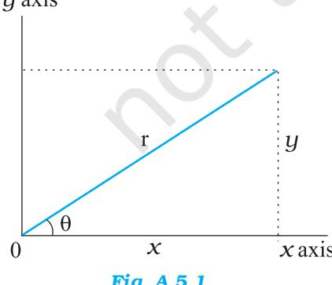
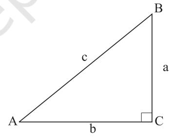
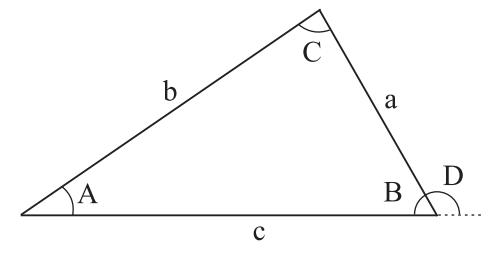

144 PHYSICS

# APPENDIX A 1

### THE GREEK ALPHABET

| Alpha | A | Q | Iota | - | 1. | Rho | b | O |
| --- | --- | --- | --- | --- | --- | --- | --- | --- |
| Beta | в | B | Kappa | K | K | Sigma | Σ | O |
| Gamma | I | V | Lambda | 1 | 2 | Tau | . | TU |
| Delta | △ | 8 | Mu | M | 11 | Upsilon | V | 1) |
| Epsilon | E | ε | Nu | N |  | Phi | Ф | Ф, Ф |
| Zeta | Z | S | Xi | I | 5 | Chi | X | X |
| Eta | H | n | Omicron | O | O | Psi | ਪ | U |
| Theta | 0 | 0 | Pi |  | 710 | Omega | (2 | 0 |

# APPENDIX A 2

# COMMON SI PREFIXES AND SYMBOLS FOR MULTIPLES AND SUB-MULTIPLES

|  | Multiple |  |  | Sub -Multiple |  |
| --- | --- | --- | --- | --- | --- |
| Factor | Prefix | Symbol | Factor | Prefix | symbol |
| 1018 | Exa | E | 10-18 | atto | a |
| 1015 | Peta | b | 10-15 | femto | t |
| 10 - | Tera | T | 10-12 | pico | p |
| 10° | Giga | G | 10-9 | nano | n |
| 100 | Mega | M | 10-6 | micro | ال |
| 103 | kilo | k | 10-3 | milli | m |
| 102 | Hecto | h | 10-2 | centi | C |
| 10' | Deca | da | 10-1 | deci | d |

# APPENDIX A 3 SOME IMPORTANT CONSTANTS

| Name | Symbol | Value |
| --- | --- | --- |
| Speed of light in vacuum | C | 2.9979 × 10˚ m s-¹ |
| Charge of electron | e | 1.602 × 10-19 C |
| Gravitational constant | G | 6.673 × 10-11 N m2 kg-2 |
| Planck constant | h | 6.626 × 10-34 J s |
| Boltzmann constant | k | 1.381 × 10-23 J K-1 |
| Avogadro number | NA | 6.022 × 1023 mol-4 |
| Universal gas constant | R | 8.314 J mol - K-1 |
| Mass of electron | m | 9.110 × 10-31 kg |
| Mass of neutron | mn | 1.675 × 10-27 kg |
| Mass of proton | mp | 1.673 × 10-4 kg |
| Electron-charge to mass ratio | e/m. | 1.759 × 10 C/kg |
| Faraday constant | F | 9.648 × 104 C/mol |
| Rydberg constant | R | 1.097 × 107 m-1 |
| Bohr radius | an | 5.292 × 10-1 m |
| Stefan-Boltzmann constant | ರ | 5.670 × 10 * W m - K - |
| Wien's Constant | b | 2.898 × 103 m K |
| Permittivity of free space | E0 | 8.854 × 10-12 C2 N 1m2 |
|  | 1/4περ | 8.987 × 10° N m2 C-2 |
| Permeability of free space | Ho | 4T × 10-7 T m A-1 |
|  |  | = 1.257 × 10 + Wb A - m -1 |

# Other useful constants

| Name | Symbol | Value |
| --- | --- | --- |
| Mechanical equivalent of heat | J | 4.186 J cal-' |
| Standard atmospheric pressure | l atm | 1.013 × 10°Pa |
| Absolute zero | 0 K | -273.15 °C |
| Electron volt | l eV | 1.602×10-17J |
| Unified Atomic mass unit | l u | 1.661× 10-27 kg |
| Electron rest energy | mc2 | 0.511 MeV |
| Energy equivalent of 1 u | 1 uc2 | 931.5 MeV |
| Volume of ideal gas(0 ℃ and 1atm) | V | 22.4 L mol |
| Acceleration due to gravity | g | 9.78049 m s-2 |
| (sea level, at equator) |  |  |

# APPENDIX A 4 CONVERSION FACTORS

Conversion factors are written as equations for simplicity.

1 km = 0.6215 mi π rad = 180° 1mi = 1.609 km 1 rad = 57.30° 1m = 1.0936 yd = 3.281 ft = 39.37 in 1 1 in = 2.54 cm 1 rev min–1 = 0.1047 rad s–1 1 ft = 12 in = 30.48 cm 1 rad s–1 = 9.549 rev min–1 1 yd = 3ft = 91.44 cm Mass 1 lightyear = 1 ly = 9.461 x 1015m 1 kg = 1000 g 1 A ° = 0.1nm 1 tonne = 1000 kg = 1 Mg

1 m2 = 104 1km2 = 0.3861 mi2 1 in2 = 6.4516 cm2 1 kg = 6.852 × 10–2 slug 1ft2 = 9.29 x 10-2m2 1 u = 931.50 MeV/c2 1 m2 = 10.76 ft2 Density 1 mi2 = 460 acres = 2.590 km2 Force

1m3= 106 cm3 1 lbf = 4.4482 N 1 L = 1000 cm3 = 10-3 m3 1 kgf = 2.2046 lbf 1 gal = 3.786 L Time 1 gal = 4 qt = 8 pt = 128 oz = 231 in3 1 h = 60 min = 3.6 ks 1 in3 = 16.39 cm3 1 d = 24 h = 1440 min = 86.4 ks 1ft3 = 1728 in3 = 28.32 L = 2.832 × 104 cm3 1y = 365.24 d = 31.56 Ms

1 km h–1 = 0.2778 m s–1 = 0.6215 mi h 1mi h–1 = 0.4470 m s–1 = 1.609 km h–1 1 bar = 100 kPa 1mi h–1 = 1.467 ft s–1 1 atm = 101.325 kPa = 1.01325 bar

# Length Angle and Angular Speed

° = 1.745 × 10–2 rad

Area 1 u = 1.6606 × 10–27 kg cm2 1 kg = 6.022 × 1026 u = 247.1 acres 1 slug = 14.59 kg 1 acre = 43,560 ft2 1 g cm–3 = 1000 kg m–3 = 1 kg L–1 Volume 1 N = 0.2248 lbf = 105 dyn

# Speed Pressure

–1 1 Pa = 1 N m–2 Magnetic Field 1atm = 14.7 lbf/in2 = 760 mm Hg 1 G = 10–4 T = 29.9 in Hg = 33.8 ft H2O 1 T = 1 Wb m–2 = 104 G 1 lbf in–2 = 6.895 kPa 1 torr = 1mm Hg = 133.32 Pa

# Energy Power

1 kW h = 3.6 MJ 1 horsepower (hp) = 550 ft lbf/s 1 cal = 4.186 J = 745.7 W 1ft lbf = 1.356 J = 1.286 × 10–3 Btu 1 Btu min–1 = 17.58 W 1 L atm = 101.325 J 1 W = 1.341 × 10–3 hp 1 L atm = 24.217 cal = 0.7376 ft lbf/s 1 Btu = 778 ft lb = 252 cal = 1054.35 J Thermal Conductivity 1 eV = 1.602 × 10–19J 1 W m–1 K 1 u *c* 2 = 931.50 MeV 1 Btu in/hft2 1 erg = 10–7J

–1 = 6.938 Btu in/hft2 °F

°F = 0.1441 W/m K

# APPENDIX A 5 MATHEMATICAL FORMULAE

# Geometry

Circle of radius r: circumference = 2π*r;* area = π*r* 2 Sphere of radius *r:* area = 4π*r* 2 *;*

volume = 4 3 3 π *r*

Right circular cylinder of radius *r* and height *h:* area = 2π *r* 2 +2π *r h*;

volume = *hr* 2 π ; Triangle of base *a* and altitude *h*.

area = 1 2  *a h*

then

# Quadratic Formula

If *ax*2  *+ bx + c =* 0,

$$x={\frac{-b\pm{\sqrt{b^{2}-4\,a c}}}{2a}}$$

Trigonometric Functions of Angle θ

sin cos tan cot sec csc *y x r r y x x y r r x y* θ θ θ θ θ θ = = = = = =

# Pythagorean Theorem

In this right triangle, a2 + b2 = c2

*Fig. A 5.2*

# Triangles

Angles are *A, B, C* Opposite sides are *a, b, c* Angles *A + B + C* = 1800

$\frac{\sin A}{a}=\frac{\sin B}{b}=\frac{\sin C}{c}$  
  
$\frac{\sin A}{a}=\frac{\sin B}{b}=\frac{\sin C}{c}$  
  
$\frac{\sin A}{a}=\frac{\sin B}{b}=\frac{\sin C}{c}$  
  
$\frac{\sin A}{a}=\frac{\sin B}{b}=\frac{\sin C}{c}$  
  
$\frac{\sin A}{a}=\frac{\sin B}{b}=\frac{\sin C}{c}$  
  
$\frac{\sin A}{a}=\frac{\sin B}{b}=\frac{\sin C}{c}$  
  
$\frac{\sin A}{a}=\frac{\sin B}{b}=\frac{\sin C}{c}$  

$${\mathrm{Fig.~}}A{\mathrm{~}}5.3$$

### Mathematical Signs and Symbols

= equals

- ≅ equals approximately
- ~ is the order of magnitude of
- ≠ is not equal to
- ≡ is identical to, is defined as
- > is greater than (>> is much greater than)
- < is less than (<< is much less than)
- ≥ is greater than or equal to (or, is no less than)
- ≤ is less than or equal to (or, is no more than)

± plus or minus

- ∝ is proportional to
∑ the sum of

- x or < *x* > or *x*av the average value of *x*
### Trigonometric Identities

$\sin\,(90^{0}-\theta)=\cos\,\theta$  
  
$\cos\,(90^{0}-\,\theta)=\sin\,\theta$  
  
$\sin\,\theta/\,\cos\,\theta=\tan\,\theta$  
  
$\sin^{2}\,\theta+\,\cos^{2}\,\theta=1$  
  
$\sec^{2}\,\theta-\tan^{2}\,\theta=1$  
  
$\csc^{2}\,\theta-\cot^{2}\,\theta=1$  
  
$\sin2\,\theta=2\,\sin\,\theta\cos\,\theta$  
  
$\cos2\,\theta=\cos^{2}\,\theta-\sin^{2}\,\theta=2\cos^{2}\,\theta-1$

$$=1-2\,\sin^{2}\theta$$

sin(α ± β ) = sin α cos β ± cos α sin β

$$\cos\,(\alpha\pm\beta)=\cos\,\alpha\cos\,\beta\,\mp\,\sin\,\alpha\sin\,\beta$$

$$\tan{(\alpha\pm\beta)}={\frac{\tan\alpha\pm\tan\beta}{1\mp\tan\alpha\,\tan\beta}}$$
  
  

$$\sin\,\alpha\pm\sin\,\beta=2\,\sin{\frac{1}{2}}(\alpha\pm\beta)\cos{\frac{1}{2}}(\alpha\mp\beta)$$

cos α + cos β

$$=2\cos{\frac{1}{2}}(\alpha+\beta)\cos{\frac{1}{2}}(\alpha\quad\beta)$$
  
  

$$\cos\ \alpha-\cos\ \beta$$
  
  

$$=-2\sin{\frac{1}{2}}(\alpha+\beta)\sin{\frac{1}{2}}(\alpha\quad\beta)$$

# Binomial Theorem

2

$$(1-\mathbf{x})^{n}=1-{\frac{n\mathbf{x}}{1!}}+{\frac{n(n-1)\mathbf{x}^{2}}{2!}}+.....(\mathbf{x}^{2}<1)$$

2

$(1-x)^{-n}=1\,m\,\frac{nx}{1!}+\frac{n(n+1)x^{2}}{2!}+\frac{n(x^{2}+1)}{2!}$

# Exponential Expansion

* [16] A. A. K.  
  

### Logarithmic Expansion

$$\ln\left(1+\mathbf{x}\right)=\mathbf{x}-{\frac{1}{2}}\,\mathbf{x}^{2}+{\frac{1}{3}}\,\mathbf{x}^{3}\ -......\ \left(|\mathbf{x}|<1\ \right)$$

# Trigonometric Expansion (θ in radians)

$$\sin\theta=\theta\,\mbox{-}\,{\frac{\theta^{3}}{3!}}+{\frac{\theta^{5}}{5!}}\,\mbox{-}\,......$$
  

$$\cos\theta=1\,\mbox{-}\,{\frac{\theta^{2}}{2!}}+{\frac{\theta^{4}}{4!}}\,\mbox{-}\,......$$
  

$$\tan\theta=\theta+{\frac{\theta^{3}}{3}}+{\frac{2\theta^{5}}{15}}\,\mbox{-}\,......$$

# Products of Vectors

Let be unit vectors in the *x, y* and *z* directions. Then

$\hat{\mathbf{i}}\cdot\hat{\mathbf{i}}=\hat{\mathbf{j}}\cdot\hat{\mathbf{j}}=\hat{\mathbf{k}}\cdot\hat{\mathbf{k}}=1$, $\hat{\mathbf{i}}\cdot\hat{\mathbf{j}}=\hat{\mathbf{j}}\cdot\hat{\mathbf{k}}=\hat{\mathbf{k}}\cdot\hat{\mathbf{i}}=0$.  
  

Any vector a with components *ax* , *ay* , and *az* along the *x,y,* and *z* axes can be written,

$\mathbf{a}=a_{,}\ddot{\mathbf{i}}+a_{,}\ddot{\mathbf{j}}+a_{,}\ddot{\mathbf{k}}$. 

Let a, b and c be arbitary vectors with magnitudes *a*, *b* and *c*. Then

$$\mathbf{a}\times\left(\mathbf{b}+\mathbf{c}\right)=\left(\mathbf{a}\times\mathbf{b}\right)+\left(\mathbf{a}\times\mathbf{c}\right)$$

**(**s**a)** × **b** = **a** × **(**s**b)** = s**(a** × **b)** (s is a scalar)

Let θ be the smaller of the two angles between a and b. Then

$$\mathbf{a}\cdot\mathbf{b}=\mathbf{b}\cdot\mathbf{a}=\mathbf{a_{x}b_{x}}+\mathbf{a_{y}b_{y}}+\mathbf{a_{z}b_{z}}=\operatorname{ab}\cos\theta$$

$$|\mathbf{a}\times\mathbf{b}|=\operatorname{ab}\sin\theta$$

$$\mathbf{a}\times\mathbf{b}=-\mathbf{b}\times\mathbf{a}=\left|\begin{array}{cccc}\mathbf{i}&\mathbf{j}&\mathbf{k}\\ a_{x}&a_{y}&a_{x}\\ b_{x}&b_{y}&b_{x}\end{array}\right|

=\left(a_{y}b_{x}-b_{y}a_{x}\right)\mathbf{i}+\left(a_{x}b_{x}-b_{x}a_{x}\right)\mathbf{j}+\left(a_{x}b_{y}-b_{x}a_{y}\right)\mathbf{k}

\mathbf{a}\cdot\left(\mathbf{b}\times\mathbf{c}\right)=\mathbf{b}\cdot\left(\mathbf{c}\times\mathbf{a}\right)=\mathbf{c}\cdot\left(\mathbf{a}\times\mathbf{b}\right)

\mathbf{a}\times\left(\mathbf{b}\times\mathbf{c}\right)=\left(\mathbf{a}\cdot\mathbf{c}\right)\mathbf{b}-\left(\mathbf{a}\cdot\mathbf{b}\right)\mathbf{c}$$

  

$$\textbf{APPENDIX A6}$$
 
$$\textbf{SI DERIVED UNITS}$$
  
A 6.1 **Some SI Derived Units expressed in SI Base Units**.  

| Physical quantity | SI Unit |  |
| --- | --- | --- |
|  | Name | Symbol |
| Area | square metre | m2 |
| Volume | cubic metre | m3 |
| Speed, velocity | metre per second | m/s or m s-1 |
| Angular velocity | radian per second | rad/s or rad s-1 |
| Acceleration | metre per second | m/s2 or m s-2 |
|  | square |  |
| Angular acceleration | radian per second | rad / s2 or rad s-2 |
|  | square |  |
| Wave number | per metre | m-1 |
| Density, mass density | kilogram per cubic | kg/m3 or kg m-3 |
|  | metre |  |
| Current density | ampere per square | A/m2 or A m-2 |
|  | metre |  |
| Magnetic field strength, magnetic | ampere per metre | A/m or A m-1 |
| intensity, magnetic moment |  |  |
| densitv |  |  |
| Concentration (of amount of | mole per cubic metre | mol/m3 or mol m-3 |
| substance) |  |  |
| Specific volume | cubic metre per | m3/kg or m3 kg-1 |
|  | kilogram |  |
| Luminance, intensity of | candela per square | cd/m2 or cd m-2 |
| illumination | metre |  |
| Kinematic viscosity | square metre per | m2/s or m2 s-1 |
|  | second |  |
| Momentum | kilogram metre per | kg m s-1 |
|  | second |  |
| Moment of inertia | kilogram square metre | kg m2 |
| Radius of gyration | metre | m |
| Linear / superficial/volume | per kelvin | K-1 |
| expansivities |  |  |
| Flow rate | cubic metre per | m3 s-1 |
|  | second |  |

| pascal |
| --- |

# **A 6.2 SI Derived Units with special names**

# **A 6.3 Some SI Derived Units expressed by means of SI Units with special names**

| Physical quantity | SI Unit |  |  |
| --- | --- | --- | --- |
| Name |  | Symbol | Expression in |
|  |  |  | terms of SI |
|  |  |  | base units |
| Magnetic moment | joule per tesla | J TT | m² A |
| Dipole moment | coulomb metre | C m | s A m |
| Dynamic viscosity | poiseiulles or pascal second or newton | Pl or Pa s or N s m2 | m kg s 1 |
|  | second per square |  |  |
| metre |  |  |  |
| Torque, couple, moment | newton metre | N m | m2 kg s2 |
| of force |  |  |  |
| Surface tension | newton per metre | N/m | kg s-2 |
| Power density, | watt per square metre | W/m2 | kg s 3 |
| irradiance, heat flux |  |  |  |
| density |  |  |  |

| Absorbed dose rate |
| --- |

# APPENDIX A 7

# GENERAL GUIDELINES FOR USING SYMBOLS FOR PHYSICAL QUANTITIES, CHEMICAL ELEMENTS AND NUCLIDES

- Symbols for physical quantities are normally single letters and printed in italic (or sloping) type. However, in case of the two letter symbols, appearing as a factor in a product, some spacing is necessary to separate this symbol from other symbols.
- Abbreviations, i.e., shortened forms of names or expressions, such as p.e. for potential energy, are not used in physical equations. These abbreviations in the text are written in ordinary normal/roman (upright) type.
- Vectors are printed in bold and normal/roman (upright) type. However, in class room situations, vectors may be indicated by an arrow on the top of the symbol.
- Multiplication or product of two physical quantities is written with some spacing between them. Division of one physical quantity by another may be indicated with a horizontal bar or with

solidus, a slash or a short oblique stroke mark (/) or by writing it as a product of the numerator and the inverse first power of the denominator, using brackets at appropriate places to clearly distinguish between the numerator and the denominator.

- Symbols for chemical elements are written in normal/roman (upright) type. The symbol is not followed by a full stop.
For example, Ca, C, H, He, U, etc.

- The attached numerals specifying a nuclide are placed as a left subscript (atomic number) and superscript (mass number).
For example, a U-235 nuclide is expressed as 92 235U (with 235 expressing the mass number and 92 as the atomic number of uranium with chemical symbol U).

- The right superscript position is used, if required, for indicating a state of ionisation (in case of ions).
For example, Ca2+ , 3− PO4

# APPENDIX A 8

# GENERAL GUIDELINES FOR USING SYMBOLS FOR SI UNITS, SOME OTHER UNITS, AND SI PREFIXES

- Symbols for units of physical quantities are printed/written in Normal/Roman (upright) type.
- Standard and recommended symbols for units are written in lower case roman (upright) type, starting with small letters. The shorter designations for units such as kg, m, s, cd, etc., are symbols and not the abbreviations. The unit names are never capitalised. However, the unit symbols are capitalised only if the symbol for a unit is derived from a proper name of scientist, beginning with a capital, normal/roman letter.

For example, m for the unit 'metre', d for the unit 'day', atm for the unit 'atmospheric pressure', Hz for the unit 'hertz', Wb for the unit 'weber', J for the unit 'joule', A for the unit 'ampere', V for the unit 'volt', etc. The single exception is L, which is the symbol for the unit 'litre'. This exception is made to avoid confusion of the lower case letter l with the Arabic numeral l.

- Symbols for units do not contain any final full stop at the end of recommended letter and remain unaltered in the plural, using only singular form of the unit. For example, for a length of 25 centimetres the unit symbol is written as 25 cm and not 25 cms or 25 cm. or 25 cms., etc.
- Use of solidus ( / ) is recommended only for indicating a division of one letter unit symbol by another unit symbol. Not more than one solidus is used. For example : m/s2 or m s–2 (with a spacing between m and s–2) but not m/s/s;

1 Pl =1 N s m –2 = 1 N s/m2 = 1 kg/s m=1 kg m–1 s–1, but not 1 kg/m/s; J/K mol or J K–1 mol–1, but not J/K/mol; etc.

- Prefix symbols are printed in normal/roman (upright) type without spacing between the prefix symbol and the unit symbol. Thus certain approved prefixes written very close to the unit symbol are used to indicate decimal fractions or multiples of a SI unit, when it is inconveniently small or large.
For example :

| megawatt ( 1MW = 106 W); | nanosecond (1 ns = 10–9 s); |
| --- | --- |
| centimetre (1 cm = 10–2 m); | picofarad (1 pF = 10–12 F);. |
| kilometre ( 1 km = 103 m); | microsecond (1µs = 10–6 s); |
| millivolt (1 mV= 10–3 V); | gigahertz (1GHz = 109 Hz); |

kilowatt-hour (1 kW h = 103 W h = 3.6 MJ = 3.6 × 106 J); microampere (1µ A = 10–6 A); micron (1µm = 10–6 m); angstrom (1 Α ° =0.1 nm = 10–10 m); etc.

The unit 'micron' which equals 10–6 m, i.e. a micrometre, is simply the name given to convenient sub-multiple of the metre. In the same spirit, the unit 'fermi', equal to a femtometre or 10–15 m has been used as the convenient length unit in nuclear studies. Similarly, the unit 'barn', equal to 10–28 m2 , is a convenient measure of cross-sectional areas in sub-atomic particle collisions. However, the unit 'micron' is preferred over the unit 'micrometre' to avoid confusion of the 'micrometre' with the length measuring instrument called 'micrometer'. These newly formed multiples or sub-multiples (cm, km, µm, µs, ns) of SI units, metre and second, constitute a new composite inseparable symbol for units.

- When a prefix is placed before the symbol of a unit, the combination of prefix and symbol is considered as a new symbol, for the unit, which can be raised to a positive or negative power without using brackets. These can be combined with other unit symbols to form compound unit. Rules for binding-in indices are not those of ordinary algebra. For example :
cm3 means always (cm)3 = (0.01 m)3 = (10–2 m)3 = 10–6 m3 , but never 0.01 m3 or

10–2 m3 or 1cm3 (prefix c with a spacing with m3 is meaningless as prefix c is to be attached to a unit symbol and it has no physical significance or independent existence without attachment with a unit symbol).

Similarly, mA2 means always (mA)2 = (0.001A)2 = (10–3 A)2 =10–6 A2 , but never 0.001 A2 or 10–3 A 2 or m A 2 ;

.

1 cm–1 = (10–2m)–1=102 m–1, but not 1c m–1 or 10–2 m–1; 1µs –1 means always (10–6s)–1=106 s–1, but not 1 × 10–6 s–1; 1 km2 means always (km)2 = (103 m)2 =106 m2 , but not 103 m2 ; 1mm2 means always (mm)2 = (10–3 m)2 =10–6 m2 , but not 10–3 m2

- A prefix is never used alone. It is always attached to a unit symbol and written or fixed before (pre-fix) the unit symbol.
	- For example :

103 /m3 means 1000/m3 or 1000 m-3, but not k/m3 or k m-3 .

106 /m3 means 10,00,000/m3 or 10,00,000 m–3, but not M/m3 or M m–3

- Prefix symbol is written very close to the unit symbol without spacing between them, while unit symbols are written separately with spacing when units are multiplied together. For example :
m s-1 (symbols m and s–1, in lower case, small letter m and s, are separate and independent unit symbols for metre and second respectively, with spacing between them) means 'metre per second', but not 'milli per second'.

Similarly, ms–1 [symbol m and s are written very close to each other, with prefix symbol m (for prefix milli) and unit symbol s, in lower case, small letter (for unit 'second') without any spacing between them and making ms as a new composite unit] means 'per millisecond', but never 'metre per second'.

mS–1[symbol m and S are written very close to each other, with prefix symbol m (for prefix milli) and unit symbol S, in capital roman letter S (for unit 'siemens') without any spacing between them, and making mS as a new composite unit] means 'per millisiemens', but never 'per millisecond'.

C m [symbol C and m are written separately, representing unit symbols C (for unit 'coulomb') and m (for unit 'metre'), with spacing between them] means 'coulomb metre', but never 'centimetre', etc.

- The use of double prefixes is avoided when single prefixes are available. For example :
10–9 m = 1nm (nanometre), but not 1mµm (millimicrometre),

10–6 m= 1µm (micron), but not 1mmm(millimillimetre),

10–12 F= 1 pF (picofarad), but not 1µµF (micromicrofarad),

109 W=1 GW (giga watt), but not 1 kMW (kilomegawatt), etc.

- The use of a combination of unit and the symbols for units is avoided when the physical quantity is expressed by combining two or more units.
For example :

joule per mole kelvin is written as J/mol K or J mol–1 K–1, but not joule/mole K or J/ mol kelvin or J/mole K, etc.

joule per tesla is written as J/T or J T–1, but not joule /T or J per tesla or J/tesla, etc.

newton metre second is written as N m s, but not Newton m second or N m second or N metre s or newton metre s, etc.

joule per kilogram kelvin is written as J/kg K or J kg–1 K–1, but not J/kilog K or joule/kg K or J/ kg kelvin or J/kilogram K, etc.

- To simplify calculations, the prefix symbol is attached to the unit symbol in the numerator and not to the denominator.
For example :

106 N/m2 is written more conveniently as MN/m2 , in preference to N/mm2 .

A preference has been expressed for multiples or sub-multiples involving the factor 1000, 10+3n where n is the integer.

- Proper care is needed when same symbols are used for physical quantities and units of physical quantities.
For example :

The physical quantity weight (*W*) expressed as a product of mass (*m*) and acceleration due to gravity (*g*) may be written in terms of symbols *W*, *m* and *g* printed in italic ( or sloping) type as *W* = *m g*, preferably with a spacing between *m* and *g*. It should not be confused with the unit symbols for the units watt (W), metre (m) and gram (g). However, in the equation *W*=*m g*, the symbol *W* expresses the weight with a unit symbol J, *m* as the mass with a unit symbol kg and *g* as the acceleration due to gravity with a unit symbol m/s2 . Similarly, in equation *F* = *m a*, the symbol *F* expresses the force with a unit symbol N, *m* as the mass with a unit symbol kg, and *a* as the acceleration with a unit symbol m/s2 . These symbols for physical quantities should not be confused with the unit symbols for the units 'farad' (F), 'metre'(m) and 'are' (a).

Proper distinction must be made while using the symbols h (prefix hecto, and unit hour), c (prefix centi, and unit carat), d (prefix deci and unit day), T (prefix tera, and unit tesla), a (prefix atto, and unit are), da (prefix deca, and unit deciare), etc.

- SI base unit 'kilogram' for mass is formed by attaching SI prefix (a multiple equal to 103 ) 'kilo' to a cgs (centimetre, gram, second) unit 'gram' and this may seem to result in an anomaly. Thus, while a thousandth part of unit of length (metre) is called a millimetre (mm), a thousandth part of the unit of mass (kg) is not called a millikilogram, but just a gram. This appears to give the impression that the unit of mass is a gram (g) which is not true. Such a situation has arisen because we are unable to replace the name 'kilogram' by any other suitable unit. Therefore, as an exception, name of the multiples and sub-multiples of the unit of mass are formed by attaching prefixes to the word 'gram' and not to the word 'kilogram'. For example :
103 kg =1 megagram ( 1Mg), but not 1 kilo kilogram (1 kkg);

10–6 kg = 1 milligram ( 1 mg), but not 1 microkilogram ( 1µkg);

10–3 kg = 1 gram (1g), but not 1 millikilogram (1 mkg), etc.

It may be emphasised again that you should use the internationally approved and recommended symbols only. Continual practice of following general rules and guidelines in unit symbol writing would make you learn mastering the correct use of SI units, prefixes and related symbols for physical quantities in a proper perspective.

| S.No | Physical quantity | ה משמעות המועד המשפחת היישוב המועד המועד המועד המועד המועד המועד המועד המופע המשפחת המועד המופעים של המוע Relationship with other physical quantities | Dimensions | Dimensional |
| --- | --- | --- | --- | --- |
|  |  |  |  | formula |
| 1. | Area | Length × breadth | [ L2] | [Mº L² Tº1 |
| 2. | Volume | Length × breadth × height | [L'] | [MºL3 Tº] |
| 3. | Mass density | Mass/volume | [M]/[L3] or [M L3] | [ML-3T'] |
| 4. | Frequency | 1/time period | 1/[T] | [Mº Lº T-1] |
| 5. | Velocity, speed | Displacement/time | [L]/[T] | [MºLT ] |
| 6. | Acceleration | Velocity /time | [LT ]/[T] | [MºLT 2] |
| 7. | Force | Mass x acceleration | [M][LT-2] | [M LT-2] |
| 8. | Impulse | Force x time | [M LT-2][T] | [M LT ] |
| 9. | Work, Energy | Force × distance | [MLT2] [L] | [M L² T 2] |
| 10. | Power | Work/time | [ML2 T2]/ [T] | [M L2 T3 ] |
| 11. | Momentum | Mass × velocity | [M] [LT-] | [M LT-] |
| 12. | Pressure, stress | Force/area | [M LT 2 ]/[L2] | [ML - T-2 1 |
| 13. | Strain | Change in dimension | [L] / [L] or [L3] / [L3] | [M ºLº Tº] |
|  |  | Original dimension |  |  |
| 14. | Modulus of elasticity | Stress/strain | [MI-1T-2] | [M L-1 T-2] |
|  |  |  | [MOLOTO] |  |
| ાર | Surface tension | Force/length | [MLT -2]/[L] | [MLº T-2] |
| 16. | Surface energy | Energy/area | [ML2 T-2]/[L2] | [MLºT-2] |
| 17. | Velocity gradient | Velocity/distance | ILT   L | [MºLºT-1] |
| 18. | Pressure gradient | Pressure/distance | [ML-1T-2]/[L] | [ML-2 T -2] |
| 19. | Pressure energy | Pressure x volume | [ML-T-2] [L3] | [ML2 T-2] |
| 20. | Coefficient of viscosity | Force/area x velocity gradient | IMLT-21 | [ML -1 T-1] |
|  |  |  | [L2][LT-1 / L] |  |
| 21. | Angle, Angular displacement | Arc/radius | [L]/[L] | [MºLºTº] |
| 22. | Trigonometric ratio (sin0, cos0, tan0, etc.) | Length/length | [L]/[L] | [MºLºTº] |
| 22 | Angular volocity | Analaltima | IT 07/ГТТ | ГМОТ От-17 |

# **APPENDIX A 9 DIMENSIONAL FORMULAE OF PHYSICAL QUANTITIES**

| 24. | Angular acceleration | Angular velocity/time | [T-]/[T] | [MºLºT 2] |
| --- | --- | --- | --- | --- |
| 25. | Radius of gyration | Distance | [L] | [MºLTº] |
| 26. | Moment of inertia | Mass x (radius of gyration) | [M] [L2] | [ML2 Tº] |
| 27. | Angular momentum | Moment of inertia × angular | [ML-] [T-'] | [ML2 T-1] |
|  |  | velocity |  |  |
| 28. | Moment of force, | Force x distance | [MLT-] [L] | [ML2 T2 ] |
|  | moment of couple |  |  |  |
| 29. | Torque | Angular momentum/time, | [ML2 T'] / [T] | [ML2 T-2] |
|  |  | Or | or |  |
|  |  | Force × distance | [MLT-2 ] [L] |  |
| 30. | Angular frequency | 2n x Frequency | [L]] | [MºLºT ] |
| 31. | Wavelength | Distance | [r] | [MºLTº] |
| 32. | Hubble constant | Recession speed/distance | [LT ]/[L] | [MºLºT ] |
| 33. | Intensity of wave | (Energy/time)/area | [ML2 T2/T]/[L2] | [MLºT-3] |
| 34. | Radiation pressure | Intensity of wave | [MT3][LT ] | [ML-1 T-2] |
|  |  | Speed of light |  |  |
| 35. | Energy density | Energy / volume | [ML2 T2 ]/ [L3] | [ML-1 T-2] |
| 36. | Critical velocity | Reynold's number x coefficient of viscocity | [MOLOTO][ML-1 T-1] | [MºLT ] |
|  |  | Mass density x radius | [ML-3 ][L] |  |
| 37. | Escape velocity | (2 × acceleration due to | [LT-2]1/2 x [L]1/2 | [MºLT ] |
|  |  | gravity × earth's radius) "2 |  |  |
| 38. | Heat energy, internal | Work (= Force × distance) | [MLT- ] [L] | [ML2 T-2] |
|  | energy |  |  |  |
| 39. | Kinetic energy | (1/2) mass x (velocity) - | [M] [LT-]- | [ML2T-2] |
| 40 | Potential energy | Mass × acceleration | [M] [LT+ ] [L] | [ML2 T-2] |
|  |  | due to gravity × height |  |  |
| 41. | Rotational kinetic | 1/2 × moment of inertia × (angular velocity) | [MºLºTº] [ML² ]x[T-12 | [M L2 T-2] |
|  | energy |  |  |  |
| 42. | Efficiency | Output work or energy | [ML2 T-2 ] | [MºLºTº] |
|  |  | Input work or energy | [ML2 T2 ] |  |
| 43. | Angular impulse | Torque × time | [ML2 T-2] [T] | [M L2 T ] |
| 44. | Gravitational | Force × (distance)- | [MLT-2 ][L2 ] | [M-L'T-2] |
|  | constant | mass × mass | [M] [M] |  |
| 45. | Planck constant | Energy/frequency | [ML2 T2] /[T'] | [ML2 T ] |

| 46. | Heat capacity, | Heat energy / temperature | [ML2 T2]/[K] | [ML2T-2K-1] |
| --- | --- | --- | --- | --- |
|  | entropy |  |  |  |
| 47. | Specific heat capacity | Heat Energy | [ML2 T2]/[M] [K] | [MºL² T2 K-1] |
|  |  | Mass × temperature |  |  |
| 48. | Latent heat | Heat energy/mass | [ML2 T-2]/[M] | [MºL² T-2] |
| 49. | Thermal expansion | Change in dimension | [L] [L][K] | [MºLºK-] |
|  | coefficient or | Original dimension × temperature |  |  |
|  | Thermal expansivity |  |  |  |
| 50. | Thermal conductivity | Heat energy × thickness | [ML2T2][L] | [MLT3 K-1] |
|  |  | Area × temperature × time | [L2] [K] [T] |  |
| રા . | Bulk modulus | Volume × (change in pressure) | [L3][ML-'T-2 ] | [ML-1 T-2] |
|  | or (compressibility) -1 | (change in volume) |  |  |
|  |  |  | [L] |  |
| 52. | Centripetal | (Velocity)2 /radius | [LT-]2 /[L] | [Mº LT-2] |
|  | acceleration |  |  |  |
| 53. | Stefan constant | (Energy / area x time) | [ML² T-2] | [ML' T-3K ] |
|  |  | (Temperature) * | [L2] [T] [K], |  |
| 54. | Wien constant | Wavelength x temperature | [L] [K] | [Mº LTºK] |
| 55. | Boltzmann constant | Energy/temperature | [ML2 T22]/[K] | [ML2 T2 K-1] |
| 56. | Universal gas | Pressure × volume | [ML-' T2][L'] | [ML2 T2 K-1 |
|  | constant | mole × temperature | [mol] [K] |  |
|  |  |  |  | mol ] |
| 57. | Charge | Current x time | [A] [T] | [Mº LºTA] |
| 58. | Current density | Current /area | [A] /[L'] | [MºL-2 TºA] |
| રેતે | Voltage, electric | Work/charge | [ML2T2]/[AT] | [ML2 T3 A-1] |
|  | potential, electromotive force |  |  |  |
| 60. | Resistance | Potential difference | [ML² T³ A¹] | [ML² T-3 A-2] |
|  |  | Current | [A] |  |
| 61. | Capacitance | Charge/potential difference | [AT] | [M 'L 2 T4 A2] |
|  |  |  | [ML2 T-3 A-1 ] |  |
| 62. | Electrical | Resistance × area | [ML2 T3 A-2] | [ML3 T-3 A-2] |
|  | resistivity | length | [L²]/[L] |  |
|  | or (electrical conductivity) ' |  |  |  |
| 63. | Electric field | Electrical force/charge | [MLT-2]/[AT] | [MLT3 A-1] |
| 64. | Electric flux | Electric field x area | [MLT3 A ][L2] | [ML' T3 A ] |

| 65. | Electric dipole moment | Torque/electric field | [ML² T-2 ] | [Mº LTA] |
| --- | --- | --- | --- | --- |
|  |  |  | [MLT3 A-1] |  |
| 66. | Electric field strength |  | [ML2 T-3 A-1] | [MLT-3 A-1] |
|  | or electric intensity | Potential difference | [L] |  |
|  |  | distance |  |  |
| 67. | Magnetic field, | Force | [MLT2]/[A] [L] | [MLº T-2 A-1] |
|  | magnetic flux density, | Current × length |  |  |
|  | magnetic induction |  |  |  |
| 68. | Magnetic flux | Magnetic field x area | [MT2 A 2] [L2] | [ML2 T-2 A-1 |
| 69. | Inductance | Magnetic flux | [ML2 T-2 A-1] | [ML2 T2 A-2] |
|  |  | Current | [A] |  |
| 70. | Magnetic dipole | Torque/magnetic field | [ML2 T2] / [MT2 A-1 ] | [MºL2TºA] |
|  | moment | or |  |  |
|  |  | current x area | or [A] [L'] |  |
| 71. | Magnetic field | Magnetic moment | [L2A] | [MºL-'TºA] |
|  | strength, magnetic intensity or magnetic | Volume | [L2] |  |
|  | moment density |  |  |  |
| 72 | Permittivity constant | Charge × charge | [AT][AT] | [M L 3 T4 A2] |
|  | (of free space) | 4 x x electric force x (distance)- | [MLT 2 ][L ]2 |  |
| 73. | Permeability constant | 2 x x force x distance | [Mº Lº Tº ][ M L T 2 ][ L] | [MLT2 A2] |
|  | (of free space) | current × current × length | [A][A][L] |  |
| 74. | Refractive index | Speed of light in vacuum | [LT+]/LT-1] | [MºLºTº] |
|  |  | Speed of light in medium |  |  |
| 75. | Faraday | Avogadro constant × | [AT]/[mol] | [MºLºTA mol¯] |
|  | constant | elementary charge |  |  |
| 76. | Wave number | 2T/wavelength | [MºLºTº] / [L] | [M'L- T'1 |
| 77. | Radiant flux, Radiant | Energy emitted/time | [ML2T2]/[T] | [ML2T3] |
|  | power |  |  |  |
| 78. | Luminosity of radiant | Radiant power or radiant flus of source | [ML2T3] / [MºLºTº] | [ML2 T-3] |
|  | flux or radiant | Solid angle |  |  |
|  | intensity |  |  |  |
| 79. | Luminous power or | Luminous energy emitted | [ML2 T-2]/[T] | [ML2 T-3] |
|  | luminous flux of | time |  |  |
|  | source |  |  |  |

| 80. | Luminous intensity or | Luminous flux | [ML2 T-3] | [ML2 T-3] |
| --- | --- | --- | --- | --- |
|  | illuminating power of | Soild angle | [MºLºTº] |  |
|  | source |  |  |  |
| 81. | Intensity of | Luminous intensity | [ML2 T-3]/[L2] | [MLºT-3] |
|  | illumination or | (distance)- |  |  |
|  | luminance |  |  |  |
| 82. | Relative luminosity | Luminous flux of a source of | [ML2T-1] | [MºLºTº] |
|  |  | given wavelength | [ML2T-3] |  |
|  |  | luminous flux of peak sensitivity wavelength (555 nm) source of |  |  |
|  |  | same power |  |  |
| 83. | Luminous efficiency | Total luminous flux | [ML2 T3] / [ ML2T-3] | [MºLºTº] |
|  |  | Total radiant flux |  |  |
| 84. | Illuminance or | Luminous flux incident | [ML2T-3]/[L2] | [MLºT-3] |
|  | illumination | area |  |  |
| 85. | Mass defect | (sum of masses of nucleons)- | [M] | [MLºTº1 |
|  |  | (mass of the nucleus) |  |  |
| 86. | Binding energy of | Mass defect x (speed of light | [M] [L T ]2 | [ML2 T-2] |
|  | nucleus | in vacuum)- |  |  |
| 87. | Decay constant | 0.693/half life | IT-1 | [MºLºT ] |
| 88. | Resonant frequency |  |  | [MºLº Aº T-1] |
|  |  | (Inductance x capacitance) 2 | [ML2 T-2 A-2 ]-2 x |  |
|  |  |  | [M = L 2 T4 A 2 1 2 |  |
| 89. | Quality factor or Q- factor of coil | Resonant frequency × inductance Resistance | [T-][ML2 T-2 A-2] | [MºLºTº] |
|  |  |  | [ML2 T-3 A-2] |  |
| 90. | Power of lens | (Focal length) 1 | [L'] | [MºL-' Tº] |
| 91. | Magnification | Image distance | [L] /[L] | [MºLºTº] |
|  |  | Object distance |  |  |
| 92. | Fluid flow rate | ( n / 8 ) (pressure )x (radius ) + | [ML-1T-2] [L4] | [MºL3T ] |
|  |  | viscosity coefficient )x (length ) | [ML-1T-1] [L] |  |
| 93 | Capacitive reactance | (Angular frequency × | [T-1] [M-1 L-2T4A2]-1 | [ML2 T3 A-2] |
|  |  | capacitance) |  |  |
| 94. | Inductive reactance | (Angular frequency × | [T+][ML2 T2 A2] | [ML2 T-3 A-2] |
|  |  | inductance) |  |  |

