# Chapter Ten WAVE OPTICS

## 10.1 INTRODUCTION

In 1637 Descartes gave the corpuscular model of light and derived Snell's law. It explained the laws of reflection and refraction of light at an interface. The corpuscular model predicted that if the ray of light (on refraction) bends towards the normal then the speed of light would be greater in the second medium. This corpuscular model of light was further developed by Isaac Newton in his famous book entitled *OPTICKS* and because of the tremendous popularity of this book, the corpuscular model is very often attributed to Newton.

In 1678, the Dutch physicist Christiaan Huygens put forward the wave theory of light – it is this wave model of light that we will discuss in this chapter. As we will see, the wave model could satisfactorily explain the phenomena of reflection and refraction; however, it predicted that on refraction if the wave bends towards the normal then the speed of light would be less in the second medium. This is in contradiction to the prediction made by using the corpuscular model of light. It was much later confirmed by experiments where it was shown that the speed of light in water is less than the speed in air confirming the prediction of the wave model; Foucault carried out this experiment in 1850.

255 The wave theory was not readily accepted primarily because of Newton's authority and also because light could travel through vacuum

and it was felt that a wave would always require a medium to propagate from one point to the other. However, when Thomas Young performed his famous interference experiment in 1801, it was firmly established that light is indeed a wave phenomenon. The wavelength of visible light was measured and found to be extremely small; for example, the wavelength of yellow light is about 0.6 mm. Because of the smallness of the wavelength of visible light (in comparison to the dimensions of typical mirrors and lenses), light can be assumed to approximately travel in straight lines. This is the field of geometrical optics, which we had discussed in the previous chapter. Indeed, the branch of optics in which one completely neglects the finiteness of the wavelength is called geometrical optics and a ray is defined as the path of energy propagation in the limit of wavelength tending to zero.

After the interference experiment of Young in 1801, for the next 40 years or so, many experiments were carried out involving the interference and diffraction of lightwaves; these experiments could only be satisfactorily explained by assuming a wave model of light. Thus, around the middle of the nineteenth century, the wave theory seemed to be very well established. The only major difficulty was that since it was thought that a wave required a medium for its propagation, how could light waves propagate through vacuum. This was explained when Maxwell put forward his famous electromagnetic theory of light. Maxwell had developed a set of equations describing the laws of electricity and magnetism and using these equations he derived what is known as the wave equation from which he *predicted* the existence of electromagnetic waves*. From the wave equation, Maxwell could calculate the speed of electromagnetic waves in free space and he found that the theoretical value was very close to the measured value of speed of light. From this, he propounded that *light must be an electromagnetic wave*. Thus, according to Maxwell, light waves are associated with changing electric and magnetic fields; changing electric field produces a time and space varying magnetic field and a changing magnetic field produces a time and space varying electric field. The changing electric and magnetic fields result in the propagation of electromagnetic waves (or light waves) even in vacuum.

In this chapter we will first discuss the original formulation of the *Huygens principle* and derive the laws of reflection and refraction. In Sections 10.4 and 10.5, we will discuss the phenomenon of interference which is based on the principle of superposition. In Section 10.6 we will discuss the phenomenon of diffraction which is based on Huygens-Fresnel principle. Finally in Section 10.7 we will discuss the phenomenon of polarisation which is based on the fact that the light waves are *transverse electromagnetic waves*.

* Maxwell had predicted the existence of electromagnetic waves around 1855; it was much later (around 1890) that Heinrich Hertz produced radiowaves in the laboratory. J.C. Bose and G. Marconi made practical applications of the *Hertzian waves*

#### 10.2 HUYGENS PRINCIPLE

We would first define a wavefront: when we drop a small stone on a calm pool of water, waves spread out from the point of impact. Every point on the surface starts oscillating with time. At any instant, a photograph of the surface would show circular rings on which the disturbance is maximum. Clearly, all points on such a circle are oscillating in phase because they are at the same distance from the source. Such a locus of points, which oscillate in phase is called a *wavefront*; thus *a wavefront is defined as a surface of constant phase*. The speed with which the wavefront moves outwards from the source is called the speed of the wave. The energy of the wave travels in a direction perpendicular to the wavefront.

If we have a point source emitting waves uniformly in all directions, then the locus of points which have the same amplitude and vibrate in the same phase are spheres and we have what is known as a *spherical wave* as shown in Fig. 10.1(a). At a large distance from the source, a small portion of the sphere can be considered as a plane and we have what is known as a *plane wave* [Fig. 10.1(b)].

Now, if we know the shape of the wavefront at *t* = 0, then Huygens principle allows us to determine the shape of the wavefront at a later time t. Thus, Huygens principle is essentially a geometrical construction, which given the shape of the wafefront at any time allows us to determine the shape of the wavefront at a later time. Let us consider a diverging wave and let F1 F2 represent a portion of the spherical wavefront at *t* = 0 (Fig. 10.2). Now, according to Huygens principle, *each point of the wavefront is the source of a secondary disturbance and the wavelets emanating from these points spread out in all directions with the speed of the wave. These wavelets emanating from the wavefront are usually referred to as secondary wavelets and if we draw a common tangent to all these spheres, we obtain the new position of the wavefront at a later time.*

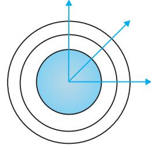

FIGURE 10.1 (a) A diverging spherical wave emanating from a point source. The wavefronts are spherical.

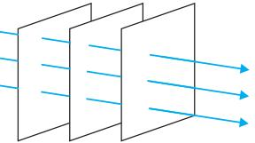

FIGURE 10.1 (b) At a large distance from the source, a small portion of the spherical wave can be approximated by a plane wave.

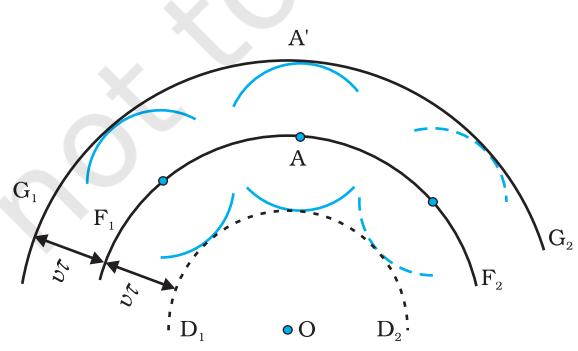

FIGURE 10.2 F1 F2 represents the spherical wavefront (with O as centre) at *t* = 0. The envelope of the secondary wavelets emanating from F1 F2 produces the forward moving wavefront G1G2 . The backwave D1D2 does not exist.

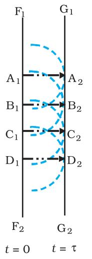

FIGURE 10.3 Huygens geometrical construction for a plane wave propagating to the right. F1 F2 is the plane wavefront at *t* = 0 and G1G2 is the wavefront at a later time t. The lines A1A2 , B1B2 … etc., are normal to both F1 F2 and G1G2 and represent rays.

Thus, if we wish to determine the shape of the wavefront at *t* = t, we draw spheres of radius *v*t from each point on the spherical wavefront where *v* represents the speed of the waves in the medium. If we now draw a common tangent to all these spheres, we obtain the new position of the wavefront at *t* = t. The new wavefront shown as G1G2 in Fig. 10.2 is again spherical with point O as the centre.

The above model has one shortcoming: we also have a backwave which is shown as D1D2 in Fig. 10.2. Huygens argued that the amplitude of the secondary wavelets is maximum in the forward direction and zero in the backward direction; by making this adhoc assumption, Huygens could explain the absence of the backwave. However, this adhoc assumption is not satisfactory and the absence of the backwave is really justified from more rigorous wave theory.

In a similar manner, we can use Huygens principle to determine the shape of the wavefront for a plane wave propagating through a medium (Fig. 10.3).

## 10.3 REFRACTION AND REFLECTION OF PLANE WAVES USING HUYGENS PRINCIPLE

#### 10.3.1 Refraction of a plane wave

We will now use Huygens principle to derive the laws of refraction. Let PP¢ represent the surface separating medium 1 and medium 2, as shown in Fig. 10.4. Let *v*1 and *v*2 represent the speed of light in medium 1 and medium 2, respectively. We assume a plane wavefront AB propagating in the direction A¢A incident on the interface at an angle *i* as shown in the figure. Let t be the time taken by the wavefront to travel the distance BC. Thus,

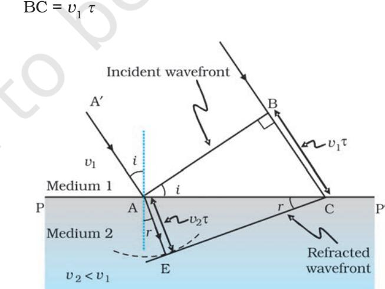

FIGURE 10.4 *A plane wave* AB is incident at an angle *i* on the surface PP¢ *s*eparating medium 1 and medium 2*.* The plane wave undergoes refraction and CE represents the refracted wavefront. The figure corresponds to *v*2 < *v*1 so that the refracted waves bends towards the normal.

258

Christiaan Huygens (1629 – 1695) Dutch physicist, astronomer, mathematician and the founder of the wave theory of light. His book, *Treatise on light*, makes fascinating reading even today. He brilliantly explained the double refraction shown by the mineral calcite in this work in addition to reflection and refraction. He was the first to analyse circular and simple harmonic motion and designed and built improved clocks and telescopes. He discovered the true geometry of Saturn's rings.

## Wave Optics

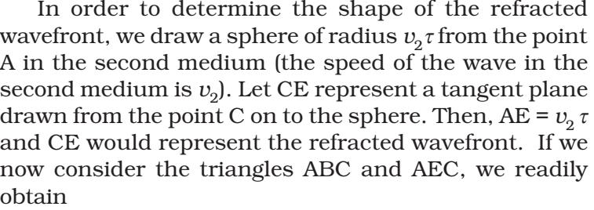

$\sin\,i=\frac{\text{BC}}{\text{AC}}=\frac{\upsilon_{1}\tau}{\text{AC}}$ (10.1)

and

$\sin\,r=\frac{\text{AE}}{\text{AC}}=\frac{\upsilon_{2}\tau}{\text{AC}}$ (10.2)

where *i* and *r* are the angles of incidence and refraction, respectively. Thus we obtain

$\sin i=\frac{\upsilon_{1}}{\upsilon_{2}}$  
  
$\sin r=\frac{\upsilon_{1}}{\upsilon_{2}}$  
  
$\sin r=\frac{\upsilon_{1}}{\upsilon_{2}}$  
  
$\sin r=\frac{\upsilon_{1}}{\upsilon_{2}}$  

From the above equation, we get the important result that if *r* < *i* (i.e., if the ray bends toward the normal), the speed of the light wave in the second medium (*v*2 ) will be less then the speed of the light wave in the first medium (*v*1 ). This prediction is opposite to the prediction from the corpuscular model of light and as later experiments showed, the prediction of the wave theory is correct. Now, if *c* represents the speed of light in vacuum, then,

$$n_{1}=\frac{c}{v_{1}}\tag{10.4}$$
  
  
and  
  

$$n_{2}=\frac{c}{v_{2}}\tag{10.5}$$

are known as the refractive indices of medium 1 and medium 2, respectively. In terms of the refractive indices, Eq. (10.3) can be written as

$n_{1}$ sin $i=n_{2}$ sin$\bar{\tau}$ (10.6)

This is the *Snell's law of refraction*. Further, if l1 and l 2 denote the wavelengths of light in medium 1 and medium 2, respectively and if the distance BC is equal to l 1 then the distance AE will be equal to l 2 (because if the crest from B has reached C in time t, then the crest from A should have also reached *E* in time t); thus,

$${\frac{\lambda_{1}}{\lambda_{2}}}\,=\,{\frac{\mathrm{BC}}{\mathrm{AE}}}\,=\,{\frac{v_{1}}{v_{2}}}$$

or

1 2 1 2 *v v* λ λ = (10.7)

259

The above equation implies that when a wave gets refracted into a denser medium (*v*1 > *v*2 ) the wavelength and the speed of propagation decrease but the *frequency* n(= *v*/l) *remains the same*.

#### 10.3.2 Refraction at a rarer medium

We now consider refraction of a plane wave at a rarer medium, i.e., *v*2 > *v*1 . Proceeding in an exactly similar manner we can construct a refracted wavefront as shown in Fig. 10.5. The angle of refraction will now be greater than angle of incidence; however, we will still have *n*1 sin *i* = *n*2 sin *r* . We define an angle *i c* by the following equation

$$\sin i_{\rm c}=\frac{n_{2}}{n_{1}}\tag{10.8}$$

Thus, if *i* = *i c* then sin *r* = 1 and *r* = 90°. Obviously, for *i* > *i c* , there can not be any refracted wave. The angle *i c* is known as the *critical angle* and for all angles of incidence greater than the critical angle, we will not have any refracted wave and the wave will undergo what is known as *total internal reflection*. The phenomenon of total internal reflection and its applications was discussed in Section 9.4.

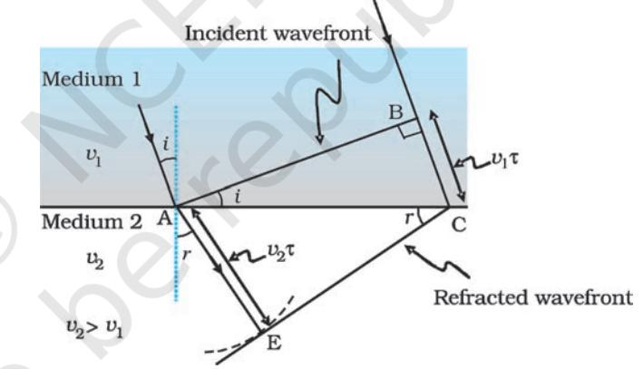

FIGURE 10.5 Refraction of a plane wave incident on a rarer medium for which *v2 > v1* . The plane wave bends away from the normal.

#### 10.3.3 Reflection of a plane wave by a plane surface

We next consider a plane wave AB incident at an angle *i* on a reflecting surface MN. If *v* represents the speed of the wave in the medium and if t represents the time taken by the wavefront to advance from the point B to *C* then the distance

BC *= v*t

In order to construct the reflected wavefront we draw a sphere of radius *v*t from the point A as shown in Fig. 10.6. Let CE represent the tangent plane drawn from the point C to this sphere. Obviously

$$\mathrm{AE}=\mathrm{BC}=v\tau$$

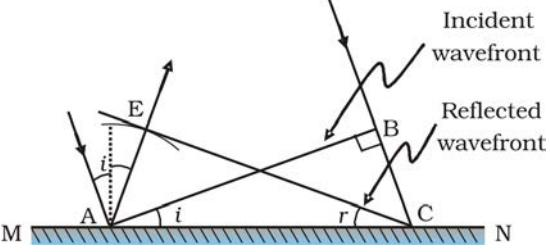

FIGURE 10.6 Reflection of a plane wave AB by the reflecting surface MN*.* AB and CE represent incident and reflected wavefronts.

If we now consider the triangles EAC and BAC we will find that they are congruent and therefore, the angles *i* and *r* (as shown in Fig. 10.6) would be equal. This is the *law of reflection*.

Once we have the laws of reflection and refraction, the behaviour of prisms, lenses, and mirrors can be understood. These phenomena were discussed in detail in Chapter 9 on the basis of rectilinear propagation of light. Here we just describe the behaviour of the wavefronts as they undergo reflection or refraction. In Fig. 10.7(a) we consider a plane wave passing through a thin prism. Clearly, since the speed of light waves is less in glass, the lower portion of the incoming wavefront (which travels through the greatest thickness of glass) will get delayed resulting in a tilt in the emerging wavefront as shown in the figure. In Fig. 10.7(b) we consider a plane wave incident on a thin convex lens; the central part of the incident plane wave traverses the thickest portion of the lens and is delayed the most. The emerging wavefront has a depression at the centre and therefore the wavefront becomes spherical and converges to the point F which is known as the *focus*. In Fig. 10.7(c) a plane wave is incident on a concave mirror and on reflection we have a spherical wave converging to the focal point F. In a similar manner, we can understand refraction and reflection by concave lenses and convex mirrors.

From the above discussion it follows that the total time taken from a point on the object to the corresponding point on the image is the same measured along any ray. For example, when a convex lens focusses light to form a real image, although the ray going through the centre traverses a shorter path, but because of the slower speed in glass, the time taken is the same as for rays travelling near the edge of the lens.

261

#### Example 10.1

- (a) When monochromatic light is incident on a surface separating two media, the reflected and refracted light both have the same frequency as the incident frequency. Explain why?
- (b) When light travels from a rarer to a denser medium, the speed decreases. Does the reduction in speed imply a reduction in the energy carried by the light wave?
- (c) In the wave picture of light, intensity of light is determined by the square of the amplitude of the wave. What determines the intensity of light in the photon picture of light.

#### Solution

- (a) Reflection and refraction arise through interaction of incident light with the atomic constituents of matter. Atoms may be viewed as oscillators, which take up the frequency of the external agency (light) causing forced oscillations. The frequency of light emitted by a charged oscillator equals its frequency of oscillation. Thus, the frequency of scattered light equals the frequency of incident light.
- (b) No. Energy carried by a wave depends on the amplitude of the wave, not on the speed of wave propagation.
- (c) For a given frequency, intensity of light in the photon picture is determined by the number of photons crossing an unit area per unit time.

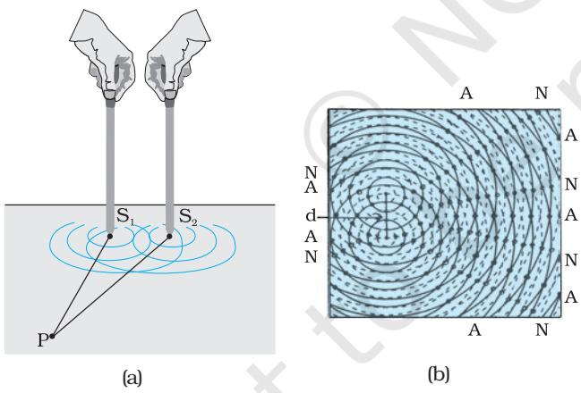

EXAMPLE 10.1

FIGURE 10.8 (a) Two needles oscillating in phase in water represent two coherent sources. (b) The pattern of displacement of water molecules at an instant on the surface of water showing nodal N (no displacement) and antinodal A (maximum displacement) lines.

## 10.4 COHERENT AND INCOHERENT ADDITION OF WAVES

In this section we will discuss the interference pattern produced by the superposition of two waves. You may recall that we had discussed the superposition principle in Chapter 14 of your Class XI textbook. Indeed the entire field of interference is based on the *superposition principle* according to which *at a particular point in the medium, the resultant displacement produced by a number of waves is the vector sum of the displacements produced by each of the waves*.

Consider two needles S1 and S2 moving periodically up and down in an identical

fashion in a trough of water [Fig. 10.8(a)]. They produce two water waves, and at a particular point, the phase difference between the displacements produced by each of the waves does not change with time; when this happens the two sources are said to be *coherent*. Figure 10.8(b) shows the position of crests (solid circles) and troughs (dashed circles) at a given instant of time. Consider a point P for which

S1 P = S2 P

Since the distances S1 P and S2 P are equal, waves from S1 and S2 will take the same time to travel to the point P and waves that emanate from S1 and S2 in phase will also arrive, at the point P, in phase.

Thus, if the displacement produced by the source *S*1 at the point P is given by

*y*1 = *a* cos w*t*

then, the displacement produced by the source *S*2 (at the point P) will also be given by

*y*2 = *a* cos w*t*

Thus, the resultant of displacement at P would be given by

*y* = *y*1 + *y*2 = 2 *a* cos w*t*

Since the intensity is proportional to the square of the amplitude, the resultant intensity will be given by

> *I* = 4 *I* 0

where *I* 0 represents the intensity produced by each one of the individual sources; *I* 0 is proportional to *a* 2 . In fact at any point on the perpendicular bisector of S1S2 , the intensity will be 4*I* 0 . The two sources are said to interfere constructively and we have what is referred to as *constructive interference*. We next consider a point *Q* [Fig. 10.9(a)] for which

S2Q –S1Q = 2l

The waves emanating from S1 will arrive exactly two cycles earlier than the waves from S2 and will again be in phase [Fig. 10.9(a)]. Thus, if the displacement produced by S1 is given by

*y*1 = *a* cos w*t*

then the displacement produced by S2 will be given by

*y*2 = *a* cos (w*t* – 4p) = *a* cos w*t*

where we have used the fact that a path difference of 2l corresponds to a phase difference of 4p. The two displacements are once again in phase and the intensity will again be 4 *I* 0 giving rise to constructive interference. In the above analysis we have assumed that the distances S1Q and S2Q are much greater than *d* (which represents the distance between S1 and S2 ) so that although S1Q and S2Q are not equal, the amplitudes of the displacement produced by each wave are very nearly the same.

We next consider a point R [Fig. 10.9(b)] for which

$$\mathbf{S}_{2}\mathbf{R}-\mathbf{S}_{1}\mathbf{R}=-2.5\lambda$$

The waves emanating from S1 will arrive exactly two and a half cycles later than the waves from S2 [Fig. 10.10(b)]. Thus if the displacement produced by S1 is given by

> *y*1 = *a* cos w*t*

then the displacement produced by S2 will be given by

*y*2 = *a* cos (w*t* + 5p) = – *a* cos w*t*

## Wave Optics

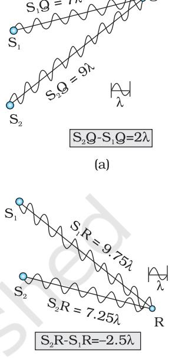

FIGURE 10.9 (a) Constructive interference at a point Q for which the path difference is 2l. (b) Destructive interference at a point R for which the path difference is 2.5 l.

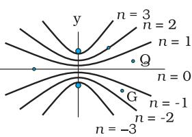

FIGURE 10.10 Locus of points for which S1 P – S2 P is equal to zero, ±l, ± 2l, ± 3l.

where we have used the fact that a path difference of 2.5l corresponds to a phase difference of 5p. The two displacements are now out of phase and the two displacements will cancel out to give zero intensity. This is referred to as *destructive interference*.

*To summarise:* If we have two coherent sources S1 and S2 vibrating in phase, then for an arbitrary point P whenever the path difference,

$\bf S_{1}P\sim S_{2}P=n\lambda$ ($n=0,1,2,3,...$) (10.9)

we will have constructive interference and the resultant intensity will be 4*I* 0 ; the sign ~ between S1 P and S2 P represents the difference between S1 P and S2 P. On the other hand, if the point P is such that the path difference,

$\mathbf{S}_{1}\mathbf{P}\sim\mathbf{S}_{2}\mathbf{P}=(n+\frac{1}{2})\ \lambda\quad(n=0,\,1,\,2,\,3,\,...)$

we will have *destructive interference* and the resultant intensity will be zero. Now, for any other arbitrary point G (Fig. 10.10) let the phase difference between the two displacements be f. Thus, if the displacement produced by S1 is given by

*y*1 = *a* cos w*t*

then, the displacement produced by S2 would be

> *y*2 = *a* cos (w*t* + f)

and the resultant displacement will be given by

*y* = *y*1 + *y*2 = *a* [cos w*t* + cos (w*t* +f)] = 2 *a* cos (f/2) cos (w*t* + f/2)

The amplitude of the resultant displacement is 2*a* cos (f/2) and therefore the intensity at that point will be

> *I* = 4 *I* 0 cos2 (f/2) (10.11)

If f = 0, ± 2 p, ± 4 p,… which corresponds to the condition given by Eq. (10.9) we will have constructive interference leading to maximum intensity. On the other hand, if f = ± p, ± 3p, ± 5p … [which corresponds to the condition given by Eq. (10.10)] we will have destructive interference leading to zero intensity.

Now if the two sources are coherent (i.e., if the two needles are going up and down regularly) then the phase difference f at any point will not change with time and we will have a stable interference pattern; i.e., the positions of maxima and minima will not change with time. However, if the two needles do not maintain a constant phase difference, then the interference pattern will also change with time and, if the phase difference changes very rapidly with time, the positions of maxima and minima will also vary rapidly with time and we will see a "time-averaged" intensity distribution. When this happens, we will observe an average intensity that will be given by

$$I=2\;I_{0}$$

(10.12)

at all points.

Ripple Tank experiments on wave interference http://phet.colorado.edu/en/simulation/legacy/wave-interference

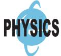

264

When the phase difference between the two vibrating sources changes rapidly with time, we say that the two sources are incoherent and when this happens the intensities just add up. This is indeed what happens when two separate light sources illuminate a wall.

## 10.5 INTERFERENCE OF LIGHT WAVES AND YOUNG'S EXPERIMENT

We will now discuss interference using light waves. If we use two sodium lamps illuminating two pinholes (Fig. 10.11) we will not observe any interference fringes. This is because of the fact that the light wave emitted from an ordinary source (like a sodium lamp) undergoes abrupt phase changes in times of the order of 10–10 seconds. Thus the light waves coming out from two independent sources of light will not have any fixed phase relationship and would be incoherent, when this happens, as discussed in the previous section, the intensities on the screen will add up.

The British physicist Thomas Young used an ingenious technique to "lock" the phases of the waves emanating from S1 and S2 . He made two pinholes S1

and S2 (very close to each other) on an opaque screen [Fig. 10.12(a)]. These were illuminated by another pinholes that was in turn, lit by a bright source. Light waves spread out from S and fall on both S1 and S2 . S1 and S2 then behave like two coherent sources because light waves coming out from S1 and S2 are derived from the same original source and any abrupt phase change in S will manifest in exactly similar phase changes in the light coming out from S1 and S2 . Thus, the two sources S1 and S2 will be *locked* in phase; i.e., they will be coherent like the two vibrating needle in our water wave example [Fig. 10.8(a)].

The spherical waves emanating from S1 and S2 will produce interference fringes on the screen GG¢, as shown in Fig. 10.12(b). The positions of maximum and minimum intensities can be calculated by using the analysis given in Section 10.4.

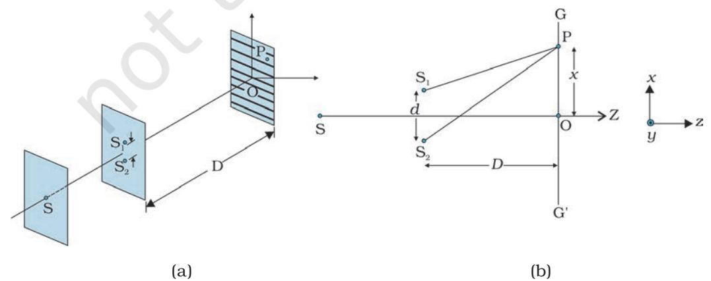

FIGURE 10.12 Young's arrangement to produce interference pattern.

FIGURE 10.11 If two sodium lamps illuminate two pinholes S1 and S2 , the intensities will add up and no interference fringes will be observed on the screen.

265

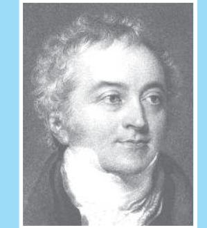

Thomas Young (1773 – 1829) English physicist, physician and Egyptologist. Young worked on a wide variety of scientific problems, ranging from the structure of the eye and the mechanism of vision to the decipherment of the Rosetta stone. He revived the wave theory of light and recognised that interference phenomena provide proof of the wave properties of light.

We will have constructive interference resulting in a bright

region when $\frac{xd}{D}=n\lambda$. That is,  
  

$$x=x_{n}=\frac{n\lambda D}{d};\;n=0,\pm1,\pm2,\;...\tag{10.13}$$

On the other hand, we will have destructive interference resulting in a dark region when *xd D* = (*n*+ 1 2 ) l that is

$x=x_{n}=(n+\frac{1}{2})\ \frac{\lambda D}{d};\ n=0,\pm1,\pm2$ (10.14)

Thus dark and bright bands appear on the screen, as shown in Fig. 10.13. Such bands are called *fringes*. Equations (10.13) and (10.14) show that dark and bright fringes are equally spaced.

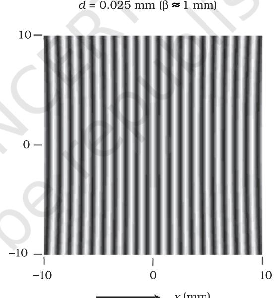

FIGURE 10.13 Computer generated fringe pattern produced by two point source S1 and S2 on the screen GG¢ (Fig. 10.12); *d* = 0.025 mm, *D* = 5 cm and l = 5 × 10–5 cm.) (Adopted from OPTICS by A. Ghatak, Tata McGraw Hill Publishing Co. Ltd., New Delhi, 2000.)

#### 10.6 DIFFRACTION

If we look clearly at the shadow cast by an opaque object, close to the region of geometrical shadow, there are alternate dark and bright regions just like in interference. This happens due to the phenomenon of diffraction. Diffraction is a general characteristic exhibited by all types of waves, be it sound waves, light waves, water waves or matter waves. Since the wavelength of light is much smaller than the dimensions of most obstacles; we do not encounter diffraction effects of light in everyday

2024-25

observations. However, the finite resolution of our eye or of optical instruments such as telescopes or microscopes is limited due to the phenomenon of diffraction. Indeed the colours that you see when a CD is viewed is due to diffraction effects. We will now discuss the phenomenon of diffraction.

#### 10.6.1 The single slit

In the discussion of Young's experiment, we stated that a single narrow slit acts as a new source from which light spreads out. Even before Young, early experimenters – including Newton – had noticed that light spreads out from narrow holes and slits. It seems to turn around corners and enter regions where we would expect a shadow. These effects, known as *diffraction*, can only be properly understood using wave ideas. After all,

you are hardly surprised to hear sound waves from someone talking around a corner!

When the double slit in Young's experiment is replaced by a single narrow slit (illuminated by a monochromatic source), a broad pattern with a central bright region is seen. On both sides, there are alternate dark and bright regions, the intensity becoming weaker away from the centre (Fig. 10.15). To understand this, go to Fig. 10.14, which shows a parallel beam of light falling normally on a single slit LN of width *a*. The diffracted light goes on to meet a screen. The midpoint of the slit is M.

A straight line through M perpendicular to the slit plane meets the screen at C. We want the intensity at any point P on the screen. As before, straight lines joining P to the different points L,M,N, etc., can be treated as parallel, making an angle q with the normal MC.

The basic idea is to divide the slit into much smaller parts, and add their contributions at P with the proper phase differences. We are treating different parts of the wavefront at the slit as secondary sources. Because the incoming wavefront is parallel to the plane of the slit, these sources are in phase.

It is observed that the intensity has a central maximum at q = 0 and other secondary maxima at q l (*n*+1/2) l/*a*, which go on becoming weaker and weaker with increasing *n*. The minima (zero intensity) are at q l *n*l/*a*, *n* = ±1, ±2, ±3, ....

The photograph and intensity pattern corresponding to it is shown in Fig. 10.15.

There has been prolonged discussion about difference between intereference and diffraction among

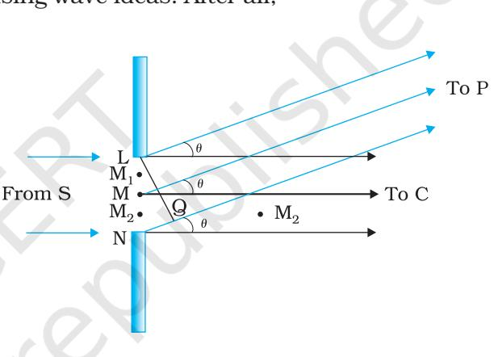

FIGURE 10.14 The geometry of path differences for diffraction by a single slit.

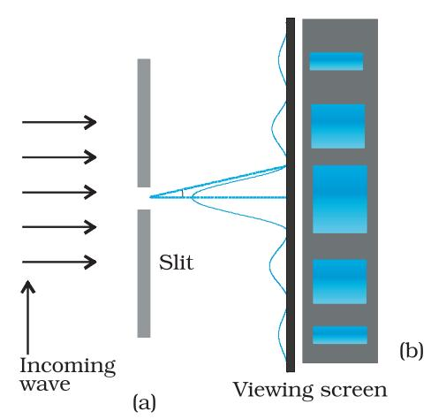

267

scientists since the discovery of these phenomena. In this context, it is interesting to note what Richard Feynman* has said in his famous Feynman Lectures on Physics:

> *No one has ever been able to define the difference between interference and diffraction satisfactorily. It is just a question of usage, and there is no specific, important physical difference between them. The best we can do is, roughly speaking, is to say that when there are only a few sources, say two interfering sources, then the result is usually called interference, but if there is a large number of them, it seems that the word diffraction is more often used.*

In the double-slit experiment, we must note that the pattern on the screen is actually a superposition of single-slit diffraction from each slit or hole, and the double-slit interference pattern.

#### 10.6.2 Seeing the single slit diffraction pattern

It is surprisingly easy to see the single-slit diffraction pattern for oneself. The equipment needed can be found in most homes –– two razor blades and one clear glass electric bulb preferably with a straight filament. One has to hold the two blades so that the edges are parallel and have a narrow slit in between. This is easily done with the thumb and forefingers (Fig. 10.16).

Keep the slit parallel to the filament, right in front of the eye. Use spectacles if you normally do. With slight adjustment of the width of the slit and the parallelism of the edges, the pattern should be seen with its bright and dark bands. Since the position of all the bands (except the central one) depends on wavelength, they will show some colours. Using a filter for red or blue will make the fringes clearer. With both filters available, the wider fringes for red compared to blue can be seen.

In this experiment, the filament plays the role of the first slit S in Fig. 10.15. The lens of the eye focuses the pattern on the screen (the retina of the eye).

With some effort, one can cut a double slit in an aluminium foil with a blade. The bulb filament can be viewed as before to repeat Young's experiment. In daytime, there is another suitable bright source subtending a small angle at the eye. This is the reflection of the Sun in any shiny convex surface (e.g., a cycle bell). Do not try direct sunlight – it can damage the eye and will not give fringes anyway as the Sun subtends an angle of (1/2)°.

*In interference and diffraction, light energy is redistributed. If it reduces in one region, producing a dark fringe, it increases in another region, producing a bright fringe. There is no gain or loss of energy, which is consistent with the principle of conservation of energy.*

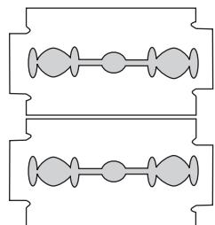

FIGURE 10.16 Holding two blades to form a single slit. A bulb filament viewed through this shows clear diffraction bands.

* Richand Feynman was one of the recipients of the 1965 Nobel Prize in Physics for his fundamental work in quantum electrodynamics.

## 10.7 POLARISATION

Consider holding a long string that is held horizontally, the other end of which is assumed to be fixed. If we move the end of the string up and down in a periodic manner, we will generate a wave propagating in the +*x* direction (Fig. 10.17). Such a wave could be described by the following equation

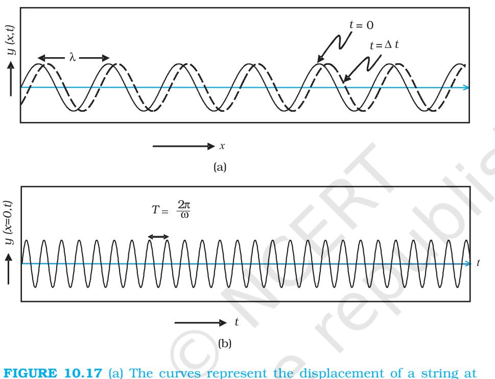

FIGURE 10.17 (a) The curves represent the displacement of a string at *t* = 0 and at *t* = D*t*, respectively when a sinusoidal wave is propagating in the +*x*-direction. (b) The curve represents the time variation of the displacement at *x* = 0 when a sinusoidal wave is propagating in the +*x*-direction. At *x* = D*x*, the time variation of the displacement will be slightly displaced to the right.

$y\left(x,t\right)=a\sin\left(kx\rightleftarrow\omega t)$ (10.15)

where *a* and w (= 2pn) represent the amplitude and the angular frequency of the wave, respectively; further,

$$\lambda=\frac{2\pi}{k}\tag{10.16}$$

represents the wavelength associated with the wave. We had discussed propagation of such waves in Chapter 14 of Class XI textbook. Since the displacement (which is along the *y* direction) is at right angles to the direction of propagation of the wave, we have what is known as a *transverse wave*. Also, since the displacement is in the *y* direction, it is often referred to as a *y*-polarised wave. Since each point on the string moves on a straight line, the wave is also referred to as a linearly polarised

wave. Further, the string always remains confined to the *x-y* plane and therefore it is also referred to as a *plane polarised wave*.

In a similar manner we can consider the vibration of the string in the *x*-*z* plane generating a *z*-polarised wave whose displacement will be given by

$z\left(x,t\right)=a\sin\left(kx-\omega t\right)$ (10.17)

It should be mentioned that the linearly polarised waves [described by Eqs. (10.15) and (10.17)] are all transverse waves; i.e., the displacement of each point of the string is always at right angles to the direction of propagation of the wave. Finally, if the plane of vibration of the string is changed randomly in very short intervals of time, then we have what is known as an *unpolarised wave*. Thus, for an unpolarised wave the displacement will be randomly changing with time though it will always be perpendicular to the direction of propagation.

Light waves are transverse in nature; i.e., the electric field associated with a propagating light wave is always at right angles to the direction of propagation of the wave. This can be easily demonstrated using a simple polaroid. You must have seen thin plastic like sheets, which are called *polaroids*. A polaroid consists of long chain molecules aligned in a particular direction. The electric vectors (associated with the propagating light wave) along the direction of the aligned molecules get absorbed. Thus, if an unpolarised light wave is incident on such a polaroid then the light wave will get linearly polarised with the electric vector oscillating along a direction perpendicular to the aligned molecules; this direction is known as the *pass-axis* of the polaroid.

Thus, if the light from an ordinary source (like a sodium lamp) passes through a polaroid sheet *P*1, it is observed that its intensity is reduced by half. Rotating *P*1 has no effect on the transmitted beam and transmitted intensity remains constant. Now, let an identical piece of polaroid *P*2 be placed before *P*1 . As expected, the light from the lamp is reduced in intensity on passing through *P*2 alone. But now rotating P1 has a dramatic effect on the light coming from *P*2 . In one position, the intensity transmitted by *P*2 followed by *P*1 is nearly zero. When turned by 90° from this position, *P*1 transmits nearly the full intensity emerging from *P*2 (Fig. 10.18).

The experiment at figure 10.18 can be easily understood by assuming that light passing through the polaroid *P*2 gets polarised along the passaxis of *P*2 . If the pass-axis of *P*2 makes an angle q with the pass-axis of *P*1 , then when the polarised beam passes through the polaroid *P*2 , the component *E* cos q (along the pass-axis of *P*2 ) will pass through *P*2 . Thus, as we rotate the polaroid *P*1 (or *P*2 ), the intensity will vary as:

$I=I_{0}\cos^{2}\theta$ (10.18)

where *I* 0 is the intensity of the polarized light after passing through *P*1 . This is known as *Malus' law*. The above discussion shows that the

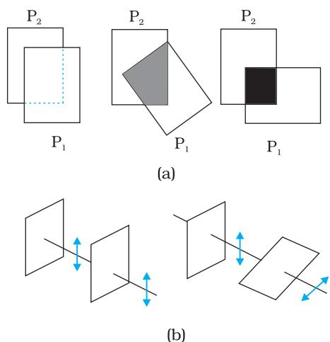

FIGURE 10.18 (a) Passage of light through two polaroids *P*2 and *P*1 . The transmitted fraction falls from 1 to 0 as the angle between them varies from 0° to 90°. Notice that the light seen through a single polaroid *P*1 does not vary with angle. (b) Behaviour of the electric vector when light passes through two polaroids. The transmitted polarisation is the component parallel to the polaroid axis. The double arrows show the oscillations of the electric vector.

intensity coming out of a single polaroid is half of the incident intensity. By putting a second polaroid, the intensity can be further controlled from 50% to zero of the incident intensity by adjusting the angle between the pass-axes of two polaroids.

Polaroids can be used to control the intensity, in sunglasses, windowpanes, etc. Polaroids are also used in photographic cameras and 3D movie cameras.

Example 10.2 Discuss the intensity of transmitted light when a polaroid sheet is rotated between two crossed polaroids?

Solution Let *I* 0 be the intensity of polarised light after passing through the first polariser *P*1 . Then the intensity of light after passing through second polariser *P*2 will be

$$I=I_{0}\mathbf{cos}^{2}\theta\,,$$

where q is the angle between pass axes of *P*1 and *P*2 . Since *P*1 and *P*3 are crossed the angle between the pass axes of *P*2 and *P*3 will be (p/2–q). Hence the intensity of light emerging from *P*3 will be

$$I=I_{0}\cos^{2}\!\theta\,\cos^{2}\left({\frac{\pi}{2}}-\theta\right)$$
 
$$=I_{0}\,\cos^{2}\!\theta\,\,\sin^{2}\!\theta=\!(I_{0}/4)\,\sin^{2}\!2\theta$$

Therefore, the transmitted intensity will be maximum when q= p/4.

q

 EXAMPLE 10.2

#### SUMMARY

- 1. Huygens' principle tells us that each point on a wavefront is a source of secondary waves, which add up to give the wavefront at a later time.
- 2. Huygens' construction tells us that the new wavefront is the forward envelope of the secondary waves. When the speed of light is independent of direction, the secondary waves are spherical. The rays are then perpendicular to both the wavefronts and the time of travel is the same measured along any ray. This principle leads to the well known laws of reflection and refraction.
- 3. The principle of superposition of waves applies whenever two or more sources of light illuminate the same point. When we consider the intensity of light due to these sources at the given point, there is an interference term in addition to the sum of the individual intensities. But this term is important only if it has a non-zero average, which occurs only if the sources have the same frequency and a stable phase difference.
- 4. Young's double slit of separation d gives equally spaced interference fringes.
- 5. A single slit of width *a* gives a diffraction pattern with a central maximum. The intensity falls to zero at angles of 2 , , *a a* λ λ ± ± etc., with successively weaker secondary maxima in between.
- 6. Natural light, e.g., from the sun is unpolarised. This means the electric vector takes all possible directions in the transverse plane, rapidly and randomly, during a measurement. A polaroid transmits only one component (parallel to a special axis). The resulting light is called linearly polarised or plane polarised. When this kind of light is viewed through a second polaroid whose axis turns through 2p, two maxima and minima of intensity are seen.

#### POINTS TO PONDER

- 1. Waves from a point source spread out in all directions, while light was seen to travel along narrow rays. It required the insight and experiment of Huygens, Young and Fresnel to understand how a wave theory could explain all aspects of the behaviour of light.
- 2. The crucial new feature of waves is interference of amplitudes from different sources which can be both constructive and destructive, as shown in Young's experiment.
- 3. Diffraction phenomena define the limits of ray optics. The limit of the ability of microscopes and telescopes to distinguish very close objects is set by the wavelength of light.
- 4. Most interference and diffraction effects exist even for longitudinal waves like sound in air. But polarisation phenomena are special to transverse waves like light waves.

## EXERCISES

- 10.1 Monochromatic light of wavelength 589 nm is incident from air on a water surface. What are the wavelength, frequency and speed of (a) reflected, and (b) refracted light? Refractive index of water is 1.33.
- 10.2 What is the shape of the wavefront in each of the following cases:
	- (a) Light diverging from a point source.
	- (b) Light emerging out of a convex lens when a point source is placed at its focus.
	- (c) The portion of the wavefront of light from a distant star intercepted by the Earth.
- 10.3 (a) The refractive index of glass is 1.5. What is the speed of light in glass? (Speed of light in vacuum is 3.0 × 108 m s–1)
	- (b) Is the speed of light in glass independent of the colour of light? If not, which of the two colours red and violet travels slower in a glass prism?
- 10.4 In a Young's double-slit experiment, the slits are separated by 0.28 mm and the screen is placed 1.4 m away. The distance between the central bright fringe and the fourth bright fringe is measured to be 1.2 cm. Determine the wavelength of light used in the experiment.
- 10.5 In Young's double-slit experiment using monochromatic light of wavelength l, the intensity of light at a point on the screen where path difference is l, is *K* units. What is the intensity of light at a point where path difference is l/3?
- 10.6 A beam of light consisting of two wavelengths, 650 nm and 520 nm, is used to obtain interference fringes in a Young's double-slit experiment.
	- (a) Find the distance of the third bright fringe on the screen from the central maximum for wavelength 650 nm.
	- (b) What is the least distance from the central maximum where the bright fringes due to both the wavelengths coincide?

