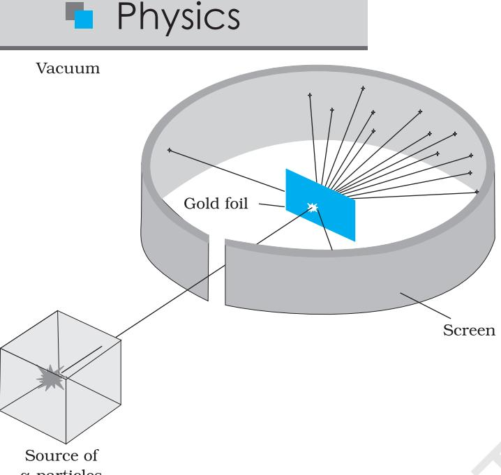
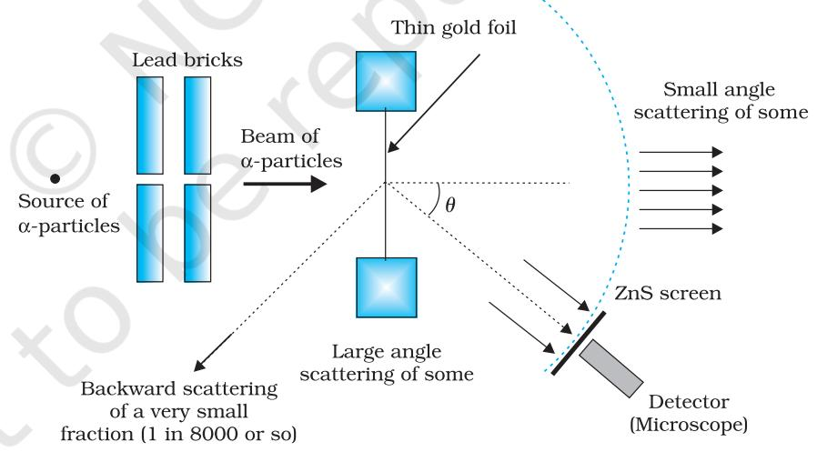
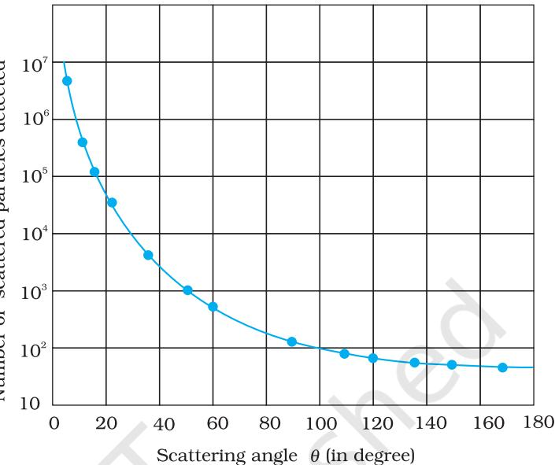
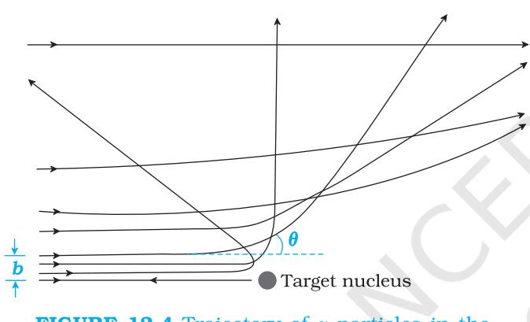
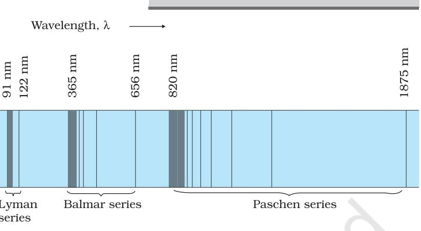
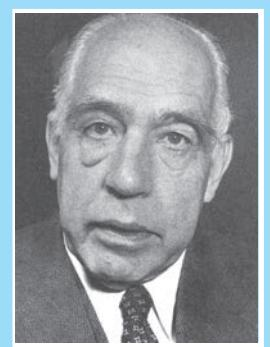
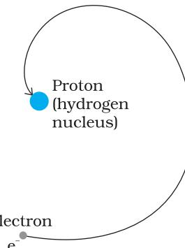
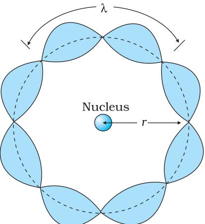

# Chapter Twelve ATOMS

Physics

290

## 12.1 INTRODUCTION

By the nineteenth century, enough evidence had accumulated in favour of atomic hypothesis of matter. In 1897, the experiments on electric discharge through gases carried out by the English physicist J. J. Thomson (1856 – 1940) revealed that atoms of different elements contain negatively charged constituents (electrons) that are identical for all atoms. However, atoms on a whole are electrically neutral. Therefore, an atom must also contain some positive charge to neutralise the negative charge of the electrons. But what is the arrangement of the positive charge and the electrons inside the atom? In other words, what is the structure of an atom?

The first model of atom was proposed by J. J. Thomson in 1898. According to this model, the positive charge of the atom is uniformly distributed throughout the volume of the atom and the negatively charged electrons are embedded in it like seeds in a watermelon. This model was picturesquely called *plum pudding model* of the atom. However subsequent studies on atoms, as described in this chapter, showed that the distribution of the electrons and positive charges are very different from that proposed in this model.

We know that condensed matter (solids and liquids) and dense gases at all temperatures emit electromagnetic radiation in which a continuous distribution of several wavelengths is present, though with different intensities. This radiation is considered to be due to oscillations of atoms

and molecules, governed by the interaction of each atom or molecule with its neighbours. *In contrast*, light emitted from rarefied gases heated in a flame, or excited electrically in a glow tube such as the familiar neon sign or mercury vapour light has only certain discrete wavelengths. The spectrum appears as a series of bright lines. In such gases, the average spacing between atoms is large. Hence, the radiation emitted can be considered due to individual atoms rather than because of interactions between atoms or molecules.

In the early nineteenth century it was also established that each element is associated with a characteristic spectrum of radiation, for example, hydrogen always gives a set of lines with fixed relative position between the lines. This fact suggested an intimate relationship between the internal structure of an atom and the spectrum of radiation emitted by it. In 1885, Johann Jakob Balmer (1825 – 1898) obtained a simple empirical formula which gave the wavelengths of a group of lines emitted by atomic hydrogen. Since hydrogen is simplest of the elements known, we shall consider its spectrum in detail in this chapter.

Ernst Rutherford (1871–1937), a former research student of J. J. Thomson, was engaged in experiments on a-particles emitted by some radioactive elements. In 1906, he proposed a classic experiment of scattering of these a-particles by atoms to investigate the atomic structure. This experiment was later performed around 1911 by Hans Geiger (1882–1945) and Ernst Marsden (1889–1970, who was 20 year-old student and had not yet earned his bachelor's degree). The details are discussed in Section 12.2. The explanation of the results led to the birth of Rutherford's planetary model of atom (also called the *nuclear model of the atom*). According to this the entire positive charge and most of the mass of the atom is

Ernst Rutherford (1871 – 1937) New Zealand born, British physicist who did pioneering work on radioactive radiation. He discovered alpha-rays and beta-rays. Along with Federick Soddy, he created the modern theory of radioactivity. He studied the 'emanation' of thorium and discovered a new noble gas, an isotope of radon, now known as thoron. By scattering alpha-rays from the metal foils, he discovered the atomic nucleus and proposed the plenatery model of the atom. He also estimated the approximate size of the nucleus.

concentrated in a small volume called the nucleus with electrons revolving around the nucleus just as planets revolve around the sun.

Rutherford's nuclear model was a major step towards how we see the atom today. However, it could not explain why atoms emit light of only discrete wavelengths. How could an atom as simple as hydrogen, consisting of a single electron and a single proton, emit a complex spectrum of specific wavelengths? In the classical picture of an atom, the electron revolves round the nucleus much like the way a planet revolves round the sun. However, we shall see that there are some serious difficulties in accepting such a model.

#### 12.2 ALPHA-PARTICLE SCATTERING AND RUTHERFORD'S NUCLEAR MODEL OF ATOM

At the suggestion of Ernst Rutherford, in 1911, H. Geiger and E. Marsden performed some experiments. In one of their experiments, as shown in

# ERNST RUTHERFORD (1871 – 1937)

291

FIGURE 12.1 Geiger-Marsden scattering experiment. The entire apparatus is placed in a vacuum chamber (not shown in this figure).

Fig. 12.1, they directed a beam of 5.5 MeV a-particles emitted from a 214 83Bi radioactive source at a thin metal foil made of gold. Figure 12.2 shows a schematic diagram of this experiment. Alpha-particles emitted by a 214 83Bi radioactive source were collimated into a narrow beam by their passage through lead bricks. The beam was allowed to fall on a thin foil of gold of thickness 2.1 × 10–7 m. The scattered alpha-particles were observed through a rotatable detector consisting of zinc sulphide screen and a microscope. The scattered alpha-particles on striking the screen produced brief light flashes or scintillations. These flashes may be viewed through a microscope and the distribution of the number of scattered particles may be studied as a function of angle of scattering.

#### FIGURE 12.2 Schematic arrangement of the Geiger-Marsden experiment.

A typical graph of the total number of a-particles scattered at different angles, in a given interval of time, is shown in Fig. 12.3. The dots in this figure represent the data points and the solid curve is the theoretical prediction based on the assumption that the target atom has a small, dense, positively charged nucleus. Many of the a-particles pass through the foil. It means that they do not suffer any collisions. Only about 0.14% of the incident a-particles scatter by more than 1°; and about 1 in 8000 deflect by more than 90°. Rutherford argued that, to deflect the a-particle backwards, it must experience a large repulsive force. This force could

be provided if the greater part of the mass of the atom and its positive charge were concentrated tightly at its centre. Then the incoming a-particle could get very close to the positive charge without penetrating it, and such a close encounter would result in a large deflection. This agreement supported the hypothesis of the nuclear atom. This is why Rutherford is credited with the *discovery* of the nucleus.

In Rutherford's nuclear model of the atom, the entire positive charge and most of the mass of the atom are concentrated in the nucleus with the electrons some distance away. The electrons would be moving in orbits about the nucleus just as the planets do around the sun. Rutherford's experiments suggested the size of the nucleus to be about 10–15 m to 10–14 m. From kinetic theory, the size of an atom was known to be 10–10 m, about 10,000 to 100,000 times larger

FIGURE 12.3 Experimental data points (shown by dots) on scattering of a-particles by a thin foil at different angles obtained by Geiger and Marsden using the setup shown in Figs. 12.1 and 12.2. Rutherford's nuclear model predicts the solid curve which is seen to be in good agreement with experiment.

than the size of the nucleus (see Chapter 10, Section 10.6 in Class XI Physics textbook). Thus, the electrons would seem to be at a distance from the nucleus of about 10,000 to 100,000 times the size of the nucleus itself. Thus, most of an atom is empty space. With the atom being largely empty space, it is easy to see why most a-particles go right through a thin metal foil. However, when a-particle happens to come near a nucleus, the intense electric field there scatters it through a large angle. The atomic electrons, being so light, do not appreciably affect the a-particles.

The scattering data shown in Fig. 12.3 can be analysed by employing Rutherford's nuclear model of the atom. As the gold foil is very thin, it can be assumed that a-particles will suffer not more than one scattering during their passage through it. Therefore, computation of the trajectory of an alpha-particle scattered by a single nucleus is enough. Alphaparticles are nuclei of helium atoms and, therefore, carry two units, 2*e*, of positive charge and have the mass of the helium atom. The charge of the gold nucleus is Z*e*, where *Z* is the atomic number of the atom; for gold *Z* = 79. Since the nucleus of gold is about 50 times heavier than an a-particle, it is reasonable to assume that it remains stationary throughout the scattering process. Under these assumptions, the trajectory of an alpha-particle can be computed employing Newton's second law of motion and the Coulomb's law for electrostatic force of repulsion between the alpha-particle and the positively charged nucleus.

The magnitude of this force is

$$F=\frac{1}{4\pi\varepsilon_{0}}\,\frac{(2e)(Ze)}{r^{2}}\tag{12.1}$$

where *r* is the distance between the a-particle and the nucleus. The force is directed along the line joining the a-particle and the nucleus. The magnitude and direction of the force on an a-particle continuously changes as it approaches the nucleus and recedes away from it.

#### 12.2.1 Alpha-particle trajectory

The trajectory traced by an a-particle depends on the impact parameter, *b* of collision. The *impact parameter* is the perpendicular distance of the initial velocity vector of the a-particle from the centre of the nucleus (Fig.

FIGURE 12.4 Trajectory of a-particles in the coulomb field of a target nucleus. The impact parameter, *b* and scattering angle q are also depicted.

EXAMPLE 12.1

12.4). A given beam of a-particles has a distribution of impact parameters *b*, so that the beam is scattered in various directions with different probabilities (Fig. 12.4). (In a beam, all particles have nearly same kinetic energy.) It is seen that an a-particle close to the nucleus (small impact parameter) suffers large scattering. In case of head-on collision, the impact parameter is minimum and the a-particle rebounds back (q @ p). For a large impact parameter, the a-particle goes nearly undeviated and has a small deflection (q @ 0).

The fact that only a small fraction of the number of incident particles rebound back indicates that the number of a-particles undergoing head on collision is small. This,

in turn, implies that the mass and positive charge of the atom is concentrated in a small volume. Rutherford scattering therefore, is a powerful way to determine an upper limit to the size of the nucleus.

Example 12.1 In the Rutherford's nuclear model of the atom, the nucleus (radius about 10–15 m) is analogous to the sun about which the electron move in orbit (radius » 10–10 m) like the earth orbits around the sun. If the dimensions of the solar system had the same proportions as those of the atom, would the earth be closer to or farther away from the sun than actually it is? The radius of earth's orbit is about 1.5 ´ 1011 m. The radius of sun is taken as 7 ´ 108 m.

Solution The ratio of the radius of electron's orbit to the radius of nucleus is (10–10 m)/(10–15 m) = 105 , that is, the radius of the electron's orbit is 105 times larger than the radius of nucleus. If the radius of the earth's orbit around the sun were 105 times larger than the radius of the sun, the radius of the earth's orbit would be 105 ´ 7 ´ 108 m = 7 ´ 1013 m. This is more than 100 times greater than the actual orbital radius of earth. Thus, the earth would be much farther away from the sun.

It implies that an atom contains a much greater fraction of empty space than our solar system does.

Example 12.2 In a Geiger-Marsden experiment, what is the distance of closest approach to the nucleus of a 7.7 MeV a-particle before it comes momentarily to rest and reverses its direction?

Solution The key idea here is that throughout the scattering process, the total mechanical energy of the system consisting of an a-particle and a gold nucleus is conserved. The system's initial mechanical energy is *Ei* , before the particle and nucleus interact, and it is equal to its mechanical energy *Ef* when the a-particle momentarily stops. The initial energy *Ei* is just the kinetic energy *K* of the incoming a- particle. The final energy *Ef* is just the electric potential energy *U* of the system. The potential energy *U* can be calculated from Eq. (12.1).

Let *d* be the centre-to-centre distance between the a-particle and the gold nucleus when the a-particle is at its stopping point. Then we can write the conservation of energy *Ei* = *Ef* as

$$K={\frac{1}{4\pi\varepsilon_{0}}}{\frac{(2e)(Z e)}{d}}={\frac{2Z e^{2}}{4\pi\varepsilon_{0}d}}$$

Thus the distance of closest approach *d* is given by

$$d={\frac{2Z e^{2}}{4\pi\varepsilon_{0}K}}$$

The maximum kinetic energy found in a-particles of natural origin is 7.7 MeV or 1.2 × 10–12 J. Since 1/4pe0 = 9.0 × 109 N m2 /C2 . Therefore with *e* = 1.6 × 10–19 C, we have,

$d=\frac{(2)(9.0\times10^{9}\,\mathrm{Nm}^{2}\,/\,C^{2})(1.6\times10^{-19}\,\mathrm{C})^{2}\,\mathrm{Z}}{1.2\times10^{-12}\,\mathrm{J}}$  
  
$=3.84\times10^{-16}\,\mathrm{Z}\,\mathrm{m}$

The atomic number of foil material gold is *Z =* 79, so that *d* (Au) = 3.0 × 10–14 m = 30 fm. (1 fm (i.e. fermi) = 10–15 m.)

The radius of gold nucleus is, therefore, less than 3.0 × 10–14 m. This is not in very good agreement with the observed result as the actual radius of gold nucleus is 6 fm. The cause of discrepancy is that the distance of closest approach is considerably larger than the sum of the radii of the gold nucleus and the a-particle. Thus, the a-particle reverses its motion without ever actually *touching* the gold nucleus.

#### 12.2.2 Electron orbits

The Rutherford nuclear model of the atom which involves classical concepts, pictures the atom as an electrically neutral sphere consisting of a very small, massive and positively charged nucleus at the centre surrounded by the revolving electrons in their respective dynamically stable orbits. The electrostatic force of attraction, *Fe* between the revolving electrons and the nucleus provides the requisite centripetal force (*Fc* ) to keep them in their orbits. Thus, for a dynamically stable orbit in a hydrogen atom

$$\cdot\quad F_{e}=F_{c}$$
 
$$\frac{1}{4\pi\varepsilon_{0}}\frac{e^{2}}{r^{2}}=\frac{m v^{2}}{r}$$

EXAMPLE 12.2

295

Thus the relation between the orbit radius and the electron velocity is

$$r=\frac{e^{2}}{4\pi\epsilon_{0}m\overline{w}^{2}}\tag{12.3}$$

The kinetic energy (*K* ) and electrostatic potential energy (*U*) of the electron in hydrogen atom are

$$K={\frac{1}{2}}m v^{2}={\frac{e^{2}}{8\pi\varepsilon_{0}r}}{\mathrm{~and~}}U=-{\frac{e^{2}}{4\pi\varepsilon_{0}r}}$$

(The negative sign in *U* signifies that the electrostatic force is in the –*r* direction.) Thus the total energy *E* of the electron in a hydrogen atom is

$$E=K+U=\frac{e^{2}}{8\pi\varepsilon_{0}r}-\frac{e^{2}}{4\pi\varepsilon_{0}r}$$
 
$$\cdot$$
 
$$=-\frac{e^{2}}{8\pi\varepsilon_{0}r}\tag{12.4}$$

The total energy of the electron is negative. This implies the fact that the electron is bound to the nucleus. If *E* were positive, an electron will not follow a closed orbit around the nucleus.

Example 12.3 It is found experimentally that 13.6 eV energy is required to separate a hydrogen atom into a proton and an electron. Compute the orbital radius and the velocity of the electron in a hydrogen atom.

Solution Total energy of the electron in hydrogen atom is –13.6 eV = –13.6 × 1.6 × 10–19 J = –2.2 ×10–18 J. Thus from Eq. (12.4), we have

2 18 0 2.2 10 J 8 ε − = − = − × π *e E r*

This gives the orbital radius

$\frac{e^{2}}{8\pi e_{0}E}=-\frac{(9\times10^{9}\ \rm N\ m^{2}/C^{2})(1.6\ \times10^{-19}C)^{2}}{(2)(-2.2\times10^{-18}\ \rm J)}$

= 5.3 × 10–11 m.

*r*

The velocity of the revolving electron can be computed from Eq. (12.3) with *m* = 9.1 × 10–31 kg,

EXAMPLE 12.3

$$v={\frac{e}{\sqrt{4\pi\varepsilon_{0}m r}}}=2.2\times10^{6}{\mathrm{~m/s}}.$$

#### 12.3 ATOMIC SPECTRA

As mentioned in Section 12.1, each element has a characteristic spectrum of radiation, which it emits. When an atomic gas or vapour is excited at low pressure, usually by passing an electric current through it, the emitted radiation has a spectrum which contains certain specific wavelengths only. A spectrum of this kind is termed as emission line spectrum and it

consists of bright lines on a dark background. The spectrum emitted by atomic hydrogen is shown in Fig. 12.5. Study of emission line spectra of a material can therefore serve as a type of "fingerprint" for identification of the gas. When white light passes through a gas and we analyse the transmitted light using a spectrometer we find some dark lines in the spectrum. These dark lines

FIGURE 12.5 Emission lines in the spectrum of hydrogen.

correspond precisely to those wavelengths which were found in the emission line spectrum of the gas. This is called the *absorption spectrum* of the material of the gas.

#### 12.4 BOHR MODEL OF THE HYDROGEN

#### ATOM

The model of the atom proposed by Rutherford assumes that the atom, consisting of a central nucleus and revolving electron is stable much like sun-planet system which the model imitates. However, there are some fundamental differences between the two situations. While the planetary system is held by gravitational force, the nucleus-electron system being charged objects, interact by Coulomb's Law of force. We know that an object which moves in a circle is being constantly accelerated – the acceleration being centripetal in nature. According to classical electromagnetic theory, an accelerating charged particle emits radiation in the form of electromagnetic waves. The energy of an accelerating electron should therefore, continuously decrease. The electron would spiral inward and eventually fall into the nucleus (Fig. 12.6). Thus, such an atom can not be stable. Further, according to the classical electromagnetic theory, the frequency of the electromagnetic waves emitted by the revolving electrons is equal to the frequency of revolution. As the electrons spiral inwards, their angular velocities and hence their frequencies would change continuously, and so will the frequency of the light emitted. Thus, they would emit a continuous spectrum, in contradiction to the line spectrum actually observed. Clearly Rutherford model tells only a part of the story implying that the classical ideas are not sufficient to explain the atomic structure.

Niels Henrik David Bohr (1885 – 1962) Danish physicist who explained the spectrum of hydrogen atom based on quantum ideas. He gave a theory of nuclear fission based on the liquiddrop model of nucleus. Bohr contributed to the clarification of conceptual problems in quantum mechanics, in particular by proposing the complementary principle.

FIGURE 12.6 An accelerated atomic electron must spiral into the nucleus as it loses energy.

Example 12.4 According to the classical electromagnetic theory, calculate the initial frequency of the light emitted by the electron revolving around a proton in hydrogen atom.

Solution From Example 12.3 we know that velocity of electron moving around a proton in hydrogen atom in an orbit of radius 5.3 × 10–11 m is 2.2 × 10–6 m/s. Thus, the frequency of the electron moving around the proton is

$\nu=\frac{\nu}{2\pi}$ 2.2 x 10${}^{6}$ m s${}^{-1}$  
  
$\nu=\frac{\nu}{2\pi}$ 2.2 x 10${}^{6}$ m s${}^{-1}$  
  
$\nu=\frac{\nu}{2\pi}$ 2.2 x 10${}^{6}$ m s${}^{-1}$  
  
$\nu=\frac{\nu}{2\pi}$ 2.2 x 10${}^{6}$ m s${}^{-1}$  
  
$\nu=\frac{\nu}{2\pi}$ 2.2 x 10${}^{6}$ m s${}^{-1}$  
  
$\nu=\frac{\nu}{2\pi}$ 2.2 x 10${}^{6}$ m s${}^{-1}$  
  
$\nu=\frac{\nu}{2\pi}$ 2.2 x 10${}^{6}$ m s${}^{-1}$  
  

» 6.6 × 1015 Hz.

According to the classical electromagnetic theory we know that the frequency of the electromagnetic waves emitted by the revolving electrons is equal to the frequency of its revolution around the nucleus. Thus the initial frequency of the light emitted is 6.6 × 1015 Hz.

It was Niels Bohr (1885 – 1962) who made certain modifications in this model by adding the ideas of the newly developing quantum hypothesis. Niels Bohr studied in Rutherford's laboratory for several months in 1912 and he was convinced about the validity of Rutherford nuclear model. Faced with the dilemma as discussed above, Bohr, in 1913, concluded that in spite of the success of electromagnetic theory in explaining large-scale phenomena, it could not be applied to the processes at the atomic scale. It became clear that a fairly radical departure from the established principles of classical mechanics and electromagnetism would be needed to understand the structure of atoms and the relation of atomic structure to atomic spectra. Bohr combined classical and early quantum concepts and gave his theory in the form of three postulates. These are :

- (i) Bohr's first postulate was that *an electron in an atom could revolve in certain stable orbits without the emission of radiant energy*, contrary to the predictions of electromagnetic theory. According to this postulate, each atom has certain definite stable states in which it
EXAMPLE 12.4

can exist, and each possible state has definite total energy. These are called the stationary states of the atom.

- (ii) Bohr's second postulate defines these stable orbits. This postulate states that the *electron* revolves around the nucleus *only in those orbits for which the angular momentum is some integral multiple of h/*2p where *h* is the Planck's constant (= 6.6 ´ 10–34 J s). Thus the angular momentum (*L*) of the orbiting electron is quantised. That is
*L = nh/2*p (12.5)

*h*

- (iii) Bohr's third postulate incorporated into atomic theory the early quantum concepts that had been developed by Planck and Einstein. It states that *an electron might make a transition from one of its specified non-radiating orbits to another of lower energy. When it does so, a photon is emitted having energy equal to the energy difference between the initial and final states*. *The frequency of the*
*emitted photon is then given by*

n = *Ei – Ef* (12.6)

where *Ei* and *Ef* are the energies of the initial and final states and *Ei* > *Ef .*

For a hydrogen atom, Eq. (12.4) gives the expression to determine the energies of different energy states. But then this equation requires the radius *r* of the electron orbit. To calculate *r*, Bohr's second postulate about the angular momentum of the electron–the quantisation condition – is used.

The radius of nth possible orbit thus found is

$$r_{n}=\ \frac{n^{2}}{m}\ \ \ \frac{h}{2\pi}\ \ \ \frac{2}{e^{2}}\tag{12.7}$$

The total energy of the electron in the stationary states of the hydrogen atom can be obtained by substituting the value of orbital radius in Eq. (12.4) as

$$E_{n}=-\ \frac{e^{2}}{8\pi\varepsilon_{0}}\ \ \ \frac{m}{n^{2}}\ \ \ \ \frac{2\pi}{h}\ \ \ \ \frac{e^{2}}{4\pi\varepsilon_{0}}$$
  
  
or $E_{n}=-\frac{me^{4}}{8n^{2}\varepsilon_{0}^{2}h^{2}}$ (12.8)

Substituting values, Eq. (12.8) yields

$$E_{n}=-\frac{2.18\times10^{-18}}{n^{2}}\tag{12.9}$$

Atomic energies are often expressed in electron volts (eV) rather than joules. Since 1 eV = 1.6 ´ 10–19 J, Eq. (12.9) can be rewritten as

$$E_{n}=-\frac{13.6}{n^{2}}\ \ \mbox{eV}\tag{12.10}$$

The negative sign of the total energy of an electron moving in an orbit means that the electron is bound with the nucleus. Energy will thus be required to remove the electron from the hydrogen atom to a distance infinitely far away from its nucleus (or proton in hydrogen atom).

299

FIGURE 12.7 The energy level diagram for the hydrogen atom. The electron in a hydrogen atom at room temperature spends most of its time in the ground state. To ionise a hydrogen atom an electron from the ground state, 13.6 eV of energy must be supplied. (The horizontal lines specify the presence of allowed energy states.)

#### 12.4.1 Energy levels

The energy of an atom is the *least* (largest negative value) when its electron is revolving in an orbit closest to the nucleus i.e., the one for which *n* = 1. For *n* = 2, 3, ... the absolute value of the energy *E* is smaller, hence the energy is progressively larger in the outer orbits. The *lowest* state of the atom, called the *ground state*, is that of the lowest energy, with the electron revolving in the orbit of smallest radius, the Bohr radius, *a*0 . The energy of this state (*n* = 1), *E*1 is –13.6 eV. Therefore, the minimum energy required to free the electron from the ground state of the hydrogen atom is 13.6 eV. It is called the *ionisation energy* of the hydrogen atom. This prediction of the Bohr's model is in excellent agreement with the experimental value of ionisation energy.

At room temperature, most of the hydrogen atoms are in *ground state*. When a hydrogen atom receives energy by processes such as electron collisions, the atom may acquire sufficient energy to raise the electron to higher energy states. The atom is then said to be in an *excited state*. From Eq. (12.10), for *n* = 2; the energy *E*2 is –3.40 eV. It means that the energy required to excite an electron in hydrogen atom to its first excited state, is an energy equal to *E*2  *– E*1 = –3.40 eV – (–13.6) eV = 10.2 eV. Similarly, *E*3 = –1.51 eV and *E*3  *– E*1 = 12.09 eV, or to excite the hydrogen atom from its ground state (*n =* 1) to second excited state (*n* = 3), 12.09 eV energy is required, and so on. From these excited states the electron can then fall back to a state of lower energy, emitting a photon in the process. Thus, as the excitation of hydrogen atom increases (that is as *n* increases) the value of minimum energy required to free the electron from the excited atom decreases.

The energy level diagram* for the stationary states of a

hydrogen atom, computed from Eq. (12.10), is given in Fig. 12.7. The principal quantum number *n* labels the stationary states in the ascending order of energy. In this diagram, the highest energy state corresponds to *n* =¥ in Eq, (12.10) and has an energy of 0 eV. This is the energy of the atom when the electron is completely removed (*r* = ¥) from the nucleus and is at rest. Observe how the energies of the excited states come closer and closer together as *n* increases.

#### 12.5 THE LINE SPECTRA OF THE HYDROGEN ATOM

According to the third postulate of Bohr's model, when an atom makes a transition from the higher energy state with quantum number *ni* to the lower energy state with quantum number *nf* (*nf* < *ni* ), the difference of energy is carried away by a photon of frequency n*if* such that

* An electron can have any total energy above *E* = 0 eV. In such situations the electron is free. Thus there is a continuum of energy states above *E* = 0 eV, as shown in Fig. 12.7.

*hvif* = *Eni* – *Enf* (12.11)

Since both *nf* and *ni* are integers, this immediately shows that in transitions between different atomic levels, light is radiated in various discrete frequencies.

The various lines in the atomic spectra are produced when electrons jump from higher energy state to a lower energy state and photons are emitted. These spectral lines are called emission lines. But when an atom absorbs a photon that has precisely the same energy needed by the electron in a lower energy state to make transitions to a higher energy state, the process is called absorption. Thus if photons with a continuous range of frequencies pass through a rarefied gas and then are analysed with a spectrometer, a series of dark spectral absorption lines appear in the continuous spectrum. The dark lines indicate the frequencies that have been absorbed by the atoms of the gas.

The explanation of the hydrogen atom spectrum provided by Bohr's model was a brilliant achievement, which greatly stimulated progress towards the modern quantum theory. In 1922, Bohr was awarded Nobel Prize in Physics.

#### 12.6 DE BROGLIE'S EXPLANATION OF BOHR'S SECOND POSTULATE OF QUANTISATION

Of all the postulates, Bohr made in his model of the atom, perhaps the most puzzling is his second postulate. It states that the angular momentum of the electron orbiting around the nucleus is quantised (that is, *Ln = nh/2*p; *n* = 1, 2, 3 …). Why should the angular momentum have only those values that are integral multiples of *h/2*p? The French physicist Louis de Broglie explained this puzzle in 1923, ten years after Bohr proposed his model.

We studied, in Chapter 11, about the de Broglie's hypothesis that material particles, such as electrons, also have a wave nature. C. J. Davisson and L. H. Germer later experimentally verified the wave nature of electrons in 1927. Louis de Broglie argued that the electron in its circular orbit, as proposed by Bohr, must be seen as a particle wave. In analogy to waves travelling on a string, particle waves too can lead to standing waves under resonant conditions. From Chapter 14 of Class XI Physics textbook, we know that when a string is plucked, a vast number of wavelengths are excited. However only those wavelengths survive which have nodes at the ends and form the standing wave in the string. It means

that in a string, standing waves are formed when the total distance travelled by a wave down the string and back is one wavelength, two wavelengths, or any integral number of wavelengths. Waves with other wavelengths interfere with themselves upon reflection and their amplitudes quickly drop to zero. For an electron moving in *n* th circular orbit of radius *r n* , the total distance is the circumference of the orbit, 2p*r n* . Thus

FIGURE 12.8 A standing wave is shown on a circular orbit where four de Broglie wavelengths fit into the circumference of the orbit.

$2\pi\;r_{n}=n\lambda,\;\;\;\;n=1,\,2,\,3...$ (12.12)

Figure 12.8 illustrates a standing particle wave on a circular orbit for *n* = 4, i.e., 2p*r n =* 4l, where l is the de Broglie wavelength of the electron moving in *n* th orbit. From Chapter 11, we have l *= h/p*, where *p* is the magnitude of the electron's momentum. If the speed of the electron is much less than the speed of light, the momentum is *mvn* . Thus, l *= h/ mvn .* From Eq. (12.12), we have

2p *r n = n h/mvn* or *m vn r n = nh/2*p

This is the quantum condition proposed by Bohr for the angular momentum of the electron [Eq. (12.15)]. In Section 12.5, we saw that this equation is the basis of explaining the discrete orbits and energy levels in hydrogen atom. Thus de Broglie hypothesis provided an explanation for Bohr's second postulate for the quantisation of angular momentum of the orbiting electron. The quantised electron orbits and energy states are due to the wave nature of the electron and only resonant standing waves can persist.

Bohr's model, involving classical trajectory picture (planet-like electron orbiting the nucleus), correctly predicts the gross features of the hydrogenic atoms*, in particular, the frequencies of the radiation emitted or selectively absorbed. This model however has many limitations. Some are:

- (i) The Bohr model is applicable to hydrogenic atoms. It cannot be extended even to mere two electron atoms such as helium. The analysis of atoms with more than one electron was attempted on the lines of Bohr's model for hydrogenic atoms but did not meet with any success. Difficulty lies in the fact that each electron interacts not only with the positively charged nucleus but also with all other electrons.
The formulation of Bohr model involves electrical force between positively charged nucleus and electron. It does not include the electrical forces between electrons which necessarily appear in multi-electron atoms.

- (ii) While the Bohr's model correctly predicts the frequencies of the light emitted by hydrogenic atoms, the model is unable to explain the relative intensities of the frequencies in the spectrum. In emission spectrum of hydrogen, some of the visible frequencies have weak intensity, others strong. Why? Experimental observations depict that some transitions are more favoured than others. Bohr's model is unable to account for the intensity variations.
Bohr's model presents an elegant picture of an atom and cannot be generalised to complex atoms. For complex atoms we have to use a new and radical theory based on Quantum Mechanics, which provides a more complete picture of the atomic structure.

* Hydrogenic atoms are the atoms consisting of a nucleus with positive charge +Ze and a single electron, where Z is the proton number. Examples are hydrogen atom, singly ionised helium, doubly ionised lithium, and so forth. In these atoms more complex electron-electron interactions are nonexistent.

#### SUMMARY

- 1. Atom, as a whole, is electrically neutral and therefore contains equal amount of positive and negative charges.
- 2. In *Thomson's model,* an atom is a spherical cloud of positive charges with electrons embedded in it.
- 3. In *Rutherford's model*, most of the mass of the atom and all its positive charge are concentrated in a tiny nucleus (typically one by ten thousand the size of an atom), and the electrons revolve around it.
- 4. Rutherford nuclear model has two main difficulties in explaining the structure of atom: (a) It predicts that atoms are unstable because the accelerated electrons revolving around the nucleus must spiral into the nucleus. This contradicts the stability of matter. (b) It cannot explain the characteristic line spectra of atoms of different elements.
- 5. Atoms of most of the elements are stable and emit characteristic spectrum. The spectrum consists of a set of isolated parallel lines termed as line spectrum. It provides useful information about the atomic structure.
- 6. To explain the line spectra emitted by atoms, as well as the stability of atoms, Niel's Bohr proposed a model for hydrogenic (single elctron) atoms. He introduced three postulates and laid the foundations of quantum mechanics:
	- (a) In a hydrogen atom, an electron revolves in certain stable orbits (called stationary orbits) without the emission of radiant energy.
	- (b) The stationary orbits are those for which the angular momentum is some integral multiple of *h*/2p. (Bohr's quantisation condition.) That is *L = nh*/2p, where *n* is an integer called the principal quantum number.
	- (c) The third postulate states that an electron might make a transition from one of its specified non-radiating orbits to another of lower energy. When it does so, a photon is emitted having energy equal to the energy difference between the initial and final states. The frequency (n) of the emitted photon is then given by *h*n = *Ei – Ef*

An atom absorbs radiation of the same frequency the atom emits, in which case the electron is transferred to an orbit with a higher value of *n*.

*Ei* + *h*n= *Ef*

- 7. As a result of the quantisation condition of angular momentum, the electron orbits the nucleus at only specific radii. For a hydrogen atom it is given by

$$r_{n}=\left({\frac{n^{2}}{m}}\right)\left({\frac{h}{2\pi}}\right)^{2}{\frac{4\pi e_{0}}{e^{2}}}$$

The total energy is also quantised:

$$E_{n}=-\frac{m e^{4}}{8n^{2}\epsilon_{0}^{2}h^{2}}$$

$$=-13.6\;\mathrm{eV}/n^{2}$$

The *n =* 1 state is called ground state. In hydrogen atom the ground state energy is –13.6 eV. Higher values of *n* correspond to excited states (*n >* 1). Atoms are excited to these higher states by collisions with other atoms or electrons or by absorption of a photon of right frequency.

303

- 8. de Broglie's hypothesis that electrons have a wavelength l = *h/mv* gave an explanation for Bohr's quantised orbits by bringing in the waveparticle duality. The orbits correspond to circular standing waves in which the circumference of the orbit equals a whole number of wavelengths.
- 9. Bohr's model is applicable only to hydrogenic (single electron) atoms. It cannot be extended to even two electron atoms such as helium. This model is also unable to explain for the relative intensities of the frequencies emitted even by hydrogenic atoms.

#### POINTS TO PONDER

- 1. Both the Thomson's as well as the Rutherford's models constitute an unstable system. Thomson's model is unstable electrostatically, while Rutherford's model is unstable because of electromagnetic radiation of orbiting electrons.
- 2. What made Bohr quantise angular momentum (second postulate) and not some other quantity? Note, *h* has dimensions of angular momentum, and for circular orbits, angular momentum is a very relevant quantity. The second postulate is then so natural!
- 3. The orbital picture in Bohr's model of the hydrogen atom was inconsistent with the uncertainty principle. It was replaced by modern quantum mechanics in which Bohr's orbits are regions where the electron may be found with large probability.
- 4. Unlike the situation in the solar system, where planet-planet gravitational forces are very small as compared to the gravitational force of the sun on each planet (because the mass of the sun is so much greater than the mass of any of the planets), the electron-electron electric force interaction is comparable in magnitude to the electronnucleus electrical force, because the charges and distances are of the same order of magnitude. This is the reason why the Bohr's model with its planet-like electron is not applicable to many electron atoms.
- 5. Bohr laid the foundation of the quantum theory by postulating specific orbits in which electrons do not radiate. Bohr's model include only one quantum number *n*. The new theory called quantum mechanics supportes Bohr's postulate. However in quantum mechanics (more generally accepted), a given energy level may not correspond to just one quantum state. For example, a state is characterised by four quantum numbers (*n*, *l*, *m*, and *s*), but for a pure Coulomb potential (as in hydrogen atom) the energy depends only on *n*.
- 6. In Bohr model, contrary to ordinary classical expectation, the frequency of revolution of an electron in its orbit is not connected to the frequency of spectral line. The later is the difference between two orbital energies divided by *h*. For transitions between large quantum numbers (*n* to *n* – 1, *n* very large), however, the two coincide as expected.
- 7. Bohr's semiclassical model based on some aspects of classical physics and some aspects of modern physics also does not provide a true picture of the simplest hydrogenic atoms. The true picture is quantum mechanical affair which differs from Bohr model in a number of fundamental ways. But then if the Bohr model is not strictly correct, why do we bother about it? The reasons which make Bohr's model still useful are:
- (i) The model is based on just three postulates but accounts for almost all the general features of the hydrogen spectrum.
- (ii) The model incorporates many of the concepts we have learnt in classical physics.
- (iii) The model demonstrates how a theoretical physicist occasionally must quite literally ignore certain problems of approach in hopes of being able to make some predictions. If the predictions of the theory or model agree with experiment, a theoretician then must somehow hope to explain away or rationalise the problems that were ignored along the way.

#### EXERCISES

- 12.1 Choose the correct alternative from the clues given at the end of the each statement:
	- (a) The size of the atom in Thomson's model is .......... the atomic size in Rutherford's model. (much greater than/no different from/much less than.)
	- (b) In the ground state of .......... electrons are in stable equilibrium, while in .......... electrons always experience a net force. (Thomson's model/ Rutherford's model.)
	- (c) A *classical* atom based on .......... is doomed to collapse. (Thomson's model/ Rutherford's model.)
	- (d) An atom has a nearly continuous mass distribution in a .......... but has a highly non-uniform mass distribution in .......... (Thomson's model/ Rutherford's model.)
	- (e) The positively charged part of the atom possesses most of the mass in .......... (Rutherford's model/both the models.)
- 12.2 Suppose you are given a chance to repeat the alpha-particle scattering experiment using a thin sheet of solid hydrogen in place of the gold foil. (Hydrogen is a solid at temperatures below 14 K.) What results do you expect?
- 12.3 A difference of 2.3 eV separates two energy levels in an atom. What is the frequency of radiation emitted when the atom make a transition from the upper level to the lower level?
- 12.4 The ground state energy of hydrogen atom is –13.6 eV. What are the kinetic and potential energies of the electron in this state?
- 12.5 A hydrogen atom initially in the ground level absorbs a photon, which excites it to the *n* = 4 level. Determine the wavelength and frequency of photon.
- 12.6 (a) Using the Bohr's model calculate the speed of the electron in a hydrogen atom in the *n* = 1, 2, and 3 levels. (b) Calculate the orbital period in each of these levels.
- 12.7 The radius of the innermost electron orbit of a hydrogen atom is 5.3×10–11 m. What are the radii of the *n* = 2 and *n* =3 orbits?
- 12.8 A 12.5 eV electron beam is used to bombard gaseous hydrogen at room temperature. What series of wavelengths will be emitted?
- 12.9 In accordance with the Bohr's model, find the quantum number that characterises the earth's revolution around the sun in an orbit of radius 1.5 × 1011 m with orbital speed 3 × 104 m/s. (Mass of earth = 6.0 × 1024 kg.)

