## Chapter Fourteen SEMICONDUCTOR ELECTRONICS: MATERIALS, DEVICES AND SIMPLE CIRCUITS

## 14.1 INTRODUCTION

Devices in which a controlled flow of electrons can be obtained are the basic *building blocks* of all the electronic circuits. Before the discovery of transistor in 1948, such devices were mostly vacuum tubes (also called valves) like the vacuum diode which has two electrodes, viz., anode (often called plate) and cathode; triode which has three electrodes – cathode, plate and grid; tetrode and pentode (respectively with 4 and 5 electrodes). In a vacuum tube, the electrons are supplied by a heated cathode and the controlled flow of these electrons *in vacuum* is obtained by varying the voltage between its different electrodes. Vacuum is required in the inter-electrode space; otherwise the moving electrons may lose their energy on collision with the air molecules in their path. In these devices the electrons can flow only from the cathode to the anode (i.e., only in one direction). Therefore, such devices are generally referred to as *valves*. These vacuum tube devices are bulky, consume high power, operate generally at high voltages (~100 V) and have limited life and low reliability. The seed of the development of modern *solid-state semiconductor electronics* goes back to 1930's when it was realised that some solidstate semiconductors and their junctions offer the possibility of controlling the number and the direction of flow of charge carriers through them. Simple excitations like light, heat or small applied voltage can change the number of mobile charges in a semiconductor. Note that the supply

and flow of charge carriers in the semiconductor devices are *within the solid itself*, while in the earlier vacuum tubes/valves, the mobile electrons were obtained from a heated cathode and they were made to flow in an *evacuated* space or vacuum. No external heating or large evacuated space is required by the semiconductor devices. They are small in size, consume low power, operate at low voltages and have long life and high reliability. Even the Cathode Ray Tubes (CRT) used in television and computer monitors which work on the principle of vacuum tubes are being replaced by Liquid Crystal Display (LCD) monitors with supporting solid state electronics. Much before the full implications of the semiconductor devices was formally understood, a naturally occurring crystal of *galena* (Lead sulphide, PbS) with a metal point contact attached to it was used as *detector* of radio waves.

In the following sections, we will introduce the basic concepts of semiconductor physics and discuss some semiconductor devices like junction diodes (a 2-electrode device) and bipolar junction transistor (a 3-electrode device). A few circuits illustrating their applications will also be described.

## 14.2 CLASSIFICATION OF METALS, CONDUCTORS AND SEMICONDUCTORS

#### On the basis of conductivity

On the basis of the relative values of electrical conductivity (s ) or resistivity (r = 1/s), the solids are broadly classified as:

- (i) *Metals:* They possess very low resistivity (or high conductivity). ~ 10–2 – 10–8 W m
	- rs ~ 102 – 108 S m–1
- (ii) *Semiconductors:* They have resistivity or conductivity intermediate to metals and insulators.
	- r ~ 10–5 – 106 W m
		- s ~ 105 – 10–6 S m–1

(iii)*Insulators:* They have high resistivity (or low conductivity).

- r~ 1011 – 1019 W m
- s~ 10–11 – 10–19 S m–1

The values of r and s given above are indicative of magnitude and could well go outside the ranges as well. Relative values of the resistivity are not the only criteria for distinguishing metals, insulators and semiconductors from each other. There are some other differences, which will become clear as we go along in this chapter.

Our interest in this chapter is in the study of semiconductors which could be:

- (i) *Elemental semiconductors*: Si and Ge
- (ii) *Compound semiconductors*: Examples are:
	- · Inorganic: CdS, GaAs, CdSe, InP, etc.
	- · Organic: anthracene, doped pthalocyanines, etc.
	- · Organic polymers: polypyrrole, polyaniline, polythiophene, etc.

Most of the currently available semiconductor devices are based on elemental semiconductors Si or Ge and compound *inorganic* semiconductors. However, after 1990, a few semiconductor devices using organic semiconductors and semiconducting polymers have been developed signalling the birth of a futuristic technology of polymerelectronics and molecular-electronics. In this chapter, we will restrict ourselves to the study of inorganic semiconductors, particularly elemental semiconductors Si and Ge. The general concepts introduced here for discussing the elemental semiconductors, by-and-large, apply to most of the compound semiconductors as well.

#### On the basis of energy bands

According to the Bohr atomic model, in an *isolated atom* the energy of any of its electrons is decided by the orbit in which it revolves. But when the atoms come together to form a solid they are close to each other. So the outer orbits of electrons from neighbouring atoms would come very close or could even overlap. This would make the nature of electron motion in a solid very different from that in an isolated atom.

Inside the crystal each electron has a unique position and no two electrons see exactly the same pattern of surrounding charges. Because of this, each electron will have a different *energy level*. These different energy levels with continuous energy variation form what are called *energy bands*. The energy band which includes the energy levels of the valence electrons is called the *valence band*. The energy band above the valence band is called the *conduction band*. With no external energy, all the valence electrons will reside in the valence band. If the lowest level in the conduction band happens to be lower than the highest level of the valence band, the electrons from the valence band can easily move into the conduction band. Normally the conduction band is empty. But when it overlaps on the valence band electrons can move freely into it. This is the case with metallic conductors.

If there is some gap between the conduction band and the valence band, electrons in the valence band all remain bound and no free electrons are available in the conduction band. This makes the material an insulator. But some of the electrons from the valence band may gain external energy to cross the gap between the conduction band and the valence band. Then these electrons will move into the conduction band. At the same time they will create vacant energy levels in the valence band where other valence electrons can move. Thus the process creates the possibility of conduction due to electrons in conduction band as well as due to vacancies in the valence band.

Let us consider what happens in the case of Si or Ge crystal containing *N* atoms. For Si, the outermost orbit is the third orbit (*n* = 3), while for Ge it is the fourth orbit (*n* = 4). The number of electrons in the outermost orbit is 4 (2*s* and 2*p* electrons). Hence, the total number of outer electrons in the crystal is 4*N*. The maximum possible number of electrons in the outer orbit is 8 (2*s* + 6*p* electrons). So, for the 4*N* valence electrons there are 8*N* available energy states. These 8*N* discrete energy levels can either form a continuous band or they may be grouped in different bands depending upon the distance between the atoms in the crystal (see box on Band Theory of Solids).

At the distance between the atoms in the crystal lattices of Si and Ge, the energy band of these 8*N* states is split apart into two which are separated by an *energy gap Eg* (Fig. 14.1). The lower band which is completely occupied by the 4*N* valence electrons at temperature of absolute zero is the *valence band.* The other band consisting of 4*N* energy states, called the *conduction band*, is completely empty at absolute zero.

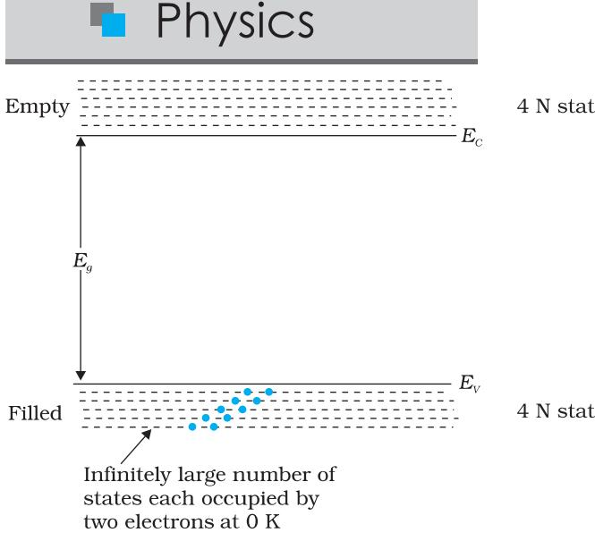

FIGURE 14.1 The energy band positions in a semiconductor at 0 K. The upper band, called the conduction band, consists of infinitely large number of closely spaced energy states. The lower band, called the valence band, consists of closely spaced completely filled energy states.

The lowest energy level in the conduction band is shown as *EC* and highest energy level in the valence band is shown as *EV* . Above *EC* and below *EV* there are a large number of closely spaced energy levels, as shown in Fig. 14.1.

The gap between the top of the valence band and bottom of the conduction band is called the *energy band gap* (Energy gap *E g* ). It may be large, small, or zero, depending upon the material. These different situations, are depicted in Fig. 14.2 and discussed below:

*Case I:* This refers to a situation, as shown in Fig. 14.2(a). One can have a metal either when the conduction band is partially filled and the balanced band is partially empty or when the conduction and valance bands overlap. When there is overlap electrons from valence band can easily move into the conduction band. This situation makes a large number of

electrons available for electrical conduction. When the valence band is partially empty, electrons from its lower level can move to higher level making conduction possible. Therefore, the resistance of such materials is low or the conductivity is high.

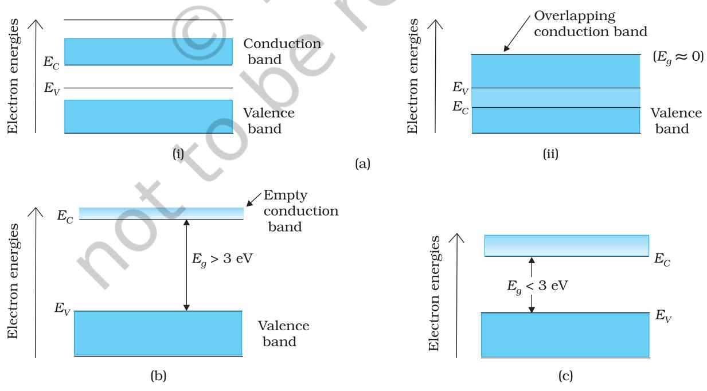


FIGURE 14.2 Difference between energy bands of (a) metals, (b) insulators and (c) semiconductors.

*Case II:* In this case, as shown in Fig. 14.2(b), a large band gap *E g* exists (*E g* > 3 eV). There are no electrons in the conduction band, and therefore no electrical conduction is possible. Note that the energy gap is so large that electrons cannot be excited from the valence band to the conduction band by thermal excitation. This is the case of *insulators*.

*Case III:* This situation is shown in Fig. 14.2(c). Here a finite but small band gap (*Eg* < 3 eV) exists. Because of the small band gap, at room temperature some electrons from valence band can acquire enough energy to cross the energy gap and enter the *conduction band*. These electrons (though small in numbers) can move in the conduction band. Hence, the resistance of *semiconductors* is not as high as that of the insulators.

In this section we have made a broad classification of metals, conductors and semiconductors. In the section which follows you will learn the conduction process in semiconductors.

## 14.3 INTRINSIC SEMICONDUCTOR

We shall take the most common case of Ge and Si whose lattice structure is shown in Fig. 14.3. These structures are called the diamond-like structures. Each atom is surrounded by four nearest neighbours. We know that Si and Ge have four valence electrons. In its crystalline structure, every Si or Ge atom tends *to share* one of its four valence electrons with each of its four nearest neighbour atoms, and also *to take share* of one electron from each such neighbour. These shared electron pairs are referred to as forming a *covalent bond* or simply a *valence bond*. The two shared electrons can be assumed to shuttle back-and-forth between the associated atoms holding them together strongly. Figure 14.4 schematically shows the 2-dimensional representation of Si or Ge structure shown in Fig. 14.3 which overemphasises the covalent bond. It shows an idealised picture in which no bonds are broken (all bonds are intact). Such a situation arises at low temperatures. As the temperature increases,

more thermal energy becomes available to these electrons and some of these electrons may break–away (becoming *free* electrons contributing to conduction). The thermal energy effectively ionises only a few atoms in the crystalline lattice and creates a *vacancy* in the bond as shown in Fig. 14.5(a). The neighbourhood, from which the free electron (with charge –*q*) has come out leaves a vacancy with an effective charge (+*q*). This *vacancy* with the effective positive electronic charge is called a *hole*. The hole behaves as an *apparent free particle* with effective positive charge.

In intrinsic semiconductors, the number of free electrons, *ne* is equal to the number of holes, *nh* . That is

*ne = nh = ni*

where *ni* is called intrinsic carrier concentration.

Semiconductors posses the unique property in which, apart from electrons, the holes also move. Suppose there is a hole at site 1 as shown

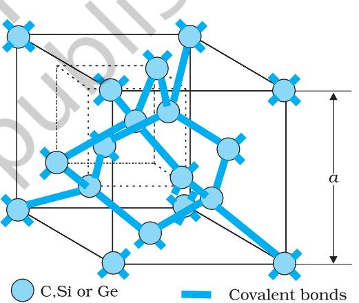

FIGURE 14.3 Three-dimensional diamond-like crystal structure for Carbon, Silicon or Germanium with respective lattice spacing *a* equal to 3.56, 5.43 and 5.66 Å.

(14.1)

327

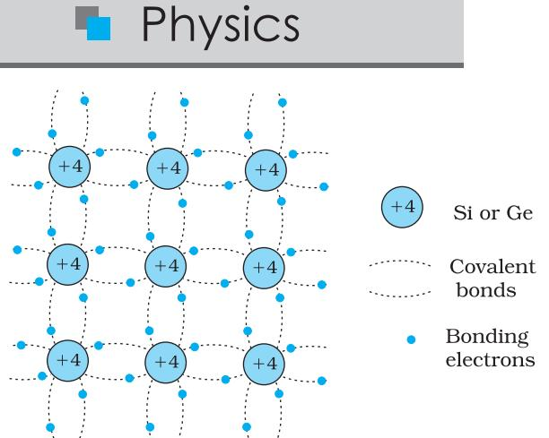

FIGURE 14.4 Schematic two-dimensional representation of Si or Ge structure showing covalent bonds at low temperature (all bonds intact). +4 symbol indicates inner cores of Si or Ge.

*I* = *I e* + *I*

*h*

in Fig. 14.5(a). The movement of holes can be visualised as shown in Fig. 14.5(b). An electron from the covalent bond at site 2 may jump to the vacant site 1 (hole). Thus, after such a jump, the hole is at site 2 and the site 1 has now an electron. Therefore, apparently, the hole has moved from site 1 to site 2. Note that the electron originally set free [Fig. 14.5(a)] is not involved in this process of hole motion. The free electron moves completely independently as conduction electron and gives rise to an electron current, *I e* under an applied electric field. Remember that the motion of hole is only a convenient way of describing the actual motion of *bound* electrons, whenever there is an empty bond anywhere in the crystal. Under the action of an electric field, these holes move towards negative potential giving the hole current, *I h* . The total current, *I* is thus the sum of the electron current *I e* and the hole current *I h* :

(14.2)

It may be noted that apart from the *process of generation* of conduction electrons and holes, a simultaneous *process of recombination* occurs in which the electrons *recombine* with the holes. At equilibrium, the rate of generation is equal to the rate of recombination of charge carriers. The recombination occurs due to an electron colliding with a hole.

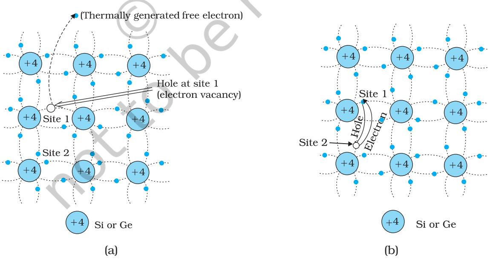

328 FIGURE 14.5 (a) Schematic model of generation of hole at site 1 and conduction electron due to thermal energy at moderate temperatures. (b) Simplified representation of possible thermal motion of a hole. The electron from the lower left hand covalent bond (site 2) goes to the earlier hole site1, leaving a hole at its site indicating an apparent movement of the hole from site 1 to site 2.

An intrinsic semiconductor will behave like an insulator at *T* = 0 K as shown in Fig. 14.6(a). It is the thermal energy at higher temperatures (*T* > 0K), which excites some electrons from the valence band to the conduction band. These thermally excited electrons at *T* > 0 K, partially occupy the conduction band. Therefore, the energy-band diagram of an intrinsic semiconductor will be as shown in Fig. 14.6(b). Here, some electrons are shown in the conduction band. These have come from the valence band leaving equal number of holes there.

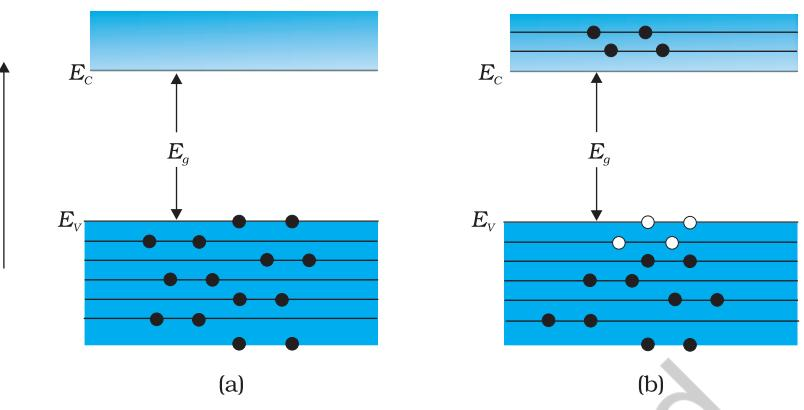

FIGURE 14.6 (a) An intrinsic semiconductor at *T* = 0 K behaves like insulator. (b) At *T* > 0 K, four thermally generated electron-hole pairs. The filled circles ( ) represent electrons and empty circles ( ) represent holes.

Example 14.1 C, Si and Ge have same lattice structure. Why is C insulator while Si and Ge intrinsic semiconductors?

Solution The 4 bonding electrons of C, Si or Ge lie, respectively, in the second, third and fourth orbit. Hence, energy required to take out an electron from these atoms (i.e., ionisation energy *Eg* ) will be least for Ge, followed by Si and highest for C. Hence, number of free electrons for conduction in Ge and Si are significant but negligibly small for C.

# EXAMPLE 14.1

## 14.4 EXTRINSIC SEMICONDUCTOR

The conductivity of an intrinsic semiconductor depends on its temperature, but at room temperature its conductivity is very low. As such, no important electronic devices can be developed using these semiconductors. Hence there is a necessity of improving their conductivity. This can be done by making use of impurities.

When a small amount, say, a few parts per million (ppm), of a suitable impurity is added to the pure semiconductor, the conductivity of the semiconductor is increased manifold. Such materials are known as e*xtrinsic semiconductors* or *impurity semiconductors*. The deliberate addition of a desirable impurity is called *doping* and the impurity atoms are called *dopants*. Such a material is also called a *doped semiconductor*. The dopant has to be such that it does not distort the original pure semiconductor lattice. It occupies only a very few of the original semiconductor atom sites in the crystal. A necessary condition to attain this is that the sizes of the dopant and the semiconductor atoms should be nearly the same.

There are two types of dopants used in doping the tetravalent Si or Ge:

- (i) Pentavalent (valency 5); like Arsenic (As), Antimony (Sb), Phosphorous (P), etc.
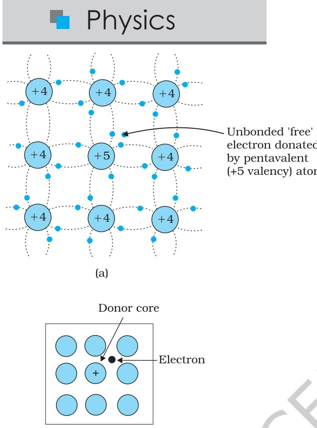

FIGURE 14.7 (a) Pentavalent donor atom (As, Sb, P, etc.) doped for tetravalent Si or Ge giving ntype semiconductor, and (b) Commonly used schematic representation of n-type material which shows only the fixed cores of the substituent donors with one additional effective positive charge and its associated extra electron.

- (ii) Trivalent (valency 3); like Indium (In), Boron (B), Aluminium (Al), etc.
We shall now discuss how the doping changes the number of charge carriers (and hence the conductivity) of semiconductors. Si or Ge belongs to the fourth group in the Periodic table and, therefore, we choose the dopant element from nearby fifth or third group, expecting and taking care that the size of the dopant atom is nearly the same as that of Si or Ge. Interestingly, the pentavalent and trivalent dopants in Si or Ge give two entirely different types of semiconductors as discussed below.

#### *(i) n-type semiconductor*

Suppose we dope Si or Ge with a pentavalent element as shown in Fig. 14.7. When an atom of +5 valency element occupies the position of an atom in the crystal lattice of Si, four of its electrons bond with the four silicon neighbours while the fifth remains very weakly bound to its parent atom. This is because the four electrons participating in bonding are seen as part of the effective core of the atom by the fifth electron. As a result the ionisation energy required to set this electron free is very small and even at room temperature it will be free to move in the lattice of the semiconductor. For example, the energy required is ~ 0.01 eV for germanium, and 0.05 eV for silicon, to separate this

electron from its atom. This is in contrast to the energy required to jump the forbidden band (about 0.72 eV for germanium and about 1.1 eV for silicon) at room temperature in the intrinsic semiconductor. Thus, the pentavalent dopant is donating one extra electron for conduction and hence is known as *donor* impurity. The number of electrons made available for conduction by dopant atoms depends strongly upon the doping level and is independent of any increase in ambient temperature. On the other hand, the number of free electrons (with an equal number of holes) generated by Si atoms, increases weakly with temperature.

In a doped semiconductor the total number of conduction electrons *ne* is due to the electrons contributed by donors and those generated intrinsically, while the total number of holes *nh* is only due to the holes from the intrinsic source. But the rate of recombination of holes would increase due to the increase in the number of electrons. As a result, the number of holes would get reduced further.

Thus, with proper level of doping the number of conduction electrons can be made much larger than the number of holes. Hence in an extrinsic semiconductor doped with pentavalent impurity, electrons become the *majority carriers* and holes the *minority carriers*. These semiconductors are, therefore, known as n*-type semiconductors*. For n-type semiconductors, we have,

> *ne >> nh*

(14.3)

#### *(ii) p-type semiconductor*

This is obtained when Si or Ge is doped with a trivalent impurity like Al, B, In, etc. The dopant has one valence electron less than Si or Ge and, therefore, this atom can form covalent bonds with neighbouring three Si atoms but does not have any electron to offer to the fourth Si atom. So the bond between the fourth neighbour and the trivalent atom has a vacancy or hole as shown in Fig. 14.8. Since the neighbouring Si atom in the lattice wants an electron in place of a hole, an electron in the outer orbit of an atom in the neighbourhood may jump to fill this vacancy, leaving a vacancy or hole at its own site. Thus the *hole* is available for conduction. Note that the trivalent foreign atom becomes effectively negatively charged when it shares fourth electron with neighbouring Si atom. Therefore, the dopant atom of p-type material can be treated as *core of one negative charge* along with its associated hole as shown in Fig. 14.8(b). It is obvious that one *acceptor* atom gives one *hole*. These holes are in addition to the intrinsically generated holes while the source of conduction electrons is only intrinsic generation. Thus, for such a material, the holes are the majority carriers and electrons are minority carriers. Therefore, extrinsic semiconductors doped with trivalent impurity are called p*-type semiconductors*. For p-type semiconductors, the recombination process will reduce the number (*ni* )of intrinsically generated electrons to *ne* . We have, for p-type semiconductors

#### *nh* >> *ne*

(14.4)

Note that *the crystal maintains an overall charge neutrality as the charge of additional charge carriers is just equal and opposite to that of the ionised cores in the lattice.*

In extrinsic semiconductors, because of the abundance of majority current carriers, the minority carriers produced thermally have more chance of meeting majority carriers and thus getting destroyed. Hence, the dopant, by adding a large number of current carriers of one type, which become the majority carriers, indirectly helps to reduce the intrinsic concentration of minority carriers.

The semiconductor's energy band structure is affected by doping. In the case of extrinsic semiconductors, additional energy states due to donor impurities (*ED* ) and acceptor impurities (*EA* ) also exist. In the energy band diagram of n-type Si semiconductor, the donor energy level *ED* is slightly below the bottom *E*C of the conduction band and electrons from this level move into the conduction band with very small supply of energy. At room temperature, most of the donor atoms get ionised but very few (~1012) atoms of Si get ionised. So the conduction band will have most electrons coming from the donor impurities, as shown in Fig. 14.9(a). Similarly,

## Semiconductor Electronics: Materials, Devices and Simple Circuits


FIGURE 14.8 (a) Trivalent acceptor atom (In, Al, B etc.) doped in tetravalent Si or Ge lattice giving p-type semiconductor. (b) Commonly used schematic representation of p-type material which shows only the fixed core of the substituent acceptor with one effective additional negative charge and its associated hole.

for p-type semiconductor, the acceptor energy level *EA* is slightly above the top *EV* of the valence band as shown in Fig. 14.9(b). With very small supply of energy an electron from the valence band can jump to the level *EA* and ionise the acceptor negatively. (Alternately, we can also say that with very small supply of energy the hole from level *EA* sinks down into the valence band. Electrons rise up and holes fall down when they gain external energy.) At room temperature, most of the acceptor atoms get ionised leaving holes in the valence band. Thus at room temperature the density of holes in the valence band is predominantly due to impurity in the extrinsic semiconductor. The electron and hole concentration in a semiconductor *in thermal equilibrium* is given by

$$n_{e}n_{h}=n_{i}$$

2

(14.5)

Though the above description is grossly approximate and hypothetical, it helps in understanding the difference between metals, insulators and semiconductors (extrinsic and intrinsic) in a simple manner. The difference in the resistivity of C, Si and Ge depends upon the energy gap between their conduction and valence bands. For C (diamond), Si and Ge, the energy gaps are 5.4 eV, 1.1 eV and 0.7 eV, respectively. Sn also is a group IV element but it is a metal because the energy gap in its case is 0 eV.

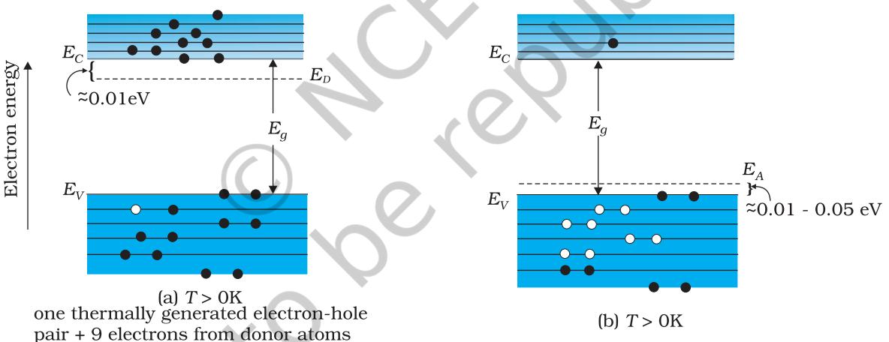


Example 14.2 Suppose a pure Si crystal has 5 × 1028 atoms m–3. It is doped by 1 ppm concentration of pentavalent As. Calculate the number of electrons and holes. Given that *ni* =1.5 × 1016 m–3 .

Solution Note that thermally generated electrons (*ni* ~1016 m–3 ) are negligibly small as compared to those produced by doping. Therefore, *ne* » *ND .* Since *ne nh* = *ni* 2 , The number of holes *nh* = (2.25 × 1032 )/(5 ×1022 )

332

EXAMPLE 14.2

~ 4.5 × 109

m–3

Formation and working of p-n junction diode

http://hyperphysics.phy-astr.gsu.edu/hbase/solids/pnjun.html

## 14.5 p-n JUNCTION

A p-n junction is the basic building block of many semiconductor devices like diodes, transistor,etc.A clear understanding of the junction behaviour is important to analyse the working of other semiconductor devices. We will now try to understand how a junction is formed and how the junction behaves under the influence of external applied voltage (also called *bias*).

#### 14.5.1 p-n junction formation

Consider a thin p-type silicon (p-Si) semiconductor wafer. By adding precisely a small quantity of pentavelent impurity, part of the p-Si wafer can be converted into n-Si. There are several processes by which a semiconductor can be formed. The wafer now contains p-region and n-region and a metallurgical junction between p-, and n- region.

Two important processes occur during the formation of a p-n junction: *diffusion* and *drift*. We know that in an n-type semiconductor, the concentration of electrons (number of electrons per unit volume) is more compared to the concentration of holes. Similarly, in a p-type semiconductor, the concentration of holes is more than the concentration of electrons. During the formation of p-n junction, and due to the concentration gradient across p-, and n- sides, holes diffuse from p-side to n-side (p ® n) and electrons diffuse from n-side to p-side (n ® p). This motion of charge carries gives rise to diffusion current across the junction.

When an electron diffuses from n ® p, it leaves behind an ionised donor on n-side. This ionised donor (positive charge) is immobile as it is bonded to the surrounding atoms. As the electrons continue to diffuse from n ® p, a layer of positive charge (or positive space-charge region) on n-side of the junction is developed.

Similarly, when a hole diffuses from p ® n due to the concentration gradient, it leaves behind an ionised acceptor (negative charge) which is immobile. As the holes continue to diffuse, a layer of negative charge (or negative space-charge region) on the p-side of the junction is developed. This space-charge region on either side of the junction together is known

as *depletion region* as the electrons and holes taking part in the initial movement across the junction *depleted* the region of its free charges (Fig. 14.10). The thickness of depletion region is of the order of one-tenth of a micrometre. Due to the positive space-charge region on n-side of the junction and negative space charge region on p-side of the junction, an electric field directed from positive charge towards negative charge develops. Due to this field, an electron on p-side of the junction moves to n-side and a hole on n-side of the junction moves to pside. The motion of charge carriers due to the electric field is called drift. Thus a drift current, which is opposite in direction to the diffusion current (Fig. 14.10) starts.

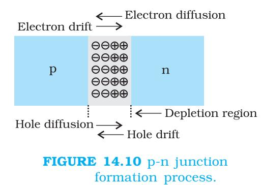

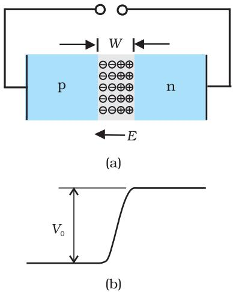

FIGURE 14.11 (a) Diode under equilibrium (V = 0), (b) Barrier potential under no bias.


Initially, diffusion current is large and drift current is small. As the diffusion process continues, the space-charge regions on either side of the junction extend, thus increasing the electric field strength and hence drift current. This process continues until the diffusion current equals the drift current. Thus a p-n junction is formed. In a p-n junction under equilibrium there is *no net* current.

The loss of electrons from the n-region and the gain of electron by the p-region causes a difference of potential across the junction of the two regions. The polarity of this potential is such as to oppose further flow of carriers so that a condition of equilibrium exists. Figure 14.11 shows the p-n junction at equilibrium and the potential across the junction. The n-material has lost electrons, and p material has acquired electrons. The n material is thus positive relative to the p material. Since this potential tends to prevent the movement of electron from the n region into the p region, it is often called a *barrier potential*.

Example 14.3 Can we take one slab of p-type semiconductor and physically join it to another n-type semiconductor to get p-n junction?

Solution No! Any slab, howsoever flat, will have roughness much larger than the inter-atomic crystal spacing (~2 to 3 Å) and hence *continuous contact* at the atomic level will not be possible. The junction will behave as a *discontinuity* for the flowing charge carriers.

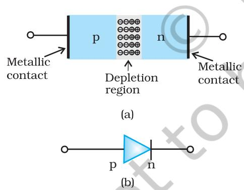


#### 14.6 SEMICONDUCTOR DIODE

A semiconductor diode [Fig. 14.12(a)] is basically a p-n junction with metallic contacts provided at the ends for the application of an external voltage. It is a two terminal device. A p-n junction diode is symbolically represented as shown in Fig. 14.12(b).

The direction of arrow indicates the conventional direction of current (when the diode is under forward bias). The equilibrium barrier potential can be altered by applying an external voltage *V* across the diode. The situation of p-n junction diode under equilibrium

(without bias) is shown in Fig. 14.11(a) and (b).

#### 14.6.1 p-n junction diode under forward bias

When an external voltage *V* is applied across a semiconductor diode such that p-side is connected to the positive terminal of the battery and n-side to the negative terminal [Fig. 14.13(a)], it is said to be *forward biased*.

The applied voltage mostly drops across the depletion region and the voltage drop across the p-side and n-side of the junction is negligible. (This is because the resistance of the depletion region – a region where there are no charges – is very high compared to the resistance of n-side and p-side.) The direction of the applied voltage (*V* ) is opposite to the

built-in potential *V*0 . As a result, the depletion layer width decreases and the barrier height is reduced [Fig. 14.13(b)]. The effective barrier height under forward bias is (*V*0 – *V* ).

If the applied voltage is small, the barrier potential will be reduced only slightly below the equilibrium value, and only a small number of carriers in the material—those that happen to be in the uppermost energy levels—will possess enough energy to cross the junction. So the current will be small. If we increase the applied voltage significantly, the barrier height will be reduced and more number of carriers will have the required energy. Thus the current increases.

Due to the applied voltage, electrons from n-side cross the depletion region and reach p-side (where they are minority carries). Similarly, holes from p-side cross the junction and reach the n-side (where they are minority carries). This process under forward bias is known as minority carrier injection. At the junction boundary, on each side, the minority carrier concentration increases significantly compared to the locations far from the junction.

Due to this concentration gradient, the injected electrons on p-side diffuse from the junction edge of p-side to the other end of p-side. Likewise, the injected holes on n-side diffuse from the junction edge of n-side to the other end of n-side (Fig. 14.14). This motion of charged carriers on either side gives rise to current. The total diode forward current is sum of hole diffusion current and conventional current due to electron diffusion. The magnitude of this current is usually in mA.

#### 14.6.2 p-n junction diode under reverse bias

When an external voltage (*V* ) is applied across the diode such that n-side is positive and p-side is negative, it is said to be *reverse biased* [Fig.14.15(a)]. The applied voltage mostly drops across the depletion region. The direction of applied voltage is same as the direction of barrier potential. As a result, the barrier height increases and the depletion region widens due to the change in the electric field. The effective barrier height under reverse bias is (*V*0 + *V* ), [Fig. 14.15(b)]. This suppresses the flow of electrons from n ® p and holes from p ® n. Thus, diffusion current, decreases enormously compared to the diode under forward bias.

The electric field direction of the junction is such that if electrons on p-side or holes on n-side in their random motion come close to the junction, they will be swept to its majority zone. This drift of carriers gives rise to current. The drift current is of the order of a few mA. This is quite low because it is due to the motion of carriers from their minority side to their majority side across the junction. The drift current is also there under forward bias but it is negligible (mA) when compared with current due to injected carriers which is usually in mA.

The diode reverse current is not very much dependent on the applied voltage. Even a small voltage is sufficient to sweep the minority carriers from one side of the junction to the other side of the junction. The current

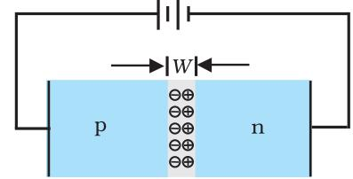

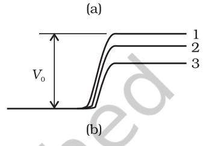

FIGURE 14.13 (a) p-n junction diode under forward bias, (b) Barrier potential (1) without battery, (2) Low battery voltage, and (3) High voltage battery.

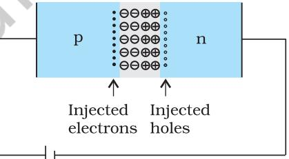

FIGURE 14.14 Forward bias minority carrier injection.

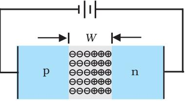

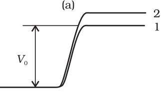

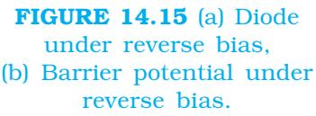

336

is not limited by the magnitude of the applied voltage but is limited due to the concentration of the minority carrier on either side of the junction.

The current under reverse bias is essentially voltage independent upto a critical reverse bias voltage, known as breakdown voltage (*Vbr* ). When *V* = *Vbr*, the diode reverse current increases sharply. Even a slight increase in the bias voltage causes large change in the current. If the reverse current is not limited by an external circuit below the rated value (specified by the manufacturer) the p-n junction will get destroyed. Once it exceeds the rated value, the diode gets destroyed due to overheating. This can happen even for the diode under forward bias, if the forward current exceeds the rated value.

The circuit arrangement for studying the *V*-*I* characteristics of a diode, (i.e., the variation of current as a function of applied voltage) are shown in Fig. 14.16(a) and (b). The battery is connected to the diode through a potentiometer (or reheostat) so that the applied voltage to the diode can be changed. For different values of voltages, the value of the current is noted. A graph between *V*

and *I* is obtained as in Fig. 14.16(c). Note that in forward bias measurement, we use a milliammeter since the expected current is large (as explained in the earlier section) while a micrometer is used in reverse bias to measure the current. You can see in Fig. 14.16(c) that in forward

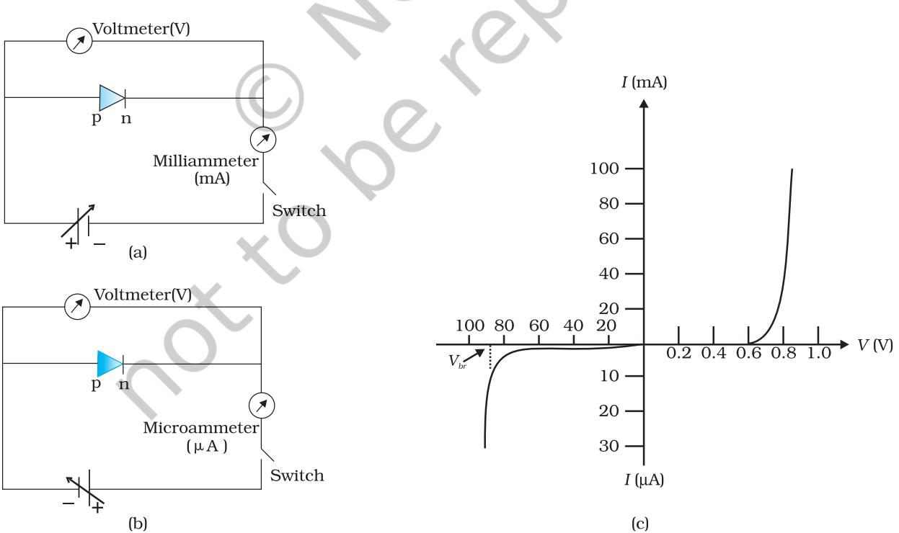

FIGURE 14.16 Experimental circuit arrangement for studying *V*-*I* characteristics of a p-n junction diode (a) in forward bias, (b) in reverse bias. (c) Typical *V*-*I* characteristics of a silicon diode.

bias, the current first increases very slowly, almost negligibly, till the voltage across the diode crosses a certain value. After the characteristic voltage, the diode current increases significantly (exponentially), even for a very small increase in the diode bias voltage. This voltage is called the *threshold voltage* or cut-in voltage (~0.2V for germanium diode and ~0.7 V for silicon diode).

For the diode in reverse bias, the current is very small (~mA) and almost remains constant with change in bias. It is called *reverse saturation current*. However, for special cases, at very high reverse bias (break down voltage), the current suddenly increases. This special action of the diode is discussed later in Section 14.8. The general purpose diode are not used beyond the reverse saturation current region.

The above discussion shows that the p-n junction diode primerly allows the flow of current only in one direction (forward bias). The forward bias resistance is low as compared to the reverse bias resistance. This property is used for rectification of ac voltages as discussed in the next section. For diodes, we define a quantity called *dynamic resistance* as the ratio of small change in voltage DV to a small change in current DI:

> *d V r I* ∆ = ∆

(14.6)

Example 14.4 The *V-I* characteristic of a silicon diode is shown in the Fig. 14.17. Calculate the resistance of the diode at (a) *ID* = 15 mA and (b) *VD* = –10 V.


Solution Considering the diode characteristics as a straight line between *I* = 10 mA to *I* = 20 mA passing through the origin, we can calculate the resistance using Ohm's law.

(a) From the curve, at *I* = 20 mA, *V* = 0.8 V; *I* = 10 mA, *V* = 0.7 V *r fb* = D*V*/D*I* = 0.1V/10 mA *=* 10 W

- (b) From the curve at V = –10 V, *I* = –1 mA, Therefore, *r rb* = 10 V/1mA= 1.0 × 107 W
337

E

XAMPLE 14.4

#### 14.7 APPLICATION OF JUNCTION DIODE AS A RECTIFIER

From the *V-I* characteristic of a junction diode we see that it allows current to pass only when it is forward biased. So if an alternating voltage is applied across a diode the current flows only in that part of the cycle

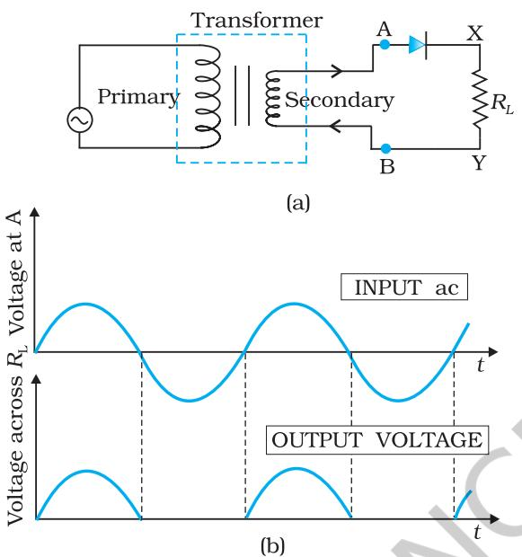

FIGURE 14.18 (a) Half-wave rectifier circuit, (b) Input ac voltage and output voltage waveforms from the rectifier circuit. when the diode is forward biased. This property is used *to rectify* alternating voltages and the circuit used for this purpose is called a *rectifier*.

If an alternating voltage is applied across a diode in series with a load, a pulsating voltage will appear across the load only during the half cycles of the ac input during which the diode is forward biased. Such rectifier circuit, as shown in Fig. 14.18, is called a *half-wave rectifier*. The secondary of a transformer supplies the desired ac voltage across terminals A and B. When the voltage at A is positive, the diode is forward biased and it conducts. When A is negative, the diode is reverse-biased and it does not conduct. The reverse saturation current of a diode is negligible and can be considered equal to zero for practical purposes. (The reverse breakdown voltage of the diode must be sufficiently higher than the peak ac voltage at the secondary of the transformer to protect the diode from reverse breakdown.)

Therefore, in the positive *half-cycle* of ac there is a current through the load resistor *RL* and we get an output voltage, as shown in Fig. 14.18(b), whereas there is no current in the negative halfcycle. In the next positive half-cycle, again we get

the output voltage. Thus, the output voltage, though still varying, is restricted to *only one direction* and is said to be *rectified*. Since the rectified output of this circuit is only for half of the input ac wave it is called as *half-wave rectifier*.

The circuit using two diodes, shown in Fig. 14.19(a), gives output rectified voltage corresponding to both the positive as well as negative half of the ac cycle. Hence, it is known as *full-wave rectifier*. Here the p-side of the two diodes are connected to the ends of the secondary of the transformer. The n-side of the diodes are connected together and the output is taken between this common point of diodes and the midpoint of the secondary of the transformer. So for a full-wave rectifier the secondary of the transformer is provided with a centre tapping and so it is called *centre-tap transformer*. As can be seen from Fig.14.19(c) the voltage rectified by each diode is only half the total secondary voltage. Each diode rectifies only for half the cycle, but the two do so for alternate cycles. Thus, the output between their common terminals and the centretap of the transformer becomes a full-wave rectifier output. (Note that there is another circuit of full wave rectifier which does not need a centretap transformer but needs four diodes.) Suppose the input voltage to A

with respect to the centre tap at any instant is positive. It is clear that, at that instant, voltage at B being out of phase will be negative as shown in Fig.14.19(b). So, diode D1 gets forward biased and conducts (while D2 being reverse biased is not conducting). Hence, during this positive half cycle we get an output current (and a output voltage across the load resistor *RL* ) as shown in Fig.14.19(c). In the course of the ac cycle when the voltage at A becomes negative with respect to centre tap, the voltage at B would be positive. In this part of the cycle diode D1 would not conduct but diode D2 would, giving an output current and output voltage (across *RL* ) during the negative half cycle of the input ac. Thus, we get output voltage during both the positive as well as the negative half of the cycle. Obviously, this is a more efficient circuit for getting rectified voltage or current than the halfwave rectifier.

The rectified voltage is in the form of pulses of the shape of half sinusoids. Though it is unidirectional it does not have a steady value. To get steady dc output from the pulsating voltage normally a capacitor is connected across the output terminals (parallel to the load *RL* ). One can also use an inductor in series with *RL* for the same purpose. Since these additional circuits appear to *filter* out the *ac ripple* and give a *pure dc* voltage, so they are called filters.

Now we shall discuss the role of capacitor in filtering. When the voltage across the capacitor is rising, it gets

charged. If there is no external load, it remains charged to the peak voltage of the rectified output. When there is a load, it gets discharged through the load and the voltage across it begins to fall. In the next half-cycle of rectified output it again gets charged to the peak value (Fig. 14.20). The rate of fall of the voltage across the capacitor depends inversely upon the product of capacitance *C* and the effective resistance *RL* used in the circuit and is called the *time constant*. To make the time constant large value of *C* should be large. So capacitor input filters use large capacitors. The *output voltage* obtained by using capacitor input filter is nearer to the *peak voltage* of the rectified voltage. This type of filter is most widely used in power supplies.

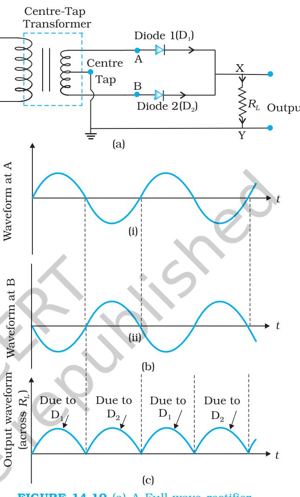

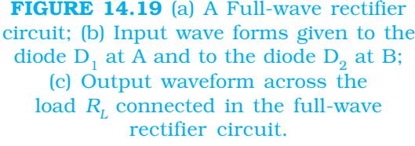

339


FIGURE 14.20 (a) A full-wave rectifier with capacitor filter, (b) Input and output voltage of rectifier in (a).

#### SUMMARY

- 1. Semiconductors are the basic materials used in the present solid state electronic devices like diode, transistor, ICs, etc.
- 2. Lattice structure and the atomic structure of constituent elements decide whether a particular material will be insulator, metal or semiconductor.
- 3. Metals have low resistivity (10–2 to 10–8 Wm), insulators have very high resistivity (>108 W m–1), while semiconductors have intermediate values of resistivity.
- 4. Semiconductors are elemental (Si, Ge) as well as compound (GaAs, CdS, etc.).
- 5. Pure semiconductors are called 'intrinsic semiconductors'. The presence of charge carriers (electrons and holes) is an 'intrinsic' property of the material and these are obtained as a result of thermal excitation. The number of electrons (*ne* ) is equal to the number of holes (*nh* ) in intrinsic conductors. Holes are essentially electron vacancies with an effective positive charge.
- 6. The number of charge carriers can be changed by 'doping' of a suitable impurity in pure semiconductors. Such semiconductors are known as extrinsic semiconductors. These are of two types (n-type and p-type).
- 7. In n-type semiconductors, *ne* >> *nh* while in p-type semiconductors *nh* >> *ne* .
- 8. n-type semiconducting Si or Ge is obtained by doping with pentavalent atoms (donors) like As, Sb, P, etc., while p-type Si or Ge can be obtained by doping with trivalent atom (acceptors) like B, Al, In etc.
- 9. *ne nh* = *ni* 2 in all cases. Further, the material possesses an *overall charge neutrality*.
- 10. There are two distinct band of energies (called valence band and conduction band) in which the electrons in a material lie. Valence band energies are low as compared to conduction band energies. All energy levels in the valence band are filled while energy levels in the conduction band may be fully empty or partially filled. The electrons in the conduction band are free to move in a solid and are responsible for the conductivity. The extent of conductivity depends upon the energy gap (*Eg* ) between the top of valence band (*EV* ) and the bottom of the conduction band *EC* . The electrons from valence band can be excited by

heat, light or electrical energy to the conduction band and thus, produce a change in the current flowing in a semiconductor.

- 11. For insulators *Eg* > 3 eV, for semiconductors *Eg* is 0.2 eV to 3 eV, while for metals *Eg* » 0.
- 12. p-n junction is the 'key' to all semiconductor devices. When such a junction is made, a 'depletion layer' is formed consisting of immobile ion-cores devoid of their electrons or holes. This is responsible for a junction potential barrier.
- 13. By changing the external applied voltage, junction barriers can be changed. In forward bias (n-side is connected to negative terminal of the battery and p-side is connected to the positive), the barrier is decreased while the barrier increases in reverse bias. Hence, forward bias current is more (mA) while it is very small (mA) in a p-n junction diode.
- 14. Diodes can be used for rectifying an ac voltage (restricting the ac voltage to one direction). With the help of a capacitor or a suitable filter, a dc voltage can be obtained.

#### POINTS TO PONDER

- 1. The energy bands (*EC* or *EV* ) in the semiconductors are space delocalised which means that these are not located in any specific place inside the solid. The energies are the overall averages. When you see a picture in which *EC* or *EV* are drawn as straight lines, then they should be respectively taken simply as the *bottom* of conduction band energy levels and *top* of valence band energy levels.
- 2. In elemental semiconductors (Si or Ge), the n-type or p-type semiconductors are obtained by introducing 'dopants' as defects. In compound semiconductors, the change in relative stoichiometric ratio can also change the type of semiconductor. For example, in ideal GaAs the ratio of Ga:As is 1:1 but in Ga-rich or As-rich GaAs it could respectively be Ga1.1 As0.9 or Ga0.9 As1.1. In general, the presence of defects control the properties of semiconductors in many ways.

## EXERCISES

- 14.1 In an n-type silicon, which of the following statement is true:
	- (a) Electrons are majority carriers and trivalent atoms are the dopants.
	- (b) Electrons are minority carriers and pentavalent atoms are the dopants.
	- (c) Holes are minority carriers and pentavalent atoms are the dopants.
	- (d) Holes are majority carriers and trivalent atoms are the dopants.
- 14.2 Which of the statements given in Exercise 14.1 is true for p-type semiconductos.
- 14.3 Carbon, silicon and germanium have four valence electrons each. These are characterised by valence and conduction bands separated

by energy band gap respectively equal to (*E*g )C , (*E*g ) Si and (*E*g )Ge. Which of the following statements is true?

- (a) (*Eg* ) Si < (*Eg* )Ge < (*Eg* )C
- (b) (*Eg* )C < (*Eg* )Ge > (*Eg* ) Si
- (c) (*Eg* )C > (*Eg* ) Si > (*Eg* )Ge
- (d) (*Eg* )C = (*Eg* ) Si = (*Eg* )Ge
- 14.4 In an unbiased p-n junction, holes diffuse from the p-region to n-region because
	- (a) free electrons in the n-region attract them.
	- (b) they move across the junction by the potential difference.
	- (c) hole concentration in p-region is more as compared to n-region.
	- (d) All the above.
- 14.5 When a forward bias is applied to a p-n junction, it
	- (a) raises the potential barrier.
	- (b) reduces the majority carrier current to zero.
	- (c) lowers the potential barrier.
	- (d) None of the above.
- 14.6 In half-wave rectification, what is the output frequency if the input frequency is 50 Hz. What is the output frequency of a full-wave rectifier for the same input frequency.


344

## APPENDICES

#### APPENDIX A 1 THE GREEK ALPHABET

| Alpha | A | ರ | lota |  |  | Rho | b | 0 |
| --- | --- | --- | --- | --- | --- | --- | --- | --- |
| Beta | B | B | Kappa | K | K | Sigma | Σ | C |
| Gamma |  | V | Lambda | A |  | Tau |  |  |
| Delta | △ | 8 | Mu | M | 山 | Upsilon | Y | 10 |
| Epsilon | E | ε | Nu | Z |  | Phi | 0 | 0. 0 |
| Zeta | Z | S | Xi | [I | డ్ | Chi | × | X |
| Eta | H | רו | Omicron | O | O | Psi | E | U |
| Theta | A | 0 | Pi |  |  | Omega | Q | 3 |


#### COMMON SI PREFIXES AND SYMBOLS FOR MULTIPLES AND SUB-MULTIPLES

|  | Multiple |  |  | Sub -Multiple |  |
| --- | --- | --- | --- | --- | --- |
| Factor | Prefix | Symbol | Factor | Prefix | symbol |
| 1018 | Exa | E | 10-18 | atto | a |
| 1012 | Peta | P | 10-15 | femto | f |
| 1012 | Tera | L | 10-12 | pico | p |
| 109 | Giga | G | 10-9 | nano | n |
| 100 | Mega | M | 10-6 | micro | الا |
| 103 | kilo | k | 10-3 | milli | m |
| 102 | Hecto | h | 10- | centi | C |
| 10- | Deca | da | 10-1 | deci | d |

| SOME IMPORTANT CONSTANTS |
| --- |

## APPENDIX A 3

## OTHER USEFUL CONSTANTS

| Name | Symbol | Value |
| --- | --- | --- |
| Mechanical equivalent of heat | J | 4.186 J cal-1 |
| Standard atmospheric pressure | l atm | 1.013 × 10° Pa |
| Absolute zero | 0 K | -273.15 °C |
| Electron volt | l eV | 1.602×10-17 |
| Unified Atomic mass unit | l u | 1.661 × 10-2/kg |
| Electron rest energy | mc- | 0.511 MeV |
| Energy equivalent of 1 u | 1 uc2 | 931.5 MeV |
| Volume of ideal gas (0 ℃ and 1atm) | V | 22.4 L mol |
| Acceleration due to gravity | g | 9.78049 m s-2 |
| (sea level, at equator) |  |  |

### ANSWERS

#### CHAPTER 9

- 9.1 *v* = –54cm. The image is real, inverted and magnified. The size of the image is 5.0cm. As *u* ® *f*, *v* ® ¥; for *u* < *f,* image is virtual.
- 9.2 *v* = 6.7cm. Magnification = 5/9, i.e., the size of the image is 2.5cm. As *u* ® ¥; *v* ® *f* (but never beyond) while *m* ® 0.
- 9.3 1.33; 1.7cm
- 9.4 *nga*  = 1.51; *n wa* = 1.32; *ngw* = 1.144; which gives sin *r* = 0.6181 i.e., *r* ~ 38°.
- 9.5 *r* = 0.8 × tan *i c* and sin 1/1.33 0.75 *c i* = ≅ , where *r* is the radius (in m) of the largest circle from which light comes out and *i c* is the critical angle for water-air interface, Area = 2.6m2
- 9.6 *n* ≅ 1.53 and *Dm* for prism in water ≅ 10°
- 9.7 *R* = 22cm
- 9.8 Here the object is virtual and the image is real. *u* = +12cm (object on right; virtual)
	- (a) *f* = +20cm. Image is real and at 7.5 cm from the lens on its right side.
		- (b) *f* = –16cm. Image is real and at 48cm from the lens on its right side.
- 9.9 *v* = 8.4 cm, image is erect and virtual. It is diminished to a size 1.8cm. As *u* ® ¥, *v* ® *f* (but never beyond *f* while *m* ® 0).

Note that when the object is placed at the focus of the concave lens (21cm), the image is located at 10.5 cm (not at infinity as one might wrongly think).

- 9.10 A diverging lens of focal length 60 cm
- 9.11 (a) *ve* = –25cm and *f e* = 6.25cm give *ue* = –5cm; *v*O = (15 – 5) cm = 10cm,
	- *f*O = *u*O = – 2.5cm; Magnifying power = 20
	- (b) *u* O = 2.59cm.
	- Magnifying power = 13.5.
- 9.12 Angular magnification of the eye-piece for image at 25cm

$$={\frac{25}{2.5}}+1=1\,1;\,\,\,|\,u_{e}\,|={\frac{25}{11}}\mathrm{cm}=2.27\mathrm{cm}\,;\,\,v_{\mathrm{o}}=7.2\mathrm{cm}$$

- Separation = 9.47 cm; Magnifying power = 88
- 9.13 24; 150 cm

346

- 9.14 (a) Angular magnification = 1500
	- (b) Diameter of the image = 13.7 cm.

Answers

- 9.15 Apply mirror equation and the condition:
	- (a) *f* < 0 (concave mirror); *u* < 0 (object on left)
	- (b) *f* > 0; *u* < 0
	- (c) *f* > 0 (convex mirror) and *u* < 0
	- (d) *f* < 0 (concave mirror); *f* < *u* < 0

to deduce the desired result.

- 9.16 The pin appears raised by 5.0 cm. It can be seen with an explicit ray diagram that the answer is independent of the location of the slab (for small angles of incidence).
- 9.17 (a) sin *i* ¢ *c* = 1.44/1.68 which gives *i* ¢ *c* = 59°. Total internal reflection takes place when *i* > 59° or when *r* < *r*max = 31°. Now, (sin /sin ) . max max *i r* = 1 68 , which gives *i*max ~ 60°. Thus, all incident rays of angles in the range 0 < *i* < 60° will suffer total internal reflections in the pipe. (If the length of the pipe is finite, which it is in practice, there will be a lower limit on *i* determined by the ratio of the diameter to the length of the pipe.)
	- (b) If there is no outer coating, *i* ¢ *c* = sin–1(1/1.68) = 36.5°. Now, *i* = 90° will have *r* = 36.5° and *i* ¢ = 53.5° which is greater than *i* ¢ *c* . Thus, *all* incident rays (in the range 53.5° < *i* < 90°) will suffer total internal reflections.
- 9.18 For fixed distance *s* between object and screen, the lens equation does not give a real solution for *u* or *v* if *f* is greater than *s*/4.
	- Therefore, *f*max = 0.75 m.
- 9.19 21.4cm
- 9.20 (a) (i) Let a parallel beam be the incident from the left on the convex lens first.

*f* 1 = 30 cm and *u*1 = – , give *v*1 = + 30cm. This image becomes a virtual object for the second lens.

*f* 2 = –20 cm, *u*2 = + (30 – 8) cm = + 22 cm which gives, *v*2 = – 220 cm. The parallel incident beam appears to diverge from a point 216 cm from the centre of the two-lens system.

- (ii) Let the parallel beam be incident from the left on the concave lens first: *f*1 = – 20 cm, *u*1 = – ¥, give *v*1 = – 20 cm. This image becomes a real object for the second lens: *f* 2 = + 30 cm, *u*2 = – (20 + 8)cm = – 28cm which gives, *v*2 = – 420cm. The parallel incident beam appears to diverge from a point 416 cm on the left of the centre of the two-lens system.
Clearly, the answer depends on which side of the lens system the parallel beam is incident. *Further we do not have a simple lens equation true for all u (and v) in terms of a definite constant of the system (the constant being determined by f1 and f2 , and the separation between the lenses). T*he notion of effective focal length, therefore, does not seem to be meaningful for this system.

- (b) *u*1 = – 40 cm, *f* 1 = 30 cm, gives *v*1 = 120 cm. Magnitude of magnification due to the first (convex) lens is 3.
*u* 2 = + (120 – 8) cm = +112 cm (object virtual);

$\int_2$ = – 20 cm which gives $\,v_2=–\,\dfrac{112\times20}{92}\,\text{cm}$. 

Magnitude of magnification due to the second (concave)

347

lens = 20/92.

Net magnitude of magnification = 0.652 Size of the image = 0.98 cm

- 9.21 If the refracted ray in the prism is incident on the second face at the critical angle *i* c , the angle of refraction *r* at the first face is (60°–*i* c ). Now, *i* c = sin–1 (1/1.524) ~ 41°
Therefore, *r* = 19°

sin *i* = 0.4962; *i* ~ 30°

9.22 (a) 1 1 9 1 *v* 10 + =

i.e., *v* = – 90 cm,

Magnitude of magnification = 90/9 = 10.

Each square in the virtual image has an area 10 × 10 × 1 mm2 = 100 mm2 = 1 cm2

- (b) Magnifying power = 25/9 = 2.8
- (c) No, magnification of an image by a lens and angular magnification (or magnifying power) of an optical instrument are two separate things. The latter is the ratio of the angular size of the object (which is equal to the angular size of the image even if the image is magnified) to the angular size of the object if placed at the near point (25 cm). Thus, magnification magnitude is |(*v*/*u*)| and magnifying power is (25/ |*u*|). Only when the image is located at the near point |*v*| = 25 cm, are the two quantities equal.
- 9.23 (a) Maximum magnifying power is obtained when the image is at the near point (25 cm)

*u* = – 7.14 cm.

- (b) Magnitude of magnification = (25/ |*u*|) = 3.5.
- (c) Magnifying power = 3.5

Yes, the magnifying power (when the image is produced at 25 cm) is equal to the magnitude of magnification.

  
  
**9.24** Magnification = $\sqrt{(6.25/1)}$ = 2.5

$$\rho=+2.5u$$

$$\begin{array}{r}{\includegraphics[width=140.0pt]{28.45}}\end{array}$$

i.e.,*u* = – 6 cm

|*v*| = 15 cm

The virtual image is closer than the normal near point (25 cm) and cannot be seen by the eye distinctly.

9.25 (a) Even though the absolute image size is bigger than the object size, the angular size of the image is equal to the angular size of the object. The magnifier helps in the following way: without it object would be placed no closer than 25 cm; with it the object can be placed much closer. The closer object has larger angular size than the same object at 25 cm. It is in this sense that angular magnification is achieved.

- (b) Yes, it decreases a little because the angle subtended at the eye is then slightly less than the angle subtended at the lens. The
348

effect is negligible if the image is at a very large distance away. [*Note:* When the eye is separated from the lens, the angles subtended at the eye by the first object and its image are not equal.]

- (c) First, grinding lens of very small focal length is not easy. More important, if you decrease focal length, aberrations (both spherical and chromatic ) become more pronounced. So, in practice, you cannot get a magnifying power of more than 3 or so with a simple convex lens. However, using an aberration corrected lens system, one can increase this limit by a factor of 10 or so.
- (d) Angular magnification of eye-piece is [(25/*f* e ) + 1] ( *f* e in cm) which increases if *f* e is smaller. Further, magnification of the objective

$${\mathrm{is~given~by}}\quad{\frac{v_{\mathrm{o}}}{\mid u_{\mathrm{o}}\mid}}={\frac{1}{(\mid u_{\mathrm{o}}\mid/\,f_{\mathrm{o}})-1}}$$

which is large when | | *u* O is slightly greater than *f*O . The microscope is used for viewing very close object. So | | *u* O is small, and so is *f*O .

- (e) The image of the objective in the eye-piece is known as 'eye-ring'. All the rays from the object refracted by objective go through the eye-ring. Therefore, it is an ideal position for our eyes for viewing. If we place our eyes too close to the eye-piece, we shall not collect much of the light and also reduce our field of view. If we position our eyes on the eye-ring and the area of the pupil of our eye is greater or equal to the area of the eye-ring, our eyes will collect all the light refracted by the objective. The precise location of the eye-ring naturally depends on the separation between the objective and the eye-piece. When you view through a microscope by placing your eyes on one end,the ideal distance between the eyes and eye-piece is usually built-in the design of the instrument.
- 9.26 Assume microscope in normal use i.e., image at 25 cm. Angular magnification of the eye-piece

$=\;\dfrac{25}{5}+1=6$  
  
. 

Magnification of the objective

= 30 6 5 O O 1 1 1 5 1.25 *u u* − =

which gives *u*O = –1.5 cm; *v*0 = 7.5 cm. |*u* |*e* (25/6) cm = 4.17 cm. The separation between the objective and the eye-piece should be (7.5 + 4.17) cm = 11.67 cm. Further the object should be placed 1.5 cm from the objective to obtain the desired magnification.

$$\begin{array}{r l}{{\bf9.27}}&{{}{\mathrm{(a)}}\quad m=(f_{\mathrm{o}}/f_{\mathrm{e}})=28}\end{array}$$

$$\mathrm{(b)}\quad m=\,{\frac{f_{\mathrm{o}}}{f_{e}}}{\bigg[}1+{\frac{f_{\mathrm{o}}}{25}}{\bigg]}=33.6$$

349

- 9.28 (a) *f*O + *f* e = 145 cm
	- (b) Angle subtended by the tower = (100/3000) = (1/30) rad. Angle subtended by the image produced by the objective

$$=\mathrm{~\frac{~h}{f_{\mathrm{o}}}=\frac{h}{140}~}$$

Equating the two, *h* = 4.7 cm.

- (c) Magnification (magnitude) of the eye-piece = 6. Height of the final image (magnitude) = 28 cm.
- 9.29 The image formed by the larger (concave) mirror acts as virtual object for the smaller (convex) mirror. Parallel rays coming from the object at infinity will focus at a distance of 110 mm from the larger mirror. The distance of virtual object for the smaller mirror = (110 –20) = 90mm. The focal length of smaller mirror is 70 mm. Using the mirror formula, image is formed at 315 mm from the smaller mirror.
- 9.30 The reflected rays get deflected by twice the angle of rotation of the mirror. Therefore, *d*/1.5 = tan 7°. Hence *d* = 18.4 cm.
- 9.31 *n* = 1.33

#### CHAPTER 10

- 10.1 (a) Reflected light: (wavelength, frequency, speed same as incident light)
l = 589 nm, n = 5.09 ´ 1014 Hz, *c* = 3.00 ´ 108 m s –1

- (b) Refracted light: (frequency same as the incident frequency) n = 5.09 ´ 1014Hz
	- *v =* (*c/n*) = 2.26 × 108 ms –1 , l = (*v/*n) = 444 nm
- 10.2 (a) Spherical
	- (b) Plane
	- (c) Plane (a small area on the surface of a large sphere is nearly planar).
- 10.3 (a) 2.0 × 108 ms –1
	- (b) No. The refractive index, and hence the speed of light in a medium, depends on wavelength. [When no particular wavelength or colour of light is specified, we may take the given refractive index to refer to yellow colour.] Now we know violet colour deviates more than red in a glass prism, i.e. *nv > nr* . Therefore, the violet component of white light travels slower than the red component.

  
  
**10.4**: $\lambda=\frac{1.2\times10^{-2}\times0.28\times10^{-3}}{4\times1.4}$ m = 600 nm

- 10.5 K/4
- 10.6 (a) 1.17 mm (b) 1.56 mm
- 10.7 0.15°
- 10.8 tan–1(1.5) ~ 56.3o
- 350

Answers

10.9 5000 Å, 6 × 1014Hz; 45°

10.10 40m

#### CHAPTER 11

```
11.1 (a) 7.24 × 1018 Hz (b) 0.041nm
11.2 (a) 0.34 eV = 0.54 × 10–19J (b) 0.34V (c) 344 km/s
11.3 1.5eV = 2.4 × 10–19 J
11.4 (a) 3.14 × 10–19J, 1.05 × 10–27 kg m/s (b) 3 × 1016 photons/s
      (c) 0.63 m/s
11.5 6.59 × 10–34 Js
11.6 2.0 V
11.7 No, because n < no
11.8 4.73 × 1014Hz
11.9 2.16 eV = 3.46 × 10–19J
11.10 (a) 1.7 × 10–35 m (b) 1.1 × 10–32 m (c) 3.0 × 10–23m
11.11 l = h/p = h/(hn/c) = c/n
```
#### CHAPTER 12

12.1 (a) No different from

- (b) Thomson's model; Rutherford's model
- (c) Rutherford's model
- (d) Thomson's model; Rutherford's model
- (e) Both the models
- 12.2 The nucleus of a hydrogen atom is a proton. The mass of it is 1.67 × 10–27 kg, whereas the mass of an incident a-particle is 6.64 × 10–27 kg. Because the scattering particle is more massive than the target nuclei (proton), the a-particle won't bounce back in even in a head-on collision. It is similar to a football colliding with a tenis ball at rest. Thus, there would be no large-angle scattering.
- 12.3 5.6 ´ 1014 Hz
- 12.4 13.6 eV; –27.2 eV
- 12.5 9.7 × 10 – 8m; 3.1 × 1015Hz.
- 12.6 (a) 2.18 × 106 m/s; 1.09 × 106 m/s; 7.27 × 105 m/s (b) 1.52 × 10–16 s; 1.22 × 10–15 s; 4.11 × 10–15 s.
- 12.7 2.12´10–10 m; 4.77 ´ 10–10 m
- 12.8 Lyman series: 103 nm and 122 nm; Balmer series: 656 nm.
- 12.9 2.6 × 1074

#### CHAPTER 13

- 13.1 104.7 MeV
- 13.2 8.79 MeV, 7.84 MeV
- 13.3 1.584 × 1025MeV or 2.535×1012J
- 13.4 1.23

351

- 13.5 (i) *Q* = –4.03 MeV; endothermic (ii) *Q* = 4.62 MeV; exothermic
- 13.6 *Q* = ( ) ( ) 56 28 *m m* 26Fe – 2 Al 13 = 26.90 MeV; not possible.
- 13.7 4.536 × 1026 MeV
- 13.8 About 4.9 × 104 y
- 13.9 360 KeV

#### CHAPTER 14

- 14.1 (c)
- 14.2 (d)
- 14.3 (c)
- 14.4 (c)
- 14.5 (c)
- 14.6 50 Hz for half-wave, 100 Hz for full-wave

## BIBLIOGRAPHY

#### TEXTBOOKS

For additional reading on the topics covered in this book, you may like to consult one or more of the following books. Some of these books however are more advanced and contain many more topics than this book.

- 1 Ordinary Level Physics, A.F. Abbott, Arnold-Heinemann (1984).
- 2 Advanced Level Physics, M. Nelkon and P. Parker, 6th Edition, Arnold-Heinemann (1987).
- 3 Advanced Physics, Tom Duncan, John Murray (2000).
- 4 Fundamentals of Physics, David Halliday, Robert Resnick and Jearl Walker, 7th Edition John Wily (2004).
- 5 University Physics (Sears and Zemansky's), H.D. Young and R.A. Freedman, 11th Edition, Addison—Wesley (2004).
- 6 Problems in Elementary Physics, B. Bukhovtsa, V. Krivchenkov, G. Myakishev and V. Shalnov, MIR Publishers, (1971).
- 7 Lectures on Physics (3 volumes), R.P. Feynman, Addision Wesley (1965).
- 8 Berkeley Physics Course (5 volumes) McGraw Hill (1965).
	- a. Vol. 1 Mechanics: (Kittel, Knight and Ruderman)
	- b. Vol. 2 Electricity and Magnetism (E.M. Purcell)
	- c. Vol. 3 Waves and Oscillations (Frank S. Crawford)
	- d. Vol. 4 Quantum Physics (Wichmann)
	- e. Vol. 5 Statistical Physics (F. Reif )
- 9 Fundamental University Physics, M. Alonso and E. J. Finn, Addison Wesley (1967).
- 10 College Physics, R.L. Weber, K.V. Manning, M.W. White and G.A. Weygand, Tata McGraw Hill (1977).
- 11 Physics: Foundations and Frontiers, G. Gamow and J.M. Cleveland, Tata McGraw Hill (1978).
- 12 Physics for the Inquiring Mind, E.M. Rogers, Princeton University Press (1960).
- 13 PSSC Physics Course, DC Heath and Co. (1965) Indian Edition, NCERT (1967).
- 14 Physics Advanced Level, Jim Breithampt, Stanley Thornes Publishers (2000).
- 15 Physics, Patrick Fullick, Heinemann (2000).
- 16 Conceptual Physics, Paul G. Hewitt, Addision—Wesley (1998).
- 17 College Physics, Raymond A. Serway and Jerry S. Faughn, Harcourt Brace and Co. (1999).
- 18 University Physics, Harris Benson, John Wiley (1996).
- 19 University Physics, William P. Crummet and Arthur B. Western, Wm.C. Brown (1994).
- 20 General Physics, Morton M. Sternheim and Joseph W. Kane, John Wiley (1988).
- 21 Physics, Hans C. Ohanian, W.W. Norton (1989).


- 22 Advanced Physics, Keith Gibbs, Cambridge University Press (1996).
- 23 Understanding Basic Mechanics, F. Reif, John Wiley (1995).
- 24 College Physics, Jerry D. Wilson and Anthony J. Buffa, Prentice Hall (1997).
- 25 Senior Physics, Part I, I.K. Kikoin and A.K. Kikoin, MIR Publishers (1987).
- 26 Senior Physics, Part II, B. Bekhovtsev, MIR Publishers (1988).
- 27 Understanding Physics, K. Cummings, Patrick J. Cooney, Priscilla W. Laws and Edward F. Redish, John Wiley (2005).
- 28 Essentials of Physics, John D. Cutnell and Kenneth W. Johnson, John Wiley (2005).

#### GENERAL BOOKS

For instructive and entertaining general reading on science, you may like to read some of the following books. Remember however, that many of these books are written at a level far beyond the level of the present book.

- 1 Mr. Tompkins in paperback, G. Gamow, Cambridge University Press (1967).
- 2 The Universe and Dr. Einstein, C. Barnett, Time Inc. New York (1962).
- 3 Thirty years that Shook Physics, G. Gamow, Double Day, New York (1966).
- 4 Surely You're Joking, Mr. Feynman, R.P. Feynman, Bantam books (1986).
- 5 One, Two, Three… Infinity, G. Gamow, Viking Inc. (1961).
- 6 The Meaning of Relativity, A. Einstein, (Indian Edition) Oxford and IBH Pub. Co. (1965).
- 7 Atomic Theory and the Description of Nature, Niels Bohr, Cambridge (1934).
- 8 The Physical Principles of Quantum Theory, W. Heisenberg, University of Chicago Press (1930).
- 9 The Physics—Astronomy Frontier, F. Hoyle and J.V. Narlikar, W.H. Freeman (1980).
- 10 The Flying Circus of Physics with Answer, J. Walker, John Wiley and Sons (1977).
- 11 Physics for Everyone (series), L.D. Landau and A.I. Kitaigorodski, MIR Publisher (1978).
	- Book 1: Physical Bodies
	- Book 2: Molecules
	- Book 3: Electrons
	- Book 4: Photons and Nuclei.
- 12 Physics can be Fun, Y. Perelman, MIR Publishers (1986).
- 13 Power of Ten, Philip Morrison and Eames, W.H. Freeman (1985).
- 14 Physics in your Kitchen Lab., I.K. Kikoin, MIR Publishers (1985).
- 15 How Things Work: The Physics of Everyday Life, Louis A. Bloomfield, John Wiley (2005).
- 16 Physics Matters: An Introduction to Conceptual Physics, James Trefil and Robert M. Hazen, John Wiley (2004).

