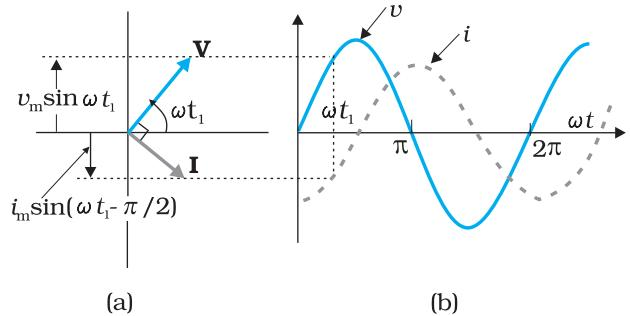
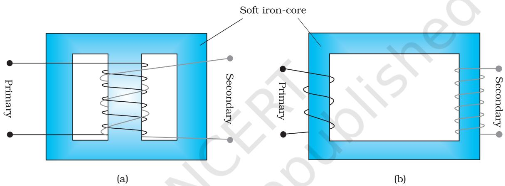

# Chapter Seven ALTERNATING CURRENT

## 7.1 INTRODUCTION

We have so far considered direct current (dc) sources and circuits with dc sources. These currents do not change direction with time. But voltages and currents that vary with time are very common. The electric mains supply in our homes and offices is a voltage that varies like a sine function with time. Such a voltage is called *alternating voltage* (ac voltage) and the current driven by it in a circuit is called the *alternating current* (ac current)*. Today, most of the electrical devices we use require ac voltage. This is mainly because most of the electrical energy sold by power companies is transmitted and distributed as alternating current. The main reason for preferring use of ac voltage over dc voltage is that ac voltages can be easily and efficiently converted from one voltage to the other by means of transformers. Further, electrical energy can also be transmitted economically over long distances. AC circuits exhibit characteristics which are exploited in many devices of daily use. For example, whenever we tune our radio to a favourite station, we are taking advantage of a special property of ac circuits – one of many that you will study in this chapter.

* The phrases *ac voltage* and *ac current* are contradictory and redundant, respectively, since they mean, literally, *alternating current voltage* and *alternating current current*. Still, the abbreviation *ac* to designate an electrical quantity displaying simple harmonic time dependance has become so universally accepted that we follow others in its use. Further, *voltage* – another phrase commonly used means potential difference between two points.

**Nicola Tesla (1856 – 1943)** Serbian-American scientist, inventor and genius. He conceived the idea of the rotating magnetic field, which is the basis of practically all alternating current machinery, and which helped usher in the age of electric power. He also invented among other things the induction motor, the polyphase system of ac power, and the high frequency induction coil (the Tesla coil) used in radio and television sets and other electronic equipment. The SI unit of magnetic field is named in his honour.

**FIGURE 7.2** In a pure resistor, the voltage and current are in phase. The minima, zero and maxima occur at the same respective times.

NICOLA TESLA (18

5

6 – 1943)

## **7.2 AC VOLTAGE APPLIED TO A RESISTOR**

Figure 7.1 shows a resistor connected to a source ε of ac voltage. The symbol for an ac source in a circuit diagram is . We consider a source which produces sinusoidally varying potential difference across its terminals. Let this potential difference, also called ac voltage, be given by

> *v v t* = *m* sinω(7.1)

where *vm* is the amplitude of the oscillating potential difference and ωis its angular frequency.

**FIGURE 7.1** AC voltage applied to a resistor.

To find the value of current through the resistor, we apply Kirchhoff's loop rule ∑*ε*( )*t* = 0 (refer to Section 3.12), to the circuit shown in Fig. 7.1 to get

> *v t i R m* sinω=

$${\mathrm{or}}\quad i={\frac{v_{m}}{R}}\sin\omega t$$

*m*

*i*

Since *R* is a constant, we can write this equation as

$$i=i_{m}\sin\omega t\tag{7.2}$$
  
  
where the current amplitude $i_{m}$ is given by 

$$=\frac{\upsilon_{m}}{R}\tag{7.3}$$

Equation (7.3) is Ohm's law, which for resistors, works equally well for both ac and dc voltages. The voltage across a pure resistor and the current through it, given by Eqs. (7.1) and (7.2) are plotted as a function of time in Fig. 7.2. Note, in particular that both *v* and *i* reach zero, minimum and maximum values at the same time. Clearly, *the voltage* and *current are in phase with each other*.

We see that, like the applied voltage, the current varies sinusoidally and has corresponding positive and negative values during each cycle. Thus, the sum of the instantaneous current values over one complete cycle is zero, and the average current is zero. The fact that the average current is zero, however, does not mean that the average power consumed is zero and that there is no dissipation of electrical energy. As you know, Joule heating is given by *i* 2*R* and depends on *i* 2 (which is always positive whether *i* is positive or negative) and not on *i*. Thus, there is Joule heating and dissipation of electrical energy when an ac current passes through a resistor.

The instantaneous power dissipated in the resistor is

$p=i^{2}R=i_{m}^{2}R\sin^{2}\omega t$ (7.4)

The average value of *p* over a cycle is*

$p=<i^{2}R>=<i^{2}_{m}R\sin^{2}\omega t>$ [7.5(a)]

where the bar over a letter (here, *p*) denotes its average value and <......> denotes taking average of the quantity inside the bracket. Since, *i* 2 *m* and *R* are constants,

$p=i_{m}^{2}R<\sin^{2}\omega t>$

Using the trigonometric identity, sin2 w*t* = 1/2 (1– cos 2w*t*), we have < sin2 w*t >* = (1/2) (1– < cos 2w*t >*) and since < cos2w*t >* = 0**, we have,

$$<\sin^{2}\omega t>={\frac{1}{2}}$$

Thus,

$p=\frac{1}{2}\,t_{m}^{2}R$

To express ac power in the same form as dc power (*P* = *I*2*R*), a special value of current is defined and used. It is called, *root mean square* (rms) or *effective current* (Fig. 7.3) and is denoted by *I rms or I*.

FIGURE 7.3 The rms current *I* is related to the peak current *im* by *I = im* / 2 = 0.707 *im* .

$$\Leftrightarrow<\cos2\omega t>=\frac{1}{T}\int\limits_{0}^{T}\cos2\omega t\,dt=\frac{1}{T}\left[\frac{\sin\,2\omega t}{2\omega}\right]_{0}^{T}=\frac{1}{2\omega T}\left[\sin\,2\omega\,T-0\right]=0.$$

## Alternating Current

George Westinghouse (1846 – 1914) A leading proponent of the use of alternating current over direct current. Thus, he came into conflict with Thomas Alva Edison, an advocate of direct current. Westinghouse was convinced that the technology of alternating current was the key to the electrical future. He founded the famous Company named after him and enlisted the services of Nicola Tesla and other inventors in the development of alternating current motors and apparatus for the transmission of high tension current, pioneering in large scale lighting.

179

GEORGE WESTINGHOUSE (1846 – 1914)

It is defined by

Physics

$$I=\sqrt{\dot{t}^{2}}=\sqrt{\frac{1}{2}\,i_{m}^{2}}\,=\,\frac{i_{m}}{\sqrt{2}}\tag{7.6}$$
 
$$=0.707\,\,\,i_{m}$$

In terms of *I*, the average power, denoted by *P* is

$$P=\frac{P}{P}=\frac{1}{2}\,i_{m}^{2}R=I^{2}\,R\tag{7.7}$$

Similarly, we define the *rms voltage* or *effective voltage* by

$$V=\frac{\upsilon_{m}}{\sqrt{2}}\ =0.707\ \upsilon_{m}\tag{7.8}$$
  
  
In Eq. (7.3), we have 

From Eq. (7.3), we have

$$\begin{array}{c}{{v_{m}=i_{m}R}}\\ {{\cdot}}\\ {{\mathrm{or,}}}\end{array}\frac{v_{m}}{\sqrt{2}}=\frac{i_{m}}{\sqrt{2}}R$$

or, *V = IR* (7.9)

Equation (7.9) gives the relation between ac current and ac voltage and is similar to that in the dc case. This shows the advantage of introducing the concept of rms values. In terms of rms values, the equation for power [Eq. (7.7)] and relation between current and voltage in ac circuits are essentially the same as those for the dc case.

It is customary to measure and specify rms values for ac quantities. For example, the household line voltage of 220 V is an rms value with a peak voltage of

*vm* = 2 *V* = (1.414)(220 V) = 311 V

In fact, the *I* or rms current is the equivalent dc current that would produce the same average power loss as the alternating current. Equation (7.7) can also be written as

> *P* = *V* 2 / *R* = *I V* (since *V* = *I R*)

Example 7.1 A light bulb is rated at 100W for a 220 V supply. Find (a) the resistance of the bulb; (b) the peak voltage of the source; and (c) the rms current through the bulb.

#### Solution

*I V*

EXAMPLE 7.1

- (a) We are given *P* = 100 W and *V* = 220 V. The resistance of the bulb is

$$R={\frac{V^{2}}{P}}={\frac{\left(220\,\mathrm{V}\right)^{2}}{100\,\mathrm{W}}}=484\,\Omega$$

- (b) The peak voltage of the source is
*v V m* = = 2 311V

220 V 

- (c) Since, *P* = *I V* 100 W 0.454A *P*
180

## 7.3 REPRESENTATION OF AC CURRENT AND VOLTAGE BY ROTATING VECTORS — PHASORS

In the previous section, we learnt that the current through a resistor is in phase with the ac voltage. But this is not so in the case of an inductor, a capacitor or a combination of these circuit elements. In order to show

phase relationship between voltage and current in an ac circuit, we use the notion of *phasors*. The analysis of an ac circuit is facilitated by the use of a phasor diagram. A phasor* is a vector which rotates about the origin with angular speed w, as shown in Fig. 7.4. The vertical components of phasors V and I represent the sinusoidally varying quantities *v* and *i*. The magnitudes of phasors V and I represent the amplitudes or the peak values *vm* and *im* of these oscillating quantities. Figure 7.4(a) shows the voltage and current phasors and their relationship at time *t* 1 for the case of an ac source connected to a resistor i.e., corresponding to the circuit shown in Fig. 7.1. The projection of

circuit in Fig 7.1. (b) Graph of *v* and *i* versus w*t*.

voltage and current phasors on vertical axis, i.e., *vm* sinw *t* and *im* sinw *t*, respectively represent the value of voltage and current at that instant. As they rotate with frequency w, curves in Fig. 7.4(b) are generated.

From Fig. 7.4(a) we see that phasors V and I for the case of a resistor are in the same direction. This is so for all times. This means that the phase angle between the voltage and the current is zero.

## 7.4 AC VOLTAGE APPLIED TO AN INDUCTOR

Figure 7.5 shows an ac source connected to an inductor. Usually, inductors have appreciable resistance in their windings, but we shall

assume that this inductor has negligible resistance. Thus, the circuit is a purely inductive ac circuit. Let the voltage across the source be *v* = *vm* sinw *t*. Using

the Kirchhoff's loop rule, ∑*ε* ( ) *t* = 0 , and since there is no resistor in the circuit,

$\upsilon-L\frac{\mathrm{d}i}{\mathrm{d}t}=0$ (7.10)

where the second term is the self-induced Faraday emf in the inductor; and *L* is the self-inductance of

FIGURE 7.5 An ac source connected to an inductor.

* Though voltage and current in ac circuit are represented by phasors – rotating vectors, they are not vectors themselves. They are scalar quantities. It so happens that the amplitudes and phases of harmonically varying scalars combine mathematically in the same way as do the projections of rotating vectors of corresponding magnitudes and directions. The *rotating vectors* that *represent* harmonically varying scalar quantities are introduced only to provide us with a simple way of adding these quantities using a rule that we already know.

the inductor. The negative sign follows from Lenz's law (Chapter 6). Combining Eqs. (7.1) and (7.10), we have

$$\frac{\mathrm{d}i}{\mathrm{d}t}=\frac{v}{L}=\frac{v_{m}}{L}\sin\omega t\tag{7.11}$$

Equation (7.11) implies that the equation for *i*(*t*), the current as a function of time, must be such that its slope d*i*/d*t* is a sinusoidally varying quantity, with the same phase as the source voltage and an amplitude given by *vm /L*. To obtain the current, we integrate d*i*/d*t* with respect to time:

$$\int{\frac{\mathrm{d}i}{\mathrm{d}t}}\,\mathrm{d}t={\frac{v_{m}}{L}}\int\sin(\omega t)\mathrm{d}t$$
  
and get,

cos( ) constant *vm i t L* = − ω + ω

The integration constant has the dimension of current and is timeindependent. Since the source has an emf which oscillates symmetrically about zero, the current it sustains also oscillates symmetrically about zero, so that no constant or time-independent component of the current exists. Therefore, the integration constant is zero.

Using

$$-\cos(\omega t)=\sin\left(\omega t-\frac{\pi}{2}\right),$$
  
  
we have  
  

$$i=i_{m}\,\sin\left(\omega t-\frac{\pi}{2}\right)\tag{7.12}$$

where *m m v i L* = ω is the amplitude of the current. The quantity w *L* is analogous to the resistance and is called *inductive reactance*, denoted by *XL* :

$$X_{i_{L}}=\omega\,L\tag{7.13}$$

The amplitude of the current is, then

$$\dot{l}_{m}=\frac{\upsilon_{m}}{X_{L}}\tag{7.14}$$

The dimension of inductive reactance is the same as that of resistance and its SI unit is ohm (W). The inductive reactance limits the current in a purely inductive circuit in the same way as the resistance limits the current in a purely resistive circuit. The inductive reactance is directly proportional to the inductance and to the frequency of the current.

A comparison of Eqs. (7.1) and (7.12) for the source voltage and the current in an inductor shows that the current lags the voltage by p/2 or one-quarter (1/4) cycle. Figure 7.6 (a) shows the voltage and the current phasors in the present case at instant *t* 1 . The current phasor I is p/2 behind the voltage phasor V. When rotated with frequency w counterclockwise, they generate the voltage and current given by Eqs. (7.1) and (7.12), respectively and as shown in Fig. 7.6(b).

Interactive animation on Phasor diagrams of ac circuits containing, R, L, C and RLC series circuits:http://www.animations.physics.unsw.edu.au//jw/AC.html

FIGURE 7.6 (a) A Phasor diagram for the circuit in Fig. 7.5. (b) Graph of *v* and *i* versus w*t*.

We see that the current reaches its maximum value later than the

voltage by one-fourth of a period *T* 4 2 = π/ *ω* . You have seen that an inductor has reactance that limits current similar to resistance in a dc circuit. Does it also consume power like a resistance? Let us try to find out.

The instantaneous power supplied to the inductor is

$P_{L}=\dot{u}=\dot{u}_{m}\sin\left(\omega t-\frac{\pi}{2}\right)\times\omega_{m}\sin\left(\omega t\right)$  
  
$\dot{\cdot}=-\dot{u}_{m}\omega_{m}\cos\left(\omega t\right)\sin\left(\omega t\right)$  
  
$\dot{\cdot}=-\frac{\dot{u}_{m}\omega_{m}}{2}\sin\left(2\omega t\right)$

So, the average power over a complete cycle is

$$P_{\mathrm{L}}=\left\langle-\frac{i_{m}v_{m}}{2}\sin\left(2\omega t\right)\right\rangle$$
  
  

$$=-\frac{i_{m}v_{m}}{2}\left\langle\sin\left(2\omega t\right)\right\rangle=0,$$

since the average of sin (2w*t*) over a complete cycle is zero.

Thus, the *average power supplied to an inductor over one complete cycle is zero*.

> Example 7.2 A pure inductor of 25.0 mH is connected to a source of 220 V. Find the inductive reactance and rms current in the circuit if the frequency of the source is 50 Hz.

Solution The inductive reactance,

$X_{L}=2\,\pi\,\nu L=2\times3.14\times50\times25\times10^{-3}\,\Omega$  
  
$=7.85\Omega$  
  
The rms current in the circuit is 

$$I={\frac{V}{X_{L}}}={\frac{220\,\mathrm{V}}{7.85\,\Omega}}=28\mathrm{A}$$

EXAMPLE 7.2

## 7.5 AC VOLTAGE APPLIED TO A CAPACITOR

Figure 7.7 shows an ac source e generating ac voltage *v* = *vm* sin wt connected to a capacitor only, a purely capacitive ac circuit.

When a capacitor is connected to a voltage source in a dc circuit, current will flow for the short time required to charge the capacitor. As charge accumulates on the capacitor plates, the voltage across them increases, opposing the current. That is, a capacitor in a dc circuit will limit or oppose the current as it charges. When the capacitor is fully charged, the current in the circuit falls to zero.

When the capacitor is connected to an ac source, as in Fig. 7.7, it limits or regulates the current, but does not completely prevent the flow of charge. The capacitor is alternately charged and discharged as the current reverses each half cycle. Let *q* be the

charge on the capacitor at any time *t*. The instantaneous voltage *v* across the capacitor is

$$\upsilon=\frac{q}{C}\tag{7.15}$$

From the Kirchhoff's loop rule, the voltage across the source and the capacitor are equal,

$$v_{m}\sin\omega t={\frac{q}{C}}$$

To find the current, we use the relation d d *q i t* =

$\frac{d}{dt}(\omega_{m}\sin\omega)=\omega\omega_{m}\cos(\omega t)$

Using the relation, cos( ) sin *ω ω t t* = + π 2 , we have

$$\hat{t}=\hat{t}_{m}\,\sin\!\left(\omega\,t+\frac{\pi}{2}\right)\tag{7.16}$$

where the amplitude of the oscillating current is *im* = w*Cvm* . We can rewrite it as

$$i_{m}={\frac{v_{m}}{(1/\,\omega C)}}$$

*i*

Comparing it to *im* = *vm* /*R* for a purely resistive circuit, we find that (1/w*C)* plays the role of resistance. It is called *capacitive reactance* and is denoted by *Xc* ,

$X_{c}=1/oC$ (7.17)

so that the amplitude of the current is

$$i_{m}=\frac{\upsilon_{m}}{X_{C}}\tag{7.18}$$

The dimension of capacitive reactance is the same as that of resistance and its SI unit is ohm (Ω). The capacitive reactance limits the amplitude of the current in a purely capacitive circuit in the same way as the resistance limits the current in a purely resistive circuit. But it is inversely proportional to the frequency and the capacitance.

A comparison of Eq. (7.16) with the equation of source voltage, Eq. (7.1) shows that the current is π/2 ahead of voltage.

Figure 7.8(a) shows the phasor diagram at an instant *t* 1 . Here the current phasor **I** is π/2 ahead of the voltage phasor **V** as they rotate counterclockwise. Figure 7.8(b) shows the variation of voltage and current with time. We see that the current reaches its maximum value earlier than the voltage by one-fourth of a period.

The instantaneous power supplied to the capacitor is

$$p_{c}=i\,\upsilon=i_{m}\cos(\omega\!\!\!/)\upsilon_{m}\sin(\omega\!\!\!/)\tag{7.19}$$
 
$$=i_{m}\upsilon_{m}\cos(\omega\!\!\!/)\sin(\omega\!\!\!/)$$
 
$$=\frac{i_{m}\upsilon_{m}}{2}\sin(2\omega\!\!\!/)$$

So, as in the case of an inductor, the average power

$$P_{C}=\left\langle{\frac{i_{m}v_{m}}{2}}\sin(2\omega t)\right\rangle={\frac{i_{m}v_{m}}{2}}\left\langle\sin(2\omega t)\right\rangle=0$$

since <sin (2ω*t*)> = 0 over a complete cycle.

Thus, we see that in the case of an inductor, the current lags the voltage by π/2 and in the case of a capacitor, the current leads the voltage by π/2.

**Example 7.3** A lamp is connected in series with a capacitor. Predict your observations for dc and ac connections. What happens in each case if the capacitance of the capacitor is reduced?

**Solution** When a dc source is connected to a capacitor, the capacitor gets charged and after charging no current flows in the circuit and the lamp will not glow. There will be no change even if *C* is reduced. With ac source, the capacitor offers capacitative reactance (1/ω*C*) and the current flows in the circuit. Consequently, the lamp will shine. Reducing *C* will increase reactance and the lamp will shine less brightly than before.

**Example 7.4** A 15.0 µF capacitor is connected to a 220 V, 50 Hz source. Find the capacitive reactance and the current (rms and peak) in the circuit. If the frequency is doubled, what happens to the capacitive reactance and the current?

**Solution** The capacitive reactance is

$X_{c}=\frac{1}{2\pi\nu C}=\frac{1}{2\pi(50Hz)(15.0\times10^{-6}F)}=212\,\Omega$

The rms current is

 **EXAMPLE 7.3 EXAMPLE**

 **7.4**

185

$$I={\frac{V}{X_{c}}}={\frac{220\,\mathrm{V}}{212\,\,\Omega}}=1.04$$

The peak current is

*i I m* = = 2 (1.41)(1.04 ) 1.47 *A A* =

A

This current oscillates between +1.47A and –1.47 A, and is ahead of the voltage by p/2.

If the frequency is doubled, the capacitive reactance is halved and consequently, the current is doubled.

Example 7.5 A light bulb and an open coil inductor are connected to an ac source through a key as shown in Fig. 7.9.

The switch is closed and after sometime, an iron rod is inserted into the interior of the inductor. The glow of the light bulb (a) increases; (b) decreases; (c) is unchanged, as the iron rod is inserted. Give your answer with reasons.

EXAMPLE 7.5 EXAMPLE 7.4

Solution As the iron rod is inserted, the magnetic field inside the coil magnetizes the iron increasing the magnetic field inside it. Hence, the inductance of the coil increases. Consequently, the inductive reactance of the coil increases. As a result, a larger fraction of the applied ac voltage appears across the inductor, leaving less voltage across the bulb. Therefore, the glow of the light bulb decreases.

## 7.6 AC VOLTAGE APPLIED TO A SERIES LCR CIRCUIT

Figure 7.10 shows a series LCR circuit connected to an ac source e. As usual, we take the voltage of the source to be *v = vm* sin w*t*.

186 FIGURE 7.10 A series *LCR* circuit connected to an ac source.

If *q* is the charge on the capacitor and *i* the current, at time *t*, we have, from Kirchhoff's loop rule:

$L\frac{\mathrm{d}i}{\mathrm{d}t}+i\,R+\frac{q}{C}=\upsilon$ (7.20)

We want to determine the instantaneous current *i* and its phase relationship to the applied alternating voltage *v*. We shall solve this problem by two methods. First, we use the technique of phasors and in the second method, we solve Eq. (7.20) analytically to obtain the time– dependence of *i*.

#### 7.6.1 Phasor-diagram solution

From the circuit shown in Fig. 7.10, we see that the resistor, inductor and capacitor are in series. Therefore, the ac current in each element is the same at any time, having the same amplitude and phase. Let it be

*i = im* sin(w*t*+f) (7.21)

where f is the phase difference between the voltage across the source and the current in the circuit. On the basis of what we have learnt in the previous sections, we shall construct a phasor diagram for the present case.

Let I be the phasor representing the current in the circuit as given by Eq. (7.21). Further, let VL , VR , VC , and V represent the voltage across the inductor, resistor, capacitor and the source, respectively. From previous section, we know that VR is parallel to I, VC is p/2

behind I and VL is p/2 ahead of I. VL , VR , VC and I are shown in Fig. 7.11(a) with apppropriate phaserelations.

The length of these phasors or the amplitude of VR , VC and VL are:

$v_{km}=i_{m}\,R$, $v_{cm}=i_{m}\,X_{C}$, $v_{km}=i_{m}\,X_{L}$ (7.22)  
  
The voltage Equation (7.20) for the circuit can be 

be written as

$\upsilon_{\rm L}+\upsilon_{\rm R}+\upsilon_{\rm C}=\upsilon$

The phasor relation whose vertical component gives the above equation is

$\bf V_{L}+V_{R}+V_{C}=V$

This relation is represented in Fig. 7.11(b). Since VC and VL are always along the same line and in

opposite directions, they can be combined into a single phasor (VC + VL ) which has a magnitude ½*vCm* – *vLm*½. Since V is represented as the hypotenuse of a right-triangle whose sides are VR and (VC + VL ), the pythagorean theorem gives:

$$v_{m}^{2}=v_{R m}^{2}+\left(v_{C m}-v_{L m}\right)^{2}$$

Substituting the values of *vRm*, *vCm*, and *vLm* from Eq. (7.22) into the above equation, we have

$$v_{m}^{2}=\left(i_{m}R\right)^{2}+\left(i_{m}X_{C}-i_{m}X_{L}\right)^{2}$$
 
$$=i_{m}^{2}\left[R^{2}+\left(X_{C}-X_{L}\right)^{2}\right]$$
  
  
or, $i_{m}=\dfrac{\bar{\upsilon}_{m}}{\sqrt{R^{2}+\left(X_{C}-X_{L}\right)^{2}}}$ [7.25(a)]

By analogy to the resistance in a circuit, we introduce the *impedance Z* in an ac circuit:

$i_{m}=\frac{\upsilon_{m}}{Z}$  
  
[7.25(b)]

where $Z=\sqrt{R^{2}+\left(X_{{}_{C}}-X_{{}_{L}}\right)^{2}}$ (7.26)

FIGURE 7.11 (a) Relation between the phasors VL , VR , VC , and *I*, (b) Relation between the phasors VL , VR , and (VL + VC ) for the circuit in Fig. 7.10.

FIGURE 7.12 Impedance diagram.

Since phasor I is always parallel to phasor VR , the phase angle f is the angle between VR and V and can be determined from Fig. 7.12:

$$\tan\phi=\frac{\upsilon_{Cm}-\upsilon_{Lm}}{\upsilon_{Rm}}$$
  
  
Using Eq. (7.22), we have  
  

$$\tan\phi=\frac{X_{C}-X_{L}}{R}\tag{7.27}$$

Equations (7.26) and (7.27) are graphically shown in Fig. (7.12). This is called *Impedance diagram* which is a right-triangle with *Z* as its hypotenuse.

Equation 7.25(a) gives the amplitude of the current and Eq. (7.27) gives the phase angle. With these, Eq. (7.21) is completely specified.

If *XC* > *XL* , f is positive and the circuit is predominantly capacitive. Consequently, the current in the circuit leads the source voltage. If *XC* < *XL* , f is negative and the circuit is predominantly inductive. Consequently, the current in the circuit lags the source voltage.

Figure 7.13 shows the phasor diagram and variation of *v* and *i* with w *t* for the case *XC* > *XL* .

Thus, we have obtained the amplitude and phase of current for an *LCR* series circuit using the technique of phasors. But this method of analysing ac circuits suffers from certain disadvantages. First, the phasor diagram say nothing about the initial condition. One can take any arbitrary value of *t* (say, *t* 1 , as done throughout this chapter) and draw different phasors which show the relative angle between different phasors. The solution so obtained is called the *steady-state solution*. This is not a general solution. Additionally, we do have a *transient solution* which exists even for *v* = 0. The general solution is the sum of the transient solution and the steady-state

solution. After a sufficiently long time, the effects of the transient solution die out and the behaviour of the circuit is described by the steady-state solution.

### 7.6.2 Resonance

An interesting characteristic of the series *RLC* circuit is the phenomenon of resonance. The phenomenon of resonance is common among systems that have a tendency to oscillate at a particular frequency. This frequency is called the system's *natural frequency*. If such a system is driven by an energy source at a frequency that is near the natural frequency, the amplitude of oscillation is found to be large. A familiar example of this phenomenon is a child on a swing. The swing has a natural frequency for swinging back and forth like a pendulum. If the child pulls on the

rope at regular intervals and the frequency of the pulls is almost the same as the frequency of swinging, the amplitude of the swinging will be large (Chapter 13, Class XI).

For an *RLC* circuit driven with voltage of amplitude *vm* and frequency w, we found that the current amplitude is given by

$$i_{m}={\frac{v_{m}}{Z}}={\frac{v_{m}}{\sqrt{R^{2}+\left(X_{C}-X_{L}\right)^{2}}}}$$

with *Xc* = 1/w*C* and *XL* = w *L*. So if wis varied, then at a particular frequency

w0 , *Xc* = *XL* , and the impedance is minimum ( ) 2 2 *Z R R* = + = 0 . This frequency is called the *resonant frequency*:

$X_{c}=X_{L}$ or $\frac{1}{\omega_{0}\,C}=\omega_{0}\,L$  
  
$\cdot$  
  
or $\omega_{0}=\frac{1}{\sqrt{LC}}$ (7.28)

At resonant frequency, the current amplitude is maximum; *im = vm /R*.

Figure 7.16 shows the variation of *im* with w in a *RLC* series circuit with *L* = 1.00 mH, *C* = 1.00 nF for two values of *R*: (i) *R* = 100 W and (ii) *R* = 200 W. For the source applied *vm* =

100 V. w0 for this case is 1 *LC* = 1.00×106

rad/s.

We see that the current amplitude is maximum at the resonant frequency. Since *im*  = *vm*  / *R* at resonance, the current amplitude for case (i) is twice to that for case (ii).

Resonant circuits have a variety of applications, for example, in the tuning mechanism of a radio or a TV set. The antenna of a radio accepts signals from many broadcasting stations. The signals picked up in the antenna acts as a source in the tuning circuit of the radio, so the circuit can be driven at many frequencies. But to hear one particular radio station, we tune the radio. In tuning, we vary the capacitance of a capacitor in the tuning circuit such that the resonant frequency of the circuit becomes nearly equal to the frequency of the radio signal received. When this happens, the amplitude of the current with the frequency of the signal of the particular radio station in the circuit is maximum.

*It is important to note that resonance phenomenon is exhibited by a circuit only if both L and C are present in the circuit. Only then do the voltages across L and C cancel each other (both being out of phase) and the current amplitude is vm /R, the total source voltage appearing across R. This means that we cannot have resonance in a RL or RC circuit.*

Example 7.6 A resistor of 200 W and a capacitor of 15.0 mF are connected in series to a 220 V, 50 Hz ac source. (a) Calculate the current in the circuit; (b) Calculate the voltage (rms) across the resistor and the capacitor. Is the algebraic sum of these voltages more than the source voltage? If yes, resolve the paradox.

#### Solution

Given

F 6 *R C* 200 , 15.0 15.0 10 F − = Ω = µ = ×

*V* = = 220 V, 50Hz ν

- (a) In order to calculate the current, we need the impedance of the circuit. It is
$Z=\sqrt{R^{2}+X_{C}^{2}}=\sqrt{R^{2}+(2\pi\,\nu C)^{-2}}$  
  
$=\sqrt{(200\,\Omega)^{2}+(2\times3.14\times50\times15.0\times10^{-6}\,\mathrm{F})^{2}}$  
  
$=\sqrt{(200\,\Omega)^{2}+(212.3\,\Omega)^{2}}$

= Ω 291.67

Therefore, the current in the circuit is

  
  
## 1 Introduction  
  
The _Fractional State_ of the Universe is a fundamental problem in cosmology. The _Fractional State_ of the Universe is a fundamental problem in cosmology.  
  

- (b) Since the current is the same throughout the circuit, we have
*V I R R* = = (0.755 A)(200 ) 151V Ω =

*V I X C C* = = (0.755 A)(212.3 ) 160.3 V Ω =

The algebraic sum of the two voltages, *VR* and *VC* is 311.3 V which is more than the source voltage of 220 V. How to resolve this paradox? As you have learnt in the text, the two voltages are not in the same phase. Therefore, *they cannot be added like ordinary numbers*. The two voltages are out of phase by ninety degrees. Therefore, the total of these voltages must be obtained using the Pythagorean theorem:

$$\begin{array}{r l}{V_{R+C}={\sqrt{V_{R}^{2}+V_{C}^{2}}}}\\ {=220\ \mathrm{V}}\end{array}$$

Thus, if the phase difference between two voltages is properly taken into account, the total voltage across the resistor and the capacitor is equal to the voltage of the source.

## 7.7 POWER IN AC CIRCUIT: THE POWER FACTOR

We have seen that a voltage *v = vm* sinw*t* applied to a series *RLC* circuit drives a current in the circuit given by *i* = *im* sin(w*t* + f) where

$$i_{m}={\frac{v_{m}}{Z}}\;\;\;\mathrm{and}\;\;\phi=\tan^{-1}\!\left({\frac{X_{C}-X_{L}}{R}}\right)$$

Therefore, the instantaneous power *p* supplied by the source is

 EXAMPLE 7.6

190

$$p=v\,i=\big{(}v_{m}\,\sin\omega t\big{)}\times\big{[}i_{m}\,\sin(\omega t+\phi)\big{]}$$
 
$$=\frac{v_{m}i_{m}}{2}\big{[}\cos\phi-\cos(2\omega t+\phi)\big{]}\tag{7.29}$$

The average power over a cycle is given by the average of the two terms in R.H.S. of Eq. (7.29). It is only the second term which is time-dependent. Its average is zero (the positive half of the cosine cancels the negative half). Therefore,

$P=\frac{\upsilon_{m}l_{m}}{2}\cos\phi=\frac{\upsilon_{m}}{\sqrt{2}}\frac{l_{m}}{\sqrt{2}}\cos\phi$  
  
$=V\,I\cos\phi$

This can also be written as,

2 *P I Z* = cosφ[7.30(b)]

So, the average power dissipated depends not only on the voltage and current but also on the cosine of the phase angle φ between them. The quantity cosφ is called the power factor. Let us discuss the following cases:

Case (i) Case (i) Case (i) Resistive circuit: If the circuit contains only pure R, it is called resistive. In that case φ = 0, cos φ =1.Thereis maximum power dissipation.

Case (ii) Case (ii) Case (ii) Purely inductive or capacitive circuit: If the circuit contains only an inductor or capacitor, we know that the phase difference between voltage and current is π/2. Therefore, cos φ = 0, and no power is dissipated even though a current is flowing in the circuit. This current is sometimes referred to as wattless current.

Case (iii) Case (iii) Case (iii) LCR series circuit: In an LCR series circuit, power dissipated is given by Eq. (7.30) where φ = tan–1 (Xc – XL )/ R. So, φ may be non-zero in a RL or RC or RCL circuit. Even in such cases, power is dissipated only in the resistor.

Case (iv) Case (iv)Case (iv) Power dissipated at resonance in LCR circuit: At resonance Xc – XL = 0, and φ = 0. Therefore, cosφ = 1 and P = I 2Z = I 2 R. That is, maximum power is dissipated in a circuit (through R) at resonance.

Example 7.7 (a) For circuits used for transporting electric power, a low power factor implies large power loss in transmission. Explain. (b) Power factor can often be improved by the use of a capacitor of appropriate capacitance in the circuit. Explain.

Solution SolutionSolution (a) We know that P = I V cosφ where cosφ is the power factor. To supply a given power at a given voltage, if cosφ is small, we have to increase current accordingly. But this will lead to large power loss (I 2R) in transmission.

(b)Suppose in a circuit, current I lags the voltage by an angle φ. Then power factor cosφ =R/Z.

We can improve the power factor (tending to 1) by making Z tend to R. Let us understand, with the help of a phasor diagram (Fig. 7.15)

 EXAMPLE7.7

how this can be achieved. Let us resolve I into two components. I *p* along the applied voltage V and I *q* perpendicular to the applied voltage. I *q* as you have learnt in Section 7.7, is called the wattless component since corresponding to this component of current, there is no power loss. IP is known as the power component because it is in phase with the voltage and corresponds to power loss in the circuit.

It's clear from this analysis that if we want to improve power factor, we must completely neutralize the lagging wattless current I q by an equal leading wattless current I¢ q . This can be done by connecting a capacitor of appropriate value in parallel so that I q and I¢ q cancel each other and *P* is effectively *I* p *V*.

Example 7.8 A sinusoidal voltage of peak value 283 V and frequency 50 Hz is applied to a series *LCR* circuit in which R = 3 W, *L* = 25.48 mH, and C = 796 mF. Find (a) the impedance of the circuit; (b) the phase difference between the voltage across the source and the current; (c) the power dissipated in the circuit; and (d) the power factor.

#### Solution

(a) To find the impedance of the circuit, we first calculate *X*L and *X*C .

$X_{L}=2\ \pi\nu L$  
  
$=2\times3.14\times50\times25.48\times10^{-3}\ \Omega=8\ \Omega$  
  
$X_{C}=\frac{1}{2\ \pi\nu C}$  
  
$=\frac{1}{2\times3.14\times50\times796\times10^{-6}}=4\Omega$

Therefore,

$Z=\sqrt{R^{2}+(X_{L}-X_{C})^{2}}=\sqrt{3^{2}+(8-4)^{2}}$  
  
$=5\ \Omega$

(b) Phase difference, f = tan–1 *X X C L R* −

$$=\tan^{-1}\left({\frac{4-8}{3}}\right)=-53.1^{\circ}$$

192

 EXAMPLE 7.7

EXAMPLE 7.8

Since f is negative, the current in the circuit lags the voltage across the source.

- (c) The power dissipated in the circuit is
2 *P I R* =

Now, $I=\frac{\dot{\rm I}_{m}}{\sqrt{2}}=\frac{1}{\sqrt{2}}\left(\frac{283}{5}\right)=40$A  
  
Therefore, $P=(40$A$)^{2}\times3\,\Omega=4800$ W 

(d) Power factor = cos cos –53.1 0.6 -

Example 7.9 Suppose the frequency of the source in the previous example can be varied. (a) What is the frequency of the source at which resonance occurs? (b) Calculate the impedance, the current, and the power dissipated at the resonant condition.

#### Solution

(a) The frequency at which the resonance occurs is

$$\omega_{0}=\frac{1}{\sqrt{LC}}=\frac{1}{\sqrt{25.48\times10^{-3}\times796\times10^{-6}}}$$
  
  

$$=222.1\,\text{rad/s}$$
  
  

$$\nu_{r}=\frac{\omega_{0}}{2\pi}=\frac{221.1}{2\times3.14}\,\text{Hz}=35.4\text{Hz}$$

(b) The impedance *Z* at resonant condition is equal to the resistance:

$$\dot{Z}=R=3\,\Omega$$

The rms current at resonance is

$$={\frac{V}{Z}}={\frac{V}{R}}=\left({\frac{283}{\sqrt{2}}}\right){\frac{1}{3}}=66.7\,\mathrm{A}$$

The power dissipated at resonance is

$P=1^{2}\times R=(66.7)^{2}\times3=13.35$ kW

You can see that in the present case, power dissipated at resonance is more than the power dissipated in Example 7.8.

Example 7.10 At an airport, a person is made to walk through the doorway of a metal detector, for security reasons. If she/he is carrying anything made of metal, the metal detector emits a sound. On what principle does this detector work?

Solution The metal detector works on the principle of resonance in ac circuits. When you walk through a metal detector, you are, in fact, walking through a coil of many turns. The coil is connected to a capacitor tuned so that the circuit is in resonance. When you walk through with metal in your pocket, the impedance of the circuit changes – resulting in significant change in current in the circuit. This change in current is detected and the electronic circuitry causes a sound to be emitted as an alarm.

 EXAMPLE 7.9EXAMPLE 7.8 E

XAMPLE 7.10

193

## 7.8 TRANSFORMERS

For many purposes, it is necessary to change (or transform) an alternating voltage from one to another of greater or smaller value. This is done with a device called *transformer* using the principle of mutual induction.

A transformer consists of two sets of coils, insulated from each other. They are wound on a soft-iron core, either one on top of the other as in Fig. 7.16(a) or on separate limbs of the core as in Fig. 7.16(b). One of the coils called the *primary coil* has *N p* turns. The other coil is called the *secondary coil*; it has *Ns* turns. Often the primary coil is the input coil and the secondary coil is the output coil of the transformer.

When an alternating voltage is applied to the primary, the resulting current produces an alternating magnetic flux which links the secondary and induces an emf in it. The value of this emf depends on the number of turns in the secondary. We consider an ideal transformer in which the primary has negligible resistance and all the flux in the core links both primary and secondary windings. Let f be the flux in each turn in the core at time *t* due to current in the primary when a voltage *vp* is applied to it.

Then the induced emf or voltage e *s* , in the secondary with *Ns* turns is

$$\varepsilon_{s}=-N_{s}\,\frac{\mathrm{d}\phi}{\mathrm{d}t}\tag{7.31}$$

The alternating flux f also induces an emf, called back emf in the primary. This is

$$\varepsilon_{p}=-N_{p}\,\frac{{\rm d}\phi}{{\rm d}t}\tag{7.32}$$

But e*p = vp .* If this were not so, the primary current would be infinite since the primary has zero resistance (as assumed). If the secondary is an open circuit or the current taken from it is small, then to a good approximation

$$\varepsilon_{\mathrm{s}}=v_{\mathrm{s}}$$

where *vs* is the voltage across the secondary. Therefore, Eqs. (7.31) and (7.32) can be written as

$v_{s}=-N_{s}\,\frac{d\phi}{d\,t}$

$v_{p}=-N_{p}\,\frac{d\phi}{d\,t}$

From Eqs. [7.31 (a)] and [7.32 (a)], we have

$$\frac{\upsilon_{\rm s}}{\upsilon_{p}}=\frac{N_{\rm s}}{N_{p}}\tag{7.33}$$

Note that the above relation has been obtained using three assumptions: (i) the primary resistance and current are small; (ii) the same flux links both the primary and the secondary as very little flux escapes from the core, and (iii) the secondary current is small.

If the transformer is assumed to be 100% efficient (no energy losses), the power input is equal to the power output, and since *p* = *i v*,

$$\hat{l}_{p}\upsilon_{p}=\hat{l}_{s}\upsilon_{s}\tag{7.34}$$

Although some energy is always lost, this is a good approximation, since a well designed transformer may have an efficiency of more than 95%. Combining Eqs. (7.33) and (7.34), we have

$$\frac{i_{p}}{i_{s}}=\frac{\upsilon_{s}}{\upsilon_{p}}=\frac{N_{s}}{N_{p}}\tag{7.35}$$

Since *i* and *v* both oscillate with the same frequency as the ac source, Eq. (7.35) also gives the ratio of the amplitudes or rms values of corresponding quantities.

Now, we can see how a transformer affects the voltage and current. We have:

$$V_{\rm s}=\left(\frac{N_{s}}{N_{p}}\right)V_{p}\quad\mbox{and}\quad I_{\rm s}=\left(\frac{N_{p}}{N_{s}}\right)I_{p}\tag{7.36}$$

That is, if the secondary coil has a greater number of turns than the primary (*Ns* > *N p* ), the voltage is stepped up (*Vs* > *V p* ). This type of arrangement is called a *step-up transformer*. However, in this arrangement, there is less current in the secondary than in the primary (*Np* /*Ns* < 1 and *I s* < *I p* ). For example, if the primary coil of a transformer has 100 turns and the secondary has 200 turns, *Ns* /*N p* = 2 and *N p* /*Ns* =1/2. Thus, a 220V input at 10A will step-up to 440 V output at 5.0 A.

If the secondary coil has less turns than the primary (*Ns* < *N p* ), we have a *step-down transformer*. In this case, *Vs* < *V p* and *I s* > *I p* . That is, the voltage is stepped down, or reduced, and the current is increased.

The equations obtained above apply to ideal transformers (without any energy losses). But in actual transformers, small energy losses do occur due to the following reasons:

- (i) *Flux Leakage*: There is always some flux leakage; that is, not all of the flux due to primary passes through the secondary due to poor

design of the core or the air gaps in the core. It can be reduced by winding the primary and secondary coils one over the other.

- (ii) *Resistance of the windings*: The wire used for the windings has some resistance and so, energy is lost due to heat produced in the wire (*I* 2*R*). In high current, low voltage windings, these are minimised by using thick wire.
- (iii) *Eddy currents*: The alternating magnetic flux induces eddy currents in the iron core and causes heating. The effect is reduced by using a laminated core.
- (iv) *Hysteresis*: The magnetisation of the core is repeatedly reversed by the alternating magnetic field. The resulting expenditure of energy in the core appears as heat and is kept to a minimum by using a magnetic material which has a low hysteresis loss.

The large scale transmission and distribution of electrical energy over long distances is done with the use of transformers. The voltage output of the generator is stepped-up (so that current is reduced and consequently, the *I* 2*R* loss is cut down). It is then transmitted over long distances to an area sub-station near the consumers. There the voltage is stepped down. It is further stepped down at distributing sub-stations and utility poles before a power supply of 240 V reaches our homes.

#### SUMMARY

- 1. An alternating voltage *v v t* = ω *m* sin applied to a resistor *R* drives a
current *i* = *im* sinw*t* in the resistor, *m m v i R* = . The current is in phase with

the applied voltage.

- 2. For an alternating current *i* = *im* sin w*t* passing through a resistor *R*, the average power loss *P* (averaged over a cycle) due to joule heating is ( 1/2 )*i* 2 *mR*. To express it in the same form as the dc power (*P* = *I* 2*R*), a special value of current is used. It is called *root mean square* (rms) *current* and is donoted by *I*:

$$I={\frac{\dot{\mathrm{I}}_{\mathrm{m}}}{\sqrt{2}}}=0.707\,i_{\mathrm{m}}$$

Similarly, the *rms voltage* is defined by

$$V={\frac{v_{m}}{\sqrt{2}}}=0.707\,v_{m}$$

We have *P = IV = I* 2*R*

- 3. An ac voltage *v* = *vm* sin w*t* applied to a pure inductor *L*, drives a current in the inductor *i = im* sin (w*t* – p/2), where *im* = *vm* /*XL* . *XL* = w*L* is called *inductive reactance*. The current in the inductor lags the voltage by p/2. The average power supplied to an inductor over one complete cycle is zero.
- 4. An ac voltage *v* = *vm* sinw*t* applied to a capacitor drives a current in the capacitor: *i = im* sin (w*t* + p/2). Here,
1 , *m m C C v i X X C*ω = = is called *capacitive reactance*.

The current through the capacitor is p/2 ahead of the applied voltage. As in the case of inductor, the average power supplied to a capacitor over one complete cycle is zero.

- 5. For a series *RLC* circuit driven by voltage *v = vm* sin w*t*, the current is given by *i = im* sin (w*t* + f)

$$\mathrm{where}\quad\dot{\mathrm{t}}_{m}={\frac{v_{m}}{\sqrt{R^{2}+\left(X_{C}-X_{L}\right)^{2}}}}$$

$${\mathrm{and~}}\phi=\tan^{-1}{\frac{X_{C}-X_{L}}{R}}$$

( ) 2 2 *Z R X X* = + − *C L* is called the *impedance* of the circuit.

The average power loss over a complete cycle is given by

*P* = *V I* cosf

The term cosfis called the *power factor*.

- 6. In a purely inductive or capacitive circuit, cosf = 0 and no power is dissipated even though a current is flowing in the circuit. In such cases, current is referred to as a *wattless current*.
- 7. The phase relationship between current and voltage in an ac circuit can be shown conveniently by representing voltage and current by rotating vectors called *phasors*. A phasor is a vector which rotates about the origin with angular speed w. The magnitude of a phasor represents the amplitude or peak value of the quantity (voltage or current) represented by the phasor.

The analysis of an ac circuit is facilitated by the use of a phasor diagram.

- 8. A transformer consists of an iron core on which are bound a primary coil of *Np* turns and a secondary coil of *Ns* turns. If the primary coil is connected to an ac source, the primary and secondary voltages are related by

$$V_{\mathrm{s}}=\left({\frac{N_{\mathrm{s}}}{N_{p}}}\right)V_{p}$$

and the currents are related by

$$L_{s}=\left({\frac{N_{p}}{N_{s}}}\right)I_{p}$$

If the secondary coil has a greater number of turns than the primary, the voltage is stepped-up (*Vs* > *Vp* ). This type of arrangement is called a *stepup transformer*. If the secondary coil has turns less than the primary, we have a *step-down transformer*.

| Physical quantity | Symbol | Dimensions | Unit | Remarks |  |  |  |  |  |  |  |  |  |  |
| --- | --- | --- | --- | --- | --- | --- | --- | --- | --- | --- | --- | --- | --- | --- |
| vm | [M L2 T | –3 A | –1] | V | V | v m | rms voltage | V | = | , | is | the | 2 |  |
| amplitude of the ac voltage. |  |  |  |  |  |  |  |  |  |  |  |  |  |  |
| im | rms current | I | [ A] | A | I = | , im | is the amplitude of | 2 |  |  |  |  |  |  |
| the ac current. |  |  |  |  |  |  |  |  |  |  |  |  |  |  |
| Reactance: | 2 T | –3 A | –2] | XL | XL | L | Inductive | [M L | = |  |  |  |  |  |
| 2 T | –3 A | –2] | XC | XC | C | Capacitive | [M L | = 1/ |  | 2 T | –3 A | –2] |  |  |
| Z | Impedance | [M L | Depends | on | elements | present in the circuit. |  |  |  |  |  |  |  |  |
| 1 | –1] |  | Resonant | or | [T | Hz | for a | w | w | w | r | 0 | 0 | LC |
| frequency | series RLC circuit |  |  |  |  |  |  |  |  |  |  |  |  |  |
| L | 1 | ω | 0 | = | = | Q | Quality factor | Q | Dimensionless | for a series | R | C R | ω |  |
| 0 | RLC circuit. |  |  |  |  |  |  |  |  |  |  |  |  |  |
| Power factor | Dimensionless | = | cos | , | is | the | phase | f | f | difference | between | voltage |  |  |
| applied | and | current | in | the circuit. |  |  |  |  |  |  |  |  |  |  |

#### POINTS TO PONDER

- 1. When a value is given for ac voltage or current, it is ordinarily the rms value. The voltage across the terminals of an outlet in your room is normally 240 V. This refers to the *rms* value of the voltage. The amplitude of this voltage is
$\nu_{\rm m}=\sqrt{2}V=\sqrt{2}(240)=340$

- 2. The power rating of an element used in ac circuits refers to its average power rating.
- 3. The power consumed in an ac circuit is never negative.
- 4. Both alternating current and direct current are measured in amperes. But how is the ampere defined for an alternating current? It cannot be derived from the mutual attraction of two parallel wires carrying ac currents, as the dc ampere is derived. An ac current changes direction

with the source frequency and the attractive force would average to zero. Thus, the ac ampere must be defined in terms of some property that is independent of the direction of the current. Joule heating is such a property, and there is one ampere of *rms* value of alternating current in a circuit if the current produces the same average heating effect as one ampere of dc current would produce under the same conditions.

- 5. In an ac circuit, while adding voltages across different elements, one should take care of their phases properly. For example, if *VR* and *VC* are voltages across *R* and *C,* respectively in an *RC* circuit, then the
total voltage across *RC* combination is 2 2 *V V V RC R C* = + and not *VR + VC* since *VC* is p/2 out of phase of *VR* .

- 6. Though in a phasor diagram, voltage and current are represented by vectors, these quantities are not really vectors themselves. They are scalar quantities. It so happens that the amplitudes and phases of harmonically varying scalars combine mathematically in the same way as do the projections of rotating vectors of corresponding magnitudes and directions. The 'rotating vectors' that represent harmonically varying scalar quantities are introduced only to provide us with a simple way of adding these quantities using a rule that we already know as the law of vector addition.
- 7. There are no power losses associated with pure capacitances and pure inductances in an ac circuit. The only element that dissipates energy in an ac circuit is the resistive element.
- 8. In a *RLC* circuit, resonance phenomenon occur when *XL = XC* or 1

0 *LC* ω= . For resonance to occur, the presence of both *L* and *C*

elements in the circuit is a must. With only one of these (*L* or *C* ) elements, there is no possibility of voltage cancellation and hence, no resonance is possible.

- 9. The power factor in a *RLC* circuit is a measure of how close the circuit is to expending the maximum power.
- 10. In generators and motors, the roles of input and output are reversed. In a motor, electric energy is the input and mechanical energy is the output. In a generator, mechanical energy is the input and electric energy is the output. Both devices simply transform energy from one form to another.
- 11. A transformer (step-up) changes a low-voltage into a high-voltage. This does not violate the law of conservation of energy. The current is reduced by the same proportion.

## EXERCISES

- 7.1 A 100 W resistor is connected to a 220 V, 50 Hz ac supply.
	- (a) What is the rms value of current in the circuit?
	- (b) What is the net power consumed over a full cycle?
- 7.2 (a) The peak voltage of an ac supply is 300 V. What is the rms voltage? (b) The rms value of current in an ac circuit is 10 A. What is the peak current?
- 7.3 A 44 mH inductor is connected to 220 V, 50 Hz ac supply. Determine the rms value of the current in the circuit.
- 7.4 A 60 mF capacitor is connected to a 110 V, 60 Hz ac supply. Determine the rms value of the current in the circuit.
- 7.5 In Exercises 7.3 and 7.4, what is the net power absorbed by each circuit over a complete cycle. Explain your answer.
- 7.6 A charged 30 mF capacitor is connected to a 27 mH inductor. What is the angular frequency of free oscillations of the circuit?
- 7.7 A series *LCR* circuit with *R* = 20 W, *L* = 1.5 H and *C* = 35 mF is connected to a variable-frequency 200 V ac supply. When the frequency of the supply equals the natural frequency of the circuit, what is the average power transferred to the circuit in one complete cycle?
- 7.8 Figure 7.17 shows a series *LCR* circuit connected to a variable frequency 230 V source. *L* = 5.0 H, *C* = 80mF, *R* = 40 W.

- (a) Determine the source frequency which drives the circuit in resonance.
- (b) Obtain the impedance of the circuit and the amplitude of current at the resonating frequency.
- (c) Determine the rms potential drops across the three elements of the circuit. Show that the potential drop across the *LC* combination is zero at the resonating frequency.

