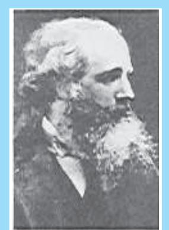
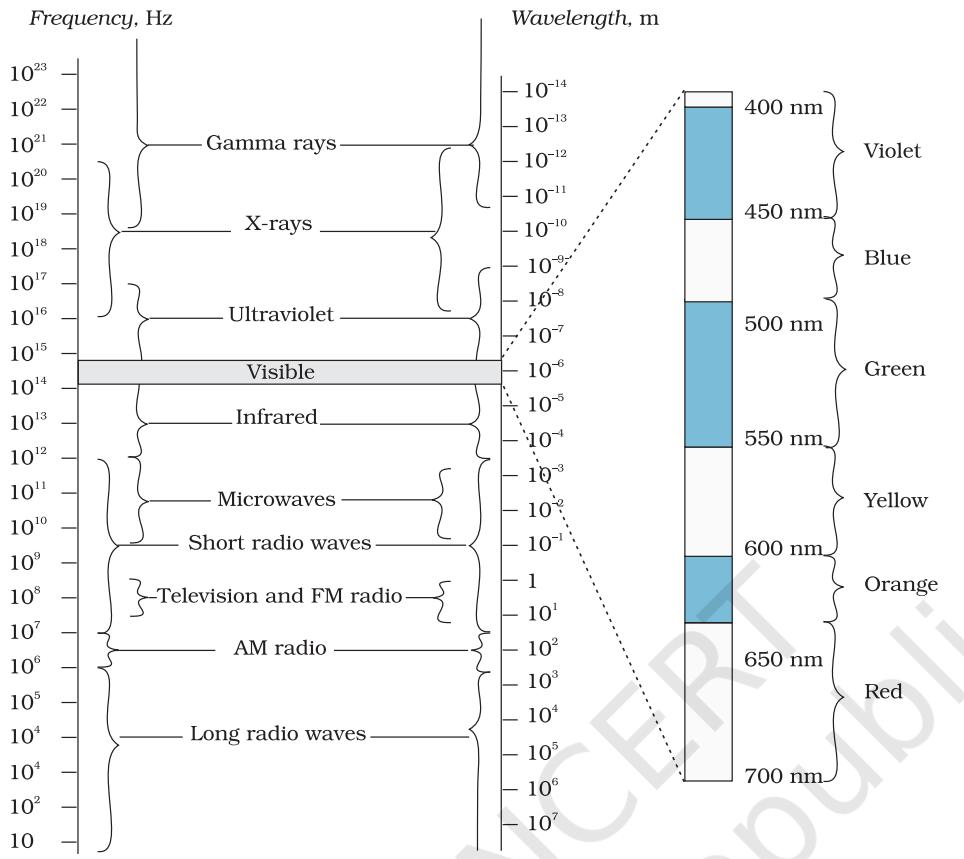
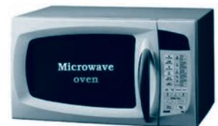
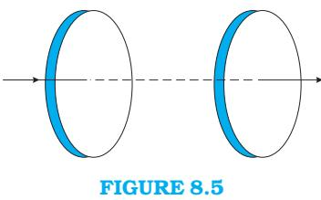
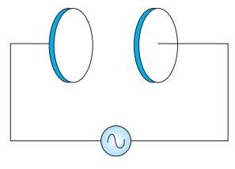

# Chapter Eight ELECTROMAGNETIC WAVES

## 8.1 INTRODUCTION

In Chapter 4, we learnt that an electric current produces magnetic field and that two current-carrying wires exert a magnetic force on each other. Further, in Chapter 6, we have seen that a magnetic field changing with time gives rise to an electric field. Is the converse also true? Does an electric field changing with time give rise to a magnetic field? James Clerk Maxwell (1831-1879), argued that this was indeed the case – not only an electric current but also a time-varying electric field generates magnetic field. While applying the Ampere's circuital law to find magnetic field at a point outside a capacitor connected to a time-varying current, Maxwell noticed an inconsistency in the Ampere's circuital law. He suggested the existence of an additional current, called by him, the displacement current to remove this inconsistency.

Maxwell formulated a set of equations involving electric and magnetic fields, and their sources, the charge and current densities. These equations are known as Maxwell's equations. Together with the Lorentz force formula (Chapter 4), they mathematically express all the basic laws of electromagnetism.

The most important prediction to emerge from Maxwell's equations is the existence of electromagnetic waves, which are (coupled) timevarying electric and magnetic fields that propagate in space. The speed of the waves, according to these equations, turned out to be very close to

James Clerk Maxwell (1831 – 1879) Born in Edinburgh, Scotland, was among the greatest physicists of the nineteenth century. He derived the thermal velocity distribution of molecules in a gas and was among the first to obtain reliable estimates of molecular parameters from measurable quantities like viscosity, etc. Maxwell's greatest acheivement was the unification of the laws of electricity and magnetism (discovered by Coulomb, Oersted, Ampere and Faraday) into a consistent set of equations now called Maxwell's equations. From these he arrived at the most important conclusion that light is an electromagnetic wave. Interestingly, Maxwell did not agree with the idea (strongly suggested by the Faraday's laws of electrolysis) that electricity was particulate in nature.

202

JAMES CLERK MAXWELL (1831–1879)

the speed of light( 3 ×108 m/s), obtained from optical measurements. This led to the remarkable conclusion that light is an electromagnetic wave. Maxwell's work thus unified the domain of electricity, magnetism and light. Hertz, in 1885, experimentally demonstrated the existence of electromagnetic waves. Its technological use by Marconi and others led in due course to the revolution in communication that we are witnessing today.

In this chapter, we first discuss the need for displacement current and its consequences. Then we present a descriptive account of electromagnetic waves. The broad spectrum of electromagnetic waves, stretching from g rays (wavelength ~10–12 m) to long radio waves (wavelength ~106 m) is described.

## 8.2 DISPLACEMENT CURRENT

We have seen in Chapter 4 that an electrical current produces a magnetic field around it. Maxwell showed that for logical consistency, a changing electric field *must also* produce a magnetic field. This effect is of great importance because it explains the existence of radio waves, gamma rays and visible light, as well as all other forms of electromagnetic waves.

To see how a changing electric field gives rise to a magnetic field, let us consider the process of charging of a capacitor and apply Ampere's circuital law given by (Chapter 4)

$\oint$**B$\cdot$dl = $\mu_{0}\,i\,(t)$** (8.1)

to find magnetic field at a point outside the capacitor. Figure 8.1(a) shows a parallel plate capacitor *C* which is a part of circuit through which a time-dependent current *i* (*t*) flows . Let us find the magnetic field at a point such as P, in a region outside the parallel plate capacitor. For this, we consider a plane circular loop of radius *r* whose plane is perpendicular to the direction of the current-carrying wire, and which is centred symmetrically with respect to the wire [Fig. 8.1(a)]. From symmetry, the magnetic field is directed along the circumference of the circular loop and is the same in magnitude at all points on the loop so that if *B* is the magnitude of the field, the left side of Eq. (8.1) is *B* (2p *r*). So we have

$B\left(2\pi r\right)=\mu_{0}i\left(t\right)$ (8.2)

Now, consider a different surface, which has the same boundary. This is a pot like surface [Fig. 8.1(b)] which nowhere touches the current, but has its bottom between the capacitor plates; its mouth is the circular loop mentioned above. Another such surface is shaped like a tiffin box (without the lid) [Fig. 8.1(c)]. On applying Ampere's circuital law to such surfaces with the *same* perimeter, we find that the left hand side of Eq. (8.1) has not changed but the right hand side is *zero* and *not* m*0 i,* since *no* current passes through the surface of Fig. 8.1(b) and (c). So we have a *contradiction*; calculated one way, there is a magnetic field at a point P; calculated another way, the magnetic field at P is zero.

Since the contradiction arises from our use of Ampere's circuital law, this law must be missing something. The missing term must be such that one gets the same magnetic field at point P, no matter what surface is used.

We can actually guess the missing term by looking carefully at Fig. 8.1(c). Is there anything passing through the surface S *between* the plates of the capacitor? Yes, of course, the electric field! If the plates of the capacitor have an area *A*, and a total charge *Q*, the magnitude of the electric field E between the plates is (*Q/A*)/e 0 (see Eq. 2.41). The field is perpendicular to the surface *S* of Fig. 8.1(c). It has the same magnitude over the area *A* of the capacitor plates, and vanishes outside it. So what is the *electric* flux F*E* through the surface *S* ? Using Gauss's law, it is

$$d_{\mathbb{E}}=\left|\mathbb{E}\right|A=\frac{1}{\varepsilon_{0}}\frac{Q}{A}\,A=\frac{Q}{\varepsilon_{0}}\tag{8.3}$$

Now if the charge *Q* on the capacitor plates changes with time, there is a current *i* = (d*Q/*d*t*), so that using Eq. (8.3), we have

$${\frac{\mathrm{d}\Phi_{E}}{\mathrm{d}t}}={\frac{\mathrm{d}}{\mathrm{d}t}}{\bigg(}{\frac{Q}{\varepsilon_{0}}}{\bigg)}={\frac{1}{\varepsilon_{0}}}{\frac{\mathrm{d}Q}{\mathrm{d}t}}$$

This implies that for consistency,

$$\varepsilon_{0}\left(\frac{\mathrm{d}\Phi_{E}}{\mathrm{d}t}\right)=i\tag{8.4}$$

This is the missing term in Ampere's circuital law. If we generalise this law by adding to the total current carried by conductors through the surface, another term which is e 0 times the rate of change of electric flux through the same surface, the *total* has the same value of current *i* for all surfaces. If this is done, there is no contradiction in the value of *B* obtained anywhere using the generalised Ampere's law. *B* at the point P is non-zero no matter which surface is used for calculating it. *B* at a point P outside the plates [Fig. 8.1(a)] is the same as at a point M just inside, as it should be. The current carried by conductors due to flow of charges is called *conduction current*. The current, given by Eq. (8.4), is a new term, and is due to changing electric field (or electric *displacement,* an old term still used sometimes). It is, therefore, called *displacement current* or Maxwell's displacement current. Figure 8.2 shows the electric and magnetic fields inside the parallel plate capacitor discussed above.

The generalisation made by Maxwell then is the following. The source of a magnetic field is not *just* the conduction electric current due to flowing

FIGURE 8.1 A parallel plate capacitor *C*, as part of a circuit through which a time dependent current *i* (*t*) flows, (a) a loop of radius *r*, to determine magnetic field at a point P on the loop; (b) a pot-shaped surface passing through the interior between the capacitor plates with the loop shown in (a) as its rim; (c) a tiffinshaped surface with the circular loop as its rim and a flat circular bottom *S* between the capacitor plates. The arrows show uniform electric field between the capacitor plates.

203

FIGURE 8.2 (a) The electric and magnetic fields E and B between the capacitor plates, at the point M. (b) A cross sectional view of Fig. (a). charges, but also the time rate of change of electric field. More precisely, the total current *i* is the sum of the conduction current denoted by *i c ,* and the displacement current denoted by *i* d (= e 0 (dF*E* / d*t*)). So we have

$$\dot{t}=\dot{t}_{c}+\dot{t}_{d}=\dot{t}_{c}+\varepsilon_{0}\,\frac{\mathrm{d}\,\Phi_{E}}{\mathrm{d}t}\tag{8.5}$$

In explicit terms, this means that outside the capacitor plates, we have only conduction current *i* c = *i,* and no displacement current, i.e., *i d* = 0. On the other hand, inside the capacitor, there is no conduction current, i.e., *i* c = 0, and there is only displacement current, so that *i d* = *i*.

The generalised (and correct) Ampere's circuital law has the same form as Eq. (8.1), with one difference: "the *total current* passing through any surface of which the closed loop is the perimeter" is the sum of the conduction current and the displacement current. The generalised law is

$$\int{\bf B}_{\rm g}{\rm d}{\bf l}=\mu_{0}\;i_{c}+\mu_{0}\;\epsilon_{0}\;\frac{{\rm d}\Phi_{E}}{{\rm d}t}\tag{8.6}$$

and is known as Ampere-Maxwell law.

In all respects, the displacement current has the same physical effects as the conduction current. In some cases, for example, steady electric fields in a conducting wire, the displacement current may be zero since the electric field E does not change with time. In other cases, for example, the charging capacitor above, both conduction and displacement currents may be present in different regions of space. In most of the cases, they both may be present in the same region of space, as there exist no perfectly conducting or perfectly insulating medium. Most interestingly, there may be large regions of space where there is *no* conduction current, but there is only a displacement current due to time-varying electric fields. In such a

region, we expect a magnetic field, though there is no (conduction) current source nearby! The prediction of such a displacement current can be verified experimentally. For example, a *magnetic* field (say at point M) between the plates of the capacitor in Fig. 8.2(a) can be measured and is seen to be the same as that just outside (at P).

The displacement current has (literally) far reaching consequences. One thing we immediately notice is that the laws of electricity and magnetism are now more symmetrical*. Faraday's law of induction states that there is an induced emf *equal to the rate of* change of magnetic flux. Now, since the emf between two points 1 and 2 is the work done per unit charge in taking it from 1 to 2, the existence of an emf implies the existence of an electric field. So, we can rephrase Faraday's law of electromagnetic induction by saying that a *magnetic field,* changing with time, gives rise to an *electric field.* Then, the fact that an *electric field* changing with time gives rise to a *magnetic field,* is the symmetrical counterpart, and is

* They are still not perfectly symmetrical; there are no known sources of magnetic field (magnetic monopoles) analogous to electric charges which are sources of electric field.

a consequence of the displacement current being a source of a magnetic field. Thus, time- dependent electric and magnetic fields give rise to each other! Faraday's law of electromagnetic induction and Ampere-Maxwell law give a quantitative expression of this statement, with the current being the total current, as in Eq. (8.5). One very important consequence of this symmetry is the existence of electromagnetic waves, which we discuss qualitatively in the next section.

## MAXWELL'S EQUATIONS IN VACUUM

| 1. "E.dA = Q/✒ |  |  |  |  |  | (Gauss's Law for electricity) | 0 |  |
| --- | --- | --- | --- | --- | --- | --- | --- | --- |
| 2. "B.dA = 0 –d Φ 3. "E.dl = l= d t | B |  |  |  |  | (Gauss's Law for magnetism) (Faraday's Law) |  |  |
| 4. "B.dl = i µ 0 c | + |  |  | d d | Φ | E (Ampere – Maxwell Law) t |  | µ 0 |
|  |  | ε | 0 |  |  |  |  |  |

## 8.3 ELECTROMAGNETIC WAVES

## 8.3.1 Sources of electromagnetic waves

How are electromagnetic waves produced? Neither stationary charges nor charges in uniform motion (steady currents) can be sources of electromagnetic waves. The former produces only electrostatic fields, while the latter produces magnetic fields that, however, do not vary with time. It is an important result of Maxwell's theory that accelerated charges radiate electromagnetic waves. The proof of this basic result is beyond the scope of this book, but we can accept it on the basis of rough, qualitative reasoning. Consider a charge oscillating with some frequency. (An oscillating charge is an example of accelerating charge.) This produces an oscillating electric field in space, which produces an oscillating magnetic field, which in turn, is a source of oscillating electric field, and so on. The oscillating electric and magnetic fields thus regenerate each other, so to speak, as the wave propagates through the space. The frequency of the electromagnetic wave naturally equals the frequency of oscillation of the charge. The energy associated with the propagating wave comes at the expense of the energy of the source – the accelerated charge.

From the preceding discussion, it might appear easy to test the prediction that light is an electromagnetic wave. We might think that all we needed to do was to set up an ac circuit in which the current oscillate at the frequency of visible light, say, yellow light. But, alas, that is not possible. The frequency of yellow light is about 6 × 1014 Hz, while the frequency that we get even with modern electronic circuits is hardly about 1011 Hz. This is why the experimental demonstration of electromagnetic

Heinrich Rudolf Hertz (1857 – 1894) German physicist who was the first to broadcast and receive radio waves. He produced electromagnetic waves, sent them through space, and measured their wavelength and speed. He showed that the nature of their vibration, reflection and refraction was the same as that of light and heat waves, establishing their identity for the first time. He also pioneered research on discharge of electricity through gases, and discovered the photoelectric effect.

wave had to come in the low frequency region (the radio wave region), as in the Hertz's experiment (1887).

Hertz's successful experimental test of Maxwell's theory created a sensation and sparked off other important works in this field. Two important achievements in this connection deserve mention. Seven years after Hertz, Jagdish Chandra Bose, working at Calcutta (now Kolkata), succeeded in producing and observing electromagnetic waves of much shorter wavelength (25 mm to 5 mm). His experiment, like that of Hertz's, was confined to the laboratory.

At around the same time, Guglielmo Marconi in Italy followed Hertz's work and succeeded in transmitting electromagnetic waves over distances of many kilometres. Marconi's experiment marks the beginning of the field of communication using electromagnetic waves.

#### 8.3.2 Nature of electromagnetic waves

It can be shown from Maxwell's equations that electric and magnetic fields in an electromagnetic wave are perpendicular to each other, *and* to the direction of propagation. It appears reasonable, say from our discussion of the displacement current. Consider Fig. 8.2. The electric field inside the plates of the capacitor is directed perpendicular to the plates. The magnetic field this gives rise to via the displacement current is along the perimeter of a circle parallel to the capacitor plates. So B and E are perpendicular in this case. This is a general feature.

In Fig. 8.3, we show a typical example of a plane electromagnetic wave propagating along the *z* direction (the fields are shown as a function of the *z* coordinate, at a given time *t*). The electric field *Ex* is along the *x*-axis, and varies sinusoidally with *z*, at a given time. The magnetic field *B y* is along the *y*-axis, and again varies sinusoidally with *z*. The electric and magnetic fields *Ex*

$$E_{x}=E_{0}\,\sin\,(k z–\omega t)\qquad[8.7(\mathrm{a})]$$

*B y* = *B*0 sin (*kz–*w*t*) [8.7(b)]

Here *k* is related to the wave length l of the wave by the usual equation

$\kappa=\frac{2\pi}{\lambda}$ (8.8)

propagating in the *z*-direction with the oscillating electric field E along the *x*-direction and the oscillating magnetic field B along the *y*-direction.

HEINRICH RUDOLF HERTZ (1857–1894)

and ω is the angular frequency. *k* is the magnitude of the wave vector (or propagation vector) **k** and its direction describes the direction of propagation of the wave. The speed of propagation of the wave is (ω/*k*). Using Eqs. [8.7(a) and (b)] for *Ex* and *B y* and Maxwell's equations, one finds that

$\omega=ck$, where, c = 1/ $\sqrt{\mu_{0}\varepsilon_{0}}$ [8.9(a)]

The relation ω = *ck* is the standard one for waves (see for example, Section 14.4 of class XI Physics textbook). This relation is often written in terms of frequency, ν *(=*ω*/2*π*)* and wavelength, λ(*=2*π*/k*) as

$2\pi\nu=c\left(\frac{2\pi}{\lambda}\right)$ or  
  
$\nu\lambda=c$

It is also seen from Maxwell's equations that the magnitude of the electric and the magnetic fields in an electromagnetic wave are related as

$B_{0}=(E_{0}/c)$

We here make remarks on some features of electromagnetic waves. They are self-sustaining oscillations of electric and magnetic fields in free space, or vacuum. They differ from all the other waves we have studied so far, in respect that *no material medium* is involved in the vibrations of the electric and magnetic fields.

But what if a material medium is actually there? We know that light, an electromagnetic wave, does propagate through glass, for example. We have seen earlier that the total electric and magnetic fields inside a medium are described in terms of a permittivity ε and a magnetic permeability µ (these describe the factors by which the total fields differ from the external fields). These replace ε 0 and µ0 in the description to electric and magnetic fields in Maxwell's equations with the result that in a material medium of permittivity ε and magnetic permeability µ, the velocity of light becomes,

$$\upsilon=\frac{1}{\sqrt{\mu\varepsilon}}\tag{8.11}$$

Thus, the velocity of light depends on electric and magnetic properties of the medium. We shall see in the next chapter that the *refractive index* of one medium with respect to the other is equal to the ratio of velocities of light in the two media.

The velocity of electromagnetic waves in free space or vacuum is an important fundamental constant. It has been shown by experiments on electromagnetic waves of different wavelengths that this velocity is the same (independent of wavelength) to within a few metres per second, out of a value of 3×108 m/s. The constancy of the velocity of em waves in vacuum is so strongly supported by experiments and the actual value is so well known now that this is used to define a standard of *length*.

The great technological importance of electromagnetic waves stems from their capability to carry energy from one place to another. The radio and TV signals from broadcasting stations carry energy. Light carries energy from the sun to the earth, thus making life possible on the earth.

**Example 8.1** A plane electromagnetic wave of frequency 25 MHz travels in free space along the *x-*direction. At a particular point in space and time, **E** = 6.3 ˆj V/m. What is **B** at this point? **Solution** Using Eq. (8.10), the magnitude of **B** is

$$B={\frac{E}{c}}$$
 
$$={\frac{6.3\,{\mathrm{V/m}}}{3\times10^{8}\,{\mathrm{m/s}}}}=2.1\times10^{-8}\,{\mathrm{T}}$$

To find the direction, we note that **E** is along *y*-direction and the wave propagates along *x*-axis. Therefore, **B** should be in a direction perpendicular to both *x-* and *y-*axes. Using vector algebra, **E × B** should be along *x*-direction. Since, (+ ˆj) × (+kˆ ) = ˆi , **B** is along the *z*-direction. Thus, **B** = 2.1 × 10–8 kˆ T

**Example 8.2** The magnetic field in a plane electromagnetic wave is

given by B*y* = (2 × 10–7) T sin (0.5×103 *x*+1.5×1011*t*).

(a) What is the wavelength and frequency of the wave?

(b) Write an expression for the electric field.

#### **Solution**

(a) Comparing the given equation with

* [16] A. A. K.  
  

We get, $A=\frac{2\pi}{0.5\times10^{3}}$ m = 1.26 cm,

$\frac{1}{T}=\nu=(1.5\times10^{11})/2\pi=23.9$ GHz

(b) *E*0 = *B*0 *c* = 2×10–7 T × 3 × 108 m/s = 6 × 101 V/m The electric field component is perpendicular to the direction of propagation and the direction of magnetic field. Therefore, the electric field component along the z-axis is obtained as *Ez* = 60 sin (0.5 × 103 *x* + 1.5 × 1011 t) V/m

## **8.4 ELECTROMAGNETIC SPECTRUM**

At the time Maxwell predicted the existence of electromagnetic waves, the only familiar electromagnetic waves were the visible light waves. The existence of ultraviolet and infrared waves was barely established. By the end of the nineteenth century, X-rays and gamma rays had also been discovered. We now know that, electromagnetic waves include visible light waves, X-rays, gamma rays, radio waves, microwaves, ultraviolet and infrared waves. The classification of em waves according to frequency is the electromagnetic spectrum (Fig. 8.4). *There is no sharp division between one kind of wave and the next*. The classification is based roughly on how the waves are produced and/or detected.

We briefly describe these different types of electromagnetic waves, in order of decreasing wavelengths.

**2 EXAMPLE 8.1**

 **EXAMPLE 8.**

Electromagnetic spectrum http://www.fnal.gov/pub/inquiring/more/lighthttp://imagine.gsfc.nasa.gov/docs/science/

## **8.4.1 Radio waves**

Radio waves are produced by the accelerated motion of charges in conducting wires. They are used in radio and television communication systems. They are generally in the frequency range from 500 kHz to about 1000 MHz. The AM (amplitude modulated) band is from 530 kHz to 1710 kHz. Higher frequencies upto 54 MHz are used for *short wave* bands. TV waves range from 54 MHz to 890 MHz. The FM (frequency modulated) radio band extends from 88 MHz to 108 MHz. Cellular phones use radio waves to transmit voice communication in the ultrahigh frequency (UHF) band. How these waves are transmitted and received is described in Chapter 15.

## **8.4.2 Microwaves**

Microwaves (short-wavelength radio waves), with frequencies in the gigahertz (GHz) range, are produced by special vacuum tubes (called klystrons, magnetrons and Gunn diodes). Due to their short wavelengths, they are suitable for the radar systems used in aircraft navigation. Radar also provides the basis for the speed guns used to time fast balls, tennisserves, and automobiles. Microwave ovens are an interesting domestic application of these waves. In such ovens, the frequency of the microwaves is selected to match the resonant frequency of water molecules so that energy from the waves is transferred efficiently to the kinetic energy of the molecules. This raises the temperature of any food containing water.

#### 8.4.3 Infrared waves

Infrared waves are produced by hot bodies and molecules. This band lies adjacent to the low-frequency or long-wave length end of the visible spectrum. Infrared waves are sometimes referred to as *heat waves*. This is because water molecules present in most materials readily absorb infrared waves (many other molecules, for example, CO2 , NH3 , also absorb infrared waves). After absorption, their thermal motion increases, that is, they heat up and heat their surroundings. Infrared lamps are used in physical therapy. Infrared radiation also plays an important role in maintaining the earth's warmth or average temperature through the greenhouse effect. Incoming visible light (which passes relatively easily through the atmosphere) is absorbed by the earth's surface and reradiated as infrared (longer wavelength) radiations. This radiation is trapped by greenhouse gases such as carbon dioxide and water vapour. Infrared detectors are used in Earth satellites, both for military purposes and to observe growth of crops. Electronic devices (for example semiconductor light emitting diodes) also emit infrared and are widely used in the remote switches of household electronic systems such as TV sets, video recorders and hi-fi systems.

## 8.4.4 Visible rays

It is the most familiar form of electromagnetic waves. It is the part of the spectrum that is detected by the human eye. It runs from about 4 × 1014 Hz to about 7 × 1014 Hz or a wavelength range of about 700 – 400 nm. Visible light emitted or reflected from objects around us provides us information about the world. Our eyes are sensitive to this range of wavelengths. Different animals are sensitive to different range of wavelengths. For example, snakes can detect infrared waves, and the 'visible' range of many insects extends well into the utraviolet.

## 8.4.5 Ultraviolet rays

It covers wavelengths ranging from about 4 × 10–7 m (400 nm) down to 6 × 10–10m (0.6 nm). Ultraviolet (UV) radiation is produced by special lamps and very hot bodies. The sun is an important source of ultraviolet light. But fortunately, most of it is absorbed in the ozone layer in the atmosphere at an altitude of about 40 – 50 km. UV light in large quantities has harmful effects on humans. Exposure to UV radiation induces the production of more melanin, causing tanning of the skin. UV radiation is absorbed by ordinary glass. Hence, one cannot get tanned or sunburn through glass windows.

Welders wear special glass goggles or face masks with glass windows to protect their eyes from large amount of UV produced by welding arcs. Due to its shorter wavelengths, UV radiations can be focussed into very narrow beams for high precision applications such as LASIK (*Laserassisted in situ keratomileusis*) eye surgery. UV lamps are used to kill germs in water purifiers.

Ozone layer in the atmosphere plays a protective role, and hence its depletion by chlorofluorocarbons (CFCs) gas (such as freon) is a matter of international concern.

## 8.4.6 X-rays

Beyond the UV region of the electromagnetic spectrum lies the X-ray region. We are familiar with X-rays because of its medical applications. It covers wavelengths from about 10–8 m (10 nm) down to 10–13 m (10–4 nm). One common way to generate X-rays is to bombard a metal target by high energy electrons. X-rays are used as a diagnostic tool in medicine and as a treatment for certain forms of cancer. Because X-rays damage or destroy living tissues and organisms, care must be taken to avoid unnecessary or over exposure.

## 8.4.7 Gamma rays

They lie in the upper frequency range of the electromagnetic spectrum and have wavelengths of from about 10–10m to less than 10–14m. This high frequency radiation is produced in nuclear reactions and also emitted by radioactive nuclei. They are used in medicine to destroy cancer cells.

Table 8.1 summarises different types of electromagnetic waves, their production and detections. As mentioned earlier, the demarcation between different regions is not sharp and there are overlaps.

|  | TABLE 8.1 DIFFERENT | TYPES OF ELECTROMAGNETIC WAVES |  |
| --- | --- | --- | --- |
| Type | Wavelength range | Production | Detection |
| Radio | > 0.1 m | Rapid acceleration and | Receiver's aerials |
|  |  | decelerations of electrons |  |
|  |  | in aerials |  |
| Microwave | 0.1m to 1 mm | Klystron valve or | Point contact diodes |
|  |  | magnetron valve |  |
| Infra-red | 1mm to 700 nm | Vibration of atoms | Thermopiles |
|  |  | and molecules | Bolometer, Infrared |
|  |  |  | photographic film |
| Light | 700 nm to 400 nm | Electrons in atoms emit | The eye |
|  |  | light when they move from | Photocells |
|  |  | one energy level to a | Photographic film |
|  |  | lower energy level |  |
| Ultraviolet | 400 nm to 1nm | Inner shell electrons in | Photocells |
|  |  | atoms moving from one | Photographic film |
|  |  | energy level to a lower level |  |
| X-rays | 1nm to 10–3 nm | X-ray tubes or inner shell | Photographic film |
|  |  | electrons | Geiger tubes |
|  |  |  | Ionisation chamber |
| Gamma rays | <10–3 nm | Radioactive decay of the | -do |
|  |  | nucleus |  |

#### SUMMARY

- 1. Maxwell found an inconsistency in the Ampere's law and suggested the existence of an additional current, called displacement current, to remove this inconsistency. This displacement current is due to time-varying electric field and is given by

$${\dot{t}}_{d}=\varepsilon_{0}\,{\frac{\mathrm{d}\phi_{\mathrm{E}}}{\mathrm{d}t}}$$

and acts as a source of magnetic field in exactly the same way as conduction current.

- 2. An accelerating charge produces electromagnetic waves. An electric charge oscillating harmonically with frequency n, produces electromagnetic waves of the same frequency n. An electric dipole is a basic source of electromagnetic waves.
- 3. Electromagnetic waves with wavelength of the order of a few metres were first produced and detected in the laboratory by Hertz in 1887. He thus verified a basic prediction of Maxwell's equations.
- 4. Electric and magnetic fields oscillate sinusoidally in space and time in an electromagnetic wave. The oscillating electric and magnetic fields, E and B are perpendicular to each other, and to the direction of propagation of the electromagnetic wave. For a wave of frequency n, wavelength l, propagating along *z*-direction, we have

  
  
**E = E${}_{x}$(0) = E${}_{0}$ sin (kz = 0 t)**

$\left[2\pi\left(\frac{2}{\lambda}-vt\right)\right]=\left[2\pi\left(\frac{2}{\lambda}-\frac{t}{T}\right)\right]$

*B* = *By* (*t*) = *B*0 sin (*kz –* w*t*)

$\left[\begin{array}{c}\includegraphics[height=36.135pt]{28.eps}\end{array}\right]$

They are related by *E*0 */B*0 = *c*.

- 5. The speed *c* of electromagnetic wave in vacuum is related to m0 and e0 (the free space permeability and permittivity constants) as follows:
1/ 0 0 *c* = µ ε . The value of *c* equals the speed of light obtained from optical measurements.

Light is an electromagnetic wave; c is, therefore, also the speed of light. Electromagnetic waves other than light also have the same velocity c in free space.

The speed of light, or of electromagnetic waves in a material medium is

given by *v* = 1/ µ ε

where m is the permeability of the medium and eits permittivity.

- 
6. The spectrum of electromagnetic waves stretches, in principle, over an infinite range of wavelengths. Different regions are known by different names; g-rays, X-rays, ultraviolet rays, visible rays, infrared rays, microwaves and radio waves in order of increasing wavelength from 10–2 Å or 10–12 m to 106m.

They interact with matter via their electric and magnetic fields which set in oscillation charges present in all matter. The detailed interaction and so the mechanism of absorption, scattering, etc., depend on the wavelength of the electromagnetic wave, and the nature of the atoms and molecules in the medium.

#### POINTS TO PONDER

- 1. The basic difference between various types of electromagnetic waves lies in their wavelengths or frequencies since all of them travel through vacuum with the same speed. Consequently, the waves differ considerably in their mode of interaction with matter.
- 2. Accelerated charged particles radiate electromagnetic waves. The wavelength of the electromagnetic wave is often correlated with the characteristic size of the system that radiates. Thus, gamma radiation, having wavelength of 10–14 m to 10–15 m, typically originate from an atomic nucleus. X-rays are emitted from heavy atoms. Radio waves are produced by accelerating electrons in a circuit. A transmitting antenna can most efficiently radiate waves having a wavelength of about the same size as the antenna. Visible radiation emitted by atoms is, however, much longer in wavelength than atomic size.
- 3. Infrared waves, with frequencies lower than those of visible light, vibrate not only the electrons, but entire atoms or molecules of a substance. This vibration increases the internal energy and consequently, the temperature of the substance. This is why infrared waves are often called *heat waves*.
- 4. The centre of sensitivity of our eyes coincides with the centre of the wavelength distribution of the sun. It is because humans have evolved with visions most sensitive to the strongest wavelengths from the sun.

# EXERCISES

- 8.1 Figure 8.5 shows a capacitor made of two circular plates each of radius 12 cm, and separated by 5.0 cm. The capacitor is being charged by an external source (not shown in the figure). The charging current is constant and equal to 0.15A.
	- (a) Calculate the capacitance and the rate of change of potential difference between the plates.
	- (b) Obtain the displacement current across the plates.
	- (c) Is Kirchhoff's first rule (junction rule) valid at each plate of the capacitor? Explain.

- 8.2 A parallel plate capacitor (Fig. 8.6) made of circular plates each of radius *R* = 6.0 cm has a capacitance *C* = 100 pF. The capacitor is connected to a 230 V ac supply with a (angular) frequency of 300 rad s–1 .

- (a) What is the rms value of the conduction current?
- (b) Is the conduction current equal to the displacement current?
- (c) Determine the amplitude of B at a point 3.0 cm from the axis between the plates.

#### FIGURE 8.6

- 8.3 What physical quantity is the same for X-rays of wavelength 10–10m, red light of wavelength 6800 Å and radiowaves of wavelength 500m?
- 8.4 A plane electromagnetic wave travels in vacuum along *z*-direction. What can you say about the directions of its electric and magnetic field vectors? If the frequency of the wave is 30 MHz, what is its wavelength?
- 8.5 A radio can tune in to any station in the 7.5 MHz to 12 MHz band. What is the corresponding wavelength band?
- 8.6 A charged particle oscillates about its mean equilibrium position with a frequency of 109 Hz. What is the frequency of the electromagnetic waves produced by the oscillator?
- 8.7 The amplitude of the magnetic field part of a harmonic electromagnetic wave in vacuum is *B*0 = 510 nT. What is the amplitude of the electric field part of the wave?
- 8.8 Suppose that the electric field amplitude of an electromagnetic wave is *E*0 = 120 N/C and that its frequency is n = 50.0 MHz. (a) Determine, *B*0 *,*w, *k,* and l. (b) Find expressions for E and B.
- 8.9 The terminology of different parts of the electromagnetic spectrum is given in the text. Use the formula *E* = *h*n (for energy of a quantum of radiation: photon) and obtain the photon energy in units of eV for different parts of the electromagnetic spectrum. In what way are the different scales of photon energies that you obtain related to the sources of electromagnetic radiation?
- 8.10 In a plane electromagnetic wave, the electric field oscillates sinusoidally at a frequency of 2.0 × 1010 Hz and amplitude 48 V m–1 .
	- (a) What is the wavelength of the wave?
	- (b) What is the amplitude of the oscillating magnetic field?
	- (c) Show that the average energy density of the E field equals the average energy density of the B field. [*c* = 3 × 108 m s–1.]

