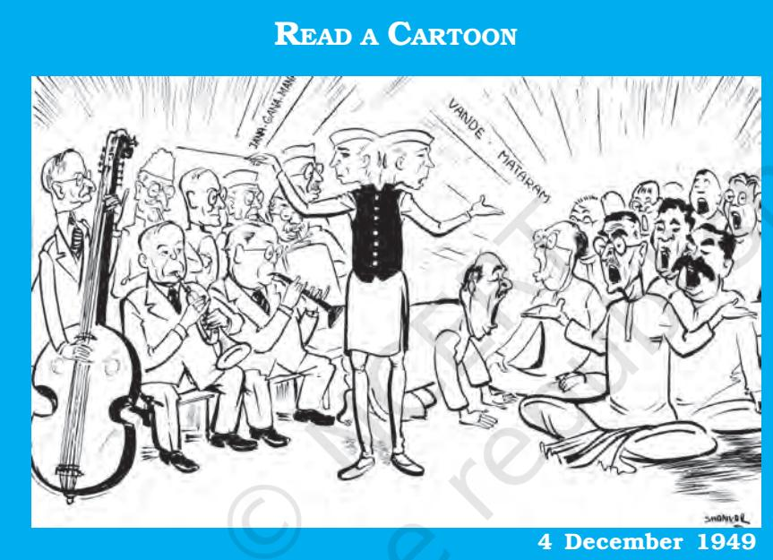
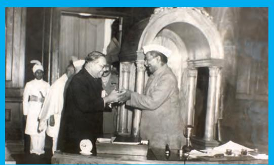
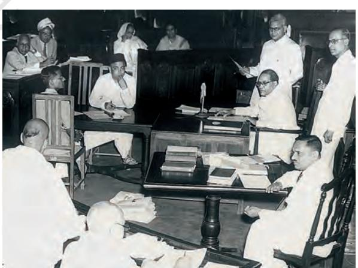
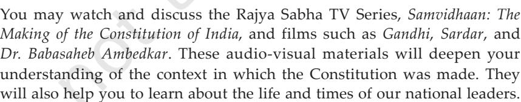

# Chapter One CONSTITUTION: WHY AND HOW?

*Chapter 1: Constitution: Why and How?*

1

INTRODUCTION

*This book is about the working of the Indian Constitution. In the chapters that follow, you will read information about various aspects of the working of our Constitution. You will learn about the various institutions of the government in our country and their relationship with each other.*

*But before you begin to read about elections, governments, and presidents and prime ministers, it is necessary to understand that the entire structure of the government and the various principles that bind the institutions of government have their origin in the Constitution of India.*

*After studying this chapter, you will learn:*

- ± *what a constitution means;*
- ± *what a constitution does to the society;*
- ± *how constitutions govern the allocation of power in society; and*
- ± *what was the way in which the Constitution of India was made.*

# WHY DO WE NEED A CONSTITUTION?

What is a constitution? What are its functions? What role does it perform for a society? How does a constitution relate to our daily existence? Answering these questions is not as difficult as you might think.

# Constitution allows coordination and assurance

Imagine yourself to be a member of a reasonably large group. Further imagine that this group has the following characteristics. The members of this group are diverse in various ways. They have different religious allegiances: some are Hindus, some are Muslims, some Christians and some perhaps profess no religion at all. They are also varied

*Yes, this could be my colony as well! Does this apply to your village or town or colony too?*

2

in many different respects: they pursue different professions, have different abilities, have different hobbies, different tastes in everything from films to books. Some are rich and some are poor. Some are old, some young.

*This group is very much like the people of my village.*

Imagine further that members of this group are likely to have disputes over various aspects of life: How much property should one be allowed to own? Should it be compulsory that every child be sent to school or should the parents be allowed to decide? How much should this group spend on its safety and security? Or should it build more parks instead? Should the group be allowed to discriminate against some of its members? Every question

will elicit a variety of answers from different people. But, for all their diversity, this group has to live together. They are dependent upon each other in various ways. They require the cooperation of each other. What will enable the group to live together peacefully?

One may say that perhaps members of this group can live together if they can agree on some basic rules. Why will the group need certain basic rules? Think of what would happen in the absence of some basic rules. Every individual would be insecure simply because they would not know what members of this group could do to each other, who could claim rights over what. Any group will need some basic rules that are publicly promulgated and known to all members of that group to achieve a minimal degree of coordination. But these rules must not only be known, they must also be enforceable. If citizens have no assurance that others will follow these rules, they will themselves have no reason to follow these rules. Saying that the rules are legally enforceable gives an assurance to everybody that others will follow these, for if they do not do so, they will be punished.

The first function of a constitution is to provide a set of basic rules that allow for minimal coordination amongst members of a society.

### *Activity*

Enact the thought experiment of this section in the classroom. The entire class should discuss and arrive at some decisions that would apply to everyone for this entire session. The decision could be about:

- ± *How would the class representatives be chosen?*
- ± *Which decisions will the representative be able to take on behalf of the entire class?*
- ± *Are there some decisions that the class representative cannot take without consulting the entire class?*
- ± *You can add any other items to this list (collection of common kitty for the class, organisation of picnic and trips, sharing of common resources, …) as long as everyone agrees to it. Make sure that you include those subjects that have led to any differences in the past.*
- ± *How to revise these decisions in case you need to?*

2024-25

3

- ± Write down all these decisions on a paper and put it up on the notice board. Which problems did you encounter in this decision? Were there differences among different students? How did you resolve these differences? Did the entire class gain something from this exercise?
### Specification of decision making powers

A constitution is a body of fundamental principles according to which a state is constituted or governed. But what should these fundamental rules be? And what makes them fundamental? Well, the first question you will have to decide is who gets to decide what the laws governing the society should be? You may want rule X, but others may want rule Y. How do we decide whose rules or preferences should govern us? You may think the rules you want everyone to live by are the best; but others think that *their* rules are the best. How do we resolve this dispute? So even before you decide what rules should govern this group you have to decide: Who gets to decide?

The constitution has to provide an answer to this question. It specifies the basic allocation of power in a society. It decides who gets to decide what the laws will be. In principle, this question, who gets to decide, can be answered in many ways: in a monarchical constitution, a monarch decides; in some constitutions like the old Soviet Union, one single party was given the power to decide. But in democratic constitutions, broadly speaking, the people get to decide. But this matter is not so simple. Because even if you answer that the people should decide, it will not answer the question: how should the people decide? For something to be law, should everyone agree to it? Should the people directly vote on each matter as the ancient Greeks did? Or should the people express their preferences by electing representatives? But if the people act through their representatives, how should these representatives be elected? How many should there be?

In the Indian Constitution for example, it is specified that in most instances, Parliament gets to decide laws and policies, and that Parliament itself be organised in a particular manner. Before identifying what the law in any given society is, you have to identify who has the authority to enact it. If Parliament has the authority to enact laws, there must be a law that bestows this authority on

Parliament in the first place. This is the function of the constitution. It is an authority that constitutes government in the first place.

The second function of a constitution is to specify who has the power to make decisions in a society. It decides how the government will be constituted.

# Limitations on the powers of government

But this is clearly not enough. Suppose you decided who had the authority to make decisions. But then this authority passed laws that you thought were patently unfair. It prohibited you from practising your religion for instance. Or it enjoined that clothes of a certain colour were prohibited, or that you

READ A CARTOON

Countries of the European Union tried to create a European constitution. The attempt failed. Here is a cartoonist's impression of this attempt. Does this always happen in any constitution making?

were not free to sing certain songs or that people who belonged to a particular group (caste or religion) would always have to serve others and would not be allowed to retain any property. Or that government could arbitrarily arrest someone, or that only people of a certain skin colour would be allowed to draw water from wells. You would obviously think these laws were unjust and unfair. And even though they were passed by a government that had come into existence based 5

*Ah! So you first create a monster and then start worrying about saving yourself from it! I would say, why create this monster called government in the first place?*

on certain procedures there would be something obviously unjust about that government enacting these laws.

# So the third function of a constitution is to set some limits on what a government can impose on its citizens. These limits are fundamental in the sense that government may never trespass them.

Constitutions limit the power of government in many ways. The most common way of limiting the power of government is to specify certain fundamental rights that all of us possess as citizens and which no government can ever be allowed to violate. The exact content and interpretation of these rights varies from constitution to constitution. But most constitutions will protect a basic cluster of rights. Citizens will be protected from being arrested arbitrarily and for no reason. This is one basic limitation upon the power of government. Citizens will normally have the right to some basic liberties: to freedom of speech, freedom of conscience, freedom of association, freedom to conduct a trade or business etc. In practice, these rights can be limited during times of national emergency and the constitution specifies the circumstances under which these rights may be withdrawn.

# Aspirations and goals of a society

Most of the older constitutions limited themselves largely to allocating decision-making power and setting some limits to government power. But many twentieth century constitutions, of which the Indian Constitution is the finest example, also provide an enabling framework for the government to do certain positive things, to express the aspirations and goals of society. The Indian Constitution was particularly innovative in this respect. Societies with deep entrenched inequalities of various kinds, will not only have to set limits on the power of government, they will also have to enable and empower the government to take positive measures to overcome forms of inequality or deprivation.

For example, India aspires to be a society that is free of caste discrimination. If this is our society's aspiration, the government will have to be enabled or empowered to take all the necessary steps to achieve this goal. In a country like South Africa, which had a deep history of racial discrimination, its new constitution had to enable the government to end racial discrimination. More positively, a

The constitution makers have to address themselves to very different aspirations. Here is Nehru trying to balance between different visions and ideologies. Can you identify what these different groups stand for? Who do you think prevailed in this balancing act?

constitution may enshrine the aspirations of a society. The framers of the Indian Constitution, for example, thought that each individual in society should have all that is necessary for them to lead a life of minimal dignity and social self-respect — minimum material well-being, education etc. The Indian Constitution enables the government to take positive welfare measures some of which are legally enforceable. As we go on studying the Indian Constitution, we shall find that such enabling

Shankar. Copyright: Children's Book T

rust.

*What does it take to write nice things in the constitution? What is the point in writing down lofty aspirations and goals if they cannot change the life of the people?*

8

provisions have the support of the Preamble to our Constitution, and these provisions are found in the section on Fundamental Rights. The Directive Principles of State of Policy also enjoin government to fulfil certain aspirations of the people.

The fourth function of a constitution is to enable the government to fulfil the aspirations of a society and create conditions for a just society.

### Enabling provisions of the Constitution

Constitutions are not only rules and regulations controlling the powers of the government. They also give powers to the government for pursuing collective good of the society.

- ± Constitution of South Africa assigns many responsibilities to the government: it wants the government to take measures to promote conservation of nature, make efforts to protect persons or groups subjected to unfair discrimination, and provides that the government must progressively ensure adequate housing to all, health care, etc.
- ± In the case of Indonesia also, the government is enjoined to establish and conduct national education system. The Indonesian Constitution ensures that the poor and destitute children will be looked after by the government.

### Fundamental identity of a people

Finally, and perhaps even most importantly, a constitution expresses the fundamental identity of a people.

This means the people as a collective entity come into being only through the basic constitution. It is by agreeing to a basic set of norms about how one should be governed, and who should be governed that one forms a collective identity. One has many sets of identities that exist prior to a constitution. But by

#### *Indian Constitution at Work*

agreeing to certain basic norms and principles one constitutes one's basic *political identity*. Second, constitutional norms are the overarching framework within which one pursues individual aspirations, goals and freedoms. The constitution sets authoritative constraints upon what one may or may not do. It defines the fundamental values that we may not trespass. So the constitution also gives one a *moral identity*. Third and finally, it may be the case that many basic political and moral values are now shared across different constitutional traditions.

If one looks at constitutions around the world, they differ in many respects — in the form of government they enjoin in many procedural

details. But they also share a good deal. Most modern constitutions create a form of government that is democratic in some respects, most claim to protect certain basic rights. But constitutions are different in the way they embody conceptions of national identity. Most nations are an amalgamation of a complex set of historical traditions; they weave together the diverse groups that reside within the nation in different ways. For example, German identity was constituted by being ethnically German. The constitution gave expression to this identity. The Indian Constitution, on the other hand, does not make ethnic identity a criterion for citizenship. Different nations embody different conceptions of what the relationship

The writing of the new Iraqi constitution after the collapse of Saddam Hussain's regime saw a lot of conflict between different ethnic groups in the country. What do these different people stand for? Compare the conflict depicted here with that depicted in earlier cartoons for the European Union and India.

"Iraqi Constitution", John Trever, *Albuquerque Journal*, 18AUG05. Copyright. Cagle Cartoons.

9

between the different regions of a nation and the central government should be. This relationship constitutes the national identity of a country.

# Check your progress

Here are some provisions of the Indian and other constitutions. For each of these write the function that this provision performs.

| The government cannot | Limitations on the |
| --- | --- |
| order any citizen to follow | power of the |
| or not to follow any religion | government |
| The government must try |  |
| to reduce inequalities |  |
| in income and wealth |  |
| The President has the |  |
| power to appoint |  |
| the Prime Minister |  |
| The Constitution is the |  |
| supreme law that everyone |  |
| has to obey |  |
| Indian citizenship is not |  |
| limited to people of |  |
| any race, caste or religion |  |

10

# THE AUTHORITY OF A CONSTITUTION

We have outlined some of the functions a constitution performs. These functions explain why most societies have a constitution. But there are three further questions we can ask about constitutions:

- a) What is a constitution?
b) How effective is a constitution?

- c) Is a constitution just?
In most countries, 'Constitution' is a compact document that comprises a number of articles about the state, specifying how the state is to be constituted and what norms it should follow. When we ask for the constitution of a country we are usually referring to this document. But some countries, the United Kingdom for instance, do not have one single document that can be called the Constitution. Rather they have a series of documents and decisions that, taken collectively, are referred to as the constitution. So, we can say that constitution is the document or set of documents that seeks to perform the functions that we mentioned above.

But many constitutions around the world exist only on paper; they are mere words existing on a parchment. The crucial question is: how effective is a constitution? What makes it effective? What ensures that it has a real impact on the lives of people? Making a constitution effective depends upon many factors.

### Mode of promulgation

This refers to how a constitution comes into being. Who crafted the constitution and how much authority did they have? In many countries constitutions remain defunct because they are crafted by military leaders or leaders who are not popular and do not have the ability to carry the people with them. The most successful constitutions, like India, South Africa and the United States, are constitutions which were created in the aftermath of popular national movements. Although India's Constitution was formally created by a Constituent Assembly between December 1946 and November 1949, it drew upon a long history of the nationalist movement that had a remarkable ability to take along different sections of Indian society together. The Constitution drew enormous legitimacy from the

11

*What do people do if they find out that their constitution is not just? What happens to people when a constitution exists only on paper?*

fact that it was drawn up by people who enjoyed immense public credibility, who had the capacity to negotiate and command the respect of a wide cross-section of society, and who were able to convince the people that the constitution was not an instrument for the aggrandisement of their personal power. The final document reflected the broad national consensus at the time.

Some countries have subjected their constitution to a full-fledged referendum, where all the people vote on the desirability of a constitution. The Indian Constitution was never subjected to such a referendum, but nevertheless carried enormous public authority, because it had the consensus and backing of leaders who were themselves popular. Although the Constitution itself was not subjected to a referendum, the people adopted it as their own by abiding by its provisions. Therefore, the authority of people who enact the constitution helps determine in part its prospects for success.

# The substantive provisions of a constitution

- 12 It is the hallmark of a successful constitution that it gives *everyone* in society some reason to go along with its provisions. A constitution
### Debate over Constitution making in Nepal:

Making a constitution is not always an easy and smooth affair. Nepal is an example of the complicated nature of constitution making. Since 1948, Nepal has had five constitutions, in 1948, 1951, 1959, 1962 and 1990. But all these constitutions were 'granted' by the King of Nepal. The 1990 constitution introduced a multiparty competition, though the King continued to hold final powers in many respects. For many years Nepal was faced with militant political agitations for restructuring the government. The main issue was the role of the monarchy in the constitution of Nepal. Some groups in Nepal wanted to abolish the institution of monarchy and establish republican form of government. Others believed that it may be useful to shift to limited monarchy with a reduced role for the King. The King himself was not ready to give up powers. He took over all powers in October 2002.

Many political parties and organisations demanded the formation of a new constituent assembly. The Communist Party of Nepal (Maoist) was in the forefront of the struggle for a popularly elected constituent assembly. Finally, under pressure of popular agitation, the King had to install a government acceptable to the agitating parties. This government has stripped the King of almost all powers. In 2008, Nepal emerged as a democratic republic after abolishing the monarchy. Finally, Nepal adopted a new constitution in 2015.

that, for instance, allowed permanent majorities to oppress minority groups within society would give minorities no reason to go along with the provision of the constitution. Or a constitution that systematically privileged some members at the expense of others, or that systematically entrenched the power of small groups in society, would cease to command allegiance. If any group feels their identity is being stifled, they will have no reason to abide by the constitution. No constitution by itself achieves perfect justice. But it has to convince people that it provides the framework for pursuing basic justice.

Do this thought experiment. Ask yourself this question: What would be the content of some basic rules in society, such that they gave *everyone* a reason to go along with them?

The more a constitution preserves the freedom and equality of all its members, the more likely it is to succeed. Does the Indian Constitution, broadly speaking, give everyone a reason to go along with its broad outlines? After studying this book, one should be able to answer this question in the affirmative.

## Balanced institutional design

Constitutions are often subverted, not by the people, but by small groups, who wish to enhance their own power. Well crafted constitutions fragment power in society intelligently so that no single group can subvert the constitution. One way of such intelligent designing of a constitution is to ensure that no single institution acquires monopoly of power. This is often done by fragmenting power across different institutions. The Indian Constitution, for example, horizontally fragments power across different institutions like the Legislature, Executive and the Judiciary and even independent statutory bodies like the Election Commission. This ensures that even if one institution wants to subvert the Constitution, others can check its transgressions. An intelligent system of checks and balances has facilitated the success of the Indian Constitution.

Another important aspect of intelligent institutional design is: that a constitution must strike the right balance between certain values, norms and procedures as authoritative, and at the same time allow enough flexibility in its operations to adapt to changing needs and circumstances. Too rigid a constitution is likely to break under the weight of change; a constitution that is, on the other

# READ A CARTOON

Why does the cartoonist describe the new Iraqi Constitution as the castle of cards? Would this description apply to the Indian Constitution?

hand, too flexible, will give no security, predictability or identity to a people. Successful constitutions strike the right balance between preserving core values and adapting them to new circumstances. You will notice the wisdom of makers of the Indian Constitution in the chapter on the Constitution as a living document (Chapter 9). The Indian Constitution is described as 'a living' document. By striking a balance between the possibility to change the provisions and the limits on such changes, the Constitution has ensured that it will survive as a document respected by people. This arrangement also ensures that no section or group can, on its own, subvert the Constitution.

Therefore in determining whether a constitution has authority you can ask yourself three questions:

- ± Were the people who enacted the constitution credible? This question will be answered in the remaining part of this chapter.
± Secondly, did the constitution ensure

that power was intelligently organised so that it was not easy for any group to subvert the constitution? And, most importantly, does the constitution give everyone some reason to go along with it? Most of this book is about this question.

- ± Also, is the constitution the locus of people's hopes and aspiration? The ability of the constitution to command voluntary allegiance of the people depends to a certain extent upon whether the constitution is just. What are the principles of justice underlying the Indian Constitution? The last chapter of this book will answer this question.
14

# How was the Indian Constitution made?

Let us find out how the Indian Constitution was made. Formally, the Constitution was made by the Constituent Assembly which had been elected for undivided India. It held its first sitting on

9 December1946 and reassembled as Constituent Assembly for divided India on 14 August 1947. Its members were chosen by indirect election by the members of the Provincial Legislative Assemblies that had been established under the Government of India Act, 1935. The Constituent Assembly was composed roughly along the lines suggested by the plan proposed by the committee of the British cabinet, known as the Cabinet Mission. According to this plan:

- ± Each Province and each Princely State or group of States were allotted seats proportional to their respective population roughly in the ratio of 1:10,00,000. As a result the Provinces (that were under direct British rule) were to elect 292 members while the Princely States were allotted a minimum of 93 seats.
- ± The seats in each Province were distributed among the three main communities, Muslims, Sikhs and general, in proportion to their respective populations.
- ± Members of each community in the Provincial Legislative Assembly elected their own representatives by the method of proportional representation with single transferable vote.
- ± The method of selection in the case of representatives of Princely States was to be determined by consultation. For more details, visit http://164.100.47.194/loksabha/constituent/facts.html

"We must make our political democracy a social democracy as well. Political democracy cannot last unless there lies at the base of it social democracy. What does social democracy mean? It means a way of life, which recognises liberty, equality and fraternity as the principles of life. These principles of liberty, equality and fraternity are not to be treated as separate items in a trinity. They form a union of trinity in the sense that to divorce one from the other is to defeat the very purpose of democracy. Liberty cannot be divorced from equality, equality cannot be divorced from liberty. Nor can liberty and equality be divorced from fraternity. Without equality, liberty would produce the supremacy of the few over the many. Equality without liberty would kill individual initiative. Without fraternity, liberty and equality could not become a natural course of things…"

Dr. B.R. Ambedkar, CAD, Vol. XI, p.979, 25 November 1949

*Are the principles of liberty, equality and fraternity being practised in your classroom? How can they coexist? Discuss this with your friends.*

15

The previous section discusses the three factors that make a constitution effective and respectable. How far does the Indian Constitution pass this test?

# Composition of the Constituent Assembly

As a consequence of the Partition under the plan of 3 June 1947 those members who were elected from territories which fell under Pakistan ceased to be members of the Constituent Assembly. The number of members in the Assembly was reduced to 299. The Constitution was adopted on 26 November 1949. 284 members were actually present on 24 January 1950 and appended their signature to the Constitution as finally passed. The Constitution came into force on 26 January 1950. The Constitution was thus framed against the backdrop of the horrendous violence that the Partition unleashed on the subcontinent. But it is a tribute to the fortitude of the framers that they were not only able to draft a constitution under immense pressure, but also learnt the right lessons from the unimaginable violence that accompanied the Partition. The Constitution was committed to a new conception of citizenship, where not only would minorities be secure, but religious identity would have no bearing on citizenship rights.

But this account of the composition of the Constituent Assembly that drafted the Constitution touches upon only the surface of how our Constitution was made. Although, the members of the Assembly were not elected by universal suffrage, there was a serious attempt to make the Assembly a representative body. Members of all religions were given representation under the scheme described above; in addition, the Assembly had twentyeight members from the Scheduled Castes. In terms of political parties, the Congress dominated the Assembly occupying as many as eighty-two per cent of the seats in the Assembly after the Partition. The Congress itself was such a diverse party that it managed to accommodate almost all shades of opinion within it.

*What would have happened if the Constituent Assembly was elected by all the people of India? Could it be very different from what it was?*

### The Principle of Deliberation

The authority of the Constituent Assembly does not come only from the fact that it was broadly, though not perfectly, representative. It comes from the procedures it adopted to frame the Constitution and the values its members brought to their deliberations. While in any assembly that claims to be representative, it is desirable that diverse sections of society participate, it is equally important that they participate not only as representatives of their own identity or community. Each member deliberated upon the Constitution with the interests of the whole nation in mind. There were often disagreements amongst members, but few of these disagreements could be traced to members protecting their own interests.

There were legitimate differences of principle. And the differences were many: should India adopt a centralised or decentralised system of government? What should be the relations between the States and the centre? What should be the powers of the judiciary? Should the Constitution protect property rights? Almost every issue that lies at the foundation of a modern state was discussed with great sophistication. Only one provision of the Constitution was passed without virtually any debate: the introduction of universal suffrage (meaning that all citizens reaching a certain age, would be entitled to be voters irrespective of religion, caste, education, gender or income). So, while the members felt no need at all to discuss the issue of who should have the right to vote, every other matter was seriously discussed and debated. Nothing can be a better testament to the democratic commitment of this Assembly.

The Constitution drew its authority from the fact that members of the Constituent Assembly engaged in what one might call *public reason*. The members of the Assembly placed a great emphasis on discussion and reasoned argument. They did not simply advance their own interests, but gave principled reasons to other members for their positions. The very act of giving reasons to others makes you move away from simply a narrow consideration of your own interest because you have to give reasons to others to make them go along with your view point. The voluminous debates in the

Constituent Assembly, where each clause of the Constitution was subjected to scrutiny and debate, is a tribute to public reason at its best. These debates deserved to be memorialised as one of the most significant chapters in the history of constitution making, equal in importance to the French and American revolutions.

The President of the Constituent Assembly, Dr. Rajendra Prasad and the Chairman of the Drafting Committee, Dr. B.R. Ambedkar greeting each other

"... I have realised as nobody else could have, with what zeal and devotion the members of the Drafting Committee and especially its Chairman, Dr. Ambedkar in spite of his indifferent health, have worked. We could never make a decision which was or could be ever so right as when we put him on the Drafting Committee and made him its Chairman. He has not only justified his selection but has added lustre to the work which he has done. In this connection, it would be invidious to make any distinction as among the other members of the Committee. I know they have all worked with the same zeal and devotion as its Chairman, and they deserve the thanks of the country."

> Dr. Rajendra Prasad CAD, Vol. XI, p.994, 26 November 1949

> > READ A CARTOON

### Procedures

The importance of public reason was emphasised in the mundane procedures of the Assembly as well. The Constituent Assembly had eight major Committees on different subjects. Usually, Jawaharlal Nehru, Rajendra Prasad, Sardar Patel or B.R. Ambedkar chaired these Committees. These were not men who agreed with each other on many things. Ambedkar had been a bitter critic of the Congress and Gandhi, accusing them of not doing enough for the upliftment of Scheduled Castes. Patel and Nehru disagreed on many issues. Nevertheless, they all worked together. Each Committee usually drafted particular provisions of the Constitution which were then subjected to debate by the entire Assembly. Usually an attempt was made to reach a consensus with the belief that provisions agreed to by all, would not be detrimental to any particular interests. Some provisions were subject to the vote. But in each instance every single argument, query or concern was responded to with great care and

18

in writing. The Assembly met for one hundred and sixty six days, spread over two years and eleven months. Its sessions were open to the press and the public alike.

# Inheritance of the nationalist movement

But no constitution is simply a product of the Assembly that produces it. An Assembly as diverse as the Constituent Assembly of India could not have functioned if there was no background consensus on the main principles the Constitution should enshrine. These principles were forged during the long struggle for freedom. In a way, the Constituent Assembly was giving concrete shape and form to the principles it had inherited from the nationalist movement. For decades preceding the promulgation of the Constitution, the nationalist movement had debated many questions that were relevant to the making of the constitution — the shape and form of government India should have, the values it should uphold, the inequalities it should overcome. Answers forged in those debates were given their final form in the Constitution.

Perhaps the best summary of the principles that the nationalist movement brought to the Constituent Assembly is the Objective Resolution (the resolution that defined the aims of the Assembly) moved by Nehru in 1946. This resolution encapsulated the aspirations and values behind the Constitution. What the previous section terms as substantive provisions of the constitution is inspired by and summed up by the values incorporated in the Objectives Resolution. Based on this resolution, our Constitution gave institutional expression to these fundamental commitments: equality, liberty, democracy, sovereignty and a cosmopolitan identity. Thus, our Constitution is not merely a maze of rules and procedures, but a moral commitment to establish a government that will fulfil the many promises that the nationalist movement held before the people.

19

*What would have happened if we got independence in 1937? Or if we had to wait till 1957? Would our Constitution be very different from what it is today?*

#### Main points of the Objectives Resolution

- √ India is an independent, sovereign, republic;
- √ India shall be a Union of erstwhile British Indian territories, Indian States, and other parts outside British India and Indian States as are willing to be a part of the Union;
- √ Territories forming the Union shall be autonomous units and exercise all powers and functions of the Government and administration, except those assigned to or vested in the Union;
- √ All powers and authority of sovereign and independent India and its constitution shall flow from the people;
- √ All people of India shall be guaranteed and secured social, economic and political justice; equality of status and opportunities and equality before law; and fundamental freedoms - of speech, expression, belief, faith, worship, vocation, association and action subject to law and public morality;
- √ The minorities, backward and tribal areas, depressed and other backward classes shall be provided adequate safeguards;
- √ The territorial integrity of the Republic and its sovereign rights on land, sea and air shall be maintained according to justice and law of civilized nations;
- √ The land would make full and willing contribution to the promotion of world peace and welfare of mankind.

### Institutional arrangements

The third factor ensuring effectiveness of a constitution is a balanced arrangement of the institutions of government. The basic principle is that government must be democratic and committed to the welfare of the people. The Constituent Assembly spent a lot of time on evolving the right balance among the various institutions like the executive, the legislature and the judiciary. This led to the adoption of the parliamentary form and the federal arrangement, which would distribute governmental powers between the

legislature and the executive on the one hand and between the States and the central government on the other hand.

While evolving the most balanced governmental arrangements, the makers of our Constitution did not hesitate to learn from experiments and experiences of other countries. Thus, the framers of the Constitution were not averse to borrowing from other constitutional traditions. Indeed, it is a testament to their wide learning that they could lay their hands upon any intellectual argument, or historical example that was necessary for fulfilling the task at hand. So they borrowed a number of provisions from different countries.

But borrowing these ideas was not slavish imitation. Far from it. Each provision of the Constitution had to be defended on grounds that it was suited to Indian problems and aspirations. India was extremely lucky to have an Assembly that instead of being parochial in its outlook could take the best available everywhere in the world and make it their own.

21

*Was it a borrowed constitution then? Why could we not have a constitution that does not borrow anything from anywhere else?*

"One likes to ask whether there can be anything new in a Constitution framed at this hour in the history of the world… The only new things, if there can be any, in a Constitution framed so late in the day are the variations made to remove the faults and to accommodate it to the needs of the country."

Dr. B.R. Ambedkar CAD, Vol. VII, p.37, 4 November 1948

Dr. B.R. Ambedkar presiding over a discussion in the Constituent Assembly

# Provisions adapted from constitutions of different countries

# British Constitution

First Past the Post

Parliamentary Form of Government

The idea of the rule of law

Institution of the Speaker and her/his role

Law-making procedure

# Irish Constitution

Directive Principles of State Policy

# French Constitution

Principles of Liberty, Equality and Fraternity

### United States Constitution

Charter of Fundamental Rights

Power of Judicial Review and independence of the judiciary

# Canadian Constitution

A quasi-federal form of government (a federal system with a strong central government)

The idea of Residual Powers

22

### Conclusion

It is a tribute to the wisdom and foresight of the makers of the Constitution that they presented to the nation a document that enshrined fundamental values and highest aspirations shared by the people. This is one of the reasons why this most intricately crafted document has not only survived but become a living reality, when so many other constitutions have perished with the paper they were first written on.

India's Constitution is a unique document which in turn became an exemplar for many other constitutions, most notably South Africa. The main purpose behind the long search that went on for almost three years was to strike the right balance so that institutions created by the Constitution would not be haphazard or tentative arrangements but would be able to accommodate the aspirations of the people of India for a long time to come. You will know more about these arrangements through the study of the remaining chapters in this book.

# Exercises

- 1. Which of these is not a function of the constitution?
	- a. It gives a guarantee of the rights of the citizen.
	- b. It marks out different spheres of power for different branches of government.
	- c. It ensures that good people come to power.
	- d. It gives expression to some shared values.
- 2. Which of the following is a good reason to conclude that the authority of the constitution is higher than that of the parliament?
	- a. The constitution was framed before the parliament came into being.
	- b. The constitution makers were more eminent leaders than the members of the parliament.
	- c. The constitution specifies how parliament is to be formed and what are its powers.
	- d. The constitution cannot be amended by the parliament.
- 3. State whether the following statements about a constitution are True or False.
	- a. Constitutions are written documents about formation and power of the government.
	- b. Constitutions exist and are required only in democratic countries.
	- c. Constitution is a legal document that does not deal with ideals and values.
	- d. A constitution gives its citizens a new identity.
- 4. State whether the following inferences about the making of the Indian Constitution are Correct or Incorrect. Give reasons to support your answer.
	- a. The Constituent Assembly did not represent the Indian people since it was not elected by all citizens.
	- b. Constitution making did not involve any major decision since there was a general consensus among the leaders at that time about its basic framework.
	- c. There was little originality in the Constitution, for much of it was borrowed from other countries.
- 5. Give two examples each to support the following conclusions about the Indian Constitution:
	- a. The Constitution was made by credible leaders who commanded peoples' respect.
	- b. The Constitution has distributed power in such a way as to make it difficult to subvert it.
	- c. The Constitution is the locus of people's hopes and aspirations.
- 6. Why is it necessary for a country to have a clear demarcation of powers and responsibilities in the constitution? What would happen in the absence of such a demarcation?
- 7. Why is it necessary for a constitution to place limitations on the rulers? Can there be a constitution that gives no power at all to the citizens?
- 8. The Japanese Constitution was made when the US occupation army was still in control of Japan after its defeat in the Second World War. The Japanese constitution could not have had any provision that the US government did not like. Do you see any problem in

this way of making the constitution? In which way was the Indian experience different from this?

- 9. Rajat asked his teacher this question: " The constitution is a fifty year old and therefore outdated book. No one took my consent for implementing it. It is written in such tough language that I cannot understand it. Tell me why should I obey this document?" If you were the teacher, how would you answer Rajat?
- 10. In a discussion on the experience of the working of our Constitution, three speakers took three different positions:
	- a. Harbans: The Indian Constitution has succeeded in giving us a framework of democratic government.
	- b. Neha: The Constitution made solemn promises of ensuring liberty, equality and fraternity. Since this has not happened, the Constitution has failed.
	- c. Nazima: The Constitution has not failed us. We have failed the Constitution.

Do you agree with any of these positions? If yes, why? If not, what is your own position?

