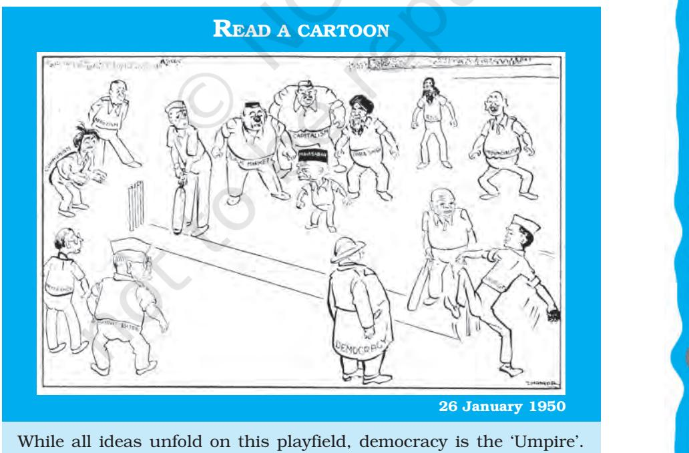
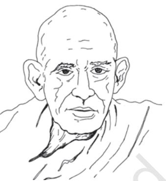
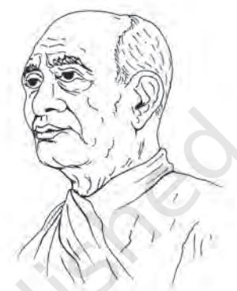

# Chapter Ten THE PHILOSOPHY OF THE CONSTITUTION

*Indian Constitution at Work*

## INTRODUCTION

*In this book, so far we have studied some important provisions of our Constitution and the way in which these have worked in the last 69 years. We also studied the way in which the Constitution was made. But have you ever asked yourself why leaders of the national movement felt the need to adopt a constitution after achieving independence from British rule? Why did they choose to bind themselves and the future generations to a constitution? In this book, you have repeatedly visited the debates in the Constituent Assembly. But it should be asked why the study of the constitution must be accompanied by a deep examination of the debates in the Constituent Assembly? This question will be addressed in this chapter. Secondly, it is important to ask what kind of a constitution we have given ourselves. What objectives did we hope to achieve by it? Do these objectives have a moral content? If so, what precisely is it? What are the strengths and limitations of this vision and, by implication, the achievements and weaknesses of the Constitution? In doing so, we try to understand what can be called the philosophy of the Constitution.*

*After reading this chapter, you should be able to understand:*

- ± *why it is important to study the philosophy of the Constitution;*
- ± *what are the core features of the Indian Constitution;*
- ± *what are the criticisms of this Constitution; and*
- ± *what are the limitations of the Constitution?*

## WHAT IS MEANT BY PHILOSOPHY OF THE CONSTITUTION?

Some people believe that a constitution merely consists of laws and that laws are one thing, values and morality, quite another. Therefore, we can have only a legalistic, not a political philosophy approach to the Constitution. It is true that all laws do not have a moral content, but many laws are closely connected to our deeply held values. For example, a law might prohibit discrimination of persons on grounds of language or religion. Such a law is connected to the idea of equality. Such a law exists because we value equality. Therefore, there is a connection between laws and moral values.

We must therefore, look upon the constitution as a document that is based on a certain moral vision. We need to adopt a political philosophy approach to the constitution. What do we mean by a political philosophy approach to the constitution? We have three things in mind.

- ± First, we need to understand the conceptual structure of the constitution. What does this mean? It means that we must ask questions like what are the possible meanings of terms used in the constitution such as 'rights', 'citizenship', 'minority' or 'democracy'?
- ± Furthermore, we must attempt to work out a coherent vision of society and polity conditional upon an interpretation of the key concepts of the constitution. We must have a better grasp of the *set of ideals* embedded in the constitution.
- ± Our final point is that the Indian Constitution must be read in conjunction with the Constituent Assembly Debates in order to refine and raise to a higher theoretical plane, the *justification* of values embedded in the Constitution. A philosophical treatment of a value is incomplete if a detailed justification for it is not provided. When the framers of the Constitution

221

*Does it mean that all constitutions have a philosophy? Or is it that only some constitutions have a philosophy?*

chose to guide Indian society and polity by a set of values, there must have been a corresponding set of reasons. Many of them, though, may not have been fully explained.

A political philosophy approach to the constitution is needed not only to find out the moral content expressed in it and to evaluate its claims but possibly to use it to arbitrate between varying interpretations of the many core values in our polity. It is obvious that many of its ideals are challenged, discussed, debated and contested in different political arenas, in the legislatures, in party forums, in the press, in schools and

*Yes, of course, I do remember this issue of different interpretations of the Constitution. We discussed it in the last chapter, didn't we?*

universities. These ideals are variously interpreted and sometimes wilfully manipulated to suit partisan short term interests. We must, therefore, examine whether or not a serious disjunction exists between the constitutional ideal and its expression in other arenas. Sometimes, the same

ideal is interpreted differently by different institutions. We need to compare these differing interpretations. Since the expression

The Japanese Constitution of 1947 is popularly known as the 'peace constitution'. The preamble states that *"We, the Japanese people desire peace for all time and are deeply conscious of the high ideals controlling human relationship"*. The philosophy of the Japanese constitution is thus based on the ideal of peace.

Article 9 of the Japanese constitution states —

1) Aspiring sincerely to an international peace based on justice and order, the Japanese people forever renounce war as a sovereign right of the nation and the threat or use of force as means of settling international disputes.

2) In order to accomplish the aim of the preceding paragraph, land, sea, and air forces, as well as other war potential, will never be maintained…

This shows how the context of making the constitution dominates the thinking of the constitution makers.

of the ideal in the constitution has considerable authority it must be used to arbitrate in conflict of interpretation over values or ideals. Our Constitution can perform this job of arbitration.

#### Constitution as Means of Democratic Transformation

In the first chapter we have studied the meaning of the term constitution and the need to have a constitution. It is widely agreed that one reason for having constitutions is the need to restrict the exercise of power. Modern states are excessively powerful. They are believed to have a monopoly over force and coercion. What if institutions of such states fall into wrong hands who abuse this power? Even if these institutions were created for our safety and well-being, they can easily turn against us. Experience of state power the world over shows that most states are prone to harming the interests of at least some individuals and groups. If so, we need to draw the rules of the game in such a way that this tendency of states is continuously checked. Constitutions provide these basic rules and therefore, prevent states from turning tyrannical.

Constitutions also provide peaceful, democratic means to bring about social transformation. Moreover, for a hitherto colonised people, constitutions announce and embody the first real exercise of political self-determination.

Nehru understood both these points well. The demand for a Constituent Assembly, he claimed, represented a collective demand for full self-determination because; only a Constituent Assembly of elected representatives of the Indian people had the right to frame India's constitution without external interference. Second, he argued, the Constituent Assembly is not just a body of people or a gathering of able lawyers. Rather, it is a 'nation on the move, throwing away the shell of its past political and possibly social structure, and fashioning for itself a new garment of its own making.' The Indian Constitution was designed to break the shackles of traditional social hierarchies and to usher in a new era of freedom, equality and justice.

223

*So, can we say that members of the Constituent Assembly were all eager to bring social transformation? But we also keep saying that all view points were represented in the Assembly!*

This approach had the potential of changing the theory of constitutional democracy altogether: according to this approach, constitutions exist not only to limit people in power but to empower those who traditionally have been deprived of it. Constitutions can give vulnerable people the power to achieve collective good.

#### Why do we need to go back to the Constituent Assembly?

Why look backwards and bind ourselves to the past? That may be the job of a legal historian — to go into the past and search for the basis of legal and political ideas. But why should students of politics be interested in studying the intentions and concerns of those who framed the Constitution? Why not take account of changed circumstances and define anew the normative function of the constitution?

In the context of America — where the constitution was written in the late 18th century— it is absurd to apply the values and standards of that era to the 21st century. However, in India, the world of the original framers and our present day world may not have changed so drastically. In terms of our values, ideals and conception, we have not separated ourselves from the world of the Constituent Assembly. A history of our Constitution is still very much a history of the present.

#### *Activity*

Read again the quotes from the Debates of the Constituent Assembly (CAD) given in the following chapters. Do you think that the arguments in those quotations have relevance for our present times? Why?

- i. Quotes in Chapter two
- ii. Quote in Chapter seven

Furthermore, we may have forgotten the real point underlying several of our legal and political practices, simply because somewhere down the road we began to take them for granted. These reasons have now slipped into the background, screened off from our consciousness even though they still provide the organizational principle to current practices. When the going is good, this forgetting

224

is harmless. But when these practices are challenged or threatened, neglect of the underlying principles can be harmful. In short, to get a handle on current constitutional practice, to grasp their value and meaning, we may have no option but to go back in time to the Constituent Assembly debates and perhaps even further back in time to the colonial era. Therefore, we need to remember and keep revisiting the political philosophy underlying our Constitution.

## WHAT IS THE POLITICAL PHILOSOPHY OF OUR CONSTITUTION?

It is hard to describe this philosophy in one word. It resists any single label because it is liberal, democratic, egalitarian, secular, and federal, open to community values, sensitive to the needs of religious and linguistic minorities as well as historically disadvantaged groups, and committed to building a common national identity.

*This is tough. Why couldn't they plainly tell us what the philosophy of this Constitution is? How can ordinary citizens understand the philosophy if it is hidden like this?*

In short, it is committed to freedom, equality, social justice, and some form of national unity. But underneath all this, there is a clear emphasis on peaceful and democratic measures for putting this philosophy into practice.

#### Individual freedom

The first point to note about the Constitution is its commitment to individual freedom. This commitment did not emerge miraculously out of calm deliberations around a table. Rather, it was the product of continuous intellectual and political activity of well over a century. As early as the beginning of the nineteenth century, Rammohan Roy protested against curtailment of the freedom of the press by the British colonial state. Roy argued that a state responsive to the needs of individuals must provide them the means by which their needs are communicated. Therefore, the state must permit unlimited liberty of publication. Likewise, Indians continued to demand a free press throughout the British rule.

It is not surprising therefore that freedom of expression is an integral part of the Indian Constitution. So is the freedom from arbitrary arrest. After all, the infamous Rowlatt Act, which the national movement opposed so vehemently, sought to deny this basic freedom. These and other individual freedoms such as freedom of conscience are part of the liberal ideology. On this basis, we can say that the Indian Constitution has a pretty strong liberal character. In the chapter on fundamental rights we have already seen how the Constitution values individual freedom. It might be recalled that for over forty years before the adoption of the Constitution, every single resolution, scheme, bill and report of the Indian National Congress mentioned individual rights, not just in passing but as a nonnegotiable value.

#### Social Justice

When we say that the Indian Constitution is liberal, we do not mean that it is liberal only in the classical western sense. In the book on Political Theory, you will learn more about the idea of liberalism. Classical liberalism always privileges rights of the individuals over demands of social justice and community values.

#### Check your progress

State which of the following rights are part of individual freedom:

- ± Freedom of expression
- ± Freedom of religion
- ± Cultural and educational rights of minorities
- ± Equal access to public places

The liberalism of the Indian Constitution differs from this version in two ways. First, it was always linked to social justice. The best example of this is the provision for reservations for Scheduled Castes and Scheduled Tribes in the Constitution. The makers of the Constitution believed that the mere granting of the right to equality was not enough to overcome age-old injustices suffered by these groups or to give real meaning to their right to vote. Special constitutional measures were required to advance their interests. Therefore the constitution makers provided a number of special measures to protect the interests of Scheduled Castes and Scheduled Tribes such as the reservation of seats in legislatures. The Constitution also made it possible for the government to reserve public sector jobs for these groups.

> Indian liberalism has two streams. The first stream began with Rammohan Roy. He emphasised individual rights, particularly the rights of women. The second stream included thinkers like K.C. Sen, Justice Ranade and Swami Vivekananda. They introduced the spirit of social justice within orthodox Hinduism. For Vivekananda, such a reordering of Hindu society could not have been possible without liberal principles. — K.M. Panikkar, *In Defence of Liberalism*, Bombay, Asia Publishing House, 1962.

227

*And while talking of social justice, let us not forget the directive principles.*

#### Respect for diversity and minority rights

The Indian Constitution encourages equal respect between communities. This was not easy in our country, first because communities do not always have a relationship of equality; they tend to have hierarchical relationships with one another (as in the case of caste). Second, when these communities do see each other as equals, they also tend to become rivals (as in the case of religious communities). This was a huge challenge for the makers of the Constitution: how to make communities liberal in their approach and foster a sense of equal respect among them under existing conditions of hierarchy or intense rivalry?

It would have been very easy to resolve this problem by not recognising communities at all, as most western liberal constitutions do. But this would have been unworkable and undesirable in our country. This is not because Indians are attached to communities more than others. Individuals everywhere also belong to cultural communities and every such community has its own values, traditions, customs and language shared by its members. For example, individuals in France or Germany belong to a linguistic community and are deeply attached

to it. What makes us different is that we have more openly acknowledged the value of communities. More importantly, India is a land of multiple cultural communities. Unlike Germany or France we have several linguistic and religious communities. It was important to ensure that no one community systematically dominates others. This made it mandatory for our Constitution to recognise community based rights.

One such right is the right of religious communities to establish and run their own educational institutions. Such institutions may receive money from the government. This provision shows that the Indian Constitution does not see religion merely as a 'private' matter concerning the individual.

*I have always wondered who I am. I have so many 'identities' in my bag: I have my religious identity, I have my linguistic identity, I have ties with my parental town, and of course, I am a student also.*

#### Secularism

Secular states are widely seen as treating religion as only a private matter. That is to say, they refuse to give religion public or official recognition. Does this mean that the Indian Constitution is not secular? This does not follow. Though the term 'secular' was not initially mentioned, the Indian Constitution has always been secular. The mainstream, western conception, of secularism means mutual exclusion of state and religion in order to protect values such as individual freedom and citizenship rights of individuals.

Again, this is something that you will learn more about in Political Theory. The term 'mutual exclusion' means this: both religion and state must stay away from the internal affairs of one another. The state must not intervene in the domain of religion; religion likewise should not dictate state policy or influence the conduct of the state. In other words, mutual exclusion means that religion and state must be *strictly* separated.

What is the purpose behind *strict* separation? It is to safeguard the freedom of individuals. States which lend support to organised religions make them more powerful than they already are. When religious organisations begin to control the religious lives of individuals, when they start dictating how they should relate to God or how they should pray, individuals may have the option of turning to the modern state for protecting their religious freedom, but what help would a state offer them if it has already joined hands with these organisations? To protect religious freedom of individuals, therefore, state must not help religious organisations. But at the same time, state should not tell religious organisations how to manage their affairs. That too can thwart religious freedom. The state must, therefore, not hinder religious organisations either. In short, states should neither help nor hinder religions. Instead, they should keep themselves at an arm's length from them. This has been the prevalent western conception of secularism.

*Have they started teaching us the Political Theory course?*

Conditions in India were different and to respond to the challenge they posed, the makers of the Constitution had to work out an alternative conception of secularism. They departed from the western model in two ways and for two different reasons.

#### ± *Rights of Religious Groups*

First, as mentioned already, they recognised that intercommunity equality was as necessary as equality between individuals. This was because a person's freedom and sense of self-respect was directly dependent upon the status of her community. If one community was dominated by another, then its members would also be significantly less free. If, on the other hand, their relations were equal, marked by an absence of domination, then its members would also walk about with dignity, self-respect and freedom. Thus, the Indian Constitution grants rights to all religious communities such as the right to establish and maintain their educational institutions. Freedom of religion in India means the freedom of religion of both individuals and communities.

#### ± *State's Power of Intervention*

Second, separation in India could not mean mutual exclusion. Why is it so? Because, religiously sanctioned customs such as untouchability deprived individuals of the most basic dignity and self-respect. Such customs were so deeply rooted and pervasive that without active state intervention, there was no hope of their dissolution. The state simply had to interfere in the affairs of religion. Such intervention was not always negative. The state could also help religious communities by giving aid to educational institutions run by them. Thus, the state may help or hinder religious communities depending on which mode of action promotes values such as freedom and equality. In India separation between religion and state did not mean their mutual exclusion but rather

*I would like to know whether finally, the state can regulate matters related to religion or not. Otherwise, there can be no religious reform.*

principled distance, a rather complex idea that allows the state to be distant from all religions so that it can intervene or abstain from interference, depending upon which of these two would better promote liberty, equality and social justice.

We have hitherto mentioned three core features — these can also be seen as the achievements — of our Constitution.

- ± First, our Constitution reinforces and reinvents forms of liberal individualism. This is an important achievement because this is done in the backdrop of a society where community values are often indifferent or hostile to individual autonomy.
- ± Second, our Constitution upholds the principle of social justice without compromising on individual liberties. The constitutional commitment to caste-based affirmative action programme shows how much ahead India was compared to other nations. Can one forget that affirmative action programmes in the U.S. were begun after the 1964 Civil Rights Act, almost two decades after they were constitutionally entrenched in India?
- ± Third, against the background of inter-communal strife, the Constitution upholds its commitment to group rights (the right to the expression of cultural particularity). This indicates that the framers of the Constitution were more than willing to face the challenges of what more than four decades later has come to be known as multiculturalism.

#### Universal franchise

Two other core features may also be regarded as achievements. First, it is no mean achievement to commit oneself to universal franchise, specially when there is widespread belief that traditional hierarchies in India are congealed and more or less impossible to eliminate, and when the right to vote has only recently been extended to women and to the working class in stable, Western democracies.

Once the idea of a nation took root among the elite, the idea of democratic self-government followed. Thus, Indian nationalism always conceived of a political order based on the will of every single member of society. The idea of universal franchise lay securely within the heart of nationalism. As early as the Constitution of India Bill (1895), the first non-official attempt at drafting a constitution for India, the author declared that every citizen, i.e., anyone born in

"The Assembly has adopted the principle of adult franchise with an abundant faith in the common man and the ultimate success of democratic rule and in the full belief that the introduction of democratic government on the basis of adult suffrage will… promote the well-being..."

Alladi Krishnaswami Ayyar, CAD, Vol. XI, p. 835, 23 November 1949

*It's certainly a matter of pride that the principle of 'one man one vote' was accepted almost uncontested. Isn't it true that women had to struggle for their right to vote in many other countries?*

India, had a right to take part in the affairs of the country and be admitted to public office. The Motilal Nehru Report (1928) reaffirms this conception of citizenship, reiterating that every person of either sex who has attained the age of twenty-one is entitled to vote for the House of Representatives or Parliament. Thus from very early on, universal franchise was considered as the most important and legitimate instrument by which the will of the nation was to be properly expressed.

#### Federalism

Second, by introducing the article concerning North-East (Art. 371), the Indian Constitution anticipates the very important concept of asymmetric federalism. We have seen in the chapter on federalism that the Constitution has created a strong central government. But despite this unitary bias of the Indian Constitution, there are important constitutionally embedded differences between the legal status and prerogatives of different sub-units within the same federation. Unlike the constitutional symmetry of American federalism, Indian federalism has been constitutionally asymmetric. To meet the specific needs and requirements of some sub-units, it was always part of the original design to have a unique relationship with them or to give them special status.

Under Article 371A, the privilege of special status was also accorded to the North-Eastern State of Nagaland. This Article not only confers validity on pre-existing laws within Nagaland, but also protects local identity through restrictions on immigration. Many other States too, are beneficiaries of such special provisions. According to the Indian Constitution, then, there is nothing bad about this differential treatment.

Although the Constitution did not originally envisage this, India is now a multi-lingual federation. Each major linguistic group is politically recognised and all are treated as equals. Thus, the democratic and linguistic federalism of India has managed to combine claims to unity with claims to cultural recognition. A fairly robust political arena exists that allows for the play of multiple identities that complement one another.

*I am really impressed! Who says our Constitution is based on imitation?. In every 'borrowed' aspect, we have put our own distinct imprint.*

#### National identity

Thus, the Constitution constantly reinforces a common national identity. In the chapter on federalism, you have studied how India strives to retain regional identities along with the national identity. It is clear from what is mentioned above that this common national identity was not incompatible with distinct religious or linguistic identities. The Indian Constitution tried to balance these various identities. Yet, preference was given to common identity under certain conditions. This is clarified in the debate over separate electorates based on religious identity which the Constitution rejects. Separate electorates were rejected not because they fostered difference between religious communities as such or because they endangered a simple notion of national unity but because

they endangered a healthy national life. Rather than forced unity, our Constitution sought to evolve true fraternity, a goal dear to the heart of Dr. Ambedkar. As Sardar Patel put it, the main objective was to evolve 'one community'.

> "But in the long run, it would be in the interest of all to forget that there is anything like majority or minority in this country and that in India there is only one community…"

Sardar Patel, CAD, Vol. VIII, p. 272, 25 May 1949

### PROCEDURAL ACHIEVEMENTS

All these five core features are what might be called the substantive achievements of the Constitution. However, there were also some procedural achievements.

- ± First, the Indian Constitution reflects a faith in political deliberation. We know that many groups and interests were not adequately represented in the Constituent Assembly. But the debates in the Assembly amply show that the makers of the Constitution wanted to be as inclusive in their approach as possible. This open-ended approach indicates the willingness of people to modify their existing preferences, in short, to justify outcomes by reference not to self-interest but to reasons. It also shows a willingness to recognise creative value in difference and disagreement.
± Second, it reflects a spirit of compromise and accommodation. These words, compromise and accommodation, should not always be seen with disapproval. Not all compromises are bad. If something of value is traded off for mere self-interest, then we naturally have compromised in the bad sense. However, if one value is partially traded off for another value, especially in an open process of free deliberation among equals, then the compromise arrived in this manner can hardly be objected to. We may lament that we could not have everything but to secure a bit of all things important cannot be morally blameworthy. Besides, a commitment to the idea that decisions on the most important issues must be arrived at consensually rather than by majority vote is equally morally commendable.

#### CRITICISMS

The Indian Constitution can be subjected to many criticisms of which three may be briefly mentioned: first, that it is unwieldy; second, that it is unrepresentative and third, that it is alien to our conditions.

The criticism that it is unwieldy is based on the assumption that the entire constitution of a country must be found in one compact document. But this is not true even of countries such as the US which do have a compact constitution. The fact is that a country's constitution is to be identified with a compact document and with other written documents with constitutional status. Thus, it is possible to find important constitutional statements and practices outside one compact document. In the case of India, many such details, practices and statements are included in one single document and this has made that document somewhat large in size. Many countries for instance, do not have provisions for election commission or the civil service commission in the document known as constitution. But in India, many such matters are attended to by the Constitutional document itself.

A second criticism of the Constitution is that it is unrepresentative. Do you remember how the Constituent Assembly was formed? At that time, adult franchise was

*I understand compromises in the design of institutions, but how can conflicting principles be accommodated?*

not yet granted and most members came from the advanced sections of the society. Does this make our Constitution unrepresentative?

Here we must distinguish two components of representation, one that might be called voice and the other opinion. The voice component of representation is important. People must be recognised in their own language or voice, not in the language of the masters. If we look at the Indian Constitution from this dimension, it is indeed unrepresentative because members of the Constituent Assembly were chosen by a restricted franchise, not by universal suffrage. However, if we examine the other dimension, we may not find it altogether lacking in representativeness. The claim that almost every shade of opinion was represented in the Constituent Assembly may be a trifle exaggerated but may have something to it. If we read the debates that took place in the Constituent Assembly, we find that a vast range of issues and opinions were mentioned, members raised matters not only based on their individual social concerns but based on the perceived interests and concerns of various social sections as well.

Is it a coincidence that the central square of every other small town has a statue of Dr. Ambedkar with a copy of the Indian Constitution? Far from being a mere symbolic tribute to him, this expresses the feeling among Dalits that the Constitution reflects many of their aspirations.

A final criticism alleges that the Indian Constitution is entirely an alien document, borrowed article by article from western constitutions and sits uneasily with the cultural ethos of the Indian people. This criticism is often voiced by many. Even in the Constituent Assembly itself, there were some voices that echo this concern.

How far is this charge true?

It is true that the Indian Constitution is modern and partly western. Do you remember that in the first chapter we have listed the various sources from which our Constitution 'borrowed'? But in this chapter you have also

*Of course! Isn't it what we learnt in the first chapter? That there should be a valid reason for every section of society to go along with the Constitution?*

"…we wanted the music of *Veena* or *Sitar*, but here we have the music of an English band. That was because our constitution makers were educated that way. …That is exactly the kind of Constitution Mahatma Gandhi did not want and did not envisage."

237

K. Hanumanthaiya CAD, Vol. XI, pp.616-617, 17 November 1949

seen that it was never a blind borrowing. It was innovative borrowing. Besides, as we shall see, this does not make it entirely alien.

First, many Indians have not only adopted modern ways of thinking, but have made these their own. For them westernisation became a form of protest against the filth in their own tradition. Rammohan Roy started this trend and it is continued to this day by Dalits. Indeed, as early as 1841, it was noticed that the Dalit people of northern India were not afraid to use the newly introduced legal system and bring suits against their landlords. So, this new instrument of modern law was effectively adopted by the people to address questions of dignity and justice.

 Second, when western modernity began to interact with local cultural systems, something like a hybrid culture began to emerge, possibly by creative adaptation, for which a parallel can be found neither in western modernity nor in indigenous tradition. This cluster of newly developed phenomenon forged out of western modern and indigenous traditional cultural systems have the character of a different, alternative modernity. In non-western societies, different modernities emerged as non-western societies tried to break loose not only from their own past practices but also from the shackles of a particular version of western modernity imposed on them. Thus, when we were drafting our Constitution, efforts were made to amalgamate western and traditional Indian values. It was a process of selective adaptation and not borrowing.

#### Limitations

All this is not to say that the Constitution of India is a perfect and flawless document. Given the social conditions within which the Constitution was made, it was only natural that there may be many controversial matters, that there would be many areas that needed careful revision. There are many features of this Constitution that have emerged mainly due to the exigencies of the time. Nonetheless, we must admit that there are many limitations to this Constitution. Let us briefly mention the limitations of the Constitution.

- ± First, the Indian Constitution has a centralised idea of national unity.
- ± Second, it appears to have glossed over some important issues of gender justice, particularly within the family.
- ± Third, it is not clear why in a poor developing country, certain basic socio-economic rights were relegated to the section on Directive Principles rather than made an integral feature of our fundamental rights.

 It is possible to give answers to these limitations, to explain why this happened, or even to overcome them. But that is not our point. We are arguing that these limitations are not serious enough to jeopardise the philosophy of the Constitution.

#### Conclusion

In the previous chapter we described the Constitution as a living document. It is these core features of the Constitution that give it this stature of a living document. Legal provisions and institutional arrangements depend upon the needs of the society and the philosophy adopted by the society. The Constitution gives expression to this philosophy. The institutional arrangements that we studied throughout this book are based on a core and commonly agreed vision. That vision has historically emerged through our struggle for independence. The Constituent Assembly was the platform on which this vision was stated, refined and articulated in legal-institutional form. Thus, the

*No document can be perfect and no ideals can be fully achieved. But does that mean we should have no ideals? No vision? Am I right?*

Constitution becomes the embodiment of this vision. Many people have said that the best summary of this vision or the philosophy of the Constitution is to be found in the preamble to our Constitution.

239

Have you carefully read the preamble? Apart from the various objectives mentioned in it, the preamble makes a very humble claim: the Constitution is not 'given' by a body of great men, it is prepared and adopted by 'We, the people of India…'. Thus, the people are themselves the makers of their own destinies, and democracy is the instrument that people have used for shaping their present and their future. More than five decades since the Constitution was drafted, we have fought over many matters, we have seen that the courts and the governments have disagreed on many interpretations, the centre and the States have many differences of opinion, and political parties have fought bitterly. As you will study next year, our politics has been full of problems and shortcomings. And yet, if you asked the politician or the common citizen, you will find that every one continues to share in that famous vision embodied in the Constitution: we want to live together and prosper together on the basis of the principles of equality, liberty and fraternity. This sharing in the vision or the philosophy of the Constitution is the valuable outcome of the working of the Constitution. In 1950, making of this Constitution was a great achievement. Today, keeping alive the philosophical vision of that Constitution may be our important achievement.

# Exercises

- 1. The following are certain laws. Are they connected with any value? If yes, then what is the underlying value? Give reasons.
	- a. Both daughters and sons will have share in the family property.
	- b. There will be different slabs of sales tax on different consumer items.
	- c. Religious instructions will not be given in any government school.
	- d. There shall be no *begar* or forced labour.

- 2. Which of the options given below cannot be used to complete the following statement?
Democratic countries need a constitution to

- Check the power of the government. i.
- Protect minorities from majority. ii.
- Bring independence from colonial rule. iii.
- Ensure that a long-term vision is not lost by momentary passions. iv.
- Bring social change in peaceful manner. v.
- 3. The following are different positions about reading and understanding Constituent Assembly debates.
	- i. Which of these statements argues that Constituent Assembly debates are relevant even today? Which statement says that they are not relevant?
	- ii. With which of these positions do you agree and why?
		- a. Common people are too busy in earning livelihood and meeting different pressures of life. They can't understand the legal language of these debates.
		- b. The conditions and challenges today are different from the time when the Constitution was made. To read the ideas of Constitution makers and use them for our new times is trying to bring past in the present
		- c. Our ways of understanding the world and the present challenges have not changed totally. Constituent Assembly debates can provide us reasons why certain practises are important. In a period when constitutional practises are being challenged, not knowing the reasons can destroy them.
- 4. Explain the difference between the Indian Constitution and western ideas in the light of
	- a. Understanding of secularism.
	- b. Articles 370 and 371.
	- c. Affirmative action.
	- d. Universal adult franchise.
- 5. Which of the following principles of secularism are adopted in the Constitution of India?
	- a. that state will have nothing to do with religion
	- b. that state will have close relation with religion
	- c. that state can discriminate among religions

- d. that state will recognise rights of religious groups
- e. that state will have limited powers to intervene in affairs of religions
- 6. Match the following.

| a. | Freedom to criticise | i. Substantive |
| --- | --- | --- |
|  | treatment of widows | achievement |
| b. | Taking decisions in the | ii. Procedural achievement |
|  | constituent assembly on |  |
|  | the basis of reason, |  |
|  | not self interest |  |
| c. | Accepting importance of | iii. Neglect of gender justice |
|  | community in an individual's |  |
|  | life |  |
| d. | Article 370 and 371 | iv. Liberal individualism |
| e. | Unequal rights to women | v. Attention to requirements of |
|  | regarding family property and | a particular region |
|  | children |  |

- 7. This discussion was taking place in a class. Read the various arguments and state which of these do you agree with and why.
Jayesh: I still think that our Constitution is only a borrowed document.

Saba: Do you mean to say that there is nothing Indian in it? But is there such a thing as Indian and western in the case of values and ideas? Take equality between men and women. What is western about it? And even if it is, should we reject it only because it is western?

Jayesh: What I mean is that after fighting for independence from the British, did we not adopt their system of parliamentary government?

Neha: You forget that when we fought the British, we were not against the British as such, we were against the principle of colonialism. That has nothing to do with adopting a system of government that we wanted, wherever it came from.

- 8. Why is it said that the making of the Indian Constitution was unrepresentative? Does that make the Constitution unrepresentative? Give reasons for your answer.
- 9. One of the limitations of the Constitution of India is that it does not adequately attend to gender justice. What evidence can you give to substantiate this charge? If you were writing the Constitution today, what provisions would you recommend for remedying this limitation?
- 10. Do you agree with the statement that "it is not clear why in a poor developing country, certain basic socio-economic rights were relegated to the section on Directive Principles rather than made an integral feature of our Fundamental Rights"? Give reasons for your answer. What do you think are the possible reasons for putting socio-economic rights in the section on Directive Principles?
- 11. How did your school celebrate the Constitution Day on November 26th?

#### **REQUEST FOR FEEDBACK**

How did you like this textbook? What was your experience in reading or using this? What were the difficulties you faced? What changes would you like to see in the next version of this book?

Write to us on all these and any other matter related to this textbook. You could be a teacher, a parent, a student or just a general reader. We value any and every feedback.

#### Please write to:

Coordinator (Political Science)

Department of Education in Social Sciences (DESS)

- National Council of Educational Research and Training (NCERT)
Sri Aurobindo Marg, New Delhi 110 016.

242

