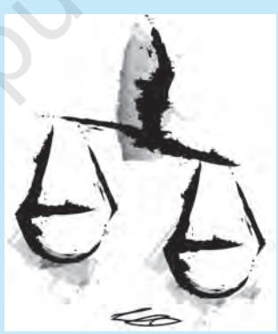
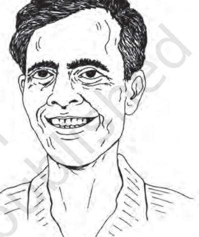
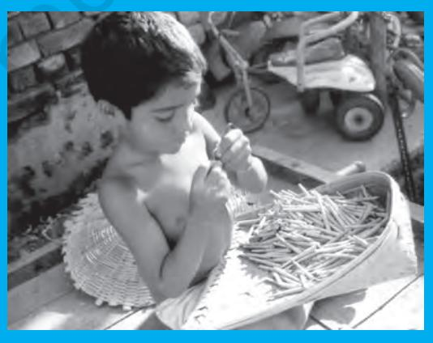
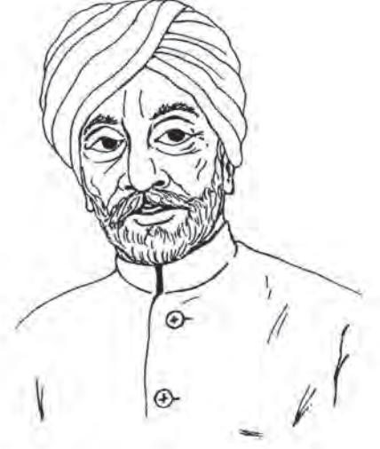
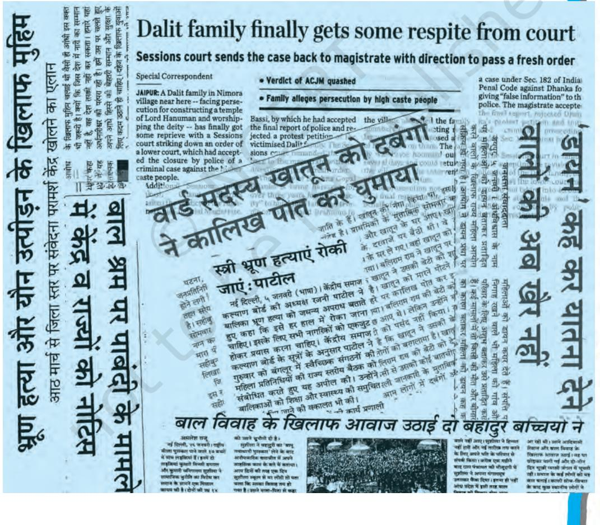

# Chapter Two RIGHTS IN THE INDIAN CONSTITUTION

*Indian Constitution at Work*

### INTRODUCTION

*A constitution is not only about the composition of the various organs of government and the relations among them. As we studied in the last chapter, the constitution is a document that sets limits on the powers of the government and ensures a democratic system in which all persons enjoy certain rights. In this chapter, we shall study the Fundamental Rights contained in the Indian Constitution. Part three of the Constitution of India lists the Fundamental Rights and also mentions the limits on these rights. In the past six decades, the scope of rights has changed and in some respects, expanded. After studying this chapter, you would know*

- ± *what are the various Fundamental Rights listed in the Constitution of India;*
- ± *how these rights are protected;*
- ± *what role the judiciary has played in protecting and interpreting these rights; and*
- ± *what is the difference between the Fundamental Rights and the Directive Principles of State Policy.*

#### THE IMPORTANCE OF RIGHTS

*In 1982 during the construction work for Asian Games the government engaged a few contractors. These contractors employed a large number of very poor construction workers from different parts of the country to build the flyovers and stadiums. These workers were kept in poor working conditions and were paid less than the minimum wages decided by the government.*

*A team of social scientists studied their poor condition and petitioned the Supreme Court. They argued that employing a person to work for less than the minimum prescribed wage amounts to* begar *or forced labour, which is a violation of the Fundamental Right against exploitation. The court accepted this plea and directed the government to ensure that thousands of workers get the prescribed wages for their work.*

*Machal Lalung was 23 when he was arrested. A resident of Chuburi village of Morigaon district of Assam, Machal was charged of causing grievous injuries. He was found mentally too unstable to stand trial and was sent as under trial to Lok Priya Gopinath Bordoloi Mental Hospital in Tejpur for treatment.*

*Machal was treated successfully and doctors wrote twice to jail authorities in 1967 and 1996 that he was fit to stand trial. But no one paid any attention. Machal Lalung remained in "judicial custody.''*

*Machal Lalung was released in July 2005. He was 77 then. He spent 54 years under custody during which his case never came up for hearing. He was freed when a team appointed by the National Human Rights Commission intervened after an inspection of undertrials in the State.*

Machal's entire life was wasted because a proper trial against him never took place. Our Constitution gives every citizen the right to 'life and liberty': this means that every citizen must also have the right to fair and speedy trial. Machal's case shows what happens when rights granted by the Constitution are not available in practice.

27

*What if Machal was a rich and powerful man? What if those working with the construction contractor were engineers? Would their rights have been violated?*

In the case of the first instance also there was violation of rights provided in the Constitution. But it was challenged in the court. As a result, workers could get what was due to them in the form of their rightful wages. The constitutional guarantee of the right against exploitation ensured justice to these workers.

#### Bill of Rights

Both these examples show the importance of having rights and of the actual implementation of these rights. A democracy must ensure that individuals have certain rights and that the government will always recognise these rights. Therefore it is often a practice in most democratic countries to list the rights of the citizens in the constitution itself. Such a list of rights mentioned and protected by the constitution is called the 'bill of rights'. A bill of rights prohibits government from thus acting against the rights of the individuals and ensures a remedy in case there is violation of these rights.

From whom does a constitution protect the rights of the individual? The rights of a person may be threatened by another person or private organisation. In such a situation, the individual would need the protection of the government. So, it is necessary that the government is bound to protect the rights of the individual. On the other hand, the organs of the government (the legislature, executive, bureaucracy or even the judiciary), in the course of their functioning, may violate the rights of the person.

#### FUNDAMENTAL RIGHTS IN THE INDIAN CONSTITUTION

During our freedom struggle, the leaders of the freedom movement had realised the importance of rights and demanded that the British rulers should respect rights of the people. The Motilal Nehru committee had demanded a bill of rights as far back as in 1928. It was therefore, natural that when India became independent and the Constitution was being prepared, there were no

*I get it! The bill of rights is like a warrantee card that we get when we purchase a TV or a fan. Isn't it?*

two opinions on the inclusion and protection of rights in the Constitution. The Constitution listed the rights that would be specially protected and called them 'fundamental rights'.

The word fundamental suggests that these rights are so important that the Constitution has separately listed them and made special provisions for their protection. The Fundamental Rights are so important that the Constitution itself ensures that they are not violated by the government.

Fundamental Rights are different from other rights available to us. While ordinary legal rights are protected and enforced by ordinary law, Fundamental Rights are protected and guaranteed by the constitution of the country. Ordinary rights may be changed by the legislature by ordinary process of law making, but a fundamental right may only be changed by amending the Constitution itself. Besides this, no organ of the government can act in a manner that violates them. As we shall study below in this chapter, judiciary has the powers and responsibility to protect the fundamental rights from violations by actions of the

#### *Bill of rights in the South African Constitution*

29

The South African Constitution was inaugurated in December 1996. Its creation and promulgation took place at a time when South Africa still faced the threat of a civil war after the dissolution of the Apartheid government. The South African Constitution says that its "Bill of Rights is a cornerstone of democracy in South Africa". It forbids discrimination on the grounds of "race, gender, pregnancy, marital status, ethnic or social origin, colour, age, disability, religion, conscience, belief, culture, language and birth". It grants perhaps the most extensive range of rights to the citizens. A special constitutional court enforces the rights enshrined in the constitution.

Some of the Rights included in the constitution of South Africa include:

- ± Right to Dignity
- ± Right to Privacy
- ± Right to fair labour practices
- ± Right to healthy environment and right to protection of environment
- ± Right to adequate housing
- ± Right to health care, food, water and social security
- ± Children's rights
- ± Right to basic and higher education
- ± Right of cultural, religious and linguistic communities
- ± Right to information

government. Executive as well as legislative actions can be declared illegal by the judiciary if these violate the fundamental rights or restrict them in an unreasonable manner. However, fundamental rights are not absolute or unlimited rights. Government can put reasonable restrictions on the exercise of our fundamental rights.

#### Check your progress

Compare the Fundamental Rights in the Indian Constitution with the Bill of Rights in the South African Constitution. Make a list of rights that are:

- ± Common to both the constitutions
- ± Available in South Africa but not in India
- ± Clearly granted in South Africa but implicit in the Indian Constitution

#### RIGHT TO EQUALITY

30

Consider the following two situations. These are imaginary situations. But similar things do happen and can happen. Do you think they involve violation of fundamental rights?

- ± *Swadesh Kumar is visiting his village. He is accompanied by one of his friends. They decided to have a cup of tea at the village roadside hotel. The shopkeeper knew Swadesh Kumar but asked the name of his friend to know his caste. After this the shopkeeper served tea to Swadesh Kumar in a nice mug while his friend was given tea in an earthen cup because he was dalit.*
- ± *An order is served to four newsreaders of a television channel that they would no longer read the news on screen. They are all women. The reason given is that they are above the age of forty-five. Two male newsreaders above the same age are not barred from presenting the news.*

#### Right to Equality

- √ Equality before law
	- equal protection of laws
- √ Prohibition of discrimination on grounds of religion, race, caste, sex or place of birth
	- equal access to shops, hotels, wells, tanks, bathing ghats, roads etc.
- √ Equality of opportunity in public employment
- √ Abolition of Untouchability
- √ Abolition of titles

#### Right to Freedom

- √ Protection of Right to
	- freedom of speech and expression;
	- assemble peacefully;
	- form associations/unions;
	- move freely throughout the territory of India;
	- reside and settle in any part of India;
	- practise any profession, or to carry on any occupation, trade or business.
- √ Protection in respect of conviction for offences
- √ Right to life and personal liberty
- √ Right to education
- √ Protection against arrest and detention in certain cases

#### Right against Exploitation

- √ Prohibition of traffic in human beings and forced labour
31

- √ Prohibition of employment of children in hazardous jobs
#### Right to Freedom of Religion

- √ Freedom of conscience and free profession, practice and propagation of religion
- √ Freedom to manage religious affairs
- √ Freedom to pay taxes for promotion of any particular religion
- √ Freedom to attend religious instruction or worship in certain educational institutions

#### Cultural and Educational Rights

- √ Protection of language, culture of minorities
- √ Right of minorities to establish educational institutions

#### Right to Constitutional Remedies

- √ Right to move the courts to issue directions/orders/writs for enforcement of rights

*Do such things really happen in our country? Or are these purely imaginary?*

32

These are examples of clear discrimination. In one instance the discrimination is based on caste and in another it is based on gender. Do you think that such discrimination is justified?

Right to equality tries to do away with such and other discriminations. It provides for equal access to public places like shops, hotels, places of entertainment, wells, bathing *ghats* and places of worship. There cannot be any discrimination in this access on the grounds only of religion, race, caste, sex, or place of birth. It also prohibits any discrimination in public employment on any of the above mentioned basis. This right is very important because our society did not practice equal access in the past.

The practice of untouchability is one of the crudest manifestations of inequality. This has been abolished under the right to equality. The same right also provides that the state shall confer no title on a person except those who excel themselves in military or academic field. Thus right to equality strives to make India a true democracy by ensuring a sense of equality of dignity and status among all its citizens.

Have you read the Preamble to our Constitution? How does it describe equality? You will find that the Preamble mentions two things about equality: equality

*Article 16 (4): Nothing in this article shall prevent the State from making any provision for the reservation of appointments or posts in favour of any backward class of citizens which, in the opinion of the State, is not adequately represented in the services under the State.*

of status and equality of opportunity. Equality of opportunity means that all sections of the society enjoy equal opportunities. But in a society where there are various kinds of social inequalities, what does equal opportunity mean? The Constitution clarifies that the government can implement special schemes and measures for improving the conditions of certain sections of society: children, women, and the socially and educationally backward classes. You may have heard about 'reservations' in jobs, and in admissions. You would have wondered why there are reservations if we follow the principle of equality. In fact Article 16(4) of the constitution explicitly clarifies that a policy like reservation will not be seen as a violation of right to equality. If you see the spirit of the Constitution, this is required for the fulfilment of the right to equality of opportunity.

#### YOU ARE THE JUDGE

You have received a postcard from Hadibandhu, who identifies himself as a "member of the dalit community" in Puri district in Odisha. Men from this community refused to follow a custom that required them to wash the feet of the groom and guests of the 'upper caste' during marriage ceremonies. In revenge, four women from this community were beaten up and another was paraded naked. The postcard writer says "Our children are educated and

33

they are not willing to do the customary job of washing the feet of upper caste men, clear the left-overs after the marriage feast and wash the utensils."

Assuming that the facts given above are correct, you have to decide: Does this case involve violation of Fundamental Rights? What would you order the government to do in this case?

*Article 21: Protection of life and personal liberty—No person shall be deprived of his life or personal liberty except according to procedure established by law.*

#### RIGHT TO FREEDOM

Equality and freedom or liberty, are the two rights that are most essential to a democracy. It is not possible to think of the one without thinking of the other. Liberty means freedom of thought, expression and action. However it does not mean freedom to do anything that one desires or likes. If that were to be permitted then a large number of people will not be able to enjoy their freedom. Therefore, freedoms are defined in such a manner that every person will enjoy her freedom *without* threatening freedom of others and *without* endangering the law and order situation.

#### Right to life and personal liberty

The foremost right among rights to freedom is the right to life and personal liberty. No citizen can be denied his or her life except by procedure as laid down under the law. Similarly no one can be denied his/her personal liberty. That means no one can be arrested without being told the grounds for such an arrest. If arrested, the person has the right to defend himself by a lawyer of his choice. Also, it is mandatory for the police to take that person to the nearest magistrate within 24 hours. The magistrate, who is not part of the police, will decide whether the arrest is justified or not.

This right is not just confined to a guarantee against taking away of an individual's life but has wider application. Various judgments of Supreme Court have expanded the scope of this right. The Supreme Court

*Does it mean that in some cases someone's life can be taken away by law? That sounds strange. Can you think of an example?*

has ruled that this right also includes right to live with human dignity, free from exploitation. The court has held that right to shelter and livelihood is also included in the right to life because no person can live without the means of living, that is, the means of livelihood.

#### Preventive detention

Ordinarily, a person would be arrested *after* he or she has reportedly committed some offence. However there are exceptions to this. Sometimes a person can be arrested simply out of an apprehension that he or she is likely to engage in unlawful activity and imprisoned for some time without following the above mentioned procedure. This is known as preventive detention. It means that if the government feels that a person can be a threat to law and order or to the peace and security of the nation, it can detain or arrest that person. This preventive detention can be extended only for three months. After three months such a case is brought before an advisory board for review.

On the face of it, preventive detention looks like an effective tool in the hands of the government to deal with anti-social elements or subversives. But this provision has often been misused by the government. Many people think that there must be greater safeguards in this law so that it may not be misused against people for reasons other than that which are really justified. In fact, there is a clear tension between right to life and personal liberty and the provision for preventive detention.

#### Other freedoms

You can see that under the right to freedom there are some other rights as well. These rights however are not absolute. Each of these is subject to restrictions imposed by the government.

For example right to freedom of speech and expression is subject to restrictions such as public order, peace and morality etc. Freedom to assemble too is to be exercised peacefully and without arms. The government may impose restrictions in certain areas declaring the assembly of five or more persons as unlawful. Such powers can be easily misused by the administration. The genuine protest against an act or policy of government by the people may be denied

36

permission. However, if the people are aware and vigilant in regard to their rights and choose to protest against such acts of administration such misuse becomes rare. In the Constituent Assembly itself, some members had expressed their dissatisfaction about restrictions on rights.

"I feel that many of these fundamental rights have been framed from the point of view of a police constable… you will find that very minimum rights have been conceded and are almost invariably followed by a proviso. Almost every article is followed by a proviso which takes away the right almost completely,...

…What should be our conception of fundamental rights?...We want to incorporate every one of those rights which our people want to get."

Somnath Lahiri CAD, Vol. III, p. 404, 29 April 1947

#### Rights of accused

Our Constitution ensures that persons accused of various offences would also get sufficient protection. We often tend to believe that anyone who is charged with some offence is guilty. However, no one is guilty unless the court has found that person guilty of an offence. It is also necessary that a person accused of any crime should get adequate opportunity to defend herself or himself. To ensure a fair trial in courts, the Constitution has provided three rights:

- ± no person would be punished for the same offence more than once,
- ± no law shall declare any action as illegal from a backdate, and
- ± no person shall be asked to give evidence against himself or herself.

#### Check your progress

Do you think that the following situations demand restrictions on right to freedom? Give reasons to support your answer.

- a. People have assembled for a peace march after communal riots in the city.
- b. Dalits are denied entry in a temple. A march is being organised to forcibly enter the temple.
- c. Hundreds of Adivasis blocked the road demanding that the land taken away from them for an industry be returned.
- d. A caste panchayat is meeting to decide the punishment to a young couple for marrying outside their caste.

# 37

#### RIGHT AGAINST EXPLOITATION

In our country there are millions of people who are underprivileged and deprived. They may be subjected to exploitation by their fellow human beings. One such form of exploitation in our country has been *begar* or forced labour without payment. Another closely related form of exploitation is buying and selling of human beings and using them as slaves. Both of these are prohibited under the Constitution. Forced labour was imposed by landlords, moneylenders and other wealthy persons in the past. Some form of bonded labour still continues in the country, specially in brick kiln work. It has now been declared a crime and it is punishable.

Name the fundamental rights whose violation is depicted in this photograph.

The Constitution also forbids employment of children below the age of 14 years in dangerous jobs like factories and mines. With child labour being made illegal and right to education becoming a fundamental right for children, this right against exploitation has become more meaningful.

#### RIGHT TO FREEDOM OF RELIGION

According to our Constitution, everyone enjoys the right to follow the religion of his or her choice. This freedom is considered as a hallmark of democracy. Historically, there were rulers and emperors in different parts of the world who did not allow residents of their countries to enjoy the right to freedom of religion. Persons following a religion different from that of the ruler were either persecuted or forced to convert to the official religion of the rulers. Therefore, democracy has always incorporated the freedom to follow the religion of one's choice as one of its basic principles.

#### Freedom of faith and worship

In India, everyone is free to choose a religion and practice that religion. Freedom of religion also includes the freedom of conscience. This means that a person may choose any religion or may choose not to follow any religion. Freedom of religion includes the freedom to profess, follow and propagate any religion. Freedom of religion is subject to certain limitations. The government can impose restrictions on the practice of freedom of religion in order to protect public order, morality and health. This means that the freedom of religion is not an unlimited right. The government can interfere in religious matters for rooting out certain social evils. For example in the past, the government has taken steps banning practices like sati, bigamy or human sacrifice. Such restrictions cannot be opposed in the name of interference in right to freedom of religion.

The limitations on the right to freedom of religion always produce tensions between followers of various religions and the government. When the government seeks to restrict some activities of any religious group, people of that religion feel that this is interference in their religion.

Freedom of religion becomes a matter of political controversy for yet another reason. The Constitution has guaranteed the right to propagate one's religion. This includes persuading people to

convert from one religion to another. However, some people resent conversions on the ground that these are based on intimidation or inducement. The Constitution does not allow forcible conversions. It only gives us the right to spread information about our religion and thus attract others to it.

#### Equality of all religions

Being a country which is home to several religions, it is necessary that the government must extend equal treatment to different religions. Negatively, it means that government will not favour any particular religion. India does not have any official religion. We don't have to belong to any particular religion in order to be a prime minister or president or judge or any other public official. We have also seen that under the right to equality, there is a guarantee that government will not discriminate on the basis of religion in giving employment. The institutions run by the state will not preach any religion or give religious education nor will they favour persons of any religion. The objective of these provisions is to sustain and nurture the principle of secularism.

#### *Activity*

Make a list of public religious activities that take place in your village or city.

Which of these involve an exercise of right to religious freedom?

Discuss what could have happened if this right was not available to people in your locality.

#### CULTURAL AND EDUCATIONAL RIGHTS

When we talk of the Indian society, the image of diversity comes before our minds. India is not made up of a monolithic society. We are a society that has vast diversity. In such a society that is full of diversity, there would be social sections which are small in numbers compared to some other groups. If a group is in minority, will it have to adopt the culture of the majority?

Our Constitution believes that diversity is our strength. Therefore, one of the fundamental rights is the right of the minorities to maintain their culture. This minority status is not dependent only

"A heavy responsibility would be cast on the majority to see that in fact the minorities feel secure. …the only safety for the minorities lies in a secular State. It pays them to be nationalists ...The majority community should not boast of their national outlook. ...They should try to place themselves in the position of the minorities and try to appreciate their fears. All demands for safeguards ...are the products of those fears that the minorities have in their minds, ...as regards their language, their script and also about the services."

> Sardar Hukam Singh CAD, VIII, p. 322, 26 May 1949

upon religion. Linguistic and cultural minorities are also included in this provision. Minorities are groups that have common language or religion and in a particular part of the country or in the country as a whole, they are outnumbered by some other social section. Such communities have a culture, language and a script of their own, and have the right to conserve and develop these.

All minorities, religious or linguistic, can set up their own educational institutions. By doing so, they can preserve and develop their own culture. The government will not, while granting aid to educational institutions, discriminate against any educational institution on the basis that it is under the management of minority community.

#### RIGHT TO CONSTITUTIONAL REMEDIES

One would agree that our Constitution contains a very impressive list of Fundamental Rights. But merely writing down a list of rights is not enough. There has to be a way through which they could be realised in practice and defended against any attack on these rights. Right to constitutional remedies is the means through which this is to be achieved. Dr. Ambedkar considered the right to constitutional remedies as 'heart and soul of the constitution'. It is so because this right gives a citizen the right to approach a High Court or the Supreme Court to get any of the fundamental rights restored in case of their violation. The Supreme Court and the High Courts can issue orders and give directives to the government for the enforcement of rights.

The courts can issue various special orders known as writs.

- ± Habeas corpus: A writ of habeas corpus means that the court orders that the arrested person should be presented before it. It can also order to set free an arrested person if the manner or grounds of arrest are not lawful or satisfactory.
- ± Mandamus: This writ is issued when the court finds that a particular office holder is not doing legal duty and thereby is infringing on the right of an individual.
- ± Prohibition: This writ is issued by a higher court (High Court or Supreme Court) when a lower court has considered a case going beyond its jurisdiction.
- ± Quo Warranto: If the court finds that a person is holding office but is not entitled to hold that office, it issues the writ of quo warranto and restricts that person from acting as an office holder.
- ± Certiorari: Under this writ, the court orders a lower court or another authority to transfer a matter pending before it to the higher authority or court.

Apart from the judiciary, many other mechanisms have been created in later years for the protection of rights. You may have heard about the National Commission on Minorities, the National Commission on Women, the National Commission on Scheduled Castes,

41

*I am in minority in my locality but majority in the town, minority if you look at my language but majority if you go by my religion… Aren't we all minorities?*

etc. These institutions protect the rights of women, minorities or Dalits. Besides, the National Human Rights Commission has also been established by law to protect the fundamental and other kinds of rights.

#### National Human Rights Commission (NHRC)

The real test of the rights given by any constitution is in their actual implementation. The poor, illiterate and the deprived sections of the society must be able to exercise their rights. Independent organisations like the People's Union for Civil Liberties (PUCL) or People's Union for Democratic Rights (PUDR) have been working as watchdogs against the violations of rights. In this background, the government has established in 1993 an institution, the National Human Rights Commission.

The National Human Rights Commission (NHRC) is composed of a former chief justice of the Supreme Court of India, a former judge of the Supreme Court, a former chief justice of a High Court and two other members who have knowledge and practical experience in matters relating to human rights.

The Commission's functions include inquiry at its own initiative or on a petition presented to it by a victim into complaint of violation of human rights; visit to jails to study the condition of the inmates; undertaking and promoting research in the field of human rights, etc.

The Commission receives complaints in thousands every year. These relate to custodial death, custodial rape, disappearances, police excesses, failure in taking action, indignity to women, etc. Its most significant intervention has been on disappeared youth in Punjab and investigation and trial of Gujarat riot cases where its intervention proved effective.

The Commission does not have the power of prosecution. It can merely make recommendations to the government or recommend to the courts to initiate proceedings based on the inquiry that it conducts.

For more details, visit http://www.nhrc.nic.in

#### DIRECTIVE PRINCIPLES OF STATE POLICY

The makers of our Constitution knew that independent India was going to face many challenges. Foremost among these was the challenge to bring about equality and well-being of all citizens. They also thought that certain policy direction was required for handling these problems. At the same time, the Constitution did not want future governments to be bound by certain policy decisions.

43

Therefore, some guidelines were incorporated in the Constitution but they were not made legally enforceable: this means that if a government did not implement a particular guideline, we cannot go to the court asking the court to instruct the government to implement that policy. Thus, these guidelines are 'non-justiciable' i.e., parts of the Constitution that cannot be enforced by the judiciary. Those who framed our Constitution thought that the moral force behind these guidelines would ensure that the government would take them seriously. Besides, they expected that the people would also hold the governments responsible for implementing these directives. So, a separate list of policy guidelines is included in the Constitution. The list of these guidelines is called the Directive Principles of State Policy.

#### What do the Directive Principles contain?

The chapter on Directive Principles lists mainly three things:

- ± the goals and objectives that we as a society should adopt;
- ± certain rights that individuals should enjoy apart from the Fundamental Rights; and
- ± certain policies that the government should adopt.

You may get some idea of the vision of makers of our Constitution by looking at some of the Directive Principles shown below.

The governments from time to time tried to give effect to some Directive Principles of State Policy. They passed several zamindari abolition bills, nationalised banks, enacted numerous factory laws, fixed minimum wages, cottage and small industries were promoted and provisions for reservation for the uplift of the scheduled castes and scheduled tribes were made. Such efforts to give effect to the

Directive Principles include the right to education, formation of panchayati raj institutions all over the country, partial right to work under employment guarantee programme and the mid-day meal scheme etc.

#### Fundamental Duties of citizens

- ± In 1976, the 42nd amendment to the Constitution was passed. Among other things, this amendment inserted a list of Fundamental Duties of Citizens. In all, ten duties were enumerated. However, the Constitution does not say anything about enforcing these duties.
- ± As citizens, we must abide by the Constitution, defend our country, promote harmony among all citizens, protect the environment.
- ± However, it must be noted that our Constitution does not make the enjoyment of rights dependent or conditional upon fulfilment of duties. In this sense, the inclusion of fundamental duties has not changed the status of our fundamental rights.

#### Check your progress

44

It is estimated that there are about three million urban homeless in India. Night shelters are not available for more than five per cent of this population. Hundreds of these old, sick homeless people are killed by cold wave during winter. They cannot have ration and voting cards in the absence of any 'proof of residence'. Without these documents they also cannot avail government help as needy patients. A large number of these homeless people are casual workers, who earn very low wages. They travel to the city in search of work from different parts of the country.

Use these facts to write a petition to the Supreme Court of India under the Right to Constitutional Remedies. Your petition should mention:

- a. What Fundamental Rights are being denied to the homeless in their everyday life?
- b. What kind of order would you request the Supreme Court to issue?

#### RELATIONSHIP BETWEEN FUNDAMENTAL RIGHTS AND DIRECTIVE PRINCIPLES

It is possible to see both Fundamental Rights and Directive Principles as complementary to each other. Fundamental Rights restrain the government from doing certain things while Directive

# DIRECTIVE PRINCIPLES

#### *Goals*

Welfare of the people; Social, economic and political justice;

Raising the standard of living; equitable distribution of resources;

Promotion of international peace

#### Policies

Uniform civil code;

Prohibition of consumption of alcoholic liquor;

Promotion of cottage industries;

Prevention of slaughter of useful cattle;

Promotion of village panchayats

#### Non-justiciable rights

Adequate livelihood;

Equal pay for equal work for men and women;

Right against economic exploitation;

Right to work;

Early childhood care and education to children below the age of six years

*Tell me what is the point of saying nice things in the Constitution if these cannot be implemented by any court?*

45

Principles exhort the government to do certain things. Fundamental Rights mainly protect the rights of individuals while directive principles ensure the well-being of the entire society.

However, at times, when government intends to implement Directive Principles of State Policy, it can come in conflict with the Fundamental Rights of the citizen.

This problem arose when the government sought to pass laws to abolish zamindari system. These measures were opposed on the ground that they violated right to property. However, keeping in mind the societal needs that are greater than the individual interests, the government amended the Constitution to give effect to the Directive Principles of State Policy. This led to a long legal battle. The executive and the judiciary took different positions. The government claimed that rights can be abridged for giving effect to Directive Principles. This argument assumed that rights were a hindrance to welfare of the people. On the other hand, the court held the view that Fundamental Rights were so important and sacred that they cannot be limited even for purposes of implementing Directive Principles.

#### Right to Property

Behind the controversy about the relationship between rights and directive principles, there was one important reason: in the Constitution, originally, there was a fundamental right to 'acquire, possess and maintain' property. But the Constitution made it clear that property could be taken away by the government for public welfare. Since 1950, government made many laws that limited this right to property. This right was at the centre of the long debate over the relationship between rights and directive principles. Finally, in 1973, the Supreme Court gave a decision that the right to property was not part of the basic structure of the Constitution and therefore, parliament had power to abridge this right by an amendment. In 1978, the 44th amendment to the Constitution removed the right to property from the list of Fundamental Rights and converted it into a simple legal right under article 300 A.

What difference, do you think, this change of status makes to the right to property?

This generated another complicated debate. This related to the amendment of the Constitution. The government was saying that Parliament can amend any part of the Constitution. The court was saying that Parliament cannot make an amendment that violated Fundamental Rights. This controversy was settled by an important decision of the Supreme Court in Kesavananda Bharati case. In this case, the court said that there are certain basic features of the Constitution and these cannot be changed by Parliament. We shall discuss this in greater detail in Chapter 9 on 'Constitution as a Living Document'.

47

#### Check your progress

Read the main points of the Bill of Rights in the South African Constitution and the Directive Principles in India. Which are the common points in the two lists? Why did the South African Constitution put these in the Bill of Rights?

If you were writing the constitution for a new country, what would you suggest?

#### Conclusion

In the writings of Jotirao Phuley (1827-1890), a radical social reformer from Maharashtra, we find one of the earliest expressions of the view that rights include both freedom and equality. During the national movement, this idea of rights was further sharpened and expanded to constitutional rights. Our Constitution reflected this long tradition and listed the fundamental rights. Since 1950, the judiciary has functioned as an important protector of rights.

Judicial interpretations have expanded the scope of rights in many respects. The government and administration of our country function within this overall framework. Rights enforce limitations on the functioning of the government and ensure democratic governance of the country.

48

## Exercises

- 1. Write true or false against each of these statements:
	- a) A Bill of Rights lays down the rights enjoyed by the people of a country.

49

- b) A Bill of Rights protects the liberties of an individual.
- c) Every country of the world has a Bill of Rights.
- d) The Constitution guarantees remedy against violation of Rights.
- 2. Which of the following is the best description of Fundamental Rights?
	- a) All the rights an individual should have.
	- b) All the rights given to citizens by law.
	- c) The rights given and protected by the Constitution.
	- d) The rights given by the Constitution that cannot ever be restricted.
- 3. Read the following situations. Which Fundamental Right is being used or violated in each case and how?
	- a) Overweight male cabin crew are allowed to get promotion in the national airlines but their women colleagues who gain weight are penalised.
	- b) A director makes a documentary film that criticises the policies of the government.
	- c) People displaced by a big dam take out a rally demanding rehabilitation.
	- d) Andhra society runs Telugu medium schools outside Andhra Pradesh.
- 4. Which of the following is a correct interpretation of the Cultural and Educational Rights?
	- a) Only children belonging to the minority group that has opened educational institution can study there.
	- b) Government schools must ensure that children of the minority group will be introduced to their belief and culture.
	- c) Linguistic and religious minorities can open schools for their children and keep it reserved for them.
	- d) Linguistic and religious minorities can demand that their children must not study in any educational institution except those managed by their own community.
- 5. Which of the following is a violation of Fundamental Rights and why?
	- a) Not paying minimum wages
	- b) Banning of a book
	- c) Banning of loudspeakers after 9 pm.
	- d) Making a speech

50

- 6. An activist working among the poor says that the poor don't need Fundamental Rights. What they need are Directive Principles to be made legally binding. Do you agree with this? Give your reasons.
- 7. Several reports show that caste groups previously associated with scavenging are forced to continue in this job. Those in positions of authority refuse to give them any other job. Their children are discouraged from pursuing education. Which of their Fundamental Rights are being violated in this instance?
- 8. A petition by a human rights group drew attention of the court to the condition of starvation and hunger in the country. Over five crore tonnes of food grains was stored in the godowns of the Food Corporation of India. Research shows that a large number of ration cardholders do not know about the quantity of food grains they can purchase from fair price shops. It requested the court to order the government to improve its public distribution system.
	- a. Which different rights does this case involve? How are these rights interlinked?
	- b. Should these rights form part of the right to life?
- 9. Read the statement by Somnath Lahiri in the Constitutent Assembly quoted in this chapter. Do you agree with him? If yes, give instances to prove it. If not, give arguments against his position.
- 10. Which of the Fundamental Rights is in your opinion the most important right? Summarise its provisions and give arguments to show why it is most important.

