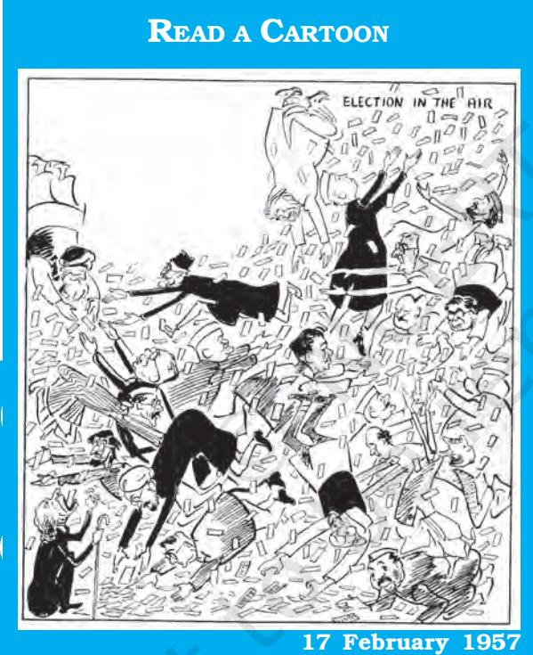
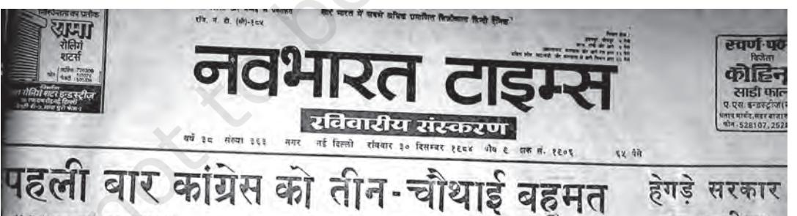
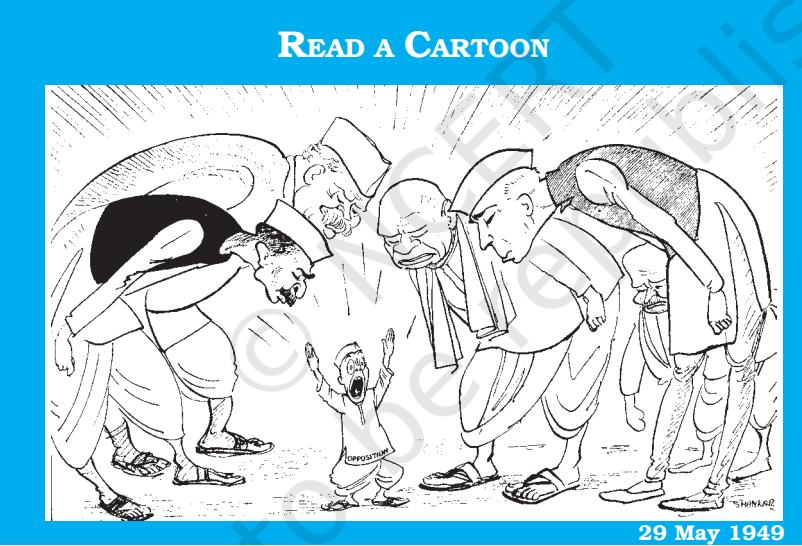
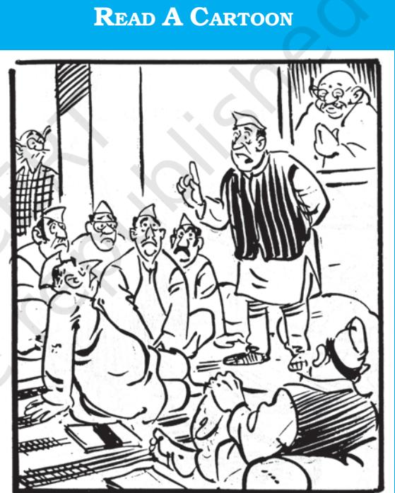
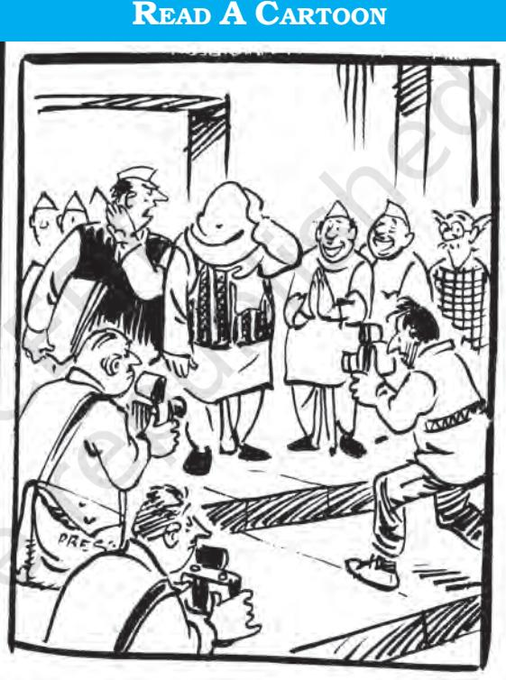
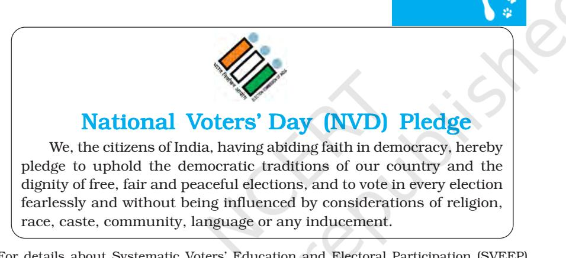
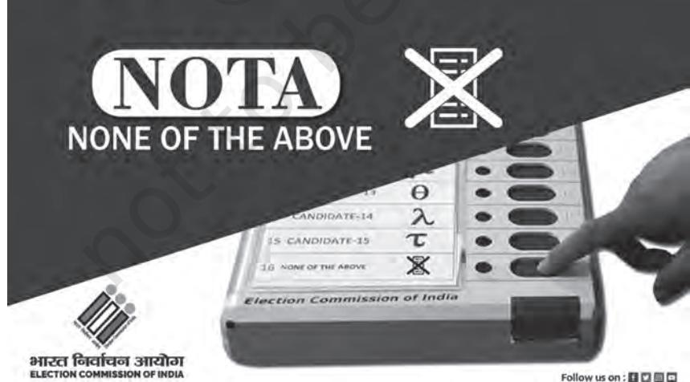

# Chapter Three ELECTION AND REPRESENTATION

*Chapter 3: Election and Representation*

51

## INTRODUCTION

*Have you ever played chess? What would happen if the black knight suddenly started moving straight rather than two and a half squares? Or, what would happen if in a game of cricket, there were no umpires? In any sport, we need to follow certain rules. Change the rules and the outcome of the game would be very different. Similarly a game needs an impartial umpire whose decision is accepted by all the players. The rules and the umpire have to be agreed upon before we begin to play a game. What is true of a game is also true of elections. There are different rules or systems of conducting elections. The outcome of the election depends on the rules we have adopted. We need some machinery to conduct the elections in an impartial manner. Since these two decisions need to be taken before the game of electoral politics can begin, these cannot be left to any government. That is why these basic decisions about elections are written down in the constitution of a democratic country.*

*In this chapter we shall study the constitutional provisions regarding elections and representation. We shall focus on the importance of the method of election chosen in our Constitution and the implications of the constitutional provisions regarding impartial machinery for conducting elections. We shall also look at some suggestions for amending the constitutional provisions in this respect. After reading this chapter, you would understand:*

± *different methods of election;*

- ± *the characteristics of the system of election adopted in our country;*
- ± *the importance of the provisions for free and fair elections; and*
- ± *the debate on electoral reforms.*

## ELECTIONS AND DEMOCRACY

Let us begin by asking ourselves two simple questions about elections and democracy.

- ± Can we have democracy without holding elections?
- ± Can we hold elections without having democracy?

Let us have a discussion in the classroom on both these questions by using examples from whatever we have learnt so far in the previous classes.

They say elections are carnival of democracy. But this cartoon depicts chaos instead. Is this true of elections always? Is it good for democracy?

The first question reminds us of the necessity of representation in a large democracy. All citizens cannot take direct part in making every decision. Therefore, representatives are elected by the people. This is how elections become important. Whenever we think of India as a democracy, our mind invariably turns to the last elections. Elections have today become the most visible symbol of the democratic process. We often distinguish between direct and indirect democracy. A direct democracy is one where the citizens directly participate in the day-to-day decisionmaking and in the running of the government. The ancient city-states in Greece were considered examples of direct democracy. Many would consider local governments, especially gram sabhas, to be the closest examples of direct

52

democracy. But this kind of direct democracy cannot be practiced when a decision has to be taken by lakhs and crores of people. That is why rule by the people usually means rule by people's representatives.

In such an arrangement citizens choose their representatives who, in turn, are actively involved in governing and administering the country. The method followed to choose these representatives is referred to as an election. Thus, the citizens have a limited role in taking major decisions and in running the administration. They are not very actively involved in making of the policies. Citizens are involved only indirectly, through their elected representatives. In this arrangement, where all major decisions are taken by elected representatives, the method by which people elect their representatives becomes very important.

The second question reminds us of the fact that not all elections are democratic. A large number of nondemocratic countries also hold elections. In fact nondemocratic rulers are very keen to present themselves as democratic. They do so by holding election in such a way that it does not threaten their rule. Can you think of some examples of such non-democratic elections? What do you think would distinguish a democratic from a nondemocratic election? What can be done to ensure that elections in a country would be conducted in a democratic way?

This is where constitution comes in. The constitution of a democratic country lays down some basic rules about elections. The details are usually left to be worked out by laws passed by the legislatures. These basic rules are usually about

- ± Who is eligible to vote?
- ± Who is eligible to contest?
- ± Who is to supervise elections?
- ± How do the voters choose their representatives?
- ± How are the votes to be counted and representatives elected?

*What is the need of writing these rules in the constitution? Why can't these be decided by the Parliament? Or by all the parties before every election?*

53

Like most democratic constitutions, the Constitution of India answers all these questions. As you can see, the first three questions are about ensuring that elections are free and fair and can thus be called democratic. The last two questions are about ensuring a fair representation. In this chapter you will consider both these aspects of the Constitutional provisions about elections.

#### *Activity*

Collect newspaper clippings about elections in India and any other country. Classify the clippings in the following categories:

- a. System of representation
- b. Voter eligibility
- c. Role of the Election Commission. If you have access to internet, visit the websites of the Election Commission of India, https://eci.gov.in, and ACE project, The Electoral Knowledge Network, http://aceproject.org and collect the information mentioned above for at least four countries.

## ELECTION SYSTEM IN INDIA

You may have noted above a reference to different methods or the systems of elections. You may have wondered what these were all about. You may have seen or read about different methods of electioneering or campaigning in the elections. But what are different methods of elections? There is a system of conducting elections. There are authorities and rules about do's and don'ts. Is that what election system is all about? You may have wondered why the constitution needs to write down how the votes are to be counted and representatives elected. Isn't that very obvious? People go and vote. The candidate who gets highest votes gets elected. That is what elections are all over the world. Why do we need to think about it?

We need to, because this question is not as simple as it appears to us. We have got so used to our system of elections that we think that there cannot be any other way. In a democratic election, people vote and their preference decides who will win the contest. But there

## *Activity*

Hold mock elections in your class to elect four class representatives. Hold the election in three different ways:

- ± Each student can give one vote. The four highest vote getters are elected.
- ± Each student has four votes and can give them all to one candidate or split the votes among different candidates. The four highest vote getters are elected.
- ± Each voter gives a preference ranking to candidates and the counting follows the method of election of Rajya Sabha members described below.

Did the same four persons win the election in each of these methods? If not, what was the difference? Why?

can be very different ways in which people make their choices and very different ways in which their preferences can be counted. These different rules of the game can make a difference to who the winner of the game will be. Some rules can favour bigger parties; some rules can help the smaller players. Some rules can favour the majority community, others can protect the minorities. Let us look at one dramatic instance to see how this happens.

#### First Past the Post System

Look at the newspaper clipping.

2024-25

55

*Less than 50 per cent votes and more than 80 per cent seats! Isn't that unfair? How could our Constitution makers accept such an unfair system?*

56

It talks of one historic moment in India's democracy. In the Lok Sabha elections of 1984, the Congress party came to power winning 415 of the 543 Lok Sabha seats – more than 80% of the seats. Such a victory was never achieved by any party in the Lok Sabha. What did this election show?

The Congress party won four-fifths of the seats. Does it mean that four out of five Indian voters voted for the Congress party? Actually not. Take a look at the enclosed table. The Congress party got 48% of the votes. This means that only 48% of those who voted, voted in favour of the candidates put up by the Congress party, but the party still managed to win more than 80% of the seats in the Lok Sabha. Look at the performance of other parties. The BJP got 7.4 per cent votes but less than one per cent seats. How did that happen?

Votes and seats won by some major parties

|  | in Lok Sabha Election of 1984 |  |
| --- | --- | --- |
| Party | Votes (%) | Seats |
| Congress | 48.0 | 415 |
| BJP | 7.4 | 2 |
| Janata | 6.7 | 10 |
| Lok Dal | 5.7 | 3 |
| CPI (M) | 5.7 | 22 |
| Telugu Desam | 4.1 | 30 |
| DMK | 2.3 | 2 |
| AIADMK | 1.6 | 12 |
| Akali Dal | 1.0 | 7 |
| AGP | 1.0 | 7 |

This happened because in our country we follow a special method of elections. Under this system:

- ± The entire country is divided into 543 constituencies;
- ± Each constituency elects one representative; and
- ± The candidate who secures the highest number of votes in that constituency is declared elected. It is important to note that in this system whoever has

more votes than all other candidates, is declared elected. The winning candidate need not secure a majority of the votes. This method is called the First Past the Post (FPTP) system. In the electoral race, the candidate who is ahead of others, who crosses the winning post first of all, is the winner. This method is also called the Plurality System. This is the method of election prescribed by the Constitution.

Let us now go back to our example. The Congress party won greater share of seats than its share of votes because in many of the constituencies in which its candidates won, they secured less than 50% of the votes. If there are several candidates, the winning candidate often gets much less than 50% of the votes. The votes that go to all the losing candidates go 'waste', for those candidates or parties get no seat from those votes. Suppose a party gets only 25 per cent of the votes in every constituency, but everyone else gets even less votes. In that case, the party could win all the seats with only 25 per cent votes or even less.

#### Proportional Representation

Let us compare this to how elections take place in Israel that follows a very different system of elections. In Israel once the votes are counted, each party is allotted the share of seats in the parliament in proportion to its share of votes (see Box). Each party fills its quota of seats by picking those many of its nominees from a preference list that has been declared before the elections. This system of elections is called the Proportional Representation (PR) system. In this system a party gets the same proportion of seats as its proportion of votes.

In the PR system there could be two variations. In some countries, like Israel or Netherlands, the entire country is treated as one constituency and seats are allocated to each party according to its share of votes in the national election. The other method is when the country is divided into several multi-member

*This is very confusing! How do I know who is my MP or my MLA in this system? Who would I go to if I have any work?*

57

constituencies as in Argentina and Portugal. Each party prepares a list of candidates for each constituency, depending on how many have to be elected from that constituency. In both these variations, voters exercise their preference for a party and not a candidate. The seats in a constituency are distributed on the basis of votes polled by a party. Thus, representatives from a constituency, would and do belong to different parties. In India, we have adopted PR system

## Proportional Representation in Israel

Israel follows proportional representation system of election. Elections to the legislature (Knesset) take place every four years. Every party declares a list of its candidates, but voters vote for the party and not for the candidates. A party gets seats in the legislature in proportion to the votes polled by it. This allows even smaller parties with very small support base to get representation in the legislature. (A party must get a minimum of 3.25% votes to be eligible to get seats in the legislature.) This often leads to a multi-party coalition government.

The following table shows the result of the 2015 elections to the Knesset. Based on this, you can find out what percentage of seats various parties got in that election.

| Name of List (Party) | % of total | Number of | % of total |
| --- | --- | --- | --- |
|  | votes | seats | seats |
| Likud | 23.40 | 30 |  |
| Zionist Camp | 18.67 | 24 |  |
| Joint List (Hadash, National Democratic Assembly, Arab Movement for Renewal, United Arab List) | 10.61 | 13 |  |
| Yesh Atid | 8.82 | 11 |  |
| Kulanu | 7.49 | 10 |  |
| Habayit Hayehudi | 6.74 | 8 |  |
| Shas | 5.74 | 7 |  |
| Yisrael Beitenu | 5.10 | 6 |  |
| United Torah Judaism | 4.99 | 6 |  |
| 58 Israel's Left | 3.93 | 5 |  |
| Other Parties | 4.51 | 0 |  |
| Total | 100 | 120 |  |

on a limited scale for indirect elections. The Constitution prescribes a third and complex variation of the PR system for the election of President, Vice President, and for the election to the Rajya Sabha and Vidhan Parishads.

59

| Comparison of FPTP and PR system of election |  |
| --- | --- |
| FPTP | PR |
| The country is divided | Large geographical areas |
| into small geographical | are demarcated as |
| units called constituencies | constituencies. The entire |
| or districts | country may be a single |
|  | constituency |
| Every constituency elects | More than one |
| one representative | representative may be |
|  | elected from one |
|  | constituency |
| Voter votes for a candidate | Voter votes for the party |
| A party may get more seats | Every party gets seats in the |
| than votes in the legislature | legislature in proportion to |
|  | the percentage of votes |
|  | that it gets |
| Candidate who wins the | Candidate who wins the |
| election may not get | elections gets majority of |
| majority (50%+1) votes | votes. |
| Examples: U.K., India | Examples: Israel, |
|  | Netherlands |

+1

#### How does PR work in Rajya Sabha elections

A third variant of PR, the Single Transferable Vote system (STV), is followed for Rajya Sabha elections. Every State has a specific quota of seats in the Rajya Sabha. The members are elected by the respective State legislative assemblies. The voters are the MLAs in that State. Every voter is required to rank candidates according to her or his preference. To be declared the winner, a candidate must secure a minimum quota of votes, which is determined by a formula:

#### Total votespolled

 Total number of candidates to be elected +1

For example if 4 Rajya Sabha members have to be elected by the 200 MLAs in Rajasthan, the winner would require (200/4+1= 40+1) 41 votes. When the votes are counted it is done on the basis of first preference votes secured by each candidate, of which the candidate has secured the first preference votes. If after the counting of all first preference votes, required number of candidates fail to fulfil the quota, the candidate who secured the lowest votes of first preference is eliminated and his/her votes are transferred to those who are mentioned as second preference on those ballot papers. This process continues till the required number of candidates are declared elected.

#### Why did India adopt the FPTP system?

60

The answer is not very difficult to guess. If you have carefully read the box explaining the Rajya Sabha elections, you would have noticed that it is a complicated system which may work in a small country, but would be difficult to work in a sub-continental country like India. The reason for the popularity and success of the FPTP system is its simplicity. The entire election system is extremely simple to understand even for common voters who may have no specialised

knowledge about politics and elections. There is also a clear choice presented to the voters at the time of elections. Voters have to simply endorse a candidate or a party while voting. Depending on the nature of actual politics, voters may either give greater importance to the party or to the candidate or balance the two. The FPTP system offers voters a choice not simply between parties but specific candidates. In other electoral systems, especially PR systems, voters are often asked to choose a party and the representatives are elected on the basis of party lists. As a result, there is no one representative who represents and is responsible for one locality. In constituency based system like the FPTP, the voters know who their own representative is and can hold him or her accountable.

These members of the ruling party are trying to listen to the 'tiny' opposition! Was this the effect of our electoral system?

More importantly, the makers of our Constitution also felt that PR based election may not be suitable for giving a stable government in a parliamentary system. We shall study the nature of parliamentary system of executive in the next chapter. This system requires that the executive has majority in the legislature. You will notice that the PR system may not produce a clear majority because seats in the legislature would be divided on the basis of share of votes. The FPTP

#### Check your progress

Here are the results of the Tamil Nadu Assembly Election held in 2016.

- ± What would be the composition of the Assembly if it was a PR system like in Israel?
- ± Which party would have a majority?
- ± Who would form the government?
- ± What would be the effect of this system on the relationship of political parties?

| Total Seats: 234 (Election held in 232) |  |  |  |
| --- | --- | --- | --- |
| Party | % of total | Number of | Seats in PR |
|  | votes | seats |  |
| AIADMK | 40.77 | 135 |  |
| DMK | 31.64 | 88 |  |
| INC | 6.42 | 8 |  |
| PMK | 5.32 | 0 |  |
| BJP | 2.84 | 0 |  |
| DMDK | 2.39 | 0 |  |
| CPI | 0.79 | 0 |  |
| IUML | 0.73 | 1 |  |
| Others Parties | 6.37 | 0 |  |
| Independents | 1.43 | 0 |  |
| NOTA | 1.30 | – |  |

system generally gives the largest party or coalition some extra bonus seats, more than their share of votes would allow. Thus this system makes it possible for parliamentary government to function smoothly and effectively by facilitating the formation of a stable government. Finally, the FPTP system encourages voters from different social groups to come together to win an election in a locality. In a diverse country like India, a PR system would encourage each community to form its own nation-wide party. This may also have been at the back of the mind of our constitution makers.

The experience of the working of the Constitution has confirmed the expectation of the constitution makers. The FPTP system has proved to be simple and familiar to ordinary voters. It has helped larger parties to win clear majorities at the centre and the State level. The system has also discouraged political parties that get all their

62

votes only from one caste or community. Normally, the working of the FPTP system results in a two-party system. This means that there are two major competitors for power and power is often shared by these two parties alternately. It is difficult for new parties or the third party to enter the competition and share power. In this respect, the experience of FPTP in India is slightly different. After independence, though we adopted the FPTP system, there emerged a one party dominance and along with it, there existed many smaller parties. After 1989, India is witnessing the functioning of the multiparty coalitions. At the same time, gradually, in many States, a twoparty competition is emerging. But the distinguishing feature of India's party system is that the rise of coalitions has made it possible for new and smaller parties to enter into electoral competition in spite of the FPTP system.

## RESERVATION OF CONSTITUENCIES

We have noticed that in the FPTP election system, the candidate who secures the highest votes in a particular constituency is declared elected. This often works to the disadvantage of the smaller social groups. This is even more significant in the Indian social context. We have had a history of caste-based discrimination. In such a social system, the FPTP electoral system can mean that the dominant social groups and castes can win everywhere and the oppressed social groups may continue to remain unrepresented. Our Constitution makers were aware of this difficulty and the need to provide a way to ensure fair and just representation to the oppressed social groups.

This issue was debated even before independence and the British government had introduced 'separate electorates'. This system meant

> "Separate electorates have been a curse to India, have done incalculable harm to this country… Separate electorates have barred our progress… We (Muslims) want to merge in the nation. ...for God's sake keep your hands off reservation for the Muslim community."

Tajamul Husain, CAD, Vol. VIII, p. 333, 26 May 1949

that for electing a representative from a particular community, only those voters would be eligible who belong to that community. In the Constituent Assembly, many members expressed a fear that this will not suit our purposes. Therefore, it was decided to adopt the system of reserved constituencies. In this system, all voters in a constituency are eligible to vote but the candidates must belong to only a particular community or social section for which the seat is reserved.

There are certain social groups which may be spread across the country. In a particular constituency, their numbers may not be sufficient to be able to influence a victory of a candidate. However, taken across the country they are a significantly sizeable group. To ensure their proper representation, a system of reservation becomes necessary. The Constitution provides for reservation of seats in the Lok Sabha and State Legislative Assemblies for the Scheduled Castes and Scheduled Tribes. This provision was made initially for a period of 10 years and as a result of successive constitutional amendments, has been extended up to 2030. The Parliament can take a decision to further extend it, when the period of reservation expires. The number of seats reserved for both of these groups is in proportion to their share in the population of India. Of the 543 elected seats in the Lok Sabha, 84 are reserved for Scheduled Castes and 47 are reserved for Scheduled Tribes (as on 26 January 2019).

> "…But I have come to say a few words on behalf of the Adivasis of India…. In the past, thanks to the major political parties, thanks to the British Government and thanks to every enlightened Indian citizen, we have been isolated and kept, as it were, in a zoo. ...We are willing to mix with you, and it is for that reason, ..., that we have insisted on a reservation of seats as far as the Legislatures are concerned. We have not asked ...(for) separate electorates; ...Under the 1935 Act, throughout the Legislatures in India, there were altogether only 24 Adivasi MLAs out of a total of 1585, …and not a single representative at the Centre."

Jaipal Singh, CAD, Vol. V, pp. 209-210, 27 August 1947

64

Who decides which constituency is to be reserved? On what basis is this decision taken? This decision is taken by an independent body called the Delimitation Commission. The Delimitation Commission is appointed by the President of India and works in collaboration with the Election Commission of India. It is appointed for the purpose of drawing up the boundaries of constituencies all over the country. A quota of constituencies to be reserved in each State is fixed depending on the proportion of SC or ST in that State. After drawing the boundaries, the Delimitation Commission looks at the composition of population in each constituency. Those constituencies that have the highest proportion of Scheduled Tribe population are reserved for ST. In the case of Scheduled Castes, the Delimitation Commission looks at two things. It picks constituencies that have higher proportion of Scheduled Caste population. But it also spreads these constituencies in different regions of the State. This is done because the Scheduled Caste population is generally spread evenly throughout the country. These reserved constituencies can be rotated each time the Delimitation exercise is undertaken.

The Constitution does not make similar reservation for other disadvantaged groups. Of late there has been a strong demand seeking reservation of seats in the Lok Sabha and State Assemblies for women. Given the fact that very few women are elected to representative bodies, the demand for reserving one-third seats for women is increasingly being articulated. Reservation of seats for women has been provided for in rural and urban local bodies. We shall discuss this in the chapter on Local Governments. A similar provision for Lok Sabha and Vidhan Sabhas would require an amendment to the Constitution. Such an amendment has been proposed several times in the Parliament but has not yet been passed.

## FREE AND FAIR ELECTIONS

The true test of any election system is its ability to ensure a free and fair electoral process. If we want democracy to be translated into reality on the ground, it is important that the election system is impartial and transparent. The system of election must also allow the aspirations of the voter to find legitimate expression through the electoral results.

65

## Check your progress

The proportion of Muslims in the population of India is about 14.2 per cent. But the number of Muslim MPs in the Lok Sabha has usually been less than 6 per cent, less than half of their share in population. A similar situation prevails in most State Assemblies. Three students drew different conclusions from this fact. Write down whether and why you agree or disagree with each of them.

Hilal: This demonstrates the unfairness of the FPTP system. We should have opted for PR system.

Arif: This shows the wisdom of granting reservations to SC and ST. What is needed is a reservation of seats for Muslims on the same lines as for SC and ST.

Saba: There is no point in talking about Muslims as a whole. Muslim women are not going to get any share in any of these systems. We need a separate quota for Muslim women.

## Universal franchise and right to contest

Apart from laying down a method of elections, the Constitution answers two basic questions about elections: Who are the voters? Who can contest elections? In both these respects our Constitution follows the well established democratic practices.

You already know that democratic elections require that all adult citizens of the country must be eligible to vote in the elections. This is known as universal adult franchise. In many countries, citizens had to fight long battles with the rulers to get this right. In many countries, women could get this right very late and only after struggle. One of the important decisions of the framers of the Indian Constitution was to guarantee every adult citizen in India, the right to vote.

Till 1989, an adult Indian meant an Indian citizen above the age of 21. An amendment to the Constitution in 1989, reduced the eligibility age to 18. Adult franchise ensures that all citizens are able to participate in the

*Am I or am I not an adult? I am mature enough to choose my future career, old enough to get a driving license, but not old enough to vote! If laws can apply to me, why can't I decide on who makes those laws?*

process of selecting their representative. This is consistent with the principle of equality and non-discrimination that we studied in the chapter on rights. Many people thought and many think so today

that giving the right to vote to everyone irrespective of educational qualification was not right. But our Constitution makers had a firm belief in the ability and worth of all adult citizens as equals in the matter of deciding what is good for the society, the country and for their own constituencies.

What is true of the right to vote is also true of right to contest election. All citizens have the right to stand for election and become the representative of the people. However, there are different minimum age requirements for contesting elections. For example, in order to stand for Lok Sabha or Assembly election, a candidate must be at least 25 years old. There are some other restrictions also. For instance, there is a legal provision that a person who has undergone imprisonment for two or more years for some offence is disqualified from contesting elections. But there are no restrictions of income, education or class or gender on the right to contest elections. In this sense, our system of election is open to all citizens.

READ A CARTOON 21 October 1951

67

Shankar. Copyright: Children's Book Trust.

Why is universal adult franchise compared to an elephant? Is it unmanageable? Or is it like the story in which everyone describes the elephant only by its parts?

## Independent Election Commission

Several efforts have been made in India to ensure the free and fair election system and process. The most important among these is the

creation of an independent Election Commission to 'supervise and conduct' elections. Do you know that in many countries, there is an absence of an independent mechanism for conducting elections?

#### *Article 324: (1)*

*The superintendence, direction and control of the preparation of the electoral rolls for, and the conduct of, all elections to Parliament and to the Legislature of every State and of elections to the offices of President and Vice-President held under this Constitution shall be vested in a Commission (referred to in this Constitution as the Election Commission).*

Article 324 of the Indian Constitution provides for an independent Election Commission for the 'superintendence, direction and control of the electoral roll and the conduct of elections' in India. These words in the Constitution are very important, for they give the Election Commission a decisive role in virtually everything to do with elections. The Supreme Court has agreed with this interpretation of the Constitution.

To assist the Election Commission of India there is a Chief Electoral Officer in every state. The Election Commission is not responsible for the conduct of local body elections. As we shall study in the chapter on Local Government, the State Election Commissioners work independently of the Election Commission of India and each has its own sphere of operation.

The Election Commission of India can either be a single member or a multi-member body. Till 1989, the Election Commission was single member. Just before the 1989 general elections, two Election Commissioners were appointed, making the body multi-member. Soon after the elections, the Commission reverted to its single member status. In 1993, two Election Commissioners were once again appointed and the Commission became multi-member and has remained multi-member since then. Initially there were many apprehensions about a multi-member Commission. There was a sharp difference of opinion between the then Chief Election

Commissioner and the other Commissioners about who had how much power. The matter had to be settled by the Supreme Court. Now there is a general consensus that a multi-member Election Commission is more appropriate as power is shared and there is greater accountability.

The Chief Election Commissioner (CEC) presides over the Election Commission, but does not have more powers than the other Election Commissioners. The CEC and the two Election Commissioners have equal powers to take all decisions relating to elections as a collective body. They are appointed by the President of India on the advice of the Council of Ministers. It is therefore possible for a ruling party to appoint a partisan person to the Commission who might favour them in the elections. This fear has led many to suggest that this procedure should be changed. Many persons have suggested that a different method should be followed that makes consultation with the leader of opposition and the Chief Justice of India necessary for the appointment of CEC and Election Commissioners.

The Constitution ensures the security of the tenure of the CEC and Election Commissioners. They are appointed for a six year term or continue till the age of 65, whichever is earlier. The CEC can be removed before the expiry of

*Has this now been settled? Or can the government go back to a single member Election Commission? Does the Constitution allow this game?*

#### Special majority

Special majority means:

- ± Two-thirds majority of those present and voting, and
- ± Simple majority of the total membership of the House.

Let us say that you have to pass a resolution in your class with a special majority. Imagine further that your class has a total student strength of 57. But on the day of voting, only 51 students are present and 50 students participated in voting. When would you say that the resolution has been passed with 'special majority' in this situation?

In this book you will find mention of 'special majority' in at least three other chapters. One is in the next chapter on Executive, where we discuss the impeachment of the President of India. Find out the other two places where special majority is discussed.

the term, by the President if both Houses of Parliament make such a recommendation with a special majority. This is done to ensure that a ruling party cannot remove a CEC who refuses to favour it in elections. The Election Commissioners can be removed by the President of India.

The Election Commission of India has a wide range of functions.

- ± It supervises the preparation of up-to-date voters' list. It makes every effort to ensure that the voters' list is free of errors like nonexistence of names of registered voters or existence of names of those non-eligible or non-existent.
- ± It also determines the timing of elections and prepares the election schedule. The election schedule includes the notification of elections, date from which nominations can be filed, last date for filing nominations, last date of scrutiny, last date of withdrawal, date of polling and date of counting and declaration of results.
- ± During this entire process, the Election Commission has the power to take decisions to ensure a free and fair poll. It can postpone or cancel the election in the entire country or a specific State or constituency on the grounds that the atmosphere is vitiated and therefore, a free and fair election may not be possible. The Commission also implements a model code of conduct for parties and candidates. It can order a re-poll in a specific constituency. It can also order a recount of votes when it feels that the counting process has not been fully fair and just.
- ± The Election Commission accords recognition to political parties and allots symbols to each of them.

The Election Commission has very limited staff of its own. It conducts the elections with the help of the administrative machinery. However, once the election process has begun, the commission has control over the administration as far as election related work is concerned. During the election process, the administrative officers of the State and central governments are assigned election related duty and in this respect, the Election Commission has full control over them. The EC can transfer the officers, or stop their transfers; it can take action against them for failing to act in a non-partisan manner.

Over the years, the Election Commission of India has emerged as an independent authority which has asserted its powers to ensure fairness in the election process. It has acted in an impartial and unbiased manner in order to protect the sanctity of the electoral process. The record of Election Commission also shows that every improvement in the functioning of institutions does not require legal or constitutional change. It is widely agreed that the Election Commission is more independent and assertive now than it was till 25 years ago. This is not because the powers and constitutional protection of the Election Commission have increased. The Election Commission has started using more effectively the powers it always had in the Constitution.

Since 1951–52, seventeen Lok Sabha elections have been held. Many more State assembly elections and by-elections have been conducted by the Election Commission. The EC has faced many difficult situations such as holding elections in militancy affected areas like Assam, Punjab or Jammu and Kashmir. It has also faced the difficult situation of having to postpone the election process mid-way in 1991 when the ex-Prime Minister Rajiv Gandhi was assassinated during campaigning. In 2002, the Election Commission faced another critical situation when the Gujarat Assembly was dissolved and elections had to be conducted. But the Election Commission found that unprecedented violence in that State had made it impossible to hold free and fair elections immediately. The Election Commission decided to postpone elections to the State Assembly by a few months. The Supreme Court upheld this decision of the Election Commission.

The Netaji is afraid of EC. Why do leaders fear the Election Commission? Is this good for democracy?

71

## Check your progress

Why do you think does the Election Commission have the following powers and privileges? What could have happened if these did not exist?

The Commission can issue orders to government employees engaged in any election related duty.

The government cannot remove the Chief Election Commissioner.

The Commission can cancel an election if it thinks that it was not fair.

*Can we reduce the influence of money and muscle power by changing the law? Does anything change in reality by changing the law?*

## ELECTORAL REFORMS

No system of election can ever be perfect. And in actual election process, there are bound to be many flaws and limitations. Any democratic society has to keep searching for mechanisms to make elections free and fair to the maximum. With the acceptance of adult suffrage, freedom to contest elections, and the establishment of an independent Election Commission, India has tried to make its election process free and fair. However, the experience of the past 72 years has given rise to many suggestions for reforming our election system. The Election Commission, political parties, various independent groups, and many scholars have come up with proposals for electoral reform. Some of these suggestions are about changing the constitutional provisions discussed in this Chapter:

± Our system of elections should be changed from the FPTP to some variant of the PR system. This would ensure that parties get seats, as far as possible, in proportion to the votes they get.

- ± There should be a special provision to ensure that at least onethird women are elected to the parliament and assemblies.
- ± There should be stricter provisions to control the role of money
- in electoral politics. The elections expenses should be paid by the government out of a special fund.
- ± Candidates with any criminal case should be barred from contesting elections, even if their appeal is pending before a court.
- ± There should be complete ban on the use of caste and religious appeals in the campaign.
- ± There should be a law to regulate the functioning of political parties and to ensure that they function in a transparent and democratic manner.

These are but a few suggestions. There is no consensus about these suggestions. Even if there was a consensus, there are limits to what the laws and formal provisions can do. Free and fair elections can be held only if the candidates, the parties and those involved in the election process agree to abide by the spirit of democratic competition.

Apart from legal reforms, there are two other ways of ensuring that elections reflect the expectations and democratic aspirations of the people. One is, of course, that people themselves have to be more

Should a person accused of a serious crime be barred from contesting elections?

*R K Laxman in The Times of India.*

vigilant, more actively involved in political activities. But there are limits to the extent to which ordinary people can engage in politics on a regular basis. Therefore, it is necessary that various political institutions and voluntary organisations are developed and are active in functioning as watchdog for ensuring free and fair elections.

#### Conclusion

In countries where representative democracy is practiced, elections and the representative character of those elections are crucial factors in making democracy effective and trustworthy. The success of India's election system can be gauged from a number of factors.

± Our election system has allowed the voters not only to freely choose representatives, but also to change governments peacefully both at the State and national level.

± Secondly, voters have consistently taken a keen interest in the election process and participated in it. The number of candidates and parties that contest elections is on the rise.

± Thirdly, the system of election has proved to be accommodative and inclusive. The social composition of our representatives has changed gradually. Now our representatives come from many different social sections, though the number of women legislators has not increased satisfactorily.

± Fourthly, the election outcome in most parts of the country does not reflect electoral malpractices and rigging. Of course, many attempts at rigging do take place. You must have read about violence, about complaints that voters' names disappear from the voters' list, about intimidation, and so on. Yet, such instances rarely directly affect the outcome of the election.

± Finally and most importantly, elections have become a part and parcel of our democratic life. No one can imagine a situation where a government would disrespect the verdict of an election. Similarly, no one can imagine that a government would be formed without holding elections. In fact, regularity and periodicity of elections has earned fame for India as a great democratic experiment.

All these factors have earned for our election system a respect within and outside the country. The voter in India has gained confidence. The legitimacy of the Election Commission has increased in the eyes of the people. This vindicates the basic decisions taken by our Constitution makers. If the election process becomes more flawless, we as voters and citizens would be able to share more effectively in this carnival of democracy and make it more meaningful.

75

# Exercises

- 1. Which of the following resembles most a direct democracy?
	- a. Discussions in a family meeting
	- b. Election of the class monitor
	- c. Choice of a candidate by a political party
	- d. Decisions taken by the Gram Sabha
	- e. Opinion polls conducted by the media
- 2. Which of the following tasks are not performed by the Election Commission?
	- a. Preparing the Electoral Rolls
	- b. Nominating the candidates
	- c. Setting up polling booths
	- d. Implementing the model code of conduct
	- e. Supervising the Panchayat elections
- 3. Which of the following is common to the method of election of the members of Rajya Sabha and Lok Sabha?
	- a. Every citizen above the age of 18 is an eligible voter
	- b. Voter can give preference order for different candidates
	- c. Every vote has equal value
	- d. The winner must get more than half the votes
- 4. In the First Past the Post system, that candidate is declared winner who
	- a. Secures the largest number of postal ballots
- b. Belongs to the party that has highest number of votes in the country
- c. Has more votes than any other candidate in the constituency
- d. Attains first position by securing more than 50% votes
- 5. What is the difference between the system of reservation of constituencies and the system of separate electorate? Why did the Constitution makers reject the latter?
- 6. Which of the following statements are incorrect? Identify and correct them by substituting, adding or rearranging only one word or phrase.
	- a. FPTP system is followed for all the elections in India.
	- b. Election Commission does not supervise Panchayat and Municipal elections.
	- c. President of India cannot remove an Election Commissioner.
	- d. Appointment of more than one Election Commissioner in the Election Commission is mandatory.
- 7. Indian electoral system aims at ensuring representation of socially disadvantaged sections. However we have only 12 per cent women members in our legislatures. What measures would you suggest to improve the situation?
- 8. Here are some wishes expressed in a conference to discuss a constitution for a new country. Write against each of these whether FPTP or Proportional Representation system is more suited to meet each of these wishes.
	- a. People should clearly know who is their representative so that they can hold him or her personally accountable.
	- b. We have small linguistic minorities who are spread all over the country; we should ensure fair representation to them.
	- c. There should be no discrepancy between votes and seats for different parties.
	- d. People should be able to elect a good candidate even if they do not like his or her political party.
- 9. A former Chief Election Commissioner joined a political party and contested elections. There are various views on this issue. One view is that a former Election Commissioner is an independent citizen and has a right to join any political party and to contest election. According to the other view, leaving this possibility open

76

can affect the impartiality of the Election Commission. So, former Election Commissioners must not be allowed to contest any elections. Which position do you agree with and why?

77

- 10. "Indian democracy is now ready to shift from a crude First Past the Post system to a system of Proportional Representation". Do you agree with this statement? Give your reasons for or against this statement.

For details about Systematic Voters' Education and Electoral Participation (SVEEP) programme of the Election Commission of India and Electoral Literacy Club (ELC), visit http://ecisveep.nic.in

Source: Election Commission of India,

