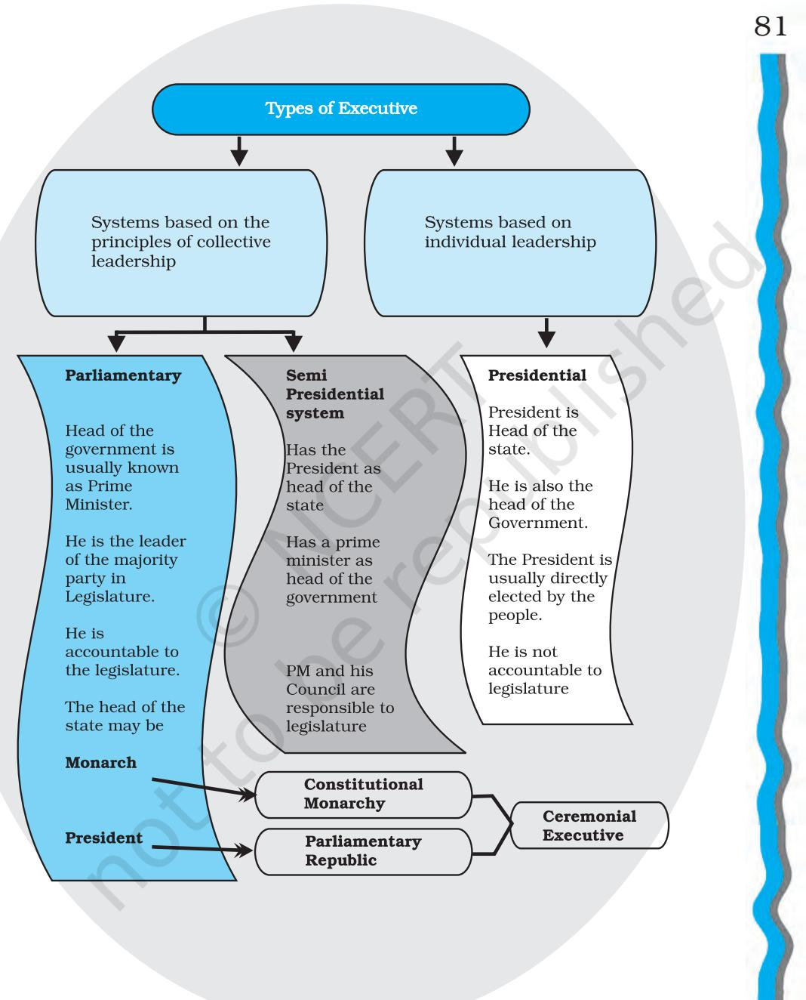
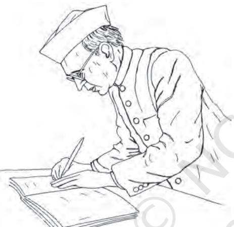
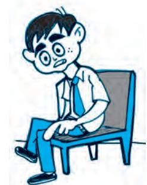
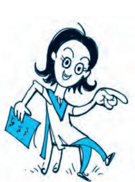
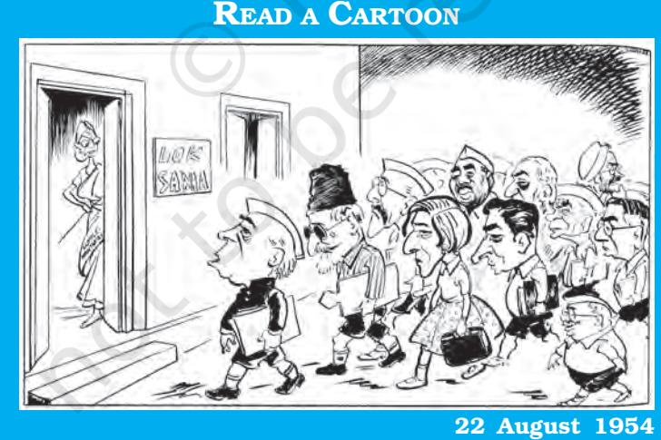
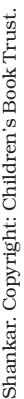
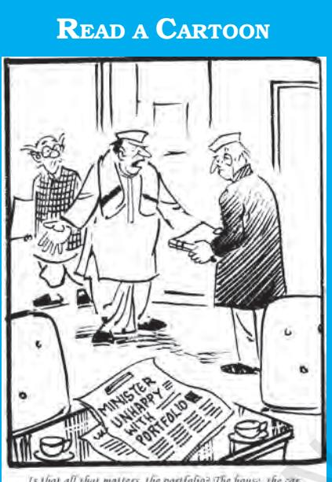
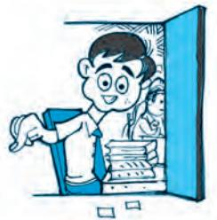
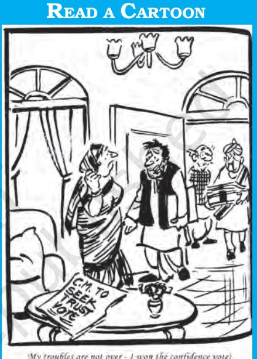
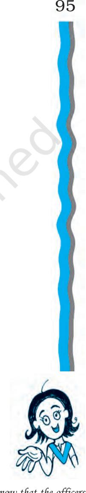

# Chapter Four EXECUTIVE

INTRODUCTION

*Legislature, executive and judiciary are the three organs of government. Together, they perform the functions of the government, maintain law and order and look after the welfare of the people. The Constitution ensures that they work in coordination with each other and maintain a balance among themselves. In a parliamentary system, executive and the legislature are interdependent: the legislature controls the executive, and, in turn, is controlled by the executive. In this chapter we shall discuss the composition, structure and function of the executive organ of the government. This chapter will also tell you about the changes that have occurred in recent times due to political practice. After reading this chapter, you will be able to*

*Indian Constitution at Work*

- ± *make a distinction between the parliamentary and the presidential executive;*
- ± *understand the constitutional position of the President of India;*
- ± *know the composition and functioning of the Council of Ministers and the importance of the Prime Minister; and*
- ± *understand the importance and functioning of the administrative machinery.*

# WHAT IS AN EXECUTIVE?

Who is in charge of the administration of your school? Who takes important decisions in a school or a university? In any organisation, some office holder has to take decisions and implement those decisions. We call this activity administration or management. But administration requires a body at the top that will take policy decisions or the big decisions and supervise and coordinate the routine administrative functioning. You may have heard about the executives of big companies, banks or industrial units. Every formal group has a body of those who function as the chief administrators or the executives of that organisation. Some office holders decide the policies and rules and regulations and then some office holders implement those decisions in actual day-to-day functioning of the organisation. The word executive means a body of persons that looks after the implementation of rules and regulations in actual practice.

In the case of government also, one body may take policy decisions and decide about rules and regulations, while the other one would be in charge of implementing those rules. The organ of government that primarily looks after the function of implementation and administration is called the executive.

What are the principal functions of the executive? Executive is the branch of government responsible for the implementation of laws and policies adopted by the legislature. The executive is often involved in framing of policy. The official designations of the executive vary from country to country. Some countries have presidents, while others have chancellors*.* The executive branch is not just about presidents, prime ministers and ministers. It also extends to the administrative machinery (civil servants). While the heads of government and their ministers, saddled with the overall responsibility of government policy, are together known as the political executive, those responsible for day to day administration are called the permanent executive.

79

*I remember somebody saying that the executive in a democracy is accountable to people. Is that also true of executives in big companies? Aren't they called CEOs? Who are they accountable to?*

# WHAT ARE THE DIFFERENT TYPES OF EXECUTIVE?

Every country may not have the same type of executive. You may have heard about the President of the USA and the Queen of England. But the powers and functions of the President of the USA are very different from the powers of the President of India. Similarly, the powers of the Queen of England are different from the powers of the King of Bhutan. Both India and France have prime ministers, but their roles are different from each other. Why is this so?

the meeting?

Procure a photograph of the SAARC summit meeting or the meeting of G-7 countries and list those who attended the meeting. Can you imagine why those people and not some others are attending

To answer this question we will briefly outline the nature of executive existing in some of these countries. The USA has a presidential system and executive powers are in the hands of the president. Canada has a parliamentary democracy with a constitutional monarchy where Queen Elizabeth II is the formal chief of state and the prime minister is the head of government. In France, both the president and the prime minister are a part of the semipresidential system. The president appoints the prime minister as well as the ministers but cannot dismiss them as they are responsible to the parliament. Japan has a parliamentary system with the Emperor as the head of the state and the prime minister as the head of government. Italy has a parliamentary system with the president as the formal head of state and the prime minister as the head of government. Russia has a semi-presidential system where president is the head of state and prime minister, who is appointed by the president, is the head of government. Germany has a parliamentary system in which president is the ceremonial head of state and the chancellor is the head of government.

In a presidential system, the president is the Head of state as well as head of government. In this system the office of president is very powerful, both in theory and practice. Countries with such a system include the United States, Brazil and most nations in Latin America.

*Chapter 4: Executive*

### Semi-Presidential Executive in Sri Lanka

In 1978 the constitution of Sri Lanka was amended and the system of Executive Presidency was introduced. Under the system of Executive Presidency, people directly elect the President. It may happen that both the President and the Prime Minister belong to the same political party or to different political parties.

The President has vast powers under the constitution. The President chooses the Prime Minister from the party that has a majority in the Parliament. Though ministers must be members of the Parliament, the President has the power to remove the Prime Minister, or ministers. Apart from being the elected Head of State and the Commander-in-Chief of the Armed Forces, the President is also the Head of the Government.

Elected for a term of six years, the President cannot be removed except by a resolution in the parliament passed by at least two-thirds of the total number of Members of Parliament. If it is passed by not less than one-half of the total number of Members of Parliament and the Speaker is satisfied that such allegations merit inquiry then the Speaker can report the matter to the Supreme Court.

How is the position of the President and Prime Minister in Sri Lanka different from India? Compare the role of Supreme Court in the impeachment of the President in India and Sri Lanka.

In a parliamentary system, the prime minister is the head of government. Most parliamentary systems have a president or a monarch who is the nominal Head of state. In such a system, the role of president or monarch is primarily ceremonial and prime minister along with the cabinet wields effective power. Countries with such system include Germany, Italy, Japan, United Kingdom as well as Portugal. A semi-presidential system has both a president and a prime minister but unlike the parliamentary system the president may possess significant day-to-day powers. In this system, it is possible that sometimes the president and the prime minister may belong to the same party and at times they may belong to two different parties and thus, would be opposed to each other. Countries with such a system include France, Russia, Sri Lanka, etc.

## Check your progress

Neha: It is really very simple. A country having a president has a presidential executive and one with a prime minister has parliamentary executive.

How would you explain to Neha that this is not always the case?

# PARLIAMENTARY EXECUTIVE IN INDIA

*Chapter 4: Executive*

When the Constitution of India was written, India already had some experience of running the parliamentary system under the Acts of 1919 and 1935. This experience had shown that in the parliamentary system, the executive can be effectively controlled by the representatives of the people. The makers of the Indian Constitution wanted to ensure that the government would be sensitive to public expectations and would be responsible and accountable. The other alternative to the parliamentary executive was the presidential form of government. But the presidential executive puts much emphasis on the president as the chief executive and as source of all executive power. There is always the danger of personality cult in presidential executive. The makers of the Indian Constitution wanted a government that would have a strong executive branch, but at the same time, enough safeguards should be there to check against the personality cult. In the parliamentary form there are many mechanisms that ensure that the executive will be answerable to and controlled by the legislature or people's representatives. So the Constitution adopted the parliamentary system of executive for the governments both at the national and State levels.

According to this system, there is a President who is the formal Head of the state of India and the Prime Minister

83

*Haven't we had very strong Prime Ministers? Does it mean that even the parliamentary system is not fool proof against personality cult? That means people and the legislatures have to be constantly vigilant!*

and the Council of Ministers, which run the government at the national level. At the State level, the executive comprises the Governor and the Chief Minister and Council of Ministers.

The Constitution of India vests the executive power of the Union formally in the President. In reality, the President exercises these powers through the Council of Ministers headed by the Prime Minister. The President is elected for a period of five years. But there is no direct election by the people for the office of President. The President is elected indirectly. This means that the president is elected not by the ordinary citizens but by the elected MLAs and MPs. This election takes place in accordance with the principle of proportional representation with single transferable vote.

The President can be removed from office only by Parliament by following the procedure for impeachment. This procedure requires a special majority as explained in the last chapter. The only ground for impeachment is violation of the Constitution.

## Power and position of President

*Article 74 (1): There shall be a Council of Ministers with the Prime Minister at the head to aid and advise the President who shall in the exercise of his functions, act in accordance with such advice.*

*Provided that the President may require the Council of Ministers to reconsider such advice….., and the President shall act in accordance with the advice tendered after such reconsideration.*

Do you know what the word *shall* means here? It indicates that the advice is binding on the President. In view of the controversy about the scope of the President's powers, a specific mention was made in the Constitution by an amendment that the advice of the Council of Ministers will be binding on the President. By another amendment made later, it was decided that the President can ask the Council of Ministers to reconsider its advice but, has to accept the reconsidered advice of the Council of Ministers.

We have already seen that President is the formal head of the government. In this formal sense, the President has wide ranging executive, legislative, judicial and emergency powers. In a parliamentary system, these powers are in reality used by the President only on the advice of the Council of Ministers. The Prime Minister and the Council of Ministers have support of the majority in the Lok Sabha and they are the real executive. In most of the cases, the President has to follow the advice of the Council of Ministers.

Jawaharlal Nehru *CAD*, Vol. VI, p. 734

"We did not give him any real power but we have made his position one of authority and dignity. The constitution wants to create neither a real executive nor a mere figurehead, but a head that neither reigns nor governs; it wants to create a great figurehead..."

# Discretionary Powers of the President

On the basis of the above discussion can we infer that the President has no discretionary power under any circumstances? This will be an incorrect assessment. Constitutionally, the President has a right to be informed of all important matters and deliberations of the Council of Ministers. The Prime Minister is obliged to furnish all the information that the President may call for. The President often writes to the Prime Minister and expresses his views on matters confronting the country.

85

*Am I just a figurehead or am I asking real questions? Did the textbook writers give me power to ask questions I wish to ask or am I asking questions they have in their mind?*

*It is very well to talk of the President as He or She, but has a woman ever become the President?*

86

Besides this, there are at least three situations where the President can exercise the powers using his or her own discretion. In the first place, we have already noted that the President can send back the advice given by the Council of Ministers and ask the Council to reconsider the decision. In doing this, the President acts on his (or her) own discretion. When the President thinks that the advice has certain flaws or legal lacunae, or that it is not in the best interests of the country, the President can ask the Council to reconsider the decision. Although, the Council can still send back the same advice and the President would then be bound by that advice, such a request by the President to reconsider the decision, would naturally carry a lot of weight. So, this is one way in which the president can act in his own discretion.

Secondly, the President also has veto power by which he can withhold or refuse to give assent to Bills (other than Money Bill) passed by the Parliament. Every bill passed by the Parliament goes to the President for his assent before it becomes a law. The President can send the bill back to the Parliament asking it to reconsider the

We saw that there is no time limit on the President for giving his assent to a bill. Do you know that such a thing has already happened? In 1986, the Parliament passed a bill known as Indian Post office (amendment) bill. This bill was widely criticised by many for it sought to curtail the freedom of the press. The then President, Gyani Zail Singh, did not take any decision on this bill. After his term was over, the next President, Venkataraman sent the bill finally back to the Parliament for reconsideration. By that time, the government that brought the bill before the Parliament had changed and a new government was elected in 1989. This government belonged to a different coalition and did not bring the bill back before the Parliament. Thus, Zail Singh's decision to postpone giving assent to the bill effectively meant that the bill could never become a law!

bill. This 'veto' power is limited because, if the Parliament passes the same bill again and sends it back to the President, then, the President has to give assent to that bill. However, there is no mention in the Constitution about the time limit within which the President must send the bill back for reconsideration. This means that the President can just keep the bill pending with him without any time limit. This gives the President an informal power to use the veto in a very effective manner. This is sometimes referred to as 'pocket veto'.

87

Then, the third kind of discretion arises more out of political circumstances. Formally, the President appoints the Prime Minister. Normally, in the parliamentary system, a leader who has the support of the majority in the Lok Sabha would be appointed as Prime Minister and the question of discretion would not arise. But imagine a situation when after an election, no leader has a clear majority in the Lok Sabha. Imagine further that after attempts to forge alliances, two or three leaders are claiming that they have the support of the majority in the house. Now, the President has to decide whom to appoint as the Prime Minister. In such a situation, the President has to use his own discretion in judging who really may have the support of the majority or who can actually form and run the government.

Since 1989 major political changes have considerably increased the importance of the presidential office. In the four parliamentary elections held from 1989 to 1998, no single party or coalition attained

#### President's role in choosing the Prime Minister

After 1977, party politics in India became more competitive and there have been many instances when no party had clear majority in the Lok Sabha. What does the President do in such situations? No political party or coalition secured majority in the elections held in March 1998. The BJP and its allies secured 251 seats, 21 short of a majority. President Narayanan adopted an elaborate procedure. He asked the leader of the alliance, Atal Behari Vajpayee, "to furnish documents in support of his claim from concerned political parties." Not stopping at this the President also advised Vajpayee to secure a vote of confidence within ten days of being sworn in.

a majority in the Lok Sabha. These situations demanded presidential intervention either in order to constitute governments or to grant a request for dissolution of Lok Sabha by a Prime Minister who could not prove majority in the House. It may thus be said that presidential discretion is related to political conditions. There is greater scope for presidential assertiveness when governments are not stable and coalitions occupy power.

For the most part, the President is a formal power holder and a ceremonial head of the nation. You may wonder why then do we need a President? In a parliamentary system, the Council of Ministers is dependent on the support of the majority in the legislature. This also means that the Council of Ministers may be removed at any time and a new Council of Ministers will have to be put in place. Such a situation requires a Head of the state who has a fixed term, who may be empowered to appoint the Prime Minister and who may symbolically represent the entire country. This is exactly the role of the President in ordinary circumstances. Besides, when no party has a clear majority, the President has the additional responsibility of making a choice and appointing the Prime Minister to run the government of the country.

#### The Vice President of India

88

The Vice President is elected for five years. His election method is similar to that of the President, the only difference is that members of State legislatures are not part of the electoral college. The Vice President may be removed from his office by a resolution of the Rajya Sabha passed by a majority and agreed to by the Lok Sabha. The Vice President acts as the exofficio Chairman of the Rajya Sabha and takes over the office of the President when there is a vacancy by reasons of death, resignation, removal by impeachment or otherwise. The Vice President acts as the President only until a new President is elected. B. D. Jatti acted as President on the death of Fakhruddin Ali Ahmed until a new President was elected.

## Check your progress

Imagine that the Prime Minister wants to impose 'President's rule' in one State because the State government has failed to effectively curb atrocities against the Dalits in that State. The President has a different position. He is saying that the provision regarding President's rule should be used only sparingly. In this situation which of the following courses are open to the President?

- a. Tell the Prime Minister that he will not sign on the order promulgating President's rule.
- b. Dismiss the Prime Minister.
- c. Ask the Prime Minister to send CRPF to that State.
- d. Make a press statement about how the Prime Minister is wrong.
- e. Discuss the matter with the Prime Minister and try to dissuade him from taking this action, but if he insists, agreeing to sign the said order.

# PRIME MINISTER AND COUNCIL OF MINISTERS

There is no Council of Ministers without the Prime Minister. This cartoon shows how, literally, the Prime Minister 'leads' the Council of Ministers!

No discussion of government or politics in India, would normally take place without mentioning one office: the Prime Minister of India.

*R K Laxman in The Times of India.*

Why do people want to be ministers? This cartoon seems to suggest that it is only for perks and status! Then why is there competition for some portfolios?

90

Can you imagine why this is so?

We have already seen earlier in this chapter that the President exercises his powers *only* on the advice of the Council of Ministers. The Council of Ministers is headed by the Prime Minister. Therefore, as head of the Council of Ministers, the Prime Minister becomes the most important functionary of the government in our country.

In the parliamentary form of executive, it is essential that the Prime Minister has the support of the majority in the Lok Sabha. This support by the majority also makes the Prime Minister very powerful. The moment this support of the majority is lost, the Prime Minister loses the office. For many years after independence, the Congress party had the majority in the Lok Sabha and its leader would become the Prime Minister. Since 1989, there have been many occasions when no party had majority in the Lok Sabha. Various political parties have come together and formed a coalition that has majority in the House. In such situations, a leader who is acceptable to most partners of the coalition becomes the Prime Minister. Formally, a leader who has the support of

the majority is appointed by the President as Prime Minister.

The Prime Minister then decides who will be the ministers in the Council of Ministers. The Prime Minister allocates ranks and portfolios to the ministers. Depending upon the seniority and political importance, the ministers are given the ranks of cabinet minister, minister of State or deputy minister. In the same manner, Chief Ministers of the States choose ministers from their own party or coalition. The Prime Minister and all the ministers have to be members of the Parliament. If someone becomes a minister or Prime Minister

without being an MP, such a person has to get elected to the Parliament within six months.

> There were some members in the Constituent Assembly who felt that ministers should be elected by the legislature and not selected by the Prime Minister or Chief Minister:

> "Swiss system under which the legislature elects the executive for a certain period …is to my mind the best form of government for the provinces… The system of the single transferable vote is ...the best system that can be adopted for the appointment of the executive because in that all interests will be represented and no party in the legislature will have any occasion to feel that it is not represented."

Begum Aizaz Rasul, CAD, Vol. IV, p. 631, 17 July 1947

#### Size of the Council of Ministers

Before the 91st Amendment Act (2003), the size of the Council of Ministers was determined according to exigencies of time and requirements of the situation. But this led to very large size of the Council of Ministers. Besides, when no party had a clear majority, there was a temptation to win over the support of the members of the Parliament by giving them ministerial positions as there was no restriction on the number of the members of the Council of Ministers. This was happening in many States also. Therefore, an amendment was made that the Council of Ministers shall not exceed 15 percent of total number of members of the House of the People (or Assembly, in the case of the States).

In the chapter on the legislature, you will study in detail the various mechanisms through which the Parliament controls the executive. But remember that the most important feature of parliamentary executive is that the executive is routinely under the control and supervision of the legislature.

The Council of Ministers is collectively responsible to the Lok Sabha. This provision means that a Ministry which loses confidence of the Lok Sabha is obliged to resign. The principle indicates that the ministry is an executive committee of the Parliament and it collectively governs on behalf of the Parliament. Collective responsibility is based on the principle of the solidarity of the cabinet. It implies that a vote of no confidence even against a single minister leads to the resignation of the entire Council of Ministers. It also indicates that if a minister does not agree with a policy or decision of the cabinet, he or she must either accept the decision or resign. It is binding on all ministers to pursue or agree to a policy for which there is collective responsibility.

In India, the Prime Minister enjoys a pre-eminent place in the government. The Council of Ministers cannot exist without the Prime Minister. The Council comes into existence only after the Prime Minister has taken the oath of office. The death or resignation of the Prime Minister automatically brings about the dissolution of the Council of Ministers but the demise, dismissal or resignation of a minister only creates a ministerial vacancy. The Prime Minister acts as a link between the Council of Ministers on the one hand and the President as well as the Parliament on the other. It is this role of the Prime Minister which led Pt. Nehru to describe him as 'the linchpin of Government'. It is also the constitutional obligation of the Prime Minister to communicate to the President all decisions of the Council of Ministers relating to the administration of the affairs of the Union and proposals for legislation. The Prime Minister is involved in all crucial decisions of the government and decides on the policies of the government. Thus, the power wielded by the Prime Minister flows from various sources: control over the Council of Ministers, leadership of the Lok Sabha, command over the bureaucratic machine, access to media, projection of personalities during elections, projection as national leader during international summitry as well as foreign visits.

*Is it that a person becomes Prime Minister because he/she is powerful or is it that you become powerful once you have become the Prime Minister?*

However, the power which the Prime Minister wields and actually puts into use depends upon the prevailing political conditions. The position of the Prime Minister and Council of Ministers has been unassailable whenever a single political party has secured majority

in the Lok Sabha. However, this has not been the case when governments have been led by coalitions of political parties. Since 1989, we have witnessed many coalition governments in India. Many of these governments could not remain in power for the full term of the Lok Sabha. They were either removed or they resigned due to loss of support of the majority. These developments have affected the working of the parliamentary executive.

In the first place, these developments have resulted in a growing discretionary role of the President in the selection of Prime Ministers. Secondly, the coalitional nature of Indian politics in this period has necessitated much more consultation between political partners, leading to erosion of prime ministerial authority. Thirdly, it has also brought restrictions on various prerogatives of the Prime Minister like choosing the ministers and deciding their ranks and portfolios. Fourthly, even the policies and programmes of the government cannot be decided by the Prime

This Chief Minster is not happy even after winning the confidence motion! Can you imagine why this is so?

Minister alone. Political parties of different ideologies come together both as pre-poll and post-poll allies to form a government. Policies are framed after a lot of negotiations and compromises among the allies. In this entire process, the Prime Minister has to act more as a negotiator than as leader of the government.

At the State level, a similar parliamentary executive exists, though with some variations. The most important variation is that there is a Governor of the State appointed by the President (on the advice of

93

the central government). Though the Chief Minister, like the Prime Minister is the leader of the majority party in the Assembly, the Governor has more discretionary powers. However, the main principles of parliamentary system operate at the State level too.

## Check your progress

Suppose the Prime Minister is to select the Council of Ministers. What will he/she do?

- a. Select those who are experts in the various subjects.
- b. Select only those who are from his/her party.
- c. Select those who are personally loyal and dependable.
- d. Select those who are supporters of the government.
- e. Take into account the political weight of the various aspirants and choose from among them.

# PERMANENT EXECUTIVE: BUREAUCRACY

Who implements the decisions of the ministers?

The Executive organ of the government includes the Prime Minister, the ministers and a large organisation called the bureaucracy or the administrative machinery. To underline the difference between this machinery and the military service, it is described as civil service. Trained and skilled officers who work as permanent employees of the government are assigned the task of assisting the ministers in formulating policies and implementing these policies.

In a democracy, the elected representatives and the ministers are in charge of government and the administration is under their control and supervision. In the parliamentary system, the legislature also exercises control over the administration. The administrative officers cannot act in violation of the policies adopted by the legislature. It is the responsibility of the ministers to retain political control over the administration. India has established professional administrative

machinery. At the same time, this machinery is made politically accountable. The bureaucracy is also expected to be politically neutral. This means that the bureaucracy will not take any political position on policy matters. In a democracy, it is always possible that a party is defeated in elections and the new government wants to opt for new policies in the place of policies of the previous government. In such a situation, it is the responsibility of the administrative machinery to faithfully and efficiently participate in drafting the policy and in its implementation.

The Indian bureaucracy today is an enormously complex system. It consists of the All-India services, State services, employees of the local governments, and technical and managerial staff running public sector undertakings. Makers of our Constitution were aware of the importance of the non-partisan and professional bureaucracy. They also wanted the members of the civil services or bureaucracy to be impartially selected on the basis of merit. So, the Union Public Service Commission has been entrusted with the task of conducting the process of recruitment of the civil servants for the government of India. Similar public service commissions are provided for the States also. Members of the Public Service Commissions are appointed for a fixed term. Their removal or suspension is subject to a thorough enquiry made by a judge of the Supreme Court.

While efficiency and merit are the norms for recruitment, the Constitution also ensures that all sections of the society including the weaker sections have an opportunity to be part of the public bureaucracy. For this purpose, the Constitution has provided reservation in jobs for Scheduled Castes and Scheduled Tribes. Subsequently, reservations have also been provided for women, Other Backward Classes (OBC) and Economically Weaker Sections (EWS). These provisions ensure that the bureaucracy would be more representative and social inequalities will not come in the way of recruitment to the civil service.

*Yes, I know that the officers are there to serve the people. But people are always afraid of these officers. And officers also behave as if they were the masters!*

Persons selected by the UPSC for Indian Administrative Service and Indian Police Service constitute the backbone of the higher level bureaucracy in the States. You may know that the collector of a district is the most important officer of the government at the district level. Do you know that the collector is normally an IAS officer and that the officer is governed by the service conditions laid down by the central government? An IAS or IPS officer is assigned to a particular State, where he or she works under the supervision of the State government. However, the IAS or IPS officers are appointed by the central government, they can go back into the service of the central government and most importantly, only the central government can take disciplinary action against them. This means that the key administrative officers of the States are under the supervision and control of the central government. Apart from the IAS and the IPS officers appointed by the UPSC, the administration of the State is looked after by officers appointed through the State Public Service Commissions. As we shall study later in the chapter on federalism, this feature of the bureaucracy strengthens the control of the central government over the administration of the States.

The bureaucracy is an instrument through which welfare policies of the government must reach the people. But most often, it is so powerful that people are afraid of approaching a government officer. It is a common experience of the people that bureaucracy is insensitive to the demands and expectations of the ordinary citizen. Only if the democratically elected government controls the bureaucracy, some of these problems can be effectively handled. On the other hand, too much political interference turns the bureaucracy into an instrument in the hands of the politician. Though the Constitution has created independent machinery for recruitment, many people think that there is no provision for protecting the civil

96

servants from political interference in the performance of their duties. It is also felt that enough provisions are not there to ensure the accountability of the bureaucracy to the citizen. There is an expectation that measures like the Right to Information may make the bureaucracy a little more responsive and accountable.

97

## Conclusion

The modern executive is a very powerful institution of government. The executive enjoys greater powers compared to other organs of the government. This generates a greater need to have democratic control over the executive. The makers of our Constitution thought with foresight that the executive must be put firmly under regular supervision and control. Thus, a parliamentary executive was chosen. Periodic elections, constitutional limits over the exercise of powers and democratic politics have ensured that executive organ cannot become unresponsive.

# Exercises

- 1. A parliamentary executive means:
	- a. Executive where there is a parliament
	- b. Executive elected by the parliament
	- c. Where the parliament functions as the Executive
	- d. Executive that is dependent on support of the majority in the parliament
- 2. Read this dialogue. Which argument do you agree with? Why?

Amit: Looking at the constitutional provisions, it seems that the President is only a rubber stamp.

Shama: The President appoints the Prime Minister. So, he must have the powers to remove the Prime Minister as well.

Rajesh: We don't need a President. After the election, the Parliament can meet and elect a leader to be the Prime Minister.

# 3. Match the following

- i. Works within the particular State in a. Indian Foreign which recruited Service
- ii. Works in any central government b. State Civil office located either at the national Services capital or elsewhere in the country
- iii. Works in a particular State to which c. All India Services allotted; can also be sent on deputation to the centre
- iv. Works in Indian missions abroad d. Central Services
- 4. Identify the ministry which may have released the following news items. Would this be a ministry of the central government or the State government? Why?
	- a. An official release said that in 2004-05 the Tamil Nadu Textbooks Corporation would release new versions for standards VII, X and XI.
	- b. A new railway loop line bypassing the crowded Tiruvallur-Chennai section to help iron ore exporters. The new line, likely to be about 80 km long, will branch off at Puttur and then reach Athipattu near the port.
	- c. The three-member sub-divisional committee formed to verify suicide by farmers in Ramayampet mandal has found that the two farmers who committed suicide this month have had economic problems due to failure of crops.

5. While appointing the Prime Minister, the President selects

- a. Leader of the largest party in the Lok Sabha
- b. Leader of the largest party in the alliance which secures a majority in the Lok Sabha
- c. The leader of the largest party in the Rajya Sabha
- d. Leader of the alliance or party that has the support of the majority in Lok Sabha

- 6. Read this discussion and say which of these statements applies most to India.
Alok: Prime Minister is like a king, he decides everything in our country.

Shekhar: Prime Minister is only 'first among equals', he does not have any special powers. All ministers and the PM have similar powers.

Bobby: Prime Minister has to consider the expectations of the party members and other supporters of the government. But after all, the Prime Minister has a greater say in policy making and in choosing the ministers.

- 7. Why do you think is the advice of the Council of Ministers binding on the President? Give your answer in not more than 100 words.
- 8. The parliamentary system of executive vests many powers in the legislature for controlling the executive. Why, do you think, is it so necessary to control the executive?
- 9. It is said that there is too much political interference in the working of the administrative machinery. It is suggested that there should be more and more autonomous agencies which do not have to answer to the ministers.
	- a. Do you think this will make administration more peoplefriendly?
	- b. Do you think this will make administration more efficient?
	- c. Does democracy mean full control of elected representatives over the administration?
- 10. Write an essay of two hundred words on the proposal to have an elected administration instead of an appointed administration.

99

