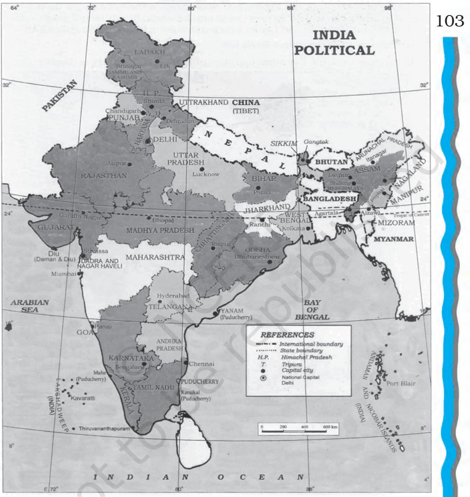
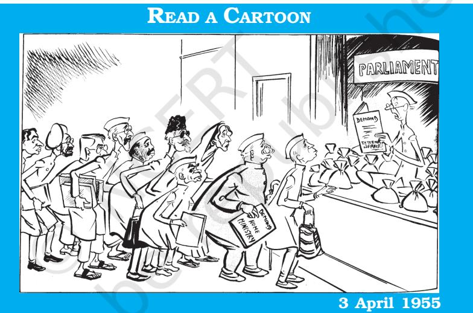
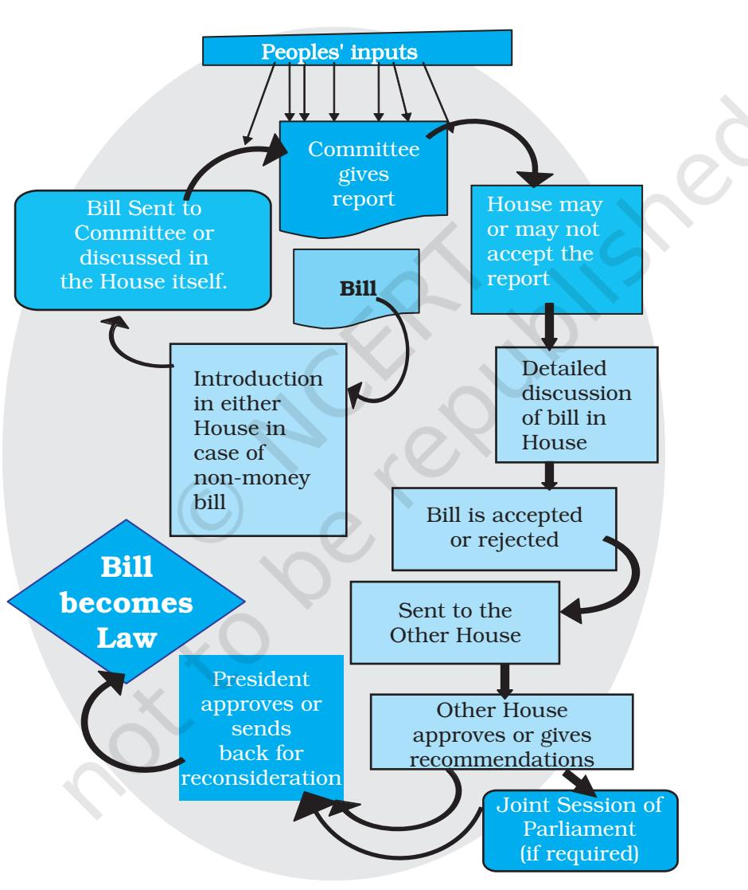
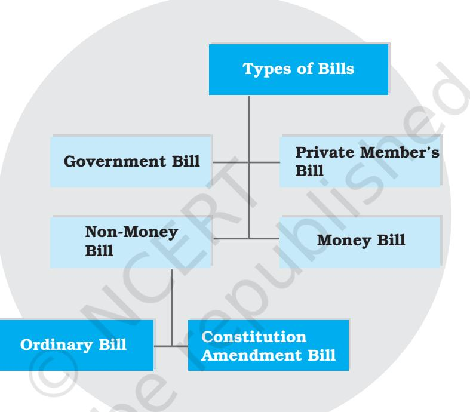
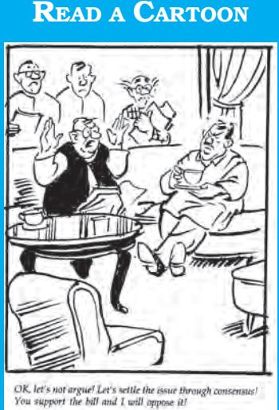
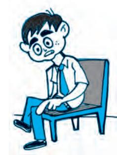
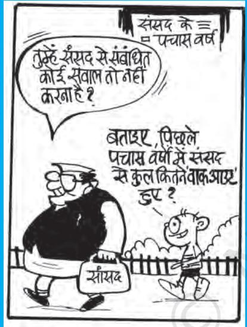
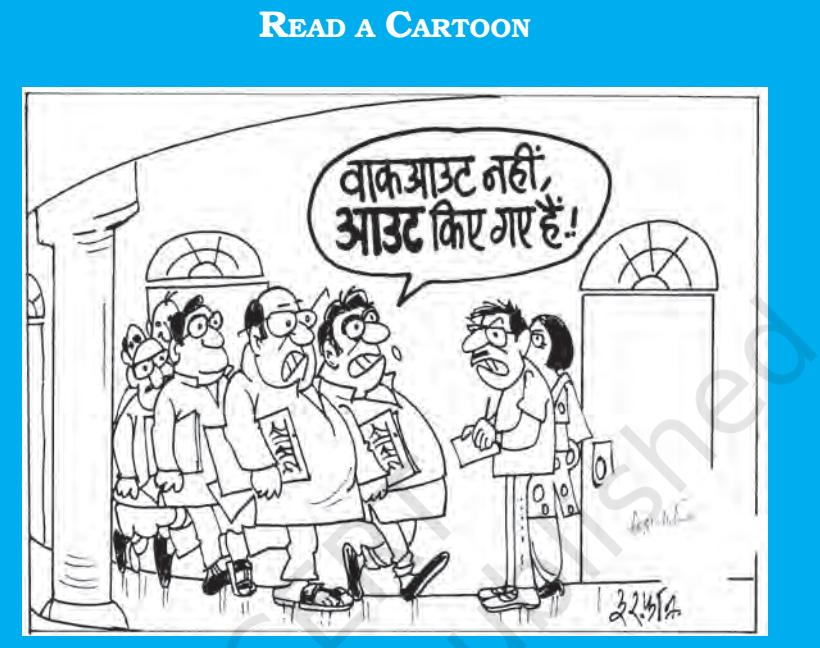

# Chapter Five LEGISLATURE

## INTRODUCTION

*You have already studied the importance of elections and the method of election adopted in India. Legislatures are elected by the people and work on behalf of the people. In this chapter you would study how elected legislatures function and help in maintaining democratic government. You will also learn about the composition and functioning of the parliament and State legislatures in India and their importance in democratic government. After reading this chapter you would know*

*Indian Constitution at Work*

- ± *the importance of the legislature;*
- ± *the functions and powers of the Parliament of India;*
- ± *the law making procedure;*

100

- ± *how the Parliament controls the executive; and*
- ± *how the Parliament regulates itself.*

## WHY DO WE NEED A PARLIAMENT?

Legislature is not merely a law making body. Lawmaking is but one of the functions of the legislature. It is the centre of all democratic political process. It is packed with action; walkouts, protests, demonstration, unanimity, concern and co-operation. All these serve very vital purposes. Indeed, a genuine democracy is inconceivable without a representative, efficient and effective legislature. The legislature also helps people in holding the representatives accountable. This is indeed, the very basis of representative democracy.

Yet, in most democracies, legislatures are losing central place to the executive. In India too, the Cabinet initiates policies, sets the agenda for governance and carries them through. This has led some critics to remark that the Parliament has declined. But even very strong cabinets must retain majority in the legislature. A strong leader has to face the Parliament and answer to the satisfaction of the Parliament. Herein lies the democratic potential of the Parliament. It is recognised as one of the most democratic and open forum of debate. On account of its composition, it is the most representative of all organs of government. It is above all, vested with the power to choose and dismiss the government.

## *Activity*

Consider these newspaper reports and then think: what would happen if there were no legislatures? After reading each news report, state how the legislature succeeded or failed in maintaining control over the executive.

- l 28th February 2002: The Union Finance Minister, Jaswant Singh, announced in the Union budget proposal an increase of Rs. 12 in the price of a 50 kg bag of urea and a smaller increase in the price of two other fertilizers which constituted about 5 per cent rise in prices. The current urea price of Rs. 4,830 a tonne carries a subsidy of as much as 80 per cent.

- l 11 March 2002. The Finance Minister had to roll back the increases in fertilizer prices under intense opposition pressure (*The Hindu*, 12 March 2002)
- l On 4 June 1998, the Lok Sabha witnessed acrimonious scenes over the hike in urea and petroleum process. The entire opposition staged a walkout. The issue rocked the house for two days leading to walkout by opposition. The finance minister in his budget proposal had proposed a hike of 50 paisa per kilogram of urea to reduce subsidy on it. This forced the finance minister Mr. Yashwant Sinha to roll back the hike in urea prices ( *Hindustan Times*, 4 and 5 June 1998)
- l 22 February 1983: In a rare move, the Lok Sabha today unanimously decided to suspend official business and give precedence to debate on Assam. Home Minister P.C.Sethi made a statement "I seek the cooperation of all members whatever their views and policies, in promoting harmony among different communities and groups living in Assam. What is needed now is not acrimony but a healing touch." (*Hindustan Times*, 22 February 1983)
- l Congress Members voiced protest against atrocities on Harijans in Andhra Pradesh (*The Hindu*, 3 March 1985)

## WHY DO WE NEED TWO HOUSES OF PARLIAMENT?

The term 'Parliament' refers to the national legislature. The legislature of the States is described as State legislature. The Parliament in India has two houses. When there are two houses of the legislature, it is called a bicameral legislature. The two Houses of the Indian Parliament are the Council of States or the Rajya Sabha and the House of the People or the Lok Sabha. The Constitution has given the States the option of establishing either a unicameral or bicameral legislature. At present only six States have a bicameral legislature.

States having a bicameral legislature are given below:

- (i) Andhra Pradesh
- (ii) Bihar
- (iii) Karnataka
- (iv) Maharashtra
- (v) Telangana
- (vi) Uttar Pradesh

Countries with large size and much diversity usually prefer to have two houses of the national legislature to give representation to all sections in the society and to give representation to all geographical regions or parts of the country. A bicameral legislature has one more advantage. A bicameral legislature makes it possible to have every decision reconsidered. Every decision taken by one house goes to the other house for its decision. This means that every bill and policy would be discussed twice. This ensures a double check on every matter. Even if one house takes a decision in haste, that decision will come for discussion in the other house and reconsideration will be possible.

> "...an Upper House could perform the...useful function of being a revising body, and ...its views may count but not its votes... ...,those who could not enter into the rough and tumble of active politics could...advise the Lower House."

Purnima Banerji CAD, Vol. IX, p. 33, 30 July 1949

#### Rajya Sabha

Each of the two Houses of Parliament has different bases of representation. The Rajya Sabha represents the States of India. It is an indirectly elected body. Residents of the State elect members to State Legislative Assembly. The elected members of State Legislative Assembly in turn elect the members of the Rajya Sabha.

We can imagine two different principles of representation in the second chamber. One way is to give equal representation to all the parts of the country irrespective of their size or population. We may call this as symmetrical representation. On the other hand, parts of the country may be given representation according to their

population. This second method means that regions or parts having larger population would have more representatives in the second chamber than regions having less population.

In the USA, every state has equal representation in the Senate. This ensures equality of all the states. But this also means that a small state would have the same representation as the larger states. The system of representation adopted for the Rajya Sabha is different from that in the USA. The number of members to be elected from each State has been fixed by the fourth schedule of the Constitution.

What would happen if we were to follow the American system of equality of representation in the Rajya Sabha? Uttar Pradesh with a population of 1998.12 lakhs would get seats equal to that of Sikkim whose population is only 6.10 lakhs. The framers of the Constitution wanted to prevent such discrepancy. States with larger population get more representatives than States with smaller population get. Thus, a more populous State like Uttar Pradesh sends 31 members to the Rajya Sabha, while a smaller and less populous State like Sikkim has one seat in the Rajya Sabha.

Members of the Rajya Sabha are elected for a term of six years. They can get re-elected. All members of the Rajya Sabha do not complete their terms at the same time. Every two years, one third members of the Rajya Sabha

Bicameralism in Germany

Germany has a bicameral legislature. The two Houses are known as Federal Assembly (Bundestag) and Federal Council (Bundesrat). Assembly is elected by a complex system combining direct and proportional representation for a period of four years.

105

The 16 federal states of Germany are represented in the Federal Council. The 69 seats of the *Bundesrat* are divided among states on the basis of a range of populations. These members are generally the ministers in the governments at the state level and are appointed, not elected, by the governments of the federal states. According to the German law, all the members from one state have to vote as a bloc as per the instructions of the state governments. Sometimes due to coalition government at the state level, they fail to reach an agreement and may have to abstain.

The Bundesrat does not vote on all legislative initiatives but all the policy areas on which the federal states have concurrent powers and are responsible for federal regulations must be passed by it. It can also veto such legislation.

complete their term and elections are held for those one third seats only. Thus, the Rajya Sabha is never fully dissolved. Therefore, it is called the permanent House of the Parliament. The advantage of this arrangement is that even when the Lok Sabha is dissolved and elections are yet to take place, the meeting of the Rajya Sabha can be called and urgent business can be conducted.

Apart from the elected members, Rajya Sabha also has twelve nominated members. The President nominates these members. These nominations are made from among those persons who have made their mark in the fields of literature, science, art and social service.

*I don't understand why there is a provision for nominating these sportspersons and artists and scientists. Whom do they represent? And, do they really contribute much to the proceedings of the Rajya Sabha?*

## *Activity*

Find out the number of representatives elected from different States. Prepare a chart showing number of representatives and the population of the State according to the 2011 census.

### Lok Sabha

The Lok Sabha and the State Legislative Assemblies are directly elected by the people. For the purpose of election, the entire country (State, in case of State Legislative Assembly) is divided into territorial constituencies of roughly equal population. One representative is elected from each constituency through universal adult suffrage where the value of vote of every individual would be equal to another. At present there are 543 constituencies. This number has not changed since 1971 census.

The Lok Sabha is elected for a period of five years. This is the maximum. We have seen in the chapter on the executive that before the completion of five years, the Lok Sabha can be dissolved if no party or coalition can form the government or if the Prime Minister advises the President to dissolve the Lok Sabha and hold fresh elections.

## Check your progress

- ± Do you think that composition of Rajya Sabha has protected the position of States of India?
- ± Should indirect election of Rajya Sabha be replaced by direct elections? What would be its advantages and disadvantages?
- ± Since 1971 census the number of seats in the Lok Sabha has not increased. Do you think that it should be increased? What should be the basis for this?

## WHAT DOES THE PARLIAMENT DO?

What is the function of the legislature? Do both Houses of the Parliament have similar functions? Is there a difference in the powers of the two Houses?

Apart from law making, the Parliament is engaged in many other functions. Let us list the functions of the Parliament:

- ± Legislative Function: The Parliament enacts legislations for the country. Despite being the chief law making body, the Parliament often merely approves legislations. The actual task of drafting the bill is performed by the bureaucracy under the supervision of the minister concerned. The substance and even the timing of the bill are decided by the Cabinet. No major bill is introduced in the Parliament without the approval of the Cabinet. Members other than ministers can also introduce bills but these have no chance of being passed without the support of the government.
- ± Control of Executive and ensuring its accountability: Perhaps the most vital function of the Parliament is to ensure that the executive does not overstep its authority and remains responsible to the people who have elected them. We shall discuss this function in greater detail later in this chapter.
- ± Financial Function: Government is about spending a lot of money on various matters. Where does this money come from? Every

government raises resources through taxation. However, in a democracy, legislature controls taxation and the way in which money is used by the government. If the Government of India proposes to introduce any new tax, it has to get the approval of the Lok Sabha. The financial powers of the Parliament involve grant of resources to the government to implement its programmes. The government has to give an account to the legislature about the money it has spent and resources that it wishes to raise. The legislature also ensures that the government does not misspend or overspend. This is done through the budget and annual financial statements.

The Parliament is the boss and the ministers are looking very humble here. That is the effect of the Parliament's power to sanction money to different ministries.

- ± Representation: Parliament represents the divergent views of members from different regional, social, economic, religious groups of different parts of the country.
± Debating Function: The Parliament is the highest forum of debate in the country. There is no limitation on its power of discussion. Members are free to speak on any matter without fear. This makes it possible for the Parliament to analyse any or every issue that faces the nation. These discussions constitute the heart of democratic decision making.

Shankar. Copyright: Children's Book Trust.

108

- ± Constituent Function: The Parliament has the power of discussing and enacting changes to the Constitution. The constituent powers of both the houses are similar. All constitutional amendments have to be approved by a special majority of both Houses.
- ± Electoral functions: The Parliament also performs some electoral functions. It elects the President and Vice President of India.
- ± Judicial functions: The judicial functions of the Parliament include considering the proposals for removal of President, Vice-President and Judges of High Courts and Supreme Court.

## Powers of Rajya Sabha

We discussed above, the functions that are performed by the Parliament in general. However, in a bicameral legislature, there is some difference between the powers of the two Houses. Look at the charts showing the powers of Lok Sabha and Rajya Sabha.

## Powers of the Lok Sabha

- ± Makes Laws on matters included in Union List and Concurrent List. Can introduce and enact money and non money bills.
- ± Approves proposals for taxation, budgets and annual financial statements.
- ± Controls the executive by asking questions, supplementary questions, resolutions and motions and through no confidence motion.
- ± Amends the Constitution.
- ± Approves the Proclamation of emergency.
- ± Elects the President and Vice President and removes Judges of Supreme Court and High Court.
- ± Establishes committees and commissions and considers their reports.

## Powers of Rajya Sabha

- ± Considers and approves non money bills and suggests amendments to money bills.
- ± Approves constitutional amendments.
- ± Exercises control over executive by asking questions, introducing motions and resolutions.
- ± Participates in the election and removal of the President, Vice President, Judges of Supreme Court and High Court.It can alone initiate the procedure for removal of Vice President.
- ± Can give the Union parliament power to make laws on matters included in the State list.

## Special Powers of Rajya Sabha

As you know, the Rajya Sabha is an institutional mechanism to provide representation to the States. Its purpose is to protect the powers of the States. Therefore, any matter that affects the States must be referred to it for its consent and approval. Thus, if the Union Parliament wishes to remove a matter from the State list (over which only the State Legislature can make law) to either the Union List or Concurrent List in the interest of the nation, the approval of the Rajya Sabha is necessary. This provision adds to the strength of the Rajya Sabha. However, experience shows that the members of the Rajya Sabha represent their parties more than they represent their States.

Powers exercised *only* by the Lok Sabha: Then, there are powers that only the Lok Sabha exercises. The Rajya Sabha cannot initiate, reject or amend money bills. The Council of Ministers is responsible to the Lok Sabha and not Rajya Sabha. Therefore, Rajya Sabha can criticise the government but cannot remove it.

Can you explain why? The Rajya Sabha is elected by the MLAs and not directly by the people. Therefore, the Constitution stopped short of giving certain powers to the Rajya Sabha. In a democratic form as adopted by our Constitution, the people are the final authority. By this logic, the representatives, directly elected by the people, should have the crucial powers of removing a government and controlling the finances.

In all other spheres, including passing of non-money bills, constitutional amendments, and impeaching the President and removing the Vice President the powers of Lok Sabha and Rajya Sabha are co-equal.

## HOW DOES THE PARLIAMENT MAKE LAWS?

The basic function of any legislature is to make laws for its people. A definite procedure is followed in the process of making law. Some of the procedures of law making are

*So, the Lok Sabha controls the purse! Then it must be the more powerful House.*

mentioned in the Constitution, while some have evolved from conventions. Follow a bill through the legislative process and you will clearly see that the law making process is technical and even tedious.

111

A bill is a draft of the proposed law. There can be different types of bills. When a non-minister proposes a bill, it is called private member's Bill. A bill proposed by a minister is described as Government Bill. Let us now see the different stages in the life of a bill.

Even before a bill is introduced in the Parliament there may be a lot of debate on the need for introducing such a bill. A political party may pressurise the government to initiate a bill in order to fulfil its election promises or to improve its chances of winning forthcoming elections. Interest groups, media and citizens' forums may also persuade the government for a particular legislation. Law making is thus not merely a legal procedure but also a political course of action. The preparation of a bill itself involves many considerations such as resources required to implement the law, the support or opposition that the bill is likely to produce, the impact that the law may have on

112

the electoral prospect of the ruling party etc. In the era of coalition politics especially, a bill proposed by the government has to be acceptable to all the partners of the coalition. Such practical considerations can hardly be ignored. The Cabinet considers all these before arriving at a decision to enact a law.

Once the Cabinet approves the policy behind the legislation, the task of drafting the legislation begins. The draft of any bill is prepared by the concerned ministry. For instance a bill raising the marriageable age of girls from 18 to 21 will be prepared by the law ministry. The ministry of women and child welfare may also be involved in it. Within the Parliament, a bill may be introduced in the Lok Sabha or Rajya Sabha by a member of the House (but often a minister responsible for the subject introduces the bill). A money bill can be introduced only in Lok Sabha. Once passed there, it is sent to the Rajya Sabha.

A large part of the discussion on the bills takes place in the committees. The recommendation of the committee is then sent to the

House. That is why committees are referred to as miniature legislatures. This is the second stage in the law making process. In the third and final stage, the bill is voted upon. If a non-money bill is passed by one House, it is sent to the other House where it goes through exactly the same procedure.

As you know, a bill has to be passed by both Houses for enactment. If there is disagreement between the two Houses on the proposed bill, attempt is made to resolve it through Joint Session of Parliament. In the few instances when joint sessions of the parliament were called to resolve a deadlock, the decision has always gone in favour of the Lok Sabha.

If it is a money bill, the Rajya Sabha can either approve the bill or suggest changes but cannot reject it. If it takes no action within 14 days the bill is deemed to have been passed. Amendments to the bill, suggested by Rajya Sabha, may or may not be accepted by the Lok Sabha.

Is this how they follow the 'rules of the game'?

*R K Laxman in The Times of India.*

113

*Article 109 Special procedure in respect of Money Bills.—(1) A Money Bill shall not be introduced in the Council of States*

When a bill is passed by both Houses, it is sent to the President for his assent. The assent of the President results in the enactment of a bill into a law.

## Check your progress

- ± From the discussion of the law making process, do you think that Parliament can devote enough time for thorough discussion of the bills? If not, then what remedies would you suggest to overcome this difficulty?
## HOW DOES THE PARLIAMENT CONTROL THE EXECUTIVE?

In a parliamentary democracy, the executive is drawn from the party or a coalition of parties that has a majority in Lok Sabha. It is not difficult for the executive to exercise unlimited and arbitrary powers with the support of the majority party. In such a situation, parliamentary democracy may slip into Cabinet dictatorship, where the Cabinet leads and the House merely follows. Only if the Parliament is active and vigilant, can it keep regular and effective check on the executive. There are many ways in which the Parliament can control the executive. But basic to them all is the power and freedom of the legislators as people's representatives to work effectively and fearlessly. For instance, no action can be taken against a member for

114

whatever the member may have said in the legislature. This is known as parliamentary privilege. The presiding officer of the legislature has the final powers in deciding matters of breach of privilege.

The main purpose of such privileges is to enable the members of the legislature to represent the people and exercise effective control over the executive. How does the Parliament exercise such control? What are the means available at its disposal? Is parliamentary control successful in curbing executive excesses?

## Instruments of Parliamentary Control

The legislature in parliamentary system ensures executive accountability at various stages: policy making, implementation of law or policy and during and postimplementation stage. The legislature does this through the use of a variety of devices:

- ± Deliberation and discussion
- ± Approval or Refusal of laws
- ± Financial control
- ± No confidence motion

*Deliberation and discussion*: During the law making process, members of the legislature get an opportunity to deliberate on the policy direction of the executive and the ways in which policies are implemented. Apart from deliberating on bills, control may also be exercised during the general discussions in the House. The Question Hour, which is held every day during the sessions of Parliament, where Ministers have to respond to searching questions raised by the members; Zero Hour where members are free to raise any matter that they think is important (though the ministers are not bound to reply), half-an-hour discussion on matters of public importance, adjournment motion, etc., are some instruments of exercising control.

Perhaps the question hour is the most effective method of keeping vigil on the executive and the administrative agencies of the government. Members of Parliament have

115

*With so many sting operations are MPs still free to speak anything anywhere?*

*It must be difficult to be a minister. This is like giving an examination almost every day!*

shown great interest in question hour and maximum attendance is recorded during this time. Most of the questions aim at eliciting information from the government on issues of public interest such as, price rise, availability of food grains, atrocities on weaker sections of the society, riots, black-marketing, etc. This gives the members an opportunity to criticise the government, and represent the problems of their constituencies. The discussions during the question hour are so heated that it is not uncommon to see members raise their voice, walk to the well of the house or walk out in protest to make their point. This results in considerable loss of legislative time. At the same time, we must remember that many of these actions are political techniques to gain concessions from government and in the process force executive accountability.

*Approval and ratification of laws*: Parliamentary control is also exercised through its power of ratification. A bill can become a law only with the approval of the Parliament. A government that has the support of a disciplined majority may not find it difficult to get the approval of the Legislature. Such approvals however, cannot be taken for granted. They are the products of intense bargaining and negotiations amongst the members of ruling party or coalition of parties and even government and opposition. If the government has majority in Lok Sabha but not in the Rajya Sabha, as has happened during the Janata Party rule in 1977 and N.D.A. rule in 2000, the government will be forced to make substantial concessions to gain the approval of both the Houses. Many bills, such as the Lok Pal Bill have failed enactment, Prevention of Terrorism bill (2002) was rejected by the Rajya Sabha.

*Financial control*: As mentioned earlier, financial resources to implement the programmes of the government are granted through the budget. Preparation and presentation of budget for the approval of the legislature is constitutional obligation of the government. This obligation allows the legislature to exercise control

over the purse strings of the government. The legislature may refuse to grant resources to the government. This seldom happens because the government ordinarily enjoys support of the majority in the parliamentary system. Nevertheless, before granting money the Lok Sabha can discuss the reasons for which the government requires money. It can enquire into cases of misuse of funds on the basis of the report of the Comptroller and Auditor General and Public Accounts committees. But the legislative control is not only aimed at financial propriety. The legislature is concerned about the policies of the government that are reflected in the budget. Through financial control, the legislature controls the policy of the government.

*No Confidence Motion*: The most powerful weapon that enables the Parliament to ensure executive accountability is the no-confidence motion. As long as the government has the support of its party or coalition of parties that have a majority in the Lok Sabha, the power of the House to dismiss the government is fictional rather than real. However, after 1989, several governments have been forced to resign due to lack of confidence of the house. Each of these governments lost the confidence of the Lok Sabha because they failed to retain the support of their coalition partners.

Thus, the Parliament can effectively control the executive and ensure a more responsive government. It is however important for this purpose, that there is adequate time at the disposal of the House, the members are interested in discussion and participate effectively and there is willingness to compromise amongst the government and the opposition. In the last two decades, there has been a gradual decline in sessions of the Lok Sabha and State Legislative Assemblies and time spent on debates. Moreover, the Houses of the Parliament have been plagued by absence of quorum, boycott of sessions by members of opposition which deprive the house the power to control the executive through discussion.

## *Activity*

Watch the Dooradarshan telecast of Parliament sessions for three continuous days. Or collect the newspaper reports for three continuous days and make a wallpaper. Take care to observe the issues

being discussed, the role of the speaker, questions being asked, the political parties of the representatives, representatives from your region, nature of the issues of discussion – whether they were all of national or regional in character.

## READ A CARTOON

Irfan

Walkout is a frequently adopted measure by the opposition to register their protest against the government. Has there been an overuse of that weapon?

## WH AT DO THE COMMITTEES OF PARLIAMENT DO?

A significant feature of the legislative process is the appointment of committees for various legislative purposes. These committees play a vital role not merely in law making, but also in the day-to-day business of the House. Since the Parliament meets only during sessions, it has very limited time at its disposal. The making of law for instance requires in-depth study of the issue under consideration. This in turn demands more attention and time. Similarly, there are other important functions also, like studying the demands for grants made by various ministries, looking into expenditure incurred by various departments, investigating cases of corruption etc. Parliamentary committees perform such functions. Since 1983, India has developed a system of parliamentary standing committees. There are over twenty such departmentally related committees. Standing Committees supervise the work of various departments, their budget, their expenditure and bills that come up in the house relating to the department.

118

Apart from standing committees, the Joint Parliamentary Committees have occupied a position of eminence in our country. Joint Parliamentary Committees (JPCs) can be set up for the purpose of discussing a particular bill, like the joint committee to discuss bill, or for the purpose of investigating financial irregularities. Members of these committees are selected from both Houses.

The committee system has reduced the burden on the Parliament. Many important bills have been referred to committees. The Parliament has merely approved the work done in the committees with few occasional alterations. Of course legally speaking, no bill can become law, and no budget will be sanctioned unless approved by the Parliament. But the Parliament rarely rejects the suggestions made by the committees.

> "The nature of the legislature is such that there are restrictions only so far as procedure is concerned. But in substance there is no restriction, no limitation on the sovereignty of the legislature or Parliament…"

N.V. Gadgil, CAD, Vol. XI, p.659, 18 November 1949

## HOW DOES THE PARLIAMENT REGULATE ITSELF?

Parliament as mentioned earlier is a debating forum. It is through debates that the parliament performs all its vital functions. Such discussions must be meaningful and orderly so that the functions of the Parliament are carried out smoothly and its dignity is intact. The Constitution itself has made certain provisions to ensure smooth conduct of business. The presiding officer of the legislature is the final authority in matters of regulating the business of the legislature.

*So, the lawmakers too, are subject to some laws!*

119

"We are not walking out, we have been ordered out," said the MPs. Why do you think such situations occur?

> There is one more way in which the presiding officers control the behaviour of the members. You may have heard about the anti-defection law. Most of the members of the legislatures are elected on the ticket of some political party. What would happen if they decide to leave the party after getting elected? For many years after independence, this issue was unresolved. Finally there was an agreement among the parties that a legislator who is elected on one party's ticket must be restricted from 'defecting' to another party. An amendment to the Constitution was made (52nd amendment act) in 1985. This is known as anti-defection amendment. It has also been subsequently modified by the 91st amendment. The presiding officer of the House is the authority who takes final decisions on all such cases. If it is proved that a member has 'defected', then such

*I don't understand why they change parties. Do they even come back to the party they once left?*

Irfan

member loses the membership of the House. Besides, such a person is also disqualified from holding any political office like ministership, etc.

What is defection? If a member remains absent in the House when asked by the party leadership to remain present or votes against the instructions of the party or voluntarily leaves the membership of the party, it is deemed as defection.

Experience of the past twenty years shows that the anti-defection amendment has not been able to curb defections, but it has given additional powers to the party leadership and the presiding officers of the legislatures over the members.

#### Conclusion

Have you watched the live telecast of the proceeding of the Parliament? You will find that our Parliament is truly a rainbow of colourful dresses symbolising different regions of the country. Members speak different languages in the course of the proceedings. They come from various castes, religions and sects. They often fight bitterly. Many times an impression is created that they are wasting the time and money of the nation. But we have seen in this chapter that these same parliamentarians can effectively control the executive. They can express the interests of various sections of our society. On account of its composition, Legislature is the most representative of all organs of government. The sheer presence of members of diverse social backgrounds makes the legislatures more representative and potentially more responsive to people's expectations. In a parliamentary democracy, legislature, as a body representing the wishes of the people occupies a high position of power and responsibility. Herein lies the democratic potential of the Parliament.

## Exercises

122

- 1. Alok thinks that a country needs an efficient government that looks after the welfare of the people. So, if we simply elected our Prime Minister and Ministers and left to them the task of government, we will not need a legislature. Do you agree? Give reasons for your answer.
- 2. A class was debating the merits of a bicameral system. The following points were made during the discussion. Read the arguments and say if you agree or disagree with each of them, giving reasons.
	- √ Neha said that bicameral legislature does not serve any purpose.
	- √ Shama argued that experts should be nominated in the second chamber.
	- √ Tridib said that if a country is not a federation, then there is no need to have a second chamber.
- 3. Why can the Lok Sabha control the executive more effectively than the Rajya Sabha can?
- 4. Rather than effective control of the executive, the Lok Sabha is a platform for the expression of popular sentiments and people's expectations. Do you agree? Give reasons.
- 5. The following are some proposals for making the Parliament more effective. State if you agree or disagree with each of them and give your reasons. Explain what would be the effect if these suggestions were accepted.
	- √ Parliament should work for longer period.
	- √ Attendance should be made compulsory for members of Parliament.
	- √ Speakers should be empowered to penalise members for interrupting the proceedings of the House.
- 6. Arif wanted to know that if ministers propose most of the important bills and if the majority party often gets the government bills passed, what is the role of the Parliament in the law making process? What answer would you give him?

- 7. Which of the following statements you agree with the most? Give your reasons.
	- √ Legislators must be free to join any party they want.
	- √ Anti-defection law has contributed to the domination of the party leaders over the legislators.
	- √ Defection is always for selfish purposes and therefore, a legislator who wants to join another party must be disqualified from being a minister for the next two years.
- 8. Dolly and Sudha are debating about the efficiency and effectiveness of the Parliament in recent times. Dolly believed that the decline of Indian Parliament is evident in the less time spent on debate and discussion and increase in the disturbances of the functioning of the House and walkouts etc. Sudha contends that the fall of different governments on the floor of Lok Sabha is a proof of its vibrancy. What other arguments can you provide to support or oppose the positions of Dolly and Sudha?
- 9. Arrange the different stages of passing of a bill into a law in their correct sequence:.
	- √ A resolution is passed to admit the bill for discussion
	- √ The bill is referred to the President of India write what happens next if s/he does not sign it
	- √ The bill is referred to other House and is passed
	- √ The bill is passed in the house in which it was proposed
	- √ The bill is read clause by clause and each is voted upon
	- √ The bill is referred to the subcommittee the committee makes some changes and sends it back to the house for discussion
	- √ The concerned minister proposes the need for a bill
	- √ Legislative department in ministry of law, drafts a bill
- 10. How has the system of parliamentary committee affected the overseeing and appraisal of legislation by the Parliament?

123

