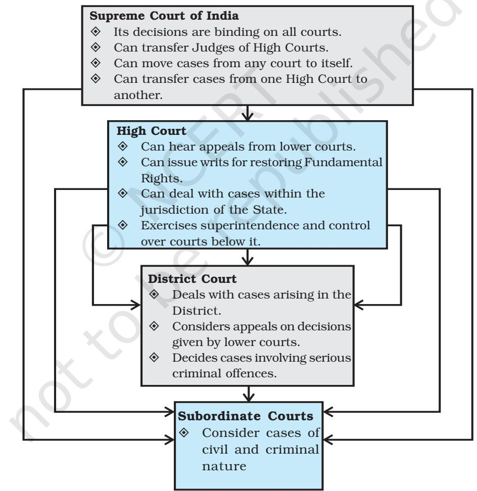
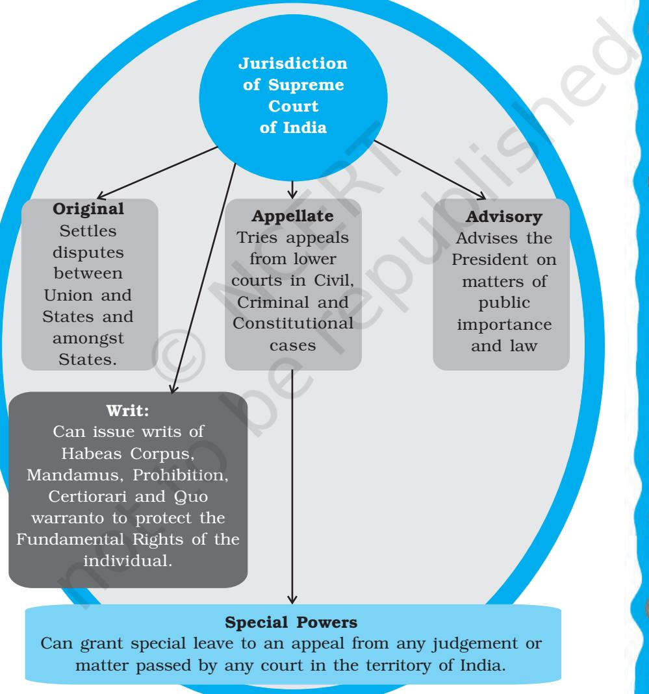
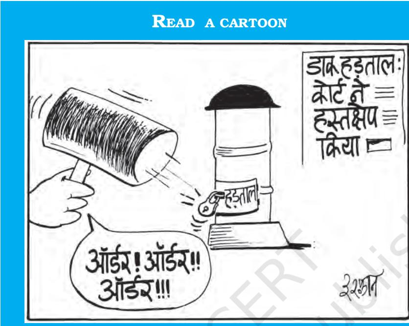
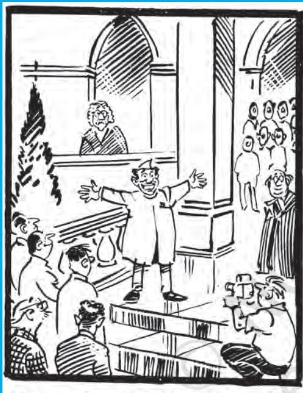

# Chapter Six JUDICIARY

### INTRODUCTION

*Many times, courts are seen only as arbitrators in disputes between individuals or private parties. But judiciary performs some political functions also. Judiciary is an important organ of the government. The Supreme Court of India is in fact, one of the very powerful courts in the world. Right from 1950 the judiciary has played an important role in interpreting and in protecting the Constitution. In this chapter you will study the role and importance of the judiciary. In the chapter on fundamental rights you have already read that the judiciary is very important for protecting our rights. After studying this chapter, you would be able to understand*

*Indian Constitution at Work*

- ± *the meaning of independence of judiciary;*
- ± *the role of Indian Judiciary in protecting our rights;*
- ± *the role of the Judiciary in interpreting the Constitution; and*
- ± *the relationship between the Judiciary and the Parliament of India.*

### WHY DO WE NEED AN INDEPENDENT JUDICIARY?

In any society, disputes are bound to arise between individuals, between groups and between individuals or groups and government. All such disputes must be settled by an independent body in accordance with the principle of rule of law. This idea of rule of law implies that all individuals — rich and poor, men or women, forward or backward castes — are subjected to the same law. The principal role of the judiciary is to protect rule of law and ensure supremacy of law. It safeguards rights of the individual, settles disputes in accordance with the law and ensures that democracy does not give

way to individual or group dictatorship. In order to be able to do all this, it is necessary that the judiciary is independent of any political pressures.

What is meant by an independent judiciary? How is this independence ensured?

### Independence of Judiciary

Simply stated independence of judiciary means that

- ± the other organs of the government like the executive and legislature must not restrain the functioning of the judiciary in such a way that it is unable to do justice.
- ± the other organs of the government should not interfere with the decision of the judiciary.
- ± judges must be able to perform their functions without fear or favour.

Independence of the judiciary does not imply arbitrariness or absence of accountability. Judiciary is a part of the democratic political structure of the No fisticuffs please, this is rule of law!

READ A CARTOON

125

*I remember the case of Machal mentioned in chapter two. Don't they say, 'justice delayed is justice denied'? Somebody should do something about this.*

126

country. It is therefore accountable to the Constitution, to the democratic traditions and to the people of the country.

How can the independence of judiciary be provided and protected?

The Indian Constitution has ensured the independence of the judiciary through a number of measures. The legislature is not involved in the process of appointment of judges. Thus, it was believed that party politics would not play a role in the process of appointments. In order to be appointed as a judge, a person must have experience as a lawyer and/or must be well versed in law. Political opinions of the person or his/ her political loyalty should not be the criteria for appointments to judiciary.

The judges have a fixed tenure. They hold office till reaching the age of retirement. Only in exceptional cases, judges may be removed. But otherwise, they have security of tenure. Security of tenure ensures that judges could function without fear or favour. The Constitution prescribes a very difficult procedure for removal of judges. The Constitution makers believed that a difficult procedure of removal would provide security of office to the members of judiciary.

The judiciary is not financially dependent on either the executive or legislature. The Constitution provides that the salaries and allowances of the judges are not subjected to the approval of the legislature. The actions and decisions of the judges are immune from personal criticisms. The judiciary has the power to penalise those who are found guilty of contempt of court. This authority of the court is seen as an effective protection to the judges from unfair criticism. Parliament cannot discuss the conduct of the judges except when the proceeding to remove a judge is being carried out. This gives the judiciary independence to adjudicate without fear of being criticised.

### *Activity*

Hold a debate in class on the following topic.

Which of the following factors do you think, work as constraints over the judges in giving their rulings? Do you think these are justified?

- ± Constitution
- ± Precedents
- ± Opinion of other courts
- ± Public opinion
- ± Media
- ± Traditions of law
- ± Laws
- ± Time and staff constraints
- ± Fear of public criticism
- ± Fear of action by executive

### Appointment of Judges

The appointment of judges has never been free from political controversy. It is part of the political process. It makes a difference who serves in the Supreme Court and High Court— a difference in how the Constitution is interpreted. The political philosophy of the judges, their views about active and assertive judiciary or controlled and committed judiciary have an impact on the fate of the legislations enacted. Council of Ministers, Governors and Chief Ministers and Chief Justice of India — all influence the process of judicial appointment.

As far as the appointment of the Chief Justice of India (CJI) is concerned, over the years, a convention had developed whereby the senior-most judge of the Supreme Court was appointed as the Chief Justice of India. This convention was however broken twice. In 1973 A. N. Ray was appointed as CJI superseding three senior Judges. Again, Justice M.H. Beg was appointed superseding Justice H.R. Khanna (1975).

127

*I am afraid, I am getting confused. In a democracy, you can criticise the Prime Minister or even the President, but not the judges! And what is this contempt of court? But am I being guilty of contempt if I asked about these matters?*

*But I think, finally the Council of Ministers would have greater say in appointing judges. Or is it that the judiciary is a selfappointing body?*

The other Judges of the Supreme Court and the High Court are appointed by the President after 'consulting' the CJI. This, in effect, meant that the final decisions in matters of appointment rested with the Council of Ministers. What then, was the status of the consultation with the Chief Justice?

This matter came up before the Supreme Court again and again between 1982 and 1998. Initially, the court felt that role of the Chief Justice was purely consultative. Then it took the view that the opinion of the Chief Justice must be followed by the President. Finally, the Supreme Court has come up with a novel procedure: it has suggested that the Chief Justice should recommend names of persons to be appointed in consultation with four senior-most judges of the Court. Thus, the Supreme Court has established the principle of collegiality in making recommendations for appointments. At the moment therefore, in matters of appointment the decision of the group of senior judges of the Supreme Court carries greater weight. Thus, in matters of appointment to the judiciary, the Supreme Court and the Council of Ministers play an important role.

### Removal of Judges

The removal of judges of the Supreme Court and the High Courts is also extremely difficult. A judge of the Supreme Court or High Court can be removed only on the ground of proven misbehaviour or incapacity. A motion containing the charges against the judge must be approved by special majority in both Houses of the Parliament. Do you remember what special majority means? We have studied this in the chapter on Elections. It is clear from this procedure that removal of a judge is a very difficult procedure and unless there is a general consensus among Members of the Parliament, a judge cannot be removed. It should also be noted that while in making appointments, the executive plays a crucial role; the legislature has the powers of removal. This has ensured

128

both balance of power and independence of the judiciary. So far, only one case of removal of a judge of the Supreme Court came up for consideration before Parliament. In that case, though the motion got two-thirds majority, it did not have the support of the majority of the total strength of the House and therefore, the judge was not removed.

#### Unsuccessful Attempt to Remove a Judge

In 1991 the first-ever motion to remove a Supreme Court Justice was signed by 108 members of Parliament. Justice V. Ramaswami, during his tenure as the Chief Justice of the Punjab and Haryana High Court was accused of misappropriating funds. In 1992, a year after Parliament had started the removal proceedings, a high-profile inquiry commission consisting of Judges of the Supreme Court found Justice V. Ramaswami "guilty of wilful and gross misuses of office . . . and moral turpitude by using public funds for private purposes and reckless disregard of statutory rules" while serving as the Chief Justice of the Punjab and Haryana High Court. Despite this strong indictment, Ramaswami survived the parliamentary motion recommending removal. The motion recommending his removal got the required two-thirds majority among the members who were present and voting, but the Congress party abstained from voting in the House. Therefore, the motion could not get the support of one-half of the total strength of the House.

#### Check your progress

- ± *Why is independence of the judiciary important?*
- ± *Do you think that executive should have the power to appoint judges?*
- ± *If you were asked to make suggestions for changing the procedure of appointing judges, what changes would you suggest?*

129

### STRUCTURE OF THE JUDICIARY

The Constitution of India provides for a single integrated judicial system. This means that unlike some other federal countries of the world, India does not have separate State courts. The structure of the judiciary in India is pyramidal with the Supreme Court at the top, High Courts below them and district and subordinate courts at the lowest level (*see the diagram below*). The lower courts function under the direct superintendence of the higher courts.

130

### Jurisdiction of Supreme Court

The Supreme Court of India is one of the very powerful courts anywhere in the world. However, it functions within the limitations imposed by the Constitution. The functions and responsibilities of the Supreme Court are defined by the Constitution. The Supreme Court has specific jurisdiction or scope of powers.

131

### Original Jurisdiction

Original jurisdiction means cases that can be directly considered by the Supreme Court without going to the lower courts before that. From the diagram above, you will notice that cases involving federal relations go directly to the Supreme Court. The Original Jurisdiction of the Supreme Court establishes it as an umpire in all disputes regarding federal matters. In any federal country, legal disputes are bound to arise between the Union and the States; and among the States themselves. The power to resolve such cases is entrusted to the Supreme Court of India. It is called original jurisdiction because the Supreme Court alone has the power to deal with such cases. Neither the High Courts nor the lower courts can deal with such cases. In this capacity, the Supreme Court not just settles disputes but also interprets the powers of Union and State government as laid down in the Constitution.

### Writ Jurisdiction

As you have already studied in the chapter on fundamental rights, any individual, whose fundamental right has been violated, can directly move the Supreme Court for remedy. The Supreme Court can give special orders in the form of writs. The High Courts can also issue writs, but the persons whose rights are violated have the choice of either approaching the High Court or approaching the Supreme Court directly. Through such writs, the Court can give orders to the executive to act or not to act in a particular way.

### Appellate Jurisdiction

The Supreme Court is the highest court of appeal. A person can appeal to the Supreme Court against the decisions of the High Court. However, High Court must certify that the case is fit for appeal, that is to say that it involves a serious matter of interpretation of law or Constitution. In addition, in criminal cases, if the lower court has sentenced a person to death then an appeal can be made to the High Court or Supreme Court. Of course, the Supreme Court holds the powers to decide whether to admit appeals even when appeal is not allowed by the High Court. Appellate jurisdiction means that the Supreme Court will reconsider the case and the legal issues involved

132

in it. If the Court thinks that the law or the Constitution has a different meaning from what the lower courts understood, then the Supreme Court will change the ruling and along with that also give new interpretation of the provision involved.

The High Courts too, have appellate jurisdiction over the decisions given by courts below them.

### Advisory Jurisdiction

In addition to original and appellate jurisdiction, the Supreme Court of India possesses advisory jurisdiction also. This means that the President of India can refer any matter that is of public importance or that which involves interpretation of Constitution to Supreme Court for advice. However, the Supreme Court is not bound to give advice on such matters and the President is not bound to accept such an advice.

What then is the utility of the advisory powers of the Supreme Court? The utility is two-fold. In the first place, it allows the government to seek legal opinion on a matter of importance before taking action on it. This may prevent unnecessary litigations later. Secondly, in the light of the advice of the Supreme Court, the government can make suitable changes in its action or legislations.

### *Article 137*

*…….. the Supreme Court shall have power to review any judgment pronounced or order made by it.*

### *Article 144*

*…… All authorities, civil and judicial, in the territory of India shall act in aid of the Supreme Court.*

*advice is also optional? I thought that the Courts gave decisions that were binding!*

*Why is the Supreme Court allowed to change its own ruling? Is it because courts can also make mistakes? Is it possible that the same judge is part of the 'Bench' that revises the ruling and was also on the Bench that gave the ruling in the first place?*

134

Read the articles quoted above. These articles help us to understand the unified nature of our judiciary and the powers of the Supreme Court. Decisions made by the Supreme Court are binding on all other courts within the territory of India. Orders passed by it are enforceable throughout the length and breadth of the country. The Supreme Court itself is not bound by its decision and can at any time review it. Besides, if there is a case of contempt of the Supreme Court, then the Supreme Court itself decides such a case.

### Check your progress

*Match the following*

Dispute between State of Bihar and Union of India will be heard by

Appeal from District court of Haryana will go to

Single Integrated Judiciary

Declaring a law unconstitutional

High Court

Advisory Jurisdiction

Judicial review

Original Jurisdiction

Supreme Court

Single Constitution

### JUDICIAL ACTIVISM

Have you heard of the term judicial activism? Or, Public Interest Litigation?

Both these terms are often used in the discussions about judiciary in recent times. Many people think that these two things have revolutionised the functioning of judiciary and made it more people-friendly.

*Chapter 6: Judiciary*

135

*Irfan*

The chief instrument through which judicial activism has flourished in India is Public Interest Litigation (PIL) or Social Action Litigation (SAL). What is PIL or SAL? How and when did it emerge? In normal course of law, an individual can approach the courts only if he/she has been personally aggrieved. That is to say, a person whose rights have been violated, or who is involved in a dispute, could move the court of law. This concept underwent a change around 1979. In 1979, the Court set the trend when it decided to hear a case where the case was filed not by the aggrieved persons but by others on their behalf. As this case involved a consideration of an issue of public interest, it and such other cases came to be known as public interest litigations. Around the same time, the Supreme Court also took up the case about rights of prisoners. This opened the gates for large number of cases where public spirited citizens and voluntary organisations sought judicial intervention for protection of existing rights, betterment of life conditions of the poor,

Do you know that in recent times the judiciary has ruled that bandhs and hartals are illegal?

*I have heard someone say that PIL means 'private interest litigation'. Why would that be so?*

protection of the environment, and many other issues in the interest of the public. PIL has become the most important vehicle of judicial activism.

Judiciary, which is an institution that traditionally confined to responding to cases brought before it, began considering many cases merely on the basis of newspaper reports and postal complaints received by the court. Therefore, the term judicial activism became the more popular description of the role of the judiciary.

#### Some Early PILs

- ± In 1979, newspapers published reports about 'under trials'. There were many prisoners in Bihar who had spent long years in jail, longer than what they would have spent if they had been punished for the offences for which they were arrested. This report prompted an advocate to file a petition. The Supreme Court heard this case. It became famous as one of the early Public Interest Litigations (PILs). This was the Hussainara Khatoon vs. Bihar case. ± In 1980, a prison inmate of the Tihar jail managed to send a scribbled piece of paper to
Justice Krishna Iyer of the Supreme Court narrating physical torture of the prisoners. The judge got it converted into a petition. Though later on, the Court abandoned the practice of considering letters, this case, known as Sunil Batra vs. Delhi Administration (1980) also became one of the pioneers of public interest litigation.

Through the PIL, the court has expanded the idea of rights. Clean air, unpolluted water, decent living, etc., are rights for the entire society. Therefore, it was felt by the courts that individuals as parts of the society must have the right to seek justice wherever such rights were violated.

Secondly, through PIL and judicial activism of the post-1980 period, the judiciary has also shown readiness to take into consideration rights of those sections who

cannot easily approach the courts. For this purpose, the judiciary allowed public spirited citizens, social organisations and lawyers to file petitions on behalf of the needy and the deprived.

It must be remembered that the problems of the poor …are qualitatively different from those which have hitherto occupied the attention of the Court and they need ….a different kind of judicial approach. If we blindly follow the adversarial procedure in their case, they would never be able to enforce their fundamental rights. — Justice Bhagwati in Bandhua Mukti Morcha vs. Union of India, 1984.

#### *Activity*

Find out the details about at least one case involving a PIL and study the way in which that case helped in serving public interest.

Judicial activism has had manifold impact on the political system. It has democratised the judicial system by giving not just to individuals but also groups access to the courts. It has forced executive accountability. It has also made an attempt to make the electoral system much more free and fair. The court asked candidates contesting elections to file affidavits indicating their assets and income along with educational qualifications so that the people could elect their representatives based on accurate knowledge.

There is however a negative side to the large number of PILs and the idea of a proactive judiciary. In the first place it has overburdened the courts. Secondly, judicial activism has blurred the line of distinction between the executive and legislature on the one hand and the judiciary on the other. The court has been involved in resolving questions which belong to the executive. Thus, for

137

*I think judicial activism is more about telling the legislature and the executive what they should do. What will happen if the legislature and executive started giving justice?*

instance, reducing air or sound pollution or investigating cases of corruption or bringing about electoral reform is not exactly the duty of the Judiciary. These are matters to be handled by the administration under the supervision of the legislatures. Therefore, some people feel that judicial activism has made the balance among the three organs of government very delicate. Democratic government is based on each organ of government respecting the powers and jurisdiction of the others. Judicial activism may be creating strains on this democratic principle.

### YOU ARE THE JUDGE

A group of citizens from a city have approached the court through a PIL asking for an order to the city municipal authorities to remove slums and beautify the city in order to attract investors to the city. They argue that this is in the 'public interest.' The residents of the slum localities have responded by saying that this will encroach on their right to life. They argue that right to life is more central to 'public interest' than the right to a clean city.

Imagine that you are the judge.

Write a judgement deciding if the PIL involves 'public interest'.

### JUDICIARY AND RIGHTS

We have already seen that the judiciary is entrusted with the task of protecting rights of individuals. The Constitution provides two ways in which the Supreme Court can remedy the violation of rights.

- ± First it can restore fundamental rights by issuing writs of Habeas Corpus; mandamus etc. (article 32). The High Courts also have the power to issue such writs (article 226).
- ± Secondly, the Supreme Court can declare the concerned law as unconstitutional and therefore non-operational (article 13).

138

Together these two provisions of the Constitution establish the Supreme Court as the protector of fundamental rights of the citizen on the one hand and interpreter of Constitution on the other. The second of the two ways mentioned above involves judicial review.

Perhaps the most important power of the Supreme Court is the power of judicial review. Judicial Review means the power of the Supreme Court (or High Courts) to examine the constitutionality of any law if the Court arrives at the conclusion that the law is inconsistent with the provisions of the Constitution, such a law is declared as unconstitutional and inapplicable. The term judicial review is nowhere mentioned in the Constitution. However, the fact that India has a written constitution and the Supreme Court can strike down a law that goes against fundamental rights, implicitly gives the Supreme Court the power of judicial review.

Besides, as we saw in the section on jurisdiction of the Supreme Court, in the case of federal relations too, the Supreme Court can use the review powers if a law is inconsistent with the distribution of powers laid down by the Constitution. Suppose, the central government makes a law, which according to some States, concerns a subject from the State list. Then the States can go to the Supreme Court and if the court agrees with them, it would declare that the law is unconstitutional. In this sense, the review power of the Supreme Court includes power to review legislations on the ground that they violate fundamental rights or on the ground that they violate the federal distribution of powers. The review power extends to the laws passed by State legislatures also.

Together, the writ powers and the review power of the Court make judiciary very powerful. In particular, the review power means that the judiciary can interpret the Constitution and the laws passed by the legislature. Many people think that this feature enables the judiciary to protect the Constitution effectively and also to protect the rights of citizens. The practice of entertaining PILs has further added to the powers of the judiciary in protecting rights of citizens.

139

*I think I'd rather become a judge! Then, I won't have to worry about elections and public support, and can still have really lots of power.*

Did you know that the practice of public interest litigation is now becoming more and more acceptable in many other countries? While many courts across the world, particularly in South Asia and Africa practice some form of judicial activism comparable to that of the Indian judiciary, the constitution of South Africa has incorporated public interest litigation in its bill of rights. Thus, in South Africa, it is a fundamental right of the citizen to bring before the Constitutional Court, cases of violation of other persons' rights.

Do you remember that in the chapter on rights we mentioned the right against exploitation? This right prohibits forced labour, trade in human flesh and prohibits employment of children in hazardous jobs. But the question is: how could those, whose rights were violated, approach the court? PIL and judicial activism made it possible for courts to consider these violations. Thus, the court considered a whole set of cases: the blinding of the jail inmates by the police, inhuman working conditions in stone quarries, sexual exploitation of children, and so on. This trend has made rights really meaningful for the poor and disadvantaged sections.

#### Check your progress

- ± *When does the Court use the review powers?*
- ± *What is the difference between judicial review and writ?*

### JUDICIARY AND PARLIAMENT

140

Apart from taking a very active stand on the matter of rights, the court has been active in seeking to prevent subversion of the Constitution through political practice. Thus, areas that were considered beyond the scope of judicial review such as powers of the President and Governor were brought under the purview of the courts.

There are many other instances in which the Supreme Court actively involved itself in the administration of justice by giving directions to executive agencies. Thus, it gave directions to CBI to initiate investigations against politicians and bureaucrats in the hawala case, the Narasimha Rao case, illegal allotment of petrol pumps case etc. You may have heard about some of these cases. Many of these instances are the products of judicial activism.

The Indian Constitution is based on a delicate principle of limited separation of powers and checks and balances. This means that each organ of the government has a clear area of functioning. Thus, the Parliament is supreme in making laws and amending the Constitution, the executive is supreme in implementing them while the judiciary is supreme in settling disputes and deciding whether the laws that have been made are in accordance with the provisions of the Constitution. Despite such clear cut division of power the conflict between the Parliament and judiciary, and executive and the judiciary has remained a recurrent theme in Indian politics.

We have already mentioned the differences that emerged between the Parliament and the judiciary over right to property and the Parliament's power to amend the Constitution. Let us recapitulate that briefly:

Immediately after the implementation of the Constitution began, a controversy arose over the Parliament's power to restrict right to property. The Parliament wanted to put some restrictions on the right to hold property so that land reforms could be implemented. The Court held that the Parliament cannot thus restrict fundamental rights. The Parliament then tried to amend the Constitution. But the Court said that even through an amendment, a fundamental right cannot be abridged.

The following issues were at the centre of the controversy between the Parliament and the judiciary.

- ± What is the scope of right to private property?
- ± What is the scope of the Parliament's power to curtail, abridge or abrogate fundamental rights?
- ± What is the scope of the Parliament's power to amend the constitution?
- ± Can the Parliament make laws that abridge fundamental rights while enforcing directive principles?

141

"While there can be no two opinions on the need for the maintenance of judicial independence, ...it is also necessary to keep in view one important principle. The doctrine of independence is not to be raised to the level of a dogma so as to enable the judiciary to function as a kind of super -legislature or super executive. The judiciary is there to interpret the Constitution or adjudicate upon the rights..."

Alladi Krishnaswami Ayyar, CAD, Vol. XI, p. 837, 23 November 1949

During the period 1967 and 1973, this controversy became very serious. Apart from land reform laws, laws enforcing preventive detention, laws governing reservations in jobs, regulations acquiring private property for public purposes, and laws deciding the compensation for such acquisition of private property were some instances of the conflict between the legislature and the judiciary.

In 1973, the Supreme Court gave a decision that has become very important in regulating the relations between the Parliament and the Judiciary since then. This case is famous as the Kesavananda Bharati case. In this case, the Court ruled that there is a basic structure of the Constitution and nobody—not even the Parliament (through amendment)—can violate the basic structure. The Court did two more things. First, it said that right to property (the disputed issue) was not part of basic structure and therefore could be suitably abridged. Secondly, the Court reserved to itself the right to decide whether various matters are part of the basic structure of the Constitution. This case is perhaps the best example of how judiciary uses its power to interpret the Constitution.

This ruling has changed the nature of conflicts between the legislature and the judiciary. As we studied earlier, the right to property was taken away from the list of fundamental rights in 1979

142

and this also helped in changing the nature of the relationship between these two organs of government.

Some issues still remain a bone of contention between the two — can the judiciary intervene in and regulate the functioning of the legislatures? In the parliamentary system, the legislature has the power to govern itself and regulate the behaviour of its members. Thus, the legislature can punish a person who the legislature holds guilty of breaching privileges of the legislature. Can a person who is held guilty for breach of parliamentary privileges seek protection of the courts? Can a member of the legislature against whom the legislature has taken disciplinary action get protection from the court? These issues are unresolved and are matters of potential conflict between the two. Similarly, the Constitution provides that the conduct of judges cannot be discussed in the Parliament. There have been several instances where the Parliament and State legislatures have cast aspersions on the functioning of the judiciary. Similarly, the judiciary too has criticised the legislatures and issued instructions to the legislatures about the conduct of legislative business. The legislatures see this as violating the principle of parliamentary sovereignty.

These issues indicate how delicate the balance between any two organs of the government is and how important it is for each organ of the government in a democracy to respect the authority of others.

#### Check your progress

The main issues in the conflict between the judiciary and the Parliament have been:

- ± *Appointment of judges*
- ± *Salaries and allowances of judges*
- ± *Scope of Parliament's power to amend the Constitution*
- ± *Interference by the Parliament in the functioning of the judiciary*

*Why can't the Court tell us once and for all what are those aspects that are 'basic structure' of the Constitution?*

### READ A CARTOON

How active is the judiciary in trying to curb corruption in public life?

### Conclusion

In this chapter, we have studied the role of the judiciary in our democratic structure. In spite of the tensions that arose from time to time between the judiciary and the executive and the legislature, the prestige of the judiciary has increased considerably. At the same time, there are many more expectations from the judiciary. Ordinary citizens also wonder how it is possible for many people to get easy acquittals and how witnesses change their testimonies to suit the wealthy and the mighty. These are some issues about which our judiciary is concerned too.

You have seen in this chapter that judiciary in India is a very powerful institution. This power has generated much awe and many hopes from it. Judiciary in India is also known for its independence. Through various decisions, the judiciary has given new interpretations to the Constitution and protected the rights of citizens. As we saw in this chapter, democracy hinges on the delicate balance of power between the judiciary and the Parliament and both institutions have to function within the limitations set by the Constitution.

## Exercises

- 1. What are the different ways in which the independence of the judiciary is ensured? Choose the odd ones out.
	- Chief Justice of the Supreme Court is consulted in the appointment of other judges of Supreme Court. i.
	- Judges are generally not removed before the age of retirement. ii.
	- Judge of a High Court cannot be transferred to another High Court. iii.
	- Parliament has no say in the appointment of judges. iv.
- 2. Does independence of the judiciary mean that the judiciary is not accountable to any one? Write your answer in not more than 100 words.
- 3. What are the different provisions in the constitution in order to maintain the independence of judiciary?
- 4. Read the news report below and identify the following aspects:
	- √ What is the case about?
	- √ Who has been the beneficiary in the case?
	- √ Who is the petitioner in the case?
	- √ Visualise what would have been the different arguments put forward by the company.
	- √ What arguments would the farmers have put forward?

#### Supreme Court orders REL to pay Rs 300 crore to Dahanu farmers

*Our Corporate Bureau 24 March 2005*

Mumbai: The Supreme Court has ordered Reliance Energy to pay Rs. 300 crore to farmers who grow the chikoo fruit in the Dahanu area outside Mumbai. The order comes after the chikoo growers petitioned the court against the pollution caused by Reliance's thermal power plant.

Dahanu, which is 150 km from Mumbai, was a self-sustaining agricultural and horticultural economy known for its fisheries and forests just over a decade ago, but was devastated in 1989 when a thermal power plant came into operation in the region. The next year, this fertile belt saw its first crop failure. Now, 70

146

per cent of the crop of what was once the fruit bowl of Maharashtra is gone. The fisheries have shut and the forest cover has thinned. Farmers and environmentalists say that fly ash from the power plant entered ground water and polluted the entire eco-system. The Dahanu Taluka Environment Protection Authority ordered the thermal station to set up a pollution control unit to reduce sulphur emissions, and in spite of a Supreme Court order backing the order the pollution control plant was not set up even by 2002. In 2003, Reliance acquired the thermal station and re-submitted a schedule for installation process in 2004. As the pollution control plant is still not set up, the Dahanu Taluka Environmental Protection Authority asked Reliance for a bank guarantee of Rs. 300 crores.

- 5. Read the following news report and,
	- √ Identify the governments at different levels
	- √ Identify the role of Supreme Court
	- √ What elements of the working of judiciary and executive can you identify in it?
	- √ Identify the policy issues, matters related to legislation, implementation and interpretation of the law involved in this case.

#### Centre, Delhi join hands on CNG issue

*By Our Staff Reporter, The Hindu 23 September 2001* NEW DELHI, SEPT. 22. The Centre and the Delhi Government today agreed to jointly approach the Supreme Court this coming week… for phasing out of all non-CNG commercial vehicles in the Capital. They also decided to seek a dual fuel policy for the city instead of putting the entire transportation system on the single-fuel mode "which was full of dangers and would result in disaster.''

It was also decided to discourage the use of CNG by private vehicle owners in the Capital. Both governments would press for allowing the use of 0.05 per cent low sulphur diesel for running of buses in the Capital. In addition, it would be pleaded before the Court that all commercial vehicles, which fulfil the Euro-II standards, should be allowed to ply in the city. Though both the Centre and the State would file separate affidavits, these would contain common points. The Centre would also go out and support the Delhi Government's stand on the issues concerning CNG.

These decisions were taken at a meeting between the Delhi Chief Minister, Ms. Sheila Dikshit, and the Union Petroleum and Natural Gas Minister, Mr. Ram Naik.

Ms. Dikshit said the Central Government would request the court that in view of the high powered Committee appointed under Dr. R.A. Mashelkar to suggest an "Auto Fuel Policy"' for the entire country, it would be appropriate to extend the deadline as it was not possible to convert the entire 10,000-odd bus fleet into CNG during the prescribed time frame. The Mashelkar Committee is expected to submit its report within a period of six months.

The Chief Minister said time was required to implement the court directives. Referring to the coordinated approach on the issue, Ms. Dikshit said this would take into account the details about the number of vehicles to be run on CNG, eliminating long queues outside CNG filling stations, the CNG fuel requirements of Delhi and the ways and means to implement the directive of the court.

The Supreme Court had …refused to relax the only CNG norm for the city's buses but said it had never insisted on CNG for taxis and auto rickshaws. Mr. Naik said the Centre would insist on allowing use of low sulphur diesel for buses in Delhi as putting the entire transportation system dependent on CNG could prove to be disastrous. The Capital relied on pipeline supply for CNG and any disruption would throw the public transport system out of gear.

- 6. The following is a statement about Ecuador. What similarities or differences do you find between this example and the judicial system in India?
"It would be helpful if a body of common law, or judicial precedent, existed that could clarify a journalist's rights. Unfortunately, Ecuador's courts don't work that way. Judges are not forced to respect the rulings of higher courts in previous cases. Unlike the US, an appellate judge in Ecuador (or elsewhere in South America, for that matter) need not provide a written decision explaining the legal basis of a ruling. A judge may rule one way today and the opposite way, in a similar case, tomorrow, without explaining why."

148

- 7. Read the following statements: Match them with the different jurisdictions the Supreme Court can exercise - Original, Appellate, and Advisory.
	- √ The government wanted to know if it can pass a law about the citizenship status of residents of Pakistan-occupied areas of Jammu and Kashmir.
	- √ In order to resolve the dispute about river Cauvery the government of Tamil Nadu wants to approach the court.
	- √ Court rejected the appeal by people against the eviction from the dam site.
- 8. In what way can public interest litigation help the poor?
- 9. Do you think that judicial activism can lead to a conflict between the judiciary and the executive? Why?
- 10. How is judicial activism related to the protection of fundamental rights? Has it helped in expanding the scope of fundamental rights?

