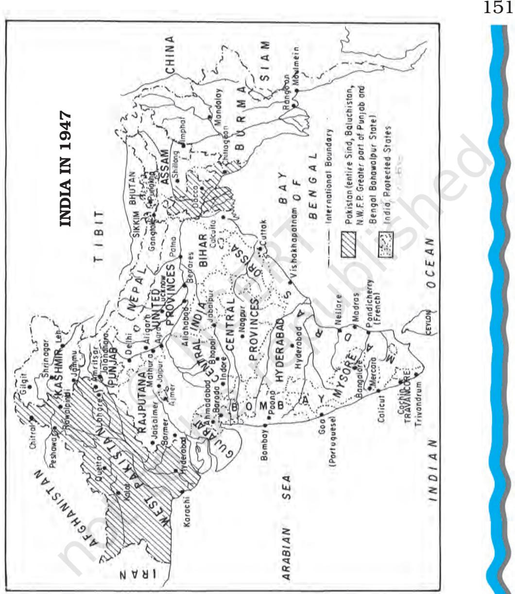
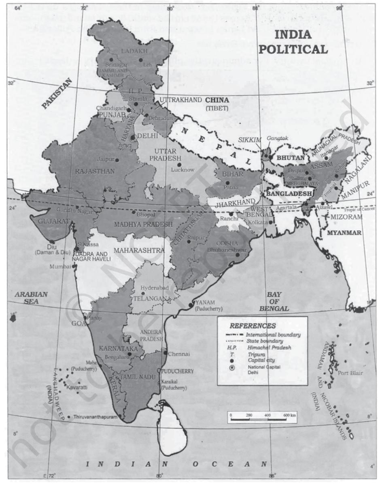
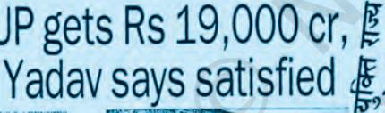
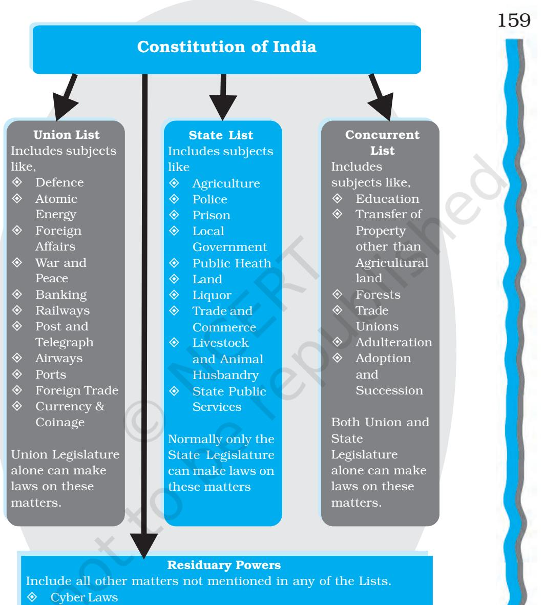
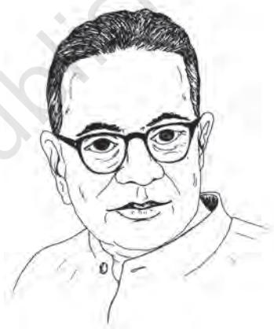
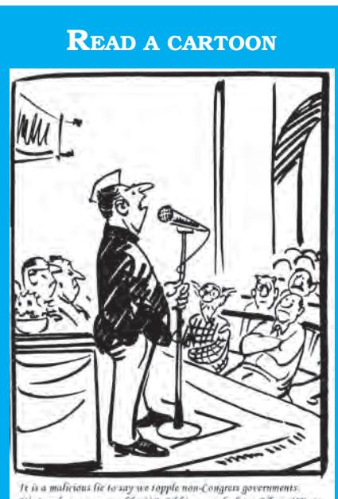
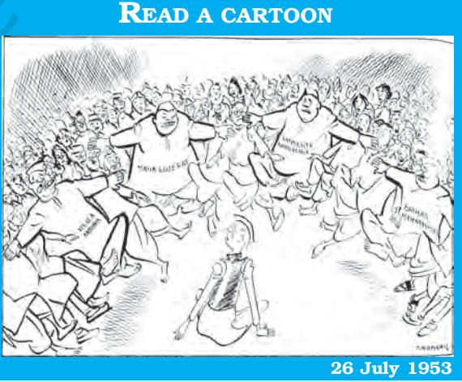
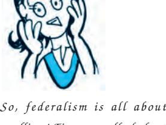

# Chapter Seven FEDERALISM

## INTRODUCTION

*Look at the political maps (on next two pages) of India 1947 and 2017. They have changed dramatically over the years. Boundaries of States have changed, names of States have changed, and the number of States has changed. When India became independent, we had a number of provinces that the British government had organised only for administrative convenience. Then a number of princely states merged with the newly independent Indian union. These were joined to the existing provinces. This is what you see in the first map. Since then boundaries of States have been reorganised many times. During this entire period, not only did boundaries of States change, but in some cases, even their names changed according to the wishes of the people of those States. Thus, Mysore changed to Karnataka and Madras became Tamil Nadu. The maps show these large scale changes that have taken place in the span of over seventy years. In a way, these maps also tell us the story of functioning of federalism in India.*

*Indian Constitution at Work*

*After studying this chapter you will be able to understand the following:*

- ± *what is Federalism;*
- ± *the federal provisions in the Indian Constitution;*
- ± *the issues involved in the relations between the centre and the States; and*
- ± *the special provisions for certain States having a distinct composition and historical features.*

152

## WHAT IS FEDERALISM?

USSR was one of the world's super powers, but after 1989 it simply broke up into several independent countries. One of the major reasons for its break up was the excessive centralisation and concentration of power, and the domination of Russia over other regions with independent languages and cultures of their own e.g. Uzbekistan. Some other countries like Czechoslovakia, Yugoslavia, and Pakistan also had to face a division of the country. Canada came very close to a break up between the English-speaking and the French-speaking regions of that country. Isn't it a great achievement that India, which emerged as an independent nation-state in 1947 after a painful partition, has remained united over seven decades of its independent existence? What accounts for this achievement? Can we attribute it to the federal structure of governance that we in India adopted through our Constitution? All the countries mentioned above, were federations. Yet they could not remain united. Therefore, apart from adopting a federal constitution, the nature of that federal system and the practice of federalism must also be important factors.

Federalism in West Indies You may have heard about the cricket team of West Indies. But is there a country called West Indies?

Like India, West Indies was also colonised by the British. In 1958, the federation of West Indies came into being. It had a weak central government and the economy of each unit was independent. These features and political competition among the units led to the formal dissolution of the federation in 1962. Later, in 1973 by Treaty of Chiguaramas the independent islands established joint authorities in the form of a common legislature, supreme court, a common currency, and, to a degree, a common market known as the Caribbean Community. The Caribbean Community has even a common executive, and Heads of the governments of member countries are members of this executive.

Thus, the units could neither live together as one country, nor can they live separately!

## 153

India is a land of continental proportions and immense diversities. There are more than 20 major languages and several hundred minor ones. It is the home of several major religions. There are several million indigenous peoples living in different parts of the country. In spite of all these diversities we share a common land mass. We have also participated in a common history, especially, when we fought for independence. We also share many other important features. This has led our national leaders to visualise India as a country where there is unity in diversity. Sometimes it is described as unity with diversity.

Federalism does not consist of a set of fixed principles, which are applied, to different historical situations. Rather, federalism as a principle of government has evolved differently in different situations. American federalism – one of the first major attempts to build a federal polity – is different from German or Indian federalism. But there are also a few key ideas and concepts associated with federalism.

- ± Essentially, federalism is an institutional mechanism to accommodate *two sets of polities*—one at the regional level and the other at the national level. Each government is autonomous in its own sphere. In some federal countries, there is even a system of dual citizenship. India has only a single citizenship.
- ± The people likewise, have *two sets of identities* and loyalties—they belong to the region as well as the nation, for example we are Gujaratis or Jharkhandis as well as Indians. Each level of the polity has distinct powers and responsibilities and has a separate system of government.

± The details of this dual system of government are generally spelt out in a *written constitution*, which is considered to be supreme and which is also the source of the power of both sets of government. Certain subjects, which concern the nation as a whole, for example, defence or currency, are the responsibility of the union or central government. Regional or local

*I get it! It's like our school. We have our identity as students of class XI or XII and so on. And we also have competition among the various divisions. But we all belong to the school and are proud of it.*

matters are the responsibility of the regional or State government.

- ± To prevent conflicts between the centre and the State, there is an *independent judiciary to settle disputes*. The judiciary has the powers to resolve disputes between the central government and the States on legal matters about the division of power.
Real politics, culture, ideology and history determine the actual working of a federation. A culture of trust, cooperation, mutual respect and restraint helps federations to function smoothly. Political parties also determine the way a constitution would work. If any single unit or State or linguistic group or ideology comes to dominate the entire federation it could generate a deep resentment among people or its units not sharing the dominant voice. These situations could lead to demands for secession by the aggrieved units or could even result in civil wars. Many countries are embroiled in such conflict situations.

*Yes, I remember what we read in the first chapter: a constitution decides who should have how much power.*

## Federalism in Nigeria

If the regions and various communities do not trust each other, even a federal arrangement can fail to produce unity. The example of Nigeria is instructive:

Till 1914, Northern and Southern Nigeria were two separate British colonies. At the Ibadan Constitutional Conference of 1950 Nigerian leaders decided to form a federal constitution. The three major ethnic groups of Nigeria—Yoruba, Ibo and Hausa-Fulani—controlled the regions of the West, the East and the North respectively. Their attempt to spread their influence to other regions led to fears and conflicts. These led to a military regime. In the 1960 constitution, both federal and regional governments jointly controlled the Nigerian police. In the military-supervised constitution of 1979, no state was allowed to have any civil police.

Though democracy was restored in Nigeria in 1999, religious differences along with conflicts over who will control revenues from the oil resources continue to present problems before the Nigerian federation. Local ethnic communities resist centralised control of the oil resources. Thus, Nigeria is an example of overlap of religious, ethnic and economic differences among the units.

#### Check your progress

2024-25

156

- ± Who decides the powers of the central government in a federation?
- ± How are conflicts between the central government and the States resolved in a federation?

## FEDERALISM IN THE INDIAN CONSTITUTION

Even before Independence, most leaders of our national movement were aware that to govern a large country like ours, it would be necessary to divide the powers between provinces and the central government. There was also awareness that Indian society had regional diversity and linguistic diversity. This diversity needed recognition. People of different regions and languages had to share power and in each region, people of that region should govern themselves. This was only logical if we wanted a democratic government.

The only question was what should be the extent of powers to be enjoyed by the regional governments. In view of the agitation of the Muslim League for greater representation to the Muslims, a compromise formula to give very large powers to the regions was discussed during the negotiations before Partition. Once the decision to partition India was taken, the Constituent Assembly decided to frame a government that would be based on the principles of unity and cooperation between the centre and the States and separate powers to the States. The most important feature of the federal system adopted by the Indian Constitution is the principle that relations between the States and the centre would be based on cooperation. Thus, while recognising diversity, the Constitution emphasised unity.

Do you know for example, that the Constitution of India does not even mention the word federation? This is how the Constitution describes India —

*Article 1: (1) India, that is Bharat, shall be a Union of States. (2) The States and the territories thereof shall be as specified in the First Schedule.*

*After all, the purpose of living together must be that all of us are happy and must make each other be happy.*

*I feel that States would have very little money of their own. How can they manage their affairs? It is like some families where the money is with the husband and the wife has to manage the household.*

## Division of Powers

There are two sets of government created by the Indian Constitution: one for the entire nation called the union government (central government) and one for each unit or State called the State government. Both of these have a constitutional status and clearly identified area of activity. If there is any dispute about which powers come under the control of the union and which under the States, this can be resolved by the Judiciary on the basis of the constitutional provisions. The Constitution clearly demarcates subjects, which are under the exclusive domain of the Union and those under the States. (Study the chart given on the next page carefully. It shows how powers are distributed between the centre and the States.) One of the important aspects of this division of powers is that economic and financial powers are centralised in the hands of the central government by the Constitution. The States have immense responsibilities but very meagre revenue sources.

## Check your progress

- ± Do you think that there is a need for mentioning Residuary powers separately? Why?
- ± Why do the States feel dissatisfied about the division of powers?

158

Union Legislature alone has the power to legislate on such matters

## FEDERALISM WITH A STRONG CENTRAL GOVERNMENT

It is generally accepted that the Indian Constitution has created a strong central government. India is a country of continental dimensions with immense diversities and social problems. The framers of the Constitution believed that we required a federal constitution that would accommodate diversities. But they also wanted to create a strong centre to stem disintegration and bring about social and political change. It was necessary for the centre to have such powers because India at the time of independence was not only divided into provinces created by the British; but there were more than 500 princely states which had to be integrated into existing States or new States had to be created.

"Let me tell my honourable Friends in the House that the drift… in all constitutions has been towards the centre... because of circumstances that have now come into being that the States have become, ...federal or unitary, welfare states from being Police States and the ultimate responsibility as for the economic well-being of the country has become the paramount responsibility of the centre."

T.T. Krishnamachari, CAD, Vol. XI, p. 955-956, 25 November 1949

Besides the concern for unity, the makers of the Constitution also believed that the socio-economic problems of the country needed to be handled by a strong central government in cooperation with the States. Poverty, illiteracy and inequalities of wealth were some of the problems that required planning and coordination. Thus, the concerns for unity and development prompted the makers of the Constitution to create a strong central government.

Let us look at the important provisions that create a strong central government:

- ± The very existence of a State including its territorial integrity is in the hands of Parliament. The Parliament is empowered to 'form a new State by separation of territory from any State or by uniting two or more States…'. It can also alter the boundary of any State or even its name. The Constitution provides for some safeguards by way of securing the view of the concerned State legislature.
- ± The Constitution has certain very powerful emergency provisions, which can turn our federal polity into a highly centralised system once emergency is declared. During an emergency, power becomes lawfully centralised. Parliament also assumes the power to make laws on subjects within the jurisdiction of the States.
- ± Even during normal circumstances, the central government has very effective financial powers and responsibilities. In the first place, items generating revenue are under the control of the central government. Thus, the central government has many revenue sources and the States are mostly dependent on the grants and financial assistance from the centre. Secondly, India adopted planning as the instrument of rapid economic progress and development after independence. Planning led to considerable centralisation of economic decision making. Planning commission appointed by the union government is the coordinating machinery that controls and supervises the resources management of the States. Besides, the Union government uses its discretion to give grants and loans to States. This distribution of economic resources is considered lopsided and has led to charges of discrimination against States ruled by an opposition party.
- ± As you will study later, the Governor has certain powers to recommend dismissal of the State government and the dissolution of the Assembly. Besides, even in normal circumstances, the Governor

*I now understand why our Constitution is not only about borrowing from others. It must have designed federalism according to our needs.*

has the power to reserve a bill passed by the State legislature, for the assent of the President. This gives the central government an opportunity to delay the State legislation and also to examine such bills and veto them completely.

± There may be occasions when the situation may demand that the central government needs to legislate on matters from the State list. This is possible if the move is ratified by the Rajya Sabha. The Constitution clearly states that executive powers of the centre are superior to the executive powers of the States. Furthermore, the central government may choose to

> give instructions to the State government. The following extract from an article of the Constitution makes this clear.

> > *Article 257 (1): The executive power of every State shall be so exercised as not to impede or prejudice the exercise of the executive power of the Union, and the executive power of the Union shall extend to the giving of such directions to a State as may appear to the Government of India to be necessary for that purpose.*

± You have already studied in the chapter on executive that we have an integrated administrative system. The all-India services are common to the entire territory of India and officers chosen for these services serve in the administration of the States. Thus, an IAS officer who becomes the collector or an IPS officer who serves as the Commissioner of Police, are under the control of the central government. States can neither take disciplinary action nor can they remove these officers from service.

*Oh! The central government appears to me to be allpowerful. Don't the States complain about it?*

- ± Articles 33 and 34 authorise the Parliament to protect persons in the service of the union or a state in respect of any action taken by them during martial law to maintain or restore order. This provisions further strengthens the powers of the union government. The Armed Forces Special Powers Act has been made on the basis of these provisions. This Act has created tensions between the people and the armed forces on some occasions.
## Check your progress

- ± Give two reasons for the claim that our Constitution has a unitary bias.
- ± Do you think that:
	- √ a strong centre makes the States weak?
	- √ strong States will weaken the centre?

## CONFLICTS IN INDIA'S FEDERAL SYSTEM

In the previous section, we have seen that the Constitution has vested very strong powers in the centre. Thus, the Constitution recognises the separate identity of the regions and yet gives more powers to the centre. Once the principle of identity of the State is accepted, it is quite natural that the States would expect a greater role and powers in the governance of the State and the country as a whole. This leads to various demands from the States. From time to time, States have demanded that they should be given more powers and more autonomy. This leads to tensions and conflicts in the relations between the centre and the States. While the legal disputes between the centre and the States (or between States) can be resolved by the judiciary, demands for autonomy are of political nature and need to be resolved through negotiations.

### Centre-State Relations

The Constitution is only a framework or a skeleton, its flesh and blood is provided by the actual processes of politics. Hence federalism 163

in India has to a large extent been influenced by the changing nature of the political process. In the 1950s and early 1960s the foundation of our federalism was laid under Jawaharlal Nehru. It was also a period of Congress dominance over the centre as well as the States. Except on the issue of formation of new States, the relations between the centre and the States remained quite normal during this period. The States were hopeful that they would be making progress with the help of the grants-in-aid from the centre. Besides, there was considerable optimism about the policies of socio-economic development designed by the centre.

In the middle of the 1960s Congress dominance declined somewhat and in a large number of States opposition parties came to power. It resulted in demands for greater powers and greater autonomy to the States. In fact, these demands were a direct fallout of the fact that different parties were ruling at the centre and in many States. So, the State governments were protesting against what they saw as unnecessary interference in their governments by the Congress government at the centre. The Congress too, was not very comfortable with the idea of dealing with governments led by opposition parties. This peculiar political context gave birth to a discussion about the concept of autonomy under a federal system.

Finally, since the 1990s, Congress dominance has largely ended and we have entered an era of coalition politics especially at the centre. In the States too, different parties, both national and regional, have come to power. This has resulted in a greater say for the States, a respect for diversity and the beginning of a more mature federalism. Thus, it is in the second phase that the issue of autonomy became very potent politically.

## Demands for Autonomy

Many States and even many political parties have, from time to time, demanded that States should have more autonomy vis-à-vis the central government. However,

*This is quite interesting. So, laws and constitutions alone do not decide everything. After all, actual politics decides the nature of our government!*

'autonomy' refers to different things for different States and parties.

- ± Sometimes, these demands expect that the division of powers should be changed in favour of the States and more powers and important powers be assigned to the States. Many States (Tamil Nadu, Punjab, West Bengal) and many parties (DMK, Akali Dal, CPI-M) have made demands of autonomy from time to time.
- ± Another demand is that States should have independent sources of revenue and greater control over the resources. This is also known as financial autonomy. In 1977, the Left Front Government in West Bengal brought out a document demanding a restructuring of centre-State relations in India. In the autonomy demands of Tamil Nadu and Punjab also, there was an implicit support to the idea of greater financial powers.
- ± The third aspect of the autonomy demands relates to administrative powers of the States. States resent the control of the centre over the administrative machinery.

*Yes, I know that Hindi is India's official language. But many of my friends from different parts of the country don't know Hindi.*

- ± Fourthly, autonomy demands may also be related to cultural and linguistic issues. The opposition to the domination of Hindi (in Tamil Nadu) or demand for advancing the Punjabi language and culture are instances of this. Some States also feel that there is a domination of the Hindi-speaking areas over the others. In fact, during the decade of 1960s, there were agitations in some States against the imposition of the Hindi language.

During discussion on the national language in the Constituent Assembly, Nehru had to appeal to the Hindispeaking provinces to show greater tolerance towards others. *Don't spare me Shankar*, p.24

Shankar. Copyright: Children's Book Trust.

## READ A CARTOON

"When Nehru was appointing governors, some were reluctant to quit ministerial chairs."

*Don't spare me Shankar*, p.89

#### *Indian Constitution at Work*

### Role of Governors and President's Rule

The role of Governors has always been a controversial issue between the States and the central government. The Governor is not an elected office-holder. Many Governors have been retired military officers or civil servants or politicians. Besides, the Governor is appointed by the central government and therefore, actions of the Governor are often viewed as interference by the Central government in the functioning of the State government. When two different parties are in power at the centre and the State, the role of the Governor becomes even more controversial. The Sarkaria Commission that was appointed by the central government (1983; it submitted its report in 1988) to examine the issues relating to centre-State relations, recommended that appointments of Governors should be strictly non-partisan.

Powers and role of the Governor become controversial for one more reason. One of the

most controversial articles in the Constitution is Article 356, which provides for President's rule in any State. This provision is to be applied, when 'a situation has arisen in which the Government of the State cannot be carried on in accordance with the provisions of this Constitution.' It results in the takeover of the State government by the Union government. The President's proclamation has to be ratified by Parliament. President's rule can be extended till three years. The Governor has the power to recommend the dismissal of the State government and suspension or dissolution of State assembly. This has led to many conflicts. In some cases, State governments were dismissed even when they had a majority in the legislature, as had happened in Kerala in 1959 or without testing their majority, as happened in several other States after 1967. Some cases went to the Supreme Court and the Court has ruled that constitutional validity of the decision to impose President's rule can be examined by the judiciary.

*Chapter 7: Federalism*

Toppling the State governments. Everyone loves to play this game!

Article 356 was very sparingly used till 1967. After 1967 many States had non-Congress governments and the Congress was in power at the centre. The centre has often used this provision to dismiss State governments or has used the office of the Governor to prevent the majority party or coalition from assuming office. For instance, the central government removed elected governments in Andhra Pradesh and Jammu and Kashmir in the decade of 1980s.

## Demands for New States

The other dimension of tension in our federal system has been the demand to create new

States. The national movement not only created a pan-Indian national unity; it also generated distinct unity around a common language, region and culture. Our national movement was also a movement for democracy. Therefore, in the course of the national movement itself, it was decided that as far as possible, States would be created on the basis of common cultural and linguistic identity.

This ultimately led to the demand for the creation of

Flood of demands for creating new States

Shankar. Copyright: Children's Book Trust.

167

linguistic States after Independence. In December 1953, the States Reorganisation Commission was set up and it recommended the creation of linguistic States, at least for the major linguistic groups. In 1956, reorganisation of some States took place. This saw the beginning of the creation of linguistic States and the process is still continuing. Gujarat and Maharashtra were created in 1960; Punjab and Haryana were separated from each other in 1966. Later, the North Eastern region was reorganised and new States like Manipur, Tripura, Meghalaya, Mizoram and Arunachal Pradesh were created.

## *Activity*

Make a list of the States of India and find out the year in which each of the States was created.

In 2000, some of the larger States were further divided both to meet the demands for a separate State as well as to meet the need for greater administrative efficiency. Thus Madhya Pradesh, Uttar Pradesh and Bihar were divided to create three new States. They are: Chhattisgarh, Uttarakhand and Jharkhand respectively. In 2014, the State of Telangana was formed by dividing Andhra Pradesh. Some regions and linguistic groups are still struggling for separate Statehood like Vidarbha in Maharashtra.

## Interstate Conflicts

While the States keep fighting with the centre over autonomy and other issues like the share in revenue resources, there have been many instances of disputes between two States or among more than two States. It is true that the judiciary acts as the arbitration mechanism on disputes of a legal nature but these disputes are in reality not just legal. They have political implications and therefore they can best be resolved only through negotiations and mutual understanding.

*conflicts! First, we talked about Centre-State conflicts and now conflict among States. Can't we live together peacefully?*

Broadly, two types of disputes keep recurring. One is the border dispute. States have certain claims over territories belonging to neighbouring States. Though language is the basis of defining boundaries of the States, often border areas would have populations speaking more than one language. So, it is not easy to resolve this dispute merely on the basis of linguistic majority. One of the longstanding border disputes is the dispute between Maharashtra and Karnataka over the city of Belgaum. Manipur and Nagaland too, have a long-standing border dispute. The carving out of Haryana from the erstwhile State of Punjab has led to dispute between the two States not only over border areas, but over the capital city of Chandigarh. This city today houses the capital of both these States. In 1985, the then Prime Minister Rajiv Gandhi reached an understanding with the leadership of Punjab. According to this understanding, Chandigarh was to be handed over to Punjab. But this has not happened yet.

While border disputes are more about sentiment, the disputes over the sharing of river waters are even more serious, because they are related to problems of drinking water and agriculture in the concerned States. You might have heard about the 'Kaveri' water dispute. This is a major issue between Tamil Nadu and Karnataka. Farmers in both the States are dependent on Cauvery waters. Though there is a river water tribunal to settle water disputes, this dispute has reached the Supreme Court. In another similar dispute Gujarat, Madhya Pradesh and Maharashtra are battling over sharing the waters of Narmada river. Rivers are a major resource and therefore, disputes over river waters test the patience and cooperative spirit of the States.

### *Activity*

Collect information about at least one dispute about river waters involving two or more States.

169

*Yes, conflict over Governors, over language, over borders and over water….and yet we manage to live together!*

### Check your progress

- ± Why do States want more autonomy?
- ± What is the difference between autonomy and secession?

## SPECIAL PROVISIONS

The most extra-ordinary feature of the federal arrangement created in India is that many States get a differential treatment. We have already noted in the chapter on Legislature that the size and population of each State being different, an asymmetrical representation is provided in the Rajya Sabha. While ensuring minimum representation to each of the smaller States, this arrangement also ensures that larger States would get more representation.

In the case of division of powers, too, the Constitution provides a division of powers that is common to all the States. And yet, the Constitution has some special provisions for some States given their peculiar social and historical circumstances. Most of the special provisions pertain to the north eastern States (Assam, Nagaland, Arunachal Pradesh, Mizoram, etc.) largely due to their sizeable indigenous tribal population with a distinct history and culture. However, these provisions have not been able to stem alienation and the insurgency in parts of the region. Special provisions also exist for hilly States like Himachal Pradesh and some other States like Andhra Pradesh, Goa, Gujarat, Maharashtra Sikkim and Telangana.

## Jammu and Kashmir

The other State which had a special status was Jammu and Kashmir (J&K) (Art. 370). Jammu and Kashmir was one of the large princely States, which had the option of joining India or Pakistan or remaining independent.

*I now understand what they meant by 'intelligent and balanced design' in the first chapter.*

However, immediately after independence in October, 1947 Pakistan sent tribal infiltrators from its side to capture Kashmir. This forced the Maharaja Hari Singh to ask for Indian help and acceded to the Indian Union.

Many of the Muslim majority areas in the Western and Eastern parts joined Pakistan but J&K was an exception. Under these circumstances, it was given much greater autonomy by the Constitution. According to Article 370, the concurrence of the State was required for making any laws in matters mentioned in the Union and Concurrent lists. This was different from the position of other states. In the case of the other States, the division of powers as listed through three lists automatically applies. In the case of Jammu and Kashmir, the central government had only limited powers and other powers listed in the Union list and Concurrent list could be used only with the consent of the State government. This gave greater autonomy to the State of Jammu and Kashmir.

Earlier, there was a constitutional provision that allowed the President, with the concurrence of the State government, to specify which parts of the Union list should apply to the State. The President had issued two Constitutional orders in concurrence with the government of J&K making large parts of the Constitution applicable to the State. As a result, though J&K had a separate constitution and a flag, the Parliament's power to make laws on subjects in the Union List was fully accepted.

The remaining difference between the other States and the State of J&K were that no emergency due to internal disturbances could be declared in J&K without the concurrence of the State. The Union government could not impose a financial emergency in the State and the Directive Principles did not apply in J&K. Amendments to the Indian Constitution (under Art. 368) could apply in concurrence with the government of J&K.

At present, the special status given under 370 no longer exists. By the Jammu and Kashmir reorganisation Act 2019, the State has been bifurcated into two Union Territories viz., (i) Jammu and Kashmir and (ii) Ladakh. The new arrangement has come into effect from 31 October, 2019.

## Conclusion

Federalism is like a rainbow, where each colour is separate, yet together they make a harmonious pattern. Federalism has to continuously maintain a difficult balance between the centre and the States. No legal or institutional formula can guarantee the smooth functioning of a federal polity. Ultimately, the people and the political process must develop a culture and a set of values and virtues like mutual trust, toleration and a spirit of cooperation. Federalism celebrates both unity as well as diversity. National unity cannot be built by streamlining differences. Such forced unity only generates greater social strife and alienation and tends finally to destroy unity. A responsive polity sensitive to diversities and to the demands for autonomy can alone be the basis of a cooperative federation.

## Exercises

- 1. From the list of following events which ones would you identify with the functioning of federalism? Why?
	- √ The Centre on Tuesday announced Sixth Schedule status to GNLF-led Darjeeling Gorkha Hill Council, which would ensure greater autonomy to the governing body in the Hill district of West Bengal. A tripartite Memorandum of Settlement was signed in New Delhi between the Centre, West Bengal government and the Subhas Ghising-led Gorkha National Liberation Front (GNLF) after two days of hectic deliberations.
	- √ Government for action plan for rain-hit States: Centre has asked the rain-ravaged States to submit detailed plans for reconstruction to enable it to respond to their demands for extra relief expeditiously.

√ New Commissioner for Delhi: The Capital is getting a new municipal commissioner. Confirming this, present MCD Commissioner Rakesh Mehta said he has received his transfer orders and that he is likely to be replaced by IAS officer Ashok Kumar, who is serving as the Chief Secretary in Arunachal Pradesh. Mehta, a 1975 batch IAS officer, has been heading the MCD for about three-and-a-half years.

172

- √ CU Status for Manipur University: Rajya Sabha on Wednesday passed a Bill to convert the Manipur University into a Central University with the Human Resource Development Minister promising such institutions in the North Eastern States of Arunachal Pradesh, Tripura and Sikkim as well.
- √ Funds released: The Centre has released Rs. 553 lakh to Arunachal Pradesh under its rural water supply scheme. The first instalment was of Rs. 466.81 lakh.
- √ We'll teach the Biharis how to live in Mumbai: Around 100 Shiv Sainiks stormed J. J. Hospital, disrupted daily operations, raised slogans and threatened to take matters into their own hands if no action was taken against non-Maharashtrian students.
- √ Demand for dismissal of Government: The Congress Legislature Party (CLP) in a representation submitted to State Governor recently, has demanded dismissal of the ruling Democratic Alliance of Nagaland (DAN) government for its alleged financial mismanagement and embezzlement of public money.
- √ NDA government asks naxalites to surrender arms: Amid a walkout by opposition RJD and its allies Congress and CPI (M), the Bihar government today appealed to the naxalites to shun the path of violence and reaffirmed its pledge to root out unemployment to usher in a new era of development in Bihar.
- 2. Think which of the following statements would be correct. State why.
	- √ Federalism enhances the possibility of people from different regions to interact without the fear of one's culture being imposed upon them by others.
	- √ Federal system will hinder easier economic transaction between two different regions that have distinct types of resources.
	- √ A federal system will ensure that the powers of those at the centre will remain limited.
- 3. Based on the first few articles of Belgian constitution given below – explain how federalism is visualised in that country. Try and write a similar Article for the Constitution of India.

### Title I: On Federal Belgium, its components and its territory.

173

Article 1 : Belgium is a Federal State made up of communities and regions.

Article 2 : Belgium is made up of three communities: The French Community, the Flemish Community and the German Community.

Article 3 : Belgium is made up of three regions: The Walloon region, the Flemish region and the Brussels region.

Article 4 : Belgium has four linguistic regions: The Frenchspeaking region, the Dutch-speaking region, the bilingual region of Brussels Capital and the German-speaking region. Each «commune» (county borough) of the Kingdom is part of one of these linguistic regions. ……..

Article 5 : The Walloon region is made up of the following provinces: The Walloon Brabant, Hainault, Liege, Luxemburg and Namur. The Flemish region is made up of the following provinces: Antwerp, the Flemish Brabant, West Flanders, East Flanders and Limburg. ……

- 4. Imagine that you were to rewrite the provisions regarding federalism. Write an essay of not more than 300 words making your suggestions about:
	- a. division of powers among the centre and the States,
	- b. distribution of financial resources,
	- c. methods of resolving inter-State disputes and
	- d. appointment of Governors
- 5. Which of the following should be the basis for formation of a State? Why?
	- a. Common Language
	- b. Common economic interests
	- c. Common religion

174

- d. Administrative convenience
- 6. Majority of people from the States of north India Rajasthan, Madhya Pradesh, Uttar Pradesh, Bihar—speak Hindi. If all these States are combined to form one State, would it be in tune with the idea of federalism? Give arguments.
- 7. List four features of the Indian Constitution that give greater power to the central government than the State government.
- 8. Why are many States unhappy about the role of the Governor?

- 9. President's rule can be imposed in a State if the government is not being run according to the provisions of the Constitution. State whether any of the following conditions are a fit case for imposition of President's rule in the State. Give reasons.
175

- √ two members of the State legislative assembly belonging to the main opposition party have been killed by criminals and the opposition is demanding dismissal of the State government.
- √ Kidnapping of young children for ransom is on rise. The number of crimes against women are increasing.
- √ No political party has secured majority in the recent elections of the State Legislative Assembly. It is feared that some MLAs from the other parties may be lured to support a political party in return for money.
- √ Different political parties are ruling in the State and at the centre and they are bitter opponents of each other.
- √ More than 2000 people have been killed in the communal riots.
- √ In the water dispute between the two States, one State government refused to follow the decision of the Supreme Court.
- 10. What are the demands raised by States in their quest for greater autonomy?
- 11. Should some States be governed by special provisions? Does this create resentment among other States? Does this help in forging greater unity among the regions of the country?

