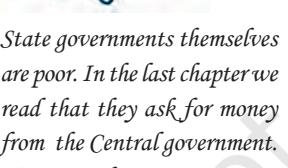
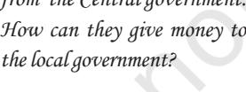
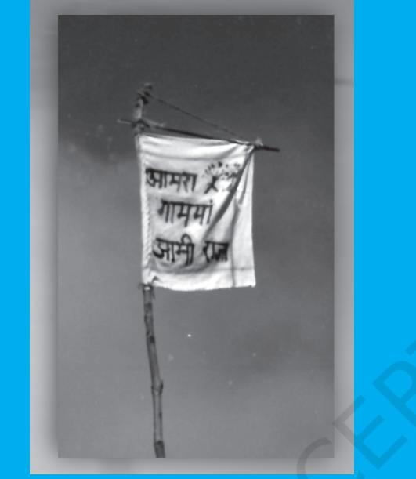
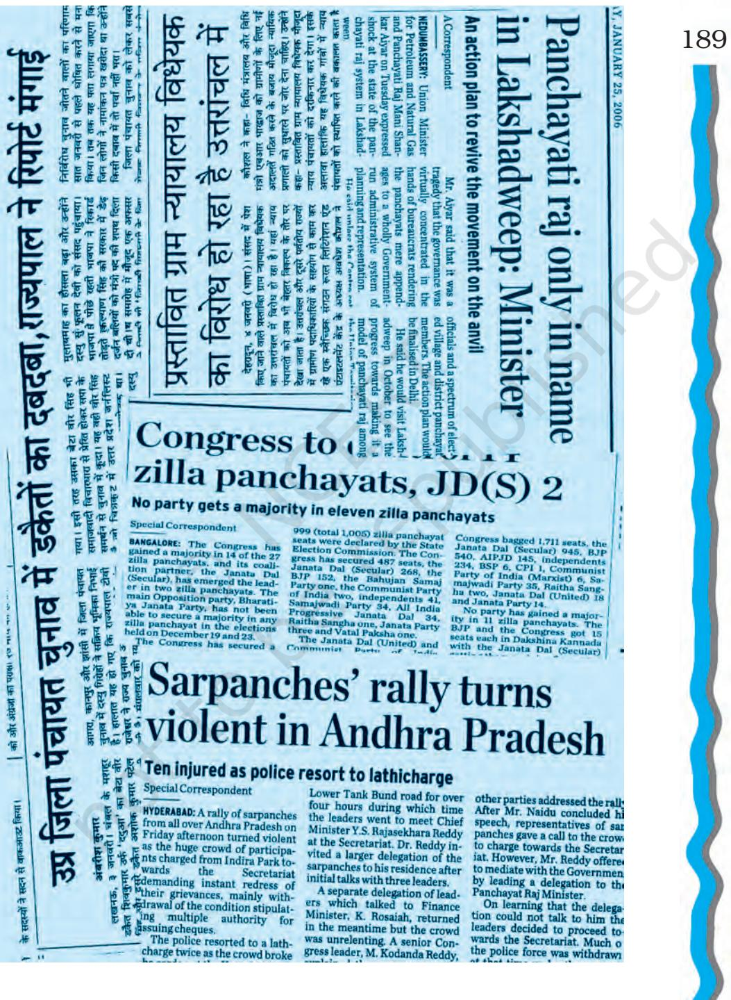
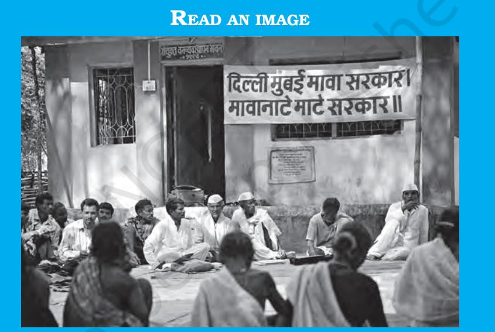

# Chapter Eight LOCAL GOVERNMENTS

*Indian Constitution at Work*

# INTRODUCTION

176

*In a democracy, it is not sufficient to have an elected government at the centre and at the State level. It is also necessary that even at the local level, there should be an elected government to look after local affairs. In this chapter, you will study the structure of local government in our country. You will also study the importance of the local governments and ways to give them independent powers. After studying this chapter, you will know:*

- ± *the importance of local government bodies;*
- ± *the provisions made by the 73r d and 74t h amendments; and*
- ± *functions and responsibilities of the local government bodies.*

# WHY LOCAL GOVERNMENTS?

*Geeta Rathore belongs to Jamonia Talab Gram Panchayat, Sehore district, Madhya Pradesh. She was elected Sarpanch in 1995 from a reserved seat; but in 2000, the village people rewarded her for her admirable work by electing her again - this time from a non-reserved seat. From a housewife, Geeta has grown into a leader displaying political farsightedness - she has harnessed the collective energy of her Panchayat to renovate water tanks, build a school building, construct village roads, fight against domestic violence and atrocities against women, create environmental awareness, and encourage afforestation and water management in her village. —*Panchayati Raj Update, Vol. XI, No. 3, February 2004.

*There is another story of yet another woman achiever. She was the President (*Sarpanch*) of a Gram Panchayat of Vengaivasal village in Tamil Nadu. In 1997, the Tamil Nadu government allotted two hectares of land to 71 government employees. This piece of land fell within the vicinity of this Gram Panchayat. On the instructions of higher authorities the District Collector of Kancheepuram directed the President of the Gram Panchayat to pass a resolution endorsing the allotment of the said land for the purpose already decided. The President and the Gram Panchayat refused to pass such an order and the Collector issued an order to acquire the land. The Gram Panchayat filed a writ petition in the Madras High Court against the Collector's action. The single judge bench of the High Court upheld the Collector's order and ruled that there was no need to take the Panchayat's consent. The Panchayat appealed to the Division bench against the single judge's order. In its order, the Division Bench reversed the order of the single judge. The judges held that the government order amounted to not only infringement of the powers of the Panchayats but a gross violation of the constitutional status of the Panchayats. —* Panchayati Raj Update, Vol. XII, June 2005.

Both these stories are not isolated incidents. They are representative of a larger transformation that is taking place across India especially after constitutional status was accorded to local government institutions in 1993.

177

*But aren't there cases of male members of the village panchayat harassing the woman Sarpanch in some places? Why are men not happy when women assume positions of responsibility?*

Local government is government at the village and district level. Local government is about government closest to the common people. Local government is about government that involves the day-to-day life and problems of ordinary citizens. Local government believes that local knowledge and local interest are essential ingredients for democratic decision making. They are also necessary for efficient and people-friendly administration. The advantage of local government is that it is so near the people. It is convenient for the people to approach the local government for solving their problems both quickly and with minimum cost. In the story of Geeta Rathore, we noticed that she was able to bring about a significant change in Jamonia Talab because of her pro-active role as Sarpanch of the Gram Panchayat. Vengaivasal village is able to still retain its land and the right to decide what to do with it because of the relentless efforts of its Gram Panchayat President and members. So, local governments can be very effective in protecting the local interests of the people.

Democracy is about meaningful participation. It is also about accountability. Strong and vibrant local governments ensure both active participation and purposeful accountability. Geeta Rathore's story is one of committed participation. Vengaivasal village Gram Panchayat's relentless efforts to secure its rights over its own land were an example of a mission to ensure accountability. It is at the level of local government that common citizens can be involved in decision making concerning their lives, their needs and above all their development.

It is necessary that in a democracy, tasks, which can be performed locally, should be left in the hands of the local people and their representatives. Common people are more familiar with their local government than with the government at the State or national level. They are also more concerned with what local government does or has failed to do as it has a direct bearing and impact on

*Is it possible that we only had governments at the local level and a coordinating body at the national level? I think Mahatma Gandhi advocated some ideas along these lines.*

their day-to-day life. Thus, strengthening local government is like strengthening democratic processes.

#### Check your progress

- ± How does local government strengthen democracy?
- ± In the example given above, what do you think the Government of Tamil Nadu should have done?

# GROWTH OF LOCAL GOVERNMENT IN INDIA

Let us now discuss how local government has grown in India and what our Constitution says about it. It is believed that self-governing village communities existed in India from the earliest times in the form of 'sabhas' (village assemblies). In the course of time, these village bodies took the shape of Panchayats (an assembly of five persons) and these Panchayats resolved issues at the village level. Their role and functions kept on changing at different points of time.

In modern times, elected local government bodies were created after 1882. Lord Rippon, who was the Viceroy of India at that time, took the initiative in creating these bodies. They were called the local boards. However, due to slow progress in this regard, the Indian National Congress urged the government to take necessary steps to make all local bodies more effective. Following the Government of India Act 1919, village panchayats were established in a number of provinces. This trend continued after the Government of India Act of 1935.

During India's freedom movement, Mahatma Gandhi had strongly pleaded for decentralisation of economic and political power. He believed that strengthening village panchayats was a means of effective decentralisation. All development initiatives must have local involvement in

179

*I don't know about the past, but I suspect that a non-elected village panchayat would naturally be dominated by the village elders, the rich and men from upper strata.*

order to be successful. Panchayats therefore were looked upon as instruments of decentralisation and participatory democracy. Our national movement was concerned about the enormous concentration of powers in the hands of the Governor General sitting at Delhi. Therefore, for our leaders, independence meant an assurance that there will be decentralisation of decision making, executive and administrative powers.

> The independence of India should mean the independence of the whole of India…Independence must begin at the bottom. Thus every village will be a republic... It follows therefore that every village has to be self-sustained and capable of managing its affairs. In this structure composed of innumerable villages, there will be everwidening, ever-ascending circles. Life will be a pyramid with the apex sustained by the bottom - Mahatma Gandhi

When the Constitution was prepared, the subject of local government was assigned to the States. It was also mentioned in the Directive Principles as one of the policy directives to all governments in the country. As you have read in Chapter 2, being a part of the Directive Principles of State Policy, this provision of the Constitution was non-justiciable and primarily advisory in its nature.

It is felt that the subject of local government including panchayats did not receive adequate importance in the Constitution. Do you know why this happened? A few reasons can be advanced here. Firstly, the turmoil due to the Partition resulted in a strong unitary inclination in the Constitution. Nehru himself looked upon extreme localism as a threat to unity and integration of the nation. Secondly, there was a powerful voice in the Constituent Assembly led by Dr. B.R. Ambedkar which felt that the faction and caste-ridden nature of rural society would defeat the noble purpose of local government at the rural level.

However, nobody denied the importance of people's participation in development planning. Many members of the Constituent Assembly wanted Village Panchayats to be the basis of democracy

180

in India but they were concerned about factionalism and many other ills present in the villages.

> "… in the interests of democracy, the villages maybe trained in the art of self-government, even autonomy... We must be able to reform the villages and introduce democratic principles of government there…"

Ananthasayanam Ayyangar, CAD, Vol. VII, p. 428, 17 November 1948

#### Local Governments in Independent India

Local governments got a fillip after the 73rd and 74th Constitution Amendment Acts. But even before that, some efforts in the direction of developing local government bodies had already taken place. First in the line was the Community Development Programme in 1952, which sought to promote people's participation in local development in a range of activities. In this background, a three-tier Panchayati Raj system of local government was recommended for the rural areas. Some States (like Gujarat, Maharashtra) adopted the system of elected local bodies around 1960. But in many States those local bodies did not have enough powers and functions to look after the local development. They were very much dependent on the State and central governments for financial assistance. Many States did not think it necessary to establish elected local bodies. In many instances, local bodies were dissolved and the local government was handed over to government officers. Many States had indirect elections to most local bodies. In many States, elections to the local bodies were postponed from time to time.

181

*Why are people afraid of factionalism at the village level when all the political parties and organisations or even my class has factions? Are groups and factions always so bad?*

After 1987, a thorough review of the functioning of local government institutions was initiated. In 1989 the P.K.Thungon Committee recommended constitutional recognition for the local government bodies. A constitutional amendment to provide for periodic elections to local government institutions, and enlistment of appropriate functions to them, along with funds, was recommended.

#### Check your progress

- ± Both Nehru and Dr. Ambedkar were not very enthusiastic about local government bodies. Did they have similar objections to local governments?
- ± What was the constitutional provision about local governments before 1992?
- ± Which were the States that had established local government during the 1960s and 1970s ?

# 73RD AND 74TH AMENDMENTS

In 1989, the central government introduced two constitutional amendments. These amendments aimed at strengthening local governments and ensuring an element of uniformity in their structure and functioning across the country.

> The Constitution of Brazil has created States, Federal Districts and Municipal Councils. Each of these is assigned independent powers and jurisdiction. Just as the Republic cannot interfere in the affairs of the States (except on grounds provided by the constitution), states are prohibited from interfering in the affairs of the municipal councils. This provision protects the powers of the local government.

182

Later in 1992, the 73rd and 74th constitutional amendments were passed by the Parliament. The 73rd Amendment is about rural local governments (which are also known as Panchayati Raj Institutions

or PRIs) and the 74th amendment made the provisions relating to urban local government (Nagarpalikas). The 73rd and 74th Amendments came into force in 1993.

We have noticed earlier that local government is a 'State subject'. States are free to make their own laws on this subject. But once the Constitution was amended, the States had to change their laws about local bodies in order to bring these in conformity with the amended Constitution. They were given one year's time for making necessary changes in their respective State laws in the light of these amendments.

# 73rd Amendment

Let us now examine the changes brought about by the 73rd amendment in Panchayati Raj institutions.

#### *Three Tier Structure*

All States now have a uniform three tier Panchayati Raj structure. At the base is the 'Gram Panchayat'. A Gram Panchayat covers a village or group of villages. The intermediary level is the Mandal (also referred to as Block or Taluka). These bodies are called Mandal or Taluka Panchayats. The intermediary level body need not be constituted in smaller States. At the apex is the Zilla Panchayat covering the entire rural area of the District.

*Does a Gram sabha mean the democratic forum of the entire village? Do Gram sabhas actually meet regularly?*

The amendment also made a provision for the mandatory creation of the Gram Sabha. The Gram Sabha would comprise all the adult members registered as voters in the Panchayat area. Its role and functions are decided by State legislation.

#### *Elections*

All the three levels of Panchayati Raj institutions are elected directly by the people. The term of each Panchayat body is five years. If the State government dissolves the Panchayat before the end of its five year term,

*If I understand this correctly, the centre forced local government reforms on the States. This is funny: you adopt decentralisation through a centralised process!*

fresh elections must be held within six months of such dissolution. This is an important provision that ensures the existence of elected local bodies. Before the 73rd amendment, in many States, there used to be indirect elections to the district bodies and there was no provision for immediate elections after dissolution.

#### *Reservations*

One third of the positions in all panchayat institutions are reserved for women. Reservations for Scheduled Castes and Scheduled Tribes are also provided for at all the three levels, in proportion to their population. If the States find it necessary, they can also provide for reservations for the other backward classes (OBCs).

It is important to note that these reservations apply not merely to ordinary members in Panchayats but also to the positions of Chairpersons or '*Adhyakshas*' at all the three levels. Further, reservation of one-third of the seats for women is not merely in the general category of seats but also within the seats reserved for Scheduled Castes, Scheduled Tribes and backward castes. This means that a seat may be reserved simultaneously for a woman candidate and one belonging to the Scheduled Castes or Scheduled Tribes. Thus, a Sarpanch would have to be a Dalit woman or an Adivasi woman.

### *Transfer of Subjects*

Twenty-nine subjects, which were earlier in the State list of subjects, are identified and listed in the Eleventh Schedule of the Constitution. These subjects are to be transferred to the Panchayati Raj institutions. These subjects were mostly linked to development and welfare functions at the local level. The actual transfer of these functions depends upon the State legislation. Each State decides how many of these twenty-nine subjects would be transferred to the local bodies.

*We read in the chapter on Elections that the bill for reservations for women in the Assemblies and in the Parliament could not be passed. How come women's reservations in local bodies were accepted so easily?*

*Article 243G. Powers, authority and responsibilities of Panchayats.—………, the Legislature of a State may, by law, endow the Panchayats with such powers and authority……. …with respect to—…...the matters listed in the Eleventh Schedule.*

#### Some subjects listed in the eleventh schedule

- 1. Agriculture, …
- 3. Minor irrigation, water management and watershed development.
- ….
- 8. Small scale industries, including food processing industries.

…..

- 10. Rural housing.
- 11. Drinking water.

.....

- 13. Roads, culverts,….
- 14. Rural electrification,….

.....

...…

- 16. Poverty alleviation programme.
- 17. Education, including primary and

secondary schools.

18. Technical training and vocational education.

- 19. Adult and non-formal education.
- 20. Libraries.
- 21. Cultural activities.
- 22. Markets and fairs.
- 23. Health and sanitation, including hospitals, primary health centres and dispensaries.
- 24. Family welfare.
- 25. Women and child development.
- 26. Social welfare, …
- 27. Welfare of the weaker sections, and in particular, of the Scheduled Castes and the Scheduled Tribes.
- 28. Public distribution system.

185

*Why are subjects only from State list to be transferred? Why can't we transfer some subjects from the Union List also?*

The provisions of the 73rd amendment were not made applicable to the areas inhabited by the Adivasi populations in many States of India. In 1996, a separate act was passed extending the provisions of the Panchayat system to these areas. Many Adivasi communities have their traditional customs of managing common resources such as forests and small water reservoirs, etc. Therefore, the new act protects the rights of these communities to manage their resources in ways acceptable to them. For this purpose, more powers are given to the Gram Sabhas of these areas and elected village panchayats have to get the consent of the Gram Sabha in many respects. The idea behind this act is that local traditions of self government should be protected while introducing modern elected bodies. This is only consistent with the spirit of diversity and decentralisation.

## *State Election Commissioners*

The State government is required to appoint a State Election Commissioner who would be responsible for conducting elections to the Panchayati Raj institutions. Earlier, this task was per formed by the State administration which was under the control of the State government. Now, the office of the State Election Commissioner is autonomous like the Election Commissioner of India. However, the State Election Commissioner is an independent officer and is not linked to nor is this officer under the control of the Election Commission of India.

#### *State Finance Commission*

The State government is also required to appoint a State Finance Commission once in five years. This Commission would examine the financial position of the local governments in the State. It would also review the distribution of revenues between the State and local governments on the one hand and between rural and urban local governments on the other. This innovation ensures that allocation of funds to the rural local governments will not be a political matter.

## *Activity*

- ± Identify some of the powers that your State government has delegated to panchayats.
# 74th Amendment

As we mentioned earlier, the 74th amendment dealt with urban local bodies or Nagarpalikas.

What is an urban area? It is very easy to identify a big city like Mumbai or Kolkata, but it is not so easy to say this about some very small urban areas that are somewhere between a village and a town. The Census of India defines an urban area as having: (i) a minimum population of 5,000; (ii) at least 75 per cent of male working population engaged in non-agricultural occupations and (iii) a density of population of at least 400 persons per sq. km. As per the 2011 Census, about 31% of India's population lives in urban areas.

In many ways the 74th amendment is a repetition of the 73rd amendment, except that it applies to urban areas. All the provisions of the 73rd amendment relating to direct elections, reservations, transfer of subjects, State Election Commission and State Finance Commission are incorporated in the 74th amendment also and thus apply to Nagarpalikas. The Constitution also mandated the transfer of a list of functions from the State government to the urban local bodies. These functions have been listed in the Twelfth Schedule of the Constitution.

# IMPLEMENTATION OF 73RD AND 74TH AMENDMENTS

All States have now passed a legislation to implement the provisions of the 73rd and 74th amendments. During the ten years since these amendments came into force (1994- 2004) most States have had at least two rounds of elections to the local bodies. States like Madhya Pradesh, Rajasthan and a few others have in fact held three elections so far.

187

*Can I hope that these urban local bodies will do something for better housing for the slum dwellers? Or at least provide them toilets?*

# READ AN IMAGE

This flag is a symbol of the expectations of the people about local governments. People don't want only formal laws. They want genuine implementation of those laws. Write briefly what you think about this slogan — We are the government here in the village!

188

Today there are more than 600 Zilla Panchayats, about 6,000 block or intermediary Panchayats, and 2,40,000 Gram Panchayats in rural India and over 100 city Corporations, 1400 town Municipalities and over 2000 Nagar Panchayats in urban India. More than 32 lakh members are elected to these bodies every five years. Of these, at least 13 lakhs are women. In the State Assemblies and Parliament put together we have less than 5000 elected representatives. With local bodies, the number of elected representatives has increased significantly.

The 73rd and 74th amendments have created uniformity in the structures of Panchayati Raj and Nagarpalika institutions across the country. The presence of these local institutions is by itself a

significant achievement and would create an atmosphere and platform for people's participation in government.

The provision for reservation for women at the Panchayats and Nagarpalikas has ensured the presence of a significant number of women in local bodies. As this reservation is also applicable for the positions of Sarpanch and Adhyaksha, a large number of women elected representatives have come to occupy these positions. There are at least 200 women Adhyakshas in Zilla Panchayats, another 2000 women who are Presidents of the block or taluka panchayats and more than 80,000 women Sarpanchas in Gram Panchayats.

We also have more than 30 women Mayors in Corporations, over 500 women Adhyakshas of Town Municipalities and nearly 650 Nagar Panchayats headed by women. Women have gained more power and confidence by asserting control over resources. Their presence in these institutions has given many women a greater understanding of the working of politics. In many cases, they have brought a new perspective and a greater sensitivity to discussions at local bodies. In many cases, women were unable to assert their presence or were mere proxies for the male members of their family who sponsored their election. Such instances, however are becoming fewer.

Look at this photograph. The local Sarkar is sitting out in the sun. Is there any other feature that strikes you?

While reservations for Scheduled Castes and Tribes are mandated by the constitutional amendment, most States have also made a provision to reserve seats for Backward Castes. As the Indian population has 16.2 per cent Scheduled Castes and 8.2 per cent Scheduled Tribes, about 6.6 lakh elected members in the urban and local bodies hail from these two communities. This has

190

significantly altered the social profile of local bodies. These bodies have thus become more representative of the social reality they operate within. Sometimes this leads to tensions. The dominant social groups which controlled the village earlier do not wish to give up their power. This leads to intensification of struggle for power. But tension and struggle is not always bad. Whenever there is an attempt to make democracy more meaningful and give power to those who did not enjoy it earlier, there is bound to be some conflict and tension in society.

The Constitutional amendments assigned as many as 29 subjects to the local governments. All these subjects are related to functions linked to local welfare and development needs. The experience with the functioning of local government in the past decade has shown that local governments in India enjoy limited autonomy to perform the functions assigned to them. Many States have not transferred most of the subjects to the local bodies. This means that the local bodies cannot really function in an effective manner. Therefore, the entire exercise of electing so many representatives becomes somewhat symbolic. Some people criticise the formation of the local bodies because this has not changed the way in which decisions are taken at the central and the State level. People at the local level do not enjoy much powers of choosing welfare programmes or allocation of resources.

> Bolivia is frequently cited as one of the most successful cases of democratic decentralisation in Latin America. In 1994, the Popular Participation Law decentralised power to the local level, allowing for the popular election of mayors, dividing the country into municipalities, and crafting a system of automatic fiscal transfers to the new municipalities. Bolivia is divided into 314 municipal governments. These governments in Bolivia are headed by popularly-elected mayors (*presidente municipal*) and a municipal council (*cabildo*). Local elections occur nationwide every five years.

*So, the law is good but it is mostly on paper. Is this what they call the gap between theory and practice?*

Bolivian local governments have been entrusted with building local health and education facilities, as well as maintenance of this infrastructure. In Bolivia, 20% of nationwide tax collections are distributed among municipalities on a per capita basis. While these municipalities may levy taxes on motor vehicles, urban property, and large agricultural properties, fiscal transfers provide the bulk of the operating budget for these units.

Local bodies have very little funds of their own. The dependence of local bodies on the State and central governments for financial support has greatly eroded their capacity to operate effectively. While rural local bodies raise 0.24% of the total revenues collected, they account for 4% of the total expenditure made by the government. So they earn much less than they spend. That makes them dependent on those who give them grants.

#### Conclusion

This experience suggests that local governments continue to be agencies implementing the welfare and development schemes of the central and State government. Giving more power to local government means that we should be prepared for real decentralisation of power. Ultimately, democracy means that power should be shared by the people; people in the villages and urban localities must have the power to decide what policies and programmes they want to adopt. As you have studied earlier, democracy means decentralisation of power and giving more and more power to the people. The laws about local governments are an important step in the direction of democratisation. But the true test of democracy is not merely in the legal provisions but in the practice of those provisions.

192

# Exercises

- 1. Constitution of India visualised village panchayats as units of selfgovernment. Think over the situation described in the following statements and explain how do these situations strengthen or weaken the panchayats in becoming units of self-government.
	- a. Government of a State has allowed a big company to establish a huge steel plant. Many villages would be adversely affected by the steel plant. Gram Sabha of one of the affected villages passed a resolution that before establishing any big industries in the region, village people must be consulted and their grievances should be redressed.
	- b. The government has decided that 20 % of all its expenditure would be done through the panchayats.
	- c. A village panchayat kept on demanding funds for a building for village school, the government officials turned down their proposal saying that funds are allocated for certain other schemes and cannot be spent otherwise.
	- d. The government divided a village Dungarpur into two and made a part of village Jamuna and Sohana. Now village Dungarpur has ceased to exist in government's books.
	- e. A village panchayat observed that water sources of their region are depleting fast. They decided to mobilise village youth to do some voluntary work and revive the old village ponds and wells.
- 2. Suppose you are entrusted to evolve a local government plan of a State, what powers would you endow to the village panchayats to function as units of self-government? Mention any five powers and the justification in two lines for each of them for giving those powers.
- 3. What are the provisions for the reservations for the socially disadvantaged groups as per the 73rd amendment? Explain how these provisions have changed the profile of the leadership at the village level.
- 4. What were the main differences between the local governments before 73rd amendment and after that amendment?
- 5. Read the following conversation. Write in two hundred words your opinion about the issues raised in this conversation.

Alok: Our Constitution guarantees equality between men and women. Reservations in local bodies for women ensure their equal share in power.

Neha: But it is not enough that women should be in positions of power. It is necessary that the budget of local bodies should have separate provision for women.

Jayesh: I don't like this reservations business. A local body must take care of all people in the village and that would automatically take care of women and their interests.

- 6. Read the provisions of the 73rd Amendment. Which of the following concerns does this amendment address?
	- a. Fear of replacement makes representatives accountable to the people.
	- b. The dominant castes and feudal landlords dominate the local bodies.
	- c. Rural illiteracy is very high. Illiterate people cannot take decisions about the development of the village.
	- d. To be effective the village panchayats need resources and powers to make plans for the village development.
- 7. The following are different justifications given in favour of local government. Give them ranking and explain why you attach greater significance to a particular rationale than the others. According to you, on which of these rationales the decision of the Gram panchayat of Vengaivasal village was based? How?
	- a. Government can complete the projects with lesser cost with the involvement of the local community.
	- b. The development plans made by the local people will have greater acceptability than those made by the government officers.
	- c. People know their area, needs problems and priorities. By collective participation they should discuss and take decisions about their life.
	- d. It is difficult for the common people to contact their representatives of the State or the national legislature.

8. Which of the following according to you involve decentralisation? Why are other options not sufficient for decentralisation?

- a. To hold election of the Gram Panchayat.
194

- b. Decision by the villagers themselves about what policies and programmes are useful for the village.
- c. Power to call meeting of Gram Sabha.
- d. A Gram Panchayat receiving the report from the Block Development Officer about the progress of a project started by the State government.
- 9. A student of Delhi University, Raghavendra Parpanna, wanted to study the role of decentralisation in decision making about primary education. He asked some questions to the villagers. These questions are given below. If you were among those villagers, what answer would you give to each of these questions?

A meeting of the Gram Sabha is to be called to discuss what steps should be taken to ensure that every child of the village goes to the school.

- a. How would you decide the suitable day for the meeting? Think who would be able to attend / not attend the meeting because of your choice.
	- (i) A day specified by the BDO or the collector
	- (ii) Day of the village haat
	- (iii) Sunday
	- (iv) Naag panchami / sankranti
- b. What is a suitable venue for the meeting? Why?
	- (i) Venue suggested by the circular of the district collector.
	- (ii) Religious place in the village.
	- (iii) Dalit Mohalla.
	- (iv) Upper caste Tola
	- (v) Village school
- c. In the Gram Sabha meeting firstly a circular sent by the district collector was read. It suggested what steps should be taken to organise an education rally and what should be its route. The meeting did not discuss about the children who never come to school or about girls' education, or the condition of the school building and the timing of the school. No women teacher attended the meeting as it was held on Sunday.

What do you think about these proceedings as an instance of people's participation?

- d. Imagine your class as the Gram Sabha. Discuss the agenda of the meeting and suggest some steps to realise the goal.

195

