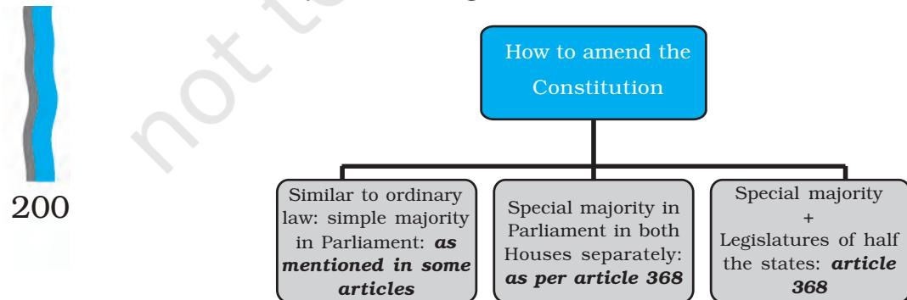

# Chapter Nine CONSTITUTION AS A LIVING DOCUMENT

*Indian Constitution at Work*

## INTRODUCTION

196

*In this chapter, you will see how the Constitution has worked in the last 69 years and how India has managed to be governed by the same Constitution. After studying this chapter you will find out that:*

- ± *the Indian Constitution can be amended according to the needs of the time;*
- ± *though many such amendments have already taken place, the Constitution has remained intact and its basic premises have not changed;*
- ± *the judiciary has played an important role in protecting the Constitution and also in interpreting the Constitution; and*
- ± *the Constitution is a document that keeps evolving and responding to changing situations.*

### ARE CONSTITUTIONS STATIC?

It is not uncommon for nations to rewrite their constitutions in response to changed circumstances or change of ideas within the society or even due to political upheavals. The Soviet Union had four constitutions in its life of 74 years (1918, 1924, 1936 and 1977). In 1991, the rule of the Communist Party of Soviet Union came to an end and soon the Soviet federation disintegrated. After this political upheaval, the newly formed Russian federation adopted a new constitution in 1993.

But look at India. The Constitution of India was adopted on 26 November 1949. Its implementation formally started from 26 January 1950. More than 69 years after that, the same constitution continues to function as the framework within which the government of our country operates.

Is it that our Constitution is so good that it needs no change? Was it that our Constitution makers were so farsighted and wise that they had foreseen all the changes that would take place in the future? In some sense both the answers are correct. It is true that we have inherited a very robust Constitution. The basic framework of the Constitution is very much suited to our country. It is also true that the Constitution makers were very farsighted and provided for many solutions for future situations. But no constitution can provide for all eventualities. No document can be such that it needs no change.

France had numerous constitutions in the last two centuries. After the revolution and during the Napoleonic period, France underwent continuous experimentation about a constitution: The postrevolution constitution of 1793 is called the period of the first French republic. Then commenced the second French republic in 1848. The third French republic was formed with a new constitution in 1875. In 1946, with a new constitution, the fourth French republic came into being. Finally, in 1958, the fifth French republic came into being with yet another constitution.

197

*It seems to me that constitutional changes are very closely linked to political developments.*

Then how does the same Constitution continue to serve the country? One of the answers to such questions is that our Constitution accepts the necessity of modifications according to changing needs of the society. Secondly, in the actual working of the Constitution, there has been enough flexibility of interpretations. Both political practice and judicial rulings have shown maturity and flexibility in implementing the Constitution. These factors have made our Constitution a living document rather than a closed and static rulebook.

In any society, those responsible for drafting the constitution at a particular time would face one common challenge: the provisions of the constitution would naturally reflect efforts to tackle the problems that the society is facing at the time of making of the constitution. At the same time, the constitution must be a document that provides the framework of the government for the future as well. Therefore, the constitution has to be able to respond to the challenges that may arise in the future. In this sense, the constitution will always have something that is contemporary and something that has a more durable importance.

At the same time, a constitution is not a frozen and unalterable document. It is a document made by human beings and may need revisions, changes and reexamination. It is true that the constitution reflects the dreams and aspirations of the concerned society. It must also be kept in mind that the constitution is a framework for the democratic governance of the society. In this sense, it is an instrument that societies create for themselves.

This dual role of the constitution always leads to difficult questions about the status of the constitution: is it so sacred that nobody ever can change it? Alternatively, is it so ordinary an instrument that it can be modified just like any other ordinary law?

The makers of the Indian Constitution were aware of this problem and sought to strike a balance. They placed the Constitution above ordinary law and expected that

*I know that the Constitution of the US came into existence more than 200 years ago and so far it has been amended only 27 times! Isn't that very interesting?*

the future generations will respect this document. At the same time, they recognised that in the future, this document may require modifications. Even at the time of writing the Constitution, they were aware that on many matters there were differences of opinion. Whenever society would veer toward any particular opinion, a change in the constitutional provisions would be required. Thus, the Indian Constitution is a combination of both the approaches mentioned above: that the constitution is a sacred document and that it is an instrument that may require changes from time to time. In other words, our Constitution is not a static document, it is not the final word about everything; it is not unalterable.

#### Check your progress

After reading the section above, a number of students in the class were confused. They made the following statements. What would you say about each of these statements?

- ± The Constitution is like any other law. It simply tells us what are the rules and regulations governing the government.
- ± The Constitution is the expression of the will of the people, so there must be a provision to change the Constitution after every ten or fifteen years.
- ± The Constitution is a statement of the philosophy of the country. It can never be changed.
- ± The Constitution is a sacred document. Therefore any talk of changing it is against democracy.

#### HOW TO AMEND THE CONSTITUTION?

#### *Article 368:*

*…Parliament may in exercise of its constituent power amend by way of addition, variation or repeal any provision of this Constitution in accordance with the procedure laid down in this article.*

We have already seen that the makers of our Constitution wanted to strike a balance. The Constitution must be amended if so required. But it must be protected from unnecessary and frequent changes. In other words, they wanted the Constitution to be 'flexible' and at the same time 'rigid'. Flexible means open to changes and rigid means resistant to changes. A constitution that can be very easily changed or modified is often called flexible. In the case of constitutions, which are very difficult to amend, they are described as rigid. The Indian Constitution combines both these characteristics.

The makers of the Constitution were aware of the fact that there may be some faults or mistakes in the Constitution; they knew that the Constitution could not be totally free of errors. Whenever such mistakes would come to light, they wanted the Constitution to be easily amended and to be able to get rid of these mistakes. Then there were some provisions in the Constitution that were of temporary nature and it was decided that these could be altered later on once the new Parliament was elected. But at the same time, the Constitution was framing a federal polity and therefore, the rights and powers of the States could not be changed without the consent of the States. Some other features were so central to the spirit of the Constitution that the Constitution makers were anxious to protect these from change. These provisions had to be made rigid. These considerations led to different ways of amending the Constitution.

*I don't understand how a constitution can be flexible or rigid. Isn't it the politics of that period which makes the constitution rigid or flexible?*

There are many articles in the Constitution, which mention that these articles can be amended by a simple law of the Parliament. No special procedure for amendment is required in such cases and there is no difference at all between an amendment and an ordinary law. These parts of the Constitution are very flexible. Read carefully the following text of some articles of the Constitution. In both these articles, the wording '*by law*' indicates that these articles can be modified by the Parliament without recourse to the procedure laid down in Article 368. Many other articles of the Constitution can be modified by the Parliament in this simple manner.

*Article 2: Parliament may* by law *admit into the union …..new states….*

*Article 3: Parliament may* by law*… b) increase the area of any state….*

For amending the remaining parts of the Constitution, provision has been made in Article 368 of the Constitution. In this article, there are two methods of amending the Constitution and they apply to two different sets of articles of the Constitution. One method is that amendment can be made by special majority of the two houses of the Parliament. The other method is more difficult: it requires special majority of the Parliament and consent of half of the State legislatures. Note that all amendments to the Constitution are initiated only in the Parliament. Besides the special majority in the Parliament no outside agency— —like a constitution commission or a separate body—is required for amending the Constitution.

Similarly, after the passage in the Parliament and in some cases, in State legislatures, no referendum is required for ratification of the amendment. An amendment

201

*What happens if some States want an amendment to the Constitution? Can't they propose an amendment? I think this is another example of favouring the centre against the States!*

bill, like all other bills, goes to the President for his assent, but in this case, the President has no powers to send it back for reconsideration. These details show how rigid and complicated the amending process could have been. Our Constitution avoids these complications. This makes the amendment procedure relatively simple. But more importantly, this process underlines an important principle: only elected representatives of the people are empowered to consider and take final decisions on the question of amendments. Thus, sovereignty of elected representatives (parliamentary sovereignty) is the basis of the amendment procedure.

#### Special Majority

In the chapters on Election, Executive and Judiciary, we have come across provisions that require 'special majority'. Let us repeat again what special majority means. Ordinarily, all business of the legislature requires that a motion or resolution or bill should get the support of a simple majority of the members voting at that time. Suppose that at the time of voting on a bill, 247 members were present in the house and all of them participated in the voting on the bill. Then, the bill would be passed if at least 124 members voted in favour of the bill. Not so in the case of an amendment bill. Amendment to the Constitution requires two different kinds of special majorities: in the first place, those voting in favour of the amendment bill should constitute at least half of the total strength of that House. Secondly, the supporters of the amendment bill must also constitute two-thirds of those who actually take part in voting. Both Houses of the Parliament must pass the amendment bill separately in this same manner (there is no provision for a joint session). For every amendment bill, this special majority is required.

Can you see the significance of this requirement? In the Lok Sabha there are 545 members. Therefore, any amendment must be supported by a minimum of 273 members. Even if only 300 members are present at the time of voting, the amendment bill must get the support of 273 out of them. But imagine that 400 members of Lok Sabha have voted on an amendment bill. How many members should support the bill to get the bill passed?

In addition to this, both the Houses must pass the amendment bill (with special majorities) separately. This means that unless there

202

Two principles dominate the various procedures of amending the constitutions in most modern constitutions.

- ± One is the principle of special majority. For instance, the constitutions of U.S., South Africa, Russia, etc. have employed this principle: In the case of constitution of US, it is two-thirds majority, while in South Africa and Russia, for some amendments, three-fourths majority is required.
- ± The other principle that is popular among many modern constitutions is that of people's participation in the process of amending the constitution. In Switzerland, people can even initiate an amendment. Other examples of countries where people initiate or approve amendment to the constitution are Russia and Italy, among others.

is sufficient consensus over the proposed amendment, it cannot be passed. If the party in power enjoys very thin majority, it can pass legislation of its choice and can get budget approved even if the opposition does not agree. But it would need to take at least some opposition parties into confidence, if it wanted to amend the Constitution. So, the basic principle behind the amending procedure is

> "If those who are dissatisfied with the Constitution have only to obtain a 2/3 majority and if they cannot obtain even (that)..., their dissatisfaction with the Constitution cannot be deemed to be shared by the general public."

> *Note that Dr. Ambedkar is talking here not only of parliamentary majority. He refers to 'sharing (of the views) by the general public'. This indicates that behind the majority there is the principle of public opinion that governs decisionmaking.*

Dr. Ambedkar, CAD, Vol. XI, p. 976, 25 November 1949

*I am fed up with this business of special majority. It forces you to make difficult calculations all the time. Is it politics or maths?*

that it should be based on broad support among the political parties and parliamentarians.

#### Ratification by States

For some articles of the Constitution, special majority is not sufficient. When an amendment aims to modify an article related to distribution of powers between the States and the central government, or articles related to representation, it is necessary that the States must be consulted and that they give their consent. We have studied the federal nature of the Constitution. Federalism means that powers of the States must not be at the mercy of the central government. The Constitution has ensured this by providing that legislatures of half the States have to pass the amendment bill before the amendment comes into effect. We can say that for some parts of the Constitution, greater or wider consensus in the polity is expected. This provision also respects the States and gives them participation in the process of amendment. At the same time, care is taken to keep this procedure somewhat flexible even in its more rigid format: consent of only half the States is required and simple majority of the State legislature is sufficient. Thus, the amendment process is not impracticable even after taking into consideration this more stringent condition.

We may summarise that the Constitution of India can be amended through large-scale consensus and limited participation of the States. The founding fathers took care that Constitution would not be open to easy tampering. And yet, future generations were given the right to amend and modify according to the needs and requirements of the time.

#### Check your progress

For making the following amendments to the Constitution of India, what conditions need to be fulfilled? Place a tick mark in the chart wherever applicable.

204

| Subject of amendment | Special majority | Ratification by States | 205 |
| --- | --- | --- | --- |
| Citizenship clause |  |  |  |
| Right to freedom |  |  |  |
| of religion |  |  |  |
| Changes in the |  |  |  |
| Union List |  |  |  |
| Changes in State |  |  |  |
| boundaries |  |  |  |
| Provision regarding |  |  |  |
| Election Commission |  |  |  |

## WHY HAVE T HERE BEEN SO MANY AMENDMENTS?

On 26 January 2024, the Constitution of India completed 74 years of its existence. In these years, it has been amended 106 times. Given the relatively difficult method of amending the Constitution, the number of amendments appears quite high. Let us try to find out how it is that so many amendments took place and what it means.

Let us first look at the brief history of the amendments: look carefully at the graphs below. The same information is presented in two different ways. The first graph depicts the number of constitution amendments made every ten years; the bar indicates the number of amendments in that period. The second graph depicts the time taken for every ten amendments; the bar depicts the years taken for ten amendments. You will notice that the two decades from 1970 to 1990 saw a large number of amendments. On the other hand, the second graph tells one more story: ten amendments took place between a short span of three

*Why was our Constitution amended so many times? Is there something wrong with our society or with the Constitution?*

years between 1974 and 1976. And again, in just three years, from 2001 to 2003, ten amendments took place. In the political history of our country, these two periods are remarkably different. The first was a period of Congress domination. Congress party had a vast majority in Parliament ( it had 352 seats in the Lok Sabha and a majority in most State Assemblies). On the other hand, the period between 2001 and 2003 was a period marked by coalition politics. It was also a period when different parties were in power in different States. The bitter rivalry between the BJP and its opponents is another feature of this period. And yet, this period saw as many as ten amendments in just three years. So, the incidence of amendments is not dependent merely on the nature of majority of the ruling party alone.

206

There is always a criticism about the number of amendments. It is said that there have been far too many amendments to the Constitution of India. On the face of it, the fact that 106 amendments took place in 74 years does seem to be somewhat odd. But the two graphs above suggest that amendments are not only due to political considerations. Barring the first decade after the commencement of the Constitution, every decade has witnessed a steady stream of amendments. This means that irrespective of the nature of politics and the party in power, amendments were required to be made from time to time. Was this because of the inadequacies of the original Constitution? Is the Constitution too flexible?

#### Contents of Amendments made so far

Amendments made so far may be classified in three groups. In the first group there are amendments, which are of a technical or administrative nature and were only clarifications, explanations, and minor modifications etc. of the original provisions. They are amendments only in the legal sense, but in matter of fact, they made no substantial difference to the provisions.

This is true of the amendment that increased the age of retirement of High Court judges from 60 to 62 years (15th amendment). Similarly, salaries of judges of High Courts and the Supreme Court were increased by an amendment (54th amendment).

We may also take the example of the provision regarding reserved seats in the legislatures for scheduled castes and scheduled tribes. The original provision said that these reservations were for a period of ten years. However, in order to ensure fair representation of these sections, it was necessary to extend this period by ten years. Thus, after every ten years an amendment is made to extend the period by another ten years. This has led to six amendments so far. But these amendments have not made any difference to the original provision. In this sense, it is only a technical amendment.

207

*Yes, I think we should be looking at the changes rather than the number of amendments. That is what we should be doing as students of politics.*

Do you remember the discussion in chapter four about the role of the President? In the original Constitution, it was assumed that in our parliamentary government, the President would normally abide by the advice of the Council of Ministers. This was only reiterated by a later amendment when Article 74 (1) was amended to clarify that the advice of the Council of Ministers will be binding on the President (President *shall act in accordance with the advice of the Council of Ministers)*. In reality, this amendment did not make any difference because, that is exactly what has been happening all through. The amendment was only by way of explanation.

#### *Differing Interpretations*

A number of amendments are a product of different interpretations of the Constitution given by the judiciary and the government of the day. When these clashed, the Parliament had to insert an amendment underlining one particular interpretation as the authentic one. It is part of the democratic politics that various institutions would interpret the Constitution and particularly the scope of their own powers in a different manner. Many times, the Parliament did not agree with the judicial interpretation and therefore, sought to amend the Constitution to overcome the ruling of the judiciary. In the period between 1970 and 1975 this situation arose frequently.

In the chapter on the Judiciary, you have already studied the issues of difference between the Judiciary and the Parliament: one was the relationship between fundamental rights and directive principles, the other was the scope of right to private property and the third was the scope of Parliament's power to amend the Constitution. In the period 1970-1975, the Parliament repeatedly made amendments to overcome the adverse interpretations by the judiciary.

It may be kept in mind that during this period (1970- 75) many political events were unfolding and thus this history of our constitutional development can be fully

*I am still confused. If there is a written constitution, where is the scope for different interpretations? Or do people read in the constitution what they want to be there?*

understood only in the context of the politics of that period. You will know more about these issues in the next year when you study the political history of independent India.

#### *Amendments through Political Consensus*

Thirdly, there is another large group of amendments that have been made as a result of the consensus among the political parties. We may say that this consensus made it necessary that some changes had to be made in order to reflect the prevailing political philosophy and aspirations of the society. In fact, many of the amendments of the post-1984 period are instances of this trend. Remember our question above about the peculiarity that even when there were coalition governments, this period saw so many amendments? The reason is because many of these amendments were based on an evolving consensus on certain issues. Starting with the anti-defection amendment (52nd amendment), this period saw a series of amendments in spite of the political turbulence.

Apart from the anti-defection amendments (52nd and 91st), these amendments include the 61st amendment bringing down the minimum age for voting from 21 to 18 years, the 73rd and the 74th amendments, etc. In this same period, there were some amendments clarifying and expanding the scope of reservations in jobs and admissions. After 1992-93, an overall consensus emerged in the country about these measures and therefore, amendments regarding these measures were passed without much difficulty (77th, 81st, and 82nd amendments).

#### *Controversial Amendments*

Our discussion so far, should not create an impression that there has never been any controversy over amending the Constitution. In fact, amendments during the period 1970 to 1980 generated a lot of legal and political controversy. The parties that were in opposition during the period 1971-1976, saw many of these amendments

*So, politicians do agree on some matters! And yet they fight over the meaning of what they agreed on!*

*So, it is all about politics! Didn't I say that this entire thing about constitutions and amendments is linked to politics rather than law?*

as attempts by the ruling party to subvert the Constitution. In particular, the 38th, 39th and 42nd amendments have been the most controversial amendments so far. These three amendments were made in the background of internal emergency declared in the country from June 1975. They sought to make basic changes in many crucial parts of the Constitution.

The 42nd amendment was particularly seen as a wideranging amendment affecting large parts of the Constitution. It was also an attempt to override the ruling of the Supreme Court given in the Kesavananda case. Even the duration of the Lok Sabha was extended from five to six years. In the chapter on Rights, you have read about Fundamental Duties. They were included in the Constitution by this amendment act. The 42nd amendment also put restrictions on the review powers of the Judiciary. It was said at that time that this amendment was practically a rewriting of many parts of the original Constitution. Do you know that this amendment made changes to the Preamble, to the seventh schedule of the Constitution and to 53 articles of the Constitution? Many MPs belonging to the opposition parties were in jail when this amendment was passed in Parliament. In this backdrop, elections were held in 1977 and the ruling party (Congress) was defeated. The new government thought it necessary to reconsider these controversial amendments and through the 43rd and 44th amendments, cancelled most of the changes that were effected by the 38th, 39th and the 42nd amendments. The constitutional balance was restored by these amendments.

#### *Activity*

Find out the amendments about the right to education (RTE) and the Goods and Services Tax (GST). What do you think is the importance of these amendments?

## BASIC STRUCTURE AND EVOLUTION OF THE CONSTITUTION

One thing that has had a long lasting effect on the evolution of the Indian Constitution is the theory of the basic structure of the Constitution. You know already that the Judiciary advanced this theory in the famous case of Kesavananda Bharati. This ruling has contributed to the evolution of the Constitution in the following ways:

- ± It has set specific limits to Parliament's power to amend the Constitution. It says that no amendment can violate the basic structure of the Constitution;
- ± It allows Parliament to amend any and all parts of the Constitution (within this limitation); and
- ± It places the Judiciary as the final authority in deciding if an amendment violates basic structure and what constitutes the basic structure.

The Supreme Court gave the Kesavananda ruling in 1973. In the past four decades, this decision has governed all interpretations of the Constitution and all institutions in the country have accepted the theory of basic structure. In fact, the theory of basic structure is itself an example of a living constitution. There is no mention of this theory in the Constitution. It has emerged from judicial interpretation. Thus, the Judiciary and its interpretation have practically amended the Constitution without a formal amendment.

All living documents evolve in this manner through debates, arguments, competition and practical politics. Since 1973, the Court has, in many cases, elaborated upon this theory of basic structure and given instances of what constitutes the basic structure of the Constitution of India. In a sense, the basic structure doctrine has further consolidated the balance between rigidity and flexibility: by saying that certain parts cannot be amended, it has underlined the rigid nature while by allowing amendments to all others it has underlined the flexible nature of the amending process.

211

*Ah! So it is the judiciary that has the final word! Is this also judicial activism?*

#### Review of the Constitution

In the late nineties, efforts were made to review the entire Constitution. In the year 2000 a commission to review the working of the Constitution was appointed by the Government of India under the chairmanship of a retired Chief Justice of the Supreme Court, Justice Venkatachaliah. Opposition parties and many other organisations boycotted the commission. While a lot of political controversy surrounded this commission, the commission stuck to the theory of basic structure and did not suggest any measures that would endanger the basic structure of the Constitution. This shows the significance of the basic structure doctrine in our constitutional practice.

There are many other examples of how judicial interpretation changed our understanding of the Constitution. In many decisions the Supreme Court had held that reservations in jobs and educational institutions cannot exceed fifty per cent of the total seats. This has now become an accepted principle. Similarly, in the case involving reservations for other backward classes, the Supreme Court introduced the idea of creamy layer and ruled that persons belonging to this category were not entitled to benefits under reservations. In the same manner, the Judiciary has contributed to an informal amendment by interpreting various provisions concerning right to education, right to life and liberty and the right to form and manage minority educational institutions. These are instances of how rulings by the Court contribute to the evolution of the Constitution.

*It's all wrong. First they say that an amendment requires consensus and now we see that Judges change the whole meaning of the Constitution.*

#### Check your progress

State whether the following statements are correct or not:

- ± After the Basic Structure ruling, Parliament does not have power to amend the Constitution.
- ± The Supreme Court has given a clear list of the basic features of our Constitution, which cannot be amended.
- ± Judiciary has the power to decide whether an amendment violates basic structure or not.
- ± The Kesavananda Bharati ruling has set clear limits on Parliament's power to amend the Constitution.

#### CONSTITUTION AS A LIVING DOCUMENT

We have described our Constitution as a living document. What does that mean?

Almost like a living being, this document keeps responding to the situations and circumstances arising from time to time. Like a living being, the Constitution responds to experience. In fact that is the answer to the riddle we mentioned at the beginning about the durability of the Constitution. Even after so many changes in the society, the Constitution continues to work effectively because of this ability to be dynamic, to be open to interpretations and the ability to respond to the changing situation. This is a hallmark of a democratic constitution. In a democracy, practices and ideas keep evolving over time and the society engages in experiments according to these. A constitution, which protects democracy and yet allows for evolution of new practices becomes not only durable but also the object of respect from the citizens. The important point is: has the Constitution been able to protect itself and protect democracy?

In the past six decades, some very critical situations arose in the politics and constitutional development of the country. We have made a brief reference to some of these in this chapter already. In terms of constitutional-legal issues, the most serious question that came up

*I get it! It's like a see-saw. Or is it a game of tug of war?*

214

again and again from 1950 was about the supremacy of the Parliament. In a parliamentary democracy, the Parliament represents the people and therefore, it is expected to have an upper hand over both Executive and Judiciary. At the same time, there is the text of the Constitution and it has given powers to other organs of the government. Therefore, the supremacy of the Parliament has to operate within this framework. Democracy is not only about votes and people's representation. It is also about the principle of rule of law. Democracy is also about developing institutions and working through these institutions. All the political institutions must be responsible to the people and maintain a balance with each other.

#### Contribution of the Judiciary

During the controversy between the Judiciary and the Parliament, the Parliament thought that it had the power and responsibility to make laws (and amendments) for furthering the interests of the poor, backward and the needy. The Judiciary insisted that all this has to take place within the framework provided by the Constitution and pro-people measures should not bypass legal procedures, because, once you bypass laws even with good intentions, that can give an excuse to the power holders to use their power arbitrarily. And democracy is as much about checks on arbitrary use of power as it is about the well-being of the people.

The success of the working of the Indian Constitution lies in resolving these tensions. The Judiciary, in its famous Kesavananda ruling found a way out of the existing complications by turning to the spirit of the Constitution rather than its letter. If you read the Constitution, you will not find any mention of the 'basic structure' of the Constitution. Nowhere does the Constitution say that such and such are part of the basic structure. In this sense, the 'basic structure' theory is the

invention of the Judiciary. How did it invent such a nonexistent thing? And how is it that all other institutions have accepted this during the past four decades?

Therein lies the distinction between letter and spirit. The Court came to the conclusion that in reading a text or document, we must respect the intent behind that document. A mere text of the law is less important than the social circumstances and aspirations that have produced that law or document. The Court was looking at the basic structure as something without which the Constitution cannot be imagined at all. This is an instance of trying to balance the letter and the spirit of the Constitution.

#### Maturity of the Political Leadership

Our discussion of the role of Judiciary, in the paragraph above, brings out one more fact. In the background of the fierce controversy that raged between 1967 and 1973, Parliament and the Executive also realised that a balanced and long term view was necessary. After the Supreme Court gave the ruling in the Kesavananda case some attempts were made to ask the Court to reconsider its ruling. When these failed, the 42nd amendment was made and parliamentary supremacy was asserted. But the Court again repeated its earlier stand in the Minerva Mills case (1980). Therefore, even four decades after the ruling in the Kesavananda case, this ruling has dominated our interpretation of the Constitution. Political parties, political leaders, the government, and Parliament, accepted the idea of inviolable basic structure. Even when there was talk about 'review' of the Constitution, that exercise could not cross the limits set by the theory of the basic structure.

When the Constitution was made, leaders and people of our country shared a common vision of India. In Nehru's famous speech at the time of independence, this vision was described as a tryst with destiny. In the Constituent Assembly also, all the leaders mentioned this vision: dignity and freedom of the individual, social and

*Of course, if there are no rights and no elections, the Constitution won't make much sense. And if there is no well being, elections and rights won't make sense. Is this how we understand the 'spirit' of our Constitution?*

*Let us not ignore that there are many instances of political immaturity as well. Does one have to list these?*

Even within the Constituent Assembly, there were some members who felt that this Constitution was not suited to the Indian situation:

"The ideals on which this draft constitution is framed have no manifest relation to the fundamental spirit of India. …this Constitution …would not prove suitable and would break down soon after being brought into operation."

Lakshminarayan Sahu, CAD, Vol. XI, p. 613, 17 November 1949

economic equality, well-being of all people, unity based on national integrity. This vision has not disappeared. People and leaders alike hold to the vision and hope to realize it. Therefore, the Constitution, based on this vision, has remained an object of respect and authority even after half a century. The basic values governing our public imagination remain intact.

#### Conclusion

There can still be debates about what constitutes basic structure. There is nothing wrong in such debates. We must remember that politics in a democracy is necessarily full of debates and differences. That is a sign of diversity, liveliness and openness. Democracy welcomes debates. At the same time, our political parties and leadership have shown maturity in setting limits to these debates. Because, politics is also about compromises and give-and-take. Extreme positions may be theoretically very correct and ideologically very attractive, but politics demands that everyone is prepared to moderate their extreme views, sharp positions and reach a common minimum ground. Only then democratic politics becomes possible. Politicians and the people of India have understood and practised these skills. That has made the experience of working of the democratic Constitution quite successful. Among the different organs of the government, there will always be competition over which one is more important than the others. They will also always fight over what constitutes

216

the welfare of the people. But in the last instance, the final authority lies with the people. People, their freedoms and their well-being constitute the purpose of democracy and also the outcome of democratic politics.

217

## Exercises

- 1. Choose the correct statement from the following.
A constitution needs to be amended from time to time because,

- √ Circumstances change and require suitable changes in the constitution.
- √ A document written at one point of time becomes outdated after some time.
- √ Every generation should have a constitution of its own liking.
- √ It must reflect the philosophy of the existing government.
- 2. Write True / False against the following statements.
	- a. The President cannot send back an amendment bill for reconsideration of Parliament.
	- b. Elected representatives alone have the power to amend the Constitution.
	- c. The Judiciary cannot initiate the process of constitutional amendment but can effectively change the Constitution by interpreting it differently.
	- d. Parliament can amend any section of the Constitution.
- 3. Which of the following are involved in the amendment of the Indian Constitution? In what way are they involved?
	- a. Voters
	- b. President of India
	- c. State Legislatures
	- d. Parliament
	- e. Governors
	- f. Judiciary
- 4. You have read in this chapter that the 42nd amendment was one of the most controversial amendments so far. Which of the following were the reasons for this controversy?
	- a. It was made during national emergency, and the declaration of that emergency was itself controversial.
	- b. It was made without the support of special majority.
	- c. It was made without ratification by State legislatures.
	- d. It contained provisions, which were controversial.
- 5. Which of the following is not a reasonable explanation of the conflict between the legislature and the judiciary over different amendments?
	- a. Different interpretations of the Constitution are possible.
	- b. In a democracy, debates and differences are natural.
	- c. Constitution has given higher importance to certain rules and principles and also allowed for amendment by special majority.
	- d. Legislature cannot be entrusted to protect the rights of the citizens.
	- e. Judiciary can only decide the constitutionality of a particular law; cannot resolve political debates about its need.
- 6. Identify the correct statements about the theory of basic structure. Correct the incorrect statements.
	- a. Constitution specifies the basic tenets.
	- b. Legislature can amend all parts of the Constitution except the basic structure.
	- c. Judiciary has defined which aspects of the Constitution can be termed as the basic structure and which cannot.
	- d. This theory found its first expression in the Kesavananda Bharati case and has been discussed in subsequent judgments.
	- e. This theory has increased the powers of the judiciary and has come to be accepted by different political parties and the government.
- 7. From the information that many amendments were made during 2000-2003, which of the following conclusions would you draw?
	- a. Judiciary did not interfere in the amendments made during this period.
	- b. One political party had a strong majority during this period.
	- c. There was strong pressure from the pubic in favour of certain amendments.

218

- d. There were no real differences among the parties during this time.
- e. The amendments were of a non-controversial nature and parties had an agreement on the subject of amendments.
- 8. Explain the reason for requiring special majority for amending the Constitution.
- 9. Many amendments to the Constitution of India have been made due to different interpretations upheld by the Judiciary and Parliament. Explain with examples.
- 10. If amending power is with the elected representatives, judiciary should NOT have the power to decide the validity of amendments. Do you agree? Give your reasons in 100 words.

