Hindus and Muslims in Kolkata in 1947 marked the end of communal violence by jointly flying the flags of India and Pakistan from trucks patrolling the city. This rare photograph captured the joy of freedom and the tragedy of partition in India and in Pakistan.

In a moment of optimism, Hindus and

## *In this chapter…*

chap 1_PF.indd 2 9/6/2022 3:37:15 PM

2024-25

The first few years in the life of independent India were full of challenges. Some of the most pressing ones concerned national unity and territorial integrity of India. We begin the story of politics in India since independence by looking at how three of these challenges of nationbuilding were successfully negotiated in the first decade after 1947.

- • Freedom came with partition, which resulted in large scale violence and displacement and challenged the very idea of a secular India.
- • The integration of the princely states into the Indian union needed urgent resolution.
- • The internal boundaries of the country needed to be drawn afresh to meet the aspirations of the people who spoke different languages.

In the next two chapters we shall turn to other kinds of challenges faced by the country in this early phase.

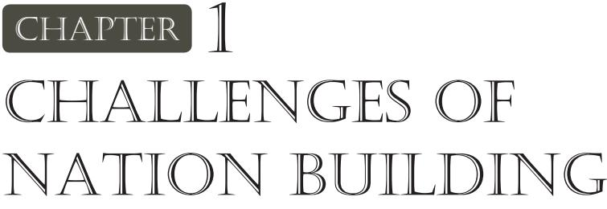

# *Challenges for the new nation-state*

At the hour of midnight on 14-15 August 1947, India attained independence. Jawaharlal Nehru, the first prime minister of free India, addressed a special session of the Constituent Assembly that night. This was the famous 'tryst with destiny' speech that you are familiar with.

This was the moment Indians had been waiting for. You have read in your history textbooks that there were many voices in our national movement. But there were two goals almost everyone agreed upon: one, that after independence, we shall run our country through democratic government; and two, that the government will be run for the good of all, particularly the poor and the socially disadvantaged groups. Now that the country was independent, the time had come to realise the promise of freedom.

This was not going to be easy. India was born as a nation-state in very difficult circumstances. Perhaps no other country by then was born in a situation more difficult than that of India in 1947. Freedom came with the partition of the country. The year 1947 was a year of unprecedented violence and trauma of displacement. It was in this situation that independent India started on its journey to achieve several objectives. Yet the turmoil that accompanied independence did not make our leaders lose sight of the multiple challenges that faced the new nation.

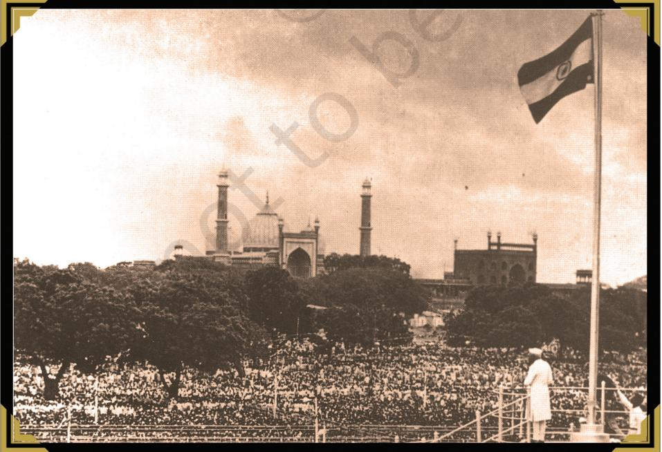

Prime Minister Jawahar Lal Nehru speaking from the red fort, 15 August 1947

Credit:

PIB

chap 1_PF.indd 3 15-03-2024 14:30:08

chap 1_PF.indd 4 9/6/2022 3:37:17 PM

*4 Politics in India since Independence*

Hindustan Times, 19 July 1947

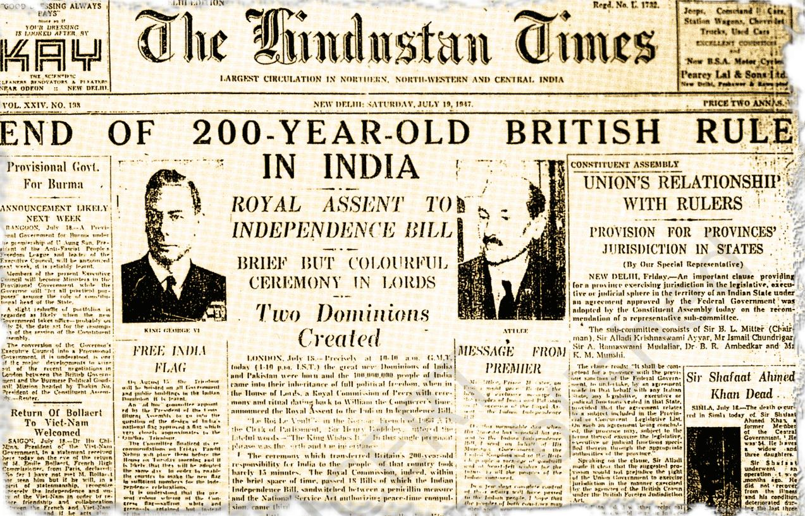

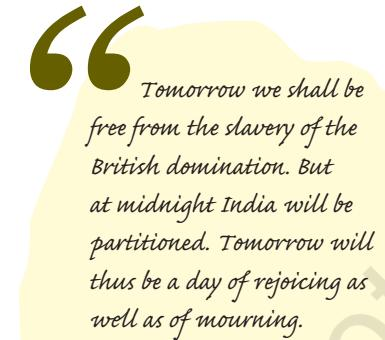

*Mahatma Gandhi*  14 August 1947, Kolkata.

## *Three Challenges*

Broadly, independent India faced three kinds of challenges. The first and the immediate challenge was to shape a nation that was united, yet accommodative of the diversity in our society. India was a land of continental size and diversity. Its people spoke different languages and followed different cultures and religions. At that time it was widely believed that a country full of such kinds of diversity could not remain together for long. The partition of the country appeared to prove everyone's worst fears. There were serious questions about the future of India: Would India survive as a unified country? Would it do so by emphasising national unity at the cost of every other objective? Would it mean rejecting all regional and sub-national identities? And there was an urgent question: How was integration of the territory of India to be achieved?

The second challenge was to establish democracy. You have already studied the Indian Constitution. You know that the Constitution granted fundamental rights and extended the right to vote to every citizen. India adopted representative democracy based on the parliamentary form of government. These features ensure that the political competition would take place in a democratic framework. A democratic constitution is necessary but not sufficient for establishing a democracy. The challenge was to develop democratic practices in accordance with the Constitution.

The third challenge was to ensure the development and wellbeing of the entire society and not only of some sections. Here again the Constitution clearly laid down the principle of equality and special protection to socially disadvantaged groups and religious and cultural communities. The Constitution also set out in the Directive Principles of State Policy the welfare goals that democratic politics must achieve. The real challenge now was to evolve effective policies for economic development and eradication of poverty.

How did independent India respond to these challenges? To what extent did India succeed in achieving the various objectives set out by the Constitution? This entire book is an attempt to respond to these questions. The book tells the story of politics in India since independence so as to equip you to develop your own answers to big questions like these. In the first three chapters we look at how the three challenges mentioned above were faced in the early years after independence.

In this chapter, we focus on the first challenge of nationbuilding that occupied centre-stage in the years immediately after Independence. We begin by looking at the events that formed the context of Independence. This can help us understand why the issue of national unity and security became a primary challenge at the time of Independence. We shall then see how India chose to shape itself into a nation, united by a shared history and common destiny. This unity had to reflect the aspirations of people across the different regions and deal with the disparities that existed among regions and different sections of people. In the next two chapters we shall turn to the challenge of establishing a democracy and achieving economic development with equality and justice.

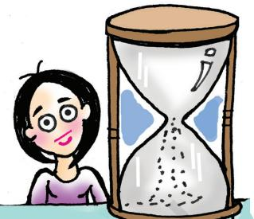

I always wanted a time machine, so that I can go back and participate in the celebrations of 15 August 1947. But this looks different from what I thought.

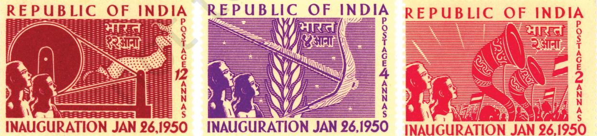

These three stamps were issued in 1950 to mark the first republic day on 26 January 1950. What do the images on these stamps tell you about the challenges to the new republic? If you were asked to design these stamps in 1950, which images would you have chosen?

chap 1_PF.indd 5 9/6/2022 3:37:17 PM

*6 P*

*6 Politics in India since Independence*

## **The Dawn of Freedom**

#### *Faiz Ahmed Faiz*

This scarred, marred brightness, this bitten-by-night dawn - The one that was awaited, surely, this is not that dawn. This is not the dawn yearning for which Had we set out, friends, hoping to find sometime, somewhere The final destination of stars in the wilderness of the sky. Somewhere, at least, must be a shore for the languid waves of the night, Somewhere at least must anchor the sad boat of the heart … *Translation of an extract from urdu poem Subh-e-azadi*

*Faiz Ahmed Faiz (1911-1984) Born in Sialkot; stayed in Pakistan after partition. A leftist in his political leanings, he opposed the Pakistani regime and was imprisoned. Collections of his poetry include Naksh-e-Fariyadi, Dast-e-Saba and Zindan-Nama. Regarded as one of the greatest poets of South Asia in the twentieth century.*

Dawn, Karachi, 14 August 1947

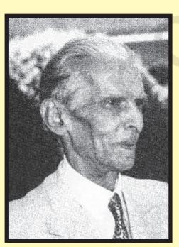

We should begin to work in that spirit and in course of time all these angularities of the majority and minority communities, the Hindu community and the Muslim community – because even as regards Muslims you have Pathans, Punjabis, Shias, Sunnis and so on and among the Hindus you have Brahmins, Vaishnavas, Khatris, also Bengalees, Madrasis, and so on – will vanish. … You are free; you are free to go to your temples, you are free to go to your mosques or to any other place of worship in this State of Pakistan. You may belong to any religion or caste or creed – that has nothing to do with the business of the State.

*Mohammad Ali Jinnah, Presidential Address to the Constituent Assembly of Pakistan at Karachi, 11 August 1947.*

chap 1_PF.indd 6 9/6/2022 3:37:20 PM

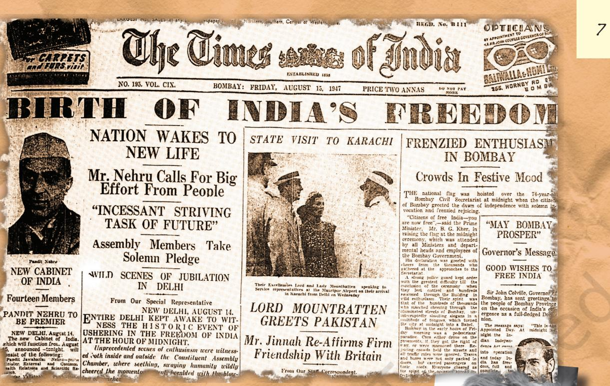

## **Today I call Waris Shah**

#### *Amrita Pritam*

Today, I call Waris Shah, "Speak from your grave" And turn, today, the book of love's next affectionate page Once, a daughter of Punjab cried and you wrote a wailing saga Today, a million daughters, cry to you, Waris Shah Rise! O' narrator of the grieving; rise! look at your Punjab Today, fields are lined with corpses, and blood fills the Chenab Someone has mixed poison in the five rivers' flow Their deadly water is, now, irrigating our lands galore This fertile land is sprouting, venom from every pore The sky is turning red from endless cries of gore The toxic forest wind, screams from inside its wake Turning each flute's bamboo-shoot, into a deadly snake …

*Amrita Pritam (1919–2005): A prominent Punjabi poet and fiction writer. Recipient of Sahitya Akademi Award, Padma Shree and Jnanapeeth Award. After partition she made Delhi her second home. She was active in writing and editing 'Nagmani' a Punjabi monthly magazine till her last.*

*Translation of an extract from a Punjabi poem "Aaj Akhan Waris Shah Nun"* 

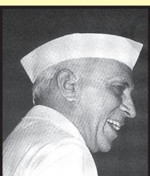

We have a Muslim minority who are so large in numbers that they cannot, even if they want, go anywhere else. That is a basic fact about which there can be no argument. Whatever the provocation from Pakistan and whatever the indignities and horrors inflicted on non-Muslims there, we have got to deal with this minority in a civilised manner. We must give them security and the rights of citizens in a democratic State. If we fail to do so, we shall have a festering sore which will eventually poison the whole body politic and probably destroy it.

*Jawaharlal Nehru, Letter to Chief Ministers, 15 October 1947.*

chap 1_PF.indd 7 9/6/2022 3:37:25 PM

# *Partition: displacement and rehabilitation*

On 14-15 August 1947, not one but two nation-states came into existence – India and Pakistan. This was a result of 'partition', the division of British India into India and Pakistan. The drawing of the border demarcating the territory of each country marked the culmination of political developments that you have read about in the history textbooks. According to the 'two-nation theory' advanced by the Muslim League, India consisted of not one but two 'people', Hindus and Muslims. That is why it demanded Pakistan, a separate country for the Muslims. The Congress opposed this theory and the demand for Pakistan. But several political developments in 1940s, the political competition between the Congress and the Muslim League and the British role led to the decision for the creation of Pakistan.

## *Process of partition*

Thus it was decided that what was till then known as 'India' would be divided into two countries, 'India' and 'Pakistan'. Such a division was not only very painful, but also very difficult to decide and to implement. It was decided to follow the principle of religious majorities. This basically means that areas where the Muslims were in majority would make up the territory of Pakistan. The rest was to stay with India.

The idea might appear simple, but it presented all kinds of difficulties. First of all, there was no single belt of Muslim majority areas in British India. There were two areas of concentration, one in the west and one in the east. There was no way these two parts could be joined. So it was decided that the new country, Pakistan, will comprise two territories, West and East Pakistan separated by a long expanse of Indian territory. Secondly, not all Muslim majority areas wanted to be in Pakistan. Khan Abdul Gaffar Khan, the undisputed leader of the North Western Frontier Province and known as 'Frontier Gandhi', was staunchly opposed to the two-nation theory. Eventually, his voice was simply ignored and the NWFP was made to merge with Pakistan.

The third problem was that two of the Muslim majority provinces of British India, Punjab and Bengal, had very large areas where the non-Muslims were in majority. Eventually it was decided that these two provinces would be bifurcated according to the religious majority at the district or even lower level. This decision could not be made by the midnight of 14-15 August. It meant that a large number of people did not know on the day of Independence whether they were in India or in Pakistan. The partition of these two provinces caused the deepest trauma of Partition.

This was related to the fourth and the most intractable of all the problems of partition. This was the problem of 'minorities' on both

Oh, now I understand! What was 'East' Bengal has now become Bangladesh. That is why our Bengal is called 'West' Bengal!

chap 1_PF.indd 8 9/6/2022 3:37:25 PM

sides of the border. Lakhs of Hindus and Sikhs in the areas that were now in Pakistan and an equally large number of Muslims on the Indian side of Punjab and Bengal (and to some extent Delhi and surrounding areas) found themselves trapped. They were to discover that they were undesirable aliens in their own home, in the land where they and their ancestors had lived for centuries. As soon as it became clear that the country was going to be partitioned, the violence started at an unprecedented level against communities who were lesser in number in their respective areas. No one had quite anticipated the scale of this problem. No one had any plans for handling this. Initially, the people and political leaders kept hoping that this violence was temporary and would be controlled soon. But very soon the violence went out of control. Such communities on both sides of the border were often compelled to leave their homes at a few hours' notice.

#### *Consequences of partition*

The year 1947 was the year of one of the largest, most abrupt, unplanned and tragic transfer of population that human history has known. There were killings and atrocities on both sides of the border. In the name of religion people of one community ruthlessly killed and maimed people of the other community. Cities like Lahore,

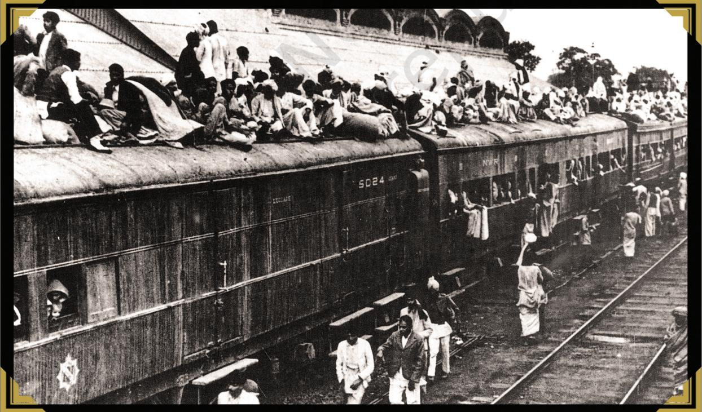

A train full of 'refugees' in 1947.

Credit: DPA.

chap 1_PF.indd 9 15-03-2024 14:35:26

## *Hospitality Delayed*

Saadat Hasan Manto

Rioters brought the running train to a halt. People belonging to the other community were pulled out and slaughtered with swords and bullets.

The remaining passengers were treated to halwa, fruits and milk.

The chief organiser said, 'Brothers and sisters, news of this train's arrival was delayed. That is why we have not been able to entertain you lavishly – the way we wanted to.'

Source: English translation of Urdu short story Kasre-Nafsi

Amritsar and Kolkata became divided into 'communal zones'. Muslims would avoid going into an area where mainly Hindus or Sikhs lived; similarly the Hindus and Sikhs stayed away from areas of Muslim predominance.

Forced to abandon their homes and move across borders, people went through immense sufferings. Minorities on both sides of the border fled their home and often secured temporary shelter in 'refugee camps'. They often found unhelpful local administration and police in what was till recently their own country. They travelled to the other side of the new border by all sorts of means, often by foot. Even during this journey they were often attacked, killed or raped. Thousands of women were abducted. They were made to convert to the religion of the abductor and were

forced into marriage. In many cases women were killed by their own family members to preserve the 'family honour'. Many children were separated from their parents. Those who did manage to cross the border found that they had no home. For lakhs of these 'refugees' the

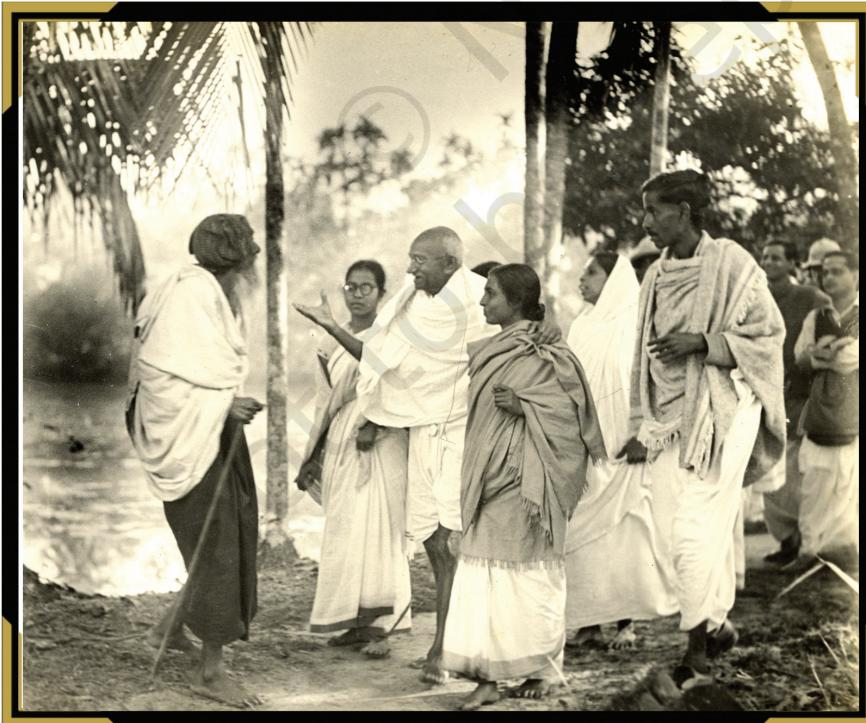

Gandhi in Noakhali (now in Bangladesh) in 1947.

country's freedom meant life in 'refugee camps', for months and sometimes for years.

Writers, poets and film-makers in India and Pakistan have expressed the ruthlessness of the killings and the suffering of displacement and violence in their novels, short-stories, poems and films. While recounting the trauma of Partition, they have often used the phrase that the survivors themselves used to describe partition — as a 'division of hearts'.

The partition was not merely a division of properties, liabilities

chap 1_PF.indd 10 15-03-2024 14:35:27

and assets, or a political division of the country and the administrative apparatus. What also got divided were the financial assets, and things like tables, chairs, typewriters, paper-clips, books and also musical instruments of the police band! The employees of the government and the railways were also 'divided'. Above all, it was a violent separation of communities who had hitherto lived together as neighbours. It is estimated that the Partition forced about 80 lakh people to migrate across the new border. Between five to ten lakh people were killed in partition related violence.

 Beyond the administrative concerns and financial strains, however, the partition posed another deeper issue. The leaders of the Indian national struggle did not believe in the two-nation theory. And yet, partition on religious basis had taken place. Did that make India a Hindu nation automatically? Even after large scale migration of Muslims to the newly created Pakistan, the Muslim population in India accounted for 10-12 per cent of the total population in 1951. So, how would the government of India treat its Muslim citizens and other religious minorities (Sikhs, Christians, Jains, Buddhists, Parsis and Jews)? The partition had already created severe conflict between the two communities.

There were competing political interests behind these conflicts. The Muslim League was formed to protect the interests of the Muslims in colonial India. It was in the forefront of the demand for a separate Muslim nation. Similarly, there were organisations, which were trying to organise the Hindus in order to turn India into a Hindu nation. But most leaders of the national movement believed that India must treat persons of all religions

# Let's watch a Film

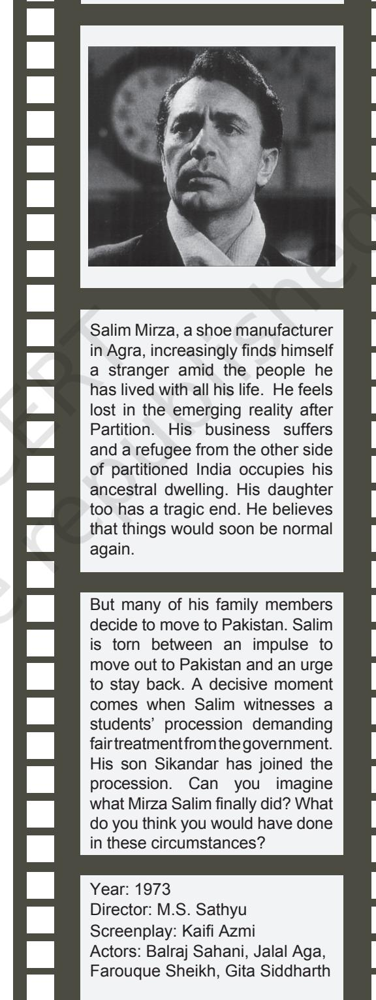

**Garam Hawa**

chap 1_PF.indd 11 15-03-2024 14:35:27

# *Mahatma Gandhi's sacrifice*

On the 15th August 1947 Mahatma Gandhi did not participate in any of the independence day celebrations. He was in Kolkata in the areas which were torn by gruesome riots between Hindus and Muslims. He was saddened by the communal violence and disheartened that the principles of ahimsa (non-violence) and satyagraha (active but non-violent resistance) that he had lived and worked for, had failed to bind the people in troubled times. Gandhiji went on to persuade the Hindus and Muslims to give up violence. His presence in Kolkata greatly improved the situation, and the coming of independence was celebrated in a spirit of communal harmony, with joyous dancing in the streets. Gandhiji's prayer meetings attracted large crowds. But this was short lived as riots between Hindus and Muslims erupted once again and Gandhiji had to resort to a fast to bring peace.

Next month Gandhiji moved to Delhi where large scale violence had erupted. He was deeply concerned about ensuring that Muslims should be allowed to stay in India with dignity, as equal citizens. He was also concerned about the relations between India and Pakistan. He was unhappy with what he saw as the Indian government's decision not to honour its financial commitments to Pakistan. With all this in mind he undertook what turned out to be his last fast in January 1948. As in Kolkata, his fast had a dramatic effect in Delhi. Communal tension and violence reduced. Muslims of Delhi and surrounding areas could safely return to their homes. The government of India agreed to give Pakistan its dues.

Gandhiji's actions were however not liked by all. Extremists in both the communities blamed him for their conditions. Despite this he continued to meet everyone during his prayer meetings. Finally, on 30 January 1948, one such extremist, Nathuram Vinayak Godse, walked up to Gandhiji during his evening prayer in Delhi and fired three bullets at him, killing him instantly. Thus ended a lifelong struggle for truth, non-violence, justice and tolerance.

chap 1_PF.indd 12 9/6/2022 3:37:31 PM

2024-25

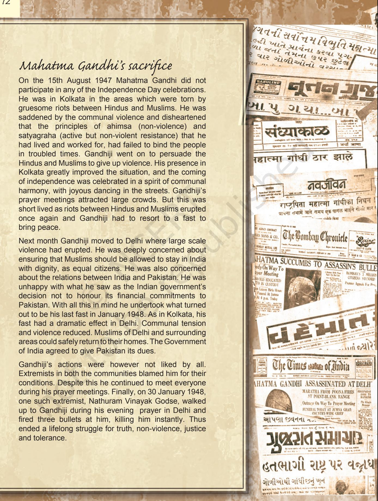

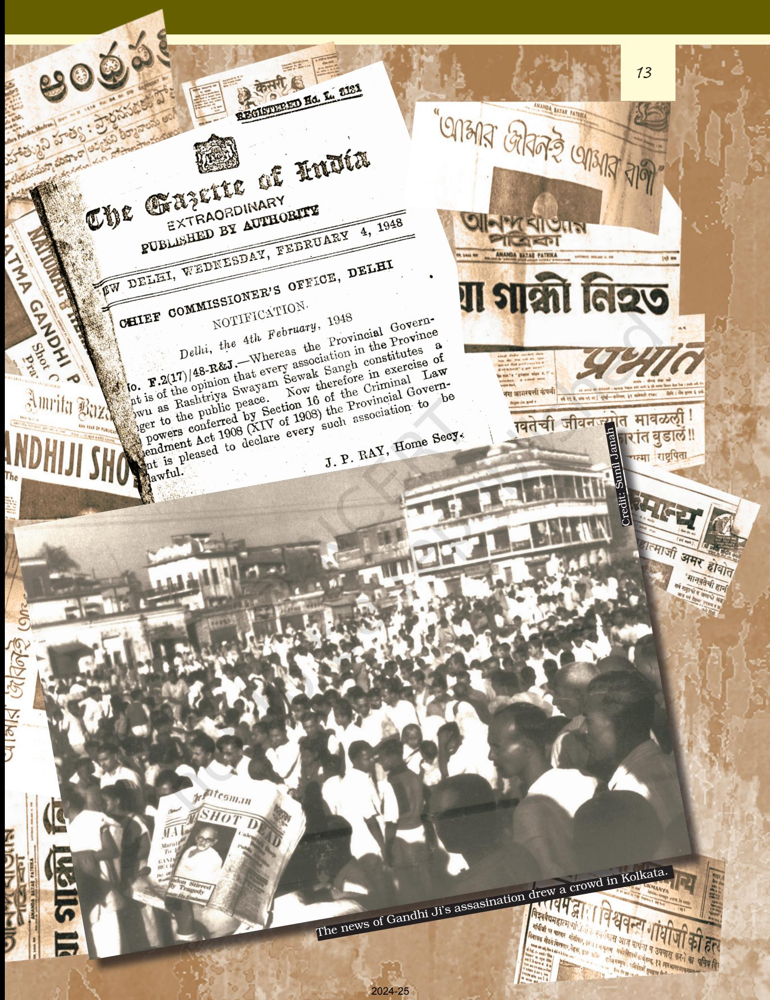

chap 1_PF.indd 13 9/6/2022 3:37:33 PM

Let's re-search

equally and that India should not be a country that gave superior status to adherents of one faith and inferior to those who practiced another religion. All citizens would be equal irrespective of their religious affiliation. Being religious or a believer would not be a test of citizenship. They cherished therefore the ideal of a secular nation. This ideal was enshrined in the Indian Constitution.

Shweta noticed that her Nana (maternal grandfather) would get very quiet whenever anyone mentioned Pakistan. One day she decided to ask him about it. Her Nana told her about how he moved from Lahore to Ludhiana during partition. Both his parents were killed. Even he would not have survived, but a neighbouring Muslim family gave him shelter and kept him in hiding for several days. They helped him find some relatives and that is how he managed to cross the border and start a new life. Similarly, there are many examples of Hindu families and others who helped, sheltered, and saved the lives of Muslim families during the times of crisis and violence caused by Partition. It shows the importance of compassion and solidarity on religious grounds in both communities.

Have you heard a similar story? Ask your grandparents or anyone of that generation about their memories of Independence Day, about the celebration, about the trauma of partition, about the expectations they had from independence.

Write down at least two of these stories.

## *Integration of Princely States*

British India was divided into what were called the British Indian Provinces and the Princely States. The British Indian Provinces were directly under the control of the British government. On the other hand, several large and small states ruled by princes, called the Princely States, enjoyed some form of control over their internal affairs as long as they accepted British supremacy. This was called paramountcy or suzerainty of the British crown. Princely States covered one-third of the land area of the British Indian Empire and one out of four Indians lived under princely rule.

### *The problem*

Just before Independence it was announced by the British that with the end of their rule over India, paramountcy of the British crown over Princely States would also lapse. This meant that all these states, as many as 565 in all, would become legally independent. The British government took the view that all these states were free to join either India or Pakistan or remain independent if they so wished. This decision was left not to the people but to the princely rulers of these states. This was a very serious problem and could threaten the very existence of a united India.

The problems started very soon. First of all, the ruler of Travancore announced that the state had decided on Independence. The Nizam

chap 1_PF.indd 14 15-03-2024 14:39:25

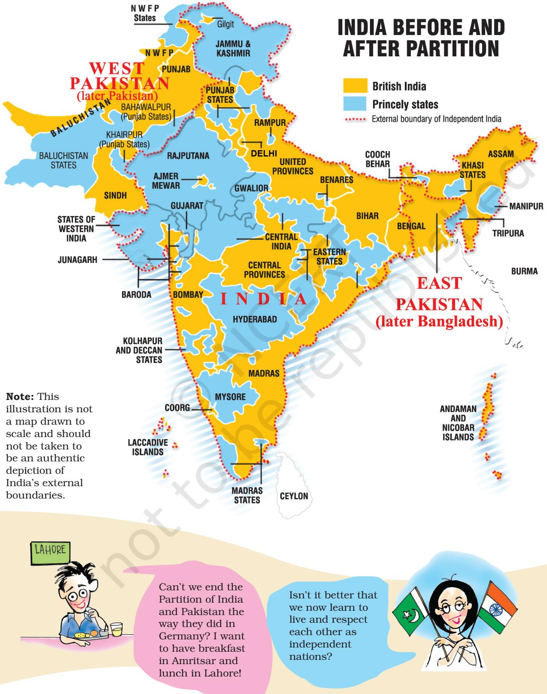

chap 1_PF.indd 15 9/6/2022 3:37:34 PM

of Hyderabad made a similar announcement the next day. Rulers like the Nawab of Bhopal were averse to joining the Constituent Assembly. This response of the rulers of the Princely States meant that after Independence there was a very real possibility that India would get further divided into a number of small countries. The prospects of democracy for the people in these states also looked bleak. This was a strange situation, since the Indian Independence was aimed at unity, self-determination as well as democracy. In most of these princely states, governments were run in a non-democratic manner and the rulers were unwilling to give democratic rights to their populations.

#### *Government's approach*

The interim government took a firm stance against the possible division of India into small principalities of different sizes. Under the Mountbatten Plan, the Princely states were free to join India or Pakistan. Sardar Patel was India's Deputy Prime Minister and the Home Minister during the crucial period immediately following Independence. He played a historic role in negotiating with the rulers of princely states firmly but diplomatically and bringing most of them into the Indian Union. It may look easy now. But it was a very complicated task which required skilful persuasion. For instance, there were 26 small states in today's Orissa. Saurashtra region of Gujarat had 14 big states, 119 small states and numerous other different administrations. 

The government's approach was guided by three considerations. Firstly, the people of most of the princely states clearly wanted to become part of the Indian union. Secondly, the government was prepared to be flexible in giving autonomy to some regions. The idea was to accommodate plurality and adopt a flexible approach in dealing with the demands of the regions. Thirdly, in the backdrop of partition which brought into focus the contest over demarcation of territory, the integration and consolidation of the territorial boundaries of the nation had assumed supreme importance.

Before 15 August 1947, peaceful negotiations had brought almost all states whose territories were contiguous to the new boundaries of India, into the Indian Union. The rulers of most of the states signed a document called the 'Instrument of Accession' which meant that their state agreed to become a part of the Union of India. Accession of the Princely States of Junagadh, Hyderabad, Kashmir and Manipur proved more difficult than the rest. The issue of Junagarh was resolved after a plebiscite confirmed people's desire to join India. You will read about Kashmir in Chapter Seven. Here, let us look at the cases of Hyderabad and Manipur.

*We are at a momentous stage in the history of India. By common endeavour, we can raise the country to new greatness, while lack of unity will expose us to unexpected calamities. I hope the Indian States will realise fully that if we do not cooperate and work together in the general interest, anarchy and chaos will overwhelm us all, great and small, and lead us to "*

*total ruin...*

*Sardar Patel* Letter to Princely rulers, 1947.

chap 1_PF.indd 16 15-03-2024 14:40:35

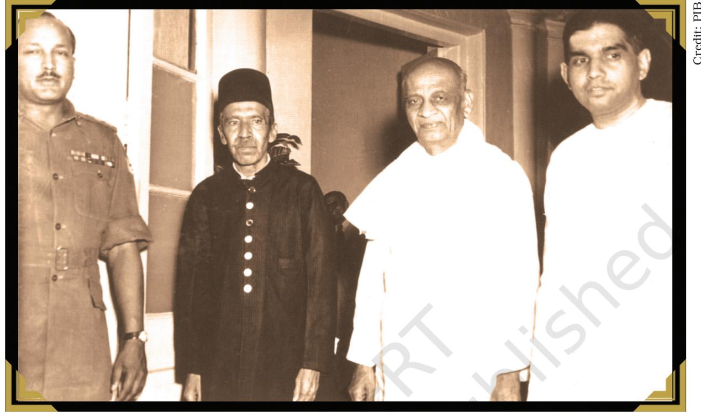

Sardar Patel with the Nizam of Hyderabad

## *Hyderabad*

Hyderabad, the largest of the Princely States was surrounded entirely by Indian territory. Some parts of the old Hyderabad state are today parts of Maharashtra, Karnataka and Andhra Pradesh. Its ruler carried the title, 'Nizam', and he was one of the world's richest men. The Nizam wanted an independent status for Hyderabad. He entered into what was called the Standstill Agreement with India in November 1947 for a year while negotiations with the Indian government were going on.

In the meantime, a movement of the people of Hyderabad State against the Nizam's rule gathered force. The peasantry in the Telangana region in particular, was the victim of Nizam's oppressive rule and rose against him. Women who had seen the worst of this oppression joined the movement in large numbers. Hyderabad town was the nerve centre of this movement. The Communists and the Hyderabad Congress were in the forefront of the movement. The Nizam responded by unleashing a para-military force known as the Razakars on the people. The atrocities and communal nature of the Razakars knew no bounds. They

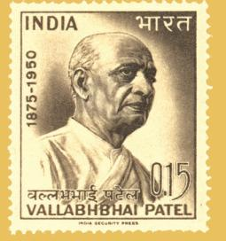

**Sardar Vallabhbhai Patel (1875-1950)**: Leader of the freedom movement; Congress leader; follower of Mahatma Gandhi; Deputy Prime Minister and first Home Minister of independent India; played an important role in the integration of Princely States with India; member of important committees of the Constituent Assembly on Fundamental Rights, Minorities, Provincial Constitution, etc.

chap 1_PF.indd 17 9/6/2022 3:37:35 PM

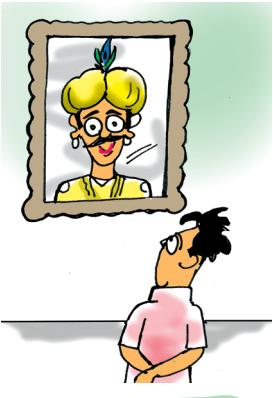

I wonder what happened to all those hundreds of kings, queens, princes and princesses. How did they live their lives after becoming just ordinary citizens? murdered, maimed, raped and looted, targeting particularly the non-Muslims. The central government had to order the army to tackle the situation. In September 1948, Indian army moved in to control the Nizam's forces. After a few days of intermittent fighting, the Nizam surrendered. This led to Hyderabad's accession to India.

## *Manipur*

A few days before Independence, the Maharaja of Manipur, Bodhachandra Singh, signed the Instrument of Accession with the Indian government on the assurance that the internal autonomy of Manipur would be maintained. Under the pressure of public opinion, the Maharaja held elections in Manipur in June 1948 and the state became a constitutional monarchy. Thus Manipur was the first part of India to hold an election based on universal adult franchise.

In the Legislative Assembly of Manipur there were sharp differences over the question of merger of Manipur with India. While the state Congress wanted the merger, other political parties were opposed to this. The Government of India succeeded in persuading the Maharaja into signing a Merger Agreement in September 1949.

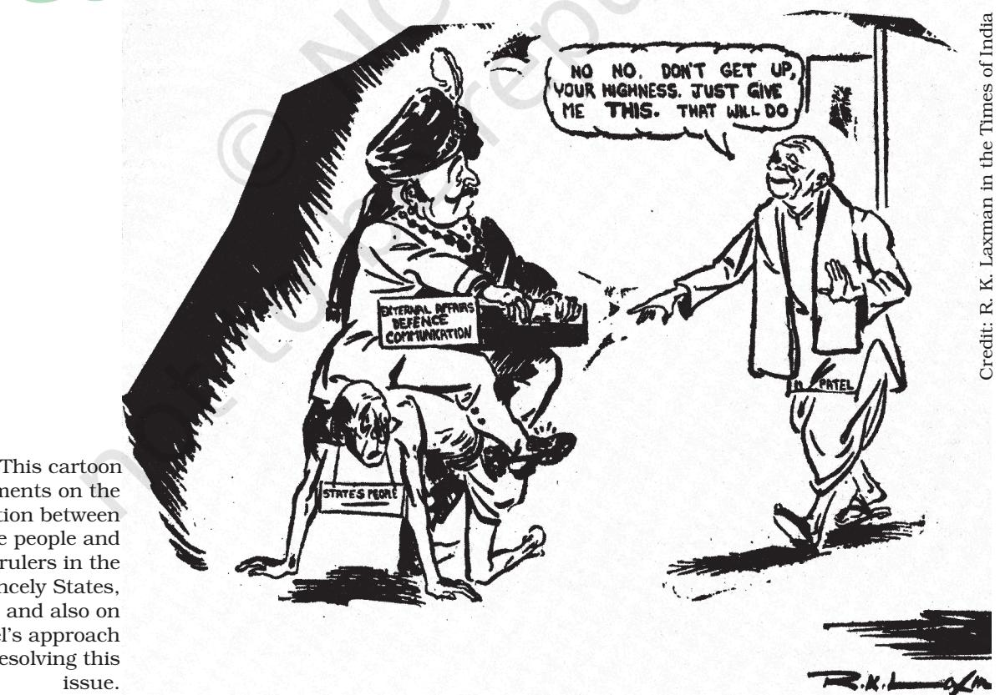

comments on the relation between the people and the rulers in the Princely States, Patel's approach to resolving this

chap 1_PF.indd 18 22-Apr-24 12:40:19 PM

# *Reorganisation of States*

The process of nation-building did not come to an end with partition and integration of Princely States. Now the challenge was to draw the internal boundaries of the Indian states. This was not just a matter of administrative divisions. The boundaries had to be drawn in a way so that the linguistic and cultural plurality of the country could be reflected without affecting the unity of the nation.

During colonial rule, the state boundaries were drawn either on administrative convenience or simply coincided with the territories annexed by the British government or the territories ruled by the princely powers.

Our national movement had rejected these divisions as artificial and had promised the linguistic principle as the basis of formation of states. In fact after the Nagpur session of Congress in 1920 the principle was recognised as the basis of the reorganisation of the Indian National Congress party itself. Many Provincial Congress Committees were created by linguistic zones, which did not follow the administrative divisions of British India.

Things changed after Independence and partition. Our leaders felt that carving out states on the basis of language might lead to disruption and disintegration. It was also felt that this would draw attention away from other social and economic challenges that the country faced. The central leadership decided to postpone matters. The need for postponement was also felt because the fate of the Princely States had not been decided. Also, the memory of partition was still fresh.

This decision of the national leadership was challenged by the local leaders and the people. Protests began in the Telugu speaking areas of the old Madras province, which included present day Tamil Nadu, parts of Andhra Pradesh, Kerala and Karnataka. The Vishalandhra movement (as the movement for a separate Andhra was called) demanded that the Telugu speaking areas should be separated from the Madras province of which they were a part and be made into a separate Andhra province. Nearly all the political forces in the Andhra region were in favour of linguistic reorganisation of the then Madras province.

The movement gathered momentum as a result of the Central government's vacillation. Potti Sriramulu, a Congress leader and a veteran Gandhian, went on an indefinite fast that led to his death after 56 days. This caused great unrest and resulted in violent outbursts in Andhra region. People in large numbers took to the streets. Many were injured or lost their lives in police firing. In Madras, several legislators resigned their seats in protest. Finally, the Prime Minister announced the formation of a separate Andhra state in December 1952.

*" " ..if lingusitic provinces are formed, it will also give a fillip to the regional languages. It would be absurd to make Hindustani the medium of instruction in all the regions and it is still more absurd to use English for this purpose.*

> *Mahatma Gandhi*  January1948

chap 1_PF.indd 19 9/6/2022 3:37:36 PM

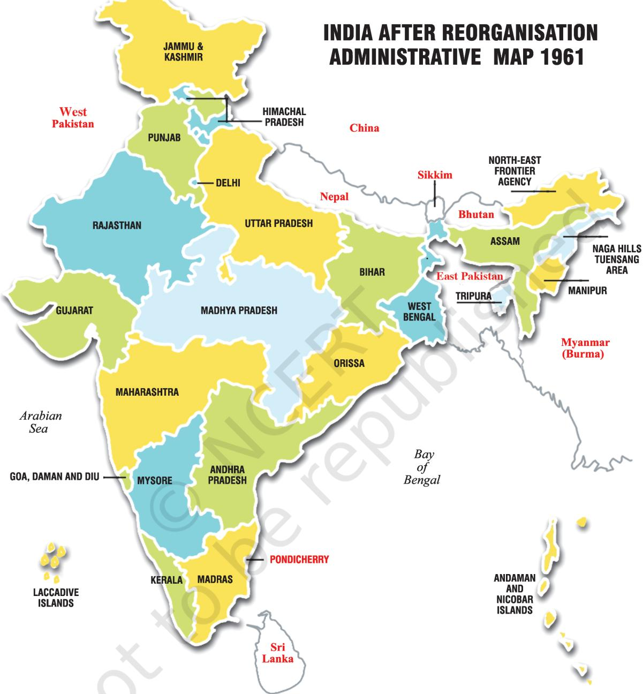

**Note:** This illustration is not a map drawn to scale and should not be taken to be an authentic depiction of India's external boundaries.

Read the map and answer the following questions:

- 1. Name the original state from which the following states were carved out: Gujarat Haryana Meghalaya Chhattisgarh
- 2. Name two states that were affected by the partition of the country.
- 3. Name two states today that were once a Union Territory.

chap 1_PF.indd 20 9/6/2022 3:37:39 PM

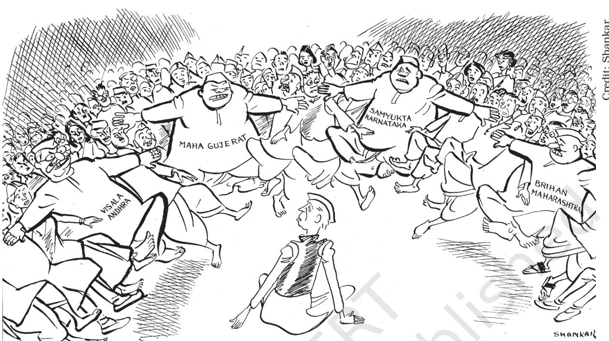

"Struggle for Survival" (26 July 1953) captures contemporary impression of the demand for linguistic states

The formation of Andhra spurred the struggle for making of other states on linguistic lines in other parts of the country. These struggles forced the Central Government into appointing a States Reorganisation Commission in 1953 to look into the question of redrawing of the boundaries of states. The Commission in its report accepted that the boundaries of the state should reflect the boundaries of different languages. On the basis of its report the States Reorganisation Act was passed in 1956. This led to the creation of 14 states and six union territories.

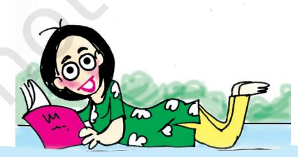

Now, isn't this very interesting? Nehru and other leaders were very popular, and yet the people did not hesitate to agitate for linguistic states against the wishes of the leaders!

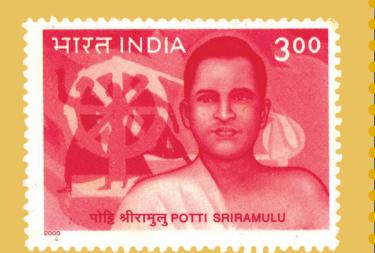

#### **Potti Sriramulu**

**(1901-1952):** Gandhian worker; left government job to participate in Salt Satyagraha; also participated in individual Satyagraha; went on a fast in 1946 demanding that temples in Madras province be opened to dalits; undertook a fast unto death from 19 October 1952 demanding separate state of Andhra; died during the fast on 15 December 1952.

chap 1_PF.indd 21 9/6/2022 3:37:44 PM

Credit: Shankar

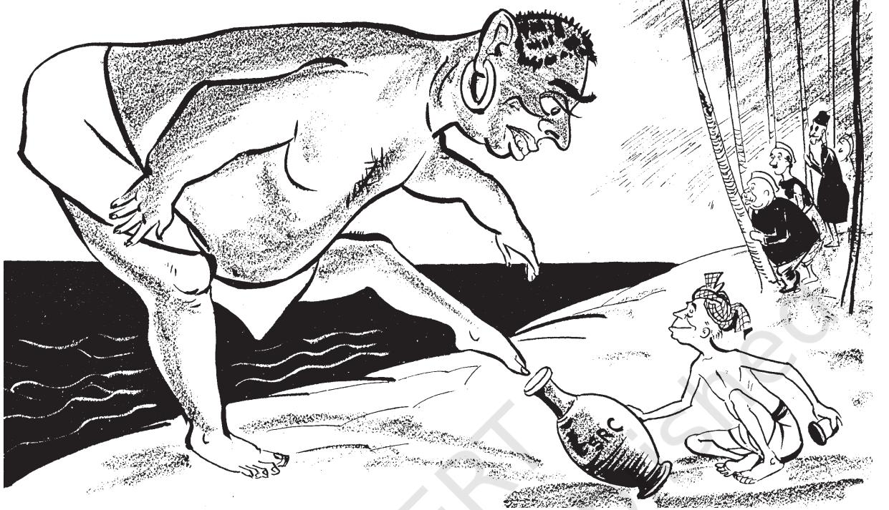

"Coaxing the Genie back" (5 February 1956) asked if the State Reorganisation Commission could contain the genie of linguism.

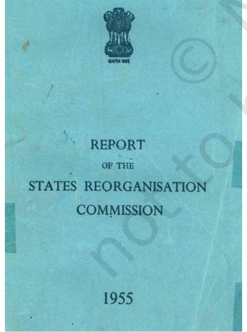

One of the most important concerns in the early years was that demands for separate states would endanger the unity of the country. It was felt that linguistic states may foster separatism and create pressures on the newly founded nation. But the leadership, under popular pressure, finally made a choice in favour of linguistic states. It was hoped that if we accept the regional and linguistic claims of all regions, the threat of division and separatism would be reduced. Besides, the accommodation of regional demands and the formation of linguistic states were also seen as more democratic.

Now it is more than fifty years since the formation of linguistic states. We can say that linguistic states and the movements for the formation of these states changed the nature of democratic politics and leadership in some basic ways. The path to politics and power was now open to people other than the small English speaking elite. Linguistic reorganisation also gave some uniform basis to the drawing of state boundaries. It did not lead

chap 1_PF.indd 22 9/6/2022 3:37:45 PM

to disintegration of the country as many had feared earlier. On the contrary it strengthened national unity.

Above all, the linguistic states underlined the acceptance of the principle of diversity. When we say that India adopted democracy, it does not simply mean that India embraced a democratic constitution, nor does it merely mean that India adopted the format of elections. The choice was larger than that. It was a choice in favour of recognising and accepting the existence of differences which could at times be oppositional. Democracy, in other words, was associated with plurality of ideas and ways of life. Much of the politics in the later period was to take place within this framework.

## Fast Forward Creation of new states

The acceptance of the principle of linguistic states did not mean, however, that all states immediately became linguistic states. There was an experiment of 'bilingual' Bombay state, consisting of Gujarati- and Marathi-speaking people. After a popular agitation, the states of Maharashtra and Gujarat were created in 1960.

In Punjab also, there were two linguistic groups: Hindi-speaking and Punjabi-speaking. The Punjabi-speaking people demanded a separate state. But it was not granted with other states in 1956. Statehood for Punjab came ten years later, in 1966, when the territories of today's Haryana and Himachal Pradesh were separated from the larger Punjab state.

Another major reorganisation of states took place in the north-east in 1972. Meghalaya was carved out of Assam in 1972. Manipur and Tripura too emerged as separate states in the same year. The states of Mizoram and Arunachal Pradesh came into being in 1987. Nagaland had become a state much earlier in 1963.

Language did not, however, remain the sole basis of organisation of states. In later years sub-regions raised demands for separate states on the basis of a separate regional culture or complaints of regional imbalance in development. Three such states, Chhattisgarh, Uttarakhand and Jharkhand, were created in 2000. Telangana has emerged as a new state on 2 June, 2014. The story of reorganisation has not come to an end. There are many regions in the country where there are movements demanding separate and smaller states. These include Vidarbha in Maharashtra, Harit Pradesh in the western region of Uttar Pradesh and the northern region of West Bengal.

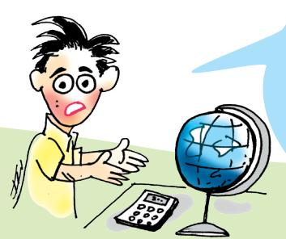

The US has one-fourth of our population but 50 states. Why can't India have more than 100 states?

chap 1_PF.indd 23 9/6/2022 3:37:46 PM

- 1. Which among the following statements about the partition is incorrect?
	- (a) Partition of India was the outcome of the "two-nation theory."
	- (b) Punjab and Bengal were the two provinces divided on the basis of religion.
	- (c) East Pakistan and West Pakistan were not contiguous.
	- (d) The scheme of partition included a plan for transfer of population across the border.
- 2. Match the principles with the instances:
	- (a) Mapping of boundaries i. Pakistan and on religious grounds Bangladesh
	- (b) Mapping of boundaries on grounds ii. India and of different languages Pakistan
	- (c) Demarcating boundaries within a iii. Jharkhand and country by geographical zones Chhattisgarh
- (d) Demarcating boundaries within a iv. Himachal Pradesh country on administrative and and Uttarakhand political grounds
- 
- 
- 
- 
- 3. Take a current political map of India (showing outlines of states) and mark the location of the following Princely States.

| (a) | Junagadh | (b) Manipur |
| --- | --- | --- |
| (c) | Mysore | (d) Gwalior |

- 4. Here are two opinions –
*Bismay: "The merger with the Indian State was an extension of democracy to the people of the Princely States."*

*Inderpreet: "I am not so sure, there was force being used. Democracy comes by creating consensus."*

What is your own opinion in the light of accession of Princely States and the responses of the people in these parts?

5. Read the following very different statements made in August 1947 –

*"Today you have worn on your heads a crown of thorns. The seat of power is a nasty thing. You have to remain ever wakeful on that seat…. you have to be more humble and forbearing…now there will be no end to your being tested."* — M.K Gandhi

*"…India will awake to a life of freedom….we step out from the old to the new…we end today a period of ill fortune and India discovers herself again. The achievement we celebrate today is but a step, an opening of opportunity…" —* Jawaharlal Nehru

Spell out the agenda of nation building that flows from these two statements. Which one appeals more to you and why?

*EXERCISES*

chap 1_PF.indd 24 9/6/2022 3:37:46 PM

- 6. What are the reasons being used by Nehru for keeping India secular? Do you think these reasons were only ethical and sentimental? Or were there some prudential reasons as well?
- 7. Bring out two major differences between the challenge of nation building for eastern and western regions of the country at the time of Independence.
- 8. What was the task of the States Reorganisation Commission? What was its most salient recommendation?
- 9. It is said that the nation is to a large extent an " imagined community" held together by common beliefs, history, political aspirations and imaginations. Identify the features that make India a nation.
- 10. Read the following passage and answer the questions below:

*"In the history of nation-building only the Soviet experiment bears comparison with the Indian. There too, a sense of unity had to be forged between many diverse ethnic groups, religious, linguistic communities and social classes. The scale – geographic as well as demographic – was comparably massive. The raw material the state had to work with was equally unpropitious: a people divided by faith and driven by debt and disease."* — Ramachandra Guha

- (a) List the commonalities that the author mentions between India and Soviet Union and give one example for each of these from India.
- (b) The author does not talk about dissimilarities between the two experiments. Can you mention two dissimilarities?
- (c) In retrospect which of these two experiments worked better and why?

#### **LET US DO IT TOGETHER**

- Read a novel/ story on partition by an Indian and a Pakistani/ Bangladeshi writer. What are the commonalities of the experience across the border?
- Collect all the stories from the 'Let's Research' suggestion in this chapter. Prepare a wallpaper that highlights the common experiences and has stories on the unique experiences.

chap 1_PF.indd 25 9/6/2022 3:37:46 PM

