Credit: Shankar

This famous sketch by Shankar appeared on the cover of his collection – *Don't Spare Me, Shankar*. The original sketch was drawn in the context of India's China policy. But this cartoon captures the dual role of the Congress during the era of one-party dominance.

### *In this chapter…*

The challenge of nation-building, covered in the last chapter, was accompanied by the challenge of instituting democratic politics. Thus, electoral competition among political parties began immediately after Independence. In this chapter, we look at the first decade of electoral politics in order to understand

- • the establishment of a system of free and fair elections;
- • the domination of the Congress party in the years immediately after Independence; and
- • the emergence of opposition parties and their policies.

chap 2_PF.indd 26 9/6/2022 3:57:55 PM

# chapter 2 era of one-party dominance

# *Challenge of building democracy*

You now have an idea of the difficult circumstances in which independent India was born. You have read about the serious challenge of nation-building that confronted the country right in the beginning. Faced with such serious challenges, leaders in many other countries of the world decided that their country could not afford to have democracy. They said that national unity was their first priority and that democracy will introduce differences and conflicts. Therefore many of the countries that gained freedom from colonialism experienced non-democratic rule. It took various forms: nominal democracy but effective control by one leader, one party rule or direct army rule. Non-democratic regimes always started with a promise of restoring democracy very soon. But once they established themselves, it was very difficult to dislodge them.

The conditions in India were not very different. But the leaders of the newly independent India decided to take the more difficult path. Any other path would have been surprising, for our freedom struggle was deeply committed to the idea of democracy. Our leaders were conscious of the critical role of politics in any democracy. They did not see politics as a problem; they saw it as a way of solving the problems. Every society needs to decide how it will govern and regulate itself. There are always different policy alternatives to choose from. There are different groups with different and conflicting aspirations. How do we resolve these differences? Democratic politics is an answer to this question. While competition and power are the two most visible things about politics, the purpose of political activity is and should be deciding and pursuing public interest. This is the route our leaders decided to take.

Last year you studied how our Constitution was drafted. You would remember that the Constitution was adopted on 26 November 1949 and signed on 24 January 1950 and it came into effect on 26 January 1950. At that time the country was being ruled by an interim government. It was now necessary to install the first democratically elected government of the country. The Constitution had laid down the rules, now the machine had to be put in place. Initially it was thought that this was only a matter of a few months. The Election Commission of India was set up in January 1950. Sukumar Sen became the first Chief Election Commissioner. The country's first general elections were expected sometime in 1950 itself.

 *In India,…. …hero-worship, plays a part in its politics unequalled in magnitude by the part it plays in the politics of any other country….But in politics, .. ..hero-worship is a sure road to degradation and eventual dictatorship. "*

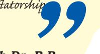

*Babasaheb Dr. B.R. Ambedkar* Speech in Constituent Assembly 25 November 1949

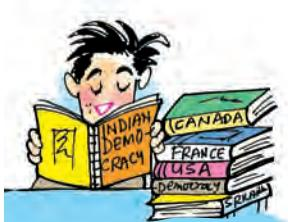

What's so special about our being a democracy? Sooner or later every country has become a democracy, isn't it?

chap 2_PF.indd 27 9/6/2022 3:57:55 PM

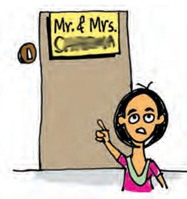

That was a good decision. But what about men who still refer to a woman as Mrs. somebody, as if she does not have a name of her own?

But the Election Commission discovered that it was not going to be easy to hold a free and fair election in a country of India's size. Holding an election required delimitation or drawing the boundaries of the electoral constituencies. It also required preparing the electoral rolls, or the list of all the citizens eligible to vote. Both these tasks took a lot of time. When the first draft of the rolls was published, it was discovered that the names of nearly 40 lakh women were not recorded in the list. They were simply listed as "wife of …" or "daughter of …". The Election Commission refused to accept these entries and ordered a revision if possible and deletion if necessary. Preparing for the first general election was a mammoth exercise. No election on this scale had ever been conducted in the world before. At that time there were 17 crore eligible voters, who had to elect about 3,200 MLAs and 489 Members of Lok Sabha. Only 15 per cent of these eligible voters were literate. Therefore the Election Commission had to think of some special method of voting. The Election Commission trained over 3 lakh officers and polling staff to conduct the elections.

It was not just the size of the country and the electorate that made this election unusual. The first general election was also the first big test of democracy in a poor and illiterate country. Till then democracy had existed only in the prosperous countries, mainly in Europe and North America, where nearly everyone was literate. By that time many countries in Europe had not given voting rights to all women. In this context India's experiment with universal adult franchise

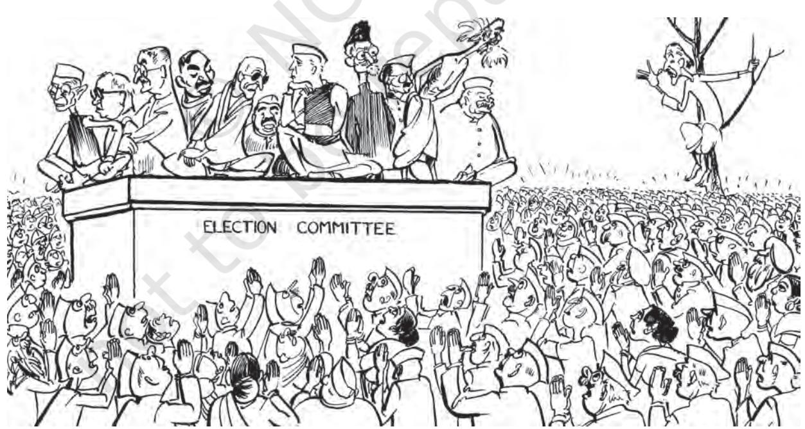

chap 2_PF.indd 28 9/6/2022 3:57:56 PM

#### **Changing methods of voting**

| UMSK | 159 v Laukal L.Ar 2005r Lies |
| --- | --- |
| - 1000 1000 |  |
| 2 बाह्या बताव बादब |  |
| 3. Rear Stic |  |
| 4 रीमिय बनार वात |  |
| 12 दिन प्रशास |  |
| 11 Q THE FAN |  |
| 1 Start Jiki 2008 |  |
| 8 टेक्सव प्रति |  |
| y mor with |  |
| 10 स्वास नाव धोको |  |

A sample of the ballot paper used from the third to the thirteenth general elections to Lok Sabha

These days we use an Electronic Voting Machine (EVM) to record voters' preferences. But that is not how we started. In the first general election, it was decided to place inside each polling booth a box for each candidate with the election symbol of that candidate. Each voter was given a blank ballot paper which they had to drop into the box of the candidate they wanted to vote for. About 20 lakh steel boxes were used for this purpose.

A presiding officer from Punjab described how he prepared the ballot boxes—"Each box had to have its candidate's symbol, both inside and outside it, and outside on either side, had to be displayed the name of the candidate in Urdu, Hindi and Punjabi along with the number of the constituency, the polling station and the polling booth. The paper seal with the numerical description of the candidate, signed by the presiding officer, had to be inserted in the token frame and its window closed by its door

which had to be fixed in its place at the other end by means of a wire. All this had to be done on the day previous to the one fixed for polling. To fix symbols and labels the boxes had first to be rubbed with sandpaper or a piece of brick. I found that it took about five hours for six persons, including my two daughters, to complete this work. All this was done at my house."

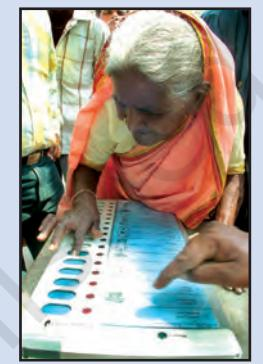

Electronic Voting Machine

Let's re-search

After the first two elections, this method was changed. Now the ballot paper carried the names and symbols of all the candidates and the voter was required to put a stamp on the name of the candidate they wanted to vote for. This method worked for nearly forty years. Towards the end of 1990s the Election Commission started using the EVM. By 2004 the entire country had shifted to the EVM.

Ask the elders in your family and neighbourhood about their experience of participating in elections.

- • Did anyone vote in the first or second general election? Who did they vote for and why?
- • Is there someone who has used all the three methods of voting? Which one did they prefer?
- • In which ways do they find the elections of those days different from the present ones?

chap 2_PF.indd 29 9/6/2022 3:57:56 PM

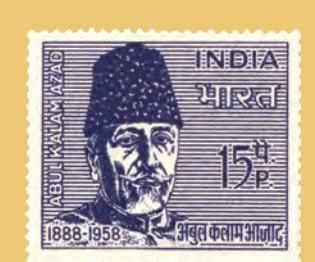

**Maulana Abul Kalam Azad (1888-1958):**  original name — Abul Kalam Mohiyuddin Ahmed; scholar of Islam; freedom fighter and Congress leader; proponent of Hindu-Muslim unity; opposed to Partition; member of Constituent Assembly; Education Minister in the first cabinet of free India.

appeared very bold and risky. An Indian editor called it "the biggest gamble in history". Organiser, a magazine, wrote that Jawaharlal Nehru "would live to confess the failure of universal adult franchise in India". A British member of the Indian Civil Service claimed that "a future and more enlightened age will view with astonishment the absurd farce of recording the votes of millions of illiterate people".

The elections had to be postponed twice and finally held from October 1951 to February 1952. But this election is referred to as the 1952 election since most parts of the country voted in January 1952. It took six months for the campaigning, polling and counting to be completed. Elections were competitive – there were on an average more than four candidates for each seat. The level of participation was encouraging — more than half the eligible voters turned out to vote on the day of elections. When the results were declared these were accepted as fair even by the losers. The Indian experiment had proved the critics wrong. The Times of India held that the polls have "confounded all those sceptics who thought the introduction of adult franchise too risky an experiment in this country". The Hindustan Times claimed that "there is universal agreement that the Indian people have conducted themselves admirably in the largest experiment in democratic elections in the history of the world". Observers outside India were equally impressed. India's general election of 1952 became a landmark in the history of democracy all over the world. It was no longer possible to argue that democratic elections could not be held in conditions of poverty or lack of education. It proved that democracy could be practiced anywhere in the world.

## *Congress dominance in the first three general elections*

The results of the first general election did not surprise anyone. The Indian National Congress was expected to win this election. The Congress party, as it was popularly known, had inherited the legacy of the national movement. It was the only party then to have an organisation spread all over the country. And finally, in Jawaharlal Nehru, the party had the most popular and charismatic leader in Indian politics. He led the Congress campaign and toured through the country. When the final results were declared, the extent of the victory of the Congress did surprise many. The party won 364 of the 489 seats in the first Lok Sabha and finished way ahead of any other challenger. The Communist Party of India that came next in terms of seats won only 16 seats. The state elections were held with the

chap 2_PF.indd 30 9/6/2022 3:57:56 PM

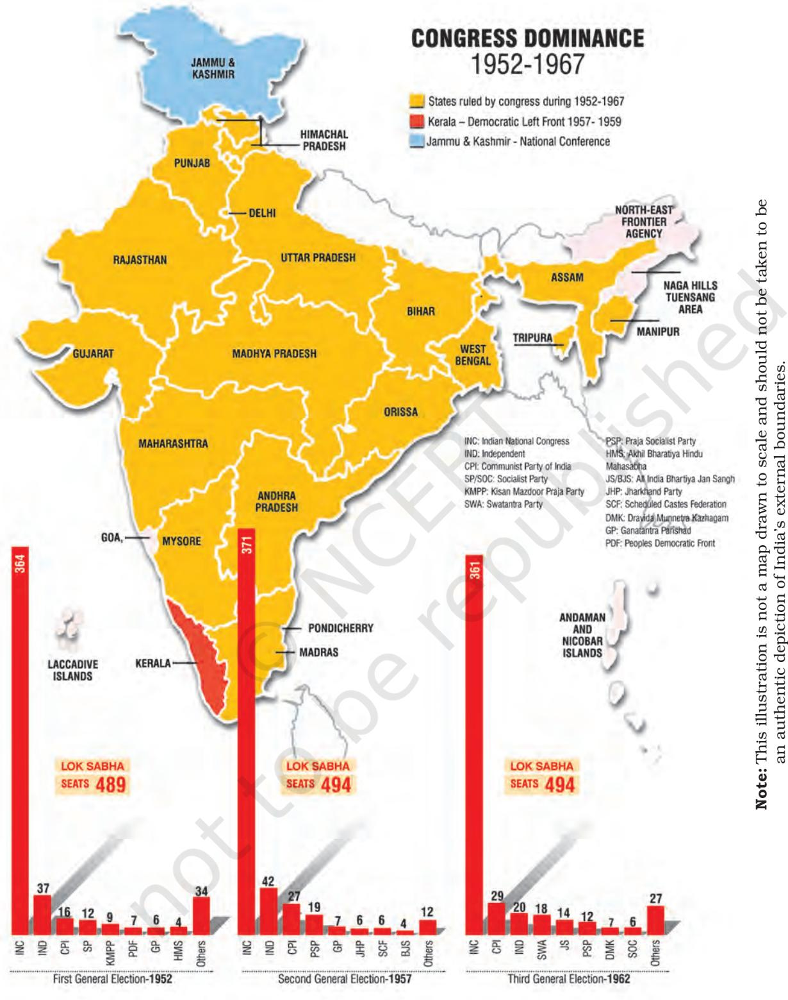

Can you identify the places where the Congress had a strong presence? In which States, did the other parties perform reasonably well?

chap 2_PF.indd 31 9/6/2022 3:57:57 PM

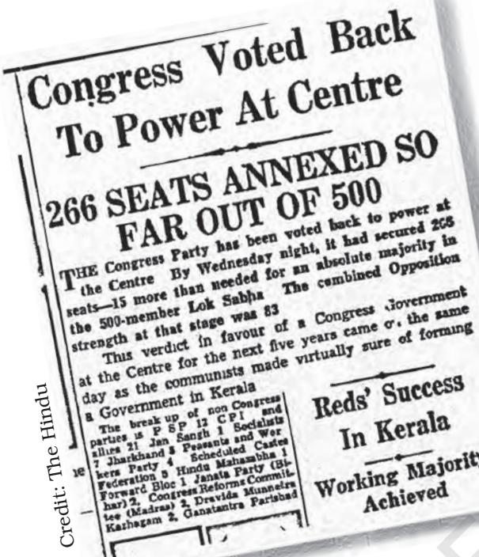

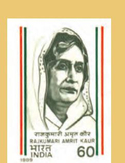

**Rajkumari Amrit Kaur (1889-1964):** A Gandhian and Freedom fighter; belonged to the royal family of Kapurthala; inherited Christian religion from her mother; member of Constituent Assembly; Minister for Health in independent India's first ministry; continued as Health Minister till 1957.

Lok Sabha elections. The Congress scored big victory in those elections as well. It won a majority of seats in all the states except Travancore-Cochin (part of today's Kerala), Madras and Orissa. Finally even in these states the Congress formed the government. So the party ruled all over the country at the national and the state level. As expected, Jawaharlal Nehru became the Prime Minister after the first general election.

A look at the electoral map on the previous page would give you a sense of the dominance of the Congress during the period 1952-1962. In the second and the third general elections, held in 1957 and 1962 respectively, the Congress maintained the same position in the Lok Sabha by winning three-fourth of the seats. None of the opposition parties could win even one-tenth of the number of seats won by the Congress. In the state

assembly elections, the Congress did not get majority in a few cases. The most significant

of these cases was in Kerala in 1957 when a coalition led by the CPI formed the government. Apart from exceptions like this, the Congress controlled the national and all the state governments.

The extent of the victory of the Congress was artificially boosted by our electoral system. The Congress won three out of every four seats but it did not get even half of the votes. In 1952, for example, the Congress obtained 45 per cent of the total votes. But it managed to win 74 per cent of the seats. The Socialist Party, the second largest party in terms of votes, secured more than 10 per cent of the votes all over the country. But it could not even win three per cent of the seats. How did this happen? For this, you need to recall the discussion about the first-pastthe-post method in your textbook, *Indian Constitution at Work* last year.

 In this system of election, that has been adopted in our country, the party that gets more votes than others tends to get much more than its proportional share. That is exactly what worked in favour of the Congress. If we add up the votes of all the non-Congress candidates it was more than the votes of the Congress. But the non-Congress votes were divided between different rival parties and candidates. So the Congress was still way ahead of the opposition and managed to win.

chap 2_PF.indd 32 9/6/2022 3:57:57 PM

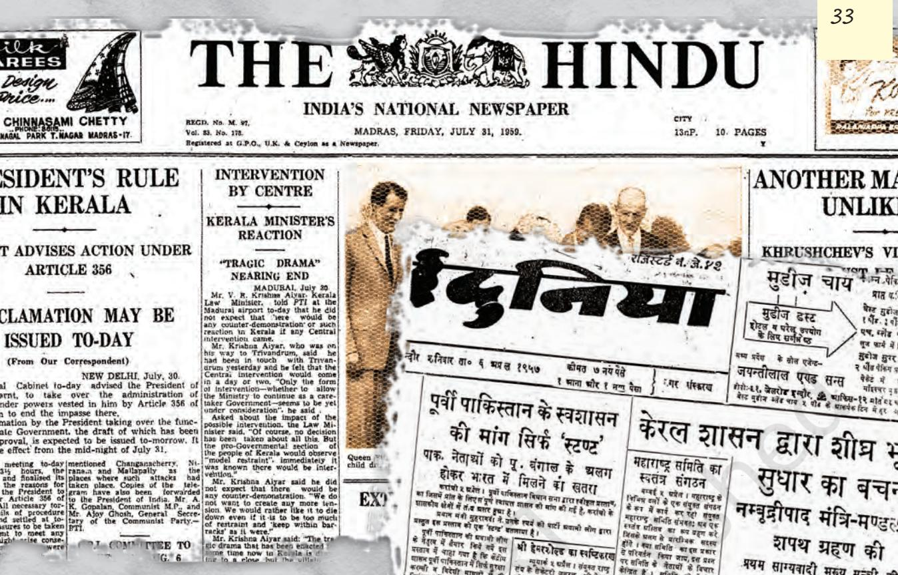

### *Communist victory in Kerala*

As early as in 1957, the Congress party had the bitter taste of defeat in Kerala. In the assembly elections held in March 1957, the Communist Party won the largest number of seats in the Kerala legislature. The party won 60 of the 126 seats and had the support of five independents. The governor invited E. M. S. Namboodiripad, the leader of the Communist legislature party, to form the ministry. For the first time in the world, a Communist party government had come to power through democratic elections.

On losing power in the State, the Congress party began a 'liberation struggle' against the elected government. The CPI had come to power on the promise of carrying out radical and progressive policy measures. The Communists claimed that the agitation was led by vested interests and religious organisations.

In 1959 the Congress government at the Centre dismissed the Communist government in Kerala under Article 356 of the Constitution. This decision proved very controversial and was widely cited as one of the prominent instances of the misuse of constitutional emergency powers.

E.M.S. Namboodiripad, leading a procession of Communist Party workers, after his ministry was dismissed from office in Trivandrum in August 1959.

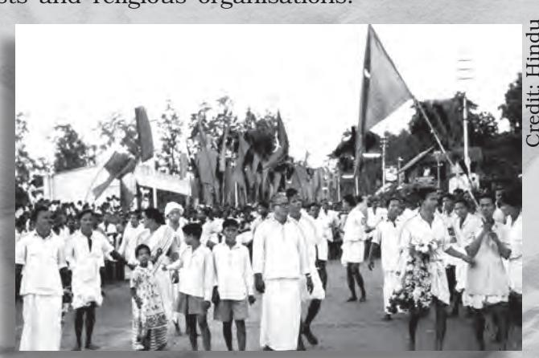

chap 2_PF.indd 33 18-03-2024 12:11:14

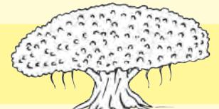

# *Socialist Party (SP)*

The origins of the Socialist Party can be traced back to the mass movement stage of the Indian National Congress in the pre-independence era. The Congress Socialist party (CSP) was formed within the Congress in 1934 by a group of young leaders who wanted a more radical and egalitarian Congress. In 1948, the Congress amended its constitution to prevent its members from having a dual party membership. This forced the Socialists to form a separate Socialist Party in 1948. The Party's electoral performance caused much disappointment to its supporters. Although the Party had presence in most of the states of India, it could achieve electoral success only in a few pockets.

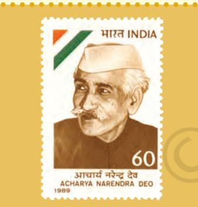

**Acharya Narendra Dev (1889-1956):**  Freedom fighter and founding President of the Congress Socialist Party; jailed several times during the freedom movement; active in peasants' movement; a scholar of Buddhism; after independence led the Socialist Party and later the Praja Socialist Party.

The socialists believed in the ideology of democratic socialism which distinguished them both from the Congress as well as from the Communists. They criticised the Congress for favouring capitalists and landlords and for ignoring the workers and the peasants. But the socialists faced a dilemma

when in 1955 the Congress declared its goal to be the socialist pattern of society. Thus it became difficult for the socialists to present themselves as an effective alternative to the Congress. Some of them, led by Rammanohar Lohia, increased their distance from and criticism of the Congress party. Some others like Asoka Mehta advocated a limited cooperation with the Congress.

The Socialist Party went through many splits and reunions leading to the formation of many socialist parties. These included the Kisan Mazdoor Praja Party, the Praja Socialist Party and Samyukta Socialist Party. Jayaprakash Narayan, Achyut Patwardhan, Asoka Mehta, Acharya Narendra Dev, Rammanohar Lohia and S.M. Joshi were among the leaders of the socialist parties. Many parties in contemporary India, like the Samajwadi Party, the Rashtriya Janata Dal, Janata Dal (United) and the Janata Dal (Secular) trace their origins to the Socialist Party.

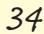

chap 2_PF.indd 34 21-03-2024 15:32:55

### *Nature of Congress dominance*

India is not the only country to have experienced the dominance of one party. If we look around the world, we find many other examples

of one-party dominance. But there is a crucial difference between these and the Indian experience. In the rest of the cases the dominance of one party was ensured by compromising democracy. In some countries like China, Cuba and Syria the constitution permits only a single party to rule the country. Some others like Myanmar, Belarus, Egypt, and Eritrea are effectively one-party states due to legal and military measures. Until a few years ago, Mexico, South Korea and Taiwan were also effectively one-party dominant states. What distinguished the dominance of the Congress party in India from all these cases was it happened under democratic conditions. Many parties contested elections in conditions of free and fair elections and yet the Congress managed to win election after election. This was similar to the dominance the African National Congress has enjoyed in South Africa after the end of apartheid.

The roots of this extraordinary success of the Congress party go back to the legacy of the freedom struggle. Congress was seen as inheritor of the national movement. Many leaders who were in the forefront of that struggle were now contesting elections as Congress candidates. The Congress was already a very well-organised party and by the time the other parties could even think of a strategy, the Congress

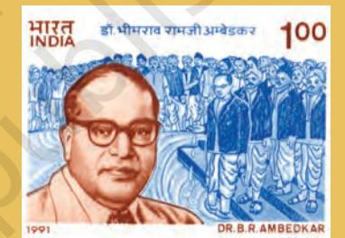

**Babasaheb Bhimrao Ramji Ambedkar (1891-1956):** Leader of the anti-caste movement and the struggle for justice to the Dalits; scholar and intellectual; founder of Independent Labour Party; later founded the Scheduled Castes Federation; planned the formation of the Republican Party of India; Member of Viceroy's Executive Council during the Second World War; Chairman, Drafting Committee of the Constituent Assembly; Minister in Nehru's first cabinet after independence; resigned in 1951 due to differences over the Hindu Code Bill; adopted Buddhism in 1956, with thousands of followers.

chap 2_PF.indd 35 21-03-2024 12:31:52

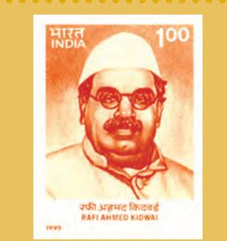

**Rafi Ahmed Kidwai (1894-1954):**  Congress leader from U.P.; Minister in U.P. in 1937 and again in 1946; Minister for Communications in the first ministry of free India; Food and Agriculture Minister, 1952-54.

had already started its campaign. In fact, many parties were formed only around independence or after that. Thus, the Congress had the 'first off the blocks' advantage. By the time of independence the party had not only spread across the length and breadth of the country as we had seen in the maps but also had an organisational network down to the local level. Most importantly, as the Congress was till recently a national movement, its nature was all-inclusive. All these factors contributed to the dominance of the Congress party.

#### *Congress as social and ideological coalition*

You have already studied the history of how Congress evolved from its origins in 1885 as a pressure group for the newly educated, professional and commercial classes to a mass movement in the twentieth century. This laid the basis for its eventual transformation into a mass political party and its subsequent domination of the political system. Thus the Congress began as a party dominated by the English speaking, upper caste, upper middle-class and urban elite. But with every civil disobedience movement it launched, its social base widened. It brought together diverse groups, whose interests were often contradictory. Peasants and industrialists, urban dwellers and villagers,

workers and owners, middle, lower and upper classes and castes, all found space in the Congress. Gradually, its leadership also expanded beyond the upper caste and upper class professionals to agriculture based leaders with a rural orientation. By the time of independence, the Congress was transformed into a rainbow-like social coalition

broadly representing India's diversity in terms of classes and castes, religions and languages and various interests.

Many of these groups merged their identity within the Congress. Very often they did not and continued to exist within the Congress as groups and individuals holding different beliefs. In this sense the Congress was an ideological coalition as well. It accommodated the revolutionary and pacifist, conservative and radical, extremist and moderate and the right, left and all shades of the centre. The Congress was a 'platform' for numerous groups, interests and even political parties to take part in the national movement. In pre-independence days, many organisations and parties with their own constitution and organisational structure were allowed to exist within the Congress. Earlier we had coalition in a party, now we have coalition of parties. Does it mean that we have had a coalition government since 1952?

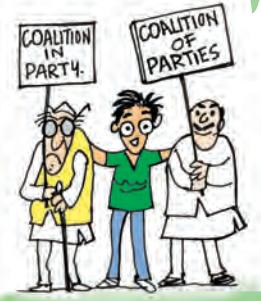

chap 2_PF.indd 36 9/6/2022 3:58:06 PM

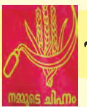

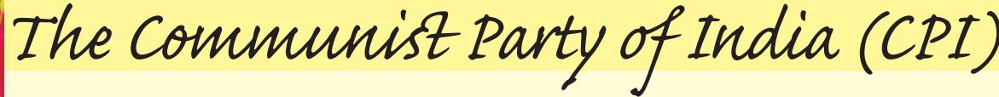

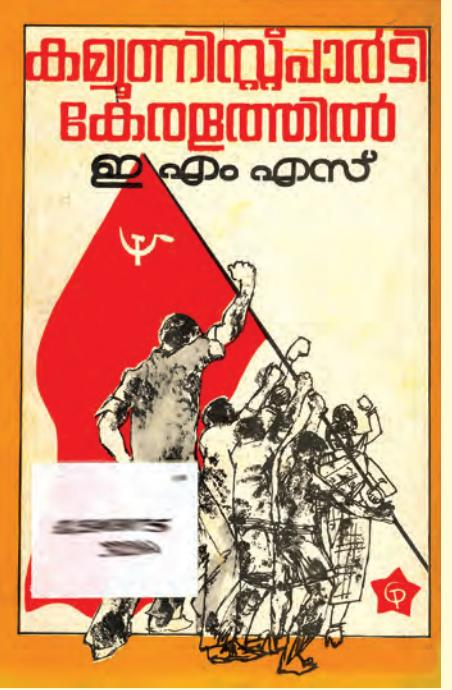

In the early 1920s communist groups emerged in different parts of India taking inspiration from the Bolshevik revolution in Russia and advocating socialism as the solution to problems affecting the country. From 1935, the Communists worked mainly from within the fold of the Indian National Congress. A parting of ways took place in December 1941, when the Communists decided to support the British in their war against Nazi Germany. Unlike other non-Congress parties the CPI had a well-oiled party machinery and dedicated cadre at the time of independence. However, independence raised different voices in the party. The basic question that troubled

the party was the nature of Indian independence. Was India really free or was freedom a sham?

Soon after independence,

the party thought that the transfer of power in 1947 was not true independence and encouraged violent uprisings in Telangana. The Communists failed to generate popular support for their position and were crushed by the armed forces. This forced them to rethink their position. In 1951 the Communist Party abandoned the path of violent revolution and decided to participate in the approaching general elections. In the first general election, CPI won 16 seats and emerged as the largest opposition party. The party's support was more concentrated in Andhra Pradesh, West Bengal, Bihar and Kerala.

A. K. Gopalan, S.A. Dange, E.M.S. Namboodiripad, P.C. Joshi, Ajay Ghosh and P. Sundarraya were among the notable leaders of the CPI. The Party went through a major split in 1964 following the ideological rift between Soviet Union and China. The pro-Soviet faction remained as the CPI, while the opponents formed the CPI(M). Both these parties continue to exist to this day.

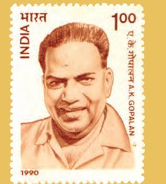

**A.K. Gopalan (1904-1977):** Communist leader from Kerala, worked as a Congress worker initially; joined the Communist Party in 1939; after the split in the Communist Party in 1964, joined the CPI (M) and worked for strengthening the party; respected as a parliamentarian; Member of Parliament from 1952.

chap 2_PF.indd 37 20-03-2024 15:12:36

Let's watch a Film

#### **Simhasan**

This Marathi film, based on Arun Sadhu's two novels 'Simhasan' and 'Mumbai Dinank', depicts the tussle for the post of Chief Minister in Maharashtra. The story is told through journalist Digu Tipnis as the silent 'Sutradhar'. It tries to capture the intense power struggle within the ruling party and the secondary role of the Opposition.

Finance Minister, Vishwasrao Dabhade is making all-out efforts to unseat the incumbent Chief Minister. Both contenders are trying to woo trade union leader D'Casta to obtain his support. In this factional fight, other politicians too seek to obtain maximum advantage while bargaining with both sides. Smuggling in Mumbai and the grim social reality in rural Maharashtra form the sub-plots in this film.

Year: 1981 Director: Jabbar Patel Screenplay: Vijay Tendulkar Cast: Nilu Phule, Arun Sarnaik, Dr.Shreeram Lagoo, Satish Dubashi, Datta Bhat, Madhukar Toradmal, Madhav Watve, Mohan Agashe

Some of these, like the Congress Socialist Party, later separated from the Congress and became opposition parties. Despite differences regarding the methods, specific programmes and policies the party managed to contain if not resolve differences and build a consensus.

#### *Tolerance and management of factions*

This coalition-like character of the Congress gave it an unusual strength. Firstly, a coalition accommodates all those who join it. Therefore, it has to avoid any extreme position and strike a balance on almost all issues. Compromise and inclusiveness are the hallmarks of a coalition. This strategy put the opposition in a difficulty. Anything that the opposition wanted to say, would also find a place in the programme and ideology of the Congress. Secondly, in a party that has the nature of a coalition, there is a greater tolerance of internal differences and ambitions of various groups and leaders are accommodated. The Congress did both these things during the freedom struggle and continued doing this even after Independence. That is why, even if a group was not happy with the position of the party or with its share of power, it would remain inside the party and fight the other groups rather than leaving the party and becoming an 'opposition'.

These groups inside the party are called factions. The coalitional nature of the Congress party tolerated and in fact encouraged various factions. Some of these factions were based on ideological considerations but very often these factions were rooted in personal ambitions and rivalries. Instead of being a weakness, internal factionalism became a strength of

chap 2_PF.indd 38 9/6/2022 3:58:08 PM

*Era of One-party Dominance 39 Era of One-party Dominance 39* 

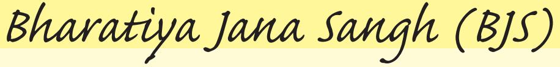

The Bharatiya Jana Sangh was formed in 1951 with Shyama Prasad Mukherjee as its founder-President. Its lineage however can be traced back to the Rashtriya Swayamsevak Sangh (RSS) and the Hindu Mahasabha before independence.

The Jana Sangh was different from other parties in terms of ideology and programmes. It emphasised the idea of one country, one culture and one nation and believed that the country could

become modern, progressive and strong on the basis of Indian culture and traditions. The party called for a reunion of India and Pakistan in Akhand Bharat. The party was in forefront of the agitation to replace English with Hindi as the official language of India

and was also opposed to the granting of concessions to religious and cultural minorities. The party was a consistent advocate of India developing nuclear weapons especially after China carried out its atomic tests in 1964.

In the 1950s Jana Sangh remained on the margins of the electoral politics and was able to secure only 3 Lok Sabha seats in 1952 elections and 4 seats in 1957 general elections to Lok Sabha. In the early years its support came mainly from the urban areas in the Hindi speaking states like Rajasthan, Madhya Pradesh, Delhi and Uttar Pradesh. The party's leaders included Shyama Prasad Mukherjee, Deen Dayal Upadhyaya and Balraj Madhok. The Bharatiya Janata Party traces its roots to the Bharatiya Jana Sangh.

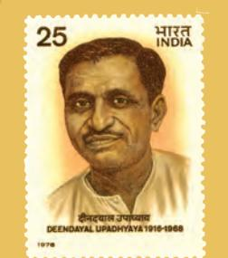

**Deen Dayal Upadhyaya (1916-1968):** fulltime RSS worker since 1942; founder member of the Bharatiya Jana Sangh; General Secretary and later President of Bharatiya Jana Sangh; initiated the concept of integral humanism.

chap 2_PF.indd 39 21-03-2024 12:30:37

the Congress. Since there was room within the party for various factions to fight with each other, it meant that leaders representing different interests and ideologies remained within the Congress rather than go out and form a new party.

Most of the state units of the Congress were made up of numerous factions. The factions took different ideological positions making the Congress appear as a grand centrist party. The other parties primarily attempted to influence these factions and thereby indirectly influenced policy and decision making from the "margins". They were far removed from the actual exercise of authority. They were not alternatives to the ruling party; instead they constantly pressurised and criticised, censured and influenced the Congress. The system of factions functioned as balancing mechanism within the ruling party. Political competition therefore took place within the Congress. In that sense, in the first decade of electoral competition the Congress acted both as the ruling party as well as the opposition. That is why this period of Indian politics has been described as the 'Congress system'.

### *Emergence of opposition parties*

"Tug of War" (29 August 1954) is a cartoonist's impression of the relative strength of the opposition and the government. Sitting on the tree are Nehru and his cabinet colleagues. Trying to topple the tree are opposition leaders A. K. Gopalan, Acharya Kripalani, N.C. Chatterjee, Srikantan Nair and Sardar Hukum Singh.

As we have noted above, it is not that India did not have opposition parties during this period. While discussing the results of the elections, we have already come across the names of many parties other than the Congress. Even then India had a larger number of diverse and vibrant opposition parties than many other multi-party democracies. Some of these had come into being even before the first general election of 1952. Some of these parties played an important part in the politics of the country in the 'sixties and 'seventies. The roots of almost all the non-Congress parties of today can be traced to one or the other of the opposition parties of the 1950s.

All these opposition parties succeeded in gaining only a token representation in the Lok Sabha and state assemblies during this period. Yet their presence played a crucial role in maintaining the democratic character of the system. These parties offered a sustained and often principled criticism of the policies and practices of the Congress party. This kept the ruling party under check and often changed the balance of power within the Congress. By keeping democratic political alternative alive,

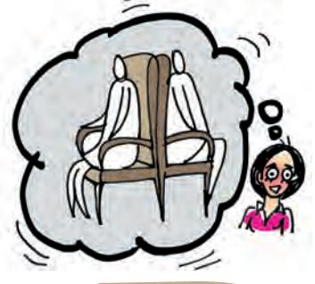

I thought factions were a disease that needed to be cured. You make it sound as if factions are

normal and good.

chap 2_PF.indd 40 9/6/2022 3:58:10 PM

these parties prevented the resentment with the system from turning anti-democratic. These parties also groomed the leaders who were to play a crucial role in the shaping of our country.

In the early years there was a lot of mutual respect between the leaders of the Congress and those of the opposition. The interim government that ruled the country after the declaration of Independence and the first general election included opposition leaders like Dr. Ambedkar and Shyama Prasad Mukherjee in the cabinet. Jawaharlal Nehru often referred to his fondness for the Socialist Party and invited socialist leaders like Jayaprakash Narayan to join his government. This kind of personal relationship with and respect for political adversaries declined after the party competition grew more intense.

Thus this first phase of democratic politics in our country was quite unique. The inclusive character of the national movement led by the Congress enabled it to attract different sections, groups and interests making it a broad based social and ideological

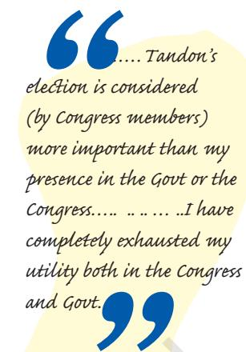

*Jawaharlal Nehru* in a letter to Rajaji, after the election of Tandon as Congress president against his wishes.

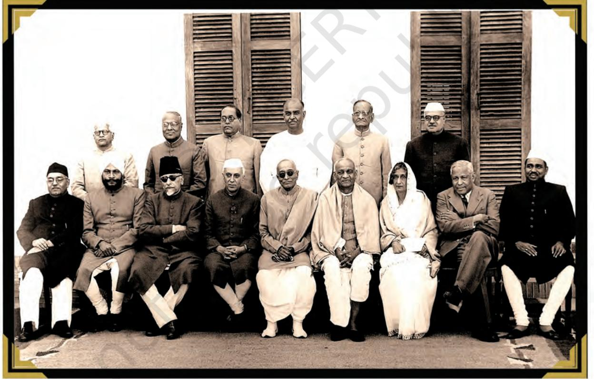

Nehru's Cabinet after the swearing-in of Chakravarti Rajagopalachari as Governor-General in 1948. Sitting from left to right: Rafi Ahmad Kidwai, Baldev Singh, Maulana Azad, Prime Minister Nehru, Chakravarti Rajagopalachari, Sardar Vallabhbhai Patel, Rajkumari Amrit Kaur, Mr. John Matthai and Jagjivan Ram. Standing from left to right: Mr. Gadgil, Mr. Neogi, Dr. Ambedkar, Shyama Prasad Mukherji, Mr. Gopalaswamy Iyengar and Mr. Jayramdas Daulatram.

chap 2_PF.indd 41 9/6/2022 3:58:10 PM

**Shyama Prasad Mukherjee (1901-1953):** Leader of Hindu Mahasabha; founder of Bharatiya Jana Sangh; Minister in Nehru's first cabinet after independence; resigned in 1950 due to differences over relations with Pakistan; Member of Constituent

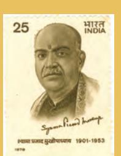

Assembly and later, the first Lok Sabha; was opposed to India's policy of autonomy to Jammu & Kashmir; arrested during Jana Sangh's agitation against Kashmir policy; died during detention.

coalition. The key role of the Congress in the freedom struggle thus gave it a head start over others. As the ability of the Congress to accommodate all interests and all aspirants for political power steadily declined, other political parties started gaining greater significance. Thus, Congress dominance constitutes only one phase in the politics of the country. We shall come to the other phases in later parts of this textbook.

- 1. Choose the correct option to fill in the blanks.
	- (a) The First General Elections in 1952 involved simultaneous elections to the Lok Sabha and ………………….*(The President of India/ State Assemblies/ Rajya Sabha/ The Prime Minister)*
	- (b) The party that won the second largest number of Lok Sabha seats in the first elections was the………………….*(Praja Socialist Party/ Bharatiya Jana Sangh/ Communist Party of India/Bharatiya Janata Party)*
	- (c) One of the guiding principles of the ideology of the Swatantra Party was………………….*(Working class interests/ protection of Princely States / economy free from State control / Autonomy of States within the Union)*
- 2. Match the following leaders listed in List A with the parties in List B.

| S |  |  | Bharatiya Jana Sangh/ Communist Party of India/Bharatiya Janata Party) |  |  |  |
| --- | --- | --- | --- | --- | --- | --- |
| E |  | (c) | One of the guiding principles of the ideology of the Swatantra |  |  |  |
| S |  |  | Party was………………….(Working class interests/ protection of Princely States / economy free from State control / Autonomy of |  |  |  |
| I |  |  | States within the Union) |  |  |  |
| C | 2. | Match | the following leaders listed in List A with parties in List B. |  | the |  |
| R |  | (a) | List A List B S. A. Dange i. Bharatiya Jana Sangh |  |  |  |
| E |  | (b) (c) | Shyama Prasad Mukherjee Swatantra Party Minoo Masani iii. Praja Socialist Party |  |  | ii. |
| X |  | (d) | Asoka Mehta iv. Communist Party of | India |  |  |
| E | 3. | Four | statements regarding one- party dominance are given below. Mark each of them as true or false. |  |  |  |
|  |  | (a) | One-party dominance is rooted in the absence of strong alternative |  |  |  |
|  |  |  | political parties. |  |  |  |
|  |  | (b) | One-party dominance occurs because of weak public opinion. |  |  |  |
|  |  | (c) | One-party dominance is linked to the nation's colonial past. |  |  |  |
|  |  | (d) | One-party dominance reflects the absence of democratic ideals in |  |  |  |
|  |  |  | a country. |  |  |  |

chap 2_PF.indd 42 9/6/2022 3:58:10 PM

- 4. Take a political map of India (with State outlines) and mark:
	- (a) two states where Congress was not in power at some point during 1952-67.
	- (b) two states where the Congress remained in power through this period.
- 5. Read the following passage and answer the questions below:

 *"Patel, the organisational man of the Congress, wanted to purge the Congress of other political groups and sought to make of it a cohesive and disciplined political party. He …. sought to take the Congress away from its all-embracing character and turn it into a close-knit party of disciplined cadres. Being a 'realist' he looked more for discipline than for comprehension. While Gandhi took too romantic a view of "carrying on the movement," Patel's idea of transforming the Congress into strictly political party with a single ideology and tight discipline showed an equal lack of understanding of the eclectic role that the Congress, as a government, was to be called upon to perform in the decades to follow."* — Rajni Kothari

- (a) Why does the author think that Congress should not have been a cohesive and disciplined party?
- (b) Give some examples of the eclectic role of the Congress party in the early years.
- (c) Why does the author say that Gandhi's view about Congress' future was romantic?

#### **LET US DO IT TOGETHER**

Make a chart of elections and governments in your State since 1952. The chart could have the following columns: year of election, name of the winning party, name of ruling party or parties, name of the Chief Minister(s).

chap 2_PF.indd 43 9/6/2022 3:58:10 PM

