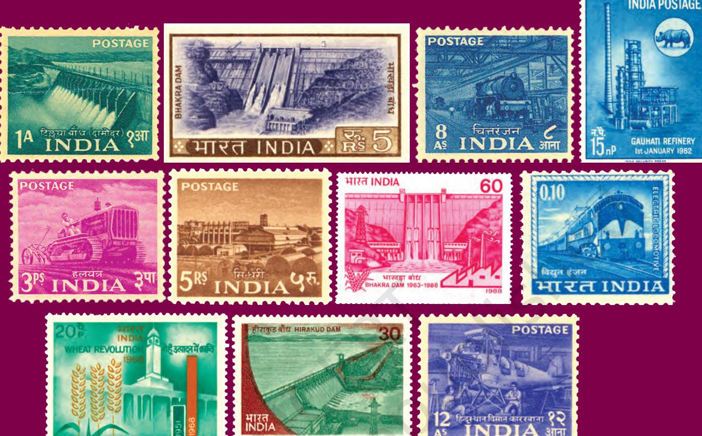
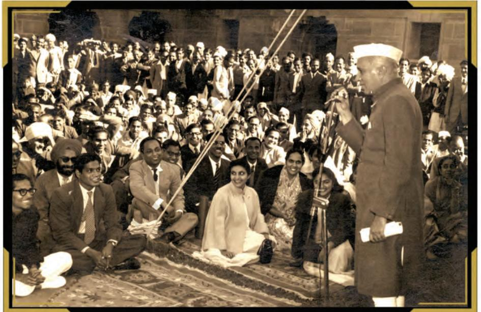
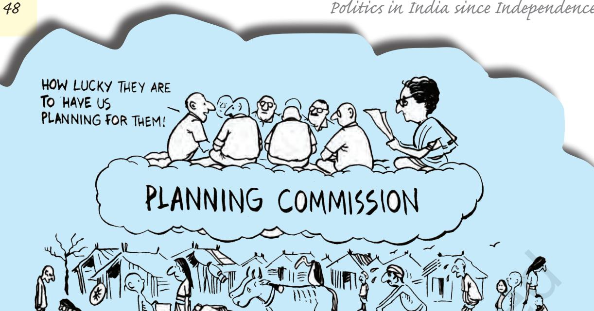
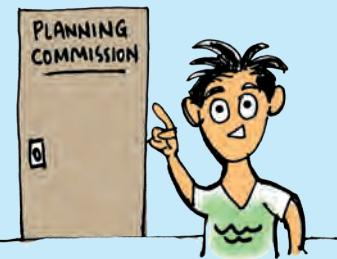
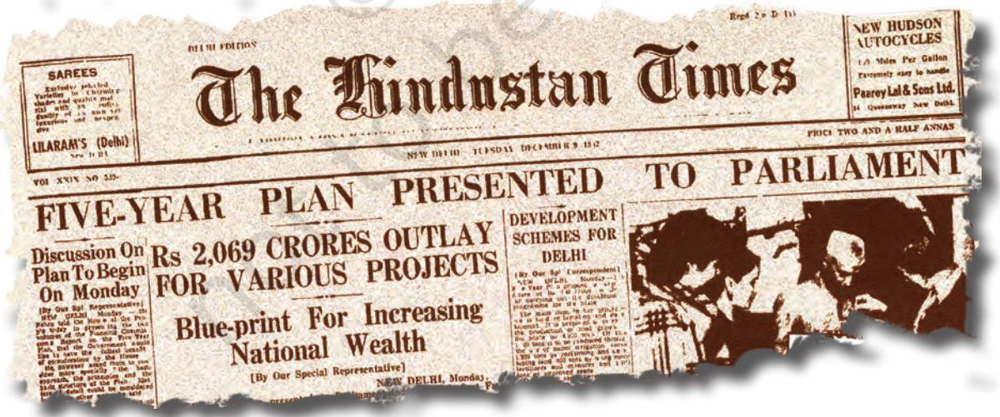
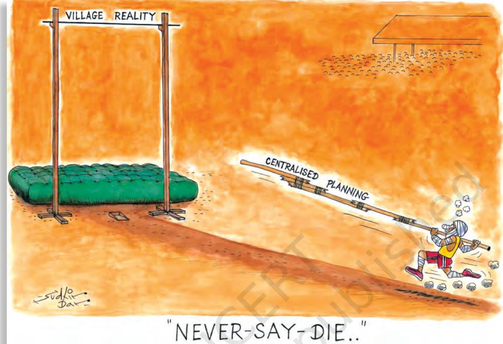
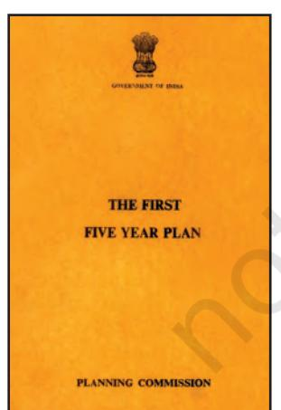
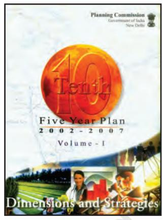
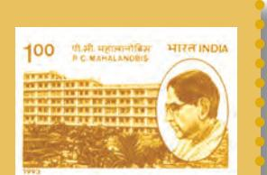

Stamps like these, issued mostly between 1955 and 1968, depicted a vision of planned development. Left to right, top to bottom: Damodar Valley, Bhakra Dam, Chittaranjan Locomotives, Gauhati Refinery, Tractor, Sindri Fertilisers, Bhakra Dam, Electric Train, Wheat Revolution, Hirakud Dam, Hindustan Aircraft Factory

# *In this chapter…*

In the last two chapters we have studied how the leaders of independent India responded to the challenges of nation-building and establishing democracy. Let us now turn to the third challenge, that of economic development to ensure well-being of all. As in the case of the first two challenges, our leaders chose a path that was different and difficult. In this case their success was much more limited, for this challenge was tougher and more enduring.

In this chapter, we study the story of political choices involved in some of the key questions of economic development.

- • What were the key choices and debates about development?
- • Which strategy was adopted by our leaders in the first two decades? And why?
- • What were the main achievements and limitations of this strategy?
- • Why was this development strategy abandoned in later years?

chap 3_PF.indd 44 8/5/2022 12:07:36 PM

# pOLITICS OF PLANNED DEVELOPMENT

As the global demand for steel increases, Orissa, which has one of the largest reserves of untapped iron ore in the country, is being seen as an important investment destination. The State government hopes to cash in on this unprecedented demand for iron ore and has signed Memorandum of Understanding (MoU) with both international and domestic steel makers. The government believes that this would bring in necessary capital investment and proivde a lot of employment opportunities. The iron ore resources lie in some of the most underdeveloped and predominantly tribal districts of the state. The tribal population fears that the setting up of industries would mean displacement from their home and livelihood. The

environmentalists fear that mining and industry would pollute the environment. The central government feels that if the industry is not allowed it would set a bad example and discourage investments in the country.

Can you identify the various interests involved in this case? What are their key points of conflict? Do you think there are any common points on which everyone can agree? Can this issue be resolved in a way which satisfies all the various interests? As you ask these questions, you would find yourself facing yet bigger questions. What kind of development does Orissa need? Indeed, whose need can be called Orissa's need?

#### *Political contestation*

These questions cannot be answered by an expert. Decisions of this kind involve weighing the interests of one social group against another, present generation against future generations. In a democracy such major decisions should be taken or at least approved by the people themselves. It is important to take advice from experts on mining, from environmentalists and from economists. Yet the final decision must be a political decision, taken by people's representatives who are in touch with the feelings of the people.

After Independence our country had to make a series of major decisions like this. Each of these decisions could not be made independent of other such decisions. All these decisions were bound together by a shared vision or model of economic development. Almost everyone agreed

## **Orissa villagers protest against POSCO plant**

Staff Reporter

BHUBANESWAR: People facing displacement by the proposed POSCO-India steel plant in Jagatsinghpur district staged a demonstration outside the Korean company's office here on Thursday. They were demanding cancellation of the memorandum of understanding signed between the company and the Orissa government one year ago.

More than 100 men and women from the gram panchayats of Dhinkia, Nuagaon and Gadakujanga tried to enter the office premises but the police prevented them. Raising slogans, the protesters said the company should not be allowed to set up its plant at the cost of their lives and livelihood. The demonstration was organised by the Rashtriya Yuva Sangathan and the Nabanirman Samiti.

*The Hindu, 23 June 2006*

chap 3_PF.indd 45 8/5/2022 12:07:39 PM

## **What is Left and what is Right?**

In the politics of most countries, you will always come across references to parties and groups with a left or right ideology or leaning. These terms characterise the position of the concerned groups or parties regarding social change and role of the state in effecting economic redistribution. Left often refers to those who are in favour of state control of the economy and prefers state regulation over free competition. The Right refers to those who believe that free competition and market economy alone ensure progress and that the government should not unnecessarily intervene in the economy.

Can you tell which of the parties in the 1960s were Rightist and which were the Left parties? Where would you place the Congress party of that time?

that the development of India should mean both economic growth and social and economic justice. It was also agreed that this matter cannot be left to businessmen, industrialists and farmers themselves, that the government should play a key role in this. There was disagreement, however, on the kind of role that the government must play in ensuring growth with justice. Was it necessary to have a centralised institution to plan for the entire country? Should the government itself run some key industries and business? How much importance was to be attached to the needs of justice if it differed from the requirements of economic growth?

Each of these questions involved contestation which has continued ever since. Each of the decision

had political consequence. Most of these issues involved political judgement and required consultations among political parties and approval of the public. That is why we need to study the process of development as a part of the history of politics in India.

### *Ideas of development*

Very often this contestation involves the very idea of development. The example of Orissa shows us that it is not enough to say that everyone wants development. For 'development' has different meanings for different sections of the people. Development would mean different things for example, to an industrialist who is planning to set up a steel plant, to an urban consumer of steel and to the Adivasi who lives in that region. Thus any discussion on development is bound to generate contradictions, conflicts and debates.

The first decade after independence witnessed a lot of debate around this question. It was common then, as it is even now, for people to refer to the 'West' as the standard for measuring development. 'Development' was about becoming more 'modern' and modern was about becoming more like the industrialised countries of the West. This is how common people as well as the experts thought. It was believed that every country would go through the process of modernisation as in the West, which involved the breakdown of traditional social structures and the rise of capitalism and liberalism. Modernisation was also associated with the ideas of growth, material progress and scientific rationality. This kind of idea of development allowed

chap 3_PF.indd 46 15-03-2024 14:48:25

everyone to talk about different countries as developed, developing or underdeveloped.

On the eve of Independence, India had before it, two models of modern development: the liberal-capitalist model as in much of Europe and the US and the socialist model as in the USSR. You have already studied these two ideologies and read about the 'cold war' between the two super powers. There were many in India then who were deeply impressed by the Soviet model of development. These included not just the leaders of the Communist Party of India, but also those of the Socialist Party and leaders like Nehru within the Congress. There were very few supporters of the American style capitalist development.

This reflected a broad consensus that had developed during the national movement. The nationalist leaders were clear that the economic concerns of the government of free India would have to be different from the narrowly defined commercial functions of the colonial government. It was clear, moreover, that the task of poverty alleviation and social and economic redistribution was being seen primarily as the responsibility of the government. There were debates among them. For some, industrialisation seemed to be the preferred path. For others, the development of agriculture and in particular alleviation of rural poverty was the priority.

## *Planning*

Despite the various differences, there was a consensus on one point: that development could not be left to private actors, that there was the need for the government to develop a design or plan for development.

Are you saying we don't have to be western in order to be modern? Is that possible?

Nehru addressing the staff of the Planning Commission

chap 3_PF.indd 47 8/5/2022 12:07:39 PM

Credit:Ninan

I wonder if the Planning Commission has actually followed these objectives in practice.

## Fast Forward Niti Aayog

The Government of India replaced the Planning Commission with a new institution named NITI Aayog (National Institution for Transforming India). This came into existence on 1 January 2015. Find out about its objectives and composition from the website, http://niti.gov.in

## **Planning Commission**

Do you recall any reference to the Planning Commission in your book *Constitution at Work* last year? Actually there was none, for the Planning Commission is not one of the many commissions and other bodies set up by the Constitution. The Planning Commission was set up in March, 1950 by a simple resolution of the Government of India. It has an advisory role and its recommendations become effective only when the Union Cabinet approved these. The resolution which set up the Commission defined the scope of its work in the following terms :

"The Constitution of India has guaranteed certain Fundamental Rights to the citizens of India and enunciated certain Directive Principles of State Policy, in particular, that the State shall strive to promote the welfare of the people by securing and protecting….a social order in which justice, social, economic and political, shall …….. …. direct its policy towards securing, among other things,

- (a) that the citizens, men and women equally, have the right to an adequate means of livelihood ;
- (b) that the ownership and control of the material resources of the community are so distributed as best to subserve the common good; and
- (c) that the operation of the economic system does not result in the concentration of wealth and means of production to the common detriment.

chap 3_PF.indd 48 8/5/2022 12:07:41 PM

## *Politics of Planned Development 49*

In fact the idea of planning as a process of rebuilding economy earned a good deal of public support in the 1940s and 1950s all over the world. The experience of Great Depression in Europe, the inter-war reconstruction of Japan and Germany, and most of all the spectacular economic growth against heavy odds in the Soviet Union in the 1930s and 1940s contributed to this consensus.

Thus the Planning Commission was not a sudden invention. In fact, it has a very interesting history. We commonly assume that private investors, such as industrialists and big business entrepreneurs, are averse to ideas of planning: they seek an open economy without any state control in the flow of capital. That was not what happened here. Rather, a section of the big industrialists got together in 1944 and drafted a joint proposal for setting up a planned economy in the country. It was called the Bombay Plan. The Bombay Plan wanted the state to take major initiatives in industrial and other economic investments. Thus, from left to right, planning for development was the most obvious choice for the country after Independence. Soon after India became independent, the Planning Commission came into being. The Prime Minister was its Chairperson. It became the most influential and central machinery for deciding what path and strategy India would adopt for its development.

## *The Early Initiatives*

As in the USSR, the Planning Commission of India opted for five year plans (FYP). The idea is very simple: the Government of India prepares a document that has a plan for all its income and expenditure for the next five years. Accordingly the budget of the central and all the State

governments is divided into two parts: 'non-plan' budget that is spent on routine items on a yearly basis and 'plan' budget that is spent on

chap 3_PF.indd 49 8/5/2022 12:07:44 PM

Credit: Sudhir Dar/UNDP and Planning Commission

First Five Year Plan document

a five year basis as per the priorities fixed by the plan. A five year plan has the advantage of permitting the government to focus on the larger picture and make long-term intervention in the economy.

The draft of the First Five Year Plan and then the actual Plan Document, released in December 1951, generated a lot of excitement in the country. People from all walks of life – academics, journalists, government and private sector employees, industrialists, farmers, politicians etc. – discussed and debated the documents extensively. The excitement with planning reached its peak with the launching of the Second Five Year Plan in 1956 and continued somewhat till the Third Five Year Plan in 1961. The Fourth Plan was due to start in 1966. By this time, the novelty of planning had declined considerably, and moreover, India was facing acute economic crisis. The government decided to take a 'plan holiday'. Though many criticisms emerged both about the process and the priorities of these plans, the foundation of India's economic development was firmly in place by then.

chap 3_PF.indd 50 8/5/2022 12:07:45 PM

## *The First Five Year Plan*

The First Five Year Plan (1951–1956) sought to get the country's economy out of the cycle of poverty. K.N. Raj, a young economist involved in drafting the plan, argued that India should 'hasten slowly' for the first two decades as a fast rate of development might endanger democracy. The First Five Year Plan addressed, mainly, the agrarian sector including investment in dams and irrigation. Agricultural sector was hit hardest by Partition and needed urgent attention. Huge allocations were made for largescale projects like the Bhakhra Nangal Dam. The Plan identified the pattern of land distribution in the country as the principal obstacle in the way of agricultural growth. It focused on land reforms as the key to the country's development.

One of the basic aims of the planners was to raise the level of national income, which could be possible only if the people saved more money than they spent. As the basic level of spending was very low in the 1950s, it could not be reduced any more. So the planners sought to push savings up. That too was difficult as the total capital stock in the country was rather low compared to the total number of employable people. Nevertheless, people's savings did rise in the first phase of the planned process until the end of the Third Five Year Plan. But, the rise was not as spectacular as was expected at the beginning of the First Plan. Later, from the early 1960s till the early 1970s, the proportion of savings in the country actually dropped consistently.

## *Rapid Industrialisation*

The Second FYP stressed on heavy industries. It was drafted by a team of economists and planners under the leadership of P. C. Mahalanobis. If the first plan had preached patience, the second wanted to bring about quick structural transformation by making changes simultaneously in all possible directions. Before this plan was finalised, the Congress party at its session held at Avadi near the then Madras city, passed an important resolution. It declared that 'socialist pattern of society' was its goal. This was reflected in the Second Plan. The government imposed substantial tariffs on imports in order to protect domestic industries. Such protected environment helped both public and private sector industries to grow. As savings and investment were growing in this period, a bulk of these industries like electricity, railways, steel, machineries and communication could be developed in the public sector. Indeed, such a push for industrialisation marked a turning point in India's development.

Tenth Five Year Plan document

**P.C. Mahalanobis (1893-1972):** Scientist and statistician of international repute; founder of Indian Statistical Institute (1931); architect of the Second Plan; supporter of rapid industrialisation and active role of the public sector.

chap 3_PF.indd 51 8/5/2022 12:07:45 PM

It, however, had its problems as well. India was technologically backward, so it had to spend precious foreign exchange to buy technology from the global market. That apart, as industry attracted more investment than agriculture, the possibility of food shortage loomed large. The Indian planners found balancing industry and agriculture really difficult. The Third Plan was not significantly different from the Second. Critics pointed out that the plan strategies from this time around displayed an unmistakable "urban bias". Others thought that industry was wrongly given priority over agriculture. There were also those who wanted focus on agriculture-related industries rather than heavy ones.

|  | 1. | Which of these statements about the Bombay Plan is incorrect? (a) It was a blueprint for India's economic future. |
| --- | --- | --- |
|  |  | (b) It supported state-ownership of industry. (c) It was made by some leading industrialists. |
|  |  | (d) It supported strongly the idea of planning.n |
|  | 2. | Which of the following ideas did not form part of the early phase of |
|  |  | India's development policy? |
|  |  | (a) Planning (c) Cooperative Farming |
| S |  | (b) Liberalisation (d) Self sufficiency |
| E | 3. | The idea of planning in India was drawn from |
| S |  | (a) the Bombay plan (c) Gandhian vision of |
| I |  | society (b) experiences of the Soviet |
| C |  | (d) Demand by peasant bloc countries organisations |
|  |  | i. b and d only iii. a and b only |
| R |  | ii. d and c only iv. all the above |
| E | 4. | Match the following. (a) Charan Singh i. Industrialisation |
| X |  | (b) P C Mahalanobis ii. Zoning |
|  |  | (c) Bihar Famine iii. Farmers |
| E |  | (d) Verghese Kurien iv. Milk Cooperatives |
|  | 5. | What were the major differences in the approach towards development |
|  |  | at the time of Independence? Has the debate been resolved? |
|  | 6. | What was the major thrust of the First Five Year Plan? In which ways |
|  |  | did the Second Plan differ from the first one? |
|  | 7. | Read the following passage and answer the questions below: |
|  |  | "In the early years of Independence, two contradictory tendencies |
|  |  | were already well advanced inside the Congress party. On the one |

chap 3_PF.indd 52 8/5/2022 12:07:45 PM

*hand, the national party executive endorsed socialist principles of state ownership, regulation and control over key sectors of the economy in order to improve productivity and at the same time curb economic concentration. On the other hand, the national Congress government pursued liberal economic policies and incentives to private investment that was justified in terms of the sole criterion of achieving maximum increase in production. "* — Francine Frankel

- (a) What is the contradiction that the author is talking about? What would be the political implications of a contradiction like this?
- (b) If the author is correct, why is it that the Congress was pursuing this policy? Was it related to the nature of the opposition parties?
- (c) Was there also a contradiction between the central leadership of the Congress party and its Sate level leaders?

chap 3_PF.indd 53 8/5/2022 12:07:45 PM

