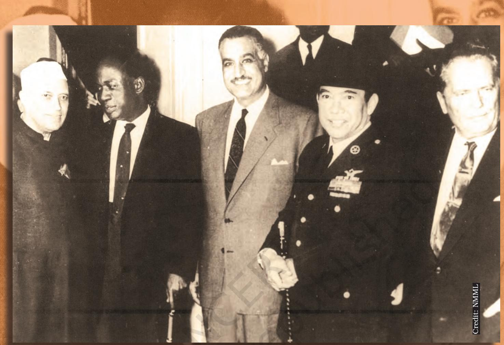

Nehru with Nkrumah from Ghana, Nasser from Egypt, Sukarno from Indonesia and Tito from Yugoslavia at a meeting of nonaligned nations, New York, October 1960. These five comprised the core leadership of the Non-Aligned Movement (NAM).

## *In this chapter…*

Thus far we have focussed in this book on the developments within the country and on domestic challenges. We now turn to the external challenges. Here too our leaders faced the challenge with an innovative response by way of the policy of non-alignment. But they also found themselves in conflict with neighbours. This led to three wars in 1962, 1965 and 1971. These wars, and the external relations in general, were shaped by and had their impact on the politics in the country.

In this chapter we study the story of this relationship between the external and the internal politics by focussing on

- • the international context that shaped India's external relations;
- • the operational principles that informed the country's foreign policy;
- • the history of India's relations with China and Pakistan; and
- • the evolution of India's nuclear policy.

chap 4_PF.indd 54 8/5/2022 12:11:47 PM

# chapter 4 India's external relations

## *International context*

India was born as an independent nation-state in a very trying and challenging international context. The world had witnessed a devastating war and was grappling with issues of reconstruction; yet another attempt to establish an international body was underway; many new countries were emerging as a result of the collapse of colonialism; and most new nations were trying to come to terms with the twin challenges of welfare and democracy. Free India's foreign policy reflected all these concerns in the period immediately after independence. Apart from these factors at the global level, India had its own share of concerns. The British government left behind the legacy of many international disputes; partition created its own pressures, and the task of poverty alleviation was already waiting for fulfilment. This was the overall context in which India started participating in the world affairs as an independent nation-state.

As a nation born in the backdrop of the world war, India decided to conduct its foreign relations with an aim to respect the sovereignty of all other nations and to achieve security through the maintenance of peace. This aim finds an echo in the Directive Principles of State Policy.

Just as both internal and external factors guide the behaviour of an individual or a family, both domestic and international environment influence the foreign policy of a nation. The developing countries lack the required resources to effectively advocate their concerns in the international system. So they pursue more modest goals than the advanced states. They focus more on peace and development in their own neighbourhood. Moreover, their economic and security dependence on the more powerful states occasionally influences their foreign policy. In the period immediately after the second world war, many developing nations chose to support the foreign policy preferences of the powerful countries who were giving them aid or credits. This resulted in the division of countries of the world into two clear camps. One was under the influence of the United States and its western allies and the other was under the influence of the then Soviet Union. There was also the experiment called Non- Aligned Movement in which India had played an important role. However, the end of the Cold War changed the context of international relations entirely. But when India achieved its freedom and started framing

 *What does independence consist of? It consists fundamentally and basically of foreign relations. That is the test of independence. All else is local autonomy. Once foreign relations go out of your hands into the charge of somebody else, to that extent and in that measure you are not independent. "*

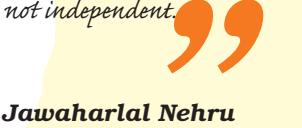

during a debate in the Constituent Assembly in March 1949.

chap 4_PF.indd 55 15-03-2024 14:54:17

### **The Constitutional principles**

Article 51 of the Indian Constitution lays down some Directive Principles of State Policy on 'Promotion of international peace and security'.

"The State shall endeavour to –

- (a) Promote international peace and security
- (b) Maintain just and honourable relations between nations
- (c) Foster respect for international law and treaty obligations in the dealings of organised people with one another; and
- (d) Encourage settlement of international disputes by arbitration."

How well did the Indian state live up to these principles in the first two decades after Independence? You may come back to this question after reading the chapter.

> its foreign policy, the Cold War was just beginning and the world was getting divided into these two camps. Did India belong to any of these two camps in global politics of the fifties and the sixties? Was it successful in conducting its foreign policy peacefully and avoiding international conflicts?

## *The Policy of non-alignment*

The Indian national movement was not an isolated process. It was a part of the worldwide struggle against colonialism and imperialism. It influenced the liberation movements of many Asian and African countries. Prior to India's independence, there were contacts between the nationalist leaders of India and those of other colonies, united as they were in their common struggle against colonialism and imperialism. The creation of the Indian National Army (INA) by Netaji Subhash Chandra Bose during the Second World War was the clearest manifestation of the linkages established between India and overseas Indians during the freedom struggle.

The foreign policy of a nation reflects the interplay of domestic and external factors. Therefore, the noble ideals that inspired India's struggle for freedom influenced the making of its foreign policy. But India's attainment of independence coincided with the beginning of the Cold War era, a period which was marked by the political, economic, and military confrontation at the global level between the two blocs led by the superpowers, the US and the USSR. The same period also witnessed developments like the establishment of the UN, the creation of nuclear weapons, the emergence of Communist

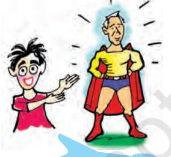

It's the fourth chapter and it's Nehru once again! Was he a superman or what? Or has his role been glorified?

chap 4_PF.indd 56 15-03-2024 14:54:17

China, and the beginning of decolonisation. So India's leadership had to pursue its national interests within the prevailing international context.

### *Nehru's role*

The first Prime Minister, Jawaharlal Nehru played a crucial role in setting the national agenda. He was his own foreign minister. Thus both as the Prime Minister and the Foreign Minister, he exercised profound influence in the formulation and implementation of India's foreign policy from 1946 to 1964. The three major objectives of Nehru's foreign policy were to preserve the hard-earned sovereignty, protect territorial integrity, and promote rapid economic development. Nehru wished to achieve these objectives through the strategy of nonalignment. There were, of course, parties and groups in the country that believed that India should be more friendly with the bloc led by the US because that bloc claimed to be pro-democracy. Among those who thought on these lines were leaders like Dr Ambedkar. Some political parties, which were opposed to communism, also wanted India to follow a pro-US foreign policy. These included the Bharatiya Jan Sangh and later the Swatantra Party. But Nehru possessed considerable leeway in formulating foreign policy.

### *Distance from two camps*

The foreign policy of independent India vigorously pursued the dream of a peaceful world by advocating the policy of non-alignment, by reducing Cold War tensions and by contributing human resources to the UN peacekeeping operations. You might ask why India did not join either of the two camps during the Cold War era. India wanted to keep away from the military alliances led by US and Soviet Union against each other. During the Cold War, the US-led North Atlantic Treaty Organisation (NATO) and the Soviet-led Warsaw Pact came into existence. India advocated non-alignment as the ideal foreign policy approach. This was a difficult balancing act and sometimes the balance did not appear perfect. In 1956 when Britain attacked Egypt over the Suez Canal issue, India led the world protest against this neo-colonial invasion. But in the same year when the USSR invaded Hungary, India did not join its public condemnation. Despite such a situation, by and large India did take an independent stand on various international issues and could get aid and assistance from members of both the blocs.

While India was trying to convince the other developing countries about the policy of non-alignment, Pakistan joined the US-led military alliances. The US was not happy about India's independent initiatives and the policy of non-alignment. Therefore, there was a considerable

 *Our general policy is to avoid entanglement in power politics and not to join any group of powers as against any other group. The two leading groups today are the Russian bloc and the Anglo-American bloc. We must be friendly to both and yet not join either. Both America and Russia are extraordinarily suspicious of each other as well as of other countries. This makes our path difficult and we may well be suspected by each of leaning towards the other. This cannot be helped. " "*

> *Jawaharlal Nehru*  Letter to K .P. S. Menon, January 1947.

chap 4_PF.indd 57 15-03-2024 14:54:17

Did we have more recognition and power in the world when we were younger, poorer and more vulnerable than now? Isn't that strange?

 *a country without material, men or money – the three means of power – is now fast coming to be recognised as the biggest moral power in the civilised world …her word listened to with respect in the councils of the great. " "*

> *C. Rajagopalachari* Letter to Edwina Mountbatten, 1950.

unease in Indo-US relations during the 1950s. The US also resented India's growing partnership with the Soviet Union.

You have studied in the last chapter, the strategy of planned economic development adopted by India. This policy emphasised import-substitution. The emphasis on developing a resource base also meant that export oriented growth was limited. This development strategy limited India's economic interaction with the outside world.

### *Afro-Asian unity*

Yet, given its size, location and power potential, Nehru envisaged a major role for India in world affairs and especially in Asian affairs. His era was marked by the establishment of contacts between India and other newly independent states in Asia and Africa. Throughout the 1940s and 1950s, Nehru had been an ardent advocate of Asian unity. Under his leadership, India convened the Asian Relations Conference in March 1947, five months ahead of attaining its independence. India made earnest efforts for the early realisation of freedom of Indonesia from the Dutch colonial regime by convening an international conference in 1949 to support its freedom struggle. India was a staunch supporter of the decolonisation process and firmly opposed racism, especially apartheid in South Africa. The Afro-Asian conference held in the Indonesian city of Bandung in 1955, commonly known as the Bandung Conference, marked the zenith of India's engagement with the newly independent Asian and African nations. The Bandung Conference later led to the establishment of the NAM. The First Summit of the NAM was held in Belgrade in September 1961. Nehru was a co-founder of the NAM.

## *Peace and conflict with China*

Unlike its relationship with Pakistan, free India began its relationship with China on a very friendly note. After the Chinese revolution in 1949, India was one of the first countries to recognise the communist government. Nehru felt strongly for this neighbour that was coming out of the shadow of western domination and helped the new government in international fora. Some of his colleagues, like Vallabhbhai Patel, were worried about a possible Chinese aggression in future. But Nehru thought it was 'exceedingly unlikely' that India will face an attack from China. For a very long time, the Chinese border was guarded by para-military forces, not the army.

The joint enunciation of Panchsheel, the Five Principles of Peaceful Coexistence, by the Indian Prime Minister Nehru and the Chinese Premier Zhou Enlai on 29 April 1954 was a step in the direction of stronger relationship between the two countries. Indian and Chinese leaders visited each other's country and were greeted by large and friendly crowds.

chap 4_PF.indd 58 15-03-2024 14:54:18

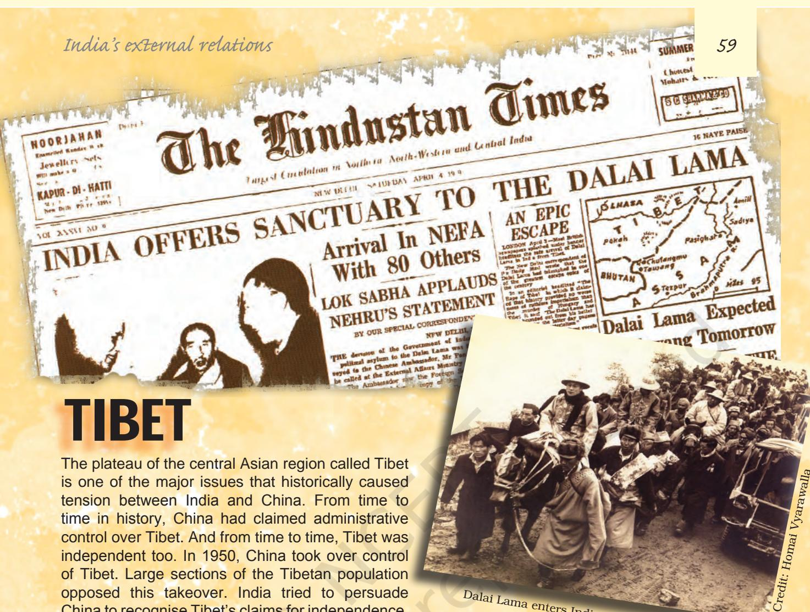

is one of the major issues that historically caused tension between India and China. From time to time in history, China had claimed administrative control over Tibet. And from time to time, Tibet was independent too. In 1950, China took over control of Tibet. Large sections of the Tibetan population opposed this takeover. India tried to persuade China to recognise Tibet's claims for independence. When the Panchsheel agreement was signed between India and China in 1954, through one of its clauses about respecting each other's territorial integrity and sovereignty, India conceded China's

Dalai Lama enters India with his followers.

claim over Tibet. The Tibetan spiritual leader Dalai Lama accompanied the Chinese Premier Zhou Enlai during the official Chinese visit to India in 1956. He informed Nehru about the worsening situation in Tibet. But China had already assured India that Tibet will be given greater autonomy than enjoyed by any other region of China. In 1958, there was armed uprising in Tibet against China's occupation. This was suppressed by the Chinese forces. Sensing that the situation had become worse, in 1959, the Dalai Lama crossed over into the Indian border and sought asylum which was granted. The Chinese government strongly protested against this. Over the last half century, a large number of Tibetans have also sought refuge in India and many other countries of the world. In India, particularly in Delhi, there are large settlements of Tibetan refugees. Dharmashala in Himachal Pradesh is perhaps the largest refuge settlement of Tibetans in India. The Dalai Lama has also made Dharmashala his home in India. In the 1950s and 1960s many political leaders and parties in India including the Socialist Party and the Jan Sangh supported the cause of Tibet's independence.

China has created the Tibet autonomous region, which is an integral part of China. Tibetans oppose the Chinese claim that Tibet is part of Chinese territory. They also oppose the policy of bringing into Tibet more and more Chinese settlers. Tibetans dispute China's claim that autonomy is granted to the region. They think that China wants to undermine the traditional religion and culture of Tibet.

chap 4_PF.indd 59 8/5/2022 12:11:53 PM

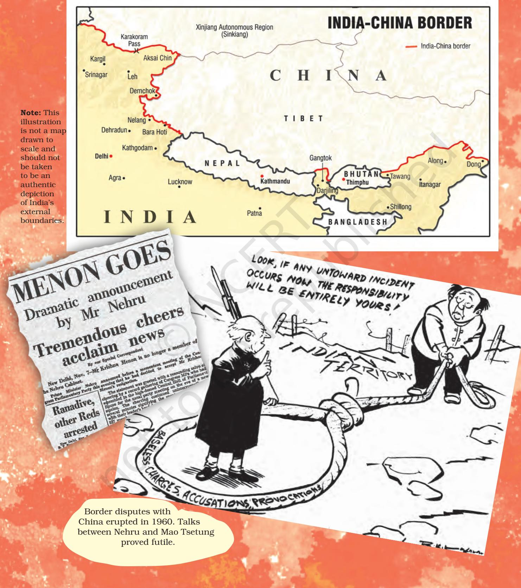

chap 4_PF.indd 60 8/5/2022 12:11:55 PM

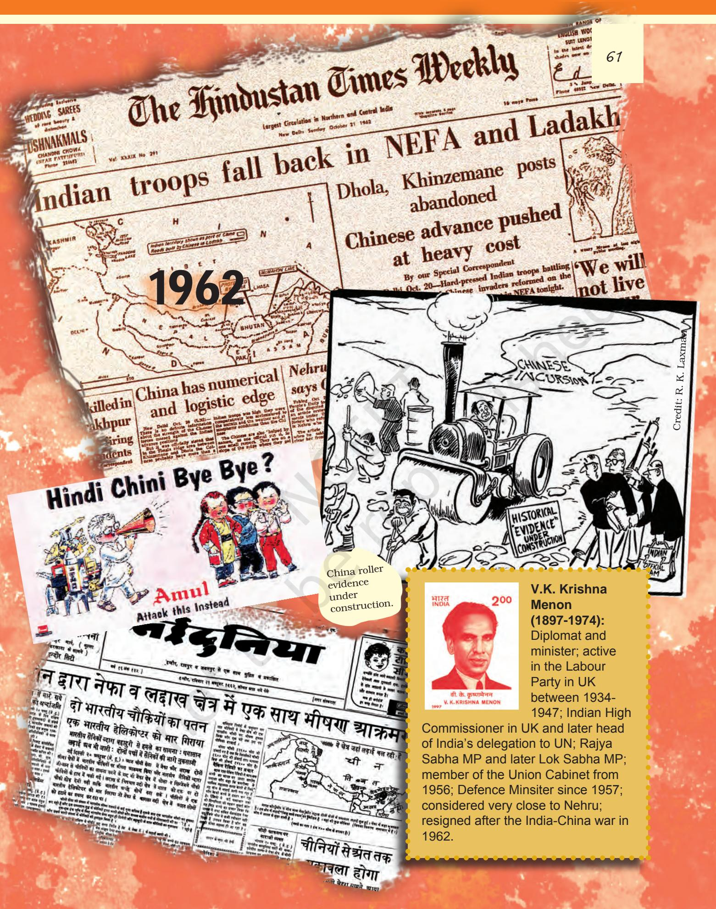

2024-25

chap 4_PF.indd 61 8/5/2022 12:11:58 PM

### *The Chinese invasion, 1962*

Two developments strained this relationship. China annexed Tibet in 1950 and thus removed a historical buffer between the two countries. Initially, the government of India did not oppose this openly. But as more information came in about the suppression of Tibetan culture, the Indian government grew uneasy. The Tibetan spiritual leader, the Dalai Lama, sought and obtained political asylum in India in 1959. China alleged that the government of India was allowing anti-China activities to take place from within India.

A little earlier, a boundary dispute had surfaced between India and China. India claimed that the boundary was a matter settled in colonial time, but China said that any colonial decision did not apply. The main dispute was about the western and the eastern end of the long border. China claimed two areas within the Indian territory: Aksai-chin area in the Ladakh region of Jammu and Kashmir and much of the state of Arunachal Pradesh in what was then called NEFA (North Eastern Frontier Agency). Between 1957 and 1959, the Chinese occupied the Aksai-chin area and built a strategic road there. Despite a very long correspondence and discussion among top leaders, these differences could not be resolved. Several small border skirmishes between the armies of the two countries took place.

 Around this time, while the entire world's attention was on the Cuban Missile crisis involving the two superpowers, China launched a swift and massive invasion in October 1962 on both the disputed regions. The first attack lasted one week and Chinese forces captured some key areas in Arunachal Pradesh. The second wave of attack came next month. While the Indian forces could block the Chinese advances on the western front in Ladakh, in the east the Chinese managed to advance nearly to the entry point of Assam plains. Finally, China declared a unilateral ceasefire and its troops withdrew to where they were before the invasion began.

The China war dented India's image at home and abroad. India had to approach the Americans and the British for military assistance to tide over the crisis. The Soviet Union remained neutral during the conflict. It induced a sense of national humiliation and at the same time strengthened a spirit of nationalism. Some of the top army commanders either resigned or were retired. Nehru's close associate and the then Defence Minister, V. Krishna Menon, had to leave the cabinet. Nehru's own stature suffered as he was severely criticised for his naïve assessment of the Chinese intentions and the lack of military preparedness. For the first time, a no-confidence motion against his government was moved and debated in the Lok Sabha. Soon thereafter, the Congress lost some key by-elections to Lok Sabha. The political mood of the country had begun to change.

 *Frankly ...my impression (of Zhou Enlai) was very favourable. ….the Chinese premier is, I believe a good type of man and trustworthy. " "*

> *C. Rajagopalachari* In a letter, December 1956

I heard it from my grandfather. Nehru Ji cried in public when Lata Mangeshkar sang "Ai mere watan ke logo…" after the 1962 war.

chap 4_PF.indd 62 15-03-2024 14:56:17

### Fast Forward

### Sino-Indian relations since 1962

It took more than a decade for India and China to resume normal relations. It was in 1976 that full diplomatic relations were restored between the two countries. Atal Behari Vajpayee was the first top level leader (he was then External Affairs Minister) to visit China in 1979. Later, Rajiv Gandhi became the first Prime Minister after Nehru to visit China. Since then, the emphasis is more on trade relations between the two countries. In the book, *Contemporary World Politics*, you have already read about these developments.

The Sino-Indian conflict affected the opposition as well. This and the growing rift between China and the Soviet Union created irreconcilable differences within the Communist Party of India (CPI). The pro-USSR faction remained within the CPI and moved towards closer ties with the Congress. The other faction was for sometime closer to China and was against any ties with the Congress. The party split in 1964 and the leaders of the latter faction formed the Communist Party of India (Marxist) (CPI-M). In the wake of the China war, many leaders of what became CPI (M) were arrested for being pro-China.

The war with China alerted the Indian leadership to the volatile situation in the Northeast region. Apart from being isolated and extremely underdeveloped, this region also presented India with the challenge of national integration and political unity. The process of its reorganisation began soon after the China war. Nagaland was granted statehood; Manipur and Tripura, though Union Territories, were given the right to elect their own legislative assemblies.

Let's watch a Film

**Haqeeqat**

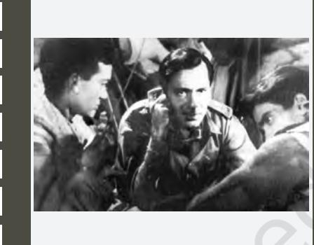

A small platoon of Indian army is rescued by the gypsies in Ladakh region. The enemy has surrounded their post. Capt. Bahadur Singh and his gypsy girlfriend Kammo help the *jawans* vacate their posts. Both Bahadur Singh and Kammo die while resisting the Chinese but the *jawans* too, are overpowered by the enemy and lay down their lives for the country.

Set in the backdrop of the China war of 1962, this film portrays the soldier and his travails as its central theme. It pays tribute to the soldiers while depicting their plight, and the political frustration over the betrayal by the Chinese. The film uses documentary footage of war scenes and is considered as one of the early war films made in Hindi.

Year: 1964 Director: Chetan Anand Actors: Dharmendra, Priya Rajvansh, Balraj Sahni, Jayant, Sudhir, Sanjay Khan, Vijay Anand

chap 4_PF.indd 63 8/5/2022 12:11:59 PM

## *Wars and Peace with Pakistan*

In the case of Pakistan, the conflict started just after partition over the dispute on Jammu and Kashmir. You will read more about the dispute in Chapter 7. A proxy war broke out between the Indian and Pakistani armies in Jammu and Kashmir during 1947 itself. But this did not turn into a full war. The issue was then referred to the UN. Pakistan soon emerged as a critical factor in India's relations with the US and subsequently with China.

The Kashmir conflict did not prevent cooperation between the governments of India and Pakistan. Both the governments worked together to restore the women abducted during partition to their original families. A long-term dispute about the sharing of river waters was resolved through mediation by the World Bank. The India-Pakistan Indus Waters Treaty was signed by Nehru and General Ayub Khan in 1960. Despite all ups and downs in the Indo-Pak relations, this treaty has worked well.

A more serious armed conflict between the two countries began in 1965. As you would read in the next chapter, by then Lal Bahadur Shastri had taken over as the Prime Minister. In April 1965 Pakistan launched armed attacks in the Rann of Kutch area of Gujarat. This was followed by a bigger offensive in Jammu and Kashmir in August-September. Pakistani rulers were hoping to get support from the local population there, but it did not happen. In order to ease the pressure on the Kashmir front, Shastri ordered Indian troops to launch a counter-offensive on the Punjab border. In a fierce battle, the Indian army reached close to Lahore.

The hostilities came to an end with the UN intervention. Later, Indian Prime Minister Lal Bahadur Shastri and Pakistan's General Ayub Khan signed the Tashkent Agreement, brokered by the Soviet Union, in January 1966. Though India could inflict considerable military loss on Pakistan, the 1965 war added to India's already difficult economic situation.

### *Bangladesh war, 1971*

Beginning in 1970, Pakistan faced its biggest internal crisis. The country's first general election produced a split verdict – Zulfikar Ali Bhutto's party emerged a winner in West Pakistan, while the Awami League led by Sheikh Mujib-ur Rahman swept through East Pakistan. The Bengali population of East Pakistan had voted to protest against years of being treated as second class citizens by the rulers based in West Pakistan. The Pakistani rulers were not willing to accept the democratic verdict. Nor were they ready to accept the Awami League's demand for a federation.

Instead, in early 1971, the Pakistani army arrested Sheikh Mujib and unleashed a reign of terror on the people of East Pakistan. In

Why do we say India and Pakistan had a war? Leaders quarrel and armies fight wars. Most ordinary citizens have nothing to do with these.

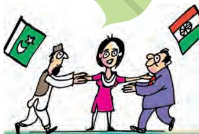

chap 4_PF.indd 64 15-03-2024 14:57:10

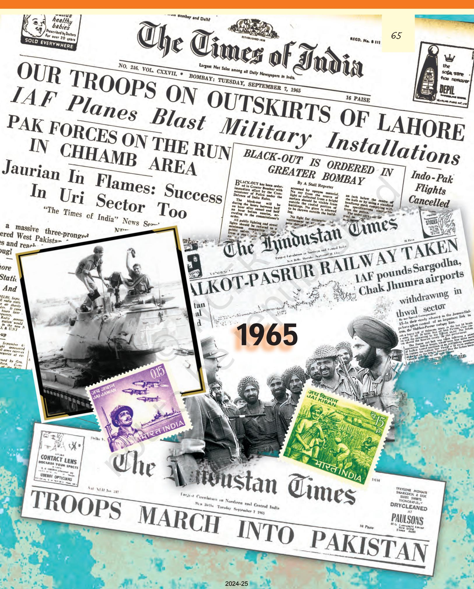

chap 4_PF.indd 65 8/5/2022 12:12:04 PM

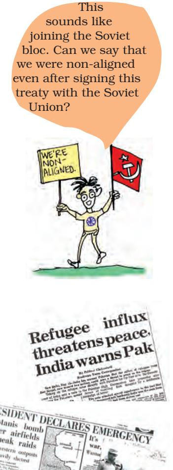

response to this, the people started a struggle to liberate 'Bangladesh' from Pakistan. Throughout 1971, India had to bear the burden of about 80 lakh refugees who fled East Pakistan and took shelter in the neighbouring areas in India. India extended moral and material support to the freedom struggle in Bangladesh. Pakistan accused India of a conspiracy to break it up.

Support for Pakistan came from the US and China. The US-China rapprochement that began in the late 1960s resulted in a realignment of forces in Asia. Henry Kissinger, the adviser to the US President Richard Nixon, made a secret visit to China via Pakistan in July 1971. In order to counter the US-Pakistan-China axis, India signed a 20-year Treaty of Peace and Friendship with the Soviet Union in August 1971. This treaty assured India of Soviet support if the country faced any attack.

After months of diplomatic tension and military build-up, a full-scale war between India and Pakistan broke out in December 1971. Pakistani aircrafts attacked Punjab and Rajasthan, while the army moved on the Jammu and Kashmir front. India retaliated with an attack involving the air force, navy and the army on both the Western and the Eastern front. Welcomed and supported by the local population, the Indian army made rapid progress in East Pakistan. Within ten days the Indian army had surrounded Dhaka from three sides and the Pakistani army of about 90,000 had to surrender. With Bangladesh as a free country, India declared a unilateral ceasefire. Later, the signing of the Shimla Agreement between Indira Gandhi and Zulfikar Ali Bhutto on 3 July 1972 formalised the return of peace.

A decisive victory in the war led to national jubiliation. Most people in India saw this as a moment of glory and a clear sign of India's growing military prowess. As you would read in the next chapter, Indira Gandhi was the Prime Minister at this time. She had already won the Lok Sahba elections in 1971. Her personal popularity soared

### Fast Forward Kargil Confrontation

In the early part of 1999 several points on the Indian side of the LoC in the Mashkoh, Dras, Kaksar and Batalik areas were occupied by forces claiming to be Mujahideens. Suspecting involvement of the Pakistan Army, Indian forces started reacting to this occupation. This led to a confrontation between the two countries. This is known as the Kargil conflict. This conflict went on during May and June 1999. By 26 July 1999, India had recovered control of many of the lost points. The Kargil conflict drew attention worldwide for the reason that only one year prior to that, both India and Pakistan had attained nuclear capability. However, this conflict remained confined only to the Kargil region. In Pakistan, this conflict has been the source of a major controversy as it was alleged later that the Prime Minister of Pakistan was kept in the dark by the Army Chief. Soon after the conflict, the government of Pakistan was taken over by the Pakistan Army led by the Army Chief, General Parvez Musharraf.

chap 4_PF.indd 66 8/5/2022 12:12:05 PM

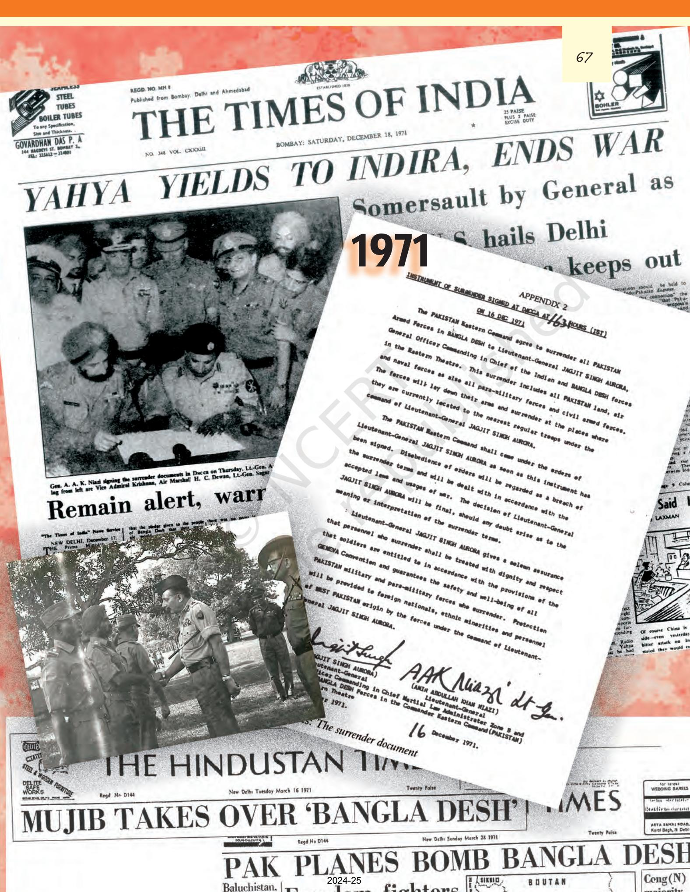

chap 4_PF.indd 67 8/5/2022 12:12:06 PM

further after the 1971 war. After the war, assembly elections in most States took place, bringing large majorities for the Congress party in many states.

India, with its limited resources, had initiated development planning. However, conflicts with neighbours derailed the five-year plans. The scarce resources were diverted to the defence sector especially after 1962, as India had to embark on a military modernisation drive. The Department of Defence Production was established in November 1962 and the Department of Defence Supplies in November 1965. The Third Plan (1961-66) was affected and it was followed by three Annual Plans and the Fourth Plan could be initiated only in 1969. India's defence expenditure increased enormously after the wars.

## *India's nuclear policy*

Another crucial development of this period was the first nuclear explosion undertaken by India in May 1974. Nehru had always put his faith in science and technology for rapidly building a modern India. A significant component of his industrialisation plans was the nuclear programme initiated in the late 1940s under the guidance of Homi J. Bhabha. India wanted to generate atomic energy for peaceful purposes. Nehru was against nuclear weapons. So he pleaded with the superpowers for comprehensive nuclear disarmament. However, the nuclear arsenal kept rising. When Communist China conducted nuclear tests in October 1964, the five nuclear weapon powers, the US, USSR, UK, France, and China (Taiwan then represented China) – also the five Permanent Members of the UN Security Council – tried to impose the Nuclear Non-proliferation Treaty (NPT) of 1968 on the rest of the world. India always considered the NPT as discriminatory and had refused to sign it. When India conducted its first nuclear test, it was termed as peaceful explosion. India argued that it was committed to the policy of using nuclear power only for peaceful purposes.

The period when the nuclear test was conducted was a difficult period in domestic politics. Following the Arab-Israel War of 1973, the entire world was affected by the Oil Shock due to the massive hike in the oil prices by the Arab nations. It led to economic turmoil in India resulting in high inflation. As you will read in Chapter Six, many agitations were going on in the country around this time, including a nationwide railway strike.

Although there are minor differences among political parties about how to conduct external relations, Indian politics is generally marked by a broad agreement among the parties on national integration, protection of international boundaries, and on questions of national interest. Therefore, we find that in the course of the decade of 1962-1971, when India faced three wars, or even later, when different parties came to power from time to time, foreign policy has played only a limited role in party politics.

I am confused! Isn't it all about atom bombs? Why don't we say so?

chap 4_PF.indd 68 8/5/2022 12:12:06 PM

### Fast Forward India's Nuclear Programme

India has opposed the international treaties aimed at non-proliferation since they were selectively applicable to the non-nuclear powers and legitimised the monopoly of the five nuclear weapons powers. Thus, India opposed the indefinite extension of the NPT in 1995 and also refused to sign the Comprehensive Test Ban Treaty (CTBT).

India conducted a series of nuclear tests in May 1998, demonstrating its capacity to use nuclear energy for military purposes. Pakistan soon followed, thereby increasing the vulnerability of the region to a nuclear exchange. The international community was extremely critical of the nuclear tests in the subcontinent and sanctions were imposed on both India and Pakistan, which were subsequently waived. India's nuclear doctrine of credible minimum nuclear deterrence professes "no first use" and reiterates India's commitment to global, verifiable and non-discriminatory nuclear disarmament leading to a nuclear weapons free world.

### Shifting alliances in world politics

As you will read in Chapter Six and also in Chapter Eight, many non-Congress governments came to power in the period starting 1977. This was also the time when world politics was changing dramatically. What did it mean for India's external relations?

The Janata Party government that came to power in 1977 announced that it would follow genuine non-alignment. This implied that the pro-Soviet tilt in the foreign policy will be corrected. Since then, all governments (Congress or non-Congress) have taken initiatives for restoring better relations with China and entering into close ties with US. In Indian politics and in popular mind, India's foreign policy is always very closely linked to two questions. One is India's stand vis-à-vis Pakistan and the other is Indo-US relations. In the post-1990 period the ruling parties have often been criticised for their pro-US foreign policy.

Foreign policy is always dictated by ideas of national interest. In the period after 1990, Russia, though it continues to be an important friend of India, has lost its global preeminence. Therefore, India's foreign policy has shifted to a more pro-US strategy. Besides, the contemporary international situation is more influenced by economic interests than by military interests. This has also made an impact on India's foreign policy choices. At the same time, Indo-Pakistan relations have witnessed many new developments during this period. While Kashmir continues to be the main issue between the two countries, there have been many efforts to restore normal relations. This means that cultural exchanges, movement of citizens and economic cooperation would be encouraged by both countries. Do you know that a train and a bus service operate between these two countries? This has been a major achievement of the recent times. But that could not avoid the near-war situation from emerging in 1999. Even after this setback to the peace process, efforts at negotiating durable peace have been going on.

chap 4_PF.indd 69 15-03-2024 14:58:16

- 1. Write 'true' or 'false' against each of these statements.
	- (a) Non-alignment allowed India to gain assistance both from USA and USSR.
	- (b) India's relationship with her neighbours has been strained from the beginning.
	- (c) The cold war has affected the relationship between India and Pakistan.
	- (d) The treaty of Peace and Friendship in 1971 was the result of India's closeness to USA.

#### 2. Match the following

- (a) The goal of India's foreign i. Tibetan spiritual leader who policy in the period 1950-1964 crossed over to India
- 
- 
- 
- 
- (b) Panchsheel ii. Preservation of territorial integrity, sovereignty and economic development
- (c) Bandung Conference iii. Five principles of peaceful coexistence
- (d) Dalai Lama iv. Led to the establishment of NAM
- 3. Why did Nehru regard conduct of foreign relations as an essential indicator of independence? State any two reasons with examples to support your reading.
- 4. "The conduct of foreign affairs is an outcome of a two-way interaction between domestic compulsions and prevailing international climate". Take one example from India's external relations in the 1960s to substantiate your answer.
- 5. Identify any two aspects of India's foreign policy that you would like to retain and two that you would like to change, if you were to become a decision maker. Give reasons to support your position.
- 6. Write short notes on the following.
- (a) India's Nuclear policy

- (b) Consensus in foreign policy matters
- 7. India's foreign policy was built around the principles of peace and cooperation. But India fought three wars in a space of ten years between 1962 and 1971. Would you say that this was a failure of the foreign policy? Or would you say that this was a result of international situation? Give reasons to support your answer.

*EXERCISES*

chap 4_PF.indd 70 8/5/2022 12:12:06 PM

- 8. Does India's foreign policy reflect her desire to be an important regional power? Argue your case with the Bangladesh war of 1971 as an example.
- 9. How does political leadership of a nation affect its foreign policy? Explain this with the help of examples from India's foreign policy.
- 10. Read this passage and answer the questions below:

"*Broadly, non-alignment means not tying yourself off with military blocs….It means trying to view things, as far as possible, not from the military point of view, though that has to come in sometimes, but independently, and trying to maintain friendly relations with all countries." —* Jawaharlal Nehru

- (a) Why does Nehru want to keep off military blocs?
- (b) Do you think that the Indo-Soviet friendship treaty violated the principle of non-alignment? Give reasons for your answer.
	- (c) If there were no military blocs, do you think non-alignment would have been unnecessary?

chap 4_PF.indd 71 8/5/2022 12:12:06 PM

