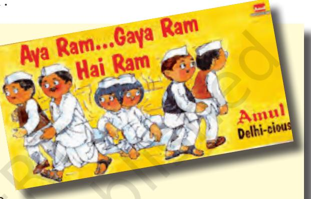
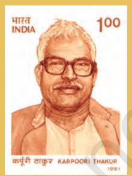
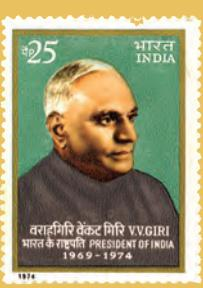

Originally the election symbol of the Congress was a pair of bullocks. This famous cartoon depicts the changes within the Congress leading to a headon confrontation in the 22nd year after Independence.

# *In this chapter…*

In Chapter Two we read about the emergence of the Congress system. This system was first challenged during the 1960s. As political competition became more intense, the Congress found it difficult to retain its dominance. It faced challenges from the opposition that was more powerful and less divided than before. The Congress also faced challenges from within, as the party could no longer accommodate all kinds of differences. In this chapter we pick the story from where we left it in Chapter Two, in order to

- • understand how the political transition took place after Nehru;
- • describe how the opposition unity and the Congress split posed a challenge to Congress dominance;
- • explain how a new Congress led by Indira Gandhi overcame these challenges; and
- • analyse how new policies and ideologies facilitated the restoration of the Congress system.

2024-25

chap 5_PF.indd 72 8/5/2022 12:22:12 PM

## *Challenge of Political Succession*

Prime Minister Jawaharlal Nehru passed away in May 1964. He had been unwell for more than a year. This had generated a lot of speculation about the usual question of succession: after Nehru, who? But in a newly independent country like India, this situation gave rise to a more serious question: after Nehru, what?

The second question arose from the serious doubts that many outsiders had about whether India's democratic experiment will survive after Nehru. It was feared that like so many other newly independent countries, India too would not be able to manage a democratic succession. A failure to do so, it was feared, could lead to a political role for the army. Besides, there were doubts if the new leadership would be able to handle the multiple crises that awaited a solution. The 1960s were labelled as the 'dangerous decade' when

France or Canada have similar problems, no one talks about failure or disintegration. Why are we under this constant suspicion?

chap 5_PF.indd 73 8/5/2022 12:22:14 PM

**Shastri (1904-1966):** Prime Minister of India; participated in the freedom movement since 1930; minister in UP cabinet; General Secretary of Congress; Minister in Union Cabinet from 1951 to 1956 when he resigned taking responsibility for the railway accident and later from 1957 to 1964; coined the famous slogan 'Jai Jawan-Jai Kisan'.

 *…new Prime Minister of India, in spite of all forebodings, had been named with more dispatch, and much more dignity, than was the new Prime Minister of Britain. " "*

> Editorial in The Guardian, London, 3 June 1964, comparing the political succession after Nehru with the succession drama after Harold Macmillan in Britain.

unresolved problems like poverty, inequality, communal and regional divisions etc. could lead to a failure of the democratic project or even the disintegration of the country.

#### *From Nehru to Shastri*

The ease with which the succession after Nehru took place proved all the critics wrong. When Nehru passed away, K. Kamraj, the president of the Congress party consulted party leaders and Congress members of Parliament and found that there was a consensus in favour of Lal Bahadur Shastri. He was unanimously chosen as the leader of the Congress parliamentary party and thus became the country's next Prime Minister. Shastri was a non-controversial leader from Uttar Pradesh who had been a Minister in Nehru's cabinet for many years. Nehru had come to depend a lot on him in his last year. He was known for his simplicity and his commitment to principles. Earlier he had resigned from the position of Railway Minister accepting moral responsibility for a major railway accident.

Shastri was the country's Prime Minister from 1964 to 1966. During Shastri's brief Prime Ministership, the country faced two major challenges. While India was still recovering from the economic implications of the war with China, failed monsoons, drought and serious food crisis presented a grave challenge. As discussed in the previous chapter, the country also faced a war with Pakistan in 1965. Shastri's famous slogan 'Jai Jawan Jai Kisan', symbolised the country's resolve to face both these challenges.

Shastri's Prime Ministership came to an abrupt end on 10 January 1966, when he suddenly expired in Tashkent, then in USSR and currently the capital of Uzbekistan. He was there to discuss and sign an agreement with Muhammad Ayub Khan, the then President of Pakistan, to end the war.

#### *From Shastri to Indira Gandhi*

Thus the Congress faced the challenge of political succession for the second time in two years. This time there was an intense competition between Morarji Desai and Indira Gandhi. Morarji Desai had earlier served as Chief Minister of Bombay state (today's Maharashtra and Gujarat) and also as a Minister at the centre. Indira Gandhi, the daughter of Jawaharlal Nehru, had been Congress President in the past and had also been Union Minister for Information in the Shastri cabinet. This time the senior leaders in the party decided to back Indira Gandhi, but the decision was not unanimous. The contest was resolved through a secret ballot among Congress MPs. Indira Gandhi defeated Morarji Desai by securing the support of more than two-thirds of the party's MPs. A peaceful transition of power, despite intense competition for leadership, was seen as a sign of maturity of India's democracy. 

chap 5_PF.indd 74 8/5/2022 12:22:14 PM

It took some time before the new Prime Minister could settle down. While Indira Gandhi had been politically active for very long, she had served as a minister under Lal Bahadur Shastri only for a short period. The senior Congress leaders may have supported Indira Gandhi in the belief that her administrative and political inexperience would compel her to be dependent on them for support and guidance. Within a year of becoming Prime Minister, Indira Gandhi had to lead the party in a Lok Sabha election. Around this time, the economic situation in the country had further deteriorated, adding to her problems. Faced with these difficulties, she set out to gain control over the party and to demonstrate her leadership skills.

**Indira Gandhi (1917-1984):** Prime Minister of India from 1966 to 1977 and 1980 to 1984; daughter of Jawaharlal Nehru; participated in the freedom struggle as a young Congress worker; Congress President in 1958; minister in Shastri's cabinet from 1964-66; led the Congress party to victory in 1967, 1971 and 1980 general elections; credited with the slogan 'garibi hatao', victory in 1971 war and for policy initiatives like abolition of Privy Purse, nationalisation of banks, nuclear test and environmental protection; assassinated on 31 October 1984.

chap 5_PF.indd 75 8/5/2022 12:22:14 PM

It must have been difficult for her – one woman in a world dominated by men. Why don't we have more women in positions like that?

# *Fourth General Elections, 1967*

The year 1967 is considered a landmark year in India's political and electoral history. In Chapter Two you read about how the Congress party was the dominant political force throughout the country from 1952 onwards. This trend was to undergo significant changes with the 1967 elections.

### *Context of the elections*

In the years leading up to the fourth general elections, the country witnessed major changes. Two Prime Ministers had died in quick succession, and the new Prime Minister, who was being seen as a political novice, had been in office for less than a year. You will recall from the discussion in Chapter Three and in the previous section of this chapter that the period was fraught with grave economic crisis resulting from successive failure of monsoons, widespread drought,

chap 5_PF.indd 76 8/5/2022 12:22:15 PM

decline in agricultural production, serious food shortage, depletion of foreign exchange reserves, drop in industrial production and exports, combined with a sharp rise in military expenditure and diversion of resources from planning and economic development. One of the first decisions of the Indira Gandhi government was to devaluate the Indian rupee, under what was seen to be pressure from the US. Earlier one US dollar could be purchased for less than Rs. 5; after devaluation it cost more than Rs. 7.

The economic situation triggered off price rise. People started protesting against the increase in prices of essential commodities, food scarcity, growing unemployment and the overall economic condition in the country. Bandhs and hartals were called frequently across the country. The government saw the protests as a law and order problem and not as expressions of people's problems. This further increased public bitterness and reinforced popular unrest.

The communist and socialist parties launched struggles for greater equality. You will read in the next chapter about how a group of communists who separated from the Communist Party of India (Marxist) to form the Communist Party of India (Marxist-Leninist) led armed agrarian struggles and organised peasant agitations. This period also witnessed some of the worst Hindu-Muslim riots since Independence.

#### *Non-Congressism*

This situation could not have remained isolated from party politics in the country. Opposition parties were in the forefront of organising public protests and pressurising the

## *Election in a Rajasthan Village*

This is a story about 1967 assembly elections. In the Chomu constituency, the main parties in the fray were Congress and the Swatantra party. But village Devisar had its own local political dynamics and it got mixed up with the competition between the two parties. Sher Singh, traditionally dominated village politics, but gradually his nephew, Bhim Singh was emerging as the more popular

leader and rival. Though both were Rajputs, Bhim Singh cultivated the support of many non-Rajputs in the village by attending to their requirements after becoming the panchayat Pradhan. So, he struck a new equation—the alliance of Rajputs and non-Rajputs.

He proved to be more adept in building alliances across the village by supporting candidates in other villages for the posts of village Pradhan. In fact, he took an initiative and took a delegation to the State Chief Minister and Congress leader Mohan Lal Sukhadia for pressing the name of one of his friends from a nearby village as Congress candidate in the Assembly election. When Sukhadia convinced him of some other name, Bhim Singh, in turn, convinced many others that they should work for the party candidate. Bhim Singh knew that if the party candidate won from this constituency, that candidate would become a minister and thus, he would have direct contacts with a minister for the first time!

Sher Singh had no option but to work for the Swatantra candidate, who was a jagirdar. He kept telling people that the jagirdar would help build the village school and use his resources for the development of the locality. At least in Devisar village, the Assembly election had turned into a factional fight between uncle and nephew.

*Based on Anand Chakravarti, 'A Village in Chomu Assembly Constituency in Rajasthan.'*

chap 5_PF.indd 77 8/5/2022 12:22:19 PM

 *...in India, as present trends continue… maintenance of an ordered structure of society is going to slip out of reach of an ordered structure of civil government and the army will be only alternative source of authority and order. …the great experiment of developing India within a democratic framework has failed. " "*

> *Neville Maxwell* 'India's Disintegrating Democracy' an article published in the London Times, 1967.

government. Parties opposed to the Congress realised that the division of their votes kept the Congress in power. Thus parties that were entirely different and disparate in their programmes and ideology got together to form anti-Congress fronts in some states and entered into electoral adjustments of sharing seats in others. They felt that the inexperience of Indira Gandhi and the internal factionalism within the Congress provided them an opportunity to topple the Congress. The socialist leader Ram Manohar Lohia gave this strategy the name of 'non-Congressism'. He also produced a theoretical argument in its defence: Congress rule was undemocratic and opposed to the interests of ordinary poor people; therefore, the coming together of the non-Congress parties was necessary for reclaiming democracy for the people.

**C. Natarajan Annadurai (1909-1969):** Chief Minister of Madras (Tamil Nadu) from 1967; a journalist, popular writer and orator; initially associated with the Justice Party in Madras province; later joined Dravid Kazagham (1934); formed DMK as a political party in 1949; a proponent of Dravid culture, he was opposed to imposition of Hindi and led the anti-Hindi agitations; supporter of greater autonomy to States.

**Ram Manohar** 

**Lohia (1910-1967):**  Socialist leader and thinker; freedom fighter and among the founders of the Congress Socialist Party; after the split in the parent

party, the leader of the Socialist Party and later the Samyukta Socialist Party; Member, Lok Sabha, 1963- 67; founder editor of Mankind and Jan, known for original contribution to a non-European socialist theory; as political leader, best known for sharp attacks on Nehru, strategy of non-Congressism, advocacy of reservation for backward castes and opposition to English.

#### *Electoral verdict*

It was in this context of heightened popular discontent and the polarisation of political forces that the fourth general elections to the Lok Sabha and State Assemblies were held in February 1967. The Congress was facing the electorate for the first time without Nehru.

The results jolted the Congress at both the national and state levels. Many contemporary political observers described the election results as a 'political earthquake'.The Congress did manage to get a majority in the Lok Sabha, but with its lowest tally of seats and share of votes since 1952. Half the ministers in Indira Gandhi's cabinet were defeated. The political stalwarts who lost in their constituencies included Kamaraj in Tamil Nadu, S.K. Patil in Maharashtra, Atulya Ghosh in West Bengal and K. B. Sahay in Bihar.

chap 5_PF.indd 78 8/5/2022 12:22:19 PM

chap 5_PF.indd 79 8/5/2022 12:22:20 PM

The dramatic nature of the political change would be more apparent to you at the State level. The Congress lost majority in as many as seven States. In two other States defections prevented it from forming a government. These nine States where the Congress lost power were spread across the country – Punjab, Haryana, Uttar Pradesh, Madhya Pradesh, Bihar, West Bengal, Orissa, Madras and Kerala. In Madras State (now called Tamil Nadu), a regional party the Dravida Munnetra Kazhagam (DMK) – came to power by securing a clear majority. The DMK won power after having led a massive anti-Hindi agitation by students against the centre on the issue of imposition of Hindi as the official language. This was the first time any non-Congress party had secured a majority of its own in any State. In the other eight States, coalition governments consisting of different non-Congress parties were formed. A popular saying was that one could take a train from Delhi to Howrah and not pass through a single Congress ruled State. It was a strange feeling for those who were used to seeing the Congress in power. So, was the domination of the Congress over?

#### *Coalitions*

What's so unusual in hung assemblies and coalition governments? We see them all the time.

The elections of 1967 brought into picture the phenomenon of coalitions. Since no single party had got majority, various non-Congress parties came together to form joint legislative parties (called Samyukt Vidhayak Dal in Hindi) that supported non-Congress governments. That is why these governments came to be described as SVD governments. In most of these cases the coalition partners were ideologically incongruent. The SVD government in Bihar, for instance, included the two socialist parties – SSP and the PSP – along with the CPI on the left and Jana Sangh on the right. In Punjab it was called the 'Popular United Front' and comprised the two rival Akali parties at that time – Sant group and the Master group – with both the communist parties – the CPI and the CPI(M), the SSP, the Republican Party and the Bharatiya Jana Sangh.

A cartoonist's reading of Charan Singh's attempt to build a United Front of non-communist parties in 1974

chap 5_PF.indd 80 8/5/2022 12:22:21 PM

#### *Defection*

Another important feature of the politics after the 1967 election was the role played by defections in the making and unmaking of governments in the States. Defection means an elected representative leaves the party on whose symbol he/she was elected and joins another party. After the 1967 general election, the breakaway Congress legislators played an important role in installing non-Congress governments in three States - Haryana, Madhya Pradesh and Uttar Pradesh. The constant realignments and shifting political loyalties in this period gave rise to the expression 'Aya Ram, Gaya Ram'.

#### **The story of 'Aya Ram, Gaya Ram'**

The expression 'aya ram, gaya ram' became popular in the political vocabulary in India to describe the practice of frequent floorcrossing by legislators. Literally translated the terms meant, Ram came and Ram went. The expression originated in an amazing feat of floor crossing achieved by Gaya Lal, an MLA in Haryana, in 1967. He changed his party thrice in a fortnight, from Congress to United Front, back to

Congress and then within nine hours to United Front again! It is said that when Gaya Lal declared his intention to quit the United Front and join the Congress, the Congress leader, Rao Birendra Singh brought him to Chandigarh press and declared "Gaya Ram was now Aya Ram".

Gaya Lal's feat was immortalised in the phrase "Aya Ram, Gaya Ram" which became the subject of numerous jokes and cartoons. Later, the Constitution was amended to prevent defections.

## *Split in the Congress*

We saw that after the 1967 elections, the Congress retained power at the Centre but with a reduced majority and lost power in many States. More importantly, the results proved that the Congress could be defeated at the elections. But there was no substitute as yet. Most non-Congress coalition governments in the States did not survive for long. They lost majority, and either new combinations were formed or President's rule had to be imposed.

#### *Indira vs. the 'Syndicate'*

The real challenge to Indira Gandhi came not from the opposition but from within her own **K. Kamaraj (1903-1975):** Freedom fighter and Congress President; Chief Minister of Madras (Tamil Nadu); having suffered educational deprivation, made efforts to spread

education in Madras province; introduced mid-day meal scheme for schoolchildren; in 1963 he proposed that all senior Congressmen should resign from office to make way for younger party workers—this proposal is famous as the 'Kamaraj plan.'

chap 5_PF.indd 81 8/5/2022 12:22:21 PM

**S. Nijalingappa (1902-2000):**  Senior Congress leader; Member of Constituent Assembly; member of Lok Sabha; Chief Minister of the then Mysore (Karnataka) State; regarded as the maker of modern Karnataka; President of Congress during

1968-71.

#### **The Congress 'Syndicate'**

Syndicate was the informal name given to a group of Congress leaders who were in control of the party's organisation. It was led by K. Kamraj, former Chief Minister of Tamil Nadu and then the president of the Congress party. It included powerful State leaders like S. K. Patil of Bombay city (later named as Mumbai), S. Nijalingappa of Mysore (later Karnataka), N. Sanjeeva Reddy of Andhra Pradesh and Atulya Ghosh of West Bengal. Both Lal Bahadur Shastri and later Indira Gandhi owed their position to the support received from the Syndicate. This group had a decisive say in Indira Gandhi's first Council of Ministers and also in policy formulation and implementation. After the Congress split the leaders of the syndicate and those owing allegiance to them stayed with the Congress (O). Since it was Indira Gandhi's Congress (R) that won the test of popularity, all these big and powerful men of Indian politics lost their power and prestige after 1971.

> So, there is nothing new about State level leaders being the king-makers at the centre. I thought it happened only in the 1990s.

party. She had to deal with the 'syndicate', a group of powerful and influential leaders from within the Congress. The Syndicate had played a role in the

installation of Indira Gandhi as the Prime Minister by ensuring her election as the leader of the parliamentary party. These leaders expected Indira Gandhi to follow their advise. Gradually, however, Indira Gandhi attempted to assert her position within the government and the party. She chose her trusted group of advisers

## **Karpoori Thakur**

**(1924-1988):** Chief Minister of Bihar between December 1970 and June 1971 and again between June 1977 and April 1979; Freedom Fighter and socialist leader; active in labour and peasant movements; staunch

follower of Lohia; participated in the movement led by JP; known for his decision to introduce reservations for the backward classes in Bihar during his second Chief Ministership; strong opponent of the use of English Language.

from outside the party. Slowly and carefully, she sidelined the Syndicate.

Indira Gandhi thus faced two challenges. She needed to build her independence from the Syndicate. She also needed to work towards regaining the ground that the Congress had lost in the 1967 elections. Indira Gandhi adopted a very bold strategy. She converted a simple power struggle into an ideological struggle. She launched a series of initiatives to give the government policy a Left orientation. She got the Congress Working Committee to adopt a Ten Point Programme in May 1967. This programme included social control of banks, nationalisation of General Insurance, ceiling on urban property and income,

chap 5_PF.indd 82 8/5/2022 12:22:22 PM

public distribution of food grains, land reforms and provision of house sites to the rural poor. While the 'syndicate' leaders formally approved this Left-wing programme, they had serious reservations about the same.

#### *Presidential election, 1969*

The factional rivalry between the Syndicate and Indira Gandhi came in the open in 1969. Following President Zakir Hussain's death, the post of President of the India fell vacant that year. Despite Mrs Gandhi's reservations the 'syndicate' managed to nominate her long time opponent and then speaker of the Lok Sabha, N. Sanjeeva Reddy, as the official Congress candidate for the ensuing Presidential elections. Indira Gandhi retaliated by encouraging the then Vice-President, V.V. Giri, to file his nomination as an independent candidate. She also announced several big and popular policy measures like the nationalisation of fourteen leading private banks and the abolition of the 'privy purse' or the special privileges given to former princes. Morarji Desai was the Deputy Prime Minister and **V.V. Giri (1894-1980):**  President of India from 1969 to 1974; Congress worker and labour leader from Andhra Pradesh; Indian

High Commissioner to Ceylon (Sri Lanka); Labour Minister in Union cabinet; Governor of U.P., Kerala, Mysore (Karnataka); Vice-President (1967-1969) and acting President after the death of President Zakir Hussain; resigned and contested presidential election as independent candidate; received support from Indira Gandhi for his election as President.

"The Left Hook" was published after the victory of V.V. Giri, (the boxer with the garland) over the nominee of the Syndicate, represented here by Nijalingappa (on his knees).

chap 5_PF.indd 83 8/5/2022 12:22:23 PM

 *History … is replete with instances of the tragedy that overtakes democracy when a leader who has risen to power on the crest of a popular wave or with the support of a democratic organisation becomes a victim of political narcissism and is egged on by a coterie of unscrupulous sycophants…... "*

*S Nijalingappa* Letter to Indira Gandhi expelling her from the party, 11 November 1969.

Finance Minister. On both the above issues serious differences emerged between him and the Prime Minister resulting in Desai leaving the government.

Congress had seen differences of this kind in the past. But this time both the parties wanted a showdown which took place during the Presidential elections. The then Congress President S. Nijalingappa issued a 'whip' asking all the Congress MPs and MLAs to vote in favour of Sanjeeva Reddy, the official candidate of the party. Supporters of Indira Gandhi requisitioned a special meeting of the AICC (that is why this faction came to be known as 'requisitionists') but this was refused. After silently supporting V.V. Giri, the Prime Minister openly called for a 'conscience vote' which meant that the MPs and MLAs from the Congress should be free to vote the way they want. The election ultimately resulted in the victory of V.V. Giri, the independent candidate, and the defeat of Sanjeeva Reddy, the official Congress candidate.

The defeat of the official Congress candidate formalised the split in the party. The Congress President expelled the Prime Minister from the party; she claimed that her group was the real Congress. By November 1969, the Congress group led by the 'syndicate' came to be referred to as the Congress (Organisation) and the group led by Indira Gandhi came to be called the Congress (Requisitionists). These two parties were also described as Old Congress and New Congress. Indira Gandhi projected the split as an ideological divide between socialists and conservatives, between the pro-poor and the pro-rich.

#### **Abolition of Privy Purse**

In Chapter One you have read about the integration of the Princely States. This integration was preceded by an assurance that after the dissolution of princely rule, the then rulers' families would be allowed to retain certain private property, and given a grant in heredity or government allowance, measured on the basis of the extent, revenue and potential of the merging state. This grant was called the privy purse. At the time of accession, there was little criticism of these privileges since integration and consolidation was the primary aim.

Yet, hereditary privileges were not consonant with the principles of equality and social and economic justice laid down in the Constitution of India. Nehru had expressed his dissatisfaction over the matter time and again. Following the 1967 elections, Indira Gandhi supported the demand that the government should abolish privy purses. Morarji Desai, however, called the move morally wrong and amounting to a 'breach of faith with the princes'.

The government tried to bring a Constitutional amendment in 1970, but it was not passed in Rajya Sabha. It then issued an ordinance which was struck down by the Supreme Court. Indira Gandhi made this into a major election issue in 1971 and got a lot of public support. Following its massive victory in the 1971 election, the Constitution was amended to remove legal obstacles for abolition of 'privy purse'.

chap 5_PF.indd 84 8/5/2022 12:22:23 PM

A cartoonist's impression of the leadership rivalry in the Congress Party in 1969.

chap 5_PF.indd 85 8/5/2022 12:22:24 PM

## *The 1971 Election and Restoration of Congress*

The split in the Congress reduced Indira Gandhi Government to a minority. Yet her government continued in office with the issue-based support of a few other parties including the Communist Party of India and the DMK. During this period the government made conscious attempts to project its socialist credentials. This was also a phase when Indira Gandhi vigorously campaigned for implementing the existing land reform laws and undertook further land ceiling legislation. In order to end her dependence on other political parties, strengthen her party's position in the Parliament, and seek a popular mandate for her programmes, Indira Gandhi's government recommended the dissolution of the Lok Sabha in December 1970. This was another surprising and bold move. The fifth general election to Lok Sabha were held in February 1971.

#### *The contest*

The electoral contest appeared to be loaded against Congress(R). After all, the new Congress was just one faction of an already weak party. Everyone believed that the real organisational strength of the Congress party was under the command of Congress(O). To make matters worse for Indira Gandhi, all the major non-communist, non-Congress opposition parties formed an electoral alliance known as the Grand Alliance. The Samyukta Socialist Party (SSP), Praja Socialist Party (PSP), Bharatiya Jana Sangh (BJS), Swatantra Party (SWA) and the Bharatiya Kranti Dal (BKD) came together under this umbrella. The ruling party had an alliance with the Communist Party of India (CPI).

Yet the new Congress had something that its big opponents lacked – it had an issue, an agenda and a positive slogan. The Grand Alliance did not have a coherent political programme. Indira Gandhi said that the opposition alliance had only one common programme: *Indira Hatao* (Remove Indira). In contrast to this, she put forward a positive programme captured in the famous slogan: *Garibi Hatao*  (Remove Poverty). She focused on the growth of the public sector, imposition of ceiling on rural land holdings and urban property, removal of disparities in income and opportunity, and abolition of princely privileges. Through *garibi hatao* Indira Gandhi tried to generate a support base among the disadvantaged, especially among the landless labourers, Dalits and Adivasis, minorities, women and the unemployed youth. The slogan of *garibi hatao* and the programmes that followed it were part of Indira Gandhi's political strategy of building an independent nationwide political support base.

Almost four decades after giving the slogan of *Garibi Hatao*, we still have much poverty around! Was the slogan only an election gimmick?

chap 5_PF.indd 86 21-03-2024 12:35:00

#### *The outcome and after*

The results of the Lok Sabha elections of 1971, were as dramatic as was the decision to hold these elections. The Congress(R)-CPI alliance won more seats and votes than the Congress had ever won in the first four general elections. The combine won 375 seats in Lok Sabha and secured 48.4 per cent votes. Indira Gandhi's Congress(R) won 352 seats with about 44 per cent of the popular votes on its own. Contrast this with the performance of the Congress(O): the party with so many stalwarts could get less than one-fourth of the votes secured by Indira Gandhi's party and win merely 16 seats. With this the Congress party led by Indira Gandhi established its claim to being the 'real' Congress and restored to it the dominant position in Indian politics. The Grand Alliance of the opposition proved a grand failure. Their combined tally of seats was less than 60.

"The Grand Finish" is how a cartoonist interpreted the outcome of the 1971 elections. Players on the ground are the then leading opposition figures.

chap 5_PF.indd 87 18-03-2024 14:26:43

Soon after the 1971 Lok Sabha elections, a major political and military crisis broke out in East Pakistan (now Bangladesh). As you have read in Chapter Four, the 1971 elections were followed by the crisis in East Pakistan and the Indo-Pak war leading to the establishment of Bangladesh. These events added to the popularity of Indira Gandhi. Even the opposition leaders admired her statesmanship. Her party swept through all the State Assembly elections held in 1972. She was seen not only as the protector of the poor and the underprivileged, but also a strong nationalist leader. The opposition to her, either within the party or outside of it, simply did not matter.

With two successive election victories, one at the centre and other at the State level, the dominance of the Congress was restored. The Congress was now in power in almost all

Credit: Kutty

the States. It was also popular across different social sections. Within a span of four years, Indira Gandhi had warded off the challenge to her leadership and to the dominant position of the Congress party.

The new manner of choosing CMs by Indira Gandhi inspired this cartoon.

chap 5_PF.indd 88 8/5/2022 12:22:27 PM

#### *Restoration?*

But does it mean that the Congress system was restored? What Indira Gandhi had done was not a revival of the old Congress party. In many ways she had re-invented the party. The party occupied a similar position in terms of its popularity as in the past. But it was a different kind of a party. It relied entirely on the popularity of the supreme leader. It had a somewhat weak organisational structure. This Congress party now did not have many factions, thus it could not accommodate all kinds of opinions and interests. While it won elections, it depended more on some social groups: the poor, the women, Dalits, Adivasis and the minorities. This was a new Congress that had emerged. Thus Indira Gandhi restored the Congress system by changing the nature of the Congress system itself.

Despite being more popular, the new Congress did not have the kind of capacity to absorb all tensions and conflicts that the Congress system was known for. While the Congress consolidated its position and Indira Gandhi assumed a position of unprecedented political authority, the spaces for democratic expression of people's aspirations actually shrank. The popular unrest and mobilisation around issues of development and economic deprivation continued to grow. In the next chapter you will read about how this led to a political crisis that threatened the very existence of constitutional democracy in the country.

> That is like changing the top and legs of a table and still calling it the old table! What was common between the Old and the New Congress?

# Let's watch a Film

**Zanjeer**

Vijay, a young police officer is framed in false charges and sent to jail while fighting gangsters. Released from jail, Vijay is determined to take revenge. He fights all odds and vanquishes the villains. Even while he is engaged in taking revenge, Vijay is fighting the anti-social element and gets the tacit support of many others from within the system.

This film portrayed the erosion of moral values and the deep frustrations arising from that quite forcefully. It represents the indifference of the system and the harsh and volcanic eruption of protest through the anger of Vijay. The film set the trend of what was later to be known as the 'angry young man' of the seventies.

#### Year: 1973

Director: Prakash Mehra Screenplay: Salim Khan-Javed Akhtar Cast: Amitabh Bachchan, Ajit,

Jaya Bhaduri, Pran

chap 5_PF.indd 89 15-03-2024 15:01:42

- 1. Which of these statements about the 1967 elections is/are correct?
- (a) Congress won the Lok Sabha elections but lost the Assembly elections in many states.
- (b) Congress lost both Lok Sabha and Assembly elections.
- (c) Congress lost majority in the Lok Sabha but formed a coalition government with the support of some other parties.
- (d) Congress retained power at the Centre with an increased majority.
- 2. Match the following:
	-
	-
	-
- (a) Syndicate i. An elected representative leaving the party on whose ticket s/he has been elected
- (b) Defection ii. A catchy phrase that attracts public attention
- (c) Slogan iii. parties with different ideological position coming together to oppose Congress and its policies
- (d) Anti-Congressism iv. A group of powerful and influential leaders within the Congress
- 3. Whom would you identify with the following slogans/phrases?
- (a) Jai Jawan, Jai Kisan
- (b) Indira Hatao!
- (c) Garibi Hatao!
- 4. Which of the following statement about the Grand Alliance of 1971 is correct?
- The Grand Alliance …..
- (a) was formed by non-Communist, non-Congress parties.
- (b) had a clear political and ideological programme.
- (c) was formed by all non-Congress parties.
- 5. How should a political party resolve its internal differences? Here are some suggestions. Think of each and list out their advantages and shortcomings.
- (a) Follow the footsteps of the party president
- (b) Listen to the majority group
- (c) Secret ballot voting on every issue
- (d) Consult the senior and experienced leaders of the party
- 6. State which of these were reasons for the defeat of the Congress in 1967. Give reasons for your answer.
- (a) The absence of a charismatic leader in the Congress party
- (b) Split within the Congress party
- (c) Increased mobilisation of regional, ethnic and communal groups

*EXERCISES*

chap 5_PF.indd 90 8/5/2022 12:22:28 PM

 (d) Increasing unity among non-Congress parties (e) Internal differences within the Congress party

- 7. What were the factors which led to the popularity of Indira Gandhi's Government in the early 1970s?
- 8. What does the term 'syndicate' mean in the context of the Congress party of the sixties? What role did the Syndicate play in the Congress party?
- 9. Discuss the major issue which led to the formal split of the Congress Party in 1969.
- 10. Read the passage and answer the questions below:

 *…Indira Gandhi changed the Congress into highly cerntalised and undemocratic party organisation, from the earlier federal, democratic and ideological formation that Nehru had led…..But this… could not have happened had not Indira Gandhi changed the entire nature of politics. This new, populist politics turned political ideology ……. into a mere electoral discourse, use of various slogans not meant to be translated into government policies…… During its great electoral victories in early 1970s, amidst the celebration, the Congress party as a political organisation died….. —* Sudipta Kaviraj

- (a) What according to the author is the difference between the strategies of Nehru and Indira Gandhi?
- (b) Why does the author say that the Congress party 'died' in the seventies?
- (c) In what way, did the change in the Congress party affect other political parties also?

#### **LET US DO IT TOGETHER**

- Make a list of slogans coined by political parties.
- • Do you see any similarities between advertisements and manifestoes, slogans and advertisements of political parties?
- • Have a discussion on how price rise affects the political fortunes of the political parties.

chap 5_PF.indd 91 8/5/2022 12:22:28 PM

