| बाफ कल्का असलो को | एक छ | करणी ब्लाजरी में विश्वा मका | को प्रयो शामदान कर ब्यामास्य मे | परिवाल बावने नहीं या गरे है। | 20 122 | Stanzon 22555 317 1 | मान्य वास्त बाहर आने कर सब सांत | मुख्य कविक धारण है। अनारे में सम्म | अवतना पारका है कि मिलावर के लि | महिला |  |  |  |  |  |
| --- | --- | --- | --- | --- | --- | --- | --- | --- | --- | --- | --- | --- | --- | --- | --- |
| कार परी है कि दिनामा बोलले के लिए | 2019 | The ME 1503. | 30 808 |  |  |  |  |  |  |  |  |  |  |  |  |
| 10 80 | 888 | में बाद मेक्टरी में जल रामधीश को छोटी क | A 887 |  |  |  |  |  |  |  |  |  |  |  |  |
| Decliner, III 21418 Tri | 21 - no aventure there | সমাব | And be the consider of | and the became becamed actively in are troine at limmend in contracted | 12-7 | -- | Concession of the property of the province of |  |  |  |  |  |  |  |  |
| 19 8 | . | --- |  | counts on "con 2" ! | 125 | STATE COLOR BE CONSULER OF CONSULT OF | Car control control con a concerner and controllers and the controlled by the contribution of the contribution of the comparison | . | PARKER STOCK CT. I | . |  | . |  | and and many coll and first for | 西方 |
| 知识产物理 | . | . |  | . | 277 | . |  |  | Children Children and Children and Children and Children and Children and Children and Children and Children Chi | 177 | Conce of course from the province of the | Children and a come and the contraction of the control of the count | . . . |  |  |
|  | C | . |  | . | To can access of the first for | College of the property of the county of | . | . | 8 |  |  |  |  |  |  |
|  | . | 10 | . | Collection of the complete the control of the control of the controlled to the controlled to the controlled to the controlled to the c | . | . | . | The first to the state of the county of | . | Concession Court Court Court of Children Company Concession Comparison | Call of considere and contract and any and | - | C |  |  |
|  |  |  | .. | Te | . | The First control come of the control and the |  | . |  |  |  |  |  |  |  |
| . |  | Sep 2000 to 100 000 000 | collect are 1980 12 11 | . |  | A |  |  |  |  |  |  |  |  |  |
|  |  |  | . |  | . |  |  | . The Callery Black Be Section of | . | College of the can and province a |  |  |  |  |  |
|  | . | Concess Concess Course Concerners Concession Corporation Comparis |  | . |  | . |  | . |  |  |  |  |  |  |  |
| . |  | . |  | . | Concession and proposition of the many of the may |  |  |  |  |  |  |  |  |  |  |
| . |  | on concession and control of the |  |  | A . Loss of career section and really |  | became the first and former of the may | . | . |  |  |  |  |  |  |
| Printer of concession and Party Book Pro- | . |  | Concession and and on and any and the first of the first | . |  | PAC In an an and any and the first | . | . |  |  |  |  |  |  |  |
| Concession and proposed and pro- | Concess Canada Company Color Concession Co |  | --- |  |  |  |  | . | . | ... |  |  |  |  |  |
|  | First and concession and the property of the | . | . |  | . | . | . | College and and and and the comments of | . | . |  |  |  |  |  |
|  | . |  | . It is not the control control control control con- | College of couple process and the province and |  | . |  |  |  |  | . |  |  |  |  |
|  | . |  | Collect Course control control con the | to: Section and Children Children Children Children Children College of Children College of Children College of Ch | I any and the finite an contract in | and accord 1 | company to them while first in |  |  |  |  |  |  |  |  |
| The was been the same to the may be | Sund the later and the real | Concession Comparent of Co |  | . | . | . | Control Concession and Concession Come of |  | -- b an unch specific and real | And The Color College British Microsoft The Pro- |  |  |  |  |  |
| Concession the Risen TRAFFI LED, The | and the R. care trade are Britten and Microsoft |  | A B LINE SER CONSTITUTE TO THE FOR THE FORCE |  | 66.701 2.1 | Controllers and parties and the property of | . |  | . | T. M. Canada Britis and Company of | . |  |  |  |  |
|  |  |  | . | Children and a province to the many of the many of | . |  |  | CALL ACCURACY OF COLUMN OF CONSULTION OF | Canada In 2008   8727 21 2011 |  |  |  |  |  |  |
|  | consisted anyw any arrants to 1 | . | production and 2000 and 100 million to the contributio | First on two propose for any and | Concession and and and a many of | College of the production of the control of | . | 1 |  | . | . |  |  |  |  |
| . | . |  |  | - Box 14, 20 400 5000 310 | . | . | Caller of the Research Party. |  |  |  |  |  |  |  |  |
| 16.000 | B . . | .. | Class and responsible to the | A .. |  |  |  |  |  |  |  |  |  |  |  |
| . . . | . | Carline, Leader Research and Research and Company of Concession |  | co. Reporting and and the | A Continent and Resident of the contraction of the | . . . | .. |  |  |  |  |  |  |  |  |
| . |  | . | Science (1) (835)." | . | Canada consider of the first to | million in welcom |  | . |  |  |  |  |  |  |  |
| Company of the program and the count |  | - Total Value on a manufacture a province and the control of the contribution of the contribut | Section Callery (878) 8. |  |  |  | 24 |  |  |  |  |  |  |  |  |
| Control Court Court Concess of Children | -- | Control and control and the |  | . . |  |  |  |  | . |  | BRUN BY . 11 Sept 100 $11. 075 MTS . 10. Bell will would and |  |  |  |  |
|  | . | . | LAND WITH I | - Revelopment and anywhile for the program and the county of the program and the county of the county of the program and the county of the county of the county of the county | --------------------- | . | con and proper of the re- | ROLL |  |  | . . | .. | .. |  |  |
| COLL & RE COUNT THE COLLECT COLLECT COLLECT OF CLEANS | Collect and a consider of | . | . |  | Children and the first for the first |  | Carl & contr all parts 800 $2500 for | . | of capture and the may be and | and ITC | becall company of |  | Chan a repert an | . | ( week ( the 5 47) |
| . | . | A .. . | . |  |  | - Amount contribute to the the |  | . |  |  | with grow seen | Company College Company Company of |  |  |  |
|  | in and firem R. I'm | --------------------------- | WWW | .. |  | Concess and Income and |  |  | . | count Pitch R.F. First | and 172 |  |  |  |  |
| . | Carloson MC 3 . 00 | Concession of the program a province of the control of | A to proportion of the program and | . | Annual College of the College of Children Company of C |  |  | . |  | Concession Company & Can Artist Concess on |  |  |  |  |  |
| Books MORE | . |  | Actually and language and second of |  |  |  | . |  | Canadian a can an a state and the first to t |  |  |  |  |  |  |
|  | - Book 1 1 1 1 1 1 | ---------- | To Colline Complex Carrely College Book Co |  | LAND LEASE | . Part 11 | ------------ |  |  |  |  |  |  |  |  |

|
|  |

The editorial page of 'Nai Dunia' of 27 June 1975 was like any other day, except that the space for editorial was left blank. The editorial was "censored" using emergency powers. Many other newspapers also carried such blank spaces–sometimes to protest against emergency. Later, leaving blank space was also banned.

## *In this chapter…*

We have seen in the last chapter that the Congress recovered after 1971, but was not the same kind of party. The difference became clear in a series of events between 1973 and 1975 that brought new challenges to India's democratic politics and the institutional balance sought by the Constitution. These developments led to the imposition of 'emergency' in June 1975. Normally, we would associate 'emergency' with war and aggression or with natural disaster. But this 'emergency' was imposed because of the perceived threat of internal disturbance. The Emergency ended as dramatically as it had begun, resulting in a defeat of the Congress in the Lok Sabha elections of 1977.

In this chapter we focus on this crucial phase in the history of democracy in India and ask some questions that have remained controversial after all these years.

- • Why was Emergency imposed? Was it necessary?
- • What did the imposition of Emergency mean in practice?
- • What were the consequences of Emergency on party politics?
- • What are the lessons of Emergency for Indian democracy?

chap 6_PF.indd 92 8/5/2022 2:03:26 PM

# chapter 6 The Crisis of Democratic Order

## *Background to Emergency*

We have already studied the changes that were taking place in Indian politics since 1967. Indira Gandhi had emerged as a towering leader with tremendous popularity. This was also the period when party competition became bitter and polarised. This period also witnessed tensions in the relationship between the government and the judiciary. The Supreme Court found many initiatives of the government to be violative of the Constitution. The Congress party took the position that this stand of the Court was against principles of democracy and parliamentary supremacy. The Congress also alleged that the Court was a conservative institution and it was becoming an obstacle in the way of implementing pro-poor welfare programmes. The parties opposed to the Congress felt that politics was becoming too personalised and that governmental authority was being converted into personal authority. The split in the Congress had sharpened the divisions between Indira Gandhi and her opponents.

### *Economic context*

In the elections of 1971, Congress had given the slogan of *garibi hatao* (remove poverty). However, the social and economic condition in the country did not improve much after 1971-72. The Bangladesh crisis had put a heavy strain on India's economy. About eight million people crossed over the East Pakistan border into India. This was followed by war with Pakistan. After the war the U.S government stopped all aid to India. In the international market, oil prices increased manifold during this period. This led to an all-round increase in prices of commodities. Prices increased by 23 per cent in 1973 and 30 per cent in 1974. Such a high level of inflation caused much hardship to the people.

Industrial growth was low and unemployment was very high, particularly in the rural areas. In order to reduce expenditure the government froze the salaries of its employees. This caused further dissatisfaction among government employees. Monsoons failed in 1972- 1973. This resulted in a sharp decline in agricultural productivity. Food grain output declined by 8 per cent.

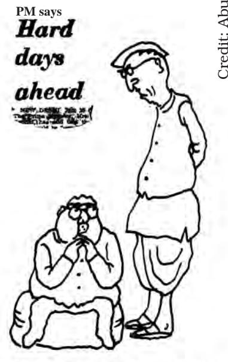

chap 6_PF.indd 93 8/5/2022 2:03:26 PM

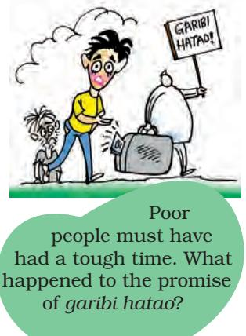

 *Sampoorna Kranti ab nara hai, bhavi itihas hamara hai [With Total Revolution as our motto, the future belongs to us] "* 

A slogan of the Bihar movement, 1974 *"* There was a general atmosphere of dissatisfaction with the prevailing economic situation all over the country. In such a context non-Congress opposition parties were able to organise popular protests effectively. Instances of students' unrests that had persisted from the late 1960s became more pronounced in this period. There was also an increase in the activities of Marxist groups who did not believe in parliamentary politics. These groups had taken to arms and insurgent techniques for the overthrow of the capitalist order and the established political system. Known as the Marxist-Leninist (now Maoist) groups or Naxalites, they were particularly strong in West Bengal, where the State government took stringent measures to suppress them.

#### *Gujarat and Bihar movements*

Students' protests in Gujarat and Bihar, both of which were Congress ruled States, had far reaching impact on the politics of the two States and national politics. In January 1974 students in Gujarat started an agitation against rising prices of food grains, cooking oil and other essential commodities, and against corruption in high places. The students' protest was joined by major opposition parties and became widespread leading to the imposition of President's rule in the state. The opposition parties demanded fresh elections to the state legislature. Morarji Desai, a prominent leader of Congress (O), who was the main rival of Indira Gandhi when he was in the Congress, announced that he would go on an indefinite fast if fresh elections were not held in the State. Under intense pressure from students, supported by the opposition political parties, assembly elections were held in Gujarat in June 1975. The Congress was defeated in this election.

In March 1974 students came together in Bihar to protest against rising prices, food scarcity, unemployment and corruption. After a point they invited Jayaprakash Narayan (JP), who had given up active politics and was involved in social work, to lead the student movement. He accepted it on the condition that the movement will

remain non-violent and will not limit itself to Bihar. Thus the students' movement assumed a political character and had national appeal. People from all walks of life now entered the movement. Jayaprakash Narayan demanded the dismissal of the Congress government in Bihar and gave a call for total revolution in the social, economic and political spheres in order to establish what he considered to be true democracy. A series of bandhs, gehraos, and strikes

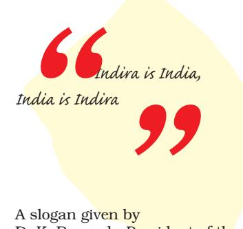

D. K. Barooah, President of the Congress, 1974

chap 6_PF.indd 94 8/5/2022 2:03:26 PM

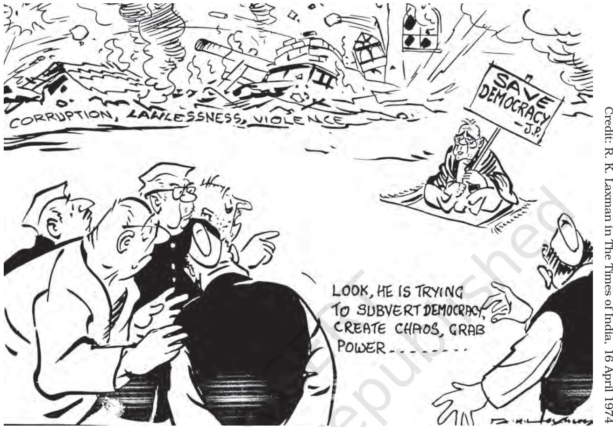

were organised in protest against the Bihar government. The government, however, refused to resign.

The movement was beginning to influence national politics. Jayaprakash Narayan wanted to spread the Bihar movement to other parts of the country. Alongside the agitation led by Jayaprakash Narayan, the employees of the Railways gave a call for a nationwide strike. This threatened to paralyse the country. In 1975, JP led a peoples' march to the Parliament. This was one of the largest political rallies ever held in the capital. He was now supported by the non-Congress opposition parties like the Bharatiya Jana Sangh, the Congress (O), the Bharatiya Lok Dal, the Socialist Party and others. These

**Loknayak Jayaprakash Narayan (JP) (1902-1979):** A marxist in his youth; founder general secretary of the Congress Socialist Party

and the Socialist Party; a hero of the 1942 Quit India movement; declined to join Nehru's cabinet; after 1955 quit active politics; became a Gandhian and was involved in the Bhoodan movement, negotiations with the Naga rebels, peace initiative in Kashmir and ensured the surrender of decoits in Chambal; leader of Bihar movement, he became the symbol of opposition to Emergency and was the moving force behind the formation of Janata Party.

chap 6_PF.indd 95 8/5/2022 2:03:27 PM

parties were projecting JP as an alternative to Indira Gandhi. However, there were many criticisms about his ideas and about the politics of mass agitations that he was employing. Both the Gujarat and Bihar agitations were seen as anti-Congress and rather than opposing the State governments, they were seen as protests against the leadership of Indira Gandhi. She believed that the movement was motivated by personal opposition to her.

### **Railway Strike of 1974**

What would happen when the railways stop running? Not for one or two days, but for more than a week? Of course, many people would be inconvenienced; but more than that, the economy of the country would come to a halt because goods are transported from one part to another by trains.

Do you know that such a thing actually happened in 1974? The National Coordination Committee for Railwaymen's Struggle led by George Fernandes gave a call for nationwide strike by all employees of the Railways for pressing their demands related to bonus and service conditions. The government was opposed to these demands. So, the employees of India's largest public sector undertaking went on a strike in May 1974. The strike by the Railway employees added to the atmosphere of labour unrest. It also raised issues like rights of the workers and whether employees of essential services should adopt measures like strikes.

The government declared the strike illegal. As the government refused to concede the demands of the striking workers, arrested many of their leaders and deployed the territorial army to protect railway tracks, the strike had to be called off after twenty days without any settlement.

Do 'committed judiciary' and 'committed bureaucracy' mean that the judges and government officials should be loyal to the ruling party?

#### *Conflict with Judiciary*

This was also the period when the government and the ruling party had many differences with the judiciary. Do you remember the discussion about the long drawn conflict between the Parliament and the judiciary? You have studied this last year. Three constitutional issues had emerged. Can the Parliament abridge Fundamental Rights? The Supreme Court said it cannot. Secondly, can the Parliament curtail the right to property by making an amendment? Again, the Court said that Parliament cannot amend the Constitution in such a manner that rights are curtailed. Thirdly, the Parliament amended the Constitution saying that it can abridge Fundamental Rights for giving effect to Directive Principles. But the Supreme Court rejected this provision also. This led to a crisis as far as the relations between the government and the judiciary were concerned. You may remember

chap 6_PF.indd 96 8/5/2022 2:03:27 PM

that this crisis culminated in the famous Kesavananda Bharati Case. In this case, the Court gave a decision that there are some basic features of the Constitution and the Parliament cannot amend these features.

Two developments further added to the tension between the judiciary and the executive. Immediately after the Supreme Court's decision in 1973 in the Keshavananda Bharati case, a vacancy arose for the post of the Chief Justice of India. It had been a practice to appoint the senior-most judge of the Supreme Court as the Chief Justice. But in 1973, the government set aside the seniority of three judges and appointed Justice A. N. Ray as the Chief Justice of India. The appointment became politically controversial because all the three judges who were superseded had given rulings against the stand of the government. Thus, constitutional interpretations and political ideologies were getting mixed up rapidly. People close to the Prime Minister started talking of the need for a judiciary and the bureaucracy 'committed' to the vision of the executive and the legislature. The climax of the confrontation was of course the ruling of the High Court declaring Indira Gandhi's election invalid.

### *Declaration of Emergency*

On 12 June 1975, Justice Jagmohan Lal Sinha of the Allahabad High Court passed a judgment declaring Indira Gandhi's election to the Lok Sabha invalid. This order came on an election petition filed by Raj Narain, a socialist leader and a candidate who had contested against her in 1971. The petition, challenged the election of Indira Gandhi on the ground that she had used the services of government servants in her election campaign. The judgment of the High Court meant that legally she was no more an MP and therefore, could not remain the Prime Minister unless she was once again elected as an MP within six months. On June 24, the Supreme Court granted her a partial stay on the High Court order – till her appeal was decided, she could remain an MP but could not take part in the proceedings of the Lok Sabha.

#### *Crisis and response*

The stage was now set for a big political confrontation. The opposition political parties led by Jayaprakash Narayan pressed for Indira Gandhi's resignation and organised a massive demonstration in Delhi's Ramlila grounds on 25 June 1975. Jayaprakash announced a nationwide satyagraha for her resignation and asked the army, the police and government employees not to obey "illegal and immoral orders". This too threatened to bring the activities of the government to a standstill. The political mood of the country had turned against the Congress, more than ever before.

That is like asking the army to disobey the government! Is that democratic?

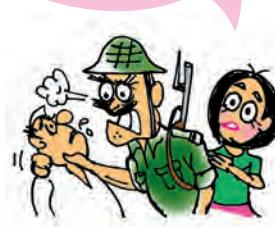

chap 6_PF.indd 97 8/5/2022 2:03:27 PM

The response of the government was to declare a state of emergency. On 25 June 1975, the government declared that there was a threat of internal disturbances and therefore, it invoked Article 352 of the Constitution. Under the provision of this article the government could declare a state of emergency on grounds of external threat or a threat of internal disturbances. The government decided that a grave crisis had arisen which made the proclamation of a state of emergency necessary. Technically speaking this was within the powers of the government, for our Constitution provides for some special powers to the government once an emergency is declared.

Once an emergency is proclaimed, the federal distribution of powers remains practically suspended and all the powers are concentrated in the hands of the union government. Secondly, the government also gets the power to curtail or restrict all or any of the Fundamental Rights during the emergency. From the wording of the provisions of the Constitution, it is clear that an Emergency is seen as an

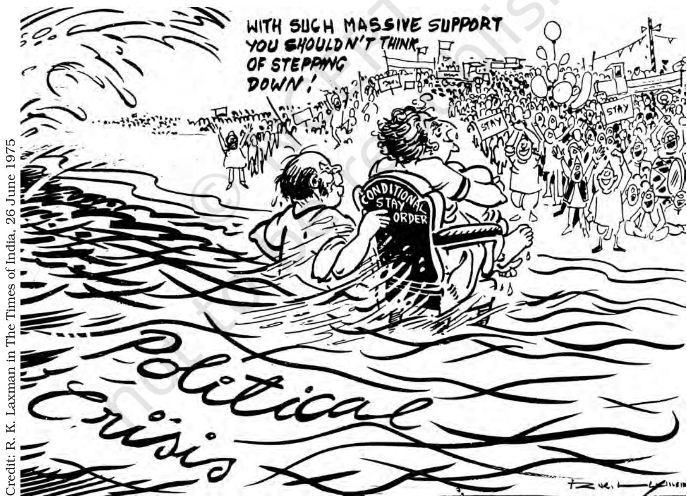

This cartoon appeared few days before the declaration of Emergency and captures the sense of impending political crisis. The man behind the chair is D. K. Barooah, the Congress President.

chap 6_PF.indd 98 8/5/2022 2:03:27 PM

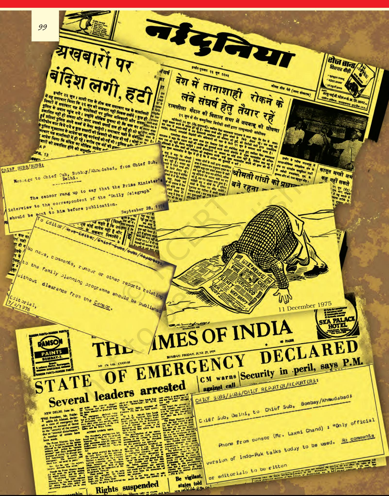

chap 6_PF.indd 99 8/5/2022 2:03:28 PM

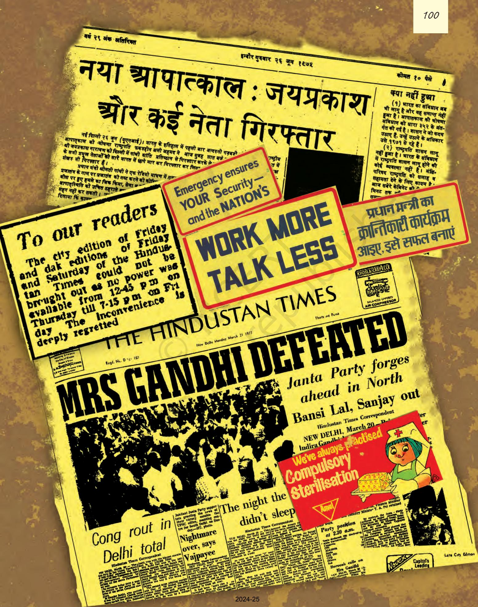

chap 6_PF.indd 100 8/5/2022 2:03:29 PM

extraordinary condition in which normal democratic politics cannot function. Therefore, special powers are granted to the government.

On the night of 25 June 1975, the Prime Minister recommended the imposition of Emergency to President Fakhruddin Ali Ahmed. He issued the proclamation immediately. After midnight, the electricity to all the major newspaper offices was disconnected. In the early morning, a large number of leaders and workers of the opposition parties were arrested. The Cabinet was informed about it at a special meeting at 6 a.m. on 26 June, after all this had taken place.

#### *Consequences*

This brought the agitation to an abrupt stop; strikes were banned; many opposition leaders were put in jail; the political situation became very quiet though tense. Deciding to use its special powers under Emergency provisions, the government suspended the freedom of the Press. Newspapers were asked to get prior approval for all material to be published. This is known as press censorship. Apprehending social and communal disharmony, the government banned Rashtriya Swayamsevak Sangh (RSS) and Jamait-e-Islami. Protests and strikes and public agitations were also disallowed. Most importantly, under the provisions of Emergency, the various Fundamental Rights of citizens stood suspended, including the right of citizens to move the Court for restoring their Fundamental Rights.

The government made extensive use of preventive detention. Under this provision, people are arrested and detained not because they have committed any offence, but on the apprehension that they may commit an offence. Using preventive detention acts, the government made large scale arrests during the Emergency. Arrested political workers could not challenge their arrest through habeas corpus petitions. Many cases were filed in the High Courts and the Supreme Court by and on behalf of arrested persons, but the government claimed that it was not even necessary to inform the arrested persons of the reasons and grounds of their arrest. Several High Courts gave judgments that even after the declaration of Emergency the courts could entertain a writ of habeas corpus filed by a person challenging his/her detention. In April 1976, the constitution bench of the Supreme Court over-ruled the High Courts and accepted the government's plea. It meant that during Emergency the government could take away the citizen's right to life and liberty. This judgment closed the doors of judiciary for the citizens and is regarded as one of the most controversial judgments of the Supreme Court.

There were many acts of dissent and resistance to the Emergency. Many political workers who were not arrested in the first wave, went 'underground' and organised protests against the government. Newspapers like the *Indian Express* and the *Statesman* protested against censorship by leaving blank spaces where news items had been censored. Magazines like the *Seminar* and the *Mainstream*

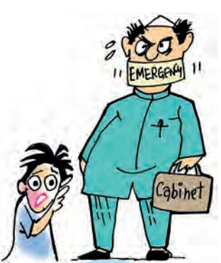

Should the President have declared Emergency without any recommendation from the Cabinet?

chap 6_PF.indd 101 8/5/2022 2:03:29 PM

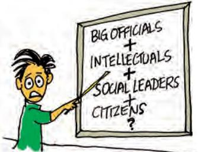

Let us not talk about the few who protested. What about the rest? All the big officials, intellectuals, social and religious leaders, citizens… What were they doing?

 *… death of D. E. M. O'Cracy, mourned by his wife T. Ruth, his son L. I. Bertie, and his daughters Faith, Hope and Justice. " "*

> An anonymous advertisement in the Times of India, soon after the declaration of Emergency, 1975.

chose to close down rather than submit to censorship. Many journalists were arrested for writing against the Emergency. Many underground newsletters and leaflets were published to bypass censorship. Kannada writer Shivarama Karanth, awarded with Padma Bhushan, and Hindi writer Fanishwarnath Renu, awarded with Padma Shri, returned their awards in protest against the suspension of democracy. By and large, though, such open acts of defiance and resistance were rare.

The Parliament also brought in many new changes to the Constitution. In the background of the ruling of the Allahabad High Court in the Indira Gandhi case, an amendment was made declaring that elections of Prime Minister, President and Vice-President could not be challenged in the Court. The forty-second amendment was also passed during the Emergency. You have already studied that this amendment consisted of a series of changes in many parts of the Constitution. Among the various changes made by this amendment, one was that the duration of the legislatures in the country was extended from five to six years. This change was not only for the Emergency period, but was intended to be of a permanent nature. Besides this, during an Emergency, elections can be postponed by one year. Thus, effectively, after 1971, elections needed to be held only in 1978; instead of 1976.

### *Lessons of the Emergency*

The Emergency at once brought out both the weaknesses and the strengths of India's democracy. Though there are many observers who think that India ceased to be democratic during the Emergency, it is noteworthy that normal democratic functioning resumed within a short span of time. Thus, one lesson of Emergency is that it is extremely difficult to do away with democracy in India.

Secondly, it brought out some ambiguities regarding the Emergency provision in the Constitution that have been rectified since. Now, 'internal' Emergency can be proclaimed only on the grounds of 'armed rebellion' and it is necessary that the advice to the President to proclaim Emergency must be given in writing by the Union Cabinet.

Thirdly, the Emergency made everyone more aware of the value of civil liberties. The Courts too, have taken an active role after the Emergency in protecting the civil liberties of the individuals. This is a response to the inability of the

 *Today is India's Independence Day…Don't Let the Lights Go Out on India's Democracy* An advertisement in The Times, London, 15 August 1975 by *" "*

'Free JP Campaign'.

chap 6_PF.indd 102 8/5/2022 2:03:29 PM

judiciary to protect civil liberties effectively during the emergency. Many civil liberties organisations came up after this experience.

However, the critical years of emergency brought many issues that have not been adequately grappled with. We have noted in this chapter that there is a tension between routine functioning of a democratic government and the continuous political protests by parties and groups. What is the correct balance between the two? Should the citizens have full freedom to engage in protest activity or should they have no such right at all? What are the limits to such a protest?

Secondly, the actual implementation of the Emergency rule took place through the police and the administration. These institutions could not function independently. They were turned into political instruments of the ruling party and according to the Shah Commission Report, the administration and the police became vulnerable to political pressures. This problem did not vanish after the Emergency.

### *Politics after Emergency*

The most valuable and lasting lesson of the Emergency was learnt

as soon as the Emergency was over and the Lok Sabha elections were announced. The 1977 elections turned into a referendum on the experience of the Emergency, at least in north India where the impact of the Emergency was felt most strongly. The opposition fought the election on the slogan of 'save democracy'. The people's verdict was decisively against the Emergency. The lesson was clear and has been reiterated in many state level elections thereafter–governments that are perceived to be anti-democratic are severely punished by the voters. In this sense the experience of 1975–77 ended up strengthening the foundations of democracy in India.

#### *Lok Sabha Elections, 1977*

In January 1977, after eighteen months of Emergency, the government decided to hold elections. Accordingly, all the leaders and activists were released from jails. Elections were held in March 1977. This left the opposition with very little time, but political developments took place very rapidly. The major opposition parties had already been coming closer in the pre-Emergency period. Now they came together on the eve of the elections and formed a new party, known as the Janata Party. The new party accepted the leadership of Jayaprakash Narayan. Some leaders of the Congress who were opposed to the Emergency also joined this new party.

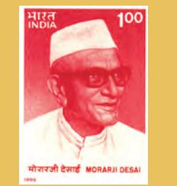

#### **Morarji Desai**

**(1896-1995):** Freedom fighter; a Gandhian leader; Proponenet of Khadi, naturopathy and prohibition; Chief Minister of Bombay State; Deputy Prime Minister (1967- 1969); joined Congress (O) after the split in the party; Prime Minister from 1977 to 1979—first Prime Minister belonging to a non-Congress party.

chap 6_PF.indd 103 8/5/2022 2:03:29 PM

Credit: R. K. Laxman in The Times of India 29 March 1977

A cartoonist's reading of who won and what was defeated in the 1977 election. Those standing with the common man include Jagjivan Ram, Morarji Desai, Charan Singh and Atal Behari Vajpayee.

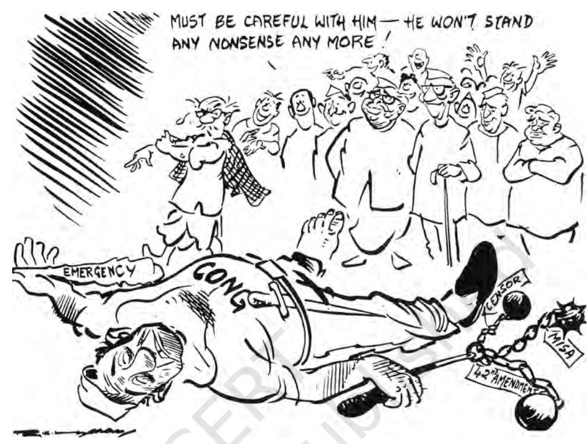

Some other Congress leaders also came out and formed a separate party under the leadership of Jagjivan Ram. This party named as Congress for Democracy, later merged with the Janata Party.

The Janata Party made this election into a referendum on the Emergency. Its campaign was focused on the non-democratic character of the rule and on the various excesses that took place during this period. In the backdrop of arrests of thousands of persons and the censorship of the Press, the public opinion was against the Congress. Jayaprakash Narayan became the popular symbol of restoration of democracy. The formation of the Janata Party also ensured that non-Congress votes would not be divided. It was evident that the going was tough for the Congress.

Yet the final results took everyone by surprise. For the first time since Independence, the Congress party was defeated in the Lok Sabha elections. The Congress could win only 154 seats in the Lok Sabha. Its share of popular votes fell to less than 35 per cent. The Janata Party and its allies won 330 out of the 542 seats in the Lok Sabha; Janata Party itself won 295 seats and thus enjoyed a clear majority. In north India, it was a massive electoral wave against the Congress. The Congress lost in every constituency in Bihar, Uttar Pradesh, Delhi, Haryana and the Punjab and could win only one seat each in Rajasthan and Madhya Pradesh. Indira Gandhi was defeated from Rae Bareli, as was her son Sanjay Gandhi from Amethi.

chap 6_PF.indd 104 8/5/2022 2:03:30 PM

But if you look at the map showing the result of this election, you will notice that Congress did not lose elections all over the country. It retained many seats in Maharashtra, Gujarat and Orissa and virtually swept through the southern States. There are many reasons for this. To begin with, the impact of Emergency was not felt equally in all the States. The forced relocation and displacements, the forced sterilisations, were mostly concentrated in the northern States. But more importantly, north India had experienced some long term changes in the nature of political competition. The middle castes from north India were beginning to move away from the Congress and the Janata party became a platform for many of these sections to come together. In this sense, the elections of 1977 were not merely about the Emergency.

#### *Janata Government*

The Janata Party government that came to power after the 1977 elections was far from cohesive. After the election, there was stiff competition among three leaders for the post of Prime Minister – Morarji Desai, who was the rival to Indira Gandhi ever since 1966-67; Charan Singh, leader of the Bharatiya Lok Dal and a farmers' leader from UP; and Jagjivan Ram, who had vast experience as a senior minister in the Congress governments. Eventually Morarji Desai became the Prime Minister but that did not bring the power struggle within the party to an end.

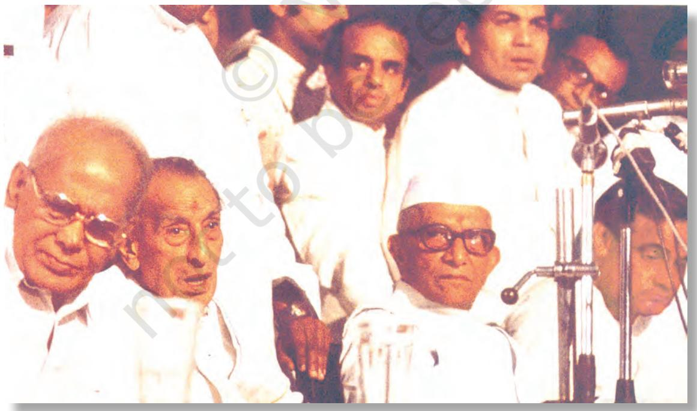

Oath taking by the first non-congress government at the centre in 1977. In the picture are Jayaprakash Narayan, J. B. Kriplani, Morarji Desai and Atal Behari Vajpayee.

chap 6_PF.indd 105 8/5/2022 2:03:31 PM

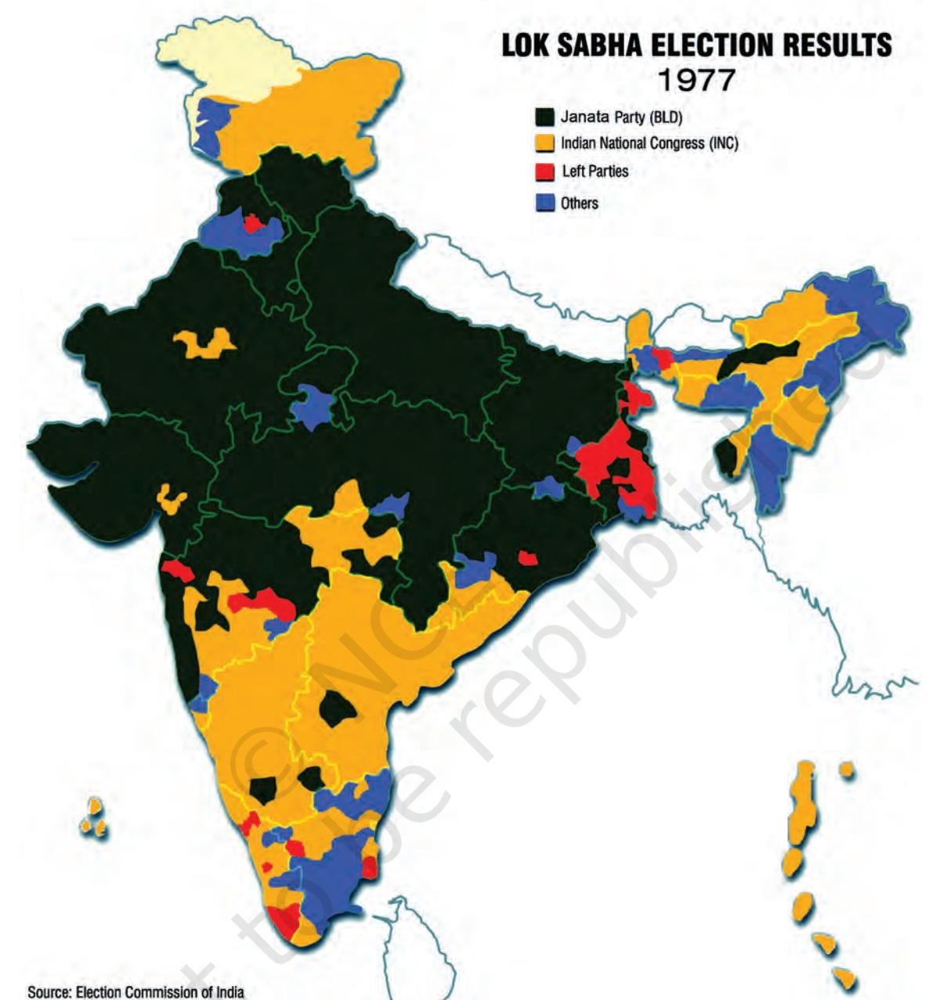

**Note:** This illustration is not a map drawn to scale and should not be taken to be an authentic depiction of India's external boundaries.

How can we talk about a mandate or verdict in 1977 when the north and the south voted so differently?

Read this map and identify the states where

- Congress lost,
- Congress lost very badly and
- those states where Congress and its allies nearly swept the polls.

Which are the constituencies in north India that the Congress managed to win?

chap 6_PF.indd 106 18-03-2024 12:34:26

Credit: R. K. Laxman in The Times of India, 13 November 1979

Credit: R. K. Laxman in the Times of India

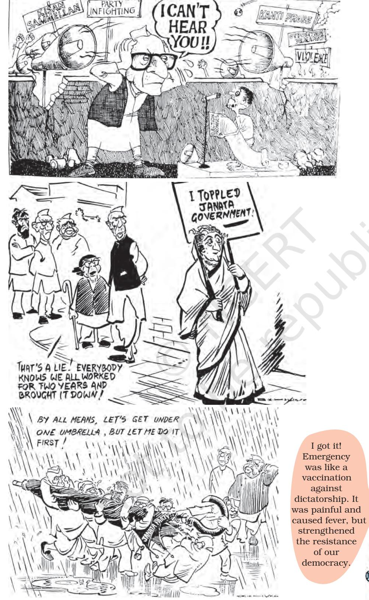

**Chaudhary Charan Singh (1902-1987):** Prime Minister of India between July1979 - January 1980; freedom fighter; active in the politics of Uttar Pradesh; proponent of rural and agricultural development; left Congress party and founded Bharatiya Kranti Dal in 1967; twice Chief Minister of U.P.; later he was one of the founders of the Janata Party in 1977 and became Deputy Prime Minister and Home Minister (1977-79); founder of Lok Dal.

Janata Party's faction fight inspired many cartoons at that time. Here is a selection.

chap 6_PF.indd 107 8/5/2022 2:03:32 PM

The opposition to emergency could keep the Janata Party together only for a while. Its critics felt that the Janata Party lacked direction, leadership, and a common programme. The Janata Party government could not bring about a fundamental change in policies from those pursued by the Congress. The Janata Party split and the government which was led by Morarji Desai lost its majority in less than 28 months. Another government headed by Charan Singh was formed on the assurance of the support of the Congress party. But the Congress party later decided to withdraw its support with the result that the Charan Singh government could remain in power for just about 4 months. Fresh Lok Sabha elections were held in January 1980 in which the Janata Party suffered a comprehensive defeat, especially in north India where it had swept the polls in 1977. Congress party led by Indira Gandhi nearly repeated its great victory in 1971. It won 353 seats and came back to power. The experience of

1977–79 taught another lesson in democratic politics: governments that are seen to be unstable and quarrelsome are severely punished by the voters.

#### *Legacy*

But was it only a case of return of Indira Gandhi? Between the elections of 1977 and 1980 the party system had changed dramatically. Since 1969, the Congress party had starting shedding its character as an umbrella party which accommodated leaders and workers of different ideological dispensations and view points. The Congress party now identified itself with a particular ideology, claiming to be the only socialist and pro-poor party. Thus with the early nineteen seventies, the Congress's political success depended on attracting people on the basis of sharp social and ideological divisions and the appeal of one leader, Indira Gandhi. With the change in the nature of the Congress party, other opposition parties relied more and more on what is known in Indian politics as 'non-Congressism'. They also realised the need to avoid a division of non-Congress votes in the election. This factor played a major role in the elections of 1977.

In an indirect manner the issue of welfare of the backward castes also began to dominate politics since 1977. As we saw above, the results of 1977 elections were at least partly due to a shift among the backward castes of north India. Following the Lok Sabha elections, many states also held Assembly elections in 1977. Again, the northern States elected non-Congress governments in which the leaders of the backward castes played an important role. The issue of reservations for 'other backward classes' became very controversial in Bihar and following this, the Mandal Commission was appointed by the Janata party

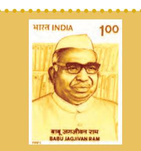

#### **Jagjivan Ram (1908–1986):**

Freedom fighter and Congress leader from Bihar; Deputy Prime Minister of India (1977-79); member of Constituent Assembly; also a Member of Parliament since 1952 till his death; Labour Minister in the first ministry of free India; held various other ministries from 1952 to 1977; a scholar and astute administrator.

chap 6_PF.indd 108 15-03-2024 15:52:38

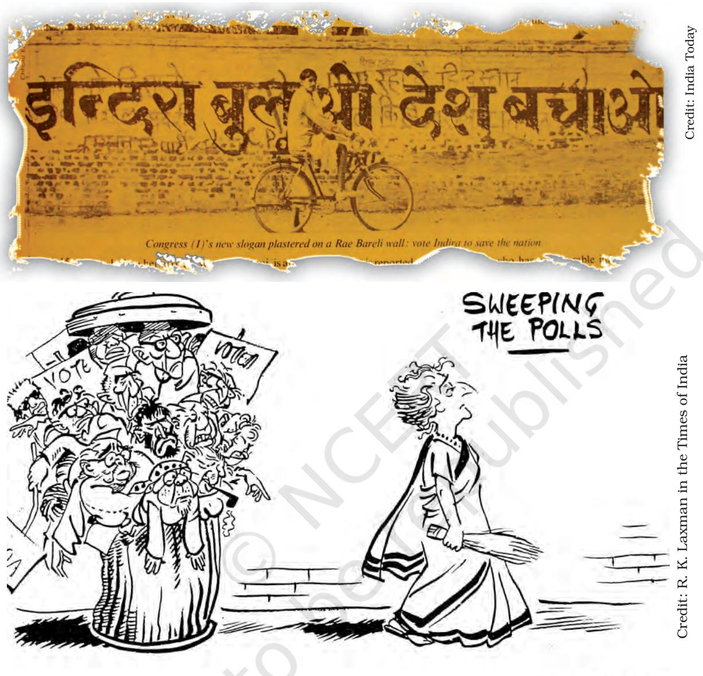

This cartoon appeared after the election results of 1980.

government at the centre. You will read more about this and about the role of the politics of backward castes, in the last chapter. The elections after the Emergency set off the process of this change in the party system.

The Emergency and the period around it can be described as a period of constitutional crisis because it had its origins in the constitutional battle over the jurisdiction of the Parliament and the judiciary. On the other hand, it was also a period of political crisis. The

chap 6_PF.indd 109 8/5/2022 2:03:33 PM

**Hazaron Khwaishein Aisi**

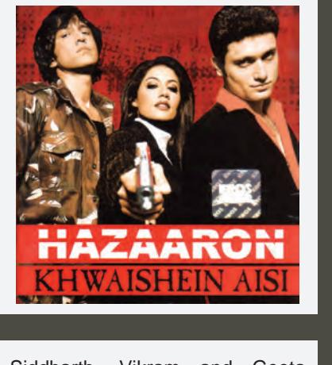

Siddharth, Vikram and Geeta are three spirited and socially engaged students. Graduating from Delhi, they follow different paths. While Siddharth is a strong supporter of the revolutionary ideology of social transformation, Vikram is in favour of achieving success in life, whatever the cost. The film narrates the story of their journeys towards their goals and the underlying disappointments.

The film is set in the backdrop of the seventies. The young characters are products of the expectations and idealism of that period. Siddharth is not successful in his ambition to stage a revolution, but is so involved in the plight of the poor that he begins valuing their uplift more than revolution. On the other hand, Vikram becomes a typical political fixer but is constantly ill at ease.

#### Year: 2005

Director: Sudhir Mishra Screenplay: Sudhir Mishra Ruchi Narain Shivkumar Subramaniam Cast: Kay Kay Menon, Shiney Ahuja, Chitrangada Singh

party in power had absolute majority and yet, its leadership decided to suspend the democratic process. The makers of India's Constitution trusted that all political parties would basically abide by the democratic norm. Even during the Emergency, when the government would use extraordinary powers, its use would be within the norms of the rule of law. This expectation led to the wide and open ended powers given to the government in times of Emergency. These were abused during the Emergency. This political crisis was more serious than the constitutional crisis.

Another critical issue that emerged during this period was the role and extent of mass protests in a parliamentary democracy. There was clearly a tension between institution-based democracy and democracy based on spontaneous popular participation. This tension may be attributed to the inability of the party system to incorporate the aspirations of the people. In the next chapter we shall study some of the manifestations of this tension, in particular, debates around regional identity.

chap 6_PF.indd 110 8/5/2022 2:03:34 PM

#### *The Crisis of Democratic Order 111 The Crisis of Democratic Order 111*

- 1. State whether the following statements regarding the Emergency are correct or incorrect.
	- (a) It was declared in 1975 by Indira Gandhi.
	- (b) It led to the suspension of all fundamental rights.
	- (c) It was proclaimed due to the deteriorating economic conditions.
- (d) Many Opposition leaders were arrested during the emergency.
	- (e) CPI supported the proclamation of the Emergency.
- 2. Find the odd one out in the context of proclamation of Emergency
	- (a) The call for 'Total Revolution.
	- (b) The Railway Strike of 1974
	- (c) The Naxalite Movement
	- (d) The Allahbad High Court verdict
	- (e) The findings of the Shah Commission Report
- 3. Match the following
	-
	- (b) Garibi hatao ii. Jayaprakash Narayan
	- (a) Total Revolution i. Indira Gandhi
	-
	- (c) Students' Protest iii. Bihar Movement
	- (d) Railway Strike iv. George Fernandes
- 4. What were the reasons which led to the mid-term elections in 1980?
- 5. The Shah Commission was appointed in 1977 by the Janata Party Government. Why was it appointed and what were its findings?
- 6. What reasons did the Government give for declaring a National Emergency in 1975?
- 7. The 1977 elections for the first time saw the Opposition coming into power at the Centre. What would you consider as the reasons for this development?
- 8. Discuss the effects of Emergency on the following aspects of our polity. • Effects on civil liberties for citizens.
- • Impact on relationship between the Executive and Judiciary
- • Functioning of Mass Media
- • Working of the Police and Bureaucracy.
- 9. In what way did the imposition of Emergency affect the party system in India? Elaborate your answer with examples.
- 10. Read the passage and answer the questions below:

*Indian democracy was never so close to a two-party system as it was during the 1977 elections. However, the next few years saw a complete change. Soon after its defeat, the Indian National Congress split into two groups……….. … … …The Janata Party also went through major convulsions…..David Butler, Ashok Lahiri and Prannoy Roy.* — Partha Chatterjee

- (a) What made the party system in India look like a two-party system in 1977?
- (b) Many more than two parties existed in 1977. Why then are the authors describing this period as close to a two-party system?
- (c) What caused splits in Congress and the Janata parties?

*EXERCISES*

chap 6_PF.indd 111 8/5/2022 2:03:34 PM

2024-25

