Regional aspirations are usually expressed in the language of the region and addressed to the local population or the rulers. This unusual poster from Uttarakhand movement appeals to all the Indian citizens in seven different languages and thus underscores the compatibility of the regional aspirations with nationalist sentiments.

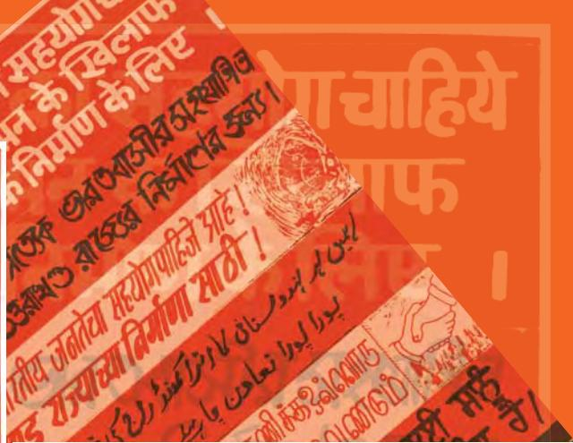

## In this chapter…

In the first chapter of this book we studied the process of 'nation-building' in the first decade after Independence. But nation-building is not something that can be accomplished once and for all times to come. In the course of time new challenges came up. Some of the old problems had never been fully resolved. As democratic experiment unfolded, people from different regions began to express their aspirations for autonomy. Sometimes these aspirations were expressed outside the framework of the Indian union. These involved long struggles and often aggressive and armed assertions by the people.

This new challenge came to the fore in the 1980s, as the Janata experiment came to an end and there was some political stability at the centre. This decade will be remembered for some major conflicts and accords in the various regions of the country, especially in Assam, the Punjab, Mizoram and the developments in Jammu and Kashmir. In this chapter we study these cases so as to ask some general questions.

- Which factors contribute to the tensions arising out of regional aspirations?
- How has the Indian state responded to these tensions and challenges?
- What kind of difficulties are faced in balancing democratic rights and national unity?
- What are the lessons here for achieving unity with diversity in a democracy?

chap 7_PF.indd 1 18-May-2023 11:30:11 AM

# regional aspirations

## Region and the Nation

1980s may be seen as a period of rising regional aspirations for autonomy, often outside the framework of the Indian Union. These movements frequently involved armed assertions by the people, their repression by the government, and a collapse of the political and electoral processes. It is also not surprising that most of these struggles were long drawn and concluded in negotiated settlements or accords between the central government and the groups leading the movement for autonomy. The accords were reached after a process of dialogue that aimed to settle contentious issues within the constitutional framework. Yet the journey to the accord was always tumultuous and often violent.

### *Indian approach*

In studying the Indian Constitution and the process of nation-building we have repeatedly come across one basic principle of the Indian approach to diversity – the Indian nation shall not deny the rights of different regions and linguistic groups to retain their own culture. We decided to live a united social life without losing the distinctiveness of the numerous cultures that constituted it. Indian nationalism sought to balance the principles of unity and diversity. The nation would not mean the negation of the region. In this sense the Indian approach was very different from the one adopted in many European countries where they saw cultural diversity as a threat to the nation.

India adopted a democratic approach to the question of diversity. Democracy allows the political expressions of regional aspirations

and does not look upon them as anti-national. Besides, democratic politics allows parties and groups to address the people on the basis of their regional identity, aspiration and specific regional problems. Thus, in the course of democratic politics, regional aspirations get strengthened. At the same time, democratic politics also means that regional issues and problems will receive adequate attention and accommodation in the policy making process.

Such an arrangement may sometimes lead to tensions and problems. Sometimes, the concern for national unity may overshadow the regional needs

Does it mean that regionalism is not as dangerous as communalism? Or may be, not dangerous at all?

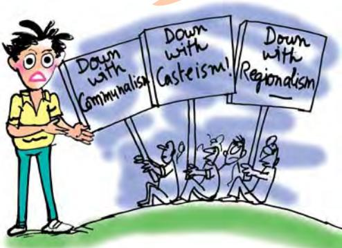

chap 7_PF.indd 2 18-May-2023 11:30:36 AM

and aspirations. At other times a concern for region alone may blind us to the larger needs of the nation. Therefore, political conflicts over issues of power of the regions, their rights and their separate existence are common to nations that want to respect diversity while trying to forge and retain unity.

#### *Areas of tension*

In the first chapter you have seen how immediately after Independence our nation had to cope with many difficult issues like Partition, displacement, integration of Princely States, reorganisation of states and so on. Many observers, both within the country and from outside, had predicted that India as one unified country cannot last long. Soon after Independence, the issue of Jammu and Kashmir came up. It was not only a conflict between India and Pakistan. More than that, it was a question of the political aspirations of the people of Kashmir valley. Similarly, in some parts of the north-east, there was no consensus about being a part of India. First Nagaland and then Mizoram witnessed strong movements demanding separation from India. In the south, some groups from the Dravid movement briefly toyed with the idea of a separate country.

These events were followed by mass agitations in many parts for the formation of linguistic States. Today's Andhra Pradesh, Karnataka, Maharashtra, and Gujarat were among the regions affected by these agitations. In some parts of southern India, particularly Tamil Nadu, there were protests against making Hindi the official national language of the country. In the north, there were strong pro-Hindi agitations demanding that Hindi be made the official language immediately. From the late 1950s, people speaking the Punjabi language started agitating for a separate State for themselves. This demand was finally accepted and the States of Punjab and Haryana were created in 1966. Later, the States of Chhattisgarh, Uttarakhand and Jharkhand were created. Thus the challenge of diversity was met by redrawing the internal boundaries of the country.

Yet this did not lead to resolution of all problems and for all times. In some regions, like Kashmir and Nagaland, the challenge was so complex that it could not be resolved in the first phase of nation-building. Besides, new challenges came up in States like Punjab, Assam and Mizoram. Let us study these cases in some detail. In this process let us also go back to some of the earlier instances of difficulties of nation building. The successes and failures in these cases are instructive not merely for a study of our past, but also for an understanding of India's future.

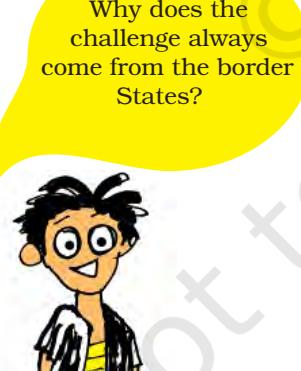

chap 7_PF.indd 3 18-May-2023 11:30:36 AM

### Jammu and Kashmir

As you have studied in the previous year, Jammu and Kashmir had a special status under Article 370 of the Indian Constitution. However, in spite of it, Jammu and Kashmir experienced violence, cross border terrorism and political instability with internal and external ramifications. It also resulted in the loss of many lives including that of innocent civilians, security personnel and militants. Besides, there was also a large scale displacement of Kashmiri Pandits from the Kashmir valley.

Jammu and Kashmir comprises three social and political regions — Jammu,

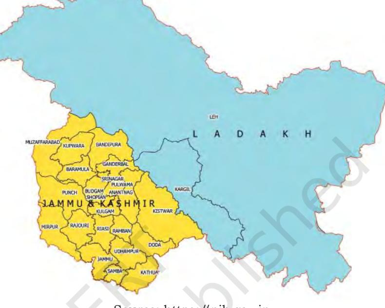

#### **Union Territories of Jammu & Kashmir and Ladakh**

Source: https://pib.gov.in

Kashmir and Ladakh. The Jammu region is a mix of foothills and plains. It is predominantly inhabited by the Hindus. Muslims, Sikhs and people of other denominations also reside in this region. The Kashmir region mainly comprises of the Kashmir valley. It is inhabited mostly by Kashmiri Muslims with the remaining being Hindus, Sikhs, Buddhists and others. The Ladakh region is mainly mountainous. It has very little population which is almost equally divided between Buddhists and Muslims.

#### *Roots of the Problem*

Before 1947, Jammu and Kashmir (J&K) was a Princely State. Its ruler, Maharaja Hari Singh did not want to merge either with India or Pakistan but to have an independent status for his state. The Pakistani leaders thought that Kashmir region 'belonged' to Pakistan, since the majority population of the State was Muslim. But this is not how the people of the state themselves saw it— they thought of themselves as Kashmiris above all. This issue of regional aspiration is known as Kashmiriyat. The popular movement in the State, led by Sheikh Abdullah of the National Conference, wanted to get rid of the Maharaja, but was against joining Pakistan. The National Conference was a secular organisation and had a long association with the Congress. Sheikh Abdullah was a personal friend of some of the leading nationalist leaders including Nehru.

chap 7_PF.indd 4 18-May-2023 11:30:36 AM

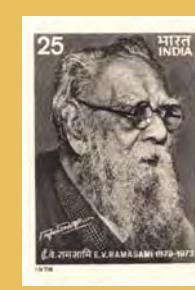

**E.V. Ramasami Naicker (1879-1973):** Known as Periyar (the respected); strong supporter of

atheism; famous for his anticaste struggle and rediscovery of Dravidian identity; initially a worker of the Congress party; started the self-respect movement (1925); led the anti-Brahmin movement; worked for the Justice party and later founded Dravidar Kazhagam; opposed to Hindi and domination of north India; propounded the thesis that north Indians and Brahmins are Aryans.

#### **Dravidian movement**

'*Vadakku Vaazhgiradhu; Therkku Thaeikiradhu*' [The north thrives even as the south decays]. This popular slogan sums up the dominant sentiments of one of India's most effective regional movements, the Dravidian movement, at one point of time. This was one of the first regional movements in Indian politics. Though some sections of this movement had ambitions of creating a Dravida nation, the movement did not take to arms. It used democratic means like public debates and the electoral platform to achieve its ends. This strategy paid off as the movement acquired political power in the State and also became influential at the national level.

The Dravidian movement led to the formation of Dravidar Kazhagam [DK] under the leadership of Tamil social reformer E.V. Ramasami 'Periyar'. The organisation strongly opposed the Brahmins' dominance and affirmed regional pride against the political, economic and cultural domination of the North. Initially, the Dravidian movement spoke in terms of

Credit: The Hindu

the whole of south India; however lack of support from other States limited the movement to Tamil Nadu. the whole of south India; how

The DK split and the political legacy of the movement was transferred to Dravida Munnetra Kazhagam (DMK). The DMK made its entry into politics with a three pronged agitation in 1953-54. First, it demanded the restoration of the original name of Kallakudi railway station which had been renamed Dalmiapuram, after an industrial house from the North. This demand brought out its opposition to the North Indian economic and cultural symbols. The second agitation was for political legacy of the rred toDravida MK). e d to mic he for

Anti-Hindi agitation in Tamil Nadu, 1965

chap 7_PF.indd 5 18-May-2023 11:30:37 AM

giving Tamil cultural history greater importance in school curricula. The third agitation was against the craft education scheme of the State government, which it alleged was linked to the Brahmanical social outlook. It also agitated against making Hindi the country's official language. The success of the anti-Hindi agitation of 1965 added to the DMK's popularity.

Sustained political agitations brought the DMK to power in the Assembly elections of 1967. Since then, the Dravidian parties have dominated the politics of Tamil Nadu. Though the DMK split after the death of its leader, C. Annadurai, the influence of Dravidian parties in Tamil politics actually increased. After the split there were two parties – the DMK and the All India Anna DMK (AIADMK) – that claimed Dravidian legacy. Both these parties have dominated politics in Tamil Nadu for the last four decades. Since 1996, one of these parties has been a part of the ruling coalition at the Centre. In the 1990s, many other parties have emerged. These include Marumalarchchi Dravida Munnetra Kazhagam (MDMK), Pattali Makkal Katchi (PMK) and Desiya Murpokku Dravidar Kazhagam (DMDK). All these parties have kept alive the issue of regional pride in the politics of Tamil Nadu. Initially seen as a threat to Indian nationalism, regional politics in Tamil Nadu is a good example of the compatibility of regionalism and nationalism.

chap 7_PF.indd 6 18-May-2023 11:30:40 AM

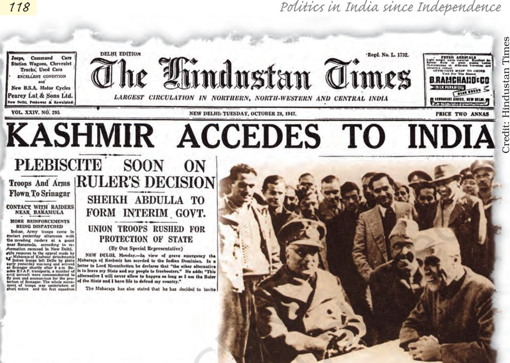

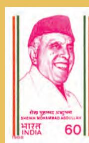

**Sheikh Mohammad Abdullah (1905-1982):**  Leader of Jammu and Kashmir; proponent of autonomy and secularism for

Jammu and Kashmir; led the popular struggle against princely rule; opposed to Pakistan due to its non-secular character; leader of the National Conference; Prime Minister of J&K immediately after its accession with India in 1947; dismissed and jailed by Government of India from 1953 to 1964 and again from 1965 to 1968; became Chief Minister of the State after an agreement with Indira Gandhi in 1974.

In October 1947, Pakistan sent tribal infiltrators from its side to capture Kashmir. This forced the Maharaja to ask for Indian military help. India extended the military support and drove back the infiltrators from Kashmir valley, but only after the Maharaja had signed an 'Instrument of Accession' with the Government of India. However, as Pakistan continued to control a sizeable part of the state, the issue was taken to the United Nations Organisation, which in its resolution dated 21 April 1948 recommended a three step process to resolve the issue. Firstly, Pakistan had to withdraw its entire nationalities, who entered into Kashmir. Secondly, India needed to progressively reduce its forces so as to maintain law and order. Thirdly, a plebiscite was to be conducted in a free and impartial manner. However, no progress could be achieved under this resolution. In the meanwhile, Sheikh Abdullah took over as the Prime Minister of the State of J&K in March 1948 while India agreed to grant it provisional autonomy under the Article 370. The head of the government in the State was then called Prime Minister.

chap 7_PF.indd 118 18-03-2024 14:28:02

#### *External and internal disputes*

Since then the politics of Jammu and Kashmir remained controversial and conflict-ridden both for external and internal reasons. Externally, Pakistan has always claimed that Kashmir valley should be part of Pakistan. As we noted above, Pakistan sponsored a tribal invasion of the State in 1947, as a consequence of which one part of the State came under Pakistani control. However, it is the Indian territory which is under illegal occupation of Pakistan called as Pakistan occupied Jammu and Kashmir (POJK). Ever since 1947, Kashmir has remained a major issue of conflict between India and Pakistan.

Let's watch a Film

Internally, there is a dispute about the status of Kashmir within Indian union. You have studied about the special provisions under Articles 370 and 371 last year in *Indian Constitution at Work*. This special status had provoked two opposite reactions. There is a section of people outside of J&K that believed that the special status of the State conferred by Article 370 did not allow full integration of the State with India. This section felt that Article 370 be revoked and J&K be treated like any other state of India.

Another section, mostly Kashmiris, believe that the autonomy conferred by Article 370 is not enough. They had at least three major grievances. First, the promise that Accession would be referred to the people of the State after the situation created by tribal invasion was normalised, has not been fulfilled. This generated the demand for a plebiscite. Secondly, there was a feeling that the special federal status guaranteed by Article 370, had been eroded in practice. This had led to the demand for restoration of autonomy or 'Greater State Autonomy'. Thirdly, it was felt that democracy which is practiced in the rest of India has not been similarly institutionalised in the State of Jammu and Kashmir.

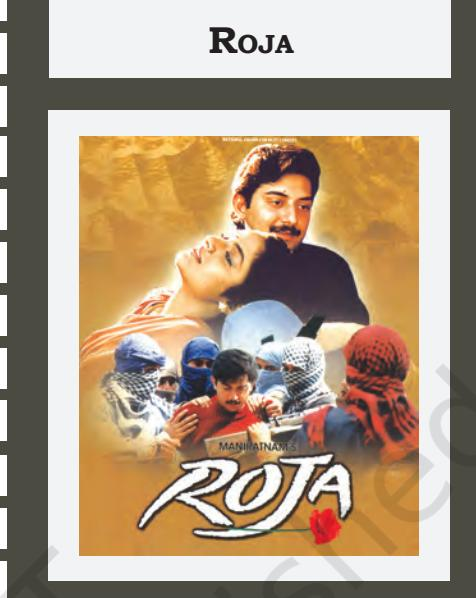

Tamil film depicting the travails of Roja, a newly wed and doting wife when her husband, Rishi, is abducted by militants. Rishi is a cryptologist who is assigned duty in Kashmir to decode the enem's messages. As love blossoms between the husband and the wife, the husband is kidnapped. The kidnappers demand that their jailed leader, be set free in exchange of Rishi.

Roja's world is shattered and she is seen knocking at the doors of officials and politicians. Since the film has the background of Indo-Pakistan dispute, it made instant appeal. The film was dubbed in Hindi and many other Indian languages.

Year: 1992 Director: Maniratnam Screenplay: Maniratnam Cast (Hindi version): Madhu, Arvind Swamy, Pankaj Kapoor, Janagaraj

chap 7_PF.indd 119 15-03-2024 16:00:37

#### *Politics since 1948*

After taking over as the Prime Minister, Sheikh Abdullah initiated major land reforms and other policies which benefitted ordinary people. But there was a growing difference between him and the central government about his position on Kashmir's status. He was dismissed in 1953 and kept in detention for a number of years. The leadership that succeeded him did not enjoy as much popular support and was able to rule the State mainly due to the support of the Centre. There were serious allegations of malpractices and rigging in various elections.

During most of the period between 1953 and 1974, the Congress party exercised influence on the politics of the State. A truncated National Conference (minus Sheikh Abdullah) remained in power with the active support of Congress for some time but later it merged with the Congress. Thus, the Congress gained direct control over the government in the state and brought about the changes. In the meanwhile, there were several attempts to reach an agreement between Sheikh Abdullah and the Government of India. A change in the provision of the Constitution of Jammu and Kashmir was made in 1965 by which the Prime Minister of the state was designated as Chief Minister of the state. Accordingly, Ghulam Mohammed Sadiq of the Indian National Congress became the first Chief Minister of the state.

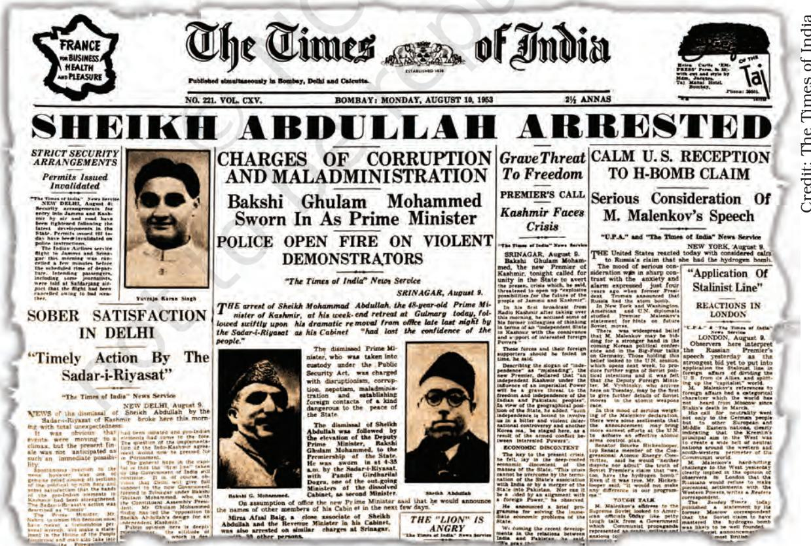

chap 7_PF.indd 120 18-03-2024 14:28:36

In 1974 Indira Gandhi reached an agreement with Sheikh Abdullah and he became the Chief Minister of the State. He revived the National Conference which was elected with majority in the assembly elections held in 1977. Sheikh Abdullah died in 1982 and the leadership of the National Conference went to his son, Farooq Abdullah, who became the Chief Minister. But he soon was dismissed by the Governor and a breakaway faction of the National Conference came to power for a brief period.

The dismissal of Farooq Abdullah's government due to the intervention of the Centre generated a feeling of resentment in Kashmir. The confidence that Kashmiris had developed in the democratic processes after the accord between Indira Gandhi and Sheikh Abdullah, received a setback. The feeling that the Centre was intervening in politics of the State was further strengthened when the National Conference in 1986 agreed to have an electoral alliance with the Congress, the ruling party in the Centre.

#### *Insurgency and After*

It was in this environment that the 1987 Assembly election took place. The official results showed a massive victory of the National Conference— Congress alliance and Farooq Abdullah returned as Chief Minister. But it was widely believed that the results did not reflect popular choice, and that the entire election process was rigged. A popular resentment had already been brewing in the State against the inefficient administration since early 1980s. This was now augmented by the commonly prevailing feeling that democratic processes were being undermined by the state at the behest of the Centre. This generated a political crisis in Kashmir which became severe with the rise of insurgency.

By 1989, the State had come in the grip of a militant movement mobilised around the cause of a separate Kashmiri nation. The insurgents got moral, material and military support from Pakistan. For a number of years the State was under President's rule and effectively under the control of the armed forces. Throughout the period from 1990, Jammu and Kashmir experienced extraordinary violence at the hands of the insurgents and through army action. Assembly elections in the State were held only in 1996 in which the National Conference led by Farooq Abdullah came to power with a demand for regional autonomy for Jammu and Kashmir. At the end of its term, elections were held in the State in 2002. The National Conference failed to win a majority and was replaced by a coalition government of People's Democratic Party (PDP) and Congress.

#### *2002 and Beyond*

As per the coalition agreement, Mufti Mohammed headed the government for the first three years succeeded by Ghulam Nabi Azad

chap 7_PF.indd 10 18-May-2023 11:30:43 AM

#### This is all about governments, officials, leaders, terrorists… but what about the people in Jammu and Kashmir? In a democracy we must go by what they want, shouldn't we?

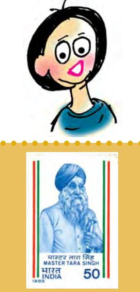

**Master Tara Singh (1885–1967):** 

Prominent Sikh religious and political leader; one of the early leaders of the Shiromani Gurudwara Prabandhak Committee (SGPC); leader of the Akali movement; supporter of the freedom movement but opposed to Congress' policy of negotiating only with the Muslims; after Independence, he was the senior most advocate of formation of separate Punjab State.

of the Indian National Congress who however could not complete the term as president rule was imposed in the state in July 2008. The next election was held in November-December 2008. Another coalition government (composed of NC and INC) came into power headed by Omar Abdullah in 2009. However, the state continued to witness disturbances led by the Hurriyat Conference. In 2014, the state went into another election, which recorded the highest voters' turnout in 25 years. Consequently a coalition government led by Mufti Mohammed Sayeed of the PDP came into power with the BJP as its partner. After Mufti Mohammed Sayeed died, his daughter Mahbooba Mufti became the first woman Chief Minister of the state in April 2016. During the tenure of Mahbooba Mufti, major acts of terrorism, mounting external and internal tensions were witnessed. The President's rule was imposed in June 2018 after BJP withdrew its support to the Mufti government. On 5 August 2019, Article 370 was abolished by the Jammu & Kashmir Reorganisation Act 2019 and the state was constituted into two Union Territories, viz., Jammu & Kashmir and Ladakh.

Jammu & Kashmir and Ladakh are living examples of plural society in India. Not only are there diversities of all kind (religious, cultural, linguistic, ethnic and tribal) but there are also divergent political and developmental aspirations, which have been sought to be achieved by the latest Act.

### Punjab

The decade of 1980s also witnessed major developments in the State of Punjab. The social composition of the State changed first with Partition and later on after the carving out of Haryana and Himachal Pradesh. While the rest of the country was reorganised on linguistic lines in 1950s, Punjab had to wait till 1966 for the creation of a Punjabi speaking State. The Akali Dal, which was formed in 1920 as the political wing of the Sikhs, had led the movement for the formation of a 'Punjabi suba'. The Sikhs were now a majority in the truncated State of Punjab.

### *Political context*

After the reorganisation, the Akalis came to power in 1967 and then in 1977. On both the occasions it was a coalition government. The Akalis discovered that despite the redrawing of the boundaries, their political position remained precarious. Firstly, their government was dismissed by the Centre mid-way through its term. Secondly, they did not enjoy strong support among the Hindus. Thirdly, the Sikh community, like all other religious communities, was internally differentiated on caste and class lines. The Congress got more support among the Dalits, whether Hindu or Sikh, than the Akalis.

chap 7_PF.indd 11 18-May-2023 11:30:43 AM

It was in this context that during the 1970s a section of Akalis began to demand political autonomy for the region. This was reflected in a resolution passed at their conference at Anandpur Sahib in 1973. The Anandpur Sahib Resolution asserted regional autonomy and wanted to redefine centre-state relationship in the country. The resolution also spoke of the aspirations of the Sikh *qaum* (community or nation) and declared its goal as attaining the *bolbala* (dominance or hegemony) of the Sikhs. The Resolution was a plea for strengthening federalism in India.

The Resolution had a limited appeal among the Sikh masses. A few years later, after the Akali government had been dismissed in 1980, the Akali Dal launched a movement on the question of the distribution of water between Punjab and its neighbouring States. A section of the religious leaders raised the question of autonomous Sikh identity.

#### *Cycle of violence*

Soon, the leadership of the movement passed from the moderate Akalis to the extremist elements and took the form of armed insurgency. These militants made their headquarters inside the Sikh holy shrine, the Golden Temple in Amritsar, and turned it into an armed fortress. In June 1984, the Government of India carried out 'Operation Blue Star', code name for army action in the Golden Temple. In this operation, the government could successfully flush out the militants, but it also damaged the historic temple and deeply hurt the sentiments of the Sikhs. A large proportion of Sikhs in India and abroad saw the military operation as an attack on their faith and this gave further impetus to militant and extremist groups.

Still more tragic turn of events complicated the Punjab problem further. Prime Minister Indira Gandhi was assassinated on 31 October 1984 outside her residence by her

**Sant Harchand Singh Longowal (1932–1985):**  Sikh political and religious leader; began his political career in mid-sixties as an Akali leader; became president of Akali Dal in 1980; reached an agreement with Prime Minister Rajiv Gandhi on key demands of Akalis; assassinated by unidentified Sikh youth.

bodyguards. Both the assassins were Sikhs and wanted to take revenge for Operation Blue Star. While the entire country was shocked by this development, in Delhi and in many parts of northern India violence broke out against the Sikh community. The violence against the Sikhs

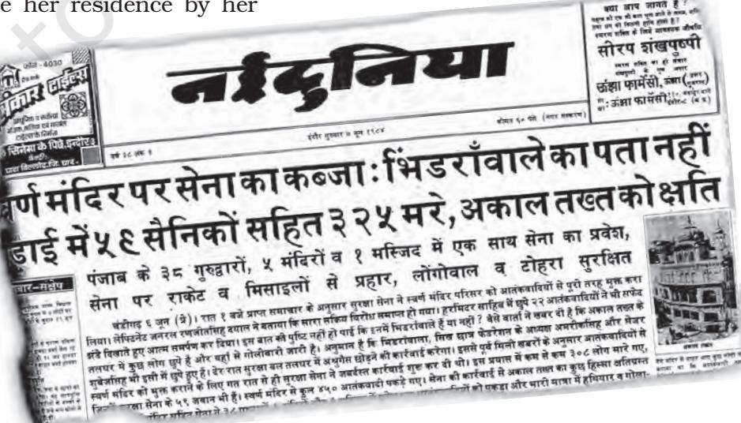

chap 7_PF.indd 123 15-03-2024 16:01:45

 Th ere is also evidence to show that on 31-10-84 either meet ings were held or persons wh o could organise att acks were contacted and were given instructions to kill Sikhs and loot their houses and shops. Th e att acks were made in a sy stematic manner and without much fear of the police, almost sugg es ting that they were ass ured that they would not be harmed wh ile committ ing those acts or *"* 

even aft er.

Justice Nanavati Commission of Inquiry, Report, Vol. I, 2005

*"*

continued for almost a week. More than two thousand Sikhs were killed in the national capital, the area worst affected by this violence. Hundreds of Sikhs were killed in other parts of the country, especially in places like Kanpur, Bokaro and Chas. Many Sikh families lost their male members and thus suffered great emotional and heavy financial loss. What hurt the Sikhs most was that the government took a long time in restoring normalcy and that the perpetrators of this violence were not effectively punished. Twenty years later, speaking in the Parliament in 2005, Prime Minister Manmohan Singh expressed regret over these killings and apologised to the nation for the anti-Sikh violence. e e e e. n ly nd eir ed ial was me the not ears t in han hese ation

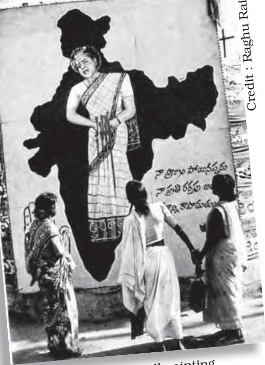

Women looking at a wall painting depicting Indira Gandhi's assassination.

chap 7_PF.indd 13 18-May-2023 11:30:44 AM

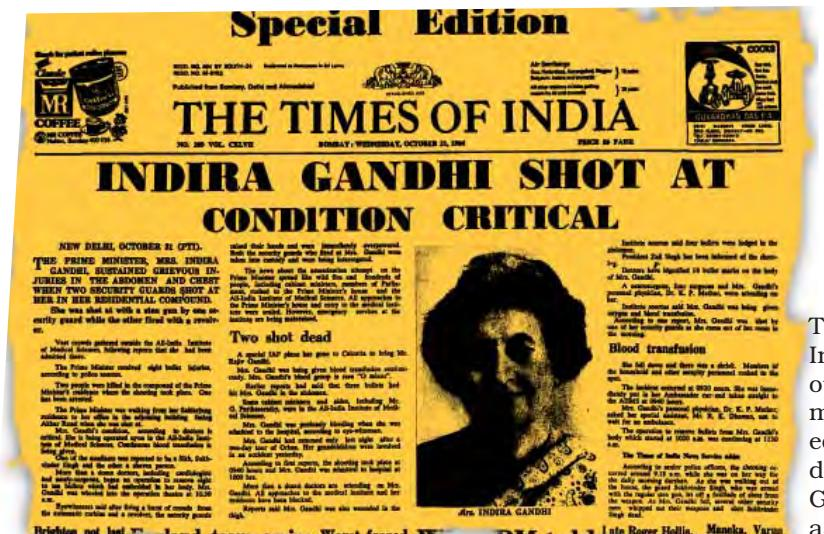

The Times of India brought out a special mid-day edition on the day Indira Gandhi was assassinated.

#### *Road to peace*

Credit : Times of India

After coming to power following the election in 1984, the new Prime Minister Rajiv Gandhi initiated a dialogue with moderate Akali leaders. In July 1985, he reached an agreement with Harchand Singh Longowal, then the President of the Akali Dal. This agreement, known as the Rajiv Gandhi - Longowal Accord or the Punjab Accord, was a step towards bringing normalcy to Punjab. It was agreed that Chandigarh would be transferred to Punjab, a separate commission would be appointed to resolve the border dispute between Punjab and Haryana, and a tribunal would be set up to decide the sharing of Ravi-Beas river water among Punjab, Haryana and Rajasthan. The agreement also provided for compensation to and better treatment of those affected by the militancy in Punjab and the withdrawal of the application of Armed Forces Special Powers Act in Punjab.

However, peace did not come easily or immediately. The cycle of violence continued nearly for a decade. Militancy and counter insurgency violence led to excesses by the police and violations of human rights. Politically, it led to fragmentation of the Akali Dal. The central government had to impose President's rule in the State and the normal electoral and political process was suspended. It was not easy to restore the political process in the atmosphere of suspicion and violence. When elections were held in Punjab in 1992, only 24 per cent of the electors tuned out to vote.

Militancy was eventually eradicated by the security forces. But the losses incurred by the people of Punjab – Sikhs and Hindus alike – were enormous. Peace returned to Punjab by the middle of 1990s. The alliance of Akali Dal (Badal) and the BJP scored a major victory in1997, in the first normal elections in the State in the post-militancy era. The State is once again preoccupied with questions of economic development and social change. Though religious identities continue to be important for the people, politics has gradually moved back along secular lines.

 I have no hes itation in apologising not only to the Sikh community but the wh ole Indian nation bec ause wh at took place in 1984 is the negation of the concept of nationhood and wh at is enshrined in our Constitution. So, I am not standing on any false pres tige. On behalf of our Government, on behalf of the entire people of this country, I bow my head in shame that such thing took place. But, Sir, there are ebbs, there are tides in the aff airs of nations. Th e past is with us. We cannot rewrite the past. But as human beings, we have the willpower and we have the ability to write bett er future for all *"* 

Prime Minister Dr. Manmohan Singh intervening in Rajya Sabha debate on 11 August 2005

chap 7_PF.indd 14 18-May-2023 11:30:45 AM

### *The North-East*

In the North-East, regional aspirations reached a turning point in 1980s. This region now consists of eight States. Arunachal Pradesh, Assam, Nagaland, Manipur, Tripura, Mizoram and Meghalaya, which earlier constituted the North-East region, are often called "the seven sisters". Sikkim, which has been added to the list is– referred to as the 'Brother' to those seven states. The region has only 4 per cent of the country's population but about twice as much share of its area. A small corridor of about 22 kilometers connects the region to the rest of the country. Otherwise the region shares boundaries with China, Myanmar and Bangladesh and serves as India's gateway to South East Asia.

The region has witnessed a lot of change since 1947. Tripura, Manipur and Khasi Hills of Meghalaya were erstwhile Princely States which merged with India after Independence. The entire region of North-East has undergone considerable political reorganisation. Nagaland State was created in 1963; Manipur, Tripura and Meghalaya in 1972 while Mizoram and Arunachal Pradesh became separate States only in 1987. The Partition of India in 1947 had reduced the North-East to a land locked region and affected its economy. Cut off from the rest of India, the region suffered neglect in developmental terms. Its politics too remained insulated. At the same time, most States in this region underwent major demographic changes due to influx of migrants from neighbouring States and countries.

The isolation of the region, its complex social character and its backwardness compared to other parts of the country have all resulted

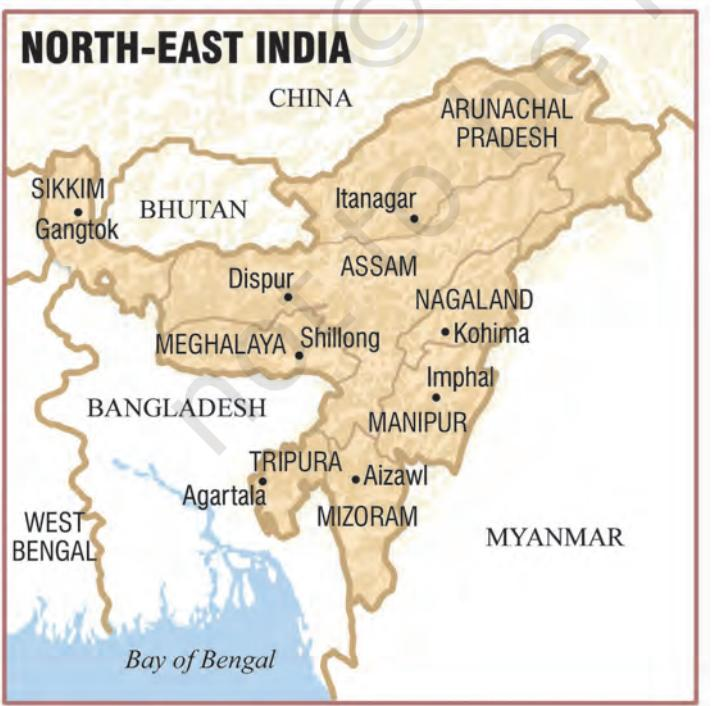

in the complicated set of demands from different states of the North-East. The vast international border and weak communication between the North-East and the rest of India have further added to the delicate nature of politics there. Three issues dominate the politics of North-East: demands for autonomy, movements for secession, and opposition to 'outsiders'. Major initiatives on the first issue in the 1970s set the stage for some dramatic developments on the second and the third in the 1980s.

#### *Demands for autonomy*

At independence the entire region except Manipur and Tripura comprised the State of Assam. Demands for political autonomy arose when the non-Assamese felt that the Assam government was imposing Assamese language on them.

**Note:** This illustration is not a map drawn to scale and should not be taken to be an authentic depiction of India's external boundaries.

There were opposition and protest riots throughout the State. Leaders of the major tribal communities wanted to separate from Assam. They formed the Eastern India Tribal Union which later transformed into a more comprehensive All Party Hill Leaders Conference in 1960. They demanded a tribal State to be carved out of Assam. Finally instead of one tribal State, several States got carved out of Assam. At different points of time the Central Government had to create Meghalaya, Mizoram and Arunachal Pradesh out of Assam. Tripura and Manipur were upgraded into States too.

The reorganisation of the North-East was completed by 1972. But this was not the end of autonomy demands in this region. In Assam, for example, communities like the Bodos, Karbis and Dimasas wanted separate States. They worked for this demand by mobilising public opinion and popular movement as well as through insurgency. Often the same area was claimed by more than one community. It was not possible to go on making smaller and yet smaller States. Therefore, some other provisions of our federal set up were used to satisfy their autonomy demands while remaining in Assam. Karbis and Dimasas have been granted autonomy under District Councils while Bodos were recently granted Autonomous Council.

#### *Secessionist movements*

Demands for autonomy were easier to respond to, for these involved using the various provisions in the Constitution for accommodation of diversities. It was much more difficult when some groups demanded a separate country, not in momentary anger but consistently as a principled position. The country's leadership faced this problem for a very long time in at least two States in the North-East. A comparison of these two cases offers us a lesson in democratic politics.

After independence, the Mizo Hills area was made an autonomous district within Assam. Some Mizos believed that they were never a part of British India and therefore did not belong to the Indian union. But the movement for secession gained popular support after the Assam government failed to respond adequately to the great famine of 1959 in Mizo hills. The Mizos' anger led to the formation of the Mizo National Front (MNF) under the leadership of Laldenga.

In 1966 the MNF started an armed campaign for independence. Thus, started a two decade long battle between Mizo insurgents and the Indian army. The MNF fought a guerilla war, got support from Pakistani government and secured shelter in the then East Pakistan. The Indian security forces countered it with a series of repressive measures of which the common people were the victims. At one point even Air Force was used. These measures caused more anger and alienation among the people.

At the end of two decades of insurgency everyone was a loser. This is where maturity of the political leadership at both ends made

My friend Chon said that people in Delhi know more about the map of Europe than about the North-East in our country. I think she is right at least about my schoolmates.

**Laldenga (1937-1990):**  Founder and leader of the Mizo National Front; turned into a rebel after the experience of the famine in 1959; led an armed struggle against India for two decades; reached a settlement and signed an agreement with Prime Minister Rajiv Gandhi in 1986; became the chief minister of the newly created State of Mizoram.

chap 7_PF.indd 127 15-03-2024 16:06:30

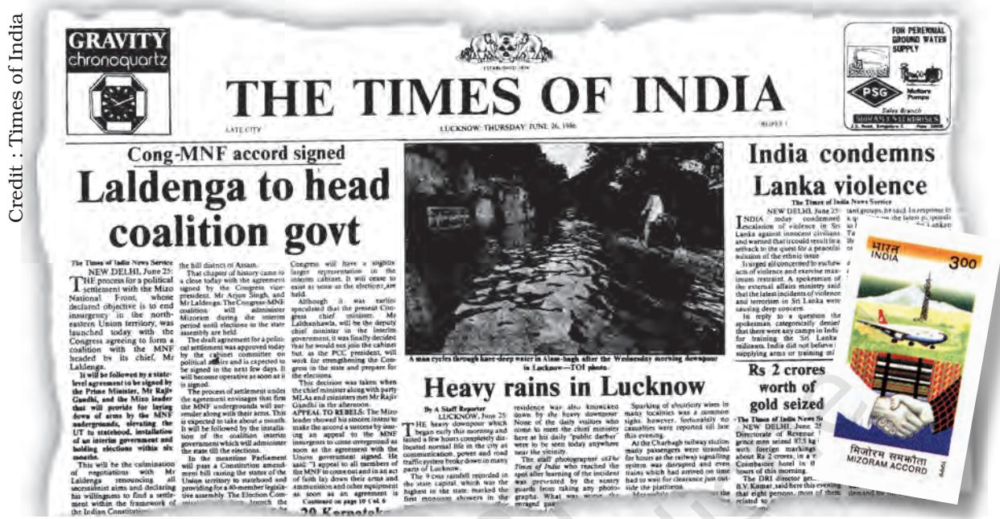

a difference. Laldenga came back from exile in Pakistan and started negotiations with the Indian government. Rajiv Gandhi steered these negotiations to a positive conclusion. In 1986 a peace agreement was signed between Rajiv Gandhi and Laldenga. As per this accord Mizoram was granted full-fledged statehood with special powers and

Declaration of cease fire by MNF

the MNF agreed to give up secessionist struggle. Laldenga took over as the Chief Minister. This accord proved a turning point in the history of Mizoram. Today, Mizoram is one of the most peaceful places in the region and has taken big strides in literacy and development.

> The story of Nagaland is similar to Mizoram, except that it started much earlier and has not yet had such a happy ending. Led by Angami Zapu Phizo, a section of the Nagas declared independence from India way back in 1951. Phizo turned down many offers of negotiated settlement. The Naga National Council launched an armed struggle for sovereignty of Nagas. After a period of violent insurgency a section of the Nagas signed an agreement with the government of India

chap 7_PF.indd 128 18-03-2024 14:28:53

but this was not acceptable to other rebels. The problem in Nagaland still awaits a final resolution.

#### *Movements against outsiders*

The large scale migration into the North-East gave rise to a special kind of problem that pitted the 'local' communities against people who were seen as 'outsiders' or migrants. These latecomers, either from India or abroad are seen as encroachers on scarce resources like land and potential competitors to employment opportunities and political power. This issue has taken political and sometimes violent form in many States of the North-East. l r t

The Assam Movement from 1979 to 1985 is the best example of such movements against 'outsiders'. The Assamese suspected that there were huge numbers of illegal Bengali Muslim settlers from Bangladesh. They felt that unless these foreign nationals are detected and deported they would reduce the indigenous Assamese into a minority. There were other economic issues too. There was widespread poverty and unemployment in Assam despite the existence of natural resources like oil, tea and coal. It was felt that these were drained out of the State without any commensurate benefit to the people. t

In 1979 the All Assam Students' Union (AASU), a students' group not affiliated to any party, led an anti-foreigner movement. The movement was against illegal migrations, against domination of Bengalis and other outsiders, and against faulty voters' register that included the names of lakhs of immigrants. The movement demanded that all outsiders who had entered the State after 1951 should be sent back. The agitation followed many novel methods and mobilised all sections of Assamese people, drawing support across the State. It also involved many tragic and violent incidents leading to loss of property and human lives. The movement also tried to blockade the movement of trains and the supply of oil from Assam to refineries in Bihar. n r t

Eventually after six years of turmoil, the Rajiv Gandhi-led government entered into negotiations with the AASU leaders, leading to the signing of an accord in 1985. According to this agreement those foreigners who migrated into Assam during and after Bangladesh war and since, were to be identified and deported. With the successful completion of the movement, the AASU and the Asom Gana Sangram Parishad organised themselves as a regional political party called Asom Gana Parishad (AGP). It came to power in 1985 with the promise of resolving the foreign national problem as well as to build a 'Golden Assam'.

Assam accord brought peace and changed the face of politics in Assam, but it did not solve the problem of immigration. The issue of the 'outsiders' continues to be a live issue in the politics of Assam

**Angami Zapu Phizo (1904-1990):**  Leader of the movement for independent Nagaland; president of Naga National Council; began an armed struggle against the Indian state; went 'underground', stayed in Pakistan and spent the last three decades of his life in exile in UK.

I've never understood this insider-outsider business. It's like the train compartment. Someone who got in before others treats others as outsiders.

chap 7_PF.indd 18 18-May-2023 11:30:46 AM

and many other places in the North-East. This problem is particularly acute, for example, in Tripura as the original inhabitants have been reduced to being a minority in their own land. The same feeling informs the hostility of the local population to Chakma refugees in Mizoram and Arunachal Pradesh.

To end the news, here is a look at the activities of terrorists in the four regions... Punjab, Darjeeling, Delhi, Mizoram Credit: HT book of Cartoon Rambabu Mathur

chap 7_PF.indd 19 18-May-2023 11:30:47 AM

#### **Sikkim's merger**

At the time of independence, Sikkim was a 'protectorate' of India. It meant that while it was not a part of India, it was also not a fully sovereign country. Sikkim's defence and foreign relations were looked after by India, while the power of internal administration was with the Chogyal, Sikkim's monarch. This arrangement ran into difficulty as the Chogyal was unable to deal with the democratic aspirations of the people. An overwhelming majority of Sikkim's population was Nepali. But the Chogyal was seen as perpetuating the rule of a small elite from the minority Lepcha-Bhutia community. The anti-Chogyal leaders of both the communities sought and got support from the government of India.

The first democratic elections to Sikkim assembly in 1974 were swept by Sikkim Congress which stood for greater integration with India. The assembly first sought the status of 'associate state' and then in April 1975 passed a resolution asking for full integration with India. This was followed by a hurriedly organised referendum that put a stamp of popular approval on the assembly's request. The Indian Parliament accepted this request immediately and Sikkim became the 22nd State of the Indian union. Chogyal did not accept this merger and his supporters accused the government of India of foul play and use of force. Yet the merger enjoyed popular support and did not become a divisive issue in Sikkim's politics.

**Kazi Lhendup Dorji Khangsarpa (1904):**  Leader of democracy movement in Sikkim; founder of Sikkim Praja Mandal and later leader of the Sikkim State Congress; in 1962 founded the Sikkim National Congress; after an electoral victory, he led the movement for integration of Sikkim with India; after the integration, Sikkim Congress merged with the Indian National Congress.

### *Accommodation and National Integration*

These cases have shown us that even after 75 years of independence, some of the issues of national integration are not fully resolved. We have seen that regional aspirations ranging from demands of statehood and economic development to autonomy and separation keep coming up. The period since 1980 accentuated these tensions and tested the capacity of democratic politics to accommodate the demands of diverse sections of the society. What lessons can we draw from these examples?

First and the most elementary lesson is that regional aspirations are very much a part of democratic politics. Expression of regional issues is not an aberration or an abnormal phenomenon. Even in smaller countries like the United Kingdom there are regional aspirations in Scotland, Wales and Northern Ireland. Spain faces secessionist movement from the Basques and so does Sri Lanka from the Tamils. A large and diverse democracy like India must deal with regional aspirations on a regular basis. Nation building is an ongoing process.

chap 7_PF.indd 131 15-03-2024 16:09:59

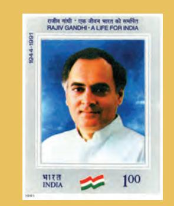

**Rajiv Gandhi (1944–1991):** Prime Minister of India between 1984 and 1989; son of Indira Gandhi; joined active politics after 1980; reached agreements with militants in Punjab, Mizoram and the students' union in Assam; pressed for a more open economy and computer technology; sent Indian Army contingent on the request of Sri Lankan government, to sort out the Sinhala-Tamil conflict; assassinated by suspected LTTE suicide bomber.

The second lesson is that the best way to respond to regional aspirations is through democratic negotiations rather than through suppression. Look at the situation in the eighties–militancy had erupted in Punjab; problems were persisting in the North-East; students in Assam were agitating; Kashmir valley was on the boil. Instead of treating these as simple law and order problems, the Government of India reached negotiated settlement with regional movements. This produced a reconciliation which reduced the tensions existing in many regions. The example of Mizoram shows how political settlement can resolve the problem of separatism effectively.

The third lesson is about the significance of power sharing. It is not sufficient to have a formal democratic structure. Besides that, groups and parties from the region need to be given share in power at the State level. Similarly, it is not sufficient to say that the states or the regions have autonomy in their matters. The regions together form the nation. So, the regions must have a share in deciding the destiny of the nation. If regions are not given a share in the national level decision making, the feeling of injustice and alienation can spread.

The fourth lesson is that regional imbalance in economic development contributes to the feeling of regional discrimination. Regional imbalance is a fact of India's development experience. Naturally, the backward states or backward regions in some states feel that their backwardness should be addressed on priority basis and that the policies of the Indian government have caused this imbalance. If some states remain poor and others develop rapidly, it leads to regional imbalances and inter-regional migrations.

Finally, these cases make us appreciate the farsightedness of the makers of our Constitution in dealing with questions of diversity. The federal system adopted by India is a flexible arrangement. While most of the states have equal powers, there are special provisions for some states like J&K and the states in the North-East. However, Article 370 that contains special provisions for J&K, was abrogated in August 2019. The Sixth Schedule of the Constitution allows different tribes complete autonomy of preserving their practices and customary laws. These provisions proved crucial in resolving some very complex political problems in the North-East.

What distinguishes India from many other countries that face similar challenges is that the constitutional framework in India is much more flexible and accommodative. Therefore, regional aspirations are not encouraged to espouse separatism. Thus, politics in India has succeeded in accepting regionalism as part and parcel of democratic politics.

#### **Goa's liberation**

Although the British empire in India came to an end in 1947, Portugal refused to withdraw from the territories of Goa, Diu and Daman which were under its colonial rule since the sixteenth century. During their long rule, the Portuguese suppressed the people of Goa, denied them civil rights, and carried out forced religious conversions. After India's Independence, the Indian government tried very patiently to persuade the Portuguese government to withdraw. There was also a strong popular movement within Goa for freedom. They were strengthened by socialist satyagrahis from Maharashtra. Finally, in December 1961, the Government of India sent the army which liberated these territories after barely two days of action. Goa, Diu and Daman became Union Territory.

Another complication arose soon. Led by the Maharashtrawadi Gomanatak Party (MGP) one section desired that Goa, as a Marathi speaking area should merge with Maharashtra. However, many Goans were keen to retain a separate Goan identity and culture, particularly the Konkani language. They were led by the United Goan Party (UGP). In January 1967, the Central Government held a special 'opinion poll' in Goa asking people to decide if they wanted to be part of Maharashtra or remain separate. A referendum-like procedure was used to ascertain people's wishes on this issue. The majority voted in favour of remaining outside of Maharashtra. Thus, Goa continued as a Union Territory. Finally, in 1987, Goa became a State of the Indian Union.

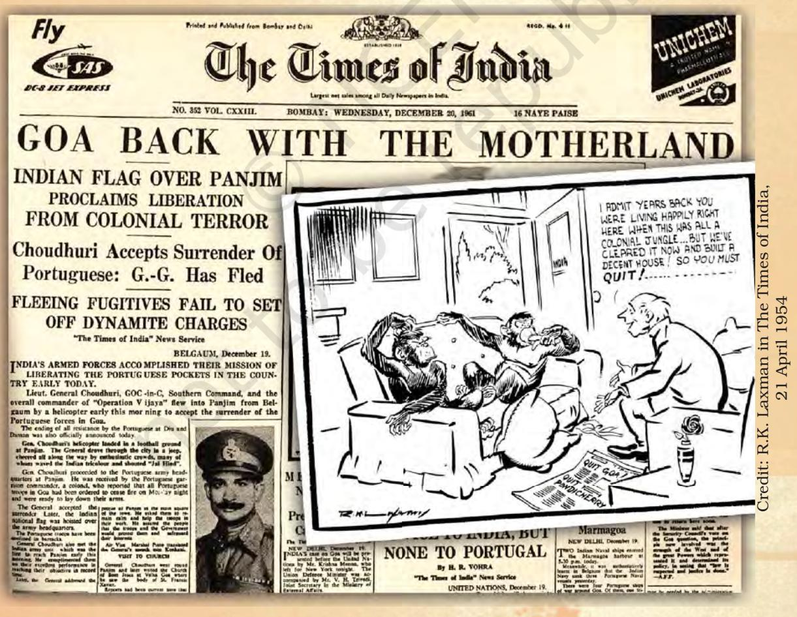

chap 7_PF.indd 22 18-May-2023 11:30:48 AM

- 1. Match the following. A B
#### **Nature of regional aspirations States**

- (a) Socio-religious identity i. Nagaland /Mizoram leading to statehood
- (b) Linguistic identity and ii. Jharkhand /Chattisgarh tensions with Centre
- (c) Regional imbalance leading iii. Punjab to demand for Statehood
- (d) Secessionist demands on iv. Tamil Nadu account of tribal identity

- 
- 
- 
- 
- 2. Regional aspirations of the people of North-East get expressed in different ways. These include movements against outsiders, movement for greater autonomy and movement for separate national existence. On the map of the North-East, using different shades for these three, show the States where these expressions are prominently found.
- 3. What were the main provisions of the Punjab accord? In what way can they be the basis for further tensions between the Punjab and its neighbouring States?
- 4. Why did the Anandpur Sahib Resolution become controversial?
- 5. Explain the internal divisions of the State of Jammu and Kashmir and describe how these lead to multiple regional aspirations in that State.
- 6. What are the various positions on the issue of regional autonomy for Kashmir? Which of these do you think are justifiable? Give reasons for your answer.
- 7. The Assam movement was a combination of cultural pride and economic backwardness. Explain.
- 8. All regional movements need not lead to separatist demands. Explain by giving examples from this chapter.
- 9. Regional demands from different parts of India exemplify the principle of unity with diversity. Do you agree? Give reasons.

#### 10. Read the passage and answer the questions below: *One of Hazarika's songs.. … dwells on the unity theme; the seven states of north-eastern India become seven sisters born of the same mother. …. 'Meghalaya went own way…., Arunachal too separated*

EXERCISES

chap 7_PF.indd 23 18-May-2023 11:30:51 AM

*and Mizoram appeared in Assam's gateway as a groom to marry another daughter.' ….. …. .. The song ends with a determination to keep the unity of the Assamese with other smaller nationalities that are left in the present-day Assam – 'the Karbis and the Missing brothers and sisters are our dear ones.' —* Sඉඖඒඑඊ Bඉකඝඉඐ

- (a) Which unity is the poet talking about?
- (b) Why were some States of North-East created separately out of the erstwhile State of Assam?
- (c) Do you think that the same theme of unity could apply to all the regions of India? Why?

chap 7_PF.indd 24 18-May-2023 11:30:51 AM

