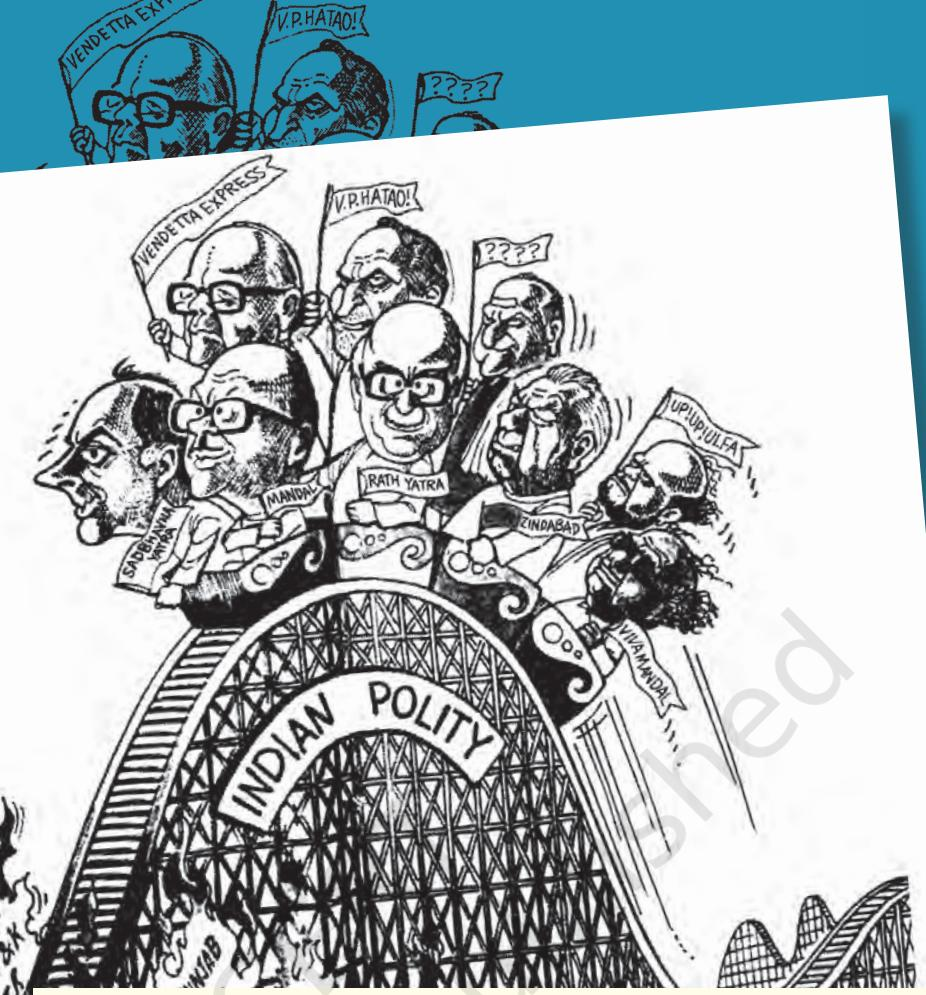

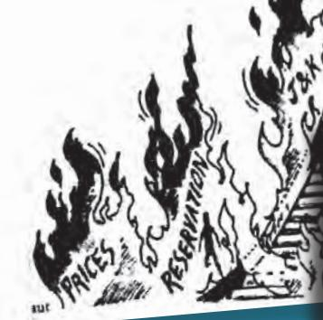

Ups and downs of various political parties in the 1990s appeared to many, like this cartoon drawn in 1990, as a roller coaster ride. Riding the roller coaster are Rajiv Gandhi, V. P. Singh, L. K. Advani, Chandrashekhar, Jyoti Basu, N. T. Rama Rao, Devi Lal, P. K. Mahanta and K. Karunanidhi.

## *In this chapter…*

In this last chapter we take a synoptic view of the last two decades of politics in India. These developments are complex, for various kinds of factors came together to produce unanticipated outcomes in this period. The new era in politics was impossible to foresee; it is still very difficult to understand. These developments are also controversial, for these involve deep conflicts and we are still too close to the events. Yet we can ask some questions central to the political change in this period.

- • What are the implications of the rise of coalition politics for our democracy?
- • What is Mandalisation all about? In which ways will it change the nature of political representation?
- • What is the legacy of the Ram Janmabhoomi movement?
- • What does the rise of a new policy consensus do to the nature of political choices?

The chapter does not answer these questions. It simply gives you the necessary information and some tools so that you can ask and answer these questions when you are through with this book. We cannot avoid asking these questions just because they are politically sensitive, for the whole point of studying the history of politics in India since Independence is to make sense of our present.

# chapter 8 Recent Developments in Indian Politics

## *Context of the 1990s*

You have read in the last chapter that Rajiv Gandhi became the Prime Minister after the assassination of Indira Gandhi. He led the Congress to a massive victory in the Lok Sabha elections held immediately thereafter in 1984. As the decade of the eighties came to a close, the country witnessed five developments that were to make a long-lasting impact on our politics.

First the most crucial development of this period was the defeat of the Congress party in the elections held in 1989. The party that had won as many as 415 seats in the Lok Sabha in 1984 was reduced to only 197 in this election. The Congress improved its performance and came back to power soon after the mid-term elections held in 1991. But the elections of 1989 marked the end of what political scientists have called the 'Congress system'. To be sure, the Congress remained an important party and ruled the country more than any other party even in this period since 1989. But it lost the kind of centrality it earlier enjoyed in the party system.

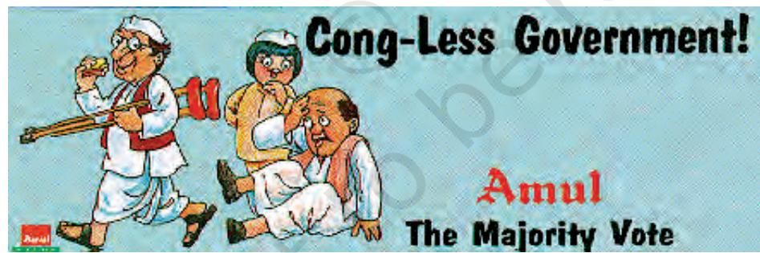

I wish to find out if the Congress can still bounce back to its old glory.

Congress leader Sitaram Kesri withdrew the crutches of support from Deve Gowda's United Front Government.

Second development was the rise of the 'Mandal issue' in national politics. This followed the decision by the new National Front government in 1990, to implement the recommendation of the Mandal Commission that jobs in central government should be reserved for the Other Backward Classes. This led to violent 'anti-Mandal' protests in different parts of the country. This dispute between the supporters and opponents of OBC reservations was known as the 'Mandal issue' and was to play an important role in shaping politics since 1989.

chap 8_PF.indd 137 8/5/2022 3:12:41 PM

I wish to be sure if this phenomenon would have a long-term effect.

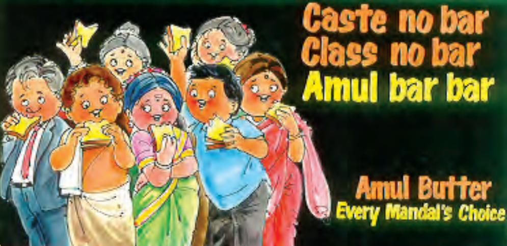

A reaction to Mandalisation.

Third, the economic policy followed by the various governments took a radically different turn. This is known as the initiation of the structural adjustment programme or the new economic reforms. Started by Rajiv Gandhi, these changes first became very visible in 1991 and radically changed the direction that the Indian economy had pursued since Independence. These policies have been widely criticised by various movements and organisations. But the various governments that came to power in this period have continued to follow these.

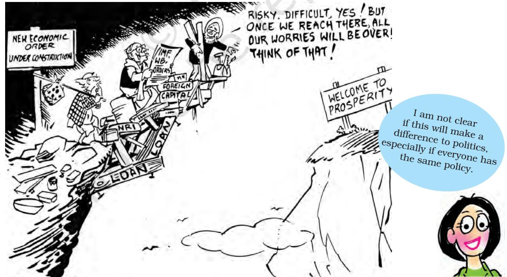

Manmohan Singh, the then Finance Minister, with Prime Minister Narsimha Rao, in the initial phase of the 'New Economic Policy'.

chap 8_PF.indd 138 8/5/2022 3:12:41 PM

Fourth, the centuries old legal and political dispute over the Ram Janmabhoomi Temple in Ayodhya started influencing the politics of India which gave birth to various political changes. The Ram Janmabhoomi Temple Movement, becoming the central issue, transformed the direction of the discourse on secularism and democracy. These changes culminated in the construction of the Ram Temple at Ayodhya following the decision of the constitutional bench of the Supreme Court (which was announced on November 9, 2019).

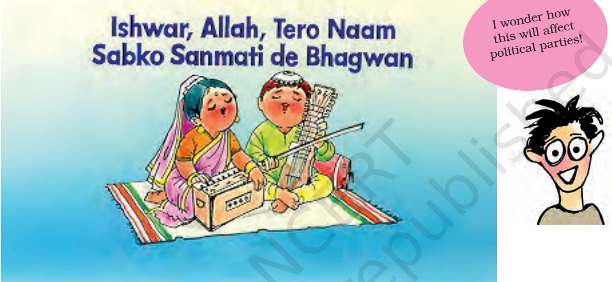

#### Message of Harmony

Finally, the assassination of Rajiv Gandhi in May 1991 led to a change in leadership of the Congress party. He was assassinated by a Sri Lankan Tamil linked to the LTTE when he was on an election campaign tour in Tamil Nadu. In the elections of 1991, Congress emerged as the single largest party. Following Rajiv Gandhi's death, the party chose Narsimha Rao as the Prime Minister.

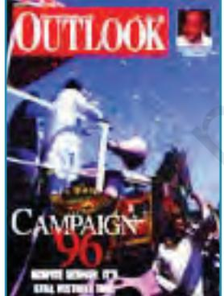

1 May 1996 25 October 1995 20 August 2001 25 October 2004

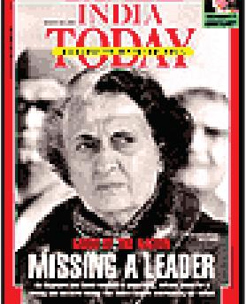

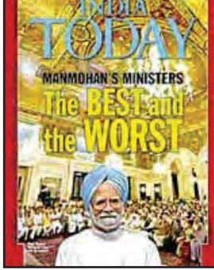

Leadership in Congress made many headlines.

chap 8_PF.indd 139 15-03-2024 16:13:40

## *Era of Coalitions*

Elections in 1989 led to the defeat of the Congress party but did not result in a majority for any other party. Though the Congress was the largest party in the Lok Sabha, it did not have a clear majority and therefore, it decided to sit in the opposition. The National Front (which itself was an alliance of Janata Dal and some other regional parties) received support from two diametrically opposite political groups: the BJP and the Left Front. On this basis, the National Front formed a coalition government, but the BJP and the Left Front did not join in this government.

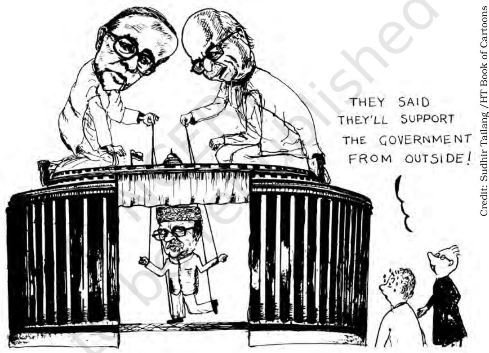

The National Front Government lead by V. P. Singh was supported by the Left (represented here by Jyoti Basu) as well as the BJP (represented by L. K. Advani)

## *Decline of Congress*

The defeat of the Congress party marked the end of Congress dominance over the Indian party system. Do you remember the discussion in Chapters about the restoration of the Congress system? Way back in the late sixties, the dominance of the Congress party was challenged; but the Congress under the leadership of Indira Gandhi, managed to re-establish its predominant position in politics. The nineties saw yet another challenge to the predominant position of the Congress. It did not, however, mean the emergence of any other single party to fill in its place.

chap 8_PF.indd 140 8/5/2022 3:12:42 PM

Thus, began an era of multi-party system. To be sure, a large number of political parties always contested elections in our country. Our Parliament always had representatives from several political parties. What happened after 1989 was the emergence of several parties in such a way that one or two parties did not get most of the votes or seats. This also meant that no single party secured a clear majority of seats in any Lok Sabha election held since 1989 till 2014. This development initiated an era of coalition governments at the Centre, in which regional parties played a crucial role in forming ruling alliances but in 2014 and 2019 Lok Sabha election, the BJP got clear majority on its own.

> Talk to your parents about their memories of the events happening since the 1990s. Ask them what they felt were the most significant events of the period. Sit together in groups and draw a comprehensive list of the events reported by your parents, see which events get cited most, and compare them with what the chapter suggests were the most significant. You can also discuss why some events are more important for some and not for others.

### *Alliance politics*

The nineties also saw the emergence of powerful parties and movements that represented the Dalit and backward castes (Other Backward Classes or OBCs). Many of these parties represented powerful regional assertion as well. These parties played an important role in the United Front government that came to power in 1996. The United Front was similar to the National Front of 1989 for it included Janata Dal and several regional parties. This time the BJP did not support the government. The United Front government was supported by the Congress. This shows how unstable the political equations were. In 1989, both the Left and the BJP supported the National Front Government because they wanted to keep the Congress out of power. In 1996, the Left continued to support the non-Congress government but this time the Congress, supported it, as both the Congress and the Left wanted to keep the BJP out of power.

They did not succeed for long, as the BJP continued to consolidate its position in the elections of 1991 and 1996. It emerged as the largest party in the 1996 election and was invited to form the government. But most other parties were opposed to its policies and therefore, the BJP government could not secure a majority in the Lok Sabha. It finally came to power by leading

Let's re-search

chap 8_PF.indd 141 8/5/2022 3:12:42 PM

a coalition government from May 1998 to June 1999 and was re-elected in October 1999. Atal Behari Vajpayee was the Prime Minister during both these NDA governments and his government formed in 1999 completed its full term.

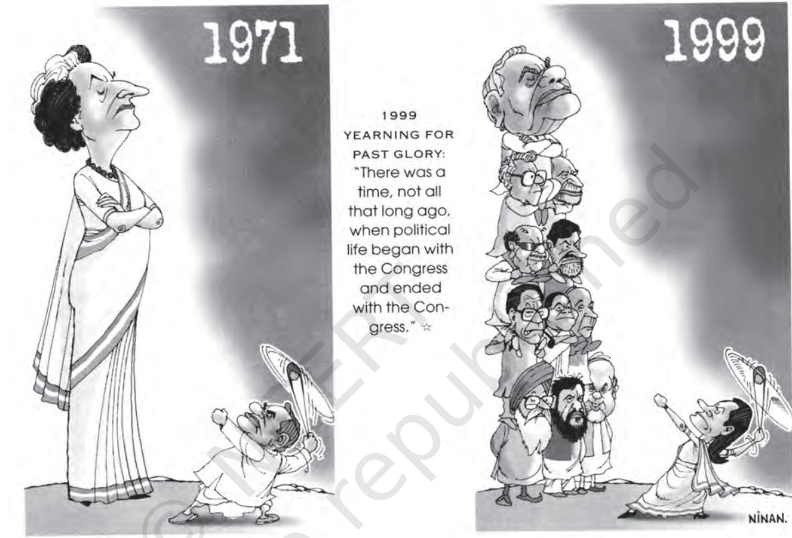

A cartoonist's depiction of the change from one-party dominance to a multi-party alliance system.

Thus, with the elections of 1989, a long phase of coalition politics began in India. Since then, there have been eleven governments at the Centre, all of which have either been coalition governments or minority governments supported by other parties, which did not join the government. In this new phase, any government could be formed only with the participation or support of many regional parties. This applied to the National Front in 1989, the United Front in 1996 and 1997, the BJP-led coalition in 1998, the NDA in 1999, the UPA in 2004 and 2009. However,thistrend changed in 2014.

Let us connect this development with what we have learnt so far. The era of coalition governments may be seen as a long-term trend resulting from relatively silent changes that were taking place over the last few decades.

We saw in chapter two that in earlier times, it was the Congress party itself that was a 'coalition' of different interests and different social strata and groups. This gave rise to the term 'Congress system'.

chap 8_PF.indd 142 15-03-2024 16:14:29

## **CENTRAL GOVERNMENTS SINCE 1989**

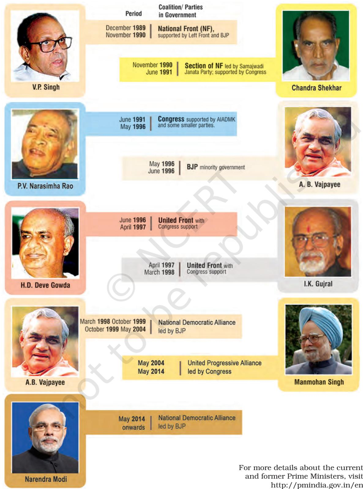

Note: The blank space is for you to record more information on the major policies, performance and controversies about that government.

chap 8_PF.indd 143 8/5/2022 3:12:43 PM

We also saw in Chapters that, especially since the late 1960s, various sections had been leaving the Congress fold and forming separate political parties of their own. We also noted the rise of many regional parties in the period after 1977. While these developments weakened the Congress party, they did not enable any single party to replace the Congress.

OK, coalitions are the logic of democratic politics in our kind of society. Does that mean that we will always have coalitions? Or can the national parties consolidate their positions again? I am

not worried about whether it is a single party or coalition government. I am more worried about what they do. Does a coalition government involve more compromises? Can we not have bold and imaginative policies in a coalition?

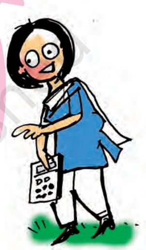

## *Political Rise of Other Backward Classes*

One long-term development of this period was the rise of Other Backward Classes as a political force. You have already come across this term 'OBC'. This refers to the administrative category 'Other Backward Classes'. These are communities other than SC and ST who suffer from educational and social backwardness. These are also referred to as 'backward castes'. We have already noted in Chapter Six that the support for the Congress among many sections of the 'backward castes' had declined. This created a space for non-Congress parties that drew more support from these communities. You would recall that the rise of these parties first found political expression at the national level in the form of the Janata Party government in 1977. Many of the constituents of the Janata Party, like the Bharatiya Kranti Dal and the Samyukta Socialist Party, had a powerful rural base among some sections of the OBC.

## *'Mandal' implemented*

In the 1980s, the Janata Dal brought together a similar combination of political groups with strong support among the OBCs. The decision of the National Front government to implement the recommendations

chap 8_PF.indd 144 8/5/2022 3:12:45 PM

of the Mandal Commission further helped in shaping the politics of 'Other Backward Classes'. The intense national debate for and against reservation in jobs made people from the OBC communities more aware of this identity. Thus, it helped those who wanted to mobilise these groups in politics. This period saw the emergence of many parties that sought better opportunities for OBCs in education and employment and also raised the question of the share of power enjoyed by the OBCs. These parties claimed that since OBCs constituted a large segment of Indian society, it was only democratic that the OBCs should get adequate representation in administration and have their due share of political power.

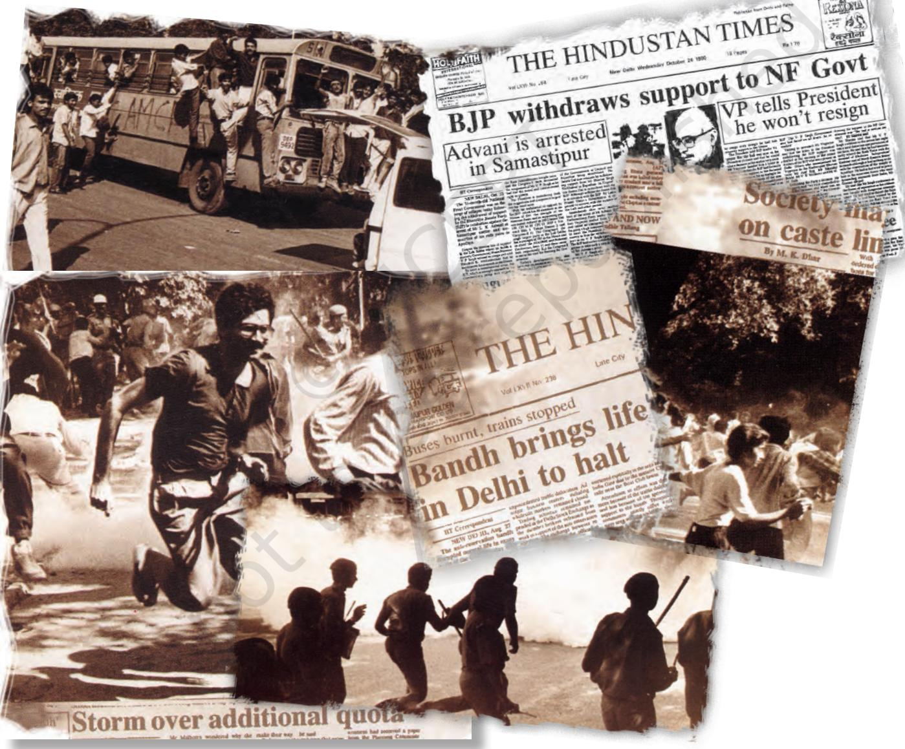

Implementation of Mandal Commission report sparked off agitations and political upheavals.

chap 8_PF.indd 145 8/5/2022 3:12:47 PM

## **The Mandal Commission**

Reservations for the OBC were in existence in southern States since the 1960s, if not earlier. But this policy was not operative in north Indian States. It was during the tenure of Janata Party government in 1977-79 that the demand for reservations for backward castes in north India and at the national level was strongly raised. Karpoori Thakur, the then Chief Minister of Bihar, was a pioneer in this direction. His government had introduced a new policy of reservations for OBCs in Bihar. Following this, the central government appointed a Commission in 1978 to look into and recommend ways to improve the conditions of the backward classes. This was the second time since Independence that the government had appointed such a commission. Therefore, this commission was officially known as the Second Backward Classes Commission. Popularly, the commission is known as the Mandal Commission, after the name of its Chairperson, Bindeshwari Prasad Mandal.

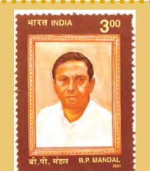

**B.P. Mandal (1918-1982):** M.P. from Bihar for 1967-1970 and 1977-1979; chaired the Second Backward Classes Commission that recommended reservations for Other Backward Classes; a socialist leader from Bihar; Chief Minister of Bihar for just a month and a half in 1968; joined the Janata Party in 1977.

The Mandal Commission was set up to investigate the extent of educational and social backwardness among various sections of Indian society and recommend ways of identifying these 'backward classes'. It was also expected to give its recommendations on the ways in which this backwardness could be ended. The Commission gaveitsrecommendationsin1980. BythentheJanata government had fallen. The Commission advised that 'backward classes' should be understood to mean 'backward castes', since many castes, other than the Scheduled Castes, were also treated as low in the caste hierarchy. The Commission did a survey and found that these backward castes had a very low presence in both educational institutions and in employment in public services. It therefore recommended reserving 27 per cent of seats in educational institutions and government jobs for these groups. The Mandal Commission also made many other recommendations, like, land reform, to improve the conditions of the OBCs.

In August 1990, the National Front government decided to implement one of the recommendations of Mandal Commission pertaining to reservations for OBCs in jobs in the central government and its undertakings. This decision sparked agitations and violent protests in many cities of north India. The

decision was also challenged in the Supreme Court and came to be known as the 'Indira Sawhney case', after the name of one of the petitioners. In November 1992, the Supreme Court gave a ruling upholding the decision of the government. There were some differences among political parties about the manner of implementation of this decision. But now the policy of reservation for OBCs has support of all the major political parties of the country.

chap 8_PF.indd 146 8/5/2022 3:12:48 PM

2024-25

## *Political fallouts*

The 1980s also saw the rise of political organisation of the Dalits. In 1978 the Backward and Minority Communities Employees Federation (BAMCEF) was formed. This organisation was not an ordinary trade union of government employees. It took a strong position in favour of political power to the 'bahujan' – the SC, ST, OBC and minorities. It was out of this that the subsequent Dalit Shoshit Samaj Sangharsh Samiti and later the Bahujan Samaj Party (BSP) emerged under the leadership of Kanshi Ram. The BSP began as a small party supported largely by Dalit voters in Punjab, Haryana and Uttar Pradesh. But in 1989 and the 1991 elections, it achieved a breakthrough in Uttar Pradesh. This was the first time in independent India that a political party supported mainly by Dalit voters had achieved this kind of political success.

In fact, the BSP, under Kanshi Ram's leadership was envisaged as an organisation based on pragmatic politics. It derived confidence from the fact that the Bahujans (SC, ST, OBC and religious minorities) constituted the majority of the population, and were a formidable political force on the strength of their numbers. Since then the BSP has emerged as a major political player in the State and has been in government on more than one occasion. Its strongest support still comes from Dalit voters, but it has expanded its support now to various other social groups. In many parts of India, Dalit politics and OBC politics have developed independently and often in competition with each other.

> Will this benefit leaders of all the backward and Dalit communities? Or will the gains be monopolised by some powerful castes and families within these groups?

The real point is not the leaders but the people! Will this lead to better policies and effective implementation for the really deprived people? Or will it remain just a political game?

**Kanshi Ram (1934-2006):** Proponent of Bahujan empowerment and founder of Bahujan Samaj Party (BSP); left his central government job for social and political work; founder of BAMCEF, DS-4 and finally the BSP in 1984; astute political strategist, he regarded political power as master key to attaining social equality; credited with Dalit resurgence in north Indian States.

chap 8_PF.indd 147 8/5/2022 3:12:49 PM

## *Communalism, Secularism, Democracy*

The other long-term development during this period was the visible rise of politics based on religious identity leading to a debate about secularism and democracy. We noted in Chapter Six that in the aftermath of the Emergency, the Bharatiya Jana Sangh had merged with the Janata Party. After the fall of the Janata Party and its break-up, the supporters of erstwhile Jana Sangh formed the Bharatiya Janata Party (BJP) in 1980. Initially, the BJP adopted a broader political platform than that of the Jana Sangh. BJP embraced 'Gandhian' Socialism' along with cultural nationalism as its ideology. But it did not get much success in the elections held in 1984. After 1986, the party began to emphasise nationalism as the core of its ideology. The BJP also pursued the politics of 'Hindutva' for political mobilisation.

Hindutva was popularised by Vinayak Damodar Savarkar, as the basis of Indian nationhood. It basically meant that to be an Indian, one must accept India as their 'fatherland' (pitrubhu) as well as their holy land (punyabhu). Believers of 'Hindutva' argue that a strong nation can be built on the basis of a united national culture. They also believe that in the case of India, Hindutva can provide this base.

Two developments around 1986 became central to the politics of BJP. The first was the Shah Bano case in 1985. In this case a 62 year old divorced Muslim woman, had filed a case for maintenance from her former husband. The Supreme Court ruled in favour of Shah Bano. The orthodox Muslims saw the Supreme Court's order as an interference in Muslim Personal Law. On the demand of some Muslim leaders, the government passed the Muslim Women (Protection of Rights on Divorce) Act, 1986 that nullified the Supreme Court's judgement. This action of the government was opposed by many women's organisations, many Muslim groups and most of the intellectuals. The BJP criticised this action of the Congress government as an unnecessary concession and 'appeasement' of the minority community.

#### **Do you know?**

There is a very interesting incident dated November 28 1858, when Nihang Sikhs captured the Janmabhoomi site and performed Puja and Havan, before being forcibly ousted by colonial administration.

### *Ayodhya Issue*

The Ayodhya issue, as the second significant development, was deeply rooted in socio- cultural and political history of the country pertaining to different perspectives from various stakeholders. It involved contentions regarding the birth place of Shri Ram, one of the most holy religious sites, and its legal ownership.

The significance of Ayodhya Ram Janmabhoomi site can be judged by the fact that the 500-year long history, starting from 1528, is marked by numerous conflicts which are also documented in Lucknow, Barabanki and Faizabad district Gazetteers. A three-dome

chap 8_PF.indd 148 20-03-2024 15:16:59

structure was built at the site of Shri Ram's birth place in 1528, but the structure had visible display of Hindu symbols and relics in its interior as well as its exterior portions. Therefore, Ayodhya Ram Janmabhoomi issue got linked to the national pride in its ancient civilization. Over the years, this issue evolved into a prolonged legal battle, leading to the structure being sealed in 1949 due to the onset of court proceedings.

 In 1986, the situation regarding the three-dome structure took a significant turn when the Faizabad (now Ayodhya) district court ruled to unlock the structure, allowing people to worship there. The dispute had been going on for many decades as it was believed that the threedome structure was built at Shri Ram's birthplace after demolition of a temple. However, although *Shilaanyas* for the temple was done, further construction remained prohibited. The Hindu community felt that their concerns related to the birth place of Shri Ram were overlooked, while the Muslim community sought assurance of their possession over the structure. Subsequently, tensions heightened between both communities over ownership rights, resulting in numerous disputes and legal conflicts. Both communities desired a fair resolution to the longstanding issue. In 1992, following the demolition of the structure, some critics contended that it presented a substantial challenge to the principles of Indian democracy.

### *From Legal Proceedings to Amicable Acceptance*

It is important to note that in any society conflicts are bound to take place. However, in a multi -religious and multi-cultural democratic society, these conflicts are usually resolved following the due process of law. Through a number of democratic and legal procedures including court hearings, mediation attempts, popular movements, and finally with a 5-0 verdict of a constitutional bench of the Supreme Court on November 9, 2019, the Ayodhya issue was resolved. This verdict sought to reconcile the conflicting interests of the various stakeholders involved in the dispute.

The verdict allotted the disputed site to the *Shri Ram Janmabhoomi Teertha Kshetra Trust* for the construction of Ram temple and directed the concerned government to allot appropriate site for the construction of a Mosque to the *Sunni Central Waqf Board*. In this way, democracy gives room for conflict resolution in a plural society like ours, upholding the inclusive spirit of the Constitution. This issue was resolved following the due process of law based on evidences such as archaeological excavations and historical records. The Supreme Court's decision was celebrated by the society at large. It is a classic example of consensus building on a sensitive issue that shows the maturity of democratic ethos which are civilizationally ingrained in India.

*The excerpts referring to the Judgment of the constitutional Bench of the Supreme Court (November 9,2019)*

 *"...At the heart of the Constitution is a commitment to equality upheld and enforced by the rule of law. Under our Constitution, citizens of all faiths, beliefs and creeds seeking divine provenance are both subject to the law and equal before the law. Every judge of this Court is not merely tasked with but sworn to uphold the Constitution and its values. The Constitution does not make a distinction between the faith and belief of one religion and another. All forms of belief, worship and prayer are equal..." "*

(For details see, Supreme Court Judgments, November 9, 2019, p. 920, https://main.sci.gov.in/ supremecourt/2010/36350/36350_2010_1_1502_18205_Judgement_09-Nov-2019.pdf)

*"It is thus concluded … that faith and belief of Hindus since prior to construction of Mosque and subsequent thereto has always been that Janmaasthan of Lord Ram is the place where Babri Mosque has been constructed which faith and belief is proved by documentary and oral evidence discussed above."*

(For details see, Supreme Court Judgments, November 9, 2019, p. 1045, https://main.sci.gov.in/ supremecourt/2010/36350/36350_2010_1_1502_18205_Judgement_09-Nov-2019.pdf)

*"*

## *Emergence of a new consensus*

The period after 1989 is seen sometimes as the period of decline of Congress and rise of BJP. If you want to understand the complex nature of political competition in this period, you have to compare the electoral performances of the Congress and the BJP.

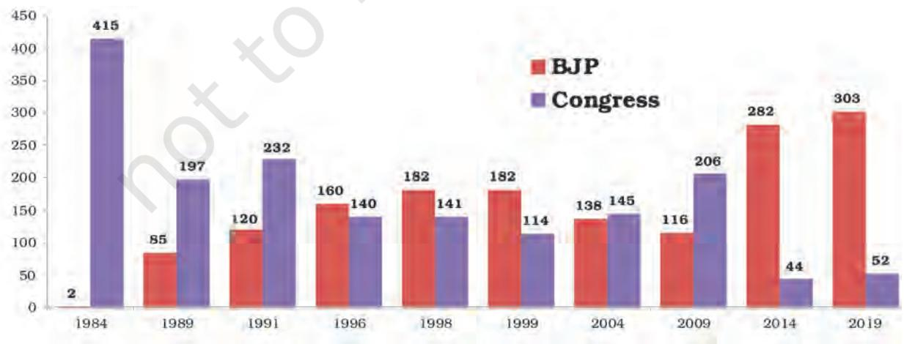

## **Party Position (Number of seats won) in Lok Sabha**

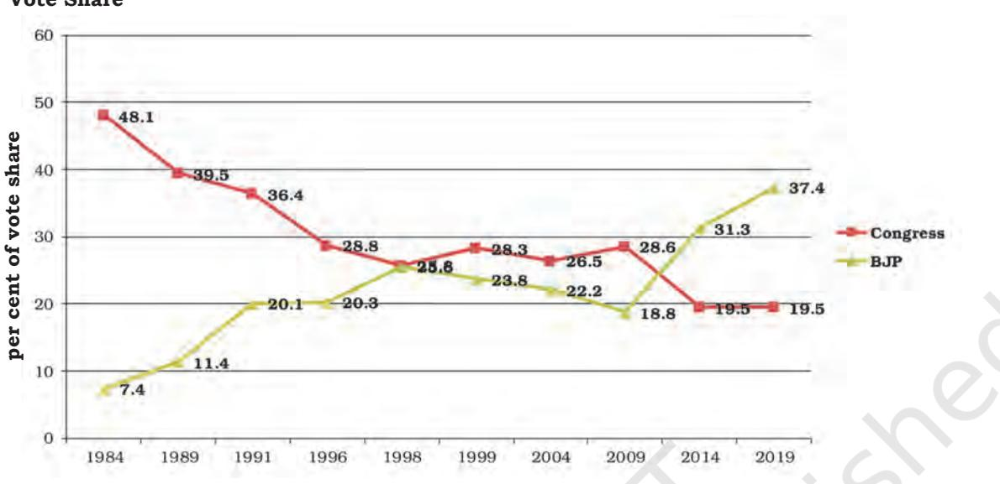

### **Vote Share**

Now let us try to understand the meaning of the information given in the figure.

- • You will notice that BJP and Congress were engaged in a tough competition in this period. What is the difference between their electoral fortunes if you compare these with the 1984 elections?
- .• You will notice that since the 1989 election, the votes polled by the two parties, Congress and the BJP, most of the time, add up to more than fifty per cent except in 1996, 2004 and 2009.
- • Look at both the charts showing Congress and Janata 'family' of parties. Which among the parties that exist today are neither part of Congress family of parties nor part of Janata family of parties?
- • The political competition during the nineties is divided between the coalition led by BJP and the coalition led by the Congress. Can you list the parties that are not part of any of these two coalitions?

## *Lok Sabha Elections (2004-2019)*

In the elections of 2004, the Congress party too entered into coalitions in a big way. The National Democratic Alliance (NDA) was defeated and a new coalition government led by the Congress, known as the United Progressive Alliance (UPA) came to power. This government received support from the Left Front parties. The elections of 2004 also witnessed the partial revival of Congress party. It could increase

chap 8_PF.indd 151 21-03-2024 12:43:00

its seats once again after 1991. However, in the 2004 elections, there was a negligible difference between the votes polled by the Congress and its allies and the BJP and its allies.

The Congress led UPA government completed its term despite Left parties withdrawing the support in July 2008 on the issue of Indo-US nuclear deal. Elections for 15th Lok Sabha were held in 2009. Results witnessed a rise in the number of seats (from 145 in 2004 to 206 in 2009) of the Indian National Congress (INC) and Congress led UPA Government. Dr. Manmohan Singh was sworn as Prime Minister for the second term, heading the coalition government of UPA again.

Bhartiya Janata Party declared Narendra Modi (then the Chief Minister of Gujrat) as its Prime Ministerial candidate in September 2013. BJP under the leadership of Narendra Modi got a clear majority in 16th Lok Sabha elections held in 2014. BJP won 282 seats on its own, becoming the first party to gain single party majority after 30 years. Despite single-party majority of its own, BJP did choose to form the NDA government with its coalition partners.

Year 2014 was a proverbial watershed moment of Indian politics. Narendra Modi led NDA government rapidly took decisions in social sector, foreign policy and economic policy.

The BJP again emerged victorious with 303 seats of its own in 2019 Lok Sabha election. Even when BJP is getting full majority, the recognition of coalition politics is still relevant. Thus, the party system has now changed almost dramatically from what it was till the seventies.

## *Growing consensus*

However, on many crucial issues, a broad agreement has emerged among most parties. In the midst of severe competition and many conflicts, a consensus appears to have emerged among most parties. This consensus consists of four elements.

First, agreement on new economic policies – while many groups are opposed to the new economic policies, most political parties are in support of the new economic policies. Most parties believe that these policies would lead the country to prosperity and a status of economic power in the world.

Second, acceptance of the political and social claims of the backward castes – political parties have recognised that the social and political claims of the backward castes need to be accepted. As a result, all political parties now support reservation of seats for the 'backward classes' in education and employment.

chap 8_PF.indd 152 21-03-2024 12:43:00

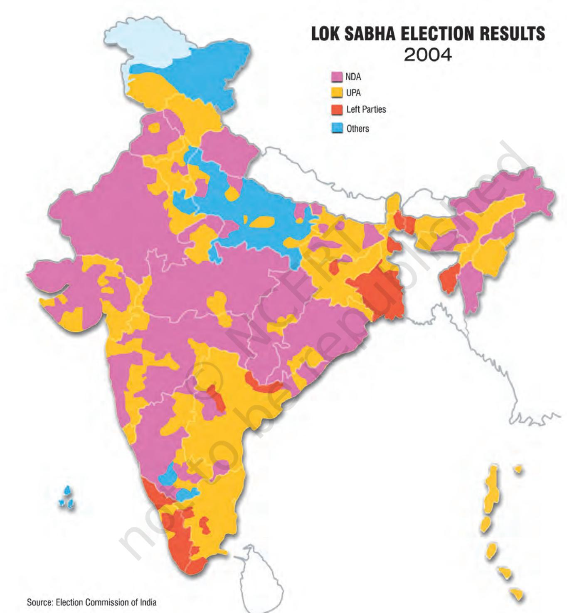

**Note:** This illustration is not a map drawn to scale and should not be taken to be an authentic depiction of India's external boundaries.

chap 8_PF.indd 153 19-03-2024 12:14:40

Political parties are also willing to ensure that the OBCs get adequate share of power.

Third, acceptance of the role of State level parties in governance of the country – the distinction between State level and national level parties is fast becoming less important. As we saw in this chapter, State level parties are sharing power at the national level and have played a central role in the country's politics of last twenty years or so.

Fourth, emphasis on pragmatic considerations rather than ideological positions and political alliances without ideological agreement – coalition politics has shifted the focus of political parties from ideological differences to power sharing arrangements. Thus, most parties of the NDA did not agree with the 'Hindutva' ideology of the BJP. Yet, they came together to form a government and remained in power for a full term.

All these are momentous changes and are going to shape politics in the near future. We started this study of politics in India with the discussion of how the Congress emerged as a dominant party. From that situation, we have now arrived at a more competitive politics, but politics that is based on a certain implicit agreement among the main political actors. Thus, even as political parties act within the sphere of this consensus, popular movements and organisations are simultaneously identifying new forms, visions and pathways of development. Issues like poverty, displacement, minimum wages, livelihood and social security are being put on the political agenda by peoples' movements, reminding the state of its responsibility. Similarly, issues of justice and democracy are being voiced by the people in terms of class, caste, gender and regions. We cannot predict the future of democracy. All we know is that democratic politics is here to stay in India and that it will unfold through a continuous churning of some of the factors mentioned in this chapter.

As you know around the time of India's independence, many other countries also became independent and adopted democracy. However, even India emerged as a mature democracy playing a great role in promoting social equality and national development, the same has not been the case in some of those countries.

Discuss amongst yourselves the factors that have enabled democracy to thrive in India.

chap 8_PF.indd 154 19-03-2024 12:14:40

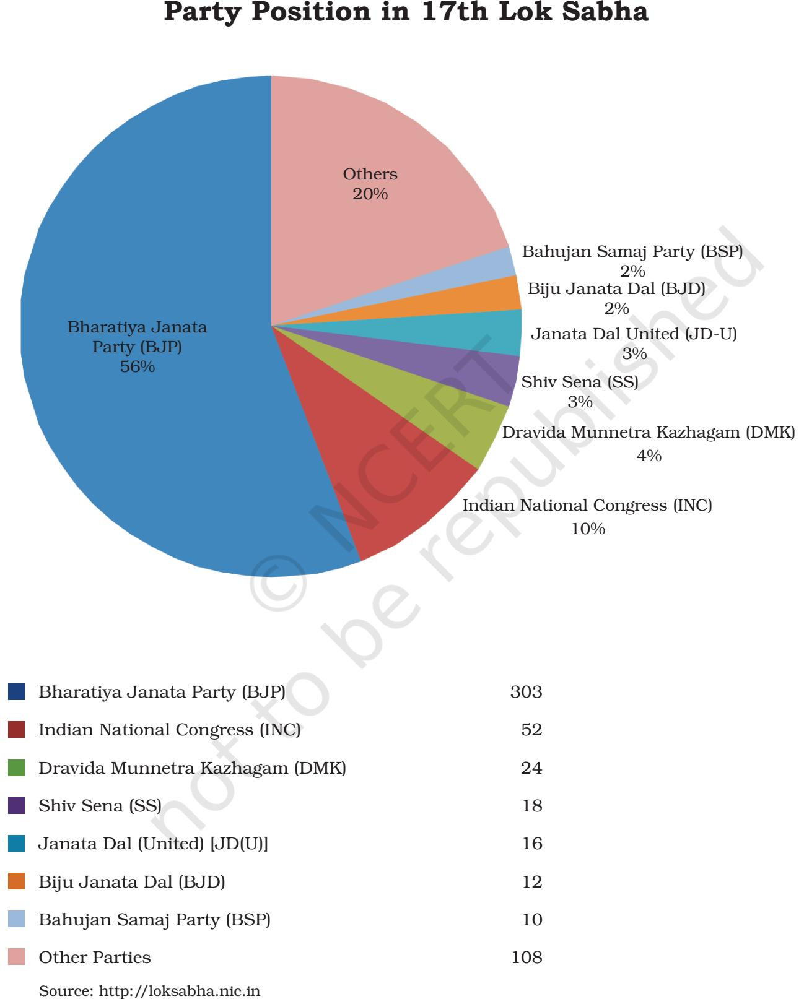

chap 8_PF.indd 155 18-03-2024 11:59:21

- 1. Unscramble a bunch of disarranged press clipping file of Unni-Munni… and arrange the file chronologically.
- (a) Implementation of the recommendation of the Mandal Commission
- (b) Formation of the Janata Dal
- (c) Supreme court Judgment on the Ram Janmabhoomi
- (d) Assassination of Indira Gandhi
- (e) The formation of NDA government
- (f) Formation of the UPA government
- 2. Match the following.
- (a) Politics of Consensus i. Shah Bano case
- (b) Caste based parties ii. Rise of OBCs
	-
- (d) Growing strength of policies Regional parties
- 
- 
- (c) Personal Law and iii. Coalition government
- Gender Justice iv. Agreement on Economic
- 3. State the main issues in Indian politics in the period after 1989. What different configurations of political parties these differences lead to?
- 4. "In the new era of coalition politics, political parties are not aligning or realigning on the basis of ideology." What arguments would you put forward to support or oppose this statement?
- 5. Trace the emergence of BJP as a significant force in post-Emergency politics.
- 6. In spite of the decline of Congress dominance, the Congress party continues to influence politics in the country. Do you agree? Give reasons.
- 7. Many people think that a two-party system is required for successful democracy. Drawing from India's experience of last 30 years, write an essay on what advantages the present party system in India has.
- 8. Read the passage and answer the questions below:

 *Party politics in India has confronted numerous challenges. Not only has the Congress system destroyed itself, but the fragmentation of the Congress coalition has triggered a new emphasis on self-representation which raises questions about the party system and its capacity to accommodate diverse interests, …. . An important test facing the polity is to evolve a party system or political parties that can effectively articulate and aggregate a variety of interests. —* Zoya Hasan

- (a) Write a short note on what the author calls challenges of the party system in the light of what you have read in this chapter.
- (b) Given an example from this chapter of the lack of accommodation and aggregation mentioned in this passage.
- (c) Why is it necessary for parties to accommodate and aggregate variety of interests?

*EXERCISES*

chap 8_PF.indd 156 22-Apr-24 12:39:37 PM

### **LET US DO IT TOGETHER**

- • This chapter covers the major developments in Indian politics until the 2004 Elections (14th Lok Sabha). Subsequently, the Lok Sabha elections were held in 2009, during which the UPA led by the Congress won. In the 2014 and 2019 Elections, the NDA led by the BJP emerged victorious. The position of various parties in the 17th Lok Sabha is given on page 155.
- • A detailed study of Members of the 17th Lok Sabha is available on the website of the Lok Sabha (http://loksabha.nic.in).
- • Compare and contrast the electoral performances of various political parties since 2004. The table given below can be used for this. You can also collect the data about the results from the website of the Election Commission of India (http://eci.nic.in).
- • Prepare a timeline of the major political events in India since 2004. Share and discuss it in your classroom.

### **Party Positions in Indian Parliament since 2004**

|  | Party | 2004 | 2009 | 2014 | 2019 |
| --- | --- | --- | --- | --- | --- |
| 1 | Aam Aadmi Party (AAP) | - | - | 4 | 1 |
| 2 | All India Anna Dravida Munnetra | Kazhagam 0 | 9 | 37 | 1 |
|  | (AIADMK) |  |  |  |  |
| 3 | Bahujan Samaj Party (BSP) | 19 | 21 | - | 10 |
| 4 | Bharatiya Janata Party (BJP) | 138 | 116 | 282 | 303 |
| 5 | Biju Janata Dal (BJD) | 11 | 14 | 20 | 12 |
| 6 | Communist Party of India – Marxist (CPI-M) | 43 | 16 | 9 | 3 |
| 7 | Communist Party of India (CPI) | 10 | 4 | 1 | 2 |
| 8 | Dravida Munnetra Kazhagam (DMK) | 16 | 18 | - | 24 |
| 9 | Indian National Congress(INC) | 145 | 206 | 44 | 52 |
| 10 | Janata Dal - United (JD -U) | 8 | 20 | 2 | 16 |
| 11 | Janata Dal -Secular (JD - S) | 3 | 3 | 2 | 1 |
| 12 | Lok Jan Shakti Party (LJSP) | 4 | - | 6 | 6 |
| 13 | Nationalist Congress Party (NCP) | 9 | 9 | 6 | 5 |
| 14 | Rashtriya Janata Dal (RJD) | 24 | 4 | 4 | - |
| 15 | Rashtriya Lok Dal (RLD) | 3 | 5 | 1 | - |
| 16 | Samajwadi Party (SP) | 36 | 23 | 5 | 5 |
| 17 | Shiromani Akali Dal (SAD) | 8 | 4 | 4 | 2 |
| 18 | Shiv Sena (SS) | 12 | 11 | 18 | 18 |
| 19 | Others | 54 | 60 | 98 | 82 |
|  | Total | 543 | 543 | 543 | 543 |

Total Seats in Indian Parliament : 543 (530 from States and 13 from UTs)

*EXERCISES*

chap 8_PF.indd 157 20-03-2024 15:23:29

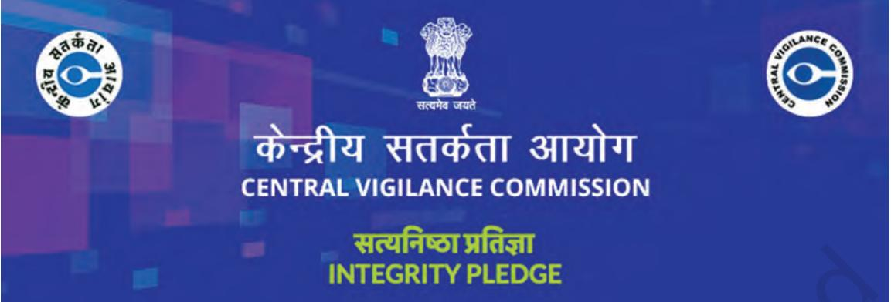

- 
- 
- 
- 
- 
- 

chap 8_PF.indd 158 18-03-2024 11:59:21

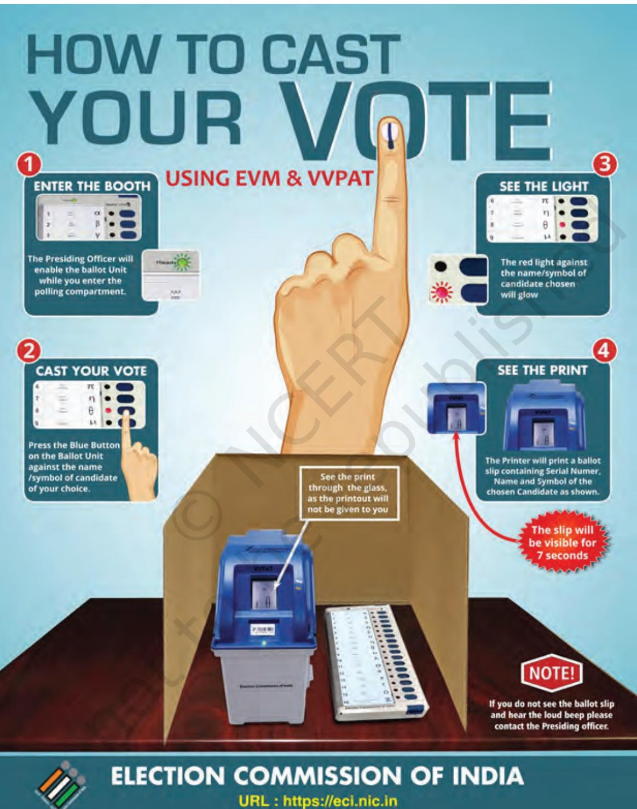

*Source: Election Commission of India*

chap 8_PF.indd 159 18-03-2024 11:59:21

## **Notes**

chap 8_PF.indd 160 18-03-2024 11:59:21

