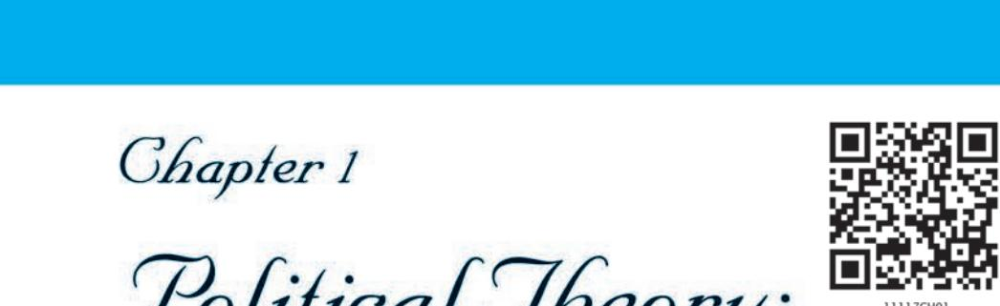
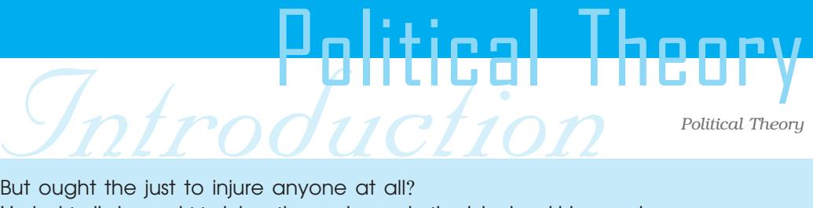
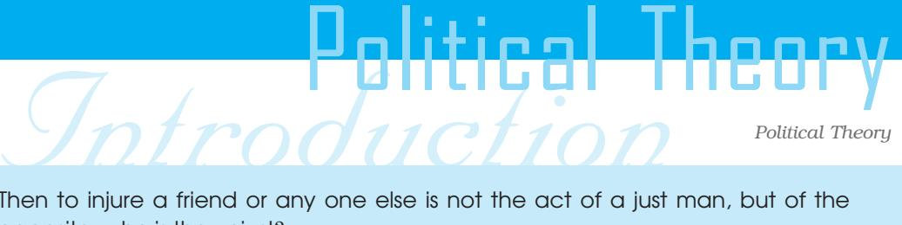

1

*Political Theory*

Human beings are unique in two respects: they possess reason and the ability to reflect on their actions. They also have the capacity to use language and communicate with each other. Unlike other species, they can express their innermost thoughts and desires; they can share their ideas and discuss what they consider to be good and desirable. Political theory has its roots in the twin aspects of the human self. It analyses certain basic questions such as how should society be organised? Why do we need government? What is the best form of government? Does law limit our freedom? What does the state owe its citizens? What do we owe each other as citizens?

Political theory examines questions of this kind and systematically thinks about the values that inform political life values such as freedom, equality and justice. It explains the meaning and significance of these and other related concepts. It clarifies the existing definitions of these concepts by focusing on some major political thinkers of the past and present. It also examines the extent to which freedom or equality are actually present in the institutions that we participate in, everyday life such as schools, shops, buses or trains or government offices. At an advanced level, it looks at whether existing definitions are adequate and how existing institutions (government, bureaucracy) and policy practices must be modified to become more democratic. The objective of political theory is to train citizens to think rationally about political questions and assess the political events of our time.

In this chapter, we will examine what is meant by politics and political theory and why we should study it.

#### 1.1 WHAT IS POLITICS?

You would have noticed that people have different ideas about what politics is. Political leaders, and persons who contest elections and hold political office, may argue that it is a kind of public service. Some others associate politics with manipulation and intrigue undertaken to pursue ambitions and satisfy wants. A few think of politics as what politicians do. If they see politicians defecting from parties, making false promises and tall 

LET'S DEBATE

" "

What is Politics.

#### *Political Theory*

claims, manipulating different sections, pursuing personal or group interests ruthlessly and in worst cases stooping to crime, they link politics with 'scams'. So prevalent is this way of thinking that when we see people in different walks of life trying to promote their interests by any means possible, we say they are playing politics. If we see a cricketer manipulating to stay in the team, or a fellow student trying to use his father's position, or a colleague in office mindlessly agreeing with the boss, we say he or she is playing 'dirty' politics.

Disillusioned by such pursuits of selfishness we despair of politics. We say, "I am not interested in politics" or "I am going to stay away from politics". It is not only ordinary people who despair of politics; even businessmen and entrepreneurs routinely blame politics for their woes even as they benefit from and fund various political parties. Cinema stars also complain of politics though they seem to be adept at the game once they join it.

We are thus confronted with conflicting images of politics. Is politics an undesirable activity that we should stay away from and get rid off? Or, is it a worthwhile activity which we must engage with in order to make a better world?

It is unfortunate that politics has come to be associated with the pursuit of self-interest by any and every method. We need to realise that

politics is an important and integral part of any society. Mahatma Gandhi once observed that politics envelops us like the coils of a snake and there is no other way out but to wrestle with it. No society can exist without some form of political organisation and collective decision making. A society that wants to sustain itself needs to take into account the multiple needs and interests of its members. A number of social institutions such as the family, tribes and economic institutions, have emerged to help people fulfil their needs and aspirations. Such institutions help us find ways of living together acknowledging our obligations to each other. Among such institutions, governments play an important part. How governments

R. K. Laxman in the Times of India

*You must retire from politics at once! Your activities are having a bad influence on him. He thinks he can get away with lying and cheating.*

*Political Theory*

Read the newspaper. What are the issues dominating the headlines? Do you think they have any relevance for you?

are formed and how they function is thus an important focus of politics.

But politics is not confined to the affairs of government. In fact what governments do is relevant because it affects the lives of the people in many different ways. We see that

governments determine our economic policy and foreign policy and educational policy. These policies can help to improve the lives of people but an inefficient or corrupt government can also endanger people's lives and security. If the government in power allows any conflicts to become violent, markets close down and schools are shut. These disrupt our lives; we cannot buy things that we may need urgently; those who are sick cannot reach the hospital; even the school schedule gets affected, syllabi cannot be completed and we may have to take extra coaching for the exams and pay tuition fees. If, on the other hand, the government makes policies to increase literacy and employment, we may get an opportunity to go to a good school and get a decent job.

Since the actions of the government affect us deeply, we take a lively interest in what governments do. We form associations and organise campaigns to articulate our demands. We negotiate with others and try to shape the goals that governments pursue. When we disagree with the policies of the government, we protest and organise demonstrations to persuade the government to change the existing laws. We passionately debate the actions of our representatives and discuss whether corruption has increased or decreased. We ask whether corruption can be rooted out; whether reservations for specific groups are just or not. We try to understand

why some parties and leaders win elections. In this way we look for the rationale underlying the prevalent chaos and decay, and aspire to create a better world.

To sum up, politics arises from the fact that we have different visions of what is just and desirable for us and our

How does politics influence our daily life? Analyse a day's events in your life.

#### *Political Theory*

society. It involves the multiple negotiations that go on in society through which collective decisions are made. At one level, it involves what governments do and how they relate to the aspirations of the people; at another level, it involves how people struggle and influence decision making. People may be said to engage in political activity whenever they negotiate with each other and take part in collective activities which are designed to promote social development and help to resolve common problems.

LET'S DEBATE " "

Should students participate in politics?.

### 1.2 WHAT DO WE STUDY IN POLITICAL THEORY?

If we look around us what we see would be movement, development and change. But if we look deeper we would also see certain values and principles that have inspired people and guided policies. Ideals like democracy, freedom or equality for instance. Different countries may try to protect such values by enshrining them in their constitutions as is the case with the American and Indian constitutions.

These documents did not just emerge overnight; they are built upon the ideas and principles debated almost since the time of Kautilya, Aristotle to Jean Jacques Rousseau, Karl Marx, Mahatma Gandhi and Dr. B.R. Ambedkar. As far back as the fifth century B.C., Plato and Aristotle discussed with their students whether monarchy or democracy was better. In modern times, Rousseau first argued for freedom as a fundamental right of humankind. Karl Marx argued that equality was as crucial as freedom. Closer home, Mahatma Gandhi discussed the meaning of genuine freedom or *swaraj* in his book *Hind Swaraj.* Dr. Ambedkar vigorously argued that the

scheduled castes must be considered a minority, and as such, must receive special protection. These ideas find their place in the Indian Constitution; our Preamble enshrines freedom and equality; the chapter on Rights in the Indian Constitution abolishes untouchability in any form; Gandhian principles find a place in Directive Principles.

Write a short note on any of the political thinkers mentioned in the chapter. [50 words]

*Political Theory*

Political theory deals with the ideas and principles that shape Constitutions, governments and social life in a systematic manner. It clarifies the meaning of concepts such as freedom, equality, justice, democracy, secularism and so on. It probes the significance of principles such as rule of law, separation of powers, judicial review, etc. This is done by examining the arguments advanced by different thinkers in defence of these concepts. Though Rousseau or Marx or Gandhi did not become politicians, their ideas influenced generations of politicians everywhere. There are also contemporary thinkers who draw upon them to defend freedom or democracy in our own time. Besides examining arguments, political theorists also reflect upon our current political experiences and point out trends and possibilities for the future.

> Can you identify the political principle/value which is in application in each of the following statements/situations?

- a. I should be able to decide which subjects I want to study in school.
- b. The practice of untouchability has been abolished.
- c. All Indians are equal before law.
- d. Minorities can have their own schools and colleges.
- e. Foreigners who are visiting India cannot vote in Indian elections.
- f. There should be no censorship of media or films.
- g. Students should be consulted while planning the annual day functions.
- h. Everyone must join the Republic Day celebrations.

But is all this relevant for us now? Have we not already achieved freedom and democracy? While India is free and independent, questions regarding freedom and equality have not ceased to crop up. This is because issues concerning freedom, equality, democracy, arise in many areas of social life and they are being implemented in different sectors at different paces. For instance, although equality may exist in the political sphere in the form of equal rights, it may not exist to the same extent in the economic or social spheres. People may enjoy equal political rights but still be discriminated

6

#### *Political Theory*

against socially because of their caste or poverty. Some people may have a privileged place in society while others are deprived even of basic necessities. Some are able to achieve whatever goals they set for themselves while many are unable even to go to schools so that they can have decent jobs in the future. For them, freedom is still a distant dream.

Secondly, though freedom is guaranteed in our Constitution, we encounter new interpretations all the time. This is a bit like playing a game; as we play chess or cricket, we learn how to interpret the rules. In the process, we discover new and broader meanings of the game itself. Similarly, the fundamental rights guaranteed by our Constitution are continually being reinterpreted in response to new circumstances. For instance, the right to life has been interpreted by the Courts to include the right to livelihood. The right to information has been granted through a new law. Societies frequently encounter new challenges which generate new interpretations. The fundamental rights guaranteed by our Constitution have been amended and expanded over time through judicial interpretations and government policies which are designed to address new problems.

Thirdly, as our world changes, we may discover new dimensions of freedom as well as new threats to freedom. For instance, global communications technology is making it easier for activists to network with one another across the world for protecting tribal cultures or forests. But it also enables terrorists and criminals to network. Moreover, internet commerce is all set to increase in the future. This means that the information we give about ourselves online to buy goods or services must be protected. So even though netizens (citizens of the internet) do not like government control, they recognise that some form of regulation is necessary to safeguard individual security and privacy. As a result, questions are raised regarding how much freedom should be given

to people using the net. For instance, should they be allowed to send unsolicited e-mails to strangers? Can you advertise your products in

#### LET'S DO IT

Collect cartoons from various newspapers and magazines. What are the various issues that they are concerned with? Which political concept do they highlight?

7

Do

Introduction Political Theory *In ancient Greece, in the city of Athens, Socrates was described as the 'wisest man'. He was known for questioning and challenging popularly held beliefs about society, religion and politics. For this he was condemned to death by the rulers of Athens.*

*His student Plato wrote extensively about the life and ideas of Socrates. In his book* 'The Republic', *he created the character Socrates and through him examined the question – what is justice?*

*The book opens with a dialogue between Socrates and Cephalus. In the course of this dialogue Cephalus and his friends come to recognise that their understanding of justice is inadequate and unacceptable.*

*The important thing in this is that Socrates uses reason to reveal the limitations and inconsistencies in a given point of view. His adversaries eventually admit that the views they had held and lived by could not be sustained.*

> chat rooms? Should governments be allowed to read private e-mails to track down terrorists? How much regulation is justified and who should regulate – governments or some private regulators? Political theory has a lot to teach us about possible answers to these questions and is therefore very relevant.

### 1.3 PUTTING POLITICAL THEORY TO PRACTICE

In this textbook, we confine ourselves to one aspect of political theory — that which deals with the origins, meaning and significance of political ideas that we are familiar with such as freedom, equality, citizenship, justice, development, nationalism, secularism and so on. When we begin a debate or argument on any topic, we usually ask "what does it mean?" and "how does it matter?" Political theorists have asked what is freedom or equality and provided diverse definitions. Unlike in mathematics where there can be one definition of a triangle or square, we encounter many definitions of equality or freedom or justice.

### Introduction Political Theory *Political Theory*

*Read and see how Socrates achieved this.*

Well said, Cephalus, I replied; but as concerning justice, what is it? —to speak the truth and to pay your debts —no more than this?

And even to this are there not exceptions? Suppose that a friend when in his right mind has deposited arms with me and he asks for them when he is not in his right mind, ought I to give them back to him? …

You are quite right, he replied.

But then, I said, speaking the truth and paying your debts is not a correct definition of justice. …

And instead of saying simply as we did at first, that it is just to do good to our friends and harm to our enemies, we should further say: It is just to do good to our friends when they are good and harm to our enemies when they are evil?

Yes, that appears to me to be the truth.

This is because terms like equality concern our relationships with other human beings rather than with things. Human beings, unlike things, have opinions on issues like equality. And many opinions need to be understood and harmonised. How do we go about doing this? Let us begin with our common experience of equality in different places.

You may have noticed that people often jump the queue in shops or doctor's waiting rooms or government offices. Sometimes, those who do so are told to get back in line and we feel glad. Sometimes, they get ahead and we feel cheated. We resent this because we all want equal opportunity to get goods and services for which we are paying. So when we reflect on our experience, we understand that equality means equal opportunity for all. At the same time, if there are separate counters for the old and disabled, we understand that such special treatment may be justified.

But we also notice everyday that many poor people cannot go to the shop or to a doctor because they have no money to pay

But ought the just to injure anyone at all? Undoubtedly he ought to injure those who are both wicked and his enemies.

When horses are injured, are they improved or deteriorated? The latter.

Deteriorated, that is to say, in the good qualities of horses, not of dogs? Yes, of horses.

And dogs are deteriorated in the good qualities of dogs, and not of horses? Of course.

And will not men who are injured be deteriorated in that which is the proper virtue of man? Certainly.

And that human virtue is justice? To be sure.

> for goods and services. Some of these people could be day labourers who are cutting stones or lugging bricks for long hours. If we are sensitive, we feel that it is not fair that in a society some members cannot even have their basic needs satisfied. We come to realise that equality must involve some kind of fairness so that people are not unduly exploited and disadvantaged by economic factors.

> Consider the fact that there are many children who cannot go to school because they have to work to feed themselves. And most girl students in poor households are pulled out of school to care for their younger siblings while parents go to work. Even though the Indian constitution guarantees the right to primary education for all, this right remains formal. Again, we may feel that the government should do more for such children and their parents so that they are enabled to go to school.

> Thus you may see that our idea of equality is quite complex; when we are in a queue or playground we want equal opportunity.

## Introduction Political Theory *Political Theory*

Then men who are injured are of necessity made unjust? That is the result.

But can the musician by his art make men unmusical? Certainly not.

Or the horseman by his art make them bad horsemen? Impossible.

And can the just by justice make men unjust, or speaking general can the good by virtue make them bad? Assuredly not….

Nor can the good harm anyone? Impossible.

And the just is the good? Certainly.

If we suffer from some disability we want special provisions made. When we cannot even afford basic needs, equal opportunity is not enough. We must be enabled to go to school or get help through proactive measures such as fair distribution of resources (jobs, decent wages, subsidised hospitals, etc.). This requires that some agency be made responsible to ensure fairness.

So the reason we have many definitions is because the meaning of equality is dependent on the context. We started with what it meant for ourselves and then proceeded to consider others (the poor, disadvantaged, senior citizens, etc.). We discovered many layers of meaning. We have been doing political theory without realising it.

Political theorists clarify the meaning of political concepts by looking at how they are understood and used in ordinary language. They also debate and examine the diverse meanings and opinions in a systematic manner. When is equality of opportunity enough? When do people need special treatment? How far and how long should such special treatment be given? Should poor children be

Then to injure a friend or any one else is not the act of a just man, but of the opposite, who is the unjust?

I think that what you say is quite true, Socrates.

And he who is most skilful in preventing or escaping from a disease is best able to create one? True.

And he is the best guard of a camp who is best able to steal a march upon the enemy? Certainly.

Then he who is a good keeper of anything is also a good thief? That, I suppose, is to be inferred.

Then if the just man is good at keeping money, he is good at stealing it. That is implied in the argument.

> given midday meals to encourage them to stay in schools? These are some questions which they address. As you can see, these issues are eminently practical; they provide guidelines for framing public policies on education and employment.

> As in the case of equality, so also in the case of other concepts, political theorists engage with everyday opinions, debate possible meanings and thrash out policy options. Freedom, Citizenship, Rights, Development, Justice, Equality, Nationalism and Secularism are some of the concepts that we will discuss in the following chapters.

### 1.4 WHY SHOULD WE STUDY POLITICAL THEORY?

We may have political ideas but do we need to study political theory? Is it not more suited for politicians who practise politics? Or for bureaucrats who make policies? Or for those who teach political theory? Or for lawyers and judges who interpret the Constitution and laws? Or for activists and journalists who expose exploitation

*Political Theory*

Then after all the just man has turned out to be a thief. … You would argue that the good are our friends and the bad our enemies? Yes.

And instead of saying simply as we did at first, that it is just to do good to our friends and harm to our enemies, we should further say: It is just to do good to our friends when they are good and harm to our enemies when they are evil? Yes, that appears to me to be the truth.

But ought the just to injure any one at all? Undoubtedly he ought to injure those who are both wicked and his enemies.

When horses are injured, are they improved or deteriorated? The latter.

Deteriorated, that is to say, in the good qualities of horses, not of dogs? Yes, of horses.

And dogs are deteriorated in the good qualities of dogs, and not of horses? Of course.

and demand new rights? What do we (high school students) gain by knowing the meaning of freedom or equality?

First of all, political theory is relevant for all the above target groups. As high school students, we may choose one of the above professions in the future and so indirectly it is relevant for us even now. Do we not learn mathematics although not all of us will become mathematicians or engineers? Is it not because basic arithmetic is useful to life in general?

Secondly, we are all going to be citizens entitled to vote and decide other issues. To act responsibly, it is helpful to have a basic knowledge of the political ideas and institutions that shape the world we live in. In the information society, it is crucial that we learn to be reasonable and informed if we are to participate in gram sabhas or offer our views on websites and polls. If we simply express arbitrary preferences, we will not be very effective. But if we are thoughtful and mature we can use the new media to discuss and express our common interests.

*Political Theory*

Introduction Political Theory And will not men who are injured be deteriorated in that which is the proper virtue of man? Certainly.

And that human virtue is justice? To be sure.

Then men who are injured are of necessity made unjust? That is the result.

But can the musician by his art make men unmusical? Certainly not.

Or the horseman by his art make them bad horsemen? Impossible.

And can the just by justice make men unjust, or speaking general can the good by virtue make them bad? Assuredly not….

> As citizens, we are a bit like the audience in a music concert; we are not the main performers interpreting the song and melody. But we set the agenda and appreciate the output and put in new requests. Have you noticed that musicians perform better when they know the audience is knowledgeable and appreciative? So also an educated and vigilant citizenry makes those who play politics more public-spirited.

> Thirdly, freedom, equality and secularism are not abstract issues in our lives. We daily encounter discrimination of various sorts in families, schools, colleges, shopping malls and so on. We ourselves have prejudices against people who are different from us, be they of a different caste or religion or gender or class. If we feel oppressed, we want it redressed and if that is delayed, we feel violent revolution is justified. If we are privileged, we deny that there is any oppression even as our maids and servants struggle for dignity. Sometimes, we even feel that our servants deserve the treatment they get. What political theory encourages us to do is examine our ideas and feelings

14

## Introduction Political Theory *Political Theory*

Nor can the good harm any one? Impossible.

And the just is the good? Certainly.

Then to injure a friend or any one else is not the act of a just man, but of the opposite, who is the unjust? I think that what you say is quite true, Socrates.

Then if a man says that justice consists in the repayment of debts, and that good is the debt which a man owes to his friends, and evil the debt which he owes to his enemies, —to say this is not wise; for it is not true, if, as has been clearly shown, the injuring of another can be in no case just.

I agree with you, said Polemarchus.

about political things. Just by looking at them more carefully, we become moderate in our ideas and feelings.

Finally, as students we enjoy debates and elocution competitions. We have opinions about what is right or wrong, just or unjust but do not know whether they are reasonable or not. Only when we argue with others, we realise the need to defend them and seek out reasons and arguments. Political theory exposes us to systematic thinking on justice or equality so that we can polish our opinions and argue in an informed manner and for the sake of common interests. Such skills of debating rationally and communicating effectively are likely to be great assets in the global informational order.

#### *Political Theory*

- 1. Which of the following statements are true/false about Political Theory?
	- (a) It discusses ideas that form the basis of political institutions.
	- (b) It explains the relationship between different religions.
	- (c) It explains the meanings of concepts like equality and freedom.
	- (d) It predicts the performance of political parties.
- 2. Politics is more than what politicians do. Do you agree with this statement? Give examples.
- 3. Vigilant citizens are a must for the successful working of a democracy. Comment.
- 4. In what ways is the study of political theory useful for us? Identify four ways in which political theory can be useful to us?
- 5. Do you think that a good/convincing argument can compel others to listen to you?
- 6. Do you think studying political theory is like studying mathematics? Give reasons for your answer.

Exercises

