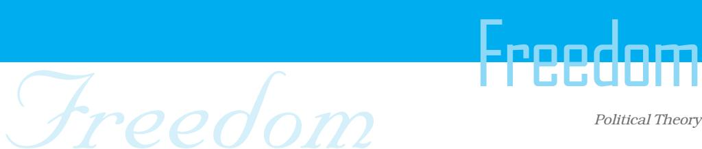
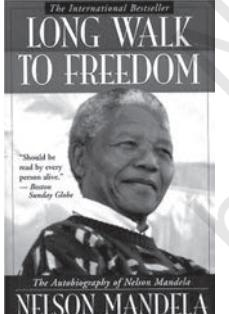
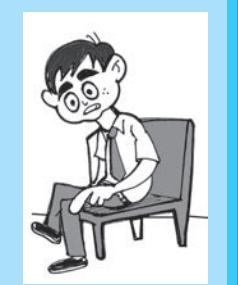
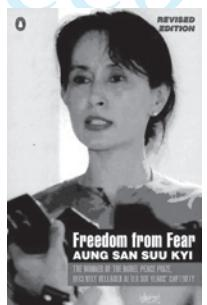
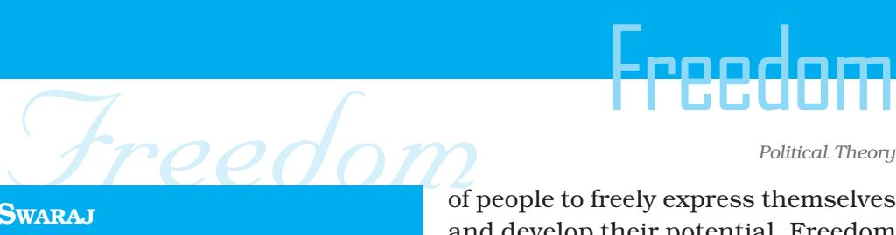
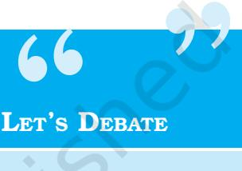
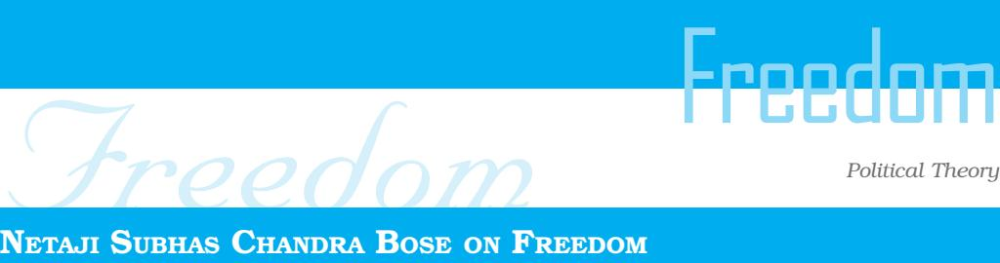
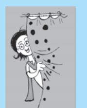
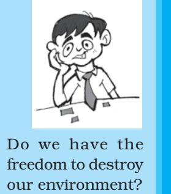

Freedom

Overview

Chapter 2

Human history provides many examples of people and communities which have been dominated, or enslaved, or exploited, by more powerful groups. But it also provides us with inspiring examples of heroic struggles against such domination. What is this freedom for which people have been willing to sacrifice and die? In its essence, the struggle for freedom represents the desire of people to be in control of their own lives and destinies and to have the opportunity to express themselves freely through their choices and activities. Not just individuals but societies also value their independence and wish to protect their culture and future.

However, given the diverse interests and ambitions of people any form of social living requires some rules and regulation. These rules may require some constraints to be imposed on the freedom of individuals but it is recognised that such constraints may also free us from insecurity and provide us with the conditions in which we can develop ourselves. In political theory much of the discussion regarding freedom has therefore focused on trying to evolve principles by which we can distinguish between socially necessary constraints and other restrictions. There has also been debate about possible limitations on freedom which may result from the social and economic structures of a society. In this chapter we will look at some of these debates.

After studying this chapter you should be able to:

- o Understand the importance of freedom for individuals and societies.
- o Explain the difference between the negative and positive dimensions of freedom.
- o Explain what is meant by the term 'harm principle'.

# **2.1 THE IDEAL OF FREEDOM**

Before we set out to answer these questions, let us stop for a moment and consider this. The autobiography of one of the greatest persons of the twentieth century, Nelson Mandela, is titled *Long Walk to Freedom.* In this book he talks about his personal struggle against the apartheid regime in South Africa, about the resistance of his people to the segregationist policies of the white regime, about the humiliations, hardships and police brutalities suffered by the black people of South Africa. These ranged from being bundled into townships and being denied easy movement about the country, to being denied a free choice of whom to marry. Collectively, such measures constituted a body of constraints imposed by the apartheid regime that discriminated between citizens based on their race. For Mandela and his colleagues it was the struggle against such unjust constraints, the struggle to remove the obstacles to the freedom of all the people of South Africa (not just the black or the coloured but also the white people), that was

the *Long Walk to Freedom***.**

For this freedom, Mandela spent twenty-seven years of his life in jail, often in solitary

confinement. Imagine what it meant to give up one's youth for an ideal, to voluntarily give up the pleasure of talking with one's friends, of playing one's favourite game

(Mandela loved boxing), of wearing one's favourite clothes, of listening to one's favourite music, of enjoying the many festivals that are part of one's life. Imagine giving all these up and choosing instead to be locked up alone in a room, not knowing when one would be released, only because one campaigned for the freedom of one's people. For freedom Mandela paid

Do only great men and women fight for great principles like freedom? What does this principle mean to me?

# Freedom Freedom

### *Political Theory*

Now, take another case. Gandhiji's thoughts on non-violence have been a source of inspiration for Aung San Suu Kyi as she remained under house arrest in Myanmar, separated from her children, unable to visit her husband when he was dying of cancer, because she feared that if she left Myanmar to visit him in England she would not be able to return. Aung San Suu Kyi saw her freedom as connected to the freedom of her people. Her book

of essays bears the title *Freedom from Fear*. She says, "for me real freedom is freedom from fear and unless you can live free from fear you cannot live a dignified human life". These are deep thoughts that lead us to pause and consider their implications. We must not, her words suggest, be afraid of the opinions of other people, or of the attitude of authority, or of the reactions of the members of our community to the things we want to do, of the ridicule of our peers, or of speaking our mind. Yet we find that we often exhibit such fear. For Aung San Suu Kyi living a 'dignified human life' requires us to be able to overcome such fear.

From these two books of Nelson Mandela and Aung San Suu Kyi, we can see the power of the ideal of freedom, an ideal that was at the centre of our national struggle and the struggles of the peoples of Asia and Africa against British, French and Portuguese colonialism.

# 2.2 WHAT IS FREEDOM?

A simple answer to the question 'what is freedom' is absence of constraints. Freedom is said to exist when external constraints on the individual are absent. In terms of this definition an individual could be considered free if he/she is not subject to external controls or coercion and is able to make independent decisions and act in an autonomous way. However, absence of constraints is only one dimension of freedom. Freedom is also about expanding the ability

### LET'S DO IT

Can you think of someone in your village, town or district who has struggled for his/her own freedom or the freedom of others? Write a short note about that person and the particular aspect of freedom which he/she struggled to protect.

Do

### SWARAJ

A concept analogous to Freedom in Indian political thought is '*Swaraj*'. The term *Swaraj* incorporates within it two words — *Swa* (Self) and *Raj* (Rule). It can be understood to mean both the rule of the self and rule over self. *Swaraj*, in the context of the freedom struggle in India referred to freedom as a constitutional and political demand, and as a value at the social-collective level. That is why *Swaraj* was such an important rallying cry in the freedom movement inspiring Tilak's famous statement — "*Swaraj* is my birth right and I shall have it."

It is the understanding of *Swaraj* as Rule over the Self that was highlighted by Mahatma Gandhi in his work *Hind Swaraj* where he states, "It is *Swaraj* when we learn to rule ourselves". *Swaraj* is not just freedom but liberation in redeeming one's self-respect, self-responsibility, and capacities for self-realisation from institutions of dehumanisation. Understanding the real 'Self ', and its relation to communities and society, is critical to the project of attaining *Swaraj*.

Gandhiji believed the development that follows would liberate both individual and collective potentialities guided by the principle of justice. Needless to say, such an understanding is as relevant to the twenty first century as it was when Gandhiji wrote the *Hind Swaraj* in 1909.

of people to freely express themselves and develop their potential. Freedom in this sense is the condition in which people can develop their creativity and capabilities.

Both these aspects of freedom — the absence of external constraints as well as the existence of conditions in which people can develop their talents — are important. A free society would be one which enables all its members to develop their potential with the minimum of social constraints.

No individual living in society can hope to enjoy total absence of any kind of constraints or restrictions. It becomes necessary then to determine which social constraints are justified and which are not, which are acceptable and which should be removed. To understand which social constraints are necessary, discussions on freedom need to look at the core relationship between the individual and the society (or group, community, or state) within which she/he is placed. That is, we need to examine the relationship between individual and society. We would need to see which features of the society allow the individual the freedom to choose, decide or act, and which do not. We would need to determine which features are desirable and which are not, which should be removed and which should not. Further we need to see if the

Freedom Freedom principles which we use to differentiate necessary from unnecessary constraints also apply to the relationships between individuals and groups and nations.

Thus far we have defined freedom as the absence of constraint. To be free means to reduce or minimise social constraints that limit our ability to make choices freely. However, this is only one aspect of freedom. To put it in another way, freedom also has a positive dimension. To be free a society must widen the area in

which individuals, groups, communities or nations, will be able to charter their own destiny and be what they wish to be. Freedom, in this sense, allows the full development of the individual's creativity, sensibilities and capabilities: be it in sports, science, art, music or exploration. A free society is one that enables one to pursue one's interests with a minimum of constraints. Freedom is considered valuable because it allows us to make choices and to exercise our judgement. It permits the exercise of the individual's powers of reason and judgement.

Girls and boys should be free to decide whom they wish to marry. Parents should have no say in this matter."

# The Sources of Constraints

Restrictions on the freedom of individuals may come from domination and external controls. Such restrictions may be imposed by force or they may be imposed by a government through laws which embody the power of the rulers over the people and which may have the backing of force. This was the form of constraint represented by colonial rulers over their subjects, or by the system of apartheid in South Africa. Some form of government may be inevitable but if the government is a democratic one, the members of a state could retain some control over their rulers. That is why democratic government is considered to be an important means of protecting the freedom of people.

But constraints on freedom can also result from social inequality of the kind implicit in the caste system, or which result from extreme economic inequality in a society. The quotation from Subhas Chandra Bose on freedom draws attention to the need for the country to work to remove such constraints.

### NETAJI SUBHAS CHANDRA BOSE ON FREEDOM

"If we are to bring about a revolution of ideas we have first to hold up before us an ideal which will galvanise our whole life. That ideal is freedom. But freedom is a word which has varied connotations and, even in our country, the conception of freedom has undergone a process of evolution. By freedom I mean all round freedom, i.e., freedom for the individual as well as for society; freedom for the rich as well as for the poor; freedom for men as well as for women; freedom for all individuals and for all classes. This freedom implies not only emancipation from political bondage but also equal distribution of wealth, abolition of caste barriers and social iniquities and destruction of communalism and religious intolerance. This is an ideal which may appear Utopian to hard-headed men and women, but this ideal alone can appease the hunger in the soul."

(*Presidential Address to the Student's Conference held at Lahore on 19 October 1929*)

# 2.3 WHY DO WE NEED CONSTRAINTS?

We cannot live in a world where there are no constraints. We need some constraints or else society would descend into chaos. Differences may exist between people regarding their ideas and opinions, they may have conflicting ambitions, they may compete to control scarce resources. There are numerous reasons why disagreements may develop in a society which may express themselves through open conflict. We see people around us ready to fight for all kinds of reasons ranging from the serious to the trivial. Rage while driving on the roads, fighting over parking spaces, quarrels over housing or land, disagreements regarding whether a particular film should be screened, all these, and many other issues, can lead to conflict and violence, perhaps even loss of life. Therefore every society needs some mechanisms to control violence and settle disputes. So long as we are able to respect each other's views and do not attempt to impose our views on others we may be able to live freely and with minimum constraints. Ideally, in a free society we should be able to hold our views, develop our own rules of living, and pursue our choices.

But the creation of such a society too requires some constraints. At the very least, it requires that we be willing to respect differences of views, opinions and beliefs. However, sometimes, we think that a

22

# Freedom Freedom

### *Political Theory*

strong commitment to our beliefs requires that we must oppose all those who differ from or reject our views. We see their views or ways of living as unacceptable or even undesirable. Under such circumstances we need some legal and political restraints to ensure that differences may be discussed and debated without one group coercively imposing its views on the other. Worse still, we may be confronted with attempts to bully or harass us so that we conform to their wishes. If so, we may want stronger support from law to ensure that my freedom is protected.

The important question however is to identify which constraints on freedom are necessary and justifiable and which are not? What sort of authority, external to

### LIBERALISM

When we say that someone's parents are very 'liberal', we usually mean that they are very tolerant. As a political ideology, liberalism has been identified with tolerance as a value. Liberals have often defended the right of a person to hold and express his/her opinions and beliefs even when they disagree with them. But that is not all that there is to liberalism. And liberalism is not the only modern ideology that supports tolerance.

What is more distinctive about modern liberalism is its focus on the individual. For liberals entities like family, society, community have no value in themselves, but only if these are valued by individuals. They would say, for example, that the decision to marry someone should be taken by the individual rather than by the family, caste or the community. Liberals tend to give priority to individual liberty over values like equality. They also tend to be suspicious of political authority.

Historically, liberalism favoured free market and minimal role to the state. However, present day liberalism acknowledges a role for welfare state and accepts the need for measures to reduce both social and economic inequalities.

the individual, may justifiably say what can be done and what cannot? Further, are there any areas of our life and action that should be left free of all external constraints?

# 2.4 HARM PRINCIPLE

To answer these questions satisfactorily we have to address the issue of the limits, competence, and consequences of the imposition. We also have to engage with another issue that John Stuart Mill stated so eloquently in his essay *On Liberty*. In the discussions in

# 23

Freedom Freedom political theory it is called the 'harm principle'. Let us quote his statement and then try to explain it.

Why does he talk about 'mankind'? What about women?

*...the sole end for which mankind are warranted, individually or collectively, in interfering with the liberty of action of any of their number, is self-protection. That the only purpose for which power can be rightfully exercised over any member of a civilised community, against his will, is to prevent harm to others.*

Mill introduces here an important distinction. He distinguishes between 'self-regarding' actions, i.e., those actions that have consequences only for the individual actor and nobody else, and 'other regarding' actions, i.e., those actions that also have consequences for others.

He argues that with respect to actions or choices that affect only one's self, self-regarding actions, the state (or any other external authority) has no business to interfere. Or put in simple language it would be: 'That's my business, I'll do what I like', or 'How does it concern you, if it does not affect you?' In contrast, with respect to actions that have consequences for others, actions which may cause harm to them, there is some case for external interference. After all if your actions cause me harm then surely I must be saved from such harm by some external authority? In this case it is the state which can constrain a person from acting in a way that causes harm to someone else.

However, as freedom is at the core of human society, is so crucial for a dignified human life, it should only be constrained in special circumstances. The 'harm caused' must be 'serious'. For minor harm, Mill recommends only social disapproval and not the force of law. For example the playing of loud music in an apartment building should bring only social disapproval from the other residents of the building. They should not involve the police. They should indicate their disapproval, of the inconvenience that playing loud music has caused them, by perhaps refusing to greet the person who plays the music disregarding the harm it is causing others. The harm that playing loud music causes is that of preventing those in other apartments from talking, or sleeping, or listening to their own music.

Freedom Freedom This is minor harm and should only provoke social disapproval. It is not a fit case for legal punishment. Constraining actions by the force of law should only happen when the other regarding actions cause serious harm to definite individuals. Otherwise society must bear the inconvenience in the spirit of protecting freedom.

# LET'S THINK

### The Issue of Dress Code

If choosing what to wear is an expression of one's freedom then how should we look at the following situations where there are restrictions on dress?

- o In China during Mao's regime all the people had to wear 'Mao suits' based on the argument that it was an expression of equality.
- o A *fatwa* was issued against Sania Mirza for her style of dress that was considered, by one cleric, to be against the dress code prescribed for women.
- o The rules of a test match in cricket require every cricketer to wear white dress.
- o Students are required to wear school uniforms.

Let us debate some questions.

- o Is the restriction on what to wear justified in all cases or only in some? When does it constitute a constraint on freedom?
- o Who has the authority to impose these constraints? Should religious leaders be given the authority to issue decrees on dress? Can the state decide what one should wear? Should the ICC set down rules of what to wear when playing cricket?
- o Is the imposition excessive? Does it diminish the many ways, people have of expressing themselves?
- o What are the consequences of accepting the impositions? Will the society become 'equal' if everyone dresses the same way as in Maoist China? Or are women being denied the participation in sports if they cannot wear clothes that would help them to compete effectively? Will the game be affected if cricketers wear coloured clothes?

People should be ready to tolerate different ways of life, different points of view, and the different interests, so long as they do not cause harm to others. But such tolerance need not be extended to views and actions which may put people in danger or foment hatred

# 25

Freedom Freedom against them. Hate campaigns cause serious harm to the freedom of others and actions that cause 'serious harm' are actions on which constraints can be imposed. But we must make sure that the constraints imposed are not so severe that they destroy freedom itself. For example, we must not ask for life imprisonment for those who only conduct hate campaign. Maybe some restriction on their movement, or some curtailment of their right to hold public meetings can be considered especially if they continue to carry on this campaign in spite of warnings by the state to desist from conducting such campaigns.

> In the constitutional discussions in India, the term used for such justifiable constraints is 'reasonable restrictions'. The restrictions may be there but they must be reasonable, i.e., capable of being defended by reason, not excessive, not out of proportion to the action being restricted, since then it would impinge on the general condition of freedom in society. We must not develop a habit of imposing restrictions since such a habit is detrimental to freedom.

# 2.5 NEGATIVE AND POSITIVE LIBERTY

Earlier in the chapter we had mentioned two dimensions of freedom school— freedom as the absence of external constraints, and freedom as the expansion of opportunities to express one's self. In political theory these have been called negative and positive liberty. 'Negative liberty' seeks to define and defend an area in which the individual would be inviolable, in which he or she could 'do, be or become' whatever he or she wished to 'do, be or become'. This is an area in which no external authority can interfere. It is a minimum area that is sacred and in which whatever the individual does, is not to be interfered with. The existence of the 'minimum area of noninterference' is the recognition that human nature and human dignity need an area where the person can act unobstructed by others. How big should this area be, or what should it contain, are matters of discussion, and will continue to be matters of debate since the bigger the area of non-interference the more the freedom.

All we need to recognise is that the negative liberty tradition argues for an inviolable area of non-interference in which the individual can express himself or herself. If the area is too small

Freedom Freedom then human dignity gets compromised. We may here ask the obvious question: Is the choice of what clothes to wear in different situations – school, playing-field, office – a choice that belongs to the minimum area and therefore one that cannot be interfered with by external authority or is it a choice that can be interfered with by state, religious authority, ICC or CBSE. Negative liberty arguments are in response to the question: 'Over what area am I the master?' It is concerned with explaining the idea of 'freedom from'.

In contrast, the arguments of positive liberty are concerned with explaining the idea of 'freedom to'. They are in response to the answer 'who governs me?' to which the ideal answer is 'I govern myself '. Positive liberty discussions have a long tradition that can be traced to Rousseau, Hegel, Marx, Gandhi, Aurobindo, and also to those who draw their inspiration from these thinkers. It is concerned with looking at the conditions and nature of the relationship between the individual and society and of improving these conditions such that there are fewer constraints to the development of the individual personality. The individual is like a flower that blossoms when the soil is fertile, and the sun is gentle, and the water is adequate, and the care is regular.

The individual to develop his or her capability must get the benefit of enabling positive conditions in material, political and social domains. That is, the person must not be constrained by poverty or unemployment; they must have adequate material resources to pursue their wants and needs. They must also have the opportunity to participate in the decision making process so that the laws made reflect their choices, or at least take those preferences into account. Above all, to develop their mind and intellect, individuals must have access to education and other associated opportunities necessary to lead a reasonably good life.

Positive liberty recognises that one can be free only in society (not outside it) and hence tries to make that society such that it enables the development of the individual whereas negative liberty is only concerned with the inviolable area of non-interference and not with the conditions in society, outside this area, as such. Of course negative liberty would like to expand this minimum area as

27

Freedom Freedom much as is possible keeping in mind, however, the stability of society. Generally they both go together and support each other, but it can happen that tyrants justify their rule by invoking arguments of positive liberty.

### Freedom of Expression

One of the issues that is considered to belong to the minimum area of 'non-interference' is the freedom of expression. J.S.Mill set out good reasons why freedom of expression should not be restricted. This is a good case for discussion.

At various times there have been demands to ban books, plays, films, or academic articles in research journals. Let us think about this demand to ban books in the light of our discussion so far which sees freedom as 'the making of choices', where a distinction is made between 'negative and positive liberty', where we recognise the need for 'justifiable constraints' but these have to be supported by proper procedures and important moral arguments. Freedom of expression is a fundamental value and for that society must be willing to bear some inconvenience to protect it from people who want to restrict it. Remember Voltaire's statement — 'I disapprove of what you say but I will defend to death your right to say it'. How deeply are we committed to this freedom of expression?

Some years ago Deepa Mehta, film maker, wanted to make a film about widows in Varanasi. It sought to explore the plight of widows but there was a strong protest from a section of the polity who felt that it would show India in a very bad light, who felt it was being made to cater to foreign audiences, who felt it would bring a bad name to the ancient town. They refused to allow it to be made and as a result it could not be made in Varanasi. It was subsequently made elsewhere. Similarly the book *Ramayana Retold* by Aubrey Menon and *The Satanic Verses* by Salman Rushdie were banned after protest from some sections of society. The film *The Last Temptation of Christ* and the play *Me Nathuram Boltey* were also banned after protests.

Banning is an easy solution for the short term since it meets the immediate demand but is very harmful for the long-term prospects of freedom in a society because once one begins to ban then one develops a habit of banning. But does this mean that we should never ban? After all we do have censorship of films. Is it not similar

# Freedom Freedom

### *Political Theory*

to banning, where only a portion of a film is banned and not the whole film? The question that is often debated, therefore, is: When should one ban and when should one not? Should one never ban? Just for interest, in England anyone who is employed to work for the Royal household is constrained by contract (a constraint?) from writing about the inner affairs of the household. So if such a person were to leave the employment they would be unable to give an interview or write an article or author a book about the politics of the Royal household. Is this an unjustifiable constraint on the freedom of expression?

Constraints of different kind thus exist and we are subject to them in different situations. While reflecting on such situations we need to realise that when constraints are backed by organised social — religious or cultural — authority or by the might of the state, they restrict our freedom in ways that are difficult to fight against. However, if we willingly, or for the sake of pursuing our goals or ambitions, accept certain restrictions, our freedom is not similarly limited. In any case if we are not coerced into accepting the conditions, then we cannot claim that our freedom has been curtailed.

### FREEDOM OF EXPRESSION

John Stuart Mill, a political thinker and an activist in the nineteenth century Britain, offered a passionate defence of freedom of expression, including freedom of thought and discussion. In his book *On Liberty* he offered four reasons why there should be freedom of expression even for those who espouse ideas that appear 'false' or misleading today.

First, no idea is completely false. What appears to us as false has an element of truth. If we ban 'false' ideas, we would lose that element of truth that they contain.

This is related to the second point. Truth does not emerge by itself. It is only through a conflict of opposing views that truth emerges. Ideas that seem wrong today may have been very valuable in the emergence of what we consider right kind of ideas.

Thirdly, this conflict of ideas is valuable not just in the past but is of continuing value for all times. Truth always runs the risk of being reduced to an unthinking cliché. It is only when we expose it to opposing views that we can be sure that this idea is trustworthy.

Finally, we cannot be sure that what we consider true is actually true. Very often ideas that were considered false at one point by the entire society and, therefore, suppressed turned out to be true later on. A society that completely suppresses all ideas that are not acceptable today, runs the danger of losing the benefits of what might turn out to be very valuable knowledge.

Freedom Freedom We began by saying that freedom is the absence of external constraints. We have now come to realise that freedom embodies our capacity and our ability to make choices. And when we make choices, we have also to accept responsibility for our actions and their consequences. It is for this reason that most advocates of liberty and freedom maintain that children must be placed in the care of parents. Our capacity to make the right choices, to assess in a reasoned manner available options, and shoulder the responsibility of our actions, have to be built through education and cultivation of judgement just as much as it needs to be nurtured by limiting the authority of the state and the society.

- 1. What is meant by freedom? Is there a relationship between freedom for the individual and freedom for the nation?
- 2. What is the difference between the negative and positive conception of liberty?
- 3. What is meant by social constraints? Are constraints of any kind necessary for enjoying freedom?
- 4. What is the role of the state in upholding freedom of its citizens?
- 5. What is meant by freedom of expression? What in your view would be a reasonable restriction on this freedom? Give examples.

*Credit: Images on opening page: http://www.africawithin.com (Nelson Mandela) and http://www.ibiblio.org (Suu Kyi)*

