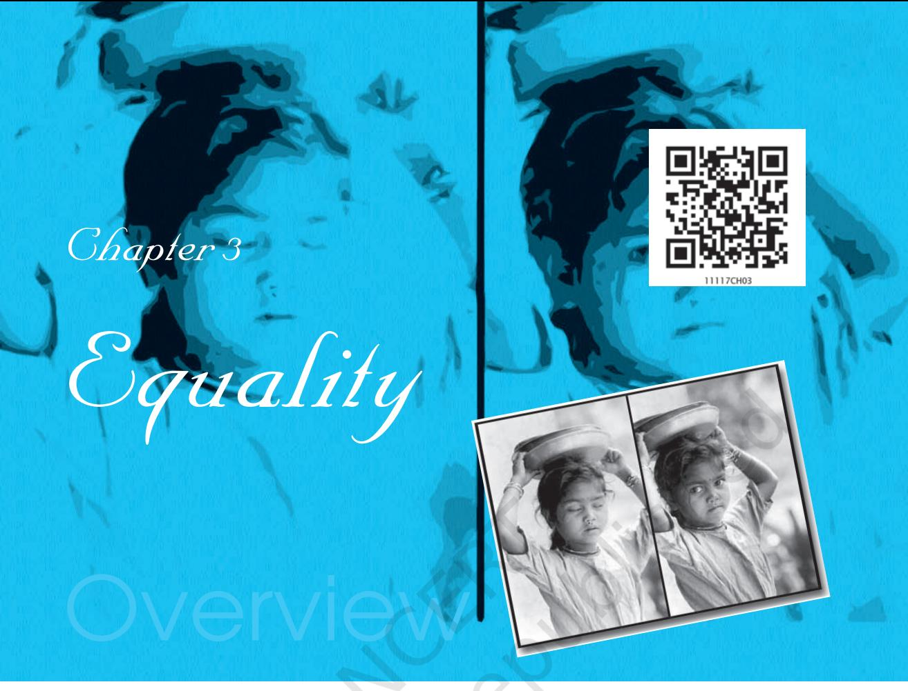

This chapter is about the concept of equality, a value that is also enshrined in our Constitution. In reflecting on this concept it examines the following questions:

- o What is equality? Why should we be concerned about this moral and political ideal?
- o Does the pursuit of equality involve treating everyone the same way in every condition?
- o How may we pursue equality and minimise inequality in different spheres of life?
- o How do we distinguish between different dimensions of equality political, economic and social?

In the course of understanding and answering these questions, you would encounter some important ideologies of our time — socialism, marxism, liberalism and feminism.

*In this chapter you will see facts and figures about the conditions of inequality. These are only for you to appreciate the nature of inequality; the facts and figures need not be memorised.*

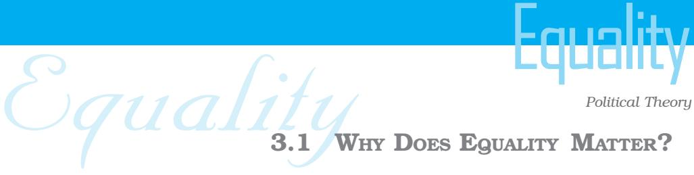

## 3.1 WHY DOES EQUALITY MATTER?

Equality is a powerful moral and political ideal that has inspired and guided human society for many centuries. It is implicit in all faiths and religions which proclaim all human beings to be the creation of God. As a political ideal the concept of equality invokes the idea that all human beings have an equal worth regardless of their colour, gender, race, or nationality. It maintains that human beings deserve equal consideration and respect because of their common humanity. It is this notion of a shared humanity that lies behind, for instance, the notions of universal human rights or 'crimes against humanity'.

# LET'S DO IT Do

Search for quotations from different religious scriptures that affirm the ideal of equality. Read these in the classroom.

In the modern period the equality of all human beings has been used as a rallying slogan in the struggles against states and social institutions which uphold inequalities of rank, wealth status or privilege, among people. In the eighteenth century, the French revolutionaries used the slogan 'Liberty, Equality and Fraternity' to revolt against the landed feudal aristocracy and the monarchy. The demand for equality was also raised during anti-colonial liberation struggles in Asia and Africa during the twentieth century. It continues to be raised by struggling groups such as

Everyone I know believes in a religion. Every religion I know preaches equality. Then why is there inequality in the world?

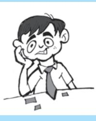

32

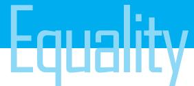

Equality Equality women or *dalits* who feel marginalised in our society. Today, equality is a widely accepted ideal which is embodied in the constitutions and laws of many countries.

Yet, it is inequality rather than equality which is most visible around us in the world as well as within our own society. In our country we can see slums existing side by side with luxury housing, schools with world class facilities and airconditioned classrooms along with schools which may lack even drinking water facilities or toilets, waste of food as well as starvation. There are glaring differences between what the law promises and what we see around us.

Read the accompanying fact sheet on global inequalities and the table on inequalities within our country.

#### FACT SHEET ON GLOBAL INEQUALITIES

- 1. The richest 50 individuals in the world have a combined income greater than that of the poorest 40 crore people.
- 2. The poorest 40 per cent of the world's population receive only 5 per cent of global income, while the richest 10 per cent of the world's population controls 54 per cent of global income.
- 3. The first world of the advanced industrial countries, mainly North America and Western Europe, with 25 per cent of the world's population, owns 86 per cent of the world's industry, and consumes 80 per cent of the world's energy.
- 4. On a per capita basis, a resident of the advanced industrial countries consumes at least three times as much water, ten times as much energy, thirteen times as much iron and steel and fourteen times as much paper as someone living in a developing country like India or China.
- 5. The risk of dying from pregnancy related causes is 1 to 18 in Nigeria but 1 to 8700 in Canada.
- 6. The industrial countries of the first world account for nearly two-thirds of the global emissions of carbon dioxide from the combustion of fossil fuels. They also account for three-quarters of emissions of sulphur and nitrogen oxide that cause acid rain. Many industries known for their high rate of pollution are being shifted from the developed countries to the less developed countries.

*Source: Human Development Report, 2005, UNDP.*

33

33

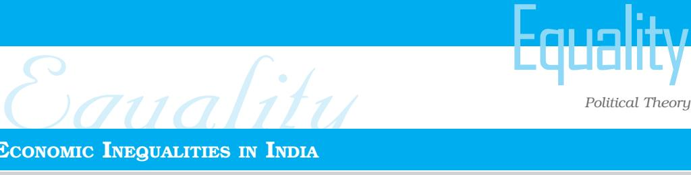

#### ECONOMIC INEQUALITIES IN INDIA

Here are some findings from the Census of India held in 2011 about household amenities and assets. You don't need to memorise any of these figures. Just read these to understand the extent of urban-rural disparities in the country. Where would your own family fit?

| Families that have… | Rural | Urban | Put û or ü for |
| --- | --- | --- | --- |
|  | families | families | your family |
| Electricity connection | 55% | 93% |  |
| Tap water in the house | 35% | 71% |  |
| Bathroom in the house | 45% | 87% |  |
| Television | 33% | 77% |  |
| Scooter/Moped/ Motorcycle | 14% | 35% |  |
| Car/Jeep/ Van | 2% | 10% |  |

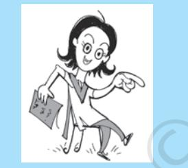

Why talk about global or national inequalities when all around us there are inequalities to which nobody seems to object? Just look at the way my parents favour my brother over me.

Thus we face a paradox : almost everyone accepts the ideal of equality, yet almost everywhere we encounter inequality. We live in a complex world of unequal wealth, opportunities, work situations, and power. Should we be concerned about these kinds of inequalities? Are they a permanent and inevitable feature of social life which reflects the differences of talent and ability of human beings as well as their different contributions towards social progress and prosperity? Or are these inequalities a consequence of our social position and rules? These are questions that have troubled people all over the world for many years.

It is a question of this kind that makes equality one of the central themes of social and political theory. A student of political theory has to address a range of questions, such as, what does equality imply?

Since we are different in many obvious ways, what does it mean to say that we are equal? What are we trying to achieve through the ideal of equality? Are we trying to eliminate all differences of income and status? In other words, what kind of equality are we pursuing, and for whom? Some other questions that have been raised regarding

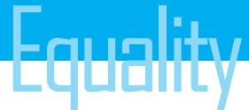

Equality Equality the concept of equality which we will consider here are : to promote equality should we always treat all persons in exactly the same way? How should a society decide which differences of treatment or reward are acceptable and which are not? Also, what kind of policies should we pursue to try and make the society more egalitarian?

### 3.2 WHAT IS EQUALITY?

Take a look at these images.

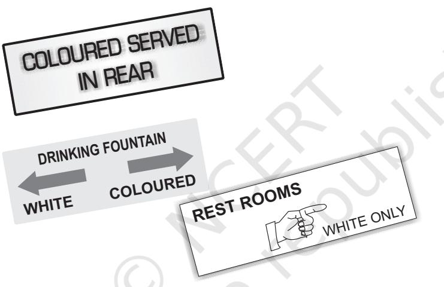

All of them make distinctions between human beings on grounds of race and colour and these appear to most of us as unacceptable. In fact, such distinctions violate our intuitive understanding of equality which tells us that all human beings should be entitled to the same respect and consideration because of their common humanity.

However, treating people with equal respect need not mean always treating them in an identical way. No society treats all its members in exactly the same way under all conditions. The smooth functioning of society requires division of work and functions and people often enjoy different status and rewards on account of it. At times these differences of treatment may appear acceptable or even necessary. For instance, we usually do not feel that giving prime ministers, or army generals, a special official rank and status goes against the notion of equality, provided their privileges are not misused. But

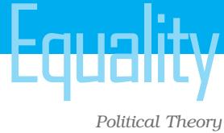

Equality Equality some other kinds of inequalities may seem unjust. For instance, if a child born in a slum is denied nutritious food or good education through no fault of his/her own, it may appear unfair to us.

> The question that arises is which distinctions and differences are acceptable and which are not? When people are treated differently just because they are born in a particular religion or race or caste or gender, we regard it as an unacceptable form of inequality. But human beings may pursue different ambitions and goals and not all may be equally successful. So long as they are able to develop the best in themselves we would not feel that equality has been undermined. Some may become good musicians while others may not be equally outstanding, some become famous scientists while others more noted for their hard work and conscientiousness. The commitment to the ideal of equality does not imply the elimination of all forms of differences. It merely suggests that the treatment we receive and the opportunities we enjoy must not be pre-determined by birth or social circumstance.

#### Equality of Opportunities

The concept of equality implies that all people, as human beings, are entitled to the same rights and opportunities to develop their skills and talents, and to pursue their goals and ambitions. This means that in a society people may differ with regard to their choices and preferences. They may also have different talents and skills which results in some being more successful in their chosen careers than others. But just because only some become ace cricketers or successful lawyers, it does not follow that the society should be considered unequal. In other words, it is not the lack of equality of status or wealth or privilege that is significant but the inequalities in people's access to such basic goods, as education, health care, safe housing, that make for an unequal and unjust society.

### Natural and Social Inequalities

A distinction has sometimes been made in political theory between natural inequalities and socially-produced inequalities. Natural inequalities are those that emerge between people as a result of their different capabilities and talents. These kinds of inequalities

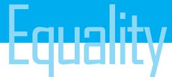

Equality Equality are different from socially-produced inequalities which emerge as a consequence of inequalities of opportunity or the exploitation of some groups in a society by others.

> Men are superior to women. It is a natural inequality. You can't do anything about it.

I get more marks than you in every subject. And I also help my mother in housework. What makes you superior?

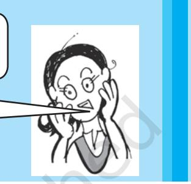

Natural inequalities are considered to be the result of the different characteristics and abilities with which people are born. It is generally assumed that natural differences cannot be altered. Social inequalities on the other hand are those created by society. Certain societies may, for instance, value those who perform intellectual work over those who do manual work and reward them differently. They may treat differently people of different race, or colour, or gender, or caste. Differences of this kind reflect the values of a society and some of these may certainly appear to us to be unjust.

This distinction is sometimes useful in helping us to distinguish between acceptable and unfair inequalities in society but it is not always clear or self-evident. For instance, when certain inequalities in the treatment of people have existed over a long period of time they may appear to us as justifiable because they are based on natural inequalities, that is, characteristics that people are born with and cannot easily change. For example, women were for long described as 'the weaker sex', considered timid and of lesser intelligence than men, needing special protection. Therefore, it was felt that denying women equal rights could be justified. Black people in Africa were considered by their colonial masters to be of lesser intelligence, child-like, and better at manual work, sports and music. This belief was used to justify institutions like slavery. All these assessments are now questioned. They are now seen as

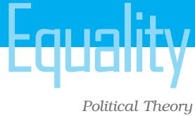

Equality Equality distinctions made by society as a result of the differences of power between people and nations rather than based on their inborn characteristics.

> Another problem which arises with the idea of natural differences is that some differences which could be considered natural need no longer be seen as unalterable. For instance, advances in medical science and technologies have helped many disabled people to function effectively in society. Today, computers can help blind people, wheel chairs and artificial limbs can help in cases of physical disability, even a person's looks can be changed with cosmetic surgery. The famous physicist Stephen Hawking can hardly move or speak but he has made major contributions to science. It would seem unjust to most people today if disabled people are denied necessary help to overcome the effects of their disability or a fair reward for their work on the grounds that they are naturally less capable.

> Given all these complexities, it would be difficult to use the natural/ socially-produced distinction as a standard by which the laws and policies of a society can be assessed. For this reason many theorists today differentiate between inequality arising from our choices and inequalities operating on account of the family or circumstance in which a person is born. It is the latter that is a source of concern to advocates of equality and which they wish to minimise and eliminate.

## 3.3 THREE DIMENSIONS OF EQUALITY

After considering what kind of social differences are unacceptable we need to ask what are the different dimensions of equality that we may pursue or seek to achieve in society. While identifying different kinds of inequalities that exist in society, various thinkers and ideologies have highlighted three main dimensions of equality namely, political, social and economic. It is only by addressing each of these three different dimensions of equality can we move towards a more just and equal society.

#### Political Equality

In democratic societies political equality would normally include granting equal citizenship to all the members of the state. As you

Equality Equality will read in the chapter on Citizenship, equal citizenship brings with it certain basic rights such as the right to vote, freedom of expression, movement and association and freedom of belief. These are rights which are considered necessary to enable citizens to develop themselves and participate in the affairs of the state. But they are legal rights, guaranteed by the constitution and laws. We know that considerable inequality can exist even in countries which grant equal rights to all citizens. These inequalities are often the result of differences in the resources and opportunities which are available to citizens in the social and economic spheres. For this reason a demand is often made for equal opportunities, or for 'a level playing field'. But we should remember that although political and legal equality by itself may not be sufficient to build a just and egalitarian society, it is certainly an important component of it.

#### Social Equality

Political equality or equality before the law is an important first step in the pursuit of equality but it often needs to be supplemented by equality of opportunities. While the former is necessary to remove any legal hurdles which might exclude people from a voice in government and deny them access to available social goods, the pursuit of equality requires that people belonging to different groups and communities also have a fair and equal chance to compete for those goods and opportunities. For this, it is necessary to minimise the effects of social and economic inequalities and guarantee certain minimum conditions of life to all the members of the society adequate health care, the opportunity for good education, adequate nourishment and a minimum wage, among other things. In the absence of such facilities it is exceedingly difficult for all the members of the society to compete on equal terms. Where equality of opportunity does not exist a huge pool of potential talent tends to be wasted in society.

In India, a special problem regarding equal opportunities comes not just from lack of facilities but from some of the customs which may prevail in different parts of country, or among different groups. Women, for instance, may not enjoy equal rights of inheritance in some groups, or there may be social prohibitions regarding their taking part in certain kinds of activities, or they may even be

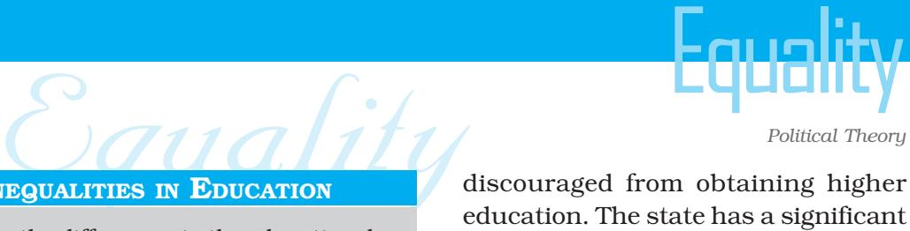

#### INEQUALITIES IN EDUCATION

Are the differences in the educational attainment of different communities depicted in the table below significant? Could these differences have taken place just by chance? Or do these differences point to the working of the caste system? Which factor other than the caste system do you see at work here?

#### Caste-community inequalities in higher education in urban India

| Castes/ | Graduates per |
| --- | --- |
| Communities | thousand |
|  | persons |
| Scheduled Caste | 47 |
| Muslim | 61 |
| Hindu–OBC | 86 |
| Scheduled Tribes | 109 |
| Christian | 237 |
| Sikh | 250 |
| Hindu–Upper Caste | 253 |
| Other Religions | 315 |
| ALL INDIA AVERAGE | 155 |

#### *Source:*

*National Sample Survey Organisation, 55th round survey, 1999-2000*

discouraged from obtaining higher education. The state has a significant role in such matters. It should make policies to prevent discrimination or harassment of women in public places or employment, to provide incentives to open up education or certain professions to women, and other such measures. But social groups and individuals also have a role to play in raising awareness and supporting those who want to exercise their rights.

#### Economic Equality

At the simplest level, we would say that economic inequality exists in a society if there are significant differences in wealth, property or income between individuals or classes. One way of measuring the degree of economic inequality in a society would be to measure the relative difference between the richest and poorest groups. Another way could be to estimate the number of

people who live below the poverty line. Of course,

absolute equality of wealth or income has probably never existed in a society. Most democracies today try to make equal opportunities available to people in the belief that this would at least give those who have talent and determination the chance to improve their condition. With equal

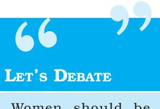

Women should be allowed to join the combat units of the army and go up to the highest position.

40

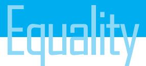

" "

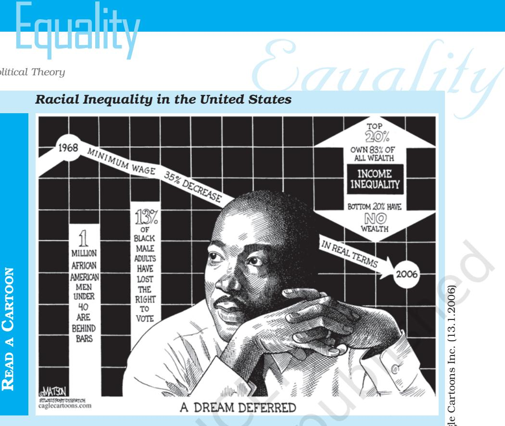

*Find out more about racial inequality in the US. Which group or groups in our country suffer from similar inequality? What kind of policies have been adopted in the US to reduce this inequality? Is there something to be learnt from their experience? Can they learn something from our experience?*

opportunities, inequalities may continue to exist between individuals but there is the possibility of improving one's position in society with sufficient effort.

 Inequalities which are entrenched, that is, which remain relatively untouched over generations, are more dangerous for a society. If in a society certain classes of people have enjoyed considerable wealth, and the power which goes with it, over generations, the society would become divided between those classes and others who have remained poor over generations. Over time such class differences can give rise to resentment and violence. Because of the power of the wealthy classes it might prove difficult to reform such a society to make it more open and egalitarian.

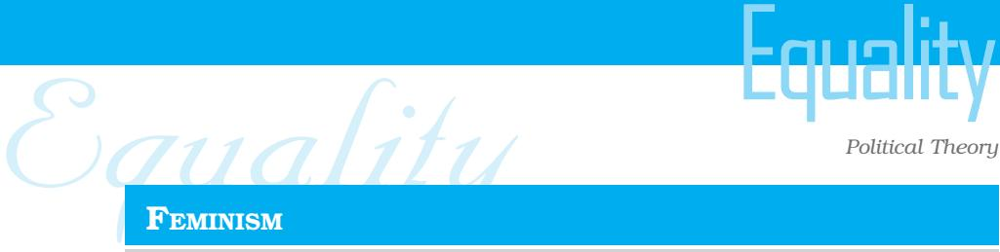

#### FEMINISM

Feminism is a political doctrine of equal rights for women and men. Feminists are those men and women who believe that many of the inequalities we see in society between men and women are neither natural nor necessary and can be altered so that both women and men can lead free and equal lives.

According to feminists, inequality between men and women in society is the

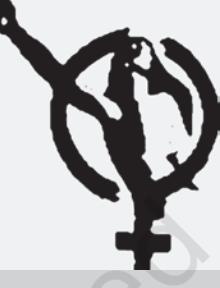

result of patriarchy. This term refers to a social, economic and cultural system that values men more than women and gives men power over women. Patriarchy is based on the assumption that men and women are different by nature and that this difference justifies their unequal positions in society. Feminists questions this way of thinking by making a distinction between "sex" i.e. biological difference between men and women, and "gender" which determines the different roles that men and women play in society. For instance, the biological fact that only women can become pregnant and bear children does not require that only women should look after children after they are born. Feminists show us that much of the inequality between men and women is produced by society and not by nature.

Patriarchy produces a division of labour by which women are supposed to be responsible for "private" and "domestic" matters

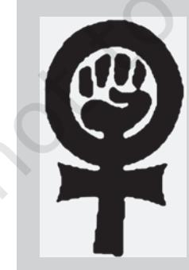

while men are responsible for work in the "public" domain. Feminists question this distinction by pointing out that in fact most women are also active in the "public" domain. That is, most women all over the world are employed in some form of work outside the home, but women continue to be solely responsible for housework as well. However, despite this "double burden" as feminists term it, women are given little or no say in decisions taken in the public domain. Feminists contend that this public/ private distinction and all forms of gender inequalities can and should be eliminated.

Equality Equality Marxism and liberalism are two important political ideologies of our times. Marx was an important nineteenth century thinker who argued that the root cause of entrenched inequality was private ownership of important economic resources such as oil, or land, or forests, as well as other forms of property. He pointed out that such private ownership did not only make the class of owners wealthy, it also gave them political power. Such power enables them to influence state policies and laws and this could prove a threat to democratic government. Marxists and socialists feel that economic inequality provides support to other forms of social inequality such as differences of rank or privilege. Therefore, to tackle inequality in society

### LET'S DO IT

Make a list of all the social and economic inequalities that you notice among the students of your own school.

Do

we need to go beyond providing equal opportunities and try and ensure public control over essential resources and forms of property. Such views may be debatable but they have raised important issues which need to be addressed.

An opposing point of view can be found in liberal theories. Liberals uphold the principle of competition as the most efficient and fair way of distributing resources and rewards in society. They believe that while states may have to intervene to try and ensure a minimum standard of living and equal opportunities for all, this cannot by itself bring equality and justice to society. Competition between people in free and fair conditions is the most just and efficient way of distributing rewards in a society. For them, as long as competition is open and free, inequalities are unlikely to become entrenched and people will get due reward for their talents and efforts.

For liberals the principle of competition is the most just and efficient way of selecting candidates for jobs or admission to educational institutions. For instance, in our country many students hope for admission to professional courses and entry is highly competitive. From time to time, the government and the courts have stepped in to regulate educational institutions and the entrance tests to ensure that everybody gets a fair and equal chance to compete. Some may still not get admission but it is considered to be a fair way of distributing limited seats.

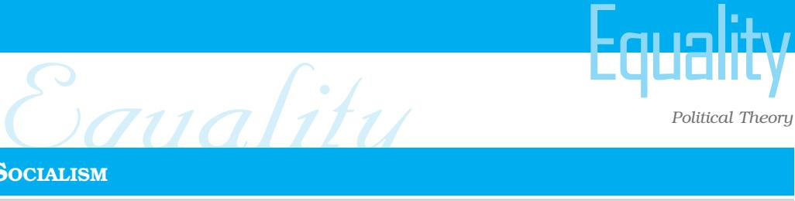

#### SOCIALISM

Socialism refers to a set of political ideas that emerged as a response to the inequalities present in, and reproduced by, the industrial capitalist economy. The main concern of Socialism is how to minimise existing inequality and distribute resources justly. Although advocates of socialism are not entirely opposed to the market, they favour some kind of government regulation, planning and control over certain key areas such as education and health care.

In India the eminent socialist thinker Rammanohar Lohia, identified five kinds of inequalities that need to be fought against simultaneously: inequality between man and woman, inequality based on skin colour, caste-based inequality, colonial rule of some countries over others, and, of course, economic inequality. This might appear a self-evident idea today. But during Lohia's time it was common for the socialists to argue that class inequality was the only form of inequality worth struggling against. Other inequalities did not matter or would end automatically if economic inequality could be ended. Lohia argued that each of these inequalities had independent roots and had to be fought separately and simultaneously. He did not speak of revolution in the singular. For him struggle against these five inequalities constituted five revolutions. He added two more revolutions to this list : revolution for civil liberties against unjust encroachments on private life and revolution for non-violence, for renunciation of weapons in favour of *Satyagraha*. These were the seven revolutions or *Sapta Kranti* which for Lohia was the ideal of socialism.

> Unlike socialists, liberals do not believe that political, economic and social inequalities are necessarily linked. They maintain that inequalities in each of these spheres should be tackled appropriately. Thus, democracy could help to provide political equality but it might be necessary to also devise different strategies to deal with social differences and economic inequalities. The problem for liberals is not inequality as such, but unjust and entrenched inequalities which prevent individuals from developing their capabilities.

### 3.4 HOW CAN WE PROMOTE EQUALITY?

We have already noted some of the basic differences among the socialists and the liberals on the most desirable way of achieving the goal of equality. While the relative merits and limitations of each of these points of view are being debated the world over, we still need to consider what principles and policies might be

Equality Equality considered necessary for pursuing equality. Specifically, we need to consider if the use of affirmative action is justified for purposes of bringing about equality. This issue has raised a lot of controversy in recent years and we will discuss this issue in the following section.

#### Establishing Formal Equality

The first step towards bringing about equality is, of course, ending the formal system of inequality and privileges. Social, economic and political inequalities all over the world have been protected by customs and legal systems that prohibited some sections of society from enjoying certain kinds of opportunities and rewards. Poor people were not granted the right to vote in a large number of countries. Women were not allowed to take up many professions and activities. The caste system in India prevented people from the 'lower' castes from doing anything except manual labour. In many countries only people from some families could occupy high positions.

Attainment of equality requires that all such restrictions or privileges should be brought to an end. Since many of these systems have the sanction of law, equality requires that the government and the law of the land should stop protecting these systems of inequality. This is what our Constitution does. The Constitution prohibits discrimination on grounds of religion, race, caste, sex or place of birth. Our Constitution also abolishes the practice of untouchability. Most modern constitutions and democratic governments have formally accepted the principle of equality and incorporated it as identical treatment by law to all citizens without any regard to their caste, race, religion or gender.

#### Equality Through Differential Treatment

However, as we noted earlier, formal equality or equality before law is necessary but not sufficient to realise the principle of equality. Sometimes it is necessary to treat people differently in order to ensure that they can enjoy equal rights. Certain differences between people may have to be taken into account for this purpose. For instance, disabled people may justifiably demand special ramps in public spaces so that they get an equal chance to enter public

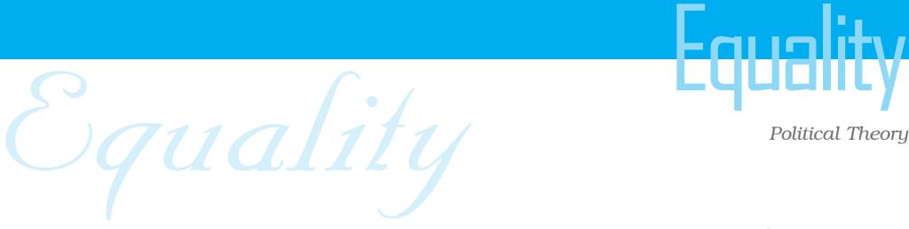

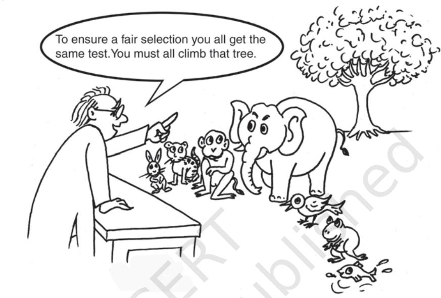

# LET'S DO IT Do

Make a list of all the facilities that students with various kinds of physical handicaps would need to learn as any other student. Which of these facilities are available in your school?

buildings. Or women working in call centres at night may need special protection during the journey to and from the centre so that their equal right to work may be protected. These should not be seen as infringements of equality but as enhancement of equality.

What kinds of differences hinder access to equal opportunities and what kinds of policies may be pursued to overcome those hindrances are questions that are being discussed in almost all societies today. Some countries have used policies of affirmative action to enhance equality of opportunity. In our country we have relied on the policy of reservations. In the next section, we will attempt to understand the idea of affirmative action and understand some of the issues raised by specific policies within that framework.

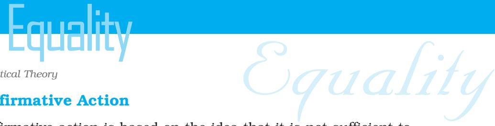

#### Affirmative Action

Affirmative action is based on the idea that it is not sufficient to establish formal equality by law. When we wish to eliminate inequalities that are deeply rooted, it is necessary to take some more positive measures to minimise and eliminate entrenched forms of social inequalities. Most policies of affirmative action are thus designed to correct the cumulative effect of past inequalities.

Affirmative action can however take many forms, from preferential spending on facilities for disadvantaged communities, such as, scholarships and hostels to special consideration for admissions to educational institutions and jobs. In our country we have adopted a policy of quotas or reserved seats in education and jobs to provide equality of opportunity to deprived groups, and this has been the subject of considerable debate and disagreement. The policy has been defended on the ground that certain groups have been victims of social prejudice and discrimination in the form of exclusion and segregation. These communities who have suffered in the past and been denied equal opportunities cannot be immediately expected to compete with others on equal terms. Therefore, in the interest of creating an egalitarian and just society they need to be given special protection and help.

Special assistance in the form of affirmative action is expected to be a temporary or time-bound measure. The assumption is that special consideration will enable these communities to overcome the existing disadvantages and then compete with others on equal terms. Although policies of affirmative action are supported for making the society more equal, many theorists argue against them. They question whether treating people differently can ever lead to greater equality.

Critics of positive discrimination, particularly policies of reservations, thus invoke the principle of equality to argue against such policies. They contend that any provision of reservations or quotas for the deprived in admissions for higher education or jobs is unfair as it arbitrarily denies other sections of society their right to equal treatment. They maintain that reservations are a form of reverse discrimination and they continue with the practices that the principle of equality questions and rejects. Equality requires that all persons

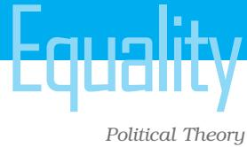

## LET'S DEBATE " "

Policies of affirmative action for the Scheduled Castes and Scheduled Tribes should be extended to admission to private educational institutions.

Equality Equality be treated alike, and when we make distinctions between individuals on the basis of their caste or colour, we are likely to reinforce caste and racial prejudices. For these theorists, the important thing is to do away with social distinctions that divide our society.

> In the context of this debate, it is relevant to draw a distinction between equality as a guiding principle of state policy and equal rights of individuals. Individuals have a right to equal consideration for admission to educational institutions and public sector employment. But competition should be fair. Sometimes when competing for limited seats or jobs people from deprived strata may be at a disadvantage. The needs and circumstances of a first generation learner whose parents and ancestors were illiterate are very different from those who are born into educated families. Members of excluded groups, whether

they are dalits, women, or any other category, deserve and need some special help. To provide this, the state must devise social policies which would help to make such people equal and give them a fair chance to compete with others.

The fact is that in the spheres of education and health care India has done far less for its deprived population than what is their due. Inequalities in school education are glaring. Many poor children in rural areas or urban slums have little chance of attending schools. If they do get the chance, their schools have little to offer that would be comparable to the facilities available in elite schools. The inequalities with which children enter school tend to continue to hamper their chances to improve their qualifications or get good jobs. These students face hurdles in gaining admission to elite professional courses because they lack the means to pay for special coaching. The fees for professional courses also may be prohibitively high. Consequently, they cannot compete on equal terms with the more privileged sections.

Social and economic inequalities of this kind hinder the pursuit of equal opportunities. Most theorists today recognise this. What they contest is not the goal of equal opportunity but the policies

Equality Equality that the state should pursue to achieve that goal. Should the state reserve seats for the deprived communities or should they provide special facilities that can help to develop talents and skills from an early age? How should we define who is deprived? Should we use an economic criterion to identify the deprived, or should we use social inequalities arising from the caste system in our country as the basis of identifying the deprived groups? These are aspects of social policy that are today being debated. Ultimately the policies that we choose would have to be justified in terms of their success in making the society more egalitarian and fair to all.

While reflecting on the issue of equality, a distinction must also be made between treating everyone in an identical manner and treating everyone as equal. The latter may on occasions need differential treatment but in all such cases the primary consideration is to promote equality. Differential or special treatment may be considered to realise the goal of equality but it requires justification and careful reflection. Since differential treatment for different communities was part and parcel of the caste system and practices like apartheid, liberals are usually very wary of deviations from the norm of identical treatment.

#### LET'S THINK

Consider the following situations. Is special and differential treatment justified in any of the following? o Working women should receive maternity leave.

- o A school should spend money to buy special equipment for two visually challenged students.
- o Geeta plays brilliant basketball, so the school should build a basketball court for her so that she can develop her skills further.
- o Jeet's parents want him to wear a turban in school, and Irfan's parents want him to pray on Friday afternoon, so the school should not insist that Jeet should wear a helmet while playing cricket, and Irfan's teacher should not ask him to stay back for extra classes on Friday.

Equality Equality Many of these issues relating to the pursuit of equality have been raised by the women's movement. In the nineteenth century women struggled for equal rights. They demanded, for instance, the right to vote, the right to receive degrees in colleges and universities and the right to work — that is, the same rights as the men in their society. However, as they entered the job market they realised that women required special facilities in order to exercise these rights. For instance, they required some provision for maternity leave and crèches in the workplace. Without special considerations of this kind, they could not seriously compete for jobs or enjoy a successful professional and personal life. They needed, in other words, sometimes to be treated differently if they are to enjoy the same rights as men.

> As we deliberate on issues of equality and examine whether different treatment is warranted in a particular case, we need continuously to ask ourselves whether differential treatment is essential to ensure that a set of people can enjoy the same rights as the rest of society. Caution must, however, be exercised to see that differential treatment does not yield new structures of dominance and oppression, or become a means for some dominant groups to reassert special privileges and power in society. Differential treatment is intended and justified only as a means to promoting a just and egalitarian society.

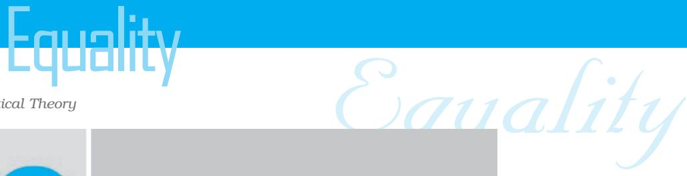

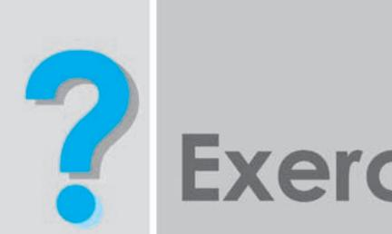

- 1. Some people argue that inequality is natural while others maintain that it is equality which is natural and the inequalities which we notice around us are created by society. Which view do you support? Give reasons.
- 2. There is a view that absolute economic equality is neither possible nor desirable. It is argued that the most a society can do is to try and reduce the gaps between the richest and poorest members of society. Do you agree?
- 3. Match the following concepts with appropriate instances:
	- (a) Affirmative action (i) Every adult citizen has a right to vote
	- (b) Equality of opportunity (ii) Banks offer higher rate of interest to senior citizen
	-
	- (c) Equal Rights. (iii) Every child should get free education
- 4. A government report on farmers' problems says that small and marginal farmers cannot get good prices from the market. It recommends that the government should intervene to ensure a better price but only for small and marginal farmers. Is this recommendation consistent with the principle of equality?
- 5. Which of the following violate the principles of equality? And why?
	- (a) Every child in class will read the text of the play by turn.
	- (b) The Government of Canada encouraged white Europeans to migrate to Canada from the end of the Second World War till 1960.
	- (c) There is a separate railway reservation counter for the senior citizens.

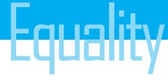

- Equality Equality (d) Access to some forest areas is reserved for certain tribal communities.
	- 6. Here are some arguments in favour of the right to vote for women. Which of these are consistent with the idea of equality? Give reasons.
		- (a) Women are our mothers. We shall not disrespect our mothers by denying them the right to vote.
		- (b) Decisions of the government affect women as well as men, therefore they also should have a say in choosing the rulers.
		- (c) Not granting women the right to vote will cause disharmony in the family.
		- (d) Women constitute half of humanity. You cannot subjugate them for long by denying them the right to vote.

Exercises

52

*Credit: Images on opening page: P. Sainath*

