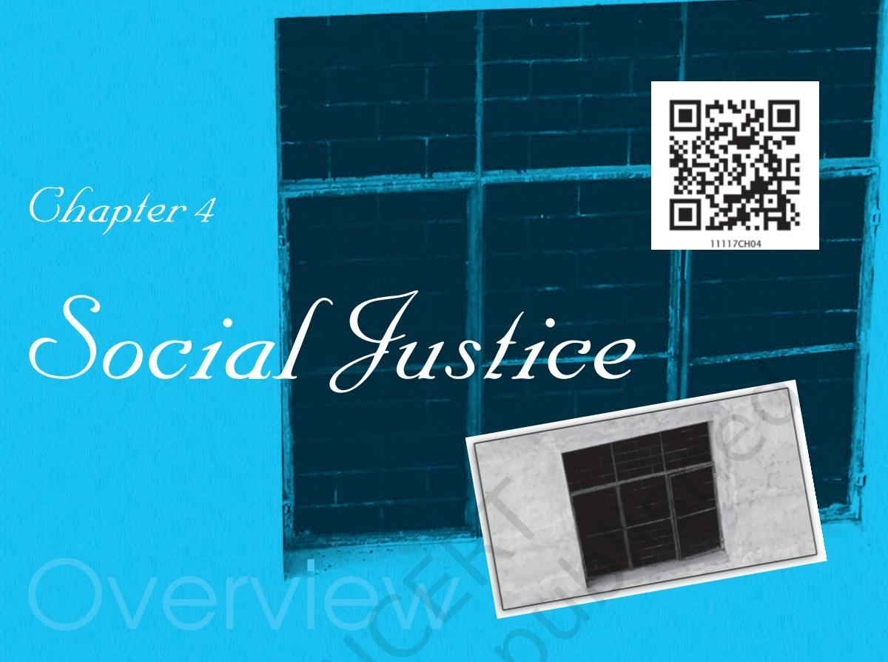

Just as we intuitively understand what love means even if we cannot explain all its different shades of meaning, we also have an intuitive understanding of justice even though we may not be able to define it precisely. In that sense justice is a lot like love. In addition, both love and justice evoke passionate responses from their advocates. And as with love, no one hates justice, everyone wants justice for oneself and to some extent for others also. But unlike love, which is an aspect of our relationships with a few people whom we know well, justice concerns our life in society, the way in which public life is ordered and the principles according to which social goods and social duties are distributed among different members of society. As such, questions of justice are of central importance for politics.

After going through this chapter you should be able to:

- o Identify some of the principles of justice which have been put forward in different societies and at different periods of time.
- o Explain what is meant by distributive justice.
- o Discuss John Rawls' argument that a fair and just society would be in the interest of all members and could be defended on rational grounds.

*Political Theory*

4.1 WHAT IS JUSTICE?

All cultures and traditions have grappled with questions of justice although they may have interpreted the concept in different ways. For instance, in ancient Indian society, justice was associated with *dharma* and maintaining *dharma* or a just social order, was considered to be a primary duty of kings. In China, Confucius, the famous philosopher argued that kings should maintain justice by punishing wrong doers and rewarding the virtuous. In fourth century B.C. Athens (Greece), Plato discussed issues of justice in his book *The Republic.* Through a long dialogue between Socrates and his young friends, Glaucon and Adeimantus, Plato examined why we should be concerned about justice. The young people ask Socrates why we should be just. They observe that people who were unjust

"They say that to do injustice is, by nature, good; to suffer injustice, evil; but that the evil is greater than the good. And so when men have both done and suffered injustice and have had experience of both, not being able to avoid the one and obtain the other, they think that they had better agree among themselves to have neither; hence there arise laws and mutual covenants; and that which is ordained by law is termed by them lawful and just."

(Glaucon to Socrates in *The Republic).*

seemed to be much better off than those who were just. Those who twisted rules to serve their interests, avoided paying taxes and were willing to lie and be deceitful, were often more successful than those who were truthful and just. If one were smart enough to avoid being caught then it would seem that being unjust is better than being just. You may have heard people expressing similar sentiments even today.

 Socrates reminds these young people that if everyone were to be unjust, if everyone manipulated rules to suit their own interests, no one could be sure of benefiting from injustice. Nobody would be secure and this was likely to harm all of them. Hence, it is in our own longterm interest to obey the laws and be just. Socrates clarified that we need to understand clearly what justice means in order to figure out why it is important to be just. He explained that justice does not only mean doing good to our friends and harm to our enemies, or pursuing our own interests. Justice involves the well-being of all people. Just as a doctor is

54

### *Political Theory*

concerned with the well-being of his/her patients, similarly the just ruler or the just government must be concerned with the well-being of the people. Ensuring the well-being of the people includes giving each person his due.

The idea that justice involves giving each person his due continues to be an important part of our present day understanding of justice. However, our understanding of what is due to a person has changed from the time of Plato. Today, our understanding of what is just is closely linked to our understanding of what is due to each person as a human being. According to the German philosopher Immanuel Kant, human beings possess dignity. If all persons are granted dignity then what is due to each of them is that they have the opportunity to develop their talents and pursue their chosen goals. Justice requires that we give due and equal consideration to all individuals.

### Equal Treatment for Equals

Although there might be broad agreement in modern society about the equal importance of all people, it is not a simple matter to decide how to give each person his/her due. A number of different principles have been put forward in this regard. One of the principles is the principle of treating equals equally. It is considered that all individuals share certain characteristics as human beings. Therefore they deserve equal rights and equal treatment. Some of the important rights which are granted in most liberal democracies today include civil rights such as the rights of life, liberty and property, political rights like the right to vote, which enable people to participate in political processes, and certain social rights which would include the right to enjoy equal opportunities with other members of the society.

Apart from equal rights, the principle of treating equals equally would require that people should not be discriminated against on grounds of class, caste, race or gender. They should be judged on the basis of their work and actions and not on the basis of the group to which they belong. Therefore, if two persons from different castes perform the same kind of work, whether it be breaking stones or delivering Pizzas, they should receive the same kind of reward. If a person gets one hundred rupees for some work and another receives only seventy five rupees for the same work because they belong to

*Political Theory*

different castes, then it would be unfair or unjust. Similarly, if a male teacher in a school gets a higher salary than a female teacher, then this difference would also be unjustifiable and wrong.

### Proportionate Justice

However, equal treatment is not the only principle of justice. There could be circumstances in which we might feel that treating everybody equally would be unjust. How, for instance, would you react if it was decided in your school that all those who did an exam should get equal marks because they are all students of the same school and did the same exam? Here you might think it would be more fair if students were awarded marks according to the quality of their answer papers and also, possibly, the degree of effort they had put in. In other words, provided everybody starts from the same base line of equal rights, justice in such cases would mean rewarding people in proportion to the scale and quality of their effort. Most people would agree that although people should get the same reward for the same work, it would be fair and just to reward different kinds of work differently if we take into account factors such as the effort required, the skills required, the possible dangers involved in that work, and so on. If we use these criteria we may find that certain kinds of workers in our society are not paid a wage which takes such factors sufficiently into account. For instance, miners, skilled craftsmen, or people in sometimes dangerous but socially useful professions like policemen, may not always get a reward which is just if we compare it to what some others in society may be earning. For justice in society, the principle of equal treatment needs to be balanced with the principle of proportionality.

### Recognition of Special Needs

A third principle of justice which we recognise is for a society to take into account special needs of people while distributing rewards or duties. This would be considered a way of promoting social justice. In terms of their basic status and rights as members of the society justice may require that people be treated equally. But even nondiscrimination between people and rewarding them proportionately to their efforts might not be enough to ensure that people enjoy equality in other aspects of their lives in society nor that the society

56

### *Political Theory*

as a whole is just. The principle of taking account of the special needs of people does not necessarily contradict the principle of equal treatment so much as extend it because the principle of treating equals equally could imply that people who are not equal in certain important respects could be treated differently.

### LET'S THINK

Examine the following situations and discuss whether they are just. In each case discuss the principle of justice that might be used in defence of your argument.

- o Suresh, a visually impaired student, gets three hours and thirty minutes to finish his mathematics paper, while the rest of the class gets only three hours.
- o Geeta walks with a limp. The teacher decided to give her also three hours and thirty minutes to finish her mathematics paper.
- o A teacher gives grace marks to the weaker students in class, to boost their morale.
- o A professor distributes different question papers to different students based on her evaluation of their capabilities.
- o There is a proposal to reserve 33 per cent of the seats in the Parliament for women.

People with special needs or disabilities could be considered unequal in some particular respect and deserving of special help. But it is not always easy to get agreement regarding which inequalities of people should be recognised for providing them special help. Physical disabilities, age or lack of access to good education or health care, are some of the factors which are considered grounds for special treatment in many countries. It is believed that if people who enjoy very different standard of living and opportunities are treated equally in all respects with those who have been deprived of even the basic minimum needs to live a healthy and productive life, the result is likely to be an unequal society, not an egalitarian and just one. In our country, lack of access to good education or health care and other such facilities is often found combined with

*Political Theory*

social discrimination on grounds of caste. The Constitution therefore allowed for reservations of government jobs and quotas for admissions to educational institutions for people belonging to the Scheduled Castes and Tribes.

Our discussion of different principles of justice has indicated that governments might sometimes find it difficult to harmonise the three principles of justice which have been discussed — equal treatment for equals, recognition of different efforts and skills while determining rewards and burdens, and provision of minimum standard of living and equal opportunities to the needy. Pursuing equality of treatment by itself might sometimes work against giving due reward to merit. Emphasising rewarding merit as the main principle of justice might mean that marginalised sections would be at a disadvantage in many areas because they have not had access to facilities such as good nourishment or education. Different groups in the country might favour different policies depending upon which principle of justice they emphasise. It then becomes a function of governments to harmonise the different principles to promote a just society.

### 4.2 JUST DISTRIBUTION

To achieve social justice in society, governments might have to do more than just ensure that laws and policies treat individuals in a fair manner. Social justice also concerns the just distribution of goods and services, whether it is between nations or between different

### *Political Theory*

groups and individuals within a society. If there are serious economic or social inequalities in a society, it might become necessary to try and redistribute some of the important resources of the society to provide something like a level playing field for citizens. Therefore, within a country social justice would require not only that people be treated equally in terms of the laws and policies of the society but also that they enjoy some basic equality of life conditions and opportunities. This is seen as necessary for each person to be able to pursue his/her objectives and express himself. In our country for instance, the Constitution abolished the practice of untouchability to promote social equality and ensure that people belonging to 'lower' castes have access to temples, jobs and basic necessities like water. Different state governments have also taken some measures to redistribute important resources like land in a more fair manner by instituting land reforms.

Differences of opinion on matters such whether, and how, to distribute resources and ensure equal access to education and jobs arouse fierce passions in society and even sometimes provoke violence. People believe the future of themselves and their families may be at stake. We have only to remind ourselves about the anger and even violence which has sometimes been roused by proposals to reserve seats in educational institutions or in government employment in our country. As students of political theory however we should be able to calmly examine the issues involved in terms of our understanding of the principles of justice. Can schemes to help the disadvantaged be justified in terms of a theory of justice? In the next section, we will discuss the theory of just distribution put forward by the well-known political philosopher, John Rawls. Rawls has argued that there could indeed be a rational justification for acknowledging the need to provide help to the least privileged members of a society.

### 4.3 JOHN RAWLS' THEORY OF JUSTICE

If people are asked to chose the kind of society in which they would like to live, they are likely to chose one in which the rules and organisation of society allot them a privileged position. We cannot expect everyone to put aside their personal interests and think of

*Political Theory*

the good of society, especially if they believe that their decision is going to have an impact on the kind of life and opportunities their children will have in the future. Indeed, we often expect parents to think of and support what is best for their children. But such perspectives cannot form the basis of a theory of justice for a society. So how do we reach a decision that would be both fair and just?

 John Rawls has tried to answer this question. He argues that the only way we can arrive at a fair and just rule is if we imagine ourselves to be in a situation in which we have to make decisions about how society should be organised although we do not know which position we would ourselves occupy in that society. That is, we do not know what kind of family we would be born in, whether we would be born into an 'upper' caste or 'lower' caste family, rich or poor, privileged or disadvantaged. Rawls argues that if we do not know, in this sense, who we will be and what options would be available to us in the future society, we will be likely to support a decision about the rules and organisation of that future society which would be fair for all the members.

Rawls describes this as thinking under a 'veil of ignorance'. He expects that in such a situation of complete ignorance about our possible position and status in society, each person would decide in the way they generally do, that is, in terms of their own interests. But since no one knows who he would be, and what is going to benefit him, each will envisage the future society from the point of view of the worst-off. It will be clear to a person who can reason and think for himself, that those who are born privileged will enjoy certain special opportunities. But, what if they have the misfortune of being born in a disadvantaged section of society where few opportunities would be available to them? Hence, it would make sense for each person, acting in his or her own interest, to try to think of rules of organisation that will ensure reasonable opportunities to the weaker sections. The attempt will be to see that important resources, like education, health, shelter, etc., are available to all persons, even if they are not part of the upper class.

It is of course not easy to erase our identities and to imagine oneself under a veil of ignorance. But then it is equally difficult for

60

### *Political Theory*

most people to be selfsacrificing and share their good fortune with strangers. That is why we habitually associate selfsacrifice with heroism. Given these human failings and limitations, it is better for us to think of a framework that does not require extraordinary actions. The merit of the 'veil of ignorance' position is that it expects people to just be their usual rational selves: they are expected to think for themselves and choose what they regard to be in

their interest. The pertinent thing however is that when they choose under the 'veil of ignorance' they will find that it is in their interest to think from the position of the worst-off.

Wearing the imagined veil of ignorance is the first step in arriving at a system of fair laws and policies. It will be evident that rational persons will not only see things from the perspective of the worst-off, they will also try to ensure that the policies they frame benefit the society as a whole. Both things have to go hand-in-hand. Since no one knows what position they will occupy in the future society, each will seek rules that protect them in case they happen to be born among the worst-off. But it would make sense if they also try to ensure that their chosen policy does not also make those who are better-off weaker because it is also possible that they could be born into a privileged position in the future society. Therefore, it would be in the interests of all that society as a whole should benefit from the rules and policies that are decided and not just any particular section. Such fairness would be the outcome of rational action, not benevolence or generosity.

*Political Theory*

Rawls therefore argues that rational thinking, not morality, could lead us to be fair and judge impartially regarding how to distribute the benefits and burdens of a society. In his example, there are no goals or norms of morality that are given to us in advance and we remain free to determine what is best for ourselves. It is this belief which makes Rawls' theory an important and compelling way to approach the question of fairness and justice.

### 4.4 PURSUING SOCIAL JUSTICE

If in a society deep and persistent divisions exist between those who enjoy greater wealth and property, and the power which goes with

such ownership, and those who are excluded and deprived, we would say that social justice is lacking there. We are not talking here merely about the different standards of living which may be enjoyed by different individuals in a society. Justice does not require absolute equality and sameness in the way in which people live. But a society would be considered unjust if the differences between rich and poor are so great that they seem to be living in different worlds altogether, and if the relatively deprived have no chance at all to improve their condition however hard they may work. In other words, a just society should provide people with the basic minimum conditions to enable them to live healthy and secure lives and develop their talents as well as equal opportunities to pursue their chosen goals in society.

How can we decide what are the basic minimum conditions of life needed by people? Various methods of calculating the basic needs of people have been devised by different governments and

by international organisations like the World Health Organisation. But in general it is agreed that the basic amount of nourishment needed to remain healthy, housing, supply of clean drinking water, education and a minimum wage would constitute an important part of these basic conditions. Providing people with their basic needs is considered to be one of the responsibilities of a democratic government. However, providing such basic conditions of life to all citizens may pose a heavy burden on governments, particularly in countries like India which have a large number of poor people.

### LET'S DO IT Do

Various calculations of the minimum requirements of food, income, water and such facilities have been made by government agencies and U.N. agencies. Search in your school library, or on the internet, for any such calculations.

### *Political Theory*

Even if we all agree that states should try and help the most disadvantaged members of the society to enjoy some degree of equality with others, disagreements could still arise regarding the best methods of achieving this goal. A debate is currently going on in our society, as well as in other parts of the world, about whether promoting open competition through free markets would be the best way of helping the disadvantaged without harming the betteroff members of a society, or whether the government should take on the responsibility of providing a basic minimum to the poor, if necessary even through a redistribution of resources. In our country these different approaches are being supported by different political groups who debate the relative merits of different schemes for helping marginalised sections of the population such as the rural or urban poor. We will briefly examine this debate.

> A Just society is that society in which ascending sense of reverence and descending sense of contempt is dissolved into the creation of a compassionate society

*– B.R. Ambedkar*

### Free Markets versus State Intervention

Supporters of free markets maintain that as far as possible, individuals should be free to own property and enter into contracts and agreements with others regarding prices and wages and profits. They should be free to compete with each other to gain the greatest amount of benefit. This is a simple description of a free market. Supporters of the free market believe that if markets are left free of state interference the sum of market transactions would ensure overall a just distribution of benefits and duties in society. Those with merit and talent would be rewarded accordingly while the

*Political Theory*

incompetent would get a lesser reward. They would maintain that whatever be the outcome of market distribution it would be just.

However, not all free market supporters today would support absolutely unregulated markets. Many would now be willing to accept certain restrictions, for instance, states could step in to ensure a basic minimum standard of living to all people so that they are able to compete on equal terms. But they might argue that even here the most efficient way of providing people with basic services might be to allow markets in health care, education, and such services, to develop. In other words, private agencies should be encouraged to provide such services while state policies should try to empower people to buy those services. It might also be necessary for the state to give special help to the old and the sick who cannot compete. But apart from this, the role of the state should only be to maintain a framework of laws and regulations to ensure that competition between individuals remains free of coercion and other obstacles. They maintain that a free market is the basis of a fair and just society. The market, it is said, does not care about the caste or religion of the person; it does not see whether you are a man or a woman. It is neutral and concerned with the talents and skills that you have. If you have the merit, then nothing else matters.

One of the arguments put forward in favour of market distribution is that it gives us more choices. There is no doubt that the market system gives us more choices as consumers. We can choose the rice we eat and the school we go to, provided that we have the means to pay for them. But regarding basic goods and services what is important is the availability of good quality goods and services at a cost people can afford. If private agencies do not find this profitable for them, they may prefer not to enter that particular market, or to provide cheap and substandard services. That is why there may be few private schools in remote rural areas and the few which have been set up may be of low quality. The same would be true of health care or housing. In such situations the government might have to step in.

Another argument often heard in defence of free markets and private enterprise is that the quality of services they provide is often

### *Political Theory*

superior to that provided in government institutions. But the cost of such services may put them out of the reach of the poor. Private business tends to go where business would be most profitable and hence free markets eventually tend to work in the interest of the strong, the wealthy and the powerful. The result may be to deny, rather than extend, opportunities for those who are relatively weak and disadvantaged.

Arguments can be put forward on both sides of the debate but free markets often exhibit a tendency to work in favour of the already privileged. This is why many argue that to ensure social justice the state should step in to see that basic facilities are made available to all the members of a society.

In a democratic society disagreements about issues of distribution and justice are inevitable and even healthy because they force us to examine different points of view and rationally defend our own views. Politics is about the negotiation of such disagreements through debate. In our own country many kinds of social and economic inequalities exist and much remains to be done if they are to be reduced. Studying the different principles of justice should help us to discuss the issues involved and come to an agreement regarding the best way of pursuing justice.

Justice implies something which it is not only right to do and wrong not to do; but which some individual person can claim from us as his moral right.

*– J. S. Mill*

### 65

*Political Theory*

- 1. What does it mean to give each person his/her due? How has the meaning of "giving each his due" changed over time?
- 2. Briefly discuss the three principles of justice outlined in the chapter? Explain each with examples.
- 3. Does the principle of considering the special needs of people conflict with the principle of equal treatment for all?
- 4. How does Rawls use the idea of a veil of ignorance to argue that fair and just distribution can be defended on rational grounds?
- 5. What are generally considered to be the basic minimum requirements of people for living a healthy and productive life? What is the responsibility of governments in trying to ensure this minimum to all?
- 6. Which of the following arguments could be used to justify state action to provide basic minimum conditions of life to all citizens?
	- (a) Providing free services to the poor and needy can be justified as an act of charity.
	- (b) Providing all citizens with a basic minimum standard of living is one way of ensuring equality of opportunity.
	- (c) Some people are naturally lazy and we should be kind to them.
	- (d) Ensuring basic facilities and a minimum standard of living to all is a recognition of our shared humanity and a human right.

66

*Credit: Image on opening page: Shweta Rao*

