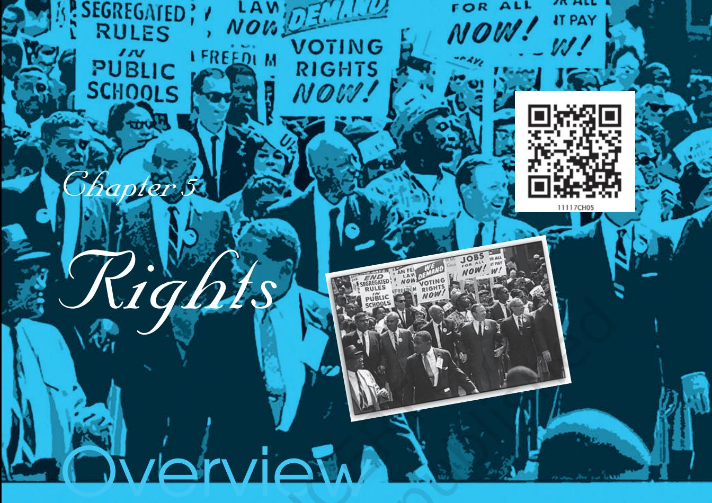

In everyday life we often talk of our rights. As members of a democratic country we may speak of such rights as the right to vote, the right to form political parties, the right to contest elections and so on. But apart from the generally accepted political and civil rights, people today are also making new demands for rights such as the right to information, right to clean air or the right to safe drinking water. Rights are claimed not only in relation to our political and public lives but also in relation to our social and personal relationships. Moreover, rights may be claimed not only for adult human beings but also for children, unborn foetuses, and even animals. The notion of rights is thus invoked in a variety of different ways by different people. In this chapter we will explore:

- o What do we mean when we speak of rights?
- o What is the basis on which rights are claimed?
- o What purpose do rights serve and, why are they so important?

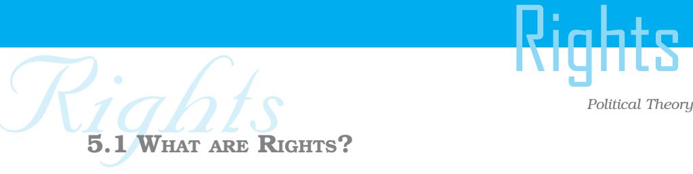

5.1 WHAT ARE RIGHTS?

A right is essentially an entitlement or a justified claim. It denotes what we are entitled to as citizens, as individuals and as human beings. It is something that we consider to be due to us; something that the rest of society must recognise as being a legitimate claim that must be upheld. This does not mean that everything that I regard to be necessary and desirable is a right. I may want to wear the clothes of my choice to school rather than the prescribed uniform. I may want to stay out late at night but this does not mean that I have a right to dress in any way I like at school or to return home when I choose to do so. There is a distinction between what I want and think I am entitled to, and what can be designated as rights.

Rights are primarily those claims that I along with others regard to be necessary for leading a life of respect and dignity. In fact, one of the grounds on which rights have been claimed is that they represent conditions that we collectively see as a source of selfrespect and dignity. For example, the right to livelihood may be considered necessary for leading a life of dignity. Being gainfully employed gives a person economic independence and thus is central for his/her dignity. Having our basic needs met gives us freedom to pursue our talents and interests. Or, take the right to express ourselves freely. This right gives us the opportunity to be creative and original, whether it be in writing, or dance, or music, or any other creative activity. But freedom of expression is also important for democratic government since it allows for the free expression of beliefs and opinions. Rights such as the right to a livelihood, or freedom of expression, would be important for all human beings who live in society and they are described as universal in nature.

Another ground on which rights have been claimed is that they are necessary for our well-being. They help individuals to develop their talents and skills. A right like the right to education, for instance, helps to develop our capacity to reason, gives us useful skills and enables us to make informed choices in life. It is in this sense that education can be designated as a universal right. However, if an activity is injurious to our health and well-being it cannot be

Rights Rights claimed as a right. For instance, since medical research has shown that prohibited drugs are injurious to one's health and since they affect our relations with others, we cannot insist that we have a right to inhale or inject drugs or smoke tobacco. In the case of smoking it may even be injurious to the health of people who may be around the smoker. Drugs may not only injure our health but they may also sometimes change our behaviour patterns and make us a danger to other people. In terms of our definition of rights, smoking or taking banned drugs cannot be claimed as a right.

# LET'S DO ITDo

Go through recent newspapers and make a list of people's movements that have made proposals for new kinds of rights?

## 5.2 WHERE DO RIGHTS COME FROM?

In the seventeenth and eighteenth centuries, political theorists argued that rights are given to us by nature or God. The rights of men were derived from natural law. This meant that rights were not conferred by a ruler or a society, rather we are born with them. As such these rights are inalienable and no one can take these away from us. They identified three natural rights of man: the right to life, liberty and property. All other rights were said to be derived from these basic rights. The idea that we are born with certain rights, is a very powerful notion because it implies that no state or organisation should take away what has been given by the law of nature. This conception of natural rights has been used widely to oppose the exercise of arbitrary power by states and governments and to safeguard individual freedom.

In recent years, the term human rights is being used more than the term natural rights. This is because the idea of there being a natural law, or a set of norms that are laid down for us by nature, or God, appears unacceptable today. Rights are increasingly seen as guarantees that human beings themselves seek or arrive at in order to lead a minimally good life.

The assumption behind human rights is that all persons are entitled to certain things simply because they are human beings. As a human being each person is unique and equally valuable. This means that all persons are equal and no one is born to serve others.

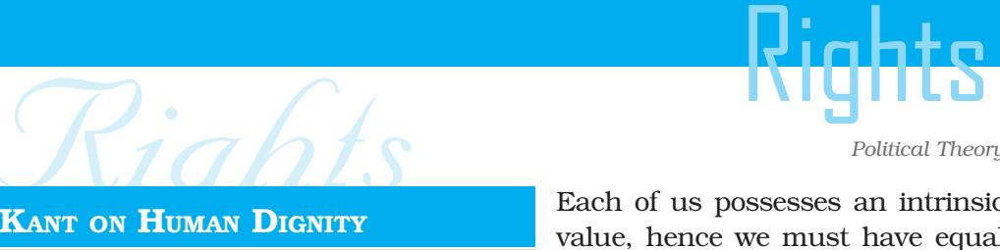

#### KANT ON HUMAN DIGNITY

" ... everything has either a price or a dignity. What has a price is such that something else can also be put in its place as its equivalent; by contrast, that which is elevated above all price, and admits of no equivalent, has a dignity.

'Human beings', unlike all other objects, possess dignity. They are, for this reason valuable in themselves. For the eighteenth century German philosopher, Immanuel Kant, this simple idea had a deep meaning. It meant that every person has dignity and ought to be so treated by virtue of being a human being. A person may be uneducated, poor or powerless. He may even be dishonest or immoral. Yet, he remains a human being and deserves to be given some minimum dignity.

For Kant, to treat people with dignity was to treat them morally. This idea became a rallying point for those struggling against social hierarchies and for human rights.

Kant's views represent, what is called, the moral conception of rights. This position rests upon two arguments. First, we should be treating others as we would like to be treated ourselves. Second, we should make sure that we don't treat the other person as means to our ends. We should not treat people as we treat a pen, a car, or a horse. That is, we should respect people not because they are useful to us but because they are, after all, human beings.

Each of us possesses an intrinsic value, hence we must have equal opportunities to be free and realise our full potential. This conception of a free and equal self is increasingly being used to challenge existing inequalities based on race, caste, religion and gender. Today, the UN Universal Declaration of Human Rights builds upon this understanding of rights and it attempts to recognise those claims that the world community collectively sees as being important for leading a life of dignity and self-respect.

The notion of universal human rights has been used by oppressed people all over the world to challenge laws which segregate them and deny them equal opportunities and rights. In fact, it is through the struggles of groups that have felt excluded that the interpretation of existing rights has sometimes been altered. Slavery has, for instance, been abolished, but there are other struggles that have only had a limited success. Even today there are communities struggling to define humanity in a way which includes them.

The list of human rights which people have claimed has expanded over the years as societies face new threats and challenges. For instance, we are very conscious

70

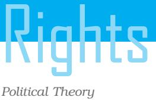

today of the need to protect the natural environment and this has generated demands for rights to clean air, water, sustainable development, and the like. A new awareness about the changes which many people, especially women, children or the sick, face in times of war or natural crisis has also led to demands for a right to livelihood, rights of children and the like. Such claims express a sense of moral outrage about infringements of peoples' dignity and they also act as a rallying call to

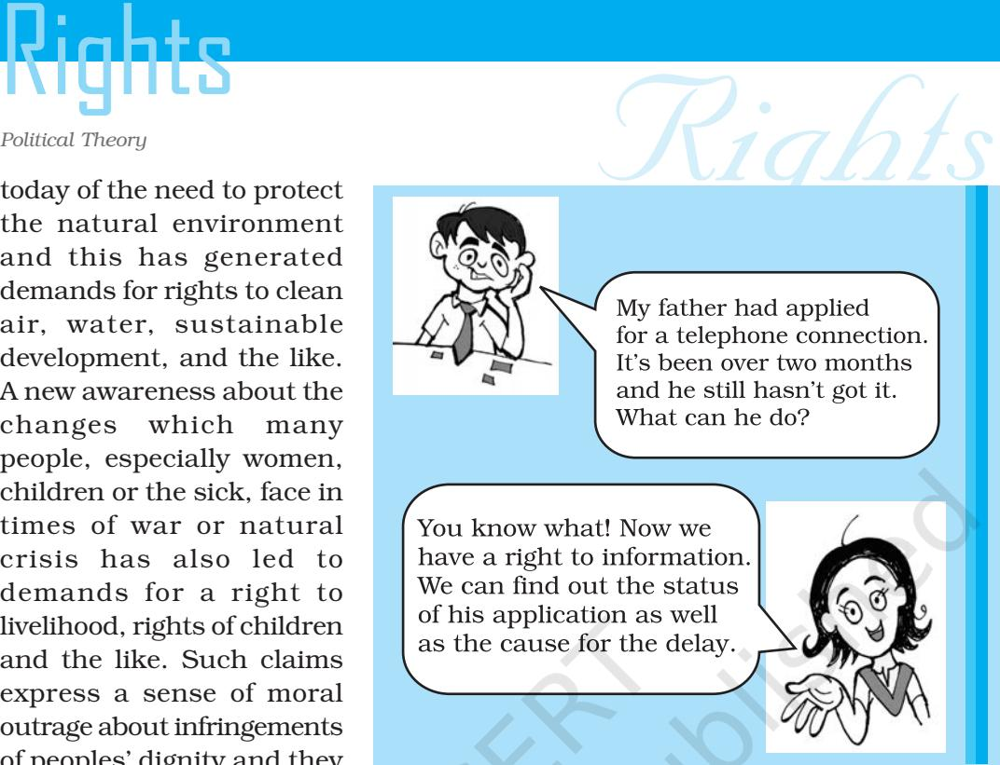

people to try and extend rights to all human beings. We should not understate the extent and power of such claims. They often invoke wide support. You may have heard about the pop star Bob Geldof 's recent appeal to western governments to end poverty in Africa and seen T.V. reports about the scale of support which he received from ordinary people.

### 5.3 LEGAL RIGHTS AND THE STATE

While claims for human rights appeal to our moral self, the degree of success of such appeals depends on a number of factors, most important of which is the support of governments and the law. This is why so much importance is placed on the legal recognition of rights.

A Bill of Rights is enshrined in the constitutions of many countries. Constitutions represent the highest law of the land and so constitutional recognition of certain rights gives them a primary importance. In our country we call them Fundamental Rights. Other laws and policies are supposed to respect the rights granted in the Constitution. The rights mentioned in the Constitution would be

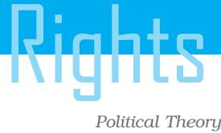

Rights Rights those which are considered to be of basic importance. In some cases these may be supplemented by claims which gain importance because of the particular history and customs of a country. In India, for instance, we have a provision to ban untouchability which draws attention to a traditional social practice in the country.

> So important is the legal and constitutional recognition of our claims that several theorists define rights as claims that are recognised by the state. The legal endorsement certainly gives our rights a special status in society but it is not the basis on which rights are claimed. As we discussed earlier, rights have steadily been expanded and reinterpreted to include previously excluded groups and to reflect our contemporary understanding of what it means to lead a life of dignity and respect.

> However, in most cases the claimed rights are directed towards the state. That is, through these rights people make demands upon the state. When I assert my right to education, I call upon the state to make provisions for my basic education. Society may also accept the importance of education and contribute to it on its own. Different groups may open schools and fund scholarships so that children of all classes can get the benefit of education. But the primary responsibility rests upon the state. It is the state that must initiate necessary steps to ensure that my right to education is fulfilled.

> Thus, rights place an obligation upon the state to act in certain kinds of ways. Each right indicates what the state must do as well as what it must not do. For instance, my right to life obliges the state to make laws that protect me from injury by others. It calls upon the state to punish those who hurt me or harm me. If a society feels that the right to life means a right to a good quality of life, it expects the state to pursue policies that provide for clean environment along with other conditions that may be necessary for a healthy life. In other words, my right here places certain obligations upon the state to act in a certain way.

> Rights not only indicate what the state must do, they also suggest what the state must refrain from doing. My right to liberty as a person, for instance, suggests that the state cannot simply arrest me at its own will. If it wishes to put me behind bars, it must defend that action;

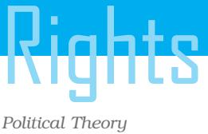

Rights Rights it must give reasons for curtailing my liberty before a judicial court. This is why the police are required to produce an arrest warrant before taking me away. My rights thus place certain constraints upon state actions.

To put it another way, our rights ensure that the authority of the state is exercised without violating the sanctity of individual life and liberty. The state may be the sovereign authority; the laws it makes may be enforced with force, but the sovereign state exists not for its own sake but for the sake of the individual. It is people who matter more and it is their well-being that must be pursued by the government in power. The rulers are accountable for their actions and must not forget that law exists to ensure the good of the people.

## LET'S DO ITDo

Go through the newspapers of the last few days and identify cases of rights violations which have been discussed. What should the government and civil society do to prevent such violations?

## 5.4 KINDS OF RIGHTS

Most democracies today begin by drawing up a charter of political rights. Political rights give to the citizens the right to equality before law and the right to participate in the political process. They include such rights as the right to vote and elect representatives, the right to contest elections, the right to form political parties or join them. Political rights are supplemented by civil liberties. The latter refers to the right to a free and fair trial, the right to express one's views freely, the right to protest and express dissent. Collectively, civil liberties and political rights form the basis of a democratic system of government. But, as was mentioned before, rights aim to protect the well-being of the individual. Political rights contribute to it by making the government accountable to the people, by giving greater importance to the concerns of the individual over that of the rulers and by ensuring that all persons have an opportunity to influence the decisions of the government.

However, our rights of political participation can only be exercised fully when our basic needs, of food, shelter, clothing, health, are met. For a person living on the pavements and struggling to meet these basic needs, political rights by themselves have little value. They require certain facilities like an adequate wage to meet their

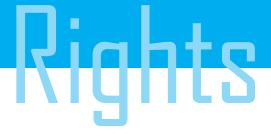

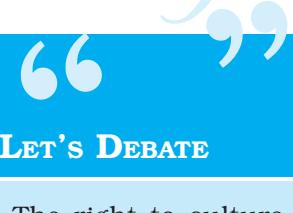

#### LET'S DEBATE

The right to culture means that no one should be allowed to make films that offend the religious or cultural beliefs of others.

Rights Rights basic needs and reasonable conditions of work. Hence democratic societies are beginning to recognise these obligations and providing economic rights. In some countries, citizens, particularly those with low incomes, receive housing and medical facilities from the state; in others, unemployed persons receive a certain minimum wage so that they can meet their basic needs. In India the government has recently introduced a rural employment guarantee scheme, among other measures to help the poor. 

> Today, in addition to political and economic rights more and more democracies are recognising the cultural claims of their citizens. The right to have primary education in one's mother tongue, the right

to establish institutions for teaching one's language and culture, are today recognised as being necessary for leading a good life. The list of rights has thus steadily increased in democracies. While some rights, primarily the right to life, liberty, equal treatment, and the right to political participation are seen as basic rights that must receive priority, other conditions that are necessary for leading a decent life, are being recognised as justified claims or rights.

#### LET'S THINK

Which of the following rights granted to groups/ communities are justifiable? Discuss.

- o Jain community in a town sets up its own school and enrols students only from its own community.
- o Purchase of land or property in Himachal Pradesh is restricted to those who are residents in that state.
- o The principal of a co-ed college issued a circular that no girl should wear any 'western' dress.
- o A Panchayat in Haryana decided that the boy and the girl from different castes who married each other will not be allowed to live in the village.

74

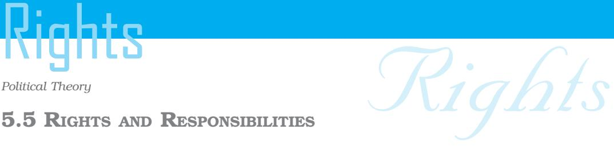

## 5.5 RIGHTS AND RESPONSIBILITIES

Rights not only place obligations upon the state to act in a certain way — for instance, to ensure sustainable development — but they also place obligations upon each of us. Firstly, they compel us to think not just of our own personal needs and interests but to defend some things as being good for all of us. Protecting the ozone layer, minimising air and water pollution, maintaining the green cover by planting new trees and preventing cutting down of forests, maintaining the ecological balance, are things that are essential for all of us. They represent the 'common-good' that we must act to protect for ourselves as well as for the future generations who are entitled to inherit a safe and clean world without which they cannot lead a reasonably good life.

Secondly, they require that I respect the rights of others. If I say that I must be given the right to express my views I must also grant the same right to others. If I do not want others to interfere in the choices I make — the dress I wear or the music I listen to — I must refrain from interfering in the choices that others make. I must leave them free to choose their music and clothes. I cannot use the right to free speech to incite a crowd to kill my neighbour. In exercising my rights, I cannot deprive others of their rights. My rights are, in other words, limited by the principle of equal and same rights for all.

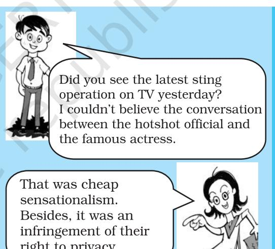

Thirdly, we must balance our rights when they come into conflict. For instance, my right to freedom of expression allows me to take pictures; however, if I take pictures of a person bathing in his house without his consent and post them on the internet, that would be a violation of his right to privacy.

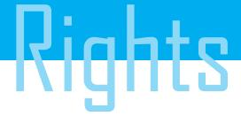

Rights Rights Fourthly, citizens must be vigilant about limitations which may be placed on their rights. A currently debated topic concerns the increased restrictions which many governments are imposing on the civil liberties of citizens on the grounds of national security. Protecting national security may be defended as necessary for safeguarding the rights and well-being of citizens. But at what point could the restrictions imposed as necessary for security themselves become a threat to the rights of people? Should a country facing the threat of terrorist bombings be allowed to curtail the liberty of citizens? Should it be allowed to arrest people on mere suspicion? Should it be allowed to intercept their mail or tap their phones? Should it be allowed to use torture to extract confession?

> In such situations the question to ask is whether the person concerned poses an imminent threat to society. Even arrested persons should be allowed legal counsel and the opportunity to present their case before a magistrate or a court of law. We need to be extremely cautious about giving governments powers which could be used to curtail the civil liberties of individuals for such powers can be misused. Governments can become authoritarian and undermine the very reasons for which governments exist — namely, the well-being of the members of the state. Hence, even though rights can never be absolute, we need to be vigilant in protecting our rights and those of others for they form the basis of a democratic society.

LET'S DEBATE " "

One man's rights end wher e the other man's nose begins.

Rights Rights On 10 December 1948, the General Assembly of the United Nations adopted and proclaimed the Universal Declaration of Human Rights. Following this historic act the Assembly called upon all Member countries to publicise the text of the Declaration and "to cause it to be disseminated, displayed, read and expounded principally in schools and other educational institutions, without distinction based on the political status of countries or territories."

#### *PREAMBLE*

Whereas recognition of the inherent dignity and of the equal and inalienable rights of all members of the human family is the foundation of freedom, justice and peace in the world,

Whereas disregard and contempt for human rights have resulted in barbarous acts which have outraged the conscience of mankind, and the advent of a world in which human beings shall enjoy freedom of speech and belief and freedom from fear and want has been proclaimed as the highest aspiration of the common people,

Whereas it is essential, if man is not to be compelled to have recourse, as a last resort, to rebellion against tyranny and oppression, that human rights should be protected by the rule of law,

Whereas it is essential to promote the development of friendly relations between nations,

Whereas the peoples of the United Nations have in the Charter reaffirmed their faith in fundamental human rights, in the dignity and worth of the human person and in the equal rights of men and women and have determined to promote social progress and better standards of life in larger freedom,

Whereas Member States have pledged themselves to achieve, in co-operation with the United Nations, the promotion of universal respect for and observance of human rights and fundamental freedoms,

Whereas a common understanding of these rights and freedoms is of the greatest importance for the full realisation of this pledge,

Now, therefore THE GENERAL ASSEMBLY proclaims THIS UNIVERSAL DECLARATION OF HUMAN RIGHTS as a common standard of achievement for all peoples and all nations, to the end that every individual and every organ of society, keeping this Declaration constantly in mind, shall strive by teaching and education to promote respect for these rights and freedoms and by progressive measures, national and international, to secure their universal and effective recognition and observance, both among the peoples of Member States themselves and among the peoples of territories under their jurisdiction.

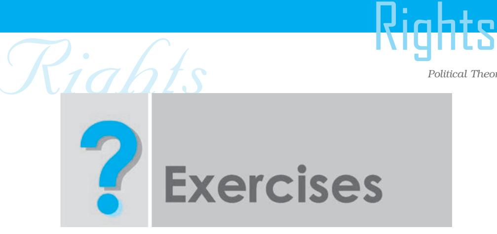

- 1. What are rights and why are they important? What are the bases on which claims to rights can be made?
- 2. On what grounds are some rights considered to be universal in nature? Identify three rights which you consider universal. Give reasons.
- 3. Discuss briefly some of the new rights claims which are being put forward in our country today — for example the rights of tribal peoples to protect their habitat and way of life, or the rights of children against bonded labour.
- 4. Differentiate between political, economic and cultural rights. Give examples of each kind of right.
- 5. Rights place some limits on the authority of the state. Explain with examples.

78

*Credit: Image on opening page: The National Archives and Records Administration, United States of America*

