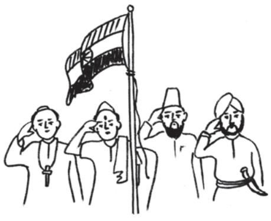
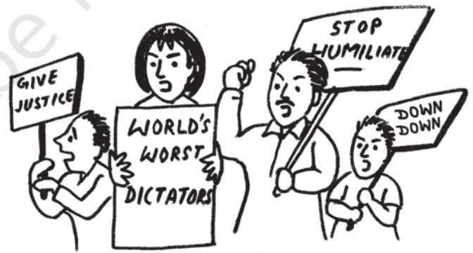
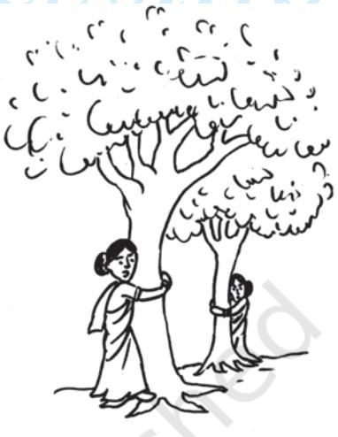
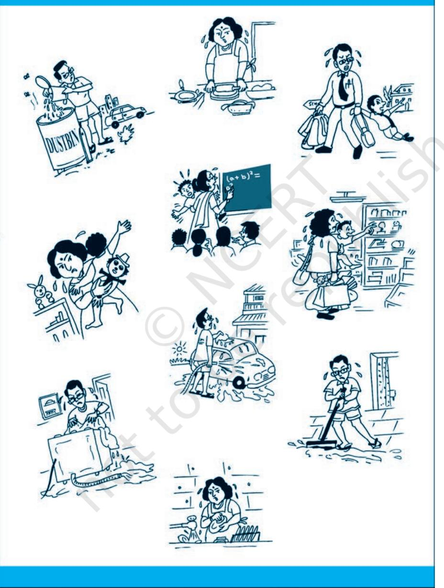

79

### Overview

Citizenship

*Political Theory*

Chapter 6

Citizenship implies full and equal membership of a political community. In this chapter we will explore what exactly this means today. In Sections 6.2 and 6.3 we will look at some debates and struggles which are going on regarding the interpretation of the term 'full and equal membership'. Section 6.4 will discuss the relationship between citizens and the nation and the criteria of citizenship adopted in different countries. Theories of democratic citizenship claim that citizenship should be universal. Does this mean that every person today should be accepted as a member of one or other state? then How can we explain the existence of so many stateless people? This issue will be discussed in Section 6.5. The last section 6.6 will discuss the issue of global citizenship. Does it exist and could it replace national citizenship?

After going through this chapter you should be able to

- o explain the meaning of citizenship, and
- o discuss some of the areas in which that meaning is being expanded or challenged today.

CitizenshipCitizenship 6.1 INTRODUCTION

Citizenship has been defined as full and equal membership of a political community. In the contemporary world, states provide a collective political identity to their members as well as certain rights. Therefore we think of ourselves as Indians, or Japanese, or Germans, depending on the state to which we belong. Citizens expect certain rights from their state as well as help and protection wherever they may travel.

The importance of full membership of a state can be appreciated if we think of the condition of the thousands of people in the world who have the bad fortune to be forced to live as refugees or illegal migrants because no state is willing to grant them membership. Such people are not guaranteed rights by any state and generally live in precarious conditions. For them full membership of a state of their choice is a goal for which they are willing to struggle, as we see today with Palestinian refugees in the Middle East.

The precise nature of the rights granted to citizens may vary from state to state but in most democratic countries today they would include some political rights like the right to vote, civil rights

like the freedom of speech or belief, and some socio-economic rights which could include the right to a minimum wage, or the right to education. Equality of rights and status is one of the basic rights of citizenship.

### *Political Theory*

Each of the rights now enjoyed by citizens has been won after struggle. Some of the earliest struggles were fought by people to assert their independence and rights against powerful monarchies. Many European countries experienced such struggles, some of them violent, like the French Revolution in 1789. In the colonies of Asia and Africa, demands for equal citizenship formed part of their struggle for independence from colonial rulers. In South Africa, the black African population had to undertake a long struggle against the ruling white minority for equal citizenship. This continued until the early 1990s. Struggles to achieve full membership and

equal rights continue even now in many parts of the world. You may have read about the women's movement and the *dalit* movement in our country. Their purpose is to change public opinion by drawing attention to their needs as well as to influence government policy to ensure them equal rights and opportunities.

### LET'S THINK

During seventeenth to twentieth century, white people of Europe established their rule over the black people in South Africa. Read the following description about the policy practices in South Africa till 1994.

The whites had the right to vote, contest elections and elect government; they were free to purchase property and go to any place in the country. Blacks did not have such rights. Separate colonies for whites and blacks were established. The blacks had to take 'passes' to work in white neighbourhoods. They were not allowed to keep their families in the white areas. The schools were also separate for the people of different colour.

- o Do you think the Blacks had full and equal membership in South Africa? Give reasons.
- o What does the above description tell us about the relationship of different groups in South Africa?

*Political Theory*

### LET'S DO IT Do

Think of some examples of activities of citizens in your area intended to help others, or improve the area, or protect the environment. List some of the activities which could be undertaken by young people of your agegroup.

However, citizenship is about more than the relationship between states and their members. It is also about citizen-citizen relations and involves certain obligations of citizens to each other and to the society. These would include not just the legal obligations imposed by states but also a moral obligation to participate in, and contribute to, the shared life of the community. Citizens are also considered to be the inheritors and trustees of the culture and natural resources of the country.

A good way to understand a political concept is to look for instances where its accepted meaning is being questioned by groups who feel that it does not take account of their needs and aspirations.

### 6.2 FULL AND EQUAL MEMBERSHIP

If you have ever travelled in a crowded railway compartment or bus you will be familiar with the way in which those who may have earlier fought each other to enter, once inside discover a shared interest in keeping others out! A division soon develops between 'insiders' and 'outsiders' with 'outsiders' being seen as a threat.

Similar processes take place from time to time in cities, regions, or even the nation as a whole. If jobs, facilities like medical care or education, and natural resources

like land or water, are limited, demands may be made to restrict entry to 'outsiders' even though they may be fellow citizens. You may remember the slogan 'Mumbai for Mumbaikars' which expressed such feelings. Many similar struggles have taken place in different parts of India and the world.

This raises questions about what 'full and equal membership' really means? Does it mean that citizens should enjoy equal rights

### *Political Theory*

and opportunities wherever in the country they may decide to live, study, or work? Does it mean that all citizens, rich or poor, should enjoy certain basic rights and facilities?

In this section we will explore the meaning of citizenship by focusing on the first of these questions.

One of the rights granted to citizens in our country, and in many others, is freedom of movement. This right is of particular importance for workers. Labour tends to migrate in search of jobs when opportunities are not available near their homes. Some people may even travel outside the country in search of jobs. Markets for skilled and unskilled workers have developed in different parts of our country. For instance, I.T. workers may flock to towns like Bangalore. Nurses from Kerala may be found all over the country. The booming building industry in town attracts workers from different parts of the

### MARTIN LUTHER KING

The 1950s witnessed the emergence of Civil Rights Movements against inequalities that existed between black and white populations in many of the southern states of the USA. Such inequalities were maintained in these states by a set of laws called Segregation Laws through which the black people were denied many civil and political rights. These laws created separate areas for coloured and white people in various civic amenities like railways, buses, theatres, housing, hotels, restaurants, etc.

Martin Luther King Jr. was a black leader of the movement against these laws. King gave many arguments against the prevailing laws of segregation. First, in terms of self-worth and dignity every human person in the world is equal regardless of one's race or colour. Second, King argued that segregation is like 'social leprosy' on the body politic because it inflicts deep psychological wounds on the people who suffer as a result of such laws.

King argued that the practice of segregation diminishes the quality of life for the white community also. He illustrates this point by examples. The white community, instead of allowing the black people to enter some community parks as was directed by the court, decided to close them. Similarly, some baseball teams had to be disbanded, as the authorities did not want to accept black players. Thirdly, the segregation laws create artificial boundaries between people and prevent them from cooperating with each other for the overall benefit of the country. For these reasons, King argued that these laws should be abolished. He gave a call for peaceful and non-violent resistance against the segregation laws. He said in one of his speeches: "We must not allow our creative protest to degenerate into physical violence." 83

83

CitizenshipCitizenship country. So do infrastructure projects like road making. You may have come across workers from different regions near your home or school.

> However, often resistance builds up among the local people against so many jobs going to people from outside the area, sometimes at lower wages. A demand may develop to restrict certain jobs to those who belong to the state, or those who know the local language. Political parties may take up the issue. Resistance could even take the form of organised violence against 'outsiders'. Almost every region of India has experienced such movements. Are such movements ever justified?

> We all become indignant, if Indian workers in other countries are ill-treated by the local population. Some of us may also feel that skilled and educated workers have the right to migrate for work. States may even be proud of their ability to attract such workers. But if jobs are scarce in a region, local residents may resent competition from 'outsiders'. Does the right to freedom of movement include the right to live or work in any part of the country?

> Another factor that we need to consider is that there may sometimes be a difference between our response to poor migrants and to skilled migrants. We may not always be as welcoming to poor migrants who move into our areas as we may be to skilled and affluent workers. This raises the question of whether poor and unskilled workers should have the same right to live and work anywhere in the country as do skilled workers? These are some of the issues which are being debated in our country today regarding 'full and equal membership' for all citizens of the country.

> However, disputes may sometimes arise even in democratic societies. How can such disputes be resolved? The right to protest is an aspect of the freedom of expression guaranteed to citizens in our Constitution, provided protest does not harm the life or property of other people or the State. Citizens are free to try and influence public opinion and government policy by forming groups, holding demonstrations, using the media, appealing to political parties, or by approaching the courts. The courts may give a decision on the

84

*Political Theory*

85

*Political Theory*

matter, or they may urge the government to address the issue. It may be a slow process but varying degrees of success are sometimes possible. If the guiding principle of providing full and equal membership to all citizens is kept in mind, it should be possible to arrive at an acceptable solution to the problems that may arise from time to time in a society. A basic principle of democracy is that such disputes should be settled by negotiation and discussion rather than force. This is one of the obligations of citizenship.

### LET'S THINK

Examine the arguments for and against freedom of movement and occupation throughout the country for citizens.

Should the long-term inhabitants of a region enjoy preference for jobs and facilities?

Or, should states be allowed to fix quotas for admissions to professional colleges for students who do not belong to that state?

### 6.3 EQUAL RIGHTS

In this section we will examine another aspect of citizenship, that is, the issue of whether full and equal membership means that all citizens, rich or poor, should be guaranteed certain basic rights and a minimum standard of living by the state. To discuss this issue, we will look at one set of people, that is the urban poor. Dealing with the problem of the poor in towns is one of the urgent problems facing the government today.

There is a large population of slum-dwellers and squatters in every city in India. Although they may do necessary and useful work, often at low wages, they are often viewed as unwelcome visitors by the rest of the town population. They may be blamed for straining the resources of the city or for spreading crime and disease.

The conditions in slums are often shocking. Many people may be crammed into small rooms with no private toilets, running water, or sanitation. Life and property are insecure in a slum. However,

*Political Theory*

slum dwellers make a significant contribution to the economy through their labour. They may be hawkers, petty traders, scavengers, or domestic workers, plumbers, or mechanics, among other professions. Small businesses such as cane weaving, or textile printing, or tailoring, may also develop in slums. The city probably spends relatively little on providing slum-dwellers with services such as sanitation or water supply.

### CITIZENSHIP, EQUALITY AND RIGHTS

Citizenship is not merely a legal concept. It is also closely related to larger notions of equality and rights. A widely accepted formulation of this relationship was provided by the British sociologist, T. H. Marshall (1893-1981). In his book *Citizenship and Social Class* (1950), Marshall defined citizenship as "a status bestowed on those who are full members of a community. All who possess the status are equal with respect to the rights and duties with which the status is endowed."

The key concept in Marshall's idea of citizenship is that of 'equality'. This implies two things: first, that quality of the given rights and duties improves. Second, that the quantity of people upon whom they are bestowed grows.

Marshall sees citizenship as involving three kinds of rights: civil, political and social.

Civil rights protect the individual's life, liberty and property. Political rights enable the individual to participate in the process of governance. Social rights give the individual access to education and employment. Together they make it possible for the citizen to lead a life of dignity.

Marshall saw social class as a 'system of inequality'. Citizenship ensures equality by countering the divisive effects of class hierarchy. It thus facilitates the creation of a better-integrated and harmonious community.

Awareness about the condition of the urban poor is growing among governments, N.G.O's and other agencies, and among the slum-dwellers themselves. For instance, a national policy on urban street vendors was framed in January 2004. There are lakhs of street vendors in big cities and they often face harassment from the police and town authorities. The policy was intended to provide recognition and regulation for vendors to enable them to carry on their profession without harassment so long as they obeyed government regulations.

Slum-dwellers also are becoming aware of their rights and are beginning to organise to demand them. They have sometimes even

### *Political Theory*

### CITIZENSHIP, EQUALITY AND RIGHTS

The Supreme Court gave an important decision regarding the rights of slum-dwellers in Bombay in response to a Public Interest Litigation filed by a social activist, Olga Tellis against Bombay Municipal Corporation in 1985. The petition claimed the right to live on pavements or in slums because there was no alternative accommodation available close to their place of work. If they were forced to move they would lose their livelihood as well. The Supreme Court said, "Article 21 of the Constitution which guaranteed the right to life included the right to livelihood. Therefore if pavement dwellers were to be evicted they should first be provided alternative accommodation under the right to shelter."

approached the courts. Even a basic political right like the right to vote may be difficult for them to exercise because to be included in the list of voters a fixed address is required and squatters and pavement dwellers may find it difficult to provide this.

Among other groups of people who are becoming marginalised in our society are the tribal people and forest dwellers. These people are dependent on access to forests and other natural resources to maintain their way of life. Many of them face threats to their way of life and livelihood because of

the pressure of increasing populations and the search for land and resources to maintain them. Pressures from commercial interests wanting to mine the resources which may exist in forests or coasts poses another threat to the way of life and livelihood of forest dwellers and tribal peoples, as does the tourist industry. Governments are struggling with the problem of how to protect these people and their habitat without at the same time endangering development of the country. This is an issue that affects all citizens, not just tribal people.

To try and ensure equal rights and opportunities for all citizens cannot be a simple matter for any government. Different groups of people may have different needs and problems and the rights of one group may conflict with the rights of another. Equal rights for citizens need not mean that uniform policies have to be applied to all people since different groups of people may have different needs. If the purpose is not just to make policies which would apply in the same way to all people, but to make people more equal, the different needs and claims of people would have to be taken into account when framing policies.

### *Political Theory*

What should become clear from this discussion is that changes in the world situation, the economy, and society demand new interpretations of the meaning and rights of citizenship. The formal laws regarding citizenship only form the starting point and the interpretation of laws is constantly evolving. While answers to some the problems which may arise may not be easy to find, the concept of equal citizenship would mean that providing equal rights and protection to all citizens should be one of the guiding principles of government policies.

### LET'S THINK

According to the official figures published about the land distribution in Zimbabwe, some 4,400 white families owned 32 per cent of agricultural land that is about 10m hectares. About one million black peasant families own just 16m hectares that is the 38 per cent of the land. While the land that is with the white families is fertile and irrigated, the land in the hands of black population is less fertile and unirrigated. While tracing the history of land ownership, it is very obvious that a century ago the whites had taken the fertile land from the native people. Whites have now been in Zimbabwe for generations and consider themselves as Zimbabweans. The total population of whites in Zimbabwe is just 0.06 per cent of the population. In the year 1997, the President of Zimbabwe, Mugabe announced the plans to take over around 1500 farms.

What ideas from citizenship would you use to support or oppose the claims of Black and White Citizens of Zimbabwe?

### LET'S DO IT Do

Survey three families of workers working close to, or in, your homes or school. Find out details about their life. Where is their ancestral place? When and why did they come here? Where do they live? How many people share the accommodation? What kinds of facilities are available to them? Do their children attend school?

Find out about the street vendors (Protection of Livelihood and Regulation of Street Vending) Act, 2014.

### CitizenshipCitizenship 6.4 CITIZEN AND NATION

The concept of nation state evolved in the modern period. One of the earliest assertions regarding the sovereignty of the nation state and democratic rights of citizens was made by the revolutionaries in France in 1789. Nation states claim that their boundaries define not just a territory but also a unique culture and shared history. The national identity may be expressed through symbols like a flag, national anthem, national language, or certain ceremonial practices, among other things.

Most modern states include people of different religions, languages, and cultural traditions. But the national identity of a democratic state is supposed to provide citizens with a political identity that can be shared by all the members of the state. Democratic states usually try to define their identity so that it is as inclusive as possible — that is, which allows all citizens to identify themselves as part of the nation. But in practice, most countries tend to define their identity in a way which makes it easier for some citizens to identify with the state than others. It may also make it easier for the state to extend citizenship to some people and not others. This would be as true of the United States, which prides itself on being a country of immigrants, as any other country.

France, for instance, is a country which claims to be both secular and inclusive. It includes not only people of European origin but also citizens who originally came from other areas such as North Africa. Culture and language are important features of its national identity and all citizens are expected to assimilate into it in the public aspects of their lives. They may, however, retain their personal beliefs and practices in their private lives. This may seem like a reasonable policy but it is not always simple to define what is public and what is private and this has given rise to some controversies. Religious belief is supposed to belong to the private sphere of citizens but sometimes religious symbols and practices may enter into their public lives. You may have heard about the demand of Sikh school boys in France to wear the turban to school, and of Muslim girls to wear the head scarf with their school uniforms. This was disallowed

90

Citizenship Citizenship by some schools on the ground that it involved bringing religious symbols into the public sphere of state education. Those whose religions did not demand such practices naturally did not face the same problem. Clearly, assimilation into the national culture would be easier for some groups than for others.

The criteria for granting citizenship to new applicants varies from country to country. In countries such as Israel, or Germany, factors like religion, or ethnic origin, may be given priority when granting citizenship. In Germany there has been a persistent demand from Turkish workers, who were at one time encouraged to come and work in Germany, that their children who have been born and brought up in Germany should automatically be granted citizenship. This is still being debated. These are only a few examples of the kinds of restrictions which may be placed on citizenship even in democratic countries which pride themselves on being inclusive.

India defines itself as a secular, democratic, nation state. The movement for independence was a broad based one and deliberate attempts were made to bind together people of different religions, regions and cultures. True, Partition of the country did take place in 1947 when differences with the Muslim League could not be resolved, but this only strengthened the resolve of Indian national leaders to maintain the secular and inclusive character of the Indian nation state they were committed to build. This resolve was embodied in the Constitution.

The Indian Constitution attempted to accommodate a very diverse society. To mention just a few of these diversities, it attempted to provide full and equal citizenship to groups as different as the Scheduled Castes and Scheduled Tribes, many women who had not previously enjoyed equal rights, some remote communities in the Andaman and Nicobar islands who had had little contact with modern civilization, and many others. It also attempted to find a place for the different languages, religions and practices found in different parts of the country. It had to provide equal rights to all without at the same time forcing people to give up their personal beliefs, languages or cultural practices. It was therefore a unique experiment which was undertaken through the Constitution. The Republic Day parade in

*Political Theory*

It is not appropriate for schools, or any other public agencies like the army, to insist on a common uniform and to ban the display of religious symbols such as the turban.

Delhi symbolises the attempt of the state to include people of different regions, cultures and religions.

The provisions about citizenship in the Constitution can be found in Part Two and in subsequent laws passed by Parliament. The Constitution adopted an essentially democratic and inclusive notion of citizenship. In India, citizenship can be acquired by birth, descent, registration, naturalisation, or inclusion of territory. The rights and obligations of citizens are listed in the Constitution. There is also a provision that the state should not discriminate against citizens on grounds only of religion, race, caste, sex, place of birth, or any of them. The rights of religious and linguistic minorities are also protected.

However, even such inclusive provisions have given rise to struggles and controversies. The women's movement, the dalit movement, or struggles of people displaced by development projects, represent only a few of the struggles being waged by people who feel that they are being denied full rights of citizenship. The experience of India indicates that democratic citizenship in any country is a project, an ideal to work towards. New issues are constantly being raised as societies change and new demands are made by groups who feel they are being marginalised. In a democratic state these demands have to be negotiated.

### 6.5 UNIVERSAL CITIZENSHIP

When we think of refugees, or illegal migrants, many images may come to mind. One may be of people from Asia or Africa who have paid agents to smuggle them into Europe or America. The risks are high but they seem willing to make the effort. Another image may be of people displaced by war or famine. Such images are often shown on the television. Refugees in the Darfur region of Sudan, Palestinians, Burmese or Bangladeshis, the examples are many. All these are people who have been forced to become refugees in their own, or neighbouring countries.

Citizenship Citizenship We often assume that full membership of a state should be available to all those who ordinarily live and work in the country as well as to those who apply for citizenship. But although many states may support the idea of universal and inclusive citizenship, each of them also fixes criteria for the grant of citizenship. These would generally be written into the Constitution and laws of the country. States use their power to keep unwanted visitors out.

However, in spite of restrictions, even the building of walls or fences, considerable migration of peoples still takes place in the world. People may be displaced by wars, or persecution, famine, or other reasons. If no state is willing to accept them and they cannot return home, they become stateless peoples or refugees. They may be forced to live in camps, or as illegal migrants. Often they cannot legally work, or educate their children, or acquire property. The problem is so great that the U.N. has appointed a High Commissioner for Refugees to try to help them.

Decisions regarding how many people can be absorbed as citizens in a country poses a difficult humanitarian and political problem for many states. Many countries have a policy of accepting those fleeing from persecution or war. But they may not want to accept unmanageable number of people or expose the country to security risks. India prides itself on providing refuge to persecuted peoples, as it did with the Dalai Lama and his followers in 1959. Entry of people from neighbouring countries has taken place along all the borders of the Indian state and the process continues. Many of these people remain as stateless peoples for many years or generations, living in camps, or as illegal migrants. Only a relatively few of them are eventually granted citizenship. Such problems pose a challenge to the promise of democratic citizenship which is that the rights and identity of citizen would be available to all people in the contemporary world. Although many people cannot achieve citizenship of a state of their choice, no alternative identity exists for them.

The problem of stateless people is an important one confronting the world today. Borders of states are still being redefined by war or political disputes and for the people caught up in such disputes the consequences may be severe. They may lose their homes, political

*Political Theory*

identities, and security, and be forced to migrate. Can citizenship provide a solution to the problems of such people? If not, what kind of alternative identity can be provided today? Do we need to try and evolve a more genuinely universal identity than national citizenship? Suggestions for a notion of global citizenship are sometimes put forward. The possibilities will be discussed in the next section.

List some of the stateless people living in India today. Write a short note on any of them.

### 6.6 GLOBAL CITIZENSHIP

Consider the following statements:

- o *There was an outpouring of sympathy and help for the victims of the tsunami which affected a number of countries in South Asia in 2004.*
- o *International networks link terrorists today.*
- o *The United Nations is working with different states to try and prevent the spread of bird flu and the possible emergence of a human viral pandemic.*

 What is common to the statements given above? What do they tell us about the world in which we live today?

We live today in an interconnected world. New means of communication such as the internet, and television, and cell phones, have brought a major change in the way in which we understand our world. In the past it might have taken months for news about developments in one part of the world to become known in other parts. But new modes of communication have put us into immediate contact with developments in different parts of the globe. We can watch disasters and wars on our television screens as they are taking place. This has helped to develop sympathies and shared concerns among people in different countries of the world.

Supporters of global citizenship argue that although a world community and global society does not yet exist, people already feel

94

Citizenship Citizenship linked to each other across national boundaries. They would say that the outpouring of help from all parts of the world for victims of the Asian tsunami and other major calamities is a sign of the emergence of a global society. They feel that we should try to strengthen this feeling and work towards a concept of global citizenship.

The concept of national citizenship assumes that our state can provide us with the protection and rights which we need to live with dignity in the world today. But states today are faced with many problems which they cannot tackle by themselves. In this situation are individual rights, guaranteed by the state, sufficient to protect the freedom of people today? Or has the time come to move to a concept of human rights and global citizenship?

One of the attractions of the notion of global citizenship is that it might make it easier to deal with problems which extend across national boundaries and which therefore need cooperative action by the people and governments of many states. For instance, it might make it easier to find an acceptable solution to the issue of migrants and stateless peoples, or at least to ensure them basic rights and protection regardless of the country in which they may be living.

In the previous section, we saw that equal citizenship within a country can be threatened by the socio-economic inequalities or other problems which might exist. Such problems can ultimately only be solved by the governments and people of that particular society. Therefore, full and equal membership of a state remains

important for people today. But the concept of global citizenship reminds us that national citizenship might need to be supplemented by an awareness that we live in an interconnected world and that there is also a need for us to strengthen our links with people in different parts of the world and be ready to work with people and governments across national boundaries.

### LET'S DO IT Do

Find out about Global Citizenship Education (GCED) from https:// en.unesco.org/themes /gced and https:// www.gcedclearing house.org

*Political Theory*

- 1. Citizenship as full and equal membership of a political community involves both rights and obligations. Which rights could citizens expect to enjoy in most democratic state today? What kind of obligation will they have to their state and fellow citizens?
- 2. All citizens may be granted equal rights but all may not be able to equally exercise them. Explain.
- 3. Write a short note on any two struggles for full enjoyment of citizen rights which have taken place in India in recent years. Which rights were being claimed in each case?
- 4. What are some of the problems faced by refugees? In what ways could the concept of global citizenship benefit them?
- 5. Migration of people to different regions within the country is often resisted by the local inhabitants. What are some of the contributions that the migrants could make to the local economy?
- 6. "Democratic citizenship is a project rather than an accomplished fact even in countries like India which grant equal citizenship". Discuss some of the issues regarding citizenship being raised in India today.

Exercises

96

*Credit: Image on opening page: Shweta Rao*

