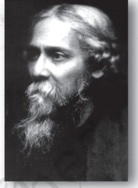

This chapter will introduce and discuss the ideas of nationalism and nation. Our concern will be not so much to understand why nationalism has arisen, or what functions it serves; rather our concern would be to think carefully about nationalism and assess its claims and aspirations. After studying this chapter you should be able to:

- o understand the concepts of nation and nationalism.
- o acknowledge the strengths and limitations of nationalism.
- o appreciate the need for ensuring a link between democracy and nationalism.

# NationalismNationalism 7.1 INTRODUCING NATIONALISM

If we were to take a quick poll of what people commonly understand by the term nationalism we are likely to get responses which talk about patriotism, national flags, sacrificing for the country, and the like. The Republic Day parade in Delhi is a striking symbol of Indian nationalism and it brings out the sense of power, strength, as well as diversity which many associate with the Indian nation. But if we try to go deeper we will find that it is difficult to arrive at a precise and widely accepted definition of the term nationalism. This need not mean that we should abandon the effort. Nationalism needs to be studied because it plays such an important role in world affairs.

During the last two centuries or more, nationalism has emerged as one of the most compelling of political creeds which has helped to shape history. It has inspired intense loyalties as well as deep hatreds. It has united people as well as divided them, helped to liberate them from oppressive rule as well as been the cause of conflict and bitterness and wars. It has been a factor in the break up of empires and states. Nationalist struggles have contributed to the drawing and redrawing of the boundaries of states and empires. At present a large part of the world is divided into different nation-states although the process of re-ordering of state boundaries has not come to an end and separatist struggles within existing states are common.

Nationalism has passed through many phases. For instance, in the nineteenth century Europe, it led to the unification of a number of small kingdoms into larger nation-states. The present day German and Italian states were formed through such a process of unification and consolidation. A large number of new states were also founded in Latin America. Along with the consolidation of state boundaries, local dialects and local loyalties were also gradually consolidated into state loyalties and common languages. The people of the new states acquired a new political identity which was based on membership of the nation-state. We have seen a similar process of consolidation taking place in our own country in the last century or more.

 But nationalism also accompanied and contributed to the break up of large empires such as the Austro-Hungarian and Russian

98

Nationalism Nationalism empires in the early twentieth century in Europe as well as the break-up of the British, French, Dutch and Portuguese empires in Asia and Africa. The struggle for freedom from colonial rule by India and other former colonies were nationalist struggles, inspired by the desire to establish nation-states which would be independent of foreign control.

The process of redrawing state boundaries continues to take place. Since 1960, even apparently stable nation-states have been confronted by nationalist demands put forward by groups or regions and these may include demands for separate statehood. Today, in many parts of the world we witness nationalist struggles that threaten to divide existing states. Such separatist movements have developed among the Quebecois in Canada, the Basques in northern Spain, the Kurds in Turkey and Iraq, and the Tamils in Sri Lanka, among others. The language of nationalism is also used by some groups in India. Arab nationalism today may hope to unite Arab countries in a pan Arab union but separatist movements like the Basques or Kurds struggle to divide existing states.

We may all agree that nationalism is a powerful force in the world even today. But it is more difficult to arrive at agreement regarding the definition of terms like nation or nationalism. What is a nation? Why do people form nations and to what do nations aspire? Why are people ready to sacrifice and even die for their nation? Why, and in what way, are claims to nationhood linked to claims to statehood? Do nations have a right to statehood or national self-determination? Or can the claims of nationalism be met without conceding separate statehood? In this chapter we will explore some of these issues.

> In this age of globalisation, the world is shrinking. We are living in a global village. Nations are irrelevant.

That's not the case. Nationalism is still relevant. You can see this when Indian team goes out to play cricket. Or when you discover that Indians living abroad still watch Bollywood films.

# NationalismNationalism 7.2 NATIONS AND NATIONALISM

A nation is not any casual collection of people. At the same time it is also different from other groups or communities found in human society. It is different from the family which is based on face-to-face relationships with each member having direct personal knowledge of the identity and character of others. It is also different from tribes and clans and other kinship groups in which ties of marriage and descent link members to each other so that even if we do not personally know all the members we can, if need be, trace the links that bind them to us. But as a member of a nation we may never come face to face with most of our fellow nationals nor need we share ties of descent with them. Yet nations exist, are lived in and valued by their members.

It is commonly believed that nations are constituted by a group who share certain features such as descent, or language, or religion or ethnicity. But there is in fact no common set of characteristics which is present in all nations. Many nations do not have a common language, Canada is an example here. Canada includes English speaking as well as French speaking peoples. India also has a large

# LET'S DO IT Do

Identify any patriotic song in your language. How is the nation described in this song? Identify and watch any patriotic films in your language. How has nationalism been portrayed and its complexities worked out in these films?

number of languages which are spoken in different regions and by different communities. Nor do many nations have a common religion to unite them. The same could be said of other characteristics such as race or descent.

What then constitutes a nation? A nation is to a great extent an 'imagined' community, held together by the collective beliefs, aspirations and imaginations of its members. It is based on certain assumptions which people make about the collective whole with which they identify. Let us identify and understand some of the assumptions which people make about the nation.

100

Shared Beliefs

# Nationalism Nationalism

First, a nation is constituted by belief. Nations are not like mountains, rivers or buildings which we can see and feel. They are not things which exist independent of the beliefs that people have about them. To speak of a people as a nation is not to make a comment about their physical characteristics or behaviour. Rather, it is to refer to the collective identity and vision for the future of a group which aspires to have an independent political existence. To this extent, nations can be compared with a team. When we speak of a team, we mean a set of people who work or play together and, more importantly, conceive of themselves as a collective group. If they did not think of themselves in this way they would cease to be a team and be simply different individuals playing a game or undertaking a task. A nation exists when its members believe that they belong together.

Why dont you cheer for our team? Dont you have any nationalist spirit?

I am as much a nationalist as anyone else. I cast my vote; I pay my taxes and I respect the laws of our country. I am also proud to belong to this country.

## History

Second, people who see themselves as a nation also embody a sense of continuing historical identity. That is, nations perceive themselves as stretching back into the past as well as reaching into the future. They articulate for themselves a sense of their own history by drawing on collective memories, legends, historical records, to outline the continuing identity of the nation. Thus nationalists in India invoked its ancient civilisation and cultural heritage and other achievements to claim that India has had a long and continuing history as a civilisation and that this civilisational continuity and unity is the basis of the Indian nation. Jawaharlal Nehru, for instance, wrote in

NationalismNationalism his book *The Discovery of India*, "Though outwardly there was diversity and infinite variety among the people, everywhere there was that tremendous impress of oneness, which held all of us together in ages past, whatever political fate or misfortune had befallen us".

#### Territory

Third, nations identify with a particular territory. Sharing a common past and living together on a particular territory over a long period of time gives people a sense of their collective identity. It helps them to imagine themselves as one people. It is therefore not surprising that people who see themselves as a nation speak of a homeland. The territory they occupied and the land on which they have lived has a special significance for them, and they claim it as their own. Nations however characterise the homeland in different ways, for instance as motherland, or fatherland, or holy land. The Jewish people for instance, in spite of being dispersed and scattered in different parts of the world always claimed that their original homeland was in Palestine, the 'promised land'. The Indian nation identifies with the rivers, mountains and regions of the Indian subcontinent. However, since more than one set of people may lay claim to the same territory, the aspiration for a homeland has been a major cause of conflict in the world.

### Shared Political Ideals

Fourth, while territory and shared historical identity play an important role in creating a sense of oneness, it is a shared vision of the future and the collective aspiration to have an independent political existence that distinguishes groups from nations. Members of a nation share a vision of the kind of state they want to build. They affirm among other things a set of values and principles such as democracy, secularism and liberalism. These ideals represent the terms under which they come together and are willing to live together. It represents, in other words, their political identity as a nation.

In a democracy, it is shared commitment to a set of political values and ideals that is the most desirable basis of a political community or a nation-state. Within it, members of political community are bound by a set of obligations. These obligations

102

Nationalism Nationalism arise from the recognition of the rights of each other as citizens. A nation is strengthened when its people acknowledge and accept their obligations to their fellow members. We might even say that recognition of this framework of obligations is the strongest test of loyalty to the nation.

### Common Political Identity

Many people believe that a shared political vision about the state and society we wish to create is not enough to bind individuals together as a nation. They seek instead a shared cultural identity, such as a common language, or common descent. There is no doubt that speaking the same language makes it easier for us to communicate with each other and sharing the same religion gives us a set of common beliefs and social practices. Observing the same festivals, seeking the same holidays, and holding the same symbols valuable can bring people together, but it can also pose a threat to the values that we cherish in a democracy.

There are two reasons for this. One, all major religions in the world are internally diverse. They have survived and evolved through a dialogue within the community. As a result there exists within each religion a number of sects who differ significantly in their interpretation of the religious texts and norms. If we ignore these differences and forge an identity on the basis of a common religion we are likely to create a highly authoritative and oppressive society.

Two, most societies are culturally diverse. They have people belonging to different religions and languages living together in the same territory. To impose a single religious or linguistic identity as a condition of belonging to a particular state would necessarily exclude some groups. It might restrict the religious liberty of the excluded group or disadvantage those who do not speak the national language. Either way, the ideal that we cherish most in democracy – namely, equal treatment and liberty for all – would be severely limited. For both these reasons it is desirable to imagine the nation in political rather than cultural terms. That is, democracies need to emphasise and expect loyalty to a set of values that may be enshrined in the Constitution of the country rather than adherence to a particular religion, race or language.

NationalismNationalism We have identified above some of the ways in which nations express their sense of collective identity. We have also seen why democratic states need to forge this identity on the basis of shared political ideals. But we are still left with an important question, namely, why do people imagine themselves as a nation? What are some of the aspirations of different nations? In the next two sections we shall try to address these questions.

### 7.3 NATIONAL SELF-DETERMINATION

Nations, unlike other social groups, seek the right to govern themselves and determine their future development. They seek, in other words, the right to self-determination. In making this claim a nation seeks recognition and acceptance by the international community of its status as a distinct political entity or state. Most often these claims come from people who have lived together on a given land for a long period of time and who have a sense of common identity. In some cases such claims to self-determination are linked also to the desire to form a state in which the culture of the group is protected if not privileged.

Claims of the latter kind were frequently made in the nineteenth century in Europe. The notion of one culture - one state began to gain acceptability at the time. Subsequently, the idea of one cultureone state was employed while reordering state boundaries after World War I. The Treaty of Versailles established a number of small, newly independent states, but it proved virtually impossible to satisfy all the demands for self determination which were made at the time. Besides, re-organisation of state boundaries to satisfy the demands of one culture - one state, led to mass migration of population across state boundaries. Millions of people as a consequence were displaced from their homes and expelled from the land which had been their home for generations. Many others became victims of communal violence.

Humanity paid a heavy price for re-organising boundaries in a way that culturally distinct communities could form separate nation-states. Besides, even in this effort it was not possible to ensure that the newly created states contained only one ethnic community.

# Nationalism Nationalism

*Political Theory*

### DEMAND FOR NATIONAL SELF-DETERMINATION IN BASQUE

Demands for national self-determination have been raised in different parts of the World. Let us look at one such case.

Basque is a hilly and prosperous region in Spain. This region is recognised by the

Spanish government as an 'autonomous' region within the Spanish federation. But the leaders of Basque Nationalist Movement are not satisfied with this autonomy. They want this region to become a separate country. Supporters of this movement have used constitutional and, till recently, violent means to press for this demand.

Basque Nationalists say that their culture is very different from the Spanish culture. They have their own language that does not resemble Spanish at all. Only one-third of the people in Basque understand that language today. The hilly terrain makes the Basque region geographically distinct from the rest of the Spain. Ever since the Roman days, the Basque region never surrendered its autonomy to the Spanish rulers. Its systems of justice, administration and finance were governed by its own unique arrangements.

The modern Basque Nationalist Movement started when, around the end of nineteenth century, the Spanish rulers tried to abolish this unique politicaladministrative arrangement. In the twentieth century, the Spanish dictator Franco further cut down this autonomy. He went as far as to ban the use of Basque language in public places and even homes. These repressive measures have now been withdrawn. But the leaders of Basque movement continue to be suspicious of the motives of the Spanish government and fearful of the entry of 'outsiders' in their region. Their opponents say that Basque separatists are trying to make political gains out of an issue already resolved. *Do you think Basque nationalists are justified in demanding a separate nation? Is Basque a nation? What more would you like to know before you can answer this question? Can you think of similar examples from different parts of the world? Can you think of regions and groups in our country where such demands have been made?*

*Source: Multiple Resources including www.en.wikipedia.org*

NationalismNationalism Indeed most states had more than one ethnic and cultural community living within its boundaries. These communities, which were often small in number and constituted a minority within the state were often disadvantaged. Hence, the problem of accommodating minorities as equal citizens remained. The only positive aspect of these developments was that it granted political recognition to various groups who saw themselves as distinct nations and wanted the opportunity to govern themselves and determined their own future.

> The right to national self-determination has also been asserted by national liberation movements in Asia and Africa when they were struggling against colonial domination. Nationalist movements maintained that political independence would provide dignity and recognition to the colonised people and also help them to protect the collective interests of their people. Most national liberation movements were inspired by the goal of bringing justice and rights and prosperity to the nation. However, here also, it proved almost impossible to ensure that each cultural group, some of whom claimed to be distinct nations, could achieve political independence and statehood. As a result, migration of populations, border wars, and violence have continued to plague many countries in the region. Thus we have the paradoxical situation of nation-states which themselves had achieved independence through struggle now acting against minorities within their own territories who claim the right to national self- determination.

> Virtually every state in the world today faces the dilemma of how to deal with movements for self-determination and this has raised questions about the right to national self-determination. More and more people are beginning to realise that the solution does not lie in creating new states but in making existing states more democratic and equal. That is, in ensuring that people with different cultural and ethnic identities live and co-exist as partners and equal citizens within the country. This may be essential not only for resolving problems arising from new claims for self-determination but also for building a strong and united state. After all, a nation-state which does not respect the rights

106

# Nationalism Nationalism

#### *Political Theory*

and cultural identity of minorities within the state would find it difficult to gain the loyalty of its members.

## 7.4 NATIONALISM AND PLURALISM

Once we abandon the idea of one-culture-onestate, it becomes necessary to consider ways by which different cultures and communities can survive and flourish within a country. It is in pursuit of this goal that many democratic societies today have introduced measures for recognising and protecting the identity of cultural minority communities living within their territory. The Indian constitution has an elaborate set of provisions for the protection of religious, linguistic and cultural minorities.

The kinds of group rights which have been granted in different countries include constitutional protection for the language, cultures and religion, of minority groups and their members. In some cases identified communities also have the right to representation as a group in legislative bodies and other state institutions. Such rights may be justified on the grounds that

they provide equal treatment and protection of the law for members of these groups as well as protection for the cultural identity of the group. Different groups need to be granted recognition as a part of the national community. This means that the national identity has to be defined in an inclusive manner which can recognise the importance and unique contribution of all the cultural communities within the state.

Although it is hoped that granting groups recognition and protection would satisfy their aspirations, some groups may continue to demand separate statehood. This may seem paradoxical when globalisation is also spreading in the world but nationalist aspirations continue to motivate many groups and communities.

# LET'S DO IT Do

Cut out clippings from various newspapers and magazines related to the demands of various groups in India and abroad for the right to self-determination. Form an opinion about the following:

- o What are the reasons behind these demands?
- o What strategies have they employed?
- o Are their claims justified?
- o What do you think could be the possible solution?

### TAGORE'S CRITIQUE OF NATIONALISM

108 country.

"Patriotism cannot be our final spiritual shelter; my refuge is humanity. I will not buy glass for the price of diamonds, and I will never allow patriotism to triumph over humanity as long as I live."

This was said by Rabindranath Tagore. He was against colonial rule and asserted India's right to independence. He felt that in the British administration of the colonies, there was no place for 'upholding of dignity of human relationships,' an idea which was otherwise cherished in the British civilisation. Tagore made a distinction between opposing western imperialism and rejecting western civilisation. While Indians should be rooted in their own culture and heritage, they should not resist learning freely and profitably from abroad.

A critique of what he called 'patriotism' is a persistent theme in his writings. He was very critical of the narrow expressions of nationalism that he found at work in parts of our independence movement. In particular, he was afraid that a rejection of the west in favour of what looked like Indian traditions was not only limiting in itself; it could easily turn into hostility to other influences from abroad, including Christianity, Judaism, Zoroastrianism and Islam which have been present in our

108

Nationalism Nationalism Considerable generosity and skill is needed for countries to be able to deal with such demands in a democratic manner.

To sum up, the right to national self-determination was often understood to include the right to independent statehood for nationalities. But not only would it be impossible to grant independent statehood to every group that sees itself as a distinct cultural group, or nation, it would probably also be undesirable. It might lead to the formation of a number of states too small to be economically and politically viable and it could multiply the problems of minorities. The right has now been reinterpreted to mean granting certain democratic rights for a nationality within a state.

The world we live in is one that is deeply conscious of the importance of giving recognition to identities. Today we witness many struggles for the recognition of group identities, many of which employ the language of nationalism. While we need to acknowledge the claims of identity, we should be careful not to allow identity claims to lead to divisions and violence in the society. We need to remember that each person has many identities. For instance, a person may have identities based on gender, caste, religion, language, or region, and may be proud of all of them. So long as each person feels that he/she can freely express the different dimensions of his/her personality, they may not feel the need to make claims on the state for political recognition and concessions for any one identity. In a democracy the political identity of citizen should encompass the different identities which people may have. It would be dangerous if intolerant and homogenising forms of identity and nationalism are allowed to develop.

## 109

# NationalismNationalism

*Political Theory*

- 1. How is a nation different from other forms of collective belonging?
- 2. What do you understand by the right to national self-determination? How has this idea resulted in both formation of and challenges to nation-states?
- 3. "We have seen that nationalism can unite people as well as divide them, liberate them as well as generate bitterness and conflict". Illustrate your answer with examples.
- 4. Neither descent, nor language, nor religion or ethnicity can claim to be a common factor in nationalisms all over the world. Comment.
- 5. Illustrate with suitable examples the factors that lead to the emergence of nationalist feelings.
- 6. How is a democracy more effective than authoritarian governments in dealing with conflicting nationalist aspirations?
- 7. What do you think are the limitations of nationalism?

110

Exercises

*Credit: Image on opening page: Shweta Rao*

