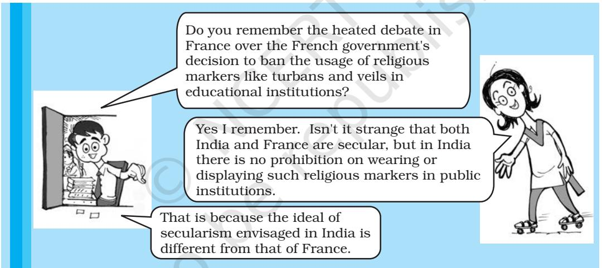

When different cultures and communities exist within the same country, how should a democratic state ensure equality for each of them? This is the question that emerged in the previous chapter. In this chapter we will try and see how the concept of secularism may be applied to answer that concern. In India, the idea of secularism is ever present in public debates and discussions, yet there is something very perplexing about the state of secularism in India. On the one hand, almost every politician swears by it. Every political party professes to be secular. On the other hand, all kinds of anxieties and doubts beset secularism in India. Secularism is challenged not only by clerics and religious nationalists but by some politicians, social activists and even academics.

In this chapter we will engage in this ongoing debate by asking the following questions:

- o What is the meaning of secularism?
- o Is secularism a western implant on Indian soil?
- o Is it suitable for societies where religion continues to exercise a strong influence on individual lives?
- o Does secularism show partiality? Does it 'pamper' minorities?
- o Is secularism anti-religious?

111 At the end of this chapter you should be able to understand and appreciate the importance of secularism in a democratic society like India, and learn something about the distinctiveness of Indian secularism.

### **8.1 WHAT IS SECULARISM?**

Though Jews faced discrimination for centuries throughout Europe, in the present state of Israel, Arab minorities, both Christian and Muslims, are excluded from social, political and economic benefits available to Jewish citizens. Subtle forms of discrimination also continue to persist against non-Christians in several parts of Europe. The condition of religious minorities in the neighbouring states of Pakistan and Bangladesh has also generated considerable concern. Such examples remind us of the continuing importance of secularism for people and societies in today's world.

### **Inter-religious Domination**

In our own country, the Constitution declares that every Indian citizen has a right to live with freedom and dignity in any part of the country. Yet in reality, many forms of exclusion and discrimination continue to persist. Consider three most stark examples:

- o More than 2,700 Sikhs were massacred in Delhi and many other parts of the country in 1984. The families of the victims feel that the guilty were not punished.
- o Several thousands of Hindu Kashmiri pandits have been forced to leave their homes in the Kashmir valley; they have not been able to return to their homes for more than two decades.
- o More than 1,000 persons were killed during the post-Godhra riots in Gujarat in 2002. The surviving members of many of these families could not go back to the villages in which they lived.

What do these examples have in common? They all have to do with discrimination in one form or the other. In each case members of one community are targeted and victimised on account of their religious identity. In other words, basic freedoms of a set of citizens are denied. Some might even say that these incidents are instances of religious persecution and they reflect inter-religious domination.

Secularism is first and foremost a doctrine that opposes all such forms of inter-religious domination. This is however only one crucial aspect of the concept of secularism. An equally important dimension

**112**

Secularism Secularism of secularism is its opposition to intra-religious domination. Let us get deeper into this issue.

### Intra-religious Domination

Some people believe that religion is merely the 'opium of the masses' and that, one day, when the basic needs of all are fulfilled and they lead a happy and contented life, religion will disappear. Such a view comes from an exaggerated sense of human potential. It is unlikely that human beings will ever be able to *fully* know the world and control it. We may be able to prolong our life but will never become immortal. Disease can never be entirely eliminated, nor can we get rid of an element of accident and luck from our lives. Separation and loss are endemic to the human condition. While a large part of our suffering is man-made and hence eliminable, at least some of our suffering is not made by man. Religion, art and philosophy are responses to such sufferings. Secularism too accepts this and therefore it is not anti-religious.

However, religion has its share of some deep-rooted problems. For example, one can hardly think of a religion that treats its male and female members on an equal footing. In religions such as Hinduism, some sections have faced persistent discrimination. For example *dalits* have been barred from entering Hindu temples. In some parts of the country, Hindu woman cannot enter temples. When religion is organised, it is frequently taken over by its most conservative faction, which does not tolerate any dissent. Religious fundamentalism in parts of the US has become a big problem and endangers peace both within the country and outside. Many religions fragment into sects which leads to frequent sectarian violence and persecution of dissenting minorities.

Thus religious domination cannot be identified only with interreligious domination. It takes another conspicuous form, namely, *intra-religious* domination. As secularism is opposed to all forms of institutionalised religious domination, it challenges not merely interreligious but also intra-religious domination.

We now possess a general idea of secularism. It is a normative doctrine which seeks to realise a secular society, i.e., one devoid of

SecularismSecularism either inter-religious or intra-religious domination. Put positively, it promotes freedom within religions, and equality between, as well as within, religions. Within this larger framework, let us now consider a narrower and more specific question, namely: What kind of state is necessary to realise these goals? In other words, let us consider how a state committed to the ideal of secularism should relate to religion and religious communities.

### 8.2 SECULAR STATE

Perhaps one way of preventing religious discrimination is to work together for mutual enlightenment. Education is one way of helping to change the mindset of people. Individual examples of sharing and mutual help can also contribute towards reducing prejudice and suspicion between communities. It is always inspiring to read stories of Hindus saving Muslims or Muslims saving Hindus in the

# LET'S DO IT Do

List some of the ways in which you feel communal harmony could be promoted.

midst of a deadly communal riot. But it is unlikely that mere education or the goodness of some persons will eliminate religious discrimination. In modern societies, states have enormous public power. How they function is bound to make a crucial difference to the outcome of any struggle to create a society less ridden with inter-community conflict and religious discrimination. For this reason, we need to see what kind of state is needed to prevent religious conflict and to promote religious harmony.

How should a state prevent domination by any religious group? For a start, a state must not be run by the heads of any particular religion. A state governed directly by a priestly order is called theocratic. Theocratic states, such as the Papal states of Europe in medieval times or in recent times the Taliban-controlled state, lacking separation between religious and political institutions, are known for their hierarchies, and oppressions, and reluctance to allow freedom of religion to members of other religious groups. If we value peace, freedom and equality, religious institutions and state institutions must be separated.

Some people think that the separation of state and religion is sufficient for the existence of a secular state. This does not appear

### 114

Secularism Secularism to be so. Many states which are non-theocratic continue to have a close alliance with a particular religion. For example, the state in England in the sixteenth century was not run by a priestly class but clearly favoured the Anglican Church and its members. England had an established Anglican religion, which was the official religion of the state. Today Pakistan has an official state religion, namely Sunni Islam. Such regimes may leave little scope for internal dissent or religious equality.

To be truly secular, a state must not only refuse to be theocratic but also have no formal, legal alliance with any religion. The separation of religion-state is, however, a necessary but not a sufficient ingredient of a secular state. A secular state must be committed to principles and goals which are at least partly derived

from non-religious sources. These ends should include peace, religious freedom, freedom from religiously grounded oppression, discrimination and exclusion, as also inter-religious and intra-religious equality.

To promote these ends the state must be separated from organised religion and its institutions for the sake of some of these values. However, there is no reason to suggest that this separation should take a particular form. In fact the nature and extent of separation may take different forms, depending upon the specific values it is meant to promote and the way in which these values are spelt out. We will now consider two such conceptions: the mainstream western conception best represented by the American state, and an alternative conception best exemplified by the Indian state.

### 8.3 THE WESTERN MODEL OF SECULARISM

All secular states have one thing in common: they are neither theocratic nor do they establish a religion. However, in most commonly prevalent conceptions, inspired mainly by the American model, separation of religion and state is understood as mutual exclusion: the state will not intervene in the affairs of religion and, in the same manner, religion will not interfere in the affairs of the state. Each

## LET'S DEBATE " "

Learning more about other religions is the first step towards learning to respect and accept other people and their beliefs. But that need not mean that we should not be able to stand up for what we feel are basic human values.

Secularism

*Political Theory*

## K Secularism EMAL ATATURK'S SECULARISM

Let us look at a very different kind of secularism practised in Turkey in the first half of the twentieth century. This secularism was not about principled distance from organised religion, instead it involved, active intervention in and suppression of, religion. This version of secularism was propounded and practised by Mustafa Kemal Ataturk.

He came to power after the First World War. He was determined to put an end to the institution of *Khalifa* in the public life of Turkey. Ataturk was convinced that only a clear break with traditional thinking and expressions could elevate Turkey from the sorry state it was in. He set out in an aggressive manner to modernise and secularise Turkey. Ataturk changed his own name from Mustafa Kemal Pasha to Kemal Ataturk (Ataturk translates as Father of the Turks). The *Fez*, a traditional cap worn by Muslims, was banned by the Hat Law. Western clothing was encouraged for men and women. The Western (Gregorian) calendar replaced the traditional Turkish calendar. In 1928, the new Turkish alphabet (in a modified Latin form) was adopted.

Can you imagine a secularism that does not give you the freedom to keep the name you are identified with, wear the dress you are used to, change the language you communicate in? In what ways do you think Ataturk's secularism is different from Indian secularism ?

> has a separate sphere of its own with independent jurisdiction. No policy of the state can have an exclusively religious rationale. No religious classification can be the basis of any public policy. If this happened there is illegitimate intrusion of religion in the state.

> Similarly, the state cannot aid any religious institution. It cannot give financial support to educational institutions run by religious communities. Nor can it hinder the activities of religious communities, as long as they are within the broad limits set by the law of the land. For example, if a religious institution forbids a woman from becoming a priest, then the state can do little about it. If a religious community excommunicates its dissenters, the state can only be a silent witness. If a particular religion forbids the entry of some of its members in the sanctum of its temple, then the state has no option but to let the matter rest exactly where it is. On this view, religion is a private matter, not a matter of state policy or law.

> This common conception interprets freedom and equality in an individualist manner. Liberty is the liberty of individuals. Equality

### 116

### *Political Theory*

is equality between individuals. There is no scope for the idea that a community has the liberty to follow practices of its own choosing. There is little scope for community-based rights or minority rights. The history of western societies tells us why this is so. Except for

the presence of the Jews, most western societies were marked by a great deal of religious homogeneity. Given this fact, they naturally focused on intrareligious domination. While strict separation of the state from the church is emphasised to realise among other things, individual freedom, issues of inter-religious (and therefore of minority rights) equality are often neglected.

Finally, this form of mainstream secularism has no place for the idea of statesupported religious reform. This feature follows directly from its understanding that the separation of state from church/ religion entails a relationship of mutual exclusion.

### **8.4 THE INDIAN MODEL OF SECULARISM**

Sometimes it is said that Indian secularism is an imitation of western secularism. But a careful reading of our Constitution shows that this is not the case. Indian secularism is fundamentally different from Western secularism.

### **NEHRU ON SECULARISM'**

'Equal protection by the State to all religions'. This is how Nehru responded when a student asked him to spell out what secularism meant in independent India. He wanted a secular state to be one that "protects all religions, but does not favour one at the expense of others and does not itself adopt any religion as the state religion". Nehru was the philosopher of Indian secularism.

Nehru did not practise any religion, nor did he believe in God. But for him secularism did not mean hostility to religion. In that sense Nehru was very different from Ataturk in Turkey. At the same time Nehru was not in favour of a complete separation between religion and state. A secular state can interfere in matters of religion to bring about social reform. Nehru himself played a key role in enacting laws abolishing caste discrimination, dowry and *sati*, and extending legal rights and social freedom to Indian women.

While Nehru was prepared to be flexible on many counts, there was one thing on which he was always firm and uncompromising. Secularism for him meant a complete opposition to communalism of all kinds. Nehru was particularly severe in his criticism of communalism of the majority community. Secularism for him was not only a matter of principles, it was also the only guarantee of the unity and integrity of India.

**117**

SecularismSecularism Indian secularism does not focus only on church-state separation and the idea of inter-religious equality is crucial to the Indian conception. Let us elaborate this further.

> What makes Indian secularism distinctive? For a start it arose in the context of deep religious diversity that predated the advent of Western modern ideas and nationalism. There was already a culture of inter-religious 'tolerance' in India. However, we must not forget that tolerance is compatible with religious domination. It may allow some space to everyone but such freedom is usually limited. Besides, tolerance allows you to put up with people whom you find deeply repugnant. This is a great virtue if a society is recovering from a major civil war but not in times of peace where people are struggling for equal dignity and respect.

The advent of western modernity brought to the fore hitherto neglected and marginalised notions of equality in Indian thought. It sharpened these ideas and helped us to focus on equality within the community. It also ushered ideas of inter-community equality to replace the notion of hierarchy. Thus Indian secularism took on a distinct form as a result of an interaction between what already existed in a society that had religious diversity and the ideas that came from the west. It resulted in equal focus on intra-religious and interreligious domination. Indian secularism equally opposed the

### *Political Theory*

oppression of *dalits* and women within Hinduism, the discrimination against women within Indian Islam or Christianity, and the possible threats that a majority community might pose to the rights of the minority religious communities. This is its first important difference from mainstream western secularism.

Connected to it is the second difference. Indian secularism deals not only with religious freedom of *individuals* but also with religious freedom of minority *communities*. Within it, an individual has the right to profess the religion of his or her choice. Likewise, religious minorities also have a right to exist and to maintain their own culture and educational institutions.

A third difference is this. Since a secular state must be concerned equally with intra-religious domination, Indian secularism has made room for and is compatible with the idea of state-supported religious reform. Thus, the Indian constitution bans untouchability. The Indian state has enacted several laws abolishing child marriage and lifting the taboo on inter-caste marriage sanctioned by Hinduism.

The question however that arises is: can a state initiate or even support religious reforms and yet be secular? Can a state claim to be secular and not maintain separation of religion from state? The secular character of the Indian state is established by virtue of the fact that it is neither theocratic nor has it established any one or multiple religions. Beyond that it has adopted a very sophisticated policy in pursuit of religious equality. This allows it either to disengage with religion in American style, or engage with it if required.

The Indian state may engage with religion negatively to oppose religious tyranny. This is reflected in such actions as the ban on untouchability. It may also choose a positive mode of engagement. Thus, the Indian Constitution grants all religious minorities the right to establish and maintain their own educational institutions which may receive assistance from the state. All these complex strategies can be adopted by the state to promote the values of peace, freedom and equality.

Religious identities and dif ferences have no significance for the young.

*Political Theory*

### LET'S THINK

- Is secularism compatible with the following?
- o Subsidising a pilgrimage for a minority community.
- o Performing religious rituals in government offices.

LET'S DO IT Do

- o Watch films such as *Bombay* and *Garam Hawa*? What ideals of secularism do they depict?
- o Read a short story 'Name' in *Forsaking Paradise: Stories from Ladakh* by Abdul Ghani Sheikh [Published by Katha)

It should be clear by now why the complexity of Indian secularism cannot be captured by the phrase *"equal respect for all religions"*. If by this phrase is meant peaceful coexistence of all religions or interreligious toleration, then this will not be enough because secularism is much more than mere peaceful coexistence or toleration. If this phrase means equal feeling of respect towards all established religions and their practices, then there is an ambiguity that needs clearing. Indian secularism allows for principled state intervention in all religions. Such intervention betrays disrespect to some aspects of every religion. For example, religiously sanctioned caste-hierarchies are not acceptable within Indian secularism. The secular state does not have to treat every aspect of every religion with equal respect. It allows equal disrespect for some aspects of organised religions.

### 8.5 CRITICISMS OF INDIAN SECULARISM

Indian secularism has been subjected to fierce criticism. What are these criticisms? Can we defend secularism from them?

### Anti-religious

First, it is often argued that secularism is anti-religious. We hope to have shown that secularism is against institutionalised religious domination. This is not the same as being anti-religious.

Similarly, it has been argued by some that secularism threatens religious identity. However, as we noted earlier, secularism promotes religious freedom and equality. Hence, it clearly protects religious identity rather than threatens it. Of course, it does undermine

120

### *Political Theory*

some forms of religious identity: those, which are dogmatic, violent, fanatical, exclusivist and those, which foster hatred of other religions. The real question is not whether something is undermined but whether what is undermined is intrinsically worthy or unworthy.

### **Western Import**

A second criticism is that secularism is a Western concept and, therefore, unsuited to Indian conditions. On the surface, this is a strange complaint. For there are millions of things in India today, from trousers to the internet and parliamentary democracy, that have their origins in the west. One response, therefore, could be: so what? Have you heard a European complain that because zero was invented in India, they will not work with it?

However, this is a somewhat shallow response. The more important and relevant point is that for a state to be truly secular, it must have ends of its own. Western states became secular when, at an important level, they challenged the control of established religious authority over social and political life. The western model of secularism is not, therefore, a product of the Christian world. What of the claim that it is western? The mutual exclusion of religion and state, which is supposed to be the ideal of western secular societies, is also not the defining feature of all secular states. The idea of separation can be interpreted differently by different societies. A secular state may keep a principled distance from religion to promote peace between communities and it may also intervene to protect the rights of specific communities.

This exactly is what has happened in India. India evolved a variant of secularism that is not just an implant from the west on Indian soil. The fact is that the secularism has both western and nonwestern origins. In the west, it was the Church-state separation which was central and in countries such as India, the idea of peaceful coexistence of different religious communities has been important.

### **Minoritism**

A third accusation against secularism is the charge of minoritism. It is true that Indian secularism advocates minority rights so the question is: Is this justified? Consider four adults in a compartment

SecularismSecularism of a train travelling at the fastest speed imaginable. In the middle of the journey, one of the four passengers expresses a desire to smoke. The second one complains that he cannot bear cigarette smoke. The other two passengers smoke too but say nothing. Clearly there is a conflict here between two passengers. A suggestion is made that it be resolved by vote. The two mild smokers go along with the addict and the non-smoker is defeated by a margin of two votes. The person in the minority loses but the result appears fair because a proper democratic procedure adopted by common agreement was followed.

> Now alter the situation a bit. Suppose that the non-smoker suffers from asthma. Smoking can induce a life-threatening attack in him. His preference that the other person does not smoke expresses now his fundamental and very urgent interest. Would the procedure previously followed, of going with the decision of the

I thought treating everyone in exactly the same way is not always fair!

majority, be fair in such a context? Do you not think that the addicted smoker should refrain till the train reaches its destination? You will agree that when it comes to fundamental interests, voting as a democratic procedure is inappropriate. A person has a prior right to the satisfaction of his or her significant interests. What holds true of individuals also holds for communities. The most fundamental interest of minorities must not be harmed and must be protected by constitutional law. This is exactly how it is in the Indian Constitution. Minority rights are justified as long as these rights protect their fundamental interests.

At this point someone might still say that minority rights are special privileges which come with some costs to others. Why then should such special privilege be given? This question can be best answered by another example. Consider that a film is being shown in an auditorium on the first floor. The auditorium is accessible by a staircase. Everyone is free to buy a ticket, go up the stairs and see the film. Or, are they? Is everyone really free? Suppose that among avid film-goers are some old people, some who have recently broken a leg and others who have long been physically challenged. None of them can really climb up the stairs. Do you

122

Secularism Secularism think it would be wrong if a lift or a ramp was provided for people in wheel chairs? Doing so enables them to achieve exactly what others routinely procure through the staircase. Yet, this group in minority needs a different mode of getting to the first floor. If all spaces are structured in such a way that they suit only young, able-bodied persons, then some category of persons will forever be excluded from a simple benefit such as watching a film. To make a separate arrangement for them is not to accord them any special treatment. It is to treat them with the same respect and dignity with which all others are being treated. The lesson is that minority rights need not be nor should be viewed as special privileges.

### Interventionist

A *fourth* criticism claims that secularism is coercive and that it interferes excessively with the religious freedom of communities. This misreads Indian secularism. It is true that by rejecting the idea of separation as mutual exclusion, Indian secularism rejects non-interference in religion. But it does not follow that it is excessively interventionist. Indian secularism follows the concept of principled distance which also allows for noninter ference. Besides, inter ference need not automatically mean coercive intervention.

 It is of course true that Indian secularism permits state-supported religious reform. But this should not be equated with a change imposed from above, with coercive intervention. But it might be argued: does it do this consistently? Why have personal laws of all religious communities not been reformed? This is the big dilemma facing the Indian state. A secularist might see the personal laws (laws concerning marriage, inheritance and other family matters which are

How can a State treat all religions equally? Would granting equal number of holidays to each religion help? Or would banning any religious ceremony on public occasions be a way of doing this?

governed by different religions) as manifestations of communityspecific rights that are protected by the Constitution. Or he might see these laws as an affront to the basic principles of secularism on the ground that they treat women unequally and therefore unjustly. Personal laws can be seen as manifestations of freedom

SecularismSecularism from inter-religious domination or as instances of intra-religious domination.

> Such internal conflicts are part and parcel of any complex doctrine but they are not something that we need to live with forever. Personal laws can be reformed in such a way that they continue to exemplify both minority rights and equality between men and women. But such reform should neither be brought about by State or group coercion nor should the state adopt a policy of total distance from it. The state must act as a facilitator by supporting liberal and democratic voices within every religion.

### **Vote Bank Politics**

*Fifth,* there is the argument that secularism encourages the politics of vote banks. As an empirical claim, this is not entirely false. However, we need to put this issue in perspective. First, in a democracy politicians are bound to seek votes. That is part of their job and that is what democratic politics is largely about. To blame a politician for pursuing a group of people or promising to initiate a policy with the motivation to secure their votes is unfair. The real question is what precisely the vote is sought for. Is it to promote solely his self-interest or power or is it also for the welfare of the group in question? If the group which voted for the politician does not get any benefit from this act, then surely the politician must be blamed. If secular politicians who sought the votes of minorities also manage to give them what they want, then this is a success of the secular project which aims, after all, to also protect the interests of the minorities.

But what if the welfare of the group in question is sought at the cost of the welfare and rights of other groups? What if the interests of the majority are undermined by these secular politicians? Then a new injustice is born. Can you think of such examples? In theory, there may not be anything wrong with vote bank politics but only when vote bank politics leads to the mobilisation of a social group to vote en masse for a particular candidate or political party during elections, this distorts electoral politics. Here, the important feature is that the whole group works as a single monolithic unit during voting. Despite the diversity within the unit, the party or leader pursuing such vote bank politics tries to artificially construct a belief that the interest of the

*Political Theory*

group is one. In effect, by doing this, the political parties' priorities short- term electoral gains over the long- term development and governance needs of society. In India it has been observed that political parties neglecting substantive issues have often focused on emotive issues for electoral gains, neglecting genuine problems faced by the community. Competitive vote bank politics has the potential to exacerbate social division by portraying different groups as rivals vying for limited resources. In India, the vote bank politics is also associated with minority appeasement. This means that the political parties disregard the principles of equality of all citizens and give priority to the interests of a minority group. Ironically, this has led to further alienation and marginalization of the minority group. As vote bank politics fails to acknowledge diversity within the minority group taking up issues of social reform within these groups has also proved difficult.

### **Impossible Project**

A final, cynical criticism might be this: Secularism cannot work because it tries to do too much, to find a solution to an intractable problem. What is this problem? People with deep religious differences will never live together in peace. Now, this is an empirically false claim. The history of Indian civilisation shows that this kind of living together is realisable. It was realised elsewhere too. The Ottoman Empire is a stirring example. But now critics might say that co-existence under conditions of inequality was indeed possible. Everyone could find a place in a hierarchically arranged order. The point, they claim, is that this will not work today when equality is increasingly becoming a dominant cultural value.

There is another way of responding to this criticism. Far from pursuing an impossible objective Indian secularism mirrors the future of the world. A great experiment is being carried out in India watched with razor-sharp eyes and with great interest by the whole world. It is doing so because with the migration of people from the former colonies to the west, and the increased movement of people across the globe with the intensification of globalisation, Europe and America and some parts of the Middle-East are beginning to resemble India in the diversity of cultures and religions which are present in their societies. These societies are watching the future of the Indian experiment with keen interest.

Read out the list of gazetted holidays in India. Does it uphold the case of Secularism in India? Give your arguments.

### Name of the holiday Date according to

Gregorian Calendar (for 2019)

Republic Day January 26 Maha Shivaratri March 4 Holi March 21 Mahavir Jayanti April 17 Good Friday April 19 Buddha Purnima May 18 Id-ul-Fitr June 5 Id-ul-Zuha (Bakrid) August 12 Independence Day August 15 Janmashtami August 24 Muharram September 10 Mahatma Gandhi's Birthday October 2 Dussehra October 8 Diwali (Deepavali) October 27 Milad-un-Nabi/Id-e-Milad (Birthday of Prophet Mohammad) November 10 Guru Nanak's Birthday November 12 Christmas Day December 25

- 
### 126

*Political Theory*

- 1. Which of the following do you feel are compatible with the idea of secularism? Give reasons.
	- (a) Absence of domination of one religious group by another.
	- (b) Recognition of a state religion.
	- (c) Equal state support to all religions.
	- (d) Mandatory prayers in schools.
	- (e) Allowing separate educational institutions for any minority community.
	- (f) Appointment of temple management bodies by the government.
	- (g) Intervention of state to ensure entry of *Dalits* in temples*.*
- 2. Some of the key characteristics of western and Indian model of secularism have got mixed up. Separate them and make a new table.

| Western Secularism | Indian Secularism |
| --- | --- |
| Strict non-interference of | State supported religious |
| religion and state in each | reforms allowed |
| other's affairs |  |
| Equality between different | Equality between different |
| religious groups is a key concern | sects of a religion is |
|  | emphasised |
| Attention to minority rights | Less attention to community |
|  | based rights |
| Individual and his rights at the | Rights of both individual and |
| centre | religious community |
|  | protected. |

Exercises

Exercises

- 3. What do you understand by secularism? Can it be equated with religious tolerance?
- 4. Do you agree with the following statements? Give reasons for supporting or opposing any of them.
	- (a) Secularism does not allow us to have a religious identity.
	- (b) Secularism is against inequality within a religious group or between different religious groups.
	- (c) Secularism has a western-Christian origin. It is not suitable for India.
- 5. Indian secularism focuses on more than the religion-state separation. Explain.
- 6. Explain the concept of principled distance.

128

*Credit: Images on opening page: Sanjeev Chetan*

