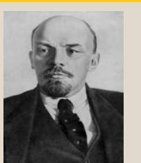
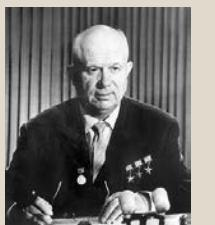
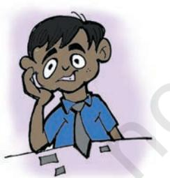
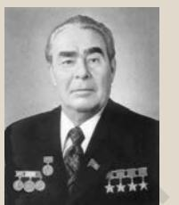
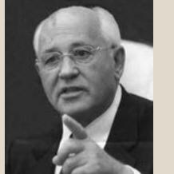
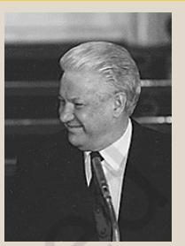
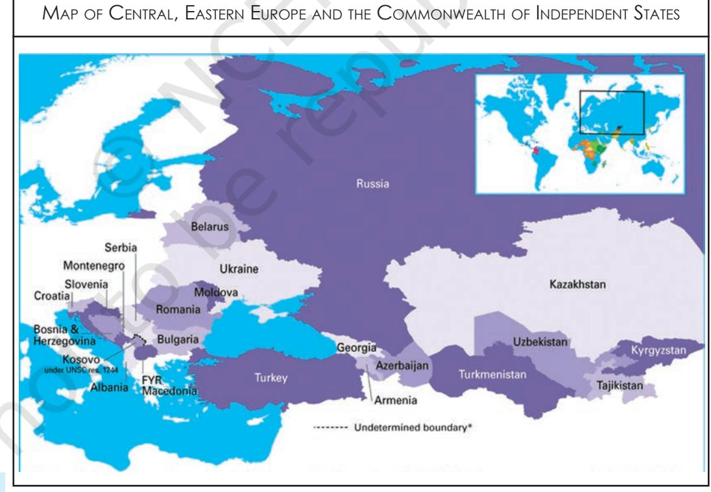
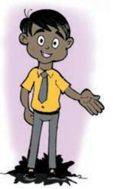

# Chapter 1 The End of Bipolarity

## Overview

The Berlin Wall, which had been built at the height of the Cold War and was its greatest symbol, was toppled by the people in 1989. This dramatic event was followed by an equally dramatic and historic chain of events that led to the collapse of the 'second world' and the end of the Cold War. Germany, divided after the Second World War, was unified. One after another, the eight East European countries that were part of the Soviet bloc replaced their communist governments in response to mass demonstrations. The Soviet Union stood by as the Cold War began to end, not by military means but as a result of mass actions by ordinary men and women. Eventually the Soviet Union itself disintegrated. In this chapter, we discuss the meaning, the causes and the consequences of the disintegration of the 'second world'. We also discuss what happened to that part of the world after the collapse of communist regimes and how India relates to these countries now.

*The Berlin Wall symbolised the division between the capitalist and the communist world. Built in 1961* 

*to separate East Berlin from West Berlin, this more than 150 kilometre long wall stood for 28 years and was finally broken by the people on 9 November 1989. This marked the unification of the two parts of Germany and the beginning of the end of the communist bloc. The pictures here depict: 1. People making a tiny hole in the wall* 

*2. A section of the wall opened to allow free movement*

- *3. The Berlin Wall as it stood before 1989*
*Credit: 1. and 2. Frederik Ramm,* 

*www.remote.org/frederik/culture/berlin*

*3. www.cs.utah.edu*

Chapter 1.indd 1 14 September 2022 11:01:41

#### **LEADERS OF THE SOVIET UNION**

**Vladimir Lenin** (1870-1924) Founder of the Bolshevik Communist party; leader of the Russian Revolution of 1917 and the founder-head of the USSR during the most difficult period following the revolution (1917-1924); a practitioner of Marxism and a source of inspiration for communists all over the world.

## **What was the Soviet System?**

The Union of Soviet Socialist Republics (USSR) came into being after the socialist revolution in Russia in 1917. The revolution was inspired by the ideals of socialism, as opposed to capitalism, and the need for an egalitarian society. This was perhaps the biggest attempt in human history to abolish the institution of private property and consciously design a society based on principles of equality. In doing so, the makers of the Soviet system gave primacy to the state and the institution of the party. The Soviet political system centred around the communist party, and no other political party or opposition was allowed. The economy was planned and controlled by the state.

After the Second World War, the east European countries that the Soviet army had liberated from the fascist forces came under the control of the USSR. The political and the economic systems of all these countries were modelled after the USSR. This group of countries was called the Second World or the 'socialist bloc'. The Warsaw Pact, a military alliance, held them together. The USSR was the leader of the bloc.

The Soviet Union became a great power after the Second World War. The Soviet economy was then more developed than the rest of the world except for the US. It had a complex communications network, vast energy resources including oil, iron and steel, machinery production, and a transport sector that connected its remotest areas with efficiency. It had a domestic consumer industry that produced everything from pins to cars, though their quality did not match that of the Western capitalist countries. The Soviet state ensured a minimum standard of living for all citizens, and the government subsidised basic necessities including health, education, childcare and other welfare schemes. State ownership was the dominant form of ownership: land and productive assets were owned and controlled by the Soviet state.

The Soviet system, however, became very bureaucratic and authoritarian, making life very difficult for its citizens. Lack of democracy and the absence of freedom of speech stifled people who often expressed their dissent in jokes and cartoons. Most of the institutions of the Soviet state needed reform: the oneparty system represented by the Communist Party of the Soviet Union had tight control over all institutions and was unaccountable to the people. The party refused to recognise the urge of people in the fifteen different republics that formed the Soviet Union to manage their own affairs including their cultural affairs. Although, on paper, Russia was only one of the fifteen republics that together constituted the USSR, in reality Russia dominated everything, and people from other regions felt neglected and often suppressed.

Chapter 1.indd 2 15-03-2024 11:45:31

In the arms race, the Soviet Union managed to match the US from time to time, but at great cost. The Soviet Union lagged behind the West in technology, infrastructure (e.g., transport, power), and most importantly, in fulfilling the political or economic aspirations of citizens. The Soviet invasion of Afghanistan in 1979 weakened the system even further. Though wages continued to grow, productivity and technology fell considerably behind that of the West. This led to shortages in all consumer goods. Food imports increased every year. The Soviet economy was faltering in the late 1970s and became stagnant.

## **Gorbachev and the**

## **Disintegration**

Mikhail Gorbachev, who had become General Secretary of the Communist Party of the Soviet Union in 1985, sought to reform this system. Reforms were necessary to keep the USSR abreast of the information and technological revolutions taking place in the West. However, Gorbachev's decision to normalise relations with the West and democratise and reform the Soviet Union had some other effects that neither he nor anyone else intended or anticipated. The people in the East European countries which were part of the Soviet bloc started to protest against their own governments and Soviet control. Unlike in the past, the Soviet Union, under Gorbachev, did not intervene when the disturbances occurred, and the communist regimes collapsed one after another.

These developments were accompanied by a rapidly escalating crisis within the USSR that hastened its disintegration. Gorbachev initiated the policies of economic and political reform and democratisation within the country. The reforms were opposed by leaders within the Communist Party.

A coup took place in 1991 that was encouraged by Communist Party hardliners. The people had tasted freedom by then and did not want the old-style rule of the Communist Party. Boris Yeltsin emerged as a national hero in opposing this coup. The Russian Republic, where Yeltsin won a popular election, began to shake off centralised control. Power began to shift from the Soviet centre to the republics, especially in the more Europeanised part of the Soviet Union, which saw themselves as sovereign states. The Central Asian republics did not ask for independence and wanted to remain with the Soviet Federation. In December 1991, under the leadership of Yeltsin, Russia, Ukraine and Belarus, three major republics of the USSR, declared that the Soviet Union was disbanded. The Communist Party of the Soviet Union was banned. Capitalism and democracy were adopted as the bases for the post-Soviet republics.

**LEADERS OF THE SOVIET UNION**

**Joseph Stalin** (1879-1953) Successor to Lenin and led the Soviet Union during its consolidation (1924-53); began rapid industrialisation and forcible collectivisation of agriculture; credited with Soviet victory in the Second World War; held responsible for the Great Terror of the 1930s, authoritarian functioning and elimination of rivals within the party.

Chapter 1.indd 3 14 September 2022 11:01:41

#### **LEADERS OF THE SOVIET UNION**

**Nikita Khrushchev** (1894-1971) Leader of the Soviet Union (1953-64); denounced Stalin's leadership style and introduced some reforms in 1956; suggested "peaceful coexistence" with the West; involved in suppressing popular rebellion in Hungary and in the Cuban missile crisis.

I am amazed! How could so many sensitive people all over the world admire a system like this?

A Communist Party bureaucrat drives down from Moscow to a collective farm to register a potato harvest.

"Comrade farmer, how has the harvest been this year?" the official asks. "Oh, by the grace of God, we had mountains of potatoes," answers the farmer.

"But there is no God," counters the official.

"Huh", says the farmer, "And there are no mountains of potatoes either."

The declaration on the disintegration of the USSR and the formation of the Commonwealth of Independent States (CIS) came as a surprise to the other republics, especially to the Central Asian ones. The exclusion of these republics was an issue that was quickly solved by making them founding members of the CIS. Russia was now accepted as the successor state of the Soviet Union. It inherited the Soviet seat in the UN Security Council. Russia accepted all the international treaties and commitments of the Soviet Union. It took over as the only nuclear state of the post-Soviet space and carried out some nuclear disarmament measures with the US. The old Soviet Union was thus dead and buried.

## **Why did the Soviet Union Disintegrate?**

How did the second most powerful country in the world suddenly disintegrate? This is a question worth asking not just to understand the Soviet Union and the end of communism but also because it is not the first and may not be the last political system to collapse. While there are unique features of the Soviet collapse, there may be more general lessons to be drawn from this very important case.

There is no doubt that the internal weaknesses of Soviet political and economic institutions, which failed to meet the aspirations of the people, were responsible for the collapse of the system. Economic stagnation for many years led to severe consumer shortages and a large section of Soviet society began to doubt and question the system and to do so openly.

Why did the system become so weak and why did the economy stagnate? The answer is partially clear. The Soviet economy used much of its resources in maintaining a nuclear and military arsenal and the development of its satellite states in Eastern Europe and within the Soviet system (the five Central Asian Republics in particular). This led to a huge economic burden that the system could not cope with. At the same time, ordinary citizens became more knowledgeable about the economic advance of the West. They could see the disparities between their system and the systems of the West. After years of being told that the Soviet

Chapter 1.indd 4 14 September 2022 11:01:41

system was better than Western capitalism, the reality of its backwardness came as a political and psychological shock.

The Soviet Union had become stagnant in an administrative and political sense as well. The Communist Party that had ruled the Soviet Union for over 70 years was not accountable to the people. Ordinary people were alienated by slow and stifling administration, rampant corruption, the inability of the system to correct mistakes it had made, the unwillingness to allow more openness in government, and the centralisation of authority in a vast land. Worse still, the party bureaucrats gained more privileges than ordinary citizens. People did not identify with the system and with the rulers, and the government increasingly lost popular backing.

Gorbachev's reforms promised to deal with these problems. Gorbachev promised to reform the economy, catch up with the West, and loosen the administrative system. You may wonder why the Soviet Union collapsed in spite of Gorbachev's accurate diagnosis of the problem and his attempt to implement reforms. Here is where the answers become more controversial, and we have to depend on future historians to guide us better.

The most basic answer seems to be that when Gorbachev carried out his reforms and loosened the system, he set in motion forces and expectations that few could have predicted and became virtually impossible to control. There were sections of Soviet society which felt that Gorbachev should have moved much faster and were disappointed and impatient with his methods. They did not benefit in the way they had hoped, or they benefited too slowly. Others, especially members of the Communist Party and those who were served by the system, took exactly the opposite view. They felt that their power and privileges were eroding and Gorbachev was moving too quickly. In this 'tug of war', Gorbachev lost support on all sides and divided public opinion. Even those who were with him became disillusioned as they felt that he did not adequately defend his own policies.

All this might not have led to the collapse of the Soviet Union but for another development that surprised most observers and indeed many insiders. The rise of nationalism and the desire for sovereignty within various republics including Russia and the Baltic Republics (Estonia, Latvia and Lithuania), Ukraine, Georgia, and others proved to be the final and most immediate cause for the disintegration of the USSR. Here again there are differing views.

One view is that nationalist urges and feelings were very much at work throughout the history of the Soviet Union and that whether or not the reforms had occurred there would have been an internal struggle within the Soviet Union. This is a 'what-if' of history, but surely it is not an unreasonable

#### **LEADERS OF THE SOVIET UNION**

**Leonid Brezhnev** (1906-82) Leader of the Soviet Union (1964- 82); proposed Asian Collective Security system; associated with the détente phase in relations with the US; involved in suppressing a popular rebellion in Czechoslovakia and in invading Afghanistan.

Chapter 1.indd 5 14 September 2022 11:01:41

### **LEADERS OF THE SOVIET UNION**

**Mikhail Gorbachev** (Born 1931) Last leader of the Soviet Union (1985- 91); introduced economic and political reform policies of *perestroika*  (restructuring) and *glasnost* (openness); stopped the arms race with the US; withdrew Soviet troops from Afghanistan and eastern Europe; helped in the unification of Germany; ended the Cold War; blamed for the disintegration of the Soviet Union.

view given the size and diversity of the Soviet Union and its growing internal problems. Others think that Gorbachev's reforms speeded up and increased nationalist dissatisfaction to the point that the government and rulers could not control it.

Ironically, during the Cold War many thought that nationalist unrest would be strongest in the Central Asian republics given their ethnic and religious differences with the rest of the Soviet Union and their economic backwardness. However, as things turned out,

## **TIMELINE OF DISINTEGRATION OF THE SOVIET UNION**

**1985 March:** Mikhail Gorbachev elected as the General Secretary of the Communist Party of the Soviet Union; appoints Boris Yeltsin as the head of the Communist Party in Moscow; initiates a series of reforms in the Soviet Union

**1988 June:** Independence movement begins in Lithuania; later spreads to Estonia and Latvia

**1989 October:** Soviet Union declares that the Warsaw Pact members are free to decide their own futures; Berlin Wall falls in November

**1990 February:** Gorbachev strips the Soviet Communist Party of its 72-year-long monopoly on power by calling on the Soviet parliament (Duma) to permit multi-party politics

**1990 March:** Lithuania becomes the first of the 15 Soviet republics to declare its independence

**1990 June:** Russian parliament declares its independence from the Soviet Union

**1991 June:** Yeltsin, no longer in the Communist Party, becomes the President of Russia

**1991 August:** The Communist Party hardliners stage an abortive coup against Gorbachev

**1991 September:** Three Baltic republics of Estonia, Latvia and Lithuania become UN members (later join NATO in March 2004)

**1991 December:** Russia, Belarus and Ukraine decide to annul the 1922 Treaty on the Creation of the USSR and establish the Commonwealth of Independent States (CIS); Armenia, Azerbaijan, Moldova, Kazakhstan, Kyrgyzstan, Tajikistan, Turkmenistan and Uzbekistan join the CIS (Georgia joins later in 1993); Russia takes over the USSR seat in the United Nations

**1991 December 25:** Gorbachev resigns as the President of the Soviet Union; the end of the Soviet Union

Chapter 1.indd 6 15-03-2024 11:45:32

nationalist dissatisfaction with the Soviet Union was strongest in the more "European" and prosperous part – in Russia and the Baltic areas as well as Ukraine and Georgia. Ordinary people here felt alienated from the Central Asians and from each other and concluded also that they were paying too high an economic price to keep the more backward areas within the Soviet Union.

## **Consequences of Disintegration**

The collapse of the second world of the Soviet Union and the socialist systems in eastern Europe had profound consequences for world politics. Let us note here three broad kinds of enduring changes that resulted from it. Each of these had a number of effects that we cannot list here.

First of all, it meant the end of Cold War confrontations. The ideological dispute over whether the socialist system would beat the capitalist system was not an issue any more. Since this dispute had engaged the military of the two blocs, had triggered a massive arms race and accumulation of nuclear weapons, and had led to the existence of military blocs, the end of the confrontation demanded an end to this arms race and a possible new peace.

Second, power relations in world politics changed and, therefore, the relative influence of ideas and institutions also

changed. The end of the Cold War left open only two possibilities: either the remaining superpower would dominate and create a unipolar system, or different countries or groups of countries could become important players in the international system, thereby bringing in a multipolar system where no one power could dominate. As it turned out, the US became the sole superpower. Backed by the power and prestige of the US, the capitalist economy was now the dominant economic system internationally. Institutions like the World Bank and International Monetary Fund became powerful advisors to all these countries since they gave them loans for their transitions to capitalism. Politically, the notion of liberal democracy emerged as the best way to organise political life.

Third, the end of the Soviet bloc meant the emergence of many new countries. All these countries had their own independent aspirations and choices. Some of them, especially the Baltic and east European states, wanted to join the European Union and become part of the North Atlantic Treaty Organisation (NATO). The Central Asian countries wanted to take advantage of their geographical location and continue their close ties with Russia and also to establish ties with the West, the US, China and others. Thus, the international system saw many new players emerge, each with its own identity, interests, and economic and political difficulties. It is to these issues that we now turn.

#### **LEADERS OF THE SOVIET UNION**

**Boris Yeltsin** (1931-2007) The first elected President of Russia (1991- 1999); rose to power in the Communist Party and was made the Mayor of Moscow by Gorbachev; later joined the critics of Gorbachev and left the Communist Party; led the protests against the Soviet regime in 1991; played a key role in dissolving the Soviet Union; blamed for hardships suffered by Russians in their transition from communism to capitalism.

Chapter 1.indd 7 14 September 2022 11:01:43

I heard someone say "The end of the Soviet Union does not mean the end of socialism." Is that possible?

## **Shock Therapy in Post-Communist Regimes**

The collapse of communism was followed in most of these countries by a painful process of transition from an authoritarian socialist system to a democratic capitalist system. The model of transition in Russia, Central Asia and east Europe that was influenced by the World Bank and the IMF came to be known as 'shock therapy'. Shock therapy varied in intensity and speed amongst the former second world countries, but its direction and features were quite similar.

Each of these countries was required to make a total shift to a capitalist economy, which meant rooting out completely any structures evolved during the Soviet period. Above all, it meant that private ownership was to be the dominant pattern of ownership of property. Privatisation of state assets and corporate ownership patterns were to be immediately brought in. Collective farms were to be replaced by private farming and capitalism in agriculture. This transition ruled out any alternate or 'third way', other than state-controlled socialism or capitalism.

*Locate the Central Asian Republics on the map.*

*Source: https://www.unicef.org/hac2012/images/HAC2012_CEE-CIS_map_REVISED.gif Note: The boundaries and names shown and the designations used on this map do not imply official endorsement or acceptance by the United Nations.*

Chapter 1.indd 8 14 September 2022 11:01:44

Shock therapy also involved a drastic change in the external orientation of these economies. Development was now envisaged through more trade, and thus a sudden and complete switch to free trade was considered essential. The free trade regime and foreign direct investment (FDI) were to be the main engines of change. This also involved openness to foreign investment, financial opening up or deregulation, and currency convertibility.

Finally, the transition also involved a break up of the existing trade alliances among the countries of the Soviet bloc. Each state from this bloc was now linked directly to the West and not to each other in the region. These states were thus to be gradually absorbed into the Western economic system. The Western capitalist states now became the leaders and thus guided and controled the development of the region through various agencies and organisations.

## **Consequences of Shock Therapy**

The shock therapy administered in the 1990s did not lead the people into the promised utopia of mass consumption. Generally, it brought ruin to the economies and disaster upon the people of the entire region. In Russia, the large state-controlled industrial complex almost collapsed, as about 90 per cent of its industries were put up for sale to private individuals and companies. Since the restructuring was carried out through market forces and not by governmentdirected industrial policies, it led to the virtual disappearance of entire industries. This was called 'the largest garage sale in history', as valuable industries were undervalued and sold at throwaway prices. Though all citizens were given vouchers to participate in the sales, most citizens sold their vouchers in the black market because they needed the money.

The value of the ruble, the Russian currency, declined dramatically. The rate of inflation was so high that people lost all their savings. The collective farm system disintegrated leaving people without food security, and Russia started to import food. The real GDP of Russia in 1999 was below what it was in 1989. The old trading structure broke down with no alternative in its place.

The old system of social welfare was systematically destroyed. The withdrawal of government subsidies pushed large sections of the people into poverty. The middle classes were pushed to the periphery of society, and the academic and intellectual manpower disintegrated or migrated. A mafia emerged in most of these countries and started controlling many economic activities. Privatisation led to new disparities. Post-Soviet states, especially Russia, were divided

I can see the shock. But where is the therapy? Why do we talk in such euphemisms?

Chapter 1.indd 9 14 September 2022 11:01:44

As a result of 'shock therapy' about half of Russia's 1,500 banks and other finacial institutions went bankrupt. This image is that of Inkombank, Russia's second largest bank, that went bankrupt in 1998. As a result, the money of 10,000 corporate and private shareholders was lost, along with the money kept in the bank by customers.

What is the difference between nationalism and secessionism? If you succeed, you are celebrated as a nationalist hero, and if you fail you are condemned for crimes of secessionism.

between rich and poor regions. Unlike the earlier system, there was now great economic inequality between people.

T h e c o n s t r u c t i o n o f democratic institutions was not given the same attention and priority as the demands of economic transformation. The constitutions of all these countries were drafted in a hurry and most, including Russia, had a strong executive president with the widest possible powers that rendered elected parliaments relatively weak. In Central Asia, the presidents had great powers, and several of them became very authoritarian. For example, the presidents of Turkmenistan and Uzbekistan appointed themselves to power first for ten years and then extended it for another ten years. They allowed no dissent or opposition. A judicial culture and independence of the judiciary was yet to be established in most of these countries.

Most of these economies, especially Russia, started reviving in 2000, ten years after their independence. The reason for the revival for most of their economies was the export of natural resources like oil, natural gas and minerals. Azerbaijan, Kazakhstan, Russia, Turkmenistan and Uzbekistan are major oil and gas producers. Other countries have gained because of the oil pipelines that cross their territories for which they get rent. Some amount of manufacturing has restarted.

### **Tensions and Conflicts**

Most of the former Soviet Republics are prone to conflicts, and many have had civil wars and insurgencies. Complicating the picture is the growing involvement of outside powers.

In Russia, two republics, Chechnya and Dagestan, have had violent secessionist movements. Moscow's method of dealing with the Chechen rebels and indiscriminate military bombings have led to many human rights violations but failed to deter the aspirations for independence.

In Central Asia, Tajikistan witnessed a civil war that went on for ten years till 2001. The region as a whole has many sectarian conflicts. In Azerbaijan's province of Nagorno-Karabakh, some local Armenians want to secede and join Armenia. In Georgia, the demand for independence has come from two provinces, resulting in a civil war. There are movements against the existing regimes in Ukraine, Kyrgyzstan and Georgia. Countries and provinces are fighting over river waters. All this has led to instability, making life difficult for the ordinary citizen.

The Central Asian Republics are areas with vast hydrocarbon resources, which have brought them economic benefit. Central Asia has also become a zone of competition between outside powers and oil companies. The region is next to Russia, China, Afghanistan, and Pakistan, and

Chapter 1.indd 10 14 September 2022 11:01:44

close to West Asia. After 11 September 2001, the US wanted military bases in the region and paid the governments of all Central Asian states to hire bases and to allow airplanes to fly over their territory during the wars in Afghanistan and Iraq. However, Russia perceives these states as its 'Near Abroad' and believes that they should be under Russian influence. China has interests here because of the oil resources, and the Chinese have begun to settle around the borders and conduct trade.

I n e a s t e r n E u r o p e , Czechoslovakia split peacefully into two, with the Czechs and the Slovaks forming independent countries. But the most severe conflict took place in the Balkan republics of Yugoslavia. After 1991, it broke apart with several provinces like Croatia, Slovenia and Bosnia and Herzegovina declaring independence. Ethnic Serbs opposed this, and a massacre of non-Serb Bosnians followed. The NATO intervention and the bombing of Yugoslavia followed the inter-ethnic civil war.

## **India and Post-communist Countries**

India has maintained good relations with all the postcommunist countries. But the strongest relations are still those between Russia and India. India's relations with Russia are an important aspect of India's foreign policy. Indo-Russian relations are

embedded in a history of trust and common interests and are matched by popular perceptions. Indian heroes from Raj Kapoor to Amitabh Bachchan are household names in Russia and many post-Soviet countries. One can hear Hindi film songs all over the region, and India is part of the popular memory.

Russia and India share a vision of a multipolar world order. What they mean by a multipolar world Make a list of the similarities between India and the USSR in their political and economic ideologies.

**BOLLYWOOD STIRS UZBEK PASSIONS**

Seven years after the Soviet Union collapsed, the Uzbek passion for Indian films continues. Within months of the release of the latest film in India, pirate copies were already on sale in the Uzbek capital, Tashkent.

Mohammed Sharif Pat runs a shop selling Indian films near one of Tashkent's biggest markets. He is an Afghan who brings videos from the Pakistani frontier town Peshawar. "There are many people who love Indian films here. I'd say at least 70% of the people in Tashkent buy them. We sell about 100 videos a day. I've just had to put in an order for a thousand more," he says. "The Uzbeks are Central Asians, they are part of Asia. They have a common culture. That's why they like Indian films."

Despite the shared history, for many Indians living in Uzbekistan, the passion the Uzbeks have for their films and film stars has come as a bit of a surprise. "Wherever we go and meet local dignitaries - even ministers or cabinet ministers during our conversation it is always mentioned," says Ashok Shamer from the Indian embassy in Tashkent. "This shows that Indian films, culture, songs and especially Raj Kapoor have been household names here. Most of them can sing some Hindi songs, they may not know the meaning but their pronunciation is correct and they know the music," he says. "I have found out that almost all my neighbours can sing and play Hindi songs. This was really a big surprise to me when I came to Uzbekistan."

*A report by the BBC's Central Asia Correspondent Louise Hidalgo*

Chapter 1.indd 11 14 September 2022 11:01:44

### **FLASHBACK: INDIA AND THE USSR**

During the Cold War era, India and the USSR enjoyed a special relationship which led critics to say that India was part of the Soviet camp. It was a multidimensional relationship:

**Economic:** The Soviet Union assisted India's public sector companies at a time when such assistance was difficult to get. It gave aid and technical assistance for steel plants like Bhilai, Bokaro, Visakhapatnam, and machinery plants like Bharat Heavy Electricals Ltd., etc. The Soviet Union accepted Indian currency for trade when India was short of foreign exchange.

**Political:** The Soviet Union supported India's positions on the Kashmir issue in the UN. It also supported India during its major conflicts, especially during the war with Pakistan in 1971. India too supported Soviet foreign policy in some crucial but indirect ways.

**Military:** India received most of its military hardware from the Soviet Union at a time when few other countries were willing to part with military technologies. The Soviet Union entered into various agreements allowing India to jointly produce military equipment.

**Culture:** Hindi films and Indian culture were popular in the Soviet Union. A large number of Indian writers and artists visited the USSR.

order is the co-existence of several powers in the international system, collective security (in which an attack on any country is regarded as a threat to all countries and requires a collective response), greater regionalism, negotiated settlements of international conflicts, an independent foreign policy for all countries, and decision making through bodies like the UN that should be strengthened, democratised, and empowered. More than 80 bilateral agreements have been signed between India and Russia as part of the Indo-Russian Strategic Agreement of 2001.

India stands to benefit from its relationship with Russia on issues like Kashmir, energy supplies, sharing information on international terrorism,

### **STEPS**

- Select any five Cold War allies each of the Soviet Union and the US.
- Divide the class accordingly (10 groups). Allot a country to each group. Assign the group to collect information on the political, social and economic profile of these countries during the Cold War days.
- They should also prepare a profile of that country after the collapse of communism and say what difference, if any, the disintegration of the second world made to that country.
- Each group is to present its findings to the entire class. Ensure that students talk about how people of these countries felt about themselves as citizens.

#### **Ideas for the Teacher**

- You could link the students' findings to the working of the democratic system and communist system and highlight the pros and cons of both these systems.
- You could encourage the students to discuss if there is an alternative to both communism and capitalism.

Chapter 1.indd 12 14 September 2022 11:01:45

access to Central Asia, and balancing its relations with China. Russia stands to benefit from this relationship because India is the second largest arms market for Russia. The Indian military gets most of its hardware from Russia. Since India is an oil-importing nation, Russia is important to India and has repeatedly come to the assistance of India during its oil crises. India is seeking to increase its energy imports from Russia and the republics of Kazakhstan and Turkmenistan. Cooperation with these republics includes partnership and investment in oilfields. Russia is important for India's nuclear energy plans and assisted India's space industry by giving, for example, the cryogenic rocket when India needed it. Russia and India have collaborated on various scientific projects.

- 1. Which among the following statements that describe the nature of Soviet economy is wrong?
	- a. Socialism was the dominant ideology
	- b. State ownership/control existed over the factors of production
	- c. People enjoyed economic freedom
	- d. Every aspect of the economy was planned and controlled by the State
- 2. Arrange the following in chronological order:
	- a. Soviet invasion of Afghanistan
	- b. Fall of the Berlin Wall
	- c. Disintegration of the Soviet Union
	- d. Russian Revolution
- 3. Which among the following is NOT an outcome of the disintegration of the USSR?
	- a. End of the ideological war between the US and USSR
	- b. Birth of CIS
	- c. Change in the balance of power in the world order
	- d. Crises in the Middle East
- 4. Match the following:
	- i. Mikhail Gorbachev a. Successor of USSR
	- ii. Shock Therapy b. Military pact
	- iii. Russia c. Introduced reforms
- -
	- iv. Boris Yeltsin d. Economic model
	-
	- v. Warsaw e. President of Russia

Chapter 1.indd 13 14 September 2022 11:01:45

- 5. Fill in the blanks.
	- a. The Soviet political system was based on ___________________ ideology.
	- b. _________________ was the military alliance started by the USSR.
	- c. ____________________ party dominated the Soviet Union's political system.
	- d. ______________________ initiated the reforms in the USSR in 1985.
	- e. The fall of the ____________________ symbolised the end of the Cold War.
- 6. Mention any three features that distinguish the Soviet economy from that of a capitalist country like the US.
- 7. What were the factors that forced Gorbachev to initiate the reforms in the USSR?
- 8. What were the major consequences of the disintegration of the Soviet Union for countries like India?
- 9. What was Shock Therapy? Was this the best way to make a transition from communism to capitalism?
- 10. Write an essay for or against the following proposition: "With the disintegration of the second world, India should change its foreign policy and focus more on friendship with the US rather than with traditional friends like Russia".
- **E x e r c i s e s**

Chapter 1.indd 14 14 September 2022 11:01:45

