# Chapter 2 Contemporary Centres of Power

## Overview

After the end of the bipolar structure of world politics in the early 1990s, it became clear that alternative centres of political and economic power could limit America's dominance. Thus, in Europe, the European Union (EU) and, in Asia, the Association of South East Asian Nations (ASEAN), have emerged as forces to reckon with. While evolving regional solutions to their historical enmities and weaknesses, both the EU and the ASEAN have developed alternative institutions and conventions that build a more peaceful and cooperative regional order and have transformed the countries in the region into prosperous economies. The economic rise of China has made a dramatic impact on world politics. In this chapter, we take a look at some of these emerging alternative centres of power and assess their possible role in the future.

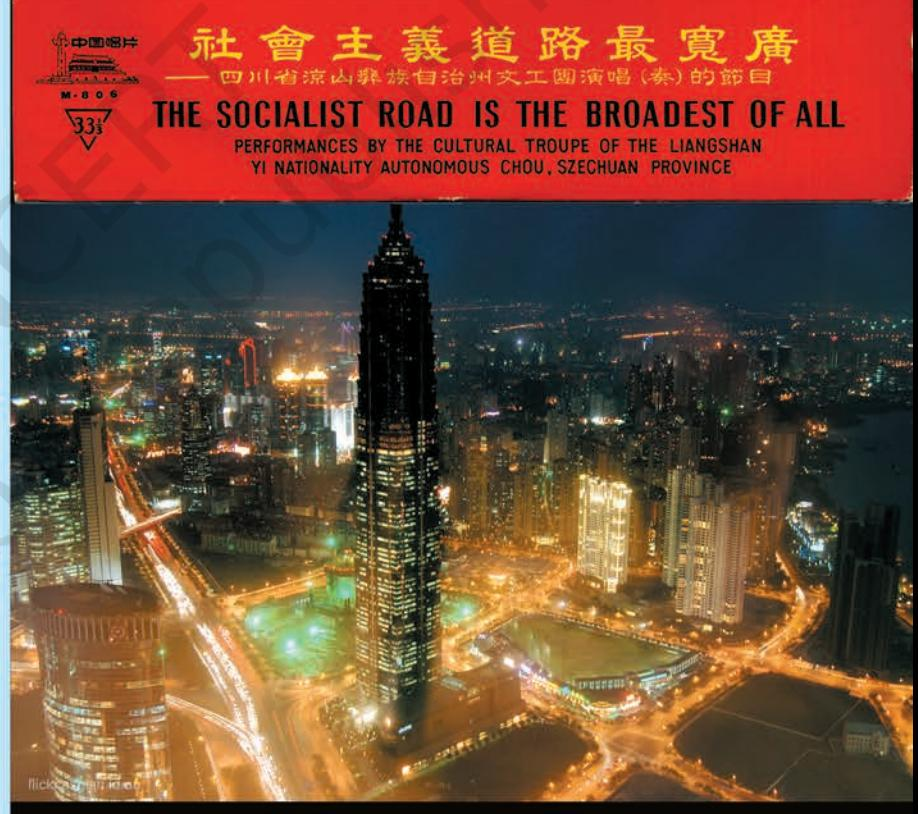

*The two images here represent two phases of the history of China. The red poster – "The Socialist Road is the Broadest of All" – represents the ideology that guided China during its early phase after the Revolution. The photograph below is that of the city of Shanghai, the symbol of China's new economic power.*

Chapter 2.indd 15 14 September 2022 11:02:16

### **European Union**

As the Second World War came to an end, many of Europe's leaders grappled with the 'Question of Europe'. Should Europe be allowed to revert to its old rivalries or be reconstructed on principles and institutions that would contribute to a positive conception of international relations? The Second World War shattered many of the assumptions and structures on which the European states had based their relations. In 1945, the European states confronted the ruin of their economies and the destruction of the assumptions and structures on which Europe had been founded.

European integration after 1945 was aided by the Cold War. America extended massive financial help for reviving Europe's economy under what was called the 'Marshall Plan'. The US also created a new collective security structure under NATO. Under the Marshall Plan, the Organisation for European Economic Cooperation

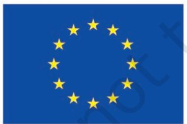

*The European Union Flag*

*The circle of gold stars stands for solidarity and harmony between the peoples of Europe. It has twelve stars, as the number twelve is traditionally the symbol of perfection, completeness and unity.*

*Source: http://europa.eu/abc/symbols/emblem/index_en.htm*

(OEEC) was established in 1948 to channel aid to the west European states. It became a forum where the western European states began to cooperate on trade and economic issues. The Council of Europe, established in 1949, was another step forward in political cooperation. The process of economic integration of European capitalist countries proceeded step by step (see Timeline of European Integration) leading to the formation of the European Economic Community in 1957. This process acquired a political dimension with the creation of the European Parliament. The collapse of the Soviet bloc put Europe on a fast track and resulted in the establishment of the European Union in 1992. The foundation was thus laid for a common foreign and security policy, cooperation on justice and home affairs, and the creation of a single currency.

The European Union has evolved over time from an e c o n o m i c u n i o n t o a n increasingly political one. The EU has started to act more as a nation state. While the attempts to have a Constitution for the EU have failed, it has its own flag, anthem, founding date, and currency. It also has some form of a common foreign and security policy in its dealings with other nations. The European Union has tried to expand areas of cooperation while acquiring new

Chapter 2.indd 16 14 September 2022 11:02:17

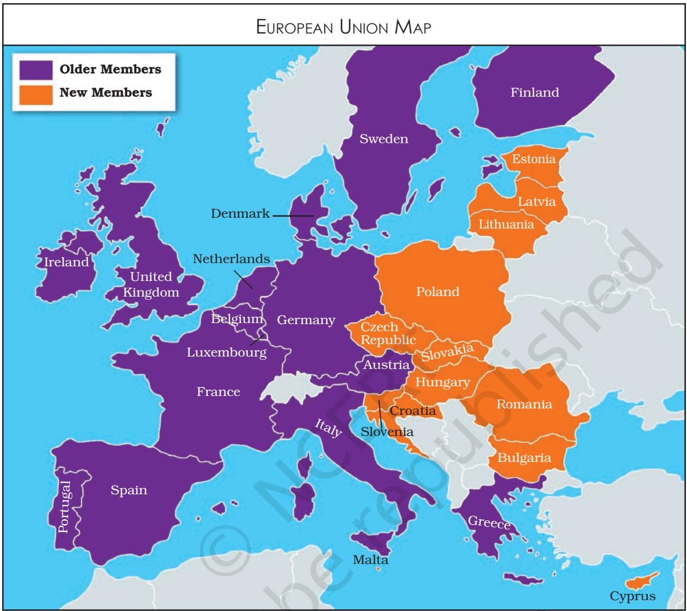

members, especially from the erstwhile Soviet bloc. The process has not proved easy, for people in many countries are not very enthusiastic in giving the EU powers that were exercised by the government of their country. There are also reservations about including some new countries within the EU.

The EU has economic, political and diplomatic, and military influence. The European

Union's GDP is projected to be approximately $19.35 trillion in the year 2024. Its currency, the euro, can pose a threat to the dominance of the US dollar. Its share of world trade is much larger than that of the United States allowing it to be more assertive in trade disputes with the US and China. Its economic power gives it influence over its closest neighbours as well as in Asia and Africa. It also functions as an important bloc in international

Oh, now I know what a Schengen visa means! Under the Schengen agreement, you have to get a visa from just one of the EU countries and that allows you entry in most of the other European Union countries.

Chapter 2.indd 17 15-03-2024 11:47:17

#### **TIMELINE OF EUROPEAN INTEGRATION**

**1951 April:** Six west European countries, France, West Germany, Italy, Belgium, the Netherlands and Luxembourg sign the Treaty of Paris establishing the European Coal and Steel Community (ECSC).

**1957 March 25:** These six countries sign the Treaties of Rome establishing the European Economic Community (EEC) and the European Atomic Energy Community (Euratom).

**1973 January:** Denmark, Ireland and the United Kingdom join the European Economic Community (EEC).

**1979 June:** First direct elections to the European Parliament

**1981 January:** Greece joins the EEC.

**1985 June:** The Schengen Agreement abolishes border controls among the EEC members.

**1986 January:** Spain and Portugal join the EEC.

**1990 October:** Unification of Germany.

**1992 February 7:** The Treaty of Maastricht was signed establishing the European Union (EU).

**1993 January:** European Economic Community (EEC) was renamed the European Community (EC).

**1995 January:** Austria, Finland and Sweden join the EU.

**2002 January:** Euro, the new currency, was introduced in the 12 EU members.

**2004 May:** Ten new members, Cyprus, the Czech Republic, Estonia, Hungary, Latvia, Lithuania, Malta, Poland, Slovakia and Slovenia join the EU.

**2007 January:** Bulgaria and Romania join the EU. Slovenia adopts the Euro.

**2009 December:** The Lisbon Treaty came into force.

**2012 :** The EU is awarded the Nobel Peace Prize.

**2013:** Croatia becomes the 28th member of the EU.

**2016:** Referendum in Britain, 51.9 per cent voters decide that Britain exit (Brexit) from the EU.

> economic organisations such as the World Trade Organisation (WTO).

> The EU also has political and diplomatic influence. One member

of the EU, France, holds permanent seat on the UN Security Council. The EU includes several nonpermanent members of the UNSC. This has enabled the EU to influence some US policies such as the current US position on Iran's nuclear programme. Its use of diplomacy, economic investments, and negotiations rather than coercion and military force has been effective as in the case of its dialogue with China on human rights and environmental degradation.

Militarily, the EU's combined armed forces are the second largest in the world. Its total spending on defence is second after the US. One EU member state, France, also has nuclear arsenals of approximately 335 nuclear warheads. It is also the world's second most important source of space and communications technology.

As a supranational organisation, the EU is able to intervene in economic, political and social areas. But in many areas its member states have their own foreign relations and defence policies that are often at odds with each other. Thus, Britain's Prime Minister Tony Blair was America's partner in the Iraq invasion, and many of the EU's newer members made up the US-led 'coalition of the willing' whereas Germany and France opposed American policy. There is also a deep-seated 'Euroskepticism' in some parts

Chapter 2.indd 18 15-03-2024 11:47:18

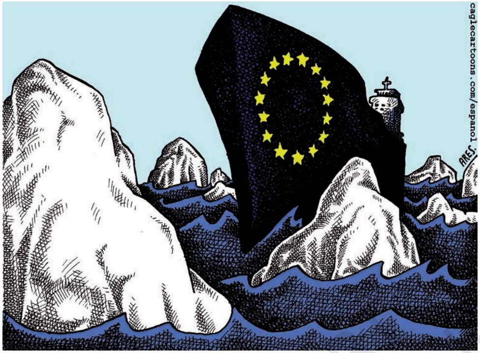

*© Ares, Cagle Cartoons Inc.*

*The cartoon appeared in 2003 when the European Union's initiative to draft a common constitution failed. Why does the cartoonist use the image of the ship Titanic to represent EU?*

of Europe about the EU's integrationist agenda. Thus, for example, Britain's former prime minister, Margaret Thatcher, kept the UK out of the European Market. Denmark and Sweden have resisted the Maastricht Treaty and the adoption of the euro, the common European currency. This limits the ability of the EU to act in matters of foreign relations and defence.

### **Association of South East Asian Nations (ASEAN)**

Take a look at the political map of the world. Which countries would you say fall in the southeastern

region of Asia? Before and during the Second World War, this region of Asia suffered the economic and political consequences of repeated colonialisms, both European and Japanese. At the end of the war, it confronted problems of nationbuilding, the ravages of poverty and economic backwardness and the pressure to align with one great power or another during the Cold War. This was a recipe for conflict, which the countries of Southeast Asia could ill afford. Efforts at Asian and Third World unity, such as the Bandung Conference and the Non-Aligned Movement, were ineffective in establishing the conventions for informal cooperation and interaction. Hence, the Southeast

Imagine what would happen if they have a European Union football team!

Chapter 2.indd 19 14 September 2022 11:02:19

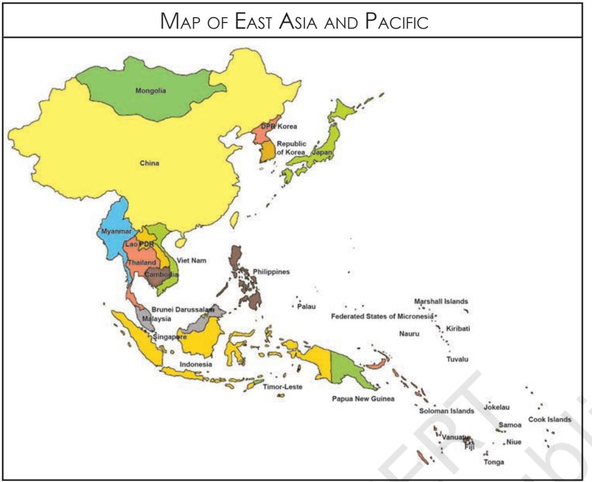

*Source: http://www.unicef.org/eapro/EAP_map_final.gif*

*Note: Maps on this site do not reflect a position by UNICEF on the legal status of any country or territory or the delimitation of any frontiers.*

Locate the ASEAN members on the map. Find the location of the ASEAN Secretariat.

Asian alternative by establishing the Association of South East Asian Nations (ASEAN).

ASEAN was established in 1967 by five countries of this region — Indonesia, Malaysia, the Philippines, Singapore and Thailand — by signing the Bangkok Declaration. The objectives of ASEAN were primarily to accelerate economic growth and through that 'social progress and cultural development'. A secondary objective was to promote regional peace and stability based on the rule of law and the principles of the United Nations Charter. Over the years, Brunei Darussalam, Vietnam, Lao PDR, Myanmar (Burma) and Cambodia joined ASEAN taking its strength to ten.

Unlike the EU there is little desire in ASEAN for supranational structures and institutions. ASEAN countries have celebrated what has become known as the 'ASEAN Way', a form of interaction that is informal, non-confrontationist and cooperative. The respect for national sovereignty is critical to the functioning of ASEAN.

With some of the fastest growing economies in the world, ASEAN broadened its objectives beyond the economic and social spheres. In 2003, ASEAN moved along the path of the EU by agreeing to establish an ASEAN Community comprising three pillars,

namely, the ASEAN Security Community, the ASEAN Economic Community and the ASEAN Socio-Cultural Community.

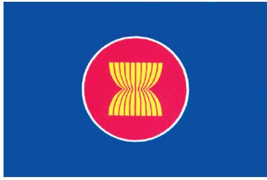

#### *The ASEAN Flag*

*In the ASEAN logo, the ten stalks of paddy (rice) represent the ten Southeast Asian countries bound together in friendship and solidarity. The circle symbolises the unity of ASEAN. Source : www.aseansec.org*

Chapter 2.indd 20 14 September 2022 11:02:20

T h e A S E A N s e c u r i t y community was based on the conviction that outstanding territorial disputes should not escalate into armed confrontation. By 2003, ASEAN had several agreements in place by which member states promised to uphold peace, neutrality, cooperation, non-interference, and respect for national differences and sovereign rights. The ASEAN Regional Forum (ARF), which was established in 1994, is the organisation that carries out coordination of security and foreign policy.

A S E A N w a s a n d s t i l l remains principally an economic association. While the ASEAN region as a whole is a much smaller economy compared to the US, the EU, and Japan, its economy is growing much faster than all these. This accounts for the growth in its influence both in the region and beyond. The objectives of the ASEAN Economic Community are to create a common market and production base within ASEAN states and to aid social and economic development in the region. The Economic Community would also like to improve the existing ASEAN Dispute Settlement Mechanism to resolve economic disputes. ASEAN has focused on creating a Free Trade Area (FTA) for investment, labour, and services. The US and China have already moved fast to negotiate FTAs with ASEAN.

ASEAN is rapidly growing into a very important regional organisation. Its Vision 2020 has defined an outward-looking role for ASEAN in the international community. This builds on the existing ASEAN policy to encourage negotiation over conflicts in the region. Thus, ASEAN has mediated the end of the Cambodian conflict, the East Timor crisis, and meets annually to discuss East Asian cooperation.

The current economic strength of ASEAN, especially its economic relevance as a trading and investment partner to the growing Asian economies such as India and China, makes this an attractive proposition. During the Cold War years Indian foreign policy did not pay adequate attention to ASEAN. But in recent years, India has tried to make amends. It signed trade agreements with three ASEAN members, Malaysia, Singapore and

Isn't India a part of Southeast Asia? The north-eastern states are so close to the ASEAN countries.

Who are the members of the ASEAN Regional Forum (ARF)?

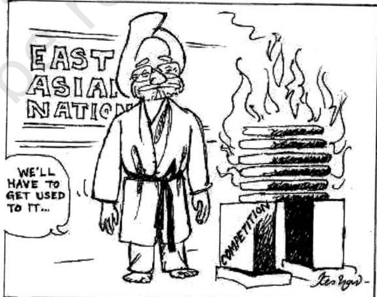

*Keshav,* The Hindu

*India's 'Look East' Policy since the early 1990s and 'Act East' Policy since 2014 have led to greater economic interaction with the East Asian nations (ASEAN, China, Japan and South Korea).*

Chapter 2.indd 21 14 September 2022 11:02:20

Why did ASEAN succeed whereas SAARC did not?

Thailand. The ASEAN-India FTA came into effect in 2010. ASEAN's strength, however, lies in its policies of interaction and consultation with member states, with dialogue partners, and with other non-regional organisations. It is the only regional association in Asia that provides a political forum where Asian countries and the major powers can discuss political and security concerns.

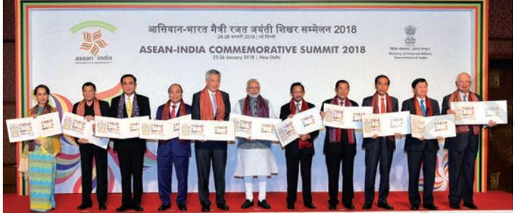

*Leaders release postal stamps to commemorate silver jubilee of India and ASEAN partnership in New Delhi on 25 January 2018*

### **The Rise of the Chinese Economy**

Let us now turn to the third major alternative centre of power and our immediate neighbour, China. The cartoon on the following page sums up the current mood all over the world about the rise of China as an economic power. China's economic success since 1978 has been linked to its rise as a great power. China has been the fastest growing economy since the reforms first began there. It is projected to overtake the US as the world's largest economy by 2040. Its economic integration into the region makes it the driver of East Asian growth, thereby giving it enormous influence in regional affairs. The strength of its economy, together with other factors such as population, land mass, resources, regional location and political influence, adds to its power in significant ways.

After the inception of the People's Republic of China in 1949, following the communist revolution under the leadership of Mao, its economy was based on the Soviet model. The economically backward communist China chose to sever its links with the capitalist world. It had little choice but to fall back on its own resources and, for a brief period, on Soviet aid and advice. The model was to create a state-owned heavy industries sector from the capital accumulated from agriculture. As it was short of foreign exchange that it needed in order to buy technology and goods on the world market, China decided to substitute imports by domestic goods.

This model allowed China to use its resources to establish the foundations of an industrial economy on a scale that did not exist before. Employment and social welfare was assured to all citizens, and China moved ahead of most developing countries in educating its citizens and ensuring better health for them. The economy also grew at a respectable rate of 5-6 per cent. But an annual growth of 2-3 per cent in population meant that economic growth was insufficient to meet the needs of a growing population. Agricultural production was not sufficient to generate a surplus for industry. In Chapter 1, we discussed the crisis of the state controlled economy in the USSR. A similar crisis was to face China too: its industrial production was not growing fast enough, international trade was minimal and per capita income was very low.

The Chinese leadership took major policy decisions in the 1970s. China ended its political and economic isolation with the establishment of relations with the United States in 1972. Premier Zhou Enlai proposed the 'four modernisations' (agriculture, industry, science and technology and military) in 1973. By 1978, the then leader Deng Xiaoping announced the 'open door' policy and economic reforms in China. The policy was to generate higher productivity by investments of capital and technology from abroad.

China followed its own path in introducing a market economy. The Chinese did not go for 'shock therapy' but opened their economy step by step. The privatisation of agriculture in 1982 was followed by the privatisation of industry in 1998. Trade barriers were eliminated only in Special Economic Zones (SEZs) where foreign investors could set up enterprises. In China, the state played and continues to play a central role in setting up a market economy.

The new economic policies helped the Chinese economy to break from stagnation.

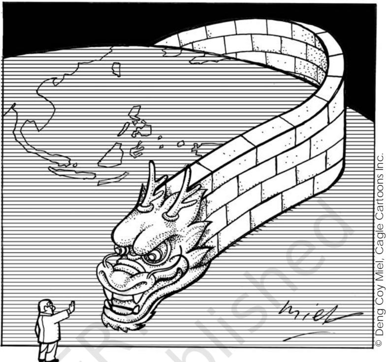

*The Great Wall and Dragon are two symbols most commonly associated with China. This cartoon uses both these to depict China's economic rise. Who do you think is the little man in this cartoon? Can he stop the dragon?*

Privatisation of agriculture led to a remarkable rise in agricultural production and rural incomes. High personal savings in the rural economy lead to an exponential growth in rural industry. The Chinese economy, including both industry and agriculture, grew at a faster rate. The new trading laws and the creation of Special Economic Zones led to a phenomenal rise in foreign trade. China has become the most important destination for foreign direct investment (FDI) anywhere in the world. It has large foreign exchange reserves that now allow it to make big investment in other countries. China's accession to the

A total of 6 SEZs in China and more than 200 approved SEZs in India! Is this good for India?

Chapter 2.indd 23 14 September 2022 11:02:21

*© Ares, Cagle Cartoons Inc.*

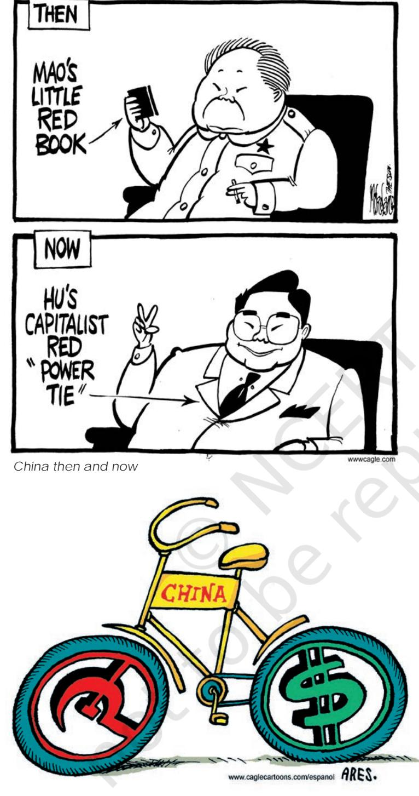

*Chinese bicycle*

*Like the opening images for this chapter, the first cartoon comments on the change in China's orientation. The second cartoon uses the symbol of the bicycle — China is the largest user of bicycles in the world — to comment on a duality in today's China. What is this duality? Can we call this a contradiction?* 

WTO in 2001 has been a further step in its opening to the outside world. The country plans to deepen its integration into the world economy and shape the future world economic order.

While the Chinese economy has improved dramatically, not everyone in China has received the benefits of the reforms. Unemployment has risen in China with nearly 100 million people looking for jobs. Female employment and conditions of work are as bad as in Europe of the eighteenth and nineteenth centuries. Environmental degradation and corruption have increased besides a rise in economic inequality between rural and urban residents and coastal and inland provinces.

However, regionally and globally, China has become an economic power to reckon with. The integration of China's economy and the inter-dependencies that this has created has enabled China to have considerable influence with its trade partners. Hence, its outstanding issues with Japan, the US, ASEAN, and Russia have been tempered by economic considerations. It hopes to resolve its differences with Taiwan, which it regards as a renegade province, by integrating it closely into its economy. Fears of China's rise have also been mitigated by its contributions to the stability of the ASEAN economies after the 1997 financial crisis. Its more outward looking investment and aid

Chapter 2.indd 24 14 September 2022 11:02:21

policies in Latin America and Africa are increasingly projecting it as a global player on the side of developing economies.

### **India – China Relations**

India and China were great powers in Asia before the advent of Western imperialism. China had considerable influence and control on the periphery of its borders based on its unique tributary system. At different times in China's long history of dynastic rule, Mongolia, Korea, parts of Indo-China, and Tibet accepted China's authority. Various kingdoms and empires in India also extended their influence beyond their borders. In both cases this influence was political, economic and cultural. However, the regions where India and China exercised influence rarely ever overlapped. Thus, there was limited political and cultural interaction between the two. The result was that neither country was very familiar with the other. In the twentieth century, when both nations confronted each other, they had some difficulty evolving a foreign policy to deal with each other.

After India regained its independence from Britain, and China expelled the foreign powers, there was hope that both would come together to shape the future of the developing world and of Asia particularly. For a brief while, the slogan of 'Hindi-Chini bhai-bhai'

was popular. However, Chinese aggression on the Indian border has marred that hope. Soon after independence, both states were involved in differences arising from the Chinese takeover of Tibet in 1950 and the final settlement of the Sino-Indian border. China and India were involved in a border conflict in 1962 over competing territorial claims principally in Arunachal Pradesh and in the Aksai Chin region of Ladakh.

The conflict of 1962, in which India suffered military reverses, had long-term implications for India–China relations. Diplomatic relations between the two countries were downgraded until 1976. Thereafter, relations between the two countries began to improve slowly. After the change in China's political leadership from the mid to late 1970s, China's policy became more pragmatic and less ideological. So it was prepared to put off the settlement of contentious issues while improving relations with India. A series of talks to resolve the border issue were also initiated in 1981.

Since the end of the Cold War, there have been significant

changes in India– China relations. Their relations now have a strategic as well as an economic dimension. Both view themselves as rising powers in global politics, and both would like to play

Chinese President Xi Jinping paid a visit to India in 2019. Prime Minister Narendra Modi visited China in 2018. Find out about the agreements signed during their visits.

### **STEPS**

- Divide the classroom into three groups.
- Assign each group one organisation to work on a fact file on the EU, ASEAN and SAARC.
- Students have to prepare a fact file that contains information on the objectives, functions and recent activities of these organisations. Pictures of the conferences / summit meetings can be collected.
- Each group is to present its fact file before the class.

#### **Ideas for the Teacher**

- The teacher is to focus on the functions of these organisations.
- Draw the attention of students to the achievements of regional organisations.
- Link the role of regional economic organisations to the over all development of the member countries.
- Sensitise students to the growing importance of regional economic organisations as an alternative approach to the peace and security of the world.

a major role in the Asian economy and politics.

Rajiv Gandhi's visit to China in December 1988 provided the impetus for an improvement in India–China relations. Since then both governments have taken measures to contain conflict and maintain 'peace and tranquility' on the border. They have also signed agreements on cultural exchanges and cooperation in science and technology, and opened four border posts for trade. With India– China trade growing at 30 per cent per year since 1999, a more positive perspective on relations with China has emerged. Bilateral trade between India and China has increased from $338 million in 1992 to more than $84 billion in 2017. More recently, both countries have agreed to cooperate with each other in areas that could otherwise create conflict between the two, such as bidding for energy deals abroad. At the global level, India and China have adopted similar policies in international economic institutions like the World Trade Organisation.

India's nuclear tests in 1998, was justified on the grounds of a threat from China, did not stop greater interaction. It is true that China was seen as contributing to the build up of Pakistan's nuclear programme. China's military relations with Bangladesh and Myanmar were viewed as hostile to Indian interests in South Asia. However, none of these issues is likely to lead to conflict between the two. One sign of this is that the talks to resolve the boundary question have continued without interruption and military-tomilitary cooperation is increasing. Indian and Chinese leaders and officials visit Beijing and New Delhi with greater frequency, and both sides are now becoming more familiar with each other. Increasing transportation and communication links, common economic interests and global concerns should help establish a more positive and sound relationship between the two most populous countries of the world. Recently the relation between the two countries has taken a downslide. Border disputes, China-Pakistan economic corridor and China's support to Pakistan in UN against India's move to counter terrorism are some of the factors for it.

Some people say Chinese products are going to flood our market? But where are they?

Chapter 2.indd 26 15-03-2024 11:47:18

#### **Japan**

You might have heard about famous Japanese brands such as Sony, Panasonic, Canon, Suzuki, Honda, Toyota, Mazda. They have a reputation for making high-technology products. Japan has very few natural resources and imports most of its raw materials. Even then it progressed rapidly after the end of the Second World War. Japan became a member of the Organisation for Economic Cooperation and Development (OECD) in 1964. In 2017, it is the third largest economy in the world. It is the only Asian member of the G-7. It is the eleventh most populous nation in the world.

Japan is the only nation that suffered the destruction caused by nuclear bombs. It is the second largest contributor to the regular budget of the UN, contributing almost 10 per cent of the total. Japan has a security alliance with the US since 1951. As per Article 9 of the Japanese Constitution, "the Japanese people forever renounce war as a sovereign right of the nation and the threat or use of force as means of settling international disputes." Although Japan's military expenditure is only one per cent of its GDP, it is the seventh largest in the world.

Keeping all this in mind, do you think Japan can effectively function as an alternative centre of power?

Also find out about major agreements signed during high-level bilateral visits between the two nations in the recent past.

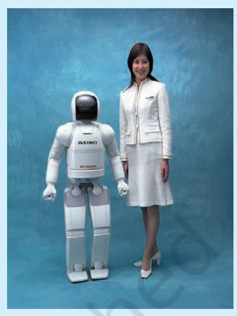

*ASIMO, the world's most advanced humanoid robot, walking with a person while holding hand*

*Credit: http://asimo.honda.com*

### **South Korea**

The Korean peninsula was divided into South Korea (Republic of Korea) and North Korea (Democratic People's Republic of Korea) at the end of the Second World War along the 38th Parallel. The Korean War during 1950-53 and dynamics of the Cold War era further intensified the rivalries between the two sides. Both the Koreas finally became Members of the UN on 17 September 1991.

Meanwhile, South Korea emerged as a centre of power in Asia. Between the 1960s and the 1980s, it rapidly developed into an economic power, which is termed as "Miracle on the Han River". Signalling its all-round development, South Korea became a Member of the OECD in 1996. In 2017, its economy is the eleventh largest in the world and its military expenditure is the tenth largest.

According to the Human Development Report 2016, the HDI rank of South Korea is 18. The major factors responsible for its high human development include "successful land reforms,

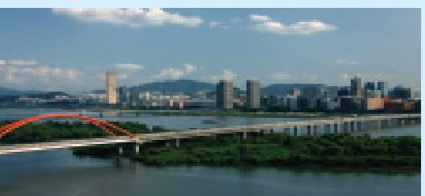

*Skyline of Seoul city near the Han River Credit: http://english.seoul.go.kr*

rural development, extensive human resources development and rapid equitable economic growth." Other factors are export orientation, strong redistribution policies, public infrastructure development, effective institutions and governance.

The South Korean brands such as Samsung, LG and Hyundai have become renowned in India. Numerous agreements between India and South Korea signify their growing commercial and cultural ties. Find out about major agreements signed in the recent past.

Chapter 2.indd 27 14 September 2022 11:02:22

|  | 1. | Arrange the following in chronological order. |
| --- | --- | --- |
|  |  | a. China's accession to WTO b. Establishment of the EEC |
|  |  | c. Establishment of the EU d. Birth of ARF |
|  | 2. | The 'ASEAN Way' |
|  | a. | Reflects the life style of ASEAN members |
| s | b. | A form of interaction among ASEAN members that is informal and cooperative |
|  | c. | The defence policy followed by the ASEAN members |
|  | d. | The road that connects all the ASEAN members |
| e | 3. | Which of the following nations adopted an 'open door' policy? |
|  |  | a. China b. South Korea c. Japan d. USA |
|  | 4. | Fill in the blanks: |
| s |  | a. The border conflict between China and India in 1962 was |
|  |  | principally over ______________ and __________________ region. |
|  |  | b. ARF was established in the year ______________________ . |
| i |  | c. China entered into bilateral relations with __________ (a major |
|  |  | country) in 1972. |
|  |  | d. ________________ Plan influenced the establishment of the |
|  |  | Organisation for European Economic Cooperation in 1948. |
| c |  | e. ___________ is the organisation of ASEAN that deals with security. |
|  | 5. | What are the objectives of establishing regional organisations? |
|  | 6. | How does geographical proximity influence the formation of |
| r |  | regional organisations? |
|  | 7. | What are the components of the ASEAN Vision 2020? |
|  | 8. | Name the pillars and the objectives of the ASEAN Community. |
|  | 9. | In what ways does the present Chinese economy differs from its |
| e |  | command economy? |
|  | 10. | How did the European countries resolve their post-Second World |
|  |  | War problem? Briefly outline the attempts that led to the formation |
| x | 11. | of the European Union. What makes the European Union a highly influential regional |
|  |  | organisation? |
|  | 12. | The emerging economies of China and India have great potential |
|  |  | to challenge the unipolar world. Do you agree with the statement? |
| E |  | Substantiate your arguments. |
|  | 13. | The Peace and prosperity of countries lay in the establishment |
|  |  | and strengthening of regional economic organisations. Justify this |
|  |  | statement. |

- 14. Identify the contentious issues between China and India. How could these be resolved for greater cooperation? Give your suggestions.

Chapter 2.indd 28 14 September 2022 11:02:22

