# Chapter 3 Contemporary South Asia

# Overview

Let us shift our gaze from the larger global developments in the post-Cold War era to developments in our own region, South Asia. When India and Pakistan joined the club of nuclear powers, this region suddenly became the focus of global attention. The focus was, of course, on the various kinds of conflict in this region: there are pending border and water sharing disputes between the states of the region. Besides, there are conflicts arising out of insurgency, ethnic strife and resource sharing. This makes the region very turbulent. At the same time, many people in South Asia recognise the fact that this region can develop and prosper if the states of the region cooperate with each other. In this chapter, we try to understand the nature of conflict and cooperation among different countries of the region. Since much of this is rooted in or conditioned by the domestic politics of these countries, we first introduce the region and the domestic politics of some of the big countries in the region.

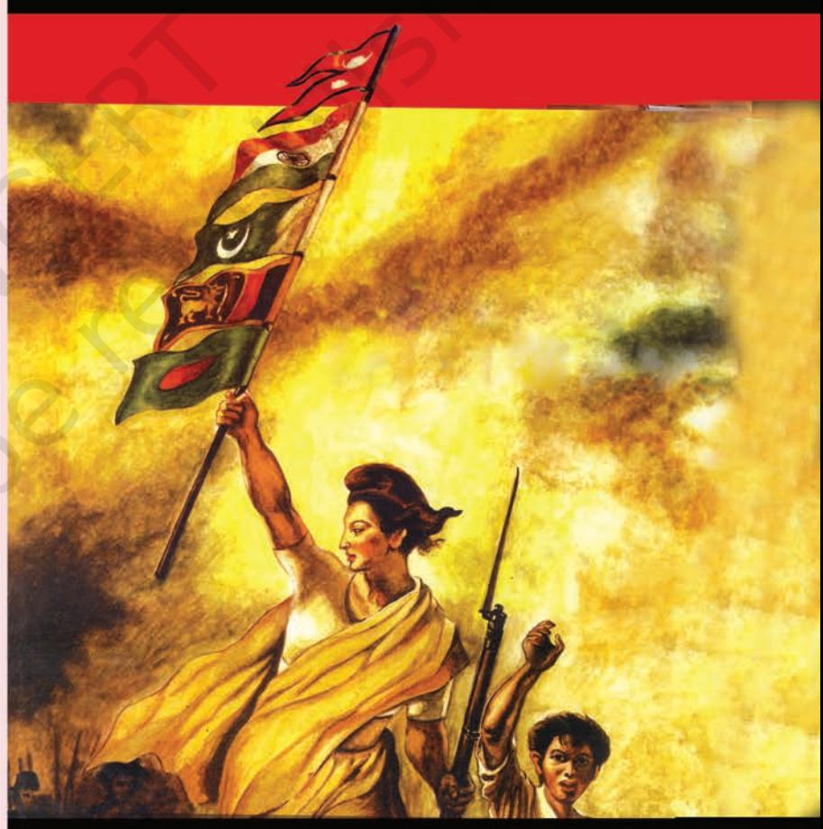

*Source: Subhas Rai's adaptation of 'Liberty Leading the People', painted by Eugene Delacroix in 1830. Courtesy of* Himal Southasian*, (January 2007) The Southasia Trust, Nepal* 

Chapter 3.indd 29 15-03-2024 12:17:38

Identify some features common to all the South Asian countries but different from countries in West Asia or Southeast Asia.

We are all familiar with the gripping tension during an India-Pakistan cricket match. We have also seen the goodwill and hospitality shown to visiting Indian and Pakistani fans by their hosts when they come to watch a cricket match. This is symbolic of the larger pattern of South Asian affairs. Ours is a region where rivalry and goodwill, hope and despair, mutual suspicion and trust coexist.

Let us begin by asking an elementary question: what is South Asia? The expression 'South Asia' usually includes the following countries: Bangladesh, Bhutan, India, the Maldives, Nepal, Pakistan and Sri Lanka. The mighty Himalayas in the north and the vast Indian Ocean, the Arabian Sea and the Bay of Bengal in the south, west and east respectively provide a natural insularity to the region, which is largely responsible for the linguistic, social and cultural distinctiveness of the subcontinent. The boundaries of the region are not as clear in the east and the west, as they are in the north and the south. Afghanistan and Myanmar are often included in discussions of the region as a whole. China is an important player but is not considered to be a part of the region. In this chapter, we shall use South Asia to mean the seven countries mentioned above. Thus defined, South Asia stands for diversity in every sense and yet constitutes one geopolitical space.

The various countries in South Asia do not have the same kind of political systems. Despite many problems and limitations, Sri Lanka and India have successfully operated a democratic system since their independence from the British. You will study more about the evolution of democracy in India in the textbook that deals with politics in India since independence. It is, of course, possible to point out many limitations of India's democracy; but we have to remember the fact that India has remained a democracy throughout its existence as an independent country. The same is true of Sri Lanka.

Pakistan and Bangladesh h a v e e x p e r i e n c e d b o t h civilian and military rulers, with Bangladesh remaining a democracy in the post-Cold War period. Pakistan began the post-Cold War period with successive democratic governments under Benazir Bhutto and Nawaz Sharif respectively. But it suffered a military coup in 1999. It has been run by a civilian government again since 2008. Till 2006, Nepal was a constitutional monarchy with the danger of the king taking over executive powers. In 2008, the monarchy was abolished and Nepal emerged as a democratic republic. From the experience of Bangladesh and Nepal, we can say that democracy is becoming an accepted norm in the entire region of South Asia.

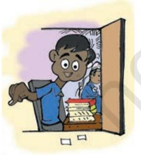

Is there a fixed definition of these regions? Who decides that?

Chapter 3.indd 30 15-03-2024 12:17:39

Similar changes are taking place in the two smallest countries of the region. Bhutan became a constitutional monarchy in 2008. Under the leadership of the king, it emerged as a multi-party democracy. The Maldives, the other island nation, was a Sultanate till 1968 when it was transformed into a republic with a presidential form of government. In June 2005, the parliament of the Maldives voted unanimously to introduce a multi-party system. The Maldivian Democratic Party (MDP) dominates the political affairs of the island. The MDP won the 2018 Elections.

Despite the mixed record of the democratic experience, the people in all these countries share the aspiration for democracy. A recent survey of the attitudes of the people in the five big countries of the region showed that there is widespread support for democracy in all these countries. Ordinary citizens, rich as well as poor and belonging to different religions, view the idea of democracy positively and support the institutions of representative democracy. They prefer democracy over any other form of government and think that democracy is suitable for their country. These are significant findings, for it was earlier believed that democracy could flourish and find support only in prosperous countries of the world.

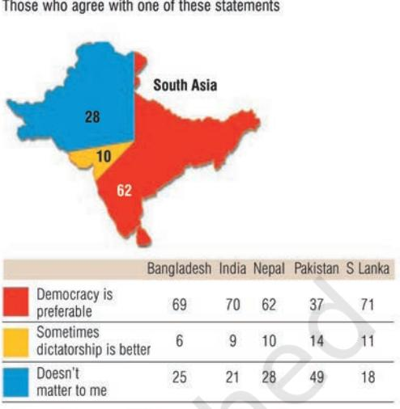

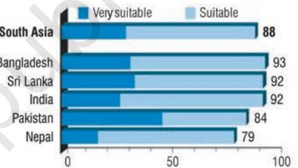

*Both these graphs are based on interviews with more than 19,000 ordinary citizens in the five countries of South Asia. Source: SDSA Team,* State of Democracy in South Asia*, New Delhi: Oxford University Press, 2007*

|  |  | SDG 4.6 | SDG 4.1 | SDG 8.1 | SDG 3.2 | SDG 3.3 | SDG 1.1 |  |
| --- | --- | --- | --- | --- | --- | --- | --- | --- |
|  | SDG 3 | Adult literacy | Gross | GDP per | Infant mortality | TB cases | Population living below |  |
|  | Life expectancy | rate (% ages | enrolment ratio | capita (2011 | rate (per 1,000 | (per 100,000 | income poverty line (%) |  |
|  | at birth (years) | 15 and older) | (Secondary) | PPP $) | live births) | people) | PPP $1.90 a day | HDI |
| Countries | 2017 | 2006-2016 | 2012-2017 | 2017 | 2016 | 2016 | 2006-2016 | Rank |
| World | 72.2 | 82.1 | 79 | 15,439 | 29.9 | 140.0 | – | – |
| Developing | 70.7 | 81.1 | 75 | 10,199 | 32.7 | 164.5 | – | – |
| countries |  |  |  |  |  |  |  |  |
| South Asia | 69.3 | 68.7 | 71 | 6,485 | 37.8 | 206.3 | – | – |
| Bangladesh | 72.8 | 72.8 | 69 | 3,524 | 28.2 | 221.0 | 14.8 | 136 |
| India | 68.8 | 69.3 | 75 | 6,427 | 34.6 | 211.0 | 21.2 | 130 |
| Nepal | 70.6 | 59.6 | 71 | 2,433 | 28.4 | 154.0 | 15.0 | 149 |
| Pakistan | 66.6 | 57.0 | 46 | 5,035 | 64.2 | 268.0 | 6.1 | 150 |
| Sri Lanka | 75.5 | 91.2 | 98 | 11,669 | 8.0 | 65.0 | – | 76 |

*Source: United Nations Development Programme,* Human Development Report*, 2018*

Chapter 3.indd 31 15-03-2024 12:17:39

#### **TIMELINE OF SOUTH ASIA SINCE 1947**

**1947:** India and Pakistan emerge as independent nations after the end of British rule

**1948:** Sri Lanka (then Ceylon) gains independence; Indo-Pak conflict over Kashmir

**1954-55:** Pakistan joins the Cold War military blocs, SEATO and CENTO

**1960:** India and Pakistan sign the Indus Waters Treaty

**1962:** Border conflict between India and China

**1965:** Indo-Pak War; UN India-Pakistan Observation Mission

**1966:** India and Pakistan sign the Tashkent Agreement;

Six-point proposal of Sheikh Mujib-ur Rahman for greater autonomy to East Pakistan

**1971 March**: Proclamation of Independence by leaders of Bangladesh

**August :** Indo-Soviet Treaty of Friendship signed for 20 years **December :** Indo-Pak War, Liberation of Bangladesh

**1972 July:** India and Pakistan sign the Simla Agreement **1974 May:** India conducts nuclear test

**1976:** Pakistan and Bangladesh establish diplomatic ties

**1985 December:** South Asian leaders sign the SAARC Charter at the first summit in Dhaka

**1987:** Indo-Sri Lanka Accord; Indian Peace Keeping Force (IPKF) operation in Sri Lanka (1987-90)

**1988:** India sends troops to the Maldives to foil a coup attempt by mercenaries

India and Pakistan sign the agreement not to attack nuclear installations and facilities of each other

**1988-91:** Democracy restoration in Pakistan, Bangladesh and Nepal

**1996 December:** India and Bangladesh sign the Farakka Treaty for sharing of the Ganga Waters

**1998 May:** India and Pakistan conduct nuclear tests **December:** India and Sri Lanka sign the Free Trade Agreement (FTA)

**1999 February:** Indian PM Vajpayee undertakes bus journey to Lahore to sign a Peace Declaration

**June-July:** Kargil conflict between India and Pakistan **2001 July:** Vajpayee - Musharraf Agra Summit unsuccessful **2004 January:** SAFTA signed at the 12th SAARC Summit in Islamabad

**2007:** Afghanistan joins SAARC

**2014 November:** The 18th SAARC Summit in Kathmandu, Nepal

In that sense the South Asian experience of democracy has expanded the global imagination of democracy.

Let us look at the experience of democracy in each of the four big countries of the region other than India.

# **The Military and Democracy in Pakistan**

After Pakistan framed its first constitution, General Ayub Khan took over the administration of the country and soon got himself elected. He had to give up office when there was popular dissatisfaction against his rule. This gave way to a military takeover once again under General Yahya Khan. During Yahya's military rule, Pakistan faced the Bangladesh crisis, and after a war with India in 1971, East Pakistan broke away to emerge as an independent country called Bangladesh. After this, an elected government under the leadership of Zulfikar Ali Bhutto came to power in Pakistan from 1971 to 1977. The Bhutto government was removed by General Ziaul-Haq in 1977. General Zia faced a pro-democracy movement from 1982 onwards and an elected democratic government was established once again in 1988 under the leadership of Benazir Bhutto. In the period that followed, Pakistani politics centred around the competition between her party, the Pakistan People's Party, and the Muslim

Chapter 3.indd 32 15-03-2024 12:17:40

League. This phase of elective democracy lasted till 1999 when the army stepped in again and General Pervez Musharraf removed Prime Minister Nawaz Sharif. In 2001, General Musharraf got himself elected as the President. Pakistan continued to be ruled by the army, though the army rulers have held some elections to give their rule a democratic image. Since 2008, democratically elected leaders have been ruling Pakistan.

S e v e r a l f a c t o r s h a v e contributed to Pakistan's failure in building a stable democracy. The social dominance of the military, clergy, and landowning aristocracy has led to the frequent overthrow of elected governments and the establishment of military government. Pakistan's conflict with India has made the promilitary groups more powerful. These groups have often said that political parties and democracy in Pakistan are flawed, that Pakistan's security would be harmed by selfish-minded parties and chaotic democracy, and that the army's stay in power is, therefore, justified. While democracy has not been fully successful in Pakistan, there has been a strong pro-democracy sentiment in the country. Pakistan has a courageous and relatively free press and a strong human rights movement.

T h e l a c k o f g e n u i n e inter national support for democratic rule in Pakistan has further encouraged the military to continue its dominance. The United States and other Western

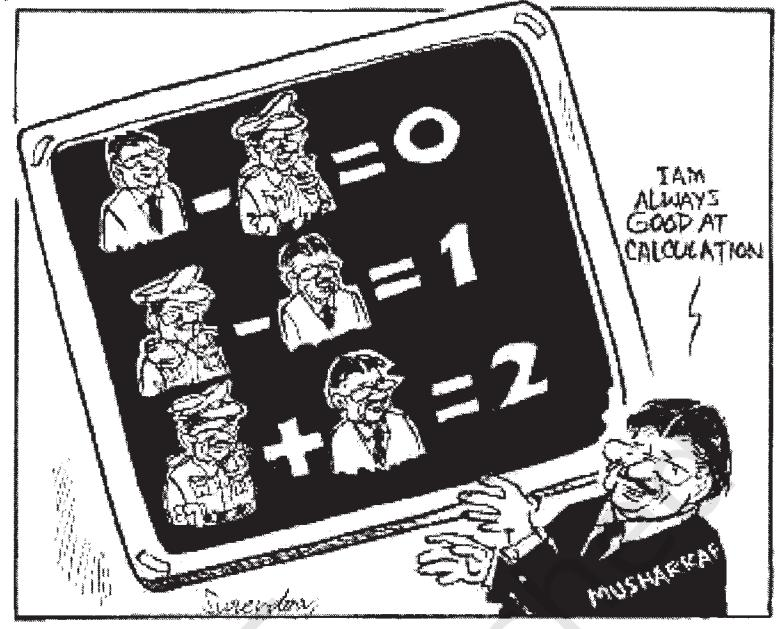

*Surendra,* The Hindu

*This cartoon comments on the dual role of Pakistan's ruler Pervez Musharraf as the President of the country and as the army General. Read the equations carefully and write down the message of this cartoon.*

countries have encouraged the military's authoritarian rule in the past, for their own reasons. Given their fear of the threat of what they call 'global Islamic terrorism' and the apprehension that Pakistan's nuclear arsenal might fall into the hands of these terrorist groups, the military regime in Pakistan has been seen as the protector of Western interests in West Asia and South Asia.

## **Democracy in Bangladesh**

Bangladesh was a part of Pakistan from 1947 to 1971. It consisted of the partitioned areas of Bengal and Assam from British India. The people of this region resented the domination of western Pakistan and the imposition of the Urdu language. Soon after the partition,

If Germany can be reunited, why can't the people of India and Pakistan at least travel more easily to each other's country?

Chapter 3.indd 33 15-03-2024 12:17:40

they began protests against the unfair treatment meted out to the Bengali culture and language. They also demanded f a i r representation in administration and a fair share in political power. Sheikh Mujib-ur Rahman led the popular struggle against West Pakistani domination. He demanded autonomy for the eastern region. In the 1970 elections in the then Pakistan, the Awami League led by Sheikh Mujib won all the seats in East Pakistan and secured a majority in the proposed constituent assembly for the whole of Pakistan. But the government dominated by the West Pakistani leadership refused to convene the assembly. Sheikh Mujib was

arrested. Under the military rule of General Yahya Khan, the Pakistani army tried to suppress the mass movement of the Bengali people. Thousands were killed by the Pakistan army. This led to a large scale migration into India, creating a huge refugee problem for India. The government of India supported the demand of the people of East Pakistan for their independence and helped them financially and militarily. This resulted in a war between India and Pakistan in December 1971 that ended in the surrender of the Pakistani forces in East Pakistan and the formation of Bangladesh as an independent country.

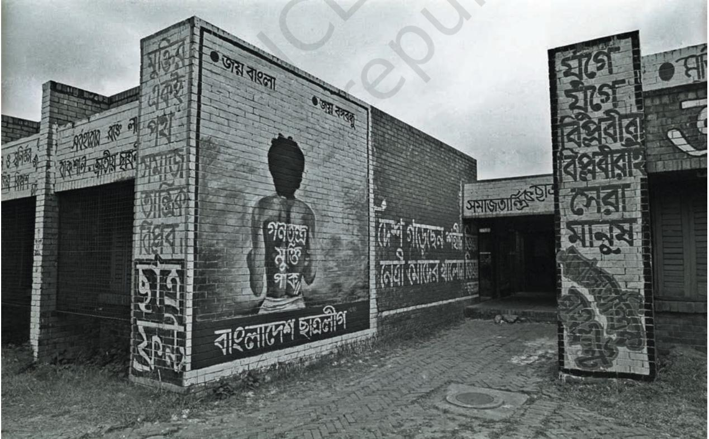

*A mural in Dhaka University to remember Noor Hossain who was killed by the police during pro-democracy protests against General Ershad in 1987. Painted on his back: "Let Democracy be Freed" . Photo credit: Shahidul Alam/ Drik*

Chapter 3.indd 34 15-03-2024 12:17:40

Bangladesh drafted its constitution declaring faith in secularism, democracy and socialism. However, in 1975 Sheikh Mujib got the constitution amended to shift from the parliamentary to presidential form of government. He also abolished all parties except his own, the Awami League. This led to conflicts and tensions. In a dramatic and tragic development, he was assassinated in a military uprising in August 1975. The new military ruler, Ziaur Rahman, formed his own Bangladesh National Party and won elections in 1979. He was assassinated and another military takeover followed under the leadership of Lt Gen H. M. Ershad. The people of Bangladesh soon rose in support of the demand for democracy. Students were in the forefront. Ershad was forced to allow political activity on a limited scale. He was later elected as President for five years. Mass public protests made Ershad step down in 1990. Elections were held in 1991. Since then representative democracy based on multi-party elections has been working in Bangladesh.

# **Monarchy and Democracy in Nepal**

Nepal was a Hindu kingdom in the past and then a constitutional monarchy in the modern period for many years. Throughout this period, political parties and the common people of Nepal have wanted a more open and

responsive system of government. But the king, with the help of the army, retained full control over the government and restricted the expansion of democracy in Nepal.

The king accepted the demand for a new democratic constitution in 1990, in the wake of a strong prodemocracy movement. However, democratic governments had a short and troubled career. During the nineties, the Maoists of Nepal were successful in spreading their influence in many parts of Nepal. They believed in armed insurrection against the monarch and the ruling elite. This led to a violent conflict between the Maoist guerrillas and the armed forces of the king. For some time, there was a triangular conflict among the monarchist forces, the democrats and the Maoists. In 2002, the king abolished the parliament and dismissed the government, thus ending even the limited democracy that existed in Nepal.

In April 2006, there were massive, country wide, prodemocracy pr otests. The struggling pro-democracy forces achieved their first major victory when the king was forced to restore the House of Representatives that had been dissolved in April 2002. The largely non-violent movement was led by the Seven Party Alliance (SPA), the Maoists and social activists.

N e p a l ' s t r a n s i t i o n t o democracy is almost complete. Nepal has undergone a unique moment in its history because it formed a constituent assembly to Let's know more about Bangladesh's Grameen Bank. Can we make use of the idea to reduce poverty in India?

Chapter 3.indd 35 15-03-2024 12:17:40

Nepal sounds really exciting. I wish I was in Nepal!

draft the constitution for Nepal. Some sections in Nepal thought that a nominal monarchy was necessary for Nepal to retain its link with the past. The Maoist groups agreed to suspend armed struggle. They wanted the constitution to include the radical programmes of social and economic restructuring. All the parties in the SPA did not agree with this programme. The Maoists and some other political groups were also deeply suspicious of the Indian government and its role in the future of Nepal. In 2008, Nepal became a democratic republic after abolishing the monarchy. In 2015, it adopted a new constitution.

# **Ethnic Conflict and Democracy in Sri Lanka**

We have already seen that Sri Lanka has retained democracy since its independence in 1948. But it faced a serious challenge, not from the military or monarchy but rather from ethnic conflict leading to the demand for secession by one of the regions.

After its independence, politics in Sri Lanka (it was then known as Ceylon) was dominated by forces that represented the interest of the majority Sinhala community. They were hostile to a large number of Tamils who had migrated from India to Sri Lanka and settled there. This migration continued even after independence. The Sinhala nationalists thought that Sri Lanka should not give 'concessions' to the Tamils because Sri Lanka belongs to the Sinhala people only. The neglect of Tamil concerns led to militant Tamil nationalism. From 1983 onwards, the militant organisation, the Liberation Tigers of Tamil Eelam

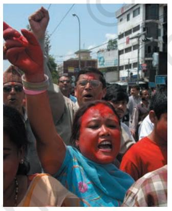

*Democracy activist, Durga Thapa, participating in a pro-democracy rally in Kathmandu in 1990. The second picture shows the same person in 2006, this time celebrating the success of the second democracy movement.* 

*Photo credit: Min Bajracharya*

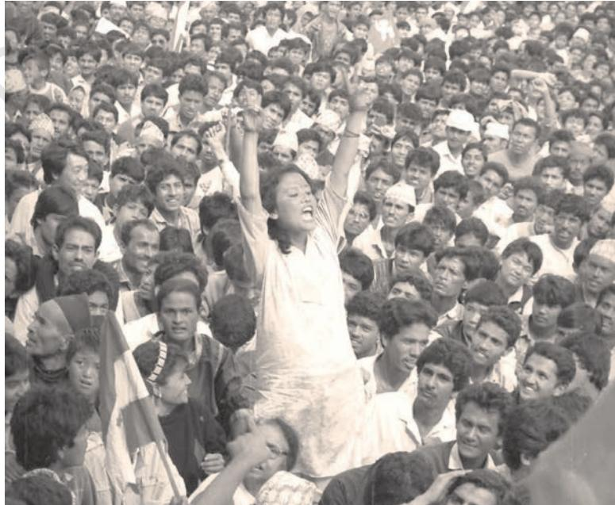

Chapter 3.indd 36 15-03-2024 12:17:41

(LTTE) was fighting an armed struggle with the army of Sri Lanka in pursuit of their demand for a 'Tamil Elam' or separate country for the Tamilians of Sri Lanka. At one point of time, the northeastern part of Sri Lanka was controlled by LTTE.

The Sri Lankan problem involves people of Indian origin, and there was considerable pressure from the Tamil people in India to the effect that the Indian government should protect the interests of the Tamils in Sri Lanka. The government of India has from time to time tried to negotiate with the Sri Lankan government on the Tamil question. But in 1987, the government of India for the first time got directly involved in the Sri Lankan Tamil question. India signed an accord with Sri Lanka and sent troops to stabilise relations between the Sri Lankan government and the Tamils. Eventually, the Indian Army got into a fight with the LTTE. The presence of Indian troops was also not liked much by the Sri Lankans. They saw this as an attempt by India to interfere in the internal affairs of Sri Lanka. In 1989, the Indian Peace Keeping Force (IPKF) pulled out of Sri Lanka without attaining its objective.

The Sri Lankan crisis continued to be violent. However, international actors, particularly the Scandinavian countries such as Norway and Iceland tried to bring the warring groups back to negotiations. Finally, the armed conflict came to an end, as the

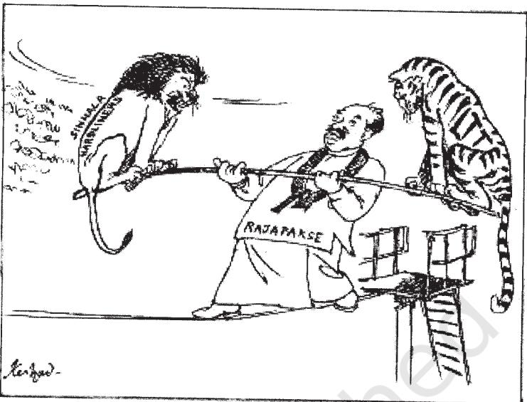

*Keshav,* The Hindu

*The cartoon depicts the dilemma of the Sri Lankan leadership in trying to balance Sinhala hardliners or the Lion and Tamil militants or the Tiger while negotiating peace.* 

LTTE was vanquished in 2009.

In spite of the conflict, Sri Lanka has registered considerable economic growth and recorded high levels of human development. Sri Lanka was one of the first developing countries to successfully control the rate of growth of population, the first country in the region to liberalise the economy, and it has had the highest per capita gross domestic product (GDP) for many years right through the civil war. Despite the ravages of internal conflict, it has maintained a democratic political system.

## **India-Pakistan Conflicts**

Let us now move from domestic politics and take a look at some of the areas of conflict in the international relations in this region. The post-Cold War era has not meant the end of conflicts and

Chapter 3.indd 37 15-03-2024 12:17:41

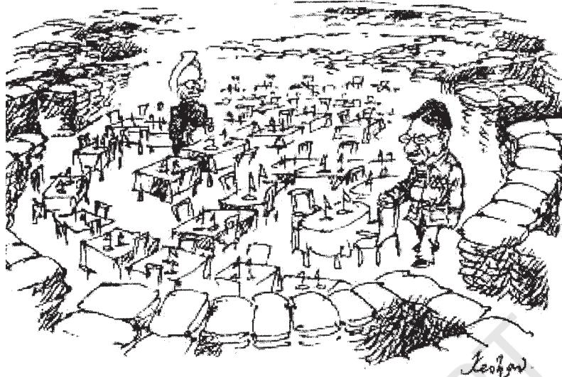

 *Keshav,* The Hindu

*A view of the current phase of the Indo-Pak negotiations.*

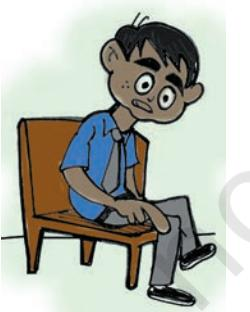

Discussion on Kashmir sounds like a property dispute between the rulers of India and Pakistan! What do the Kashmiris feel about it?

tensions in this region. We have already noted the conflicts around internal democracy or ethnic differences. But there are also some very crucial conflicts of an international nature. Given the position of India in this region, most of these conflicts involve India.

The most salient and overwhelming of these conflicts is, of course, the one between India and Pakistan. Soon after the partition, the two countries got embroiled in a conflict over the fate of Kashmir. The Pakistani government claimed that Kashmir belonged to it. Wars between India and Pakistan in 1947-48 and 1965 failed to settle the matter. The 1947-48 war resulted in the division of the province into Pakistan-occupied Kashmir and the Indian province of Jammu and Kashmir divided by the Line of Control. In 1971, India won a decisive war against Pakistan but the Kashmir issue remained unsettled.

India's conflict with Pakistan is also over strategic issues like the control of the Siachen glacier and over acquisition of arms. The arms race between the two countries assumed a new character with both states acquiring nuclear weapons and missiles to deliver such arms against each other in the 1990s. In 1998, India conducted nuclear explosion in Pokhran. Pakistan responded within a few days by carrying out nuclear tests in the Chagai Hills. Since then India and Pakistan seem to have built a military relationship in which the possibility of a direct and fullscale war has declined.

But both the governments continue to be suspicious of each other. The Indian government has blamed the Pakistan government for using a strategy of low-key violence by helping the Kashmiri militants with arms, training, money and protection to carry out terrorist strikes against India. The Indian government also believes that Pakistan had aided the pro-Khalistani militants with arms and ammunitions during the period 1985-1995. Its spy agency, Inter Services Intelligence (ISI), is alleged to be involved in various anti-India campaigns in India's northeast, operating secretly through Bangladesh and Nepal.

Chapter 3.indd 38 15-03-2024 12:17:41

The government of Pakistan, in turn, blames the Indian government and its security agencies for fomenting trouble in the provinces of Sindh and Balochistan.

India and Pakistan also have had problems over the sharing of river waters. Until 1960, they were locked in a fierce argument over the use of the rivers of the Indus basin. Eventually, in 1960, with the help of the World Bank, India and Pakistan signed the Indus Waters Treaty which has survived to this day in spite of various military conflicts in which the two countries have been involved. There are still some minor differences about the interpretation of the Indus Waters Treaty and the use of the river waters. The two countries are not in agreement over the demarcation line in Sir Creek in the Rann of Kutch. The dispute seems minor, but there is an underlying worry that how the dispute is settled may have an impact on the control of sea resources in the area adjoining Sir Creek. India and Pakistan are holding negotiations on all these issues.

# **India and its Other Neighbours**

The governments of India and Bangladesh have had differences over several issues including the sharing of the Ganga and Brahmaputra river waters. The Indian government has been unhappy with Bangladesh's denial of illegal immigration to India, its support for anti-Indian Islamic fundamentalist groups, Bangladesh's refusal to allow Indian troops to move through its territory to northeastern India, and its decision not to export natural gas to India or allow Myanmar to do so through Bangladeshi territory. Bangladeshi governments have felt that the Indian government behaves like a regional bully over the sharing of river waters, encouraging rebellion in the Chittagong Hill Tracts, trying to extract its natural gas and being unfair in trade. The two countries could not resolve their boundary dispute for a long while.

Despite their differences, India and Bangladesh do cooperate on many issues. Economic relations have improved considerably in the last 20 years. Bangladesh is a part of India's Look East (Act East since 2014) policy that wants to link up with Southeast Asia via Myanmar. On disaster management and environmental issues, the two states have cooperated regularly. In 2015, they exchanged certain enclaves. Efforts are on to broaden the areas of cooperation further by identifying common threats and being more sensitive to each other's needs.

Nepal and India enjoy a very special relationship that has very few parallels in the world. A treaty between the two countries allows the citizens of the two countries to travel to and work in the other country without visas and

Why is it that every one of our neighbours has a problem with India? Is there something wrong with our foreign policy? Or is it just our size?

Chapter 3.indd 39 15-03-2024 12:17:41

# **STEPS**

- Divide the classroom into eight groups (as many as the number of countries). The number of students in each group may vary, reflecting the size of the countries of South Asia.
- Name each group after a country and hand over a brief country profile to respective groups. Besides the basic information, include a short note on the contentious issues/disputes among the South Asian countries. The issues could be those discussed in this chapter or an issue of relevance but not discussed in the chapter.
- Allow students to select an issue of their choice. The dispute could be bilateral or multilateral (the issue could be related to India, given the geographic peculiarity of the region).
- Assign each group to find out what initiatives the governments involved have taken and the reasons for their failures in resolving the disputes.
- Students should assume the role of representing their respective countries and share their findings.

#### **Ideas for the Teacher**

- Pair up the countries sharing the common issue/dispute. It could be two groups in the case of a bilateral issue or more in case of a multilateral issue (examples of bilateral issues include the Jammu and Kashmir dispute between India and Pakistan, the migrant problem between India and Bangladesh; multilateral issues include the creation of a free trade zone or tackling terrorism).
- Groups should negotiate on the proposals and counterproposals within a time limit. The teacher is to take note of the outcome of the negotiations. The focus should be on the areas of agreement and disagreement.
- Link the outcome of the negotiations with the prevailing situation among the countries of South Asia. Talk about the difficulties involved in negotiating on a political issue based on the observation made. Conclude by discussing the importance of accommodating each other's interest for the sake of peaceful coexistence.

passports. Despite this special relationship, the governments of the two countries have had trade-related disputes in the past. The Indian government has often expressed displeasure at the warm relationship between Nepal and China and at the Nepal government's inaction against anti-Indian elements. Indian security agencies see the Maoist movement in Nepal as a growing security threat, given the rise of Naxalite groups in various Indian states from Bihar in the north to Andhra Pradesh in the south. Many leaders and citizens in Nepal think that the Indian government interferes in its internal affairs, has designs on its river waters and hydroelectricity, and prevents Nepal, a landlocked country, from getting easier access to the sea through Indian territory. Nevertheless, Indo-Nepal relations are fairly stable and peaceful. Despite differences, trade, scientific cooperation, common natural resources, electricity generation a n d i n t e r l o c k i n g w a t e r management grids hold the two countries together. There is a hope that the consolidation of democracy in Nepal will lead to improvements in the ties between the two countries.

The dif ficulties in the relationship between the governments of India and Sri Lanka are mostly over ethnic conflict in the island nation. Indian leaders and citizens find it impossible to remain neutral when Tamils are politically unhappy and are being killed. After the military intervention in 1987, the Indian

Chapter 3.indd 40 15-03-2024 12:17:41

government now prefers a policy of disengagement vis-à-vis Sri Lanka's internal troubles. India signed a free trade agreement with Sri Lanka, which strengthened relations between two countries. India's help in post-tsunami reconstruction in Sri Lanka has also brought the two countries closer.

India enjoys a very special relationship with Bhutan too and does not have any major conflict with the Bhutanese government. The ef forts made by the Bhutanese monarch to weed out the guerrillas and militants from northeastern India that operate in his country have been helpful to India. India is involved in big hydroelectric projects in Bhutan and remains the Himalayan kingdom's biggest source of development aid. India's ties with the Maldives remain warm and cordial. In November 1988, when some Tamil mercenaries from Sri Lanka attacked the Maldives, the Indian air force and navy reacted quickly to the Maldives' request to help stop the invasion. India has also contributed towards the island's economic development, tourism and fisheries.

You may have noticed that India has various problems with its smaller neighbours in the region. Given its size and power, they are bound to be suspicious of India's intentions. The Indian government, on the other hand, often feels exploited by its neighbours. It does not like the political instability in these countries, fearing it can help outside powers to gain influence in the region. The smaller countries fear that India wants to be a regionally-dominant power.

Not all conflicts in South Asia are between India and its neighbours. Nepal and Bhutan, as well as Bangladesh and Myanmar, have had disagreements in the past over the migration of ethnic Nepalese into Bhutan and the Rohingyas from Myanmar into India and Bangladesh, respectively. Bangladesh and Nepal have had some differences over the future of the Himalayan river waters. The major conflicts and differences, though, are between India and the others, partly because of the geography of the region, in which India is located centrally and is therefore the only country that borders the others.

If the chapter, on US was called 'US Hegemony' why is this chapter not called 'Indian Hegemony'?

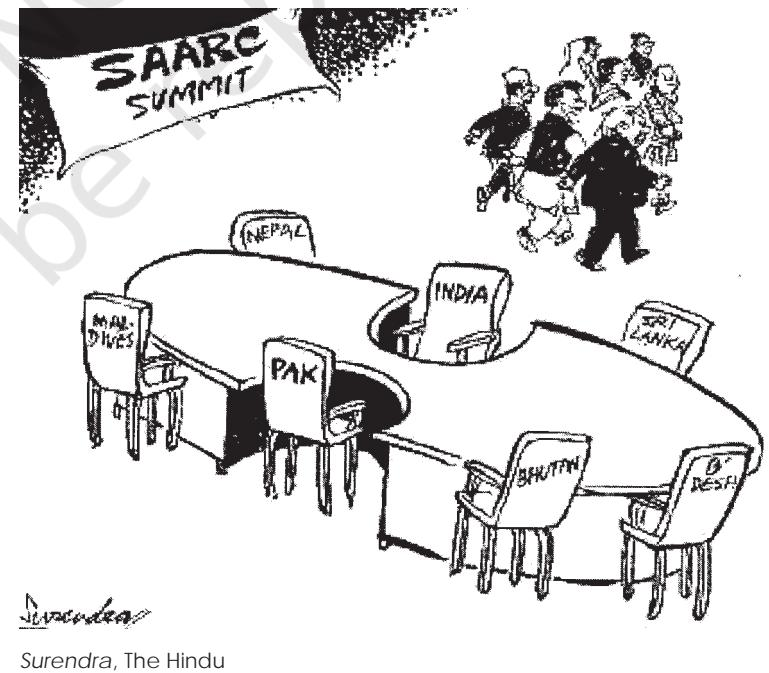

*What does this cartoon tell you about the role of India and Pakistan in the process of regional cooperation in South Asia?*

Chapter 3.indd 41 15-03-2024 12:17:41

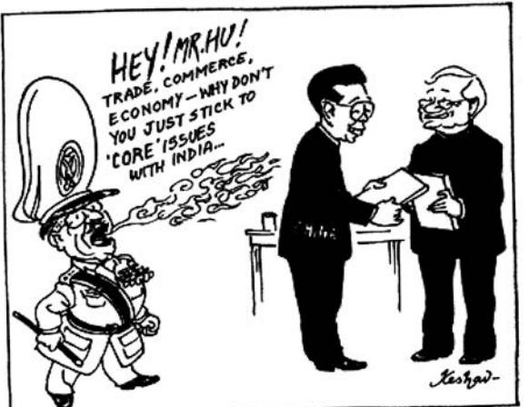

*Keshav,* The Hindu

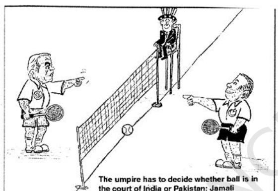

Pakistan Tribune

*The two cartoons, one from India and the other from Pakistan, interpret the role of two key players who are also interested in the region. Do you notice any commonality between their perspectives?* 

Every association seems to have emerged for trade! Is trade more important than people-to-people relations?

## **Peace and Cooperation**

Do the states of South Asia cooperate with each other? Or do they only keep fighting with each other? In spite of the many conflicts, the states of South Asia recognise the importance of cooperation and friendly relationship, among themselves. The South Asian Association for Regional Cooperation (SAARC) is a major regional initiative by the South Asian states to evolve cooperation through multilateral means. It began in 1985. Unfortunately, due to persisting political differences, SAARC has not had much success. SAARC members signed the South Asian Free Trade (SAFTA) agreement which promised the formation of a free trade zone for the whole of South Asia.

A new chapter of peace and cooperation might evolve in South Asia if all the countries in the region allow free trade across the borders. This is the spirit behind the idea of SAFTA. The Agreement was signed in 2004 and came into effect on 1 January 2006. SAFTA aims at lowering trade tariffs. But some of our neighbours fear that SAFTA is a way for India to 'invade' their markets and to influence their societies and politics through commercial ventures and a commercial presence in their countries. India thinks that there are real economic benefits for all from SAFTA and that a region that trades more freely will be able to cooperate better on political issues. Some in India think that SAFTA is not worth the trouble since India already has bilateral agreements with Bhutan, Nepal and Sri Lanka.

Although India-Pakistan relations seem to be a story of endemic conflict and violence, there have been a series of efforts to manage tensions and build peace. The two countries have agreed to undertake confidence building measures to reduce the risk of war. Social activists and prominent personalities have collaborated to create an atmosphere of friendship among the people of both countries. Leaders have met at summits to understand each other better and to find solutions

Chapter 3.indd 42 15-03-2024 12:17:42

to the major problems between the two neighbours. A number of bus routes have been opened up between the two countries. Trade between India and Pakistan had increased and Visas had been more easily granted. However, in recent times, the situation has changed.

No region exists in a vacuum. It is influenced by outside powers and events no matter how much it may try to insulate itself from non-regional powers. China and the United States remain key players in South Asian politics. Sino-Indian relations have improved significantly in the last ten years, but China's strategic partnership with Pakistan remains a major irritant. The demands of development and globalisation have brought the two Asian giants closer, and their economic ties have multiplied rapidly since 1991.

American involvement in South Asia has rapidly increased after the Cold War. The US has had good relations with both India and Pakistan since the end of the Cold War and increasingly works as a moderator in India-Pakistan relations. Economic reforms and liberal economic policies in both countries have greatly increased the depth of American participation in the region. The large South Asian diasporas in the US and the huge size of the population and markets of the region also give America an added stake in the future of regional security and peace.

However, whether South Asia will continue to be known as a conflict prone zone or will evolve into a regional bloc with some common cultural features and trade interests will depend more on the people and the governments of the region than any other outside power.

- 1. Identify the country:
	- a. The struggle among pro-monarchy, pro-democracy groups and extremists created an atmosphere of political instability:
	- b. A landlocked country with multi-party competition:
	- c. The first country to liberalise its economy in the South Asian region:
	- d. In the conflict between the military and pro-democracy groups, the military has prevailed over democracy:
	- e. Centrally located and shares borders with most of the South Asian countries:
	- f. Earlier the island had the Sultan as the head of state. Now, it's a republic:
	- g. Small savings and credit cooperatives in the rural areas have helped in reducing poverty:
	- h. A landlocked country with a monarchy:

**Exercises**

- 2. Which among the following statements about South Asia is wrong?
	- a) All the countries in South Asia are democratic.
	- b) Bangladesh and India have signed an agreement on river-water sharing.
	- c) SAFTA was signed at the 12th SAARC Summit in Islamabad.
	- d) The US and China play an influential role in South Asian politics.
- 3. What are some of the commonalities and differences between Bangladesh and Pakistan in their democratic experiences?
- 4. List three challenges to democracy in Nepal.
- 5. Name the principal players in the ethnic conflict in Sri Lanka. How do you assess the prospects of the resolution of this conflict?
- 6. Mention some of the recent agreements between India and Pakistan. Can we be sure that the two countries are well on their way to a friendly relationship?
- 7. Mention two areas each of cooperation and disagreement between India and Bangladesh.
- 8. How are the external powers influencing bilateral relations in South Asia? Take any one example to illustrate your point.
- 9. Write a short note on the role and the limitations of SAARC as a forum for facilitating economic cooperation among the South Asian countries.
- 10. India's neighbours often think that the Indian government tries to dominate and interfere in the domestic affairs of the smaller countries of the region. Is this a correct impression?

Chapter 3.indd 44 15-03-2024 12:17:42

