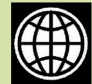

# Chapter 4 International Organisations

## Overview

In this chapter we shall discuss the role of international organisations after the collapse of the Soviet Union. We shall examine how, in this emerging world, there were calls for the restructuring of international organisations to cope with various new challenges including the rise of US power. The potential reform of the United Nations Security Council is an interesting case of the reform process and its difficulties. We then turn to India's involvement in the UN and its view of Security Council reforms. The chapter closes by asking if the UN can play any role in dealing with a world dominated by one superpower. In this chapter we also look at some other trans-national organisations that are playing a crucial role.

*This is the United Nations' logo. The emblem has a world map with olive branches around it, signifying world peace. Credit : www.un.org*

Chapter 4.indd 45 14 September 2022 11:03:24

### **Why International Organisations?**

Read the two cartoons on this page. Both the cartoons comment on the ineffectiveness of the United Nations Organisation, usually referred to as the UN, in the Lebanon crisis in 2006. Both the cartoons represent the kind of opinions that we often hear about the UN.

On the other hand, we also find that the UN is generally regarded as the most important international organisation in today's world. In the eyes of many people all over the world, it is indispensable and represents the great hope of humanity for peace and progress. Why do we then need organisations like the UN? Let us hear two insiders:

*"The United Nations was not created to take humanity to heaven, but to save it from hell." —* Dag Hammarskjold, the UN's second Secretary-General.

*"Talking shop? Yes, there are a lot of speeches and meetings at the U.N., especially during the annual sessions of the General Assembly. But as Churchill put it, jaw-jaw is better than war-war. Isn't it better to have one place where all… countries in the world can get together, bore each other sometimes with their words rather than bore holes into each other on the battlefield?"* — Shashi Tharoor, the former UN Under-Secretary-General for Communications and Public Information.

These two quotes suggest s o m e t h i n g i m p o r t a n t . International organisations are not the answer to everything, but they are important. International organisations help with matters of war and peace. They also help countries cooperate to make better living conditions for us all.

Countries have conflicts and differences with each other. That does not necessarily mean they must go to war to deal with their

*During June 2006, Israel attacked Lebanon, saying that it was necessary to control the militant group called Hezbollah. Large numbers of civilians were killed and many public buildings and even residential areas came under Israeli bombardment. The UN passed a resolution on this only in August and the Israel army withdrew from the region only in October. Both these cartoons comment on the role of the UN and its Secretary-General in this episode.*

That's what they say about the parliament too a talking shop. Does it mean that we need talking shops?

Chapter 4.indd 46 14 September 2022 11:03:25

antagonisms. They can, instead, discuss contentious issues and find peaceful solutions; indeed, even though this is rarely noticed, most conflicts and differences are resolved without going to war. The role of an international organisation can be important in this context. An international organisation is not a super-state with authority over its members. It is created by and responds to states. It comes into being when states agree to its creation. Once created, it can help member states resolve their problems peacefully.

International organisations are helpful in another way. Nations can usually see that there are some things they must do together. There are issues that are so challenging that they can only be dealt with when everyone works together. Disease is an example. Some diseases can only be eradicated if everyone in the world cooperates in inoculating or vaccinating their populations. Or take global warming and its effects. As temperatures rise because of the increase in greenhouse gases in the atmosphere, there is a danger that sea levels will also rise, thereby submerging many coastal areas of the world including huge cities. Of course, each country can try to find its own solution to the effects of global warming. But in the end a more effective approach is to stop the warming itself. This requires at least all of the major industrial powers to cooperate.

Unfortunately, recognising the need for cooperation and

#### **IMF**

The International Monetary Fund (IMF) is an international organisation that oversees those financial institutions and regulations that act at the international level. The IMF has 190 member

countries (as on 19 Febuary 2024) but they do not enjoy an equal say. The G-7 members US (16.52%), Japan (6.15%), Germany (5.32%), France (4.03%), UK (4.03%), Italy (3.02%) and Canada (2.22%) have 41.29% of the votes. China (6.09%), India (2.64%), Russia (2.59%) Brazil (2.22%) and Saudi Arabia (2.02%) are the other major members.

actually cooperating are two different things. Nations can recognise the need to cooperate but cannot always agree on how best to do so, how to share the costs of cooperating, how to make sure that the benefits of cooperating are justly divided, and how to ensure that others do not break their end of the bargain and cheat on an agreement. An international organisation can help produce information and ideas about how to cooperate. It can provide mechanisms, rules and a bureaucracy, to help members have more confidence that costs will be shared properly, that the benefits

> Make a list of issues or problems (other than the ones mentioned in the text) that cannot be handled by any one country and require an international organisation.

**IMF**

Chapter 4.indd 47 15-03-2024 11:51:04

#### **FOUNDING OF THE UNITED NATIONS**

**1941 August:** Signing of the Atlantic Charter by the US President Franklin D. Roosevelt and British PM Winston S. Churchill

**1942 January:** 26 Allied nations fighting against the Axis Powers meet in Washington, D.C., to support the Atlantic Charter and sign the 'Declaration by United Nations'

**1943 December:** Tehran Conference Declaration of the Three Powers (US, Britain and Soviet Union)

**1945 February:** Yalta Conference of the 'Big Three' (Roosevelt, Churchill and Stalin) decides to organise a United Nations conference on the proposed world organisation

**April-May:** The 2-month long United Nations Conference on International Organisation at San Francisco

**1945 June 26:** Signing of the UN Charter by 50 nations (Poland signed on October 15; so the UN has 51 original founding members)

**1945 October 24:** the UN was founded (hence October 24 is celebrated as UN Day)

**1945 October 30:** India joins the UN

will be fairly divided, and that once a member joins an agreement it will honour the terms and conditions of the agreement.

With the end of the Cold War, we can see that the UN may have a slightly different role. As the United States and its allies emerged victorious, there was concern amongst many governments and peoples that the Western countries led by the US would be so powerful that there would be no check against their wishes and desires. Can the UN serve to promote dialogue and discussion with the US in particular, and could it limit the power of the American government? We shall try to answer this question at the end of the chapter.

### **Evolution of the UN**

The First World War encouraged the world to invest in an international organisation to deal with conflict. Many believed that such an organisation would help the world to avoid war. As a result, the League of Nations was born. However, despite its initial success, it could not prevent the Second World War (1939-45). Many more people died and were wounded in this war than ever before.

The UN was founded as a successor to the League of Nations. It was established in 1945 immediately after the S e c o n d Wo r l d Wa r. T h e

*The US Office of War Information created the above poster during the Second World War as per the Declaration by United Nations of 1942. The poster features the flags of all nations that were part of the Allied Forces. It reflects the belligerent origins of the UN.*

Chapter 4.indd 48 14 September 2022 11:03:26

*Adapted from http://www.newint.org/issue375/pics/un-map-big.gif For more details about the UN System, visit www.un.org*

Chapter 4.indd 49 14 September 2022 11:03:27

Search for at least one news item about the activities of each of the UN agencies mentioned on this page.

Cold War or no Cold War, one reform is needed above all. Only democratic leaders should be allowed to represent their countries in the UN. How can they allow dictators to speak in the name of the people of their country?

organisation was set up through the signing of the United Nations Charter by 51 states. It tried to achieve what the League could not between the two world wars. The UN's objective is to prevent international conflict and to facilitate cooperation among states. It was founded with the hope that it would act to stop the conflicts between states escalating into war and, if war broke out, to limit the extent of hostilities. Furthermore, since conflicts often arose from the lack of social and economic development, the UN was intended to bring countries together to improve the prospects of social and economic development all over the world.

By 2011, the UN had 193 member states. These includeed almost all independent states. In the UN General Assembly, all members have one vote each. In the UN Security Council, there are five permanent members. These are: the United States, Russia, the United Kingdom, France and China. These states were selected as permanent members as they were the most powerful immediately after the Second World War and because they constituted the victors in the War.

The UN's most visible public figure, and the representative head, is the Secretary-General. The present Secretary-General is António Guterres. He is the ninth Secretary-General of the UN. He took over as the Secretary-General on 1 January 2017. He was the Prime Minister of Portugal

(1995-2002) and the UN High Commissioner for Refugees (2005-2015).

The UN consists of many dif fer ent structur es and agencies. War and peace and differences between member states are discussed in the General Assembly as well as the Security Council. Social and economic issues are dealt with by many agencies including the World Health Organisation (WHO), the United Nations Development Programme (UNDP), the United Nations Human Rights Commision (UNHRC), the United Nations High Commission for Refugees (UNHCR), the United Nations Childr en's Fund (UNICEF), and the United Nations Educational, Scientific, and Cultural Organisation (UNESCO), among others.

### **Reform of the UN after the Cold War**

Reform and improvement are fundamental to any organisation to serve the needs of a changing environment. The UN is no exception. In recent years, there have been demands for reform of the world body. However, there is little clarity and consensus on the nature of reform.

Two basic kinds of reforms face the UN: reform of the organisation's structures and processes; and a review of the issues that fall within the jurisdiction of the organisation. Almost everyone is agreed that both aspects of reform are

Chapter 4.indd 50 14 September 2022 11:03:27

necessary. What they cannot agree on is precisely what is to be done, how it is to be done, and when it is to be done.

On the reform of structures and processes, the biggest discussion has been on the functioning of the Security Council. Related to this has been the demand for an increase in the UN Security Council's permament and non-permanent membership so that the realities of contemporary world politics are better reflected in the structure of the organisation. In particular, there are proposals to increase membership from Asia, Africa and South America. Beyond this, the US and other Western countries want improvements in the UN's budgetary procedures and its administration.

On the issues to be given greater priority or to be brought within the jurisdiciton of the UN, some countries and experts want the organisation to play a greater or more effective role in peace and security missions, while others want its role to be confined to development and humanitarian work (health, education, environment, population control, human rights, gender and social justice).

Let us look at both sets of reforms, with an emphasis on reform of the structures and processes.

The UN was established in 1945 immediately after the Second World War. The way it

#### **UN SECRETARIES-GENERAL**

**Trygve Lie** (1946-1952) Norway; lawyer and foreign minister; worked for ceasefire between India and Pakistan on Kashmir; criticised for his failure to quickly end the Korean war; Soviet Union opposed second term for him; resigned from the post.

**Dag Hammarskjöld** (1953-1961) Sweden; Economist and lawyer; worked for resolving the Suez Canal dispute and the decolonisation of Africa; awarded Nobel Peace Prize posthumously in 1961 for his efforts to settle the Congo crisis; Soviet Union and France criticised his role in Africa.

**Kurt Waldheim** (1972-1981) Austria; diplomat and foreign minister; made efforts to resolve the problems of Namibia and Lebanon; oversaw the relief operation in Bangladesh; China blocked his bid for a third term.

during the Vietnam War.

**Boutros Boutros-Ghali** (1992-1996) Egypt; diplomat, jurist, foreign minister; issued a report, *An Agenda for Peace;* conducted a successful UN operation in Mozambique; blamed for the UN failures in Bosnia, Somalia and Rwanda; due to serious disagreements, the US blocked a second term for him.

**Kofi A. Annan** (1997-2006) Ghana; UN official; created the Global Fund to fight AIDS, Tuberculosis and Malaria; declared the US-led invasion of Iraq as an illegal act; established the Peacebuilding Commission and the Human Rights Council in 2005; awarded the 2001 Nobel Peace Prize.

**Ban Ki-moon** (2007-2016) Republic of Korea (South Korea); diplomat and foreign minister; the second Asian to hold the post; highlighted climate change; focused on the Millennium Development Goals and Sustainable Development Goals; worked for the creation of UN Women; emphasised conflict resolution and nuclear disarmament.

**António Manuel de Oliveira Guterres** (2017- ) Portugal; former Prime Minister of Portugal from 1995 to 2002; was the United Nations High Commissioner for Refugees during 2005–2015; President of the Socialist International from 1999 to 2005. He is serving as the ninth Secretary–General of the United Nations. Photo Credit: www.un.org

Chapter 4.indd 51 16 September 2022 12:04:10

*Ban Ki-moon, UN Secretary-General, launches UN @ 70 to celebrate the 70th Anniversary in New Delhi in 2015 (UN Photo/Mark Garten)*

was organised and the way it functioned reflected the realities of world politics after the Second World War. After the Cold War, those realities are different. Here are some of the changes that have occurred:

- The Soviet Union has collapsed.
- The US is the strongest power.
- The relationship between Russia, the successor to the Soviet Union, and the US is much more cooperative.
- China is fast emerging as a great power, and India also is growing rapidly.
- The economies of Asia are growing at an unprecedented rate.
- Many new countries have joined the UN (as they became independent from the Soviet Union or former communist states in eastern Europe).
- A whole new set of challenges confronts the world (genocide, civil war, ethnic conflict,

terrorism, nuclear proliferation, climate change, environmental degradation, epidemics).

In this situation, in 1989, as the Cold War was ending, the question facing the world was: is the UN doing enough? Is it equipped to do what is required? What should it be doing? And how? What reforms are necessary to make it work better? For the past decade and a half, member states have been trying to find satisfactory and practical answers to these questions.

### **Reform of Structures and Processes**

While the case for reform has widespread support, getting agreement on what to do is difficult. Let us examine the debate over reform of the UN Security Council. In 1992, the UN General Assembly adopted a resolution. The resolution reflected three main complaints:

- The Security Council no longer represents contemporary political realities.
- Its decisions reflect only Western values and interests and are dominated by a few powers.
- It lacks equitable representation.

In view of these growing demands for the restructuring of the UN, on 1 January 1997, the UN Secretary-General Kofi Annan initiated an inquiry into how the

Chapter 4.indd 52 14 September 2022 11:03:27

UN should be reformed. How, for instance, should new Security Council members be chosen?

In the years since then, the following are just some of the criteria that have been proposed for new permanent and nonpermanent members of the Security Council. A new member, it has been suggested, should be:

- A major economic power
- A major military power
- A substantial contributor to the UN budget
- A big nation in terms of its population
- A nation that respects democracy and human rights
- A country that would make the Council more representative of the world's diversity in terms of geography,

#### Major contributors to the UN regular budget for 2019

| No. | Member State | % |
| --- | --- | --- |
| 1 | USA | 22.0 |
| 2 | China | 12.0 |
| 3 | Japan | 8.5 |
| 4 | Germany | 6.0 |
| 5 | UK | 4.5 |
| 6 | France | 4.4 |
| 7 | Italy | 3.3 |
| 8 | Brazil | 2.9 |
| 9 | Canada | 2.7 |
| 10 | Russia | 2.4 |
| 11 | Republic of Korea | 2.2 |
| 12 | Australia | 2.2 |
| 13 | Spain | 2.1 |
| 14 | Turkey | 1.3 |
| 15 | Netherlands | 1.3 |
| 16 | Mexico | 1.2 |
| 17 | Saudi Arabia | 1.1 |
| 18 | Switzerland | 1.1 |
| 19 | Argentina | 0.9 |
| 20 | Sweden | 0.9 |
| 21 | India | 0.8 |
|  | Source: www.un.org |  |

#### **World Bank**

The World Bank was created during the Second World War in 1944. Its activities are focused on the developing countries. It works for human development (education, health), agriculture

and rural development (irrigation, rural services), environmental protection (pollution reduction, establishing and enforcing regulations), infrastructure (roads, urban regeneration, electricity) and governance (anti-corruption, development of legal institutions). It provides loans and grants to the member-countries. In this way, it exercises enormous influence on the economic policies of developing countries. It is often criticised for setting the economic agenda of the poorer nations, attaching stringent conditions to its loans and forcing free market reforms.

economic systems, and culture Clearly, each of these criteria has some validity. Governments saw advantages in some criteria and disadvantages in others depending on their interests and aspirations. Even if they had no desire to be members themselves, countries could see that the criteria were problematic. How big an economic or military power did you have to be to qualify for Security Council membership? What level of budget contribution would enable a state to buy its way into the Council? Was a big population an asset or a liability for a country trying to play a bigger role in the world? If respect for democracy and human rights was the criteria, countries with excellent records would be in line to be members; but would they be effective as Council members?

# **WORLD BANK**

Chapter 4.indd 53 14 September 2022 11:03:27

### **STEPS**

- Divide the class into six groups. Each group is to follow one of the six criteria (or more if there are more suggestions) listed here for permanent membership of the UN Security Council.
- Each group is to make its own list of the permanent members based on its given criterion (e.g. the group working on the 'population' criterion will find out the which are five most populous countries).
- Each group can make a presentation of their recommended list and reasons why their criterion should be accepted.

#### **Ideas for the Teacher**

- Allow the students to opt for the group whose criterion they themselves favour.
- Compare all the lists and see how many names are common and how often India features.
- Keep some time for an open ended discussion on which criterion should be adopted.

Furthermore, how was the matter of representation to be resolved? Did equitable representation in geographical terms mean that there should be one seat each from Asia, Africa, and Latin America and the Caribbean? Should the representation, on the other hand, be by regions or subregions (rather than continents)? Why should the issue of equitable representation be decided by geography? Why not by levels of economic development? Why not, in other words, give more seats to members of the developing world? Even here, there are difficulties. The developing world consists of countries at many different levels of development. What about culture? Should different cultures or 'civilisations' be given representation in a more balanced way? How does one divide the world by civilisations or cultures given that nations have so many cultural streams within their borders?

A related issue was to change the nature of membership altogether. Some insisted, for instance, that the veto power of the five permanent members be abolished. Many perceived the veto to be in conflict with the concept of democracy and sovereign equality in the UN and thought that the veto was no longer right or relevant.

In the Security Council, there are five permanent members and ten non-permanent members. The Charter gave the permanent members a privileged position to bring about stability in the world after the Second World War. The main privileges of the five permanent members are permanency and the veto power. The non-permanent members serve for only two years at a time and give way after that period to newly elected members. A country cannot be re-elected immediately after completing a term of two years. The nonpermanent members are elected in a manner so that they represent all continents of the world.

Chapter 4.indd 54 14 September 2022 11:03:28

Most importantly, the nonpermanent members do not have the veto power. What is the veto power? In taking decisions, the Security Council proceeds by voting. All members have one vote. However, the permanent members can vote in a negative manner so that even if all other permanent and non-permanent members vote for a particular decision, any permanent member's negative vote can stall the decision. This negative vote is the veto.

While there has been a move to abolish or modify the veto system, there is also a realisation that the permanent members are unlikely to agree to such a reform. Also, the world may not be ready for such a radical step even though the Cold War is over. Without the veto, there is the danger as in 1945 that the great powers would lose interest in the world body, that they would do what they pleased outside it, and that without their support and involvement the body would be ineffective.

### **Jurisdiction of the UN**

The question of membership is a serious one. In addition, though, there are more substantial issues before the world. As the UN completed 60 years of its existence, the heads of all the member-states met in September 2005 to celebrate the anniversary and review the situation. The leaders in this meeting decided that the following steps should be taken to make the UN more relevant in the changing context.

- Creation of a Peacebuilding Commission
- Acceptance of the responsibility of the international community in case of failures of national governments to protect their own citizens from atrocities
	- Establishment of a Human Rights Council (operational since 19 June 2006)
- Agreements to achieve the Millennium Development Goals (MDGs)
- Condemnation of terrorism in all its forms and manifestations
- Creation of a Democracy Fund
- An agreement to wind up the Trusteeship Council

It is not hard to see that these are equally contentious issues for the UN. What should a Peacebuilding Commission do? There are any number of conflicts all over the world. Which ones should it intervene in? Is it possible or even desirable for it to intervene in *Source: www.un.org*

That's very unfair! It's actually the weaker countries who need a veto, not those who already have so much power.

Chapter 4.indd 55 14 September 2022 11:03:28

*© Pat Bagley, Cagle Cartoons Inc.*

*The humanitarian crisis in Darfur, Sudan since 2003 has attracted empty promises by the International Community. How do you think the UN can intervene in situations like this? Would that require a change in its jurisdiction?*

each and every conflict? Similarly, what is the responsibility of the international community in dealing with atrocities? What are human rights and who should determine the level of human rights violations and the course of action to be taken when they are violated? Given that so many countries are still part of the developing world, how realistic is it for the UN to achieve an ambitious set of goals such as those listed in the Sustainable Development Goals? Can there be agreement on a definition of terrorism? How shall the UN use funds to promote democracy? And so on.

*Source: www.un.org*

Chapter 4.indd 56 14 September 2022 11:03:28

### **India and the UN Reforms**

India has supported the restructuring of the UN on several grounds. It believes that a strengthened and revitalised UN is desirable in a changing world. India also supports an enhanced role for the UN in promoting development and cooperation among states. India believes that development should be central to the UN's agenda as it is a vital precondition for the maintenance of international peace and security.

One of India's major concerns has been the composition of the Security Council, which has remained largely static while the UN General Assembly membership has expanded considerably. India considers that this has harmed the representative character of the Security Council. It also argues that an expanded Council, with more representation, will enjoy greater support in the world community.

We should keep in mind that the membership of the UN Security Council was expanded from 11 to 15 in 1965. But, there was no change in the number of permanent members. Since then, the size of the Council has remained stationary. The fact remains that the overwhelming majority of the UN General Assembly members now are developing countries. Therefore, India argues that they should also have a role in shaping the decisions in the Security Council which affect them.

#### **WTO**

**WTO**

The World Trade Organisation (WTO) is an international organisation which sets the rules for global trade. This organisation was set up in 1995 as the successor to the General Agreement on

Trade and Tariffs (GATT) created after the Second World War. It has 164 members (as on 29 July 2016). All decisions are taken unanimously but the major economic powers such as the US, EU and Japan have managed to use the WTO to frame rules of trade to advance their own interests. The developing countries often complain of non-transparent procedures and being pushed around by big powers.

India supports an increase in the number of both permanent and non-permanent members. Its representatives have argued that the activities of the Security Council have greatly expanded in the past few years. The success of the Security Council's actions depends upon the political support of the international community. Any plan for restructuring of the Security Council should, therefore, be broad-based. For example, the Security Council should have more developing countries in it.

Not surprisingly, India itself also wishes to be a permanent member in a restructured UN. India is the most populous country in the world comprising almost one-fifth of the world population. Moreover, India is also the world's largest democracy. India has participated in virtually all of the initiatives of the UN. Its role in the UN's

Do we want to oppose the bossism of the big five or do we want to join them and become another boss?

Chapter 4.indd 57 02-04-2024 10:17:58

#### **IAEA**

The International Atomic Energy Agency (IAEA) was established in 1957. It came into being to implement US President Dwight Eisenhower's "Atoms for Peace"

proposal. It seeks to promote the peaceful use of nuclear energy and to prevent its use for military purposes. IAEA teams regularly inspect nuclear facilities all over the world to ensure that civilian reactors are not being used for military purposes.

> peacekeeping efforts is a long and substantial one. The country's economic emergence on the world stage is another factor that perhaps justifies India's claim to a permanent seat in the Security Council. India has also made regular financial contributions to the UN and never faltered on its payments. India is aware that permanent membership of the Security Council also has symbolic importance. It signifies a country's growing importance in world affairs. This greater status is an advantage to a country in the conduct of its foreign policy: the reputation for being powerful makes you more influential.

> Despite India's wish to be a permanent veto-wielding member of the UN, some countries question its inclusion. Neighbouring Pakistan, with which India has troubled relations, is not the only country that is reluctant to see India become a permanent veto member of the Security Council. Some countries, for instance, are concerned about India's nuclear weapons capabilities. Others think

that its difficulties with Pakistan will make India ineffective as a permanent member. Yet others feel that if India is included, then other emerging powers will have to be accommodated such as Brazil, Germany, Japan, perhaps even South Africa, whom they oppose. There are those who feel that Africa and South America must be represented in any expansion of the permanent membership since those are the only continents not to have representation in the present structure. Given these concerns, it may not be very easy for India or anyone else to become a permanent member of the UN in the near future.

### **The UN in a Unipolar World**

Among the concerns about the reform and restructuring of the UN has been the hope of some countries that changes could help the UN cope better with a unipolar word in which the US was the most powerful country without any serious rivals. Can the UN serve as a balance against US dominance? Can it help maintain a dialogue between the rest of the world and the US and prevent America from doing whatever it wants?

US power cannot be easily checked. First of all, with the disappearance of the Soviet Union, the US stands as the only superpower. Its military and economic power allow it to ignore the UN or any other international organisation.

What happens if the UN invites someone to New York but the US does not issue visa?

**IAEA**

Chapter 4.indd 58 14 September 2022 11:03:28

Secondly, within the UN, the influence of the US is considerable. As the single largest contributor to the UN, the US has unmatched financial power. The fact that the UN is physically located within the US territory gives Washington additional sources of influence. The US also has many nationals in the UN bureaucracy. In addition, with its veto power the US can stop any moves that it finds annoying or damaging to its interests or the interests of its friends and allies. The power of the US and its veto within the organisation also ensure that Washington has a considerable degree of say in the choice of the Secretary General of the UN. The US can and does use this power to "split" the rest of the world and to reduce opposition to its policies.

The UN is not therefore a great balance to the US. Nevertheless, in a unipolar world in which the US is dominant, the UN can and has served to bring the US and the rest of the world into discussions over various issues. US leaders, in spite of their frequent criticism of the UN, do see the organisation as serving a purpose in bringing together over 190 nations in dealing with conflict and social and economic development. As for the rest of the world, the UN provides an arena in which it is possible to modify US attitudes and policies. While the rest of the world is rarely united against Washington, and while it is virtually impossible to "balance" US power, the UN

*© Mike Lane, Cagle Cartoons Inc.*

### **Amnesty International**

Amnesty International is an NGO that campaigns for the protection of human rights all over the world. It promotes respect for all the

human rights in the Universal Declaration of Human Rights. It believes that human rights are interdependent and indivisible. It prepares and publishes reports on human rights. Governments are not always happy with these reports since a major focus of Amnesty is the misconduct of government authorities. Nevertheless, these reports play an important role in research and advocacy on human rights.

Chapter 4.indd 59 14 September 2022 11:03:29

**AMNESTY INTERNATIONAL**

#### **Human Rights Watch**

Human Rights Watch is another international NGO involved in research and advocacy on human rights. It is the largest international human rights organisation in the US. It draws the

global media's attention to human rights abuses. It helped in building international coalitions like the campaigns to ban landmines, to stop the use of child soldiers and to establish the International Criminal Court.

> does provide a space within which arguments against specific US attitudes and policies are heard and compromises and concessions can be shaped.

> The UN is an imperfect body, but without it the world would

be worse off. Given the growing connections and links between societies and issues—what we often call 'interdependence'—it is hard to imagine how more than seven billion people would live together without an organisation such as the UN. Technology promises to increase planetary interdependence, and therefore the importance of the UN will only increase. Peoples and governments will have to find ways of supporting and using the UN and other international organisations in ways that are consistent with their own interests and the interests of the international community more broadly.

- 1. Mark correct or wrong against each of the following statements about the veto power.
	- a. Only the permanent members of the Security Council possess the veto power.
	- b. It's a kind of negative power.
	- c. The Secretary-General uses this power when not satisfied with any decision.
	- d. One veto can stall a Security Council resolution.
- 2. Mark correct or wrong against each of the following statements about the way the UN functions.
	- a. All security and peace related issues are dealt with in the Security Council.
	- b. Humanitarian policies are implemented by the main organs and specialised agencies spread across the globe.
	- c. Having consensus among the five permanent members on security issues is vital for its implementation.

d. The members of the General Assembly are automatically the members of all other principal organs and specialised agencies of the UN.

Chapter 4.indd 60 14 September 2022 11:03:29

- 3. Which among the following would give more weightage to India's proposal for permanent membership in the Security Council?
	- a. Nuclear capability
	- b. It has been a member of the UN since its inception
	- c. It is located in Asia
	- d. India's growing economic power and stable political system
- 4. The UN agency concerned with the safety and peaceful use of nuclear technology is:
	- a. The UN Committee on Disarmament
	- b. International Atomic Energy Agency
	- c. UN International Safeguard Committee
	- d. None of the above
- 5. WTO is serving as the successor to which of the following organisations
	- a. General Agreement on Trade and Tariffs
	- b. General Arrangement on Trade and Tariffs
	- c. World Health Organisation
	- d. UN Development Programme
- 6. Fill in the blanks.
	- a. The prime objective of the UN is ___________________________
	- b. The highest functionary of the UN is called_________________
	- c. The UN Security Council has _____ permanent and _____nonpermanent members.

d. ______________________ is the present UN Secretary-General.

- 7. Match the principal organs and agencies of the UN with their functions:
	- 1. Economic and Social Council
	- 2. International Court of Justice
	- 3. International Atomic Energy Agency
	- 4. Security Council
	- 5. UN High Commission for Refugees
	- 6. World Trade Organisation
	- 7. International Monetary Fund
	- 8. General Assembly
	- 9. World Health Organisation
	- 10. Secretariat

**E x e r c i s e s**

Chapter 4.indd 61 14 September 2022 11:03:29

Chapter 4.indd 62 14 September 2022 11:03:29

