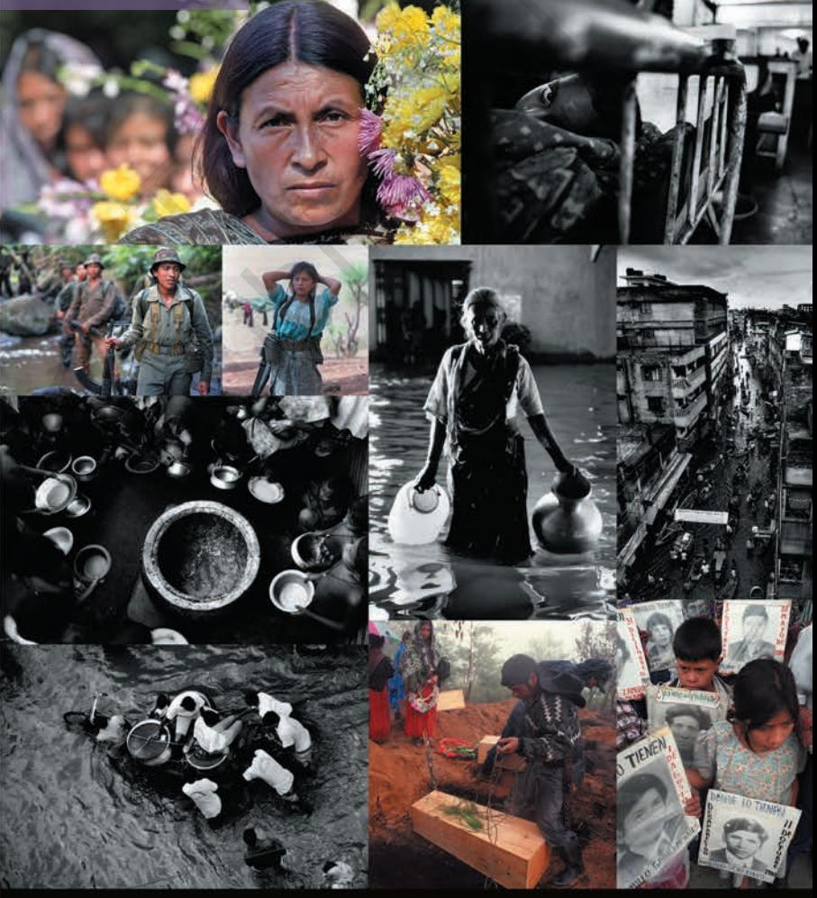
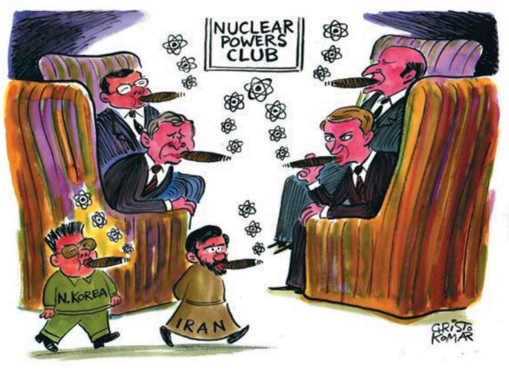
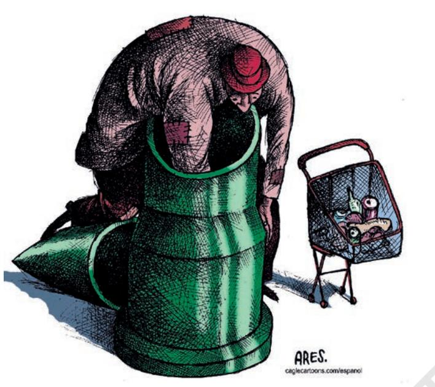
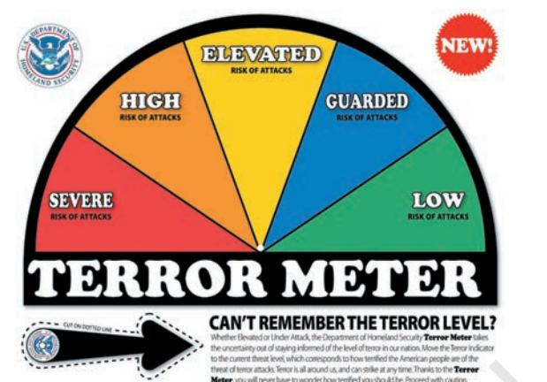
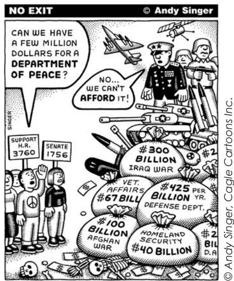
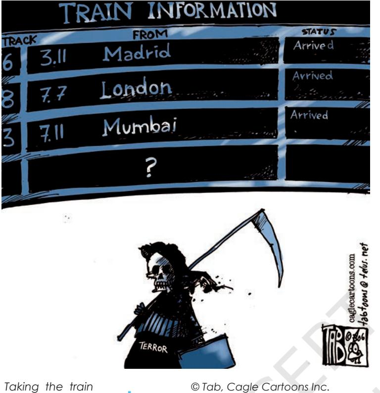
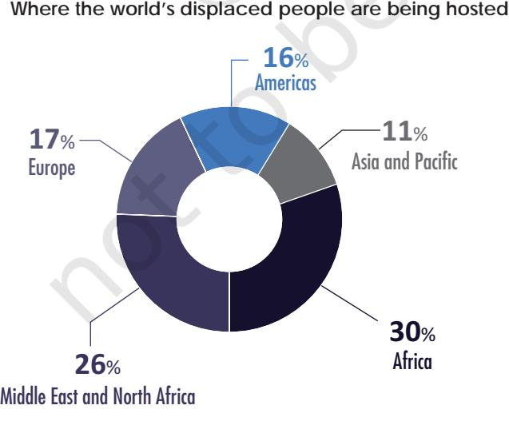
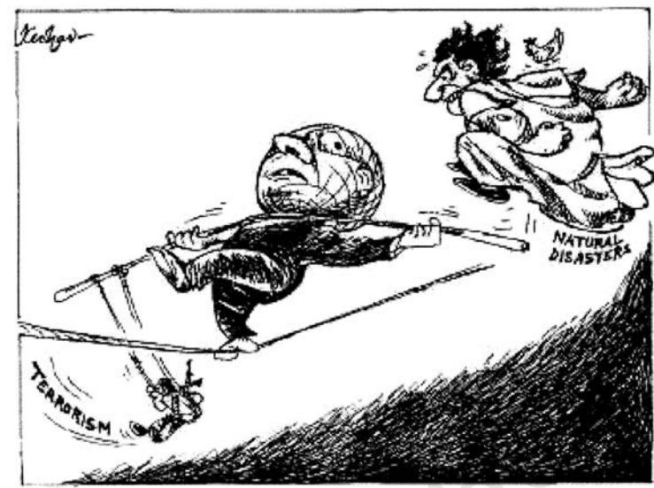
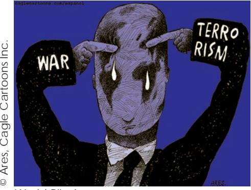
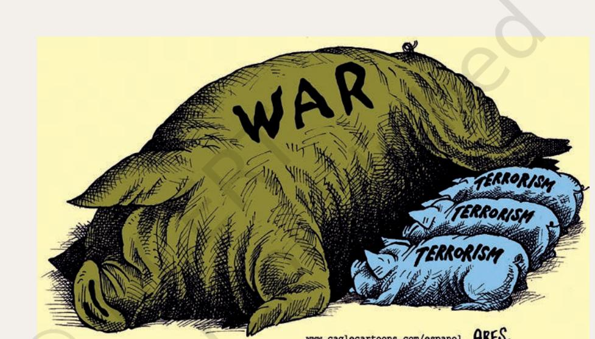

# Chapter 5 Security in the Contemporary World

## Overview

In reading about world politics, we frequently encounter the terms 'security' or 'national security'. Do we know what these terms mean? Often, they are used to stop debate and discussion. We hear that an issue is a security issue and that it is vital for the well-being of the country. The implication is that it is too important or secret to be debated and discussed openly. We see movies in which everything surrounding 'national security' is shadowy and dangerous. Security seems to be something that is not the business of the ordinary citizen. In a democracy, surely this cannot be the case. As citizens of a democracy, we need to know more about the term security. What exactly is it? And what are India's security concerns? This chapter debates these questions. It introduces two different ways of looking at security and highlights the importance of keeping in mind different contexts or situations which determine our view of security.

*The concern about human security was reflected in the 1994 UNDP's* Human Development Report, *which contends, "the concept of security has for too long been interpreted narrowly… It has been more related to nation states than people… Forgotten were the legitimate concerns of ordinary people who sought security in their daily lives." The images above show various forms of security threats.*

Chapter 5.indd 63 14 September 2022 11:03:54

Who decides about my security? Some leaders and experts? Can't I decide what is my security?

## **What is Security?**

At its most basic, security implies freedom from threats. Human existence and the life of a country are full of threats. Does that mean that every single threat counts as a security threat? Every time a person steps out of his or her house, there is some degree of threat to their existence and way of life. Our world would be saturated with security issues if we took such a broad view of what is threatening.

Those who study security, therefore, generally say that only

*Taming Peace* 

*Have you heard of 'peacekeeping force'? Do you think this is paradoxical term?*

those things that threaten 'core values' should be regarded as being of interest in discussions of security. Whose core values though? The core values of the country as a whole? The core values of ordinary women and men in the street? Do governments, on behalf of citizens, always have the same notion of core values as the ordinary citizen?

Furthermore, when we speak of threats to core values, how intense should the threats be? Surely there are big and small threats to virtually every value we hold dear. Can all those threats be brought into the understanding of security? Every time another country does something or fails to do something, this may damage the core values of one's country. Every time a person is robbed in the streets, the security of ordinary people as they live their daily lives is harmed. Yet, we would be paralysed if we took such an extensive view of security: everywhere we looked, the world would be full of dangers.

So we are brought to a conclusion: security relates only to extremely dangerous threats threats that could so endanger core values that those values would be damaged beyond repair if we did not do something to deal with the situation.

Having said that, we must admit that security remains a slippery idea. For instance, have societies always had the same conception of security? It would be surprising if they did because

Chapter 5.indd 64 14 September 2022 11:03:55

so many things change in the world around us. And, at any given time in world history, do all societies have the same conception of security? Again, it would be amazing if six hundred and fifty crore people, organised in nearly 200 countries, had the same conception of security! Let us begin by putting the various notions of security under two groups: traditional and non-traditional conceptions of security.

## **Traditional Notions: External**

Most of the time, when we read and hear about security we are talking about traditional, national security conceptions of security. In the traditional conception of security, the greatest danger to a country is from military threats. The source of this danger is another country which by threatening military action endangers the core values of sovereignty, independence and territorial integrity. Military action also endangers the lives of ordinary citizens. It is unlikely that in a war only soldiers will be hurt or killed. Quite often, ordinary men and women are made targets of war, to break their support of the war.

In responding to the threat of war, a government has three basic choices: to surrender; to prevent the other side from attacking by promising to raise the costs of war to an unacceptable level; and to defend itself when war actually

#### *Economy of war © Ares, Cagle Cartoons Inc.*

breaks out so as to deny the attacking country its objectives and to turn back or defeat the attacking forces altogether. Governments may choose to surrender when actually confronted by war, but they will not advertise this as the policy of the country. Therefore, security policy is concerned with preventing war, which is called deterrence, and with limiting or ending war, which is called defence.

Traditional security policy has a third component called balance of power. When countries look around them, they see that some countries are bigger and stronger. This is a clue to who might be a threat in the future. For instance, a neighbouring country may not say it is preparing for attack. There may be no obvious reason for attack. But the fact that this country is very powerful is a sign

War is all about insecurity, destruction and deaths. How can a war make anyone secure?

Chapter 5.indd 65 14 September 2022 11:03:56

*© Christo Komarnitski, Cagle Cartoons Inc.*

*How do the big powers react when new countries claim nuclear status? On what basis can we say that some countries can be trusted with nuclear weapons while others can't be?*

that at some point in the future it may choose to be aggressive. Governments are, therefore, very sensitive to the balance of power between their country and other countries. They do work hard to maintain a favourable balance of power with other countries, especially those close by, those with whom they have differences, or with those they have had conflicts in the past. A good part of maintaining a balance of power is to build up one's military power, although economic and technological power are also important since they are the basis for military power.

A f o u r t h a n d r e l a t e d component of traditional security policy is alliance building. An alliance is a coalition of states that coordinate their actions to deter or defend against military attack. Most alliances are

#### **66** *Contemporary World Politics*

formalised in written treaties and are based on a fairly clear identification of who constitutes the threat. Countries form alliances to increase their effective power relative to another country or alliance. Alliances are based on national interests and can change when national interests change. For example, the US backed the Islamic militants in Afghanistan against the Soviet Union in the 1980s, but later attacked them when Al Qaeda—a group of Islamic militants led by Osama bin Laden—launched terrorist strikes against America on 11 September 2001.

In the traditional view of security, then, most threats to a country's security come from outside its borders. That is because the international system is a rather brutal arena in which there is no central authority capable of controlling behaviour. Within a country, the threat of violence is regulated by an acknowledged central authority — the government. In world politics, there is no acknowledged central authority that stands above everyone else. It is tempting to think that the United Nations is such an authority or could become such an institution. However, as presently constituted, the UN is a creature of its members and has authority only to the extent that the membership allows it to have authority and obeys it. So, in world politics, each country has to be responsible for its own security.

Chapter 5.indd 66 14 September 2022 11:03:56

## **Traditional Notions: Internal**

By now you will have asked yourself: doesn't security depend on internal peace and order? How can a society be secure if there is violence or the threat of violence inside its borders? And how can it prepare to face violence from outside its borders if it is not secure inside its borders?

Traditional security must also, therefore, concern itself with internal security. The reason it is not given so much importance is that after the Second World War it seemed that, for the most powerful countries on earth, internal security was more or less assured. We said earlier that it is important to pay attention to contexts and situations. While internal security was certainly a part of the concerns of governments historically, after the Second World War there was a context and situation in which internal security did not seem to matter as much as it had in the past. After 1945, the US and the Soviet Union appeared to be united and could expect peace within their borders. Most of the European countries, particularly the powerful Western European countries, faced no serious threats from groups or communities living within those borders. Therefore, these countries focused primarily on threats from outside their borders.

What were the external threats facing these powerful countries?

Again, we draw attention to contexts and situations. We know that the period after the Second World War was the Cold War in which the US-led Western alliance faced the Soviet-led Communist alliance. Above all, the two alliances feared a military attack from each other. Some European powers, in addition, continued to worry about violence in their colonies, from colonised people who wanted independence. We have only to remember the French fighting in Vietnam in the 1950s or the British fighting in Kenya in the 1950s and the early 1960s.

As the colonies became free from the late 1940s onwards, their security concerns were often similar to that of the European powers. Some of the newly-independent countries, like the European powers, became members of the Cold War alliances. They, therefore, had to worry about the Cold War becoming a hot war and dragging them into hostilities — against neighbours who might have joined the other side in the Cold War, against the leaders of the alliances (the United States or Soviet Union), or against any of the other partners of the US and Soviet Union. The Cold War between the two superpowers was responsible for approximately one-third of all wars in the post-Second World War period. Most of these wars were fought in the Third World. Just as the European colonial powers feared violence in the colonies, some colonial people feared, after independence, that they might be attacked by their

Browse through a week's newspaper and list all the external and internal conflicts that are taking place around the globe.

Chapter 5.indd 67 14 September 2022 11:03:56

*Third World Arms © Ares, Cagle Cartoons Inc.*

former colonial rulers in Europe. They had to prepare, therefore, to defend themselves against an imperial war.

The security challenges facing the newly-independent countries of Asia and Africa were different from the challenges in Europe in two ways. For one thing, the new countries faced the prospect of military conflict with neighbouring countries. For another, they had to worry about internal military conflict. These countries faced threats not only from outside their borders, mostly from neighbours, but also from within. Many newlyindependent countries came to fear their neighbours even more than they feared the US or Soviet Union or the former colonial powers. They quarrelled over borders and territories or control of people and populations or all of these simultaneously.

Internally, the new states worried about threats from separatist movements which wanted to form independent countries. Sometimes, the external and internal threats merged. A neighbour might help or instigate an internal separatist movement leading to tensions between the two neighbouring countries. Internal wars now make up more than 95 per cent of all armed conflicts fought anywhere in the world. Between 1946 and 1991, there was a twelve-fold rise in the number of civil wars—the greatest jump in 200 years. So, for the new states, external wars with neighbours and internal wars posed a serious challenge to their security.

## **Traditional Security and Cooperation**

In traditional security, there is a recognition that cooperation in limiting violence is possible. These limits relate both to the ends and the means of war. It is now an almost universally-accepted view that countries should only go to war for the right reasons, primarily self-defence or to protect other people from genocide. War must also be limited in terms of the means that are used. Armies must avoid killing or hurting noncombatants as well as unarmed and surrendering combatants. They should not be excessively violent. Force must in any case be used only after all the alternatives have failed.

Those who fight against their own country must be unhappy about something. Perhaps it is their insecurity that creates insecurity for the country.

Chapter 5.indd 68 14 September 2022 11:03:56

Traditional views of security do not rule out other forms of cooperation as well. The most important of these are disarmament, arms control, and confidence building. Disarmament requires all states to give up certain kinds of weapons. For example, the 1972 Biological Weapons Convention (BWC) and the 1997 Chemical Weapons Convention (CWC) banned the production and possession of these weapons. More than 155 states acceded to the BWC and 193 states acceded to the CWC. Both conventions included all the great powers. But the superpowers — the US and Soviet Union — did not want to give up the third type of weapons of mass destruction, namely, nuclear weapons, so they pursued arms control.

Arms control regulates the acquisition or development of weapons. The Anti-ballistic Missile (ABM) Treaty in 1972 tried to stop the United States and Soviet Union from using ballistic missiles as a defensive shield to launch a nuclear attack. While it did allow both countries

*The text says: "Whether Elevated or Under Attack, the Department of Homeland Security Terror Meter takes the uncertainty out of staying informed of the level of terror in our nation. Move the Terror Indicator to the current threat level, which corresponds to how terrified the American people are of the threat of terror attacks. Terror is all around us, and can strike at anytime. Thanks to the Terror Meter, you will never have to wonder how terrified you should be. Proceed with caution".*

to deploy a very limited number of defensive systems, it stopped them from large-scale production of those systems.

The US and Soviet Union signed a number of other arms control treaties including the Strategic Arms Limitations Treaty II or SALT II and the Strategic Arms Reduction Treaty (START). The Nuclear Non-Proliferation Treaty (NPT) of 1968 was an arms control treaty in the sense that it regulated the acquisition of nuclear weapons: those countries that had tested and manufactured nuclear weapons before 1967 were allowed to keep their weapons; and those that had not done so were to give up the right to acquire them. The NPT did not abolish nuclear weapons; rather, it limited the number of countries that could have them.

How funny! First they make deadly and expensive weapons. Then they make complicated treaties to save themselves from these weapons. They call it security!

Chapter 5.indd 69 15-03-2024 11:52:30

Traditional security also accepts confidence building as a means of avoiding violence. Confidence building is a process in which countries share ideas and information with their rivals. They tell each other about their military intentions and, up to a point, their military plans. This is a way of demonstrating that they are not planning a surprise attack. They also tell each other about the kind of forces they possess, and they may share information on where those forces are deployed. In short, confidence building is a process designed to ensure that rivals do not go to war through misunderstanding or misperception.

Overall, traditional conceptions of security are principally concerned with the use, or threat of use, of military force. In traditional security, force is both the principal threat to security and the principal means of achieving security.

## **Non-Traditional Notions**

Non-traditional notions of security go beyond military threats to include a wide range of threats and dangers affecting the conditions of human existence. They begin by questioning the traditional referent of security. In doing so, they also question the other three elements of security — what is being secured, from what kind of threats and the approach to security. When we say referent we mean 'Security for who?' In the traditional security conception, the referent is the state with its territory and governing institutions. In the non-traditional conceptions, the referent is expanded. When we ask 'Security for who?' proponents of non-traditional security reply 'Not just the state but also individuals or communities or indeed all of humankind'. Nontraditional views of security have been called 'human security' or 'global security'.

Human security is about the protection of people more than the protection of states. Human security and state security should be — and often are — the same thing. But secure states do not automatically mean secure peoples. Protecting citizens from foreign attack may be a necessary condition for the security of individuals, but it is certainly not

*The cartoon comments on the massive expenditure on defence and lack of money for peace-related initiatives in the US. Is it any different in our country?*

Now we are talking! That is what I call real security for real human beings.

Chapter 5.indd 70 14 September 2022 11:03:58

a sufficient one. Indeed, during the last 100 years, more people have been killed by their own governments than by foreign armies.

All proponents of human security agree that its primary goal is the protection of individuals. However, there are differences about precisely what threats individuals should be protected from. Proponents of the 'narrow' concept of human security focus on violent threats to individuals or, as former UN Secretary-General Kofi Annan puts it, "the protection of communities and individuals f r o m i n t e r n a l v i o l e n c e " . Proponents of the 'broad' concept of human security argue that the threat agenda should include hunger, disease and natural disasters because these kill far more people than war, genocide and terrorism combined. Human security policy, they argue, should protect people from these threats as well as from violence. In its broadest formulation, the human security agenda also encompasses economic security and 'threats to human dignity'. Put differently, the broadest formulation stresses what has been called 'freedom from want' and 'freedom from fear', respectively.

The idea of global security emerged in the 1990s in response to the global nature of threats such as global war ming, international terrorism, and health epidemics like AIDS and

bird flu and so on. No country can resolve these problems alone. And, in some situations, one country may have to disproportionately bear the brunt of a global problem such as environmental degradation. For example, due to global warming, a sea level rise of 1.5–2.0 meters would flood 20 percent of Bangladesh, inundate most of the Maldives, and threaten nearly half the population of Thailand. Since these problems are global in nature, international cooperation is vital, even though it is difficult to achieve.

## **New Sources of Threats**

The non-traditional conceptions both human security and global security—focus on the changing nature of threats to security. We will discuss some of these threats in the section below.

Terrorism refers to political violence that targets civilians deliberately and indiscriminately. International terrorism involves the citizens or territory of more than one country. Terrorist groups seek to change a political context or condition that they do not like by force or threat of force. Civilian targets are usually chosen to terrorise the public and to use the unhappiness of the public as a weapon against national governments or other parties in conflict.

The classic cases of terrorism involve hijacking planes or planting bombs in trains, cafes, markets

Chapter 5.indd 71 14 September 2022 11:03:58

2024-25

and other crowded places. Since 11 September 2001 when terrorists attacked the World Trade Centre in America, other governments and public have paid more attention to terrorism, though terrorism itself is not new. In the past, most of the terror attacks have occurred in the Middle East, Europe, Latin America and South Asia.

Human rights have come to be classified into three types. The first type is political rights such as freedom of speech and assembly. The second type is economic and social rights. The third type is the rights of colonised people or ethnic and indigenous minorities. While there is broad agreement on this classification, there is no agreement on which set of rights should be considered as universal

Why do we always look outside when talking about human rights violations? Don't we have examples from our

own country? *He doesn't exist!* 

Chapter 5.indd 72 14 September 2022 11:03:58

human rights, nor what the international community should do when rights are being violated.

Since the 1990s, developments such as Iraq's invasion of Kuwait, the genocide in Rwanda, and the Indonesian military's killing of people in East Timor have led to a debate on whether or not the UN should intervene to stop human rights abuses. There are those who argue that the UN Charter empowers the international community to take up arms in defence of human rights. Others argue that the national interests of the powerful states will determine which instances of human rights violations the UN will act upon.

Global poverty is another source of insecurity. World population—now at 760 crore will grow to nearly 1000 crore by the middle of the 21st century. Currently, half the world's population growth occurs in just six countries—India, China, Pakistan, Nigeria, Bangladesh and Indonesia. Among the world's poorest countries, population is expected to triple in the next 50 years, whereas many rich countries will see population shrinkage in that period. High per capita income and low population growth make rich states or rich social groups get richer, whereas low incomes and high population growth reinforce each other to make poor states and poor groups get poorer.

Globally, this disparity contributes to the gap between the Northern and Southern countries of the world. Within the South, disparities have also sharpened, as a few countries have managed to slow down population growth and raise incomes while others have failed to do so. For example, most of the

Chapter 5.indd 73 14 September 2022 11:03:59

Take a map of Africa and plot various threats to the people's security on that map.

world's armed conflicts now take place in sub-Saharan Africa, which is also the poorest region of the world. At the turn of the 21st century, more people were being killed in wars in this region than in the rest of the world combined.

Poverty in the South has also led to large-scale migration to seek a better life, especially better economic opportunities, in the North. This has created international political frictions. International law and norms make a distinction between migrants (those who voluntarily leave their home countries) and refugees (those who flee from war, natural disaster or political persecution). States are generally supposed to accept refugees, but they do not have to accept migrants. While refugees leave

**Refugees in the world (2017)**

*Source: http://www.unhcr.org*

their country of origin, people who have fled their homes but remain within national borders are called 'internally displaced people'. Kashmiri Pandits that fled the violence in the Kashmir Valley in the early 1990s are an example of an internally displaced community.

The world refugee map tallies almost perfectly with the world conflicts map because wars and armed conflicts in the South have generated millions of refugees seeking safe haven. From 1990 to 1995, 70 states were involved in 93 wars which killed about 55 lakh people. As a result, individuals, and families and, at times, whole communities have been forced to migrate because of generalised fear of violence or due to the destruction of livelihoods, identities and living environments. A look at the correlation between wars and refugee migration shows that in the 1990s, all but three of the 60 refugee flows coincided with an internal armed conflict.

Health epidemics such as HIV-AIDS, bird flu, and severe acute respiratory syndrome (SARS) have rapidly spread across countries through migration, business, tourism and military operations. One country's success or failure in limiting the spread of these diseases affects infections in other countries.

Chapter 5.indd 74 14 September 2022 11:04:00

By 2003, an estimated 4 crore people were infected with HIV-AIDS worldwide, two-thirds of them in Africa and half of the rest in South Asia. In North America and other industrialised countries, new drug therapies dramatically lowered the death rate from HIV-AIDS in the late 1990s. But these treatments were too expensive to help poor regions like Africa where it has proved to be a major factor in driving the region backward into deeper poverty.

Other new and poorly understood diseases such as Corona, ebola virus, hantavirus, and hepatitis C have emerged, w h i l e o l d d i s e a s e s l i k e tuberculosis, malaria, dengue fever and cholera have mutated into drug resistant forms that are difficult to treat. Epidemics among animals have major economic effects. Since the late 1990s, Britain has lost billions of dollars of income during an outbreak of the mad-cow disease, and bird flu shut down supplies of poultry exports from several Asian countries. Such epidemics demonstrate the growing interdependence of states making their borders less meaningful than in the past and emphasise the need for international cooperation.

Expansion of the concept of security does not mean that we can include any kind of disease or distress in the ambit of security. If we do that, the concept of security stands to lose its coherence. Everything could become a security issue.

*Keshav,* The Hindu

*How should the world address issues shown here?* 

To qualify as a security problem, therefore, an issue must share a minimum common criterion, say, of threatening the very existence of the referent (a state or group of people) though the precise nature of this threat may be different. For example, the Maldives may feel threatened by global warming because a big part of its territory may be submerged with the rising sea level, whereas for countries in Southern Africa, HIV-AIDS poses a serious threat as one in six adults has the disease (one in three for Botswana, the worst case). In 1994, the Tutsi tribe in Rwanda faced a threat to its existence as nearly five lakh of its people were killed by the rival Hutu tribe in a matter of weeks. This shows that non-traditional conceptions of security, like traditional conceptions of security, vary according to local contexts.

Chapter 5.indd 75 18-04-2024 14:58:54

*World Blindness* 

## **Cooperative Security**

We can see that dealing with many of these nontraditional threats to security require cooperation rather t h a n m i l i t a r y

confrontation. Military force may have a role to play in combating terrorism or in enforcing human rights (and even here there is a limit to what force can achieve), but it is difficult to see what force would do to help alleviate poverty, manage migration and refugee movements, and control epidemics. Indeed, in most cases, the use of military force would only make matters worse!

Far more effective is to devise strategies that involve international cooperation. Cooperation may be bilateral (i.e. between any two countries), regional, continental, or global. It would all depend on the nature of the threat and the willingness and ability of countries to respond. Cooperative security may also involve a variety of other players, both international and national—international organisations (the UN, the World Health Organisation, the World Bank, the IMF etc.), nongovernmental organisations (Amnesty International, the Red Cross, private foundations and charities, religious organisations, trade unions, associations, social and development organisations), businesses and corporations, and great personalities (e.g. Mother Teresa, Nelson Mandela).

Cooperative security may involve the use of force as a last resort. The international community may have to sanction the use of force to deal with governments that kill their own people or ignore the misery of their populations who are devastated by poverty, disease and catastrophe. It may have to agree to the use of violence against international terrorists and those who harbour them. Non-traditional security is much better when the use of force is sanctioned and applied collectively by the international community rather than when an individual country decides to use force on its own.

## **India's Security Strategy**

India has faced traditional (military) and non-traditional threats to its security that have emerged from within as well as outside its borders. Its security strategy has four broad components, which have been used in a varying combination from time to time.

The first component was strengthening its military capabilities because India has been involved in conflicts with its neighbours — Pakistan in 1947–48, 1965, 1971 and 1999; and China in 1962. Since it is surrounded by nuclear-armed countries in

I feel happy when I hear that my country has nuclear weapons. But I don't know how exactly it makes me and my family more secure.

Chapter 5.indd 76 15-03-2024 11:52:31

the South Asian region, India's decision to conduct nuclear tests in 1998 was justified by the Indian government in terms of safeguarding national security. India first tested a nuclear device in 1974.

The second component of India's security strategy has been to strengthen international norms and international institutions to protect its security interests. India's first Prime Minister, Jawaharlal Nehru, supported the cause of Asian solidarity, decolonisation, disarmament, and the UN as a forum in which international conflicts could be settled. India also took initiatives to bring about a universal and non-discriminatory nonproliferation regime in which all countries would have the same rights and obligations with respect to weapons of mass destruction (nuclear, biological, chemical). It argued for an equitable New International Economic Order (NIEO). Most importantly, it used non-alignment to help carve out an area of peace outside the bloc politics of the two superpowers. India joined 160 countries that have signed and ratified the 1997 Kyoto Protocol, which provides a roadmap for reducing the emissions of greenhouse gases to check global warming. Indian troops have been sent abroad on UN peacekeeping missions in support of cooperative security initiatives.

The third component of Indian security strategy is geared towards meeting security challenges within the country. Several militant groups from areas such as the Nagaland, Mizoram, the Punjab, and Kashmir among others have, from time to time, sought to break away from India. India has tried to preserve national unity by adopting a democratic political system, which allows different communities and groups of people to freely articulate their grievances and share political power.

Finally, there has been an attempt in India to develop its economy in a way that the vast mass of citizens are lifted out of poverty and misery and huge economic inequalities are not allowed to exist. The attempt has partially succeeded; we are advancing towards overcoming poverty and inequality. Yet democratic politics allows spaces for articulating the voice of the poor and the deprived citizens. There is a pressure on the democratically elected governments to combine economic growth with human development. Thus democracy is not just a political ideal; a democratic government is also a way to provide greater security. You will read more about the successes and failures of Indian democracy in this respect in the textbook on politics in India since independence.

Compare the expenditure by the Indian government on traditional security with its expenditure on non-traditional security.

Chapter 5.indd 77 15-03-2024 11:52:31

## **STEPS**

- Narrate the following imaginary situation of four villages settled on the banks of a river.
*Kotabagh, Gewali, Kandali and Goppa are villages adjoining each other beside a river. People in Kotabagh were the first settlers on the riverbank. They had an uninterrupted access to abundant natural resources available in the region. Gradually, people from different regions started coming to this region because of the abundant natural resources and water. Now there are four villages. With time the population of these villages expanded. But resources did not expand. Each village started making claims over natural resources including the boundary of their respective settlement. Inhabitants of Kotabagh argued for a greater share in natural resources, as they were the first settlers. Settlers of Kandali and Gewali said that as they have bigger populations than the others they both need a greater share. The people of Goppa said as they are used to an extravagant life they need a bigger share, though their population is smaller in size. All four villages disagreed with each other's demands and continued to use the resources as they wished. This led to frequent clashes among the villagers. Gradually, everybody felt disgusted with the state of affairs and lost their peace of mind. Now they all wish to live the way they had lived earlier. But they do not know how to go back to that golden age.*

- Make a brief note describing the characteristics of each village the description should reflect the actual nature of present-day nations.
- Divide the classroom into four groups. Each group is to represent a village. Hand over the village notes to the respective groups.
- The teacher is to allot a time (15 minutes) for group discussions on how to go back to the golden age. Each should develop its own strategy.

All groups are to negotiate freely among themselves as village representatives, to arrive at a solution (within 20 minutes). Each would put forth its arguments and counter arguments. The result could be: an amicable agreement accommodating the demands of all, which seldom happens; or, the entire negotiation/discussion ends without achieving the purpose.

#### **Ideas for the Teacher**

- Link the villages to nations and connect to the problems of security (threat to geographical territory/ access to natural resources/insurgency, and so on).
- Talk about the observations made during the negotiation and explain how similarly the nations behave while negotiating on related issues.
- The activity could be concluded by making reference to some of the current security issues between and among nations.

Chapter 5.indd 78 14 September 2022 11:04:00

- 1. Match the terms with their meaning:
	- i. Confidence Building Measures (CBMs)
	- ii. Arms Control
	- iii. Alliance
	- iv. Disarmament
	- a. Giving up certain types of weapons
	- b. A process of exchanging information on defence matters between nations on a regular basis
	- c. A coalition of nations meant to deter or defend against military attacks
	- d. Regulates the acquisition or development of weapons
- 2. Which among the following would you consider as a traditional security concern / non-traditional security concern / not a threat?
	- a. The spread of chikungunya / dengue fever
	- b. Inflow of workers from a neighbouring nation
	- c. Emergence of a group demanding nationhood for their region
	- d. Emergence of a group demanding autonomy for their region
	- e. A newspaper that is critical of the armed forces in the country
- 3. What is the difference between traditional and non-traditional security? Which category would the creation and sustenance of alliances belong to?
- 4. What are the differences in the threats that people in the Third World face and those living in the First World face?
- 5. Is terrorism a traditional or non-traditional threat to security?
- 6. What are the choices available to a state when its security is threatened, according to the traditional security perspective?
- 7. What is 'Balance of Power'? How could a state achieve this?
- 8. What are the objectives of military alliances? Give an example of a functioning military alliance with its specific objectives.
- 9. Rapid environmental degradation is causing a serious threat to security. Do you agree with the statement? Substantiate your arguments.

Chapter 5.indd 79 14 September 2022 11:04:00

- 10. Nuclear weapons as deterrence or defence have limited usage against contemporary security threats to states. Explain the statement.
- 11. Looking at the Indian scenario, what type of security has been given priority in India, traditional or non-traditional? What examples could you cite to substantiate the argument?
- 12. Read the cartoon below and write a short note in favour or against the connection between war and terrorism depicted in this cartoon.

*© Ares, Cagle Cartoons Inc.*

Chapter 5.indd 80 14 September 2022 11:04:01

