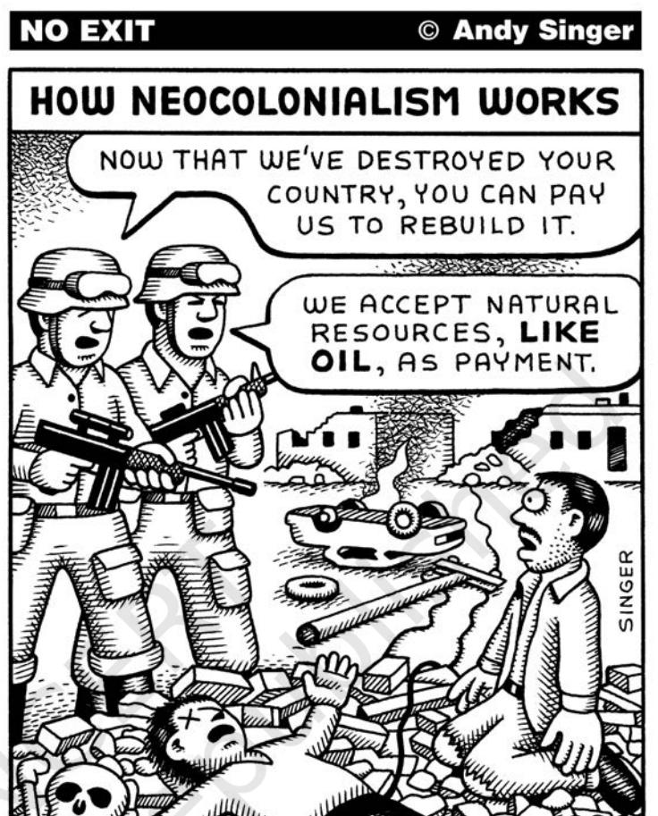

# Chapter 6 Environment and Natural Resources

# Overview

This chapter examines the growing significance of environmental as well as resource issues in world politics. It analyses in a comparative perspective some of the important environmental movements against the backdrop of the rising profile of environmentalism from the 1960s onwards. Notions of common property resources and the global commons too are assessed. We also discuss, in brief, the stand taken by India in more recent environmental debates. Next follows a brief account of the geopolitics of resource competition. We conclude by taking note of the indigenous peoples' voices and concerns from the margins of contemporary world politics.

*The 1992 Earth Summit has brought environmental issues to the centre-stage of global politics. The pictures above show rainforest and mangroves.*

Chapter 6.indd 81 14 September 2022 11:04:27

Politics in forests, politics in water, politics in atmosphere! What is not political then?

# **Environmental Concerns in Global Politics**

In this book we have discussed 'world politics' in a fairly limited sense: wars and treaties, rise and decline of state power, the relationship between the governments that represent their countries in the international arena and the role of intergovernmental organisations. In Chapter 5, we expanded the scope of world politics to include issues like poverty and epidemics. That may not have been a very difficult step to take, for we all think that governments are responsible for controlling these. In that sense they fall within the scope of world politics. Now consider some other issues. Do you think they fall within the scope of contemporary world politics?

*Around the Aral Sea, thousands of people have had to leave their homes as the toxic waters have totally destroyed the fishing industry. The shipping industry and all related activities have collapsed. Rising concentrations of salt in the soil have caused low crop yields. Numerous studies have been conducted. In fact locals joke that if everyone who'd come to study the Aral had brought a bucket of water, the sea would be full by now. Source: www.gobartimes.org*

- Throughout the world, cultivable area is barely expanding any more, and a substantial portion of existing agricultural land is losing fertility. Grasslands have been overgrazed and fisheries overharvested. Water bodies have suffered extensive depletion and pollution, severely restricting food production.
- According to the *Human Development Report 2016* of the United Nations Development Programme, 663 million people in developing countries have no access to safe water and 2.4 billion have no access to sanitation, resulting in the death of more than three million children every year.
- Natural forests which help stabilise the climate, moderate water supplies, and harbour a majority of the planet's biodiversity on land are being cut down and people are being displaced. The loss of biodiversity continues due to the destruction of habitat in areas which are rich in species.
- A steady decline in the total amount of ozone in the Earth's stratosphere (commonly referred to as the ozone hole) poses a real danger to ecosystems and human health.
- Coastal pollution too is increasing globally. Although the open sea is relatively clean, the coastal waters are

Chapter 6.indd 82 14 September 2022 11:04:27

becoming increasingly polluted largely due to land-based activities. If unchecked, intensive human settlement of coastal zones across the globe will lead to further deterioration in the quality of marine environment.

You might ask are we not talking here about 'natural phenomena' that should be studied in geography rather than in political science. But think about it again. If the various governments take steps to check environmental degradation of the kind mentioned above, these issues will have political consequences in that sense. Most of them are such that no single government can address them fully. Therefore they have to become part of 'world politics'. Issues of environment and natural resources are political in another deeper sense. Who causes environmental degradation? Who pays the price? And who is responsible for taking corrective action? Who gets to use how much of the natural resources of the Earth? All these raise the issue of who wields how much power. They are, therefore, deeply political questions.

Although environmental concerns have a long history, awareness of the environmental consequences of economic growth acquired an increasingly political character from the 1960s onwards. The Club of Rome, a global think tank, published a book in 1972 entitled *Limits to Growth*,

*Why do you think the fingers are designed like chimneys and the world made into a lighter?* 

dramatising the potential depletion of the Earth's resources against the backdrop of rapidly growing world population. International agencies, including the United Nations Environment Programme (UNEP), began holding international conferences and promoting detailed studies to get a more coordinated and effective response to environmental problems. Since then, the environment has emerged as a significant issue of global politics.

 The growing focus on environmental issues within the arena of global politics was firmly consolidated at the United Nations Conference on Environment and Development held in Rio de Janeiro, Brazil, in June 1992. This was also called the Earth Summit. The summit was

Collect news clippings on reports linking environment and politics in your own locality.

Chapter 6.indd 83 14 September 2022 11:04:27

*Are there different perspectives from which the rich and the poor countries agree to protect the Earth?*

attended by 170 states, thousands of NGOs and many multinational corporations. Five years earlier, the 1987 Brundtland Report, *Our Common Future*, had warned that traditional patterns of economic growth were not sustainable in the long term, especially in view of the demands of the South for further industrial development. What was obvious at the Rio Summit was that the rich and developed

#### **84** *Contemporary World Politics*

countries of the First World, generally referred to as the 'global North' were pursuing a different environmental agenda than the poor and developing countries of the Third World, called the 'global South'. Whereas the Northern states were concerned with ozone depletion and global warming, the Southern states were anxious to address the relationship between economic development and environmental management.

The Rio Summit produced conventions dealing with climate change, biodiversity, forestry, and recommended a list of development practices called 'Agenda 21'. But it left unresolved considerable differences and difficulties. There was a consensus on combining economic growth with ecological responsibility. This approach to development is commonly known as 'sustainable development'. The problem however was how exactly this was to be achieved. Some critics have pointed out that Agenda 21 was biased in favour of economic growth rather than ensuring ecological conservation. Let us look at some of the contentious issues in the global politics of environment.

## **The Protection of Global Commons**

'Commons' are those resources which are not owned by anyone but rather shared by a community. This could be a 'common room', a 'community centre', a park or a river. Similarly, there are some

Chapter 6.indd 84 14 September 2022 11:04:27

# **ANTARCTICA**

The Antarctic continental region extends over 14 million square kilometres and comprises 26 per cent of the world's wilderness area, representing 90 per cent of all terrestrial ice and 70 per cent of planetary fresh water. The Antarctic also extends to a further 36 million square kilometres of ocean. It has a limited terrestrial life and a highly productive marine ecosystem, comprising a few plants (e.g. microscopic algae, fungi and lichen), marine mammals, fish and hordes of birds adapted to harsh conditions, as well as the krill, which is central to marine food chain and upon which other animals are dependent. The Antarctic plays an important role in maintaining climatic equilibrium, and deep ice cores provide an important source of information about greenhouse gas concentrations and atmospheric temperatures of hundreds and thousands of years ago.

Who owns this coldest, farthest, and windiest continent on globe? There are two claims about it. Some countries like the UK, Argentina, Chile, Norway, France, Australia and New Zealand have made legal claims to sovereign rights over Antarctic territory. Most other states have taken the opposite view that the Antarctic is a part of the global commons and not subject to the exclusive jurisdiction of any state. These differences, however, have not prevented the adoption of innovative and potentially far-reaching rules for the protection of the Antarctic environment and its ecosystem. The Antarctic and the Arctic polar regions are subjected to special regional rules of environmental protection. Since 1959, activities in the area have been limited to scientific research, fishing and tourism. Even these limited activities have not prevented parts of the region from being degraded by waste as a result of oil spills.

areas or regions of the world which are located outside the sovereign jurisdiction of any one state, and therefore require common governance by the international community. These are known as *res communis humanitatis* or *global commons.* They include the earth's atmosphere, Antarctica (see Box), the ocean floor, and outer space.

Cooperation over the global commons is not easy. There have been many path-breaking agreements such as the 1959 Antarctic Treaty, the 1987 Montreal Protocol, and the 1991 Antarctic Environmental Protocol. A major problem underlying all ecological issues relates to the difficulty of achieving consensus on common environmental agendas on the

Very soon we will have ecological degradation of the moon!

Chapter 6.indd 85 14 September 2022 11:04:28

*One of the biggest catastrophes in Africa in the 1970s, a drought turned the best cropland in five countries into cracked and barren earth. In fact, the term environmental refugees came into popular vocabulary after this. Many had to flee their homelands as agriculture was no longer possible. Source: www.gobartimes.org*

Find out more about the Kyoto Protocol. Which major countries did not sign it? And why?

basis of vague scientific evidence and time frames. In that sense the discovery of the ozone hole over the Antarctic in the mid-1980s revealed the opportunity as well as dangers inherent in tackling global environmental problems.

Similarly, the history of outer space as a global commons shows that the management of these areas is thoroughly influenced by North-South inequalities. As with the earth's atmosphere and the ocean floor, the crucial issue here is technology and industrial development. This is important because the benefits of exploitative activities in outer space are far from being equal either for the present or future generations.

#### **Common but Differentiated Responsibilities**

We have noted above a difference in the approach to environment between the countries of the North

Chapter 6.indd 86 14 September 2022 11:04:29

and the South. The developed countries of the North want to discuss the environmental issue as it stands now and want everyone to be equally responsible for ecological conservation. The developing countries of the South feel that much of the ecological degradation in the world is the product of industrial development undertaken by the developed countries. If they have caused more degradation, they must also take more responsibility for undoing the damage now. Moreover, the developing countries are in the process of industrialisation and they must not be subjected to the same restrictions, which apply to the developed countries. Thus the special needs of the developing countries must be taken into account in the development, application, and interpretation of rules of international environmental law. This argument was accepted in the Rio Declaration at the Earth Summit in 1992 and is called the principle of 'common but differentiated responsibilities'.

The relevant part of the Rio Declaration says that "States shall cooperate in the spirit of global partnership to conserve, protect and restore the health and integrity of the Earth's ecosystem. In view of the different contributions of global environmental degradation, states have common but differentiated responsibilities. The developed countries acknowledge the responsibility that they bear in the international pursuit of sustainable development in view of the pressures their societies place on the global environment and of the technological and financial resources they command."

The 1992 United Nations Framework Convention on Climate Change (UNFCCC) also provides that the parties should act to protect the climate system "on the basis of equity and in accordance with their common but differentiated responsibilities and respective capabilities." The parties to the Convention agreed that the largest share of historical and current global emissions of greenhouse gases has originated in developed countries. It was also acknowledged that per capita emissions in developing countries are still relatively low. China, India, and other developing countries were, therefore, exempted from the requirements of the Kyoto Protocol. The Kyoto Protocol is an international agreement setting targets for industrialised countries to cut their greenhouse gas emissions. Certain gases like Carbon dioxide, Methane, Hydrofluoro carbons etc. are considered at least partly responsible for global warming - the rise in global temperature which may have catastrophic consequences for life on Earth. The protocol was agreed to in 1997 in Kyoto in Japan, based on principles set out in UNFCCC.

That's a cool principle! A bit like the reservation policy in our country, isn't it?

Chapter 6.indd 87 14 September 2022 11:04:29

# **Common Property Resources**

Common property represents common property for the group. The underlying norm here is that members of the group have both rights and duties with respect to the nature, levels of use, and the maintenance of a given resource. Through mutual understanding and centuries of practice, many village communities in India, for example, have defined members' rights and responsibilities. A combination of factors, including privatisation, agricultural intensification, population growth and ecosystem degradation have caused common property to dwindle in size, quality, and availability to the poor in much of the world. The institutional arrangement for the actual management of the sacred groves on state-owned forest land appropriately fits the description of a common property regime. Along the forest belt of South India, sacred groves have been traditionally managed by village communities.

# **India's Stand on Environmental Issues**

India signed and ratified the 1997 Kyoto Protocol in August 2002. India, China and other developing countries were exempt from the requirements of the Kyoto Protocol because their contribution to the

# **SACRED GROVES IN INDIA**

Protecting nature for religious reasons is an ancient practice in many traditional societies. Sacred groves in India (parcels of uncut forest vegetation in the name of certain deities or natural or ancestral spirits) exemplify such practice. As a model of community-based resource management, groves have lately gained attention in conservation literature. The sacred groves can be seen as a system that informally forces traditional communities to harvest natural resources in an ecologically sustained fashion. Some researchers believe that sacred groves hold the potential for preserving not only biodiversity and ecological functions, but also cultural diversity.

Sacred groves embody a rich set of forest preservation practices and they share characteristics with common property resource systems. Their size ranges from clumps of a few trees to several hundred acres. Traditionally, sacred groves have been valued for their embodied spiritual and cultural attributes. Hindus commonly worshipped natural objects, including trees and groves. Many temples have originated from sacred groves. Deep religious reverence for nature, rather than resource scarcity, seems to be the basis for the long-standing commitment to preserving these forests. In recent years, however, expansion and human settlement have slowly encroached on sacred forests.

In many places, the institutional identity of these traditional forests is fading with the advent of new national forest policies. A real problem in managing sacred groves arises when legal ownership and operational control are held by different entities. The two entities in question, the state and the community, vary in their policy norms and underlying motives for using the sacred grove.

I heard about some rivers being sold in Latin America. How can common property be sold?

Chapter 6.indd 88 14 September 2022 11:04:29

emission of greenhouse gases during the industrialisation period (that is believed to be causing today's global warming and climate change) was not significant. However, the critics of the Kyoto Protocol point out that sooner or later, both India and China, along with other developing countries, will be among the leading countributors to greenhouse gas emissions. At the G-8 meeting in June 2005, India pointed out that the per capita emission rates of the developing countries are a tiny fraction of those in the developed world. Following the principle of common but differentiated

responsibilities, India is of the view that the major responsibility of curbing emission rests with the developed countries, which have accumulated emissions over a long period of time.

I n d i a ' s i n t e r n a t i o n a l negotiating position relies heavily on principles of historical responsibility, as enshrined in UNFCCC. This acknowledges that developed countries are responsible for most historical and current greenhouse gas emissions, and emphasizes that 'economic and social development are the first and overriding priorities of the developing country parties'. So

I get it! First they destroyed the earth, now it is our turn to do the same! Is that our stand?

Chapter 6.indd 89 14 September 2022 11:04:31

India is wary of recent discussions within UNFCCC about introducing binding commitments on rapidly industrialising countries (such as Brazil, China and India) to reduce their greenhouse gas emissions. India feels this contravenes the very spirit of UNFCCC. Neither does it seem fair to impose restrictions on India when the country's rise in per capita carbon emissions by 2030 is likely to still represent less than half the world average of 3.8 tonnes in 2000. Indian emissions are predicted to rise from 0.9 tonnes per capita in 2000 to 1.6 tonnes per capita in 2030.

The Indian government is already participating in global efforts through a number of programmes. For example, India's National Auto-fuel Policy mandates cleaner fuels for vehicles. The Energy Conservation Act, passed in 2001, outlines initiatives to improve energy efficiency. Similarly, the Electricity Act of 2003 encourages the use of renewable energy. Recent trends in importing natural gas and encouraging the adoption of clean coal technologies show that India has been making real efforts. The government is also keen to launch a National Mission on Biodiesel, using about 11 million hectares of land to produce biodiesel by 2011–2012. India ratified the Paris Climate Agreement on 2 October 2016. And India has one of the largest renewable energy programmes in the world.

A review of the implementation of the agreements at the Earth Summit in Rio was undertaken by India in 1997. One of the key conclusions was that there had been no meaningful progress with respect to transfer of new and additional financial resources and environmentally-sound technology on concessional terms to developing nations. India finds it necessary that developed countries take immediate measures to provide developing countries with financial resources and clean technologies to enable them to meet their existing commitments under UNFCCC. India is also of the view that the SAARC countries should adopt a common position on major global environment issues, so that the region's voice carries greater weight.

#### **Environmental Movements: One or Many?**

We have, so far, looked at the way governments have reacted at the international level to the challenge of environmental degradation. But some of the most significant responses to this challenge have come not from the governments but rather from groups of environmentally conscious volunteers working in different parts of the world. Some of them work at the international level, but most of them work at the local level. These environmental movements are amongst the most vibrant, diverse, and powerful social movements across the globe today. It is within social movements that new forms of political action are born or reinvented. These

Chapter 6.indd 90 14 September 2022 11:04:31

movements raise new ideas and long-term visions of what we should do and what we should not do in our individual and collective lives. Here are just a few examples to show that diversity is an important trait of contemporary environmental movements.

The forest movements of the South, in Mexico, Chile, Brazil, Malaysia, Indonesia, continental Africa and India (just to list a few

examples) are faced with enormous pressures. Forest clearing in the Third World continues at an alarming rate, despite three decades of environmental activism. The destruction of the world's last remaining grand forests has actually increased in the last decade.

The minerals industry is one of the most powerful forms of industry on the planet. A large number of economies of the South Let's find out about 'Chipko Movement'.

#### **ARE FORESTS "WILDERNESS"?**

What distinguishes the forest movements of the South from those of the North is that the forests of the former are still peopled, whilst the forests of the latter are more or less devoid of human habitat or, at least, are perceived as thus. This explains to some extent the prevailing notion of *wilderness* in the North as a 'wild place' where people do not live. In this perspective, humans are not seen as part of nature. In other words, 'environment' is perceived as 'somewhere out there', as something that should be protected *from* humans through the creation of parks and reserves. On the other hand, most environmental issues in the South are based on the assumption that people live in the forests.

Wilderness-oriented perspectives have been predominant in Australia, Scandinavia, North America and New Zealand. In these regions, there are still large tracts of relatively 'underdeveloped wilderness', unlike in most European countries. This is not to say that wilderness campaigns are entirely missing in the South. In the Philippines, green organisations fight to protect eagles and other birds of prey from extinction. In India, a battle goes on to protect the alarmingly low number of Bengal tigers. In Africa, a long campaign has been waged against the ivory trade and the savage slaughter of elephants. Some of the most famous wilderness struggles have been fought in the forests

*Do you agree with the efforts made by ecologists? Do you agree with the way ecologists are portrayed here?*

of Brazil and Indonesia. All of these campaigns focus on individual species as well as the conservation of the wilderness habitats, which support them. Many of the wilderness issues have been renamed biodiversity issues in recent times, as the concept of wilderness has been proved difficult to sell in the South. Many of these campaigns have been initiated and funded by NGOs such as the Worldwide Wildlife Fund (WWF), in association with local people.

Chapter 6.indd 91 14 September 2022 11:04:31

*An entire community erupted in protests against a proposed open-cast coal mine project in Phulbari town, in the North-West district of Dinajpur, Bangladesh. Here several dozen women, one with her infant child, are chanting slogans against the proposed coal mine project in 2006.*

are now being re-opened to MNCs through the liberalisation of the global economy. The mineral industry's extraction of earth, its use of chemicals, i t s p o l l u t i o n o f waterways and land,

its clearance of native vegetation, its displacement of communities, amongst other factors, continue to invite criticism and resistance in various parts of the globe. One good example is that of the Philippines, where a vast network of groups and organisations campaigned against the Western Mining Corporation (WMC), an Australia-based multinational company. Much opposition to the company in its own country, Australia, is based on antinuclear sentiments and advocacy for the basic rights of Australian indigenous peoples.

Another group of movements are those involved in struggles against mega-dams. In every country where a mega-dam is being built, one is likely to find an environmental movement opposing it. Increasingly antidam movements are pro-river movements for more sustainable and equitable management of river systems and valleys. The early 1980s saw the first anti-dam movement launched in the North, namely, the campaign to save the Franklin River and its surrounding forests in Australia. This was a wilderness and forest campaign as well as anti-dam campaign. At present, there has been a spurt in mega-dam building in the South, from Turkey to Thailand to South Africa, from Indonesia to China. India has had some of the leading anti-dam, pro-river movements. Narmada Bachao Andolan is one of the best known of these movements. It is significant to note that, in anti-dam and other environmental movements in India, the most important shared idea is non-violence.

#### **Resource Geopolitics**

Resource geopolitics is all about who gets what, when, where and how. Resources have provided some of the key means and motives of global European power expansion. They have also been the focus of interstate rivalry. Western geopolitical thinking about resources has been dominated by the relationship of trade, war and power, at the core of which were overseas resources and maritime navigation. Since sea power itself rested on access to timber, naval timber supply became a key priority for major European powers from the 17th century onwards. The critical importance of ensuring uninterrupted supply of strategic resources, in particular oil, was well established both during the First World War and the Second World War.

Throughout the Cold War the industrialised countries of the North adopted a number of methods to ensure a steady flow of resources. These included the

Chapter 6.indd 92 14 September 2022 11:04:31

deployment of military forces near exploitation sites and along sea-lanes of communication, the stockpiling of strategic resources, efforts to prop up friendly governments in producing countries, as well as support to multinational companies and favourable international agreements. Traditional Western strategic thinking remained concerned with access to supplies, which might be threatened by the Soviet Union. A particular concern was Western control of oil in the Gulf and strategic minerals in Southern and Central Africa. After the end of the Cold War and the disintegration of the Soviet Union, the security of supply continues to worry government and business decisions with regard to several minerals, in particular radioactive materials. However, oil continues to be the most important resource in global strategy.

The global economy relied on oil for much of the 20th century as a portable and indispensable fuel. The immense wealth associated with oil generates political struggles to control it, and the history of petroleum is also the history of war and struggle. Nowhere is this more obviously the case than in West Asia and Central Asia. West Asia, specifically the Gulf region, accounts for about 30 per cent of global oil production. But it has about 64 per cent of the planet's known reserves, and is therefore the only region able to

satisfy any substantial rise in oil demand. Saudi Arabia has a quarter of the world's total reserves and is the single largest producer. Iraq's known reserves are second only to Saudi Arabia's. And, since substantial portions of Iraqi territory are yet to be fully explored, there is a fair chance that actual reserves might be far larger. The United States, Europe, Japan, and increasingly India and China, which consume this petroleum, are located at a considerable distance from the region.

Water is another crucial resource that is relevant to global

2024-25

Chapter 6.indd 93 14 September 2022 11:04:32

# **EVERYONE IS PLAYING CRUDE!**

"The list of petroleum based products in our lives is endless. Toothbrush, pacemaker, paints, inks, ....Oil provides the energy for 95 per cent of the world's transportation needs. The whole industrialised world survives on petroleum. We cannot imagine living without it. There are billions of barrels of it under the earth for us to use. Yet there are disputes between countries. Why here is one of the problems"

foolishly waving and smiling at TV cameras.

I belong to the Royal Family of the Kingdom of Black Gold. I am what they call filthy rich. Ever since black gold was found in my Kingdom things have never been the same again. Mr. Bigoil and his government came prospecting one day. We struck oil...and a deal. They armed me to the teeth till it hurt. So when I grin my subjects look at me with awe. In return Bigoil and sons get to buy all my oil and loyalty. I am happy and rich and so are they. I turn my blind eye to their military in this holy land.

I value precious things. Bigoil says his President values freedom and democracy. So I keep both safely under lock and key in my land.

#### **Sheikh Petrodollah King of the land of Black Gold**

**Mr. Bigoil CEO of Bigoil and sons**

#### Leading the good life

A new beauty is parked outside our garage. Awesome! Isn't it?... sleek chrome finish, power steering, automatic gears. Excellent pick up and great mileage too. It is low on emissions too...gentle on the atmosphere, you know. Global warming and all that stuff. Now we really are in hurry to zoom off and lead the good life...God Save Everyone!...vvrrroooommmmm **Mr & Mrs Gobbledoo**

ecology.

Toppleton defends freedom and democracy. That's why he is so generous with guns and missiles. Like the ones he gave us to fight the invading Ruffians. He even trained us. We did not realise that it was the oil they were after. Bigoil is always trying to woo us. But we are too busy playing war games. Now we have rules of our own.

As advised, I did ask myself what can I do for my country. My country has an enormous appetite for oil. So ...provide it with oil of course! I believe in the free market system. Free to dig up oil in far away countries, free to create pliable tin-pot dictators to keep local populations at bay and free to destroy

We play no politics but pay them at election campaigns and get them to invest in our company. That way we don't have to embarrass ourselves by

Toppleton's govt. kept changing its rules. Not fair we said. Some of us now hate Toppleton, his government and his people. Of course their bullets and missiles come in handy when we have to beat them at their game.

Make no mistake, we are Errorists.

**Errorists Loose cannonballs**

*Adapted from http://www.gobartimes.org/gt_covfeature2.htm*

Chapter 6.indd 94 14 September 2022 11:04:32

*© Ares, Cagle Cartoons Inc.*

*The larger part of the Earth is water than the land and yet the cartoonist decides to show larger image of the land than water. How does the image show the scarcity of water?*

politics. Regional variations and the increasing scarcity of freshwater in some parts of the world point to the possibility of disagreements over shared water resources as a leading source of conflicts in the 21st century. Some commentators on world politics have referred to 'water wars' to describe the possibility of violent conflict over this life-sustaining resource. Countries that share rivers can disagree over many things. For instance, a typical disagreement is a downstream (lower riparian) state's objection to pollution, excessive irrigation, or the construction of dams by an upstream (upper riparian) state, which might decrease or degrade the quality of water available to the downstream state. States have used force to protect or seize freshwater resources. Examples of violence include those between Israel, Syria, and Jordan in the 1950s and 1960s over attempts by each side to divert water from the Jordan and Yarmuk Rivers, and more recent threats between Turkey, Syria, and Iraq over the construction of dams on the Euphrates River. A number of studies show that countries that share rivers — and many countries do share rivers are involved in military conflicts with each other.

#### **The Indigenous Peoples and Their Rights**

The question of indigenous people brings the issues of environment, resources and politics together. The UN defines indigenous populations as comprising the descendants of peoples who inhabited the present territory of a country at the time when persons of a different culture or ethnic origin arrived there from other parts of the world and overcame them. Indigenous people today live more in conformity with their particular social, economic, and cultural customs and traditions than the institutions of the country of which they now form a part.

How are these conflicts different from the many water conflicts within our own country?

Chapter 6.indd 95 14 September 2022 11:04:33

Why don't we hear much about the indigenous people and their movements? Is the media biased against them?

In the context of world politics, what are the common interests of approximately 30 crore indigenous peoples spread throughout the world including India? There are 20 lakh indigenous people of the Cordillera region of the Philippines, 10 lakh Mapuche people of Chile, six lakh tribal people of the Chittagong Hill Tracts in Bangladesh, 35 lakh North American natives, 50,000 Kuna living east of Panama Canal and 10 lakh Small Peoples of the Soviet North. Like other social movements, indigenous people speak of their struggles, their agenda and their rights.

The indigenous voices in world politics call for the admission of indigenous people to the world community as equals. Indigenous people occupy areas in Central and South America, Africa, India (where they are known as Tribals) and Southeast Asia. Many of the present day island states in the Oceania region (including Australia and New Zealand), were inhabited by the Polynesian, Melanesian and Micronesian people over the course of thousands of years. They appeal to governments to come to terms with the continuing existence of indigenous nations as enduring communities with an identity of their own. 'Since times immemorial' is the phrase used by indigenous people all over the world to refer to their continued occupancy of the lands from which they originate. The worldviews of indigenous societies, irrespective of their geographical location, are strikingly similar with respect to land and the variety of life systems supported by it. The loss of land, which also means the loss of an economic resource base, is the most obvious threat

# *© Ares, Cagle Cartoons Inc.*

#### *Spoonful of Ecology*

*Do you agree with this perspective where a man from an urban (developed!) area becomes greedy for nature?*

Chapter 6.indd 96 14 September 2022 11:04:33

to the survival of indigenous people. Can political autonomy be enjoyed without its attachment to the means of physical survival?

In India, the description 'indigenous people' is usually applied to the Scheduled Tribes who constitute nearly eight per cent of the population of the country. With the exception of small communities of hunters and gatherers, most indigenous populations in India depend for their subsistence primarily on the cultivation of land. For centuries, if not millennia, they had free access to as much land as they could cultivate. It was only after the establishment of the British colonial rule that areas, which had previously been inhabited by the Scheduled Tribe communities, were subjected to outside forces. Although they enjoy a constitutional protection in political representation, they have not got much of the benefits of development in the country. In fact they have paid a huge cost for development since they are the single largest group among the people displaced by various developmental projects since independence.

Issues related to the rights of the indigenous communities have been neglected in domestic and international politics for very long. During the 1970s, growing international contacts among indigenous leaders from around the world aroused a sense of common concern and shared experiences. The World Council of Indigenous Peoples was formed in 1975. The Council became subsequently the first of 11 indigenous NGOs to receive consultative status in the UN. Many of the movements against globalisation, discussed in Chapter 7, have focussed on the rights of the indigenous people.

#### **STEPS**

- Each student is asked to list any ten items they consume/use every day.
(The list could include — pen/paper/eraser/ computer/water etc.)

- Ask students to calculate the amount of natural resources being used to make these items. (For finished products like pen/pencil/computer etc., students will calculate the amount of resources and for items like water they could calculate the amount of electricity used for purifying and pumping along with gallons of water). Each would calculate and arrive at an approximate figure.
#### **Ideas for the Teacher**

- Collect the approximate figures from each student and sum up all to arrive at total resources consumed by the students of that particular class. (Teacher is to act as a facilitator and allow students to do the calculations.)
- Project this figure to other classes of the same school, then to schools across the country. The country figure could be used to measure the amount of resources being used by schools in other countries too. (The teacher is to have background information about the resources being used by students in a few select countries. While selecting countries, teacher should ensure that the selected countries belong to the developed / developing countries category).
- Ask students to imagine the amount of resources we are consuming and also to estimate future consumption.

Chapter 6.indd 97 14 September 2022 11:04:33

- 1. Which among the following best explains the reason for growing concerns about the environment?
	- a. The developed countries are concerned about protecting nature.
	- b. Protection of the environment is vital for indigenous people and natural habitats.
	- c. The environmental degradation caused by human activities has become pervasive and has reached a dangerous level.
	- d. None of the above.
- 2. Mark correct or wrong against each of the following statements about the Earth Summit:
	- a. It was attended by 170 countries, thousands of NGOs and many MNCs.
	- b. The summit was held under the aegis of the UN.
	- c. For the first time, global environmental issues were firmly consolidated at the political level.
	- d. It was a summit meeting.
- 3. Which among the following are TRUE about the global commons?
	- a. The Earth's atmosphere, Antarctica, ocean floor and outer space are considered as part of the global commons.
	- b. The global commons are outside sovereign jurisdiction.
	- c. The question of managing the global commons has reflected the North-South divide.
	- d. The countries of the North are more concerned about the protection of the global commons than the countries of the South.
- 4. What were the outcomes of the Rio Summit?
- 5. What is meant by the global commons? How are they exploited and polluted?
- 6. What is meant by 'common but differentiated responsibilities'? How could we implement the idea?
- 7. Why have issues related to global environmental protection become the priority concern of states since the 1990s?
- 8. Compromise and accommodation are the two essential policies required by states to save planet Earth. Substantiate the statement in the light of the ongoing negotiations between the North and South on environmental issues.
- 9. The most serious challenge before the states is pursuing economic development without causing further damage to the global environment. How could we achieve this? Explain with a few examples.

Chapter 6.indd 98 14 September 2022 11:04:33

