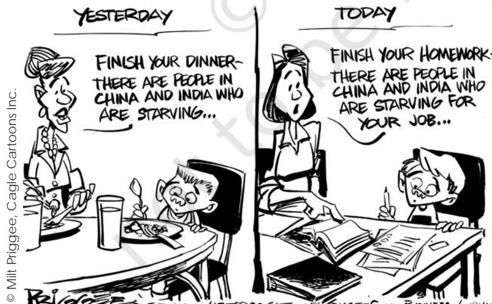
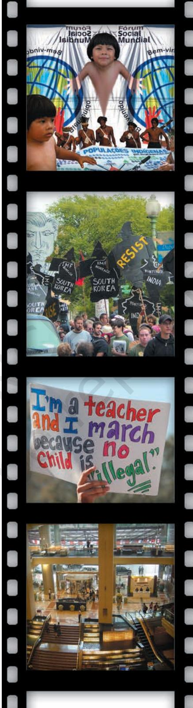
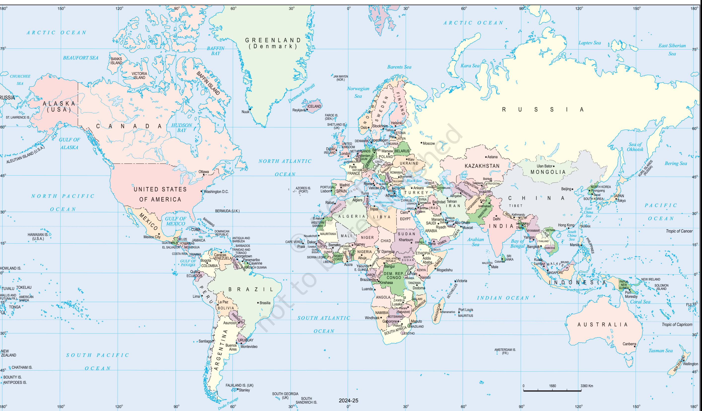
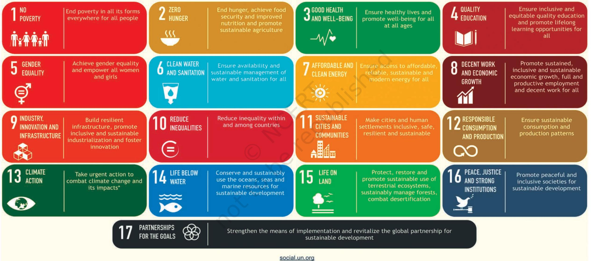

## Overview

In this final chapter of the book we look at globalisation, something that has been referred to in many chapters of this book and textbooks of many other subjects. We begin by analysing the concept of globalisation and then examine its causes. We then discuss at length the political, economic and cultural consequences of globalisation. Our interest is also in studying the impact of globalisation on India as well as how India is affecting globalisation. We finally draw attention to resistance to globalisation and how social movements in India also form part of this resistance.

# Chapter 7 Globalisation

Chapter 7.indd 99 14 September 2022 11:05:00

So many Nepalese workers come to India to work. Is that globalisation?

Go through newspapers for a week and collect clippings on anything related to globalisation.

**Globalisation** Janardhan works in a call centre.

**The Concept of**

He leaves late in the evening for work, becomes John when he enters his office, acquires a new accent and speaks a different language (than he does when he is at home) to communicate with his clients who are living thousands of miles away. He works all night, which is actually day time for his overseas customers. Janardhan is rendering a service to somebody who in all probability he is never likely to meet physically. This is his daily routine. His holidays also do not correspond to the Indian calendar but to those of his clients who happen to be from the US.

Ramdhari has gone shopping to buy a birthday gift for his nine-year old daughter. He has promised her a small cycle and decides to search the market for something he finds affordable as well as of reasonable quality. He finally does buy a cycle, which is actually manufactured in China but is being marketed in India. It meets his requirements of quality as well as affordability, and Ramdhari decides to go ahead with his purchase. Last year, Ramdhari on his daughter's insistence had bought her a Barbie doll, which was originally manufactured in the US but was being sold in India.

Sarika is a first generation learner who has done remarkably well throughout her school and college life by working very hard. She now has an opportunity to take on a job and begin an independent career, which the women of her family had never dreamt of earlier. While some of her relatives are opposed, she finally decides to go ahead because of the new opportunities that have been made available to her generation.

All three examples illustrate an aspect each of what we call globalisation. In the first instance Janardhan was participating in the globalisation of services. Ramdhari's birthday purchases tell us something about the movement of commodities from one part of the world to another. Sarika is faced with a conflict of values partly originating from a new opportunity that earlier was not available to the women in her family but today is part of a reality that has gained wider acceptability.

If we look for examples of the use of the term 'globalisation' in real life, we will realise that it is used in various contexts. Let us look at some examples, different from the ones that we have looked above:

- Some farmers committed suicide because their crops failed. They had bought very expensive seeds supplied by a multinational company (MNC).
- An Indian company bought a major rival company based in Europe, despite protests by some of the current owners.

Chapter 7.indd 100 14 September 2022 11:05:00

- Many retail shopkeepers fear that they would lose their livelihoods if some major international companies open retail chains in the country.
- A film producer in Mumbai was accused of lifting the story of his film from another film made in Hollywood.
- A militant group issued a statement threatening college girls who wear western clothes.

These examples show us that globalisation need not always be positive; it can have negative consequences for the people. Indeed, there are many who believe that globalisation has more negative consequences than positive. These examples also show us that globalisation need not be only about the economic issues, nor is the direction of influence always from the rich to the poor countries.

Since much of the usage tends to be imprecise, it becomes important to clarify what we mean by globalisation. Globalisation as a concept fundamentally deals with flows. These flows could be of various kinds — ideas moving from one part of the world to another, capital shunted between two or more places, commodities being traded across borders, and people moving in search of better livelihoods to different parts of the world. The crucial element is the 'worldwide interconnectedness' that is created and sustained as a consequence of these constant flows.

*This chapter has a series of images a b o u t p o l i t i c a l , e c o n o m i c a n d cultural aspects of globalisation, taken from different parts of the world.*

Much of the Chinese stuff that comes to India is smuggled. Does globalisation lead to smuggling?

Chapter 7.indd 101 14 September 2022 11:05:01

Isn't globalisation a new name for imperialism? Why do we need a new name?

Globalisation is a multidimensional concept. It has political, economic and cultural manifestations, and these must be adequately distinguished. It is wrong to assume that globalisation has purely economic dimensions, just as it would also be mistaken to assume that it is a purely cultural phenomenon. The impact of globalisation is vastly uneven it affects some societies more than others and some parts of some societies more than others — and it is important to avoid drawing general conclusions about the impact of globalisation without paying sufficient attention to specific contexts.

## **Causes of Globalisation**

What accounts for globalisation? If globalisation is about the flows of ideas, capital, commodities, and people, it is perhaps logical to ask

if there is anything novel about this phenomenon. Globalisation in terms of these four flows has taken place through much of human history. However, those who argue that there is something distinct about contemporary globalisation point out that it is the scale and speed of these flows that account for the uniqueness of globalisation in the contemporary era. Globalisation has a strong historical basis, and it is important to view contemporary flows against this backdrop.

While globalisation is not caused by any single factor, technology remains a critical element. There is no doubt that the invention of the telegraph, the telephone, and the microchip in more recent times has revolutionised communication between different parts of the world. When printing initially came into being it laid the basis for the creation of nationalism. So also today we should expect that technology will affect the way we think of our personal but also our collective lives.

The ability of ideas, capital, commodities and people to move more easily from one part of the world to another has been made possible largely by technological advances. The pace of these flows may vary. For instance, the movement of capital and commodities will most likely be quicker and wider than the movement of peoples across different parts of the world.

Globalisation, however, does not emerge merely because of the availability of improved communications. What is important is for people in different parts of the world to recognise these interconnections with the rest of the world. Currently, we are aware of the fact that events taking place in one part of the world could have an impact on another part of the world. The Bird flu or tsunami is not confined to any particular nation. It does not respect national boundaries.

*© Ares, Cagle Cartoons Inc.*

*Digital Economy* 

Chapter 7.indd 102 14 September 2022 11:05:01

Similarly, when major economic events take place, their impact is felt outside their immediate local, national or regional environment at the global level.

#### **Political Consequen ces**

One of the debates that has been generated as a consequence of contemporary processes of globalisation relates to its ongoing political impact. How does globalisation affect traditional conceptions of state sovereignty? There are at least three aspects that we need to consider when answering this question.

At the most simple level, globalisation results in an erosion of state capacity, that is, the ability of government to do what they do. All over the world, the old 'welfare state' is now giving way to a more minimalist state that performs certain core functions such as the maintenance of law and order and the security of its citizens. However, it withdraws from many of its earlier welfare functions directed at economic and social well-being. In place of the welfare state, it is the market that becomes the prime determinant of economic and social priorities. The entry and the increased role of multinational companies all over the world leads to a reduction in the capacity of governments to take decisions on their own.

At the same time, globalisation does not always reduce state capacity. The primacy of the state

Chapter 7.indd 103 14 September 2022 11:05:01

continues to be the unchallenged basis of political community. The old jealousies and rivalries between countries have not ceased to matter in world politics. The state continues to discharge its essential functions (law and order, national security) and consciously withdraws from certain domains from which it wishes to. States continue to be important.

Indeed, in some respects state capacity has received a boost as a consequence of globalisation, with enhanced technologies available at the disposal of the state to collect information about its citizens. With this information, the state is better able to rule, not less able. Thus, states become more powerful than they were earlier as an outcome of the new technology.

## **Economic Consequences**

While everything may not be known about the economic facets of globalisation, this particular dimension shapes a large part of the content and direction of contemporary debates surrounding globalisation.

A part of the problem has to do with defining economic globalisation itself. The mention of economic globalisation draws our attention immediately to the role of international institutions like the IMF and the WTO and the role they play in determining economic policies across the world. Yet, globalisation must not be viewed in such narrow terms. Economic globalisation involves many actors other than these international institutions. A much broader way of understanding of economic globalisation requires us to look at the distribution of economic gains, i.e. who gets the most from globalisation and who gets less, indeed who loses from it.

What is often called economic globalisation usually involves greater economic flows among different countries of the world. Some of this is voluntary and some forced by international institutions and power ful countries. As we saw in the examples at the beginning of this chapter, this flow or exchange can take various forms: commodities, capital, people and ideas. Globalisation has involved greater trade in commodities across the globe; the restrictions imposed by

Chapter 7.indd 104 14 September 2022 11:05:01

different countries on allowing the imports of other countries have been reduced. Similarly, the restrictions on movement of capital across countries have also been reduced. In operational terms, it means that investors in the rich countries can invest their money in countries other than their own, including developing countries, where they might get better returns. Globalisation has also led to the flow of ideas across national boundaries. The spread of internet and computer related services is an example of that. But globalisation has not led to the same degree of increase in the movement of people across the globe. Developed countries have carefully guarded their borders with visa policies to ensure that citizens of other countries cannot take away the jobs of their own citizens.

In thinking about the consequences of globalisation, it is necessary to keep in mind that the same set of policies do not lead to the same results everywhere. While globalisation has led to similar economic policies adopted by governments in different parts of the world, this has generated vastly different outcomes in different parts of the world. It is again crucial to pay attention to specific context rather than make simple generalisations in this connection.

Economic globalisation has created an intense division of opinion all over the world. Those who are concerned about social

When we talk about 'safety net' it means that we expect some people to fall down because of globalisation. Isn't that right?

Chapter 7.indd 105 14 September 2022 11:05:02

Make a list of products of multinational companies (MNCs) that are used by you or your family.

justice are worried about the extent of state withdrawal caused by processes of economic globalisation. They point out that it is likely to benefit only a small section of the population while impoverishing those who were dependent on the government for jobs and welfare (education, health, sanitation, etc.). They have emphasised the need to ensure institutional safeguards or creating 'social safety nets' to minimise the negative effects of globalisation on those who are economically weak. Many movements all over the world feel that safety nets are insufficient or unworkable. They have called for a halt to forced economic globalisation, for its results would lead to economic ruin for the weaker countries, especially for the poor within these countries. Some economists have described economic globalisation as recolonisation of the world.

Advocates of economic globalisation argue that it generates greater economic growth and well-being for larger sections of the population when there is de-regulation. Greater trade among countries allows each economy to do what it does best. This would benefit the whole world. They also argue that economic globalisation is inevitable and it is not wise to resist the march of history. More moderate supporters of globalisation say that globalisation provides a challenge that can be responded to intelligently without accepting it uncritically.

Chapter 7.indd 106 14 September 2022 11:05:02

2024-25

What, however, cannot be denied is the increased momentum towards inter-dependence and integration between governments, businesses, and ordinary people in different parts of the world as a result of globalisation.

## **Cultural Consequences**

The consequences of globalisation are not confined only to the sphere of politics and economy. Globalisation affects us in our home, in what we eat, drink, wear and indeed in what we think. It shapes what we think are our preferences. The cultural effect of globalisation leads to the fear that this process poses a threat to cultures in the world. It does so, because globalisation leads to the rise of a uniform culture or what is called cultural homogenisation. The rise of a uniform culture is not the emergence of a global culture. What we have in the

*Invading new markets*

name of a global culture is the imposition of Western culture on the rest of the world. This phenomenon is known as the soft power of US hegemony. The popularity of a burger or blue jeans, some argue, has a lot to do with the powerful influence of the American way of life. Thus, the culture of the politically and economically dominant society leaves its imprint on a less powerful society, and the world begins to look more like the dominant power wishes it to be. Those who make this argument often draw attention to the 'McDonaldisation' of the world, with cultures seeking to buy into the dominant American dream. This is dangerous not only for the poor countries but for the whole of humanity, for it leads to the shrinking of the rich cultural heritage of the entire globe.

At the same time, it would be a mistake to assume that cultural consequences of globalisation are only negative. Cultures are not static things. All cultures accept outside influences all the time. Some external influences are negative because they reduce our choices. But sometimes external influences simply enlarge our choices, and sometimes they modify our culture without overwhelming the traditional. The burger is no substitute for a *masala dosa* and, therefore, does not pose any real challenge. It is simply added on to our food choices. Blue jeans, on the other hand, can go well with a homespun *khadi kurta*. Here

Why are we scared of Western culture? Are we not confident of our own culture?

Make a list of all the known 'dialects' of your language. Consult people of your grandparents' generation about this. How many people speak those dialects today?

Chapter 7.indd 107 14 September 2022 11:05:02

the outcome of outside influence is a new combination that is unique — a *khadi kurta* worn over jeans. Interestingly, this clothing combination has been exported back to the country that gave us blue jeans so that it is possible to see young Americans wearing a *kurta* and jeans!

While cultural homogenisation is an aspect of globalisation, the same process also generates precisely the opposite effect. It leads to each culture becoming more different and distinctive. This phenomenon is called cultural heterogenisation. This is not to deny that there remain differences in power when cultures interact but instead more fundamentally to suggest that cultural exchange is rarely one way.

#### **'Gosh, an Indian again!'**

#### An insider's view of a call centre job

Working in a call centre, in fact, can be enlightening in its own way. As you handle calls from Americans, you get an insight into the true American culture. An average American comes out as more lively and honest than we imagine…

However, not all calls and conversations are pleasant. You can also receive irate and abusive callers. Sometimes the hatred that they exhibit in their tone on knowing that their call has been routed to India is very stressful. Americans tend to perceive every Indian as one who has denied them their rightful job...

One can receive a call, beginning on the lines of "I spoke to a South African a few minutes ago and now I'm speaking to an Indian!" or "Oh gosh, an Indian again! Connect me to an American please...". It's difficult to find the right response in situations of this kind.

*Source: Report by Ranjeetha Urs in* The Hindu*, 10 January 2005.*

## **India and Globalisation**

We said earlier that globalisation has occurred in earlier periods in history in different parts of the world. Flows pertaining to the movement of capital, commodities, ideas and people go back several centuries in Indian history.

During the colonial period, as a consequence of Britain's imperial ambitions, India became an exporter of primary goods and raw materials and a consumer of finished goods. After independence, because of this experience with the British, we decided to make things ourselves rather than relying on others. We also decided not to allow others to export to us so that our own producers could learn to make things. This 'protectionism' generated its own problems. While some advances were made in certain arenas, critical sectors such as health, housing and primary education did not receive the attention they deserved. India had a fairly sluggish rate of economic growth.

In 1991, responding to a financial crisis and to the desire for higher rates of economic growth, India embarked on a programme of economic reforms that has sought increasingly to de-regulate various sectors including trade and foreign investment. While it may be too early to say how good this has been for India, the ultimate test is not high growth rates as making sure that the benefits of growth are shared so that everyone is better off.

Chapter 7.indd 108 14 September 2022 11:05:02

## **Resistance to Globalisation**

We have already noted that globalisation is a very contentious subject and has invited strong criticism all over the globe. Critics of globalisation make a variety of arguments. Those on the left argue that contemporary globalisation represents a particular phase of global capitalism that makes the rich richer (and fewer) and the poor poorer. Weakening of the state leads to a reduction in the capacity of the state to protect the interest of its poor. Critics of globalisation from the political right express anxiety over the political, economic and cultural effects. In political terms, they also fear the weakening of the state. Economically, they want a return to self-reliance and protectionism, at least in certain areas of the economy. Culturally, they are worried that traditional culture will be harmed and people will lose their age-old values and ways.

It is important to note here that anti-globalisation movements too participate in global networks, allying with those who feel like them in other countries. Many anti-globalisation movements are not opposed to the idea of globalisation *per se* as much as they are opposed to a specific programme of globalisation, which they see as a form of imperialism.

In 1999, at the World Trade Organisation (WTO) Ministerial Meeting there were widespread

It is true sometimes I like the new songs. Didn't we all like to dance a bit? Does it really matter if it is influenced by western music?

Chapter 7.indd 109 14 September 2022 11:05:03

The activity enables students to understand how globalisation has penetrated our lives and the impact the all-inclusive nature of globalisation has on an individual, a community and a nation as a whole.

## **STEPS**

- Students are to list the names of products food products, white goods, and luxuries, they are familiar with.
- Students are to write down their favourite TV programmes.
- The teacher is to collect the list and consolidate.
- Divide the classroom (into convenient groups) and assign each group a number of items (depends on how exhaustive the list is) and TV programmes.
- Let students find out who are the manufacturers of the products they use everyday and the makers/ sponsors of their favourite TV programmes.
- The teacher is to (by involving students) classify the names of manufacturers and makers/sponsors collected by students into three categories: exclusive foreign companies; exclusive Indian companies; and companies working in collaboration.

#### **Ideas for the Teacher**

- The teacher is to debrief the students focussing on: How globalisation has been impacting our lives.
- Drawing the attention of the students to different faces of globalisation. As we use more foreign goods, our own smallscale industries have been losing their customers and are closing down.
- The activity could be concluded by introducing students to the ongoing debates about the impact of globalisation on the developing and developed countries.

Chapter 7.indd 110 14 September 2022 11:05:03

protests at Seattle alleging unfair trading practices by the economically powerful states. It was argued that the interests of the developing world were not given sufficient importance in the evolving global economic system.

The World Social Forum (WSF) is another global platform, which brings together a wide coalition composed of human rights activists, environmentalists, labour, youth and women activists opposed to neo-liberal globalisation. The first WSF meeting was organised in Porto Alegre, Brazil in 2001. The fourth WSF meeting was held in Mumbai in 2004. The latest WSF meeting was held in Nepal in February 2024.

## **India and Resistance to Globalisation**

What has been India's experience in resisting globalisation? Social movements play a role in helping people make sense of the world around them and finding ways to deal with matters that trouble them. Resistance to globalisation in India has come from different quarters. There have been left wing protests to economic liberalisation voiced through political parties as well as through forums like the Indian Social Forum. Trade unions of industrial workforce as well as those representing farmer interests have organised protests against the entry of multinationals. The patenting of certain plants like *Neem* by American and European firms has also generated considerable opposition.

Resistance to globalisation has also come from the political right. This has taken the form of objecting particularly to various cultural influences ranging from the availability of for eign T.V. channels provided by cable networks, celebration of Valentine's Day, and westernisation of the dress tastes of girl students in schools and colleges.

- 1. Which of the statements are TRUE about globalisation?
	- a. Globalisation is purely an economic phenomenon.
	- b. Globalisation began in 1991.
	- c. Globalisation is the same thing as westernisation.
	- d. Globalisation is a multi-dimensional phenomenon.
- 2. Which of the statements are TRUE about the impact of globalisation?
	- a. Globalisation has been uneven in its impact on states and societies.
	- b. Globalisation has had a uniform impact on all states and societies.

**Exercises**

Chapter 7.indd 111 15-03-2024 12:14:14

- c. The impact of globalisation has been confined to the political sphere.
- d. Globalisation inevitably results in cultural homogeneity.
- 3. Which of the statements are TRUE about the causes of globalisation?
	- a. Technology is an important cause of globalisation.
	- b. Globalisation is caused by a particular community of people.
	- c. Globalisation originated in the US.
	- d. Economic interdependence alone causes globalisation.
- 4. Which of the statements are TRUE about globalisation?
	- a. Globalisation is only about movement of commodities
	- b. Globalisation does not involve a conflict of values.
	- c. Services are an insignificant part of globalisation.
	- d. Globalisation is about worldwide interconnectedness.
- 5. Which of the statements are FALSE about globalisation?
	- a. Advocates of globalisation argue that it will result in greater economic growth.
	- b. Critics of globalisation argue that it will result in greater economic disparity.
	- c. Advocates of globalisation argue that it will result in cultural homogenisation.
	- d. Critics of globalisation argue that it will result in cultural homogenisation.
- 6. What is worldwide interconnectedness? What are its components?
- 7. How has technology contributed to globalisation?
- 8. Critically evaluate the impact of the changing role of the state in the developing countries in the light of globalisation.
- 9. What are the economic implications of globalisation? How has globalisation impacted on India with regard to this particular dimension?
- 10. Do you agree with the argument that globalisation leads to cultural heterogeneity?
- 11. How has globalisation impacted on India and how is India in turn impacting on globalisation?

**E x e r c i s e s**

Chapter 7.indd 112 14 September 2022 11:05:03

