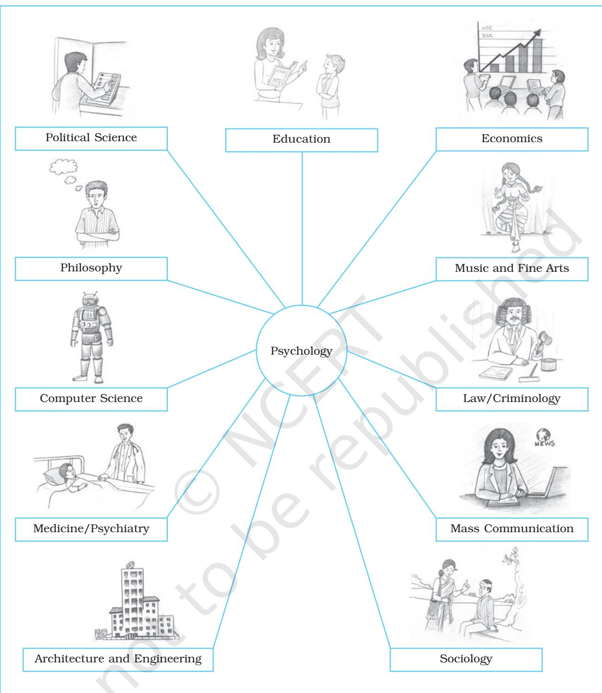

# **What is Psychology?**

#### After reading this chapter, you would be able to

- understand the nature and role of psychology in understanding mind and behaviour,
- state the growth of the discipline,

Chapter1

- know the different fields of psychology, its relationship with other disciplines, and professions, and
- appreciate the value of psychology in daily life to help you understand yourself and others better.

# Contents

#### Introduction

What is Psychology? Psychology as a Discipline Psychology as a Natural Science Psychology as a Social Science

Understanding Mind and Behaviour

Popular Notions about the Discipline of Psychology Evolution of Psychology

> *Some Interesting Landmarks in the Evolution of Modern Psychology* (Box 1.1)

Development of Psychology in India Branches of Psychology Psychology and Other Disciplines Psychology in Everyday Life

*Key Terms Summary Review Questions Project Ideas*

*The growth of the human mind is still high adventure, in many ways the highest adventure on earth.*

– Norman Cousins

# Introduction

*You were, perhaps, asked by your teacher in the first class why you opted for psychology over other subjects. What do you hope to learn? If you were asked this question, what was your response? Generally, the range of responses which surface in class to this question are truly bewildering. Most students give inane responses, like they want to know what others are thinking. But then one also comes across such responses as knowing oneself, knowing others or more specific responses like knowing why people dream, why people go out of their way to help others or beat each other up. All ancient traditions have engaged themselves with questions about human nature. The Indian philosophical traditions, in particular, deal with questions relating to why people behave in the manner in which they do. Why are people generally unhappy? What changes should they bring about in themselves if they desire happiness in their lives? Like all knowledge, psychological knowledge too is intended to contribute to human well-being. If the world is full of misery, it is largely due to humans themselves. Perhaps, you have asked why a 9/11 or war in Iraq happened. Why innocent people in Delhi, Mumbai, Srinagar or in the North-East have to face bombs and bullets? Psychologists ask what is in the experiences of young men which turn them into terrorists seeking revenge. But there is another side to human nature. You may have heard the name of Major HPS Ahluwalia, paralysed waist down because of an injury he suffered in a war with Pakistan, who climbed the Mt. Everest. What moved him to climb such heights? These are not only questions about human nature which psychology addresses as a human science. You will be surprised to learn that modern psychology also deals with somewhat nebulous micro-level phenomenon like consciousness, focusing attention in the face of noise, or supporters trying to burn down a shopping complex after their team had scored victory in a football game over its traditional rival. Psychology cannot claim that answers have been found to these complex questions. But it surely has improved upon our understanding and how we make sense of these phenomena. The most striking aspect of the discipline, unlike other sciences, lies in the study of psychological processes which are largely internal and available to humans for observation within themselves.*

#### **WHAT IS PSYCHOLOGY?**

Any knowledge discipline is hard to define. Firstly, because it evolves continuously. Secondly, because the range of phenomena it studies cannot be captured by any one definition. This is even more true of psychology. Long time back, students like yourself were told that the term psychology is derived from two Greek words *psyche* meaning soul and *logos* meaning science or study of a subject. Thus, psychology was a study of the soul or mind. But since then it has moved away considerably from this focus and established itself as a scientific discipline which deals with processes underlying human experience and behaviour. The range of phenomena it studies, some of which we mentioned above, are spread over several levels, viz. individual, dyadic (two person) group, and organisational. They also have biological as well as social bases. Naturally, therefore, the methods required to

Psychology 2

study them also vary greatly depending on the phenomenon one wants to study. A discipline is defined both in terms of what it studies and how it studies. In fact, more in terms of how or method/s it uses. Keeping this in view, *psychology is defined formally as a science which studies mental processes, experiences and behaviour in different contexts*. In doing so, it uses methods of biological and social sciences to obtain data systematically. It makes sense of these data so that they can be organised as knowledge. Let us try to understand the three terms used in the definition, namely, mental processes, experience, and behaviour.

When we say experiences are internal to the experiencing person, then we refer to states of consciousness or awareness or **mental processes**. We use our mental processes when we think or try to solve a problem, to know or remember something. One level at which these mental processes are reflected is the brain activity. As we think or solve a mathematical problem, our brain activities can be observed using different techniques of brain imaging. However, we cannot say that brain activities and mental processes are the same, although they are interdependent. Mental activities and neural activities are mutually overlapping processes but, they are not identical. Unlike the brain, the mind does not have a physical structure or has a location. Mind emerges and evolves as our interactions and experiences in this world get dynamically organised in the form of a system which is responsible for the occurrence of various mental processes. Brain activities provide important clues as to how our mind functions. But the consciousness of our own experiences and mental processes are much more than the neural or brain activities. Even when we are asleep some mental activities go on. We dream, and receive some information such as a knock on the door while we are asleep. Some psychologists have shown that we also learn and remember in our sleep. Mental processes, such as remembering, learning, knowing, perceiving, feeling are of interest to psychologists. They study these processes to try to understand how the mind works and to help us improve the uses and applications of these mental capacities.

Psychologists also study **experiences** of people. Experiences are subjective in nature. We cannot directly observe or know someone else's experience. Only the experiencing person can be aware or be conscious of her or his experiences. Thus, experiences are embedded in our awareness or consciousness. Psychologists have focused on experiences of pain being experienced by terminally ill patients or of psychological pain felt in bereavement, besides experiences which lead to positive feelings, such as in romantic encounters. There are some esoteric experiences also which attract the attention of psychologists, such as when a Yogi meditates to enter a different level of consciousness and creates a new kind of experience or when a drug addict takes a particular kind of drug to get a high, even though such drugs are extremely harmful. Experiences are influenced by internal and the external conditions of the experiencer. If you are travelling in a crowded bus during a hot summer day, you may not experience the usual discomfort if you are going for a picnic with some close friends. Thus, the nature of experience can only be understood by analysing a complex set of internal and external conditions.

**Behaviours** are responses or reactions we make or activities we engage in. When something is hurled at you, your eyes blink in a simple reflex action. You are taking an examination and can feel your heart pounding. You decide to go for a particular movie with a friend. Behaviours may be simple or complex, short or enduring. Some behaviours are overt. They can be outwardly seen or sensed by an observer. Some are internal or covert. When you are in a difficult situation while playing a game of chess you almost feel your hand muscles twitching, trying to experiment with a move. All behaviours, covert or overt, are associated with or triggered by some stimulus in the environment or changes that happen internally. You may see a tiger and run or think that there is a tiger and decide to flee. Some

psychologists study behaviour as an association between stimulus (S) and response (R). Both stimulus and response can be internal or external.

#### **Psychology as a Discipline**

As we have discussed above, psychology studies behaviour, experience and mental processes. It seeks to understand and explain how the mind works and how different mental processes result in different behaviours. When we observe others as lay or common persons, our own points of view or our ways of understanding the world influence our interpretations of their behaviours and experiences. Psychologists try to minimise such biases in their explanations of behaviour and experience in various ways. Some do so by seeking to make their analysis scientific and objective. Others seek to explain behaviour from the point of view of the experiencing persons because they think that subjectivity is a necessary aspect of human experience. In the Indian tradition, selfreflection and analysis of our conscious experiences, is held to be a major source of psychological understanding. Many western psychologists have also begun to emphasise the role of self-reflection and self-knowledge in understanding human behaviour and experience. Regardless of the differences in the way psychologists go about the study of behaviour, mental processes and experiences, they seek to understand and explain them in a systematic and verifiable manner.

Psychology, though it is a very old knowledge discipline, is a young science, if one were to take the year of the founding of the first laboratory of psychology in 1879 in Leipzig. However, what kind of science is psychology, still remains a matter of debate, particularly because of the new interfaces of it that have emerged in recent times. Psychology is generally categorised as a social science. But it should not come to you as a surprise that, not only in other countries, but in India also, it is also a subject of study offered in the faculty of science, both at the undergraduate and post-graduate levels. Many students go on to earn a B.Sc. or M.Sc. degree in universities. In fact, two of the most sought after emerging disciplines which continuously borrow from psychology are Neuroscience and Computer Science. Some of us would be aware of the fast developing brain imaging techniques like fMRI, EEG, etc. which make it possible to study brain processes in real time, i.e. when they are actually taking place. Similarly, in IT areas, both human-computer interaction and artificial intelligence cannot possibly grow without psychological knowledge in cognitive processes. Thus, psychology as a discipline today has two parallel streams. One which makes use of the method in physical and biological sciences and the other which makes use of the method of social and cultural sciences in studying various psychological and social phenomena. These streams sometimes converge only to drift apart and go their separate ways. In the first case, psychology considers itself as a discipline, which focuses largely on biological principles to explain human behaviour. It assumes that all behavioural phenomena have causes which can be discovered if we can collect data systematically under controlled conditions. Here the aim of the researcher is to know the cause and effect relationship so that a prediction of the behavioural phenomenon can be made and behaviour can be controlled if need be. On the other hand, psychology as a social science focuses on how behavioural phenomena can be explained in terms of the interaction that takes place between the person and the sociocultural context of which s/he is a part. Each behavioural phenomenon is assumed to have multiple causes. Let us now discuss these two streams separately.

#### **Psychology as a Natural Science**

It has been mentioned earlier that psychology has its roots in philosophy. However, modern psychology has developed because of the application of the scientific method to study psychological phenomenon. Science places a great deal of emphasis on objectivity which can be obtained if there is consensus on the definition of a concept and how it can be

Psychology 4

measured. Psychology was influenced by Descartes and later on by the developments in physics has grown by following what is called a hypothetico-deductive model. The model suggests that scientific advancement can take place if you have a theory to explain a phenomenon. For example, physicists have what is called a Big-bang theory to explain how the universe came to be formed. Theory is nothing else but a set of statements about how a certain complex phenomenon can be explained with the help of propositions which are interrelated. Based on a theory, scientists deduce or propose a hypothesis, that offers a tentative explanation of how a certain phenomenon takes place. The hypothesis then is tested and proved true or false based on empirical data that one has gathered. The theory is revised if data gathered point in a different direction than the one suggested by the hypothesis. Using the above approach psychologists have developed theories of learning, memory, attention, perception, motivation and emotion, etc. and have made significant progress. Till date, most of the research in psychology follows this approach. Apart from this, psychologists have also been considerably influenced by the evolutionary approach which is dominant in biological sciences. This approach has also been used to explain diverse kinds of psychological phenomenon such as attachment and aggression to mention just a few.

#### **Psychology as a Social Science**

We mentioned above that psychology is recognised more as a social science because it studies the behaviour of human beings in their socio-cultural contexts. Humans are not only influenced by their socio-cultural contexts, they also create them. Psychology as a social science discipline focuses on humans as social beings. Consider the following story of Ranjita and Shabnam.

*Ranjita and Shabnam were in the same class. Although, they were in the same class, they were just acquainted with each other and their lives were quite different. Ranjita came* *from a farmer's family. Her grandparents, parents and elder brother worked on their farm. They lived together in their house in the village. Ranjita was a good athlete and was the best long distance runner in the school. She loved meeting people and making friends.*

*Unlike her, Shabnam lived with her mother in the same village. Her father worked in an office in a town nearby and came home during holidays. Shabnam was a good artist and loved staying home and taking care of her younger brother. She was shy and avoided meeting people.*

*Last year there was very heavy rain and the river nearby overflowed into the village. Many houses in the low lying areas were flooded. The villagers got together and organised help and gave shelter to people in distress. Shabnam's house was also flooded and she came to live in Ranjita's house with her mother and brother. Ranjita was happy helping the family and making them feel comfortable in her house. When the flood water receded, Ranjita's mother and grandmother helped Shabnam's mother to set-up their house. The two families became very close. Ranjita and Shabnam also became very good friends.*

In this case of Ranjita and Shabnam, both are very different persons. They grew up in different families under complex social and cultural conditions. You can see some regularity in the relationship of their nature, experience and mental processes with their social and physical environment. But at the same time, there are variations in their behaviours and experiences which would be difficult to predict using the known psychological principles. One can understand why and how individuals in communities become quite helpful and self-sacrificing in crisis as was the case with the people in the village of Ranjita and Shabnam. But, even in that case, not every villager was equally helpful and also under similar circumstances not every community is so forthcoming; in fact, sometimes, the opposite is true – people become antisocial under similar circumstances indulging in looting and

exploitation when some crisis occurs. This shows that psychology deals with human behaviour and experience in the context of their society and culture. Thus, psychology is a social science with focus on the individuals and communities in relation to their sociocultural and physical environment.

#### **UNDERSTANDING MIND AND BEHAVIOUR**

You will recall that psychology was once defined as a science of the mind. For many decades, the mind remained a taboo in psychology because it could not be defined in concrete behavioural terms or its location could not be indicated. If the term "mind" has returned to psychology, we should thank neuroscientists like Sperry and physicists like Penrose, who have given it the respect which it deserved and now has. There are scientists in various disciplines including psychology, who think that a unified theory of the mind is a possibility, although it still is far away.

What is mind? Is it the same as brain? It is true that mind cannot exist without brain, but mind is a separate entity. This can be appreciated on account of several interesting cases that have been documented. Some patients whose occipital lobes, which are responsible for vision, were surgically removed have been found to be responding correctly to location and configuration of visual cues. Similarly, an amateur athlete lost his arm in a motorcycle accident but continued to feel an "arm" and also continued to feel its movements. When offered coffee, his "phantom arm" reached out to the coffee cup and when someone pulled it away, he protested. There are other similar cases documented by neuroscientists. A young man who suffered brain injury in an accident, after he returned home from the hospital, claimed that his parents had been replaced by their "duplicates". They were imposters. In each of these cases, the person had suffered from damage of some part of the brain but his "mind" had remained intact. It was earlier believed by scientists that there is no relationship between the mind and the body and that they were parallel to each other. Recent studies in affective neuroscience have clearly shown that there is a relationship between mind and behaviour. It has been shown that using positive visualisation techniques and feeling positive emotions, one can bring about significant changes in bodily processes. Ornish has shown this in a number of studies with his patients. In these studies a person with blocked arteries was made to visualise that blood was flowing through her/ his blocked arteries. After practicing this over a period of time, significant relief was obtained by these patients as the degree of blockage became significantly less. Use of mental imagery, i.e. images generated by a person in her/his mind, have been used to cure various kinds of phobias (irrational fears of objects and situations). A new discipline called Psychoneuroimmunology has emerged which emphasises the role played by the mind in strengthening the immune system.

#### Activity ActivityActivity 1.1

*Imagine and visualise yourself in the following situations. Mention three psychological processes involved in each situation.*

- *1. You are writing an essay for a competition.*
- *2. You are chatting with a friend on an interesting topic.*
- *3. You are playing football.*
- *4. You are watching a soap opera on TV.*
- *5. Your best friend has hurt you.*
- *6. You are appearing in an examination.*
- *7. You are expecting an important visitor.*
- *8. You are preparing a speech to deliver in your school.*
- *9. You are playing chess.*
- *10. You are trying to figure out the answer of a difficult mathematics problem. Discuss your answers with the teacher and*
- *classmates.*

#### **POPULAR NOTIONS ABOUT THE DISCIPLINE OF PSYCHOLOGY**

We mentioned above that everyday, almost everyone of us acts like a psychologist. We

Psychology 6

try to understand why someone behaved in the manner in which s/he did and come up with ready explanations. Not only this, most of us have developed our own theory of human behaviour. If we want some worker to perform better than s/he has in the past, we know that we will need to push her/him. Maybe even use a stick because people are basically lazy. Such popular theories of human behaviour based on common sense may or may not be true if investigated scientifically. In fact, you will find that common sensical explanations of human behaviour are based on hindsight and explain very little. For example, if a friend you love goes away to a distant place, what will happen to your attraction for her/him? There are two sayings which you may recall to answer this question. One of them is "Out of sight, out of mind". The second one is "Distance makes the heart grow fonder". Both of them make opposite statements, so which one is true. The explanation you choose will depend on what happens in your life after your friend leaves. Suppose you are able to find a new friend, the saying "Out of sight, out of mind" will be used by you or others to explain your behaviour. If you are unable to find a new friend, you will keep remembering your friend fondly. In this case, the saying "Distance makes the heart grow fonder" will explain your behaviour. Notice that in both cases the explanation follows the occurrence of behaviour. Common sense is based on hindsight. Psychology as a science looks for patterns of behaviour which can be predicted and not explained after the behaviour occurs.

Scientific knowledge generated by psychology often runs against common sense. One such example is a study performed by Dweck (1975). She was concerned with children who gave up too easily when faced with a difficult problem or failure. She wondered how they could be helped. Common sense tells us to give them easy problems in order to increase their success rate so that their confidence goes up. Only later should we give them difficult problems which they will be able to solve because of their new-found confidence. Dweck's study tested this. She took two groups of students who were trained for 25 days in solving math problems. The first group was given easy problems which they were always able to solve. The second group had a mix of easy and difficult problems. Obviously, in case of difficult problems, they failed. Whenever this happened Dweck told them that their failure was because they had not tried hard enough and persuaded them not to give up and keep trying. After the training period was over, a new set of math problems were given to the two groups. What Dweck found goes against common belief. Those who had always succeeded because they were given easy problems, gave up much faster when they faced failure than those who had experience of both success and failure and were taught to attribute failure to their lack of effort.

There are many other common sense notions which you may not find to be true. Not too long ago it was believed in some cultures that men are more intelligent than women or women cause more accidents than men. Empirical studies have shown that both of these are untrue. Common sense also tells us that one is not able to give one's best if you are asked to perform before a large audience. Psychological studies have shown that if you have practiced well, you may actually perform better because the presence of others helps your performance.

It is hoped that as you go through this textbook you will discover that many of your beliefs and understanding of human behaviour will change. You will also gather that psychologists are different from astrologers, *tantriks* and palm readers because they systematically examine propositions based on data to develop principles about human behaviour and other psychological phenomena.

#### Activity ActivityActivity 1.2

*Ask a cross-section of students about what they think psychology is? Draw a comparison between what they say and what the textbook tells you. What conclusion can you draw?*

#### **EVOLUTION OF PSYCHOLOGY**

Psychology as a modern discipline, which is influenced to a large extent by Western developments, has a short history. It grew out of ancient philosophy concerned with questions of psychological significance. We mentioned earlier that the formal beginning of modern psychology is traced back to 1879 when the first experimental laboratory was established in Leipzig, Germany by Wilhelm Wundt. Wundt was interested in the study of conscious experience and wanted to analyse the constituents or the building blocks of the mind. Psychologists during Wundt's time analysed the structure of the mind through introspection and therefore were called structuralists. **Introspection** was a procedure in which individuals or subjects in psychological experiments were asked to describe in detail, their own mental processes or experiences. However, introspection as a method did not satisfy many other psychologists. It was considered less scientific because the introspective reports could not be verified by outside observers. This led to the development of new perspectives in psychology.

An American psychologist, William James, who had set up a psychological laboratory in Cambridge, Massachusetts soon after the setting up of the Leipzig laboratory, developed what was called a **functionalist** approach to the study of the human mind. William James believed that instead of focusing on the structure of the mind, psychology should instead study what the mind does and how behaviour functions in making people deal with their environment. For example, functionalists focused on how behaviour enabled people to satisfy their needs. According to William James, consciousness as an ongoing stream of mental process interacting with the environment formed the core of psychology. A very influential educational thinker of the time, John Dewey, used functionalism to argue that human beings seek to function effectively by adapting to their environment.

In the early 20th century, a new perspective called **Gestalt psychology** emerged in Germany as a reaction to the **structuralism** of Wundt. It focused on the organisation of perceptual experiences. Instead of looking at the components of the mind, the Gestalt psychologists argued that when we look at the world our perceptual experience is more than the sum of the components of the perception. In other words, what we experience is more than the inputs received from our environment. When, for example, light from a series of flashing bulbs falls on our retina, we actually experience movement of light. When we see a movie, we actually have a series of rapidly moving images of still pictures falling on our retina. Thus, our perceptual experience is more than the elements. Experience is holistic; it is a Gestalt. We will learn more about the Gestalt psychology when we discuss about the nature of perception in Chapter 5.

Yet another reaction to structuralism came in the form of **behaviourism**. Around 1910, John Watson rejected the ideas of mind and consciousness as subject matters of psychology. He was greatly influenced by the work of physiologists like Ivan Pavlov on classical conditioning. For Watson, mind is not observable and introspection is subjective because it cannot be verified by another observer. According to him, scientific psychology must focus on what is observable and verifiable. He defined psychology as a study of behaviour or responses (to stimuli) which can be measured and studied objectively. Behaviourism of Watson was further developed by many influential psychologists who are known as behaviourists. Most prominent among them was Skinner who applied behaviourism to a wide range of situations and popularised the approach. We will discuss Skinner's work later in this textbook.

Although behaviourists dominated the field of psychology for several decades after Watson, a number of other approaches and views about psychology and its subject matter were developing around the same time. One person who shook the world with his radical view of human nature was Sigmund Freud. Freud

Psychology 8

viewed human behaviour as a dynamic manifestation of unconscious desires and conflicts. He founded **psychoanalysis** as a system to understand and cure psychological disorders. While Freudian psychoanalysis viewed human beings as motivated by unconscious desire for gratification of pleasure seeking (and often, sexual) desires, the **humanistic perspective** in psychology took a more positive view of human nature. Humanists, such as Carl Rogers and Abraham Maslow, emphasised the free will of human beings and their natural striving to grow and unfold their inner potential. They argued that behaviourism with its emphasis on behaviour as determined by environmental conditions undermines human freedom and dignity and takes a mechanistic view of human nature.

These different approaches filled the history of modern psychology and provided multiple perspectives to its development. Each of these perspectives has its own focus and draws our attention to the complexity of psychological processes. There are strengths as well as weaknesses in each approach. Some of these approaches have led to further

### Box 1.1 Some Interesting Landmarks in the Evolution of Modern Psychologysychology sychology

- *1879 Wilhelm Wundt establishes the first psychology laboratory in Leipzig, Germany. 1890 William James publishes Principles of Psychology.*
- *1895 Functionalism is formulated as a system of psychology.*
- *1900 Sigmund Freud develops Psychoanalysis.*
- *1904 Ivan Pavlov wins the Nobel Prize for his work on digestive system that led to understanding of principles of development of responses.*
- *1905 Intelligence test developed by Binet and Simon.*
- *1912 Gestalt psychology is born in Germany.*
- *1916 First Psychology Department at Calcutta University is established.*
- *1922 Psychology is included in Indian Science Congress Association.*
- *1924 Indian Psychological Association is founded.*
- *1924 John B. Watson publishes 'Behaviourism', a book that led to the foundation of behaviourism.*
- *1928 N.N. Sengupta and Radhakamal Mukerjee publish the first textbook on Social Psychology (London : Allen & Unwin).*
- *1949 Psychological Research Wing of the Defence Science Organisation of India is established.*
- *1951 Humanistic psychologist Carl Rogers publishes Client-Centred Therapy.*
- *1953 B.F. Skinner publishes 'Science and Human Behaviour', strengthening*

*behaviourism as a major approach to psychology.*

- *1954 Humanistic psychologist Abraham Maslow publishes 'Motivation and Personality'.*
- *1954 Bureau of Psychology is established at Allahabad.*
- *1955 National Institute of Mental Health and Neurosciences (NIMHANS) is established at Bangalore.*
- *1962 Hospital for Mental Diseases in Ranchi is established.*
- *1973 Konrad Lorenz and Niko Tinbergen win the Nobel Prize for their work on built-in speciesspecific animal behaviour patterns that emerge without any prior experience/ learning.*
- *1978 Herbert Simon wins the Nobel Prize for work on decision-making.*
- *1981 David Hubel and Torsten Wiesel win the Nobel Prize for their research on vision cells in the brain.*
- *1981 Roger Sperry wins the Nobel Prize for splitbrain research.*
- *1989 National Academy of Psychology (NAOP) India was founded.*
- *1997 National Brain Research Centre (NBRC) is established at Gurgaon, Haryana.*
- *2002 Daniel Kahneman wins the Nobel Prize for research on human judgment and decisionmaking under uncertainty.*
- *2005 Thomas Schelling wins the Nobel Prize for his work in applying Game Theory to understanding of conflict and cooperation in economic behaviour.*

developments in the discipline. Aspects of Gestalt approach and structuralism were combined and led to the development of the **cognitive perspective** which focuses on how we know about the world. **Cognition** is the process of knowing. It involves thinking, understanding, perceiving, memorising, problem solving and a host of other mental processes by which our knowledge of the world develops, making us able to deal with the environment in specific ways. Some cognitive psychologists view the human mind as an information processing system like the computer. Mind, according to this view is like a computer and it receives, processes, transforms, stores and retrieves information. Modern cognitive psychology views human beings as actively constructing their minds through their exploration into the physical and the social world. This view is sometimes called **constructivism**. Piaget's view of child development which will be discussed later is considered a constructivist theory of development of the mind. Another Russian psychologist Vygotsky went even further to suggest that the human mind develops through social and cultural processes in which the mind is viewed as culturally constructed through joint interaction between adults and children. In other words, while for Piaget children actively construct their own minds, Vygotsky took a view that mind is a joint cultural construction and emerges as a result of interaction between children and adults.

#### **DEVELOPMENT OF PSYCHOLOGY IN INDIA**

The Indian philosophical tradition is rich in its focus on mental processes and reflections on human consciousness, self, mind-body relations, and a variety of mental functions such as cognition, perception, illusion, attention and reasoning, etc. Unfortunately, philosophical roots in the Indian tradition have not influenced the development of modern psychology in India. The development of the discipline in India continues to be dominated by western psychology, although some attempts have been made to find points of departure both within the country and abroad. These attempts have tried to establish the truth value of various assertions in Indian philosophical traditions through scientific studies.

The modern era of Indian psychology began in the Department of Philosophy at Calcutta University where the first syllabus of experimental psychology was introduced and the first psychology laboratory was established in 1915. Calcutta University started the first Department of Psychology in the year 1916 and another Department of Applied Psychology in 1938. The beginning of modern experimental psychology at Calcutta University was greatly influenced by the Indian psychologist Dr. N.N. Sengupta who was trained in USA in the experimental tradition of Wundt. Professor G. Bose was trained in Freudian psychoanalysis, another area which influenced the early development of psychology in India. Professor Bose established Indian Psychoanalytical Association in 1922. Departments of Psychology in the Universities of Mysore and Patna were other early centres of teaching and research in psychology. From these modest beginnings, modern psychology has grown as a strong discipline in India with a large number of centres of teaching, research and applications. There are two centers of excellence in psychology supported by the UGC at Utkal University, Bhubaneswar and at the University of Allahabad. About 70 universities offer courses in psychology.

Durganand Sinha in his book *Psychology in a Third World Country: The Indian Experience* published in 1986 traces the history of modern psychology as a social science in India in four phases. According to him, the first phase till independence was a phase with emphasis on experimental, psychoanalytic and psychological testing research, which primarily reflected the development of the discipline in western countries. The second phase till the 1960s was a phase of expansion of psychology in India into different branches of psychology. During this phase Indian psychologists showed a

Psychology 10

desire to have an Indian identity by seeking to link western psychology to the Indian context. They did this by using western ideas to understand the Indian situation. However, psychology in India sought to become relevant for Indian society in the post 1960s phase of problem-oriented research. Psychologists became more focused on addressing the problems of the Indian society. Further, the limitations of excessive dependence on western psychology for our social context were also realised. Leading psychologists emphasised the significance of research, which is of relevance to our situation. The search for a new identity of psychology in India led to the phase of indigenisation, which started during the late 1970s. Besides rejecting the western framework, Indian psychologists stressed the need for developing an understanding based on a framework, which was culturally and socially relevant. This trend was also reflected in some attempts to develop psychological approaches based on traditional Indian psychology, which came from our ancient texts and scriptures. Thus, this phase is characterised by development in indigenous psychology, which originated from the Indian cultural context and was relevant for society and Indian psychology based on the Indian traditional knowledge system. While these developments continue, psychology in India is making significant contributions to the field of psychology in the world. It has become more contextual emphasising the need for developing psychological principles, which are rooted in our own social and cultural context. Alongside, we also find that new research studies involving interfaces with neurobiological and health sciences are being carried out.

Psychology in India is now being applied in diverse professional areas. Not only have psychologists been working with children having special problems, they are employed in hospitals as clinical psychologists, in corporate organisations in the HRD and advertising departments, in sports directorates, in the development sector and in IT industry.

#### **BRANCHES OF PSYCHOLOGY**

Various fields of specialisation in psychology have emerged over the years. Some of these are discussed in this section.

**Cognitive Psychology** investigates mental processes involved in acquisition, storage, manipulation, and transformation of information received from the environment along with its use and communication. The major cognitive processes are attention, perception, memory, reasoning, problem solving, decision-making and language. You will be studying these topics later in this textbook. In order to study these cognitive processes, psychologists conduct experiments in laboratory settings. Some of them also follow an ecological approach, i.e. an approach which focuses on the environmental factors, to study cognitive processes in a natural setting. Cognitive psychologists often collaborate with neuroscientists and computer scientists.

**Biological Psychology** focuses on the relationship between behaviour and the physical system, including the brain and the rest of the nervous system, the immune system, and genetics. Biological psychologists often collaborate with neuroscientists, zoologists, and anthropologists. **Neuropsychology** has emerged as a field of research where psychologists and neuroscientists are working together. Researchers are studying the role of neurotransmitters or chemical substances which are responsible for neural communication in different areas of the brain and therefore in associated mental functions. They do their research on people with normal functioning brain as well as on people with damaged brain by following advanced technologies like EEG, PET and fMRI, etc. about which you will study later.

**Developmental Psychology** studies the physical, social and psychological changes that occur at different ages and stages over a life-span, from conception to old age. The primary concern of developmental

psychologists is how we become what we are. For many years the major emphasis was on child and adolescent development. However today an increasing number of developmental psychologists show strong interest in adult development and ageing. They focus on the biological, socio-cultural and environmental factors that influence psychological characteristics such as intelligence, cognition, emotion, temperament, morality, and social relationship. Developmental psychologists collaborate with anthropologists, educationists, neurologists, social workers, counsellors and almost every branch of knowledge where there is a concern for growth and development of a human being.

**Social Psychology** explores how people are affected by their social environments, how people think about and influence others. Social psychologists are interested in such topics as attitudes, conformity and obedience to authority, interpersonal attraction, helpful behaviour, prejudice, aggression, social motivation, inter-group relations and so on.

**Cross-cultural and Cultural Psychology** examines the role of culture in understanding behaviour, thought, and emotion. It assumes that human behaviour is not only a reflection of human-biological potential but also a product of culture. Therefore behaviour should be studied in its socio-cultural context. As you will be studying in different chapters of this book, culture influences human behaviour in many ways and in varying degrees.

**Environmental Psychology** studies the interaction of physical factors such as temperature, humidity, pollution, and natural disasters on human behaviour. The influence of physical arrangement of the workplace on health, the emotional state, and interpersonal relations are also investigated. Current topics of research in this field are the extent to which, disposal of waste, population explosion, conservation of energy, efficient use of community resources are associated with and are functions of human behaviour.

**Health Psychology** focuses on the role of psychological factors (for example, stress, anxiety) in the development, prevention and treatment of illness. Areas of interest for a health psychologist are stress and coping, the relationship between psychological factors and health, patient-doctor relationship and ways of promoting health enhancing factors.

**Clinical and Counselling Psychology** deals with causes, treatment and prevention of different types of psychological disorders such as anxiety, depression, eating disorders and chronic substance abuse. A related area is counselling, which aims to improve everyday functioning by helping people solve problems in daily living and cope more effectively with challenging situations. The work of clinical psychologists does not differ from that of counselling psychologists although a counselling psychologist sometimes deals with people who have less serious problems. In many instances, counselling psychologists work with students, advising them about personal problems and career planning. Like clinical psychologists, psychiatrists also study the causes, treatment, and prevention of psychological disorders. How are clinical psychologists and psychiatrists different? A clinical psychologist has a degree in psychology, which includes intensive training in treating people with psychological disorders. In contrast, a psychiatrist has a medical degree with years of specialised training in the treatment of psychological disorders. One important distinction is that psychiatrists can prescribe medications and give electroshock treatments whereas clinical psychologist cannot.

**Industrial/Organisational Psychology** deals with workplace behaviour, focusing on both the workers and the organisations that employ them. Industrial/organisational psychologists are concerned with training employees, improving work conditions, and developing criteria for selecting employees. For example, an organisational psychologist might recommend that a company may adopt a new management structure that would increase

Psychology 12

communication between managers and staff. The background of industrial and organisational psychologists often includes training in cognitive and social psychology.

**Educational Psychology** studies how people of all ages learn. Educational psychologists primarily help develop instructional methods and materials used to train people in both educational and work settings. They are also concerned with research on issues of relevance for education, counselling and learning problems. A related field, **school psychology**, focuses on designing programmes that promote intellectual, social, and emotional development of children, including those with special needs. They try to apply knowledge of psychology in a school setting.

**Sports Psychology** applies psychological principles to improve sports performance by enhancing their motivation. Sports psychology is a relatively new field but is gaining acceptance worldwide.

**Other Emerging Branches of Psychology** : The interdisciplinary focus on research and application of psychology has led to the emergence of varied areas like aviation psychology, space psychology, military

#### Activity ActivityActivity 1.3

*Think about the areas of psychology that you have read in the text. Go through the list given below and rank them from 1 (most interesting) to 11 (least interesting).*

*Cognitive psychology Biological psychology Developmental psychology Social psychology Cross-cultural and cultural psychology Environmental psychology Health psychology Clinical and counselling psychology Industrial/Organisational psychology Educational psychology Sports psychology*

*After going through this textbook and completing the course you may like to return to this activity and mark the changes in your ranking.*

psychology, forensic psychology, rural psychology, engineering psychology, managerial psychology, community psychology, psychology of women, and political psychology, to name a few. Try the Activity 1.3 to reflect upon your interest areas in psychology.

#### **PSYCHOLOGY AND OTHER DISCIPLINES**

Any discipline, which deals with people, would definitely recognise the relevance of the knowledge of psychology. Similarly psychologists also acknowledge the relevance of other disciplines in understanding human behaviour. This trend has led to the emergence of interdisciplinary approach in the field of psychology. Researchers and scholars in science, social science and humanities have felt the significance of psychology as a discipline. Figure 1.1 clearly shows the relationship of psychology with other disciplines. In studying brain and behaviour, psychology shares its knowledge with neurology, physiology, biology, medicine and computer science. In studying human behaviour (its meaning, growth and development) in a socio-cultural context, psychology shares its knowledge with anthropology, sociology, social work, political science and economics. In studying mental activities involved in creation of literary texts, music and drama, psychology shares its knowledge with literature, art and music. Some of the major disciplines linked to the field of psychology are discussed below:

**Philosophy** : Until the end of the 19th century, certain concerns that are now part of contemporary psychology like, what is the nature of the mind or how do humans come to know their motivations and emotions were the concerns of philosophers. In the later part of the 19th century, Wundt and other psychologists adopted an experimental approach to these questions and contemporary psychology emerged. Despite the emergence of psychology as a science, it greatly draws from philosophy, particularly with respect to methods of knowing, and various domains of human nature.

**Medicine** : Doctors have realised that the maxim, healthy body requires a healthy mind, is actually true. A large number of hospitals now employ psychologists. The role of psychologists in preventing people from engaging in health hazardous behaviours and in adhering to the prescribed doctors' regimen are some of the important areas where the two disciplines have come together. While treating patients suffering from cancer, AIDS, and the physically challenged, or handling patients in the Intensive Care Unit, and patients during post operative care doctors have also felt the need for psychological counselling. A successful doctor looks at the psychological as well as physical well-being of the patients.

**Economics, Political Science and Sociology** : As sister social science disciplines, these three have drawn considerably from psychology and have enriched it as well. Psychology has contributed a great deal to the study of micro-level economic behaviour, particularly in understanding consumer behaviour, savings behaviour and in decisionmaking. American economists have used data on consumer sentiments to predict economic growth. Three scholars who have worked on such problems have received the Nobel Prize in Economics, namely H. Simon, D. Kahneman and T. Schelling. Like economics, political science too draws considerably from psychology, particularly, in understanding issues related to exercise of power and authority, nature of political conflicts and their resolutions, and voting behaviour. Sociology and psychology come together to explain and understand the behaviour of individuals within different socio-cultural contexts. Issues related to socialisation, group and collective behaviour, and intergroup conflicts gain from both these disciplines.

**Computer Science** : From the very beginning, the effort of computer science has been in mimicking the human mind. One can see it in terms of how a 'computer' is structured, its memory organised, sequential and simultaneous (read parallel) processing of information. Computer scientists and engineers are seeking to make computers not only more and more intelligent but also machines which can sense and feel. Developments in both these disciplines have brought about significant advancement in the field of cognitive sciences.

**Law and Criminology** : A skilled lawyer and a criminologist requires knowledge of psychology in answering such questions as: How well a witness remembers an accident, a street fight, or a murder? How well can s/he report such facts when taking the witness stand in the court? What factors influence the decision which is taken by the jury? What are the dependable signs of guilt and falsehood? What factors are held important in holding a culprit responsible for her/his action? What degree of punishment is considered just for a criminal act? Psychologists seek to answer these questions. Currently, a number of psychologists are involved in research on such issues, the answers to which would help the legal system of the country in the future.

**Mass Communication** : The print and the electronic media have entered in our lives in a very big way. They have a major influence on our thinking, attitudes and our emotions. If they have brought us closer together, they have also reduced cultural diversities. The impact of media on the formation of attitudes of children and their behaviour is a domain where both these disciplines come together. Psychology also helps in developing strategies for better and effective communication. A journalist in reporting news must know the reader's interests in the story. Since most stories deal with human events, knowledge of their motives and emotions is very important. A story will have more impact if it is based on a background of psychological knowledge and insight.

*Fig.1.1 : Psychology and Other Disciplines*

**Music and Fine Arts** : Music and psychology have converged in many areas. Scientists have made use of music in raising work performance. Music and emotions is another area in which a number of studies have been carried out. Musicians in India have recently started experimenting with what they call 'Music Therapy'. In this they use different *'Ragas'* for curing certain physical ailments. The efficacy of music therapy still remains to be proven.

**Architecture and Engineering** : At first glance the relationship between psychology and architecture and engineering would appear improbable. But such is actually not the case. Ask any architect, s/he must satisfy her/his clients by providing mental and physical space through her design and satisfy aesthetically. Engineers must also take into account human habits in their plans for safety, for example, on streets and highways. Psychological knowledge helps in a big way in designing of all mechanical devices and displays.

To sum up, psychology is located at the intersection of many fields of knowledge pertaining to human functioning.

#### **PSYCHOLOGY IN EVERYDAY LIFE**

The discussion above may have clarified that psychology is not only a subject that satisfies some of the curiosities of our mind about human nature, but it is also a subject that can offer solutions to a variety of problems. These may range from purely personal (for example, a daughter having to face an alcoholic father or a mother dealing with a problem child) to those that may be rooted within the family set up (for example, lack of communication and interaction among family members) or in a larger group or community setting (for example, terrorist groups or socially isolated communities) or may have national or international dimensions. Problems related to education, health, environment, social justice, women development, intergroup relations, etc. are pervasive. While the solution of these problems may involve political, economic and

social reforms, interventions at the individual levels are also needed in order to change. Many of these problems are largely of psychological nature and they result from our unhealthy thinking, negative attitude towards people and self and undesirable patterns of behaviour. A psychological analysis of these problems helps both in having a deeper understanding of these problems and also in finding their effective solutions.

The potential of psychology in solving the problems of life is being realised more and more. Media has played a vital role in this respect. You may have seen on television counsellors and therapists suggesting solutions to a variety of problems related to children, adolescents, adults and the elderly people. You may also find them analysing vital social problems relating to social change and development, population, poverty, interpersonal or intergroup violence, and environmental degradation. Many psychologists now play an active role in designing and executing intervention programmes in order to provide people with a better quality of life. Hence, it is no surprise that we find psychologists working in diverse settings such as schools, hospitals, industries, prisons, business organisations, military establishments, and in private practice as consultants helping people solve problems in their respective settings.

Besides helping you in rendering social service to others, the knowledge of psychology is also personally relevant to you in your dayto-day life. The principles and methods of psychology that you will learn in this course should be made use of in analysing and understanding yourself in relation to others. It is not that we do not think about ourselves. But very often, some of us think very highly of ourselves and any feedback that contradicts our opinion about ourselves is rejected because we engage in what is called a defensive behaviour. In some other cases, persons come to acquire a habit of running down themselves. Both conditions do not permit us to grow. We need to have a positive and balanced understanding of ourselves. You

Psychology 16

may use psychological principles in a positive manner to develop good habits of study for improving your learning and memory, and for solving your personal and interpersonal problems by using appropriate decisionmaking strategies. You will also find it of use to reduce or alleviate the stress of examination. Thus, the knowledge of psychology is quite useful in our everyday life, and is rewarding from personal as well as social points of view.

## Key Terms

*Behaviour, Behaviourism, Cognition, Cognitive approach, Consciousness, Constructivism, Developmental psychology, Functionalism, Gestalt, Gestalt psychology, Humanistic approach, Introspection, Mind, Neuropsychology, Physiological psychology, Psychoanalysis, Sociology, Stimulus, Structuralism*

# Summary

- *Psychology is a modern discipline aimed at understanding the complexities of mental processes, experiences and behaviour of individuals in different contexts. It is treated as a natural as well as a social science.*
- *The major schools of psychological thought are structuralism, functionalism, behaviourism, Gestalt school, psychoanalysis, humanistic psychology and cognitive psychology.*
- *Contemporary psychology is multivocal as it is characterised by many approaches or diverse views, which explain behaviour at different levels. These approaches are not mutually exclusive. Each provides valuable insights into the complexities of human functioning. The cognitive approach uses thought processes as central to psychological functions. The humanistic approach views human functioning as characterised by a desire to grow, be productive and fulfill human potential.*
- *Today psychologists work in many specialised fields which have their own theories and methods. They make efforts to develop theories and solve problems in specific domains. Some of the major fields of psychology are: cognitive psychology, biological psychology, health psychology, developmental psychology, social psychology, educational and school psychology, clinical and counselling psychology, environmental psychology, industrial/ organisational psychology, sports psychology.*
- *More recently a need is felt to have multi/interdisciplinary initiatives to arrive at a better understanding of reality. This has led to a collaboration across disciplines. Interests of psychology overlap with social sciences (e.g., economics, political science, sociology), biosciences (e.g., neurology, physiology, medicine), mass communication, and music and fine arts. Such efforts have led to fruitful research and application.*
- *Psychology is a discipline not merely contributing to the development of theoretical knowledge about human behaviour, but contributing to the solution of problems at different levels. Psychologists are employed to help in diverse activities in a variety of settings including schools, hospitals, industries, training institutes, military and government establishments. Many of them are doing private practice and are consultants.*

#### Review Questions

- 1. What is behaviour? Give examples of overt and covert behaviour.
- 2. How can you distinguish scientific psychology from the popular notions about the discipline of psychology?
- 3. Give a brief account of the evolution of psychology.

Chapter 1 • *What is Psychology?* 17

- 4. What are the problems for which collaboration of psychologists with other disciplines can be fruitful? Take any two problems to explain.
- 5. Differentiate between (a) a psychologist and a psychiatrist (b) a counsellor and a clinical psychologist.
- 6. Describe some of the areas of everyday life where understanding of psychology can be put to practice.
- 7. How can knowledge of the field of environmental psychology be used to promote environment friendly behaviour?
- 8. In terms of helping solve an important social problem such as crime, which branch of psychology do you think is most suitable. Identify the field and discuss the concerns of the psychologists working in this field.

### Project Ideas

- 1. This chapter tells you about several professionals in the field of psychology. Contact a psychologist who fits into one of the categories and interview the person. Have a list of questions prepared beforehand. Possible questions could be: (i) What kind of education is necessary for your particular job? (ii) Which college/university would you recommend for the study of this discipline? (iii) Are there many jobs available today in your area of work? (iv) What would a typical day at work be like for you – or is there no such thing as "typical"? (v) What motivated you to enter this line of work?
	- Write a report of your interview and include your specific reactions.
- 2. Go to the library or some bookstore or surf the internet and obtain names of some books (fiction/non-fiction or films), which have reference to applications of psychology. Prepare a report giving a brief synopsis.

