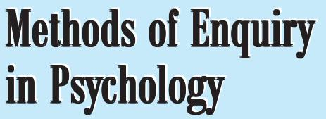
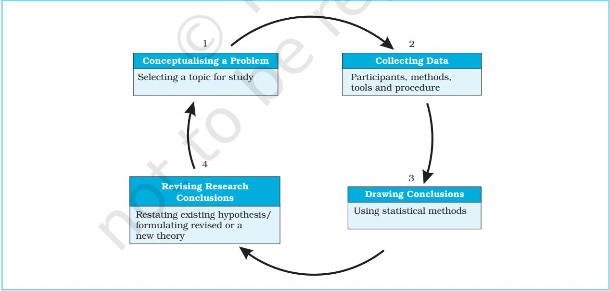

Chapter2

### After reading this chapter, you would be able to

- explain the goals and nature of psychological enquiry,
- understand different types of data used by psychologists,
- describe some important methods of psychological enquiry,
- understand the methods of analysing data, and
- learn about the limitations of psychological enquiry and ethical considerations.

# Contents

**Introduction Goals of Psychological Enquiry** Steps in Conducting Scientific Research Alternative Paradigms of Research **Nature of Psychological Data Some Important Methods in Psychology** Observational Method *Example of an Experiment* (Box 2.1) Experimental Method Correlational Research Survey Research *Example of Survey Method* (Box 2.2) Psychological Testing Case Study **Analysis of Data** Quantitative Method Qualitative Method **Limitations of Psychological Enquiry Ethical Issues**

**Key Terms Summary Review Questions Project Ideas**

Chapter 2 • *Methods of Enquiry in Psychology* 19

*An idea that is developed and put into action is more important than an idea that exists only as an idea.*

– Gautam Buddha

# Introduction

*You have read in the first chapter that psychology is the study of experiences, behaviours, and mental processes. You may now be curious to know how psychologists study these phenomena. In other words, what methods are used to study behaviour and mental processes? Like all scientists, psychologists seek to describe, predict, explain and control what they study. For this, psychologists rely on formal, systematic observations to address their questions. It is the methodology that makes psychology a scientific endeavour. Psychologists use a variety of research methods because questions about human behaviour are numerous and all of them cannot be studied by a single method. Methods such as observation, experimental, correlational research, survey, psychological testing and case study are more frequently used to study the problems of psychology. This chapter will familiarise you with the goals of psychological enquiry, the nature of information or data that we collect in psychological studies, the diverse range of methodological devices available for the study of psychology, and some important issues related to psychological studies.*

### **GOALS OF PSYCHOLOGICAL ENQUIRY**

Like any scientific research, psychological enquiry has the following goals: **description**, **prediction**, **explanation**, and **control** of behaviour, and **application** of knowledge so generated, in an objective manner. Let us try to understand the meaning of these terms.

*Description* : In a psychological study, we attempt to describe a behaviour or a phenomenon as accurately as possible. This helps in distinguishing a particular behaviour from other behaviours. For example, the researcher may be interested in observing study habits among students. Study habits may consist of diverse range of behaviours, such as attending all your classes regularly, submitting assignments on time, planning your study schedule, studying according to the set schedule, revising your work on a daily basis etc. Within a particular category there may be further minute descriptions. The researcher needs to describe her/his meaning of study habits. The description requires recording of a particular behaviour which helps in its proper understanding.

*Prediction* : The second goal of scientific enquiry is prediction of behaviour. If you are able to understand and describe the behaviour accurately, you come to know the relationship of a particular behaviour with other types of behaviours, events, or phenomena. You can then forecast that under certain conditions this particular behaviour may occur within a certain margin of error. For example, on the basis of study, a researcher is able to establish a positive relationship between the amount of study time and achievement in different subjects. Later, if you come to know that a particular child devotes more time for study, you can predict that the child is likely to get good marks in the examination. Prediction becomes more accurate with the increase in the number of persons observed.

*Explanation* : The third goal of psychological enquiry is to know the causal factors or determinants of behaviour. Psychologists are primarily interested in knowing the factors that make behaviour occur. Also, what are the conditions under which a particular behaviour does not occur. For example, what makes some children more attentive in the class? Why

Psychology 20

some children devote less time for study as compared to others? Thus, this goal is concerned with identifying the determinants or antecedent conditions (i.e. conditions that led to the particular behaviour) of the behaviour being studied so that cause-effect relationship between two variables (objects) or events could be established.

*Control* : If you are able to explain why a particular behaviour occurs, you can control that behaviour by making changes in its antecedent conditions. Control refers to three things: making a particular behaviour happen, reducing it, or enhancing it. For example, you can allow the number of hours devoted to study to be the same, or you can reduce them or there may be an increase in the study hours. The change brought about in behaviour by psychological treatment in terms of therapy in persons, is a good example of control.

*Application* : The final goal of the scientific enquiry is to bring out positive changes in the lives of people. Psychological research is conducted to solve problems in various settings. Because of these efforts the quality of life of people is a major concern of psychologists. For example, applications of yoga and meditation help to reduce stress and increase efficiency. Scientific enquiry is also conducted to develop new theories or constructs, which leads to further research.

#### **Steps in Conducting Scientific Research**

Science is not so defined by *what* it investigates as by *how* it investigates. The scientific method attempts to study a particular event or phenomenon in an objective, systematic, and testable manner. The **objectivity** refers to the fact that if two or more persons independently study a particular event, both of them, to a great extent, should arrive at the same conclusion. For instance, if you and your friend measure the length of a table using the same measuring device, it is likely that both of you would arrive at the same conclusion about its length.

The second characteristic of scientific research is that it follows **systematic** procedure or steps of investigation. It includes the following steps: *conceptualisation of a problem, collection of data, drawing conclusions, and revising research conclusions and theory* (see Fig.2.1). Let us discuss these steps in some detail.

(1) *Conceptualising a Problem* : The process of scientific research begins when a researcher

*Fig.2.1 : Steps in Conducting Scientific Enquiry*

Chapter 2 • *Methods of Enquiry in Psychology* 21

selects a theme or topic for study. Then s/he narrows down the focus and develops specific research questions or problems for the study. This is done on the basis of review of past research, observations, and personal experiences. For example, earlier you read that a researcher was interested in observing the study habits of students. For this purpose, s/he may identify different facets of study habits first, and then decide whether s/he is interested in study habits shown in the class or at home.

In psychology we study a diverse range of problems related to behaviour and experiences. These problems may be related to (a) understanding our own behaviour (for example, how do I feel and behave when I am in a state of joy or grief? How do we reflect on our own experiences and behaviour? Why do we forget?); (b) understanding other individual's behaviour (for example, Is Abhinav more intelligent than Ankur? Why is someone always not able to complete her or his work on time? Can the habit of smoking be controlled? Why do some people suffering from chronic illness not take medicines?); (c) group influences on individual behaviour (for example, why does Rahim spend more time meeting with people than doing his work?, Why does a cyclist perform better when cycling before a group of persons than when cycling alone?); (d) group behaviour (for example, why does risk-taking behaviour increase when people are in a group?), and (e) organisational level (for example, why are some organisations more successful than others? How can an employer increase the motivation of employees?). The list is long and you will learn about these various facets in subsequent chapters. If you are inquisitive, you can write down a number of problems which you may like to probe.

After identification of the problem, the researcher proceeds by developing a tentative answer of the problem, which is called **hypothesis**. For example, based on the earlier evidence or your observation, you might develop a hypothesis 'greater is the amount of time spent by children in viewing violence

on television, higher is the degree of aggression displayed by them'. In your research, you shall now try to prove whether the statement is true or false.

(2) *Collecting Data* : The second step in scientific research is to collect data. Data collection requires developing a research design or a blueprint of the entire study. It requires taking decisions about the following four aspects: (a) participants in the study, (b) methods of data collection, (c) tools to be used in research, and (d) procedure for data collection. Depending upon the nature of the study, the researcher has to decide who would be the participants (or informants) in the study. The participants could be children, adolescents, college students, teachers, managers, clinical patients, industrial workers, or any group of individuals in whom/ where the phenomenon under investigation is prevalent. The second decision is related to the use of methods of data collection, such as observation method, experimental method, correlational method, case study, etc. The researcher needs to decide about appropriate tools (for example, interview schedule, observation schedule, questionnaire, etc.) for data collection. The researcher also decides about how the tools need to be administered to collect data (i.e. individual or group). This is followed by actual collection of data.

(3) *Drawing Conclusions* : The next step is to analyse data so collected through the use of statistical procedures to understand what the data mean. This can be achieved through graphical representations (such as preparation of pie-chart, bar -diagram, cumulative frequencies, etc.) and by the use of different statistical methods. The purpose of analysis is to verify a hypothesis and draw conclusions accordingly.

(4) *Revising Research Conclusions* : The researcher may have begun the study with a hypothesis that there exists a relationship between viewing violence on television and aggression among children. S/he has to see whether the conclusions support this

Psychology 22

hypothesis. If they do, the existing hypothesis/ theory is confirmed. If not, s/he will revise or state an alternative hypothesis/theory and again test it based on new data and draw conclusions which may be verified by future researchers. Thus, research is a continuous process.

### **Alternative Paradigms of Research**

Psychologists suggest that human behaviour can and should be studied following the methods adopted by sciences like physics, chemistry, and biology. The key assumption of this view is that human behaviour is predictable, caused by internal and external forces, and can be observed, measured, and controlled. In order to achieve these goals, the discipline of psychology, for larger part of the twentieth century, restricted itself to the study of overt behaviour, i.e. the behaviour that could be observed and measured. It did not focus on personal feelings, experiences, meanings, etc.

In recent years, a different method known as *interpretive* has emerged. It emphasises understanding over explanation and prediction. It takes the stand that, in view of complex and variable nature of human behaviour and experience, its method of investigation should be different from the method of investigation of the physical world. This viewpoint emphasises the importance of how human beings give meaning to events and actions and interpret them as they occur in a particular context. Let us take the experiences that may occur in some unique contexts, such as persons experiencing suffering due to external factors (for example, people affected by tsunami, earthquake, cyclone) or internal factors (for instance, prolonged illness, etc.). In such types of situations, objective measurement is neither possible nor desirable. Everyone interprets reality in her/his own way based on past experiences and contexts. Therefore, we need to understand the subjective interpretation of the reality. The goal here is to explore the different aspects of human experiences and behaviour without

attempting to disturb its natural flow. For example, an explorer does not know what s/ he is looking for, how to look for it, and what to expect. Rather, s/he tries to map an uncharted wilderness, with little or no prior knowledge of the area, and her/his main task is to record detailed descriptions of what is found in a particular context.

Both scientific and interpretive traditions are concerned with studying behaviour and experiences of others. What about our own personal experiences and behaviour? As a student of psychology, you may ask yourself the question: why am I feeling sad? Many times you take a pledge that you will control your diet or devote more time to studies. But when it actually comes to eating or studying you forget this. You might be wondering why one does not have control over one's behaviour. Should psychology not help you in analysing your own experiences, thought processes, and behaviour? It certainly should. The psychological enquiry does aim at understanding the self by reflecting on one's own experiences and insights.

#### **NATURE OF PSYCHOLOGICAL DATA**

You may want to consider how psychological data are different as compared to other sciences. Psychologists collect a variety of information from different sources employing diverse methods. The information, also called **data** (singular = *datum*), relate to the individuals' covert or overt behaviour, their subjective experiences, and mental processes. Data form an important input in psychological enquiry. They in fact approximate the reality to some extent and provide an opportunity to verify or falsify our ideas, hunches, notions, etc. It should be understood that data are not independent entities. They are located in a context, and are tied to the method and theory that govern the process of data collection. In other words, data are not independent of the physical or social context, the persons involved, and the time when the behaviour occurs. We behave differently when alone than in a group, or at home and in office. You may

hesitate to talk in front of your parents and teachers but not when you are with friends. You may have also noticed that not all people behave in exactly the same manner in the same situation. The method of data collection (survey, interview, experiment, etc.) used and the characteristics of respondents (such as, individual or group, young or old, male or female, rural or urban, etc.) also influence the nature and quality of data. It is possible that when you interview a student, s/he may report behaving in a particular manner in a given situation. But when you go for actual observation you may find just the opposite of what s/he had reported. Another important feature of data is that it does not in itself speak about reality. Inferences have to be made from data. A researcher attaches meaning to the data by placing it in its proper context.

In psychology, different types of data or information are collected. Some of these types are :

- i) *Demographic Information* : This information generally includes personal information like name, age, gender, birth order, number of siblings, education, occupation, marital status, number of children, locality of residence, caste, religion, parental education, occupation, and family income, etc.
- ii) *Physical Information* : This category includes information about ecological conditions (hilly/desert/forest), mode of economy, housing conditions, size of rooms, facilities available at home, in the neighbourhood, in the school, mode of transportation, etc.
- iii) *Physiological Data* : In some studies physical, physiological and psychological data are collected about height, weight, heart rate, level of fatigue, Galvanic Skin Resistance (GSR), electrical activity of the brain measured by Electro-encephalograph (EEG), blood oxygen levels, reaction time, duration of sleep, blood pressure, pattern of dream, amount of salivation, running and jumping rates (in case of animal studies), etc., are collected.
- iv) *Psychological Information* : Psychological information collected, may relate to such

areas as intelligence, personality, interest, values, creativity, emotions, motivation, psychological disorders, illusions, delusions, hallucinations, perceptual judgment, thought processes, consciousness, subjective experiences, etc.

The above information could be from the point of view of measurement somewhat crude. Like, in the form of categories (such as high/ low, yes/no), ranks which provide ordinal data, viz. first, second, third, fourth, etc., or scores (10, 12, 15, 18, 20, etc.) on scales. We also obtain verbal reports, observation records, personal diaries, field notes, archival data, etc. Such types of information is analysed separately using qualitative methods. You will get some idea about this later in this chapter.

### **SOME IMPORTANT METHODS IN PSYCHOLOGY**

In the previous section you read about wide variety of data that we collect in psychological studies. All these varieties of data cannot be collected through a single method of enquiry. Psychologists use a variety of methods like Observation, Experimental, Correlational, Survey, Psychological Testing, and Case Study to collect data. The aim of this section is to guide you to select the methods which may be appropriate for different research purposes. For example:

- You can observe the behaviour of spectators watching a football match.
- You can conduct an experiment to see if children taking an examination do better in the classroom in which they had studied the subject or in the examination hall (cause-effect relationship).
- You can correlate intelligence with, say, selfesteem (for prediction purposes).
- You can survey students' attitude towards privatisation of education.
- You can use psychological tests to find out individual differences.
- You can conduct a case study on the development of language in a child.

The main characteristics of these methods are described in the following sections.

Psychology 24

### **Observational Method**

Observation is a very power ful tool of psychological enquiry. It is an effective method of describing behaviour. In our daily life, we remain busy with observing numerous things throughout the day. Many times, we do not take notice of what we are seeing or what we have seen. We see but we do not observe. We remain aware of only a few things that we see daily. Have you experienced such a thing? You may also have experienced that if you carefully observe a person or event for some time, you come to know many interesting things about the person or the event. A scientific observation differs from day-to-day observation in many respects. These are :

(a) *Selection* : Psychologists do not observe all the behaviour that they encounter. Rather, they **select** a particular behaviour for observation. For example, you may be interested to know how children studying in Class XI spend their time in school. Two things are possible at this stage. As a researcher, you might think that you have a fairly good idea about what happens in school. You might prepare a list of activities and go to the school with a view to finding out their occurrences. Alternatively, you might think that you do not know what happens in the school and, by your observation you would like to discover it.

(b) *Recording* : While observing, a researcher **records** the selected behaviour using different means, such as marking tallies for the already identified behaviour whenever they occur, taking notes describing each activity in greater detail using short hand or symbols, photographs, video recording, etc.

(c) *Analysis of Data* : After the observations have been made, psychologists **analyse** whatever they have recorded with a view to derive some meaning out of it.

It is important to know that making good observations is a skill. A good observer knows what s/he is looking for, whom s/he wants to observe, *when* and *where* the observation needs to be made, in what form the observation will be recorded, and what methods will be used to analyse the observed behaviour.

### *Types of Observation*

Observation can be of the following types :

(a) *Naturalistic vs Controlled Observation* : When observations are done in a natural or real-life settings (in the above example, it was a school in which observation was made), it is called **naturalistic observation**. In this case the observer makes no effort to control or manipulate the situation for making an observation. This type of observation is conducted in hospitals, homes, schools, day care centers, etc. However, many a times you might need to control certain factors that determine behaviour as they are not the focus of your study. For this reason, many of the studies in psychology are conducted in the laboratory. For example, if you read Box 2.1, you will come to know that smoke could only be introduced in a controlled laboratory situation. This type of observation, called Controlled Laboratory Observation, actually, is obtained in laboratory experiments.

(b) *Non-Participant vs Participant Observation* : Observation can be done in two ways. One, you may decide to observe the person or event from a distance. Two, the observer may become part of the group being observed. In the first case, the person being observed may not be aware that s/he is being observed. For example, you want to observe the pattern of interaction between teachers and students in a particular class. There are many ways of achieving this goal. You can install a video camera to record the classroom activities, which you can see later and analyse. Alternatively, you may decide to sit in a corner of the class without interfering or participating in their everyday activities. This type of observation is called **non-participant observation**. The danger in this type of setup is that the very fact that someone

### Box 2.1 Example of an Experiment

*Two American psychologists, Bibb Latane and John Darley, conducted a study in 1970. In order to participate in this study, the students of Columbia University arrived individually at a laboratory. They were given the impression that they would be interviewed on a certain topic. Each student was sent to a waiting room to complete a preliminary questionnaire. Some of them found two other people already seated in the room, while others sat down alone. Soon after the students had started working on the questionnaire, smoke began filling the room through a wall vent. The smoke could hardly be*

(an outsider) is sitting and observing may bring a change in the behaviour of students and the teacher.

In participant observation, the observer becomes a part of the school or the group of people being observed. In participant observation, the observer takes some time to establish a rapport with the group so that they start accepting her/him as one of the group members. However, the degree of involvement of the observer with the group being observed would vary depending upon the focus of the study.

The advantage of the observation method is that it enables the researcher to study people and their behaviour in a naturalistic situation, as it occurs. However, the observation method is labour intensive, time consuming, and is susceptible to the observer's bias. Our observation is influenced by our values and beliefs about the person or the event. You are familiar with the popular saying: "We see things as we are and not as things are". Because of our biases we may interpret things in a different way than what the participants may actually mean. Therefore, the observer should record the behaviour as it happens and should not interpret the behaviour at the time of observation itself.

*ignored; within four minutes the room contained enough smoke to interfere with vision and breathing. Latane and Darley were primarily interested in knowing how frequently students simply got up and left the room to report the emergency. Most (75 per cent) of the students who were waiting alone reported the smoke, but those reporting in groups were far less. Groups consisting of three naïve students reported it only 38 per cent of the time. When the students waited with two other confederates, who were instructed before hand by the researchers to do nothing, only 10 per cent students reported smoke.*

### Activity ActivityActivity 2.1

*A few students can observe one period when the psychology teacher is teaching in the class. Note down, in detail, what the teacher does, what the students do, and the entire pattern of interaction between the teacher and the students. Discuss the observations made with other students and teacher. Note the similarities and differences in observation.*

### **Experimental Method**

Experiments are generally conducted to establish cause-effect relationship between two sets of events or variables in a controlled setting. It is a carefully regulated procedure in which changes are made in one factor and its effect is studied on another factor, while keeping other related factors constant. In the experiment, cause is the event being changed or manipulated. Effect is the behaviour that changes because of the manipulation.

#### *The Concept of Variable*

You read earlier that in the experimental method, a researcher attempts to establish causal relationship between two variables. What is a variable? Any stimulus or event

Psychology 26

which varies, that is, it takes on different values (or changes) and can be measured is a **variable**. An object by itself is not a variable. But its attributes are. For example, the pen that you use for writing is NOT a variable. But there are varieties of pens available in different shapes, sizes, and colour. All of these are variables. The room in which you are sitting is NOT a variable but its size is as there are rooms of different sizes. The height of the individuals (5' to 6') is another variable. Similarly, people of different races have different colours. Young people have started dyeing their hair in different colours. Thus, colour of hair becomes a variable. Intelligence is a variable (there are people with varying levels of intelligence — high, moderate, low). The presence or absence of persons in the room is a variable as shown in the experiment in Box 2.1. Thus, the variation can be in the quality or quantity of objects/events.

Variables are of many types. We will however focus on independent and dependent variables. **Independent variable** is that variable which is manipulated or altered or its strength varied by the researcher in the experiment. It is the effect of this change in the variable which the researcher wants to observe or note in the study. In the experiment conducted by Latane and Darley (Box 2.1), the researchers wanted to examine the effect of the presence of other persons on reporting of the smoke. The independent variable was presence or absence of other persons in the room. The variables on which the effect of independent variable is observed is called **dependent variable**. Dependent variable represents the phenomenon the researcher desires to explain. It is expected that change in the dependent variable will ensue from changes in the independent variable. The frequency of reporting of smoke in the above case was the dependent variable. Thus, the independent variable is the cause, and dependent variable the effect in any experimental situation.

One must remember that independent and dependent variables are interdependent. Neither of them can be defined without the

other. Also, independent variable chosen by the researcher is not the only variable that influences the dependent variable. Any behavioural event contains many variables. It also takes place within a context. Independent and dependent variables are chosen because of the researcher's theoretical interest. However, there are many other relevant or extraneous variables that influence the dependent variable, but the researcher may not be interested in examining their effects. These extraneous variables need to be controlled in an experiment so that a researcher is able to pin-point the cause and effect relationship between independent and dependent variables.

### *Experimental and Control Groups*

Experiments generally involve one or more experimental groups and one or more control groups. An experimental group is a group in which members of the group are exposed to independent variable manipulation. The **control group** is a comparison group that is treated in every way like the experimental group except that the manipulated variable is absent in it. For example, in the study by Latane and Darley, there were two experimental groups and one control group. As you may have noted, the participants in the study were sent to three types of rooms. In one room no one was present (control group). In the other two rooms, two persons were already seated (experimental groups). Of the two experimental groups, one group was instructed not to do anything when smoke filled in the room. The other group was not given any instructions. After the experimental manipulation had occured the performance of the control group measured in terms of reporting of smoke was compared with that of the experimental group. It was found that the control group participants reported in maximum numbers about the emergency, followed by the first experimental group members where the participants were not given any instructions, and the second experimental group (consisting of

confederates) reported the emergency situation, the least.

It should be noted that in an experiment, except for the experimental manipulation, other conditions are kept constant for both experimental and control groups. One attempts to control all those relevant variables which can influence the dependent variable. For example, the speed with which smoke started entering the rooms, the total amount of smoke in the rooms, physical and other conditions of the rooms were similar in case of all the three groups. The distribution of participants to experimental and control groups was done **randomly**, a method that ensures that each person has an equal chance of being included in any of the groups. If in one group the experimenter had included only males and in the other group females, the results obtained in the study, could be due to the differences in gender rather than due to experimental manipulation. All relevant variables in experimental studies that might influence the dependent variable need to be controlled. These are of three major types: organismic variables (such as anxiety, intelligence, personality, etc.), situational or environmental variables operating at the time of conducting the experiment (such as noise, temperature, humidity), and sequential variables. The sequence related variables assume significance when the participants in experiments are required to be tested in several conditions. Exposure to many conditions may result in experimental fatigue, or practice effects, which may influence the results of the study and make the interpretation of the findings difficult.

In order to control relevant variables, experimenters use several control techniques. Some illustrations are given below.

- Since the goal of an experiment is to minimise extraneous variables, the best way to handle this problem is to eliminate them from the experimental setting. For example, the experiment may be conducted in a sound-proof and airconditioned room to eliminate the effect of noise and temperature.
- Elimination is not always possible. In such cases, effort should be made to hold them constant so that their effect remains the same throughout the experiment.
- For controlling organismic (e.g., fear, motivation) and background variables (such as rural/urban, caste, socioeconomic status) matching is also used. In this procedure the relevant variables in the two groups are equated or are held constant by taking matched pairs across conditions of the experiment.
- Counter-balancing technique is used to minimise the sequence effect. Suppose there are two tasks to be given in an experiment. Rather than giving the two tasks in the same sequence the experimenter may interchange the order of the tasks. Thus, half of the group may receive the tasks in the order of A and B while the other half in order of B and A or the same individual may be given the task in A, B, B, A order.
- Random assignment of participants to different groups eliminates any potential systematic differences between groups.

The strength of a well-designed experiment is that it can provide, relatively speaking, a convincing evidence of a cause-effect relationship between two or more variables. However, experiments are often conducted in a highly controlled laboratory situation. In this sense, they only simulate situations that exist in the outside world. They are frequently criticised for this reason. The experiments may produce results that do not generalise well, or apply to real situations. In other words, they have low *external validity*. Another limitation of the laboratory experiment is that it is not always feasible to study a particular problem experimentally. For example, an experiment to study the effect of nutritional deficiency on intelligence level of children cannot be conducted as it would be ethically wrong to starve anyone. The third problem is that it is difficult to know and control all the relevant variables.

Psychology 28

### *Field Experiments and Quasi Experiments*

If a researcher wants to have high generalisability or to conduct studies which are not possible in laboratory settings, s/he may go to the field or the natural setting where the particular phenomenon actually exists. In other words, s/he may conduct a **field experiment**. For example, a researcher may want to know which method would lead to better learning among students—lecture or demonstration method. For this, a researcher may prefer to conduct an experiment in the school. The researcher may select two groups of participants; teach one group by demonstration method and another group by the normal teaching method for sometime. S/ he may compare their performance at the end of the learning session. In such types of experiments, the control over relevant variables is less than what we find in laboratory experiments. Also, it is more timeconsuming and expensive.

Many variables cannot be manipulated in the laboratory settings. For example, if you want to study the effect of an earthquake on children who lost their parents, you cannot create this condition artificially in the laboratory. In such situations, the researcher adopts the method of **quasi** (the Latin word meaning "as if ") **experimentation**. In such types of experiments, the independent variable is selected rather than varied or manipulated by the experimenter. For example, in the experimental group we can have children who lost their parents in the earthquake and in

### Activity ActivityActivity 2.2

*Identify the independent and dependent variables from the given hypotheses.*

- *1. Teachers' classroom behaviour affects students' performance.*
- *2. Healthy parent-child relationship facilitates emotional adjustment of children.*
- *3. Increase in the level of peer pressure increases the level of anxiety.*
- *4. Enriching the environment of young children with special books and puzzles enhances their performance.*

the control group children who experienced the earthquake but did not lose their parents. Thus, a quasi experiment attempts to manipulate an independent variable in a natural setting using naturally occurring groups to form experimental and control groups.

### **Correlational Research**

In psychological research, we often wish to determine the relationship between two variables for prediction purposes. For example, you may be interested in knowing whether "the amount of study time" is related to the "student's academic achievement". This question is different from the one which experimental method seeks to answer in the sense that here you do not manipulate the amount of study time and examine its impact on achievement. Rather, you simply find out the relationship between the two variables to determine whether they are associated, or covary or not. The strength and direction of the relationship between the two variables is represented by a number, known as correlation coefficient. Its value can range from +1.0 through 0.0 to –1.0.

As you can see, the coefficient of correlation is of three types: positive, negative, and zero. A **positive correlation** indicates that as the value of one variable (X) increases, the value of the other variable (Y) will also increase. Similarly when variable X decreases, a decrease in Y too takes place. Suppose, it is found that more time the students spend on studying, the higher was their achievement score. Also the less they studied, the lower was their achievement score. This type of association will be indicated by a positive number, and the stronger the association between studying and achievement, the closer the number would be to +1.0. You may find a correlation of +.85, indicating a strong positive association between study time and achievement. On the other hand, a **negative correlation** tells us that as the value of one variable (X) increases, the value of the other (Y) decreases. For example, you may

hypothesise that as the hours of study time increase, the number of hours spent in other activities will decrease. Here, you are expecting a negative correlation, ranging between 0 and –1.0. It is also possible that sometimes no correlation may exist between the two variables. This is called **zero correlation**. Generally, it is difficult to find zero correlation but the correlations found may be close to zero, e.g., -.02 or +.03. This indicates that no significant relationship exists between two variables or the two variables are unrelated.

### **Survey Research**

You may have read in the newspapers or seen on the television that during elections surveys are conducted to find out if people would vote for a particular political party, or favour a particular candidate. Survey research came into existence to study opinions, attitudes and social facts. Their main concern initially was to find out the existing reality or baseline. So they were used to find out facts such as the literacy rate at a particular time, religious affiliations, income level of a particular group of people, etc.They were also used to find out the attitude of people towards family planning, the attitude towards giving powers to the *panchayati raj* institutions for running programmes related to health, education, sanitation, etc. However, they have now evolved into a sophisticated technique which helps in inferring various kinds of causal relationships. Box 2.2 provides an example of a study using the survey method.

The survey research uses different techniques for collecting information. Included among these techniques are: personal interviews, questionnaires, telephonic surveys, and controlled observations. These techniques are discussed here in some detail.

#### *Personal Interviews*

The interview method is one of the most frequently used methods for obtaining information from people. It is used in diverse kinds of situations. It is used by a doctor to obtain information from the patient, an employer when meeting a prospective employee, a sales person interviewing a housewife to know why she uses a certain brand of soap. On television, we often see media persons interviewing people on issues of national and international importance. What happens in an interview? We see that two or more persons sit face-to-face with each

### Box 2.2 Example of Survey Method

*In December 2004, a survey was conducted by "Outlook Saptahik" magazine (10 January 2005) to know what makes the people of India happy. The survey was conducted in eight big cities, namely Mumbai, Delhi, Kolkata, Bangalore, Hyderabad, Ahmedabad, Jaipur, and Ranchi. 817 persons in the age group of 25-55 years participated in the study. The questionnaire used in the survey contained different types of questions. The first question (Are you happy?) required respondents to give their views on a 5-point scale (5=extremely happy, 4=more or less happy, 3=neither happy nor unhappy, 2=more or less unhappy, 1=extremely unhappy). About 47 per cent people reported that they were extremely happy, 28 per cent were more or less happy, 11 per cent said they were neither happy*

*nor unhappy, and 7 per cent each fell in the last two categories, more or less unhappy, and extremely unhappy. The second question (Can you buy happiness with money?) had three alternatives (Yes, No, Don't know). About 80 per cent people expressed that money can't buy happiness. Another question tried to know "what gives them maximum happiness?" More than 50 per cent respondents reported that peace of mind (52 per cent) and health (50 per cent) gave them maximum happiness. This was followed by responses such as success in work (43 per cent), and family (40 per cent). Another question asked was to know 'what do they do when they feel unhappy or sad?" It was reported that 36 per cent people opted for listening to music, 23 per cent found respite in the company of friends, and 15 per cent went for a movie.*

Psychology 30

other, in which one person (generally called interviewer) asks the questions and the other person (called interviewee or respondent) answers the questions related to a problem. An interview is a purposeful activity conducted to derive factual information, opinions and attitudes, and reasons for particular behaviour, etc. from the respondents. It is generally conducted face-to-face but sometimes it can also take place over the phone.

There can be two broad types of interviews: **structured or standardised**, and **unstructured or non-standardised**. This distinction is based upon the type of preparation we make before conducting the interview. As we have to ask questions during the interview, it is required that we prepare a list of questions before-hand. The list is called an interview schedule. A structured interview is one where the questions in the schedule are written clearly in a particular sequence. The interviewer has little or no liberty to make changes in the wordings of the questions or the order in which they are to be asked. The responses to these questions are also, in some cases, specified in advance. These are called close-ended questions. In contrast, in an unstructured interview the interviewer has the flexibility to take decisions about the questions to be asked, the wording of the questions, and the sequence in which questions are to be asked. Since responses are not specified in such type of interviews, the respondent can answer the questions in the way s/he chooses to. Such questions are called open-ended questions. For example, if the researcher wants to know about the happiness level of a person, s/he may ask: How happy are you? The respondent may reply to this question the way s/he chooses to answer.

An interview may have the following combinations of participants in an interview situation:

- (a) *Individual to Individual* : It is a situation where one interviewer interviews another person.
- (b) *Individual to Group* : In this situation, one interviewer interviews a group of persons. One variant of it is called a Focus Group Discussion (FGD).
- (c) *Group to Individuals* : It is a situation where one group of interviewers interview one person. You may experience this type of situation when you appear for a job interview.
- (d) *Group to Group* : It is a situation where one group of interviewers interview another group of interviewees.

Interviewing is a skill which requires proper training. A good interviewer knows how to make the respondent at ease and get the optimal answer. S/he remains sensitive to the way a person responds and, if needed, probes for more information. If the respondent gives vague answers, the interviewer may try to get specific and concrete answers.

The interview method helps in obtaining in-depth information. It is flexible and adaptable to individual situations, and can often be used when no other method is possible or adequate. It can be used even with children, and non-literate persons. An interviewer can know whether the respondent understands the questions, and can repeat or paraphrase questions. However, interviews require time. Often getting information from one person may take an hour or more which may not be cost-effective.

#### *Questionnaire Survey*

The questionnaire is the most common, simple, versatile, and low-cost self-report method of collecting information. It consists of a predetermined set of questions. The respondent has to read the questions and mark the answers on paper rather than respond verbally to the interviewer. They are in some ways like highly structured interviews. Questionnaires can be distributed to a group of persons at a time who write down their answers to the questions and return to the researcher or can be sent through mail. Generally, two types of questions are used in the questionnaire: open-ended and closedended. With open-ended questions, the respondent is free to write whatever answer s/he considers appropriate. In the closedended type, the questions and their probable

answers are given and the respondent is required to select the correct answer. Examples of closed-ended questions require responses like: Yes/No, True/False, Multiple choice, or using a rating scale. In case of rating scale, a statement is given and the respondent is asked to give her/his views on a 3-point (Agree, Undecided, Disagree), or 5-point (Strongly Agree, Agree, Undecided, Disagree, Strongly Disagree) or 7-point, 9-point, 11 point or 13-point scale. In some cases, the participants are asked to rank a number of things in a preferential order. The questionnaire is used for collecting background and demographic information, information about past behaviour, attitudes and opinions, knowledge about a particular topic, and expectations and aspirations of the persons. Sometimes a survey is conducted by sending the questionnaire by mail. The main problem of a mailed questionnaire is poor response from the respondents.

### Activity ActivityActivity 2.3

*An investigator wants to study people's attitude towards welfare programmes by circulating a questionnaire via the Internet. Is this study likely to reflect the views of the general population accurately? Why or why not?*

#### *Telephone Survey*

Surveys are also conducted through **telephone**, and now-a-days you must have seen programmes asking you to send your views through mobile phones' SMS. The telephone survey helps in reducing time. However, since the respondents do not know the interviewer, the technique is fraught with uncooperativeness, reluctance, and superficial answers by the respondents. There is also a possibility that those responding may differ from those not responding, e.g., on age, gender, income levels, education levels, etc., besides their psychological characteristics. This will lead to very biased kinds of results.

The method of observation have been discussed earlier. This method is also used

for conducting surveys. Each method has its own advantages and limitations. The researcher needs to exercise caution in selecting a particular method.

The survey method has several advantages. First, information can be gathered quickly and efficiently from thousands of persons. Second, since surveys can be conducted quickly, public opinions on new issues can be obtained almost as soon as the issues arise. There are some limitations of a survey too. First, people may give inaccurate information because of memory lapses or they may not want to let the researcher know what they really believe about a particular issue. Second, people sometimes offer responses they think the researcher wants to hear.

### **Psychological Testing**

Assessment of individual differences has remained one of the important concerns of psychology from the very beginning. Psychologists have constructed different types of tests for assessment of various human characteristics, such as intelligence, aptitude, personality, interest, attitudes, values, educational achievement, etc. These tests are used for various purposes, such as personnel selection, placement, training, guidance, diagnosis, etc., in multiple contexts including educational institutions, guidance clinics, industries, defence establishments, and so forth. Have you ever taken a psychological test? If you have, you might have seen that a test contains a number of questions, called items, with their probable responses, which are related to a particular human characteristic or attribute. It is important here that the characteristic for which a test has been developed, should be defined clearly and unambiguously, and all items (questions) should be related to that characteristic only. You might also notice that often a test is meant for a particular age group. It may or may not have a fixed time limit for answering the questions.

Technically speaking, a psychological test is a **standardised** and **objective** instrument

Psychology 32

which is used to assess an individual's standing in relation to others on some mental or behavioural characteristics. Two things are worth noting in this definition: objectivity and standardisation. **Objectivity** refers to the fact that if two or more researchers administer a psychological test on the same group of people, both of them would come up with more or less the same values for each person in the group. In order for a psychological test to become an objective measure, it is essential that items should be worded in such a manner that they communicate the same meaning to different readers. Also, the instructions to the test takers about how to answer the test items should be specified in advance. The procedure of administering the test such as environmental conditions, time limit, mode of administration (individual or group) should be spelt, and the procedure for scoring of the participants' responses need to be described.

The construction of a test is a systematic process and involves certain steps. It involves detailed analysis of items, and estimating **reliability**, **validity**, and **norms** of the whole test.

**Reliability** of the test refers to the consistency of scores obtained by an individual on the same test on two different occasions. For example, you administer the test to a group of students today and re-administer it on the same set of students after some time, let us say 20 days. If the test is reliable, there should not be any variation in the scores obtained by the students on the two occasions. For this, we can compute **test-retest** reliability, which indicates the temporal stability (or stability of the test scores over time). It is computed by finding out co-efficient of correlation between the two sets of scores on the same set of persons. Another kind of test reliability is called **split-half** reliability. It gives an indication about the degree of internal consistency of the test. This is based on the assumption that items of a test if they are from the same domain should correlate with each other. If they are from different domains, e.g., apples and oranges, then they would not. For finding out internal consistency, the test is

divided into two equal halves employing oddeven method (items 1,3,5,— in one group and items 2,4,6,— in another group) and correlation is computed between the scores of odd and even items.

For a test to be usable, it should also be valid. **Validity** refers to the question : "Does the test measure what it claims to measure"? For example, if you have constructed a test of mathematics achievement, whether the test is measuring mathematical achievement or for example, language proficiency.

Finally, a test becomes a standardised test when **norms** are developed for the test. As mentioned earlier, norm is the normal or average performance of the group. The test is administered on a large number of students. Their average performance standards are set based on their age, sex, place of residence, etc. This helps us in comparing the performance of an individual student with others of the same group. It also helps in interpreting individuals' score obtained on a test.

#### *Types of Tests*

Psychological tests are classified on the basis of their language, mode of administration, and difficulty level. Depending upon the language, we have **verbal**, **non-verbal**, and **performance** tests. Literacy is required for taking verbal tests as the items have to be written in some language. In non-verbal tests, items are made of symbols or pictures. Performance tests require movement of objects from their respective places in a particular order.

Depending upon the mode of administration, psychological tests are divided into **individual** or **group** tests. An individual test is administered by the researcher to one person at a time, while group tests can be administered to large number of persons at the same time. In individual tests, the researcher administers the test face to face and remains seated before the test taker and notes down the responses. In the group test, the instructions about answering the items, etc., are written on the test, which the test

taker reads and answers the questions accordingly. The test administrator explains the instructions to the entire group. Individual tests are time consuming, but are important ways of getting responses from children, and from those who do not know the language. Group tests are easy to administer and are also less time consuming. However, the responses are fraught with certain limitations. The respondent may not be motivated enough to answer the questions and may give fake responses.

Psychological tests are also classified into **speed** and **power** tests. In a speed test, there is a time limit within which the test taker is required to answer all the items. Such a test evaluates the individual on the basis of time taken to answer the items accurately. In a speed test, all the items are of the same degree of difficulty. On the other hand, power test assesses the underlying ability (or power) of the individuals by allowing them sufficient time, i.e. these tests do not have any time limit. In a power test, the items are generally arranged in an increasing order of difficulty. If a person, for example, is unable to solve the 6th item, s/he will have difficulty in answering the subsequent items. It is, however, difficult to construct a pure speed or power test. Majority of the tests are a combination of both speed and power.

While tests are often used in research and for making decisions about people, tests must be selected and used with great care. The test user or the decision maker should not rely on any single test. Test data should be combined

### Activity ActivityActivity 2.4

*Take a test with its manual and read it carefully, and identify the following :*

- *Number and type of items*
- *Information about reliability, validity, and norms*
- *Type of test: verbal or otherwise, individual or group*
- *Type of test: Speed, power, or mixed*
- *Any other characteristics*

*Discuss these with other students and the teacher.*

with information about a person's background, interests, and past performance.

### **Case Study**

In this method, the emphasis is given on indepth study of a particular case. Researchers focus on cases which can provide critical information or new learning on less understood phenomena. The case can be an individual with distinguishing characteristics (for example, a patient showing psychological disorders) or a small group of individuals having some commonality among them (for example, creative writers like Rabindra Nath Tagore, and Mahadevi Verma), institutions (for example, poorly or successfully functioning school or a corporate office), and specific events (for example, children exposed to devastation by tsunami, war or vehicular pollution, etc.). The cases that we select for study are unique and, therefore, are rich in information. A case study employs multiple methods for collecting information, such as interview, observation, and psychological tests from a variety of respondents who in some way or the other might be associated with the case and can provide useful information. With the help of case studies, psychologists have done research to understand feelings, fantasies, hopes, fears, traumatic experiences, parental upbringing and so on, that helps to understand a person's mind and behaviour. Case studies provide a narrative or detailed descriptions of the events that take place in a person's life.

A case study is a valuable research tool in the field of clinical psychology and human development. Freud's insights that led to the development of psychoanalytic theory emerged from his observations and showed that meticulous records must be maintained on individual cases. Similarly, Piaget developed his theory of cognitive development on the basis of observations of his three children. Case studies have been conducted to understand the pattern of socialisation of children. For example, Minturn and Hitchcock conducted a case study of socialisation of

Psychology 34

children among *Rajputs* of Khalapur. S. Anandalakshmy studied aspects of childhood in a weavers' community in Varanasi.

Case studies provide detailed in-depth depictions of people's lives. However, while generalising on the basis of individual cases one needs to be very cautious. The problem of validity in a single case study is quite challenging. It is recommended that the information should be collected using multiple strategies from different sources of information by a number of investigators. Careful planning of data collection is also very necessary. Throughout the process of data collection the researcher is required to maintain a chain of evidence for linking various data sources having bearing on the research questions.

As you have read, each method has its own limitations and advantages. Therefore, it is desirable that the researcher should not depend upon only one method. A combination of two or more methods should be used to get the real picture. If the methods converge, i.e. they give the same results, one can certainly be more confident.

### Activity ActivityActivity 2.5

*Identify the most appropriate method of enquiry for the following research problems.*

- *• Does noise influence the problem solving ability of the people?*
- *• Should there be a dress code for college students?*
- *• Studying the attitude of students, teachers, and parents towards homework.*
- *• Studying the behaviour of a student in a playgroup and in a classroom.*
- *• Tracing the major life events of your favourite leader.*
- *• Assessing the anxiety level of Class XI students of your school.*

### **ANALYSIS OF DATA**

In the earlier section, we discussed different methods for collecting information. After data are collected, the next job of the researcher is to draw conclusions. This requires analysis of

data. We generally use two methodological approaches for the analysis of data. These are: quantitative and qualitative methods. In this section, we will briefly discuss these approaches.

#### **Quantitative Method**

As you may have gathered by now, psychological tests, questionnaires, structured interviews, etc. contain a series of close-ended questions. That is, the questions and their probable responses are given in these measures. Generally, these responses are given in scaled forms. That is, they indicate the strength and magnitude of the response. For example, they may vary from 1 (low) to 5, 7 or 11 (high). The participants' task is to select the most appropriate response. Sometimes there are right and wrong responses. A researcher assigns a number to each answer (normally "1" for right answers, and "0" for wrong answers). At the end, the researcher calculates the total of all these numbers and arrives at an aggregate score, which tells about the participants' level on that particular attribute (for example, intelligence, academic intelligence, etc.). In doing so, the researcher converts the psychological attributes into a quantity (usually numbers).

For the purpose of drawing conclusions, a researcher may compare individual's score with that of the group, or compare the scores of two groups. This requires use of certain statistical methods about which you will study later. You have already read in mathematics in Class X about the methods of central tendency (mean, median, and mode), methods of variability (range, quartile deviation, standard deviation), co-efficients of correlation, and so forth. These and some other advanced statistical methods enable a researcher to make inferences and to give meaning to the data.

#### **Qualitative Method**

Human experiences are very complex. This complexity is lost when one elicits information

from a respondent on the basis of a question. If you want to know how a mother feels about the loss of her child, you will need to hear her story to understand how her experience is organised and what meaning she has given to her suffering. Any attempt at its quantification will not enable you to get at the principles of organising such experiences. Psychologists have developed various qualitative methods to analyse such data. One of them is Narrative Analysis. Also data are not always available in the form of scores. When the researcher uses the method of participant observation or unstructured interview, the data are generally in a descriptive form—in participants' own words, field notes taken by the researchers, photographs, interview responses noted by the researcher or taped/video-recorded, informal talks, etc. These type of data cannot be converted into scores or subjected to statistical analysis. Rather, the researcher uses the technique of content analysis to find out thematic categories and build those categories taking examples from the data. It is more descriptive in nature.

It must be understood that quantitative and qualitative methods are not contradictory; rather, they are complementary to each other. In order to understand a phenomenon in its totality, a suitable combination of both methods is warranted.

### **LIMITATIONS OF PSYCHOLOGICAL ENQUIRY**

The advantages and limitations of each method have been discussed earlier. In this section, you will read some general problems faced by psychological measurement.

- 1. *Lack of True Zero Point* : In physical sciences measurements do start from zero. For example, if you want to measure the length of the table, you can measure it starting from zero and can say it is 3' long. Psychological measurements do not have a true zero point. For example, no person in this world has zero intelligence. All of us have some degree of intelligence. What psychologists do is that they arbitrarily
decide a point as zero point and proceed further. As a result, whatever scores we get in psychological studies, are not absolute in nature; rather, they have relative value.

In some of the studies ranks are used as scores. For example, on the basis of marks obtained in some test, the teacher arranges the students in an order — 1, 2, 3, 4, … , and so on. The problem in such type of assessment is that the difference between first and second rank holders may not be the same as is the difference between the second and third rank holders. Out of 50, the first rank holder might score 48, the second 47, and the third 40. As you can see, the difference between the first and the second rank holders is not the same as is the case between second and third rank holders. This also illustrates the relative nature of the psychological measurement.

- 2. *Relative Nature of Psychological Tools* : Psychological tests are developed keeping in view the salient features of a particular context. For example, a test developed for urban students may contain items that demand familiarity with the stimuli available in the urban setting multistoried buildings, airplanes, metro railway, etc. Such a test is not suitable for use with children living in tribal areas who would be more at ease with items that describe their flora and fauna. Similarly, a test developed in the Western countries may or may not be applicable in the Indian context. Such tests need to be properly modified and adapted keeping in view the characteristics of the context in which they are to be used.
- 3. *Subjective Interpretation of Qualitative Data* : Data from qualitative studies are largely subjective since they involve interpretation on the part of the researcher as well as the person providing data. The interpretations may vary from one individual to the other. It is, therefore, often suggested that in case of qualitative

Psychology 36

studies, the field work should be done by more than one investigator, who at the end of the day should discuss their observations and arrive at an agreement before finally giving it a meaning. In fact, one is better off, if the respondents too are involved in such meaning-making process.

### **ETHICAL ISSUES**

As you know, psychological research is concerned with human behaviour, the researcher is expected to follow certain ethics (or moral principles) while conducting the studies. These principles are: **respect for persons' privacy** and **choice to participate in the study**, **beneficence** or **protecting the participants in the study from any harm**, and **justice** or **sharing the benefits of research with all participants**. Some of the important aspects of these ethical principles are described as follows.

- 1. *Voluntary Participation* : This principle states that the persons on whom you want to conduct the study should have the choice to decide whether to participate or not to participate in the study. The participants should have the freedom to decide about their participation without any coercion or excessive inducement, and the freedom to withdraw from the research without penalty, once it has begun.
- 2. *Informed Consent* : It is essential that the participants in a study should understand what will happen to them during the study. The principle of informed consent states that potential participants must receive this information before data from them are collected, so that they make an informed decision about participation in the study. In some of the psychological experiments, electric shock is given to the participants during the experiment. Still in some cases obnoxious (e.g., harmful or unpleasant) stimuli are presented. They may at times be required to give some private information, which is generally not

shared with others. In some studies, the technique of deception is used in which the participants are given instructions to think or imagine in certain ways and are given false information or feedback about their performance (for example, you are very intelligent, you are incompetent). It is, therefore, important that the participants are explained the nature of the study before its actual commencement.

- 3. *Debriefing* : Once the study is over, the participants are provided with necessary information to complete their understanding of research. This is particularly important if deception has been used in the study. Debriefing ensures that participants leave the study in the same physical and mental state as when they entered. It should offer reassurance to the participants. The researcher should make efforts to remove any anxiety or other adverse effects that participants may have felt as a result of being deceived in the course of the study.
- 4. *Sharing the Results of the Study* : In psychological research, after collecting information from the participants, we come back to our places of work, analyse the data and draw conclusions. It is obligatory for the researcher to go back to the participants and share the results of the study with them. When you go for data collection, the participants develop certain expectations from you. One of the expectations is that you will tell them about their behaviour that you have investigated in the study. As a researcher, it is our moral duty to go back to the participants. This exercise has two advantages. One, you fulfil the expectations of the participants. Second, the participants may tell you their opinion about the results, which sometimes may help you develop new insights.
- 5. *Confidentiality of Data Source* : The participants in a study have the right to privacy. The researcher must safeguard

Chapter 2 • *Methods of Enquiry in Psychology* 37

their privacy by keeping the information provided by them in strict confidence. The information should only be used for research purposes and, in no circumstances, it should be passed on to other interested parties. The most effective way of protecting the confidentiality of participants is not to record their identities. This is, however, not possible in certain kinds of research. In such cases, code numbers are given on the data sheet, and the names with the codes are kept separately. The identification list should be destroyed as soon as the research is over.

## Key Terms

*Case study, Confidentiality, Control group, Correlational research, Data, Debriefing, Dependent variable, Experimental group, Experimental method, Group test, Hypothesis, Independent variable, Individual test, Interview, Negative correlation, Norms, Objectivity, Observation, Performance tests, Positive correlation, Power test, Psychological test, Qualitative method, Quantitative method, Questionnaire, Reliability, Speed test, Structured interview, Survey, Unstructured interview, Validity, Variable*

# Summary

- *A psychological research is conducted for the purpose of description, prediction, explanation, control of behaviour, and application of knowledge generated in an objective manner. It involves the following four steps: conceptualising a problem, collection of data, analysing data, drawing and revising research conclusions. The psychological research is also conducted to discover and understand the subjective meanings of events as they occur in a particular context, and also reflect upon one's own behaviour and experiences.*
- *In psychological studies, different types of data including demographic, environmental, physical, physiological, and psychological information are collected. However, the data in psychological studies remain located in a context and are tied to the theory and method used for its collection.*
- *Different methods are used for collecting information. The observation method is used for describing the behaviour. It is characterised by selection of a particular behaviour, its recording and analysis. Observation can be done in a naturalistic or controlled laboratory conditions. It can take the form of a participant or non-participant observation.*
- *The experimental method helps in establishing cause-effect relationship. The effect of the presence of independent variable on the dependent variable is studied using experimental and control groups.*
- *The purpose of correlational research is investigating association between variables as well as making predictions. The relationship between two variables can be positive, zero or negative, and strength of association varies from +1.0 through 0.0 to –1.0.*
- *The focus of survey research is to inform about the existing reality. Surveys can be conducted by using structured and unstructured interviews, mailed questionnaires, and telephone.*
- *The psychological tests are standardised and objective instruments which help in knowing one's standing in comparison to others. Tests can be verbal, non-verbal, and performance types, which can be administered individually or to the entire group at a time.*
- *The method of case study gives detailed in-depth information about a particular case.*
- *The data collected through the use of these methods are analysed through quantitative and qualitative methods. The quantitative methods allow the use of statistical procedure for drawing conclusions. Narrative method and method of content analysis are some methods that are used in case of qualitative research.*
- *Lack of absolute zero point, relative nature of psychological tools, and subjective interpretation of qualitative data are some of the limitations of psychological enquiry. Ethical principles of voluntary participation of the subjects, their informed consent, and sharing of results with the participants must be followed by a researcher.*

Psychology 38

### Review Questions

- 1. What are the goals of scientific enquiry?
- 2. Describe the various steps involved in conducting a scientific enquiry.
- 3. Explain the nature of psychological data.
- 4. How do experimental and control groups differ? Explain with the help of an example.
- 5. A researcher is studying the relationship between speed of cycling and the presence of people. Formulate a relevant hypothesis and identify the independent and dependent variables.
- 6. Discuss the strengths and weaknesses of experimental method as a method of enquiry.
- 7. Dr. Krishnan is going to observe and record children's play behaviour at a nursery school without attempting to influence or control the behaviour. Which method of research is involved? Explain the process and discuss its merits and demerits.
- 8. Give two examples of the situations where survey method can be used. What are the limitations of this method?
- 9. Differentiate between an interview and a questionnaire.
- 10. Explain the characteristics of a standardised test.
- 11. Describe the limitations of psychological enquiry.
- 12. What are the ethical guidelines that a psychologist needs to follow while conducting a psychological enquiry?

### Project Ideasroject Ideas roject Ideas

- 1. Conduct a survey of the after-school activities of Class V and Class IX students taking a sample of 10 students in each. Find information about the time devoted by them in various activities, such as studying, playing, television viewing, hobbies, etc. Do you find any difference? What conclusions do you draw and what suggestions would you offer?
- 2. Conduct a study in your group to see the effect of recitation on learning of poetry. Take 10 six-year olds and divide them into two groups. Give group 1 a new poem to learn and instruct them to read it loudly for 15 minutes. Take group 2 and give them the same new poem to learn but instruct them not to read it loudly. After 15 minutes ask the two groups to recall. Care needs to be taken to see that both the groups are dealt with separately. After the recall has taken place, note down the observation.

Identify what method of research you used, the hypothesis, the variables and the kind of experimental design that were there. Compare notes with the other groups and share the result with your teacher in the class.

