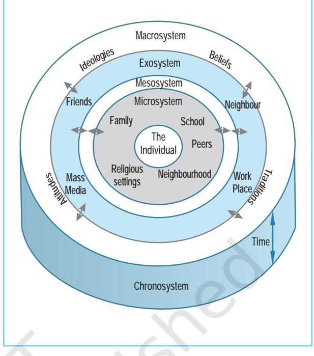

# Human Dev Human DevHuman Dev Human Dev Human DevHuman Development elopmentelopment elopment

# Chapter3 After reading this chapter, you would be able to

- describe the meaning and process of development,
- explain the influence of heredity, environment and context on human development,
- identify the stages of development and describe the major characteristics of infancy, childhood, adolescence, adulthood and old age, and
- reflect on your own course of development and related experiences.

*I wish I could travel by the road that crosses the baby's mind, and out beyond all bounds; where messengers run errands for no cause between the kingdoms of kings of no history; where Reason makes kites of her laws and flies them, and Truth sets Fact free from its fetters.*

Psychology 40

– Rabindranath Tagore

# Contents

**Introduction Meaning of Development** Life-Span Perspective on Development *Growth, Development, Maturation, and Evolution* (Box 3.1) **Factors Influencing Development Context of Development Overview of Developmental Stages** Prenatal Stage **Infancy Childhood** *Gender and Sex Roles* (Box 3.2) **Challenges of Adolescence Adulthood and Old Age** 

**Key TermsSummary Review QuestionsProject Ideas**

# Introduction

*If you look around, you will notice that from birth onwards changes of various kinds are taking place in an individual's life, which continue even during old age. Over a span of time, a human grows and develops, learns to communicate, walk, count, and read and write. S/he also learns to distinguish between right and wrong. S/he makes friends, goes through puberty, gets married, rears children, and grows old. Even though we differ from each other, we share many commonalities. Most of us learn to walk by the first year and talk by the second year. This chapter will familiarise you with the changes observed in people during the course of their lifespan in different domains. You will learn about key developmental processes and changes taking place in major periods during the life-span: prenatal, infancy, childhood, adolescence, adulthood, and old age. This would be a journey of personal understanding and self-discovery which should help in your future development. The study of human development would also help you to deal with others better.*

#### **MEANING OF DEVELOPMENT**

When we think of development, invariably we think of physical changes, as these are commonly observed at home with younger siblings, with parents and grandparents, in school with peers or others around us. From conception until the moment of death, we not only change physically, but we also change in the way we think, use language, and develop social relationships. Remember that, changes are not confined to any one area of a person's life; they occur in the person in an integrated manner. *Development is the pattern of progressive, orderly, and predictable changes that begin at conception and continue throughout life.* Development mostly involves changes — both growth and decline, as observed during old age.

Development is influenced by an interplay of biological, cognitive, and socio-emotional processes. Development due to genes inherited from parents, such as in height and weight, brain, heart, and lungs development, etc. all point towards the role of **biological processes**. The role of **cognitive processes** in development relate to mental activities associated with the processes of knowing, and experiencing, such as thought, perception, attention, problem solving, etc. **Socio-emotional processes** that influence development refer to changes in an individual's interactions with other people, changes in emotions, and in personality. A child's hug to her/his mother, a young girl's affectionate gesture to her/his sibling, or an adolescent's sorrow at losing a match are all reflections of socio-emotional processes deeply involved in human development.

Although you would be reading about the different processes in different chapters of this textbook, it is important to remember that the biological, cognitive, and socio-emotional processes are interwoven. These processes influence changes in the development of the individual as a whole throughout the human life-span.

#### **Life-Span Perspective on Development**

The study of development according to the Life-Span Perspective (LSP) includes the following assumptions :

- 1. Development is lifelong, i.e. it takes place across all age groups starting from

conception to old age. It includes both gains and losses, which interact in dynamic (change in one aspect goes with changes in others) ways throughout the life-span.

- 2. The various processes of human development, i.e. biological, cognitive, and socio-emotional are interwoven in the development of a person throughout the life-span.
- 3. Development is multi-directional. Some dimensions or components of a given dimension of development may increase, while others show decrement. For example, the experiences of adults may make them wiser and guide their decisions. However, with an increase in age, one's performance is likely to decrease on tasks requiring speed, such as running.
- 4. Development is highly plastic, i.e. within person, modifiability is found in psychological development, though plasticity varies among individuals. This means skills and abilities can be improved or developed throughout the life-span.
- 5. Development is influenced by historical conditions. For example, the experiences of 20-year olds who lived through the freedom struggle in India would be very different from the experiences of 20 year olds of today. The career orientation of school students today is very different from those students who were in schools 50 years ago.
- 6. Development is the concern of a number of disciplines. Different disciplines like psychology, anthropology, sociology, and neuro-sciences study human development, each trying to provide answers to development throughout the life-span.
- 7. An individual responds and acts on contexts, which include what was inherited, the physical environment, social, historical, and cultural contexts. For example, the life events in everyone's life are not the same, such as, death of a parent, accident, earthquake, etc., affect the course of one's life as also the positive

# Box 3.1 Growth, Development, Maturation, and Evolution

**Growth** *refers to an increase in the size of body parts or of the organism as a whole. It can be measured or quantified, for example, growth in height, weight, etc.* **Development** *is a process by which an individual grows and changes throughout the life cycle. The term development applies to the changes that have a direction and hold definite relationship with what precedes it, and in turn, will determine what will come after. A temporary change caused by a brief illness, for example, is not considered a part of development. All changes which occur as a result of development are not of the same kind. Thus, changes in size (physical growth), changes in proportion (child to adult), changes in features (disappearance of baby teeth), and acquiring new features are varied in their pace and scope level. Development includes growth as one of its aspects.* **Maturation** *refers to the changes that follow an orderly sequence and are largely dictated by the genetic blueprint which produces* *commonalities in our growth and development. For example, most children can sit without support by 7 months of age, stand with support by 8 months and walk by one year. Once the underlying physical structure is sufficiently developed, proficiency in these behaviours requires adequate environment and little practice. However, special efforts to accelerate these behaviours do not help if the infant is maturationally not ready. These processes seem to "unfold from within": following an inner, genetically determined timetable that is characteristic of the species.* **Evolution** *refers to species-specific changes. Natural selection is an evolutionary process that favours individuals or a species that are best adapted to survive and reproduce. The evolutionary changes are passed from one generation to the next within a species. Evolution proceeds at a very slow pace. Emergence of human beings from great apes took about 14 million years. It has been estimated that the 'Homo sapiens' came into existence only about 50,000 years ago.*

Psychology 42

influences such as winning an award or getting a good job. People keep on changing with changing contexts.

#### **FACTORS INFLUENCING DEVELOPMENT**

Have you observed in your class that some of you have dark skin, others have light coloured skins, colour of your hair and eyes are different, some of you are tall, others short, some are quiet or sad while others are talkative or cheerful. People also differ with respect to intelligence, learning abilities, memory, and other psychological characteristics besides physical characteristics. Despite these variations, no one can be mistaken for any other species: we all are *homo sapiens*. What causes us to be different from each other but at the same time more like each other? The answer lies in the interaction of heredity and environment.

You have already learned that the principles of heredity explain the mechanism for transmission of characteristics by every species from one generation to the next. We inherit genetic codes from our parents, which are in every cell of our body. Our genetic codes are alike in one important way; they contain the human genetic code. It is because of the human genetic code that a fertilised human egg grows into a human baby and cannot grow into an elephant, a bird or a mouse.

Genetic transmission is very complex. Most characteristics that we observe in humans are combinations of larger number of genes. You can imagine the combinations produced by 80,000 or more genes – accounting for a variety of characteristics and behaviours. It is also not possible to possess all the characteristics made available to us by our genetic structure. The actual genetic material or a person's genetic heritage is known as **genotype**. However, not all of this genetic material is apparent or distinctly identifiable in our observable characteristics. **Phenotype** is the way an individual's genotype is expressed in observable and measurable characteristics. Phenotypes include physical traits, such as height, weight, eye and skin colour, and many of the psychological characteristics such as intelligence, creativity, and personality. These observable characteristics of an individual are the result of the interaction between the person's inherited traits and the environment. You know it is the genetic code which predisposes a child to develop in a particular way. Genes provide a distinct blueprint and timetable for the development of an individual. But genes do not exist in isolation and development occurs within the context of an individual's environment. This is what makes each one of us a unique person.

What are the environmental influences? How does the environment affect development? Imagine a child, with genotype that predisposes her/him to be introverted, in an environment that promotes social interaction and extroversion. The influence of such an environment may make the child a little extroverted. Let us take another example. An individual with "short" height genes, even if s/he is in a very good nutritional environment, will never be able to be taller than average. This shows that genes set the limit and within that limit the environment influences development.

You know by now that parents provide the genes for the child's development. Do you know that they also play an important role in determining the type of environment their children will encounter? Sandra Scarr (1992) believes that the environment parents provide for their children depends to some extent on their own genetic predisposition. For example, if parents are intelligent and are good readers they would provide their children with books to read, with the likely outcome that their children would become good readers who enjoy reading. A child's own genotype (what s/he has inherited) such as being cooperative, and attentive is likely to result in teachers and parents giving more pleasant response as compared to children who are not cooperative or not attentive. Besides these, children themselves choose certain environments

based on their genotype. For example, because of their genotype, children may perform well in music or sports and they will seek and spend more time in environments, which will enable them to perform their musical skills; similarly an athlete would seek sports-related environment. These interactions with environment keep changing from infancy through adolescence. Environmental influences are as complex as the genes we inherit.

If your class monitor is selected on the basis of being academically bright and a popular student, do you think it is because of her/his genes or the influence of the environment? If a child from a rural area who is very intelligent, is not able to get a job because of her/his inability to express herself/himself fluently or handle computers, do you think - it is because of genes or environment?

#### **CONTEXT OF DEVELOPMENT**

Development does not take place in a vacuum. It is always embedded in a particular socio-cultural context. As you shall read in this chapter, transition during one's lifetime such as entering school, becoming an adolescent, finding jobs, marrying, having children, retirement, etc. all are joint functions of the biological changes and changes in one's environment. The environment can change or alter during any time of the individual's life-span.

Urie Bronfenbrenner's contextual view of development emphasises the role of environmental factors in the development of an individual. This has been depicted in Figure 3.1.

The **microsystem** is the immediate environment/setting in which the individual lives. It is in these settings where the child directly interacts with social agents – the family, peers, teachers, and neighbourhood. The **mesosystem** consists of relations between these contexts. For instance, how a child's parents relate to the teachers, or how the parents view the

*Fig.3.1 : Bronfenbrenner's Contextual View of Development*

adolescent's friends, are experiences likely to influence an individual's relationships with others. The **exosystem** includes events in social settings where the child does not participate directly, but they influence the childs' experiences in the immediate context. For example, the transfer of father or mother may cause tension among the parents which might affect their interactions with the child or the general amenities available to the child like quality of schooling, libraries, medical care, means of entertainment, etc. **Macrosystem** includes the culture in which the individual lives. **Chronosystem** involves events in the individual's life course, and socio-historical circumstances of the time such as, divorce of parents or parents' economic setback, and their effect on the child.

In a nutshell, Bronfenbrenner's view is that a child's development is significantly affected by the complex world that envelops her/him – whether it be the minutiae of the conversations s/he has with her/his

Psychology 44

playmates, or the social and economic lifecircumstances into which s/he is born. Research has shown that children in impoverished environments have unstimulating environment devoid of books, magazines, toys, etc., lack experiences such as visits to library, museum, zoo, etc., have parents who are ineffective as role models, and live in overcrowded and noisy surroundings. As a result of these conditions children are at a disadvantage and have difficulties in learning.

Durganand Sinha (1977) has presented an ecological model for understanding the development of children in Indian context. Ecology of the child could be viewed in terms of two concentric layers. The "upper and the more visible layers" consist of home, school, peer groups, and so on. The most important ecological factors influencing development of the child in the visible upper layer constitute the: (i) home, its conditions in terms of overcrowding, space available to each member, toys, technological devices used, etc., (ii) nature and quality of schooling, facilities to which the child is exposed, and (iii) nature of interactions and activities undertaken with peer groups from childhood onwards.

These factors do not operate independently but constantly interact with one another. Since these are also embedded in a larger and a more pervasive setting, the "surrounding layers" of the child's ecology constantly influence the "upper layer" factors. However, their influences are not always clearly visible. The elements of the surrounding layer of ecology constitute the: (i) general geographical environment*.* It includes space and facilities for play and other activities available outside the home including general congestion of the locality and density of population, (ii) institutional setting provided by caste, class, and other factors, and (iii) general amenities available to the child like drinking water, electricity, means of entertainment and so on.

The visible and the surrounding layer factors interact with one another and may have different consequences for development in different people. The ecological environment can change or alter during any time of the individual's life-span. Therefore, to understand differences in the functioning of an individual, it is important to see the individual in the context of her/his experiences.

# Activity ActivityActivity 3.1

*What would your life be if you lived in a rural area or a small town, devoid of all amenities, which you are used to in a city (or vice-versa)? Discuss in small groups keeping in mind factors like poverty, illiteracy, pollution, population, etc.*

### **OVERVIEW OF DEVELOPMENTAL STAGES**

Development is commonly described in terms of periods or stages. You must have observed that your younger brother or sister, or parents, and even yourself, all behave in different ways. If you observe people living in your neighbourhood, you would find that they too do not behave in a similar manner. This variation is partly because everyone is in a different stage of life. Human life proceeds through different **stages**. For example, you are at present in the stage of adolescence and after a few years you will enter the stage of adulthood. Developmental stages are assumed to be temporary and are often characterised by a dominant feature or a leading characteristic, which gives each period its uniqueness. During a particular stage, individual progresses towards an assumed goal - a state or ability that s/he must achieve in the same order as other persons before progressing to the next stage in the sequence. Of course, individuals do vary with respect to the time or rate of development from one stage to another. It may be noted that certain patterns of behaviour and certain skills are learned more easily and successfully during certain stages. These accomplishments of a person become the social expectations of that stage of development. They are known as

**developmental tasks**. You will now read about the different stages of development and their main features.

#### **Prenatal Stage**

The period from conception to birth is known as the prenatal period. Typically, it lasts for about 40 weeks. You know by now that the genetic blueprint guides our development during the prenatal period and after birth. Both genetic and environmental factors affect our development during different periods of prenatal stage.

Prenatal development is also affected by maternal characteristics, which include mother's age, nutrition, and emotional state. Disease or infection carried by the mother can adversely affect prenatal development. For example, rubella (German measles), genital herpes, and Human Immunodeficiency Virus (HIV) are believed to cause genetic problems in the newborn. Another source of threat to prenatal development is **teratogens** environmental agents that cause deviations in normal development that can lead to serious abnormalities or death. Common teratogens include drugs, infections, radiations, and pollution. Intake of drugs (marijuana, heroin, cocaine, etc.), alcohol, tobacco, etc. by women during pregnancy may have harmful effects on the foetus and increase the frequency of congenital abnormalities. Radiations (such as X-rays), and certain chemicals near industrial areas can cause permanent change in the genes. Environmental pollutants and toxic wastes like carbon monoxide, mercury and lead are also sources of danger to the unborn child.

#### **INFANCY**

The brain develops at an amazing rate before and after birth. You have already read about the parts of the brain and the important role played by cerebrum in human functions, such as language, perception, and intelligence. Just before birth the newborns have most but not all brain cells. The neural connections among these cells develop at a rapid rate.

The newborn is not as helpless as you might think. The activities needed to sustain life functions are present in the newborn — it breathes, sucks, swallows, and discharges the bodily wastes. The newborns in their first week of life are able to indicate what direction a sound is coming from, can distinguish their mother's voice from the voices of other women, and can imitate simple gestures like tongue protrusion and mouth opening.

**Motor Development** : The newborn's movements are governed by **reflexes** — which are automatic, built-in responses to stimuli. They are genetically-carried survival mechanisms, and are the building blocks for subsequent motor development. Before the newborns have had the opportunity to learn, reflexes act as adaptive mechanisms. Some reflexes present in the newborn — coughing, blinking, and yawning persist throughout their lives. Others disappear as the brain functions mature and voluntary control over behaviour starts developing (see Table 3.1).

As the brain is developing, physical development also progresses. As the infant grows, the muscles and nervous system mature which lead to the development of finer skills. Basic physical (motor) skills include grasping and reaching for objects, sitting, crawling, walking and running. The sequence of physical (motor) development is universal, with minor exceptions.

**Sensory Abilities** : You know by now that newborns are not as incompetent as they look. They can recognise their mother's voice just a few hours after birth and have other sensory capabilities. How well can infants see? Newborns prefer to look at some stimuli rather than others such as faces, although these preferences change over the first few months of life. The newborn's vision is estimated to be lower than the adult vision. By 6 months it improves and by about the first year, vision is almost the same as that of an adult (20/20). Can a newborn see colour? The current consensus is that they might be able to distinguish between red and white colours but

Psychology 46

| Table 3.1 | Some Major Reflexes in the Newbor n |  |
| --- | --- | --- |
| Reflex | Description | Developmental Course |
| Rooting | Turning the head and opening the | Disappears between 3 and 6 months |
|  | mouth when touched on the cheek |  |
| Moro | If there is a loud noise, the baby | Disappears in 6 to 7 months |
|  | will throw her/his arms outward | (although reaction to loud noises is |
|  | while arching her/his back, and | permanent) |
|  | then bring the arms together as |  |
|  | if grasping something |  |
| Grasp | When a finger or some other object is | Disappears in 3 to 4 months; |
|  | pressed against the baby's palm, the | replaced by voluntary grasping |
|  | baby's fingers close around it |  |
| Babinski | When the bottom of the baby's foot | Disappears in 8 to 12 months |
|  | is stroked, the toes fan out and |  |
|  | then curl |  |

Table 3.1 Some Major Reflexes in the Newbor n

in general they are colour deficient and full colour vision develops by 3 months of age.

What is the nature of hearing in newborns? Infants can hear immediately after birth. As the infant develops, proficiency at localising sound improves. Newborns respond to touch and they can even feel pain. Both smell and taste capacities are also present in the newborn.

**Cognitive Development** : Does a 3 year old child understand things the same way as would an 8 year old? Jean Piaget stressed that children actively construct their understanding of the world. Information does not simply enter their minds from the environment. As children grow, additional information is acquired and they adapt their thinking to include new ideas, as this improves their understanding of the world. Piaget believed that a child's mind passes through a series of stages of thought from infancy to adolescence (see Table 3.2).

Each stage is characterised by a distinct way of thinking and is age related. It is important to remember that it is the different way of thinking which makes one stage more advanced than the other and not the amount of information. This also shows why you at your age think differently from an 8 year old. The child during infancy, i.e. the first two years of life, experiences the world through senses and interactions with objects — through looking, hearing, touching, mouthing, and grasping. The newborn lives in the present. What is out of sight is out of mind. For example, if you hide the toy in front of the child with which the child has been playing, the young infant would react as if nothing has happened, i.e. s/he will not search for the toy. The child assumes the toy does not exist. According to Piaget, children at this stage do not go beyond their immediate sensory experience, i.e. lack **object permanence** the awareness that the objects continue to exist when not perceived. Gradually by 8 months of age the child starts pursuing the object partially covered in her/his presence.

The basis of verbal communication seems to be present in infants. Vocalisation begins with the infant's babbling, sometime between 3 to 6 months of age. You will read about early language development in Chapter 7.

**Socio-emotional Development** : Babies from birth are social creatures. An infant starts preferring familiar faces and responds to parent's presence by cooing and gurgling. They become more mobile by 6 to 8 months of age and start showing a preference for their mother's company. When frightened by a new face or when separated from their mother, they

|
|  |

| Stage | Approximate Age | Characteristics |
| --- | --- | --- |
| Sensorimotor | 0-2 years | Infant explores the world by coordinating |
|  |  | sensory experiences with physical actions. |
| Preoperational | 2-7 years | Symbolic thought develops; object |
|  |  | permanence is established; the child cannot |
|  |  | coordinate different physical attributes of an |
|  |  | object. |
| Concrete operational | 7-11 years | The child can reason logically about concrete |
|  |  | events and classify objects into different sets. |
|  |  | Is able to perform reversible mental operations |
|  |  | on representations of objects. |
| Formal operational | 11-15 years | The adolescent can apply logic more |
|  |  | abstractly; hypothetical thinking develops. |

cry or show distress. On being reunited with the parent or caregiver they reciprocate with smiles or hugs. The close emotional bond of affection that develop between infants and their parents (caregivers) is called **attachment**. In a classic study by Harlow and Harlow (1962), baby monkeys were separated from their mothers approximately 8 hours after birth. The baby monkeys were placed in experimental chambers and reared for 6 months by surrogate (substitute) "mothers", one made of wire and the other of cloth. Half the baby monkeys were fed by the wire mother, half by the cloth mother. Regardless of whether they were fed by the wire or the cloth mother the baby monkeys showed a preference for the cloth mother and spent a lot more time with her. This study clearly demonstrates that providing nourishment or feeding was not crucial for attachment and contact-comfort is important. You too may have seen young children having a strong attachment to a favourite toy or blanket. There is nothing unusual in this, as the children know that the blanket or toy is not their mother. Yet it provides them comfort. As children grow and become more sure of themselves, they abandon these objects.

Human babies also form an attachment with their parents or caregivers who

consistently and appropriately reciprocate to their signals of love and affection. According to Erik Erikson (1968), the first year of life is the key time for the development of attachment. It represents the stage of developing *trust* or *mistrust*. A sense of trust is built on a feeling of physical comfort which builds an expectation of the world as a secure and good place. An infant's sense of trust is developed by responsive and sensitive parenting. If the parents are sensitive, affectionate, and accepting, it provides the infant a strong base to explore the environment. Such infants are likely to develop a secure attachment. On the other hand, if parents are insensitive and show dissatisfaction and find fault with the child, it can lead to creating feelings of self-doubt in the child. Securely attached infants respond positively when picked up, move freely, and play whereas insecurely attached infants feel anxious when separated and cry due to fear and get upset. A close interactive relationship with warm and affectionate adults is a child's first step towards healthy development.

#### **CHILDHOOD**

The child's growth slows down during early childhood as compared to infancy. The child develops physically, gains height and weight,

Psychology 48

learns to walk, runs, jumps, and plays with a ball. Socially, the child's world expands from the parents to the family and adults near home and at school. The child also begins to acquire the concepts of good and bad, i.e. develops a sense of morality. During childhood, children have increased physical capacities, can perform tasks independently, can set goals, and meet adult expectations. The increasing maturation of the brain along with opportunities to experience the world, contribute to development of children's cognitive abilities.

**Physical Development** : Early development follows two principles : (i) development proceeds **cephalocaudally**, i.e. from the cephalic or head region to the caudal or tail region. Children gain control over the upper part of the body before the lower part. This is why you would notice that the infant's head is proportionately larger than her/his body during early infancy or if you see an infant crawling, s/he will use the arms first and then shift to using the legs, (ii) growth proceeds from the centre of body and moves towards the extremities or more distal regions — the **proximodistal** trend, i.e. children gain control over their torso before their extremities. Initially infants reach for objects by turning their entire body, gradually they extend their arms to reach for things. These changes are the result of a maturing nervous system and not because of any limitation since even visually impaired children show the same sequence.

As children grow older, they look slimmer as the trunk part of their bodies lengthens and body fat decreases. The brain and the head grow more rapidly than any other part of the body. The growth and development of the brain are important as they help in the maturation of children's abilities, such as eye-hand coordination, holding a pencil, and attempts made at writing. During middle and late childhood years, children increase significantly in size and strength; increase in weight is mainly due to increase in the size of the skeletal and muscular systems, as well as size of some body organs.

**Motor Development** : Gross motor skills during the early childhood years involve the use of arms and legs, and moving around with confidence and more purposefully in the environment. Fine motor skills — finger dexterity and eye-hand coordination improve substantially during early childhood. During these years the child's preference for left or right hand also develops. The major accomplishments in gross and fine motor skills during early childhood years are given in Table 3.3.

**Cognitive Development** : The child's ability to acquire the concept of object permanence enables her/him to use mental symbols to represent objects. However, the child at this stage lacks the ability that allows her/him to do mentally what was done physically before. Cognitive development in early childhood focuses on Piaget's stage of **preoperational thought** (see Table 3.2). The child gains the ability to mentally represent an object that is not physically present. You may have observed children draw designs/ figures to represent people, trees, dog, house,

| Table 3.3 | Major Accomplishments in Gross and Fine Motor Skills |  |
| --- | --- | --- |
| Age in Years | Gross Motor Skills | Fine Motor Skills |
| 3 years | Hopping, jumping, running | Build blocks, pick objects with forefinger and thumb |
| 4 years | Climb up and downstairs with one foot on each step | Fit jigsaw puzzle precisely |
| 5 years | Run hard, enjoy races | Hand, arm, and body all coordinate with eye movement |

Chapter 3 • *Human Development* 49

etc. This ability of the child to engage in symbolic thought helps to expand her/his mental world. The progress in symbolic thought continues. A salient feature of preoperational thought is **egocentrism** (selffocus), i.e. children see the world only in terms of their own selves and are not able to appreciate others' point of view. Children because of egocentrism, engage in **animism** thinking that all things are living, like oneself. They attribute life-like qualities to inanimate objects. For example, if a child while running slips on the road, s/he might show animism by saying "road hurt me". As children grow and are approximately between 4 and 7 years of age they want answers to all their questions like: Why is the sky blue? How do trees grow? and so on. Such questions help the child to know why things are as they are. Piaget called this the stage of *intuitive thought*. Another feature of thought during preoperational stage is characterised by children having a tendency for **centration**, i.e. focusing on a single characteristic or feature for understanding an event. For example, a child may insist on drinking a "big glass" of juice, preferring a tall narrow glass to a short broad one, even though both might be holding the same amount of juice.

As the child grows and is approximately between 7 and 11 years of age (the period of middle and late childhood) intuitive thought is replaced by *logical thought*. This is the stage of **concrete operational thought**, which is made up of operations — mental actions that allow the child to do mentally what was done physically before. Concrete operations are also mental actions that are reversible. In a wellknown test, the child is presented with two identical balls of clay. One ball is rolled by the experimenter into a long thin strip and the other ball remains in its original shape. On being asked which has more clay, the child of 7 or 8 years, would answer that, both have the same amount of clay. This is because the child imagines the ball rolled into thin strip and then into a ball, that means s/he is able to imagine reversible mental action on concrete/real objects. What do you think a preoperational child would have done? S/he is likely to focus on only one aspect-length or height. Concrete operations allow the child to focus on different characteristics and not focus on one aspect of the object. This helps the child to appreciate that there are different ways of looking at things, which also results in the decline of her/his egocentrism. Thinking becomes more flexible, and children can think about alternatives when solving problems, or mentally retrace their steps if required. Even though the preoperational child develops the ability to see relationships between different properties of an object, s/he cannot do abstract thinking, i.e. s/he still cannot manipulate ideas in the absence of objects. For example, steps required to complete algebraic equations, or imagining line of longitude or latitude of the earth.

The growing cognitive abilities of children facilitate the acquisition of language. You will read in Chapter 7, how children develop vocabulary and grammar.

# Activity ActivityActivity 3.2

*Take two transparent glasses of the same size and pour same amount of water in both. Ask a child of Class II and Class V of your school: whether the glasses contain the same amount of water? Take another tall thin glass and in front of the child empty water from one of the earlier glasses to the third glass. Now ask her/him which glass has more water? Did you find any difference in their responses?*

**Socio-emotional Development** : The important dimensions of children's socioemotional development are the **self**, **gender** and **moral** development. During the early years of childhood, some important developments in the self take place. The child due to socialisation has developed a sense of who s/he is and whom s/he wants to be identified with. The developing sense of independence makes children do things in their own way. According to Erikson, the way parents respond to their self-initiated activities

Psychology 50

leads to developing a sense of initiative or sense of guilt. For example, giving freedom and opportunities for play like cycling, running, skating, etc. and answering children's questions will create a sense of support for the initiative taken. In contrast, if they are made to feel that their questions are useless, and games played by them are stupid, the children are likely to develop feelings of guilt over self-initiated activities, which may persist through the children's later life also. Selfunderstanding in early childhood is limited to defining oneself through physical characteristics: I am tall, she has black hair, I am a girl, etc. During middle and late childhood, the child is likely to define oneself through internal characteristics such as, "I am smart and I am popular" or "I feel proud when teachers assign me responsibility in school". In addition to defining oneself through psychological characteristics, children's selfdescriptions also include social aspects of self,

# Box 3.2 Gender and Sex Roles

*Is chess a man's game or woman's game or both? Is baking a woman's activity or a man's activity? What about driving, debating, and experimenting in a physics laboratory? Or consider some of the products sold on T.V. for young men and young women? What do they tell about how girls and boys should be?*

*Psychologists have meticulously researched on whether sex differences exist. Research shows that males have been consistently found to be more aggressive than females. Men perform better than women on tests of sit-ups, short-run speeds and long jumps. Women show better, fine eye-hand coordination than men do, and their joints and limbs are more flexible than men's. What do you think is the origin of these differences? Are these essential, or in other words, are women born with certain 'feminine' traits, and men with certain 'masculine' traits? Or are these differences the creation of the world we live in?*

*The most powerful roles into which people are socialised are gender roles. They specify the range of behaviours which are considered appropriate for males or females. While sex refers to the biological dimension of being male or female, gender refers to the social dimension of being male or female. There are several aspects of gender. Among these, important ones are gender identity of male or female, which most children begin to acquire by the time they are about 3 years old and can accurately label themselves as boys and girls. As they grow, preferences can be evidenced in their toys and play.*

*A gender role is a set of expectations that prescribes how females and males should think, act and feel. Parents are important influences on gender socialisation especially in the early years* *of development. Through rewards and punishments, they induce in children gender appropriate and inappropriate behaviours. Parents often use rewards and punishments to teach their daughters to be feminine and boys to be masculine. Peer influence is also considered to be a major contributor to gender socialisation.*

*Parents restrict school-aged girls more than they restrict school-aged boys, and assign boys and girls different types of chores. In everyday interactions, parents give their daughters a kind of 'dependence training', and their sons a kind of 'independence training'. Media, including cartoons and commercials are known to perpetuate gender stereotypes. Research on gender stereotypes in commercials shows that across cultures authority figures in commercials were males, and women were more likely to be shown in dependent and domestic roles, or women were more likely to sell body products, and men more likely to sell sports products.*

*Once children learn the role of male or female, they organise their world on the basis of gender also. Children's attention and behaviour are guided by an internal motivation to conform to gender based sociocultural standards and stereotypes. Children also actively socialise themselves according to the gender mores of their culture. Once they have internalised gender standards, they begin to expect gender appropriate behaviour from themselves. Young boys may refuse to wear feminine clothes in a fancy dress competition. When playing house* (ghar-ghar)*, girls may refuse to play the father's role. Once they have identified with their own gender, children may model after a powerful cultural figure of the same gender. The "gender typing" occurs when individuals are ready to encode and organise information along the lines of what is considered appropriate or typical for males and females in a society.*

such as references to social groups like being a member of school's music club, environment club, or any religious group. Children's selfunderstanding also includes social comparison. Children are likely to think about what they can do or cannot do in comparison with others. For example, "I got more marks than Atul" or "I can run faster than others in the class". This developmental shift leads to establishing one's differences from others as an individual.

Once the children enter school their social world expands beyond their families. They also spend greater amount of time with their age mates or peers. Thus the increased time that children spend with their peers shapes their development.

# Activity ActivityActivity 3.3

*Act like a boy if you are a girl or act like a girl if you are a boy for atleast one hour in front of your friends and parents. Reflect on your experience and note others' reaction to your behaviour. You can also ask them about their reactions. How difficult was it to perform like the other gender?*

**Moral Development** : Another important aspect of the child's development is learning to differentiate between the rightness or wrongness of human acts. The way children come to distinguish right from wrong, to feel guilty, to put themselves in other people's position, and to help others when they are in trouble, are all components of moral development. Just as children pass through the various stages of cognitive development, according to Lawrence Kohlberg, they pass through the various stages of moral development, which are age related. Kohlberg interviewed children in which they were presented with stories in which the characters face moral dilemmas. Children were asked what the characters in the dilemma should do, and why. According to him, children approach thinking about right and wrong differently at different ages. The young child, i.e. before 9 years of age, thinks in terms of external authority. According to her/him,

Psychology 52

actions are wrong because s/he is punished, and right because s/he is rewarded. As the child grows, i.e. by early adolescence, s/he develops moral reasoning through set of rules of others, such as parents or laws of the society. These rules are accepted by the children as their own. These are "internalised" in order to be virtuous and to win approval from others (not to avoid punishment). Children view rules as absolute guidelines, which should be followed. Moral thinking at this stage is relatively inflexible. As they grow, they gradually develop a personal moral code.

You have seen that by the end of childhood a more gradual growth rate enables the child to develop skills of coordination and balance. Language develops and the child can reason logically. Socially the child has become more involved in social systems, such as family and peer group. The next section traces changes in human development during adolescence and adulthood.

## Activity ActivityActivity 3.4

*A patient is critically ill, hospitalised for many years and shows no improvement. Should the life support system of the patient be withdrawn? What is your view on euthanasia or "mercy killing" as it is sometimes called? Discuss with your teacher.*

#### **CHALLENGES OF ADOLESCENCE**

The term adolescence derives from the Latin word *adolescere*, meaning "to grow into maturity". It is the transitional period in a person's life between childhood and adulthood. **Adolescence** is commonly defined as *the stage of life that begins at the onset of puberty, when sexual maturity, or the ability to reproduce is attained.* It has been regarded as a period of rapid change, both biologically and psychologically. Though the physical changes that take place during this stage are universal, the social and psychological dimensions of the adolescent's experiences depend on the cultural context. For example, in cultures where the adolescent years are viewed as problematic or confusing, the adolescent will have very different experiences from someone who is in a culture, where adolescent years are viewed as beginning of adult behaviour and, therefore, undertaking responsible tasks. Although most societies have at least a brief period of adolescence, it is not universal across cultures.

**Physical Development** : Puberty or sexual maturity marks the end of childhood and signifies the beginning of adolescence, which is characterised by dramatic physical changes in both, growth rate, and sexual characteristics. However, puberty is not a sudden event, but is part of a gradual process. The hormones released during puberty result in the development of **primary** and **secondary sexual characteristics**. The primary sex characteristics include those directly related to reproduction and the secondary sex characteristics include features or signs of achieving sexual maturity. Pubertal changes in boys are marked by acceleration in growth, facial hair, and changes in voice. In girls, rapid growth in height usually begins about two years before **menarche**, the onset of menstruation. The growth spurt generally begins at the age of 12 or 13 for boys and at the age of 10 or 11 for girls. It is normal to have variations in the pubertal sequence. For example, among two boys (or two girls) of same chronological age, one may complete pubertal sequence before the other has begun it. Both genetics and environment play a part in this. For example, identical twins reach menarche closer in time than do fraternal twins; on an average, girls from affluent families go through menarche earlier than girls from poor families; and historical trends show that the age of menarche is declining in industrialised nations reflecting better nutrition and advances in medical care.

Physical development during adolescence is also accompanied by a number of psychological changes. Around puberty adolescents show an increase in interest in members of the opposite sex and in sexual matters and a new awareness of sexual feelings develops. This increased attention to sexuality is caused by factors such as individual's awareness of the biological changes taking place and the emphasis placed on sexuality by peers, parents, and society. Even then, many adolescents lack adequate knowledge or have misconceptions about sex and sexuality. Sex is a topic parents find difficult to discuss with children, so adolescents tend to become secretive about sexual concerns which make exchange of information and communication difficult. The concern over adolescent sexuality has become intense in recent times because of the risk of AIDS, and other sexually transmitted diseases.

The development of a sexual identity defines the sexual orientation and guides sexual behaviour. As such it becomes an important developmental task for adolescents. How did you think of yourself at the beginning of puberty? Adolescents are preoccupied with what they are like and develop individual images of what they look like. Another important developmental task during adolescence is accepting one's physical self/ maturity. Adolescents need to develop a realistic image of their physical appearance, which is acceptable to them. It is important to keep in mind that puberty also involves cognitive and social changes along with physical changes.

**Cognitive Developmental Changes** : Adolescents' thought becomes more abstract, logical, and idealistic; they become more capable of examining their own thoughts, others' thoughts, and what others are thinking about them. Adolescents' developing ability to reason gives them a new level of cognitive and social awareness. Piaget believed that *formal operational thought* appears between the age of 11 and 15. During this stage adolescent thinking expands beyond actual concrete experiences and they begin to think more in abstract terms and reason about them. In addition to being abstract, adolescent thought is also idealistic. Adolescents begin to think about ideal characteristics for themselves and others and compare themselves and others with these ideal standards. For example, they may think what an ideal parent is like and

compare their parents with these ideal standards. This may at times make adolescents wonder which of the new-found ideal standards they should adopt. In contrast to trial and error approach used by children in earlier stages of development, adolescent thinking becomes more systematic in solving problems — they think of possible courses of action, why something is happening the way it is, and systematically seek solutions. Piaget called this type of logical thinking **hypothetical deductive reasoning**.

Logical thought also influences the development of moral reasoning. Social rules are not considered as absolute standards and moral thinking shows some flexibility. The adolescent recognises alternative moral courses, explores options, and then decides on a personal moral code. For example, should I smoke as everyone I know does? Is it ethical to copy answers in the examinations? This also lends the possibility of adolescents not following society's norms if they conflict with personal code of ethics. For example, individuals at this age might participate in a protest march for a cause rather than adhere/ conform to college norm.

Adolescents also develop a special kind of egocentrism. According to David Elkind, **imaginary audience** and **personal fable** are two components of adolescents' egocentrism. Imaginary audience is adolescent's belief that others are as preoccupied with them as they are about themselves. They imagine that people are always noticing them and are observing each and every behaviour of theirs. Imagine a boy who thinks that all will notice the ink spot on his shirt, or a girl with a pimple feels, all people would think how bad her skin is. It is this imaginary audience, which makes them extremely self-conscious. The personal fable is part of the adolescents' egocentrism that involves their sense of uniqueness. Adolescents' sense of uniqueness makes them think that no one understands them or their feelings. For example, an adolescent girl thinks that none can sense the hurt that she feels because of being betrayed by a friend. It is quite common to hear the adolescent say to the parents; 'you don't understand me'. To retain their sense of personal uniqueness they may weave stories filled with fantasy around them to create a world that is away from reality. Personal fables are often part of adolescent diaries.

**Forming an Identity** : You must have sought answers to questions such as : Who am I? Which subjects should I study? Do I believe in God? The answers to all these questions involve the quest to define one's sense of self or the search for **identity**. *Identity is who you are and what your values, commitments and beliefs are*. The primary task of adolescence is to establish an identity separate from the parents. During adolescence a detachment process enables the individual to develop a personalised set of beliefs that are uniquely her or his own. In the process of achieving an identity the adolescent could experience conflict with parents and within herself or himself. Those adolescents who can cope with the conflicting identities develop a new sense of self. Adolescents who are not able to cope with this identity crisis are confused. This "identity confusion", according to Erikson, can lead to individuals isolating themselves from peers and family; or they may lose their identity in the crowd. Adolescents on one hand, may desire independence but may also be afraid of it and show a great deal of dependence on their parents. Rapid fluctuations between self-confidence and insecurity are typical of this stage. Adolescents may at one time complain of being "treated like a baby" whereas on other occasions they may seek comfort by depending on their parents. Seeking an identity involves searching for continuity and sameness in oneself, greater responsibility and trying to get a clear sense of who one is, i.e. an identity.

The formation of identity during adolescence is influenced by several factors. The cultural background, family and societal values, ethnic background, and socioeconomic status all prevail upon the adolescents' search for a place in society. Family relationships become less important as the adolescent spends more time outside

Psychology 54

the home and develops a strong need for peer support and acceptance. Increased interactions with peers provide them with opportunities for refining their social skills and trying out different social behaviours. Peers and parents are dual forces having major influences on adolescents. At times conflicting situations with parents lead to increased identification with peers. But generally parents and peers serve complementary functions and fulfil different needs of the adolescents. Vocational commitment is another factor influencing adolescent identity formation. The question "What are you going to be when you grow up?", requires the ability to think about the future and to be able to set realistic and achievable goals. In some cultures freedom is given to the young people to choose an occupation, whereas in certain other cultures the option of making this choice is not given to the children. Here parents' decision is likely to be accepted by the children. What has been your experience while making a choice in the selection of subjects? Career counselling in schools offers information regarding appraisal of the students for various courses and jobs and provides guidance in making a decision about career choices.

**Some Major Concerns** : As adults when we reflect on our adolescent years and recall the conflicts, uncertainties, occasional loneliness, group pressures, we feel it was definitely a vulnerable period. During adolescence peer influence, new gained freedom, unresolved problems may create difficulties for many of you. Conforming to peer pressure can be both positive and negative. Adolescents are often confronted with decisions regarding smoking, drugs, alcohol, and breaking parental rules, etc. These decisions are taken without much regard to the effect they can have. Adolescents may face periods of uncertainty, loneliness, self-doubt, anxiety, and concern about themselves and their future, they are also likely to experience excitement, joy, and feelings of competence as they overcome the developmental challenges. You will now read about some of the major challenges faced by adolescents like delinquency, substance abuse, and eating disorders.

*Delinquency* : Delinquency refers to a variety of behaviours, ranging from socially unacceptable behaviour, legal offences, to criminal acts. Examples include truancy, running away from home, stealing or burglary or acts of vandalism. Adolescents with delinquency and behavioural problems tend to have a negative self-identity, decreased trust, and low level of achievement. Delinquency is often associated with low parental support, inappropriate discipline, and family discord. Often adolescents from communities characterised by poverty, unemployment, and having feelings of alienation from the middle class perform antisocial acts to gain attention and to be popular with their peers. However, most delinquent children do not remain delinquent forever. Change in their peer group, becoming more aware of their social responsibilities and developing feelings of selfworth, imitating positive behaviour of the role models, breaking negative attitudes, and overcoming poor self-concept help in reduction of delinquent behaviour.

*Substance Abuse* : Adolescent years are especially vulnerable to smoking, alcohol and drug abuse. Some adolescents take recourse to smoking and drugs as a way of coping with stress. This can interfere with the development of coping skills and responsible decisionmaking. The reasons for smoking and drug use could be peer pressure and the adolescents' need to be accepted by the group, or desire to act more like adults, or feel a need to escape the pressure of school work or social activities. The addictive powers of nicotine make it difficult to stop smoking. It has been found that adolescents who are more vulnerable to drugs, alcohol, and nicotine use, are impulsive, aggressive, anxious, depressive, and unpredictable, have low self-esteem, and low expectation for achievement. Peer pressure and the need to be with their peer group make the adolescent either go along with their demands to experiment with drugs, alcohol, and smoking or be ridiculed. Drug use if continued long enough can lead to

physiological dependency, i.e. addiction to drugs, alcohol or nicotine may seriously jeopardise the rest of the adolescents' lives. Positive relationships with parents, peers, siblings, and adults play an important role in preventing drug abuse. In India, a successful anti-drug programme is the Society for Theatre in Education Programme in New Delhi. It uses street performances to entertain people between 13 to 25 years of age while teaching them how to say no to drugs. The United Nations International Drug Control Programme (UNDCP) has chosen the programme as an example to be adopted by other nongovernmental organisations in the region.

*Eating Disorders* : Adolescents' obsession with self, living in fantasy world and peer comparisons lead to certain conditions where they become obsessed with their own bodies. *Anorexia nervosa* is an eating disorder that involves relentless pursuit of thinness through starvation. It is quite common to see adolescents eliminate certain foods from their diets or to eat slimming foods only. The media also projects thinness, as the most desirable image and copying such fashionable image of thinness leads to anorexia nervosa. *Bulimia* is another form of an eating disorder in which the individual follows a binge-and-purge eating pattern. The bulimic goes on an eating binge, then purges by self-induced vomiting or using a laxative at times alternating it with fasting. Anorexia nervosa and bulimia are primarily female disorders more common in urban families.

#### **ADULTHOOD AND OLD AGE**

#### **Adulthood**

An adult is generally defined as someone who is responsible, mature, self-supporting, and well integrated into society. There is a variation in developing these attributes, which suggests that there is a shift in timing when an individual becomes an adult or assumes adult roles. Some people take up jobs along with their college studies or may get married and not pursue their studies. Others may continue to live with their parents even after getting married and being financially independent. The assumption of adult roles is directed by an individual's social context. The best time for some of the most important life events (i.e. marriage, job, having children) might be quite different in different cultures but within a culture there is similarity in the course of adult development.

In early adulthood, two major tasks are, exploring the possibilities for adult living and developing a stable life structure. The twenties represent the novice phase of adult development. Gradually, a transition from dependence to independence should occur. This could be marked by an image of the kind of life the young person wants, especially in terms of marriage and a career.

*Career and Work* : Earning a living, choosing an occupation, and developing a career are important themes for people in their twenties and thirties. Entering work life is a challenging event in anyone's life. There are apprehensions regarding different adjustments, proving one's competence, performance, dealing with competition, and coping with expectations both of the employers and oneself. It is also the beginning of new roles and responsibilities. Developing and evaluating a career becomes an important task of adulthood.

*Marriage, Parenthood, and Family* : The adjustments that young adults have to make when entering a marriage relate to knowing the other person if not known earlier, coping with each other's likes, dislikes, tastes, and choices. If both the partners are working, adjustments are required regarding sharing and performing roles and responsibilities at home.

In addition to getting married, becoming a parent can be a difficult and stressful transition in young adults, even though it is usually accompanied by the feeling of love for the baby. How adults experience parenting is affected by different situations such as the number of children in the family, the availability of social support, and the happiness or unhappiness of the married couple.

Psychology 56

Death of a spouse or divorce creates a family structure in which a single parent either the mother or the father has to take up the responsibility of the children. In recent times, women are increasingly seeking employment outside the home thus creating another type of family in which both parents work. The stressors when both parents are working are quite the same as of a single working parent, namely, taking care of children, their schoolwork, illness, and coping with workload at home and in the office, etc. Despite the stresses associated with parenting, it provides a unique opportunity for growth and satisfaction and is perceived as a way of establishing concern and guiding the next generation.

Physical changes during middle ages are caused by maturational changes in the body. Though individuals may vary in the rate at which these changes occur, almost all middleaged people notice gradual deterioration in some aspects of their physical functioning such as decline in vision, sensitivity to glare, hearing loss and changes in physical appearance (e.g., wrinkles, grey hair or thinning of hair, weight gain). Do cognitive abilities change during adulthood? It is believed that some cognitive abilities decline with age while others do not. Decline in memory is more in tasks involving long-term memory than short-term memory. For example, a middle-aged person can remember the telephone number immediately after s/he has heard it but may not remember it so efficiently after a few days. Memory tends to show greater decline, while wisdom may improve with age. Remember that individual differences exist in intelligence at every age and as not all children are exceptional, neither do all adults show wisdom.

#### **Old Age**

Just when "old age" begins, is not easy to determine. Traditionally, the age of retirement was linked to old age. Now that people are living longer, age of retiring from work is changing, and the cut-off point for the definition of "old age" is moving upward. Some

of the challenges, which the aged have to cope with include retirement, widowhood, illness, or death in the family. The image of old age is changing in certain ways. Now there are people who have crossed seventy years of age or so and are quite active, energetic, and creative. They are competent and are therefore, valued by society in many walks of life. In particular, we have aged people in politics, literature, business, art and science. The myth of old age as an incapacitating and therefore, frightening phase of life is changing.

Of course, the experience of old age also depends on the socio-economic conditions, availability of health care, attitude of people, expectations of society and the available support system. Work is most important during early adult years, then family becomes most important and beyond that health becomes the most important issue in the person's life. Clearly, successful ageing for much of our adult life focuses on how effective we are at work, how loving our relationships are in our family, how good our friendships are, how healthy we are, and how cognitively fit we are.

Retirement from active vocational life is quite significant. Some people perceive retirement as a negative change. They consider it as a separation from an important source of satisfaction and self-esteem. Others view it as a shift in life with more time to pursue their own interests. It is seen that older adults who show openness to new experiences, more striving and achievementoriented behaviour prefer to keep busy and are better adjusted.

Older adults also need to adjust to changes in the family structure and new roles (grand parenting) that have to be learnt. Children usually are busy in their careers and families and may set up independent homes. Older adults may depend on their children for financial support and to overcome their loneliness (after children have moved out). This might trigger-off feelings of hopelessness and depression in some people.

In old age feeling of loss of energy, and dwindling of health and financial assets, lead

to insecurity and dependency. The elderly tend to look towards others to lean on and to care for them. Indian culture favours dependency of elderly on their children, for old age needs caring. In fact, parents in most oriental cultures rear their children with the fond hope that they will care for them during old age. It is important to give the elderly a sense of security and belonging, a feeling that people care for them (especially in the time of crisis), and to remember that we all have to grow old one day.

# Activity ActivityActivity 3.5

*Interview people from three different stages of life, for example, 20-35, 35-60 and over 60 years of age. Talk to them about:*

- *a. Major transitions that have taken place in their lives.*
- *b. How they feel these transitions have affected them?*

*Compare the events considered important in different groups.*

Although death is more likely to occur in late adulthood, death can come at any point in development. The deaths, especially of children and younger adults, are often perceived to be more tragic than those of others. In children and younger adults, death is more likely to occur because of accidents but in older adults it is more likely to occur because of chronic disease. The death of a spouse is usually seen as the most difficult loss. Those left behind after the death of their partner suffer deep grief, cope with loneliness, depression, financial loss and are also at risk of many health related problems. Widows by far out number widowers, because studies show that women live longer than men and tend to marry men older than themselves. During such times, support from children, grandchildren, and friends can help the individual cope with the loss of spouse.

People in different cultures view death differently. In the Gond culture in our country, it is believed that death is caused by magic and demon. In the Tanala culture of Madagascar, natural forces are thought to cause death. Human development as you have read in this chapter thus, helps you to understand the influence of various factors in an individual's lifetime.

# Key Terms

*Adolescence, Animism, Attachment, Centration, Cephalocaudal trend, Concrete operational stage, Deductive thought, Development, Egocentrism, Evolution, Gender, Identity, Infancy, Maturation, Menarche, Motor development, Object permanence, Operations, Phenotype, Prenatal period, Preoperational stage, Primary sex characteristics, Proximodistal trend, Puberty, Reflexes, Secondary sex characteristics, Self, Sensorimotor stage, Teratogens*

# Summary

- *Prenatal development may be affected by maternal malnutrition, maternal drug use and some maternal illnesses.*
- *Motor development follows cephalocaudal and proximodistal trends. Early motor development depends on both maturation and learning.*
- *Cultural variations in child rearing can affect the patterns of attachment between the child and the caregiver.*
- *According to Piaget's theory of cognitive development, the main characteristics of sensorimotor stage is the child's gradual recognition of the permanence of objects. The preoperational stage is marked by certain deficiencies in thinking such as centration, irreversibility, and egocentrism.*

Psychology 58

- *During the concrete operations stage, children develop the ability to perform operations on mental representations, making them capable of conservation. The stage of formal operations is more abstract, systematic, and develops logical thought.*
- *According to Kohlberg, moral reasoning progresses through three levels that are related to age and determined by cognitive development.*
- *The growth spurt at puberty is a prominent event involving the development of reproductive maturity and secondary sex characteristics. According to Erikson, the key challenge of adolescence is to make some progress towards a sense of identity.*
- *During adulthood personality is marked by both stability and change. Many landmarks in adult development involve transitions in family relationships, including adjustment to marriage, parenthood, and children leaving home.*
- *Age-related physical transitions during adulthood include changes in appearance, memory, and in the cognitive domain.*

## Review Questions

- 1. What is development? How is it different from growth and maturation?
- 2. Describe the main features of life-span perspective on development.
- 3. What are developmental tasks? Explain by giving examples.
- 4. 'Environment of the child has a major role in the development of the child'. Support your answer with examples.
- 5. How do socio-cultural factors influence development?
- 6. Discuss the cognitive changes taking place in a developing child.
- 7. Attachment bonds formed in childhood years have long-term effects. Explain taking examples from daily life.
- 8. What is adolescence? Explain the concept of egocentrism.
- 9. What are the factors influencing the formation of identity during adolescence? Support your answer with examples.
- 10. What are the challenges faced by individuals on entry to adulthood?

# Project Ideasroject Ideas roject Ideas

- 1. Think of your experiences during the last 2-3 years and answer the following : Did you have confrontations with your parents? What were the main problems? How did you solve your problems, and whose help did you seek? Compare your list with your classmates. Are there any similarities? Can you now think of better ways of solving the problems faced by you?
- 2. Develop a script from a preoperational (4-7 years old) child's point of view for playing with friends. Develop the same script for an adolescent. How do these scenarios differ? How are roles played by your friends different?

Chapter 3 • *Human Development* 59

